# 第一章：*第一章*：Ansible 的系统架构和设计

本章详细探讨了**Ansible**的架构和设计，以及它如何代表您执行任务。我们将介绍清单解析的基本概念以及数据的发现方式。然后，我们将进行 playbook 解析。我们将详细介绍模块准备、传输和执行。最后，我们将详细介绍变量类型，并找出变量的位置、使用范围以及在多个位置定义变量时确定优先级的方式。所有这些内容将被覆盖，以奠定掌握 Ansible 的基础！

在本章中，我们将涵盖以下主题：

+   Ansible 版本和配置

+   清单解析和数据源

+   Playbook 解析

+   执行策略

+   模块传输和执行

+   Ansible 集合

+   变量类型和位置

+   魔术变量

+   访问外部数据

+   变量优先级（并将其与变量优先级排序互换）

# 技术要求

为了跟随本章中提出的示例，您需要一台运行**Ansible 4.3**或更高版本的 Linux 机器。几乎任何 Linux 版本都可以。对于那些对细节感兴趣的人，本章中提出的所有代码都是在**Ubuntu Server 20.04 LTS**上测试的，除非另有说明，并且在 Ansible 4.3 上进行了测试。本章附带的示例代码可以从 GitHub 上下载：[`github.com/PacktPublishing/Mastering-Ansible-Fourth-Edition/tree/main/Chapter01`](https://github.com/PacktPublishing/Mastering-Ansible-Fourth-Edition/tree/main/Chapter01)。

查看以下视频以查看代码实际操作：[`bit.ly/3E37xpn`](https://bit.ly/3E37xpn)。

# Ansible 版本和配置

假设您已在系统上安装了 Ansible。有许多文档介绍了如何安装 Ansible，适用于您可能使用的操作系统和版本。但是，重要的是要注意，新于 2.9.x 的 Ansible 版本与所有早期版本都有一些重大变化。对于阅读本书的每个人，都曾接触过 2.9.x 及更早版本的 Ansible 的*第二章*，*从早期的 Ansible 版本迁移*详细解释了这些变化，以及如何解决这些变化。

本书将假定使用 Ansible 版本 4.0.0（或更高版本），配合 ansible-core 2.11.1（或更新版本），这两者都是必需的，并且是撰写时的最新版本。要发现已安装 Ansible 的系统上使用的版本，请使用`--version`参数，即`ansible`或`ansible-playbook`，如下所示：

```
ansible-playbook --version
```

此命令应该给出与*图 1.1*类似的输出；请注意，该屏幕截图是在 Ansible 4.3 上进行的，因此您可能会看到与您的`ansible-core`软件包版本相对应的更新版本号（例如，对于 Ansible 4.3.0，这将是 ansible-core 2.11.1，这是所有命令将返回的版本号）：

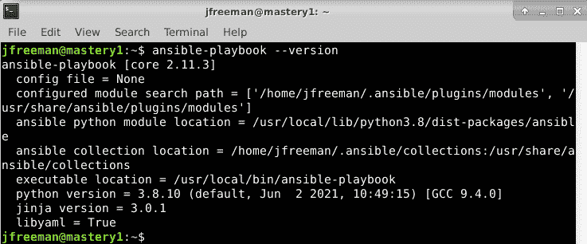

图 1.1 - 一个示例输出，显示了 Linux 系统上安装的 Ansible 版本

重要提示

请注意，`ansible`是用于执行临时单个任务的可执行文件，而`ansible-playbook`是用于处理 playbook 以编排多个任务的可执行文件。我们将在本书的后面介绍临时任务和 playbook 的概念。

Ansible 的配置可以存在于几个不同的位置，将使用找到的第一个文件。搜索涉及以下内容：

+   `ANSIBLE_CFG`：如果设置了此环境变量，则会使用它。

+   `ansible.cfg`：这位于当前工作目录中。

+   `~/.ansible.cfg`：这位于用户的主目录中。

+   `/etc/ansible/ansible.cfg`：系统的默认中央 Ansible 配置文件。

某些安装方法可能包括将`config`文件放置在其中一个位置。查看一下是否存在这样的文件，并查看文件中的设置，以了解 Ansible 操作可能会受到影响的情况。本书假设`ansible.cfg`文件中没有设置会影响 Ansible 的默认操作。

# 清单解析和数据源

在 Ansible 中，没有清单就不会发生任何事情。即使在本地主机上执行的临时操作也需要清单-尽管该清单可能只包括本地主机。清单是 Ansible 架构的最基本构建块。在执行`ansible`或`ansible-playbook`时，必须引用清单。清单是存在于运行`ansible`或`ansible-playbook`的同一系统上的文件或目录。清单的位置可以在运行时使用`--inventory-file (-i)`参数或通过在 Ansible `config`文件中定义路径来定义。

清单可以是静态的或动态的，甚至可以是两者的组合，Ansible 不限于单个清单。标准做法是将清单分割成逻辑边界，例如暂存和生产，允许工程师对暂存环境运行一组操作，然后跟随着对生产清单集运行相同的操作。

可以包括变量数据，例如如何连接到清单中特定主机的具体细节，以及以各种方式包含清单，我们将探讨可用的选项。

## 静态清单

静态清单是所有清单选项中最基本的。通常，静态清单将包含一个`ini`格式的单个文件。还支持其他格式，包括 YAML，但您会发现当大多数人开始使用 Ansible 时，通常会使用`ini`。以下是描述单个主机`mastery.example.name`的静态清单文件的示例：

```
mastery.example.name 
```

就是这样。只需列出清单中系统的名称。当然，这并没有充分利用清单所提供的所有功能。如果每个名称都像这样列出，所有操作都必须引用特定的主机名，或者特殊的内置`all`组（顾名思义，包含清单中的所有主机）。在开发跨您的基础设施中的不同环境的 playbook 时，这可能会非常繁琐。至少，主机应该被分组。

一个很好的设计模式是根据预期功能将系统分组。起初，如果您的环境中单个系统可以扮演许多不同的角色，这可能看起来很困难，但这完全没问题。清单中的系统可以存在于多个组中，甚至组中还可以包含其他组！此外，在列出组和主机时，可以列出没有组的主机。这些主机必须在定义任何其他组之前列出。让我们在之前的示例基础上扩展我们的清单，增加一些更多的主机和分组，如下所示：

```
[web] 
mastery.example.name 

[dns] 
backend.example.name 

[database] 
backend.example.name 

[frontend:children] 
web 

[backend:children] 
dns 
database 
```

在这里，我们创建了一个包含一个系统的三个组，然后又创建了两个逻辑上将所有三个组合在一起的组。是的，没错：您可以有组的组。这里使用的语法是`[groupname:children]`，这表明给 Ansible 的清单解析器，名为`groupname`的这个组只是其他组的分组。

在这种情况下，`children`是其他组的名称。这个清单现在允许针对特定主机、低级别的角色特定组或高级别的逻辑分组编写操作，或者两者的任意组合。

通过使用通用的组名，比如`dns`和`database`，Ansible play 可以引用这些通用组，而不是明确的主机。工程师可以创建一个清单文件，用预生产阶段环境中的主机填充这些组，另一个清单文件用于生产环境中这些组的版本。当在预生产或生产环境中执行时，playbook 的内容不需要更改，因为它引用了存在于两个清单中的通用组名。只需引用正确的清单以在所需的环境中执行它。

## 清单排序

在 Ansible 2.4 版本中，添加了一个新的 play-level 关键字`order`。在此之前，Ansible 按照清单文件中指定的顺序处理主机，并且即使在更新的版本中，默认情况下仍然如此。但是，可以为给定的 play 设置`order`关键字的以下值，从而得到主机的处理顺序，如下所述：

+   `inventory`：这是默认选项。它只是意味着 Ansible 会像以往一样进行处理，按照`inventory`文件中指定的顺序处理主机。

+   `reverse_inventory`：这导致主机按照`inventory`文件中指定的相反顺序进行处理。

+   `sorted`：按名称按字母顺序处理主机。

+   `reverse_sorted`：按照字母顺序的相反顺序处理主机。

+   `shuffle`：主机以随机顺序处理，每次运行都会随机排序。

在 Ansible 中，使用的字母排序也称为词典排序。简单地说，这意味着值按字符串排序，字符串从左到右处理。因此，假设我们有三个主机：`mastery1`，`mastery11`和`mastery2`。在这个列表中，`mastery1`首先出现在字符位置`8`是`1`。然后是`mastery11`，因为位置`8`的字符仍然是`1`，但现在在位置`9`有一个额外的字符。最后是`mastery2`，因为字符`8`是`2`，而`2`在`1`之后。这很重要，因为从数字上来看，我们知道`11`大于`2`。但是，在这个列表中，`mastery11`在`mastery2`之前。您可以通过在主机名上添加前导零来轻松解决这个问题；例如，`mastery01`，`mastery02`和`mastery11`将按照它们在这个句子中列出的顺序进行处理，解决了词典排序的问题。

## 清单变量数据

清单不仅提供系统名称和分组，还可以传递有关系统的数据。这些数据可能包括以下内容：

+   用于在模板中使用的特定于主机的数据

+   用于任务参数或条件的特定于组的数据

+   调整 Ansible 与系统交互的行为参数

变量是 Ansible 中强大的构造，可以以各种方式使用，不仅仅是这里描述的方式。在 Ansible 中几乎可以包括变量引用的每一件事。虽然 Ansible 可以在设置阶段发现有关系统的数据，但并非所有数据都可以被发现。使用清单定义数据可以扩展这一点。请注意，变量数据可以来自许多不同的来源，一个来源可能会覆盖另一个。我们将在本章后面介绍变量优先级的顺序。

让我们改进现有的示例清单，并向其中添加一些变量数据。我们将添加一些特定于主机和特定于组的数据：

```
[web] 
mastery.example.name ansible_host=192.168.10.25 

[dns] 
backend.example.name 

[database] 
backend.example.name 

[frontend:children] 
web 

[backend:children] 
dns 
database 

[web:vars] 
http_port=88 
proxy_timeout=5 

[backend:vars] 
ansible_port=314 

[all:vars] 
ansible_ssh_user=otto 
```

在这个例子中，我们将`mastery.example.name`的`ansible_host`定义为`192.168.10.25`的 IP 地址。`ansible_host`变量是一个**行为清单变量**，旨在改变 Ansible 在与此主机操作时的行为方式。在这种情况下，该变量指示 Ansible 使用提供的 IP 地址连接到系统，而不是使用`mastery.example.name`进行名称的 DNS 查找。在本节的末尾列出了许多其他行为清单变量，以及它们的预期用途。

我们的新清单数据还为 web 和 backend 组提供了组级变量。web 组定义了`http_port`，可以在**NGINX**配置文件中使用，并且`proxy_timeout`，可能用于确定**HAProxy**的行为。backend 组利用了另一个行为清单参数，指示 Ansible 使用端口`314`连接到此组中的主机，而不是默认的`22`。

最后，引入了一个构造，通过使用内置的`all`组在清单中的所有主机之间提供变量数据。在这个特定的例子中，我们指示 Ansible 在连接到系统时以`otto`用户登录。这也是一个行为变化，因为 Ansible 的默认行为是以在控制主机上执行`ansible`或`ansible-playbook`的用户相同的用户名登录。

以下是行为清单变量及其意图修改的行为的列表：

+   `ansible_host`：这是 Ansible 将要连接的 DNS 名称或 Docker 容器名称。

+   `ansible_port`：这指定了 Ansible 将用于连接清单主机的端口号，如果不是默认值`22`。

+   `ansible_user`：这指定了 Ansible 将用于与清单主机连接的用户名，无论连接类型如何。

+   `ansible_password`：这用于为认证到清单主机提供密码给 Ansible，与`ansible_user`一起使用。仅用于测试目的 - 您应该始终使用保险库来存储诸如密码之类的敏感数据（请参阅*第三章*，*使用 Ansible 保护您的秘密*）。

+   `ansible_ssh_private_key_file`：这用于指定将用于连接到清单主机的 SSH 私钥文件，如果您没有使用默认值或`ssh-agent`。

+   `ansible_ssh_common_args`：这定义了要附加到`ssh`、`sftp`和`scp`的默认参数的 SSH 参数。

+   `ansible_sftp_extra_args`：这用于指定在 Ansible 调用时将传递给`sftp`二进制文件的附加参数。

+   `ansible_scp_extra_args`：这用于指定在 Ansible 调用时将传递给`scp`二进制文件的附加参数。

+   `ansible_ssh_extra_args`：这用于指定在 Ansible 调用时将传递给`ssh`二进制文件的附加参数。

+   `ansible_ssh_pipelining`：此设置使用布尔值来定义是否应该为此主机使用 SSH 流水线。

+   `ansible_ssh_executable`：此设置覆盖了此主机的 SSH 可执行文件的路径。

+   `ansible_become`：这定义了是否应该在此主机上使用特权升级（`sudo`或其他）。

+   `ansible_become_method`：这是用于特权升级的方法，可以是`sudo`、`su`、`pbrun`、`pfexec`、`doas`、`dzdo`或`ksu`之一。

+   `ansible_become_user`：这是通过特权升级要切换到的用户，通常在 Linux 和 Unix 系统上是 root。

+   `ansible_become_password`：这是用于特权升级的密码。仅用于测试目的；您应该始终使用保险库来存储诸如密码之类的敏感数据（请参阅*第三章*，*使用 Ansible 保护您的秘密*）。

+   `ansible_become_exe`：这用于设置所选升级方法的可执行文件，如果您没有使用系统定义的默认方法。

+   `ansible_become_flags`：这用于设置传递给所选升级可执行文件的标志（如果需要）。

+   `ansible_connection`：这是主机的连接类型。候选项包括`local`、`smart`、`ssh`、`paramiko`、`docker`或`winrm`（我们将在本书的后面更详细地讨论这个）。在任何现代 Ansible 发行版中，默认设置为`smart`（这会检测是否支持`ControlPersist` SSH 功能，如果支持，则使用`ssh`作为连接类型；否则，它会回退到`paramiko`）。

+   `ansible_docker_extra_args`：这用于指定将传递给给定清单主机上的远程 Docker 守护程序的额外参数。

+   `ansible_shell_type`：这用于确定问题清单主机的 shell 类型。默认为`sh`风格的语法，但可以设置为`csh`或`fish`以适用于使用这些 shell 的系统。

+   `ansible_shell_executable`：这用于确定问题清单主机的 shell 类型。默认为`sh`风格的语法，但可以设置为`csh`或`fish`以适用于使用这些 shell 的系统。

+   `ansible_python_interpreter`：这用于手动设置清单中给定主机上 Python 的路径。例如，某些 Linux 发行版安装了多个 Python 版本，确保设置正确的版本非常重要。例如，主机可能同时拥有`/usr/bin/python27`和`/usr/bin/python3`，这用于定义将使用哪个版本。

+   `ansible_*_interpreter`：这用于 Ansible 可能依赖的任何其他解释语言（例如 Perl 或 Ruby）。这将用指定的解释器二进制替换解释器二进制。

## 动态清单

静态清单非常好，对许多情况可能足够。然而，有时静态编写的主机集合管理起来太过繁琐。考虑清单数据已经存在于不同系统中的情况，例如 LDAP、云计算提供商或内部配置管理数据库（清单、资产跟踪和数据仓库）系统。复制这些数据将是浪费时间和精力，在按需基础设施的现代世界中，这些数据很快就会变得陈旧或变得灾难性不正确。

当您的站点超出单一剧本集的范围时，可能需要动态清单源的另一个例子。多个剧本存储库可能会陷入持有相同清单数据的多个副本，或者必须创建复杂的流程来引用数据的单个副本。可以轻松利用外部清单来访问存储在剧本存储库之外的常见清单数据，以简化设置。幸运的是，Ansible 不仅限于静态清单文件。

动态清单源（或插件）是 Ansible 在运行时调用的可执行文件，用于发现实时清单数据。这个可执行文件可以访问外部数据源并返回数据，或者它可以只解析已经存在但可能不符合`ini/yaml` Ansible 清单格式的本地数据。虽然可能并且很容易开发自己的动态清单源，我们将在后面的章节中介绍，但 Ansible 提供了越来越多的示例清单插件。这包括但不限于以下内容：

+   OpenStack Nova

+   Rackspace Public Cloud

+   DigitalOcean

+   Linode

+   Amazon EC2

+   Google Compute Engine

+   Microsoft Azure

+   Docker

+   Vagrant

许多这些插件都需要一定程度的配置，比如 EC2 的用户凭据或者**OpenStack Nova**的认证端点。由于无法为 Ansible 配置额外的参数以传递给清单脚本，因此脚本的配置必须通过从已知位置读取的`ini`配置文件或者从用于执行`ansible`或`ansible-playbook`的 shell 环境中读取的环境变量来管理。另外，请注意，有时这些清单脚本需要外部库才能正常运行。

当`ansible`或`ansible-playbook`指向清单源的可执行文件时，Ansible 将使用单个参数`--list`执行该脚本。这样，Ansible 可以获取整个清单的列表，以便构建其内部对象来表示数据。一旦数据构建完成，Ansible 将使用不同的参数执行脚本，以发现每个主机的变量数据。在此执行中使用的参数是`--host <hostname>`，它将返回特定于该主机的任何变量数据。

清单插件的数量太多，我们无法在本书中详细介绍每一个。然而，设置和使用几乎所有这些插件都需要类似的过程。因此，为了演示该过程，我们将介绍如何使用 EC2 动态清单。

许多动态清单插件都作为`community.general`集合的一部分安装，默认情况下，当您安装 Ansible 4.0.0 时会安装该集合。尽管如此，使用任何动态清单插件的第一步是找出插件属于哪个集合，并在必要时安装该集合。EC2 动态清单插件作为`amazon.aws`集合的一部分安装。因此，您的第一步将是安装此集合-您可以使用以下命令完成：

```
ansible-galaxy collection install amazon.aws
```

如果一切顺利，您应该在终端上看到与*图 1.2*中类似的输出。

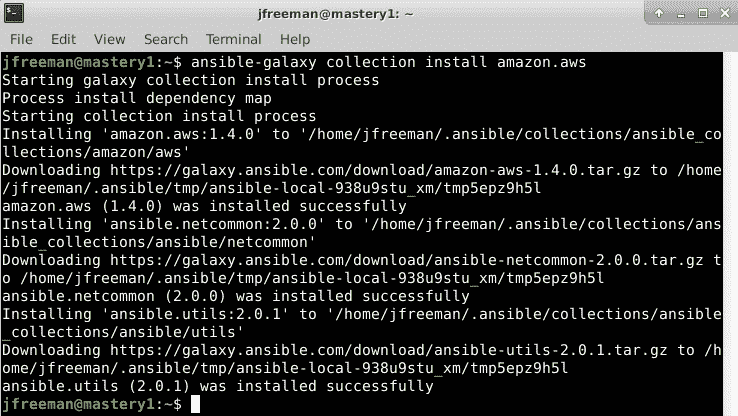

图 1.2 - 使用 ansible-galaxy 安装 amazon.aws 集合的安装

每当您安装新的插件或集合时，都建议阅读附带的文档，因为一些动态清单插件需要额外的库或工具才能正常运行。例如，如果您参考[`docs.ansible.com/ansible/latest/collections/amazon/aws/aws_ec2_inventory.html`](https://docs.ansible.com/ansible/latest/collections/amazon/aws/aws_ec2_inventory.html)中`aws_ec2`插件的文档，您将看到该插件需要`boto3`和`botocore`库才能运行。安装这些库将取决于您的操作系统和 Python 环境。然而，在 Ubuntu Server 20.04（以及其他 Debian 变体）上，可以使用以下命令完成：

```
sudo apt install python3-boto3 python3-botocore
```

以下是上述命令的输出：

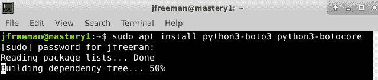

图 1.3 - 为 EC2 动态清单脚本安装 Python 依赖项

现在，查看插件的文档（通常情况下，您还可以通过查看代码和任何附带的配置文件来找到有用的提示），您会注意到我们需要以某种方式向此脚本提供我们的 AWS 凭据。有几种可能的方法可以做到这一点-一个例子是使用`awscli`工具（如果已安装）来定义配置，然后从您的清单中引用此配置文件。例如，我使用以下命令配置了我的默认 AWS CLI 配置文件：

```
aws configure
```

输出将类似于以下屏幕截图（出于明显原因，已删除了安全细节！）：

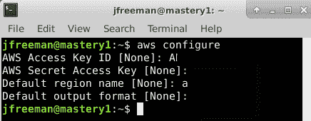

图 1.4 - 使用 AWS CLI 实用程序配置 AWS 凭据

完成这些操作后，我们现在可以创建我们的清单定义，告诉 Ansible 使用哪个插件，并向其传递适当的参数。在我们的示例中，我们只需要告诉插件使用我们之前创建的默认配置文件。创建一个名为`mastery_aws_ec2.yml`的文件，其中包含以下内容：

```
---
plugin: amazon.aws.aws_ec2
boto_profile: default
```

最后，我们将通过使用`-graph`参数将我们的新清单插件配置传递给`ansible-inventory`命令来测试它：

```
ansible-inventory -i mastery_aws_ec2.yml –-graph
```

假设您在 AWS EC2 中运行了一些实例，您将看到类似以下的输出：

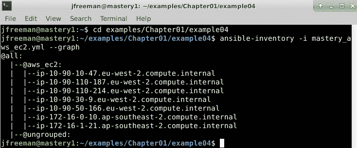

图 1.5 - 动态清单插件的示例输出

哇！我们有我们当前 AWS 清单的列表，以及插件执行的自动分组的一瞥。如果您想进一步了解插件的功能，并查看每个主机分配的所有清单变量（其中包含有用的信息，包括实例类型和大小），请尝试将`-list`参数传递给`ansible-inventory`，而不是`-graph`。

有了 AWS 清单，您可以立即使用它来针对这个动态清单运行单个任务或整个 playbook。例如，要使用`ansible.builtin.ping`模块检查 Ansible 对清单中所有主机的身份验证和连接性，您可以运行以下命令：

```
ansible -i mastery_aws_ec2.yml all -m ansible.builtin.ping
```

当然，这只是一个例子。然而，如果您对其他动态清单提供程序遵循这个过程，您应该能够轻松地使它们工作。

在*第十章*，*扩展 Ansible*中，我们将开发自己的自定义清单插件，以演示它们的操作方式。

## 运行时清单添加

就像静态清单文件一样，重要的是要记住，Ansible 将在每次`ansible`或`ansible-playbook`执行时解析这些数据一次，而且只有一次。这对于云动态源的用户来说是一个相当常见的绊脚石，经常会出现 playbook 创建新的云资源，然后尝试将其用作清单的一部分。这将失败，因为在 playbook 启动时，该资源不是清单的一部分。然而，一切并非都已经丧失！提供了一个特殊的模块，允许 playbook 临时将清单添加到内存中的清单对象，即`ansible.builtin.add_host`模块。

该模块有两个选项：`name`和`groups`。`name`选项应该很明显；它定义了 Ansible 在连接到这个特定系统时将使用的主机名。`groups`选项是一个逗号分隔的组列表，您可以将其添加到这个新系统中。传递给该模块的任何其他选项都将成为该主机的主机变量数据。例如，如果我们想要添加一个新系统，命名为`newmastery.example.name`，将其添加到`web`组，并指示 Ansible 通过 IP 地址`192.168.10.30`连接到它。这将创建一个类似以下的任务：

```
- name: add new node into runtime inventory 
  ansible.builtin.add_host: 
    name: newmastery.example.name 
    groups: web 
    ansible_host: 192.168.10.30 
```

这个新主机将可供使用 - 无论是通过提供的名称还是通过`web`组 - 用于`ansible-playbook`执行的其余部分。然而，一旦执行完成，除非它已被添加到清单源本身，否则该主机将不可用。当然，如果这是一个新创建的云资源，下一个从该云源获取动态清单的`ansible`或`ansible-playbook`执行将会捕获到新的成员。

## 清单限制

如前所述，每次执行`ansible`或`ansible-playbook`都将解析其所提供的整个清单。即使应用了限制，这也是真实的。简单地说，通过使用`--limit`运行时参数来运行`ansible`或`ansible-playbook`来在运行时应用限制。该参数接受一个模式，本质上是应用于清单的掩码。整个清单被解析，每次 play 时，所提供的限制掩码都限制了 play 只针对已指定的模式运行。

让我们以前的清单示例，并演示有限制和无限制时 Ansible 的行为。如果您还记得，我们有一个特殊的组`all`，我们可以用它来引用清单中的所有主机。假设我们的清单写在当前工作目录中，文件名为`mastery-hosts`，我们将构建一个 playbook 来演示 Ansible 正在操作的主机。让我们将这个 playbook 写成`mastery.yaml`：

```
--- 
- name: limit example play 
  hosts: all
  gather_facts: false 

  tasks: 
    - name: tell us which host we are on 
      ansible.builtin.debug: 
        var: inventory_hostname 
```

`ansible.builtin.debug`模块用于打印文本或变量的值。在本书中，我们将经常使用这个模块来模拟在主机上实际执行的工作。

现在，让我们执行这个简单的 playbook，而不提供限制。为了简单起见，我们将指示 Ansible 使用本地连接方法，这将在本地执行，而不是尝试 SSH 到这些不存在的主机。运行以下命令：

```
ansible-playbook -i mastery-hosts -c local mastery.yaml
```

输出应该与*图 1.6*类似：

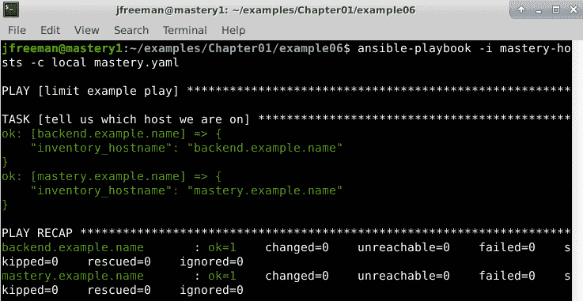

图 1.6 - 在未应用限制的清单上运行简单的 playbook

如您所见，`backend.example.name`和`mastery.example.name`主机都被操作了。现在，让我们看看如果我们提供一个限制会发生什么，也就是说，通过运行以下命令来限制我们的运行只针对前端系统：

```
ansible-playbook -i mastery-hosts -c local mastery.yaml --limit frontend
```

这一次，输出应该与*图 1.7*类似：

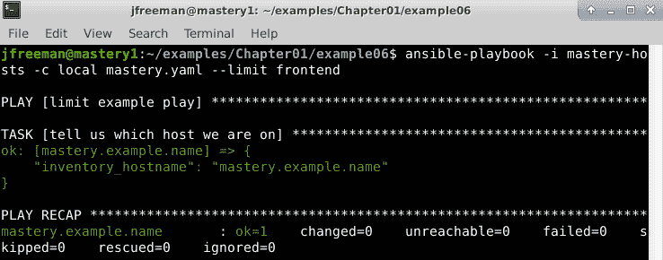

图 1.7 - 在应用了限制的清单上运行简单的 playbook

在这里，我们可以看到这次只有`mastery.example.name`被操作了。虽然没有视觉线索表明整个清单已被解析，但如果我们深入研究 Ansible 代码并检查清单对象，我们确实会发现其中的所有主机。此外，我们将看到每次查询对象时限制是如何应用的。

重要的是要记住，无论在 play 中使用的主机模式，还是在运行时提供的限制，Ansible 都会在每次运行时解析整个清单。事实上，我们可以通过尝试访问`backend.example.name`的`ansible_port`变量数据来证明这一点，这个系统在其他情况下会被我们的限制掩盖。让我们稍微扩展一下我们的 playbook，并尝试访问`backend.example.name`的`ansible_port`变量：

```
--- 
- name: limit example play 
  hosts: all 
  gather_facts: false 

  tasks: 
    - name: tell us which host we are on 
      ansible.builtin.debug: 
        var: inventory_hostname 

    - name: grab variable data from backend 
      ansible.builtin.debug: 
        var: hostvars['backend.example.name']['ansible_port'] 
```

我们仍然会通过与上一次运行相同的命令来应用我们的限制，这将限制我们的操作仅限于`mastery.example.name`：

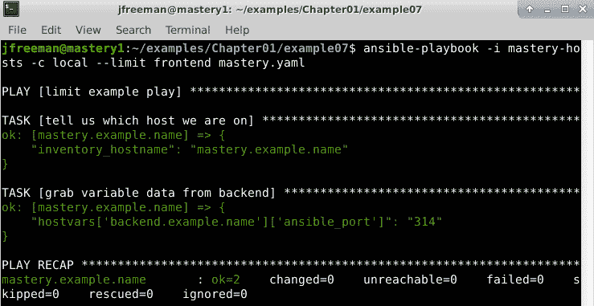

图 1.8 - 演示即使应用了限制，整个清单仍然被解析

我们已成功访问了主机变量数据（通过组变量）的系统，否则会被限制。这是一个重要的技能，因为它允许更高级的场景，比如将任务指向一个被限制的主机。此外，可以使用委托来操纵负载均衡器；这将在升级系统时将系统置于维护模式，而无需将负载均衡器系统包含在限制掩码中。

# playbook 解析

清单来源的整个目的是有系统可以操作。操作来自 playbook（或者，在 Ansible 即席执行的情况下，简单的单任务 play）。您应该已经对 playbook 的构建有基本的了解，因此我们不会花太多时间来介绍；但是，我们将深入探讨 playbook 的解析方式的一些具体细节。具体来说，我们将涵盖以下内容：

+   操作顺序

+   相对路径假设

+   播放行为键

+   为 play 和任务选择主机

+   播放和任务名称

## 操作顺序

Ansible 旨在尽可能地让人类理解。开发人员努力在人类理解和机器效率之间取得最佳平衡。为此，几乎可以假定 Ansible 中的所有操作都是按自上而下的顺序执行的；也就是说，文件顶部列出的操作将在文件底部列出的操作之前完成。话虽如此，还有一些注意事项，甚至有一些影响操作顺序的方法。

playbook 只有两个主要操作可以完成。它可以运行一个 play，或者它可以从文件系统的某个地方包含另一个 playbook。这些操作的完成顺序只是它们在 playbook 文件中出现的顺序，从上到下。重要的是要注意，虽然操作是按顺序执行的，但在任何执行之前整个 playbook 和任何包含的 playbook 都会被完全解析。这意味着任何包含的 playbook 文件必须在 playbook 解析时存在-它们不能在较早的操作中生成。这是特定于 playbook 包含的，但不一定适用于可能出现在 play 中的任务包含，这将在后面的章节中介绍。

在 play 中，还有一些更多的操作。虽然 playbook 严格按照自上而下的顺序排列，但 play 具有更细致的操作顺序。以下是可能的操作列表以及它们将发生的顺序：

+   变量加载

+   事实收集

+   `pre_tasks`执行

+   从`pre_tasks`执行通知的处理程序

+   角色执行

+   任务执行

+   从角色或任务执行通知的处理程序

+   `post_tasks`执行

+   从`post_tasks`执行通知的处理程序

以下是一个示例 play，其中显示了大部分这些操作：

```
--- 
- hosts: localhost 
  gather_facts: false 

  vars: 
    - a_var: derp 

  pre_tasks: 
    - name: pretask 
      debug: 
        msg: "a pre task" 
      changed_when: true 
      notify: say hi 

  roles: 
    - role: simple 
      derp: newval 

  tasks: 
    - name: task 
      debug: 
        msg: "a task" 
      changed_when: true 
      notify: say hi

  post_tasks: 
    - name: posttask 
      debug: 
        msg: "a post task" 
      changed_when: true 
      notify: say hi 
  handlers:
    - name: say hi
      debug:
        msg: hi
```

无论这些块在剧本中列出的顺序如何，前面代码块中详细说明的顺序就是它们将被处理的顺序。处理程序（即可以由其他任务触发并导致更改的任务）是一个特殊情况。有一个实用模块`ansible.builtin.meta`，可以用来在特定点触发处理程序的处理：

```
- ansible.builtin.meta: flush_handlers 
```

这将指示 Ansible 在继续下一个任务或播放中的下一个操作块之前，在那一点处理任何待处理的处理程序。了解顺序并能够通过`flush_handlers`影响顺序是在需要编排复杂操作时必须具备的另一个关键技能；例如，诸如服务重启对顺序非常敏感的情况。考虑服务的初始部署。

play 将有修改`config`文件并指示应该在这些文件更改时重新启动服务的任务。play 还将指示服务应该在运行。第一次发生这个 play 时，`config`文件将更改，并且服务将从未运行变为运行。然后，处理程序将触发，这将导致服务立即重新启动。这可能会对服务的任何使用者造成干扰。最好在最后一个任务之前刷新处理程序，以确保服务正在运行。这样，重新启动将在初始启动之前发生，因此服务将启动一次并保持运行。

## 相对路径假设

当 Ansible 解析一个 playbook 时，可以对 playbook 中的语句引用的项目的相对路径做出一些假设。在大多数情况下，诸如要包含的变量文件、要包含的任务文件、要包含的 playbook 文件、要复制的文件、要渲染的模板和要执行的脚本等的路径都是相对于引用它们的文件所在的目录的。让我们通过一个示例 playbook 和目录列表来探讨这一点，以演示文件的位置：

+   目录结构如下：

```
. 
├── a_vars_file.yaml 
├── mastery-hosts 
├── relative.yaml 
└── tasks 
├── a.yaml 
└── b.yaml 
```

+   `a_vars_file.yaml`的内容如下：

```
--- 
something: "better than nothing" 
```

+   `relative.yaml`的内容如下：

```
--- 
- name: relative path play 
hosts: localhost 
gather_facts: false 

vars_files: 
    - a_vars_file.yaml

tasks: 
- name: who am I 
ansible.builtin.debug: 
msg: "I am mastery task" 
- name: var from file 
      ansible.builtin.debug:         
var: something 

- ansible.builtin.include: tasks/a.yaml 
```

+   `tasks/a.yaml`的内容如下：

```
--- 
- name: where am I 
ansible.builtin.debug: 
msg: "I am task a" 

- ansible.builtin.include: b.yaml 
```

+   `tasks/b.yaml`的内容如下：

```
---
- name: who am I
  ansible.builtin.debug:
msg: "I am task b" 
```

使用以下命令执行 playbook：

```
ansible-playbook -i mastery-hosts -c local relative.yaml
```

输出应类似于*图 1.9*：

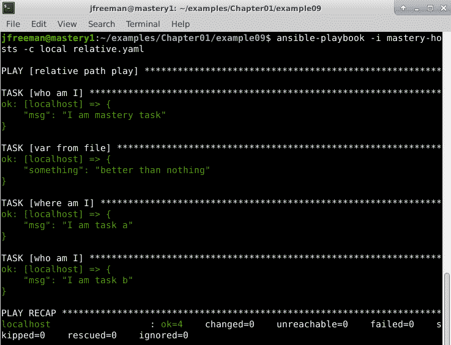

图 1.9 - 运行利用相对路径的 playbook 的预期输出

在这里，我们可以清楚地看到对路径的相对引用以及它们相对于引用它们的文件的位置。在使用角色时，还有一些额外的相对路径假设；然而，我们将在后面的章节中详细介绍。

## Play 行为指令

当 Ansible 解析一个 play 时，它会寻找一些指令，以定义 play 的各种行为。这些指令与`hosts:`指令在同一级别编写。以下是一些在 playbook 的这一部分中可以定义的一些更常用键的描述列表：

+   `any_errors_fatal`：这是一个布尔指令，用于指示 Ansible 将任何失败都视为致命错误，以防止尝试进一步的任务。这会改变默认行为，其中 Ansible 将继续执行，直到所有任务完成或所有主机失败。

+   `connection`：这个字符串指令定义了在给定 play 中使用哪种连接系统。在这里做出的一个常见选择是`local`，它指示 Ansible 在本地执行所有操作，但使用清单中系统的上下文。

+   `collections`：这是在 play 中用于搜索模块、插件和角色的集合命名空间列表，可以用来避免输入**完全限定的集合名称**（**FQCNs**）的需要 - 我们将在*第二章*中了解更多，*从早期 Ansible 版本迁移*。请注意，这个值不会被角色任务继承，因此您必须在`meta/main.yml`文件中为每个角色单独设置它。

+   `gather_facts`：这个布尔指令控制 Ansible 是否执行操作的事实收集阶段，其中一个特殊任务将在主机上运行，以揭示关于系统的各种事实。跳过事实收集 - 当您确定不需要任何已发现的数据时 - 可以在大型环境中节省大量时间。

+   `Max_fail_percentage`：这个数字指令类似于`any_errors_fatal`，但更加细致。它允许您定义在整个操作被停止之前，您的主机可以失败的百分比。

+   `no_log`：这是一个布尔指令，用于控制 Ansible 是否记录（到屏幕和/或配置的`log`文件）给定的命令或从任务接收的结果。如果您的任务或返回涉及机密信息，这一点非常重要。这个键也可以直接应用于一个任务。

+   `port`：这是一个数字指令，用于定义连接时应使用的 SSH 端口（或任何其他远程连接插件），除非这已经在清单数据中配置。

+   `remote_user`：这是一个字符串指令，定义了在远程系统上使用哪个用户登录。默认设置是以与启动`ansible-playbook`的相同用户连接。

+   `serial`：此指令接受一个数字，并控制在移动到播放中的下一个任务之前，Ansible 将在多少个系统上执行任务。这与正常操作顺序有很大的改变，在正常操作顺序中，任务在移动到下一个任务之前会在播放中的每个系统上执行。这在滚动更新场景中非常有用，我们将在后面的章节中讨论。

+   `become`：这是一个布尔指令，用于配置是否应在远程主机上使用特权升级（`sudo`或其他内容）来执行任务。此键也可以在任务级别定义。相关指令包括`become_user`、`become_method`和`become_flags`。这些可以用于配置升级的方式。

+   `strategy`：此指令设置用于播放的执行策略。

本书中的示例 playbooks 将使用许多这些键。

有关可用播放指令的完整列表，请参阅[`docs.ansible.com/ansible/latest/reference_appendices/playbooks_keywords.html#play`](https://docs.ansible.com/ansible/latest/reference_appendices/playbooks_keywords.html#play)上的在线文档。

## 执行策略

随着 Ansible 2.0 的发布，引入了一种控制播放执行行为的新方法：*strategy*。策略定义了 Ansible 如何在一组主机上协调每个任务。每个策略都是一个插件，Ansible 带有三种策略：linear、debug 和 free。线性策略是默认策略，这是 Ansible 一直以来的行为方式。在执行播放时，给定播放的所有主机执行第一个任务。

一旦它们全部完成，Ansible 就会移动到下一个任务。串行指令可以创建批处理主机以这种方式操作，但基本策略保持不变。在执行下一个任务之前，给定批次的所有目标都必须完成一个任务。调试策略使用了前面描述的相同的线性执行模式，只是这里，任务是在交互式调试会话中运行，而不是在没有任何用户干预的情况下运行到完成。这在测试和开发复杂和/或长时间运行的自动化代码时特别有价值，您需要分析 Ansible 代码运行时的行为，而不仅仅是运行它并希望一切顺利！

自由策略打破了这种传统的线性行为。使用自由策略时，一旦主机完成一个任务，Ansible 将立即为该主机执行下一个任务，而不必等待其他主机完成。

这将发生在集合中的每个主机和播放中的每个任务。每个主机将尽可能快地完成任务，从而最大限度地减少每个特定主机的执行时间。虽然大多数 playbooks 将使用默认的线性策略，但也有一些情况下，自由策略会更有优势；例如，在跨大量主机升级服务时。如果播放需要执行大量任务来执行升级，从关闭服务开始，那么每个主机尽可能少地遭受停机时间就更为重要。

允许每个主机独立地尽快地通过播放，将确保每个主机只在必要的时间内停机。如果不使用自由策略，整个集合将会在集合中最慢的主机完成任务所需的时间内停机。

由于自由策略不协调主机之间的任务完成，因此不可能依赖在一个主机上生成的数据在另一个主机上的后续任务中可用。不能保证第一个主机已经完成生成数据的任务。

执行策略被实现为一个插件，因此任何希望为项目做出贡献的人都可以开发自定义策略来扩展 Ansible 的行为。

## 播放和任务的主机选择

大多数播放定义的第一件事（当然是名称之后）是播放的主机模式。这是用于从清单对象中选择主机以运行任务的模式。一般来说，这很简单；主机模式包含一个或多个块，指示主机、组、通配符模式或**正则表达式**（**regex**）用于选择。块之间用冒号分隔，通配符只是一个星号，正则表达式模式以波浪号开头：

```
hostname:groupname:*.example:~(web|db)\.example\.com 
```

高级用法可以包括组索引选择，甚至是组内的范围：

```
webservers[0]:webservers[2:4] 
```

每个块都被视为包含块；也就是说，找到在第一个模式中的所有主机都被添加到在下一个模式中找到的所有主机中，依此类推。但是，可以使用控制字符来改变它们的行为。使用和符号定义了基于包含的选择（存在于两个模式中的所有主机）。

感叹号的使用定义了一个基于排除的选择（存在于先前模式中的所有主机，但不在排除模式中）：

+   `webservers:&dbservers`：主机必须同时存在于`webservers`和`dbservers`组中。

+   `webservers:!dbservers`：主机必须存在于`webservers`组中，但不能存在于`dbservers`组中。

一旦 Ansible 解析模式，它将根据需要应用限制。限制以限制或失败的主机的形式出现。此结果将存储在播放的持续时间内，并且可以通过`play_hosts`变量访问。在执行每个任务时，将咨询此数据，并且可能会对其施加额外的限制以处理串行操作。当遇到故障时，无论是连接失败还是执行任务失败，故障主机都将被放置在限制列表中，以便在下一个任务中绕过该主机。

如果在任何时候，主机选择例程被限制为零个主机，播放执行将停止并显示错误。这里的一个警告是，如果播放配置为具有`max_fail_precentage`或`any_errors_fatal`参数，那么在满足此条件的任务之后，播放簿执行将立即停止。

## 播放和任务名称

虽然不是严格必要的，但将您的播放和任务标记为名称是一个好习惯。这些名称将显示在`ansible-playbook`的命令行输出中，并且如果将`ansible-playbook`的输出定向到日志文件中，这些名称也将显示在日志文件中。任务名称在您想要指示`ansible-playbook`从特定任务开始并引用处理程序时也会派上用场。

在命名播放和任务时，有两个主要要考虑的点：

+   播放和任务的名称应该是唯一的。

+   小心可以在播放和任务名称中使用的变量类型。

通常，为播放和任务命名是一个最佳实践，可以帮助快速确定问题任务可能位于播放簿、角色、任务文件、处理程序等层次结构中的位置。当您首次编写一个小型的单片播放簿时，它们可能看起来并不重要。然而，随着您对 Ansible 的使用和信心的增长，您很快会为自己命名任务而感到高兴！当任务名称重复时，在通知处理程序或从特定任务开始时，唯一性更为重要。当任务名称重复时，Ansible 的行为可能是不确定的，或者至少是不明显的。

以唯一性为目标，许多播放作者将寻求使用变量来满足这一约束。这种策略可能效果很好，但作者需要注意引用的变量数据的来源。变量数据可以来自各种位置（我们将在本章后面介绍），并且分配给变量的值可以多次定义。为了播放和任务名称的缘故，重要的是要记住，只有那些在播放解析时间可以确定值的变量才会正确解析和呈现。如果引用的变量的数据是通过任务或其他操作发现的，那么变量字符串将显示为未解析的输出。让我们看一个利用变量来命名播放和任务的示例播放：

```
---
- name: play with a {{ var_name }}
  hosts: localhost
  gather_facts: false
  vars:
  - var_name: not-mastery
  tasks:
  - name: set a variable
    ansible.builtin.set_fact:
      task_var_name: "defined variable"
  - name: task with a {{ task_var_name }}
    ansible.builtin.debug:
      msg: "I am mastery task"
- name: second play with a {{ task_var_name }}
  hosts: localhost
  gather_facts: false
  tasks:
  - name: task with a {{ runtime_var_name }}
    ansible.builtin.debug:
      msg: "I am another mastery task" 
```

乍一看，您可能期望至少`var_name`和`task_var_name`能够正确呈现。我们可以清楚地看到`task_var_name`在使用之前被定义。然而，凭借我们的知识，即播放在执行之前会被完全解析，我们知道得更多。使用以下命令运行示例播放：

```
ansible-playbook -i mastery-hosts -c local names.yaml
```

输出应该看起来像*图 1.10*：

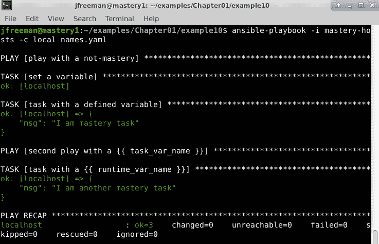

图 1.10 - 一个播放运行，显示在执行之前未定义变量时在任务名称中使用变量的效果

正如您在*图 1.10*中所看到的，唯一正确呈现的变量名称是`var_name`，因为它被定义为静态播放变量。

# 模块传输和执行

一旦播放被解析并确定了主机，Ansible 就准备执行一个任务。任务由名称（这是可选的，但仍然很重要，如前面提到的），模块引用，模块参数和任务控制指令组成。在 Ansible 2.9 及更早版本中，模块由单个唯一名称标识。然而，在 Ansible 2.10 及更高版本中，集合的出现（我们将在下一章中更详细地讨论）意味着 Ansible 模块名称现在可以是非唯一的。因此，那些有先前 Ansible 经验的人可能已经注意到，在本书中，我们使用`ansible.builtin.debug`而不是在 Ansible 2.9 及更早版本中使用的`debug`。在某些情况下，您仍然可以使用短形式的模块名称（如`debug`）；但是，请记住，具有自己名为`debug`的集合的存在可能会导致意想不到的结果。因此，Ansible 在其官方文档中的建议是尽快开始与长形式的模块名称交朋友 - 这些被官方称为 FQCNs。我们将在本书中使用它们，并将在下一章中更详细地解释所有这些。除此之外，后面的章节将详细介绍任务控制指令，因此我们只关注模块引用和参数。

## 模块引用

每个任务都有一个模块引用。这告诉 Ansible 要执行哪个工作。Ansible 被设计为可以轻松地允许自定义模块与播放一起存在。这些自定义模块可以是全新的功能，也可以替换 Ansible 自身提供的模块。当 Ansible 解析一个任务并发现要用于任务的模块的名称时，它会在一系列位置中查找所请求的模块。它查找的位置也取决于任务所在的位置，例如，是否在一个角色内部。

如果任务位于一个角色内，Ansible 首先会在任务所在的角色内部名为`library`的目录树中查找模块。如果在那里找不到模块，Ansible 会在与主要剧本（由`ansible-playbook`执行引用的剧本）相同级别的目录中查找名为`library`的目录。如果在那里找不到模块，Ansible 最终会在配置的库路径中查找，该路径默认为`/usr/share/ansible/`。可以在 Ansible 的`config`文件或通过`ANSIBLE_LIBRARY`环境变量中配置此库路径。

除了之前已经确定为 Ansible 几乎自问世以来的有效模块位置之外，Ansible 2.10 和更新版本的出现带来了*Collections*。Collections 现在是模块可以组织和与他人共享的关键方式之一。例如，在之前的示例中，我们查看了 Amazon EC2 动态清单插件，我们安装了一个名为`amazon.aws`的集合。在该示例中，我们只使用了动态清单插件；但是，安装集合实际上安装了一整套模块供我们用于自动化 Amazon EC2 上的任务。如果您运行了本书中提供的命令，该集合将安装在`~/.ansible/collections/ansible_collections/amazon/aws`中。如果您在那里查看，您将在`plugins/modules`子目录中找到模块。您安装的其他集合将位于类似的目录中，这些目录的名称是根据安装的集合命名的。

这种设计使模块能够与集合、角色和剧本捆绑在一起，可以快速轻松地添加功能或修复问题。

## 模块参数

模块的参数并非总是必需的；模块的帮助输出将指示哪些参数是必需的，哪些是可选的。模块文档可以通过`ansible-doc`命令访问，如下所示（在这里，我们将使用`debug`模块，这是我们已经用作示例的模块）：

```
ansible-doc ansible.builtin.debug
```

*图 1.11*显示了您可以从此命令中期望的输出类型：

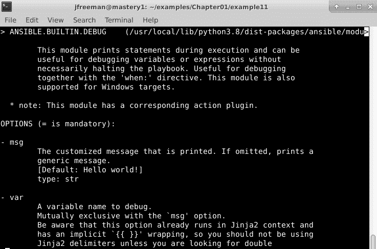

图 1.11 - 运行在 debug 模块上的 ansible-doc 命令的输出示例

如果您浏览输出，您将找到大量有用的信息，包括示例代码，模块的输出以及参数（即选项），如*图 1.11*所示。

参数可以使用**Jinja2**进行模板化，在模块执行时将被解析，允许在以后的任务中使用在先前任务中发现的数据；这是一个非常强大的设计元素。

参数可以以`key=value`格式或更符合 YAML 本机格式的复杂格式提供。以下是展示这两种格式的参数传递给模块的两个示例：

```
- name: add a keypair to nova 
  openstack.cloudkeypair: cloud={{ cloud_name }} name=admin-key wait=yes 

- name: add a keypair to nova 
  openstack.cloud.keypair:    
    cloud: "{{ cloud_name }}"     
    name: admin-key     
    wait: yes 
```

在这个例子中，这两种格式将导致相同的结果；但是，如果您希望将复杂参数传递给模块，则需要使用复杂格式。一些模块期望传递列表对象或数据的哈希；复杂格式允许这样做。虽然这两种格式对于许多任务都是可以接受的，但是复杂格式是本书中大多数示例使用的格式，因为尽管其名称如此，但实际上更容易阅读。

## 模块黑名单

从 Ansible 2.5 开始，系统管理员现在可以将他们不希望对剧本开发人员可用的 Ansible 模块列入黑名单。这可能是出于安全原因，为了保持一致性，甚至是为了避免使用已弃用的模块。

模块黑名单的位置由 Ansible 配置文件的`defaults`部分中找到的`plugin_filters_cfg`参数定义。默认情况下，它是禁用的，建议的默认值设置为`/etc/ansible/plugin_filters.yml`。

目前，该文件的格式非常简单。它包含一个版本头，以便将来更新文件格式，并列出要过滤掉的模块列表。例如，如果您准备过渡到 Ansible 4.0，当前使用的是 Ansible 2.7，您会注意到 `sf_account_manager` 模块将在 Ansible 4.0 中被完全移除。因此，您可能希望将其列入黑名单，以防止任何人在推出 Ansible 4.0 时创建会出错的代码（请参阅[`docs.ansible.com/ansible/devel/porting_guides/porting_guide_2.7.html`](https://docs.ansible.com/ansible/devel/porting_guides/porting_guide_2.7.html)）。因此，为了防止内部任何人使用这个模块，`plugin_filters.yml` 文件应该如下所示：

```
---
filter_version:'1.0'
module_blacklist:
  # Deprecated – to be removed in 4.0
  - sf_account_manager
```

尽管这个功能在帮助确保高质量的 Ansible 代码得到维护方面非常有用，但在撰写本文时，这个功能仅限于模块。它不能扩展到其他任何东西，比如角色。

## 传输和执行模块

一旦找到一个模块，Ansible 就必须以某种方式执行它。模块的传输和执行方式取决于一些因素；然而，通常的过程是在本地文件系统上定位模块文件并将其读入内存，然后添加传递给模块的参数。然后，在内存中的文件对象中添加来自 Ansible 核心的样板模块代码。这个集合被压缩、Base64 编码，然后包装在一个脚本中。接下来发生的事情取决于连接方法和运行时选项（例如将模块代码留在远程系统上供审查）。

默认的连接方法是 `smart`，通常解析为 `ssh` 连接方法。在默认配置下，Ansible 将打开一个 SSH 连接到远程主机，创建一个临时目录，然后关闭连接。然后，Ansible 将再次打开一个 SSH 连接，以便将内存中的包装 ZIP 文件（本地模块文件、任务模块参数和 Ansible 样板代码的结果）写入到我们刚刚创建的临时目录中的文件，并关闭连接。

最后，Ansible 将打开第三个连接，以执行脚本并删除临时目录及其所有内容。模块的结果以 JSON 格式从 `stdout` 中捕获，Ansible 将适当地解析和处理。如果任务有一个 `async` 控制，Ansible 将在模块完成之前关闭第三个连接，并在规定的时间内再次 SSH 到主机上，以检查任务的状态，直到模块完成或达到规定的超时时间。

### 任务性能

关于 Ansible 如何连接到主机的前面讨论导致每个任务对主机有三个连接。在一个任务数量较少的小环境中，这可能不是一个问题；然而，随着任务集的增长和环境规模的增长，创建和拆除 SSH 连接所需的时间也会增加。幸运的是，有几种方法可以缓解这种情况。

第一个是 SSH 功能 `ControlPersist`，它提供了一个机制，当首次连接到远程主机时创建持久套接字，可以在后续连接中重用，从而绕过创建连接时所需的一些握手。这可以大大减少 Ansible 打开新连接所花费的时间。如果运行 Ansible 的主机平台支持它，Ansible 会自动利用这个功能。要检查您的平台是否支持这个功能，请参考 SSH 的 `ControlPersist` 手册页。

可以利用的第二个性能增强功能是 Ansible 的一个特性，称为流水线。流水线适用于基于 SSH 的连接方法，并在 Ansible 配置文件的 `ssh_connection` 部分进行配置：

```
[ssh_connection] 
pipelining=true 
```

这个设置改变了模块的传输方式。与其打开一个 SSH 连接来创建一个目录，再打开一个连接来写入组合模块，再打开第三个连接来执行和清理，Ansible 会在远程主机上打开一个 SSH 连接。然后，在这个实时连接上，Ansible 会将压缩的组合模块代码和脚本输入，以便执行。这将连接数从三个减少到一个，这真的可以累积起来。默认情况下，为了与许多启用了`sudoers`配置文件中的`requiretty`的 Linux 发行版保持兼容性，流水线作业被禁用。

利用这两种性能调整的组合可以使您的 playbooks 保持快速，即使在扩展环境中也是如此。但是，请记住，Ansible 一次只会处理与配置为运行的 forks 数量相同的主机。Forks 是 Ansible 将分裂为与远程主机通信的工作进程的进程数量。默认值是五个 forks，这将一次处理最多五个主机。随着环境规模的增长，您可以通过调整 Ansible 配置文件中的`forks=`参数或使用`ansible`或`ansible-playbook`的`--forks (-f)`参数来提高这个数字，以处理更多的主机。

# 变量类型和位置

变量是 Ansible 设计的一个关键组成部分。变量允许动态的 play 内容和在不同的清单集中重复使用 play。除了最基本的 Ansible 使用之外，任何其他用途都会使用变量。了解不同的变量类型以及它们的位置以及学习如何访问外部数据或提示用户填充变量数据，是掌握 Ansible 的关键之一。

## 变量类型

在深入了解变量的优先级之前，首先我们必须了解 Ansible 可用的各种类型和子类型的变量，它们的位置以及可以在哪里使用。

第一个主要的变量类型是**清单变量**。这些是 Ansible 通过清单获取的变量。这些可以被定义为特定于`host_vars`、单个主机或适用于整个组的`group_vars`的变量。这些变量可以直接写入清单文件，通过动态清单插件传递，或者从`host_vars/<host>`或`group_vars/<group>`目录加载。

这些类型的变量可用于定义 Ansible 处理这些主机或与这些主机运行的应用程序相关的站点特定数据的行为。无论变量来自`host_vars`还是`group_vars`，它都将被分配给主机的`hostvars`，并且可以从 playbooks 和模板文件中访问。可以通过简单地引用名称来访问主机自己的变量，例如`{{ foobar }}`，并且可以通过访问`hostvars`来访问另一个主机的变量；例如，要访问`examplehost`的`foobar`变量，可以使用`{{ hostvars['examplehost']['foobar'] }}`。这些变量具有全局范围。

第二个主要的变量类型是**角色变量**。这些变量是特定于角色的，并且被角色任务所利用。然而，值得注意的是，一旦一个角色被添加到一个 playbook 中，它的变量通常可以在 playbook 的其余部分中访问，包括在其他角色中。在大多数简单的 playbooks 中，这并不重要，因为角色通常是一个接一个地运行的。但是当 playbook 结构变得更加复杂时，记住这一点是值得的；否则，由于在不同的角色中设置变量可能会导致意外行为！

这些变量通常作为**角色默认值**提供，即它们旨在为变量提供默认值，但在应用角色时可以轻松覆盖。当引用角色时，可以同时提供变量数据，无论是覆盖角色默认值还是创建全新的数据。我们将在后面的章节中更深入地介绍角色。这些变量适用于执行角色的所有主机，并且可以直接访问，就像主机自己的`hostvars`一样。

第三种主要的变量类型是**play 变量**。这些变量在 play 的控制键中定义，可以直接通过`vars`键或通过`vars_files`键从外部文件获取。此外，play 可以通过`vars_prompt`与用户交互地提示变量数据。这些变量应在 play 的范围内使用，并在 play 的任何任务或包含的任务中使用。这些变量适用于 play 中的所有主机，并且可以像`hostvars`一样被引用。

第四种变量类型是**任务变量**。任务变量是由执行任务或在 play 的事实收集阶段发现的数据制成的。这些变量是特定于主机的，并添加到主机的`hostvars`中，并且可以像这样使用，这也意味着它们在发现或定义它们的点之后具有全局范围。可以通过`gather_facts`和**事实模块**（即不改变状态而是返回数据的模块）发现这种类型的变量，通过`register`任务键从任务返回数据中填充，或者由使用`set_fact`或`add_host`模块的任务直接定义。还可以通过使用`pause`模块的`prompt`参数与操作员交互地获取数据并注册结果：

```
- name: get the operators name 
  ansible.builtin.pause: 
    prompt: "Please enter your name" 
  register: opname 
```

额外变量，或者`extra-vars`类型，是在执行`ansible-playbook`时通过`--extra-vars`命令行提供的变量。变量数据可以作为`key=value`对的列表，一个带引号的 JSON 数据，或者一个包含在变量数据中定义的 YAML 格式文件的引用：

```
--extra-vars "foo=bar owner=fred" 
--extra-vars '{"services":["nova-api","nova-conductor"]}' 
--extra-vars @/path/to/data.yaml 
```

额外变量被认为是全局变量。它们适用于每个主机，并在整个 playbook 中具有范围。

## 魔术变量

除了前面列出的变量类型，Ansible 还提供了一组值得特别提及的变量 - **魔术变量**。这些变量在运行 playbook 时始终设置，无需显式创建。它们的名称始终保留，不应用于其他变量。

魔术变量用于向 playbooks 本身提供有关当前 playbook 运行的信息，并且在 Ansible 环境变得更大更复杂时非常有用。例如，如果您的 play 需要有关当前主机属于哪些组的信息，`group_names`魔术变量将返回它们的列表。同样，如果您需要使用 Ansible 配置服务的主机名，`inventory_hostname`魔术变量将返回在清单中定义的当前主机名。一个简单的例子如下：

```
---
- name: demonstrate magic variables
  hosts: all
  gather_facts: false
  tasks:
    - name: tell us which host we are on
      ansible.builtin.debug:
        var: inventory_hostname
    - name: tell us which groups we are in
      ansible.builtin.debug:
        var: group_names
```

与 Ansible 项目中的所有内容一样，魔术变量都有很好的文档记录，您可以在官方 Ansible 文档中找到它们的完整列表以及它们包含的内容[`docs.ansible.com/ansible/latest/reference_appendices/special_variables.html`](https://docs.ansible.com/ansible/latest/reference_appendices/special_variables.html)。魔术变量使用的一个实际例子是：例如，从空白模板设置新一组 Linux 服务器的主机名。`inventory_hostname`魔术变量直接从清单中提供了我们需要的主机名，无需另一个数据源（或者例如连接到**CMDB**）。类似地，访问`groups_names`允许我们定义在单个 playbook 中应在给定主机上运行哪些 play - 例如，如果主机在`webservers`组中，则安装**NGINX**。通过这种方式，Ansible 代码可以变得更加灵活和高效；因此，这些变量值得特别一提。

# 访问外部数据

角色变量、play 变量和任务变量的数据也可以来自外部来源。Ansible 提供了一种机制，可以从**控制机器**（即运行`ansible-playbook`的机器）访问和评估数据。这种机制称为**查找插件**，Ansible 附带了许多这样的插件。这些插件可以用于通过读取文件查找或访问数据，在 Ansible 主机上生成并本地存储密码以供以后重用，评估环境变量，从可执行文件或 CSV 文件中导入数据，访问`Redis`或`etcd`系统中的数据，从模板文件中呈现数据，查询`dnstxt`记录等。语法如下：

```
lookup('<plugin_name>', 'plugin_argument') 
```

例如，要在`ansible.builtin.debug`任务中使用`etcd`中的`mastery`值，执行以下命令：

```
- name: show data from etcd 
  ansible.builtin.debug:     
    msg: "{{ lookup('etcd', 'mastery') }}" 
```

查找在引用它们的任务执行时进行评估，这允许动态数据发现。要在多个任务中重用特定查找并在每次重新评估它时，可以使用查找值定义 playbook 变量。每次引用 playbook 变量时，查找将被执行，随时间可能提供不同的值。

# 变量优先级

正如您在上一节中学到的，有几种主要类型的变量可以在多种位置定义。这引发了一个非常重要的问题：当相同的变量名称在多个位置使用时会发生什么？Ansible 有一个加载变量数据的优先级，因此，它有一个顺序和定义来决定哪个变量会获胜。变量值覆盖是 Ansible 的高级用法，因此在尝试这样的场景之前，完全理解语义是很重要的。

## 优先级顺序

Ansible 定义了以下优先顺序，靠近列表顶部的优先级最高。请注意，这可能会因版本而变化。实际上，自 Ansible 2.4 发布以来，它已经发生了相当大的变化，因此如果您正在从旧版本的 Ansible 进行升级，值得进行审查：

1.  额外的`vars`（来自命令行）总是优先。

1.  `ansible.builtin.include`参数。

1.  角色（和`ansible.builtin.include_role`）参数。

1.  使用`ansible.builtin.set_facts`定义的变量，以及使用`register`任务指令创建的变量。

1.  在 play 中包含的变量`ansible.builtin.include_vars`。

1.  任务`vars`（仅针对特定任务）。

1.  块`vars`（仅适用于块内的任务）。

1.  Role `vars`（在角色的`vars`子目录中的`main.yml`中定义）。

1.  Play `vars_files`。

1.  Play `vars_prompt`。

1.  Play `vars`。

1.  主机事实（以及`ansible.builtin.set_facts`的缓存结果）。

1.  `host_vars` playbook。

1.  `host_vars`清单。

1.  清单文件（或脚本）定义的主机`vars`。

1.  `group_vars` playbook。

1.  `group_vars`清单。

1.  `group_vars/all` playbook。

1.  `group_vars/all`清单。

1.  清单文件（或脚本）定义的组`vars`。

1.  角色默认值。

1.  命令行值（例如，`-u REMOTE_USER`）。

Ansible 每次发布都会附带一个移植指南，详细说明您需要对代码进行哪些更改，以便它能够继续按预期运行。在升级 Ansible 环境时，审查这些内容非常重要-这些指南可以在[`docs.ansible.com/ansible/devel/porting_guides/porting_guides.html`](https://docs.ansible.com/ansible/devel/porting_guides/porting_guides.html)找到。

## 变量组优先级排序

先前的优先级排序列表在编写 Ansible playbook 时显然是有帮助的，并且在大多数情况下，很明显变量不应该冲突。例如，`var`任务显然胜过`var` play，所有任务和实际上，plays 都是唯一的。同样，清单中的所有主机都是唯一的；因此，清单中也不应该有变量冲突。

然而，有一个例外，即清单组。主机和组之间存在一对多的关系，因此任何给定的主机都可以是一个或多个组的成员。例如，假设以下代码是我们的清单文件：

```
[frontend]
host1.example.com
host2.example.com
[web:children]
frontend
[web:vars]
http_port=80
secure=true
[proxy]
host1.example.com
[proxy:vars]
http_port=8080
thread_count=10
```

在这里，我们有两个假想的前端服务器，`host1.example.com`和`host2.example.com`，在`frontend`组中。这两个主机都是`web`组的`children`，这意味着它们被分配了清单中的组变量`http_port=80`。`host1.example.com`也是`proxy`组的成员，该组具有相同名称的变量，但是不同的赋值：`http_port=8080`。

这两个变量分配都在`group_vars`清单级别，因此优先顺序并不定义获胜者。那么，在这种情况下会发生什么？

事实上，答案是可预测的和确定的。`group_vars`的赋值按照组名称的字母顺序进行（如*清单排序*部分所述），最后加载的组将覆盖所有之前处理的组的变量值。

这意味着来自`mastery2`的任何竞争变量将胜过其他两个组。然后，来自`mastery11`组的变量将优先于`mastery1`组的变量，因此在创建组名称时请注意这一点！

在我们的示例中，当组按字母顺序处理时，`web`在`proxy`之后。因此，`web`的`group_vars`赋值将胜过任何先前处理的组的赋值。让我们通过这个示例 playbook 运行之前的清单文件来查看行为：

```
---
- name: group variable priority ordering example play
  hosts: all
  gather_facts: false
  tasks:
    - name: show assigned group variables
      vars:
        msg: |
             http_port:{{ hostvars[inventory_hostname]['http_port'] }}
             thread_count:{{ hostvars[inventory_hostname]['thread_count'] | default("undefined") }}
             secure:{{ hostvars[inventory_hostname]['secure'] }}
       ansible.builtin.debug:
         msg: "{{ msg.split('\n') }}"
```

让我们尝试运行以下命令：

```
ansible-playbook -i priority-hosts -c local priorityordering.yaml
```

我们应该得到以下输出：


图 1.12 - 一个展示变量如何在清单组级别被覆盖的 playbook 运行

如预期的那样，清单中两个主机的`http_port`变量的赋值都是`80`。但是，如果不希望出现这种行为怎么办？假设我们希望`proxy`组的`http_port`值优先。不得不重新命名组和所有相关引用以更改组的字母数字排序将是痛苦的（尽管这样也可以！）。好消息是，Ansible 2.4 引入了`ansible_group_priority`组变量，可以用于处理这种情况。如果没有明确设置，此变量默认为`1`，不会改变清单文件的其余部分。

让我们将其设置如下：

```
[proxy:vars]
http_port=8080
thread_count=10
ansible_group_priority=10
```

现在，当我们使用与之前相同的命令运行相同的 playbook 时，请注意`http_ort`的赋值如何改变，而所有不巧合的变量名称都会像以前一样表现：

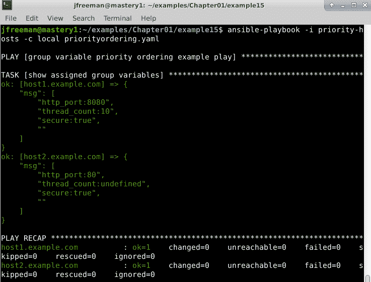

图 1.13 - ansible_group_priority 变量对巧合组变量的影响

随着清单随基础设施的增长，一定要利用这个功能，优雅地处理组之间的任何变量分配冲突。

## 合并哈希

在前一节中，我们关注了变量将如何覆盖彼此的优先级。Ansible 的默认行为是，对于变量名的任何覆盖定义将完全掩盖该变量的先前定义。但是，这种行为可以改变一种类型的变量：哈希变量。哈希变量（或者在 Python 术语中称为字典）是一组键和值的数据集。每个键的值可以是不同类型的，并且甚至可以是复杂数据结构的哈希本身。

在一些高级场景中，最好只替换哈希的一部分或添加到现有哈希中，而不是完全替换哈希。要解锁这种能力，需要在 Ansible 的`config`文件中进行配置更改。配置条目是`hash_behavior`，它可以取值`replace`或`merge`。设置为`merge`将指示 Ansible 在出现覆盖场景时合并或混合两个哈希的值，而不是假定默认的`replace`，它将完全用新数据替换旧的变量数据。

让我们通过一个示例来了解这两种行为。我们将从加载了数据的哈希开始，并模拟提供了作为更高优先级变量的哈希的不同值的情况。

这是起始数据：

```
hash_var: 
  fred: 
    home: Seattle 
    transport: Bicycle 
```

这是通过`include_vars`加载的新数据：

```
hash_var: 
  fred: 
    transport: Bus 
```

默认行为下，`hash_var`的新值将如下所示：

```
hash_var: 
  fred: 
    transport: Bus 
```

然而，如果我们启用`merge`行为，我们将得到以下结果：

```
hash_var: 
  fred: 
    home: Seattle 
    transport: Bus 
```

在使用`merge`时，甚至还有更多微妙和未定义的行为，因此强烈建议只在绝对必要时使用此设置 - 默认情况下禁用是有充分理由的！

# 总结

虽然 Ansible 的设计侧重于简单和易用性，但架构本身非常强大。在本章中，我们涵盖了 Ansible 的关键设计和架构概念，如版本和配置、playbook 解析、模块传输和执行、变量类型和位置以及变量优先级。

您了解到 playbook 包含变量和任务。任务将称为模块的代码片段与参数链接在一起，这些参数可以由变量数据填充。这些组合从提供的清单来源传输到选定的主机。对这些构建块的基本理解是您可以掌握所有 Ansible 事物的平台！

在下一章中，您将详细了解 Ansible 4.3 中的重大新功能，特别是我们在本章中提到的 Ansible 集合和 FQCNs。

# 问题

1.  清单对于 Ansible 的重要性是什么？

a）它是 Ansible 配置管理数据库的一部分。

b）它用于审计您的服务器。

c）它告诉 Ansible 在哪些服务器上执行自动化任务。

d）以上都不是。

1.  在处理频繁变化的基础设施（如公共云部署）时，Ansible 用户必须定期手动更新他们的清单。这是真的还是假的？

a）真 - 这是唯一的方法。

b）假 - 动态清单是为了这个目的而发明的。

1.  默认情况下，Ansible 按照清单中的顺序处理主机？

a）按字母顺序

b）按字典顺序

c）随机顺序

d）按照它们在清单中出现的顺序

1.  默认情况下，简单 playbook 中的 Ansible 任务是按照什么顺序执行的？

a）按照它们被写入的顺序，但必须在所有清单主机上完成每个任务，然后才能执行下一个任务。

b）以最优化的顺序。

c）按照它们被写入的顺序，但一次只能在一个清单主机上进行。

d）其他

1.  哪种变量类型具有最高优先级，可以覆盖所有其他变量来源？

a）清单变量

b）额外变量（来自命令行）

c）角色默认值

d）通过`vars_prompt`获取变量源

1.  特殊的 Ansible 变量名称只在运行时存在是什么？

a）特殊变量

b）运行时变量

c）魔术变量

d）用户变量

1.  如果您想从 playbook 中访问外部数据，您会使用什么？

a）查找插件

b）查找模块

c）查找可执行文件

d）查找角色

1.  对于大多数非 Windows 主机，Ansible 首选的默认传输机制是什么？

a）REST API

b）RabbitMQ

c）RSH

d）SSH

1.  清单变量可以用来做什么？

a）在清单中为每个主机或主机组定义唯一数据。

b）声明您的 playbook 变量。

c）为清单主机定义连接参数。

d）都是（a）和（c）。

1.  如何覆盖系统上的默认 Ansible 配置？

通过在任何位置创建 Ansible 配置文件，并使用`ANSIBLE_CFG`环境变量指定此位置。

b）通过在当前工作目录中创建名为`ansible.cfg`的文件。

c）通过在您的主目录中创建一个名为`~/.ansible.cfg`的文件。

d）以上任何一种。
