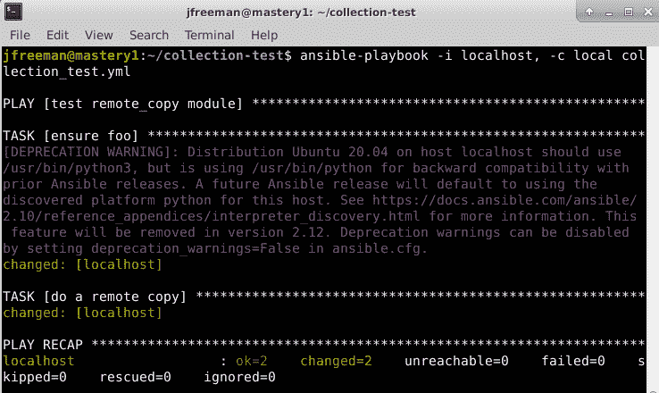
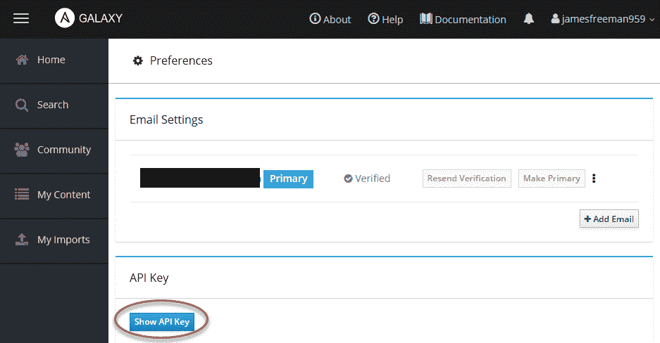
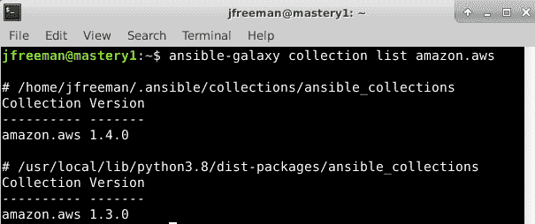
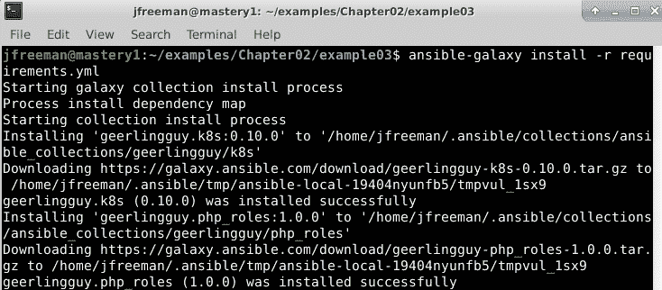
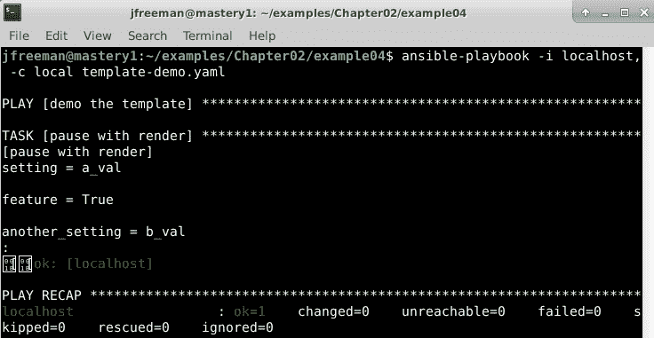

# 第二章：从早期的 Ansible 版本迁移

随着**Ansible**多年来的发展，某些问题已经出现在开发和管理 Ansible 代码库的团队面前。在许多方面，这些问题是 Ansible 自身增长和成功的代价，并且导致需要以稍微不同的方式构建代码。事实上，任何有一点之前版本 Ansible 经验的人都会注意到，我们在本书中提供的示例代码看起来有些不同，还有一个新术语**集合**。

在本章中，我们将详细解释这些变化以及它们是如何产生的。然后，我们将通过一些实际示例带您了解这些变化在现实世界中是如何工作的，最后教会您如何将您可能拥有的任何现有或旧版 playbook 迁移到 Ansible 4.3 及更高版本。

具体来说，在本章中，我们将涵盖以下主题：

+   Ansible 4.3 的变化

+   从早期的 Ansible 安装升级

+   从头开始安装 Ansible

+   什么是 Ansible 集合？

+   使用`ansible-galaxy`安装额外的模块

+   如何将旧版 playbook 迁移到 Ansible 4.3（入门）

# 技术要求

要按照本章中提供的示例，您需要一台运行**Ansible 4.3**或更新版本的 Linux 机器。几乎任何 Linux 发行版都可以。对于那些感兴趣的人，本章中提供的所有代码都是在**Ubuntu Server 20.04 LTS**上测试的，除非另有说明，并且在**Ansible 4.3**上测试。本章附带的示例代码可以从 GitHub 的以下网址下载：[`github.com/PacktPublishing/Mastering-Ansible-Fourth-Edition/tree/main/Chapter02`](https://github.com/PacktPublishing/Mastering-Ansible-Fourth-Edition/tree/main/Chapter02)。我们将使用我们在*第十章*中开发的模块，*扩展 Ansible*，来向您展示如何构建自己的集合，因此确保您有本书附带代码的副本是值得的。

查看以下视频以查看代码实际操作：[`bit.ly/3DYi0Co`](https://bit.ly/3DYi0Co)

# Ansible 4.3 的变化

虽然我们在*第一章*中提到了这个话题，*Ansible 的系统架构和设计*，但重要的是我们更深入地了解这些变化，以帮助您充分理解 Ansible 4.3 与之前版本的不同之处。这将帮助您大大提高编写良好 playbook 的能力，并维护和升级您的 Ansible 基础设施——这是掌握 Ansible 4.3 的必要步骤！

首先，稍微了解一下历史。正如我们在前一章中讨论的那样，Ansible 在设计上具有许多优点，这些优点导致了其迅速增长和接受。其中许多优点，比如无代理设计和易于阅读的 YAML 代码，仍然保持不变。事实上，如果您阅读自 2.9 版本以来的 Ansible 发布的更改日志，您会发现自那个版本以来，核心 Ansible 功能几乎没有什么值得注意的变化，而所有的开发工作都集中在另一个领域。

毫无疑问，Ansible 的模块是其最大的优势之一，任何人，从个人贡献者到硬件供应商和云提供商，都可以提交自己的模块，这意味着到 2.9 版本时，Ansible 包含了成千上万个用于各种用途的模块。

这本身对于管理项目的人来说成了一个头疼的问题。比如说一个模块出现了 bug 需要修复，或者有人给现有的模块添加了一个很棒的新功能，可能会很受欢迎。Ansible 发布本身包含了所有的模块，简而言之，它们与 Ansible 本身的发布紧密耦合。这意味着为了发布一个新模块，必须发布一个全新版本的 Ansible 给社区。

结合数百个模块开发人员的问题和拉取请求，管理核心 Ansible 代码库的人确实头疼不已。很明显，虽然这些模块是 Ansible 成功的重要组成部分，但它们也负责在发布周期和代码库管理中引起问题。需要的是一种将模块（或至少是大部分模块）与 Ansible 引擎的发布解耦的方法——我们在本书的*第一章*中运行的核心 Ansible 运行时的系统架构和设计。

因此，**Ansible 内容集合**（或简称集合）诞生了。

## Ansible 内容集合

虽然我们很快会更深入地研究这些内容，但需要注意的重要概念是，集合是 Ansible 内容的一种包格式，对于本讨论来说，这意味着所有那些成千上万的模块。通过使用集合分发模块，特别是那些由第三方编写和维护的模块，Ansible 团队有效地消除了核心 Ansible 产品的发布与使其对许多人如此有价值的模块之间的耦合。

当你安装了，比如**Ansible 2.9.1**，你实际上安装了一个给定版本的 Ansible 二进制文件和其他核心代码，以及那个时候提交和批准包含的所有模块。

现在，当我们谈论安装 Ansible 4.3 时，我们实际上指的是：

Ansible 4.3.0 现在是一个包，其中包含（在撰写本文时）85 个模块、插件和其他重要功能的集合，这将让尽可能多的人在他们需要安装更多集合之前开始他们的 Ansible 之旅。简而言之，这是一个*入门*集合包。

这里重要的是，Ansible 4.3.0 *不*包含任何实际的自动化运行时。如果你孤立地安装了 Ansible 4.3.0，你实际上无法运行 Ansible！幸运的是，这是不可能的，Ansible 4.3.0 依赖于一个当前称为**ansible-core**的包。这个包包含了 Ansible 语言运行时，以及一小部分核心插件和模块，比如`ansible.builtin.debug`，我们在*第一章*中的示例中经常使用的。*Ansible* *的系统架构和设计*。

每个 Ansible 包的发布都会依赖于特定版本的 ansible-core，以便它始终与正确的自动化引擎配对。例如，Ansible 4.3.0 依赖于 ansible-core >= 2.11 and < 2.12。

Ansible 已经开始使用语义化版本控制来管理 Ansible 包本身，从 3.0.0 版本开始。对于还没有接触过语义化版本控制的人来说，可以简单地解释如下：

+   Ansible 4.3.0：这是一个新的 Ansible 包的第一个语义化版本发布。

+   Ansible 4.0.1：这个版本（以及所有右边数字变化的所有版本）将只包含向后兼容的错误修复。

+   Ansible 4.1.0：这个版本（以及所有中间数字变化的所有版本）将包含向后兼容的新功能，可能还包括错误修复。

+   Ansible 5.0.0：这将包含破坏向后兼容性的更改，被称为主要发布。

ansible-core 包不采用语义化版本控制，因此预计 Ansible 5.0.0 将依赖于 ansible-core >= 2.12。请注意，这个 ansible-core 的发布，不受语义化版本控制，可能包含破坏向后兼容性的更改，因此在我们掌握的过程中，了解 Ansible 现在的版本化方式的这些细微差别是很重要的。

重要说明

最后，请注意，ansible-core 包在 2.11 版本中从 ansible-base 更名，因此如果您看到对 ansible-base 的引用，请知道它只是 ansible-core 包的旧名称。

所有这些变化都是经过长时间计划和执行的。虽然它们的实施旨在尽可能顺利地为现有的 Ansible 用户提供服务，但需要解决一些问题，首先是您实际上如何安装和升级 Ansible，我们将在下一节中详细讨论。

# 从早期的 Ansible 安装升级

将 Ansible 拆分为两个相互依赖的包给包维护者带来了一些麻烦。虽然 CentOS 和 RHEL 的包很容易获得，但目前没有 Ansible 4.3.0 或 ansible-core 2.11.1 的当前包。快速查看 CentOS/RHEL 8 的 EPEL 包目录，最新的 Ansible RPM 版本是 2.9.18。官方的 Ansible 安装指南进一步说明：

自 Ansible 2.10 for RHEL 目前不可用，继续使用 Ansible 2.9。

随着包维护者研究各种升级路径和打包技术的利弊，这种情况将随着时间的推移而发生变化，但在撰写本文时，如果您想立即开始使用 Ansible 4.3.0，最简单的方法是使用 Python 打包技术 **pip** 进行安装。然而，我们所做的并不是升级，而是卸载后重新安装。

## 卸载 Ansible 3.0 或更早版本

Ansible 包结构的根本变化意味着，如果您的控制节点上安装了 Ansible 3.0 或更早版本（包括任何 2.x 版本），很遗憾，您不能只是升级您的 Ansible 安装。相反，您需要在安装后删除现有的 Ansible 安装。

提示

与卸载任何软件一样，您应该确保备份重要文件，特别是中央 Ansible 配置文件和清单，以防它们在卸载过程中被删除。

删除软件包的方法取决于您的安装方式。例如，如果您在 CentOS 8 上通过 RPM 安装了 Ansible 2.9.18，可以使用以下命令删除它：

```
sudo dnf remove ansible
```

同样，在 Ubuntu 上可以运行以下命令：

```
sudo apt remove ansible
```

如果您之前使用 `pip` 安装了 Ansible，可以使用以下命令删除它：

```
pip uninstall ansible
```

简而言之，您如何在控制节点上安装 Ansible 3.0（或更早版本）并不重要。即使您使用 `pip` 安装了它，并且您将使用 pip 安装新版本，您在做任何其他操作之前必须先卸载旧版本。

当有新的 Ansible 版本可用时，建议查看文档，看看升级是否仍然需要卸载。例如，安装 Ansible 4.3 之前需要卸载 Ansible 3.0，部分原因是 ansible-base 包更名为 ansible-core。

一旦您删除了早期版本的 Ansible，您现在可以继续在控制节点上安装新版本，我们将在下一节中介绍。

# 从头安装 Ansible

如前一节所讨论的，Ansible 4.3 主要是使用一个名为 **pip** 的 Python 包管理器进行打包和分发的。这可能会随着时间的推移而发生变化，但在撰写本文时，您需要使用的主要安装方法是通过 pip 进行安装。现在，可以说大多数现代 Linux 发行版已经预装了 Python 和 pip。如果因为任何原因你卡住需要安装它，这个过程在官方网站上有详细说明：[`pip.pypa.io/en/stable/installing/`](https://pip.pypa.io/en/stable/installing/)。

一旦您安装了 pip，安装 Ansible 的过程就像运行这个命令一样简单，而且美妙的是，这个命令在所有操作系统上都是相同的（尽管请注意，在某些操作系统上，您的`pip`命令可能被称为`pip3`，以区分可能共存的 Python 2.7 和 Python 3 版本）：

```
sudo pip install ansible
```

当然，这个命令有一些变化。例如，我们给出的命令将为系统上的所有用户安装可用的最新版本的 Ansible。

如果您想测试或坚持使用特定版本（也许是为了测试或资格认证目的），您可以使用以下命令强制 pip 安装特定版本：

```
sudo pip install ansible==4.3.0
```

这第二个命令将确保在您的系统上为所有用户安装 Ansible 4.3.0，而不管哪个是最新版本。我们还可以进一步进行;要安装 Ansible 但仅适用于您的用户帐户，您可以运行以下命令：

```
pip install --user ansible
```

一个特别方便的技巧是，当您开始使用 pip 时，您可以使用 Python 虚拟环境来隔离特定版本的 Python 模块。例如，您可以创建一个用于 Ansible 2.9 的虚拟环境如下：

1.  使用以下命令在适当的目录中创建虚拟环境：

```
virtualenv ansible-2.9
```

这将在运行命令的目录中创建一个新的虚拟环境，环境（及包含它的目录）将被称为`ansible-2.9`。

1.  激活虚拟环境如下：

```
source ansible-2.9/bin/activate
```

1.  现在您已经准备安装 Ansible 2.9。要安装 Ansible 2.9 的最新版本，我们需要告诉`pip`安装大于（或等于）2.9 但小于 2.10 的版本，否则它将只安装 Ansible 4.3：

```
pip install 'ansible>=2.9,<2.10'
```

1.  现在，如果您检查您的 Ansible 版本，您应该会发现您正在运行 2.9 的最新次要版本：

```
ansible --version
```

使用虚拟环境的缺点是您需要记住每次登录到 Ansible 控制机时运行*步骤 2*中的`source`命令。但好处是您可以在一个单独的虚拟环境中重复上述过程，如下所示，使用 Ansible 4.3：

```
virtualenv ansible-4.3
source ansible-4.3/bin/activate
pip install 'ansible>=4.3,<4.4'
ansible --version
```

这样做的好处是，您现在可以随意在两个版本的 Ansible 之间切换，只需发出适当环境的适当源命令，然后以通常的方式运行 Ansible。如果您正在从 Ansible 2.9 迁移到 4.3 的过程中，或者有一些尚未能正常工作但您仍然需要的旧代码，这可能特别有用，直到您有时间进行必要的更改。

最后，如果您想要升级您的新安装的 Ansible，您只需要根据您的安装方法发出适当的`pip`命令。例如，如果您为所有用户安装了 Ansible，您将发出以下命令：

```
sudo pip install -U ansible
```

如果您只为您的用户帐户安装了它，命令将类似：

```
pip install -U ansible
```

现在，如果您正在虚拟环境中工作，您必须记住先激活环境。一旦完成，您可以像以前一样升级：

```
source ansible-2.9/bin/activate
pip install -U ansible
```

请注意，前面的示例将把安装在 Ansible 2.9 环境中的任何内容升级到最新版本，目前是 4.0。另外，需要注意的一点是，正如在前面的部分*从早期的 Ansible 安装升级*中讨论的那样，这将破坏安装。要升级到最新的次要版本，记住您可以像在此环境中安装 Ansible 时那样指定版本标准：

```
pip install -U 'ansible>=2.9,<2.10'
```

当然，您也可以将版本约束应用于任何其他示例。它们的使用方式不仅限于虚拟环境。

希望到目前为止，您应该已经对如何安装 Ansible 4.3 有了相当好的了解，无论是从头开始，还是从早期安装升级。完成这些工作后，是时候我们来看看**Ansible 集合**了，因为它们是所有这些变化的驱动力。

# 什么是 Ansible 集合？

Ansible 集合代表了与 Ansible 发布的传统的单片式方法的重大分歧，在某一时刻，与 Ansible 可执行文件一起发布了超过 3600 个模块。可以想象，这使得 Ansible 发布变得难以管理，并且意味着最终用户必须等待完全新的 Ansible 发布才能获得对单个模块的功能更新或错误修复——显然这是一种非常低效的方法。

因此，Ansible 集合诞生了，它们的前提非常简单：它们是一种用于构建、分发和消费多种不同类型的 Ansible 内容的机制。当您首次从 Ansible 2.9 或更早版本迁移时，您对 Ansible 集合的体验将以模块的形式呈现。正如我们在本章前面讨论的那样，我们所说的 Ansible 4.3 实际上是一个包，包含大约 85 个集合……它根本不包含 Ansible 可执行文件！这些集合中的每一个都包含许多不同的模块，有些由社区维护，有些由特定供应商维护。Ansible 4.3 依赖于 ansible-core 2.11.x，该软件包包含了 Ansible 可执行文件和核心的`ansible.builtin`模块（如`debug`、`file`和`copy`）。

让我们更详细地看一下集合的结构，以便更充分地理解它们的工作方式。每个集合都有一个由两部分组成的名称：命名空间和集合名称。

例如，`ansible.builtin`集合的命名空间是`ansible`，集合名称是`builtin`。同样，在*第一章*，*Ansible 的系统架构和设计*中，我们安装了一个名为`amazon.aws`的集合。在这里，`amazon`是命名空间，`aws`是集合名称。所有命名空间必须是唯一的，但集合名称可以在命名空间内相同（因此您理论上可以有`ansible.builtin`和`amazon.builtin`）。

虽然您可以以多种方式使用集合，包括简单地在本地构建和安装它们，或直接从 Git 存储库中构建和安装它们，但集合的中心位置是 Ansible Galaxy，您将在这里找到所有包含在 Ansible 4.3 软件包中的集合，以及更多其他集合。Ansible Galaxy 网站可在[`galaxy.ansible.com`](https://galaxy.ansible.com)访问，并且有一个命令行工具（我们在第一章中看到过，*Ansible 的系统架构和设计*）称为`ansible-galaxy`，可用于与该网站交互（例如，安装集合）。我们将在本章的其余部分广泛使用此工具，因此您将有机会更加熟悉它。

您可以使用 GitHub 凭据登录 Ansible Galaxy 自由创建自己的帐户，当您这样做时，您的命名空间将自动创建为与您的 GitHub 用户名相同。您可以在这里了解更多关于 Ansible Galaxy 命名空间的信息：[`galaxy.ansible.com/docs/contributing/namespaces.html`](https://galaxy.ansible.com/docs/contributing/namespaces.html)。

现在您已经了解了 Ansible 集合名称是如何创建的，让我们更深入地了解一下集合是如何组合和工作的。

## Ansible 集合的结构

理解集合在幕后如何工作的最简单方法是为自己构建一个简单的集合，所以让我们开始吧。与 Ansible 的所有方面一样，开发人员已经为集合制定了一个强大而易于使用的系统，如果您已经有使用 Ansible 角色的经验，您会发现集合的工作方式类似。然而，如果您没有，不用担心；我们将在这里教会您所需了解的一切。

集合由一系列目录组成，每个目录都有一个特殊的名称，旨在容纳特定类型的内容。这些目录中的任何一个都可以是空的；您不必在集合中包含所有类型的内容。实际上，集合中只有一个强制性文件！Ansible 甚至提供了一个工具来帮助您构建一个空的集合，以便开始使用。让我们现在使用它来创建一个新的空集合，以便学习，通过运行以下命令：

```
ansible-galaxy collection init masterybook.demo 
```

当您运行此命令时，您应该看到它创建了以下目录树：

```
masterybook/
|-- demo
    |-- README.md
    |-- docs
    |-- galaxy.yml
    |-- plugins
        |-- README.md
    |-- roles
```

您可以从前面的目录树中看到，此命令使用我们的 `masterybook` 命名空间创建了一个顶级目录，然后创建了一个名为 `demo` 的集合子目录。然后创建了两个文件和三个目录。

其目的如下：

+   `README.md`：这是集合的 README 文件，应为第一次查看模块代码的任何人提供有用的信息。

+   `docs`：此目录用于存储集合的一般文档。所有文档都应采用 Markdown 格式，并且不应放在任何子文件夹中。模块和插件仍应使用 Python 文档字符串嵌入其文档，我们将在*第十章*中学习更多关于此的内容，*扩展 Ansible*。

+   `galaxy.yml`：这是集合结构中唯一强制性的文件，包含构建集合所需的所有信息，包括版本信息、作者详细信息、许可信息等。之前运行的命令创建的文件是一个完整的模板，其中包含注释以解释每个参数，因此您应该发现很容易浏览并根据您的要求完成它。

+   `plugins`：此目录应包含您开发的所有 Ansible 插件。模块也应包含在单独的模块/子目录中，您需要在插件文件夹下创建。我们将在*第十章*中学习有关为 Ansible 创建插件和模块的内容，*扩展 Ansible*。

+   `roles`：在 Ansible 3.0 之前，Ansible Galaxy 只用于分发角色：可重复使用的 Ansible 代码集，可以轻松地分发和在其他地方使用以解决常见的自动化挑战。我们将在*第八章*中学习有关角色的所有内容，*使用角色组合可重复使用的 Ansible 内容*，所以如果您还没有遇到它们，现在不用担心。角色仍然可以使用 Ansible Galaxy 进行分发，但也可以包含在集合中，这在未来可能会成为常态。

除此之外，集合还可以包含以下内容：

+   `tests`：此目录用于存储与发布之前测试 Ansible 集合相关的文件，并且要包含在顶层 Ansible 包中，集合必须通过 Ansible 测试流程。您不需要在内部使用自己的集合时执行此操作，但是如果您希望将其包含在主要 Ansible 包中，您将需要完成开发过程的这一部分。更多详细信息请参阅：[`docs.ansible.com/ansible/latest/dev_guide/developing_collections.html#testing-collections`](https://docs.ansible.com/ansible/latest/dev_guide/developing_collections.html#testing-collections)。

+   `meta/runtime.yml`：此文件和目录用于指定有关集合的重要元数据，例如所需 ansible-core 包的版本，以及各种命名空间路由和重定向段，以帮助从 Ansible 2.9 及更早版本（其中没有命名空间）迁移到 Ansible 4.3 及更高版本。

+   `playbooks`：此目录将在将来的 Ansible 版本中得到支持，以包含与集合一起使用的 playbooks，尽管在撰写本文时，官方文档尚不完整。

现在您已经创建并理解了集合目录结构，让我们向其中添加我们自己的模块。完成后，我们将对其进行打包，然后安装到我们的系统上，并在 playbook 中使用它：这是对集合工作原理的完整端到端测试。我们将从《第十章》《扩展 Ansible》中借用模块代码，所以在这个阶段不用担心深入理解这段代码，因为它在那里有完整的解释。完整的代码清单有好几页长，所以我们不会在这本书中重复它。下载本书附带的代码或参考《第十章》《扩展 Ansible》中的代码清单，获取`remote_copy.py`模块代码。它包含在本书附带的示例代码的`Chapter10/example08/library`目录中。

在`plugins/`目录中创建一个`modules/`子目录，并在其中添加`remote_copy.py`代码。

当您查看了`galaxy.yml`中的信息后，可以随意在其中添加您自己的姓名和其他细节，然后就完成了！这就是创建您的第一个集合的全部内容。它真的非常简单，一组文件放在一个井然有序的目录结构中。

提示

如本章前面讨论的那样，预期 Ansible 集合遵循语义化版本控制，因此在创建和构建自己的模块时，请务必采用这一点。

您完成的模块目录结构应该是这样的：

```
masterybook/
|-- demo
    |-- README.md
    |-- docs
    |-- galaxy.yml
    |-- plugins
        |-- modules
            |-- remote_copy.py
        |-- README.md
    |-- roles
```

当所有文件就位后，就该构建您的集合了。这非常简单，只需切换到与`galaxy.yml`所在的同一集合顶级目录，并运行以下命令：

```
cd masterybook/demo
ansible-galaxy collection build
```

这将创建一个 tarball，其中包含您的集合文件，您现在可以根据需要使用它！您可以立即将其发布到 Ansible Galaxy，但首先，让我们在本地测试一下看看它是否有效。

默认情况下，Ansible 将集合存储在您的家目录下的`~/.ansible/collections`中。然而，由于我们正在测试刚刚构建的集合，让我们稍微改变一下 Ansible 的行为，并将其安装在本地目录中。

要尝试这个，为一个简单的测试 playbook 创建一个新的空目录，然后创建一个名为`collections`的目录，用于安装我们新创建的集合：

```
mkdir collection-test
cd collection-test
mkdir collections
```

默认情况下，Ansible 不会知道要在这个目录中查找集合，因此我们必须覆盖其默认配置，告诉它在这里查找。在您的目录中，创建一个新的`ansible.cfg`文件（如果存在，该文件始终被读取并覆盖任何中央配置文件中的设置，例如`/etc/ansible/ansible.cfg`）。该文件应包含以下内容：

```
[defaults]
collections_paths=./collections:~/.ansible/collections:/usr/share/ansible/collections
```

这个配置指令告诉 Ansible 在检查系统上的默认位置之前，先在当前目录下的 collections 子目录中查找。

现在您已经准备好安装之前构建的集合了。假设您是在家目录中构建的，那么安装它的命令如下：

```
ansible-galaxy collection install ~/masterybook/demo/masterybook-demo-1.0.0.tar.gz -p ./collections
```

如果您探索本地的`collections`目录，您应该会发现它现在包含了您之前创建的集合，以及在构建过程中创建的一些额外文件。

最后，让我们创建一个简单的 playbook 来使用我们的模块。作为《第十章》《扩展 Ansible》的一个预告，这个模块在 Ansible 控制的系统上执行一个简单的文件复制，所以让我们在一个公共可写目录（例如`/tmp`）中创建一个测试文件，并让我们的模块开始复制。考虑以下 playbook 代码：

```
---
- name: test remote_copy module
  hosts: localhost
  gather_facts: false
  tasks:
  - name: ensure foo
    ansible.builtin.file:
      path: /tmp/rcfoo
      state: touch
  - name: do a remote copy
    masterybook.demo.remote_copy:
      source: /tmp/rcfoo
      dest: /tmp/rcbar
```

我们的 playbook 中有两个任务。一个使用`ansible.builtin`集合中的文件模块来创建一个空文件，供我们的模块复制。第二个任务使用我们的新模块，使用完全限定的集合名称来引用它，来复制文件。

你可以以正常方式运行这个 playbook 代码。例如，要对本地机器运行它，运行以下命令：

```
ansible-playbook -i localhost, -c local collection_test.yml
```

注意`localhost`清单项后的逗号。这告诉 Ansible 我们在命令行上列出清单主机，而不必创建本地清单文件-当你测试代码时，这是一个很方便的小技巧！如果一切顺利，你的 playbook 运行应该如*图 2.1*所示。



图 2.1-运行示例 playbook 对我们的演示集合的输出

恭喜你，你刚刚创建、构建并运行了你的第一个 Ansible 集合！当然，集合通常比这更复杂，并且可能包含许多模块、插件，甚至角色和其他工件，正如前面所述。但是，要开始，这就是你需要知道的全部。

当你对你的集合满意时，你最后的一步很可能是将其发布到 Ansible Galaxy。假设你已经登录到 Ansible Galaxy 并创建了你的命名空间，你只需要导航到你的个人资料首选项页面，然后点击**显示 API 密钥**按钮，如*图 2.2*所示：



图 2.2-从 Ansible Galaxy 获取你的 API 密钥

然后，你可以将这个 API 密钥输入到`ansible-galaxy`命令行工具中，以发布你的集合。例如，要发布本章的集合，你可以运行以下命令：

```
ansible-galaxy collection publish ~/masterybook/demo/masterybook-demo-1.0.0.tar.gz --token=<API key goes here>
```

这就结束了我们对集合及其构建和使用的介绍。正如我们提到的，有几种安装集合的方法，而且现在 Ansible 模块已经分布在各种集合中。在下一节中，我们将看看如何找到你需要的模块，以及如何在你的自动化代码中安装和引用集合。

# 使用 ansible-galaxy 安装额外模块

当你使用集合时，大部分时间你不会自己构建它们。在撰写本书时，Ansible Galaxy 上已经有 780 个可用的集合，而在你阅读本书时可能会有更多。尽管如此，作者个人认为，当我们能亲自动手时，我们学得更好，因此，开发我们自己的，尽管简单，集合是我们研究它们是如何组合和引用的绝佳方式。

然而，现在让我们专注于查找并使用 Ansible 上已有的集合，因为这很可能是你大部分时间的关注点。正如我们已经提到的，Ansible 4.3 包括一组集合，让你开始自动化之旅，以及与 ansible-core 包一起包含的`ansible.builtin`集合。

如果你想查看在你的系统上安装 Ansible 4.3 时安装了哪些集合，只需运行以下命令：

```
ansible-galaxy collection list
```

这将返回一个格式为`<namespace>.<collection>`的所有已安装集合的列表，以及它们的版本号。请记住，集合现在与你安装的 Ansible 版本无关，因此你可以升级它们而不必升级整个 Ansible 安装。我们很快将会看到这一点。作为 Ansible 的一部分安装的所有集合的完整列表也可以在这里找到：[`docs.ansible.com/ansible/latest/collections/index.html`](https://docs.ansible.com/ansible/latest/collections/index.html)。

当您需要特定目的的模块时，值得注意的是，集合通常以名称命名，以便为您提供有关其包含内容的线索。例如，假设您想要使用 Ansible 在亚马逊网络服务中执行一些云配置; 快速浏览集合索引会发现两个可能的候选项：`amazon.aws`集合和`community.aws`集合。同样，如果您想要自动化 Cisco IOS 交换机的功能，`cisco.ios`集合看起来是一个很好的起点。您可以在 Ansible 文档网站上探索每个集合中的模块，或者通过使用`ansible-doc`命令来探索集合中的模块。例如，要列出`cisco.ios`集合中包含的所有模块，您可以运行以下命令：

```
ansible-doc -l cisco.ios
```

`community.*`包旨在提供与 Ansible 2.9 中存在的相同功能，自然而然地具有更新的模块和插件版本，从而帮助您在不太痛苦的情况下将 playbook 从早期的 Ansible 版本移植过来。

当然，如果您在 Ansible 4.3 包中找不到所需的内容，您可以简单地转到 Ansible Galaxy 网站找到更多内容。

一旦确定了您在 playbook 开发中需要的集合，就是安装它们的时候了。我们已经在前一节中看到，我们可以直接从磁盘上的本地文件安装集合。在*第一章*，*Ansible 的系统架构和设计*中，我们运行了以下命令：

```
ansible-galaxy collection install amazon.aws
```

这安装了最新版本的`amazon.aws`集合直接从 Ansible Galaxy。你们中的鹰眼可能会想，“等等，`amazon.aws`已经作为 Ansible 4.3 包的一部分包含在内了。”的确是这样。然而，Ansible 及其集合的解耦特性意味着我们可以自由安装和升级集合版本，而无需升级 Ansible。的确，当我们运行前面的命令时，它将最新版本的`amazon.aws`安装在用户本地集合路径（`~/.ansible/collections`）内，因为这是默认设置。请注意，这与我们在本章前面测试自己的集合时观察到的行为不同，因为我们专门创建了一个 Ansible 配置文件，指定了不同的集合路径。

通过使用`ansible-galaxy`命令运行另一个集合列表，我们可以找出发生了什么，只是这一次我们只会过滤`amazon.aws`集合：

```
ansible-galaxy collection list amazon.aws
```

输出将类似于这样：



图 2.3 - 列出已安装集合的多个版本

在这里，我们可以看到这个集合的`1.3.0`版本是与我们的 Ansible 安装一起安装的，但稍后的`1.4.0`版本安装在我家目录的`.ansible/collections`文件夹中，在 playbook 引用它并从我的用户帐户运行时，后者优先。请注意，从此系统上的其他用户帐户运行的 playbook 只会看到`1.3.0`版本的集合，因为这是系统范围内安装的，它们通常不会引用我家目录中的文件夹。

正如您所期望的，您可以在安装集合时指定您想要的版本。如果我想要安装`amazon.aws`集合的最新开发版本，我可以使用以下命令在本地安装它：

```
ansible-galaxy collection install amazon.aws:==1.4.2-dev9 --force
```

`--force`选项是必需的，因为`ansible-galaxy`不会覆盖发布版本的集合与开发版本，除非您强制它这样做-这是一个明智的安全预防措施！

除了从本地文件和 Ansible Galaxy 安装集合外，您还可以直接从 Git 存储库安装它们。例如，要安装假设的 GitHub 存储库的`stable`分支上的最新提交，您可以运行以下命令：

```
ansible-galaxy collection install git+https://github.com/jamesfreeman959/repo_name.git,stable
```

这里有许多可能的排列组合，包括访问私有 Git 存储库甚至本地存储库。

所有这些都是安装集合的完全有效的方式。然而，想象一下，您的 playbook 需要十个不同的集合才能成功运行。您最不想做的事情就是每次在新的地方部署自动化代码时都要运行十个不同的`ansible-galaxy`命令！而且，这很容易失控，不同的主机上可能有不同的集合版本。

幸运的是，Ansible 在这方面也为您着想，`requirements.yml`文件（在较早版本的 Ansible 中存在，并在集合成为现实之前用于从 Ansible Galaxy 安装角色）可以用于指定要安装的一组集合。

例如，考虑以下`requirements.yml`文件：

```
---
collections:
- name: geerlingguy.k8s
- name: geerlingguy.php_roles
  version: 1.0.0
```

该文件描述了对两个集合的要求。两者的命名空间都是`geerlingguy`，集合分别称为`k8s`和`php_roles`。`k8s`集合将安装最新的稳定版本，而`php_roles`集合只会安装`1.0.0`版本，而不管最新发布版本是什么。

要安装`requirements.yml`中指定的所有要求，只需运行以下命令：

```
ansible-galaxy install -r requirements.yml
```

该命令的输出应该类似于*图 2.4*：



图 2.4 - 使用 requirements.yml 文件安装集合

从此输出中可以看出，我们在`requirements.yml`文件中指定的两个集合都已安装到了适当的版本。这是捕获 playbook 的集合要求的一种非常简单而强大的方式，并且可以一次性安装它们所有，同时保留需要的正确版本。

在这个阶段，您应该对 Ansible 4.3 中的重大变化有一个牢固的理解，特别是集合，如何找到适合您自动化需求的正确集合以及如何安装它们（甚至如何创建自己的集合如果需要）。在本章的最后部分，我们将简要介绍如何将您的 playbook 从 2.9 版本及更早版本迁移到 Ansible 4.3。

# 如何将传统 playbook 迁移到 Ansible 4.3（入门）

没有两个 Ansible playbook（或角色或模板）是相同的，它们的复杂程度从简单到复杂各不相同。然而，它们对于其作者和用户来说都很重要，随着从 Ansible 2.9 到 4.0 的主要变化，本书没有一个关于如何将您的代码迁移到更新的 Ansible 版本的入门就不完整。

在我们深入研究这个主题之前，让我们来看一个例子。在 2015 年关于 Ansible 1.9 版本的第一版书中，出现了一个示例，使用一个小的 Ansible playbook 渲染了一个**Jinja2**模板。我们将在本书的*第六章*中学习关于这段代码的更新版本，*解锁 Jinja2 模板的力量*，但现在让我们看看原始代码。名为`demo.j2`的模板如下：

```
setting = {{ setting }} 
 
feature = True 
 
feature = False 
 
another_setting = {{ another_setting }}
```

渲染此模板的 playbook 如下所示：

```
--- 
- name: demo the template 
  hosts: localhost 
  gather_facts: false  
  vars: 
    setting: a_val 
    feature: 
      enabled: true
    another_setting: b_val  
  tasks: 
    - name: pause with render 
      pause: 
        prompt: "{{ lookup('template', 'demo.j2') }}"
```

这是第一版书中出现的完全相同的代码，它是为 Ansible 1.9 编写的，所以在过渡到 4.3 时发生了很多变化，你可能会原谅认为这段代码永远不会在 Ansible 4.3 上运行。然而，让我们确切地做到这一点。我们将使用以下命令运行此代码：

```
ansible-playbook -i localhost, -c local template-demo.yaml
```

在 Ansible 4.3 上运行此命令的输出，使用 ansible-core 2.11.1，看起来像*图 2.5*：



图 2.5 - 在 Ansible 4.3 上运行本书第一版的示例 playbook

如果您问为什么这样做，以及为什么要详细介绍集合，当最初为 Ansible 1.9 编写的代码在 4.3 中不经修改仍然有效时，您将得到原谅。Ansible 4.3 是专门编码的，以为用户提供尽可能少痛苦的路径，甚至在 Ansible 2.10 的迁移指南中都明确指出：

*您的 playbook 应该继续工作，无需任何更改*。

只要模块名称保持唯一，这一点就会成立。然而，现在没有任何阻止模块名称冲突的东西——它们现在只需要在自己的集合中保持唯一。因此，例如，我们在前面的 playbook 中使用了`pause`模块，在 Ansible 4.3 中它的**完全限定集合名称**（**FQCN**）是`ansible.builtin.pause`。前面的代码之所以有效是因为我们的集合中没有其他叫做`pause`的模块。然而，请考虑我们在本章前面创建的`masterybook.demo`集合。没有任何阻止我们在这里创建一个叫做`pause`的自己的模块，它做一些完全不同的事情。Ansible 怎么知道选择哪个模块呢？

答案来自 Ansible 本身，它已经编码以搜索构成 Ansible 4.3 包的所有集合；因此，对`pause`的引用解析为`ansible.builtin.pause`。它永远不会解析为`masterybook.demo.pause`（假设我们创建了该模块），因此如果我们想在任务中使用我们的假设模块，我们需要使用 FQCN。

Ansible 在这个话题上的建议是始终在您的代码中使用 FQCN，以确保您从模块名称冲突中永远不会收到意外的结果。但是，如果您想要避免在一组任务中输入大量内容怎么办？例如，如果您不得不重复输入`masterybook.demo.remote_copy`，那就太多输入了。

答案以 playbook 中在 play 级别定义的新`collections:`关键字的形式呈现。当我们在本章前面测试我们新构建的集合时，我们使用了 FCQN 来引用它。然而，同样的 playbook 也可以写成以下形式：

```
---
- name: test remote_copy module
  hosts: localhost
  gather_facts: false
  collections:
    - masterybook.demo
  tasks:
  - name: ensure foo
    ansible.builtin.file:
      path: /tmp/rcfoo
      state: touch
  - name: do a remote copy
    remote_copy:
      source: /tmp/rcfoo
      dest: /tmp/rcbar
```

请注意`collections:`关键字在 play 级别上的存在。这本质上为未通过 FQCN 指定的引用创建了一个有序的*搜索路径*。因此，我们已经指示我们的 play 在搜索包含的命名空间之前，搜索`masterybook.demo`命名空间的模块、角色和插件。实际上，您可以将`ensure foo`任务中的模块引用从`ansible.builtin.file`更改为`file`，play 仍将按预期工作。`collections`指令不会覆盖这些内部命名空间搜索路径，它只是在其前面添加命名空间。

值得注意的是，当您开始使用角色（我们将在本书后面介绍），play 中指定的集合搜索路径不会被角色继承，因此它们都需要手动定义。您可以通过在角色中创建一个`meta/main.yml`文件来为角色定义集合搜索路径，该文件可以包含例如以下内容：

```
collections:
  - masterybook.demo
```

此外，重要的是要提到，这些集合搜索路径不会影响您可能在集合中包含的查找、过滤器或测试等项目。例如，如果我们在我们的集合中包含了一个查找，无论`play`或`role`中是否出现`collections`关键字，都需要使用 FQCN 来引用它。最后，请注意，您必须始终像本章前面演示的那样安装您的集合。在您的代码中包含`collections`关键字并不会导致 Ansible 自动安装或下载这些集合；它只是它们的搜索路径。

总的来说，您可能会发现在整个代码中使用 FQCN 会更容易，但本节的重要教训是，虽然在您的代码中使用 FQCN 是最佳实践，但目前并不是强制的，如果您正在升级到 Ansible 4.3，您不必逐个更新您曾经编写的所有剧本中对模块、插件等的引用。您可以随时进行这样的操作，但最好是这样做。

当然，如果我们回顾自 2.7 版发布以来发生的所有 Ansible 变化，这本书的第三版就是基于这个版本，那么变化是很多的。然而，它们只会影响特定剧本，因为它们涉及特定剧本方面的特定行为，或者某些模块的工作方式。的确，一些模块会因为较新的 Ansible 版本的发布而被弃用和移除，新的模块会被添加进来。

每当您想要升级您的 Ansible 安装时，建议您查看 Ansible 为每个版本发布的移植指南。它们可以在这里找到：[`docs.ansible.com/ansible/devel/porting_guides/porting_guides.html`](https://docs.ansible.com/ansible/devel/porting_guides/porting_guides.html)。

至于我们在本章开始时提到的例子，您可能会发现您的代码根本不需要任何修改。然而，最好是计划升级，而不是简单地希望一切顺利，只是碰到一些意外行为，破坏了您的自动化代码。

希望本章关于剧本移植的部分已经向您展示了如何处理在您的剧本中引入集合，并为您提供了一些指引，指出您在升级 Ansible 时应该寻求指导的地方。

# 总结

自本书上次发布以来，Ansible 已经发生了许多变化，但最显著的变化（预计会影响到阅读本书的每个人）是引入集合来管理模块、角色、插件等，并将它们与 Ansible 的核心版本分离。对 Ansible 代码最明显的变化可能是引入 FQCNs 以及需要安装集合（如果它们不是 Ansible 4.3 包的一部分）。

在本章中，您了解了在 Ansible 中引入集合的原因，以及它们如何影响从您的剧本代码到您安装、维护和升级 Ansible 本身的一切。您了解到集合很容易从头开始构建，甚至了解了如何构建自己的集合，然后看看如何为您的剧本安装和管理集合。最后，您学会了将您的 Ansible 代码从早期版本移植的基础知识。

在下一章中，您将学习如何在使用 Ansible 时保护秘密数据。

# 问题

1.  集合可以包含：

a) 角色

b) 模块

c) 插件

d) 以上所有

1.  集合意味着 Ansible 模块的版本与 Ansible 引擎的版本无关。

a) 真

b) 假

1.  Ansible 4.3 包括：

a) 包括 Ansible 自动化引擎。

b) 依赖于 Ansible 自动化引擎。

c) 与 Ansible 自动化引擎毫无关系。

1.  可以直接从 Ansible 2.9 升级到 Ansible 4.3。

a) 真

b) 假

1.  在 Ansible 4.3 中，模块名称在不同的命名空间之间是唯一的。

a) 真

b) 假

1.  为了确保您始终访问您打算的正确模块，您现在应该开始在您的任务中使用以下哪个？

a) 完全合格的域名

b) 简短的模块名称

c) 完全合格的集合名称

d) 以上都不是

1.  哪个文件可以用来列出从 Ansible Galaxy 获取的所有所需集合，以确保在需要时可以轻松安装它们？

a) `site.yml`

b) `ansible.cfg`

c) `collections.yml`

d) `requirements.yml`

1.  当您在 Ansible Galaxy 上创建帐户以贡献您自己的集合时，您的命名空间是：

a) 随机生成的。

b) 由您选择。

c) 根据你的 GitHub 用户 ID 自动生成。

1.  集合存储在哪种常见的文件格式中？

a) `.tar.gz`

b) `.zip`

c) `.rar`

d) `.rpm`

1.  你如何列出安装在你的 Ansible 包中的所有集合？

a) `ansible --list-collections`

b) `ansible-doc -l`

c) `ansible-galaxy --list-collections`

d) `ansible-galaxy collections list`
