# *第三章*：使用 Ansible 保护您的机密

机密信息是要保密的。无论是云服务的登录凭据还是数据库资源的密码，它们之所以是机密，是有原因的。如果它们落入错误的手中，它们可以被用来发现商业机密、客户的私人数据、为恶意目的创建基础设施，甚至更糟。所有这些都可能会给您和您的组织带来大量的时间、金钱和头疼！在第二版这本书出版时，只能够将敏感数据加密在外部保险柜文件中，并且所有数据必须完全以加密或未加密的形式存在。每次运行 playbook 时只能使用一个单一的 Vault 密码，这意味着无法将您的机密数据分隔开，并为不同敏感性的项目使用不同的密码。现在一切都已经改变，playbook 运行时允许使用多个 Vault 密码，以及在否则普通的**YAML Ain't Markup Language**（**YAML**）文件中嵌入加密字符串的可能性。

在本章中，我们将描述如何利用这些新功能，并通过以下主题保持您的机密安全使用 Ansible：

+   加密数据在静止状态下

+   创建和编辑加密文件

+   使用加密文件执行`ansible-playbook`

+   将加密数据与普通 YAML 混合

+   在操作时保护机密

# 技术要求

为了跟随本章节中提供的示例，您需要一台运行**Ansible 4.3**或更新版本的 Linux 机器。几乎任何 Linux 版本都可以使用——对于那些对细节感兴趣的人，本章中提供的所有代码都是在 Ubuntu Server 20.04 **长期支持版**（**LTS**）上测试的，除非另有说明，并且在 Ansible 4.3 上测试。本章附带的示例代码可以从 GitHub 上下载，**统一资源定位符**（**URL**）为：[`github.com/PacktPublishing/Mastering-Ansible-Fourth-Edition/tree/main/Chapter03`](https://github.com/PacktPublishing/Mastering-Ansible-Fourth-Edition/tree/main/Chapter03)。

查看以下视频以查看代码的实际操作：[`bit.ly/2Z4xB42`](https://bit.ly/2Z4xB42)

# 加密数据在静止状态下

作为配置管理系统或编排引擎，Ansible 具有强大的功能。为了发挥这种力量，有必要将机密数据委托给 Ansible。一个每次连接都提示操作员输入密码的自动化系统并不高效——事实上，如果您不得不坐在那里一遍又一遍地输入密码，它几乎不是完全自动化的！为了最大限度地发挥 Ansible 的功能，机密数据必须被写入一个文件，Ansible 可以读取并从中利用数据。

然而，这样做存在风险！您的机密信息以明文形式存储在文件系统中。这是一种物理风险，也是一种数字风险。从物理上讲，计算机可能被夺走，并且被仔细检查以获取机密数据。从数字上讲，任何能够突破其限制的恶意软件都能够读取您的用户帐户可以访问的任何数据。如果您使用源代码控制系统，那么存储库所在的基础设施同样面临风险。

幸运的是，Ansible 提供了一种保护数据在静止状态下的方法。这种方法就是**Vault**。这种方法允许对文本文件进行加密，以便它们以加密格式存储在静止状态下。没有密钥或大量的计算能力，数据是无法被破译的，但仍然可以在 Ansible plays 中像未加密数据一样轻松使用。

在处理数据加密时需要学习的关键课程包括以下内容：

+   有效的加密目标

+   使用多个密码和保险柜**标识符**（**ID**）保护不同的数据

+   创建新的加密文件

+   加密现有的未加密文件

+   编辑加密文件

+   更改文件的加密密码

+   解密加密文件

+   在未加密的 YAML 文件中内联加密数据（例如，一个 playbook）

+   在引用加密文件时运行`ansible-playbook`

## Vault ID 和密码

在**Ansible 2.4**发布之前，一次只能使用一个 Vault 密码。虽然你可以在多个位置存储多个目的的多个密码，但只能使用一个密码。这对于较小的环境显然是可以接受的，但随着 Ansible 的采用增加，对更好和更灵活的安全选项的需求也在增加。例如，我们已经讨论过 Ansible 可以通过清单中的组来管理开发和生产环境。可以预期这些环境将具有不同的安全凭据。同样，你期望核心网络设备具有不同的凭据。事实上，这是一个很好的安全实践。

鉴于此，使用 Vault 仅用一个主密码保护任何秘密似乎是不合理的。Ansible 2.4 引入了 Vault ID 的概念作为解决方案，虽然目前旧的单密码命令仍然有效，但建议在命令行上使用 Vault ID。每个 Vault ID 必须有一个与之关联的单个密码，但多个秘密可以共享相同的 ID。

Ansible Vault 密码可以来自以下三个来源之一：

+   用户输入的字符串，当需要时 Ansible 会提示输入

+   一个包含 Vault 密码的纯文本文件（显然，这个文件必须保持安全！）

+   一个可执行文件，用于获取密码（例如，从凭证管理系统）并将其输出为 Ansible 读取的单行

这三个选项的语法大致相似。如果你只有一个 Vault 凭证，因此不使用 ID（尽管如果你愿意的话，你也可以使用 ID，这是强烈推荐的，因为你可能以后希望添加第二个 Vault ID），那么你将输入以下代码行来运行一个 playbook 并提示输入 Vault 密码：

```
ansible-playbook --vault-id @prompt playbook.yaml
```

如果你想从文本文件中获取 Vault 密码，你将运行以下命令：

```
ansible-playbook --vault-id /path-to/vault-password-text-file playbook.yaml
```

最后，如果你使用可执行脚本，你将运行以下命令：

```
ansible-playbook --vault-id /path-to/vault-password-script.py playbook.yaml
```

如果你正在使用 ID，只需在密码来源前面添加 ID，然后加上`@`字符——例如，如果你的 vault 的 ID 是`prod`，那么前面的三个例子变成了以下内容：

```
ansible-playbook --vault-id prod@prompt playbook.yaml
ansible-playbook --vault-id prod@/path-to/vault-password-text-file playbook.yaml
ansible-playbook --vault-id prod@/path-to/vault-password-script.py playbook.yaml
```

这些可以组合成一个命令，如下所示：

```
ansible-playbook --vault-id prod@prompt testing@/path-to/vault-password-text-file playbook.yaml
```

我们将在本章的其余部分中使用`vault-id`命令行选项。

## Vault 可以加密的内容

Vault 功能可用于加密 Ansible 使用的任何**结构化数据**。这可以是 Ansible 在操作过程中使用的几乎任何 YAML（或**JavaScript 对象表示**（**JSON**））文件，甚至是一个未加密的 YAML 文件中的单个变量，例如 playbook 或角色。Ansible 可以处理的加密文件的示例包括以下内容：

+   `group_vars/`文件

+   `host_vars/`文件

+   `include_vars`目标

+   `vars_files`目标

+   `--extra-vars`目标

+   角色变量

+   角色默认值

+   任务文件

+   处理程序文件

+   `copy`模块的源文件（这些是列表中的一个例外——它们不必是 YAML 格式的）

如果一个文件可以用 YAML 表示并且可以被 Ansible 读取，或者如果一个文件要用`copy`模块传输，那么它就是 Vault 中加密的有效文件。因为整个文件在休息时都是不可读的，所以在选择要加密的文件时应该小心谨慎。对文件的任何源控制操作都将使用加密内容进行，这将使对文件进行审查变得非常困难。

作为最佳实践，应该尽可能少地加密数据，这甚至可能意味着将一些变量单独移到一个文件中。正是出于这个原因，Ansible 2.3 添加了`encrypt_string`功能到`ansible-vault`，允许将单独的秘密内联放置在否则未加密的 YAML 中，从而使用户无需加密整个文件。我们将在本章后面介绍这个功能。

# 创建和编辑加密文件

要创建新文件，Ansible 提供了一个名为`ansible-vault`的程序。该程序用于创建和与 Vault 加密文件交互。创建加密文件的子命令是`create`，您可以通过运行以下命令查看此子命令下可用的选项：

```
ansible-vault create --help
```

该命令的输出如下截图所示：

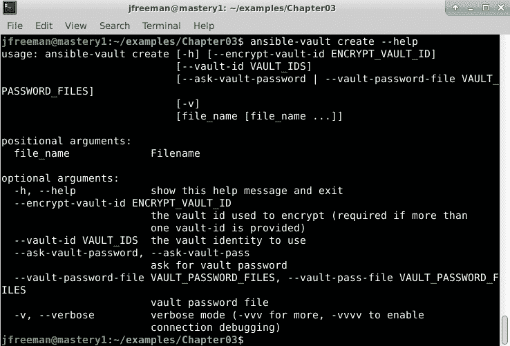

图 3.1 - 创建 Ansible Vault 实例时可用的选项

要创建新文件，您需要提前知道两件事。第一是`ansible-vault`将用于加密文件的密码，第二是文件名本身。提供了这些信息后，`ansible-vault`将启动一个文本编辑器（如在`EDITOR`环境变量中定义的那样 - 在许多情况下默认为`vi`或`vim`）。保存文件并退出编辑器后，`ansible-vault`将使用提供的密码作为`AES256`密码对文件进行加密。

让我们通过几个示例来创建加密文件。首先，我们将创建一个并在提示输入密码时进行操作，然后我们将提供一个`password`文件，最后，我们将创建一个可执行文件来提供密码。

### 密码提示

让`ansible-vault`在运行时从用户那里请求密码是开始创建 vault 的最简单方法，因此让我们通过一个简单的示例来创建一个包含我们想要加密的变量的 vault。运行以下命令创建一个新的 vault，并在提示输入密码时：

```
ansible-vault create --vault-id @prompt secrets.yaml
```

输出应该类似于这样：

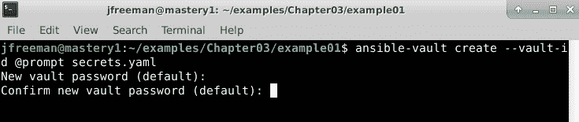

图 3.2 - 在提示输入密码时创建一个新的 Ansible Vault 实例

输入密码后，我们的编辑器将打开，我们可以将内容放入文件中，如下截图所示：

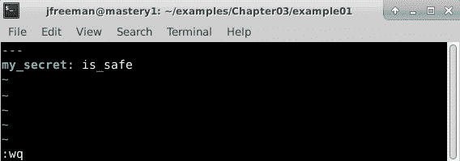

图 3.3 - 使用 vim 编辑器向新的 Ansible Vault 实例添加内容

在我的系统上，配置的编辑器是**Vim**。您的系统可能不同，如果您对默认选择不满意，可以将您喜欢的编辑器设置为`EDITOR`环境变量的值。

现在，我们保存文件。如果我们尝试使用以下命令读取内容，我们会发现它们实际上是加密的：

```
cat secrets.yaml
```

这只是一个小的头部提示，供 Ansible 稍后使用，如下截图所示：

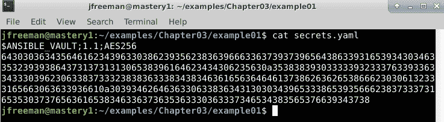

图 3.4 - 显示我们的新 Ansible Vault 实例的内容，这些内容在静止状态下是加密的

从标题中可以看出，`AES256`用于 vault 加密，这意味着只要您在创建 vault 时使用了一个好密码，您的数据就非常安全。

### 密码文件

要使用带有密码文件的`ansible-vault`，您首先需要创建这样一个文件。只需将密码回显到文件中即可。完成后，您现在可以在调用`ansible-vault`创建另一个加密文件时引用此文件。通过运行以下命令来尝试：

```
echo "my long password" > password_file
ansible-vault create --vault-id ./password_file more_secrets.yaml
```

这应该看起来像以下截图所示的输出：

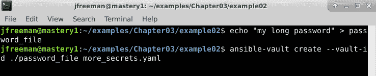

图 3.5 - 使用密码文件创建 Ansible Vault 实例

当你运行上述命令时，你会注意到你没有被要求输入密码 - 这次，保险库的密码是`my long password`字符串，它已经从`password_file`的内容中读取。默认编辑器将打开，此时可以像以前一样写入数据。

### 密码脚本

最后一个例子使用了一个密码脚本。这对于设计一个系统很有用，其中密码可以存储在一个中央系统中，用于存储凭据并与 playbook 树的贡献者共享。每个贡献者可以有自己的密码用于共享凭据存储，从中检索 Vault 密码。我们的例子将会简单得多：只是一个简单的输出到`STDOUT`，带有一个密码。这个文件将保存为`password.sh`。现在使用以下内容创建这个文件：

```
#!/bin/sh
echo "a long password"
```

为了让 Ansible 使用这个脚本，它必须被标记为可执行 - 对它运行以下命令以使其成为可执行文件：

```
chmod +x password.sh
```

最后，您可以通过运行以下命令创建一个使用`a long password`作为输出的新保险库，这是我们简单脚本的输出：

```
ansible-vault create --vault-id ./password.sh even_more_secrets.yaml
```

这个过程的输出应该看起来像这样：

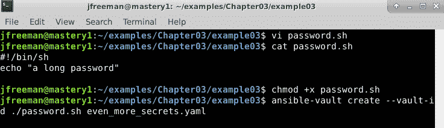

图 3.6 - 使用简单密码脚本创建 Ansible Vault 实例

自己尝试一下，看看它是如何工作的 - 你应该发现`ansible-vault`创建了一个使用`a long password`密码的保险库，正如脚本写入`STDOUT`的那样。你甚至可以尝试使用以下命令进行编辑：

```
ansible-vault edit --vault-id @prompt even_more_secrets.yaml
```

当提示时，现在你应该输入`a long password` - 然后你就可以成功编辑保险库了！

## 加密现有文件

之前的例子都涉及使用`create`子命令创建新的加密文件。但是如果我们想要获取一个已建立的文件并对其进行加密呢？也存在一个子命令来实现这一点。它被命名为`encrypt`，您可以通过运行以下命令查看此子命令的选项：

```
ansible-vault encrypt --help
```

输出将类似于下面截图中显示的内容：

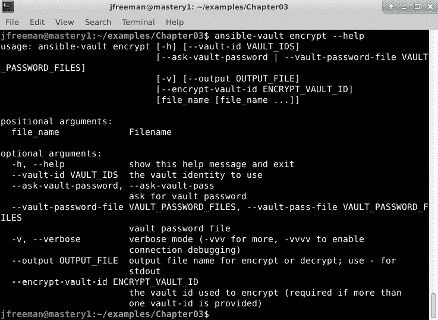

图 3.7 - Ansible Vault encrypt 子命令的可用选项

与`create`一样，`encrypt`需要一个`password`（或密码文件或可执行文件）和要加密的文件的路径。一旦接收到适当的密码，编辑器就会打开，这次我们的原始内容以明文的形式已经对我们可见。

请注意，要加密的文件必须已经存在。

让我们通过加密我们从*第一章*中得到的现有文件来演示一下，*Ansible 的系统架构和设计*，名为`Chapter01/example09/a_vars_file.yaml`。将此文件复制到一个方便的位置，然后使用以下命令对其进行加密：

```
ansible-vault encrypt --vault-id ./password.sh a_vars_file.yaml
```

这个过程的输出应该类似于下面截图中显示的内容：

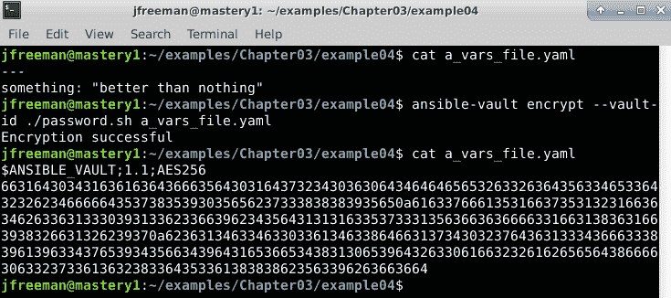

图 3.8 - 使用 Ansible Vault 加密现有变量文件

在这个例子中，我们可以在调用`encrypt`之前和之后看到文件内容，在此之后内容确实被加密了。与`create`子命令不同，`encrypt`可以操作多个文件，轻松地在一个操作中保护所有重要数据。只需列出要加密的所有文件，用空格分隔。

尝试加密已加密的文件将导致错误。

## 编辑加密文件

一旦文件被`ansible-vault`加密，就不能直接编辑。在编辑器中打开文件会显示加密数据。对文件进行任何更改都会损坏文件，Ansible 将无法正确读取内容。我们需要一个子命令，首先解密文件的内容，允许我们编辑这些内容，然后在保存回文件之前加密新内容。这样的子命令存在于`edit`中，您可以通过运行以下命令查看此子命令的可用选项：

```
ansible-vault edit --help
```

输出应该看起来类似于以下截图所示的内容：

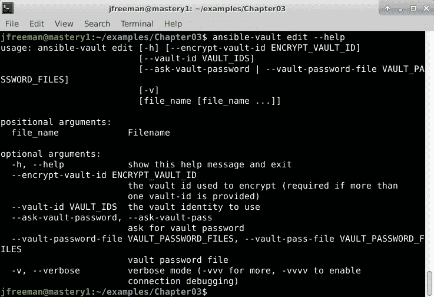

图 3.9 – Ansible Vault 编辑子命令的可用选项

正如我们已经看到的，我们的编辑器将以明文打开，我们可以看到我们的内容。所有我们熟悉的`vault-id`选项都回来了，以及要编辑的文件。因此，我们现在可以使用以下命令编辑刚刚加密的文件：

```
ansible-vault edit --vault-id ./password.sh a_vars_file.yaml
```

请注意，`ansible-vault`使用临时文件作为文件路径打开我们的编辑器。当您保存并退出编辑器时，临时文件将被写入，然后`ansible-vault`将对其进行加密并将其移动以替换原始文件。以下截图显示了我们以前加密的 vault 的未加密内容可供编辑：

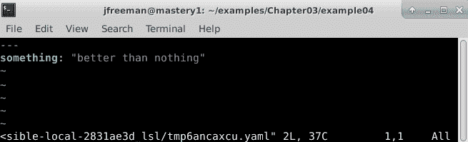

图 3.10 – 编辑我们以前加密的 Ansible Vault

您可以在编辑器窗口中看到的临时文件（`…/tmp6ancaxcu.yaml`）将在`ansible-vault`成功加密文件后被删除。

## 加密文件的密码轮换

随着贡献者的进出，定期更改用于加密您的机密的密码是一个好主意。加密的安全性取决于密码的保护程度。`ansible-vault`提供了一个`rekey`子命令，允许我们更改密码，您可以通过运行以下命令探索此子命令的可用选项：

```
ansible-vault rekey --help
```

输出应该看起来类似于以下截图所示的内容：

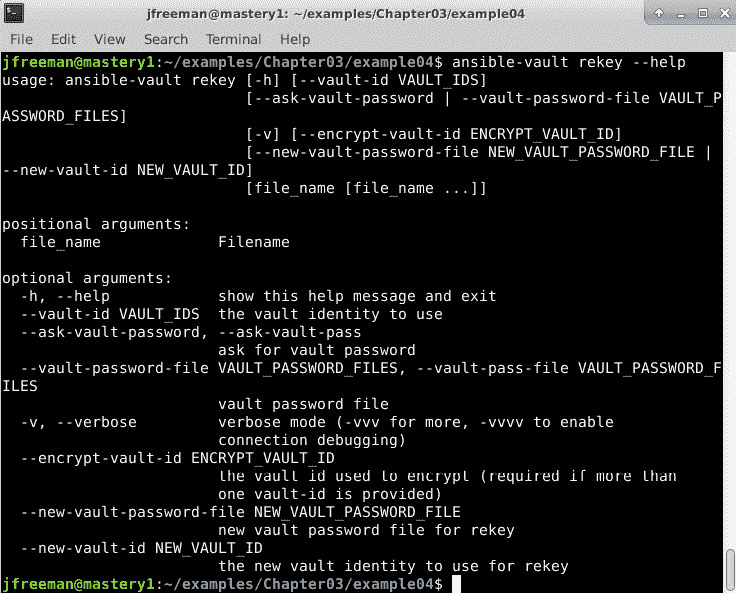

图 3.11 – Ansible Vault 重新生成子命令的可用选项

`rekey`子命令的操作方式与`edit`子命令类似。它接受一个可选的密码、文件或可执行文件，以及一个或多个要重新生成的文件。然后，您需要使用`--new-vault-id`参数来定义一个新密码（如果需要，还可以定义 ID），同样可以通过提示、文件或可执行文件来定义。让我们通过以下命令重新生成我们的`a_vars_file.yaml`文件，并将 ID 更改为`dev`，暂时我们将提示输入新密码，尽管我们知道我们可以使用我们的密码脚本获取原始密码：

```
ansible-vault rekey --vault-id ./password.sh --new-vault-id dev@prompt a_vars_file.yaml
```

输出应该看起来类似于以下截图所示的内容：

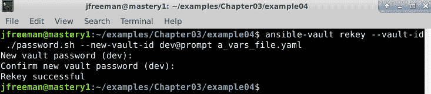

图 3.12 – 重新生成现有的 Ansible Vault 并同时更改 ID

请记住，所有具有**相同 ID**的加密文件都需要具有匹配的密码（或密钥）。确保同时重新生成具有相同 ID 的所有文件。

## 解密加密文件

如果在某个时候，不再需要加密数据文件，`ansible-vault`提供了一个子命令，可用于删除一个或多个加密文件的加密。这个子命令（令人惊讶地）被命名为`decrypt`，您可以通过运行以下命令查看此子命令的选项：

```
ansible-vault decrypt --help
```

输出应该看起来类似于以下截图所示的内容：

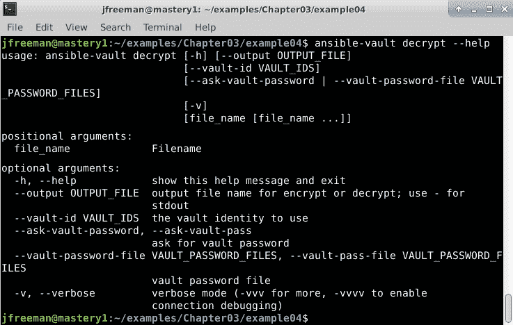

图 3.13 – Ansible Vault 解密子命令的可用选项

再次，我们有我们熟悉的`--vault-id`选项，然后是一个或多个要解密的文件路径。让我们通过运行以下命令解密我们刚刚重新生成的文件：

```
ansible-vault decrypt --vault-id dev@prompt a_vars_file.yaml
```

如果成功，你的解密过程应该看起来像以下截图所示：

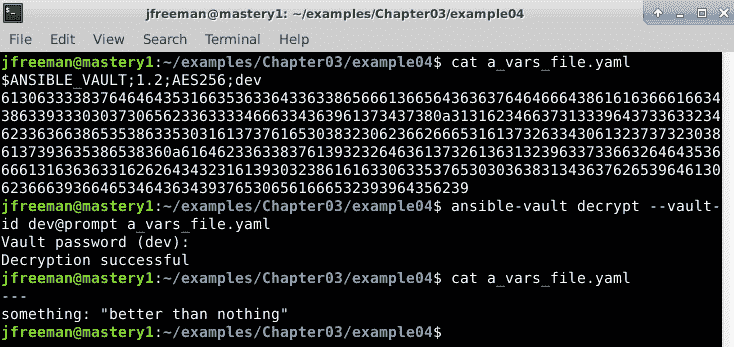

图 3.14–解密现有保险库

在下一节中，我们将看到如何在引用加密文件时执行`ansible-playbook`。

# 使用加密文件执行 ansible-playbook

为了使用我们的加密内容，我们首先需要告诉`ansible-playbook`如何访问它可能遇到的任何加密数据。与`ansible-vault`不同，后者仅用于处理文件加密或解密，`ansible-playbook`更通用，它不会默认假设它正在处理加密数据。幸运的是，我们在之前示例中熟悉的所有`--vault-id`参数在`ansible-playbook`中的工作方式与在`ansible-vault`中的工作方式完全相同。Ansible 将在 playbook 执行期间将提供的密码和 ID 保存在内存中。

现在让我们创建一个名为`show_me.yaml`的简单 playbook，它将打印出我们在之前示例中加密的`a_vars_file.yaml`中变量的值，如下所示：

```
--- 
- name: show me an encrypted var 
  hosts: localhost 
  gather_facts: false 

  vars_files: 
    - a_vars_file.yaml 

  tasks: 
    - name: print the variable 
      ansible.builtin.debug: 
        var: something 
```

现在，让我们运行 playbook 并看看会发生什么。注意我们如何以与`ansible-vault`完全相同的方式使用`--vault-id`参数；两个工具之间保持连续性，因此你可以应用你在本章早些时候学到的关于使用`--vault-id`的一切。如果你之前没有完成这一步，请使用以下命令加密你的变量文件：

```
chmod +x password.sh
ansible-vault encrypt --vault-id dev@./password.sh a_vars_file.yaml
```

完成后，现在使用以下命令运行 playbook—注意`--vault-id`参数的存在，与之前类似：

```
ansible-playbook -i mastery-hosts --vault-id dev@./password.sh showme.yaml
```

完成后，你的输出应该看起来像以下截图所示：

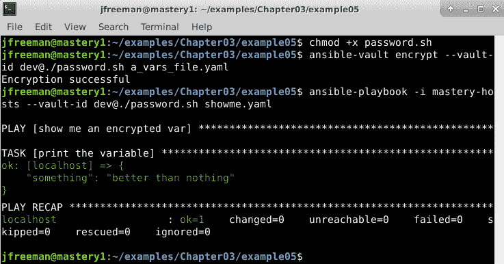

图 3.15–运行包含加密的 Ansible Vault 实例的简单 playbook

正如你所看到的，playbook 成功运行并打印出变量的未加密值，即使我们包含的源变量文件是一个加密的 Ansible Vault 实例。当然，在真正的 playbook 运行中，你不会将秘密值打印到终端上，但这演示了从保险库中访问数据有多么容易。

到目前为止，在我们的所有示例中，我们已经创建了作为外部实体的保险库—这些文件存在于 playbook 之外。然而，将加密的保险库数据添加到一个否则未加密的 playbook 中是可能的，这样可以减少我们需要跟踪和编辑的文件数量。让我们看看在下一节中如何实现这一点。

# 混合加密数据与普通 YAML

在发布 Ansible 2.3 之前，安全数据必须加密在一个单独的文件中。出于我们之前讨论的原因，希望尽可能少地加密数据。现在通过`ansible-vault`的`encrypt_string`子命令可以实现这一点（并且还可以节省作为 playbook 一部分的太多个别文件的需要），它会生成一个加密字符串，可以放入 Ansible YAML 文件中。让我们以以下基本 playbook 作为示例：

```
---
- name: inline secret variable demonstration
  hosts: localhost
  gather_facts: false
  vars:
    my_secret: secure_password
  tasks:
    - name: print the secure variable
      ansible.builtin.debug:
        var: my_secret
```

我们可以使用以下命令运行这段代码（尽管不安全！）：

```
ansible-playbook -i mastery-hosts inline.yaml
```

当这个 playbook 运行时，输出应该类似于以下截图所示：

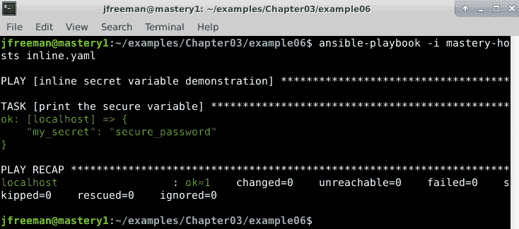

图 3.16–运行包含敏感数据的未加密 playbook

现在，显然不能像这样留下一个安全密码的明文。因此，我们将使用`ansible-vault`的`encrypt_string`子命令对其进行加密。如果您想查看运行此子命令时可用的选项，可以执行以下命令：

```
ansible-vault encrypt_string --help
```

该命令的输出应该与下面截图中显示的类似：

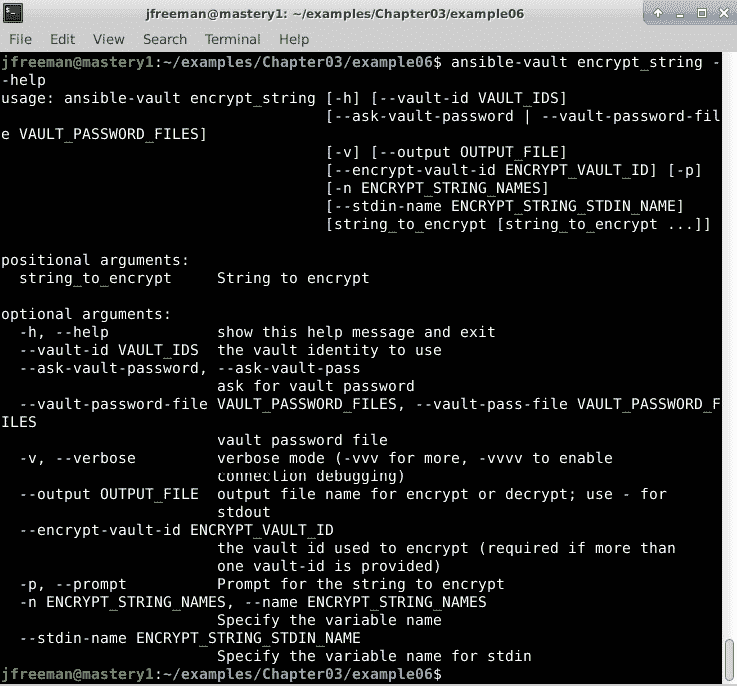

图 3.17 – Ansible Vault 的 encrypt_string 子命令的可用选项

因此，如果我们想要为我们的`my_secret`变量使用`test` Vault ID 和我们之前为密码创建的`password.sh`脚本，创建一个加密的文本块，我们将运行以下命令：

```
chmod +x password.sh
ansible-vault encrypt_string --vault-id test@./password.sh "secure_password" --name my_secret
```

这些命令的输出将为您提供要包含在现有 playbook 中的加密字符串，下面的截图中显示了一个示例：

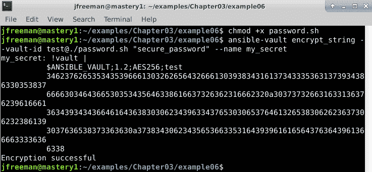

图 3.18 – 使用 Ansible Vault 将变量加密为安全字符串

现在，我们可以将该输出复制粘贴到我们的 playbook 中，确保我们的变量不再是人类可读的，就像下面的截图中演示的那样：

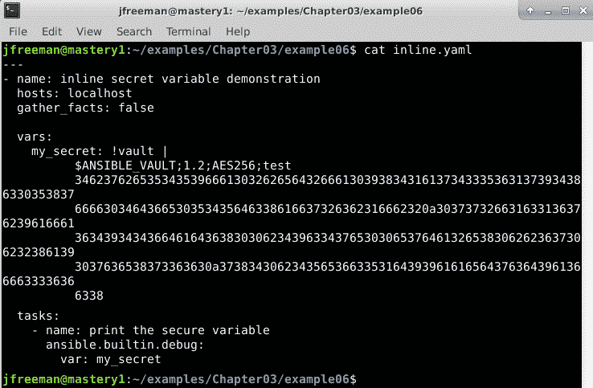

图 3.19 – 在现有的 playbook 中用加密字符串数据替换未加密的变量

尽管我们现在直接在我们的 playbook 中嵌入了一个 Ansible Vault 加密的变量，但我们可以像以前一样使用适当的`--vault-id`运行此 playbook—下面的命令将在这里使用：

```
ansible-playbook -i mastery-hosts --vault-id test@./password.sh inline.yaml
```

您将观察到 playbook 正在运行，并且可以访问信息，就像任何其他 vault 数据一样，并且您的输出应该与下面的截图中显示的类似：

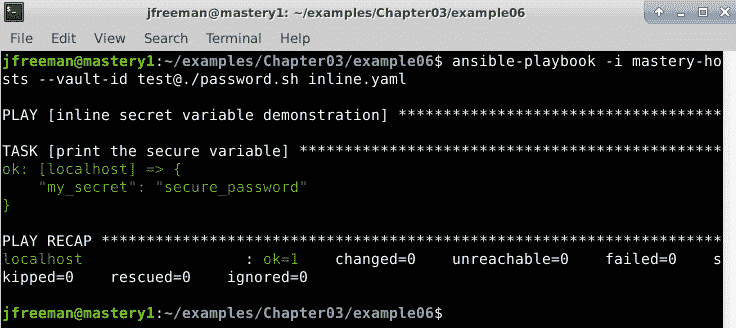

图 3.20 – 运行包含加密字符串的 Ansible playbook

您可以看到，当所有数据对世界都是公开的时，playbook 的运行方式与我们第一次测试时完全相同！然而，现在，我们已经成功地将加密数据与一个否则未加密的 YAML playbook 混合在一起，而无需创建单独的 Vault 文件。

在下一节中，我们将更深入地探讨与 Ansible Vault 一起运行 playbook 的一些操作方面。

# 在操作时保护秘密

在本章的前一节中，我们讨论了如何在文件系统上保护您的秘密。然而，这并不是在操作 Ansible 与秘密时唯一关注的问题。这些秘密数据将用于任务作为模块参数、循环输入或任何其他事情。这可能导致数据传输到远程主机，记录到本地或远程日志文件，甚至显示在屏幕上。本章的这一部分将讨论在操作过程中保护您的秘密的策略。

## 传输到远程主机的秘密

正如我们在*第一章*中所学到的，*Ansible 的系统架构和设计*，Ansible 将模块代码和参数组合起来，并将其写入远程主机上的临时目录。这意味着您的秘密数据通过网络传输，并写入远程文件系统。除非您使用的是**安全外壳**（**SSH**）或**安全套接字层**（**SSL**）加密的**Windows 远程管理**（**WinRM**）之外的连接插件，否则通过网络传输的数据已经加密，防止您的秘密被简单窥视发现。如果您使用的是除 SSH 之外的连接插件，请注意数据在传输时是否加密。强烈建议使用任何未加密的连接方法。

一旦数据传输完成，Ansible 可能会以明文形式将这些数据写入文件系统。如果不使用流水线传输（我们在*第一章*中了解过，*Ansible 的系统架构和设计*），或者如果已经指示 Ansible 通过`ANSIBLE_KEEP_REMOTE_FILES`环境变量保留远程文件，就会发生这种情况。没有流水线传输，Ansible 将模块代码和参数写入一个临时目录，该目录将在执行后立即删除。如果在写出文件和执行之间失去连接，文件将保留在远程文件系统上，直到手动删除。如果明确指示 Ansible 保留远程文件，即使启用了流水线传输，Ansible 也会写入并保留远程文件。在处理高度敏感机密信息时，应谨慎使用这些选项，尽管通常情况下，只有 Ansible 在远程主机上进行身份验证的用户（或通过特权升级成为的用户）应该可以访问剩余的文件。简单地删除远程用户的`~/.ansible/tmp/`路径中的任何内容就足以清除机密信息。

## 记录到远程或本地文件的机密信息

当 Ansible 在主机上运行时，它将尝试将操作记录到`syslog`（如果使用了冗长度级别 3 或更高）。如果这个操作是由具有适当权限的用户执行的，它将导致在主机的`syslog`文件中出现一条消息。此消息包括模块名称和传递给该命令的参数，其中可能包括您的机密信息。为了防止这种情况发生，存在一个名为`no_log`的操作和任务键。将`no_log`设置为`true`将阻止 Ansible 将操作记录到`syslog`。

Ansible 还可以被指示在本地记录其操作。这可以通过 Ansible 配置文件中的`log_path`或通过名为`ANSIBLE_LOG_PATH`的环境变量来控制。默认情况下，日志记录是关闭的，Ansible 只会记录到`STDOUT`。在`config`文件中打开日志记录会导致 Ansible 将其活动记录到`logpath` `config`设置中定义的文件中。

或者，将`ANSIBLE_LOG_PATH`变量设置为可以被运行`ansible-playbook`的用户写入的路径，也会导致 Ansible 将操作记录到该路径。此日志的冗长度与屏幕显示的冗长度相匹配。默认情况下，屏幕上不显示任何变量或返回细节。在冗长度级别为 1（`-v`）时，返回数据将显示在屏幕上（可能也会显示在本地日志文件中）。将冗长度调到级别 3（`-vvv`）时，输入参数也可能会显示。由于这可能包括机密信息，因此`no_log`设置也适用于屏幕显示。让我们以前面显示加密机密信息的示例，并在任务中添加一个`no_log`键，以防止显示其值，如下所示：

```
--- 
- name: show me an encrypted var 
  hosts: localhost 
  gather_facts: false 

  vars_files: 
    - a_vars_file.yaml 

  tasks: 
    - name: print the variable 
      ansible.builtin.debug: 
        var: something 
      no_log: true 
```

我们将以与以前相同的方式执行此操作手册（但增加了冗长度，如使用`-v`标志指定的那样），通过运行以下命令来执行——如果需要的话，请记得先加密变量文件：

```
ansible-playbook -i mastery-hosts --vault-id test@./password.sh showme.yaml -v
```

我们应该看到我们的机密数据受到了保护，即使我们故意尝试使用`ansible.builtin.debug`打印它，如下面的屏幕截图所示：

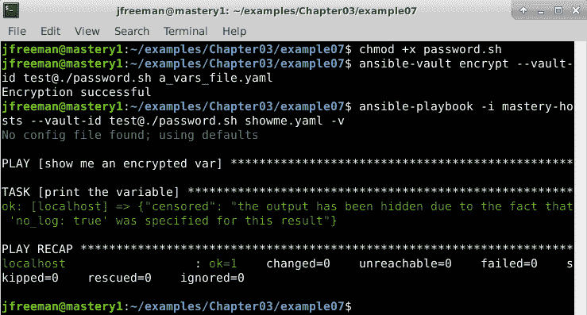

图 3.21 – 加密变量文件并运行一个保护敏感数据的操作手册

正如您所看到的，Ansible 对自身进行了审查，以防止显示敏感数据。`no_log` 键可用作指令，用于操作、角色、块或任务。

这就结束了我们对 Ansible Vault 的操作使用的介绍，也结束了对 Ansible Vault 主题的讨论——希望本章对教会您如何在使用 Ansible 进行自动化时保护敏感数据方面是有用的。

# 总结

在本章中，我们介绍了 Ansible 如何有效且安全地处理敏感数据，利用最新的 Ansible 功能，包括使用不同密码保护不同数据和将加密数据与普通 YAML 混合。我们还展示了这些数据在静止状态下的存储方式以及在使用时如何处理这些数据，只要小心谨慎，Ansible 就可以保护您的秘密。

您学会了如何使用`ansible-vault`工具来保护敏感数据，包括创建、编辑和修改加密文件以及提供 Vault 密码的各种方法，包括提示用户、从文件获取密码和运行脚本来检索密码。您还学会了如何将加密字符串与普通 YAML 文件混合，以及这如何简化 playbook 布局。最后，您学会了使用 Ansible Vault 的操作方面，从而防止 Ansible 将数据泄漏到远程日志文件或屏幕显示。

在我们的下一章中，我们将探讨如何将 Ansible 的强大功能应用于 Windows 主机，以及如何利用这一功能。

# 问题

1.  Ansible Vault 使用哪种加密技术在静止状态下加密您的数据？

a) 三重 DES/3DES

b) MD5

c) AES

d) Twofish

1.  Ansible Vault 实例必须始终存在为 playbook 本身的单独文件：

a) 真

b) 假

1.  在运行 playbook 时，您可以从多个 Ansible Vault 实例中摄取数据：

a) 真

b) 假

1.  在执行使用 Vault 加密数据的 playbook 时，您可以提供密码：

a) 在 playbook 启动时进行交互

b) 使用仅包含密码的明文文件

c) 使用脚本从另一个来源检索密码

d) 以上所有

1.  在 playbook 运行期间，Ansible 永远不会将 vault 数据打印到终端：

a) 真

b) 假

1.  您可以使用以下任务参数防止 Ansible 在 playbook 运行期间无意中将 vault 数据打印到终端：

a) `no_print`

b) `no_vault`

c) `no_log`

1.  中断的 playbook 运行可能会在远程主机上留下敏感的未加密数据：

a) 真

b) 假

1.  在运行时用于区分不同 vault（可能具有不同密码）的是什么？

a) Vault 名称

b) Vault ID

c) Vault 标识符

d) 以上都不是

1.  您可以使用哪个 Ansible 命令编辑现有的加密 vault？

a) `ansible-vault vi`

b) `ansible-vault change`

c) `ansible-vault update`

d) `ansible-vault edit`

1.  为什么您可能不希望在 vault 中混合敏感和非敏感数据？

a) 这样做会使得难以运行`diff`命令并查看**版本控制系统**（**VCS**）中的更改。

b) 只允许在 Ansible Vault 中放置敏感数据。

c) Ansible Vault 的容量有限。

d) Ansible Vault 使得访问受保护的数据变得困难。
