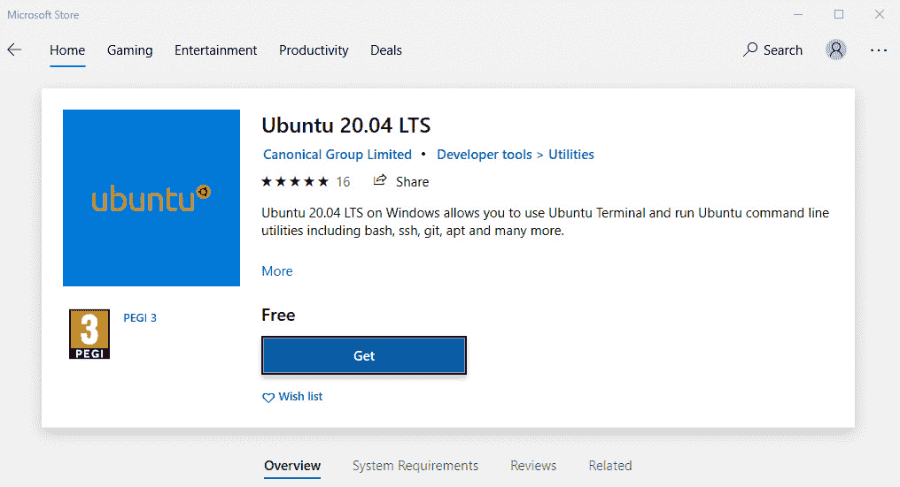
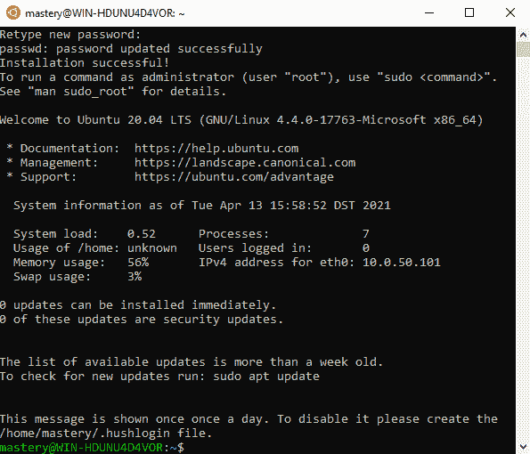
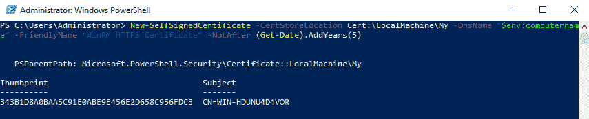
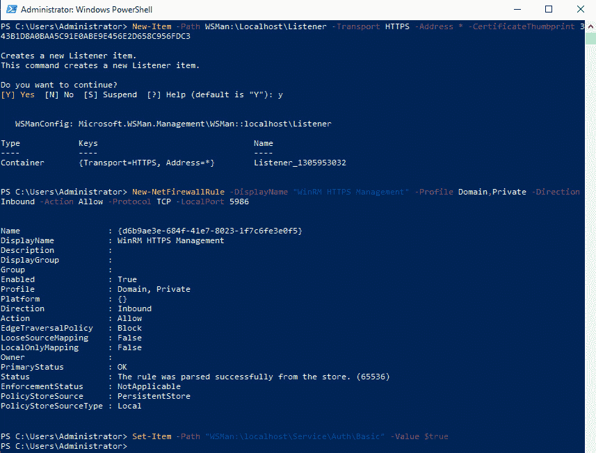
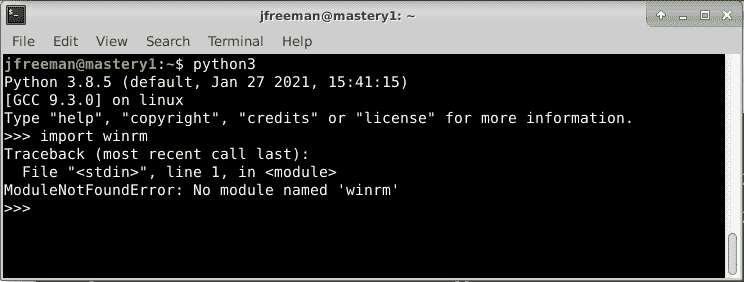
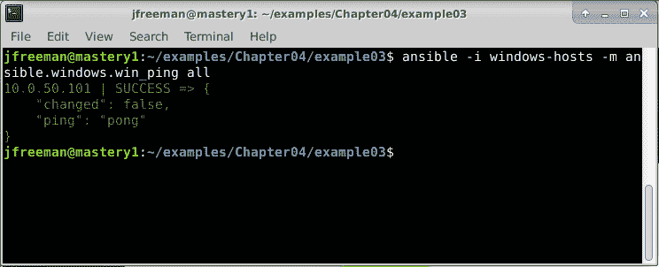
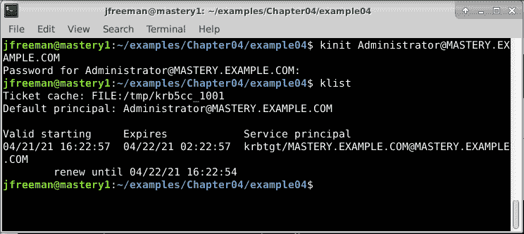
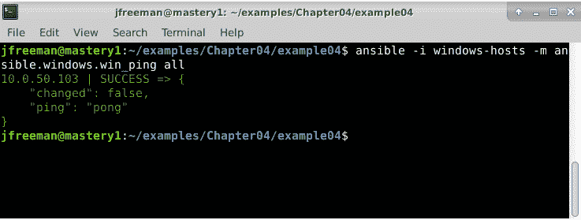
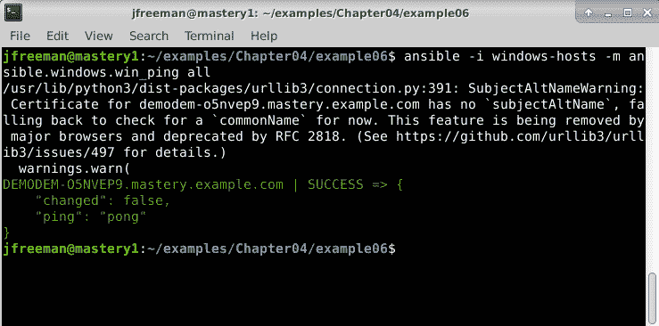
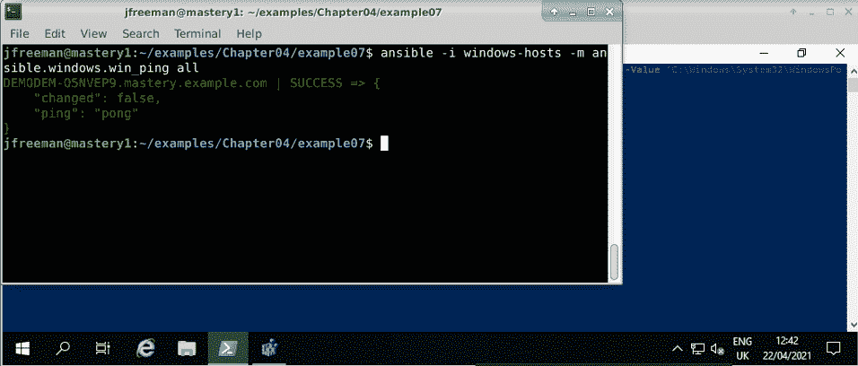

# *第四章*：Ansible 和 Windows-不仅仅适用于 Linux

大量的工作都是在 Linux 操作系统上进行的；事实上，本书的前两版完全围绕在 Linux 中使用 Ansible 展开。然而，大多数环境并不是这样的，至少会有一些微软 Windows 服务器和桌面机器。自本书的第三版出版以来，Ansible 已经进行了大量工作，创建了一个真正强大的跨平台自动化工具，它在 Linux 数据中心和 Windows 数据中心同样得心应手。当然，Windows 和 Linux 主机的操作方式存在根本差异，因此并不奇怪，Ansible 在 Linux 上自动化任务的方式与在 Windows 上自动化任务的方式之间存在一些根本差异。

我们将在本章中介绍这些基础知识，以便为您提供一个坚实的基础，开始使用 Ansible 自动化您的 Windows 任务，具体涵盖以下领域：

+   在 Windows 上运行 Ansible

+   为 Ansible 控制设置 Windows 主机

+   处理 Windows 身份验证和加密

+   使用 Ansible 自动化 Windows 任务

# 技术要求

要按照本章介绍的示例，您需要一台运行 Ansible 4.3 或更新版本的 Linux 机器。几乎任何 Linux 的版本都可以；对于那些对细节感兴趣的人，本章中提供的所有代码都是在 Ubuntu Server 20.04 LTS 上测试的，除非另有说明，并且在 Ansible 4.3 上也进行了测试。

在本章中使用 Windows 时，示例代码是在 Windows Server 2019 的 1809 版本、构建 17763.1817 上进行测试和运行的。Windows Store 的屏幕截图是从 Windows 10 Pro 的 20H2 版本、构建 19042.906 中获取的。

本章附带的示例代码可以从 GitHub 的以下网址下载：[`github.com/PacktPublishing/Mastering-Ansible-Fourth-Edition/tree/main/Chapter04`](https://github.com/PacktPublishing/Mastering-Ansible-Fourth-Edition/tree/main/Chapter04)。

查看以下视频以查看代码的实际操作：[`bit.ly/3B2zmvL`](https://bit.ly/3B2zmvL)。

# 在 Windows 上运行 Ansible

如果您浏览 Ansible 的官方安装文档，您会发现针对大多数主流 Linux 变体、Solaris、macOS 和 FreeBSD 的各种说明。然而，您会注意到，没有提到 Windows。这是有充分理由的 - 对于那些对技术细节感兴趣的人来说，Ansible 在其操作中广泛使用 POSIX `fork()`系统调用，而 Windows 上并不存在这样的调用。POSIX 兼容项目，如备受尊敬的 Cygwin，曾试图在 Windows 上实现`fork()`，但即使在今天，有时这并不起作用。因此，尽管在 Windows 上有一个可行的 Python 实现，但没有这个重要的系统调用，Ansible 无法在此平台上本地运行。

好消息是，如果您正在运行最新版本的 Windows 10，或 Windows Server 2016 或 2019，由于**Windows 子系统**（**WSL**），安装和运行 Ansible 现在变得非常容易。现在有两个版本的这项技术，原始的 WSL 发布版（在本书的第三版中有介绍），以及更新的**WSL2**。**WSL2**目前只在 Windows 10 的 1903 版本（或更高版本）上，构建 18362（或更高版本）上可用。这两项技术允许 Windows 用户在 Windows 之上运行未经修改的 Linux 发行版，而无需虚拟机的复杂性或开销（尽管在幕后，您会发现**WSL2**是在 Hyper-V 之上运行的，尽管以一种无缝的方式）。因此，这些技术非常适合运行 Ansible，因为它可以轻松安装和运行，并且具有可靠的`fork()`系统调用的实现。

在我们继续之前，让我们暂停一下看两个重要的点。首先，只有在 Windows 上运行 Ansible 来控制其他机器（运行任何操作系统）时，才需要 WSL 或 WSL2-不需要使用它们来控制 Windows 机器。我们将在本章后面更多地了解这一点。其次，不要让 WSL2 没有 Windows Server 的官方版本阻碍您-如果您有 Windows 堡垒主机，并希望从中运行 Ansible，它在**WSL**上和**WSL2**上都可以。在撰写本文时，有关**WSL2**在 Windows Server 的最新预览版中可用的消息；但是，我预计大多数读者将寻找稳定的、可用于生产的解决方案，因此我们将在本章更多地关注**WSL**而不是**WSL2**。

官方的 Ansible 安装文档可以在[`docs.ansible.com/ansible/latest/installation_guide/intro_installation.html`](https://docs.ansible.com/ansible/latest/installation_guide/intro_installation.html)找到。

## 检查您的构建

WSL 仅在特定版本的 Windows 上可用，如下所示：

+   Windows 10-版本 1607（构建 14393）或更高版本：

+   请注意，如果要通过 Microsoft Store 安装 Linux，则需要构建 16215 或更高版本。

+   如果您想要使用 WSL2，则需要 Windows 10 的 1903 版本或更高版本（18362 版本或更高版本）。

+   仅支持 64 位英特尔和 ARM 版本的 Windows 10。

+   Windows Server 2016 版本 1803（构建 16215）或更高版本

+   Windows Server 2019 版本 1709（构建 16237）或更高版本

您可以通过在 PowerShell 中运行以下命令轻松检查您的构建和版本号：

```
systeminfo | Select-String "^OS Name","^OS Version"
```

如果您使用的是较早版本的 Windows，仍然可以通过虚拟机或通过 Cygwin 运行 Ansible。但是，这些方法超出了本书的范围。

## 启用 WSL

验证了您的构建后，启用 WSL 很容易。只需以管理员身份打开 PowerShell 并运行以下命令：

```
Enable-WindowsOptionalFeature -Online -FeatureName Microsoft-Windows-Subsystem-Linux
```

安装完成后，您将能够选择并安装您喜欢的 Linux 发行版。有很多选择，但是为了运行 Ansible，选择官方 Ansible 安装说明中列出的发行版之一是有意义的，比如 Debian 或 Ubuntu。

## 在 WSL 下安装 Linux

如果您的 Windows 10 版本足够新，那么安装您喜欢的 Linux 就像打开 Microsoft Store 并搜索它一样简单。例如，搜索`Ubuntu`，您应该很容易找到。*图 4.1*显示了在 Windows 10 的 Microsoft Store 中可供下载的 Ubuntu 的最新 LTS 版本：



图 4.1-在 Windows 10 的 Microsoft Store 应用程序中可用的 WSL 和 WSL2 的 Linux 发行版之一

要在 WSL 下安装 Ubuntu，只需单击**获取**按钮，等待安装完成。

如果您使用的是 Windows 10，但是支持的构建早于 16215，或者确实是 Windows Server 2016/2019 的任何支持的构建，那么安装 Linux 就是一个稍微手动的过程。首先，从 Microsoft 下载您喜欢的 Linux 发行版，例如，可以使用以下 PowerShell 命令下载 Ubuntu 20.04：

```
Invoke-WebRequest -Uri https://aka.ms/wslubuntu2004 -OutFile Ubuntu.appx -UseBasicParsing
```

下载成功后，解压`Ubuntu.appx`文件-只要它在系统（引导）驱动器上，通常是`C:`上的任何位置即可。如果要保持 Linux 发行版的私密性，可以将其解压缩到个人资料目录中的某个位置，否则可以将文件解压缩到系统驱动器的任何位置。例如，以下 PowerShell 命令将解压缩存档到`C:\WSL\`：

```
Rename-Item Ubuntu.appx Ubuntu.zip 
Expand-Archive Ubuntu.zip C:\WSL\Ubuntu 
```

完成后，您可以使用以所选发行版命名的可执行文件启动新安装的 Linux 发行版。以我们的 Ubuntu 示例为例，您可以通过资源管理器（或您喜欢的方法）运行以下命令：

```
C:\WSL\Ubuntu\ubuntu2004.exe
```

第一次运行新安装的 Linux 发行版时，无论是通过 Microsoft Store 安装还是手动安装，它都会初始化自己。在此过程的一部分中，它将要求您创建一个新用户帐户。请注意，此帐户与您的 Windows 用户名和密码是独立的，因此请务必记住您在此设置的密码！每次通过`sudo`运行命令时都会需要它，尽管与任何 Linux 发行版一样，如果您愿意，可以通过`/etc/sudoers`自定义此行为。这在*图 4.2*中有所示：



图 4.2-WSL Ubuntu 终端在首次运行时的输出

恭喜！现在您在 WSL 下运行 Linux。从这里开始，您应该按照 Ansible 的标准安装过程进行操作，并且可以像在任何其他 Linux 系统上一样在 Linux 子系统上运行它。

# 使用 WinRM 为 Ansible 控制设置 Windows 主机

到目前为止，我们已经讨论了从 Windows 本身运行 Ansible。这对于企业环境尤其有帮助，尤其是在那些 Windows 终端用户系统是主流的情况下。但是，实际的自动化任务呢？好消息是，正如已经提到的，使用 Ansible 自动化 Windows 不需要 WSL。Ansible 的一个核心前提是无需代理，这对于 Windows 和 Linux 同样适用。可以合理地假设几乎任何现代 Linux 主机都将启用 SSH 访问，同样，大多数现代 Windows 主机都内置了一个远程管理协议，称为 WinRM。Windows 的狂热追随者将知道，微软在最近的版本中添加了 OpenSSH 客户端和服务器包，并且自本书上一版出版以来，已经为 Ansible 添加了对这些的实验性支持。出于安全原因，这两种技术默认情况下都是禁用的，因此，在本书的这一部分中，我们将介绍启用和保护 WinRM 以进行远程管理的过程。我们还将简要介绍在 Windows 上设置和使用 OpenSSH 服务器-然而，由于 Ansible 对此的支持目前是实验性的，并且在未来的版本中可能会有稳定性和向后不兼容的变化，大多数用户将希望使用 WinRM，尤其是在稳定的生产环境中。

有了这个想法，让我们开始看一下如何在本章的下一部分中使用 WinRM 自动化 Windows 主机上的任务。

## 使用 WinRM 进行 Ansible 自动化的系统要求

Ansible 使用 WinRM 意味着对新旧 Windows 版本有广泛的支持-在幕后，几乎任何支持以下内容的 Windows 版本都可以使用：

+   PowerShell 3.0

+   .NET 4.0

实际上，这意味着只要满足前面的要求，就可以支持以下 Windows 版本：

+   **桌面**：Windows 7 SP1，8.1 和 10

+   **服务器**：Windows Server 2008 SP2，2008 R2 SP1，2012，2012 R2，2016 和 2019

请注意，以前列出的旧操作系统（如 Windows 7 或 Server 2008）未附带.NET 4.0 或 PowerShell 3.0，并且在使用 Ansible 之前需要安装它们。正如您所期望的那样，支持更新版本的 PowerShell，并且对.NET 4.0 可能有安全补丁。只要满足这些最低要求，您就可以开始使用 Ansible 自动化 Windows 任务，即使在旧操作系统仍然占主导地位的商业环境中也是如此。

如果您使用的是较旧（但受支持的）PowerShell 版本，例如 3.0，请注意在 PowerShell 3.0 下存在一个 WinRM 错误，该错误限制了服务可用的内存，从而可能导致某些 Ansible 命令失败。这可以通过确保在运行 PowerShell 3.0 的所有主机上应用 KB2842230 来解决，因此，如果您正在通过 PowerShell 3.0 自动化 Windows 任务，请务必检查您的热修复和补丁。

## 启用 WinRM 监听器

一旦满足了先前详细介绍的所有系统要求，剩下的任务就是启用和保护 WinRM 监听器。完成这一步后，我们实际上可以对 Windows 主机本身运行 Ansible 任务！WinRM 可以在 HTTP 和 HTTPS 协议上运行，虽然通过纯 HTTP 快速且容易上手，但这会使您容易受到数据包嗅探器的攻击，并有可能在网络上泄露敏感数据。如果使用基本身份验证，情况尤其如此。默认情况下，也许并不奇怪，Windows 不允许使用 HTTP 或基本身份验证通过 WinRM 进行远程管理。

有时，基本身份验证就足够了（例如在开发环境中），如果要使用它，那么我们肯定希望启用 HTTPS 作为 WinRM 的传输！但是，在本章后面，我们将介绍 Kerberos 身份验证，这是更可取的，并且还可以使用域帐户。不过，为了演示将 Ansible 连接到具有一定安全性的 Windows 主机的过程，我们将使用自签名证书启用 WinRM 的 HTTPS，并启用基本身份验证，以便我们可以使用本地的`Administrator`帐户进行工作。

要使 WinRM 在 HTTPS 上运行，必须存在具有以下内容的证书：

+   与主机名匹配的`CN`值

+   在**增强密钥用途**字段中的`服务器身份验证（1.3.6.1.5.5.7.3.1）`

理想情况下，这应该由中央**证书颁发机构**（**CA**）生成，以防止中间人攻击等 - 更多内容稍后再讨论。但是，为了让所有读者都能够测试，我们将生成一个自签名证书作为示例。在 PowerShell 中运行以下命令以生成合适的证书：

```
New-SelfSignedCertificate -CertStoreLocation Cert:\LocalMachine\My -DnsName "$env:computername" -FriendlyName "WinRM HTTPS Certificate" -NotAfter (Get-Date).AddYears(5)
```

`New-SelfSignedCertificate`命令仅在较新版本的 Windows 上可用 - 如果您的系统上没有该命令，请考虑使用 Ansible 提供的自动化 PowerShell 脚本，网址为[`raw.githubusercontent.com/ansible/ansible/devel/examples/scripts/ConfigureRemotingForAnsible.ps1`](https://raw.githubusercontent.com/ansible/ansible/devel/examples/scripts/ConfigureRemotingForAnsible.ps1)。

这应该产生类似于*图 4.3*中显示的内容 - 请记下证书的指纹，稍后会用到：



图 4.3 - 使用 PowerShell 为 WinRM HTTPS 监听器创建自签名证书

有了证书，我们现在可以使用以下命令设置新的 WinRM 监听器：

```
New-Item -Path WSMan:\Localhost\Listener -Transport HTTPS -Address * -CertificateThumbprint <thumbprint of certificate>
```

成功后，该命令将在端口`5986`上设置一个带有我们之前生成的自签名证书的 WinRM HTTPS 监听器。为了使 Ansible 能够通过 WinRM 自动化此 Windows 主机，我们需要执行另外两个步骤 - 在防火墙上打开此端口，并启用基本身份验证，以便我们可以使用本地的`Administrator`帐户进行测试。使用以下两个命令可以实现这一点：

```
New-NetFirewallRule -DisplayName "WinRM HTTPS Management" -Profile Domain,Private -Direction Inbound -Action Allow -Protocol TCP -LocalPort 5986
Set-Item -Path "WSMan:\localhost\Service\Auth\Basic" -Value $true
```

您应该看到与*图 4.4*中显示的类似的先前命令的输出：



图 4.4 - 在 PowerShell 中创建和启用对 WinRM HTTPS 监听器的访问

这些命令已被单独拆分，以便让您了解为 Ansible 连接设置 Windows 主机所涉及的过程。对于自动化部署和系统，如果`New-SelfSignedCertificate`不可用，可以考虑使用官方 Ansible GitHub 帐户上提供的`ConfigureRemotingForAnsible.ps1`脚本，我们在本节前面已经提到过。该脚本执行了我们之前完成的所有步骤（以及更多），可以按照以下方式下载并在 PowerShell 中运行：

```
$url = "https://raw.githubusercontent.com/ansible/ansible/devel/examples/scripts/ConfigureRemotingForAnsible.ps1"
$file = "$env:temp\ConfigureRemotingForAnsible.ps1"
(New-Object -TypeName System.Net.WebClient).DownloadFile($url, $file)
powershell.exe -ExecutionPolicy ByPass -File $file
```

还有许多其他方法可以为 Ansible 配置 WinRM 所需的配置，包括通过组策略，这在企业环境中几乎肯定更可取。本章节提供的信息现在应该已经为您提供了在您的环境中设置 WinRM 所需的所有基础知识，准备好启用 Ansible 管理您的 Windows 主机。

## 使用 WinRM 连接 Ansible 到 Windows

一旦配置了 WinRM，让 Ansible 与 Windows 通信就相当简单，只要记住两个注意事项——它期望使用 SSH 协议，如果您没有指定用户账户，它将尝试使用与 Ansible 运行的用户账户相同的用户账户进行连接。这几乎肯定不会与 Windows 用户名一起使用。

此外，请注意，Ansible 需要安装`winrm` Python 模块才能成功连接。这并不总是默认安装的，因此在开始使用 Windows 主机之前，值得在 Ansible 系统上测试一下。如果不存在，您将看到类似于*图 4.5*中显示的错误：



图 4.5 - 在 Ubuntu Server 20.04 上测试 winrm Python 模块的存在

如果您看到此错误，您需要在继续之前安装该模块。您的操作系统可能有预打包版本可用，例如，在 Ubuntu Server 20.04 上，您可以使用以下命令安装它：

```
sudo apt install python3-winrm
```

如果没有预打包版本可用，可以使用以下命令直接从`pip`安装。请注意，在*第二章*中，我们讨论了使用 Python 虚拟环境安装 Ansible - 如果您已经这样做，您必须确保激活您的虚拟环境，然后在不使用`sudo`的情况下运行以下命令：

```
sudo pip3 install "pywinrm>=0.3.0"
```

完成后，我们可以测试之前的 WinRM 配置是否成功。对于基于 SSH 的连接，有一个名为`ansible.builtin.ping`的 Ansible 模块，它执行完整的端到端测试，以确保连接、成功的身份验证和远程系统上可用的 Python 环境。类似地，还有一个名为`win_ping`的模块（来自`ansible.windows`集合），它在 Windows 上执行类似的测试。

在我的测试环境中，我将准备一个清单，以连接到我新配置的 Windows 主机：

```
[windows]
10.50.0.101
[windows:vars]
ansible_user=Administrator
ansible_password="Password123"
ansible_port=5986
ansible_connection=winrm
ansible_winrm_server_cert_validation=ignore
```

请注意在 playbook 的`windows:vars`部分设置的`ansible_`开头的连接特定变量。在这个阶段，它们应该是相当容易理解的，因为它们在*第一章*中已经涵盖了 Ansible 的*系统架构和设计*，但特别要注意`ansible_winrm_server_cert_validation`变量，当使用自签名证书时需要设置为`ignore`。显然，在实际示例中，您不会将`ansible_password`参数以明文形式留下，它要么放在 Ansible vault 中，要么在启动时使用`--ask-pass`参数提示输入。

基于证书的身份验证也可以在 WinRM 上实现，它带来的好处和风险与基于 SSH 密钥的身份验证几乎相同。

使用先前的清单（根据您的环境进行适当更改，如主机名/IP 地址和身份验证详细信息），我们可以运行以下命令来测试连接：

```
ansible -i windows-hosts -m ansible.windows.win_ping all
```

如果一切顺利，您应该会看到类似于*图 4.6*中显示的输出：



图 4.6 - 使用 Ansible 的 ansible.windows.win_ping 模块测试 WinRM 上的 Windows 主机连接

这完成了将 Ansible 主机成功设置到 Windows 主机的端到端设置！通过这样的设置，您可以像在任何其他系统上一样编写和运行 playbooks，只是您必须使用专门支持 Windows 的 Ansible 模块。接下来，我们将致力于改进 Ansible 与 Windows 之间连接的安全性，最后转向一些 Windows playbook 的示例。

# 处理使用 WinRM 时的 Windows 认证和加密

现在我们已经建立了 Ansible 在 Windows 主机上使用 WinRM 执行任务所需的基本连接级别，让我们更深入地了解认证和加密方面的内容。在本章的前部分，我们使用了基本的认证机制与本地账户。虽然这在测试场景中是可以的，但在域环境中会发生什么呢？基本认证只支持本地账户，所以显然我们在这里需要其他东西。我们还选择不验证 SSL 证书（因为它是自签名的），这在测试目的上是可以的，但在生产环境中并不是最佳实践。在本节中，我们将探讨改进 Ansible 与 Windows 通信安全性的选项。

## 认证机制

事实上，当使用 WinRM 时，Ansible 支持五种不同的 Windows 认证机制，如下所示：

+   基本：仅支持本地账户

+   证书：仅支持本地账户，概念上类似于基于 SSH 密钥的认证

+   Kerberos：支持 AD 账户

+   NTLM：支持本地和 AD 账户

+   CredSSP：支持本地和 AD 账户

值得注意的是，Kerberos、NTLM 和 CredSSP 都提供了在 HTTP 上的消息加密，这提高了安全性。然而，我们已经看到了在 HTTPS 上设置 WinRM 有多么容易，而且 WinRM 管理在普通 HTTP 上默认情况下也是不启用的，所以我们将假设通信通道已经被加密。WinRM 是一个 SOAP 协议，意味着它必须在 HTTP 或 HTTPS 等传输层上运行。为了防止远程管理命令在网络上被拦截，最佳实践是确保 WinRM 在 HTTPS 协议上运行。

在这些认证方法中，最让我们感兴趣的是 Kerberos。Kerberos（在本章中）有效地取代了 NTLM，用于 Ansible 对 Active Directory 账户的认证。CredSSP 提供了另一种机制，但在部署之前最好了解与在目标主机上拦截明文登录相关的安全风险，事实上，它默认是禁用的。

在我们继续配置 Kerberos 之前，简要说明一下证书认证。虽然最初这可能看起来很吸引人，因为它实际上是无密码的，但是 Ansible 中的当前依赖关系意味着证书认证的私钥必须在 Ansible 自动化主机上是未加密的。在这方面，将基本或 Kerberos 认证会话的密码放在 Ansible vault 中实际上更安全（更明智）。我们已经介绍了基本认证，所以我们将把精力集中在 Kerberos 上。

由于 Kerberos 认证只支持 Active Directory 账户，因此假定要由 Ansible 控制的 Windows 主机已经加入了域。还假定 WinRM 在 HTTPS 上已经设置好，就像本章前面讨论的那样。

有了这些要求，我们首先要做的是在 Ansible 主机上安装一些与 Kerberos 相关的软件包。确切的软件包将取决于您选择的操作系统，但在 Red Hat Enterprise Linux/CentOS 8 上，它看起来会像这样：

```
sudo dnf -y install python3-devel krb5-devel krb5-libs krb5-workstation
```

在 Ubuntu 20.04 上，您需要安装以下软件包：

```
sudo apt-get install python3-dev libkrb5-dev krb5-user
```

信息

有关更广泛的操作系统的 Kerberos 支持的软件包要求，请参阅 Ansible 文档中有关 Windows 远程管理的部分：[`docs.ansible.com/ansible/latest/user_guide/windows_winrm.html`](https://docs.ansible.com/ansible/latest/user_guide/windows_winrm.html)。

除了这些软件包，我们还需要安装`pywinrm[kerberos]` Python 模块。可用性会有所不同——在 Red Hat Enterprise Linux/CentOS 8 上，它不作为 RPM 包提供，因此我们需要通过`pip`进行安装（同样，如果您使用了 Python 虚拟环境，请确保激活它，并且在没有`sudo`的情况下运行`pip3`命令）：

```
sudo dnf -y install gcc
sudo pip3 install pywinrm[kerberos]
```

请注意，`pip3`需要`gcc`来构建模块——如果不再需要，之后可以将其删除。

接下来，确保您的 Ansible 服务器可以解析您的 AD 相关的 DNS 条目。这个过程根据操作系统和网络架构会有所不同，但是至关重要的是，您的 Ansible 控制器必须能够解析您的域控制器的名称和其他相关条目，以便本过程的其余部分能够正常工作。

一旦您为 Ansible 控制主机配置了 DNS 设置，接下来，将您的域添加到`/etc/krb5.conf`。例如，我的测试域是`mastery.example.com`，我的域控制器是`DEMODEM-O5NVEP9.mastery.example.com`，所以我的`/etc/krb5.conf`文件底部看起来是这样的：

```
[realms]
MASTERY.EXAMPLE.COM = {
 kdc = DEMODEM-O5NVEP9.mastery.example.com
}
[domain_realm]
.mastery.example.com = MASTERY.EXAMPLE.COM
```

注意大写——这很重要！使用`kinit`命令测试您的 Kerberos 集成，使用已知的域用户帐户。例如，我将使用以下命令测试我的测试域的集成：

```
kinit Administrator@MASTERY.EXAMPLE.COM
klist
```

成功的测试结果应该像*图 4.7*中所示的那样：



图 4.7 – 在 Ubuntu Ansible 控制主机和 Windows 域控制器之间测试 Kerberos 集成

最后，让我们创建一个 Windows 主机清单——请注意，它几乎与我们在基本身份验证示例中使用的清单相同；只是这一次，在用户名之后，我们指定了 Kerberos 域：

```
[windows]
10.0.50.103
[windows:vars]
ansible_user=administrator@MASTERY.EXAMPLE.COM
ansible_password="Password123"
ansible_port=5986
ansible_connection=winrm
ansible_winrm_server_cert_validation=ignore
```

现在，我们可以像以前一样测试连接：



图 4.8 – 使用 ansible.windows.win_ping 模块和 Kerberos 身份验证进行 Ansible 连接测试

成功！前面的结果显示了与 Windows 的成功端到端连接，包括使用 Kerberos 对域帐户进行成功认证，并访问 WinRM 子系统。

## 关于账户的说明

默认情况下，WinRM 配置为仅允许由给定 Windows 主机上的本地`Administrators`组的成员进行管理。这不一定是管理员帐户本身——我们在这里使用它仅用于演示目的。可以启用使用权限较低的帐户进行 WinRM 管理，但是它们的使用可能会受到限制，因为大多数 Ansible 命令需要一定程度的特权访问。如果您希望通过 WinRM 为 Ansible 提供一个权限较低的帐户，可以在主机上运行以下命令：

```
winrm configSDDL default
```

运行此命令会打开一个 Windows 对话框。使用它来添加并授予（至少）`Read`和`Execute`权限给您希望具有 WinRM 远程管理能力的任何用户或组。

## 通过 WinRM 进行证书验证

到目前为止，我们一直忽略了 WinRM 通信中使用的自签名 SSL 证书——显然，这不是理想的情况，如果 SSL 证书不是自签名的，让 Ansible 验证 SSL 证书是非常简单的。

如果您的 Windows 机器是域成员，最简单的方法是使用**Active Directory Certificate Services**（**ADCS**）- 但是，大多数企业将通过 ADCS 或其他第三方服务拥有自己的认证流程。假设为了继续本节，所涉及的 Windows 主机已生成了用于远程管理的证书，并且 CA 证书以 Base64 格式可用。

就像我们之前在 Windows 主机上所做的那样，您需要设置一个 HTTPS 监听器，但这次要使用您的 CA 签名的证书。您可以使用以下命令（如果尚未完成）来执行此操作：

```
Import-Certificate -FilePath .\certnew.cer -CertStoreLocation Cert:\LocalMachine\My
```

自然地，将`FilePath`证书替换为与您自己证书位置匹配的证书。如果需要，您可以使用以下命令删除以前创建的任何 HTTPS WinRM 监听器：

```
winrm delete winrm/config/Listener?Address=*+Transport=HTTPS
```

然后，使用导入证书的指纹创建一个新的监听器：

```
New-Item -Path WSMan:\Localhost\Listener -Transport HTTPS -Address * -CertificateThumbprint <thumbprint of certificate>
```

现在到 Ansible 控制器。首先要做的是将 WinRM 监听器的 CA 证书导入到操作系统的 CA 捆绑包中。这种方法和位置在不同的操作系统之间会有所不同，但是在 Ubuntu Server 20.04 上，您可以将 Base64 编码的 CA 证书放在`/usr/share/ca-certificates/`中。请注意，为了被识别，CA 文件必须具有`.crt`扩展名。

完成此操作后，运行以下命令：

```
sudo dpkg-reconfigure ca-certificates
```

在被问及是否要信任新证书颁发机构的证书时选择“是”，并确保在下一个屏幕上呈现的列表中选择您的新证书文件名。

最后，我们需要告诉 Ansible 在哪里找到证书。默认情况下，Ansible 使用 Python Certifi 模块，并且除非我们告诉它否则，否则将使用默认路径。上述过程更新了 CA 捆绑包，位于`/etc/ssl/certs/ca-certificates.crt`，幸运的是，我们可以在清单文件中告诉 Ansible 在哪里找到它。请注意清单文件中所示的两个进一步更改，首先，我们现在已经指定了 Windows 主机的完整主机名，而不是 IP 地址，因为清单主机名必须与证书上的`CN`值匹配，以进行完整验证。此外，我们已经删除了`ansible_winrm_server_cert_validation`行，这意味着现在所有 SSL 证书都会被隐式验证：

```
[windows]
DEMODEM-O5NVEP9.mastery.example.com
[windows:vars]
ansible_user=administrator@MASTERY.EXAMPLE.COM
ansible_password="Password123"
ansible_port=5986
ansible_connection=winrm
ansible_winrm_ca_trust_path=/etc/ssl/certs/ca-certificates.crt
```

如果我们再次运行 ping 测试，我们应该会看到`SUCCESS`，如*图 4.9*所示：



图 4.9 - 使用 Kerberos 身份验证和 SSL 验证对 Windows 域控制器进行 Ansible ping 测试

显然，我们可以改进我们的证书生成以消除`subjectAltName`警告，但目前，这演示了 Ansible 与 Windows 的连接，使用 Kerberos 身份验证连接到域帐户并进行完整的 SSL 验证。这完成了我们对设置 WinRM 的介绍，并应为您提供了在您的基础架构中为 Ansible 设置 Windows 主机所需的所有基础知识。

在本章的下一部分中，我们将看一下在 Windows 上设置新支持的 OpenSSH 服务器，以启用 Ansible 自动化。

# 使用 OpenSSH 设置 Windows 主机以进行 Ansible 控制

微软在支持和拥抱开源社区方面取得了巨大进展，并向其操作系统添加了许多流行的开源软件包。就 Ansible 自动化而言，最值得注意的是备受推崇和非常受欢迎的 OpenSSH 软件包，它有客户端和服务器两种版本。

在 Ansible 2.8 中添加了使用 SSH 而不是 WinRM 作为传输的 Windows 自动化任务的支持 - 但是，应该注意官方 Ansible 文档中对此支持有许多警告 - 支持被描述为实验性，并且用户被警告未来可能会以不向后兼容的方式进行更改。此外，开发人员预计在继续测试时会发现更多的错误。

出于这些原因，我们已经付出了很多努力来描述使用 WinRM 自动化 Windows 主机与 Ansible。尽管如此，本章没有涉及使用 OpenSSH 为 Windows 启用 Ansible 自动化的内容将不完整。

Windows 上的 OpenSSH 服务器支持 Windows 10 版本 1809 及更高版本，以及 Windows Server 2019。如果您正在运行较旧版本的 Windows，则有两种选择 - 要么继续使用 WinRM 作为通信协议（毕竟，它是内置的，并且一旦您知道如何配置，就很容易），要么手动安装 Win32-OpenSSH 软件包 - 此过程在此处有详细描述，并且应该支持从 Windows 7 开始的任何版本：[`github.com/PowerShell/Win32-OpenSSH/wiki/Install-Win32-OpenSSH`](https://github.com/PowerShell/Win32-OpenSSH/wiki/Install-Win32-OpenSSH)。鉴于该软件包的积极开发，读者被建议在想要在较旧版本的 Windows 上安装 OpenSSH 服务器时参考此文档，因为说明可能在书籍印刷时已经发生了变化。

但是，如果您正在运行较新版本的 Windows，则安装 OpenSSH 服务器就很简单。首先，使用具有管理员权限的 PowerShell 会话，首先使用以下命令查询可用的`OpenSSH`选项：

```
Get-WindowsCapability -Online | ? Name -like 'OpenSSH*'
```

此命令的输出应该与*图 4.10*中的内容类似：

![图 4.10 - 在 Windows Server 2019 上的 PowerShell 中显示可用的 OpenSSH 安装选项

]

图 4.10 - 在 Windows Server 2019 上的 PowerShell 中显示可用的 OpenSSH 安装选项

使用此输出，运行以下命令安装 OpenSSH 服务器：

```
Add-WindowsCapability -Online -Name OpenSSH.Server~~~~0.0.1.0
```

接下来，运行以下命令以确保 SSH 服务器服务在启动时启动，已启动，并且存在适当的防火墙规则以允许 SSH 流量到服务器：

```
Start-Service sshd
Set-Service -Name sshd -StartupType 'Automatic'
Get-NetFirewallRule -Name *ssh*
```

如果不存在适当的防火墙规则，您可以使用以下命令添加一个：

```
New-NetFirewallRule -Name sshd -DisplayName 'OpenSSH Server (sshd)' -Enabled True -Direction Inbound -Protocol TCP -Action Allow -LocalPort 22
```

最后，Windows 的 OpenSSH 服务器默认为`cmd`。这对于交互式任务来说很好，但是大多数用于 Windows 的本机 Ansible 模块都是为了支持 PowerShell 而编写的 - 您可以通过在 PowerShell 中运行以下命令来更改 OpenSSH 服务器的默认 shell：

```
New-ItemProperty -Path 'HKLM:\SOFTWARE\OpenSSH' -Name 'DefaultShell' -Value 'C:\Windows\System32\WindowsPowerShell\v1.0\powershell.exe'
```

完成所有这些任务后，我们最终可以像以前一样测试我们的`ansible.windows.win_ping`模块。我们的清单文件将与 WinRM 的不同 - 以下内容应该作为您测试的一个合适的示例：

```
[windows]
DEMODEM-O5NVEP9.mastery.example.com
[windows:vars]
ansible_user=administrator@MASTERY.EXAMPLE.COM
ansible_password="Password123"
ansible_shell_type=powershell
```

请注意，我们不再关心证书验证或端口号，因为我们正在使用默认端口`22`上的 SSH。实际上，除了用户名和密码（您可以像我们在本书早期那样轻松地将其指定为`ansible`命令的命令行参数），唯一需要设置的清单变量是`ansible_shell_type`，除非我们另行告知，否则它将默认为 Bourne 兼容的 shell。

`win_ping`模块在测试连接时使用 PowerShell，使我们能够使用先前的临时命令来测试我们新的 SSH 连接到 Windows。只需运行此命令（现在应该看起来很熟悉！）：

```
ansible -i windows-hosts -m ansible.windows.win_ping all
```

即使我们现在使用了完全不同的通信协议，但是此命令的输出与之前完全相同，并且应该看起来像下面的*图 4.11*：



图 4.11——使用 SSH 作为传输机制测试 Windows 与 Ansible 集成

因此，将 Ansible 与 Windows 主机集成起来真的非常简单——只需确保关注新版本的发布说明和迁移指南，以防某些不兼容的变化。然而，我认为您会同意，使用 OpenSSH 将 Ansible 与 Windows 集成起来也很简单。当然，您可以以类似的方式设置 SSH 密钥认证，就像在任何其他基于 SSH 的主机上一样，以确保您可以在无需用户交互的情况下运行 playbooks。

现在，在通过 WinRM 和 SSH 演示与 Ansible 的 Windows 集成的方面，我们只使用了 Ansible `ansible.windows.win_ping`模块来测试连接。让我们通过一些简单的示例 playbooks 结束本章，以帮助您开始创建自己的 Windows 自动化解决方案。

# 使用 Ansible 自动化 Windows 任务

Ansible 4.3 包含的 Windows 模块列表可在以下链接找到，需要注意的是，虽然您可以在 Windows 主机上使用所有熟悉的 Ansible 构造，如`vars`、`handlers`和`blocks`，但在定义任务时必须使用特定于 Windows 的模块。引入了集合意味着很容易找到它们，`ansible.windows`集合是一个很好的起点。其中包含了您在 Ansible 2.9 及更早版本中使用的所有特定于 Windows 的模块：https://docs.ansible.com/ansible/latest/collections/index_module.html#ansible-windows。

在本章的这一部分中，我们将运行一些简单的 Windows playbook 示例，以突出编写 Windows playbook 时需要了解的一些内容。

## 选择正确的模块

如果您要针对 Linux 服务器运行 Ansible，并且想要创建一个目录，然后将文件复制到其中，您将使用`ansible.builtin.file`和`ansible.builtin.copy` Ansible 模块，playbook 看起来类似于以下内容：

```
---
- name: Linux file example playbook
  hosts: all
  gather_facts: false
  tasks:
    - name: Create temporary directory
      ansible.builtin.file:
        path: /tmp/mastery
        state: directory
    - name: Copy across a test file
      ansible.builtin.copy:
        src: mastery.txt
        dest: /tmp/mastery/mastery.txt
```

然而，在 Windows 上，此 playbook 将无法运行，因为`ansible.builtin.file`和`ansible.builtin.copy`模块与 PowerShell 或 cmd 不兼容，无论您使用 WinRM 还是 SSH 作为与 Windows 机器通信的协议。因此，执行相同任务的等效 playbook 在 Windows 上将如下所示：

```
---
- name: Windows file example playbook
  hosts: all
  gather_facts: false
  tasks:
    - name: Create temporary directory
      ansible.windows.win_file:
        path: 'C:\Mastery Test'
        state: directory
    - name: Copy across a test file
      ansible.windows.win_copy:
        src: ~/src/mastery/mastery.txt
        dest: 'C:\Mastery Test\mastery.txt'
```

请注意以下两个 playbook 之间的区别：

+   `ansible.windows.win_file`和`ansible.windows.win_copy`用于替代`ansible.builtin.file`和`ansible.builtin.copy`模块。

+   在`ansible.windows.win_file`和`ansible.windows.win_copy`模块的文档中建议在处理远程（Windows 路径）时使用反斜杠（`\`）。

+   继续在 Linux 主机上使用正斜杠（`/`）。

+   使用单引号（而不是双引号）引用包含空格的路径。

始终重要的是查阅 playbooks 中使用的各个模块的文档。例如，查看`ansible.windows.win_copy`模块的文档，它建议在进行大文件传输时使用`ansible.windows.win_get_url`模块，因为 WinRM 传输机制效率不高。当然，如果您使用 OpenSSH 服务器代替 WinRM，则可能不适用——在撰写本文时，该模块的文档尚未更新以考虑这一点。

还要注意，如果文件名包含某些特殊字符（例如方括号），则需要使用 PowerShell 转义字符````. For example, the following task would install the `c:\temp\setupdownloader_[aaff].exe` file:

````进行转义。

- 名称：安装软件包

win_package：

路径：'c:\temp\setupdownloader_`[aaff`].exe'

产品 ID：{00000000-0000-0000-0000-000000000000}

参数：/silent /unattended

状态：存在

```

Many other Windows modules should suffice to complete your Windows playbook needs, and, combined with these tips, you will get the end results you need, quickly and with ease.

## Installing software

Most Linux systems (and indeed other Unix variants) have a native package manager that makes it easy to install a wide variety of software. The `chocolatey` package manager makes this possible for Windows, and the Ansible `chocolatey.chocolatey.win_chocolatey` module makes installing software in an unattended manner with Ansible simple (note that this is not part of the `ansible.windows` collection that we have used so far, but instead lives in its own collection). 

You can explore the `chocolatey` repository and find out more about it at [`chocolatey.org`](https://chocolatey.org).

For example, if you wanted to roll out Adobe's Acrobat Reader across an estate of Windows machines, you could use either the `ansible.windows.win_copy` or `ansible.windows.win_get_url` modules to distribute the installer, and then the `ansible.windows.win_package` module to install it. However, the following code would perform the same task with less code:

```

- 名称：安装 Acrobat Reader

chocolatey.chocolatey.win_chocolatey：

名称：adobereader

状态：存在

```

There are all manner of clever installation routines you can run using the `chocolatey.chocolatey.win_chocolatey` module – for example, you can lock a package to a specific version, install a specific architecture, and much more – the documentation 
for this module includes a great many useful examples. The official Chocolatey website itself lists all the available packages – most of the common ones you would expect to need can be found there, so it should suffice for a great many installation scenarios you will come across.

## Extending beyond modules

Just as on any platform, there may come a time when the exact functionality required is not available from a module. Although writing a custom module (or modifying an existing one) is a viable solution to this, sometimes, a more immediate solution is required. To this end, the `ansible.windows.win_command` and `ansible.windows.win_shell` modules come to the rescue—these can be used to run literal PowerShell commands on Windows. Many examples are available in the official Ansible documentation, but the following code, for example, would create the `C:\Mastery` directory using PowerShell:

```

- 名称：使用 PowerShell 创建目录

ansible.windows.win_shell: New-Item -Path C:\Mastery -ItemType Directory

```

We could even revert to the traditional `cmd` shell for this task:

```

- 名称：使用 cmd.exe 创建目录

ansible.windows.win_shell: mkdir C:\MasteryCMD

参数：

可执行文件：cmd

```

With these pointers, it should be possible to create the desired functionality in just about any Windows environment.

That concludes our look at Windows automation with Ansible – as long as you remember to use the correct Windows native modules, you will be able to apply the rest of this book to Windows hosts just as easily as you would any given Linux host.

# Summary

Ansible handles Windows hosts as effectively as Linux (and other Unix) ones. In this chapter, we covered both how to run Ansible from a Windows host, and how to integrate Windows hosts with Ansible for automation, including the authentication mechanisms, encryption, and even the basics of Windows-specific playbooks.

You have learned that Ansible can run from a recent build of Windows that supports WSL, and how to achieve this. You have also learned how to set up Windows hosts for Ansible control and how to secure this with Kerberos authentication and encryption. You also learned how to set up and use the new and experimental support for SSH communication by Ansible with Windows hosts. Finally, you learned the basics of authoring Windows playbooks, including finding the correct modules for use with Windows hosts, escaping special characters, creating directories and copy files for the host, installing packages, and even running raw shell commands on the Windows host with Ansible. This is a sound foundation on which you will be able to build out the Windows playbooks needed to manage your own estate of Windows hosts.

In the next chapter, we will cover the effective management of Ansible in the enterprise with AWX.

# Questions

1.  Ansible can communicate with Windows hosts using:

    a) SSH

    b) WinRM

    c) Both of the above

2.  Ansible can reliably be run from Windows:

    a) Natively

    b) Using Python for Windows

    c) Through Cygwin

    d) Through WSL or WSL2

3.  The `ansible.builtin.file` module can be used to manipulate files on both Linux and Windows hosts:

    a) True

    b) False

4.  Windows machines can have Ansible automation run on them with no initial setup:

    a) True

    b) False

5.  The package manager for Windows is called:

    a) Bournville

    b) Cadbury

    c) Chocolatey

    d) RPM

6.  Ansible modules for Windows run their commands by default using:

    a) PowerShell

    b) `cmd.exe`

    c) Bash for Windows

    d) WSL

    e) Cygwin

7.  You can run Windows commands directly even if a module with the functionality you need does not exist:

    a) True

    b) False

8.  When manipulating files and directories on Windows with Ansible, you should:

    a) Use `\` for Windows path references, and `/` for files on the Linux host

    b) Use `/` for all paths

9.  Special characters in Windows filenames should be escaped with:

    a) `\`

    b) ```

c）`"`

d）`/`

1.  您的 Ansible 剧本必须根据您是使用 WinRM 还是 SSH 通信而进行更改：

a）真

b）假
