# *第五章*：使用 AWX 进行企业基础设施管理

可以明显看出，Ansible 是一个非常强大和多功能的自动化工具，非常适合管理整个服务器和网络设备。单调、重复的任务可以变得可重复和简单，节省大量时间！显然，在企业环境中，这是非常有益的。然而，这种力量是有代价的。如果每个人都在自己的机器上有自己的 Ansible 副本，那么你怎么知道谁运行了什么 playbook，以及何时运行的？如何确保所有 playbooks 都被正确存储和进行版本控制？此外，你如何防止超级用户级别的访问凭据在你的组织中泛滥，同时又能从 Ansible 的强大功能中受益？

这些问题的答案以 AWX 的形式呈现，它是一个用于 Ansible 的开源企业管理系统。AWX 是商业 Ansible Tower 软件的开源上游版本，可从 Red Hat 获得，它提供几乎相同的功能和好处，但没有 Red Hat 提供的支持或产品发布周期。AWX 是一个功能强大、功能丰富的产品，不仅包括 GUI，使非 Ansible 用户可以轻松运行 playbooks，还包括完整的 API，可集成到更大的工作流和 CI/CD 流水线中。

在本章中，我们将为您提供安装和使用 AWX 的坚实基础，具体涵盖以下主题：

+   启动和运行 AWX

+   将 AWX 与您的第一个 playbook 集成

+   超越基础知识

# 技术要求

要遵循本章中提出的示例，您需要一台运行 Ansible 4.3 或更新版本的 Linux 机器。几乎任何 Linux 版本都可以；对于那些对具体细节感兴趣的人，本章中提供的所有代码都是在 Ubuntu Server 20.04 LTS 上测试的，除非另有说明，并且在 Ansible 4.3 上测试。本章附带的示例代码可以从 GitHub 的以下网址下载：[`github.com/PacktPublishing/Mastering-Ansible-Fourth-Edition/tree/main/Chapter05`](https://github.com/PacktPublishing/Mastering-Ansible-Fourth-Edition/tree/main/Chapter05)。

查看以下视频，了解来自 Packt 的实际代码演示视频：[`bit.ly/3ndx73Q`](https://bit.ly/3ndx73Q)

# 启动和运行 AWX

在我们深入讨论安装 AWX 之前，值得简要探讨一下 AWX 是什么，以及它不是什么。AWX 是一个与 Ansible 并用的工具。它不以任何方式复制或复制 Ansible 的功能。事实上，当从 AWX 运行 Ansible playbooks 时，幕后实际上是调用了`ansible-playbook`可执行文件。AWX 应被视为一个补充工具，它增加了许多企业所依赖的以下好处：

+   丰富的基于角色的访问控制（RBAC）

+   与集中式登录服务（例如 LDAP 或 AD）集成

+   安全凭据管理

+   可审计性

+   问责制

+   降低新操作员的准入门槛

+   改进 playbook 版本控制的管理

+   完整的 API

大部分 AWX 代码在一组 Linux 容器中运行。然而，自上一版书以来，标准安装方法已经改变，现在更倾向于在 Kubernetes 上部署 AWX。如果您已经精通 Kubernetes，您可能希望尝试在自己的环境中部署，因为 AWX 应该可以在 Red Hat 的 OpenShift、开源 OKD 以及许多其他现有的 Kubernetes 版本上运行。

然而，如果您不精通 Kubernetes，或者正在寻找一些入门指南，那么我们将在本章的这一部分为您详细介绍如何从头开始完整安装 AWX。我们将基于出色的`microk8s`发行版进行，您可以在 Ubuntu Server 上只用一个命令即可在单个节点上启动和运行！

在开始之前，最后一点。尽管 Kubernetes 现在是首选的安装平台，但在撰写本文时，仍然有一个可用于 Docker 主机的安装方法。但是，AWX 项目的维护者指出，这仅针对开发和测试环境，并没有官方发布的版本。因此，我们在本章中不会涵盖这一点。但是，如果您想了解更多，可以阅读以下链接中的安装说明：[`github.com/ansible/awx/blob/devel/tools/docker-compose/README.md`](https://github.com/ansible/awx/blob/devel/tools/docker-compose/README.md)。

有了这个，让我们开始我们基于`microk8s`的部署。这里概述的安装过程假定您从未修改过的 Ubuntu Server 20.04 安装开始。

首先，让我们安装`microk8s`本身，使用 Ubuntu 提供的`snap`：

```
sudo snap install microk8s --classic
```

唯一需要的其他步骤是将您的用户帐户添加到`microk8s`组中，以便您可以在本节中运行剩余的命令而无需`sudo`权限：

```
sudo gpasswd -a $USER microk8s
```

您需要注销并重新登录，以使组成员身份的更改应用到您的帐户。一旦您这样做了，让我们开始准备`microk8s`进行 AWX 部署。我们需要`storage`、`dns`和`ingress`插件来进行我们的部署，因此让我们使用以下命令启用它们：

```
for i in storage dns ingress; do microk8s enable $i; done
```

现在我们准备安装 AWX Operator，这又用于管理其余的安装。安装这个就像运行以下命令一样简单：

```
microk8s kubectl apply -f https://raw.githubusercontent.com/ansible/awx-operator/devel/deploy/awx-operator.yaml
```

该命令将立即返回，而安装将在后台继续进行。您可以使用以下命令检查安装的状态：

```
microk8s kubectl get pods
```

`STATUS`字段应该在 AWX Operator 部署完成后显示`Running`。

重要提示

上一个命令将克隆 AWX Operator 的最新开发版本。如果您想克隆其中一个发布版，请浏览存储库的*Releases*部分，可在以下链接找到，并检出您想要的版本：[`github.com/ansible/awx-operator/releases`](https://github.com/ansible/awx-operator/releases)。

*图 5.1*中的屏幕截图显示了成功部署 AWX Operator 后的输出：

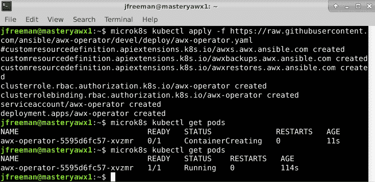

图 5.1 - 成功部署 AWX Operator 后的 microk8s pod 状态

接下来，我们将为我们的 AWX 部署创建一个简单的自签名证书。如果您有自己的证书颁发机构，当然可以生成适合您环境的证书。如果您要使用以下命令生成自签名证书，请确保将`awx.example.org`替换为您为 AWX 服务器分配的主机名：

```
openssl req -x509 -nodes -days 3650 -newkey rsa:2048 -keyout awx.key -out awx.crt -subj "/CN=awx.example.org/O=mastery" -addext "subjectAltName = DNS:awx.example.org"
```

我们将在 Kubernetes 中创建一个包含我们新生成的证书的 secret（包含少量敏感数据的对象）：

```
microk8s kubectl create secret tls awx-secret-ssl --namespace default --key awx.key --cert awx.crt
```

完成后，现在是考虑存储的时候了。AWX 旨在从源代码存储库（如 Git）中获取其 playbooks，并且因此，默认安装不提供对本地 playbook 文件的简单访问。但是，为了在本书中创建一个每个人都可以遵循的工作示例，我们将创建一个持久卷来存储本地 playbooks。创建一个名为`my-awx-storage.yml`的 YAML 文件，其中包含以下内容：

```
apiVersion: v1
kind: PersistentVolumeClaim
metadata:
  name: awx-pvc
spec:
  accessModes:
    - ReadWriteMany
  storageClassName: microk8s-hostpath
  resources:
    requests:
      storage: 1Gi
```

运行以下命令，使用我们刚创建的 YAML 文件来创建这个存储：

```
microk8s kubectl create -f my-awx-storage.yml
```

现在是部署 AWX 本身的时候了。为此，我们必须创建另一个描述部署的 YAML 文件。我们将称其为`my-awx.yml`，对于我们的示例，它应该包含以下内容：

```
apiVersion: awx.ansible.com/v1beta1
kind: AWX
metadata:
  name: awx
spec:
  tower_ingress_type: Ingress
  tower_ingress_tls_secret: awx-secret-ssl
  tower_hostname: awx.example.org
  tower_projects_existing_claim: awx-pvc
  tower_projects_persistence: true
```

使用以下命令使用此文件部署 AWX：

```
microk8s kubectl apply -f my-awx.yml
```

部署将需要几分钟时间，特别是第一次运行时，因为容器映像必须在后台下载。您可以使用以下命令检查状态：

```
microk8s kubectl get pods
```

当部署完成时，所有 pod 的`STATUS`应显示为`Running`，如*图 5.2*所示：

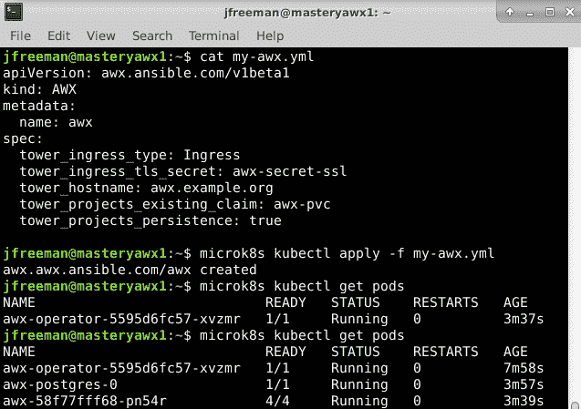

图 5.2-成功部署 AWX 后的 Kubernetes pod 状态

当然，如果我们无法访问 AWX，部署 AWX 就只能有限的用途。我们将使用 Microk8s 的入口附加组件创建一个入口路由器，以便我们可以在我们选择的主机名（在本例中为`awx.example.org`）上访问我们的 AWX 部署，通过标准的 HTTPS 端口。创建另一个 YAML 文件，这次称为`my-awx-ingress.yml`。它应包含以下内容：

```
apiVersion: networking.k8s.io/v1
kind: Ingress
metadata:
  name: awx-ingress
  annotations:
    nginx.ingress.kubernetes.io/rewrite-target: /$1
spec:
  tls:
  - hosts:
    - awx.example.org
    secretName: awx-secret-ssl
  rules:
    - host: awx.example.org
      http:
        paths:
          - backend:
              service:
                name: awx-service
                port:
                  number: 80
            path: /
            pathType: Prefix
```

部署，然后使用以下命令检查此入口定义：

```
microk8s kubectl apply -f my-awx-ingress.yml
microk8s kubectl describe ingress
```

如果您没有看到`Reason`值设置为`CREATE`的事件，您可能需要删除然后重新部署入口定义，如下所示：

```
microk8s kubectl delete -f my-awx-ingress.yml
microk8s kubectl apply -f my-awx-ingress.yml
```

入口规则的成功部署应该看起来像下图所示：

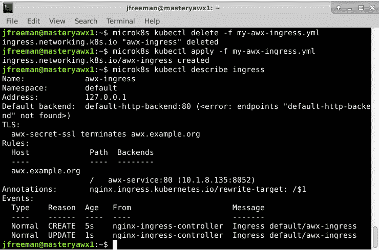

图 5.3-成功部署 AWX 的入口配置

登录到 AWX 的默认用户名是`admin`。但是，密码是随机生成的并存储在 Kubernetes 的一个秘密中。要检索这个密码以便您第一次登录，请运行以下命令：

```
microk8s kubectl get secret awx-admin-password -o jsonpath='{.data.password}' | base64 --decode
```

恭喜！您现在应该能够通过浏览器登录到您之前选择的主机名的 AWX 部署。在本例中，它将是[`awx.example.org`](https://awx.example.org)。

在第一次运行 AWX 时，许多操作（如构建数据库模式）都是在后台执行的。因此，最初看起来 GUI 没有响应。如果您的 pod 状态看起来健康，请耐心等待，几分钟后您将看到登录屏幕出现，如下图所示：

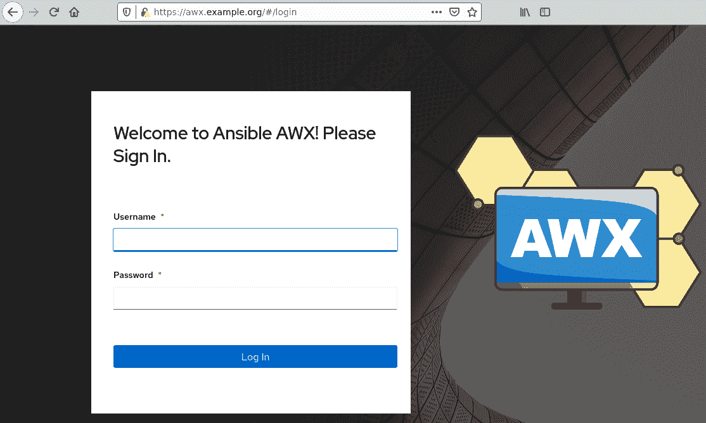

图 5.4-部署 AWX 后访问登录屏幕

当您第一次登录到 AWX 时，您将看到一个仪表板屏幕和左侧的菜单栏。通过这个菜单栏，我们将探索 AWX 并进行我们的第一个配置工作。同样值得注意的是，当首次安装 AWX 时，会填充一些示例内容，以帮助您更快地上手。请随意探索演示内容，因为示例与本书中给出的示例不同。

在我们完成本节之前，考虑一下我们之前创建的用于存储本地 playbooks 的持久卷。我们如何访问它？当使用`microk8s`的简单单节点部署时，您可以执行一些命令来查询环境并找出文件应该放在哪里。

首先，检索您的`hostpath-provisioner` pod 的名称。它应该看起来有点像`hostpath-provisioner-5c65fbdb4f-jcq8b`，可以使用以下命令检索：

```
microk8s kubectl get pods -A | awk '/hostpath/ {print $2}'
```

确定了这个唯一的名称后，运行以下命令来发现文件被存储在您的 pod 的本地目录。确保用您系统中的唯一`hostpath-provisioner`名称替换它：

```
microk8s kubectl describe -n kube-system pod/hostpath-provisioner-5c65fbdb4f-jcq8b | awk '/PV_DIR/ {print $2}'
```

最后，使用以下命令检索您的 AWX playbooks 的持久卷索赔的唯一名称：

```
microk8s kubectl describe pvc/awx-pvc | awk '/Volume:/ {print $2}'
```

您的最终路径将是这些结果的综合，包括`namespace`（在本例中为`default`），以及您的 PVC 名称（在之前的`my-awx-storage.yml`文件中定义为`awx-pvc`）。因此，在我的演示系统上，我的本地 playbooks 应放在以下目录下：

```
/var/snap/microk8s/common/default-storage/default-awx-pvc-pvc-52ea2e69-f3c7-4dd0-abcb-2a1370ca3ac6/
```

我们将在本章后面将一些简单的示例操作手册放入此目录，因此现在找到它并做个笔记，以便您可以轻松地在以后的示例中访问它。

在 Microk8s 上运行 AWX 后，我们将在下一节中查看如何将我们的第一个操作手册集成并运行在 AWX 中。

# 将 AWX 与您的第一个操作手册集成

将操作手册集成到 AWX 中涉及基本的四个阶段过程。一旦您理解了这一点，就为更高级的用法和在企业环境中更完整的集成铺平了道路。在本章的这一部分，我们将掌握这四个阶段，以便达到我们可以运行我们的第一个简单操作手册的地步，这将为我们在 AWX 中自信地前进提供基础。这四个阶段如下：

1.  定义项目。

1.  定义清单。

1.  定义凭据。

1.  定义模板。

前三个阶段可以以任何顺序执行，但最后一个阶段提到的模板将三个先前创建的方面汇集在一起。因此，它必须最后定义。还要注意，这些项目之间不需要一对一的关系。可以从一个项目创建多个模板。清单和凭据也是如此。

在我们开始之前，我们需要一个简单的操作手册，可以在本章的示例中使用。在 AWX 主机上，找到本地 AWX 持久卷文件夹（如果您在 Microk8s 上运行 AWX，则在上一节中有描述）。我将在以下命令中展示我的演示系统的示例，但您的系统将有其自己的唯一 ID。确保您调整路径以适应您的系统-复制和粘贴我的路径几乎肯定不起作用！

每个本地托管的项目必须在持久卷中有自己的子目录，因此让我们在这里创建一个：

```
cd /var/snap/microk8s/common/default-storage/default-awx-pvc-pvc-64aee7f5-a65d-493d-bdc1-2c33f7da8a4e
mkdir /var/lib/awx/projects/mastery
```

现在将以下示例代码放入此文件夹中，作为`example.yaml`：

```
---
- name: AWX example playbook
  hosts: all
  gather_facts: false
  tasks:
    - name: Create temporary directory
      ansible.builtin.file:
        path: /tmp/mastery
        state: directory
    - name: Create a file with example text
      ansible.builtin.lineinfile:
        path: /tmp/mastery/mastery.txt
        line: 'Created with Ansible Mastery!'
        create: yes
```

完成后，我们可以继续定义项目。

## 定义项目。

在 AWX 术语中，项目只是一组组合在一起的 Ansible 操作手册。这些操作手册的集合通常来自**源代码管理**（SCM）系统。事实上，这是在企业中托管 Ansible 操作手册的推荐方式。使用 SCM 意味着每个人都在使用相同版本的代码，并且所有更改都得到跟踪。这些是企业环境中至关重要的元素。

关于操作手册的分组，没有组织项目的正确或错误方式，因此这很大程度上取决于涉及的团队。简单地说，一个项目链接到一个存储库，因此如果多个操作手册存放在一个存储库中是有意义的，它们将存放在 AWX 中的一个项目中。但这不是必需的-如果适合您的需求，您可以每个项目只有一个操作手册！

如前所述，还可以在本地存储 Ansible 操作手册。在测试或刚开始时，这很有用，我们将在这里的示例中利用这种能力，因为它确保了阅读本书的每个人都可以轻松完成示例。

使用`admin`帐户登录 AWX 界面，然后单击左侧菜单栏上的**项目**链接。然后单击窗口右上角附近的**添加**按钮。这为我们创建了一个新的空白项目。

目前，我们不需要担心所有字段（我们将在后面详细讨论这些）。但是，我们需要配置以下内容：

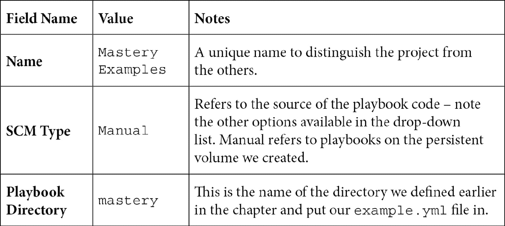

最终结果应该看起来像下图所示：

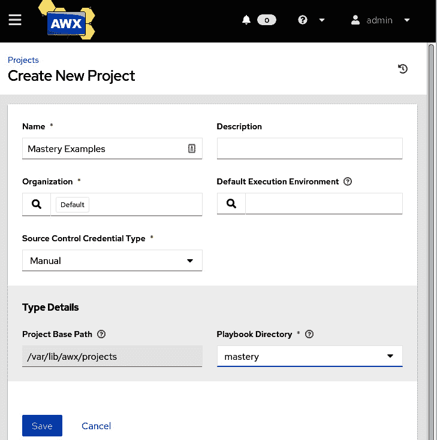

图 5.5-使用我们的本地操作手册目录在 AWX 中创建您的第一个项目

单击**保存**按钮以保存您的编辑。就是这样-您已经在 AWX 中定义了您的第一个项目！从这里开始，我们可以定义清单。

## 定义库存

AWX 中的库存与我们在*第一章*中使用命令行引用的库存完全相同，*Ansible 的系统架构和设计*，它们可以是静态的或动态的，可以由组和/或单个主机组成，并且可以在全局每组或每个主机基础上定义变量-我们现在只是通过用户界面定义它们。

单击左侧菜单栏上的**库存**项。与项目一样，我们想要定义新的内容，因此单击窗口右上方附近的**添加**按钮。将出现一个下拉列表。从中选择**添加库存**。

当**创建新库存**屏幕出现时，输入库存的名称（例如`Mastery Demo`），然后单击**保存**按钮。

重要说明

在定义主机或组之前，您必须保存空白库存。

完成后，您应该看到一个类似于以下图所示的屏幕：

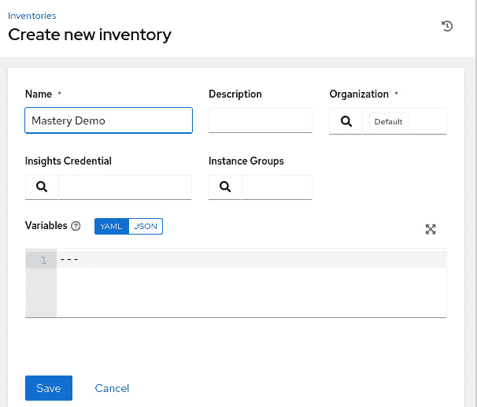

图 5.6-AWX 中创建新的空库存

保存新库存后，请注意库存子窗格顶部的选项卡-**详情**、**访问**、**组**、**主机**、**来源**和**作业**。您几乎可以在 AWX 用户界面的每个窗格上找到这样的选项卡-我们在本章早些时候定义了第一个项目后也看到了它们（在那个阶段我们只是不需要使用它们）。

为了简化我们的示例，我们将在一个组中定义一个主机，以便运行我们的示例 playbook。单击**组**选项卡，然后单击**添加**按钮以添加新的库存组。给组命名并单击**保存**，如下图所示：

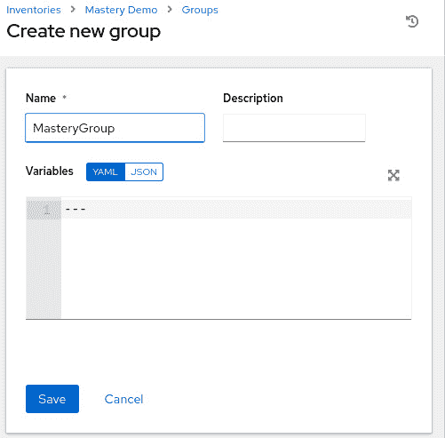

图 5.7-在 AWX 中创建新的库存组

现在单击**主机**选项卡，然后单击**添加**按钮，并从下拉菜单中选择**添加新主机**。将您的 AWX 主机的 IP 地址输入到**名称**字段中（如果您已设置 DNS 解析，则输入 FQDN）。如果需要，您还可以向主机添加描述，然后单击**保存**。最终结果应该看起来像以下图所示：

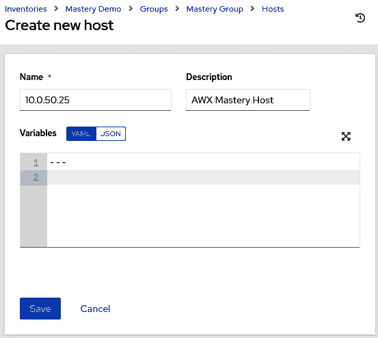

图 5.8-在 Mastery Demo 库存的 Mastery Group 组中创建新主机

重要说明

大多数库存屏幕上看到的**变量**框期望以 YAML 或 JSON 格式定义变量，而不是我们在命令行上使用的 INI 格式。在此之前，我们已经定义了变量，例如`ansible_ssh_user=james`，如果选择了 YAML 模式，我们现在将输入`ansible_ssh_user: james`。

干得好！您刚刚在 AWX 中创建了您的第一个库存。如果我们要在命令行上创建这个库存，它将如下所示：

```
[MasteryGroup]
10.0.50.25
```

这可能很简单，但它为我们运行第一个 playbook 铺平了道路。接下来，让我们看看 AWX 中凭据的概念。

## 定义凭据

AWX 适用于企业的一种方式是安全存储凭据。鉴于 Ansible 的性质和典型用例，通常以 SSH 密钥或具有 root 或其他管理级别特权的密码的形式提供*王国的钥匙*。即使在保险库中加密，运行 playbook 的用户也将拥有加密密码，因此可以获取凭据。显然，让许多人不受控制地访问管理员凭据可能是不可取的。幸运的是，AWX 解决了这个问题。

让我们举一个简单的例子。假设我的测试主机（我们之前为其定义了库存）的`root`密码是`Mastery123!`。我们如何安全地存储这个密码？

首先，导航到**凭据**菜单项，然后单击**添加**按钮（就像我们之前所做的那样）来创建新内容。为凭据命名（例如，`Mastery Login`），然后单击**凭据类型**下拉菜单以展开可用凭据类型的列表（如果您在此处找不到所需的凭据类型，甚至可以创建自己的凭据类型！）。

您会看到 AWX 可以存储许多不同的凭据类型。对于我们这样的机器登录，我们希望选择`Machine`类型。设置凭据类型后，您会看到屏幕发生变化，并出现了创建机器凭据所需的字段。我们可以基于 SSH 密钥和其他各种参数定义登录，但在我们的简单示例中，我们将简单地将用户名和密码设置为适当的值，如下图所示：

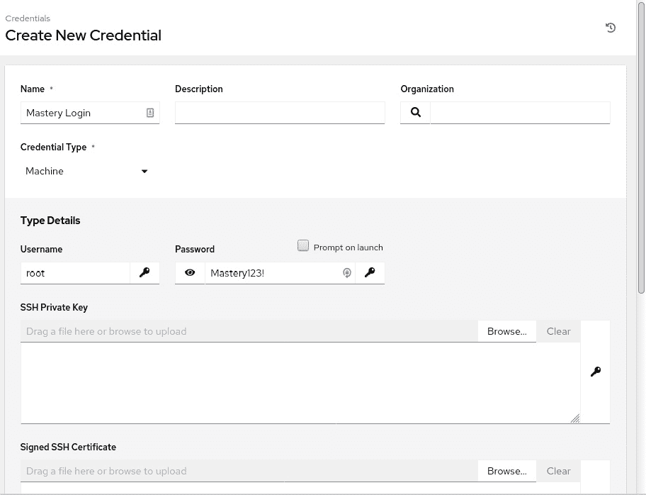

图 5.9 - 在 AWX 中添加新的机器凭据

现在，保存凭据。如果您现在返回编辑凭据，您会注意到密码消失了，并被字符串`ENCRYPTED`替换。现在无法通过 AWX 用户界面直接检索密码（或 SSH 密钥或其他敏感数据）。您会注意到可以替换现有值（通过单击现在变灰的密码字段左侧的卷曲箭头），但无法看到它。获取凭据的唯一方法将是获得与后端数据库的连接以及安装时使用的数据库的加密密钥。这意味着即使执行对数据库本身的`SELECT`操作，也无法看到密钥，因为包含敏感数据的数据库行都是使用在安装时自动生成的密钥进行加密的。尽管这显然对组织有巨大的安全益处，但也必须指出，后端数据库的丢失或与之关联的加密密钥将导致 AWX 配置的完全丢失。因此，重要的是（与任何基础设施部署一样）备份您的 AWX 部署和相关机密，以防需要从潜在的灾难情况中恢复。

尽管如此，AWX 以一种与 Ansible Vault 并不完全不同的方式保护了您的敏感访问数据。当然，Ansible Vault 仍然是一个命令行工具，尽管在 AWX 中可以像在命令行上使用 Ansible 时一样使用 vault 数据，但 vault 的创建和修改仍然是一个仅限命令行的活动。有了我们的凭据，让我们继续进行运行我们的第一个来自 AWX 的 playbook 所需的最后一步 - 定义一个模板。

## 定义模板

作业模板 - 给它完整的名称 - 是一种将之前创建的所有配置项以及任何其他所需参数汇集在一起，以针对清单运行给定 playbook 的方式。可以将其视为定义如果在命令行上运行`ansible-playbook`时的方式。

让我们立即开始创建我们的模板，按照以下步骤进行：

1.  在左侧菜单中单击**模板**。

1.  单击**添加**按钮创建新模板。

1.  从下拉列表中选择**添加作业模板**。

1.  要运行我们的第一个作业，您需要在**创建新作业模板**屏幕上定义以下字段：

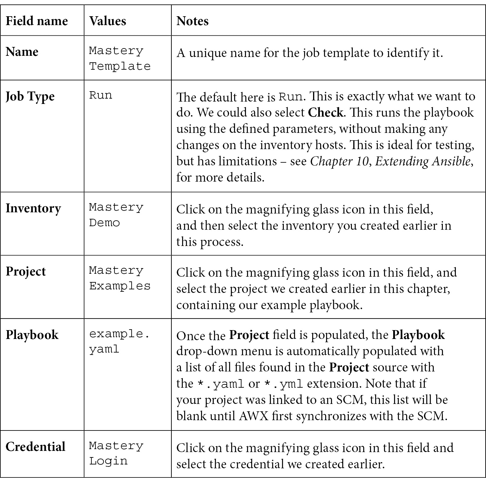

这应该会导致一个屏幕，看起来与下图所示的屏幕有些相似：

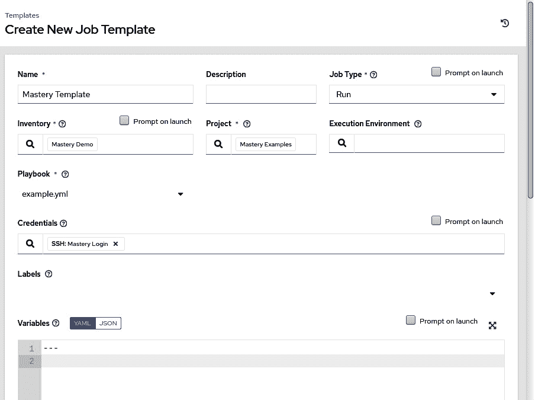

图 5.10 - 在 AWX 中创建新模板

在所有字段都填充完毕后，如前面的截图所示，点击**Save**按钮。恭喜！你现在已经准备好从 AWX 运行你的第一个 playbook。要这样做，返回到**templates**列表，点击我们新创建的模板右侧的小火箭图标。立即执行后，你将看到作业执行并将看到来自`ansible-playbook`的输出，这是我们从命令行熟悉的，如下图所示：

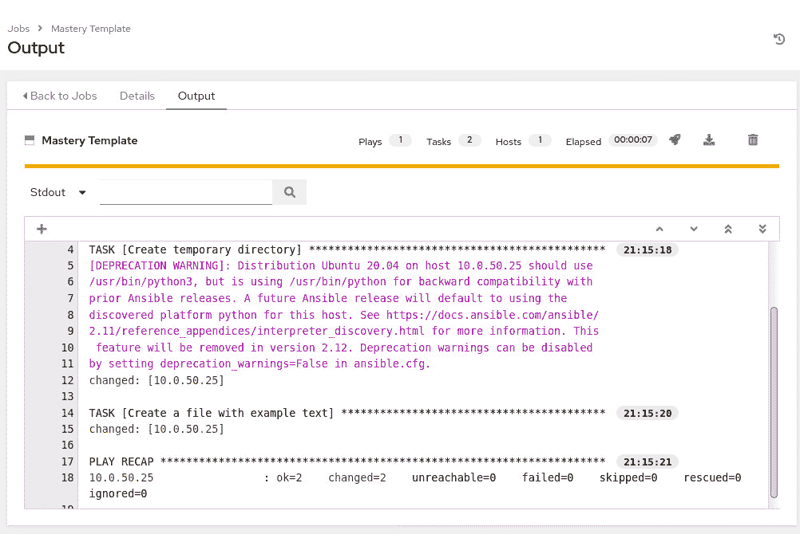

图 5.11 - 我们在 AWX 中第一个 playbook 模板运行的输出

在这个屏幕上，你可以看到来自`ansible-playbook`的原始输出。你可以随时通过点击菜单栏上的**Jobs**菜单项，浏览所有已运行的作业。这对于审计 AWX 一直在协调的各种活动特别有用，尤其是在大型多用户环境中。

在**Jobs**屏幕的顶部，你可以看到**Details**选项卡，列出了我们之前定义的所有基本参数，比如**Project**和**Template**。还显示了有用的审计信息，比如有关作业启动和完成时间的信息。如下图所示：

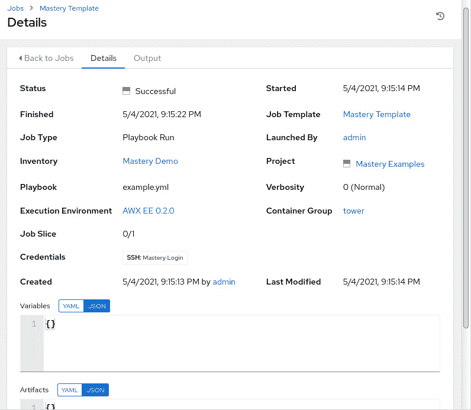

图 5.12 - 我们的 playbook 模板运行的 Details 选项卡

虽然 AWX 能够做更多的事情，但这些基本阶段对于你想在 AWX 中执行的大多数任务来说是至关重要的。因此，了解它们的用法和顺序对于学习如何使用 AWX 是至关重要的。现在我们已经掌握了基础知识，在下一节中我们将看一下你可以用 AWX 做的一些更高级的事情。

# 超越基础知识

我们现在已经涵盖了从 AWX 运行你的第一个 playbook 所需的基础知识 - 这是在这个环境中大多数 Ansible 自动化所需的基础知识。当然，我们不可能在一个章节中涵盖 AWX 提供的所有高级功能。因此，在本节中，我们将重点介绍一些更高级的方面，如果你想了解更多关于 AWX 的内容，可以探索。

## 基于角色的访问控制（RBAC）

到目前为止，我们只从内置的`admin`用户的角度来看 AWX 的使用。当然，AWX 的企业级功能之一就是 RBAC。这是通过使用**用户**和**团队**来实现的。团队基本上是一组用户，用户可以是一个或多个团队的成员。

用户和团队都可以在 AWX 用户界面中手动创建，或通过与外部目录服务（如 LDAP 或 Active Directory）集成来创建。在目录集成的情况下，团队很可能会映射到目录中的组，尽管丰富的配置允许管理员定义这种行为的确切性质。

AWX 内的 RBAC 非常丰富。例如，给定用户可以在一个团队中被授予`Admin`角色，并在另一个团队中被授予`Member`或`Read`角色。

用户帐户本身可以设置为系统管理员、普通用户或系统审计员。

除此之外，当我们在本章的基本设置部分进行设置时，你会注意到 AWX 用户界面的几乎每个页面上都有选项卡。其中，几乎总会有一个名为**Permissions**的选项卡，它允许实现真正的细粒度访问控制。

例如，给定的**普通用户**类型的用户可以在其分配的团队中被赋予`Admin`角色。然而，他们可以在给定项目上被分配`READ`角色，这种更具体的特权将取代在**Team**级别设置的不太具体的`Admin`角色。因此，当他们登录时，他们可以看到相关的项目，但不能更改它或执行任何任务 - 例如，来自 SCM 的更新。

重要提示

一般来说，更具体的权限会覆盖不太具体的权限。因此，在项目级别的权限将优先于团队或用户级别的权限。请注意，对于没有通过用户或其团队指定权限的项目，当用户登录到用户界面时，该人甚至都看不到该项目。唯一的例外是系统管理员，他们可以看到一切并执行任何操作。请谨慎将此类型分配给用户账户！

在涉及 RBAC 时有很多可以探索的内容。一旦掌握了它，就可以轻松创建安全且严格锁定的 AWX 部署，每个人都具有适当的访问权限。

## 组织

AWX 包含一个名为**组织**的顶级配置项。这是一组清单、项目、作业模板和团队（这些又是用户的分组）。因此，如果企业的两个不同部分具有完全不同的需求，但仍需要使用 AWX，它们可以共享单个 AWX 实例，而无需在用户界面中重叠配置。

虽然系统管理员类型的用户可以访问所有组织，但普通用户只能看到他们关联的组织和配置。这是一种非常强大的方式，可以将企业部署的 AWX 的不同部分的访问权限进行分隔。

举例来说，当我们在本章的前面创建清单时，您可能已经注意到我们忽略了**组织**字段（这被设置为默认值 - 在新的 AWX 安装中存在的唯一组织）。如果我们要创建一个名为`Mastery`的新组织，那么不是该组织成员的任何人都无法看到此清单，无论他们拥有的权限或特权如何（唯一的例外是**系统管理员**用户类型，可以看到一切）。

## 调度

一些 AWX 配置项，例如项目（可能需要从 SCM 更新）或作业模板（执行特定任务），可能需要定期运行。拥有像 AWX 这样强大的工具，但又需要操作员定期登录执行常规任务，这是没有意义的。因此，AWX 具有内置的调度功能。

在任何项目或模板的定义页面上，只需查找**调度**选项卡，然后您就可以使用丰富的调度选项 - *图 5.13*显示了一个每天运行一次的日程安排示例，从 2021 年 5 月 7 日到 11 日在伦敦时区的下午 1 点。请注意，此日程安排是针对我们之前创建的`Mastery Template`作业模板创建的，因此将自动按照定义的日程安排运行此 playbook 模板：

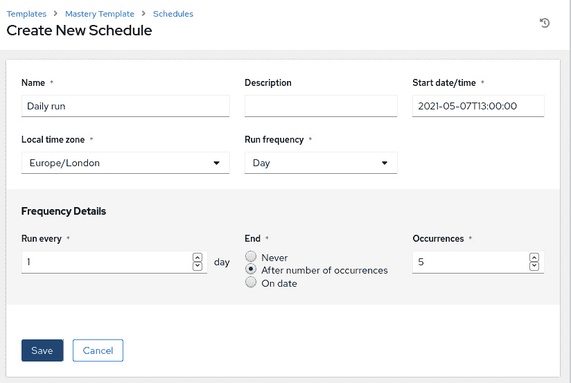

图 5.13 - 创建一个每日日程安排来运行之前创建的 Mastery Template 作业模板

请注意，您可以选择多种调度选项。为了帮助您确保日程安排符合您的要求，在保存新日程安排时会显示日程安排的详细信息。当您有多个用户登录到 AWX 等系统并运行无人值守的日程安排时，您可以维护对正在进行的操作的监督是至关重要的。幸运的是，AWX 具有丰富的功能，允许对发生的事件进行审计，我们将在下一节中介绍这些功能。

## 审计

在命令行上运行 Ansible 的一个风险是，一旦运行了特定任务，其输出将永远丢失。当然，可以为 Ansible 打开日志记录。但是，在企业中，这需要强制执行，对于许多操作员具有给定 Ansible 机器的 root 访问权限，无论是他们自己的笔记本电脑还是其他地方的服务器，这将是困难的。幸运的是，正如我们在之前的示例中看到的，AWX 不仅存储了谁运行了什么任务以及何时运行的详细信息，还存储了所有`ansible-playbook`运行的输出。通过这种方式，企业希望使用 Ansible 的合规性和可审计性得到了实现。

只需导航到**作业**菜单项，将显示所有先前运行的作业（用户有权限查看的）。甚至可以直接从此屏幕重复以前完成的作业，只需单击问题中的火箭图标。请注意，这将立即使用与上次启动时相同的参数启动作业，因此请确保单击是您想要执行的操作！

*图 5.14*显示了我们用于本书的演示 AWX 实例的作业历史：

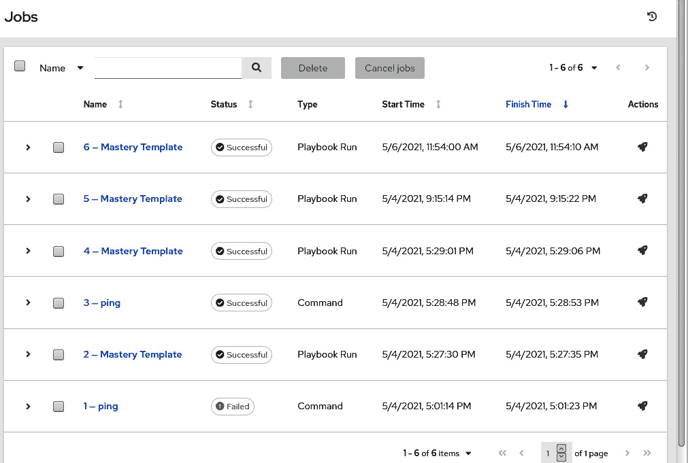

图 5.14-用于本书的 AWX 实例的作业历史窗格

单击**名称**列中的编号条目将带您到我们在*图 5.11*和*图 5.12*中看到的**输出**和**详细信息**选项卡窗格，但当然，与您单击的特定作业运行相关。虽然您可以清理作业历史记录，但作业仍然保留在那里供您检查，直到您删除它们。还请注意*图 5.14*顶部的两个灰色按钮。使用这些按钮，您可以取消运行作业（如果由于任何原因它们被卡住或失败），还可以从作业历史记录中删除多个条目。一旦完成审核，这对于清理非常有用。

当然，对于 playbooks，没有一种大小适合所有的解决方案，有时我们需要操作员能够在运行 playbooks 时输入唯一的数据。AWX 提供了一个名为调查的功能，专门用于此目的，我们将在下一节中看到。

## 调查

有时，在启动作业模板时，不可能（或不希望）预先定义所有信息。虽然在 AWX 用户界面中使用变量定义参数是完全可能的，但这并不总是理想的，或者用户友好的，因为变量必须以有效的 JSON 或 YAML 语法指定。此外，只被授予模板上的“读取”角色的用户将无法编辑该模板定义-这包括变量！然而，他们可能有正当的理由设置一个变量，即使他们不应该编辑模板本身。

调查提供了答案，对于您创建的任何作业模板，您将在顶部找到一个标记为**调查**的选项卡。调查本质上是由管理员定义的问卷调查（因此得名！），以用户友好的方式要求输入，并进行简单的用户输入验证。一旦验证，输入的值将被存储在 Ansible 变量中，就像它们如果以 YAML 或 JSON 格式定义一样。

例如，如果我们想要在运行作业模板时捕获`http_port`变量值，我们可以创建一个调查问题，如*图 5.15*所示：

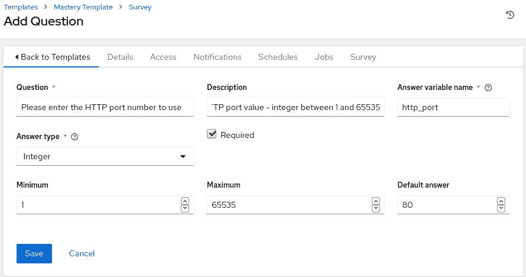

图 5.15-创建一个调查问题，以捕获有效的 HTTP 端口号到一个变量

创建所有问题后，请注意，您需要为作业模板打开调查，如*图 5.16*所示，否则在运行时问题将不会出现：

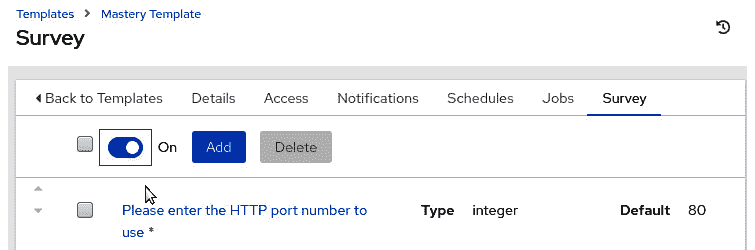

图 5.16 – 为作业模板启用调查

现在，当运行 playbook 时，用户将被提示输入一个值，并且 AWX 将确保它是指定范围内的整数。还定义了一个合理的默认值。现在让我们继续看一下在 AWX 中更高级使用作业模板的方法，称为工作流。

## 工作流模板

Playbook 运行，特别是来自 AWX，可能会很复杂。例如，可能希望首先从 SCM 系统更新项目和任何动态清单。然后我们可能会运行一个作业模板来部署一些更新的代码。然而，如果失败，几乎肯定希望回滚所做的任何更改（或采取其他补救措施）。当您单击现在熟悉的**添加**按钮以添加新模板时，您将在下拉菜单中看到两个选项 – **作业模板**（我们已经使用过）和**工作流模板**。

一旦为新的工作流模板填写了所有必填字段并保存了，您将自动进入**工作流可视化器**（要在将来返回到此处，只需通过常规方式在 GUI 中访问工作流模板，然后单击**可视化器**选项卡）。工作流可视化器从左到右构建了 AWX 执行的任务流程。例如，以下屏幕截图显示了一个工作流，其中我们的演示项目最初与其 SCM 同步。

如果该步骤成功（由指向下一个块的绿色链接表示），则运行演示作业模板。如果这反过来成功，则运行 Mastery 模板。如果前面的任何步骤失败，则工作流在那里停止（尽管可以在任何阶段定义**失败时**操作）。基于这个简单的构建块前提和在成功、失败或始终发生事件后执行后续操作的能力，将使您能够在 AWX 中构建大规模的运营流程。这将在不必构建庞大的单片剧本的情况下实现。*图 5.17*显示了我们在可视化器中的简单工作流：

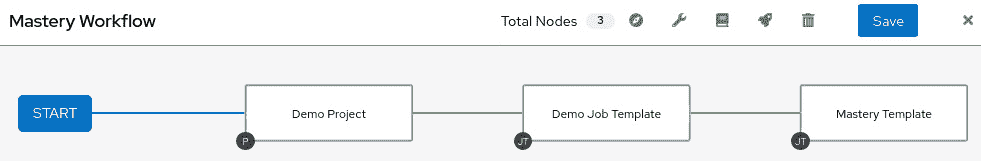

图 5.17 – AWX 中的工作流可视化器

使用这个工具，我们可以强大地构建多步工作流，在每个阶段之后采取智能行动，具体取决于它是否成功。

到目前为止，我们讨论的一切都很棒，如果您直接与 AWX GUI 交互。但是，如果您设置了无人值守的操作来运行，但希望收到其结果的通知（特别是如果它们失败了），会发生什么？同样，如果有人运行了可能影响服务的更改，您如何通知团队？您将在下一节中找到这些问题的答案。

## 通知

当您检查 AWX 用户界面时，您会注意到大多数屏幕都有一个名为**通知**的选项卡。AWX 有能力与许多流行的通信平台集成，例如 Slack、IRC、Pagerduty，甚至老式的电子邮件（此列表不是详尽的）。一旦通过用户界面定义了给定平台的配置，就可以在特定事件发生时发送通知。这些事件将根据您希望从中生成通知的项目而变化。例如，对于作业模板，您可以选择在作业开始时、成功时和/或失败时收到通知（以及这些事件的任何组合）。您可以为不同的事件生成不同的通知类型。例如，您可以通知 Slack 频道模板已启动，但如果模板未能自动生成票据以促进进一步调查，则通过电子邮件通知您的票务系统。

例如，*图 5.18*显示了我们之前配置的`Mastery Template`设置为在其执行失败时向给定的收件人列表发送电子邮件。在开始和成功时，不会收到通知（当然可以打开）：

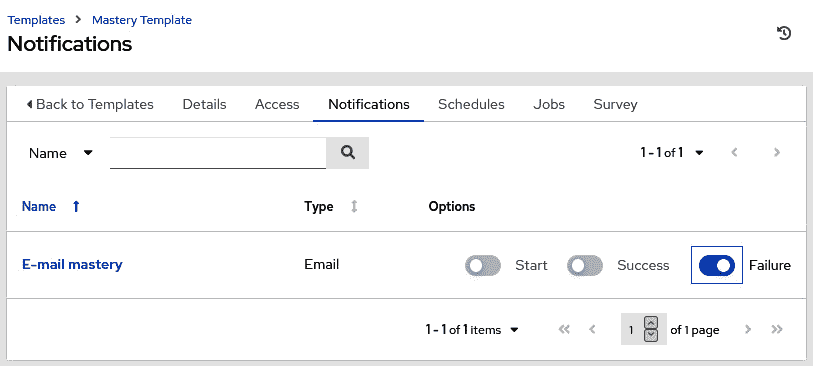

图 5.18 - 设置 Mastery Template 失败运行的电子邮件通知

AWX 中定义的所有通知都显示在**通知**选项卡中。但是，一旦定义，它们就不必添加。用户只需决定是否为每个通知服务打开或关闭**启动**、**成功**和**失败**通知。

还有一种与 AWX 交互的方式，而不使用 GUI。当然，这是通过 API，我们将在本章的最后部分进行讨论。

## 使用 API

在本书的本章中，我们已经使用 GUI 查看了所有 AWX 操作，因为这可能是解释其功能和用法的最简单和最直观的方式。然而，对于任何企业来说，AWX 的一个关键特性是 API，这是一个完整的功能，使我们能够执行所有这里完成的操作（以及更多），而无需触及 UI。

这是一个非常强大的工具，特别是在集成到更大的工作流程中。例如，您可以使用 API 将 AWX 连接到您的 CI/CD 流水线中，在代码成功构建后，您可以触发 AWX 作业来部署一个测试环境来运行它（甚至将代码部署到该环境）。同样，您可以通过 API 自动创建作业模板、清单项和配置的所有其他方面。

API 本身是可浏览的，您可以通过在 AWX 服务器的 URL 中添加`/api`或`/api/v2`来访问它（分别用于 API 的版本 1 和版本 2）。

尽管通常您会将这些集成到更大的应用程序或工作流程中，但使用`curl`很容易演示 API 的用法。例如，假设我们想要检索在我们的 AWX 服务器中定义的清单列表，我们可以使用以下命令来执行：

```
curl -k -s --user admin:adminpassword -X GET https://awx.example.org/api/v2/inventories/ | python -m json.tool
```

当然，您需要将您的凭据替换到`--user`参数中，并将您的 AWX 服务器的正确 FQDN 替换到命令中的 URL 中。完成后，此命令将以 JSON 格式检索 AWX 中定义的所有清单的详细信息 - 您不需要通过 Python 的`json.tool`工具进行管道处理 - 它只是使输出对人类更可读！

同样，我们可以通过 API 启动我们的 Mastery 示例模板。AWX 的所有配置元素都有与之关联的唯一数字 ID，我们必须使用这些 ID 来访问它们。因此，例如，让我们使用 API 从 AWX 检索作业模板的列表：

```
curl -k -s --user admin:adminpassword -X GET https://awx.example.org/api/v2/job_templates/ | python -m json.tool
```

通过 JSON 输出，我可以看到在我的系统上，我们的`Mastery Template`具有`12`的`id`。另外，因为我在本章的早期示例中为这个模板设置了一个调查，JSON 输出告诉我在启动模板之前需要指定一些变量。在`GET`查询的输出中可能需要设置一些项目，因此在组合`API POST`之前仔细审查它们是值得的。*图 5.19*显示了从`API GET`调用中获取的输出，显示了在启动模板之前必须设置的变量：

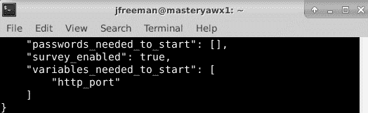

图 5.19 - 从作业模板 12 的 API GET 调用中获取的部分输出

可以使用 API 中的`extra_vars`数据字段来指定这些变量数据，因此我们可以组合一个类似以下的 API 调用来启动作业：

```
curl -k -s --user admin:adminpassword -X POST -H 'Content-Type:application/json' https://awx.example.org/api/v2/job_templates/12/launch/ --data '{"extra_vars": "{\"http_port\": 80}"}' | python -m json.tool
```

此命令的输出将包括作业 ID 等使用详细信息，以便我们可以查询作业运行（如果需要的话）。在我的示例中，作业 ID 返回为`10`，因此我可以使用以下命令查询此作业的状态（包括是否成功）：

```
curl -k -s --user admin:adminpassword -X GET https://awx.example.org/api/v2/jobs/10/ | python -m json.tool
```

甚至可以使用类似以下的 API 调用从作业运行中检索`ansible-playbook`命令的输出：

```
curl -k -s --user admin:adminpassword -X GET https://awx.example.org/api/v2/jobs/10/stdout/
```

尽管在生产环境中不太可能使用`curl`来驱动 API，但希望这些简单、可重复的示例能帮助你开始使用 API 集成 AWX 的旅程。

甚至可以通过 Python 的`pip`包装系统安装 AWX 的 CLI。这个 CLI 使用了与我们在本节讨论过的基于 HTTP 的 API 一致的命名和命令结构，鉴于相似性，因此这被留作可选练习。然而，为了帮助你入门，AWX CLI 的官方文档可以在这里找到：

[`docs.ansible.com/ansible-tower/latest/html/towercli/index.html`](https://docs.ansible.com/ansible-tower/latest/html/towercli/index.html)

尽管文档提到了 Ansible Tower，但在使用开源 AWX 软件时同样有效。

# 总结

这就结束了我们对 AWX 的快速介绍。在本章中，我们展示了一旦你了解了涉及的核心四个步骤过程，AWX 安装和配置起来是很简单的。我们还展示了如何通过调查、通知和工作流等功能来完善这个过程。

你学到了 AWX 安装简单（实际上，它是用 Ansible 安装的！），以及如何为其添加 SSL 加密。然后你了解了平台的工作原理，以及如何从新安装到构建项目、清单、凭据和模板来运行 Ansible 作业。你了解到有许多其他功能可以构建在此基础上。这些在本章的最后部分进行了介绍，以帮助你构建一个强大的企业管理系统来管理 Ansible。

在下一章中，我们将回到 Ansible 语言，看看 Jinja2 模板系统的好处。

# 问题

1.  AWX 可以在独立的 Docker 容器或 Kubernetes 中运行。

a) True

b) False

1.  AWX 为希望管理其自动化流程的企业提供了以下哪些内容？

a) web UI

b) 一个功能完整的 API

c) 源代码控制集成

d) 以上所有

1.  AWX 直接支持安全管理自动化的凭据。

a) True

b) False

1.  AWX 为创建和测试 Ansible playbook 提供了图形化的开发环境。

a) True

b) False

1.  AWX 可以安排无人值守的作业运行。

a) True

b) False

1.  在 AWX 中，预配置的`ansible-playbook`运行的参数集被称为什么？

a) 作业配置

b) Ansible 模板

c) 作业模板

d) Ansible 运行

1.  AWX 可以通过创建以下哪些内容将其配置分为业务的不同部分？

a) 团队

b) 组织

c) 部署第二个 AWX 服务器

d) 组

1.  在 AWX 中，可以告诉以下哪些内容？

a) playbook 运行的时间

b) 谁运行了 playbook

c) 传递给 playbook 的参数是什么

d) 以上所有

1.  AWX 中的用户友好的变量定义是通过哪个功能提供的？

a) 表单

b) e-Forms

c) 额外的变量

d) 调查

1.  AWX 中的项目由什么组成？

a) 用户的逻辑团队

b) playbook 的逻辑文件夹

c) 任务管理系统

d) 角色的逻辑集合
