# 第六章：解锁 Jinja2 模板的力量

手动操作配置文件是一项繁琐且容易出错的任务。同样，执行模式匹配以对现有文件进行更改是有风险的，并且确保模式可靠和准确可能是耗时的。无论您是使用 Ansible 来定义配置文件内容、在任务中执行变量替换、评估条件语句，还是其他操作，模板化几乎在每个 Ansible playbook 中都发挥作用。事实上，鉴于这项任务的重要性，可以说模板化是 Ansible 的命脉。

Ansible 使用的模板引擎是 Jinja2，这是一种现代且设计友好的 Python 模板语言。Jinja2 值得有一本专门的书；然而，在本章中，我们将介绍 Jinja2 模板在 Ansible 中的一些常见用法模式，以展示它可以为您的 playbook 带来的强大功能。在本章中，我们将涵盖以下主题：

+   控制结构

+   数据操作

+   比较值

# 技术要求

为了跟随本章中提供的示例，您需要一台运行 Ansible 4.3 或更新版本的 Linux 机器。几乎任何 Linux 版本都可以；对于那些对具体细节感兴趣的人，本章中提供的所有代码都是在 Ubuntu Server 20.04 LTS 上测试的，除非另有说明，并且在 Ansible 4.3 上测试。本章附带的示例代码可以从 GitHub 上下载：[`github.com/PacktPublishing/Mastering-Ansible-Fourth-Edition/tree/main/Chapter06`](https://github.com/PacktPublishing/Mastering-Ansible-Fourth-Edition/tree/main/Chapter06)。

查看以下视频以查看代码示例：[`bit.ly/3lZHTM1`](https://bit.ly/3lZHTM1)

# 控制结构

在 Jinja2 中，控制结构是指模板中控制引擎解析模板流程的语句。这些结构包括条件、循环和宏。在 Jinja2 中（假设使用默认值），控制结构将出现在``块内。这些开放和关闭块会提醒 Jinja2 解析器，提供了一个控制语句，而不是一个普通的字符串或变量名。

## 条件语句

模板中的条件语句创建了一个决策路径。引擎将考虑条件，并从两个或更多潜在的代码块中进行选择。至少有两个：如果条件满足（评估为`true`）的路径，以及如果条件不满足（评估为`false`）的显式定义的`else`路径，或者另外一个隐含的`else`路径，其中包含一个空块。

条件语句是`if`语句。这个语句的工作方式与 Python 中的工作方式相同。`if`语句可以与一个或多个可选的`elif`语句和一个可选的最终`else`结合使用，并且，与 Python 不同，它需要一个显式的`endif`。下面的示例显示了一个配置文件模板片段，结合了常规变量替换和`if else`结构：

```
setting = {{ setting }} 
 
feature = True 
 
feature = False 
 
another_setting = {{ another_setting }} 
```

在这个示例中，我们检查`feature.enabled`变量是否存在，并且它没有被设置为`False`。如果是`True`，那么就使用`feature = True`文本；否则，使用`feature = False`文本。在这个控制块之外，解析器对大括号内的变量执行正常的变量替换。可以使用`elif`语句定义多个路径，这会给解析器提供另一个测试，如果前面的测试结果为`False`。

为了演示模板和变量替换的渲染，我们将把示例模板保存为`demo.j2`。然后，我们将创建一个名为`template-demo.yaml`的 playbook，定义要使用的变量，然后使用`template`查找作为`ansible.builtin.pause`任务的一部分来在屏幕上显示渲染后的模板：

```
--- 
- name: demo the template 
  hosts: localhost 
  gather_facts: false  
  vars: 
    setting: a_val 
    feature: 
      enabled: true 
    another_setting: b_val  
  tasks: 
    - name: pause with render 
      ansible.builtin.pause: 
        prompt: "{{ lookup('template', 'demo.j2') }}" 
```

执行此 playbook 将在屏幕上显示渲染的模板，并等待输入。您可以使用以下命令来执行它：

```
ansible-playbook -i mastery-hosts template-demo.yaml
```

只需按*Enter*运行 playbook，如*图 6.1*所示：

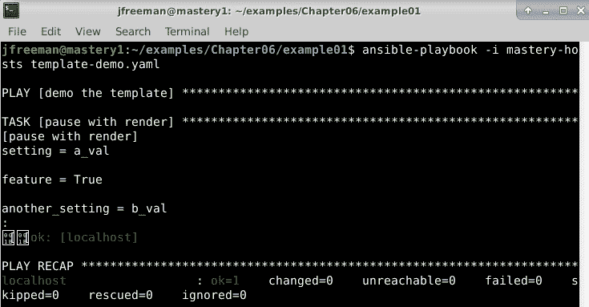

图 6.1-使用 Ansible 渲染简单的带条件模板

记住我们在*第一章*中讨论过的 Ansible 变量优先顺序，我们可以将`feature.enabled`的值覆盖为`False`。当运行 playbook 时，我们可以使用`--extra-vars`（或`-e`）参数来实现这一点；这是因为额外变量比 playbook 定义的变量具有更高的优先级。您可以通过再次运行 playbook 来实现这一点，但这次使用以下命令：

```
ansible-playbook -i mastery-hosts template-demo.yaml -e '{feature: {"enabled": false}}'
```

在这种情况下，输出应该略有不同，如*图 6.2*所示：

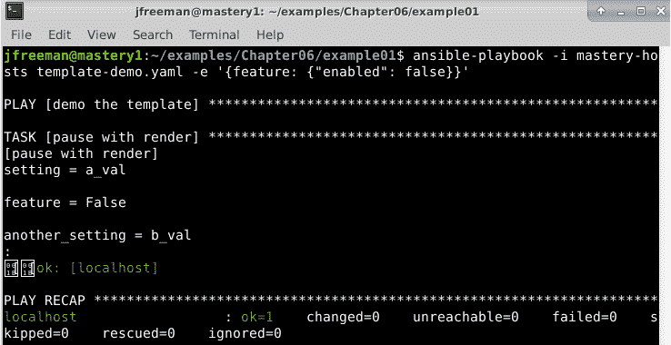

图 6.2-使用 Ansible 渲染带条件的简单模板，同时覆盖变量值

从这些简单的测试中可以看出，Jinja2 提供了一种非常简单但强大的方式来通过模板中的条件来定义数据。

### 内联条件

请注意，`if`语句可以在内联表达式中使用。在某些不希望有额外换行的情况下，这可能很有用。让我们构建一个场景，我们需要将 API 定义为`cinder`或`cinderv2`，如下所示：

```
API = cinder{{ 'v2' if api.v2 else '' }} 
```

这个例子假设`api.v2`被定义为布尔值`True`或`False`。内联`if`表达式遵循`<条件为真时做某事> if <条件为真> else <否则做某事>`的语法。在内联`if`表达式中，有一个隐含的`else`；然而，这个隐含的`else`意味着要被评估为未定义对象，这通常会创建一个错误。我们可以通过定义一个显式的`else`来保护它，它会渲染一个零长度的字符串。

让我们修改我们的 playbook 来演示内联条件。这次，我们将使用`debug`模块来渲染简单的模板，如下所示：

```
--- 
- name: demo the template 
  hosts: localhost 
  gather_facts: false 
  vars: 
    api: 
      v2: true  
  tasks: 
    - name: pause with render 
      ansible.builtin.debug: 
        msg: "API = cinder{{ 'v2' if api.v2 else '' }}" 
```

请注意，这次我们没有定义外部模板文件；模板实际上是与 Ansible 任务一起的。使用以下命令执行 playbook：

```
ansible-playbook -i mastery-hosts template-demo-v2.yaml
```

输出应该与*图 6.3*中显示的类似：

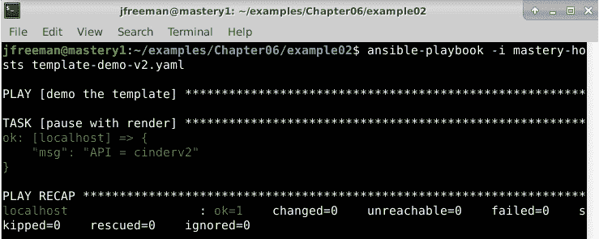

图 6.3-使用内联模板运行 playbook

现在，就像我们在之前的例子中所做的那样，我们将使用 Ansible 的额外变量将`api.v2`的值更改为`false`，以查看这对内联模板渲染的影响。再次使用以下命令执行 playbook：

```
ansible-playbook -i mastery-hosts template-demo-v2.yaml -e '{api: {"v2": false}}'
```

这次，输出应该与*图 6.4*中显示的类似。注意渲染的字符串如何改变：

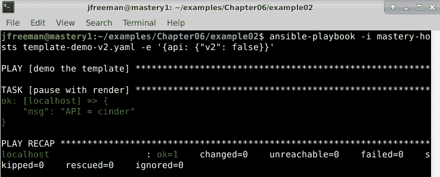

图 6.4-使用内联模板运行 playbook，同时使用额外变量改变行为

通过这种方式，我们可以创建非常简洁和强大的代码，根据 Ansible 变量定义值，就像我们在这里演示的那样。

## 循环

循环允许您在模板文件中构建动态创建的部分。当您知道需要以相同方式操作未知数量的项目时，这是很有用的。要启动循环控制结构，我们使用`for`语句。让我们演示一种简单的方法，循环遍历一个虚构服务可能找到数据的目录列表：

```
# data dirs 
 
data_dir = {{ dir }} 
 
```

提示

默认情况下，当模板被渲染时，``块会打印一个空行。这可能在我们的输出中是不可取的，但幸运的是，我们可以通过在块的结尾使用`-%}`来修剪它。更多详情请参考官方的 Jinja2 文档[`jinja.palletsprojects.com/en/3.0.x/templates/#whitespace-control`](https://jinja.palletsprojects.com/en/3.0.x/templates/#whitespace-control)。

在这个例子中，我们将得到一个`data_dir =`行，每个`data_dirs`变量中的项目，假设`data_dirs`是一个至少有一个项目的列表。如果变量不是列表（或其他可迭代类型），或者未定义，将生成一个错误。如果变量是一个可迭代类型但是空的，那么将不会生成任何行。Jinja2 可以处理这种情况，并且还允许通过`else`语句在变量中找不到项目时替换一行。在下面的例子中，让我们假设`data_dirs`是一个空列表：

```
# data dirs 
 
data_dir = {{ dir }} 
 
# no data dirs found 
 
```

我们可以通过修改我们的 playbook 和模板文件来测试这一点。我们将创建一个名为`demo-for.j2`的模板文件，其中包含前面列出的模板内容。此外，我们将在我们第一个条件渲染模板并暂停用户输入的示例中创建一个 playbook 文件。应该命名为`template-demo-for.yaml`，并包含以下代码：

```
- name: demo the template
  hosts: localhost
  gather_facts: false
  vars:
    data_dirs: []
  tasks:
    - name: pause with render
      ansible.builtin.pause:
        prompt: "{{ lookup('template', 'demo-for.j2') }}"
```

创建这两个文件后，您可以使用以下命令运行 playbook：

```
ansible-playbook -i mastery-hosts template-demo-for.yaml
```

运行我们的 playbook 将渲染模板，并产生一个类似于*图 6.5*所示的输出：

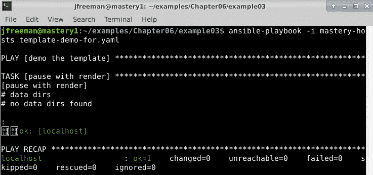

图 6.5 - 在 Ansible 中使用 for 循环渲染模板

正如你所看到的，在`for`循环中的`else`语句优雅地处理了空的`data_dirs`列表，这正是我们在 playbook 运行中想要的。

### 过滤循环项目

循环也可以与条件结合使用。在循环结构内部，可以使用`if`语句来检查当前循环项目作为条件的一部分。让我们扩展我们的例子，防止模板的用户意外使用`/`作为`data_dir`（对文件系统的根目录执行的任何操作都可能很危险，特别是如果它们是递归执行的）：

```
# data dirs 
 
 
data_dir = {{ dir }} 
 
 
# no data dirs found 

```

前面的例子成功地过滤掉了任何`data_dirs`中是`/`的项目，但这需要的输入比必要的要多得多。Jinja2 提供了一种方便的方法，允许你在`for`语句中轻松地过滤循环项目。让我们使用这种便利来重复前面的例子：

```
# data dirs 
 
data_dir = {{ dir }} 
 
# no data dirs found 
 
```

因此，这种结构不仅需要输入更少，而且还正确计算了循环次数，我们将在下一节中学习。

### 循环索引

循环计数是免费提供的，可以得到当前循环迭代的索引。作为变量，它们可以以几种不同的方式访问。以下表格概述了它们可以被引用的方式：

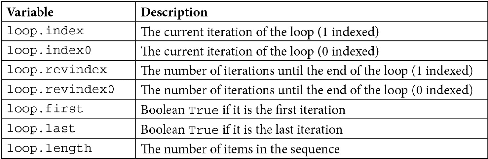

有关循环内部位置的信息可以帮助确定要渲染的内容。考虑到我们之前的例子，我们可以提供一个单行，其中包含逗号分隔的值，而不是渲染多行`data_dir`来表示每个数据目录。如果没有访问循环迭代数据，这将是困难的。然而，通过使用这些数据，可以变得简单。为了简单起见，本例假设允许在最后一项后面加上逗号，并且允许在项目之间有任何空格（换行符）：

```
# data dirs


data_dir = {{ dir }},
           
           {{ dir }},


# no data dirs found
 
```

前面的例子使用了`loop.first`变量来确定是否需要渲染`data_dir =`部分，或者是否只需要渲染适当间距的目录。通过在`for`语句中使用过滤器，我们可以得到`loop.first`的正确值，即使`data_dirs`中的第一项是不需要的`/`。

重要提示

看一下第一个`else`语句的缩进 - 为什么我们要这样做？答案与 Jinja2 中的空格控制有关。简单地说，如果您不缩进控制语句（例如`if`或`else`语句），那么您希望渲染的模板内容将会将左侧的所有空格修剪掉；因此，我们随后的目录条目将不会有任何缩进。在某些文件中（包括 YAML 和 Python），缩进非常重要，因此这是一个小但非常重要的细微差别。

为了测试这一点，我们将创建一个名为`demo-for.j2`的新模板文件，其中包含前面列出的内容。此外，我们将修改`template-demo-for.yaml`以定义一些`data_dirs`，包括一个`/`，应该被过滤掉：

```
--- 
- name: demo the template 
  hosts: localhost 
  gather_facts: false  
  vars: 
    data_dirs: ['/', '/foo', '/bar']  
  tasks: 
    - name: pause with render 
      ansible.builtin.pause: 
        prompt: "{{ lookup('template', 'demo-for.j2') }}"
```

现在，我们可以使用以下命令执行 playbook：

```
ansible-playbook -i mastery-hosts template-demo-for.yaml
```

当它运行时，我们应该看到我们渲染的内容，如*图 6.6*所示：

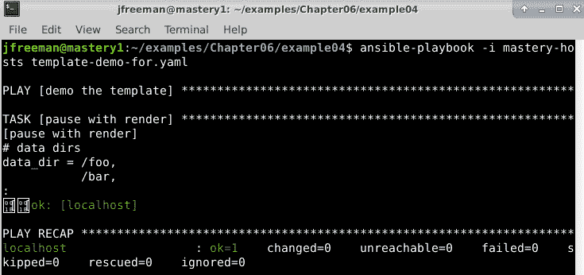

图 6.6 - 在 Ansible 中使用 for 循环渲染模板，同时利用循环索引

在前面的例子中，如果不允许有尾随逗号，我们可以利用内联`if`语句来确定我们是否已经完成循环并正确地渲染逗号。您可以在前面模板代码的以下增强版本中查看这一点：

```
# data dirs. 
 
 
data_dir = {{ dir }}{{ ',' if not loop.last else '' }} 
            
           {{ dir }}{{ ',' if not loop.last else '' }} 
 
 
# no data dirs found 

```

使用内联`if`语句允许我们构建一个模板，只有在循环中有更多项目通过我们的初始过滤时才会渲染逗号。再次，我们将使用前面的内容更新`demo-for.j2`并使用以下命令执行 playbook：

```
ansible-playbook -i mastery-hosts template-demo-for.yaml
```

渲染模板的输出应该与*图 6.7*中显示的类似：

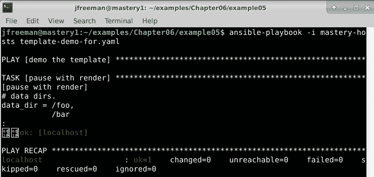

图 6.7 - 在 Ansible 中使用 for 循环渲染模板，扩展使用循环索引

输出基本上与以前一样。但是，这一次，我们的模板使用内联`if`语句评估是否在循环中的每个`dir`值后放置逗号，从而删除最终值末尾的多余逗号。

## 宏

敏锐的读者会注意到，在前面的例子中，我们有一些重复的代码。重复的代码是任何开发人员的敌人，幸运的是，Jinja2 有一种方法可以帮助！宏就像常规编程语言中的函数：它是定义可重用习语的一种方式。宏在` ... `块内定义。它有一个名称，可以接受零个或多个参数。宏内的代码不会继承调用宏的块的命名空间，因此所有参数必须显式传递。宏通过名称在花括号块内调用，并通过括号传递零个或多个参数。让我们创建一个名为`comma`的简单宏，以取代我们重复的代码：

```
 
{{ ',' if not loop.last else '' }} 
 
# data dirs. 
 
 
data_dir = {{ dir }}{{ comma(loop) }} 
            
           {{ dir }}{{ comma(loop) }} 
 
 
# no data dirs found 
 
```

调用`comma`并将循环对象传递给宏，允许宏检查循环并决定是否应省略逗号。

### 宏变量

宏在调用宏时可以访问传递的任何位置或关键字参数。位置参数是根据它们提供的顺序分配给变量的参数，而关键字参数是无序的，并明确地将数据分配给变量名。如果在调用宏时未定义关键字参数，关键字参数也可以具有默认值。还有三个额外的特殊变量可用：

+   `varargs`：这是一个额外的位置参数的占位符，这些参数将传递给宏。这些位置参数值将组成`varargs`列表。

+   `kwargs`：这与`varargs`相同；但是，它不是保存额外的位置参数值，而是保存额外关键字参数和它们的关联值的哈希。

+   `caller`：这可以用来回调到可能调用此宏的更高级宏（是的，宏可以调用其他宏）。

除了这三个特殊变量之外，还有许多变量可以公开有关宏本身的内部细节。这些有点复杂，但我们将逐一介绍它们的用法。首先，让我们简要介绍一下每个变量：

+   `name`：这是宏本身的名称。

+   `arguments`：这是宏接受的参数的名称元组。

+   `defaults`：这是默认值的元组。

+   `catch_kwargs`：这是一个布尔值，如果宏访问（因此接受）`kwargs`变量，则将其定义为`true`。

+   `catch_varargs`：这是一个布尔值，如果宏访问（因此接受）`varargs`变量，则将其定义为`true`。

+   `caller`：这是一个布尔值，如果宏访问（因此可以从另一个宏调用）`caller`变量，则将其定义为`true`。

与 Python 中的类类似，这些变量需要通过宏本身的名称引用。尝试在不加上名称的情况下访问这些宏将导致未定义的变量。现在，让我们逐一演示它们的用法。

#### 名称

`name`变量实际上非常简单。它只是提供了一种访问宏名称作为变量的方式，也许用于进一步操作或使用。以下模板包括一个引用宏名称的宏，以在输出中呈现它：

```
 
{{ test.name }} 
 
{{ test() }} 
```

假设我们要创建`demo-macro.j2`，其中包含此模板和以下`template-demo-macro.yaml` playbook：

```
---
- name: demo the template
  hosts: localhost
  gather_facts: false
  vars:
    data_dirs: ['/', '/foo', '/bar']
  tasks:
    - name: pause with render
      ansible.builtin.pause:
        prompt: "{{ lookup('template', 'demo-macro.j2') }}"
```

我们将使用以下命令运行此 playbook：

```
ansible-playbook -i mastery-hosts template-demo-macro.yaml
```

当您运行 playbook 时，您的输出应该类似于*图 6.8*中显示的输出：

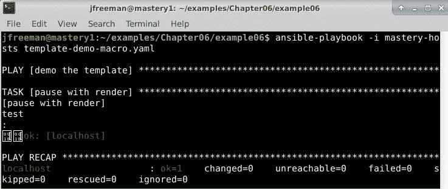

图 6.8 - 使用名称宏变量呈现模板

从这次测试运行中可以看出，我们的模板只是以宏名称呈现，没有其他内容，正如预期的那样。

#### 参数

`arguments`变量是宏接受的参数的元组。请注意，这些是明确定义的参数，而不是特殊的`kwargs`或`varargs`。我们之前的例子将呈现一个空元组`()`，所以让我们修改它以得到其他内容：

```
 
{{ test.arguments }} 
 
{{ test() }} 
```

像以前一样运行相同的 playbook，以相同的方式呈现此模板，应该产生*图 6.9*中显示的输出：

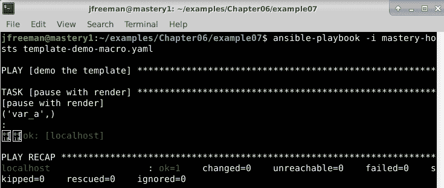

图 6.9 - 运行一个 playbook 来呈现打印其宏参数的 Jinja2 模板

在这个例子中，我们可以清楚地看到我们的模板是使用宏接受的参数的名称（而不是它们的值）呈现的。

#### 默认值

`defaults`变量是宏显式接受的任何关键字参数的默认值的元组。尽管在 Jinja2 的文档中仍然存在（在撰写本文时，有一个问题正在解决文档错误），但此变量已从所有新于版本 2.8.1 的 Jinja2 版本中删除。如果您需要访问此变量，您需要将您的 Jinja2 Python 模块降级到 2.8.1。

对于使用较旧版本的 Jinja2 的人，我们可以如下演示此变量；让我们将我们的宏更改为显示默认值以及参数：

```
 
{{ test.arguments }} 
{{ test.defaults }} 
 
{{ test() }}
```

我们可以像以前一样运行我们现有的测试 playbook，但现在使用新更新的模板。如果您的 Jinja2 版本支持`defaults`变量，输出应该类似于*图 6.10*中显示的输出：

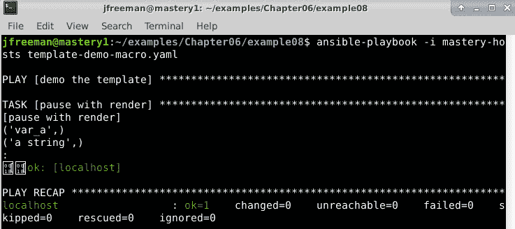

图 6.10 - 使用默认值和名称宏变量呈现 Jinja2 模板

在这里，我们可以看到模板是使用宏接受的参数的名称和默认值进行渲染的。

#### catch_kwargs

只有当宏本身访问`kwargs`变量以捕获可能传递的任何额外关键字参数时，此变量才被定义。如果定义了，它将被设置为`true`。如果没有访问`kwargs`变量，在调用宏时传递的任何额外关键字参数都将在渲染模板时导致错误。同样，访问`catch_kwargs`而不访问`kwargs`将导致未定义错误。让我们再次修改我们的示例模板，以便我们可以传递额外的`kwargs`变量：

```
 
{{ kwargs }} 
{{ test.catch_kwargs }} 
 
{{ test(unexpected='surprise') }}
```

我们可以再次使用与之前相同的命令将更新后的模板通过现有的渲染模板运行。这次，输出应该类似于*图 6.11*中显示的结果：

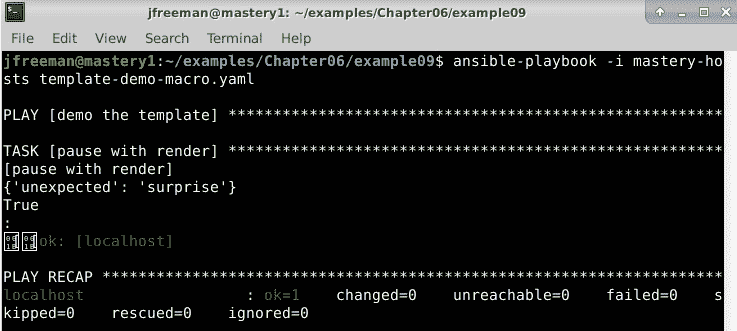

图 6.11 - 渲染使用 catch_kwargs 变量的模板

从这个输出中可以看出，当向模板传递意外变量时，模板不会产生错误，而是使我们能够访问传递的意外值。

#### catch_varargs

与`catch_kwargs`类似，只有当宏访问`varargs`变量时，此变量才存在（并且设置为`true`）。再次修改我们的示例，我们可以看到它的作用：

```
 
{{ varargs }} 
{{ test.catch_varargs }} 
 
{{ test('surprise') }}
```

模板的渲染结果应该类似于*图 6.12*中显示的结果：

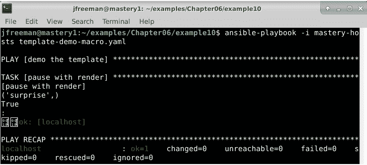

图 6.12 - 渲染使用 varargs 和 catch_varargs 宏变量的模板

同样，我们可以看到我们能够捕获并渲染传递给宏的意外值，而不是在渲染时返回错误，如果我们没有使用`catch_varargs`，那么将会发生错误。

#### caller

`caller`变量需要更多的解释。宏可以调用另一个宏。如果模板的同一部分将被多次使用，但内部数据的一部分更改比作为宏参数轻松传递的更多，这将非常有用。`caller`变量并不是一个确切的变量；它更像是一个引用，用于获取调用该调用宏的内容。

让我们更新我们的模板来演示它的用法：

```

The text from the caller follows: {{ caller() }}


This is text inside the call 
 
```

渲染的结果应该类似于*图 6.13*中显示的结果：

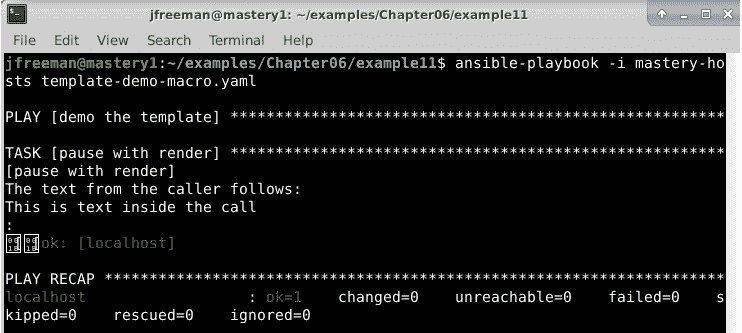

图 6.13 - 渲染使用 caller 变量的模板

调用宏仍然可以向该宏传递参数；可以传递任意组合的参数或关键字参数。如果宏使用`varargs`或`kwargs`，那么也可以传递更多的参数。此外，宏还可以将参数传递回给调用者！为了演示这一点，让我们创建一个更大的示例。这次，我们的示例将生成一个适用于 Ansible 清单的文件：

```
 
[{{ group }}] 
 
{{ host }} {{ caller(host) }} 
 
  
 
ssh_host_name={{ host }}.example.name ansible_sudo=true 
  
 
ssh_host_name={{ host }}.example.name 

```

使用我们的测试 playbook 进行渲染后，结果应该如*图 6.14*中所示：

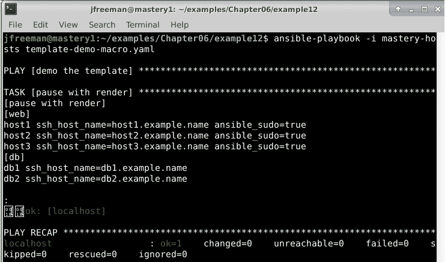

图 6.14 - 使用 caller 变量渲染的模板的更高级示例

我们两次调用了`test`宏，每次为我们想要定义的每个组调用一次。每个组都有略有不同的`host`变量集合要应用，并且这些变量是在调用本身中定义的。通过让宏回调到调用者，传递当前循环中的`host`变量，我们节省了输入。

控制块在模板内提供了编程能力，允许模板作者使其模板更高效。效率不一定体现在模板的初始草稿中；相反，当需要对重复值进行小改动时，效率才真正发挥作用。现在我们已经详细地看了 Jinja2 中构建控制结构，接下来，我们将继续看看这种强大的模板语言如何帮助我们处理另一个常见的自动化需求：数据操作。

# 数据操作

虽然控制结构影响模板处理的流程，但还有另一种工具可以帮助您修改变量的内容。这个工具叫做过滤器。过滤器与小函数或方法相同，可以在变量上运行。一些过滤器不带参数，一些带可选参数，一些需要参数。过滤器也可以链接在一起，一个过滤器操作的结果被馈送到下一个过滤器，然后是下一个。Jinja2 带有许多内置过滤器，而 Ansible 通过许多自定义过滤器扩展了这些过滤器，当您在模板、任务或任何其他 Ansible 允许模板化的地方使用 Jinja2 时，这些过滤器都可以使用。

## 语法

通过管道符号|将过滤器应用于变量，然后是过滤器的名称，以及括号内的过滤器参数。变量名称和管道符号之间可以有空格，管道符号和过滤器名称之间也可以有空格。例如，如果我们想将 lower filter（使所有字符变为小写）应用于 my_word 变量，我们将使用以下语法：

```
{{ my_word | lower }} 
```

因为 lower filter 不需要任何参数，所以不需要给它附加一个空的括号集。然而，如果我们使用一个需要参数的不同 filter，情况就会改变。让我们使用 replace filter，它允许我们用另一个子字符串替换所有出现的子字符串。在这个例子中，我们想要在 answers 变量中用 yes 替换所有出现的 no 子字符串：

```
{{ answers | replace('no', 'yes') }} 
```

通过简单地添加更多的管道符号和更多的过滤器名称来实现应用多个过滤器。让我们结合 replace 和 lower 来演示语法-过滤器按照列出的顺序应用。在下面的例子中，首先，我们将所有的 no 子字符串替换为 yes，然后将整个结果字符串转换为小写：

```
{{ answers | replace('no', 'yes') | lower }} 
```

由于我们正在进行区分大小写的字符串替换，您可能选择先执行小写转换，这意味着您不会错过任何情况下的 no 单词-无论大小写如何-假设这是您想要的行为！后一个例子的代码将简单地如下所示：

```
 {{ answers | lower | replace('no', 'yes') }} 
```

我们可以通过一个简单的 play 来演示这一点，该 play 使用 debug 命令来渲染这一行：

```
- name: demo the template
  hosts: localhost
  gather_facts: false
  vars:
    answers: "no so YES no"
  tasks:
    - name: debug the template
      ansible.builtin.debug: 
        msg: "{{ answers | replace('no', 'yes') | lower }}" 
```

现在，我们可以使用以下命令执行 playbook：

```
ansible-playbook -i mastery-hosts template-demo-filters.yaml
```

在我们的 answers 变量中，代码中声明的所有单词 no 的实例都将被替换为单词 yes。此外，所有字符都将转换为小写。输出应该类似于*图 6.15*中显示的输出：

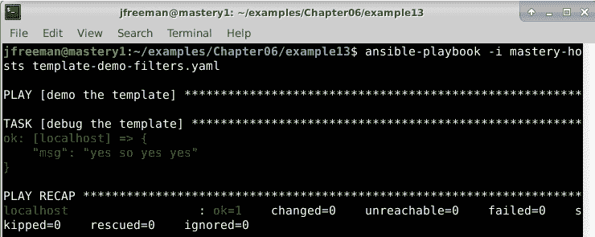

图 6.15-演示在一个简单的 Ansible playbook 中使用链式过滤器

在这里，我们可以看到 playbook 按预期运行，并结合了两个过滤器来操作我们的测试字符串，就像我们要求的那样。当然，这只是可用的过滤器中的两个。在下一节中，让我们继续看一些 Jinja2 中包含的更有用的过滤器。

## 有用的内置过滤器

Jinja2 内置的过滤器的完整列表可以在 Jinja2 文档中找到。在撰写本书时，有 50 个内置过滤器。接下来，我们将看一些更常用的过滤器。

提示

如果您想查看所有可用过滤器的列表，可以在当前版本的 Jinja2 文档中找到（在撰写时可用）：[`jinja.palletsprojects.com/en/3.0.x/templates/#builtin-filters`](https://jinja.palletsprojects.com/en/3.0.x/templates/#builtin-filters)。

### default

`default` 过滤器是为了为一个未定义的变量提供默认值的一种方式，从而防止 Ansible 生成错误。它是一个复杂的`if`语句的简写，它在尝试使用`else`子句提供不同值之前检查变量是否已定义。让我们看两个渲染相同内容的例子。一个使用`if/else`结构，另一个使用`default`过滤器：

```
 
{{ some_variable }} 
 
default_value 

{{ some_variable | default('default_value') }} 
```

这些例子的渲染结果是相同的；然而，使用`default`过滤器的例子写起来更快，阅读起来更容易。

虽然`default`非常有用，但如果您在多个位置使用相同的变量，请谨慎操作。更改默认值可能会变得麻烦，定义默认值可能更有效，可以在 play 或角色级别定义变量的默认值。

### length

`length` 过滤器将返回序列或哈希的长度。在本书的早期版本中，我们引用了一个名为`count`的变量，它是`length`的别名，完成了相同的功能。这个过滤器对于执行任何关于主机集大小的数学运算或任何其他需要知道某个集合计数的情况非常有用。让我们创建一个例子，其中我们将`max_threads`配置条目设置为与 play 中主机数量相匹配的计数：

```
max_threads: {{ play_hosts | count }} 
```

这为我们提供了一个简洁的方式来获取`play_hosts`变量中包含的主机数量，并将答案赋给`max_threads`变量。

### random

`random` 过滤器用于从序列中进行随机选择。让我们使用这个过滤器将一个任务委派给`db_servers`组中的随机选择：

```
name: backup the database 
  shell: mysqldump -u root nova > /data/nova.backup.sql 
  delegate_to: "{{ groups['db_servers'] | random }}" 
  run_once: true 
```

在这里，我们可以很容易地将这个任务委派给`db_servers`组中的一个成员，使用我们的过滤器随机选择。

### round

`round` 过滤器用于将数字四舍五入。如果您需要执行浮点数运算，然后将结果转换为四舍五入的整数，这可能很有用。`round` 过滤器接受可选参数来定义精度（默认为`0`）和舍入方法。可能的舍入方法有`common`（四舍五入，是默认值）、`ceil`（总是向上舍入）和`floor`（总是向下舍入）。在这个例子中，我们将两个过滤器链接在一起，将一个数学结果舍入到零精度，然后将其转换为整数：

```
{{ math_result | round | int }} 
```

因此，如果`math_result`变量设置为`3.4`，则前一个过滤器链的输出将为`3`。

## 有用的 Ansible 提供的自定义过滤器

虽然 Jinja2 提供了许多过滤器，但 Ansible 还包括一些额外的过滤器，playbook 作者可能会发现特别有用。我们将在下面重点介绍这些过滤器。

提示

Ansible 中的这些自定义过滤器在不同版本之间经常发生变化。它们值得审查，特别是如果您经常使用它们。自定义 Ansible 过滤器的完整列表可在[`docs.ansible.com/ansible/latest/user_guide/playbooks_filters.html`](https://docs.ansible.com/ansible/latest/user_guide/playbooks_filters.html)上找到。

### 与任务状态相关的过滤器

Ansible 为每个任务跟踪任务数据。这些数据用于确定任务是否失败、是否导致更改或是否完全跳过。Playbook 作者可以注册任务的结果，在先前版本的 playbook 中，他们将使用过滤器来检查任务的状态。从 Ansible 2.9 开始，这完全被移除了。因此，如果您有来自早期 Ansible 版本的遗留 playbook，您可能需要相应地进行更新。

在 Ansible 2.7 发布之前，您可能会使用一个带有过滤器的条件语句，如下所示：

```
when: derp | success
```

现在应该使用新的语法，如下片段所示。请注意，以下代码块中的代码执行相同的功能：

```
when: derp is success
```

让我们在以下代码中查看它的运行情况：

```
--- 
- name: demo the filters 
  hosts: localhost 
  gather_facts: false  
  tasks: 
    - name: fail a task 
      ansible.builtin.debug: 
        msg: "I am not a change" 
      register: derp  
    - name: only do this on change 
      ansible.builtin.debug: 
        msg: "You had a change" 
      when: derp is changed  
    - name: only do this on success 
      ansible.builtin.debug: 
        msg: "You had a success" 
      when: derp is success
```

您可以使用以下命令运行此 playbook：

```
ansible-playbook -i mastery-hosts template-demo-filters.yaml
```

输出显示在*图 6.16*中：

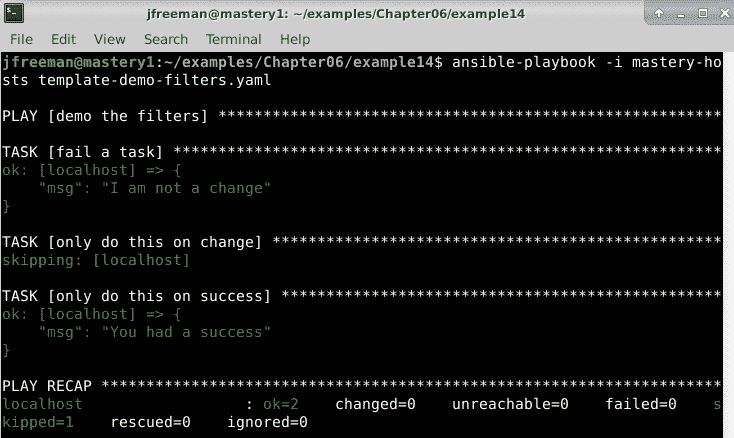

图 6.16 – 根据任务状态运行 Ansible playbook 的条件

如您所见，`ansible.builtin.debug`语句导致`success`。因此，我们跳过了要在`change`上运行的任务，并执行了要在`success`上运行的任务。

### shuffle

与`random`过滤器类似，`shuffle`过滤器可用于生成随机结果。与从列表中选择一个随机选择的`random`过滤器不同，`shuffle`过滤器将对序列中的项目进行洗牌并返回完整的序列：

```
--- 
- name: demo the filters 
  hosts: localhost 
  gather_facts: false  
  tasks: 
    - name: shuffle the cards 
      ansible.builtin.debug: 
        msg: "{{ ['Ace', 'Queen', 'King', 'Deuce'] | shuffle }}" 
```

使用以下命令运行此 playbook：

```
ansible-playbook -i mastery-hosts template-demo-filters.yaml
```

输出显示在*图 6.17*中：

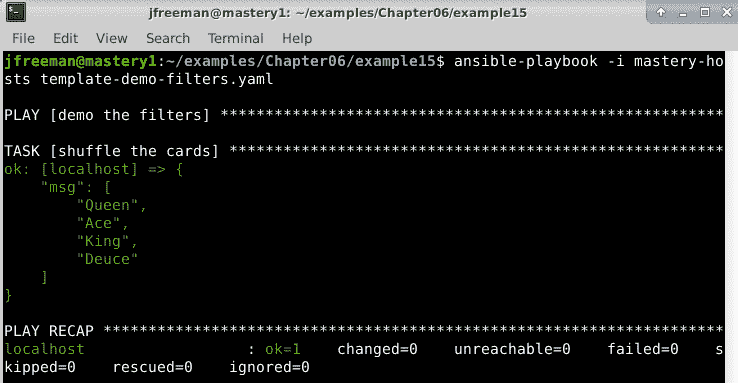

图 6.17 – 运行使用 shuffle 过滤器的 playbook

如预期的那样，整个列表返回但顺序被打乱了。如果重复运行 playbook，您将看到每次运行时返回列表的不同顺序。自己试试吧！

### 处理路径名的过滤器

配置管理和编排经常涉及路径名，但通常只需要路径的一部分。例如，我们可能需要文件的完整路径，但不需要文件名本身。或者，我们只需要从完整路径中提取文件名，忽略其前面的目录。Ansible 提供了一些过滤器来帮助处理这些任务，我们将在以下部分进行讨论。

#### basename

假设我们有一个要求，只需使用完整路径中的文件名。当然，我们可以执行一些复杂的模式匹配来做到这一点。但是，通常情况下，这会导致代码难以阅读并且难以维护。幸运的是，Ansible 提供了一个专门用于从完整路径中提取文件名的过滤器，我们将在下面进行演示。在这个例子中，我们将使用`basename`过滤器从完整路径中提取文件名：

```
---
- name: demo the filters
  hosts: localhost
  gather_facts: false
  tasks:
    - name: demo basename
      ansible.builtin.debug:
        msg: "{{ '/var/log/nova/nova-api.log' | basename }}"
```

使用以下命令运行此 playbook：

```
ansible-playbook -i mastery-hosts template-demo-filters.yaml
```

输出显示在*图 6.18*中：

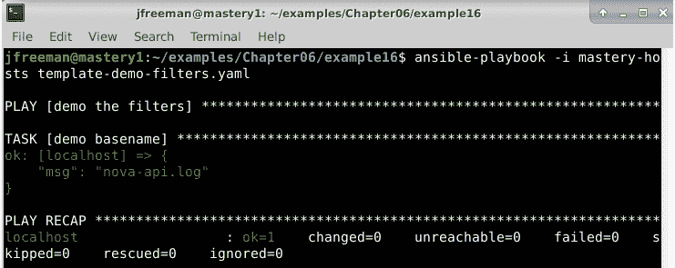

图 6.18 – 运行使用 basename 过滤器的 playbook

在这里，您可以看到只返回了所需的完整路径的文件名。

#### dirname

`basename`的反义词是`dirname`。`dirname`不返回路径的最后部分，而是返回其他所有部分（除了文件名，文件名是完整路径的最后部分）。让我们更改之前的 play 以使用`dirname`，然后使用相同的命令重新运行它。输出现在应该与*图 6.19*中显示的类似：

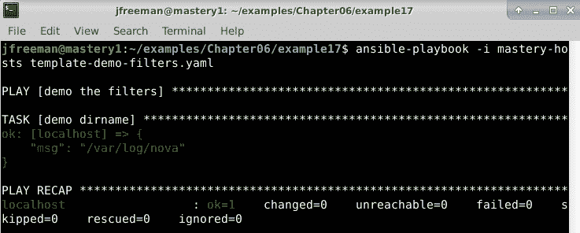

图 6.19 – 使用 dirname 过滤器运行 playbook

现在，我们只有变量的路径，这在 playbook 的其他地方可能非常有用。

#### expanduser

通常，各种东西的路径都使用用户快捷方式提供，例如`~/.stackrc`。但是，某些任务可能需要文件的完整路径。`expanduser`过滤器提供了一种将路径扩展到完整定义的方法，而不是复杂的命令和注册调用。在此示例中，用户名是`jfreeman`：

```
---
- name: demo the filters
  hosts: localhost
  gather_facts: false
  tasks:
    - name: demo filter
      ansible.builtin.debug:
        msg: "{{ '~/.stackrc' | expanduser }}"
```

您可以使用与之前相同的命令运行此 playbook，输出应该与*图 6.20*中显示的类似：

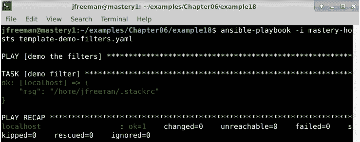

图 6.20 – 使用 expanduser 过滤器运行 playbook

在这里，我们成功地扩展了路径，这对于创建配置文件或执行其他可能需要绝对路径名而不是相对路径名的文件操作可能是有用的。

### Base64 编码

从远程主机读取内容时，例如使用`ansible.builtin.slurp`模块（用于将远程主机的文件内容读入变量中），内容将被 Base64 编码。为了解码这样的内容，Ansible 提供了一个`b64decode`过滤器。同样，如果运行一个需要 Base64 编码输入的任务，常规字符串可以使用`b64encode`过滤器进行编码。

让我们使用 Ansible 创建一个名为`/tmp/derp`的测试文件，其中将包含一个测试字符串。然后，我们将使用`ansible.builtin.slurp`模块获取文件内容，并使用上述过滤器对其进行解码：

```
--- 
- name: demo the filters 
  hosts: localhost 
  gather_facts: false  
  tasks: 
    - name: create a test file
      ansible.builtin.lineinfile:
        path: /tmp/derp
        line: "Ansible is great!"
        state: present
        create: yes
    - name: read file 
      ansible.builtin.slurp: 
        src: /tmp/derp 
      register: derp  
    - name: display file content (undecoded) 
      ansible.builtin.debug: 
        var: derp.content  
    - name: display file content (decoded) 
      ansible.builtin.debug: 
        var: derp.content | b64decode
```

如果您正在使用本书附带的示例代码，可以使用以下命令运行 playbook：

```
ansible-playbook -i mastery-hosts template-demo-filters.yaml
```

输出显示在*图 6.21*中：

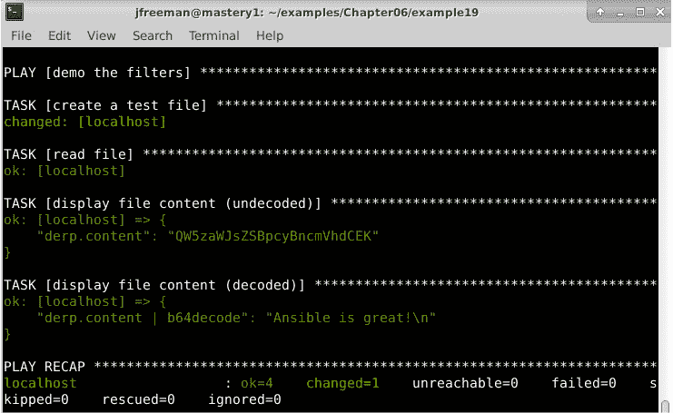

图 6.21 - 运行包含 b64decode 过滤器的 playbook

在这里，我们成功地将创建的小文件读入一个变量中。此外，我们可以看到变量内容以 Base64 编码形式（请记住，这个编码是由`ansible.builtin.slurp`模块执行的）进行编码。然后，我们可以使用过滤器对其进行解码以查看原始文件内容。

### 搜索内容

在 Ansible 中，搜索字符串以查找子字符串是相对常见的。特别是，管理员常见的任务是运行命令并在输出中使用`grep`查找特定的关键数据片段，这在许多 playbook 中是一个常见的构造。虽然可以使用 shell 任务执行命令，将输出传递给`grep`，并使用`failed_when`的谨慎处理来捕获`grep`的退出代码，但更好的策略是使用命令任务`register`输出，然后在后续条件中使用 Ansible 提供的**正则表达式**（**regex**）过滤器。

让我们看两个例子：一个使用`ansible.builtin.shell`，管道和`grep`方法，另一个使用`search`测试：

```
- name: check database version 
  ansible.builtin.shell: neutron-manage current | grep juno 
  register: neutron_db_ver 
  failed_when: false  
- name: upgrade db 
  ansible.builtin.command: neutron-manage db_sync 
  when: neutron_db_ver is failed 
```

前面的例子通过强制 Ansible 始终将任务视为成功来工作，但假设如果 shell 的退出代码为非零，则`juno`字符串未在`neutron-manage`命令的输出中找到。这种构造是功能性的，但阅读起来复杂，并且可能掩盖了来自命令的真实错误。让我们再试一次，使用`search`测试。

正如我们之前提到的，关于任务状态，使用`search`在 Ansible 中搜索字符串被认为是一个测试，并且已被弃用。尽管可能读起来有点奇怪，但为了符合 Ansible 2.9 及更高版本，我们必须在这种情况下使用`is`关键字代替管道使用`search`：

```
- name: check database version 
  ansible.builtin.command: neutron-manage current 
  register: neutron_db_ver  
- name: upgrade db 
  ansible.builtin.command: neutron-manage db_sync 
  when: not neutron_db_ver.stdout is search('juno') 
```

在这里，我们请求在`neutron_db_ver.stdout`不包含`juno`字符串时运行名为`upgrade db`的任务。一旦你习惯了`when: not ... is`的概念，你会发现这个版本更容易理解，并且不会掩盖第一个任务的错误。

`search`过滤器搜索字符串，如果在输入字符串的任何位置找到子字符串，则返回`True`。但是，如果需要精确完整匹配，可以使用`match`过滤器。在`search`/`match`字符串内可以利用完整的 Python 正则表达式语法。

## 省略未定义的参数

`omit`变量需要一点解释。有时，在遍历数据哈希以构建任务参数时，可能只需要为哈希中的某些项目提供一些参数。即使 Jinja2 支持内联`if`语句来有条件地渲染一行的部分，但这在 Ansible 任务中效果不佳。传统上，playbook 作者会创建多个任务，每个任务针对传入的一组潜在参数，并使用条件语句在每个任务集之间对循环成员进行排序。最近添加的魔术变量`omit`与`default`过滤器一起使用时解决了这个问题。`omit`变量将完全删除使用该变量的参数。

为了说明这是如何工作的，让我们考虑一个场景，我们需要使用`ansible.builtin.pip`安装一组 Python 包。一些包有特定版本，而其他包没有。这些包在一个名为`pips`的哈希列表中。每个哈希都有一个`name`键，可能还有一个`ver`键。我们的第一个示例利用了两个不同的任务来完成安装：

```
- name: install pips with versions 
  ansible.builtin.pip: "name={{ item.name }} version={{ item.ver }}"
  loop: "{{ pips }}"
  when: item.ver is defined  
- name: install pips without versions 
  ansible.builtin.pip: "name={{ item.name }}" 
  loop: "{{ pips }}"
  when: item.ver is undefined 
```

这种构造方式可以工作，但是循环会被迭代两次，并且每个任务中的一些迭代将被跳过。下面的示例将两个任务合并为一个，并利用`omit`变量：

```
- name: install pips 
  ansible.builtin.pip: "name={{ item.name }} version={{ item.ver | default(omit) }}" 
  loop: "{{ pips }}" 
```

这个示例更短、更清晰，不会生成额外的跳过任务。

## Python 对象方法

Jinja2 是一个基于 Python 的模板引擎，因此 Python 对象方法在模板中是可用的。对象方法是直接由变量对象（通常是`string`、`list`、`int`或`float`）访问的方法或函数。一个好的思路是：如果你在写 Python 代码时可以写变量，然后是一个句点，然后是一个方法调用，那么你在 Jinja2 中也可以做同样的事情。在 Ansible 中，通常只使用返回修改后的内容或布尔值的方法。让我们探索一些在 Ansible 中可能有用的常见对象方法。

### 字符串方法

字符串方法可以用来返回新的字符串，返回一组以某种方式被修改的字符串，或者测试字符串的各种条件并返回一个布尔值。一些有用的方法如下：

+   `endswith`：确定字符串是否以一个子字符串结尾。

+   `startswith`：与`endswith`相同，但是从开头开始。

+   `split`：将字符串按字符（默认为空格）分割成一个子字符串列表。

+   `rsplit`：与`split`相同，但是从字符串的末尾开始向后工作。

+   `splitlines`：将字符串在换行符处分割成一个子字符串列表。

+   `upper`：返回字符串的大写副本。

+   `lower`：返回字符串的小写副本。

+   `capitalize`：返回字符串的副本，只有第一个字符是大写的。

我们可以创建一个简单的 playbook，在一个任务中利用这些方法：

```
--- 
- name: demo the filters 
  hosts: localhost 
  gather_facts: false 

  tasks: 
    - name: string methods 
      ansible.builtin.debug: 
        msg: "{{ 'foo bar baz'.upper().split() }}" 
```

如果您正在使用本书附带的示例代码，请使用以下命令运行此 playbook：

```
ansible-playbook -i mastery-hosts template-demo-objects.yaml
```

输出将类似于*图 6.22*所示的内容：

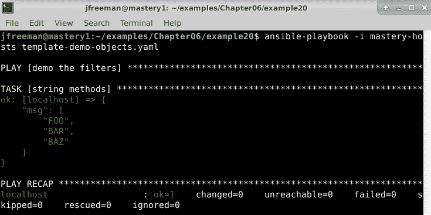

图 6.22 - 运行使用 Python 字符串对象方法的 playbook

由于这些是对象方法，我们需要使用点符号访问它们，而不是通过`|`过滤器。

### 列表方法

大多数 Ansible 提供的与列表相关的方法都是对列表本身进行修改。然而，在处理列表时，特别是涉及循环时，有两个列表方法非常有用。这两个函数分别是`index`和`count`，它们的功能描述如下：

+   `index`：返回提供数值的第一个索引位置。

+   `count`：计算列表中的项目数。

当在循环中迭代列表时，这些函数可以非常有用，因为它允许执行位置逻辑，并在通过列表时采取适当的操作。这在其他编程语言中很常见，幸运的是，Ansible 也提供了这个功能。

### int 和 float 方法

大多数`int`和`float`方法对 Ansible 没有用。有时，我们的变量不完全符合我们想要的格式。但是，我们可以利用 Jinja2 过滤器在需要修改的各个地方执行操作，而不是定义更多的变量来轻微修改相同的内容。这使我们能够有效地定义数据，避免大量重复的变量和任务，这些变量和任务可能以后需要更改。

# 比较值

比较在 Ansible 中的许多地方都有用。任务条件是比较。 Jinja2 控制结构，如`if`/`elif`/`else`块，`for`循环和宏，通常使用比较；一些过滤器也使用比较。要掌握 Ansible 对 Jinja2 的使用，了解可用的比较是很重要的。

## 比较

与大多数语言一样，Jinja2 配备了您期望的标准比较表达式集，这些表达式将生成布尔值`true`或`false`。

Jinja2 中的表达式如下：

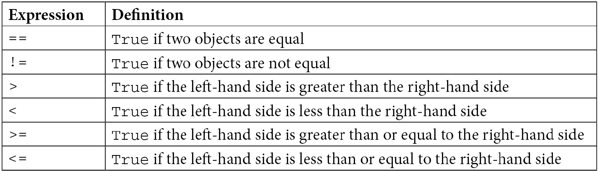

如果您在几乎任何其他编程语言中编写了比较操作（通常以`if`语句的形式），这些操作应该都很熟悉。Jinja2 在模板中保持了这种功能，允许进行与任何良好的编程语言中条件逻辑相同的强大比较操作。

## 逻辑

有时，单独执行一个比较操作是不够的 - 也许我们希望在两个比较同时评估为`true`时执行一个操作。或者，我们可能只想在一个比较不为 true 时执行一个操作。Jinja2 中的逻辑帮助您将两个或多个比较组合在一起，从简单的比较中形成复杂条件。每个比较被称为一个操作数，将这些操作数组合成复杂条件的逻辑在以下列表中给出：

+   `and`: 如果左操作数和右操作数为 true，则返回`true`。

+   `or`: 如果左操作数或右操作数为 true，则返回`true`。

+   `not`: 这否定一个操作数。

+   `()`: 这将一组操作数包装在一起，形成一个更大的操作数。

为了进一步定义 Jinja2 中的逻辑条件，我们可以对某些变量条件进行测试，比如变量是否已定义或未定义。我们将在下一节中更详细地讨论这个问题。

## 测试

Jinja2 中的测试用于确定变量是否符合某些明确定义的标准，在本章的特定场景中我们已经遇到过这种情况。`is`运算符用于启动测试。测试用于需要布尔结果的任何地方，例如`if`表达式和任务条件。有许多内置测试，但我们将重点介绍一些特别有用的测试，如下所示：

+   `defined`: 如果变量已定义，则返回`true`。

+   `undefined`: 这是`defined`的相反。

+   `none`: 如果变量已定义但值为 none，则返回`true`。

+   `even`: 如果数字可以被`2`整除，则返回`true`。

+   `odd`: 如果数字不能被`2`整除，则返回`true`。

要测试一个值是否不是某个值，只需使用`is not`。

我们可以创建一个 playbook 来演示这些值的比较：

```
---
- name: demo the logic
  hosts: localhost
  gather_facts: false
  vars:
    num1: 10
    num3: 10
  tasks:
    - name: logic and comparison
      ansible.builtin.debug:
        msg: "Can you read me?"
      when: num1 >= num3 and num1 is even and num2 is not defined
```

如果您正在运行本书附带的代码，可以使用以下命令执行此示例 playbook：

```
ansible-playbook -i mastery-hosts template-demo-comparisons.yaml
```

输出显示在*图 6.23*中：

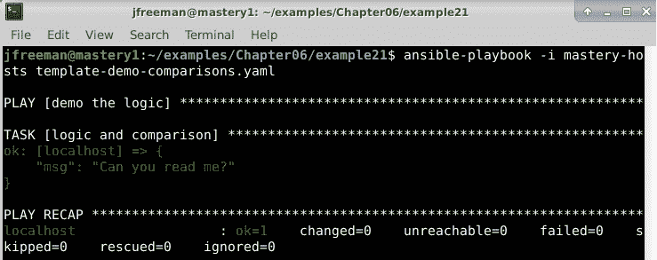

图 6.23 - 执行包含复杂条件的 playbook

在这里，我们可以看到我们的复杂条件评估为`true`，因此执行了调试任务。

这就结束了我们对 Ansible 广泛的模板能力的探讨。我们希望本章为您提供了有效自动化基础设施的种子想法。 

# 摘要

Jinja2 是 Ansible 广泛使用的强大语言。它不仅用于生成文件内容，还用于使 playbook 的部分动态化。精通 Jinja2 对于创建和维护优雅高效的 playbook 和角色至关重要。

在本章中，我们学习了如何使用 Jinja2 构建简单模板，并从 Ansible playbook 中呈现它们。此外，我们还学习了如何有效地使用控制结构，如何操作数据，甚至如何对变量进行比较和测试，以控制 Ansible playbook 的流程（通过保持代码轻量和高效）并创建和操作数据，而无需重复定义或过多的变量。

在下一章中，我们将更深入地探讨 Ansible 的能力，以定义 play 中任务的变化或失败。

# 问题

1.  Jinja2 条件可以用于在 playbook 任务中内联渲染内容。

a）真

b）假

1.  以下哪个 Jinja2 结构将在每次评估时打印一个空行？

a）``

b）``

c）``

d）``

1.  Jinja2 宏可用于执行以下哪些操作？

a）定义需要自动化的一系列按键。

b）定义一个用于使用 Ansible 自动化电子表格的函数。

c）定义一个经常从模板中的其他位置调用的函数。

d）宏不在 Jinja2 中使用。

1.  以下哪个是将两个 Jinja2 过滤器链接在一起并对 Ansible 变量进行操作的有效表达式？

a）`{{ value.replace('A', 'B').lower }}`

b）`{{ value | replace('A', 'B') | lower }}`

c）`value.replace('A', 'B').lower`

d）`lower(replace('A', 'B',value))`

1.  Jinja2 过滤器始终具有强制参数。

a）真

b）假

1.  您将使用哪个 Ansible 自定义过滤器来从列表变量中检索随机条目？

a）`洗牌`

b）`随机`

c）`选择`

d）`rand`

1.  Ansible 可以使用哪个过滤器从完整路径中提取文件名？

a）`文件名`

b）`dirname`

c）`expanduser`

d）`basename`

1.  Ansible 提供了一个构造来跳过可选参数以防止未定义的变量错误。它叫什么？

a）`skip_var`

b）`跳过`

c）`省略`

d）`prevent_undefined`

1.  可以使用哪些运算符为 Ansible 任务构建复杂的条件？

a）`和`，`或`和`不`

b）`和`，`nand`，`或`，`nor`和`not`

c）`&&`，`||`和`！`

d）`＆`，`|`和`！`

1.  以下哪个任务执行条件将允许任务在前一个任务成功完成时运行？

a）`previoustask | success`

b）`previoustask = success`

c）`previoustask == success`

d）`previoustask 成功`
