# *第七章*：控制任务条件

Ansible 是一个在一个或多个主机上运行任务的系统，并确保操作员了解是否发生了变更（以及是否遇到了任何问题）。因此，Ansible 任务会产生四种可能的状态：`ok`、`changed`、`failed`或`skipped`。这些状态执行了许多重要的功能。

从运行 Ansible playbook 的操作员的角度来看，它们提供了已完成的 Ansible 运行的概述——无论是否发生了任何变更，以及是否有任何需要解决的失败。此外，它们确定了 playbook 的流程——例如，如果一个任务的状态是`changed`，我们可能希望执行服务的重启，否则保持运行。Ansible 具有实现这一切所需的所有功能。

同样，如果一个任务的状态是`failed`，那么 Ansible 的默认行为就是不在该主机上尝试任何进一步的任务。任务还可以使用条件来检查先前任务的状态以控制操作。因此，这些状态或任务条件对于 Ansible 的几乎所有操作都是至关重要的，重要的是要了解如何处理它们，从而控制 playbook 的流程，以满足例如可能发生失败的情况。我们将在本章中详细讨论如何处理这些情况。

在本章中，我们将详细探讨这一点，特别关注以下主题：

+   控制定义失败的内容

+   从失败中恢复

+   控制定义变更的内容

+   使用循环迭代一组任务

# 技术要求

要跟随本章中提出的示例，您需要一台运行**Ansible 4.3**或更新版本的 Linux 机器。几乎任何 Linux 版本都可以使用——对于那些对细节感兴趣的人，本章中提供的所有代码都是在**Ubuntu Server 20.04 LTS**上测试的，除非另有说明，并且在 Ansible 4.3 上。本章附带的示例代码可以从 GitHub 的以下网址下载：[`github.com/PacktPublishing/Mastering-Ansible-Fourth-Edition/tree/main/Chapter07`](https://github.com/PacktPublishing/Mastering-Ansible-Fourth-Edition/tree/main/Chapter07)。

查看以下视频以查看代码的实际操作：[`bit.ly/3AVXxME`](https://bit.ly/3AVXxME)。

# 定义失败

大多数与 Ansible 一起提供的模块对于什么构成错误有不同的标准。错误条件高度依赖于模块以及模块试图实现的内容。当一个模块返回错误时，主机将从可用主机集合中移除，阻止在该主机上执行任何进一步的任务或处理程序。此外，`ansible-playbook`和`ansible`可执行文件将以非零退出代码退出以指示失败。然而，我们并不受限于模块对错误的看法。我们可以忽略错误或重新定义错误条件。

## 忽略错误

名为`ignore_errors`的任务条件用于忽略错误。这个条件是一个布尔值，意味着值应该是`Ansible`理解为`true`的东西，比如`yes`、`on`、`true`或`1`（字符串或整数）。

为了演示如何使用`ignore_errors`，让我们创建一个 playbook，尝试查询一个不存在的 web 服务器。通常，这将是一个错误，如果我们不定义`ignore_errors`，我们将得到默认行为；也就是说，主机将被标记为失败，并且不会在该主机上尝试任何进一步的任务。创建一个名为`error.yaml`的新 playbook，如下所示，以进一步查看这种行为：

```
---
- name: error handling
  hosts: localhost
  gather_facts: false
  tasks:
  - name: broken website 
    ansible.builtin.uri: 
      url: http://notahost.nodomain 
```

使用以下命令运行此 playbook：

```
ansible-playbook -i mastery-hosts error.yaml
```

这本 playbook 中的单个任务应该导致一个看起来像*图 7.1*中所示的错误：

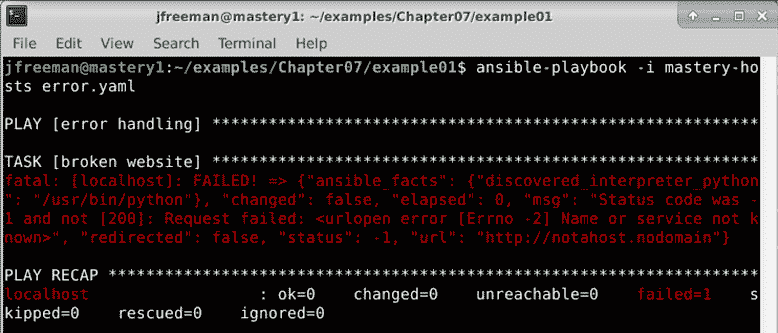

图 7.1 – 运行一个故意引发任务错误的 playbook

现在，假设我们不希望 Ansible 在这里停止，而是希望它继续。我们可以像这样在我们的任务中添加`ignore_errors`条件：

```
  - name: broken website 
    ansible.builtin.uri: 
      url: http://notahost.nodomain 
    ignore_errors: true 
```

这次，当我们使用与之前相同的命令运行 playbook 时，我们的错误将被忽略，如*图 7.2*所示：


图 7.2 - 运行相同的 playbook，但添加了`ignore_errors`任务条件

对于该主机的任何进一步任务仍将尝试，并且 playbook 不会注册任何失败的主机。

## 定义错误条件

`ignore_errors`条件有点粗糙。来自任务使用的模块的任何错误都将被忽略。此外，乍一看，输出仍然看起来像一个错误，并且可能会让试图发现真正故障的操作员感到困惑。更微妙的工具是`failed_when`条件。这个条件更像是一把精细的手术刀，允许 playbook 作者非常具体地指出什么对于任务来说构成错误。这个条件执行一个测试来生成一个布尔结果，就像`when`条件一样。如果条件导致布尔`true`值，任务将被视为失败。否则，任务将被视为成功。

当与`command`或`shell`模块结合使用并注册执行结果时，`failed_when`条件非常有用。许多执行的程序可能具有详细的非零退出代码，意味着不同的含义。然而，这些 Ansible 模块都认为除`0`之外的任何退出代码都是失败。让我们看看`iscsiadm`实用程序。这个实用程序可以用于与 iSCSI 相关的许多事情。为了演示，我们将在`error.yaml`中替换我们的`uri`模块，并尝试发现任何活动的`iscsi`会话：

```
  - name: query sessions
    ansible.builtin.command: /sbin/iscsiadm -m session
    register: sessions
```

使用与之前相同的命令运行这个 playbook；除非您在具有活动 iSCSI 会话的系统上，否则您将看到与*图 7.3*非常相似的输出：

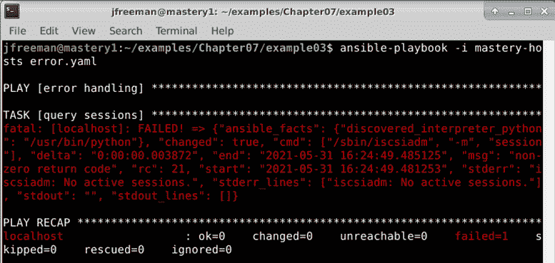

图 7.3 - 运行一个 playbook 来发现没有任何故障处理的活动 iSCSI 会话

重要提示

`iscsiadm`工具可能不是默认安装的，如果是这样，您将得到与前面不同的错误。在我们的 Ubuntu Server 20.04 测试机器上，它是使用以下命令安装的：`sudo apt install open-iscsi`。

我们可以只使用`ignore_errors`条件，但这将掩盖`iscsi`的其他问题，所以我们不想这样做，而是想指示 Ansible 退出代码`21`是可以接受的。为此，我们可以利用注册变量来访问`rc`变量，该变量保存返回代码。我们将在`failed_when`语句中使用这个：

```
  - name: query sessions
    command: /sbin/iscsiadm -m session
    register: sessions
    failed_when: sessions.rc not in (0, 21) 
```

我们只是声明除`0`或`21`之外的任何退出代码都应被视为失败。再次运行 playbook，但这次增加了详细信息，使用命令的`-v`标志，就像这样：

```
ansible-playbook -i mastery-hosts error.yaml -v
```

再次假设您没有活动的 iSCSI 会话，输出将如*图 7.4*所示。当然，使用`-v`标志并不是强制的，但在这种情况下很有帮助，因为它显示了`iscsiadm`实用程序的退出代码：

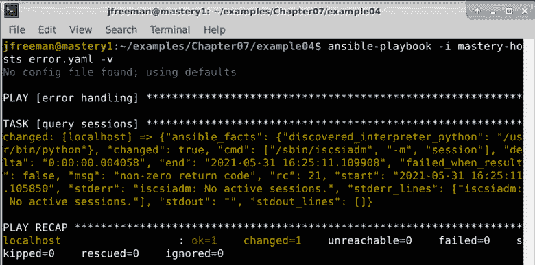

图 7.4 - 运行相同的 playbook，但根据命令退出代码处理故障

现在输出显示没有错误，实际上，我们在结果中看到了一个新的数据键 - `failed_when_result`。这显示了我们的`failed_when`语句是否渲染为`true`或`false`；在这种情况下是`false`。

许多命令行工具没有详细的退出代码。实际上，大多数通常使用`0`表示成功，另一个非零代码表示所有失败类型。幸运的是，`failed_when`语句不仅仅限于应用程序的退出代码；它是一个自由形式的布尔语句，可以访问任何所需的数据。让我们看一个不同的问题，涉及`Git`。我们将想象一个场景，我们想要确保`Git`检出中不存在特定的分支。此任务假定`/srv/app`目录中已经检出了`Git`存储库。删除`Git`分支的命令是`git branch -D`。让我们看一下以下代码片段：

```
  - name: delete branch bad
    ansible.builtin.command: git branch -D badfeature
    args:
      chdir: /srv/app
```

要使此代码工作，您需要将`Git`存储库检出到上一个目录中。如果您没有要测试的存储库，可以使用以下命令轻松创建一个（只需确保`/srv/app`中没有任何重要的内容会被覆盖！）：

```
sudo mkdir -p /srv/app
sudo chown $USER /srv/app
cd /srv/app
git init
git commit --allow-empty -m "initial commit"
```

完成这些步骤后，您就可以运行我们之前详细介绍的更新后的 playbook 任务。与以前一样，我们将增加输出的详细信息，以便更好地理解我们 playbook 的行为。

重要提示

`ansible.builtin.command`和`ansible.builtin.shell`模块使用不同的格式来提供模块参数。`ansible.buitin.command`本身以自由形式提供，而模块参数进入`args`哈希。

按照描述运行 playbook 应该会产生错误，因为`git`将产生一个退出代码为`1`的错误，因为分支不存在，如*图 7.5*所示：

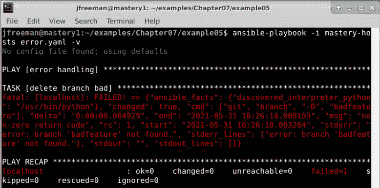

图 7.5 - 在 Ansible playbook 中运行 git 命令而没有错误处理

如您所见，错误没有得到优雅处理，`localhost`的 play 已中止。

重要提示

我们使用`ansible.builtin.command`模块来轻松演示我们的主题，尽管存在`ansible.builtin.git`模块。处理 Git 存储库时，应改用`ansible.builtin.git`模块。

没有`failed_when`和`changed_when`条件，我们将不得不创建一个两步任务组合来保护自己免受错误的影响：

```
  - name: check if branch badfeature exists
    ansible.builtin.command: git branch
    args:
      chdir: /srv/app
    register: branches
  - name: delete branch bad
    ansible.builtin.command: git branch -D badfeature
    args:
      chdir: /srv/app
    when: branches.stdout is search('badfeature')
```

在分支不存在的情况下，运行这些任务应该如*图 7.6*所示：

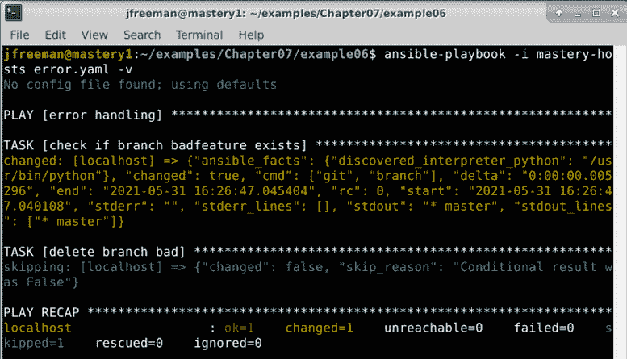

图 7.6 - 在 Ansible playbook 中使用两个任务处理错误

虽然两个任务集是功能性的，但并不高效。让我们改进这一点，并利用`failed_when`功能将两个任务减少到一个：

```
  - name: delete branch bad
    ansible.builtin.command: git branch -D badfeature
    args:
      chdir: /srv/app
    register: gitout
    failed_when:
      - gitout.rc != 0
      - not gitout.stderr is search('branch.*not found')
```

重要提示

通常会使用`and`连接的多个条件可以表示为列表元素。这可以使 playbooks 更易于阅读，逻辑问题更易于发现。

我们检查命令返回代码是否为`0`以外的任何值，然后使用`search`过滤器来搜索带有`branch.*not found`正则表达式的`stderr`值。我们使用 Jinja2 逻辑来组合这两个条件，这将评估为包容的`true`或`false`选项，如*图 7.7*所示：

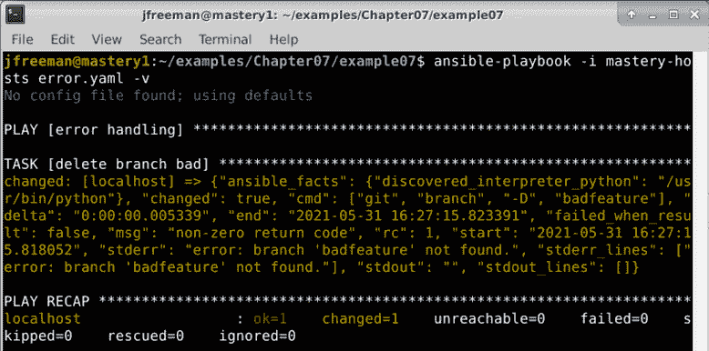

图 7.7 - 在 Ansible playbook 中单个任务内有效地处理错误

这演示了我们如何重新定义 Ansible playbook 中的失败，并优雅地处理否则会中断 play 的条件。我们还可以重新定义 Ansible 视为更改的内容，接下来我们将看到这一点。

# 定义更改

与定义任务失败类似，也可以定义什么构成了更改的任务结果。这种能力在`ansible.builtin.command`系列模块（`command`，`shell`，`raw`和`script`）中特别有用。与大多数其他模块不同，这个系列的模块没有更改可能是什么的固有概念。事实上，除非另有指示，否则这些模块只会产生`failed`，`changed`或`skipped`。对于这些模块来说，根本没有办法假设更改与未更改的条件，因为它们不能期望理解或解释您可能使用它们执行的每个可能的 shell 命令。

`changed_when`条件允许 playbook 的作者指示模块如何解释更改。就像`failed_when`一样，`changed_when`执行测试以生成布尔结果。经常与`changed_when`一起使用的任务是会以非零退出来指示不需要进行任何工作的命令；因此，作者经常会结合`changed_when`和`failed_when`来微调任务结果的评估。

在我们之前的例子中，`failed_when`条件捕捉到了没有需要做的工作但任务仍然显示了更改的情况。我们希望在退出码`0`时注册更改，但在任何其他退出码时不注册更改。让我们扩展我们的示例任务以实现这一点：

```
  - name: delete branch bad
    ansible.builtin.command: git branch -D badfeature
    args:
      chdir: /srv/app
    register: gitout
    failed_when:
      - gitout.rc != 0
      - not gitout.stderr is search('branch.*not found')
    changed_when: gitout.rc == 0
```

现在，如果我们在分支仍不存在的情况下运行我们的任务（再次增加输出的详细程度，以帮助我们看到底层发生了什么），我们将看到类似于*图 7.8*所示的输出：

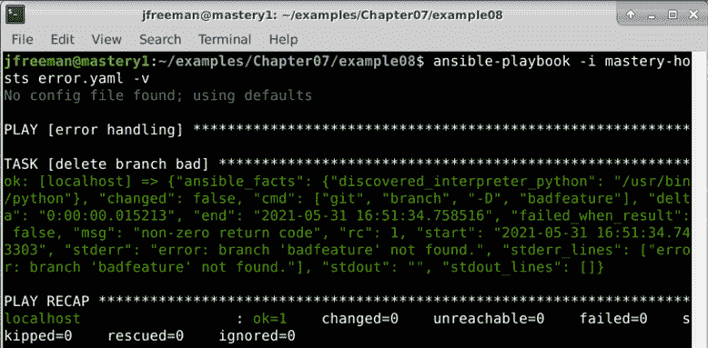

图 7.8 – 通过 changed_when 任务条件扩展我们的 Git playbook

请注意，`changed`键现在的值为`false`。

为了完整起见，我们将改变场景，使分支存在并再次运行它。要创建分支，只需从`/srv/app`目录运行`git branch badfeature`。现在，我们可以再次执行我们的 playbook 以查看输出，输出应该看起来像*图 7.9*所示：

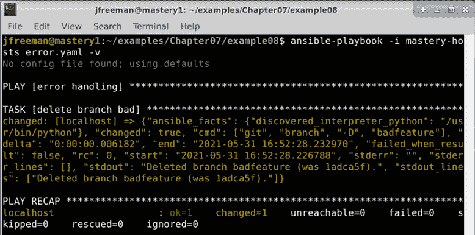

图 7.9 – 在我们的测试存储库中存在 badfeature 分支时测试相同的 playbook

这次，我们的输出不同了；它注册了一个更改，而`stdout`数据显示分支被删除了。

## 命令系列的特殊处理

命令系列模块的一个子集（`ansible.builtin.command`，`ansible.builtin.shell`和`ansible.builtin.script`）有一对特殊参数，它们将影响任务工作是否已经完成，从而决定任务是否会导致更改。这些选项是`creates`和`removes`。这两个参数期望一个文件路径作为值。当 Ansible 尝试使用`creates`或`removes`参数执行任务时，它将首先检查引用的文件路径是否存在。

如果路径存在并且使用了`creates`参数，Ansible 将认为工作已经完成，并返回`ok`。相反，如果路径不存在并且使用了`removes`参数，那么 Ansible 将再次认为工作已经完成，并返回`ok`。任何其他组合将导致工作实际发生。预期是任务正在做的任何工作都将导致引用的文件的创建或删除。

`creates`和`removes`的便利性使开发人员无需进行两个任务的组合。让我们创建一个场景，我们想要从项目根目录的`files/`子目录运行`frobitz`脚本。在我们的场景中，我们知道`frobitz`脚本将创建一个路径`/srv/whiskey/tango`。实际上，`frobitz`的源代码如下：

```
#!/bin/bash 
rm -rf /srv/whiskey/tango 
mkdir -p /srv/whiskey/tango 
```

我们不希望这个脚本运行两次，因为它可能对任何现有数据造成破坏。替换我们的`error.yaml` playbook 中的现有任务，两个任务的组合将如下所示：

```
  - name: discover tango directory
    ansible.builtin.stat: path=/srv/whiskey/tango
    register: tango
  - name: run frobitz
    ansible.builtin.script: files/frobitz --initialize /srv/whiskey/tango
    when: not tango.stat.exists
```

像我们在本章中一样，以增加的详细程度运行 playbook。如果`/srv/whiskey/tango`路径已经存在，输出将如*图 7.10*所示：

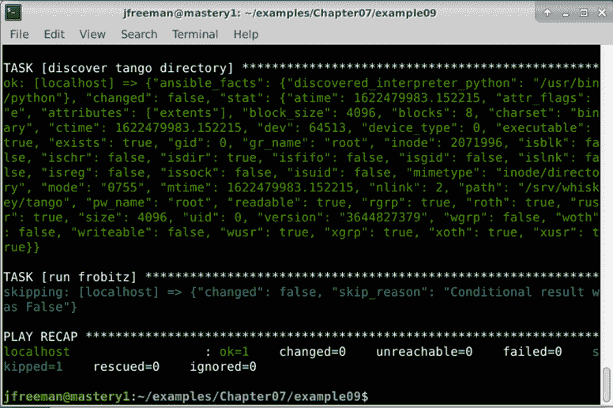

图 7.10 – 一个两个任务的 play，有条件地运行破坏性脚本

如果`/srv/whiskey/tango`路径不存在，`ansible.builtin.stat`模块将返回更少的数据，`exists`键的值将为`false`。因此，我们的`frobitz`脚本将被运行。

现在，我们将使用`creates`将其减少为一个单独的任务：

```
  - name: run frobitz 
    ansible.builtin.script: files/frobitz 
    args:
      creates: /srv/whiskey/tango 
```

重要提示

`ansible.builtin.script`模块实际上是一个`action_plugin`，将在*第十章*中讨论，*扩展 Ansible*。

这一次，我们的输出将会有些不同，如*图 7.11*所示：

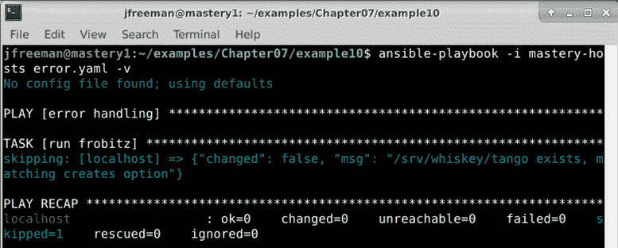

图 7.11 – 通过将所有任务条件合并为一个任务使我们以前的 playbook 更加高效

这一次，我们完全跳过了运行脚本，因为在 playbook 甚至运行之前目录已经存在。这样可以节省 playbook 执行时间，也可以防止运行脚本可能导致的任何潜在破坏性行为。

重要提示

充分利用`creates`和`removes`将使您的 playbook 简洁高效。

## 抑制更改

有时，完全抑制更改是可取的。这经常用于执行命令以收集数据。命令执行实际上并没有改变任何东西；相反，它只是收集信息，就像`ansible.builtin.setup`模块一样。在这种任务上抑制更改可以帮助快速确定 playbook 运行是否导致了舰队中的任何实际更改。

要抑制更改，只需将`false`作为`changed_when`任务键的参数。让我们扩展我们以前的一个例子，以发现要抑制更改的活动`iscsi`会话：

```
  - name: discover iscsi sessions
    ansible.builtin.command: /sbin/iscsiadm -m session
    register: sessions
    failed_when:
      - sessions.rc != 0
      - not sessions.stderr is
        search('No active sessions')
    changed_when: false
```

现在，无论返回的数据是什么，Ansible 都会将任务视为`ok`而不是 changed，如*图 7.12*所示：

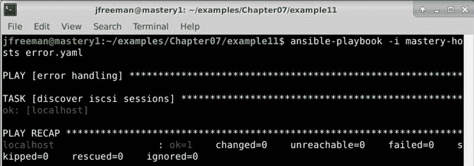

图 7.12 – 抑制 Ansible playbook 中的更改

因此，这个任务现在只有两种可能的状态——`failed`和`ok`。我们实际上否定了`changed`任务结果的可能性。当然，运行代码时出现故障是生活的一部分，重要的是我们能够在 playbook 中优雅地处理这些问题。在下一节中，我们将看看在 Ansible 中如何实现这一点。

# 错误恢复

虽然错误条件可以被严格定义，但有时会发生真正的错误。Ansible 提供了一种方法来对真正的错误做出反应，一种允许在发生错误时运行附加任务的方法，定义特定任务，即使出现错误也始终执行，或者两者都执行。这种方法就是**block**功能。

block 功能是在 Ansible 2.0 版本中引入的，它为相关的 play 任务集提供了一些额外的结构。块可以将任务组合成一个逻辑单元，该单元（或块）可以对整个单元（或块）应用任务控制。此外，一组任务的块可以有可选的`rescue`和`always`部分，它们分别在错误状态下执行和不管错误状态如何执行。我们将在接下来的两个部分中探讨它们的工作原理。

## 使用 rescue 部分

`block`的`rescue`部分定义了一个逻辑单元的任务，当块内遇到实际失败时将执行。当 Ansible 执行块内的任务时，执行通常从上到下进行，当遇到实际失败时，执行将跳转到`rescue`部分的第一个任务（如果存在；此部分是可选的）。然后，任务将从上到下执行，直到到达`rescue`部分的末尾或遇到另一个错误为止。

在`rescue`部分完成后，任务执行将继续进行，就像没有错误一样。这提供了一种优雅地处理错误的方式，允许定义`cleanup`任务，以便系统不会处于完全破碎的状态，并且 play 的其余部分可以继续。这比基于错误状态的一组复杂的任务注册结果和任务条件要干净得多。

为了演示这一点，让我们在一个块内创建一个新的任务集。这个任务集中将有一个未处理的错误，这将导致执行切换到`rescue`部分，从那里我们将执行一个`cleanup`任务。

我们还将在块之后提供一个任务，以确保执行继续。我们将重用`error.yaml` playbook:

```
---
- name: error handling
  hosts: localhost
  gather_facts: false
  tasks:
  - block:
      - name: delete branch bad
        ansible.builtin.command: git branch -D badfeature
        args:
          chdir: /srv/app
      - name: this task is lost
        ansible.builtin.debug:
          msg: "I do not get seen"
```

`block`部分中列出的两个任务按照它们列出的顺序执行。如果其中一个导致`failed`结果，那么`rescue`块中显示的以下代码将被执行：

```
    rescue:
      - name: cleanup task
        ansible.builtin.debug:
          msg: "I am cleaning up"
      - name: cleanup task 2
        ansible.builtin.debug:
          msg: "I am also cleaning up"
```

最后，无论之前的任务如何，都会执行这个任务。请注意，较低的缩进级别意味着它与块的相同级别运行，而不是作为`block`结构的一部分运行：

```
  - name: task after block
    ansible.builtin.debug:
      msg: "Execution goes on" 
```

尝试执行此 playbook 以观察其行为；像我们在本章中一样，向输出添加详细信息，以帮助您理解发生了什么。当此 play 执行时，第一个任务将导致错误，并且第二个任务将被跳过。执行将继续进行`cleanup`任务，并且应该如*图 7.13*所示：

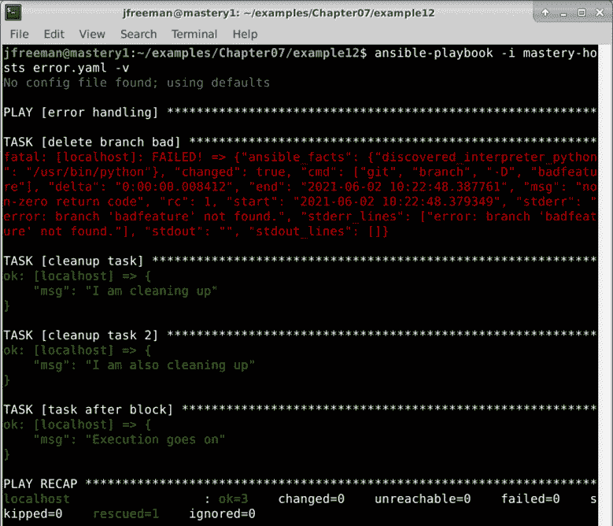

图 7.13 - 执行包含救援部分的块的 playbook

不仅执行了`rescue`部分，而且整个 play 也完成了，并且整个`ansible-playbook`执行被认为是成功的，尽管块内的先前任务失败。让我们在下一节中通过查看块的`always`部分来扩展这个例子。

## 使用 always 部分

除了`rescue`，我们还可以使用另一个部分，名为`always`。块的这部分将始终执行，无论是否出现错误。这个功能对于确保系统状态始终保持功能非常方便，无论一组任务是否成功。由于一些块任务可能由于错误而被跳过，而`rescue`部分仅在出现错误时执行，`always`部分提供了在每种情况下执行任务的保证。

让我们扩展我们之前的例子，并向我们的块添加一个`always`部分：

```
    always:
      - name: most important task
        ansible.builtin.debug:
          msg: "Never going to let you down"
```

重新运行我们的 playbook，如前一节所示，我们可以看到额外的任务显示如下，如*图 7.14*所示：

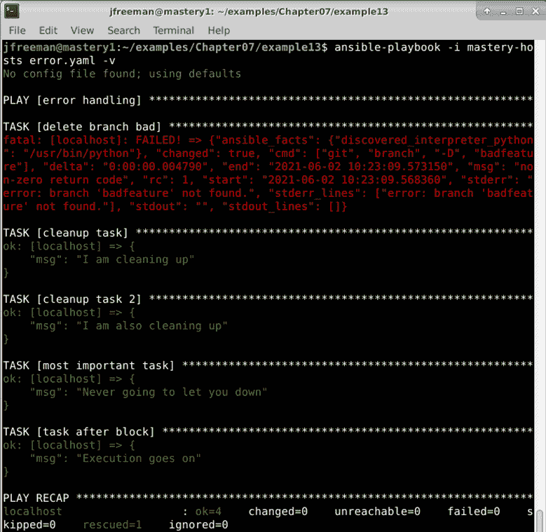

图 7.14 - 运行包含救援和 always 部分的 Ansible playbook 的块

为了验证`always`部分确实总是执行，我们可以修改 play，以便使用我们在前一节中开发的任务条件来使 Git 任务被认为是成功的。修改后的 play 的第一部分如下所示，供您参考：

```
---
- name: error handling
  hosts: localhost
  gather_facts: false
  tasks:
  - block:
      - name: delete branch bad
        ansible.builtin.command: git branch -D badfeature
        args:
          chdir: /srv/app
        register: gitout
        failed_when:
          - gitout.rc != 0
          - not gitout.stderr is search('branch.*not found')
```

请注意更改的`failed_when`条件，这将使`git`命令在不被视为失败的情况下运行。playbook 的其余部分（到目前为止在先前的示例中已经构建起来）保持不变。

这一次，当我们执行 playbook 时，我们的`rescue`部分被跳过，我们之前由于错误而被屏蔽的任务被执行，我们的`always`块仍然被执行，正如*图 7.15*所示：

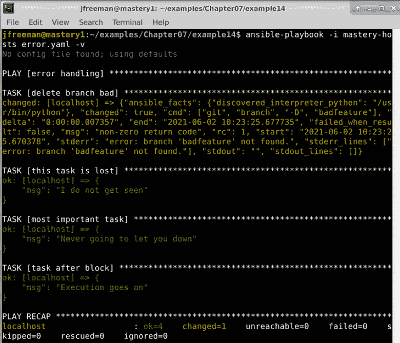

图 7.15 - 执行一个包含救援和总是部分但没有任务错误的块的 playbook

还要注意，我们之前丢失的任务现在已经被执行，因为`delete branch bad`任务的失败条件已经更改，因此在此播放中不再失败。类似地，我们的`rescue`部分不再需要，并且所有其他任务（包括`always`部分）都如预期地完成。在 ansible 中处理由不可靠环境引起的错误的最后部分中，我们将看到如何处理这些错误。 

## 处理不可靠的环境

到目前为止，在本章中，我们已经专注于优雅地处理错误，并改变了 ansible 对于更改和失败的默认行为。这对于任务来说都很好，但是如果您在一个不可靠的环境中运行 ansible 呢？例如，可能使用较差或瞬时的连接来到达受管主机，或者由于某种原因主机可能经常宕机。后一种情况可能是一个动态扩展的环境，可以在高负载时扩展，并在需求低时缩减以节省资源-因此您无法保证所有主机始终可用。

幸运的是，playbook 关键字`ignore_unreachable`恰好处理这些情况，并确保在我们的清单上尝试所有任务，即使在执行任务期间标记为不可达的主机。这与默认行为相反，即当 ansible 发生第一个错误时，将停止处理给定主机的任务。就像在许多情况下一样，最好通过一个例子来解释，所以让我们重用`error.yaml` playbook 来创建这样一个情况：

```
---
- name: error handling
  hosts: all
  gather_facts: false
  tasks:
  - name: delete branch bad
    ansible.builtin.command: git branch -D badfeature
    args:
      chdir: /srv/app
  - name: important task
    ansible.builtin.debug:
      msg: It is important we attempt this task!
```

我们将尝试从我们的清单中定义的两个远程主机的 Git 仓库中删除`badfeature`分支。这个清单将与本书中使用的其他清单有所不同，因为我们将故意创建两个不可达的虚构主机。这些主机的实际名称或定义的 IP 地址并不重要，但是为了使本节中描述的示例能够正常工作，这些主机必须是不可达的。我的清单文件如下所示：

```
[demo]
mastery.example.com ansible_host=192.168.10.25
backend.example.com ansible_host=192.168.10.26
```

由于我们故意创建了一个不存在的主机清单，我们知道它们将在尝试第一个任务时被标记为不可达。尽管如此，在第二个任务中仍然有一个绝对必须尝试的任务。让我们按原样运行 playbook，看看会发生什么；输出应该如*图 7.16*所示：

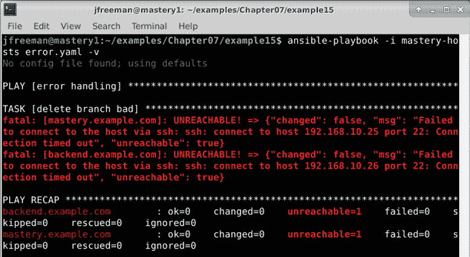

图 7.16 - 尝试在不可达主机清单上进行两个任务的播放

从输出中可以看出，名为`important task`的任务从未被尝试过-在第一个任务后播放被中止，因为主机不可达。然而，让我们使用我们新发现的标志来改变这种行为。将代码更改为如下所示：

```
---
- name: error handling
  hosts: all
  gather_facts: false
  tasks:
  - name: delete branch bad
    ansible.builtin.command: git branch -D badfeature
    args:
      chdir: /srv/app
    ignore_unreachable: true
  - name: important task
    ansible.builtin.debug:
      msg: It is important we attempt this task!
```

这一次，请注意，即使在第一次尝试时主机不可达，我们的第二个任务仍然被执行，正如*图 7.17*所示：

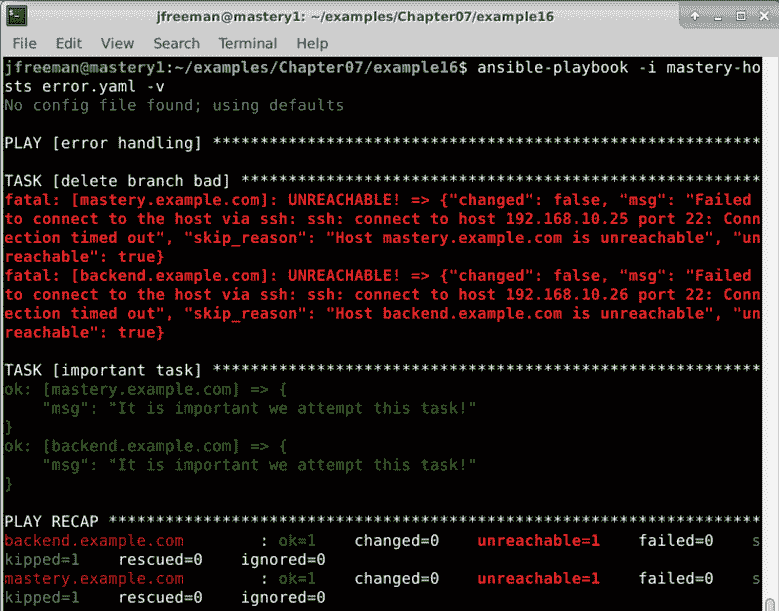

图 7.17 - 尝试在不可达主机上进行相同的两个任务播放，但这次忽略可达性

如果像`debug`命令一样，它可能在本地运行，或者它是至关重要的，并且即使在第一次尝试时连接失败也应该尝试。到目前为止，在本章中，你已经了解了 Ansible 提供的处理各种错误条件的工具。接下来，我们将继续探讨使用循环来控制任务流程——这是使代码简洁并防止重复的特别重要的工具。

# 使用循环的迭代任务

循环在本章中值得特别提及。到目前为止，我们已经专注于以自上而下的方式控制 playbook 的流程——我们已经改变了在 playbook 运行时可能被评估的各种条件，并且我们也专注于创建简洁、高效的代码。然而，如果你有一个单独的任务，但需要针对一组数据运行它会发生什么呢？例如，创建多个用户帐户、目录，或者更复杂的东西？

循环在 Ansible 2.5 中发生了变化——在此之前，循环通常是使用`with_items`等关键字创建的，你可能仍然在旧代码中看到这种情况。尽管一些向后兼容性仍然存在，但建议使用更新的`loop`关键字。

让我们举一个简单的例子——我们需要创建两个目录。创建`loop.yaml`如下：

```
---
- name: looping demo
  hosts: localhost
  gather_facts: false
  become: true
  tasks:
  - name: create a directory
    ansible.builtin.file:
      path: /srv/whiskey/alpha
      state: directory
  - name: create another directory
    ansible.builtin.file:
      path: /srv/whiskey/beta
      state: directory
```

当我们运行这个时，如预期的那样，我们的两个目录被创建了，就像*图 7.18*所示：

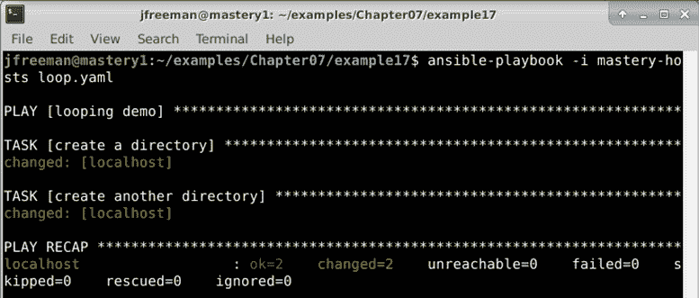

图 7.18 – 运行一个简单的 playbook 来创建两个目录

然而，你可以看到这段代码是重复的和低效的。相反，我们可以将其改为以下内容：

```
---
- name: looping demo
  hosts: localhost
  gather_facts: false
  become: true
  tasks:
  - name: create a directory
    ansible.builtin.file:
      path: "{{ item }}"
      state: directory
    loop:
      - /srv/whiskey/alpha
      - /srv/whiskey/beta
```

注意特殊的`item`变量的使用，它现在用于定义任务底部的`loop`项的`path`。现在，当我们运行这段代码时，输出看起来有些不同，就像*图 7.19*所示：

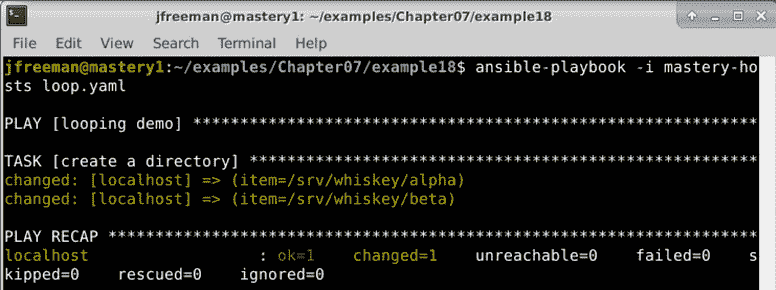

图 7.19 – 一个用循环创建相同两个目录的 playbook，这次使用循环以获得更高效的代码

这两个目录仍然像以前一样被创建，但这次是在一个任务中。这使得我们的 playbook 更加简洁和高效。Ansible 提供了许多更强大的循环选项，包括嵌套循环和创建循环，直到满足给定条件（在其他语言中通常称为`do until`循环），而不是特定的有限数据集。

`do until`循环在等待满足某个条件时非常有用。例如，如果我们想要等待直到文件系统写入了一个标志文件，我们可以使用`ansible.builtin.stat`模块来查询文件，将模块运行的结果注册到一个变量中，然后在循环中运行，直到满足文件存在的条件。以下代码片段正是这样做的——它将循环（`retries`）五次，每次重试之间间隔 10 秒：

```
    - name: Wait until /tmp/flag exists
      ansible.builtin.stat:
        path: /tmp/flag
      register: statresult
      until: statresult.stat.exists
      retries: 5
      delay: 10
```

嵌套循环可以通过两种方式创建——要么通过对嵌套列表进行迭代，要么通过对包含的任务文件进行迭代。例如，假设我们想要在两个路径中分别创建两个新文件（由 Ansible 中的两个列表定义）。我们的代码可能是这样的：

```
---
- name: Nested loop example
  hosts: all
  gather_facts: no
  vars:
    paths:
      - /tmp
      - /var/tmp
    files:
      - test1
      - test2
  tasks:
    - name: Create files with nested loop
      ansible.builtin.file:
        path: "{{ item[0] }}/{{ item[1] }}"
        state: touch
      loop: "{{ paths | product(files) | list }}"
```

在这里，我们使用了`product` Jinja2 过滤器，将两个变量列表创建为嵌套列表，然后`loop`忠实地为我们迭代。运行这个 playbook 应该会产生类似*图 7.20*中的输出：

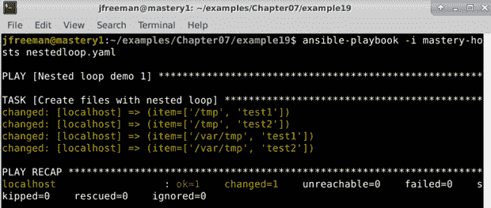

图 7.20 – 使用 product Jinja2 过滤器构建嵌套循环运行 playbook

您还可以通过在外部循环中包含一个外部任务文件，然后在任务文件中放置一个内部循环来创建嵌套循环。现在，如果您这样做而不做任何进一步的操作，两个循环都将使用`item`循环变量，这当然会发生冲突。为了防止这成为一个问题，有必要使用特殊的`loop_control`参数之一来更改外部循环的循环变量名称。因此，使用与之前相同的标题代码和变量，我们可以将我们的原始任务更改为以下内容：

```
    - name: Create files with nested loop
      ansible.builtin.include_tasks: createfile.yml
      loop: "{{ paths }}"
      loop_control:
        loop_var: pathname
```

然后包含的任务文件将如下所示：

```
---
- name: Create a file
  ansible.builtin.file:
    path: "{{ pathname }}/{{ item }}"
    state: touch
  loop: "{{ files }}"
```

这段代码执行的功能与第一个嵌套循环示例完全相同，但稍微麻烦一些，因为它需要一个外部任务文件。此外，您将从*图 7.21*的屏幕截图中看到它的操作方式有些不同。在构建嵌套循环时，这一点很重要，因为这可能（或可能不）是您想要的：

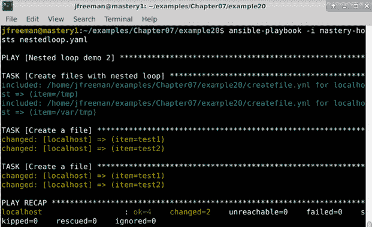

图 7.21 - 通过包含的任务文件在 Ansible 中构建嵌套循环，使用 loop_control 变量

可以说这种格式更容易阅读，但最终由您决定哪种更适合您的需求，以及是否有一种比另一种更适合您。有关循环创建技术和参数的完整详细信息，请参阅 Ansible 文档：[`docs.ansible.com/ansible/latest/user_guide/playbooks_loops.html`](https://docs.ansible.com/ansible/latest/user_guide/playbooks_loops.html)。

# 总结

在本章中，您了解到可以具体定义 Ansible 在运行特定任务时如何感知失败或更改，如何使用块来优雅地处理错误和执行清理，并且如何使用循环编写紧凑高效的代码。

因此，您现在应该能够修改任何给定任务，以提供特定条件，使得 Ansible 在失败或者考虑更改成功时失败。当运行 shell 命令时，这是非常有价值的，正如我们在本章中所演示的，也适用于定义现有模块的专门用例。您现在还应该能够将您的 Ansible 任务组织成块，确保如果发生故障，可以采取恢复操作，否则不需要运行。最后，您现在应该能够使用循环编写紧凑高效的 Ansible Playbook，消除重复代码和冗长低效的 Playbook 的需要。

在下一章中，我们将探讨使用角色来组织任务、文件、变量和其他内容。

# 问题

1.  默认情况下，Ansible 在给定主机的第一个失败发生后将停止处理进一步的任务：

a) 真

b) 假

1.  `ansible.builtin.command`和`ansible.builtin.shell`模块的默认行为是只给出任务状态为`changed`或`failed`：

a) 真

b) 假

1.  您可以使用哪个 Ansible 关键字存储任务的结果？

a) `store:`

b) `variable:`

c) `register:`

d) `save:`

1.  以下哪个指令可以用来改变任务的失败条件？

a) `error_if:`

b) `failed_if:`

c) `error_when:`

d) `failed_when:`

1.  您可以使用以下哪个来组合多个条件语句？

a) `and`

b) `或`

c) YAML 列表格式（与逻辑`AND`相同）

d) 以上所有

1.  以下哪个可以抑制更改？

a) `suppress_changed: true`

b) `changed_when: false`

c) `changed: false`

d) `failed_when: false`

1.  在`block`部分中，所有任务都按顺序在所有主机上执行：

a) 直到发生第一个错误

b) 无论任何错误条件

1.  块任务中的哪个可选部分只有在块任务中发生错误时才运行？

a) `recover`

b) `rescue`

c) `always`

d) `on_error`

1.  块中的`always`部分中的任务将被运行：

a) 无论发生了什么，无论是在块任务还是在`rescue`部分

b) 只有在`rescue`部分没有运行时

c) 只有在没有遇到错误时

d) 当用户手动调用时

1.  循环中引用当前元素的变量的默认名称是：

a) `loopvar`

b) `loopitem`

c) `item`

d) `val`
