# *第八章*：使用角色组合可重用的 Ansible 内容

对于许多项目，一个简单的、单一的**Ansible**剧本可能就足够了。随着时间的推移和项目的增长，会添加额外的剧本和变量文件，并且任务文件可能会被拆分。组织内的其他项目可能希望重用一些内容，要么将项目添加到目录树中，要么将所需内容复制到多个项目中。随着场景的复杂性和规模的增长，远不止一个松散组织的一小部分剧本、任务文件和变量文件是非常需要的。创建这样的层次结构可能是令人生畏的，这也可以解释为什么许多 Ansible 实现一开始都很简单，只有在分散的文件变得难以控制和难以维护时才变得更加有组织。迁移可能很困难，并且可能需要重写剧本的重要部分，这可能会进一步延迟重新组织的努力。

在本章中，我们将介绍在 Ansible 中组合、可重用和组织良好的最佳实践。本章中学到的经验将帮助开发人员设计能够与项目良好增长的 Ansible 内容，避免以后需要进行困难的重新设计工作。以下是我们将要涵盖的内容大纲：

+   任务、处理程序、变量和剧本包含概念

+   角色（结构、默认值和依赖项）

+   设计顶层剧本以利用角色

+   在项目之间共享角色（通过 Galaxy 进行依赖项；类似 Git 的存储库）

# 技术要求

要按照本章中提供的示例，您需要一台运行**Ansible 4.3**或更新版本的 Linux 机器。几乎任何 Linux 版本都可以——对于那些对具体情况感兴趣的人，本章中提供的所有代码都是在**Ubuntu Server 20.04 长期支持版**（**LTS**）上测试的，除非另有说明，并且在 Ansible 4.3 上也进行了测试。

本章附带的示例代码可以从 GitHub 的以下链接下载：[`github.com/PacktPublishing/Mastering-Ansible-Fourth-Edition/tree/main/Chapter08`](https://github.com/PacktPublishing/Mastering-Ansible-Fourth-Edition/tree/main/Chapter08)。

查看以下视频，了解代码的实际操作：[`bit.ly/3E0mmIX`](https://bit.ly/3E0mmIX)。

# 任务、处理程序、变量和剧本包含概念

了解如何高效组织 Ansible 项目结构的第一步是掌握包含文件的概念。包含文件的行为允许在一个专题文件中定义内容，并在项目中的一个或多个文件中包含这些内容。这种包含功能支持**不要重复自己**（**DRY**）的概念。

## 包括任务

任务文件是**YAML Ain't Markup Language**（**YAML**）文件，用于定义一个或多个任务。这些任务与任何特定的游戏或剧本没有直接联系；它们纯粹存在作为任务列表。这些文件可以通过`include`运算符被**剧本**或其他任务文件引用。现在，您可能期望`include`运算符是 Ansible 自己的关键字——然而，事实并非如此；它实际上是一个模块，就像`ansible.builtin.debug`一样。为了简洁起见，我们在本章中将其称为`include`运算符，但当我们说这个时候，您的代码实际上将包含**Fully Qualified Collection Name**（**FQCN**—参见*第二章*，*从早期 Ansible 版本迁移*），即`ansible.builtin.include`。您很快就会看到它的作用，所以不用担心——这一切很快就会讲得通！这个运算符接受一个任务文件的路径，正如我们在*第一章*中学到的那样，*Ansible 的系统架构和设计*，路径可以是相对于引用它的文件的。

为了演示如何使用`include`运算符来包含任务，让我们创建一个简单的 play，其中包含一个带有一些调试任务的任务文件。首先，让我们编写我们的 playbook 文件，我们将其命名为`includer.yaml`，如下所示：

```
--- 
- name: task inclusion 
  hosts: localhost 
  gather_facts: false 

  tasks: 
  - name: non-included task
    ansible.builtin.debug:
      msg: "I am not included"
  - ansible.builtin.include: more-tasks.yaml
```

接下来，我们将创建一个`more-tasks.yaml`文件，你可以在`include`语句中看到它的引用。这应该在保存`includer.yaml`的同一目录中创建。代码如下所示：

```
--- 
- name: included task 1 
  ansible.builtin.debug: 
    msg: "I am the first included task" 

- name: included task 2 
  ansible.builtin.debug: 
    msg: "I am the second included task" 
```

现在，我们可以使用以下命令执行我们的 playbook 以观察输出：

```
ansible-playbook -i mastery-hosts includer.yaml
```

如果一切顺利，你应该看到类似于这样的输出：

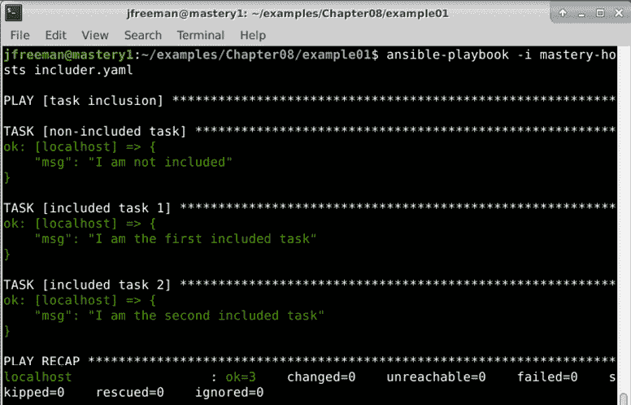

图 8.1 - 执行包含单独任务文件的 Ansible playbook

我们可以清楚地看到我们的`include`文件执行的任务。因为`include`运算符是在 play 的`tasks`部分中使用的，所以包含的任务在该 play 中执行。实际上，如果我们在`include`运算符之后向 play 添加一个任务，如下面的代码片段所示，我们会看到执行顺序遵循包含文件的所有任务存在的位置：

```
  tasks:
  - name: non-included task
    ansible.builtin.debug:
      msg: "I am not included"
  - ansible.builtin.include: more-tasks.yaml
  - name: after-included tasks
    ansible.builtin.debug:
      msg: "I run last"
```

如果我们使用与之前相同的命令运行我们修改后的 playbook，我们将看到我们期望的任务顺序，如下面的截图所示：

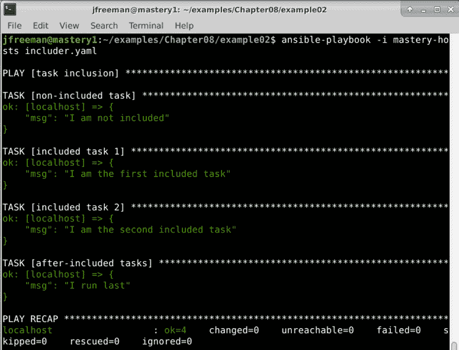

图 8.2 - 演示使用 include 运算符的 playbook 中任务执行顺序

通过将这些任务拆分成它们自己的文件，我们可以多次包含它们或在多个 playbook 中包含它们。如果我们需要修改其中一个任务，我们只需要修改一个文件，无论这个文件被引用了多少次。

### 将变量值传递给包含的任务

有时，我们想要拆分一组任务，但这些任务的行为可能会根据变量数据略有不同。`include`运算符允许我们在包含时定义和覆盖变量数据。定义的范围仅限于包含的任务文件（以及该文件可能包含的任何其他文件）。

为了说明这种能力，让我们创建一个新的场景，我们需要触摸两个文件，每个文件都在自己的目录路径中。我们将创建一个任务文件，其中包含每个任务的变量名称。然后，我们将两次包含任务文件，每次传递不同的数据。首先，我们将使用`files.yaml`任务文件，如下所示：

```
---
- name: create leading path
  ansible.builtin.file:
    path: "{{ path }}"
    state: directory
- name: touch the file
  ansible.builtin.file:
    path: "{{ path + '/' + file }}"
    state: touch
```

接下来，我们将修改我们的`includer.yaml` playbook，包含我们刚刚创建的任务文件，并传递`path`和`file`变量的变量数据，如下所示：

```
---
- name: touch files
  hosts: localhost
  gather_facts: false
  tasks:
  - ansible.builtin.include: files.yaml
    vars:
      path: /tmp/foo
      file: herp
  - ansible.builtin.include: files.yaml
    vars:
      path: /tmp/foo
      file: derp
```

重要提示

在包含文件时提供的变量定义可以是`key=value`的内联格式，也可以是`key: value`的 YAML 格式，位于`vars`哈希内。

当我们运行这个 playbook 时，我们将看到四个任务被执行：两个任务来自包含的`files.yaml`文件，每个任务执行两次。第二组应该只有一个更改，因为两组的路径相同，并且应该在执行任务时创建。通过使用以下命令添加详细信息来运行 playbook，以便我们可以更多地了解底层发生了什么：

```
ansible-playbook -i mastery-hosts includer.yaml -v
```

运行此 playbook 的输出应该类似于这样：

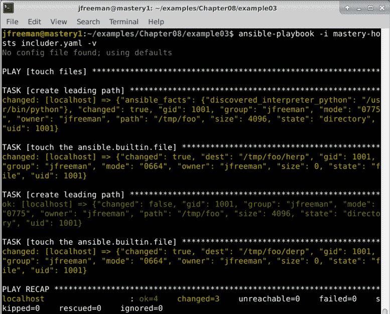

图 8.3 - 运行一个包含两个不同变量数据的任务文件的 playbook

正如我们在这里所看到的，用于创建前导路径和文件的代码被重复使用，每次只是使用不同的值，使我们的代码非常高效易于维护。

### 将复杂数据传递给包含的任务

当想要向包含的任务传递复杂数据，比如列表或哈希时，可以在包含文件时使用另一种语法。让我们重复上一个场景，只是这次不是两次包含任务文件，而是一次包含并传递路径和文件的哈希。首先，我们将重新创建`files.yaml`文件，如下所示：

```
--- 
- name: create leading path 
  ansible.builtin.file: 
    path: "{{ item.value.path }}" 
    state: directory 
  loop: "{{ files | dict2items }}" 

- name: touch the file 
  ansible.builtin.file: 
    path: "{{ item.value.path + '/' + item.key }}" 
    state: touch 
  loop: "{{ files | dict2items }}" 
```

现在，我们将修改我们的`includer.yaml` playbook，以提供文件的哈希值在单个`ansible.builtin.include`语句中，如下所示：

```
---
- name: touch files
  hosts: localhost
  gather_facts: false
  tasks:
  - ansible.builtin.include: files.yaml
    vars:
      files:
        herp:
          path: /tmp/foo
        derp:
          path: /tmp/foo
```

如果我们像以前一样运行这个新的 playbook 和任务文件，我们应该会看到一个类似但略有不同的输出，最终结果是`/tmp/foo`目录已经存在，并且两个`herp`和`derp`文件被创建为空文件（被触摸）在其中，如下面的截图所示：

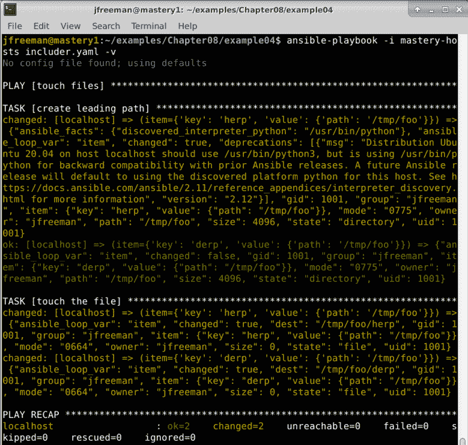

图 8.4 - 将复杂数据传递给 Ansible play 中包含的任务文件

使用这种方式传递数据的哈希允许创建一组事物，而无需在主 playbook 中增加`include`语句的数量。

### 条件任务包括

类似于将数据传递给包含的文件，条件也可以传递给包含的文件。这是通过将`when`语句附加到`include`运算符来实现的。这个条件并不会导致 Ansible 评估测试以确定是否应该包含文件；相反，它指示 Ansible 将条件添加到包含文件中的每个任务以及该文件可能包含的任何其他文件中。

重要提示

不可能有条件地包含一个文件。文件将始终被包含；但是，可以对`include`层次结构中的每个任务应用任务条件。

让我们通过修改包含简单调试语句的第一个示例来演示这一点。我们将添加一个条件并传递一些数据供条件使用。首先，让我们修改`includer.yaml` playbook，如下所示：

```
---
- name: task inclusion
  hosts: localhost
  gather_facts: false
  tasks:
  - ansible.builtin.include: more-tasks.yaml
    when: item | bool
    vars:
      a_list:
        - true
        - false
```

接下来，让我们修改`more-tasks.yaml`，在每个任务中循环`a_list`变量，如下所示：

```
---
- name: included task 1
  ansible.builtin.debug:
    msg: "I am the first included task"
  loop: "{{ a_list }}"
- name: include task 2
  ansible.builtin.debug:
    msg: "I am the second included task"
  loop: "{{ a_list }}"
```

现在，让我们用与之前相同的命令运行 playbook，并查看我们的新输出，应该是这样的：

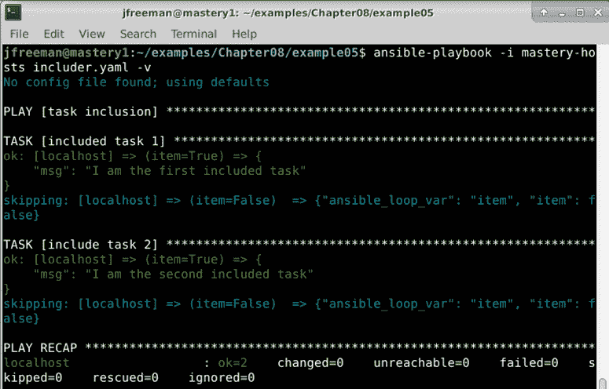

图 8.5 - 将条件应用于包含文件中的所有任务

我们可以看到每个任务的跳过迭代，其中`item`被评估为`false`布尔值。重要的是要记住，所有主机都将评估所有包含的任务。没有办法影响 Ansible 不为一部分主机包含文件。最多，可以对`include`层次结构中的每个任务应用条件，以便可以跳过包含的任务。根据主机事实包含任务的一种方法是利用`ansible.builtin.group_by`动作插件根据主机事实创建动态组。然后，您可以为这些组提供自己的 play 以包含特定的任务。这是留给您的一个练习。

### 对包含的任务进行标记

在包含任务文件时，可以对文件中的所有任务进行标记。`tags`关键字用于定义要应用于`include`层次结构中所有任务的一个或多个标记。在`include`时进行标记的能力可以使任务文件本身不对任务应该如何标记持有意见，并且可以允许一组任务被多次包含，但传递不同的数据和标记。

重要提示

可以在`include`语句或 play 本身中定义标记，以覆盖给定 play 中所有包含（和其他任务）。

让我们创建一个简单的演示来说明标记如何使用。我们将首先编辑我们的`includer.yaml`文件，创建一个包含任务文件的 playbook，每个任务文件都有不同的标记名称和不同的变量数据。代码如下所示：

```
---
- name: task inclusion
  hosts: localhost
  gather_facts: false
  tasks:
  - ansible.builtin.include: more-tasks.yaml
    vars:
      data: first
    tags: first
  - ansible.builtin.include: more-tasks.yaml
    vars:
      data: second
    tags: second
```

现在，我们将更新`more-tasks.yaml`以处理提供的数据，如下所示：

```
---
- name: included task
  ansible.builtin.debug:
    msg: "My data is {{ data }}"
```

如果我们在不选择标记的情况下运行这个 playbook，我们将看到这个任务运行两次，如下的屏幕截图所示：

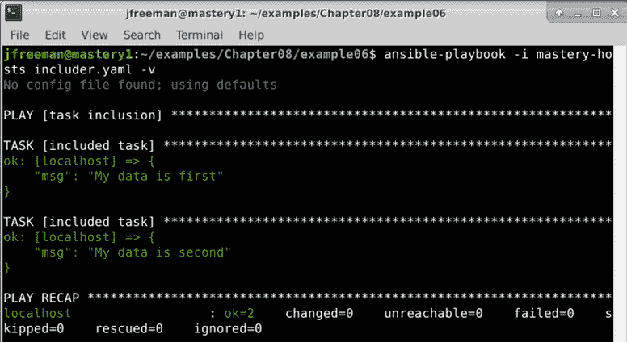

图 8.6 - 运行带有标记的包含任务的 playbook，但没有启用任何基于标记的过滤

现在，我们可以通过修改我们的`ansible-playbook`参数来选择要运行的标记，比如第二个标记，如下所示：

```
ansible-playbook -i mastery-hosts includer.yaml -v --tags second
```

在这种情况下，我们应该只看到被包含任务的发生，如下的屏幕截图所示：

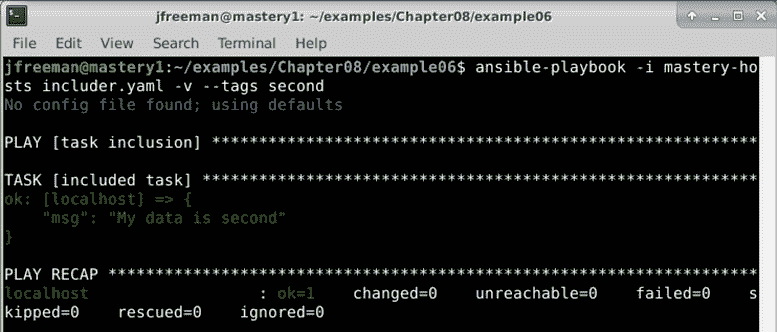

图 8.7 - 运行带有标记的包含任务的 playbook，只运行标记为"second"的任务

我们的示例使用`--tags`命令行参数来指示要运行的标记任务。另一个参数`--skip-tags`允许表示相反的意思，或者换句话说，不要运行哪些标记的任务。

## 循环中的任务包含

任务包含也可以与循环结合使用。当向任务包含添加一个`loop`实例（或者如果使用早于 2.5 版本的 Ansible，则使用`with_`循环），文件内的任务将使用`item`变量执行，该变量保存当前循环值的位置。整个`include`文件将重复执行，直到循环用完项目。让我们更新我们的示例 play 来演示这一点，如下所示：

```
---
- name: task inclusion
  hosts: localhost
  gather_facts: false
  tasks:
  - ansible.builtin.include: more-tasks.yaml
    loop:
      - one
      - two
```

我们还需要更新我们的`more-tasks.yaml`文件，以使用循环`item`变量，如下所示：

```
--- 
- name: included task 1 
  ansible.builtin.debug: 
    msg: "I am the first included task with {{ item }}"
- name: included task 2 
  ansible.builtin.debug: 
    msg: "I am the second included task with {{ item }}" 
```

当以增加的详细程度执行时，我们可以看到任务`1`和`2`针对循环中的每个`item`变量执行一次，如下的屏幕截图所示：

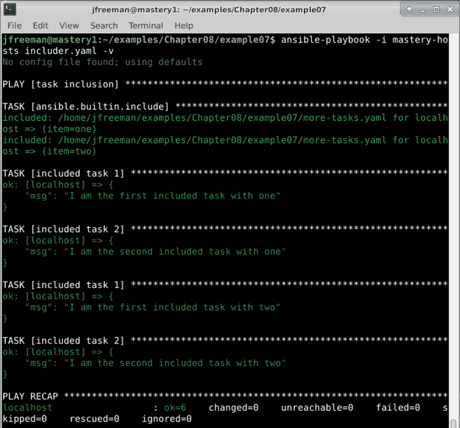

图 8.8 - 在循环中运行包含的任务文件

**包含**循环是一个强大的概念，但它确实引入了一个问题。如果包含的文件中有其自己循环的任务，会产生`item`变量的冲突，导致意外的结果。因此，在 Ansible 的 2.1 版本中添加了`loop_control`功能。除其他功能外，此功能提供了一种方法来命名用于循环的变量，而不是默认的`item`。使用这个功能，我们可以区分`include`语句外部的`item`实例和`include`语句内部使用的任何`item`变量。为了演示这一点，我们将在我们的外部`include`语句中添加一个`loop_var`循环控制，如下所示：

```
---
- name: task inclusion
  hosts: localhost
  gather_facts: false
  tasks:
    - ansible.builtin.include: more-tasks.yaml
      loop:
        - one
        - two
      loop_control:
        loop_var: include_item
```

在`more-tasks.yaml`中，我们将有一个带有自己循环的任务，使用`include_item`和本地的`item`变量，如下所示：

```
--- 
- name: included task 1 
  ansible.builtin.debug: 
    msg: "I combine {{ item }} and {{ include_item }}" 
  loop: 
    - a 
    - b 
```

当执行时，我们看到每次包含循环都会执行`任务 1`两次，并且使用了两个`loop`变量，如下的屏幕截图所示：

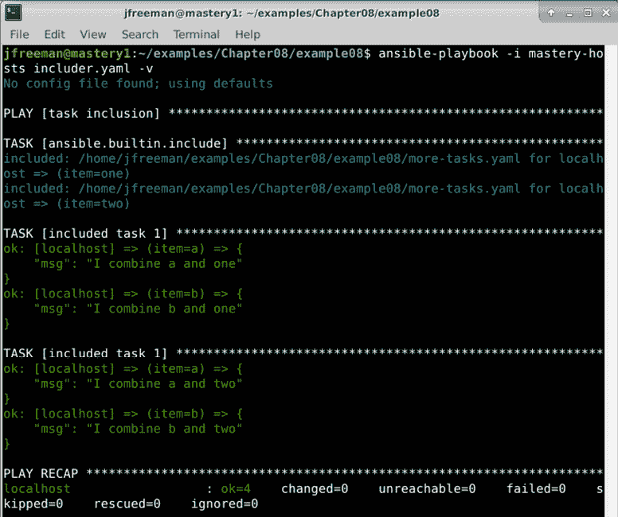

图 8.9 - 在包含的任务文件中运行嵌套循环，避免循环变量名称冲突

还有其他循环控制，比如`label`，它将定义在任务输出中显示在屏幕上的`item`值（用于防止大型数据结构在屏幕上混乱），以及`pause`，提供在每个循环之间暂停一定秒数的能力。

## 包括处理程序

**处理程序**本质上是任务。它们是由其他任务的通知触发的一组潜在任务。因此，处理程序任务可以像常规任务一样被包含。`include`运算符在`handlers`块内是合法的。

与任务包含不同，当包含`handler`任务时，无法传递变量数据。但是，可以将条件附加到`handler`包含中，以将条件应用于文件中的每个`handler`任务。

让我们创建一个示例来演示这一点。首先，我们将创建一个总是会改变的任务的 playbook，并包含一个`handler`任务文件，并将条件附加到该包含中。代码如下所示：

```
--- 
- name: touch files 
  hosts: localhost 
  gather_facts: false 

  tasks:
  - name: a task
    ansible.builtin.debug:
      msg: "I am a changing task"
    changed_when: true
    notify: a handler
  handlers:
  - ansible.builtin.include: handlers.yaml
    when: foo | default('true') | bool
```

重要提示

在评估可能在 playbook 外定义的变量时，最好使用`bool`过滤器来确保字符串被正确转换为它们的布尔含义。

接下来，我们将创建一个`handlers.yaml`文件来定义我们的`handler`任务，如下所示：

```
---
- name: a handler
  ansible.builtin.debug:
    msg: "handling a thing"
```

如果我们在不提供任何进一步数据的情况下执行这个 playbook，我们应该看到我们的`handler`任务被触发，如下面的截图所示：

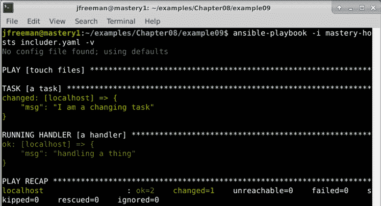

图 8.10 - 使用包含运算符从任务文件运行处理程序

现在，让我们再次运行 playbook；这次，我们将在`ansible-playbook`执行参数中将`foo`定义为`extra-var`（覆盖每个其他实例），并将其设置为`false`，如下所示：

```
ansible-playbook -i mastery-hosts includer.yaml -v -e foo=false
```

这次，输出将看起来有些不同，如下面的截图所示：

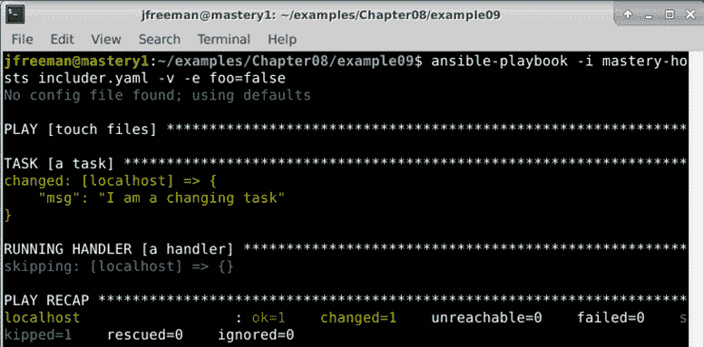

图 8.11 - 运行相同的 play，但这次强制 foo 条件变量为 false

由于`foo`评估为`false`，所以在这次运行 playbook 时我们的包含处理程序被跳过了。

## 包含变量

**变量**数据也可以分开成可加载的文件。这允许在多个 play 或 playbook 之间共享变量，或者包含项目目录之外的变量数据（如秘密数据）。变量文件是简单的**YAML 格式**文件，提供键和值。与任务包含文件不同，变量包含文件不能包含更多文件。

变量可以通过三种不同的方式包含：通过`vars_files`，通过`include_vars`，或通过`--extra-vars`(`-e`)。

### vars_files

`vars_files`键是一个 play 指令。它定义了要从中读取变量数据的文件列表。这些文件在解析 playbook 本身时被读取和解析。与包含任务和处理程序一样，路径是相对于引用文件的文件的。

这是一个从文件加载变量的示例 play：

```
--- 
- name: vars 
  hosts: localhost 
  gather_facts: false 

  vars_files:
  - variables.yaml
  tasks:
  - name: a task
    ansible.builtin.debug:
      msg: "I am a {{ varname }}" 
```

现在，我们需要在与我们的 playbook 相同的目录中创建一个`variables.yaml`文件，如下所示：

```
---
varname: derp 
```

使用我们通常的命令运行 playbook 将显示`varname`变量值正确地从`variables.yaml`文件中获取，如下面的截图所示：

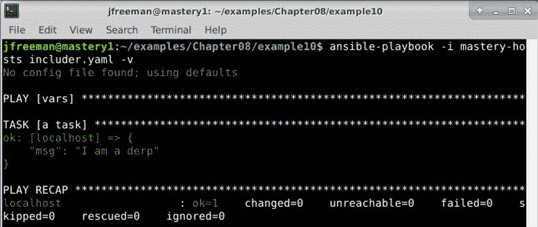

图 8.12 - 使用 vars_files 指令在 play 中包含变量

当然，这只是一个非常简单的例子，但它清楚地演示了从单独文件导入变量的简易性。

### 动态 vars_files 包含

在某些情况下，希望参数化要加载的变量文件。可以通过使用变量作为文件名的一部分来实现这一点；然而，变量必须在解析 playbook 时有一个定义的值，就像在任务名称中使用变量时一样。让我们根据执行时提供的数据更新我们的示例 play，以加载基于数据提供的变量文件，如下所示：

```
--- 
- name: vars 
  hosts: localhost 
  gather_facts: false 

  vars_files:
  - "{{ varfile }}"
  tasks:
  - name: a task
    ansible.builtin.debug:
      msg: "I am a {{ varname }}"
```

现在，当我们执行 playbook 时，我们将使用类似以下命令的`-e`参数为`varfile`提供值：

```
ansible-playbook -i mastery-hosts includer.yaml -v -e varfile=variables.yaml
```

输出应该如下所示：

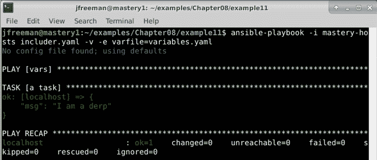

图 8.13 - 在 playbook 运行时动态加载 variables.yaml 文件

除了需要在执行时定义变量值之外，要加载的文件也必须在执行时存在。即使文件是由 Ansible playbook 自己生成的，这条规则也适用。假设一个 Ansible playbook 由四个 play 组成。第一个 play 生成一个 YAML 变量文件。然后，在更下面，第四个 play 在`vars_file`指令中引用这个文件。尽管最初看起来这似乎会起作用，但是文件在执行时（即首次运行`ansible-playbook`时）并不存在，因此会报告错误。

### include_vars

包含从文件中加载变量数据的第二种方法是通过`include_vars`模块。该模块将变量作为`task`操作加载，并将为每个主机执行。与大多数模块不同，此模块在 Ansible 主机上本地执行；因此，所有路径仍然相对于 play 文件本身。由于变量加载是作为任务执行的，因此在执行任务时会评估文件名中的变量。文件名中的变量数据可以是特定于主机的，并在前面的任务中定义。此外，文件本身在执行时不必存在；它也可以由前面的任务生成。如果使用正确，这是一个非常强大和灵活的概念，可以导致非常动态的 playbook。

在我们继续之前，让我们通过修改现有的 play 来演示`include_vars`的简单用法，将变量文件加载为一个任务，如下所示：

```
--- 
- name: vars 
  hosts: localhost 
  gather_facts: false 

  tasks: 
    - name: load variables 
      ansible.builtin.include_vars: "{{ varfile }}" 

    - name: a task 
      ansible.builtin.debug: 
        msg: "I am a {{ varname }}" 
```

与前面的示例一样，playbook 的执行与之前的示例中保持一致，我们将`varfile`变量的值指定为额外变量。我们的输出与以前的迭代略有不同，如下面的截图所示：

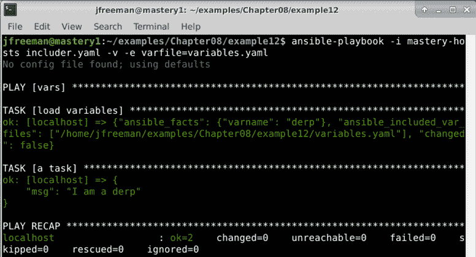

图 8.14 - 运行使用 include_vars 语句的 playbook

与其他任务一样，可以循环执行以在单个任务中加载多个文件。当使用特殊的`with_first_found`循环通过一系列越来越通用的文件名迭代直到找到要加载的文件时，这是特别有效的。

让我们通过更改我们的 play 来演示这一点，使用收集的主机事实来尝试加载特定于分发的变量文件，特定于分发系列，或者最后是默认文件，如下所示：

```
---
- name: vars
  hosts: localhost
  gather_facts: true
  tasks:
  - name: load variables
    ansible.builtin.include_vars: "{{ item }}"
    with_first_found:
      - "{{ ansible_distribution }}.yaml"
      - "{{ ansible_os_family }}.yaml"
      - variables.yaml
  - name: a task
    ansible.builtin.debug:
      msg: "I am a {{ varname }}"
```

执行应该看起来与以前的运行非常相似，只是这次我们将看到一个收集事实的任务，并且在执行中不会传递额外的变量数据。输出应该如下所示：

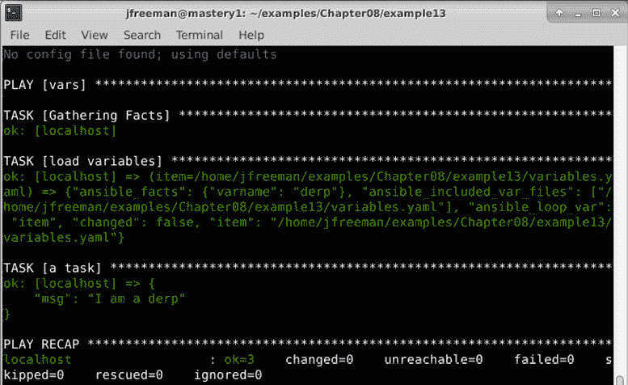

图 8.15 - 动态包含在 Ansible play 中找到的第一个有效变量文件

我们还可以从输出中看到找到要加载的文件。在这种情况下，`variables.yaml`被加载，因为其他两个文件不存在。这种做法通常用于加载特定于主机的操作系统的变量。可以将各种操作系统的变量写入适当命名的文件中。通过使用由收集事实填充的`ansible_distribution`变量，可以通过`with_first_found`参数加载使用`ansible_distribution`值作为其名称一部分的变量文件。可以在一个不使用任何变量数据的文件中提供一组默认变量作为备用，就像我们在`variables.yaml`文件中所做的那样。

### extra-vars

从文件中加载变量数据的最终方法是使用`--extra-vars`（或`-e`）参数引用文件路径到`ansible-playbook`。通常，此参数期望一组`key=value`数据；但是，如果提供了文件路径并以`@`符号为前缀，Ansible 将读取整个文件以加载变量数据。让我们修改我们之前的一个示例，其中我们使用了`-e`，而不是直接在命令行上定义变量，我们将包含我们已经编写的变量文件，如下所示：

```
--- 
- name: vars 
  hosts: localhost 
  gather_facts: false 

  tasks:
  - name: a task
    ansible.builtin.debug:
      msg: "I am a {{ varname }}" 
```

当我们在`@`符号后提供路径时，该路径是相对于当前工作目录的，而不管 playbook 本身位于何处。让我们执行我们的 playbook 并提供`variables.yaml`的路径，如下所示：

```
ansible-playbook -i mastery-hosts includer.yaml -v -e @variables.yaml
```

输出应该如下所示：

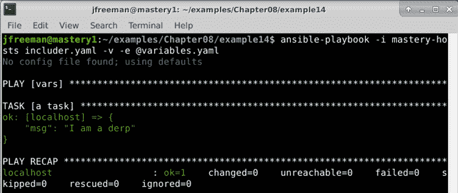

图 8.16 - 通过额外的变量命令行参数包含 variables.yaml 文件

在这里，我们可以看到我们的`variables.yaml`文件再次成功包含，但是，正如您从前面的代码中看到的那样，它甚至没有在 playbook 中提到 - 我们能够通过`-e`标志完全加载它。

重要提示

使用`--extra-vars`参数包含变量文件时，文件必须在`ansible-playbook`执行时存在。

在 Ansible 中，变量包含非常强大 - 但是 playbooks 本身呢？在这里，情况有所不同，随着本章的进行，我们将看到如何有效地重用任务和 playbook 代码，从而鼓励使用 Ansible 进行良好的编程实践。

## 包含 playbooks

Playbook 文件可以包含其他整个 playbook 文件。这种结构对于将几个独立的 playbook 绑定成一个更大、更全面的 playbook 非常有用。Playbook 包含比任务包含更为原始。在包含 playbook 时，您不能执行变量替换，也不能应用条件，也不能应用标签。要包含的 playbook 文件必须在执行时存在。

在 Ansible 2.4 之前，可以使用`include`关键字来实现 playbook 包含 - 但是在 Ansible 2.8 中已将其删除，因此不应使用。相反，现在应该使用`ansible.builtin.import_playbook`。这是一个 play 级别的指令 - 不能用作任务。但是，它非常容易使用。让我们定义一个简单的示例来演示这一点。首先，让我们创建一个将被包含的 playbook，名为`includeme.yaml`。以下是要执行此操作的代码：

```
---
- name: include playbook
  hosts: localhost
  gather_facts: false
  tasks:
  - name: an included playbook task
    ansible.builtin.debug:
      msg: "I am in the included playbook"
```

正如您现在无疑已经认识到的那样，这是一个完整的独立 playbook，我们可以使用以下命令单独运行它：

```
ansible-playbook -i mastery-hosts includeme.yaml
```

成功运行将产生如下所示的输出：

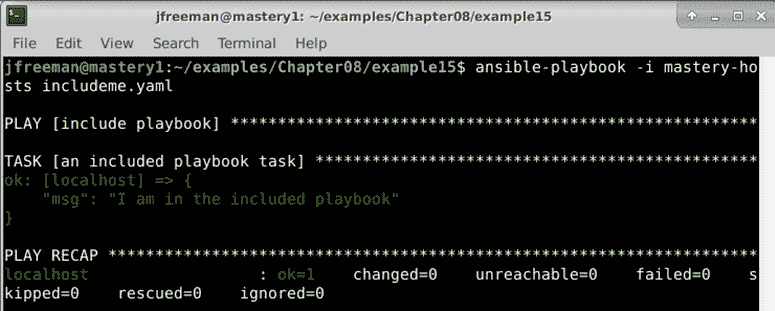

图 8.17 - 首先作为独立 playbook 运行我们的 playbook

但是，我们也可以将其导入到另一个 playbook 中。修改原始的`includer.yaml` playbook，使其如下所示：

```
---
- name: include playbook
  hosts: localhost
  gather_facts: false
  tasks:
  - name: a task
    ansible.builtin.debug:
      msg: "I am in the main playbook"
- name: include a playbook
  ansible.builtin.import_playbook: includeme.yaml
```

然后使用以下命令运行它：

```
ansible-playbook -i mastery-hosts includer.yaml
```

我们可以看到两条调试消息都显示出来，并且导入的 playbook 在初始任务之后运行，这是我们在原始 playbook 中定义的顺序。以下截图显示了这一点：

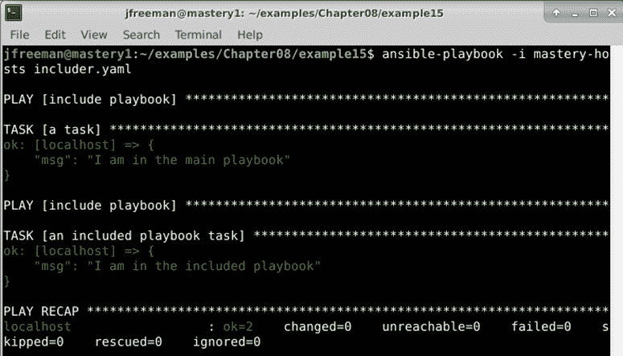

图 8.18 - 运行包含第二个 playbook 的 playbook

通过这种方式，非常容易地重用整个 playbooks，而无需将它们重构为角色、任务文件或其他格式。但是，请注意，此功能正在积极开发中，因此建议您始终参考文档，以确保您可以实现所需的结果。

# 角色（结构、默认值和依赖关系）

通过对变量、任务、处理程序和剧本的包含的功能理解，我们可以进一步学习**角色**的更高级主题。角色将 Ansible 代码创建的不同方面结合在一起，提供了一套完全独立的变量、任务、文件、模板和模块的集合，可以在不同的剧本中重复使用。尽管设计上并不受限制，但通常每个角色通常被限制在特定的目的或期望的最终结果上，所有必要的步骤要么在角色本身内，要么通过依赖项（换句话说，进一步的角色本身被指定为角色的依赖项）中。重要的是要注意，角色不是剧本，也没有直接执行角色的方法。角色没有设置适用于哪些主机的设置。顶层剧本是将清单中的主机与应该应用于这些主机的角色绑定在一起的粘合剂。正如我们在*第二章*中所看到的，*从早期 Ansible 版本迁移*，角色也可以是 Ansible 集合的一部分。由于我们已经在早期章节中看过集合的结构，因此在本节中，我们将更深入地关注如何构建角色本身。

## 角色结构

**角色**在**文件系统**上有一个结构化的布局。这个结构存在是为了自动包含任务、处理程序、变量、模块和角色依赖关系。该结构还允许轻松地从角色内的任何位置引用文件和模板。

在*第二章*中，*从早期 Ansible 版本迁移*，我们将看看如何从集合中引用角色。但是，它们不一定要作为集合的一部分使用，假设您在这种情况之外使用角色，它们都位于`roles/`目录下的剧本目录结构的子目录中。当然，这可以通过`roles_path`通用配置键进行配置，但让我们坚持使用默认值。每个角色本身都是一个目录树。角色名称是`roles/`目录中的目录名称。每个角色可以有许多具有特殊含义的子目录，在将角色应用于一组主机时会进行处理。

一个角色可以包含所有这些元素，也可以只包含其中的一个。缺少的元素将被简单地忽略。有些角色只是为项目提供通用处理程序。其他角色存在作为单个依赖点，反过来又依赖于许多其他角色。

### 任务

任务文件是角色的核心部分，如果`roles/<role_name>/tasks/main.yaml`存在，那么该文件中的所有任务（以及它包含的任何其他文件）将被加载到播放中并执行。

### 处理程序

与任务类似，如果存在`roles/<role_name>/handlers/main.yaml`文件，则处理程序将自动从中加载。这些处理程序可以被角色内的任何任务引用，或者被列出该角色为依赖项的任何其他角色内的任务引用。

### 变量

角色中可以定义两种类型的变量。有角色变量，从`roles/<role_name>/vars/main.yaml`加载，还有角色默认值，从`roles/<role_name>/defaults/main.yaml`加载。`vars`和`defaults`之间的区别在于优先顺序。有关顺序的详细描述，请参阅*第一章*，*Ansible 的系统架构和设计*。**角色默认值**是最低优先级的变量。实际上，任何其他变量的定义都将优先于角色默认值。角色默认值可以被视为实际数据的占位符，开发人员可能有兴趣使用站点特定值来定义哪些变量。另一方面，**角色变量**具有更高的优先级。角色变量可以被覆盖，但通常在角色内多次引用相同数据集时使用。如果要使用站点本地值重新定义数据集，则应该将变量列在角色默认值而不是角色变量中。

### 模块和插件

一个角色可以包括自定义模块和插件。虽然我们正在过渡到 Ansible 4.0 及更高版本的阶段，但这仍然受支持，但您无疑已经注意到集合也可以包括自定义**模块**和**插件**。在当前时期，您放置模块和插件的位置将取决于您为其编写角色的目标 Ansible 版本。如果您希望与 2.x 版本保持向后兼容性，那么您应该将模块和插件放入角色目录结构中，如此处所述。如果您只希望与 Ansible 3.0 及更高版本兼容，您可以考虑将它们放入集合中。然而，请注意，随着转向集合，您的插件和模块不太可能被接受到`ansible-core`包中，除非它们提供被认为是核心功能。

（如果在角色中存在）模块从`roles/<role_name>/library/`加载，并且可以被角色中的任何任务或者后续的角色使用。重要的是要注意，此路径中提供的模块将覆盖同名模块的任何其他副本，因此尽可能使用 FQCNs 引用模块以避免任何意外结果。

如果在角色的一个以下子目录中找到插件，插件将自动加载：

+   `action_plugins`

+   `lookup_plugins`

+   `callback_plugins`

+   `connection_plugins`

+   `filter_plugins`

+   `strategy_plugins`

+   `cache_plugins`

+   `test_plugins`

+   `shell_plugins`

### 依赖

角色可以表达对另一个角色的**依赖**。一组角色通常都依赖于一个常见的角色，用于任务、处理程序、模块等。这些角色可能只依赖于一次定义。当 Ansible 处理一组主机的角色时，它首先查找`roles/<role_name>/meta/main.yaml`中列出的依赖关系。如果有任何定义，那么这些角色将立即被处理，并且这些角色中包含的任务将被执行（在检查其中列出的任何依赖关系之后）。这个过程会一直持续，直到所有依赖关系都被建立和加载（并在存在的情况下执行任务），然后 Ansible 开始执行初始角色任务。请记住——依赖关系总是在角色本身之前执行。我们将在本章后面更深入地描述角色依赖关系。

### 文件和模板

任务和处理程序模块只能在`roles/<role_name>/files/`中使用相对路径引用文件。文件名可以提供没有任何前缀（尽管如果您愿意，这是允许的），并且将从`roles/<role_name>/files/<relative_directory>/<file_name>`获取。诸如`ansible.builtin.template`、`ansible.builtin.copy`和`ansible.builtin.script`之类的模块是您将看到许多利用这一有用功能的示例的典型模块。

同样，`ansible.builtin.template`模块使用的模板可以在`roles/<role_name>/templates/`中相对引用。以下代码示例使用相对路径从完整路径`roles/<role_name>/templates/herp/derp.j2`加载`derp.j2`模板：

```
- name: configure herp 
  ansible.builtin.template: 
    src: herp/derp.j2 
    dest: /etc/herp/derp.j2 
```

通过这种方式，可以轻松地在标准角色目录结构中组织文件，并且仍然可以轻松地从角色内部访问它们，而无需输入长而复杂的路径。在本章后面，我们将向您介绍`ansible-galaxy role init`命令，该命令将帮助您更轻松地为新角色构建骨架目录结构-有关更多详细信息，请参见*角色共享*部分。

### 将所有内容放在一起

为了说明完整的角色结构可能是什么样子，这里有一个名为`demo`的示例角色：

```
roles/demo 
├── defaults 
|   |--- main.yaml 
|---- files 
|   |--- foo 
|---- handlers 
|   |--- main.yaml 
|---- library 
|   |--- samplemod.py 
|---- meta 
|   |--- main.yaml 
|---- tasks 
|   |--- main.yaml 
|---- templates 
|   |--- bar.j2 
|--- vars 
    |--- main.yaml 
```

创建角色时，并不是每个目录或文件都是必需的。只有存在的文件才会被处理。因此，我们的角色示例不需要或使用处理程序；整个树的`handlers`部分可以简单地被省略。

## 角色依赖

如前所述，角色可以依赖于其他角色。这些关系称为依赖关系，并且它们在角色的`meta/main.yaml`文件中描述。该文件期望具有`dependencies`键的顶级数据哈希；其中的数据是角色列表。您可以在以下代码片段中看到这一点的说明： 

```
--- 
dependencies: 
  - role: common 
  - role: apache 
```

在这个例子中，Ansible 将在继续`apache`角色并最终开始角色任务之前，首先完全处理`common`角色（及其可能表达的任何依赖关系）。

如果依赖项存在于相同的目录结构中或位于配置的`roles_path`配置键中，则可以通过名称引用依赖项而无需任何前缀。否则，可以使用完整路径来定位角色，如下所示：

```
role: /opt/ansible/site-roles/apache 
```

在表达依赖关系时，可以将数据传递给依赖项。数据可以是变量、标签，甚至是条件。

### 角色依赖变量

在列出依赖项时传递的变量将覆盖`defaults/main.yaml`或`vars/main.yaml`中定义的匹配变量的值。这对于使用常见角色（例如`apache`角色）作为依赖项并提供特定于站点的数据（例如在防火墙中打开哪些端口或启用哪些`apache`模块）非常有用。变量表示为角色列表的附加键。因此，继续我们的假设示例，考虑到我们需要将一些变量传递给我们讨论的`common`和`apache`角色依赖项，如下所示：

```
--- 
dependencies: 
  - role: common 
    simple_var_a: True 
    simple_var_b: False 
  - role: apache 
    complex_var: 
      key1: value1 
      key2: value2 
    short_list: 
      - 8080 
      - 8081 
```

在提供依赖变量数据时，有两个名称被保留，不应该用作角色变量：`tags`和`when`。前者用于将标签数据传递到角色中，后者用于将条件传递到角色中。

### 标签

标签可以应用于依赖角色中找到的所有任务。这与标签应用于包含的任务文件的方式相同，如本章前面所述。语法很简单：`tags`键可以是单个项目或列表。为了演示，让我们通过添加一些标签来进一步扩展我们的理论示例，如下所示：

```
--- 
dependencies: 
  - role: common 
    simple_var_a: True 
    simple_var_b: False 
    tags: common_demo 
  - role: apache 
    complex_var: 
      key1: value1 
      key2: value2 
    short_list: 
      - 8080 
      - 8081 
    tags: 
      - apache_demo 
      - 8080 
      - 8181 
```

与向包含的任务文件添加标签一样，所有在依赖中找到的任务（以及该层次结构中的任何依赖）都将获得提供的标签。

### 角色依赖条件

虽然不可能通过条件来阻止依赖角色的处理，但可以通过将条件应用到依赖项来跳过依赖角色层次结构中的所有任务。这也反映了使用条件的任务包含的功能。`when`关键字用于表达条件。我们将再次通过添加一个依赖项来扩展我们的示例，以演示语法，如下所示：

```
--- 
dependencies: 
  - role: common 
    simple_var_a: True 
    simple_var_b: False 
    tags: common_demo 
  - role: apache 
    complex_var: 
      key1: value1 
      key2: value2 
    short_list: 
      - 8080 
      - 8081 
    tags: 
      - apache_demo 
      - 8080 
      - 8181 
    when: backend_server == 'apache' 
```

在这个例子中，`apache`角色将始终被处理，但角色内的任务只有在`backend_server`变量包含`apache`字符串时才会运行。

## 角色应用

角色不是剧本。它们不会对角色任务应该在哪些主机上运行、使用哪种连接方法、是否按顺序操作或者在*第一章*中描述的任何其他剧本行为方面持有任何意见。角色必须在剧本中的一个剧本中应用，所有这些意见都可以在其中表达。

在播放中应用角色时，使用`roles`操作符。该操作符期望应用到播放中的主机的角色列表。与描述角色依赖关系类似，当描述要应用的角色时，可以传递数据，例如变量、标签和条件。语法完全相同。

为了演示在播放中应用角色，让我们创建一个简单的角色并将其应用到一个简单的剧本中。首先，让我们构建一个名为`simple`的角色，它将在`roles/simple/tasks/main.yaml`中具有一个单独的`debug`任务，打印在`roles/simple/defaults/main.yaml`中定义的角色默认变量的值。首先，让我们创建一个任务文件（在`tasks/`子目录中），如下所示：

```
--- 
- name: print a variable 
  ansible.builtin.debug: 
    var: derp 
```

接下来，我们将编写我们的默认文件，其中包含一个变量`derp`，如下所示：

```
--- 
derp: herp 
```

要执行此角色，我们将编写一个播放以应用该角色。我们将称我们的剧本为`roleplay.yaml`，它将与`roles/`目录处于相同的目录级别。代码如下所示：

```
--- 
- hosts: localhost 
  gather_facts: false 

  roles: 
  - role: simple 
```

重要提示

如果没有为角色提供数据，可以使用另一种语法，只列出要应用的角色，而不是哈希。但为了保持一致，我觉得最好在项目中始终使用相同的语法。

我们将重用之前章节中的`mastery-hosts`清单，并以正常方式执行这本手册（这里我们不需要任何额外的冗长），通过运行以下命令：

```
ansible-playbook -i mastery-hosts roleplay.yaml
```

输出应该看起来像这样：

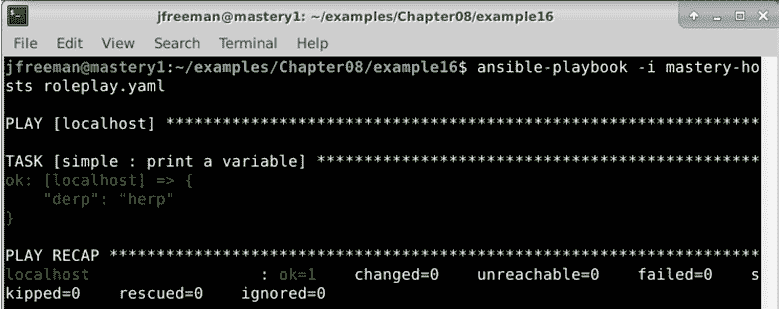

图 8.19 - 从剧本中运行我们的简单角色，使用默认角色变量数据

由于角色的魔力，`derp`变量值会自动从角色默认值中加载。当应用角色时，当然可以覆盖默认值。让我们修改我们的剧本，并为`derp`提供一个新值，如下所示：

```
--- 
- hosts: localhost 
  gather_facts: false 

  roles: 
  - role: simple 
    derp: newval 
```

这次，当我们执行（使用与之前相同的命令），我们将看到`newval`作为`derp`的值，如下截图所示：

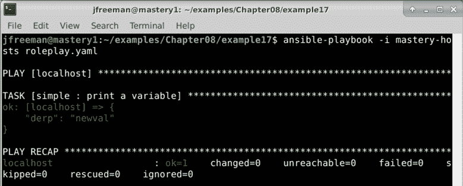

图 8.20 - 运行相同的角色，但这次在播放级别覆盖默认变量数据

可以在一个播放中应用多个角色。`roles:`关键字期望一个列表值。只需添加更多角色以应用更多角色，如下所示（下一个示例是理论的，留给你作为练习）：

```
--- 
- hosts: localhost 
  gather_facts: false 

  roles: 
  - role: simple 
    derp: newval 
  - role: second_role 
    othervar: value 
  - role: third_role 
  - role: another_role 
```

这本手册将加载四个角色——`simple`、`second_role`、`third_role`和`another_role`——并且每个角色将按照它们列出的顺序执行。

### 混合角色和任务

使用角色的 play 不仅限于角色。这些 play 可以有自己的任务，以及两个其他任务块：`pre_tasks`和`post_tasks`块。与本书中一直关注的任务执行顺序不同，这些任务的执行顺序不取决于这些部分在 play 中列出的顺序，而是在 play 内部块执行中有严格的顺序。有关 playbook 操作顺序的详细信息，请参见*第一章*，*Ansible 的系统架构和设计*。

play 的处理程序在多个点被刷新。如果有`pre_tasks`块，则在执行所有`pre_tasks`块后刷新处理程序。然后执行角色和任务块（首先是角色，然后是任务，不管它们在 playbook 中的书写顺序如何），之后处理程序将再次被刷新。最后，如果存在`post_tasks`块，则在执行所有`post_tasks`块后再次刷新处理程序。当然，可以随时使用`meta: flush_handlers`调用刷新处理程序。让我们扩展我们的`roleplay.yaml`文件，以演示处理程序可以被触发的所有不同时间，如下所示：

```
---
- hosts: localhost
  gather_facts: false
  pre_tasks:
  - name: pretask
    ansible.builtin.debug:
      msg: "a pre task"
    changed_when: true
    notify: say hi
  roles:
  - role: simple
    derp: newval
  tasks:
  - name: task
    ansible.builtin.debug:
      msg: "a task"
    changed_when: true
    notify: say hi

  post_tasks:
  - name: posttask
    ansible.builtin.debug:
      msg: "a post task"
    changed_when: true
    notify: say hi
  handlers:
  - name: say hi
    ansible.builtin.debug:
      msg: "hi"
```

我们还将修改我们简单角色的任务，以通知`say hi`处理程序，如下所示：

```
--- 
- name: print a variable 
  ansible.builtin.debug:     
    var: derp 
  changed_when: true 
  notify: say hi 
```

重要提示

这仅在调用`simple`角色的 play 中定义了`say hi`处理程序才有效。如果处理程序未定义，将会出现错误。最佳实践是只通知存在于相同角色或任何标记为依赖项的角色中的处理程序。

再次运行我们的 playbook，使用与之前示例中相同的命令，应该会导致`say hi`处理程序被调用三次：一次用于`pre_tasks`块，一次用于角色和任务，一次用于`post_tasks`块，如下面的屏幕截图所示：

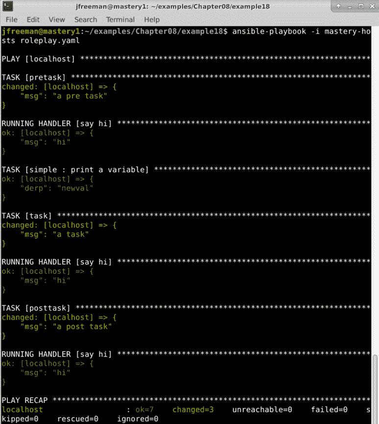

图 8.21 - 运行 playbook 以演示混合角色和任务以及处理程序执行

`pre_tasks`、`roles`、`tasks`和`post_tasks`块的书写顺序不会影响这些部分执行的顺序，但最佳实践是按照它们将被执行的顺序进行书写。这是一个视觉提示，有助于记住顺序，并在以后阅读 playbook 时避免混淆。

### 角色包含和导入

在 Ansible 2.2 版本中，新的`ansible.builtin.include_role`动作插件作为技术预览可用。然后，在**Ansible 2.4**版本中，通过添加`ansible.builtin.import_role`插件进一步开发了这个概念。为了简洁起见，我们将不使用它们的 FQCNs 来引用这些插件。

这些插件用于在任务中包含和执行整个角色。两者之间的区别微妙但重要——`include_role`插件被认为是动态的，这意味着在遇到引用它的任务时，代码会在运行时进行处理。

另一方面，`import_role`插件被认为是静态的，这意味着所有导入都在解析 playbook 时进行预处理。这对于在 playbooks 中的使用有各种影响，例如，`import_role`不能在循环中使用，而`include_role`可以。

重要提示

有关导入和包含之间权衡的详细信息可以在官方 Ansible 文档中找到：[`docs.ansible.com/ansible/latest/user_guide/playbooks_reuse.html`](https://docs.ansible.com/ansible/latest/user_guide/playbooks_reuse.html)。

在本书的上一版中，这些插件被视为技术预览，但现在它们已经成为`ansible.builtin`集合的一部分，因此现在可以认为它们是稳定的，并且可以根据需要用于您的代码。

## 角色共享

使用角色的一个优势是能够在不同的 play、playbook、整个项目空间甚至不同的组织之间共享角色。角色被设计为自包含的（或者清楚地引用依赖角色），以便它们可以存在于应用角色的 playbook 所在的项目空间之外。角色可以安装在 Ansible 主机上的共享路径上，也可以通过源代码控制进行分发。

### Ansible Galaxy

**Ansible Galaxy**（[`galaxy.ansible.com/`](https://galaxy.ansible.com/)），正如我们在*第二章*中讨论的那样，*从早期的 Ansible 版本迁移*，是一个用于查找和共享 Ansible 角色和集合的社区中心。任何人都可以访问该网站浏览这些角色和评论；此外，创建登录的用户可以对他们测试过的角色进行评论。可以使用`ansible-galaxy`工具提供的实用程序下载 Galaxy 中的角色。

`ansible-galaxy`实用程序可以连接到 Ansible Galaxy 网站并安装角色。该实用程序默认将角色安装到`/etc/ansible/roles`中。如果配置了`roles_path`，或者使用`--roles-path`（或`-p`）选项提供了运行时路径，角色将安装到那里。如果已经将角色安装到`roles_path`选项或提供的路径中，`ansible-galaxy`也可以列出这些角色并显示有关这些角色的信息。为了演示`ansible-galaxy`的用法，让我们使用它将一个用于在 Ubuntu 上安装和管理 Docker 的角色从 Ansible Galaxy 安装到我们一直在使用的`roles`目录中。从 Ansible Galaxy 安装角色需要`username.rolename`，因为多个用户可能上传了具有相同名称的角色。为了演示，我们将使用`angstwad`用户的`docker_ubuntu`角色，如下面的截图所示：

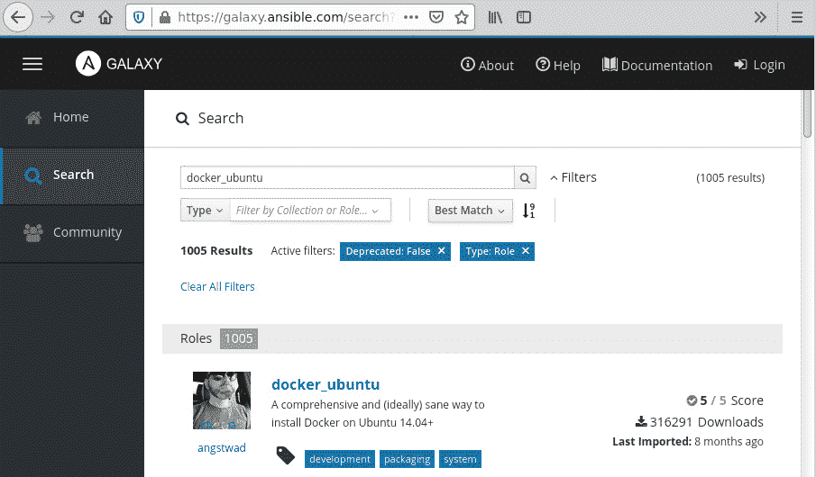

图 8.22 - 在 Ansible Galaxy 上找到一个示例社区贡献的角色

现在我们可以通过在 play 或其他角色的依赖块中引用`angstwad.docker_ubuntu`来使用这个角色。然而，让我们首先演示如何在当前工作目录中安装这个角色。我们首先创建一个`roles/`目录，然后使用以下命令将上述角色安装到这个目录中：

```
mkdir roles/
ansible-galaxy role install -p roles/ angstwad.docker_ubuntu
```

一旦我们安装了示例角色，我们可以使用以下命令查询它（以及可能存在于`roles/`目录中的任何其他角色）：

```
ansible-galaxy role list -p roles/
```

你还可以使用以下命令在本地查询有关角色的描述、创建者、版本等信息：

```
ansible-galaxy role info -p roles/ angstwad.docker_ubuntu
```

以下截图给出了你可以从前面两个命令中期望的输出类型：

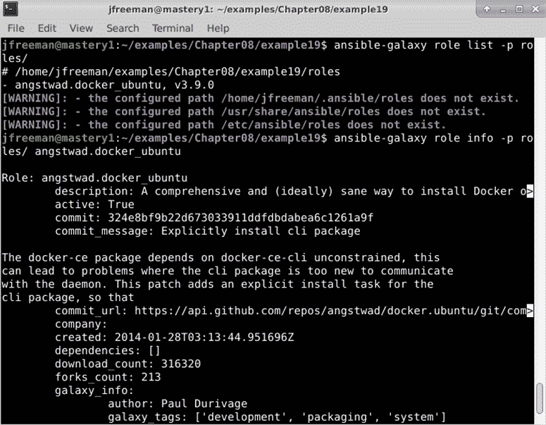

图 8.23 - 使用 ansible-galaxy 命令查询已安装的角色

输出已经被截断以节省书中的空间，如果你浏览输出，会发现更多有用的信息。`info`命令显示的一些数据存在于角色本身，在`meta/main.yml`文件中。以前，我们只在这个文件中看到了依赖信息，也许给目录命名为`meta`并没有太多意义，但现在我们看到这个文件中还有其他元数据，如下面的截图所示：

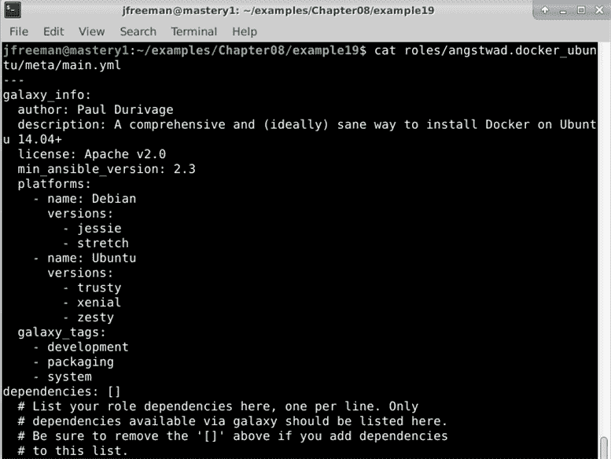

图 8.24 - 可以放置在角色的 meta/main.yml 文件中的元数据的示例

`ansible-galaxy`工具还可以帮助创建新的角色。`role init`方法将为角色创建一个骨架目录树，并在`meta/main.yml`文件中填充与 Galaxy 相关数据的占位符。

让我们通过使用这个命令在我们的工作目录中创建一个名为`autogen`的新角色来演示这种能力：

```
ansible-galaxy role init --init-path roles/ autogen
```

如果你检查这个命令创建的目录结构，你会看到创建全新角色所需的所有目录和占位符文件，如下面的截图所示：

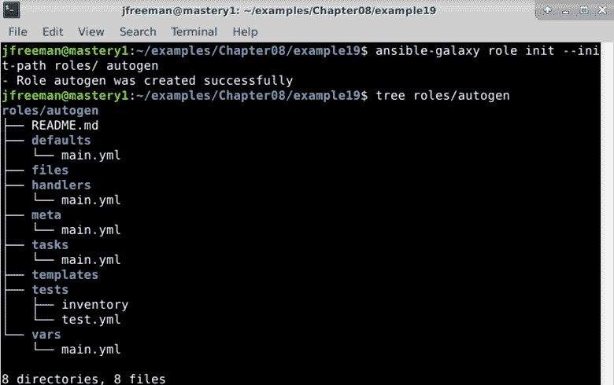

图 8.25 - 使用 ansible-galaxy 工具创建一个空的骨架角色

请注意，在过去用于指定本地`roles/`目录的`-p`开关，现在必须改用`init`命令的`--init-path`开关。对于不适合 Ansible Galaxy 的角色，例如处理内部系统的角色，`ansible-galaxy`可以直接从 Git **Uniform Resource Locator** (**URL**)安装。不仅可以提供一个角色名称给`install`方法，还可以提供一个带有可选版本的完整 Git URL。例如，如果我们想要从内部 Git 服务器安装`foowhiz`角色，我们可以简单地运行以下命令：

```
ansible-galaxy role install -p /opt/ansible/roles git+git@git.internal.site:ansible-roles/foowhiz
```

没有版本信息时，将使用`master`分支。没有名称数据时，名称将根据 URL 本身确定。要提供版本，请附加一个逗号和 Git 可以理解的版本字符串，例如标签或分支名称，例如`v1`，如下所示：

```
ansible-galaxy role install -p /opt/ansible/roles git+git@git.internal.site:ansible-roles/foowhiz,v1
```

可以在另一个逗号后面添加一个角色名称，如下面的代码片段所示。如果需要提供名称但不希望提供版本，则仍然需要为版本留出一个空位：

```
ansible-galaxy role install -p /opt/ansible/roles git+git@git.internal.site:ansible-roles/foowhiz,,foo-whiz-common
```

角色也可以直接从 tarballs 安装，只需提供 tarball 的 URL，而不是完整的 Git URL 或要从 Ansible Galaxy 获取的角色名称。

当你需要为一个项目安装许多角色时，可以在以`.yaml`（或`.yml`）结尾的 YAML 格式文件中定义要下载和安装的多个角色。该文件的格式允许你从多个来源指定多个角色，并保留指定版本和角色名称的能力。此外，还可以列出源代码控制方法（目前仅支持`git`和`hg`）。你可以在以下代码片段中看到一个例子：

```
--- 
- src: <name or url> 
  version: <optional version> 
  name: <optional name override> 
  scm: <optional defined source control mechanism, defaults to git>
```

要安装文件中的所有角色，请使用`role install`方法的`--roles-file`（`-r`）选项，如下所示：

```
ansible-galaxy role install -r foowhiz-reqs.yaml
```

通过这种方式，非常容易在运行 playbooks 之前收集所有角色的依赖关系，无论你需要的角色是在 Ansible Galaxy 上公开可用，还是保存在你自己的内部源代码管理系统中，这一简单步骤都可以大大加快 playbook 的部署速度，同时支持代码重用。

# 总结

Ansible 提供了将内容逻辑地分成单独文件的能力。这种能力帮助项目开发人员不再重复相同的代码。Ansible 中的角色进一步利用了这种能力，并在内容的路径周围包装了一些魔法。角色是可调整的、可重用的、可移植的和可共享的功能块。Ansible Galaxy 作为开发人员的社区中心存在，可以在其中找到、评价和共享角色和集合。`ansible-galaxy`命令行工具提供了一种与 Ansible Galaxy 站点或其他角色共享机制进行交互的方法。这些能力和工具有助于组织和利用常见代码。

在本章中，您学习了与任务、处理程序、变量甚至整个 playbooks 相关的包含概念。然后，您通过学习角色的结构、设置默认变量值和处理角色依赖关系来扩展了这些知识。然后，您继续学习了设计 playbooks 以有效利用角色，并应用了角色缺乏的标签等选项。最后，您学习了如何使用 Git 和 Ansible Galaxy 等存储库在项目之间共享角色。

在下一章中，我们将介绍有用且有效的故障排除技术，以帮助您在 Ansible 部署遇到问题时解决问题。

# 问题

1.  在运行 playbook 时，可以使用哪个 Ansible 模块来运行来自单独外部任务文件的任务？

a) `ansible.builtin.import`

b) `ansible.builtin.include`

c) `ansible.builtin.tasks_file`

d) `ansible.builtin.with_tasks`

1.  变量数据可以在调用外部任务文件时传递：

a) True

b) False

1.  包含当前循环值的变量的默认名称是：

a) `i`

b) `loop_var`

c) `loop_value`

d) `item`

1.  在循环外部任务文件时，重要的是考虑设置哪个特殊变量以防止循环变量名称冲突？

a) `loop_name`

b) `loop_item`

c) `loop_var`

d) `item`

1.  处理程序通常运行：

a) 一次，在剧终

b) 每次，在`pre_tasks`，`roles/tasks`和`post_tasks`部分的最后

c) 每次，在`pre_tasks`，`roles/tasks`和`post_tasks`部分的最后，只有在通知时

d) 每次，在`pre_tasks`，`roles/tasks`和`post_tasks`部分的最后，只有在导入时

1.  Ansible 可以从以下外部来源加载变量：

a) 静态`vars_files`包含

b) 动态`vars_files`包含

c) 通过`include_vars`语句

d) 通过`extra-vars`命令行参数

e) 以上所有

1.  角色从角色目录名称中获取其名称（例如，`roles/testrole1`的名称为`testrole1`）：

a) True

b) False

1.  如果一个角色缺少`tasks/main.yml`文件，Ansible 将会：

a) 用错误中止播放

b) 完全跳过角色

c) 仍然引用角色的任何其他有效部分，包括元数据，默认变量和处理程序

d) 显示警告

1.  角色可以依赖于其他角色：

a) True

b) False

1.  当您为角色指定标签时，Ansible 的行为是：

a) 将标签应用于整个角色

b) 将标签应用于角色内的每个任务

c) 完全跳过角色

d) 仅执行具有相同标签的角色的任务
