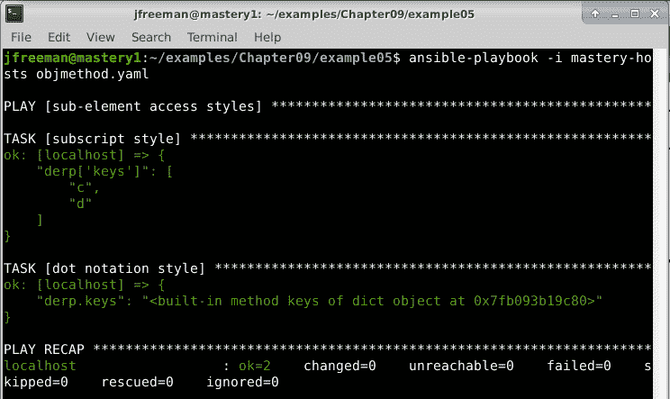

# *第九章*：故障排除 Ansible

Ansible 简单而强大。Ansible 的简单意味着它的操作易于理解和遵循。然而，即使是最简单和最用户友好的系统，有时也会出现问题——也许是因为我们正在学习编写自己的代码（playbooks、roles、modules 或其他）并需要调试它，或者更少见的是，当我们可能在已发布版本的集合或 `ansible-core` 中发现了错误时。

在调试意外行为时，能够理解和遵循 Ansible 的操作至关重要。Ansible 提供了许多选项和工具，帮助您调试其核心组件的操作，以及您自己的 playbook 代码。我们将在本章中详细探讨这些内容，目标是让您有信心调试自己的 Ansible 工作。

具体来说，在本章中，我们将讨论以下主题：

+   Playbook 日志记录和详细程度

+   变量内省

+   调试代码执行

# 技术要求

要跟随本章中提出的示例，您需要运行 **Ansible 4.3** 或更新版本的 Linux 机器。几乎任何 Linux 版本都可以——对于那些感兴趣的人，本章中提出的所有代码都是在 Ubuntu Server 20.04 **长期支持**（**LTS**）上测试的，除非另有说明，并且在 Ansible 4.3 上测试。本章附带的示例代码可以从 GitHub 下载：[`github.com/PacktPublishing/Mastering-Ansible-Fourth-Edition/tree/main/Chapter09`](https://github.com/PacktPublishing/Mastering-Ansible-Fourth-Edition/tree/main/Chapter09)。

查看以下视频以查看代码的实际操作：[`bit.ly/2Xx46Ym`](https://bit.ly/2Xx46Ym)

# Playbook 日志记录和详细程度

增加 Ansible 输出的详细程度可以解决许多问题。从无效的模块参数到不正确的连接命令，增加详细程度在准确定位错误源头方面至关重要。在 *第三章* 中简要讨论了 playbook 日志记录和详细程度，关于在执行 playbook 时保护秘密值。本节将更详细地介绍详细程度和日志记录。

## 详细程度

在使用 `ansible-playbook` 执行 playbook 时，输出显示在 **标准输出**（**stdout**）上。在默认详细程度下，几乎没有显示任何信息。当执行 play 时，`ansible-playbook` 将打印一个带有 play 名称的 **play** 标头。然后，对于每个任务，将打印一个带有任务名称的 **task** 标头。当每个主机执行任务时，将显示主机的名称以及任务状态，可以是 `ok`、`fatal` 或 `changed`。不会显示有关任务的进一步信息——例如正在执行的模块、提供给模块的参数或执行的返回数据。虽然这对于已经建立的 playbook 来说是可以的，但我倾向于想要更多关于我的 play 的信息。在本书的早期示例中，我们使用了更高级别的详细程度，最高达到二级 (`-vv`)，以便我们可以看到任务的位置和返回数据。总共有五个详细程度级别，如下所述：

+   **无**：默认级别

+   **一** (`-v`)：显示返回数据和条件信息的位置

+   **二** (`-vv`)：用于任务位置和处理程序通知信息

+   **三** (`-vvv`)：提供连接尝试和任务调用信息的详细信息

+   **四** (`-vvvv`)：将额外的详细选项传递给连接插件（例如将 `-vvv` 传递给 `ssh` 命令）

增加详细程度可以帮助准确定位错误发生的位置，以及提供额外的洞察力，了解 Ansible 如何执行其操作。

正如我们在*第三章*中提到的，*使用 Ansible 保护您的机密信息*，超过一级的冗余度可能会将敏感数据泄露到标准输出和日志文件中，因此在可能共享的环境中增加冗余度时应谨慎使用。

## 日志记录

虽然`ansible-playbook`的默认日志记录到标准输出，但输出量可能大于所使用的终端仿真器的缓冲区；因此，可能需要将所有输出保存到文件中。虽然各种 shell 提供了一些重定向输出的机制，但更优雅的解决方案是将`ansible-playbook`指向日志记录到文件。这可以通过在`ansible.cfg`文件中定义`log_path`或者将`ANSIBLE_LOG_PATH`设置为环境变量来实现。任何一个的值都应该是文件的路径。如果路径不存在，Ansible 将尝试创建一个文件。如果文件已经存在，Ansible 将追加到文件，允许合并多个`ansible-playbook`执行日志。

我们将使用以下命令以一级冗余度运行此播放：

# 变量内省

在开发 Ansible playbook 时遇到的常见问题是变量的值的不正确使用或无效假设。当在变量中注册一个任务的结果，然后在另一个任务或模板中使用该变量时，这种情况特别常见。如果没有正确访问结果的所需元素，最终结果将是意外的，甚至可能是有害的。


图 9.1 - 使用一级冗余度检查注册变量的值

使用相同冗余度运行此修改后的播放将只显示`derpops`变量的`server`部分，如下面的屏幕截图所示：

`ansible.builtin.debug`模块还有一个不同的选项，可能也很有用。该模块不是将自由格式的字符串打印到调试模板中，而是可以简单地打印任何变量的值。这是通过使用`var`参数而不是`msg`参数来完成的。让我们重复我们的例子，但这次我们将使用`var`参数，并且我们将仅访问`derpops`变量的`server`子元素，如下所示：

```
--- 
- name: variable introspection demo 
  hosts: localhost 
  gather_facts: false 

  tasks: 
    - name: do a thing 
      ansible.builtin.uri: 
        url: https://derpops.bike 
      register: derpops 

    - name: show derpops 
      ansible.builtin.debug: 
        var: derpops.server 
```

要排除变量使用不当的问题，检查变量值是关键。检查变量值的最简单方法是使用`ansible.builtin.debug`模块。`ansible.builtin.debug`模块允许在屏幕上显示自由格式的文本，并且与其他任务一样，模块的参数也可以利用 Jinja2 模板语法。让我们通过创建一个执行任务的示例播放来演示这种用法，注册结果，然后使用 Jinja2 语法在`ansible.builtin.debug`语句中显示结果，如下所示：

](Images/B17462_09_02.jpg)

使用日志文件并不意味着与记录到标准输出互斥。两者可以同时发生，并且所提供的冗余级别对两者都有影响。日志记录当然是有帮助的，但它并不一定告诉我们代码中发生了什么，以及我们的变量可能包含什么。我们将在下一节中看看如何执行变量内省，以帮助您完成这个任务。

图 9.2 - 使用调试模块的 var 参数来检查变量子元素

在我们使用`ansible.builtin.debug`的例子中，需要使用`msg`参数将变量表达为花括号内，但是在使用`var`时不需要。这是因为`msg`期望一个字符串，因此 Ansible 需要通过模板引擎将变量呈现为字符串。然而，`var`期望一个单个未呈现的变量。

## 变量子元素

playbook 中经常出现的一个错误是错误地引用复杂变量的子元素。复杂变量不仅仅是一个字符串，它可以是一个列表或一个哈希表。经常会引用错误的子元素，或者错误地引用元素，期望得到不同的类型。

虽然列表相当容易处理，但哈希表提出了一些独特的挑战。哈希表是一个无序的键-值集合，可能包含不同类型的元素，也可能是嵌套的。一个哈希表可以有一个元素是单个字符串，而另一个元素可以是一个字符串列表，第三个元素可以是另一个哈希表，其中包含更多的元素。知道如何正确访问正确的子元素对于成功至关重要。

例如，让我们稍微修改我们之前的 play。这一次，我们将允许 Ansible 收集事实，然后显示`ansible_python`的值。这是我们需要的代码：

```
--- 
- name: variable introspection demo 
  hosts: localhost 

  tasks: 
    - name: show a complex hash 
      ansible.builtin.debug: 
        var: ansible_python 
```

以一级详细程度运行此代码，您应该看到以下输出：


图 9.3 – 使用 ansible.builtin.debug 检查 ansible_python 事实子元素

使用`ansible.builtin.debug`来显示整个复杂变量是学习所有子元素名称的好方法。

这个变量有一些元素是字符串，还有一些元素是字符串列表。让我们访问标志列表中的最后一个项目，如下所示：

```
--- 
- name: variable introspection demo 
  hosts: localhost 

  tasks: 
    - name: show a complex hash 
      ansible.builtin.debug: 
        var: ansible_python.version_info[-1] 
```

输出如下所示：


图 9.4 – 进一步检查 ansible_python 事实子元素

因为`ansible_python.version_info`是一个列表，我们可以使用**列表索引方法**来从列表中选择特定的项目。在这种情况下，`-1`将给我们列表中的最后一个项目。

### 子元素与 Python 对象方法

一个不太常见但令人困惑的坑来自 Jinja2 语法的一个怪癖。在 Ansible playbook 和模板中，复杂变量可以以两种方式引用。第一种样式是通过名称引用基本元素，后跟括号，括号内用引号括起来的子元素。这是**标准下标语法**。例如，要访问`derp`变量的`herp`子元素，我们将使用以下代码：

```
{{ derp['herp'] }} 
```

第二种样式是 Jinja2 提供的一种便利方法，即使用句点来**分隔**元素。这被称为**点表示法**，看起来像这样：

```
{{ derp.herp }} 
```

这些样式的工作方式有微妙的差异，这与 Python 对象和对象方法有关。由于 Jinja2 在本质上是一个 Python 实用程序，Jinja2 中的变量可以访问其本机 Python 方法。字符串变量可以访问 Python 字符串方法，列表可以访问列表方法，字典可以访问字典方法。使用第一种样式时，Jinja2 首先会搜索提供的名称的元素以查找子元素。如果找不到子元素，则 Jinja2 将尝试访问提供的名称的 Python 方法。然而，当使用第二种样式时，顺序是相反的；首先搜索 Python 对象方法，如果找不到，然后搜索子元素。当子元素和方法之间存在名称冲突时，这种差异很重要。想象一个名为`derp`的变量，它是一个复杂的变量。这个变量有一个名为`keys`的子元素。使用每种样式来访问`keys`元素将得到不同的值。让我们构建一个 playbook 来演示这一点，如下所示：

```
--- 
- name: sub-element access styles 
  hosts: localhost 
  gather_facts: false 
  vars: 
    - derp: 
        keys: 
          - c 
          - d 
  tasks: 
    - name: subscript style 
      ansible.builtin.debug: 
        var: derp['keys']  
    - name: dot notation style 
      ansible.builtin.debug: 
        var: derp.keys 
```

在运行这个剧本时，我们可以清楚地看到两种风格之间的区别。第一种风格成功地引用了`keys`子元素，而第二种风格引用了 Python 字典的`keys`方法，如下面的屏幕截图所示：



图 9.5 - 演示标准下标语法和点符号在名称冲突发生时的区别

通常最好避免使用与 Python 对象方法冲突的子元素名称。但是，如果不可能的话，下一件最好的事情就是意识到子元素引用风格的差异，并选择适当的风格。

当然，变量只是剧本行为的一方面 - 有时，我们需要实际进入调试代码本身，我们将在下一节中仔细研究这一点。

# 调试代码执行

有时，记录和检查变量数据并不足以解决问题。当这种情况发生时，有必要交互式地调试剧本，或者深入研究 Ansible 代码的内部。Ansible 代码有两个主要集：在 Ansible 主机上本地运行的代码，以及在目标主机上远程运行的模块代码。

## 剧本调试

可以通过使用在 Ansible 2.1 中引入的执行策略**调试策略**来交互式地调试剧本。如果一个剧本在遇到错误状态时使用了这个策略，将开始一个交互式调试会话。这个交互式会话可以用于显示变量数据，显示任务参数，更新任务参数，更新变量，重新执行任务，继续执行或退出调试器。

让我们用一个成功的任务，然后是一个出错的任务，最后是一个成功的任务来演示这一点。我们将重用我们一直在使用的剧本，但稍微更新一下，如下面的代码所示：

```
--- 
- name: sub-element access styles 
  hosts: localhost 
  gather_facts: false 
  strategy: debug 

  vars: 
    - derp: 
        keys: 
          - c 
          - d 

  tasks: 
    - name: subscript style 
      ansible.builtin.debug: 
        var: derp['keys'] 

    - name: failing task 
      ansible.builtin.debug: 
        msg: "this is {{ derp['missing'] }}" 

    - name: final task 
      ansible.builtin.debug: 
        msg: "my only friend the end" 
```

执行时，Ansible 将在我们失败的任务中遇到错误，并显示(debug)提示，如下面的屏幕截图所示：


图 9.6 - Ansible 调试器在执行失败任务时启动（执行策略为 debug）时

从这个提示中，我们可以使用`p`命令显示任务和任务参数，如下面的屏幕截图所示：


图 9.7 - 使用 p 命令检查失败剧本任务的详细信息

我们还可以即时更改剧本以尝试不同的参数或变量值。让我们定义`derp`变量的缺失键，然后重试执行。所有变量都在顶层`vars`字典中。我们可以使用 Python 语法和`task_vars`命令直接设置变量数据，然后使用`r`命令重试，如下面的屏幕截图所示：


图 9.8 - 添加先前未定义的变量值并从调试器中重试剧本

调试执行策略是一个方便的工具，可以快速迭代不同的任务参数和变量组合，以找出正确的前进路径。然而，由于错误导致交互式控制台，调试策略不适用于剧本的自动执行，因为控制台上没有人来操作调试器。

重要观点

更改调试器中的数据不会保存更改到后备文件中。始终记得更新剧本文件以反映在调试过程中发现的内容。

## 调试本地代码

本地 Ansible 代码是随 Ansible 一起提供的大部分代码。所有的 playbook、play、role 和 task 解析代码都存储在本地。所有的任务结果处理代码和传输代码都存储在本地。除了传输到远程主机的组装模块代码之外，所有代码都存储在本地。

本地 Ansible 代码仍然可以分为三个主要部分：**清单**，**playbook**和**执行器**。清单代码处理来自主机文件，动态清单脚本或两者组合在目录树中的清单数据的解析。Playbook 代码用于将 playbook **YAML Ain't Markup Language** (**YAML**)代码解析为 Ansible 内的 Python 对象。执行器代码是核心**应用程序编程接口** (**API**)，处理分叉进程，连接到主机，执行模块，处理结果以及大多数其他事情。学习开始调试的一般区域需要实践，但这里描述的一般区域是一个起点。

由于 Ansible 是用 Python 编写的，因此用于调试本地代码执行的工具是`pdb` Python 调试器。这个工具允许我们在 Ansible 代码内部插入断点，并逐行交互式地执行代码。这对于检查 Ansible 在本地代码执行时的内部状态非常有用。许多书籍和网站涵盖了`pdb`的使用方法，可以通过简单的网络搜索找到 Python `pdb`的介绍，因此我们在这里不再重复。如果您正在寻找使用`pdb`的实践介绍，那么在书籍*Django 1.1 Testing and Debugging*，*Karen M. Tracey*，*Packt Publishing*中有许多很好的例子，这将使您能够在 Django（用 Python 编写）中使用`pdb`进行实际调试技术的练习。官方的 Python 文档也提供了大量关于使用调试器的信息。您可以在这里查看：https://docs.python.org/3/library/pdb.html。基本的方法是编辑要调试的源文件，插入新的代码行以创建断点，然后执行代码。代码执行将在创建断点的地方停止，并提供一个提示来探索代码状态。

当然，Ansible 有许多不同的组件，这些组件共同构建了其功能，从清单处理代码到实际的 playbook 执行引擎本身。可以在所有这些地方添加断点和调试，以帮助解决可能遇到的问题，尽管您需要编辑的文件在每种情况下略有不同。我们将在本章的以下小节中详细讨论您可能需要调试的 Ansible 代码的最常见方面。

### 调试清单代码

Inventory 代码处理查找清单来源、读取或执行已发现的文件、将清单数据解析为清单对象，并加载清单的变量数据。要调试 Ansible 如何处理清单，必须在 `inventory/__init__.py` 或 `inventory/` 子目录中的其他文件中添加断点。此目录将位于安装了 Ansible 的本地文件系统上。由于大多数 Ansible 4.0 的安装都是通过 `pip` 进行的，因此您的安装路径将根据诸如是否使用了虚拟环境、是否在用户目录中安装了 Ansible，或者是否使用 `sudo` 来系统范围安装 Ansible 等因素而有很大不同。例如，在我的 Ubuntu 20.04 测试系统上，此文件可能位于 `/usr/local/lib/python3.8/dist-packages/ansible/inventory` 路径下。要帮助您发现 Ansible 的安装位置，只需在命令行中输入 `which ansible`。此命令将显示 Ansible 可执行文件的安装位置，并可能指示 Python 虚拟环境。对于本书来说，Ansible 已经作为 root 用户使用操作系统 Python 发行版进行了安装，Ansible 二进制文件位于 `/usr/local/bin/` 中。

要发现 Ansible Python 代码的路径，只需输入 `python3 -c "import ansible; print(ansible)"`。请注意，就像我一样，您可能已经安装了 Python 2 和 Python 3 —— 如果您不确定 Ansible 运行在哪个版本的 Python 下，您需要执行版本 2 和 3 的二进制文件，以便发现您的模块位置。

在我的系统上，这显示 `<module 'ansible' from '/usr/local/lib/python3.8/dist-packages/ansible/__init__.py'>`，从中我们可以推断出清单子目录位于 `/usr/local/lib/python3.8/dist-packages/ansible/inventory/`。

清单目录在后续版本的 Ansible 中进行了重组，在 4.0 版本中，我们需要查看 `inventory/manager.py`。请注意，此文件来自 `ansible-core` 软件包，而不是依赖于它的 `ansible` 软件包。

在这个文件中，有一个 `Inventory` 类的定义。这是在整个 playbook 运行期间将使用的清单对象，当 `ansible-playbook` 解析为清单来源提供的选项时，它就会被创建。`Inventory` 类的 `__init__` 方法执行所有的清单发现、解析和变量加载。要排除这三个领域的问题，应该在 `__init__()` 方法中添加断点。一个好的起点是在所有类变量都被赋予初始值之后，以及在处理任何数据之前。

在 `ansible-core` 的 2.11.1 版本中，这将是 `inventory/manager.py` 的第 *167* 行，其中调用了 `parse_sources` 函数。

我们可以跳到第 *215* 行的 `parse_sources` 函数定义处插入我们的断点。要插入断点，我们必须首先导入 `pdb` 模块，然后调用 `set_trace()` 函数，如下面的截图所示：


图 9.9 – 在 ansible-core inventory manager 代码中添加 pdb 断点

要开始调试，保存源文件，然后像平常一样执行 `ansible-playbook`。当达到断点时，执行将停止，并显示 `pdb` 提示，如下面的截图所示：


图 9.10 – Ansible 在开始为我们的 play 设置清单时达到 pdb 断点

从这里，我们可以发出任意数量的调试器命令，比如 `help` 命令，如下面的截图所示：


图 9.11 – 演示 pdb 调试器的帮助命令

`where`和`list`命令可以帮助我们确定我们在堆栈中的位置和代码中的位置，如下面的屏幕截图所示：


图 9.12 – 演示 where 和 list pdb 命令

`where`命令显示我们在`inventory/manager.py`中的`parse_sources()`方法中。下一个框架是相同的文件——`__init__()`函数。在此之前是另一个文件，`playbook.py`文件，该文件中的函数是`run()`。这一行调用`ansible.inventory.InventoryManager`来创建一个清单对象。在此之前是原始文件`ansible-playbook`，调用`cli.run()`。

`list`命令显示我们当前执行点周围的源代码，前后各五行。

从这里，我们可以使用`next`命令逐行引导`pdb`通过函数，如果选择，我们可以使用`step`命令跟踪其他函数调用。我们还可以使用`print`命令打印变量数据以检查值，如下面的屏幕截图所示：


图 9.13 – 演示打印命令在执行过程中分析变量值

我们可以看到`self._sources`变量具有我们的`mastery-hosts`清单文件的完整路径，这是我们为清单数据提供给`ansible-playbook`的字符串。我们可以继续逐步进行或跳转，或者只需使用`continue`命令运行直到下一个断点或代码完成。

### 调试 playbook 代码

Playbook 代码负责加载、解析和执行 playbooks。调试 playbook 处理的主要入口点是通过定位 Ansible 路径找到的，就像我们在*调试清单代码*部分中所做的那样，然后找到`playbook/__init__.py`文件。在这个文件中有`PlayBook`类。调试 playbook 处理的一个很好的起点是大约第*68*行（对于`ansible-core` 2.11.1），尽管这将根据您安装的版本而有所不同。以下屏幕截图显示了相邻的代码，以帮助您找到您版本的正确行：


图 9.14 – 添加 pdb 调试器以调试 playbook 加载和执行

在这里设置断点将允许我们跟踪查找 playbook 文件并解析它。具体来说，通过步入`self._loader.load_from_file()`函数调用，我们将能够跟踪解析过程。

`PlayBook`类的`_load_playbook_data()`函数只是进行初始解析。其他目录中的其他类用于执行 plays 和 tasks。一个特别有趣的目录是`executor/`目录，其中包含用于执行 playbooks、plays 和 tasks 的类文件。`executor/playbook_executor.py`文件中`PlaybookExecutor`类中的`run()`函数将循环遍历 playbook 中的所有 plays 并执行这些 plays，这将依次执行各个 tasks。如果遇到与 play 解析、play 或 task 回调、标签、play 主机选择、串行操作、处理程序运行或其他任何问题相关的问题，这就是要遍历的函数。

### 调试执行器代码

在 Ansible 中，执行器代码是连接清单数据、playbooks、plays、tasks 和连接方法的连接器代码。虽然这些其他代码片段可以分别进行调试，但它们的交互方式可以在执行器代码中进行检查。

执行器类在`executor/`中的各个文件中定义，`PlaybookExecutor`类。这个类处理给定 playbook 中所有 plays 和 tasks 的执行。`__init__()`类创建函数创建一系列占位符属性，并设置一些默认值，而`run()`函数是大部分有趣的地方。

调试通常会将您从一个文件带到另一个文件，跳转到代码库中的其他位置。例如，在`PlaybookExecutor`类的`__init__()`函数中，有一段代码来缓存默认的**Secure Shell**（**SSH**）可执行文件是否支持`ControlPersist`。您可以通过定位`ansible`安装路径中的`executor/playbook_executor.py`文件（就像我们在前面的部分中所做的那样），并查找声明`set_default_transport()`的行来找到它。这在`ansible-core` 2.11.1 中是第 76 行，以便您知道要查找的位置。一旦找到代码中的适当位置，请在此处设置断点，以便您可以跟踪代码，如下面的屏幕截图所示：


图 9.15-将 Python 调试器插入到 Ansible playbook 执行器代码中

现在我们可以再次运行我们的`objmethod.yml` playbook 以进入调试状态，如下面的屏幕截图所示：


图 9.16-执行示例 playbook 以触发调试器

我们需要步入函数以跟踪执行。步入函数将带我们到另一个文件，如下所示：


图 9.17-步入代码以跟踪执行

从这里，我们可以使用`list`来查看我们新文件中的代码，如下面的屏幕截图所示：


图 9.18-列出调试器中我们当前位置附近的代码

再走几行，我们来到一段代码块，将执行一个`ssh`命令并检查输出以确定`ControlPersist`是否受支持，如下面的屏幕截图所示：


图 9.19-定位代码以确定是否支持 ControlPersist

让我们走过接下来的几行，然后打印出`err`的值。这将向我们展示`ssh`执行的结果以及`Ansible`将在其中搜索的整个字符串，如下面的屏幕截图所示：


图 9.20-使用 pdb 调试器分析 SSH 连接结果

正如我们所看到的，搜索字符串不在`err`变量中，因此`has_cp`的值仍然保持为`True`的默认值。

有关分叉和调试的快速说明

当`Ansible`使用多进程进行多个分叉时，调试变得困难。调试器可能连接到一个分叉而不是另一个分叉，这将使调试代码变得非常困难。除非专门调试多进程代码，最好还是坚持使用单个分叉。

### 调试远程代码

远程代码是`Ansible`传输到远程主机以执行的代码。这通常是模块代码，或者在动作插件的情况下，是其他代码片段。使用我们在前一节讨论的调试方法来调试模块执行将不起作用，因为`Ansible`只是复制代码然后执行它。远程代码执行没有连接到终端，因此没有办法将其连接到调试提示符，即在不编辑模块代码的情况下是不可能的。

要调试模块代码，我们需要编辑模块代码本身以插入调试器断点。不要直接编辑已安装的模块文件，而是在与 playbooks 相关的`library/`目录中创建文件的副本。这个模块代码的副本将被用来代替已安装的文件，这样就可以在不影响系统上模块的其他用户的情况下临时编辑模块。

与其他 Ansible 代码不同，模块代码不能直接使用`pdb`进行调试，因为模块代码是组装然后传输到远程主机的。幸运的是，有一个解决方案，即一个稍微不同的调试器，名为`rpdb` - 远程 Python 调试器。这个调试器有能力在提供的端口上启动一个监听服务，以允许远程连接到 Python 进程。远程连接到进程将允许逐行调试代码，就像我们对其他 Ansible 代码所做的那样。

为了演示这个调试器是如何工作的，我们首先需要一个远程主机。在这个例子中，我们使用一个名为`debug.example.com`的远程主机（当然，你可以根据需要使用你自己的示例进行相应的调整）。接下来，我们需要一个 playbook 来执行我们想要调试的模块。代码如下所示：

```
---
- name: remote code debug
  hosts: debug.example.com
  gather_facts: false
  become: true
  tasks:
    - name: a remote module execution
      systemd:
        name: nginx
        state: stopped
        enabled: no
```

重要提示

你们中敏锐的人可能已经注意到，在本书中，我们第一次没有使用**完全限定类名**（**FQCN**）来引用模块。这是因为 FQCN 告诉 Ansible 使用它自己期望的位置的内置模块，而我们实际上想要加载我们将放置在本地`library/`目录中的本地副本。因此，在这个特定情况下，我们必须只使用模块的简称。

我们还需要一个新的清单文件来引用我们的新测试主机。由于我没有为这个主机设置**域名系统**（**DNS**）条目，我在清单中使用特殊的`ansible_host`变量，告诉 Ansible 连接到`debug.example.com`上的**互联网协议**（**IP**）地址，如下面的代码片段所示：

```
debug.example.com ansible_host=192.168.81.154
```

重要提示

不要忘记在两个主机之间设置 SSH 身份验证 - 我使用 SSH 密钥，这样我就不需要每次运行`ansible-playbook`时都输入密码。

这个 play 只是调用`ansible.builtin.systemd`模块来确保`nginx`服务被停止，并且不会在启动时启动。正如我们之前所述，我们需要复制服务模块并将其放置在`library/`中。要复制的服务模块的位置将根据 Ansible 的安装方式而变化。在我为本书演示的演示系统上，它位于`/usr/local/lib/python3.8/dist-packages/ansible/modules/systemd.py`。然后，我们可以编辑它以插入我们的断点。我在我的系统上将其插入到第*358*行 - 这对于`ansible-core` 2.11.1 是正确的，但随着新版本的发布可能会发生变化。然而，下面的屏幕截图应该给你一个插入代码的想法：


图 9.21 - 将远程 Python 调试器插入到 Ansible 模块代码中

我们将在创建`systemctl`变量值之前设置断点。首先，必须导入`rpdb`模块（这意味着远程主机上必须存在`rpdb` Python 库），然后需要使用`set_trace()`创建断点。

重要提示

在 Ubuntu Server 20.04 上（就像演示中使用的主机一样），可以使用以下命令使用`pip`安装`rpdb`：`sudo pip3 install rpdb`。

与常规调试器不同，此函数将打开一个端口并监听外部连接。默认情况下，该函数将在地址`127.0.0.1`上监听端口`4444`的连接。但是，该地址不会在网络上公开，因此在我的示例中，我已经指示`rpdb`在地址`0.0.0.0`上监听，这实际上是主机上的每个地址（尽管我相信您会理解，这会带来您需要小心的安全隐患！）。

重要提示

如果运行`rpdb`的主机有防火墙（例如`firewalld`或`ufw`），则需要为本例中的端口`4444`打开端口。

现在我们可以运行这个 playbook 来设置等待客户端连接的服务器，如下所示：


图 9.22 - 运行远程模块调试的测试 playbook

现在服务器正在运行，我们可以从另一个终端连接到它。可以使用`telnet`程序连接到正在运行的进程，如下面的截图所示：


图 9.23 - 使用 telnet 连接到远程 Python 调试器会话进行模块调试

从这一点开始，我们可以像平常一样进行调试。我们之前使用的命令仍然存在，比如`list`用来显示当前帧在代码中的位置，如下面的截图所示：


图 9.24 - 在远程调试会话中使用现熟悉的 Python 调试器命令

使用调试器，我们可以逐步跟踪`systemd`模块，以跟踪它如何确定底层工具的路径，跟踪在主机上执行了哪些命令，确定如何计算更改等。整个文件都可以逐步执行，包括模块可能使用的任何其他外部库，从而允许调试远程主机上的其他非模块代码。

如果调试会话允许模块干净地退出，playbook 的执行将恢复正常。但是，如果在模块完成之前断开调试会话，playbook 将产生错误，如下面的截图所示：


图 9.25 - 在提前终止远程调试会话时产生错误的示例

由于这种副作用，最好不要提前退出调试器，而是在调试完成后发出`continue`命令。

### 调试动作插件

有些模块实际上是动作插件。这些是在将代码传输到远程主机之前在本地执行一些代码的任务。一些示例动作插件包括`copy`、`fetch`、`script`和`template`。这些插件的源代码可以在`plugins/action/`中找到。该目录中的每个插件都有自己的文件，可以在其中插入断点，以便调试执行的代码，而不是将代码发送到远程主机。调试这些通常使用`pdb`来完成，因为大多数代码是在本地执行的。

# 摘要

Ansible 是一款软件，软件会出现故障；这不是一个“如果”，而是一个“何时”的问题。无效的输入、不正确的假设和意外的环境都可能导致任务和操作表现不如预期时产生令人沮丧的情况。内省和调试是可以快速将沮丧转化为喜悦的故障排除技术，当发现根本原因时。

在本章中，我们学习了如何让 Ansible 将其操作记录到文件中，以及如何更改 Ansible 输出的详细程度。然后，我们学习了如何检查变量，以确保它们的值符合您的期望，然后再详细调试 Ansible 代码。此外，我们演示了如何在核心 Ansible 代码中插入断点，并使用标准 Python 工具执行本地和远程 Python 调试会话。

在下一章中，我们将学习如何通过编写自己的模块、插件和清单来源来扩展 Ansible 的功能。

# 问题

1.  要查看连接尝试等详细信息，您需要以哪个详细程度启动 Ansible？

a）级别为 3 或以上

b）级别为 2 或以上

c）级别为 1 或以上

d）级别为 4

1.  如果您在 playbook 中使用敏感数据，为什么应该小心使用高于一级的详细程度？

a）更高的详细程度不支持使用 vaults。

b）更高的详细程度可能会将敏感数据记录到控制台和/或日志文件中。

c）更高的详细程度将打印 SSH 密码。

1.  可以通过集中配置 Ansible 将其输出记录到文件：

a）使用`ANSIBLE_LOG_PATH`环境变量

b）在`ansible.cfg`中使用`log_path`指令

c）将每个 playbook 运行的输出重定向到文件

d）所有这些

1.  用于变量内省的模块的名称是：

a）`ansible.builtin.analyze`

b）`ansible.builtin.introspect`

c）`ansible.builtin.debug`

d）`ansible.builtin.print`

1.  在引用 Ansible 变量中的子元素时，哪种语法最安全，以防止与保留的 Python 名称冲突？

a）点表示法

b）标准下标语法

c）Ansible 子元素表示法

d）标准点表示法

1.  除非您需要执行低级别的代码调试，否则可以使用以下方法调试 playbook 的流程：

a）调试策略

b）调试执行

c）调试任务计划程序

d）这些都不是

1.  在本书中演示的 Python 本地调试器的名称是：

a）`PyDebug`

b）`python-debug`

c）`pdb`

d）`pdebug`

1.  您还可以调试远程主机上模块的执行：

a）使用 Python 的`rpdb`模块。

b）通过将 playbook 复制到主机并使用`pdb`。

c）通过数据包跟踪器，如`tcpdump`。

d）这是不可能的。

1.  除非另有配置，远程 Python 调试器会在哪里接收连接？

a）`127.0.0.1:4433`

b）`0.0.0.0:4444`

c）`127.0.0.1:4444`

d）`0.0.0.0:4433`

1.  为什么不应该在不让代码运行完成的情况下结束远程 Python 调试会话？

a）这会导致在您的 playbook 运行中出现错误。

b）这将导致文件丢失。

c）这可能会损坏您的 Ansible 安装。

d）这将导致挂起的调试会话。
