# *第十章*：扩展 Ansible

必须说**Ansible**采用了*厨房水槽*的功能方法，并试图在开箱即用时提供您可能需要的所有功能。随着`ansible-core`包及其相关集合，截至撰写本文时，几乎有 6000 个模块可供在 Ansible 中使用-与本书第二版出版时包含的（大约）800 个相比！除此之外，还有丰富的插件和过滤器架构，包括多个回调插件、查找插件、过滤器插件和包括动态清单插件在内的插件。现在，集合提供了一个全新的向量，通过它可以提供新的功能。

尽管如此，总会有一些情况，Ansible 并不能完全执行所需的任务，特别是在大型和复杂的环境中，或者在自定义的内部系统已经开发的情况下。幸运的是，Ansible 的设计，加上其开源性质，使任何人都可以通过开发功能来扩展它变得很容易。随着 Ansible 3.0 的集合的出现，扩展功能比以往任何时候都更容易。然而，在本章中，我们将专注于为`ansible-core`包做出贡献的具体内容。如果您希望通过创建集合来做出贡献，您可以按照本章提供的步骤轻松开发所需的代码（例如，创建一个新模块），然后将其打包为集合，就像我们在*第二章*中描述的那样，*从早期的 Ansible 版本迁移*。您如何做出贡献取决于您和您的目标受众-如果您觉得您的代码将帮助所有使用 Ansible 的人，那么您可能希望将其提交给`ansible-core`；否则，最好将其构建到一个集合中。

本章将探讨以下几种方式，可以向 Ansible 添加新功能：

+   开发模块

+   开发插件

+   开发动态清单插件

+   向 Ansible 项目贡献代码

# 技术要求

要按照本章中提供的示例，您需要一台运行**Ansible 4.3**或更新版本的 Linux 机器。几乎任何 Linux 发行版都可以-对于那些感兴趣的人，所有本章中提供的代码都是在**Ubuntu Server 20.04 LTS**上测试的，除非另有说明，并且在 Ansible 4.3 上测试。本章附带的示例代码可以从 GitHub 上下载：[`github.com/PacktPublishing/Mastering-Ansible-Fourth-Edition/tree/main/Chapter10`](https://github.com/PacktPublishing/Mastering-Ansible-Fourth-Edition/tree/main/Chapter10)。

查看以下视频，了解代码的实际操作：[`bit.ly/3DTKL35`](https://bit.ly/3DTKL35)。

# 开发模块

模块是 Ansible 的工作马。它们提供了足够的抽象，使得 playbook 可以简单明了地陈述。由核心 Ansible 开发团队维护的模块和插件有 100 多个，并作为`ansible-core`包的一部分进行分发，涵盖命令、文件、软件包管理、源代码控制、系统、实用程序等。此外，社区贡献者维护了近 6000 个其他模块，扩展了许多这些类别和其他许多功能，例如公共云提供商、数据库、网络等，通过集合。真正的魔力发生在模块的代码内部，它接收传递给它的参数，并努力建立所需的结果。

在 Ansible 中，模块是被传输到远程主机以执行的代码片段。它们可以用远程主机可以执行的任何语言编写；然而，Ansible 提供了一些非常有用的快捷方式，用于用 Python 编写模块，您会发现大多数模块确实是用 Python 编写的。

## 基本模块构造

模块存在以满足需求-在主机上执行一项工作的需求。模块通常需要输入，但并不总是期望输入，并且将返回某种输出。模块还努力成为幂等，允许模块一遍又一遍地运行而不会产生负面影响。在 Ansible 中，输入以命令行参数的形式提供给模块，并且输出以 JSON 格式传递到`STDOUT`。

输入通常以空格分隔的`key=value`语法提供，模块负责将其解构为可用数据。如果您使用 Python，有方便的函数来管理这一点，如果您使用不同的语言，那么完全处理输入就取决于您的模块代码。

输出采用 JSON 格式。惯例规定，在成功的情况下，JSON 输出应至少有一个键`changed`，这是一个布尔值，表示模块执行是否导致更改。还可以返回其他数据，这些数据可能有助于定义发生了什么变化，或者为以后使用向 playbook 提供重要信息。此外，主机信息可以在 JSON 数据中返回，以根据模块执行结果自动创建主机变量。我们将在以后更详细地看一下这一点，在*提供事实数据*部分。

## 自定义模块

Ansible 提供了一种简单的机制来利用除 Ansible 自带模块之外的自定义模块。正如我们在[*第一章*]（B17462_01_Final_JC_ePub.xhtml#_idTextAnchor015）中学到的，*Ansible 的系统架构和设计*，Ansible 会搜索许多位置来找到所请求的模块。其中一个位置，实际上是第一个位置，是顶层 playbook 所在路径的`library/`子目录。这就是我们将放置自定义模块的地方，以便我们可以在示例 playbook 中使用它，因为我们的重点是为`ansible-core`软件包开发。但是，正如我们已经提到的，您也可以通过集合分发模块，并且[*第二章*]（B17462_02_Final_JC_ePub.xhtml#_idTextAnchor047）描述了（以本章节为例的实际示例）如何打包模块以通过集合进行分发。

除此之外，模块也可以嵌入在角色中，以提供角色可能依赖的附加功能。这些模块仅对包含模块的角色或在包含模块的角色之后执行的任何其他角色或任务可用。要使用角色提供模块，将模块放在角色根目录的`library/`子目录中。虽然这仍然是一种可行的途径，但预计随着 Ansible 3.0 及以后版本的普及，您将通过集合分发您的模块。提供了一个重叠期来支持许多现有的 Ansible 2.9 及更早版本的发行版。

## 示例-简单模块

为了演示编写基于 Python 的模块的简易性，让我们创建一个简单的模块。这个模块的目的是远程复制源文件到目标文件，这是一个简单的任务，我们可以逐步构建起来。为了启动我们的模块，我们需要创建模块文件。为了方便访问我们的新模块，我们将在已经使用的工作目录的`library/`子目录中创建文件。我们将这个模块称为`remote_copy.py`，为了开始它，我们需要放入一个 shebang 行，以指示这个模块将使用 Python 执行：

```
#!/usr/bin/python 
# 
```

对于基于 Python 的模块，约定使用`/usr/bin/python`作为列出的可执行文件。在远程系统上执行时，将使用远程主机的配置 Python 解释器来执行模块，因此如果您的 Python 代码不存在于此路径，也不必担心。接下来，我们将导入一个稍后在模块中使用的 Python 库，称为`shutil`：

```
import shutil 
```

现在，我们准备创建我们的`main`函数。`main`函数本质上是模块的入口点，模块的参数将在这里定义，执行也将从这里开始。在 Python 中创建模块时，我们可以在这个`main`函数中采取一些捷径，绕过大量样板代码，直接进行参数定义。

我们可以通过创建一个`AnsibleModule`对象并为参数提供一个`argument_spec`字典来实现这一点：

```
def main(): 
    module = AnsibleModule( 
        argument_spec = dict( 
            source=dict(required=True, type='str'), 
            dest=dict(required=True, type='str') 
        ) 
    ) 
```

在我们的模块中，我们提供了两个参数。第一个参数是`source`，我们将用它来定义复制的源文件。第二个参数是`dest`，它是复制的目的地。这两个参数都标记为必需，如果其中一个未提供，将引发错误。这两个参数都是`string`类型。`AnsibleModule`类的位置尚未定义，因为这将在文件的后面发生。

有了模块对象，我们现在可以创建在远程主机上执行实际工作的代码。我们将利用`shutil.copy`和我们提供的参数来实现这一点：

```
    shutil.copy(module.params['source'], 
                module.params['dest']) 
```

`shutil.copy`函数期望一个源和一个目的地，我们通过访问`module.params`来提供这些。`module.params`字典包含模块的所有参数。完成复制后，我们现在准备将结果返回给 Ansible。这是通过另一个`AnsibleModule`方法`exit_json`完成的。这个方法期望一组`key=value`参数，并将适当地格式化为 JSON 返回。由于我们总是执行复制，出于简单起见，我们将始终返回一个更改：

```
    module.exit_json(changed=True) 
```

这一行将退出函数，因此也将退出模块。这个函数假设操作成功，并将以成功的适当返回代码`0`退出模块。不过，我们还没有完成模块的代码；我们仍然需要考虑`AnsibleModule`的位置。这是一个小魔术发生的地方，我们告诉 Ansible 要与我们的模块结合的其他代码，以创建一个完整的可传输的作品：

```
from ansible.module_utils.basic import * 
```

就是这样！这一行就可以让我们访问所有基本的`module_utils`，一组不错的辅助函数和类。我们应该在我们的模块中加入最后一件事：几行代码，告诉解释器在执行模块文件时执行`main()`函数。

```
if __name__ == '__main__': 
    main() 
```

现在，我们的模块文件已经完成，这意味着我们可以用一个 playbook 来测试它。我们将称我们的 playbook 为`simple_module.yaml`，并将其存储在与`library/`目录相同的目录中，我们刚刚编写了我们的模块文件。出于简单起见，我们将在`localhost`上运行 play，并在`/tmp`中使用一些文件名作为源和目的地。我们还将使用一个任务来确保我们首先有一个源文件：

```
--- 
- name: test remote_copy module 
  hosts: localhost 
  gather_facts: false 

  tasks: 
  - name: ensure foo
    ansible.builtin.file:
      path: /tmp/rcfoo
      state: touch
  - name: do a remote copy
    remote_copy:
      source: /tmp/rcfoo
      dest: /tmp/rcbar
```

由于我们的新模块是从与 playbook 本地的`library/`目录运行的，它没有一个**完全合格的集合名称**（**FQCN**），因此在 playbook 中我们只会用它的简称来引用它。要运行这个 playbook，我们将运行以下命令：

```
ansible-playbook -i mastery-hosts simple_module.yaml -v
```

如果`remote_copy`模块文件写入了正确的位置，一切都将正常工作，屏幕输出将如下所示：

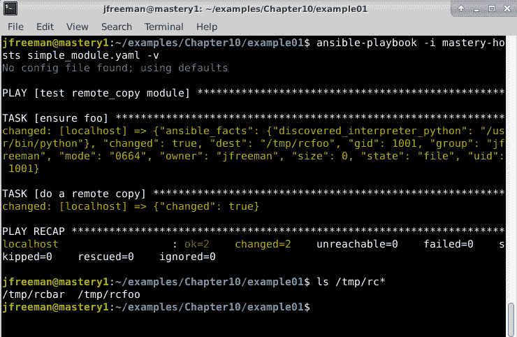

图 10.1-运行一个简单的 playbook 来测试我们的第一个自定义 Ansible 模块

我们的第一个任务涉及`/tmp/rcfoo`路径，以确保它存在，然后我们的第二个任务使用`remote_copy`将`/tmp/rcfoo`复制到`/tmp/rcbar`。两个任务都成功，每次都会产生一个`changed`状态。

### 记录模块

除非包含了有关如何操作它的文档，否则不应该认为模块是完整的。模块的文档存在于模块本身中，称为`DOCUMENTATION`、`EXAMPLES`和`RETURN`的特殊变量中。

`DOCUMENTATION`变量包含一个特殊格式的字符串，描述了模块的名称，`ansible-core`的版本或其添加到的父集合的版本，模块的简短描述，更长的描述，模块参数的描述，作者和许可信息，额外要求以及对模块用户有用的任何额外说明。让我们在现有的`import shutil`语句下为我们的模块添加一个`DOCUMENTATION`字符串：

```
import shutil 

DOCUMENTATION = ''' 
--- 
module: remote_copy 
version_added: future 
short_description: Copy a file on the remote host 
description: 
  - The remote_copy module copies a file on the remote host from a given source to a provided destination. 
options: 
  source: 
    description: 
      - Path to a file on the source file on the remote host 
    required: True 
  dest: 
    description: 
      - Path to the destination on the remote host for the copy 
    required: True 
author: 
  - Jesse Keating 
''' 
```

字符串的格式本质上是 YAML，其中一些顶级键包含其中的哈希结构（与`options`键相同）。每个选项都有子元素来描述选项，指示选项是否是必需的，列出选项的任何别名，列出选项的静态选择，或指示选项的默认值。将此字符串保存到模块后，我们可以测试我们的格式，以确保文档将正确呈现。这是通过`ansible-doc`工具完成的，使用参数指示在哪里搜索模块。如果我们从与我们的 playbook 相同的位置运行它，命令将如下所示：

```
ansible-doc -M library/ remote_copy
```

输出应如下所示：

图 10.2 - 使用 ansible-doc 工具查看我们的新模块的文档

](Images/B17462_10_02.jpg)

图 10.2 - 使用 ansible-doc 工具查看我们的新模块的文档

在这个例子中，我将输出导入`cat`以防止分页程序隐藏执行行。我们的文档字符串似乎格式正确，并为用户提供了有关模块使用的重要信息。

`EXAMPLES`字符串用于提供模块的一个或多个示例用法，以及在 playbook 中使用的任务代码片段。让我们添加一个示例任务来演示其用法。这个变量定义传统上是在`DOCUMENTATION`定义之后：

```
EXAMPLES = ''' 
# Example from Ansible Playbooks 
- name: backup a config file 
  remote_copy: 
    source: /etc/herp/derp.conf 
    dest: /root/herp-derp.conf.bak 
''' 
```

有了这个变量定义，我们的`ansible-doc`输出现在将包括示例，如下所示：

图 10.3 - 通过 EXAMPLES 部分扩展我们的模块文档

](Images/B17462_10_03.jpg)

图 10.3 - 通过 EXAMPLES 部分扩展我们的模块文档

最后一个文档变量`RETURN`用于描述模块执行的返回数据。返回数据通常作为注册变量对后续使用很有用，并且有关预期返回数据的文档可以帮助 playbook 的开发。我们的模块还没有任何返回数据；因此，在我们可以记录任何返回数据之前，我们必须添加返回数据。这可以通过修改`module.exit_json`行来添加更多信息来完成。让我们将`source`和`dest`数据添加到返回输出中：

```
    module.exit_json(changed=True, source=module.params['source'], 
                     dest=module.params['dest']) 
```

重新运行 playbook 将显示返回额外数据，如下面的截图所示：

图 10.4 - 运行我们扩展的模块并添加返回数据

](Images/B17462_10_04.jpg)

图 10.4 - 运行我们扩展的模块并添加返回数据

仔细观察返回数据，我们可以看到比我们在模块中放入的更多数据。这是 Ansible 中的一些辅助功能；当返回数据集包括`dest`变量时，Ansible 将收集有关目标文件的更多信息。收集的额外数据是`gid`（组 ID），`group`（组名），`mode`（权限），`uid`（所有者 ID），`owner`（所有者名），`size`和`state`（文件，链接或目录）。我们可以在我们的`RETURN`变量中记录所有这些返回项，它是在`EXAMPLES`变量之后添加的。两组三个单引号（`'''`）之间的所有内容都会被返回 - 因此，这第一部分返回文件路径和所有权：

```
RETURN = ''' 
source: 
  description: source file used for the copy 
  returned: success 
  type: string 
  sample: "/path/to/file.name" 
dest: 
  description: destination of the copy 
  returned: success 
  type: string 
  sample: "/path/to/destination.file" 
gid: 
  description: group ID of destination target 
  returned: success 
  type: int 
  sample: 502 
group: 
  description: group name of destination target 
  returned: success 
  type: string 
  sample: "users" 
uid: 
  description: owner ID of destination target 
  returned: success 
  type: int 
  sample: 502 
owner: 
  description: owner name of destination target 
  returned: success 
  type: string 
  sample: "fred"
```

继续模块定义文件的这一部分，这一部分返回有关文件大小，状态和权限的详细信息：

```
mode: 
  description: permissions of the destination target 
  returned: success 
  type: int 
  sample: 0644 
size: 
  description: size of destination target 
  returned: success 
  type: int 
  sample: 20 
state: 
  description: state of destination target 
  returned: success 
  type: string 
  sample: "file" 
''' 
```

每个返回的项目都列有描述、项目在返回数据中的情况、项目的类型和值的示例。`RETURN`字符串由`ansible-doc`解析，但返回值按字母顺序排序，在本书的上一个版本中，我们看到值是按模块本身中列出的顺序打印的。以下屏幕截图显示了这一点：

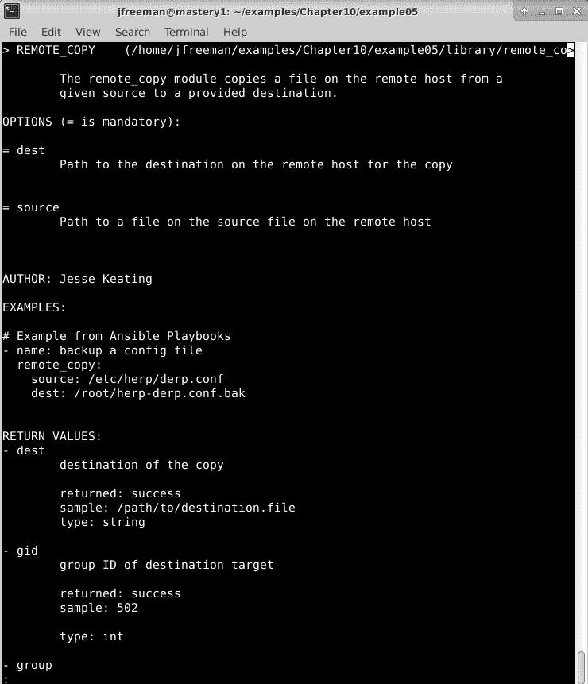

图 10.5 - 向我们的模块添加返回数据文档

通过这种方式，我们建立了一个包含文档的模块，如果我们将其贡献给社区，对其他人来说非常有用，甚至对我们自己来说，当我们一段时间后回来时也很有用。

### 提供事实数据

与作为模块的一部分返回的数据类似，例如`exit`，模块可以通过在名为`ansible_facts`的键中返回数据来直接为主机创建事实。直接从模块提供事实可以消除需要使用后续的`set_fact`任务注册任务的返回的需要。为了演示这种用法，让我们修改我们的模块以返回`source`和`dest`数据作为事实。因为这些事实将成为顶级主机变量，我们希望使用比`source`和`dest`更具描述性的事实名称。用以下代码替换我们模块中的当前`module.exit_json`行：

```
    facts = {'rc_source': module.params['source'], 
             'rc_dest': module.params['dest']} 

    module.exit_json(changed=True, ansible_facts=facts) 
```

我们还将向我们的 playbook 添加一个任务，使用`debug`语句中的一个事实：

```
  - name: show a fact 
    ansible.builtin.debug: 
      var: rc_dest 
```

现在，运行 playbook 将显示新的返回数据，以及变量的使用，如下屏幕截图所示：

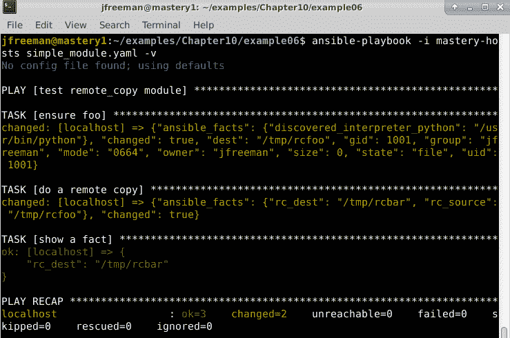

图 10.6 - 向我们的自定义模块添加事实，并在 playbook 执行期间查看它们的值

如果我们的模块不返回事实（我们之前的`remote_copy.py`版本没有），我们将不得不注册输出并使用`set_fact`为我们创建事实，如下面的代码所示：

```
  - name: do a remote copy 
    remote_copy: 
      source: /tmp/rcfoo 
      dest: /tmp/rcbar 
    register: mycopy 

  - name: set facts from mycopy 
    ansible.builtin.set_fact: 
      rc_dest: "{{ mycopy.dest }}" 
```

虽然能够这样做很有用，但在设计我们的模块时，最好让模块定义所需的事实。如果不这样做，那么以前的注册和`set_fact`代码将需要在 playbook 中每次使用我们的模块时重复！

### 检查模式

自其存在以来，Ansible 就支持**检查模式**，这是一种操作模式，会假装对系统进行更改，而实际上并未更改系统。检查模式对于测试是否会发生更改或系统状态是否已漂移自上次 Ansible 运行以来非常有用。检查模式取决于模块是否支持它并返回数据，就好像已经完成了更改一样。在我们的模块中支持检查模式需要两个更改；第一个是指示模块支持检查模式，而第二个是在执行之前检测检查模式是否激活并返回数据。

#### 支持检查模式

要指示模块支持检查模式，必须在创建模块对象时设置一个参数。这可以在定义模块对象中的`argument_spec`变量之前或之后完成；在这里，我们将在定义之后完成：

```
    module = AnsibleModule( 
        argument_spec = dict( 
            source=dict(required=True, type='str'), 
            dest=dict(required=True, type='str') 
        ), 
        supports_check_mode=True 
    ) 
```

如果您正在修改现有代码，请不要忘记在`argument_spec`字典定义之后添加逗号，如前面的代码所示。

#### 处理检查模式

检测检查模式是否激活非常容易。模块对象将具有一个`check_mode`属性，当检查模式激活时，它将设置为布尔值`true`。在我们的模块中，我们希望在执行复制之前检测检查模式是否激活。我们可以简单地将复制操作移到一个`if`语句中，以避免在检查模式激活时进行复制。除此之外，对模块不需要进行进一步的更改：

```
    if not module.check_mode: 
        shutil.copy(module.params['source'], 
                    module.params['dest']) 
```

现在，我们可以运行我们的 playbook，并在执行中添加`-C`参数。这个参数启用检查模式。我们还将测试以确保 playbook 没有创建和复制文件。以下截图显示了这一点：

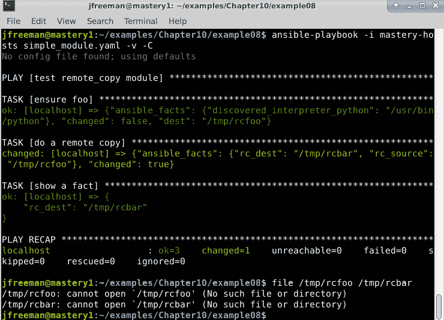

图 10.7-为我们的 Ansible 模块添加检查模式支持

尽管模块的输出看起来好像创建并复制了文件，但我们可以看到在执行之前这些文件并不存在，并且在执行之后仍然不存在，这清楚地表明我们的简单模块是在检查模式下运行的。

现在我们已经看了我们的简单示例模块，我们将探讨如何通过另一个重要的项目-插件来扩展 Ansible 的功能。

# 开发插件

插件是扩展或修改 Ansible 功能的另一种方式。虽然模块是作为任务执行的，但插件在各种其他地方使用。插件根据它们插入到 Ansible 执行的位置被分为几种类型。Ansible 为每个领域提供了一些插件，最终用户可以创建自己的插件来扩展这些特定领域的功能。

## 连接类型插件

每当 Ansible 连接到主机执行任务时，都会使用连接插件。Ansible 附带了一些连接插件，包括`ssh`、`community.docker.docker`、`local`和`winrm`。Ansible 可以通过创建连接插件来利用其他连接机制，这可能会有用，如果您必须连接到一些新类型的系统，比如网络交换机，或者也许有一天连接到您的冰箱。要创建一个新的连接插件，我们必须了解并使用底层通信协议，这本身可能需要一本专门的书籍；因此，我们不会在这里尝试创建一个。然而，开始的最简单方法是阅读与 Ansible 一起提供的现有插件，并选择一个进行必要的修改。现有的插件可以在您的系统上安装 Ansible Python 库的位置中找到，例如在我的系统上是`/usr/local/lib/python3.8/dist-packages/ansible/plugins/connection/`。您也可以在 GitHub 上查看它们-例如，如果您想查找与`ansible-core`的`2.11.1`版本相关的文件，您可以在这里查看：[`github.com/ansible/ansible/tree/v2.11.1/lib/ansible/plugins/connection`](https://github.com/ansible/ansible/tree/v2.11.1/lib/ansible/plugins/connection)。

## Shell 插件

与连接插件类似，Ansible 使用**shell 插件**在 shell 环境中执行操作。每个 shell 都有 Ansible 关心的微妙差异，以正确执行命令，重定向输出，发现错误等交互。Ansible 支持多种 shell，包括`sh`、`ansible.posix.csh`、`ansible.posix.fish`和`powershell`。我们可以通过实现新的 shell 插件来添加更多的 shell。您可以在这里查看它们的代码（对于`ansible-core`的`2.11.1`版本）：[`github.com/ansible/ansible/tree/v2.11.1/lib/ansible/plugins/shell`](https://github.com/ansible/ansible/tree/v2.11.1/lib/ansible/plugins/shell)。

## 查找插件

**查找插件**是 Ansible 从主机系统访问外部数据源并实现语言特性，比如循环结构（`loop`或`with_*`）的方式。可以创建查找插件来访问现有数据存储中的数据或创建新的循环机制。现有的查找插件可以在`plugins/lookup/`中找到，或者在 GitHub 上找到：[`github.com/ansible/ansible/tree/v2.11.1/lib/ansible/plugins/lookup`](https://github.com/ansible/ansible/tree/v2.11.1/lib/ansible/plugins/lookup)。查找插件可以添加以引入新的循环内容的方式，或者用于在外部系统中查找资源。

## Vars 插件

存在用于注入变量数据的构造，形式为**vars 插件**。诸如`host_vars`和`group_vars`之类的数据是通过插件实现的。虽然可以创建新的变量插件，但通常最好创建自定义清单源或事实模块。

## 事实缓存插件

Ansible 可以在 playbook 运行之间缓存事实。事实的缓存位置取决于所使用的配置缓存插件。Ansible 包括在`memory`（它们在运行之间不会被缓存，因为这不是持久的）、`community.general.memcached`、`community.general.redis`和`jsonfile`中缓存事实的插件。创建一个**事实缓存插件**可以启用额外的缓存机制。

## 过滤插件

虽然 Jinja2 包含了几个过滤器，但 Ansible 已经使过滤器可插拔以扩展 Jinja2 的功能。Ansible 包括了一些对 Ansible 操作有用的过滤器，并且 Ansible 的用户可以添加更多过滤器。现有的插件可以在`plugins/filter/`中找到。

为了演示过滤器插件的开发，我们将创建一个简单的过滤器插件来对文本字符串进行一些愚蠢的操作。我们将创建一个过滤器，它将用字符串`somebody else's computer`替换任何出现的`the cloud`。我们将在现有工作目录中的新目录`filter_plugins/`中的文件中定义我们的过滤器。文件的名称无关紧要，因为我们将在文件中定义过滤器的名称；所以，让我们将文件命名为`filter_plugins/sample_filter.py`。

首先，我们需要定义执行翻译的函数，并提供翻译字符串的代码：

```
def cloud_truth(a): 
    return a.replace("the cloud", "somebody else's computer") 
```

接下来，我们需要构建一个`FilterModule`对象，并在其中定义我们的过滤器。这个对象是 Ansible 将要加载的对象，Ansible 期望在对象内有一个`filters`函数，该函数返回文件中的一组过滤器名称到函数的映射：

```
class FilterModule(object): 
    '''Cloud truth filters''' 
    def filters(self): 
        return {'cloud_truth': cloud_truth} 
```

现在，我们可以在一个 playbook 中使用这个过滤器，我们将其命名为`simple_filter.yaml`：

```
--- 
- name: test cloud_truth filter 
  hosts: localhost 
  gather_facts: false 
  vars: 
    statement: "I store my files in the cloud" 
  tasks: 
  - name: make a statement 
    ansible.builtin.debug: 
      msg: "{{ statement | cloud_truth }}" 
```

现在，让我们运行我们的 playbook，看看我们的过滤器如何运行：

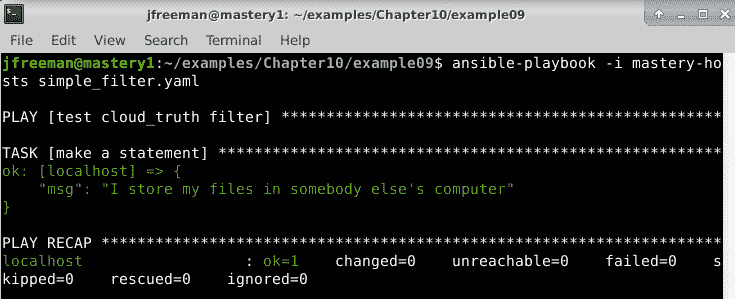

图 10.8 - 执行 playbook 以测试我们的新过滤器插件

我们的过滤器起作用了，它将`the cloud`这个词替换为`somebody else's computer`。这是一个愚蠢的例子，没有任何错误处理，但它展示了我们扩展 Ansible 和 Jinja2 的过滤器功能的能力。

重要提示

虽然包含过滤器定义的文件的名称可以是开发人员想要的任何名称，但最佳做法是将其命名为过滤器本身，以便将来可以轻松找到它，可能是由其他合作者找到。这个例子没有遵循这个规则，以演示文件名不附加到过滤器名称。

## 回调插件

**回调**是可以插入以增加功能的 Ansible 执行中的位置。有预期的回调点可以注册以触发这些点的自定义操作。以下是可能用于在编写时触发功能的点的列表：

+   `v2_on_any`

+   `v2_runner_on_failed`

+   `v2_runner_on_ok`

+   `v2_runner_on_skipped`

+   `v2_runner_on_unreachable`

+   `v2_runner_on_async_poll`

+   `v2_runner_on_async_ok`

+   `v2_runner_on_async_failed`

+   `v2_runner_on_start`

+   `v2_playbook_on_start`

+   `v2_playbook_on_notify`

+   `v2_playbook_on_no_hosts_matched`

+   `v2_playbook_on_no_hosts_remaining`

+   `v2_playbook_on_task_start`

+   `v2_playbook_on_cleanup_task_start`

+   `v2_playbook_on_handler_task_start`

+   `v2_playbook_on_vars_prompt`

+   `v2_playbook_on_import_for_host`

+   `v2_playbook_on_not_import_for_host`

+   `v2_playbook_on_play_start`

+   `v2_playbook_on_stats`

+   `v2_on_file_diff`

+   `v2_playbook_on_include`

+   `v2_runner_item_on_ok`

+   `v2_runner_item_on_failed`

+   `v2_runner_item_on_skipped`

+   `v2_runner_retry`

当 Ansible 运行达到这些状态时，任何具有在这些点运行代码的插件都将被执行。这提供了在不修改基本代码的情况下扩展 Ansible 的巨大能力。

回调可以以各种方式使用：更改屏幕上的显示方式，更新进度的中央状态系统，实现全局锁定系统，或者几乎可以想象的任何事情。这是扩展 Ansible 功能的最强大方式。但是，您会注意到先前列出的项目在官方 Ansible 文档网站([`docs.ansible.com`](https://docs.ansible.com))上没有出现，也不会被`ansible-doc`命令列出。查找这些回调并了解更多关于它们的信息的好地方是`plugins/callback/__init__.py`文件，在您的`ansible-core`安装目录下。例如，在我的系统上，Ansible 是使用 pip 安装的，完整路径是`/usr/local/lib/python3.8/dist-packages/ansible/plugins/callback/__init__.py`（如果您想在互联网上查找此文件，`ansible-core`的`2.11.1`版本的文件可以在此处找到：[`github.com/ansible/ansible/blob/v2.11.1/lib/ansible/plugins/callback/__init__.py`](https://github.com/ansible/ansible/blob/v2.11.1/lib/ansible/plugins/callback/__init__.py)）。

为了演示我们开发回调插件的能力，我们将创建一个简单的插件，当 playbook 在最后打印 play 摘要时，它将在屏幕上打印一些愚蠢的东西：

1.  首先，我们需要创建一个新目录来保存我们的回调。Ansible 将查找的位置是`callback_plugins/`。与之前的`filter`插件不同，我们确实需要仔细命名我们的回调插件文件，因为它也必须在`ansible.cfg`文件中反映出来。

1.  我们将命名为`callback_plugins/shrug.py`。由于 Ansible 版本大于 3.0 正在向 Python 3 支持移动（尽管在撰写本文时仍支持 Python 2.7），因此您的插件代码应该是为 Python 3 编写的。首先在插件中添加以下 Python 3 头：

```
from __future__ import (absolute_import, division, print_function)
__metaclass__ = type
```

1.  接下来，您需要添加一个文档块，就像我们在本章的*开发模块*部分所做的那样。在本书的上一版中，不需要这样做，但现在，如果您不这样做，将会收到弃用警告，并且您的回调插件在`ansible-core` 2.14 发布时可能无法工作。我们的文档块将如下所示：

```
DOCUMENTATION = '''
    callback: shrug
    type: stdout
    short_description: modify Ansible screen output
    version_added: 4.0
    description:
        - This modifies the default output callback for ansible-playbook.
    extends_documentation_fragment:
      - default_callback
    requirements:
      - set as stdout in configuration
'''
```

文档中的大多数项目都是不言自明的，但值得注意的是`extends_documentation_fragment`项目。文档块的这一部分是与`ansible-core` 2.14 兼容所必需的部分，因为我们在这里扩展了`default_callback`插件，我们需要告诉 Ansible 我们正在扩展这一部分文档。

1.  完成后，我们需要创建一个`CallbackModule`类，它是从`ansible.plugins.callback.default`中找到的`default`回调插件中定义的`CallbackModule`的子类，因为我们只需要更改正常输出的一个方面。

1.  在这个类中，我们将定义变量值来指示它是`2.0`版本的回调，它是`stdout`类型的回调，并且它的名称是`shrug`。

1.  此外，在这个类中，我们必须初始化它，以便我们可以定义我们想要插入以使某些事情发生的回调点中的一个或多个。在我们的示例中，我们想要修改运行结束时生成的 playbook 摘要的显示，因此我们将修改`v2_playbook_on_stats`回调。

1.  为了完成我们的插件，我们必须调用原始的回调模块本身。Ansible 现在一次只支持一个`stdout`插件，因此如果我们不调用原始插件，我们将发现我们的插件的输出是唯一产生的输出-有关 playbook 运行的所有其他信息都将丢失！文档块下面的最终代码应该如下所示：

```
from ansible.plugins.callback.default import CallbackModule as CallbackModule_default
class CallbackModule(CallbackModule_default):
  CALLBACK_VERSION = 2.0
  CALLBACK_TYPE = 'stdout'
  CALLBACK_NAME = 'shrug'
  def __init__(self):
    super(CallbackModule, self).__init__()
  def v2_playbook_on_stats(self, stats):
    msg = b'\xc2\xaf\\_(\xe3\x83\x84)_/\xc2\xaf'
    self._display.display(msg.decode('utf-8') * 8)
    super(CallbackModule, self).v2_playbook_on_stats(stats)
```

1.  由于此回调是`stdout_callback`，我们需要创建一个`ansible.cfg`文件，并在其中指示应使用`shrug` `stdout`回调。`ansible.cfg`文件可以在`/etc/ansible/`中找到，也可以在与 playbook 相同的目录中找到：

```
[defaults] 
stdout_callback = shrug 
```

1.  这就是我们在回调中要写的全部内容。一旦保存，我们就可以重新运行之前的 playbook，这个 playbook 练习了我们的`sample_filter`，但这次，在屏幕上会看到不同的东西：

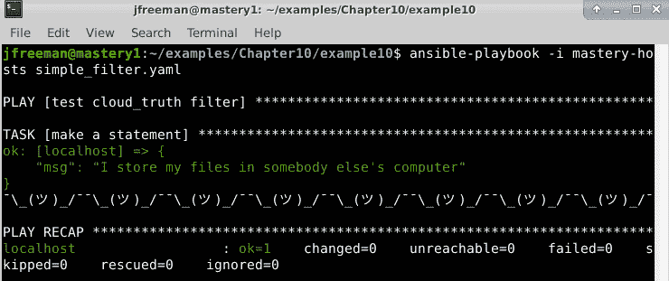

图 10.9-将我们的 shrug 插件添加到修改 playbook 运行输出

这很愚蠢，但它展示了插入到 playbook 执行的各个点的能力。我们选择在屏幕上显示一系列耸肩，但我们也可以与一些内部审计和控制系统进行交互，记录操作，或者向 IRC 或 Slack 频道报告进度。

## 动作插件

**动作插件**用于在不实际执行模块的情况下钩入任务结构，或者在在远程主机上执行模块之前在 Ansible 主机上执行代码。Ansible 包含多个动作插件，它们可以在`plugins/action/`中找到。其中一个动作插件是`template`插件，它可以用来代替`template`模块。当 playbook 作者编写`template`任务时，该任务将调用`template`插件来执行工作。该插件将在将内容复制到远程主机之前在本地渲染模板。因为动作必须在本地发生，所以由动作插件完成工作。我们应该熟悉的另一个动作插件是`debug`插件，在本书中我们大量使用它来打印内容。当我们尝试在同一个任务中完成本地工作和远程工作时，创建自定义动作插件是有用的。

## 分发插件

与分发自定义模块类似，存储自定义插件的标准位置与期望使用插件的 playbooks 一起。插件的默认位置是与 Ansible 代码安装一起提供的位置，`~/.ansible/plugins/`的子目录，以及项目根目录的子目录（顶级 playbook 存储的位置）。插件也可以在角色的相同子目录中分发，以及集合中，正如我们在*第二章*中所介绍的那样，*从早期 Ansible 版本迁移*。要使用来自任何其他位置的插件，我们需要在`ansible.cfg`文件中定义查找插件类型的插件的位置，或者引用集合，就像我们在*第二章*中加载示例过滤器模块时所演示的那样，*从早期 Ansible 版本迁移*。

如果您在项目根目录内分发插件，每种插件类型都有自己的顶级目录：

+   `action_plugins/`

+   `cache_plugins/`

+   `callback_plugins/`

+   `connection_plugins/`

+   `shell_plugins/`

+   `lookup_plugins/`

+   `vars_plugins/`

+   `filter_plugins/`

与其他 Ansible 结构一样，找到的具有相同名称的第一个插件将被使用，并且与模块一样，首先检查相对于项目根目录的路径，允许本地覆盖现有插件。只需将过滤器文件放在适当的子目录中，当引用时将自动使用它。

# 开发动态清单插件

**清单插件**是一些代码，将为 Ansible 执行创建清单数据。在许多环境中，简单的`ini`文件样式的清单源和变量结构不足以表示实际管理的基础设施。在这种情况下，需要动态清单源，它将在每次执行 Ansible 时动态发现清单和数据。许多这些动态源与 Ansible 一起提供，主要是为了在一个云计算平台或另一个云计算平台内部构建的基础设施上操作 Ansible。与 Ansible 4.3 一起提供的动态清单插件的简短而不完整的列表（现在有超过 40 个）包括以下内容-请注意来自 FQCNs 的这些插件，这些插件曾经作为 Ansible 2.x 版本的一部分提供，现在作为构成 Ansible 4.3 的更广泛集合的一部分被包含进来：

+   `azure.azcollection.azure_rm`

+   `community.general.cobbler`

+   `community.digitalocean.digitalocean`

+   `community.docker.docker_containers`

+   `amazon.aws.aws_ec2`

+   `google.cloud.gcp_compute`

+   `community.libvirt.libvirt`

+   `community.general.linode`

+   `kubernetes.core.openshift`

+   `openstack.cloud.openstack`

+   `community.vmware.vmware_vm_inventory`

+   `servicenow.servicenow.now`

清单插件本质上是可执行脚本。Ansible 使用设置的参数（`--list`或`--host <hostname>`）调用脚本，并期望在`STDOUT`上以 JSON 格式输出。当提供`--list`参数时，Ansible 期望列出要管理的所有组的列表。每个组可以列出主机成员资格、子组成员资格和组变量数据。当使用`--host <hostname>`参数调用脚本时，Ansible 期望返回特定于主机的数据（或空的 JSON 字典）。

使用动态清单源很容易。可以通过在`ansible`和`ansible-playbook`中使用`-i`（`--inventory-file`）选项直接引用源，也可以通过将插件文件放在`ansible.cfg`中清单路径引用的目录中。

在创建清单插件之前，我们必须了解在使用我们的脚本时`--list`或`--host`的预期格式。

## 列出主机

当`--list`参数传递给清单脚本时，Ansible 期望 JSON 输出数据具有一组顶级键。这些键以清单中的组命名。每个组都有一个键。组键内的结构因需要在组中表示的数据而异。如果一个组只有主机而没有组级变量，则键内的数据可以简单地是主机名的列表。如果组有变量或子组（一组组），则数据需要是一个哈希，可以有一个或多个名为`hosts`、`vars`或`children`的键。`hosts`和`children`子键具有列表值，即组中存在的主机列表或子组列表。`vars`子键具有哈希值，其中每个变量的名称和值由键和值表示。

## 列出主机变量

当`--host <hostname>`参数传递给清单脚本时，Ansible 期望 JSON 输出数据只是变量的哈希，其中每个变量的名称和值由键和值表示。如果对于给定主机没有变量，则期望一个空的哈希。 

## 简单的库存插件

为了演示开发清单插件，我们将创建一个简单打印一些静态清单主机数据的插件 - 它不会是动态的，但这是理解基础知识和所需输出格式的一个很好的第一步。这是基于我们在整本书中使用过的一些清单，所以它们在某些部分可能看起来很熟悉。我们将把我们的清单插件写入项目根目录中名为`mastery-inventory.py`的文件，并使其可执行。我们将使用 Python 编写此文件，以便轻松处理执行参数和 JSON 格式化，但请记住，您可以使用任何您喜欢的语言编写清单脚本，只要它们产生所需的 JSON 输出：

1.  首先，我们需要添加一个 shebang 行来指示此脚本将使用 Python 执行：

```
#!/usr/bin/env python 
# 
```

1.  接下来，我们需要导入一些稍后在插件中需要的 Python 模块：

```
import json 
import argparse 
```

1.  现在，我们将创建一个 Python 字典来保存我们所有的组。我们的一些组只有主机，而其他组有变量或子组。我们将相应地格式化每个组：

```
inventory = {} 
inventory['web'] = {'hosts': ['mastery.example.name'], 
'vars': {'http_port': 80, 
'proxy_timeout': 5}} 
inventory['dns'] = {'hosts': ['backend.example.name']} 
inventory['database'] = {'hosts': ['backend.example.name'], 
'vars': {'ansible_ssh_user': 'database'}} 
inventory['frontend'] = {'children': ['web']} 
inventory['backend'] = {'children': ['dns', 'database'], 
'vars': {'ansible_ssh_user': 'blotto'}} 
inventory['errors'] = {'hosts': ['scsihost']} 
inventory['failtest'] = {'hosts': ["failer%02d" % n for n in 
                                   range(1,11)]} 
```

1.  创建我们的`failtest`组（您将在下一章中看到此操作），在我们的清单文件中将表示为`failer[01:10]`，我们可以使用 Python 列表推导来为我们生成列表，格式化列表中的项目与我们的`ini`格式的清单文件完全相同。其他组条目应该是不言自明的。

1.  我们的原始清单还有一个`all`组变量，它为所有组提供了一个默认变量`ansible_ssh_user`（组可以覆盖），我们将在这里定义并在文件后面使用：

```
allgroupvars = {'ansible_ssh_user': 'otto'} 
```

1.  接下来，我们需要在它们自己的字典中输入特定于主机的变量。我们原始清单中只有一个节点具有特定于主机的变量 - 我们还将添加一个新主机`scsihost`，以进一步开发我们的示例：

```
hostvars = {} 
hostvars['mastery.example.name'] = {'ansible_ssh_host': '192.168.10.25'} 
hostvars['scsihost'] = {'ansible_ssh_user': 'jfreeman'} 
```

1.  定义了所有数据后，我们现在可以继续处理参数解析的代码。这可以通过我们在文件中导入的`argparse`模块来完成：

```
parser = argparse.ArgumentParser(description='Simple Inventory')
parser.add_argument('--list', action='store_true', help='List all hosts')
parser.add_argument('--host', help='List details of a host')
args = parser.parse_args()
```

1.  解析参数后，我们可以处理`--list`或`--host`操作。如果请求列表，我们只需打印我们清单的 JSON 表示。这是我们将考虑`allgroupvars`数据的地方；每个组的默认`ansible_ssh_user`。我们将循环遍历每个组，创建`allgroupvars`数据的副本，更新该数据以及可能已经存在于组中的任何数据，然后用新更新的副本替换组的变量数据。最后，我们将打印结果：

```
if args.list: 
for group in inventory: 
ag = allgroupvars.copy() 
ag.update(inventory[group].get('vars', {})) 
inventory[group]['vars'] = ag 
    print(json.dumps(inventory)) 
```

1.  最后，我们将通过构建一个字典来处理`--host`操作，该字典包含可以应用于传递给此脚本的主机的所有变量。我们将使用 Ansible 在解析`ini`格式清单时使用的优先顺序的近似值来执行此操作。这段代码是迭代的，嵌套循环在生产环境中效率不高，但在这个例子中，它对我们很有用。输出是提供的主机的 JSON 格式的变量数据，如果提供的主机没有特定的变量数据，则为空哈希：

```
elif args.host:
    hostfound = False
    agghostvars = allgroupvars.copy()
    for group in inventory:
        if args.host in inventory[group].get('hosts', {}):
            hostfound = True
            for childgroup in inventory:
                if group in inventory[childgroup].get('children', {}):
                    agghostvars.update(inventory[childgroup].get('vars', {}))
    for group in inventory:
        if args.host in inventory[group].get('hosts', {}):
            hostfound = True
            agghostvars.update(inventory[group].get('vars', {}))
    if hostvars.get(args.host, {}):
        hostfound = True
    agghostvars.update(hostvars.get(args.host, {}))
    if not hostfound:
        agghostvars = {}
    print(json.dumps(agghostvars))
```

现在，我们的清单已经准备好测试了！我们可以直接执行它，并传递`--help`参数，我们可以免费使用`argparse`获得。这将根据我们之前在文件中提供的`argparse`数据显示我们脚本的用法：

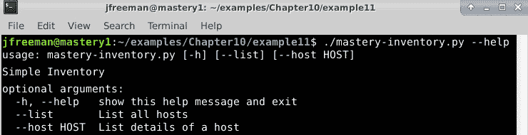

图 10.10 - 测试我们的动态清单脚本的内置帮助函数

重要提示

不要忘记使动态清单脚本可执行；例如，`chmod +x mastery-inventory.py`。

如果我们传递`--list`，我们将得到所有组的输出，以及每个组中的所有主机和所有相关的清单变量：

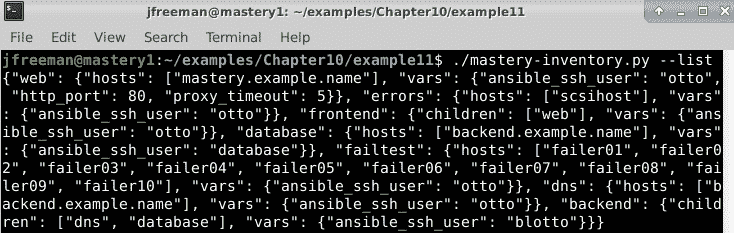

图 10.11-显示我们的动态清单脚本的--list 参数产生的 JSON 输出

同样，如果我们使用`--host`参数和我们知道在清单中的主机名运行这个 Python 脚本，我们将看到传递的主机名的主机变量。如果我们传递一个组名，什么都不应该返回，因为脚本只返回有效的单个主机名的数据：

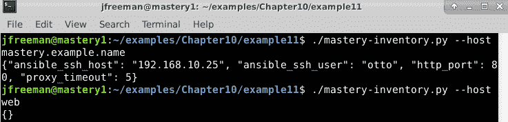

图 10.12-显示我们的动态清单脚本的--list 参数产生的 JSON 输出

现在，我们准备使用我们的清单文件与 Ansible。让我们制作一个新的 playbook（`inventory_test.yaml`）来显示主机名和`ssh`用户名数据：

```
--- 
- name: test the inventory 
  hosts: all 
  gather_facts: false 

  tasks: 
  - name: hello world 
    ansible.builtin.debug: 
      msg: "Hello world, I am {{ inventory_hostname }}. 
            My username is {{ ansible_ssh_user }}"
```

在我们可以使用新的清单插件之前，我们还有一件事要做。默认情况下（作为安全功能），大多数 Ansible 的清单插件都是禁用的。为了确保我们的动态清单脚本能够运行，打开适用的`ansible.cfg`文件编辑器，并在`[inventory]`部分查找`enable_plugins`行。至少，它应该看起来像这样（尽管如果您愿意，您可以选择启用更多插件）：

```
[inventory]
enable_plugins = ini, script
```

要使用我们的新清单插件与这个 playbook，我们可以简单地使用`-i`参数引用插件文件。因为我们在 playbook 中使用了`all`主机组，我们还将限制运行到一些组以节省屏幕空间。我们还将计时执行，这在下一节中将变得重要，所以运行以下命令来执行 playbook：

```
time ansible-playbook -i mastery-inventory.py inventory_test.yaml --limit backend,frontend,errors
```

这次运行的输出应该如下所示：

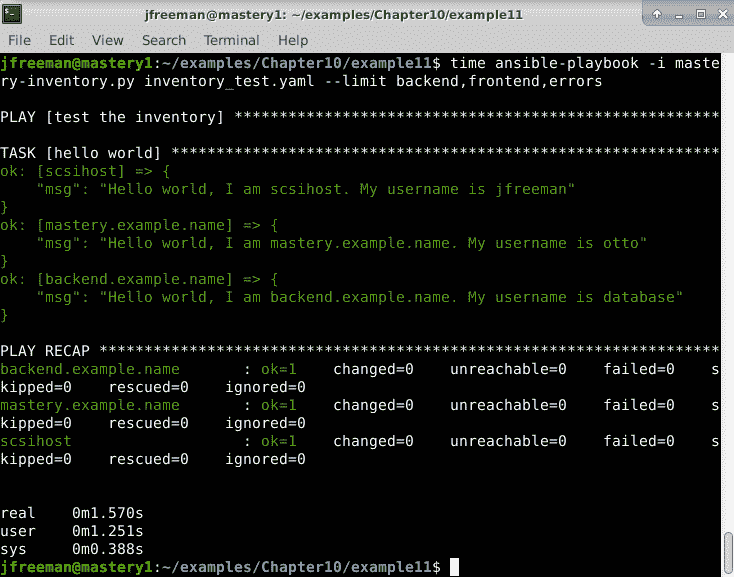

图 10.13-运行测试 playbook 针对我们的动态清单脚本

正如你所看到的，我们得到了我们期望的主机，我们得到了`master.example.name`的默认`ssh`用户。`backend.example.name`和`scsihost`分别显示了它们特定于主机的`ssh`用户名。

### 优化脚本性能

使用这个清单脚本，当 Ansible 启动时，它将使用`--list`一次执行脚本来收集组数据。然后，Ansible 将再次使用`--host <hostname>`执行脚本，对于第一次调用中发现的每个主机。使用我们的脚本，这需要很少的时间，因为主机很少，我们的执行非常快。然而，在具有大量主机或需要较长时间运行的插件的环境中，收集清单数据可能是一个耗时的过程。幸运的是，有一个优化可以在`--list`调用的返回数据中进行，这将防止 Ansible 为每个主机重新运行脚本。主机特定的数据可以一次性返回到组数据返回中，放在名为`_meta`的顶级键内，它有一个名为`hostvars`的子键，其中包含具有主机变量和变量数据本身的所有主机的哈希。当 Ansible 在`--list`返回中遇到`_meta`键时，它将跳过`--host`调用，并假定所有主机特定的数据已经返回，可能节省大量时间！让我们修改我们的清单脚本，将主机变量返回到`_meta`中，然后在`--host`选项中创建一个错误条件，以显示`--host`没有被调用：

1.  首先，一旦所有的`hostvars`都使用与之前相同的算法构建起来，我们将在清单字典中添加`_meta`键，并在参数解析之前：

```
hostvars['scsihost'] = {'ansible_ssh_user': 'jfreeman'}
agghostvars = dict()
for outergroup in inventory:
    for grouphost in inventory[outergroup].get('hosts', {}):
        agghostvars[grouphost] = allgroupvars.copy()
        for group in inventory:
            if grouphost in inventory[group].get('hosts', {}):
                for childgroup in inventory:
                    if group in inventory[childgroup].get('children', {}):
                        agghostvars[grouphost].update(inventory[childgroup].get('vars', {}))
        for group in inventory:
            if grouphost in inventory[group].get('hosts', {}):
                agghostvars[grouphost].update(inventory[group].get('vars', {}))
        agghostvars[grouphost].update(hostvars.get(grouphost, {}))
inventory['_meta'] = {'hostvars': agghostvars}
parser = argparse.ArgumentParser(description='Simple Inventory')
```

接下来，我们将改变`--host`处理以引发异常：

```
elif args.host:
raise StandardError("You've been a bad person") 
```

1.  现在，我们将使用与之前相同的命令重新运行`inventory_test.yaml` playbook，以确保我们仍然得到正确的数据：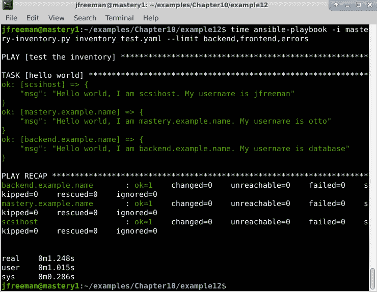

图 10.14-运行我们优化的动态清单脚本

1.  只是为了确保，我们将手动使用`--host`参数运行清单插件，以显示异常：

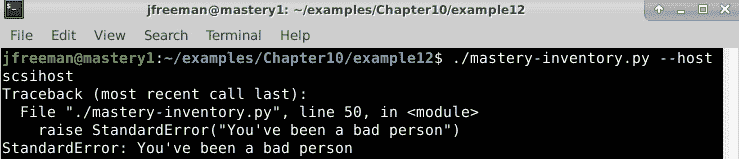

图 10.15 - 演示--host 参数在我们新优化的脚本上不起作用

通过这种优化，我们的简单 playbook，使用我们的清单模块，现在运行速度快了几个百分点，因为清单解析效率提高了。这在这里可能看起来不算什么，但是当扩展到更复杂的清单时，这将是显著的。

# 为 Ansible 项目做贡献

并非所有修改都需要符合本地站点的要求。Ansible 用户通常会发现可以对项目进行增强的地方，从而使其他人受益。这些增强可以通过集合进行贡献，在 Ansible 3.0 版本之后的新结构中，这很可能是大多数人最合适的途径。在这种情况下，您可以按照*第二章*中给出的指导，*从早期的 Ansible 版本迁移*，构建和发布一个集合。但是，如果您开发了下一个杀手级插件或过滤器，应该将其添加到`ansible-core`项目本身呢？在本节中，我们将看看您可以如何做到这一点。贡献可以是对现有内置模块或核心 Ansible 代码的更新，对文档的更新，新的过滤器或插件，或者仅仅是测试其他社区成员提出的贡献。

## 贡献提交

Ansible 项目使用 GitHub ([`github.com`](https://github.com))来管理代码存储库、问题和项目的其他方面。Ansible 组织([`github.com/ansible`](https://github.com/ansible))是代码存储库的所在地。主要存储库是`ansible`存储库（现在包含`ansible-core`代码），出于传统原因，它位于这里：[`github.com/ansible/ansible`](https://github.com/ansible/ansible)。这是`ansible-core`代码、内置模块和文档的所在地。这是应该分叉以开发贡献的存储库。

重要提示

Ansible 项目使用名为`devel`的开发分支，而不是传统的`master`名称。大多数贡献都针对`devel`分支或稳定发布分支。

### Ansible 存储库

Ansible 存储库的根目录下有几个文件和文件夹。这些文件主要是高级文档文件、代码许可证或持续集成测试平台配置。

其中一些目录值得注意：

+   `bin`：各种 ansible 核心可执行文件的源代码

+   `docs`：API 文档、[`docs.ansible.com`](https://docs.ansible.com)网站和主要页面的源代码

+   `hacking`：用于在 Ansible 源上进行黑客攻击的指南和实用程序

+   `lib/ansible`：核心 Ansible 源代码

+   `test`：单元测试和集成测试代码

对 Ansible 的贡献可能会出现在这些关键文件夹中的一个。

### 执行测试

在 Ansible 接受任何提交之前，更改必须通过测试。这些测试分为三类：单元测试、集成测试和代码风格测试。单元测试涵盖源代码功能的非常狭窄的方面，而集成测试则采用更全面的方法，确保所需的功能发生。代码风格测试检查使用的语法，以及空格和其他风格方面。

在执行任何测试之前，必须准备好与 Ansible 代码检出一起工作的 shell 环境。存在一个 shell 环境文件来设置所需的变量，可以使用以下命令激活：

```
    $ source ./hacking/env-setup
```

确保在进行修改之前通过测试可以节省大量的调试时间，因为`devel`分支是最前沿的，有可能已提交到该分支的代码未能通过所有测试。

#### 单元测试

所有单元测试都位于从`test/units`开始的目录树中。这些测试应该都是自包含的，不需要访问外部资源。运行测试就像从 Ansible 源代码检出的根目录执行`make tests`一样简单。这将测试大部分代码库，包括模块代码。

重要提示

执行测试可能需要安装其他软件。在使用 Python 虚拟环境管理 Python 软件安装时，最好创建一个新的`venv`用于测试 Ansible-一个没有安装 Ansible 的`venv`。

要运行特定的一组测试，可以直接调用`pytest`（有时作为`py.test`访问），并提供要测试的目录或特定文件的路径。在 Ubuntu Server 20.04 上，您可以使用以下命令安装此工具：

```
sudo apt install python3-pytest
```

假设您已经检出了`ansible-core`存储库代码，您可以使用以下命令仅运行`parsing`单元测试。请注意，其中一些测试需要您安装额外的 Python 模块，并且 Ansible 现在默认在 Python 3 下运行，因此您应始终确保安装和使用基于 Python 3 的模块和工具。以下命令可能不足以运行所有测试，但足以运行解析测试，并让您了解为准备运行包含的测试套件需要做的事情的类型：

```
sudo apt install python3-pytest python3-tz python3-pytest-mock
cd ansible
source ./hacking/env-setup
pytest-3 test/units/parsing
```

如果一切顺利，输出应如下所示，并显示任何警告和/或错误，以及最后的摘要：

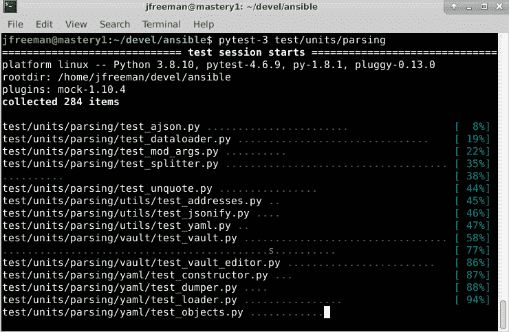

图 10.16 - 使用 Python 3 的 pytest 工具运行 ansible-core 源代码中包含的解析单元测试

正如您所看到的，`pytest-3`实用程序正在运行定义的单元测试，并将报告它发现的任何错误，这将极大地帮助您检查您可能计划提交的任何代码。在前面的截图中一切似乎都很顺利！

#### 集成测试

Ansible 集成测试是旨在验证 playbook 功能的测试。测试也是由 playbooks 执行的，这使得事情有点递归。测试被分为几个主要类别：

+   非破坏性

+   破坏性

+   遗留云

+   Windows

+   网络

这些测试类别的更详细解释可以在这里找到：[`docs.ansible.com/ansible/latest/dev_guide/testing_integration.html`](https://docs.ansible.com/ansible/latest/dev_guide/testing_integration.html)。

重要提示

许多集成测试需要`ssh`到 localhost 是可用的。请确保`ssh`正常工作，最好不需要密码提示。远程主机可以通过更改特定集成测试所需的清单文件来使用。例如，如果要运行`connection_ssh`集成测试，请确保查看`test/integration/targets/connection_ssh/test_connection.inventory`并根据需要进行更新。您可以自行探索此目录树，并找到可能需要更新的适当清单文件。

与单元测试一样，可以使用位于`bin/ansible-test`的`ansible-test`实用程序来执行单个集成测试。许多集成测试需要外部资源，例如计算机云帐户，再次，您需要探索文档和目录树，以确定您需要配置什么来在您的环境中运行这些测试。`test/integration/targets`中的每个目录都是可以单独测试的目标。让我们选择一个简单的示例来测试`ping`目标的 ping 功能。可以使用以下命令完成：

```
source ./hacking/env-setup
ansible-test integration --python 3.8 ping
```

请注意，我们已经专门设置了要针对的 Python 环境。这很重要，因为我的 Ubuntu Server 20.04 测试机安装了一些 Python 2.7，并且已经安装和配置了使用 Python 3.8 的 Ansible（也已经存在）。如果`ansible-test`工具使用 Python 2.7 环境，它可能会发现缺少模块，测试将失败，但这并不是因为我们的代码有错 - 而是因为我们没有正确设置环境。

当您运行`ansible-test`时，请确保知道您正在使用的 Python 环境，并相应地在命令中设置它。如果要针对另一个 Python 版本进行测试，您需要确保 Ansible 依赖的所有先决 Python 模块（如 Jinja2）都安装在该 Python 环境下。

成功的测试运行应该如下所示：

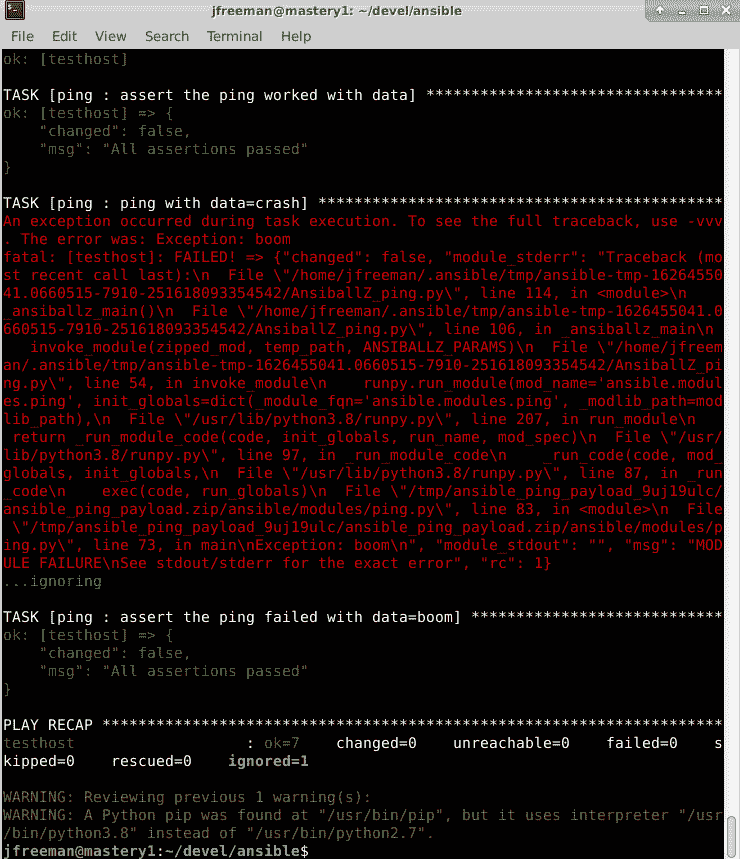

图 10.17 - 对 Python 3.8 环境运行 Ansible ping 集成测试

请注意，甚至在这个测试套件中设计了一个旨在失败的测试 - 最终，我们将看到`ok=7`和`failed=0`，意味着所有测试都通过了。可以通过以下命令执行一组大型的与 POSIX 兼容的非破坏性集成测试，这些测试由持续集成系统在对 Ansible 的建议更改上运行：

```
ansible-test integration shippable/ --docker fedora32
```

重要提示

为了确保一致和稳定的测试环境，这些测试在本地 Fedora 32 容器中运行。您需要确保 Docker 在您的测试主机上设置并可访问，以使此命令生效。

#### 代码风格测试

Ansible 测试的第三类是代码风格类别。这些测试检查 Python 文件中使用的语法，确保代码库中的外观统一。强制执行的代码风格由 PEP8 定义，这是 Python 的风格指南。更多信息请参见：[`docs.ansible.com/ansible/latest/dev_guide/testing/sanity/pep8.html`](https://docs.ansible.com/ansible/latest/dev_guide/testing/sanity/pep8.html)。这种风格是通过`pep8`健全性测试目标来强制执行的。要运行此测试，您必须为 Python 3 安装了`pycodestyle`模块。因此，您的命令可能如下所示：从您的 Ansible 源目录的根目录开始。

```
sudo apt install python3-pycodestyle
source ./hacking/env-setup
ansible-test sanity --test pep8
echo $?
```

如果没有错误，此目标不会输出任何文本；但是可以验证返回代码。退出代码为`0`表示没有错误，如下截图所示：

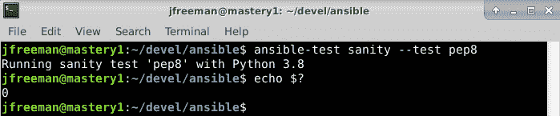

图 10.18 - 成功运行的 pep8 Python 代码风格测试

重要提示

正如您已经看到的，运行任何 Ansible 测试可能需要额外的 Python 模块 - 安装它们的方法会因系统而异，所需的模块也会因测试而异。这些通常可以通过使用`pip3`工具或本地操作系统包来安装，就像我们在这里所做的那样。

如果 Python 文件确实存在`pep8`违规，输出将反映违规 - 例如，我们将故意编辑`ansible.builtin.file`模块的代码，该模块可以在源代码根目录下的`lib/ansible/modules/file.py`中找到。我们将故意引入一些错误，比如带有空格的空行，并将一些至关重要的缩进空格替换为制表符，然后像之前一样重新运行测试。我们不需要重新安装 Python 模块或重新设置环境；此测试的输出将准确显示错误的位置，如下截图所示：

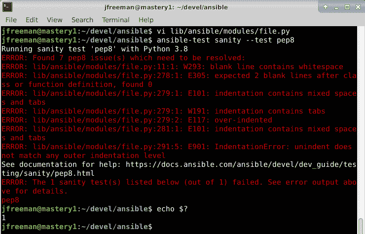

图 10.19 - 重新运行带有故意引入文件模块的 pep8 健全性测试

`pep8`错误将指示一个错误代码，可以查找详细的解释和指导，以及位置和文件名，甚至行号和列号，以帮助您快速定位和纠正问题。

### 发起拉取请求

一旦所有测试都通过了，就可以提交。Ansible 项目使用 GitHub 拉取请求来管理提交。要创建拉取请求，您的更改必须提交并推送到 GitHub。开发者使用他们账户下的 Ansible 存储库的分支来推送建议的更改。

一旦推送，可以使用 GitHub 网站打开拉取请求。这将创建拉取请求，开始持续集成测试，并通知审阅者有一个新的提交。有关 GitHub 拉取请求的更多信息，请访问[`docs.github.com/en/github/collaborating-with-pull-requests`](https://docs.github.com/en/github/collaborating-with-pull-requests)。

一旦拉取请求打开，审阅者将对拉取请求进行评论，要么要求更多信息，要么建议更改，要么批准更改。对于新的模块提交，建议您使用集合路线，但如果您希望进一步探索，这里有大量有价值的信息可供开发者使用：[`docs.ansible.com/ansible/latest/dev_guide/index.html`](https://docs.ansible.com/ansible/latest/dev_guide/index.html)。

经过接受的提交将在下一个 Ansible 版本中普遍可用。这结束了我们对向 Ansible 项目贡献代码和对 Ansible 进行扩展的章节的讨论。希望本章能给您一些想法和灵感，让您能够在 Ansible 提供的优秀基础上解决自动化挑战。

# 摘要

Ansible 是一个很好的工具；然而，有时它并不能提供您所需的所有功能。并非所有功能都适合提交到`ansible-core`项目，也不可能为自定义专有数据源提供定制集成，因为每种情况都不同。因此，Ansible 内部有许多设施来扩展其功能。通过共享的模块基础代码，创建和使用自定义模块变得非常容易。可以创建许多不同类型的插件，并与 Ansible 一起使用，以各种方式影响操作。除了 Ansible 发布集合提供的清单源之外，仍然可以相对轻松和高效地使用其他清单源。

在本章中，您学习了开发模块并将其包含在 playbooks 中。然后，您了解了通过插件扩展 Ansible，并详细介绍了创建动态清单插件的具体细节。最后，您学会了如何向 Ansible 项目贡献代码，以增强整个社区的代码。总之，您学会了，在所有情况下，都有机制可以在 playbooks 和依赖于增强功能的角色旁边提供模块、插件和清单源，使其无缝分发。这使得几乎可以无限地扩展或定制 Ansible 以满足您的需求，并且如果需要，可以轻松地为更广泛的社区做出贡献。

在*第十二章*，*基础设施配置*中，我们将探讨使用 Ansible 创建要管理的基础设施。

# 问题

1.  对于 3.0 之后的 Ansible 版本，您几乎总是会开发一个新模块，并通过以下哪种方式分发？

a) `ansible-core`项目。

b) 您的集合。

c) 与项目维护者批准的现有集合功能重叠。

d) 一个角色。

e) 只有 b、c，也许 d

1.  开发自定义模块的最简单方法是用哪种语言编写？

a) Bash

b) Perl

c) Python

d) C++

1.  从自定义模块提供事实会做什么？

a) 节省您不需要注册输出到变量，然后使用`set_fact`。

b) 使您的代码具有更大的能力。

c) 帮助您调试您的代码。

d) 显示模块的运行方式。

1.  回调插件允许您做什么？

a) 帮助您调用其他 playbook。

b) 在关键操作点轻松改变 Ansible 的行为，而无需修改`ansible-core`代码。

c) 提供一种有效的方式来改变代码的状态。

d) 帮助您在运行时回调到您的 playbook。

1.  要分发插件，您应该把它们放在哪里？

a) 在与它们的功能相关的专门命名的目录中（例如，回调插件将放在`callback_plugins/`目录中）。

b) 在 Ansible 安装目录中。

c) 在`~/.ansible/plugins`下。

d) 无论在哪里，只要您在`ansible.cfg`中指定它们。

1.  动态清单插件应该用什么语言编写？

a) Python。

b) Bash。

c) C++。

d) 任何语言，只要输出以正确的 JSON 数据结构返回。

1.  动态清单插件应该解析哪两个命令行参数？

a) `--list` 和 `--hostname`

b) `--list` 和 `--host`

c) `--list-all` 和 `--hosts`

d) `--list` 和 `--server`

1.  动态清单性能可以通过做什么来提高？

a) 当传递`--list`参数时，在`_meta`键下返回所有特定于主机的数据。

b) 返回所有特定于主机的数据，无论传递了哪些参数。

c) 缓存脚本运行的输出。

d) 压缩输出数据以减少传输时间。

1.  如果您希望向`ansible-core`项目贡献代码，您应该通过以下哪种方法提交它？

a) 对项目提出的一张票，详细说明您的更改

b) 向 Red Hat 提交支持票

c) 一旦您的代码通过了所有包含的测试，就可以通过 GitHub 拉取请求提交。

d) 在 Twitter 上大声抱怨

1.  哪个实用程序用于启动和控制大部分 Ansible 代码测试？

a) `test-runner`

b) `integration-test`

c) Jenkins

d) `ansible-test`
