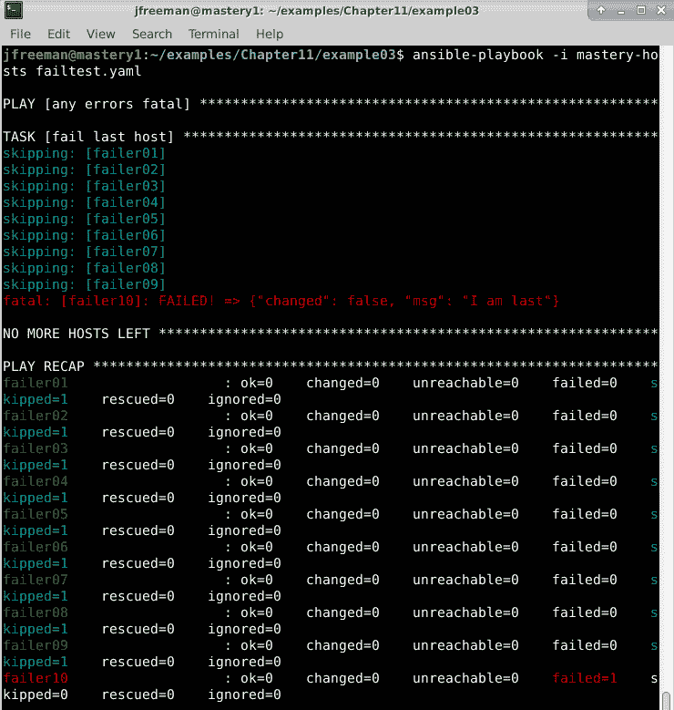
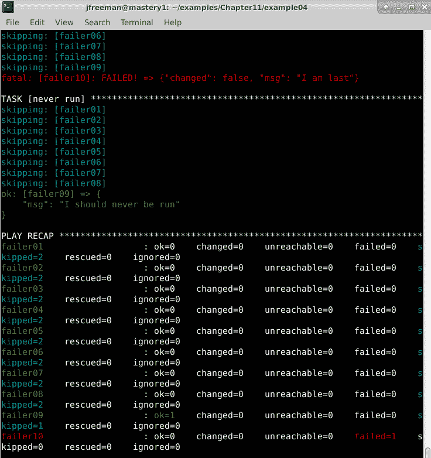
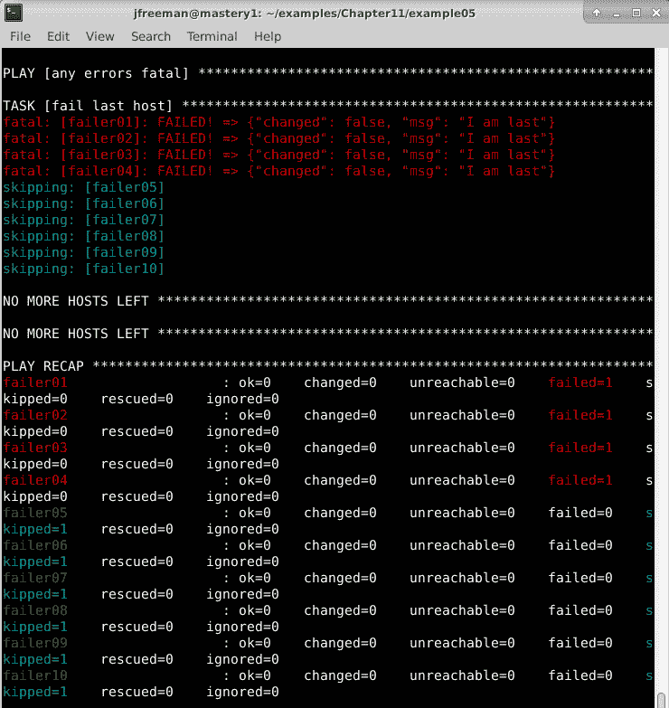
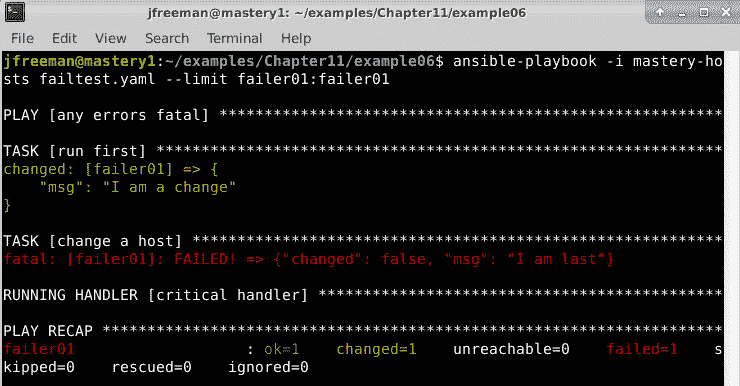
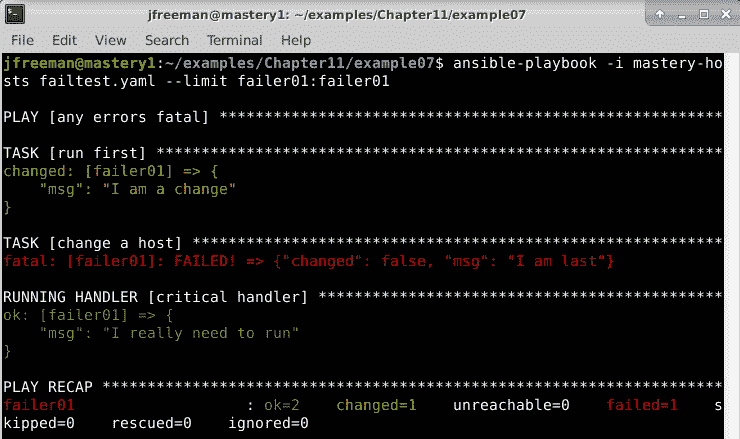
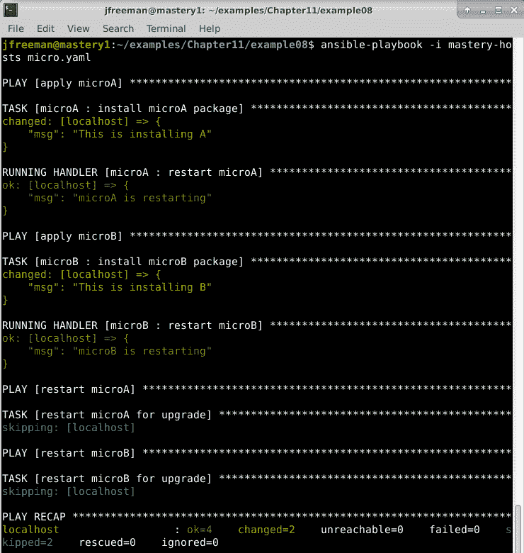
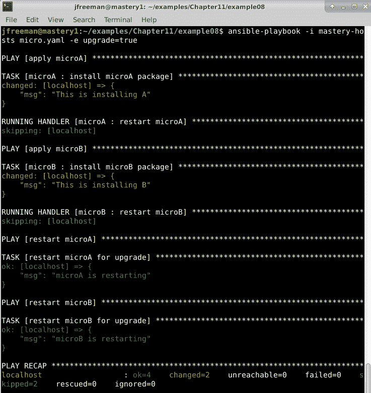
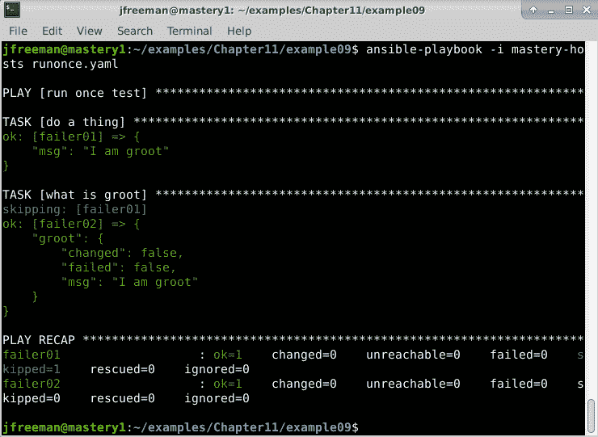
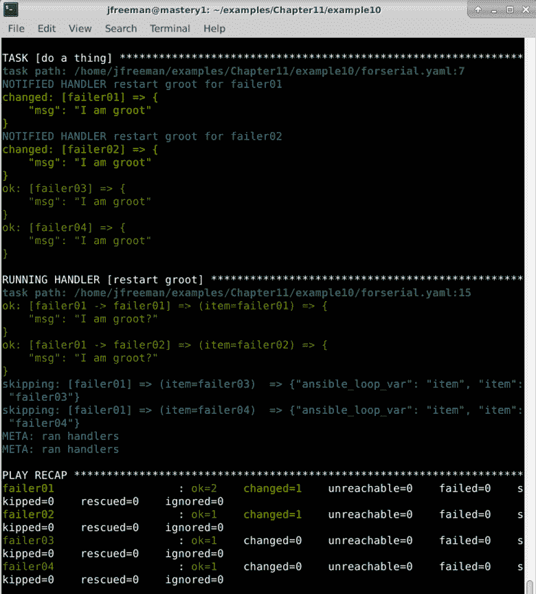

# 第十一章：通过滚动部署最小化停机时间

Ansible 非常适合在实时服务环境中升级或部署应用程序的任务。当然，可以采用多种不同的策略来处理应用程序的部署和升级。最佳方法取决于应用程序本身、应用程序运行的基础设施的能力以及与应用程序用户承诺的服务级别协议（SLA）。无论采用何种方法，都必须控制、可预测和可重复地进行应用程序部署或升级，以确保用户在自动部署后体验到稳定的服务。任何人都不希望由其自动化工具的意外行为导致中断；自动化工具应该是可信赖的，而不是额外的风险因素。

尽管有很多选择，但有些部署策略比其他策略更常见，在本章中，我们将介绍一些更常见的部署策略。在这样做的过程中，我们将展示在这些策略中有用的 Ansible 功能。我们还将讨论一些在两种部署策略中都常见的其他部署考虑因素。为了实现这一点，我们将在滚动 Ansible 部署的背景下深入讨论以下主题的细节：

+   原地升级

+   扩展和收缩

+   快速失败

+   最小化中断

+   串行单个任务

# 技术要求

要按照本章中提供的示例，您需要一台运行**Ansible 4.3**或更新版本的 Linux 机器。几乎任何 Linux 版本都可以使用——对于感兴趣的人，本章中提供的所有代码都是在**Ubuntu Server 20.04 长期支持版（LTS）**上测试的，除非另有说明，并且在 Ansible 4.3 上进行了测试。本章附带的示例代码可以从 GitHub 上下载：[`github.com/PacktPublishing/Mastering-Ansible-Fourth-Edition/tree/main/Chapter11`](https://github.com/PacktPublishing/Mastering-Ansible-Fourth-Edition/tree/main/Chapter11)。

查看以下视频，以查看代码的运行情况：[`bit.ly/3lZ6Y9W`](https://bit.ly/3lZ6Y9W)

# 原地升级

我们将要介绍的第一种部署类型是原地升级。这种部署方式在已经存在的基础设施上进行，以升级现有的应用程序。这种模式是一种传统模式，当创建新基础设施是一项耗时和昂贵的工作时使用。

在这种类型的升级过程中，最小化停机时间的一般设计模式是将应用程序部署在多个主机上，负载平衡器后面。负载平衡器将充当应用程序用户和运行应用程序的服务器之间的网关。应用程序的请求将发送到负载平衡器，根据配置，负载平衡器将决定将请求发送到哪个后端服务器。

要执行使用此模式部署的应用程序的滚动原地升级，将禁用每个服务器（或一小部分服务器）在负载平衡器上，进行升级，然后重新启用以接受新请求。这个过程将重复进行，直到池中的其余服务器都升级完毕。由于只有部分可用的应用程序服务器被下线进行升级，整个应用程序仍然可用于请求。当然，这假设应用程序可以在同时运行的不同版本下表现良好。

让我们创建一个用于升级虚构应用程序的 playbook。我们的虚构应用程序将在`foo-app01`到`foo-app08`服务器上运行，这些服务器存在于`foo-app`组中。这些服务器将有一个简单的网站，通过`nginx` Web 服务器提供，内容来自`foo-app` Git 存储库，由`foo-app.repo`变量定义。一个运行`haproxy`软件的负载均衡器服务器`foo-lb`将为这些应用服务器提供前端服务。

为了在我们的`foo-app`服务器子集上操作，我们需要使用`serial`模式。这种模式改变了 Ansible 执行 play 的方式。默认情况下，Ansible 将按照任务列出的顺序在每个主机上执行 play 的任务。Ansible 在继续执行 play 中的下一个任务之前，会在每个主机上执行 play 的每个任务。如果我们使用默认方法，我们的第一个任务将从负载均衡器中移除每个服务器，这将导致我们的应用程序完全中断。相反，`serial`模式让我们可以在子集上操作，以便整个应用程序保持可用，即使一些成员处于离线状态。在我们的示例中，我们将使用`2`的串行计数，以保持大多数应用程序成员在线：

```
--- 
- name: Upgrade foo-app in place 
  hosts: foo-app 
  serial: 2 
```

重要提示

Ansible 2.2 引入了`serial`批处理的概念：一个可以增加每次通过 play 串行处理的主机数量的数字列表。这允许在信心增加时增加处理的主机数量。如果`serial`关键字提供了一组数字，那么提供的最后一个数字将是任何剩余批次的大小，直到清单中的所有主机都已完成。

现在，我们可以开始创建我们的任务。第一个任务将是从负载均衡器中禁用主机。负载均衡器运行在`foo-lb`主机上；但是，我们正在操作`foo-app`主机。因此，我们需要使用`delegate_to`任务运算符委派任务。该运算符重定向 Ansible 将连接到以执行任务的位置，但它保留了原始主机的所有变量上下文。我们将使用`community.general.haproxy`模块来禁用当前主机的`foo-app`后端池。代码如下所示：

```
  tasks: 
  - name: disable member in balancer 
    community.general.haproxy: 
      backend: foo-app 
      host: "{{ inventory_hostname }}" 
      state: disabled 
    delegate_to: foo-lb 
```

在主机禁用的情况下，我们现在可以更新`foo-app`内容。我们将使用`ansible.builtin.git`模块将所需版本定义为`foo-version`的内容路径进行更新。我们将为此任务添加一个`notify`处理程序，以便在内容更新导致更改时重新加载`nginx`服务器。这种重启可以每次都进行，但我们也将其用作`notify`的示例用法。您可以在下面的代码片段中查看代码：

```
  - name: pull stable foo-app 
    ansible.builtin.git: 
      repo: "{{ foo-app.repo }}" 
      dest: /srv/foo-app/ 
      version: "{{ foo-version }}" 
    notify: 
      - reload nginx 
```

我们的下一步将是重新启用负载均衡器中的主机；但是，如果我们下一步执行该任务，我们会将旧版本放回原位，因为我们的通知处理程序尚未运行。因此，我们需要通过`meta: flush_handlers`调用提前触发我们的处理程序，你在*第十章*中学到了这一点，*扩展 Ansible*。你可以在这里再次看到这一点：

```
  - meta: flush_handlers 
```

现在，我们可以重新启用负载均衡器中的主机。我们可以立即启用它，并依赖负载均衡器等待主机健康后再发送请求。但是，由于我们正在使用较少数量的可用主机，我们需要确保所有剩余的主机都是健康的。我们可以利用`ansible.builtin.wait_for`任务来等待`nginx`服务再次提供连接。`ansible.builtin.wait_for`模块将等待端口或文件路径上的条件。在下面的示例中，我们将等待端口`80`，并且端口应该在其中的条件。如果它已启动（默认情况下），这意味着它正在接受连接：

```
  - name: ensure healthy service 
    ansible.builtin.wait_for: 
      port: 80 
```

最后，我们可以重新启用`haproxy`中的成员。再次，我们将将任务委派给`foo-lb`，如下面的代码片段所示：

```
  - name: enable member in balancer 
    community.general.haproxy: 
      backend: foo-app 
      host: "{{ inventory_hostname }}" 
      state: enabled 
    delegate_to: foo-lb 
```

当然，我们仍然需要定义我们的`reload nginx`处理程序。我们可以通过运行以下代码来实现这一点：

```
  handlers: 
  - name: reload nginx 
    ansible.builtin.service: 
      name: nginx 
      state: restarted 
```

当运行此剧本时，现在将执行我们应用程序的滚动就地升级。当然，并不总是希望进行就地升级 - 总是有可能会影响服务，特别是如果服务遇到意外负载。在下一节中，将探讨一种可以防止这种情况发生的替代策略，即扩张和收缩。

# 扩张和收缩

扩张和收缩策略是对就地升级策略的一种替代方案。由于自助服务性质的按需基础设施（如云计算或虚拟化池）的流行，这种策略近来变得流行起来。可以从大量可用资源池中按需创建新服务器的能力意味着每次应用程序的部署都可以在全新的系统上进行。这种策略避免了一系列问题，例如长时间运行系统上的积累问题，例如以下问题：

+   不再由 Ansible 管理的配置文件被遗留下来

+   后台运行的进程消耗资源

+   对服务器进行人工手动更改而不更新 Ansible 剧本

每次重新开始也消除了初始部署和升级之间的差异。可以使用相同的代码路径，减少升级应用程序时出现意外的风险。这种类型的安装也可以使回滚变得非常容易，如果新版本的表现不如预期。除此之外，随着新系统被创建来替换旧系统，在升级过程中应用程序不需要降级。

让我们重新使用扩张和收缩策略来重新处理我们之前的升级剧本。我们的模式将是创建新服务器，部署我们的应用程序，验证我们的应用程序，将新服务器添加到负载均衡器，并从负载均衡器中删除旧服务器。让我们从创建新服务器开始。在这个例子中，我们将利用 OpenStack 计算云来启动新实例：

```
--- 
- name: Create new foo servers 
  hosts: localhost 

  tasks: 
  - name: launch instances
    openstack.cloud.os_server:
      name: foo-appv{{ version }}-{{ item }}
      image: foo-appv{{ version }}
      flavor: 4
      key_name: ansible-prod
      security_groups: foo-app
      auto_floating_ip: false
      state: present
      auth:
        auth_url: https://me.openstack.blueboxgrid.com:5001/v2.0
        username: jlk
        password: FAKEPASSW0RD
        project_name: mastery
    register: launch
    loop: "{{ range(1, 8 + 1, 1)|list }}"
```

在这个任务中，我们正在循环遍历`8`的计数，使用在 Ansible 2.5 中引入的新的`loop`和`range`语法。对于循环的每次迭代，`item`变量将被一个数字替换。这使我们能够创建基于应用程序版本和循环次数的八个新服务器实例。我们还假设有一个预构建的镜像，这样我们就不需要对实例进行任何进一步的配置。为了在将来的剧本中使用这些服务器，我们需要将它们的详细信息添加到清单中。为了实现这一点，我们将运行结果注册到`launch`变量中，然后使用它来创建运行时清单条目。代码如下所示：

```
  - name: add hosts 
    ansible.builtin.add_host: 
      name: "{{ item.openstack.name }}" 
      ansible_ssh_host: "{{ item.openstack.private_v4 }}" 
      groups: new-foo-app 
    loop: launch.results 
```

此任务将创建具有与我们服务器实例相同名称的新清单项目。为了帮助 Ansible 知道如何连接，我们将`ansible_ssh_host`设置为云提供商分配给实例的**IP**地址（假设该地址可以被运行 Ansible 的主机访问）。最后，我们将主机添加到`new-foo-app`组中。由于我们的`launch`变量来自一个带有循环的任务，我们需要通过访问`results`键来迭代该循环的结果。这使我们能够循环遍历每个`launch`操作以访问特定于该任务的数据。

接下来，我们将在服务器上操作，以确保新服务已经准备好供使用。我们将再次使用`ansible.builtin.wait_for`，就像之前一样，作为在`new-foo-app`组上操作的新任务的一部分。代码如下所示：

```
- name: Ensure new app 
  hosts: new-foo-app 
  tasks: 
    - name: ensure healthy service 
      ansible.builtin.wait_for: 
        port: 80 
```

一旦它们都准备就绪，我们可以重新配置负载均衡器以利用我们的新服务器。为了简单起见，我们将假设`haproxy`配置的模板期望`new-foo-app`组中的主机，并且最终的结果将是一个了解我们的新主机并忘记我们的旧主机的配置。这意味着我们可以在负载均衡器系统本身上简单地调用`ansible.builtin.template`任务，而不是尝试操纵负载均衡器的运行状态。代码如下所示：

```
- name: Configure load balancer 
  hosts: foo-lb 
  tasks:
  - name: haproxy config
    ansible.builtin.template:
      dest: /etc/haproxy/haproxy.cfg
      src: templates/etc/haproxy/haproxy.cfg
  - name: reload haproxy
    ansible.builtin.service:
      name: haproxy
      state: reloaded
```

一旦新的配置文件就位，我们可以重新加载`haproxy`服务。这将解析新的配置文件并为新的传入连接启动一个新的监听进程。现有的连接最终会关闭，旧进程将终止。所有新的连接将被路由到运行我们新应用程序版本的新服务器。

这个 playbook 可以扩展到退役旧版本的服务器，或者当决定不再需要回滚到旧版本时，该操作可能会在不同的时间发生。

扩展和收缩策略可能涉及更多的任务，甚至为创建一个黄金镜像集而单独创建 playbooks，但是每次发布都为新基础架构带来的好处远远超过了额外的任务或创建后删除的复杂性。

# 快速失败

在升级应用程序时，可能希望在出现错误的迹象时完全停止部署。具有混合版本的部分升级系统可能根本无法工作，因此在留下失败的系统的同时继续部分基础架构可能会导致重大问题。幸运的是，Ansible 提供了一种机制来决定何时达到致命错误的情况。

默认情况下，当 Ansible 通过 playbook 运行并遇到错误时，它将从 play 主机列表中删除失败的主机，并继续执行任务或 play。当所有 play 的请求主机都失败或所有 play 都已完成时，Ansible 将停止执行。要更改此行为，可以使用一些 play 控件。这些控件是`any_errors_fatal`，`max_fail_percentage`和`force_handlers`，下面将讨论这些控件。

## any_errors_fatal 选项

此设置指示 Ansible 将整个操作视为致命错误，并在任何主机遇到错误时立即停止执行。为了演示这一点，我们将编辑我们的`mastery-hosts`清单，定义一个可以扩展到 10 个新主机的模式，如下面的代码片段所示：

```
[failtest] 
failer[01:10] 
```

然后，我们将在这个组上创建一个 play，将`any_errors_fatal`设置为`true`。我们还将关闭事实收集，因为这些主机不存在。代码如下所示：

```
--- 
- name: any errors fatal 
  hosts: failtest 
  gather_facts: false 
  any_errors_fatal: true 
```

我们希望有一个任务会对其中一个主机失败，但不会对其他主机失败。然后，我们还希望有第二个任务，仅仅是为了演示它不会运行。这是我们需要执行的代码：

```
  tasks: 
  - name: fail last host
    ansible.builtin.fail:
      msg: "I am last"
    when: inventory_hostname == play_hosts[-1]
  - name: never run
    ansible.builtin.debug:
      msg: "I should never be run"
    when: inventory_hostname == play_hosts[-1]
```

然后，我们将使用以下命令执行 playbook：

```
ansible-playbook -i mastery-hosts failtest.yaml
```

当我们这样做时，我们会看到一个主机失败，但整个 play 将在第一个任务后停止，并且`ansible.builtin.debug`任务从未尝试，如下面的屏幕截图所示：



图 11.1 - 当清单中的一个主机失败时提前失败整个 playbook

我们可以看到只有一个主机失败；但是，Ansible 报告了`NO MORE HOSTS LEFT`（暗示所有主机都失败了），并在进入下一个 play 之前中止了 playbook。

## max_fail_percentage 选项

这个设置允许 play 开发人员定义可以失败的主机的百分比，然后整个操作就会中止。在每个任务结束时，Ansible 将进行计算，以确定 play 所针对的主机中达到失败状态的数量，如果该数量大于允许的数量，Ansible 将中止 playbook。这类似于`any_errors_fatal`；实际上，`any_errors_fatal`内部只是表示`max_fail_percentage`参数为`0`，其中任何失败都被视为致命。让我们编辑上一节的 play，并删除`any_errors_fatal`，将其替换为设置为`20`的`max_fail_percentage`参数，如下所示：

```
--- 
- name: any errors fatal 
  hosts: failtest 
  gather_facts: false 
  max_fail_percentage: 20 
```

通过进行这种更改并使用与之前相同的命令运行我们的 playbook，我们的 play 应该能够完成两个任务而不会中止，如下面的截图所示：



图 11.2 - 演示我们之前的失败测试 playbook 在失败主机少于 20％的情况下继续进行

现在，如果我们更改我们第一个任务的条件，以便故意在超过`20`％的主机上失败，我们将看到 playbook 提前中止：

```
  - name: fail last host
    ansible.builtin.fail:
      msg: "I am last"
    when: inventory_hostname in play_hosts[0:3]
```

我们故意设置三个主机失败，这将使我们的失败率超过`20`％。 `max_fail_percentage`设置是允许的最大值，因此我们的设置为`20`将允许十个主机中的两个失败。由于有三个主机失败，我们将在第二个任务被允许执行之前看到致命错误，如下面的截图所示：



图 11.3 - 当百分比超过限制时，演示 max_fail_percentage 操作导致 play 失败

通过这些参数的组合，我们可以轻松设置和控制一组主机上的**快速失败**条件，这在 Ansible 部署期间维护环境的完整性方面非常有价值。

## 强制处理程序

通常，当 Ansible 失败时，它会停止在该主机上执行任何操作。这意味着任何未决的处理程序都不会运行。这可能是不希望的，有一个 play 控制可以强制 Ansible 处理失败的主机的未决处理程序。这个 play 控制是`force_handlers`，必须设置为`true`布尔值。

让我们稍微修改上一个示例，以演示这个功能。我们将删除我们的`max_fail_percentage`参数，并添加一个新的第一个任务。我们需要创建一个任务，它将返回成功的更改。这可以通过`ansible.builtin.debug`模块实现，使用`changed_when`任务控制，因为这个模块否则永远不会注册更改。我们将将我们的`ansible.builtin.fail`任务条件恢复到原始状态。代码如下所示：

```
--- 
- name: any errors fatal 
  hosts: failtest 
  gather_facts: false 
  tasks:
  - name: run first
    ansible.builtin.debug:
      msg: "I am a change"
    changed_when: true
    when: inventory_hostname == play_hosts[-1]
    notify: critical handler
  - name: change a host
    ansible.builtin.fail:
      msg: "I am last"
    when: inventory_hostname == play_hosts[-1] 
```

我们的第三个任务保持不变，但我们将定义我们的关键处理程序，如下所示：

```
  - name: never run
    ansible.builtin.debug:
      msg: "I should never be run"
    when: inventory_hostname == play_hosts[-1]
  handlers:
    - name: critical handler
      ansible.builtin.debug:
        msg: "I really need to run"
```

让我们运行这个新的 play 来展示处理程序不被执行的默认行为。为了减少输出，我们将限制执行到其中一个主机，使用以下命令：

```
ansible-playbook -i mastery-hosts failtest.yaml --limit failer01:failer01
```

请注意，尽管处理程序在 play 输出中被引用，但实际上并没有运行，这可以从缺少任何调试消息来证明，如下面的截图清楚地显示：



图 11.4 - 演示即使在 play 失败时也不运行处理程序的情况

现在，我们添加`force_handlers` play 控制并将其设置为`true`，如下所示：

```
---
- name: any errors fatal
  hosts: failtest
  gather_facts: false
  force_handlers: true
```

这次，当我们运行 playbook（使用与之前相同的命令）时，我们应该看到即使对于失败的主机，处理程序也会运行，如下面的截图所示：



图 11.5-演示处理程序可以被强制运行，即使在失败的 play 中也是如此

重要提示

强制处理程序也可以是一个运行时决定，可以在`ansible-playbook`上使用`--force-handlers`命令行参数。它也可以作为`ansible.cfg`中的参数进行全局设置。

强制处理程序运行对于重复的 playbook 运行非常有用。第一次运行可能会导致一些更改，但如果在刷新处理程序之前遇到致命错误，那些处理程序调用将丢失。重复运行不会导致相同的更改，因此处理程序将永远不会在没有手动交互的情况下运行。强制处理程序可以确保这些处理程序调用不会丢失，因此无论任务结果如何，处理程序始终会运行。当然，任何升级策略的整体目标是尽可能降低对任何给定服务的影响-您能想象您最喜欢的零售网站因为有人升级软件而宕机吗？在当今这个时代是不可想象的！在下一节中，我们将探讨使用 Ansible 来最小化潜在的破坏性行为的方法。

# 最小化中断

在部署过程中，通常有一些可以被视为具有破坏性或破坏性的任务。这些任务可能包括重新启动服务，执行数据库迁移等。破坏性任务应该被集中在一起，以最小化对应用程序的整体影响，而破坏性任务应该只执行一次。接下来的两个小节将探讨如何使用 Ansible 来实现这两个目标。

## 延迟中断

重新启动服务以适应新的配置或代码版本是一个非常常见的需求。当单独查看时，只要应用程序的代码和配置发生了变化，就可以重新启动单个服务，而不必担心整个分布式系统的健康状况。通常，分布式系统将为系统的每个部分分配角色，每个角色将在目标主机上独立运行。首次部署应用程序时，无需担心整个系统的运行时间，因此可以随意重新启动服务。然而，在升级过程中，可能希望延迟所有服务的重新启动，直到每个服务都准备就绪，以最小化中断。

强烈鼓励重用角色代码，而不是设计完全独立的升级代码路径。为了适应协调的重启，特定服务的角色代码需要在服务重新启动周围进行保护。一个常见的模式是在破坏性任务上放置一个条件语句，检查变量的值。在执行升级时，可以在运行时定义变量以触发这种替代行为。这个变量也可以在主 playbook 完成所有角色后触发协调的服务重启，以便对中断进行集群化处理并最小化总的中断时间。

让我们创建一个虚构的应用程序升级，其中涉及两个角色，模拟服务的重新启动。我们将这些角色称为`microA`和`microB`。代码如下所示：

```
roles/microA 
├── handlers 
│   └── main.yaml 
└── tasks 
    └── main.yaml 
roles/microB 
├── handlers 
│   └── main.yaml 
└── tasks 
    └── main.yaml 
```

对于这两个角色，我们将有一个简单的调试任务，模拟安装软件包。我们将通知一个处理程序来模拟服务的重新启动，并确保处理程序将触发，我们将强制任务始终注册为更改。以下代码片段显示了`roles/microA/tasks/main.yaml`的内容：

```
--- 
- name: install microA package 
  ansible.builtin.debug: 
    msg: "This is installing A" 
  changed_when: true 
  notify: restart microA 
```

`roles/microB/tasks/main.yaml`的内容如下所示：

```
---
- name: install microB package
  ansible.builtin.debug:
    msg: "This is installing B"
  changed_when: true
  notify: restart microB
```

这些角色的处理程序也将是调试操作，并且我们将附加一个条件语句到处理程序任务，只有当升级变量评估为`false`布尔值时才重新启动。我们还将使用默认过滤器为这个变量赋予默认值`false`。`roles/microA/handlers/main.yaml`的内容如下所示：

```
--- 
- name: restart microA 
  ansible.builtin.debug: 
    msg: "microA is restarting" 
  when: not upgrade | default(false) | bool 
```

`roles/microB/handlers/main.yaml`的内容如下所示：

```
---
- name: restart microB
  ansible.builtin.debug:
    msg: "microB is restarting"
  when: not upgrade | default(false) | bool
```

对于我们的顶层 playbook，我们将创建四个 play（记住 playbook 可以由一个或多个 play 组成）。前两个 play 将应用每个微服务角色，最后两个 play 将进行重新启动。只有在执行升级时，最后两个 play 才会被执行；因此，它们将使用`upgrade`变量作为条件。让我们看一下以下代码片段（名为`micro.yaml`）：

```
---
- name: apply microA
  hosts: localhost
  gather_facts: false
  roles:
  - role: microA
- name: apply microB
  hosts: localhost
  gather_facts: false
  roles:
  - role: microB
- name: restart microA
  hosts: localhost
  gather_facts: false
  tasks:
  - name: restart microA for upgrade
    ansible.builtin.debug:
      msg: "microA is restarting"
    when: upgrade | default(false) | bool
- name: restart microB
  hosts: localhost
  gather_facts: false
  tasks:
  - name: restart microB for upgrade
    ansible.builtin.debug:
      msg: "microB is restarting"
    when: upgrade | default(false) | bool
```

我们在不定义`upgrade`变量的情况下执行这个 playbook，使用以下命令：

```
ansible-playbook -i mastery-hosts micro.yaml
```

当我们这样做时，我们将看到每个角色的执行，以及其中的处理程序。最后两个 play 将有跳过的任务，如下截图所示：



图 11.6 - 演示了安装微服务架构的基于角色的 playbook

现在，让我们再次执行 playbook；这次，我们将在运行时将`upgrade`变量定义为`true`，使用`-e`标志如下：

```
ansible-playbook -i mastery-hosts micro.yaml -e upgrade=true
```

这次，结果应该是这样的：



图 11.7 - 演示相同的 playbook，但在升级场景中所有重新启动都集中在最后

这次，我们可以看到我们的处理程序被跳过，但最后两个 play 有执行的任务。在一个真实的场景中，在`microA`和`microB`角色中发生了更多的事情（可能还有其他主机上的其他微服务角色），这种差异可能会达到几分钟甚至更长。将重新启动集中在最后可以显著减少中断时间。

## 仅运行破坏性任务一次

破坏性任务有很多种。它们可以是极其难以回滚的单向任务，无法轻易重新运行的一次性任务，或者如果并行执行会导致灾难性失败的竞争条件任务。因此，非常重要的是这些任务只能从单个主机执行一次。Ansible 通过`run_once`任务控制提供了一种实现这一点的机制。

`run_once`任务控制将确保任务只从单个主机执行一次，而不管 play 中有多少个主机。虽然还有其他方法可以实现这个目标，比如使用条件语句使任务只在 play 的第一个主机上执行，但`run_once`控制是表达这个愿望最简单直接的方式。此外，从`run_once`控制的任务注册的任何变量数据将对 play 的所有主机可用，而不仅仅是由 Ansible 选择执行操作的主机。这可以简化后续变量数据的检索。

让我们创建一个示例 playbook 来演示这个功能。我们将重用之前创建的`failtest`主机，以便有一个主机池，然后我们将通过主机模式选择其中的两个。我们将创建一个设置为`run_once`的`ansible.builtin.debug`任务并注册结果，然后我们将在不同的任务中使用不同的主机访问结果。代码如下：

```
--- 
- name: run once test 
  hosts: failtest[0:1] 
  gather_facts: false 

  tasks: 
  - name: do a thing
    ansible.builtin.debug:
      msg: "I am groot"
    register: groot
    run_once: true
  - name: what is groot
    ansible.builtin.debug:
      var: groot
    when: inventory_hostname == play_hosts[-1]
```

我们使用以下命令运行这个 play：

```
ansible-playbook -i mastery-hosts runonce.yaml
```

当我们这样做时，我们将特别关注每个任务操作中列出的主机名，如下截图所示：



图 11.8 - 演示了使用 run_once 任务参数以及在剧本中的其他主机上可用的变量数据的使用

我们可以看到`do a thing`任务在`failer01`主机上执行，而检查来自`do a thing`任务的数据的`what is groot`任务在`failer02`主机上操作。当然，通过使用我们在这里讨论的技术，您可以减少对生产服务的干扰风险，还有更多的事情可以做，比如限制任务运行的次数或运行的主机数量。我们将在本章的下一节中探讨这个话题。

# 序列化单个任务

运行多个服务副本的某些应用程序可能对所有这些服务同时重新启动作出不良反应。通常，在升级此类应用程序时，会使用`serial`剧本。但是，如果应用程序规模足够大，序列化整个剧本可能会非常低效。可以使用不同的方法，即仅对敏感任务（通常是重新启动服务的处理程序）进行序列化。

要对特定的处理程序任务进行序列化，我们可以使用内置变量`play_hosts`。该变量保存应作为剧本的一部分用于给定任务的主机列表。它会随着失败或不可达的主机而更新。使用此变量，我们可以构建一个循环，以便遍历每个可能运行处理程序任务的主机。我们将使用`when`条件和`delegate_to`指令中的`item`值，而不是在模块参数中使用`item`值。通过这种方式，剧本中通知的处理程序任务可以被委派到上述循环中的主机，而不是原始主机。但是，如果我们将其作为`loop`指令的列表使用，我们将会为触发处理程序的每个主机执行任务。这显然是不希望的，因此我们可以使用任务指令`run_once`来改变行为。`run_once`指令指示 Ansible 仅为一个主机执行任务，而不是通常会目标的每个主机。结合`run_once`和我们的`play_hosts`循环，就会创建一种情况，即 Ansible 只会通过循环运行一次。最后，我们希望在每个循环之间等待一小段时间，以便重新启动的服务在我们重新启动下一个服务之前可以正常运行。我们可以使用一个名为`pause`的`loop_control`参数（在 Ansible 版本 2.2 中引入）在循环的每次迭代之间插入暂停。

为了演示这种序列化的工作原理，我们将编写一个使用我们`failtest`组中的一些主机的剧本，其中包含一个创建更改并注册输出的任务，以便我们可以在我们通知的处理程序任务中检查此输出，称为`restart groot`。然后我们在剧本底部创建一个序列化的处理程序任务本身。代码如下所示：

```
--- 
- name: parallel and serial 
  hosts: failtest[0:3] 
  gather_facts: false 

  tasks: 
  - name: do a thing
    ansible.builtin.debug:
      msg: "I am groot"
    changed_when: inventory_hostname in play_hosts[0:2]
    register: groot
    notify: restart groot
  handlers:
  - name: restart groot
    debug:
      msg: "I am groot?"
    loop: "{{ play_hosts }}"
    delegate_to: "{{ item }}"
    run_once: true
    when: hostvars[item]['groot']['changed'] | bool
    loop_control:
      pause: 2
```

在执行此剧本时，我们可以看到处理程序通知（通过使用以下命令进行双重详细度）：

```
ansible-playbook -i mastery-hosts forserial.yaml -vv
```

在处理程序任务中，我们可以看到循环、条件和委托，如下面的屏幕截图所示：



图 11.9 - 一个带有序列化处理程序路由的剧本，用于重新启动服务

如果您自己尝试了这段代码，您会注意到每个处理程序运行之间的延迟，就像我们在任务的`loop_control`部分中指定的那样。使用这些技术，您可以自信地推出更新和升级到您的环境，同时将干扰降到最低。希望本章为您提供了在您的环境中自信地执行此类操作的工具和技术。

# 总结

部署和升级策略是一种品味。每种策略都有明显的优势和劣势。Ansible 不会对哪种更好发表意见，因此它非常适合执行部署和升级，无论采用哪种策略。Ansible 提供了功能和设计模式，可以轻松地促进各种风格。了解每种策略的性质以及如何调整 Ansible 以适应该策略将使你能够决定并设计每个应用的部署。任务控制和内置变量提供了有效升级大规模应用程序的方法，同时小心处理特定任务。

在本章中，你学会了如何使用 Ansible 进行就地升级以及一些不同的方法论，包括扩展和收缩环境等技术。你了解了快速失败以确保 playbook 在 play 的早期出现问题时不会造成严重损害，以及如何最小化破坏性和破坏性行为。最后，你学会了对单个任务进行串行化，以最小化对正在运行的服务的干扰，通过以最小受控的方式将节点脱离服务来确保服务在维护工作（如升级）进行时仍然保持运行。这确保了服务在维护工作（如升级）进行时仍然保持运行。

在下一章中，我们将详细介绍如何使用 Ansible 与云基础设施提供商和容器系统合作，以创建一个用于管理的基础设施。

# 问题

1.  在进行就地升级时，最小化干扰的有效策略是什么？

a) 使用`serial`模式来改变 Ansible 一次执行升级的主机数量。

b) 使用`limit`参数来改变 Ansible 一次执行升级的主机数量。

c) 拥有许多小清单，每个清单中只有少量主机。

d) 撤销 Ansible 对主机的访问权限。

1.  扩展和收缩作为升级策略的一个关键好处是什么？

a) 减少云操作成本。

b) 它与**开发运维**（DevOps）文化相契合。

c) 每次应用部署或升级都会为所有主机新建，减少了过期库和配置的可能性。

d) 它为升级的方法提供了灵活性。

1.  为什么你想要快速失败？

a) 这样你就可以尽快了解你的 playbook 错误。

b) 这样你就可以最小化失败 play 造成的损害或中断。

c) 这样你就可以调试你的代码。

d) 这样你就可以在部署中灵活应对。

1.  你会使用哪个 Ansible play 选项来确保你的 play 在任何单个主机出现错误时提前停止执行？

a) `ansible.builtin.fail`

b) `any_errors_fatal`

c) `when: failed`

d) `max_fail_percentage: 50`

1.  你会使用哪个 Ansible play 选项来确保在清单中超过 30%的主机出现错误时，你的 play 会提前停止执行？

a) `any_errors_fatal`

b) `max_fail_percentage: 30%`

c) `max_fail_percentage: 30`

d) `max_fail: 30%`

1.  你可以指定哪个 play 级选项来确保即使 play 失败，也会运行 handlers？

a) `handlers_on_fail`

b) `handlers_on_failure`

c) `always_handlers`

d) `force_handlers`

1.  为什么你可能希望延迟运行 handlers 到 play 的最后？

a) 这可能会节省 play 执行的时间。

b) 它使操作更可预测。

c) 它减少了停机的风险。

d) 这可能有助于增加升级成功的机会。

1.  你可以使用哪个任务级参数来确保任务不会在清单中有多个主机时执行多次？

a) `task_once`

b) `run_once`

c) `limit: 1`

d) `run: once`

1.  哪个`loop_control`参数可以在 Ansible 的循环迭代之间插入延迟？

a) `pause`

b) `sleep`

c) `delay`

d) `wait_for`

1.  你可以使用哪个任务条件来确保只在清单中的前四个主机上运行任务？

a) `when: inventory_hostname in play_hosts[0:3]`

b) `when: inventory_hostname in play_hosts[1:4]`

c) `when: inventory_hostname[0:3]`

d) `when: play_hosts[0:3]`
