# 第十二章：*第十二章*：基础设施供应

数据中心中的几乎所有内容都变成了软件定义，从网络到我们的软件运行的服务器基础设施。**基础设施即服务**（**IaaS**）提供商提供 API，用于以编程方式管理镜像、服务器、网络和存储组件。通常期望这些资源是即时创建的，以降低成本并提高效率。

因此，多年来，Ansible 在云供应方面投入了大量的工作，官方发布的 Ansible 版本中支持了 30 多个基础设施提供商。这些范围从 OpenStack 和 oVirt 等开源解决方案到专有提供商如 VMware 和云提供商如 AWS、GCP 和 Azure。

本章涵盖的用例比我们能够覆盖的要多，但尽管如此，我们将探讨 Ansible 与各种这些服务进行交互的方式：

+   管理本地云基础设施

+   管理公共云基础设施

+   与 Docker 容器交互

+   使用 Ansible 构建容器

# 技术要求

要跟随本章中提供的示例，您需要一台运行**Ansible 4.3**或更新版本的 Linux 机器。几乎任何 Linux 版本都可以 - 对于那些对具体细节感兴趣的人，本章中提供的所有代码都是在 Ubuntu Server 20.04 LTS 上测试的，除非另有说明，并且在 Ansible 4.3 上测试。本章附带的示例代码可以从 GitHub 的以下网址下载：[`github.com/PacktPublishing/Mastering-Ansible-Fourth-Edition/tree/main/Chapter12`](https://github.com/PacktPublishing/Mastering-Ansible-Fourth-Edition/tree/main/Chapter12)。

观看以下视频以查看代码的实际操作：[`bit.ly/3BU6My2`](https://bit.ly/3BU6My2)

# 管理本地云基础设施

云是一个常见但模糊的术语，用于描述 IaaS。云可以提供许多类型的资源，尽管最常讨论的是计算和存储。Ansible 能够与许多云提供商进行交互，以便在其中发现、创建或管理资源。请注意，尽管本章将专注于计算和存储资源，但 Ansible 还有一个模块用于与许多其他云资源类型进行交互，例如负载均衡器，甚至云角色访问控制。

Ansible 可以与之交互的一个这样的云提供商是 OpenStack（一个开源的云操作系统），对于那些需要本地 IaaS 功能的人来说，这是一个可能的解决方案。一套服务提供了管理计算、存储和网络服务以及许多其他支持服务的接口。OpenStack 并不是一个单一的提供商；相反，许多公共和私有云提供商使用 OpenStack 构建其产品，因此尽管提供商本身可能是分散的，它们提供相同的 API 和软件接口，以便 Ansible 可以轻松地在这些环境中自动化任务。

Ansible 自项目早期就支持 OpenStack 服务，现在这种支持可以在`OpenStack.Cloud`集合中找到。最初的支持已经发展到包括 70 多个模块，支持管理以下内容：

+   计算

+   裸金属计算

+   计算镜像

+   认证账户

+   网络

+   对象存储

+   块存储

除了在前面的资源类型上执行**创建、读取、更新和删除**（CRUD）操作之外，Ansible 还包括使用 OpenStack（和其他云）作为清单来源的能力，我们之前在*第一章*中已经提到过这一点，*Ansible 的系统架构和设计*。再次强调，动态清单提供程序可能在`OpenStack.Cloud`集合中找到。每次使用 OpenStack 云作为清单来源的`ansible`或`ansible-playbook`执行都将获取关于现有计算资源的即时信息，以及有关这些计算资源的各种事实。由于云服务已经跟踪了这些细节，这可以通过消除资源的手动跟踪来减少开销。

为了展示 Ansible 管理和与云资源交互的能力，我们将演示两种情景：一个是创建并与新的计算资源交互的情景，另一个是演示使用 OpenStack 作为清单来源的情景。

## 创建服务器

OpenStack 计算服务提供了一个 API，用于创建、读取、更新和删除虚拟机服务器。通过这个 API，我们将能够为我们的演示创建服务器。在通过 SSH 访问和修改服务器之后，我们还将使用 API 来删除服务器。这种自助服务能力是云计算的一个关键特性。

Ansible 可以使用各种`openstack.cloud`模块来管理这些服务器：

+   `openstack.cloud.server`：此模块用于创建和删除虚拟服务器。

+   `openstack.cloud.server_info`：此模块用于收集有关服务器的信息-在 Ansible 2.9 及更早版本中，它将这些信息返回为事实，但现在不再是这样。

+   `openstack.cloud.server_action`：此模块用于对服务器执行各种操作。

+   `openstack.cloud.server_group`：此模块用于创建和删除服务器组。

+   `openstack.cloud.server_volume`：此模块用于将块存储卷附加到服务器或从服务器分离。

+   `openstack.cloud.server_metadata`：此模块用于创建、更新和删除虚拟服务器的元数据。

### 启动虚拟服务器

对于我们的演示，我们将使用`openstack.cloud.server`。我们需要提供关于我们的云的身份验证详细信息，如认证 URL 和登录凭据。除此之外，我们还需要为我们的 Ansible 主机设置正确的先决条件软件，以使此模块正常运行。正如我们在本书早期讨论动态清单时所讨论的，Ansible 有时需要主机上的额外软件或库才能正常运行。事实上，Ansible 开发人员的政策是不将云库与 Ansible 本身一起发布，因为它们会迅速过时，并且不同的操作系统需要不同的版本-即使是集合的出现也没有改变这一点。

您可以在每个模块的 Ansible 文档中找到软件依赖关系，因此在第一次使用模块时（特别是云提供商模块）值得检查这一点。本书中用于演示的 Ansible 主机基于 Ubuntu Server 20.04，为了使`openstack.cloud.server`模块正常运行，我首先必须运行以下命令：

```
sudo apt install python3-openstacksdk
```

确切的软件和版本将取决于我们的主机操作系统，并可能随着较新的 Ansible 版本而改变。您的操作系统可能有本机软件包可用，或者您可以使用`pip`安装这个 Python 模块。在继续之前，值得花几分钟时间检查您的操作系统的最佳方法。

一旦先决条件模块就位，我们就可以继续创建服务器。为此，我们将需要一个 flavor，一个 image，一个 network 和一个名称。您还需要一个密钥，在继续之前需要在 OpenStack GUI（或 CLI）中定义。当然，这些细节可能对每个 OpenStack 云都不同。在这个演示中，我正在使用基于**DevStack**的单个一体化虚拟机，并尽可能使用默认设置，以便更容易跟进。您可以在这里下载 DevStack 并了解快速入门：[`docs.openstack.org/devstack/latest/`](https://docs.openstack.org/devstack/latest/)。

我将命名我们的剧本为`boot-server.yaml`。我们的剧本以一个名称开始，并使用`localhost`作为主机模式，因为我们调用的模块直接从本地 Ansible 机器与 OpenStack API 交互。由于我们不依赖于任何本地事实，我也会关闭事实收集：

```
--- 
- name: boot server 
  hosts: localhost 
  gather_facts: false 
```

为了创建服务器，我将使用`openstack.cloud.server`模块，并提供与我可以访问的 OpenStack 云相关的`auth`详细信息，以及一个 flavor，image，network 和 name。请注意`key_name`，它指示了在编写此剧本之前您在 OpenStack 中为自己创建的密钥对的 SSH 公钥（如本章前面讨论的）。这个 SSH 公钥被集成到我们在 OpenStack 上首次引导时使用的`Fedora34`镜像中，以便我们随后可以通过 SSH 访问它。我还上传了一个`Fedora34`镜像，以便在本章中进行演示，因为它比 OpenStack 发行版中包含的默认 Cirros 镜像具有更大的操纵空间。这些镜像可以从[`alt.fedoraproject.org/cloud/`](https://alt.fedoraproject.org/cloud/)免费下载。最后，正如您所期望的，我已经对我的密码进行了混淆：

```
  tasks:
    - name: boot the server
      openstack.cloud.server:
        auth:
          auth_url: "http://10.0.50.32/identity/v3"
          username: "demo"
          password: "password"
          project_name: "demo"
          project_domain_name: "default"
          user_domain_name: "default"
        flavor: "ds1G"
        image: "Fedora34"
        key_name: "mastery-key"
        network: "private"
        name: "mastery1"
```

重要提示

认证详细信息可以写入一个外部文件，该文件将被底层模块代码读取。这个模块代码使用`openstacksdk`，这是一个用于管理 OpenStack 凭据的标准库。或者，它们可以存储在 Ansible 保险库中，正如我们在*第三章*中描述的那样，*用 Ansible 保护您的秘密*，然后作为变量传递给模块。

按原样运行这个剧本将只是创建服务器，没有别的。要测试这一点（假设您可以访问合适的 OpenStack 环境），请使用以下命令运行剧本：

```
export ANSIBLE_PYTHON_INTERPRETER=$(which python3)
ansible-playbook -i mastery-hosts boot-server.yaml -vv
```

确保使用正确的 Python 环境

请注意，在 Ubuntu Server 20.04 上，默认情况下，Ansible 在 Python 2.7 下运行 - 这不是问题，我们在本书中到目前为止已经忽略了这一点 - 但是，在这种特殊情况下，我们只在 Python 3 上安装了`openstacksdk`模块，因此我们必须告诉 Ansible 使用 Python 3 环境。我们通过设置一个环境变量来做到这一点，但您也可以通过`ansible.cfg`文件轻松地完成这一点 - 这留给您去探索。

成功运行剧本应该产生类似于*图 12.1*所示的输出：

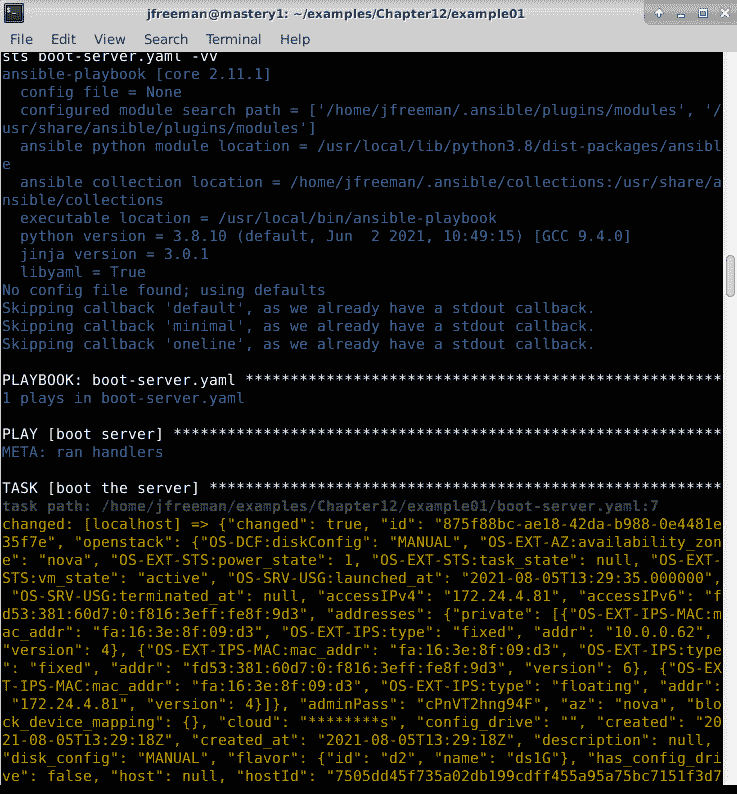

图 12.1 - 使用 Ansible 在 OpenStack 中创建虚拟实例

我已经截断了输出，因为模块返回了大量数据。最重要的是，我们获得了有关主机 IP 地址的数据。这个特定的云使用浮动 IP 来提供对服务器实例的公共访问，我们可以通过注册输出然后调试打印`openstack.accessIPv4`的值来看到这个值：

```
  tasks:
    - name: boot the server
      openstack.cloud.server:
        auth:
          auth_url: "http://10.0.50.32/identity/v3"
          username: "demo"
          password: "password"
          project_name: "demo"
          project_domain_name: "default"
          user_domain_name: "default"
        flavor: "ds1G"
        image: "Fedora34"
        key_name: "mastery-key"
        network: "private"
        name: "mastery1"
      register: newserver
    - name: show floating ip
      ansible.buitin.debug:
        var: newserver.openstack.accessIPv4
```

使用类似于前面的命令执行此剧本（但不要添加冗长）：

```
export ANSIBLE_PYTHON_INTERPRETER=$(which python3)
ansible-playbook -i mastery-hosts boot-server.yaml
```

这一次，第一个任务不会导致更改，因为我们想要的服务器已经存在 - 但是，它仍然会检索有关服务器的信息，使我们能够发现其 IP 地址：

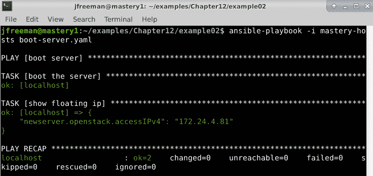

图 12.2 - 使用 Ansible 检索我们在上一个示例中启动的 OpenStack 虚拟机的 IP 地址

输出显示 IP 地址为`172.24.4.81`。我可以使用这些信息连接到我新创建的云服务器。

### 添加到运行时清单

启动服务器本身并不是很有用。服务器存在是为了使用，并且可能需要一些配置才能变得有用。虽然可以有一个 playbook 来创建资源，另一个完全不同的 playbook 来管理配置，但我们也可以在同一个 playbook 中完成所有这些。Ansible 提供了一个功能，可以在 play 的一部分中将主机添加到清单中，这将允许在后续 play 中使用这些主机。

根据上一个示例，我们有足够的信息通过`ansible.builtin.add_host`模块将新主机添加到运行时清单：

```
    - name: add new server
      ansible.builtin.add_host:
        name: "mastery1"
        ansible_ssh_host: "{{ newserver.openstack.accessIPv4 }}"
        ansible_ssh_user: "fedora" 
```

我知道这个镜像有一个默认的用户`fedora`，所以我相应地设置了一个主机变量，并设置 IP 地址作为连接地址。

重要提示

这个例子也忽略了在 OpenStack 中所需的安全组配置，以及接受 SSH 主机密钥。可以添加其他任务来管理这些事情，或者您可以像我在我的环境中所做的那样预先配置它们。

将服务器添加到清单后，我们可以对其进行操作。假设我们想要使用这个云资源来转换图像文件，使用`ImageMagick`软件。为了实现这一点，我们需要一个新的 play 来利用新的主机。我知道这个特定的 Fedora 镜像不包含 Python，所以我们需要添加 Python 和`dnf`的 Python 绑定（这样我们就可以使用`ansible.builtin.dnf`模块）作为我们的第一个任务，使用`ansible.builtin.raw`模块：

```
- name: configure server 
  hosts: mastery1 
  gather_facts: false 

  tasks: 
    - name: install python 
      ansible.builtin.raw: "sudo dnf install -y python python-dnf" 
```

接下来，我们需要`ImageMagick`软件，我们可以使用`dnf`模块安装它：

```
    - name: install imagemagick 
      ansible.builtin.dnf: 
        name: "ImageMagick" 
      become: "yes" 
```

此时运行 playbook 将显示我们新主机的更改任务；请注意，这一次，我们必须给`ansible-playbook`提供来自 OpenStack 的私钥文件的位置，以便它可以使用以下命令对`Fedora`镜像进行身份验证：

```
export ANSIBLE_PYTHON_INTERPRETER=$(which python3)
ansible-playbook -i mastery-hosts boot-server.yaml --private-key=mastery-key
```

成功运行 playbook 应该产生像*图 12.3*中显示的输出：

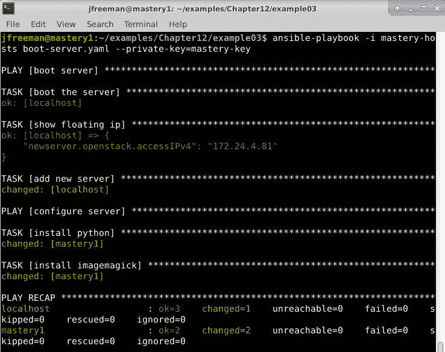

图 12.3 - 在我们的 OpenStack 虚拟机上执行实例化后配置，使用 Ansible

我们可以看到 Ansible 在主机`mastery1`上报告了两个更改的任务，这是我们在第一个 play 中刚刚创建的。这个主机在`mastery-hosts`清单文件中不存在。

这里我们也关闭了冗长的报告，因为输出会很繁琐；但是，鉴于我们有 OpenStack 实例的私钥文件，我们可以手动登录并检查我们 playbook 的结果，例如，使用以下命令：

```
rpm -qa --last | head
```

这个命令查询 RPM 软件包数据库，并显示最近安装的软件包的简短列表。输出可能看起来像*图 12.4*中显示的那样，尽管日期肯定会有所不同：

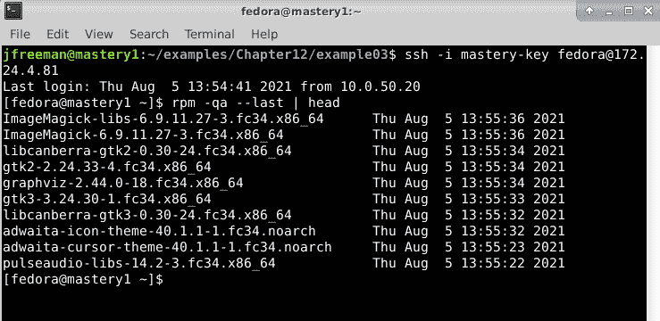

图 12.4 - 检查我们在 OpenStack VM 上的 playbook 成功

从这里开始，我们可以扩展我们的第二个 play，通过使用`ansible.builtin.copy`上传源图像文件，然后通过在主机上使用`ImageMagick`执行命令来转换图像。可以添加另一个任务，通过使用`ansible.builtin.slurp`模块将转换后的文件下载回来，或者将修改后的文件上传到基于云的对象存储中。最后，可以添加最后一个 play 来删除服务器本身。

服务器的整个生命周期，从创建到配置再到使用，最后到移除，都可以通过一个单一的 playbook 来管理。通过读取运行时变量数据，playbook 可以变得动态，以定义应上传/修改哪个文件以及应存储在何处，从而将 playbook 转变为可重复使用的程序。虽然有些简单，但希望这能让您清楚地了解 Ansible 在与基础设施服务提供商合作时有多强大。

## 使用 OpenStack 清单源

我们之前的示例展示了一个一次性的短暂的云服务器。如果我们想要创建和使用长期的云服务器呢？每次想要操作它们时，都要手动记录创建它们并将它们添加到临时清单的任务似乎效率低下。在静态清单中手动记录服务器详细信息似乎也效率低下，而且容易出错。幸运的是，有一个更好的方法：使用云本身作为动态清单源。

Ansible 附带了许多云提供商的动态清单脚本，正如我们在[*第一章*]（B17462_01_Final_JC_ePub.xhtml#_idTextAnchor015）中讨论的那样，*Ansible 的系统架构和设计*。我们将在这里继续使用 OpenStack 的示例。回顾一下，`openstack.cloud`集合提供了我们需要的动态清单脚本。要使用此脚本，我们需要创建一个 YAML 文件，告诉 Ansible 使用此清单脚本 - 此文件必须命名为`openstack.yaml`或`openstack.yml`。它应该包含类似以下的代码：

```
# file must be named openstack.yaml or openstack.yml
plugin: openstack.cloud.openstack
expand_hostvars: yes
fail_on_errors: yes
all_projects: yes
```

配置文件需要更多考虑。该文件保存了连接到 OpenStack 云的身份验证详细信息。这使得该文件非常敏感，只应对需要访问这些信息的用户可见。此外，清单脚本将尝试从`os-client-config`（https://docs.openstack.org/os-client-config/latest/user/configuration.html#config-files）使用的标准路径加载配置，这是底层身份验证代码。这意味着此清单源的配置可以存在于以下位置：

+   `clouds.yaml`（在执行清单脚本时的当前工作目录）

+   `~/.config/openstack/clouds.yaml`

+   `/etc/openstack/clouds.yaml`

找到的第一个文件将被使用。您可以通过在我们之前在本节中创建的`openstack.yaml`中添加`clouds_yaml_path`来覆盖此设置。在我们的示例中，我将在 playbook 目录中与脚本本身一起使用`clouds.yaml`文件，以便将配置与任何其他路径隔离开来。

您的`clouds.yaml`文件将与我们在之前示例中使用的`openstack.cloud.server`模块的参数的`auth:`部分非常相似。但有一个关键的区别 - 在我们之前的示例中，我们使用了`demo`账户，并且限制了自己只能在 OpenStack 的`demo`项目中。为了查询所有项目中的所有实例（我们想要演示一些功能），我们需要一个具有管理员权限而不是`demo`账户的账户。在本章的这部分中，我的`clouds.yaml`文件包含以下内容：

```
clouds:
  mastery_cloud:
    auth:
      auth_url: "http://10.0.50.32/identity/v3"
      username: "admin"
      password: "password"
      project_name: "demo"
      project_domain_name: "default"
      user_domain_name: "default"
```

实际的动态清单脚本有一个内置的帮助功能，您也可以使用它来了解更多信息。如果您可以在系统上找到它，您可以运行以下命令 - 在我的系统上，我使用了这个命令：

```
python3 /usr/local/lib/python3.8/dist-packages/ansible_collections/openstack/cloud/scripts/inventory/openstack_inventory.py --help
```

在我们开始之前，还有一件事需要知道：如果您使用的是 Ansible 4.0 版本，它附带了`openstack.cloud`集合的`1.4.0`版本。其中存在一个错误，使得动态清单脚本无法运行。您可以使用以下命令查询您安装的集合版本：

```
ansible-galaxy collection list | grep openstack.cloud
```

如果您需要安装更新版本，可以使用以下命令进行安装：

```
ansible-galaxy collection install openstack.cloud
```

这将在您的主目录中的一个隐藏目录中安装集合，因此如果您使用本地副本，请不要使用此命令：

```
/usr/local/lib/python3.8/dist-packages/ansible_collections/openstack/cloud/scripts/inventory/openstack_inventory.py
```

请使用这个代替：

```
~/.ansible/collections/ansible_collections/openstack/cloud/scripts/inventory/openstack_inventory.py
```

脚本的`help`输出显示了一些可能的参数；然而，Ansible 将使用的是`--list`和`--host`，就像*图 12.5*所示：

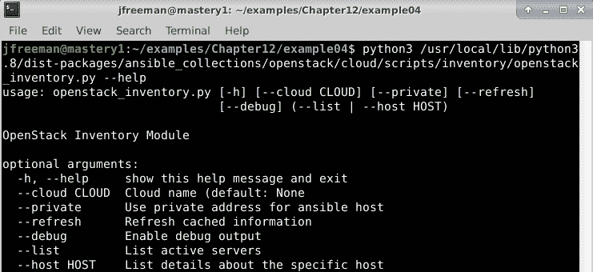

图 12.5 – 展示 openstack_inventory.py 脚本的帮助功能

第一个用于获取账户可见的所有服务器列表，第二个用于从每个服务器获取主机变量数据，不过这个清单脚本使用`--list`调用返回所有主机变量。使用主机列表返回数据是一种性能增强，正如我们在本书前面讨论的那样，消除了需要为每个主机调用 OpenStack API 的需求。

使用`--list`的输出相当长；以下是前几行：

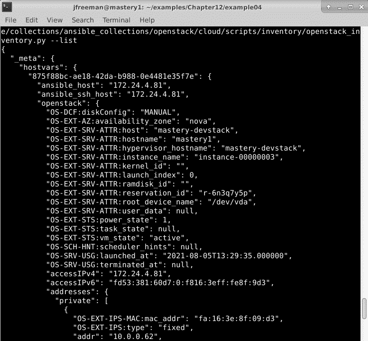

图 12.6 – 展示 openstack_inventory.py 动态清单返回的数据

配置的账户只有一个可见的服务器，其 UUID 为`875f88bc-ae18-42da-b988-0e4481e35f7e`，这是我们在之前的示例中启动的实例。我们在`flavor-ds1G`和`image-Fedora34`组中看到了这个实例的列表，例如。第一个组是所有使用`ds1G`口味运行的服务器，第二个组是所有使用我们的`Fedora34`镜像运行的服务器。这些分组在清单插件中自动发生，可能根据您使用的 OpenStack 设置而有所不同。输出的末尾将显示插件提供的其他组：

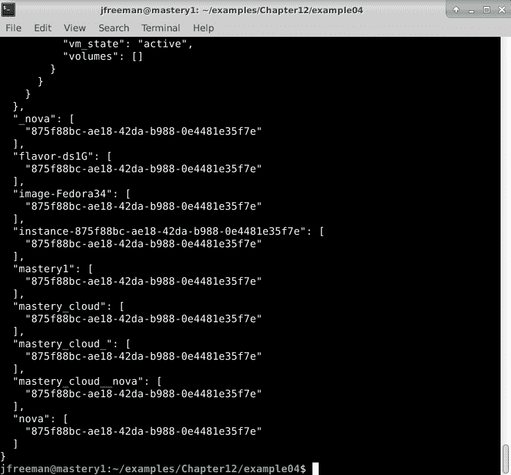

图 12.7 – 展示 openstack_inventory.py 动态清单返回的更多数据

重要提示

请注意，要出现前述分组，`openstack.yaml`文件中必须设置`expand_hostvars: True`。

一些额外的组如下：

+   `mastery_cloud`：在我们的`clouds.yaml`文件中指定的`mastery_cloud`实例上运行的所有服务器

+   `flavor-ds1G`：使用`ds1G`口味的所有服务器

+   `image-Fedora 29`：使用`Fedora 29`镜像的所有服务器

+   `instance-875f88bc-ae18-42da-b988-0e4481e35f7e`：以实例本身命名的一个组

+   `nova`：在`nova`服务下运行的所有服务器

提供了许多组，每个组可能都有清单脚本找到的服务器的不同部分。这些组使得通过 play 轻松地定位到正确的实例。主机被定义为服务器的 UUID。由于这些本质上是唯一的，而且也相当长，它们在 play 中作为目标是笨拙的。这使得组变得更加重要。

为了演示使用此脚本作为清单来源，我们将重新创建前面的示例，跳过创建服务器的步骤，只需使用适当的组目标编写第二个 play。我们将命名这个 playbook 为`configure-server.yaml`：

```
--- 
- name: configure server 
  hosts: all 
  gather_facts: false 
  remote_user: fedora 

  tasks: 
    - name: install python 
      ansible.builtin.raw: "sudo dnf install -y python python-dnf" 

    - name: install imagemagick 
      ansible.builtin.dnf: 
        name: "ImageMagick" 
      become: "yes" 
```

此镜像的默认用户是`fedora`；然而，这些信息在 OpenStack API 中并不容易获得，因此在我们的清单脚本提供的数据中并没有反映出来。我们可以在 play 级别简单地定义要使用的用户。

这次，主机模式设置为`all`，因为我们的演示 OpenStack 服务器上目前只有一个主机；然而，在现实生活中，你不太可能在 Ansible 中如此公开地定位主机。

play 的其余部分保持不变，输出应该与以前的执行类似：

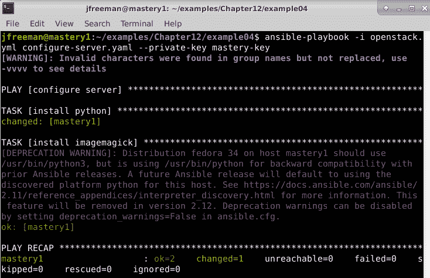

图 12.8 – 通过动态清单插件重新配置我们的虚拟实例

这个输出与上次执行`boot-server.yaml` playbook 时有一些不同。首先，`mastery1`实例没有被创建或启动。我们假设我们想要交互的服务器已经被创建并正在运行。其次，我们直接从 OpenStack 服务器本身中提取了这个 playbook 运行的清单，使用了一个动态清单插件，而不是在 playbook 中使用`add_host`创建一个清单。除此之外，输出是一样的，除了两个弃用警告。关于组名的警告出现是因为动态清单脚本提供了自动创建的组名，需要进行清理 - 我想这将在插件的未来版本中得到修复。此外，Python 弃用警告在 Ansible 完全转向 Python 3 的过渡阶段是常见的，只要你的 Python 2 环境没有缺少任何模块，它是无害的。

随着时间的推移，每次运行清单插件时都会发现当前 playbook 执行时有哪些服务器被添加或移除。这可以节省大量时间，因为不需要试图维护静态清单文件中服务器的准确列表。

# 管理公共云基础设施

使用 Ansible 管理公共云基础设施并不比使用它管理 OpenStack 更困难，就像我们之前讨论的那样。一般来说，对于任何被 Ansible 支持的 IaaS 提供商，让它工作的过程是一个三步骤的过程。

1.  建立支持云提供商的 Ansible 集合、模块和动态清单插件。

1.  在 Ansible 主机上安装任何先决条件软件或库。

1.  定义 playbook 并对基础设施提供商运行它。

大多数提供商也有现成的动态清单插件可用，我们在本书中已经演示了其中两个：

+   `amazon.aws.aws_ec2`在*第一章*中讨论过，*Ansible 的系统架构和设计*。

+   `openstack.cloud.openstack`在本章前面已经演示过。

让我们来看看**亚马逊网络服务**（**AWS**），特别是 EC2 服务。我们可以使用我们选择的镜像启动一个新的服务器，使用与之前在 OpenStack 中完全相同的高级流程。然而，正如你现在肯定已经猜到的那样，我们必须使用一个提供特定 EC2 支持的 Ansible 模块。让我们构建 playbook。首先，我们的初始 play 将再次从本地主机运行，因为这将调用 EC2 来启动我们的新服务器：

```
---
- name: boot server
  hosts: localhost
  gather_facts: false
```

接下来，我们将使用`community.aws.ec2_instance`模块来代替`openstack.cloud.server`模块来启动我们想要的服务器。这段代码只是一个示例，用来展示如何使用模块；通常情况下，就像我们的`openstack.cloud.server`示例一样，你不会在 playbook 中包含密钥，而是会将它们存储在某个保险库中：

```
    - name: boot the server
      community.aws.ec2_instance:
        access_key: XXXXXXXXXXXXXXXXX
        secret_key: xxxxxxxxxxxxxxxxxxxxxxxxxxxxxxxxxxx
        key_name: mastery-demo
        security_group: default
        instance_type: t2.micro
        image_id: "ami-04d4a52790edc7894"
        region: eu-west-2
        tags: "{'ansible_group':'mastery_server', 'Name':'mastery1'}"
        wait: true
        user_data: |
          #!/bin/bash
          sudo dnf install -y python python-dnf
      register: newserver
```

重要提示

`community.aws.ec2_instance`模块需要在 Ansible 主机上安装 Python 的`boto3`库；这个方法在不同的操作系统上会有所不同，但在我们的 Ubuntu Server 20.04 演示主机上，它是使用`sudo apt install python3-boto3`命令安装的。另外，如果你在 Python 3 下安装这个模块，请确保你的 Ansible 安装使用 Python 3，设置`ANSIBLE_PYTHON_INTERPRETER`变量。

上述代码旨在执行与我们的`openstack.cloud.server`示例相同的工作，尽管在高层次上看起来相似，但有许多不同之处。因此，在使用新模块时，有必要阅读模块文档，以确切了解如何使用它。特别值得注意的是，`user_data`字段可用于将创建后的脚本发送到新的 VM；当需要立即进行初始配置时，这非常有用，适用于`ansible.builtin.raw`命令。在这种情况下，我们使用它来安装后续使用 Ansible 安装`ImageMagick`所需的 Python 3 先决条件。

接下来，我们可以通过使用在前面的任务中注册的`newserver`变量来获取我们新创建的服务器的公共 IP 地址。但是，请注意与使用`openstack.cloud.server`模块时访问此信息的方式相比，变量结构不同（再次，始终参考文档）：

```
    - name: show floating ip 
      ansible.builtin.debug: 
        var: newserver.instances[0].public_ip_address 
```

`community.aws.ec2_instance`模块和`openstack.cloud.server`模块之间的另一个关键区别是，`community.aws.ec2_instance`不一定会在 SSH 连接可用之前完成 - 这可以使用`wait`参数进行设置；因此，定义一个专门用于此目的的任务是一个良好的做法，以确保我们的 playbook 不会因为缺乏连接而在后来失败：

```
    - name: Wait for SSH to come up
      ansible.builtin.wait_for_connection:
        delay: 5
        timeout: 320 
```

完成此任务后，我们将知道我们的主机是活动的并且响应 SSH，因此我们可以继续使用`ansible.builtin.add_host`将这个新主机添加到清单中，然后像之前一样安装`ImageMagick`（这里使用的图像是在 OpenStack 示例中使用的相同的 Fedora 34 云图像）：

```
    - name: add new server 
      ansible.builtin.add_host: 
        name: "mastery1" 
        ansible_ssh_host: "{{ newserver.instances[0].public_ip_address }}" 
        ansible_ssh_user: "fedora"
- name: configure server
  hosts: mastery1
  gather_facts: false
  tasks:
    - name: install imagemagick
      ansible.builtin.dnf:
        name: "ImageMagick"
      become: "yes" 
```

将所有这些放在一起并运行 playbook 应该会产生类似以下截图的结果。请注意，我已经关闭了 SSH 主机密钥检查，以防止 SSH 传输代理在第一次运行时询问添加主机密钥，这将导致 playbook 挂起并等待用户干预，使用以下命令：

```
export ANSIBLE_PYTHON_INTERPRETER=$(which python3)
ANSIBLE_HOST_KEY_CHECKING=False ansible-playbook -i mastery-hosts boot-ec2-server.yaml --private-key mastery-key.pem
```

您还会注意到，我已经将我在 AWS 帐户上生成的密钥对中保存的私人 SSH 密钥保存为`mastery-key.pem`，保存在与 playbook 相同的目录中 - 您需要将您自己的密钥保存在此位置，并相应地在命令行中引用它。成功运行应该看起来像*图 12.9*中显示的输出：

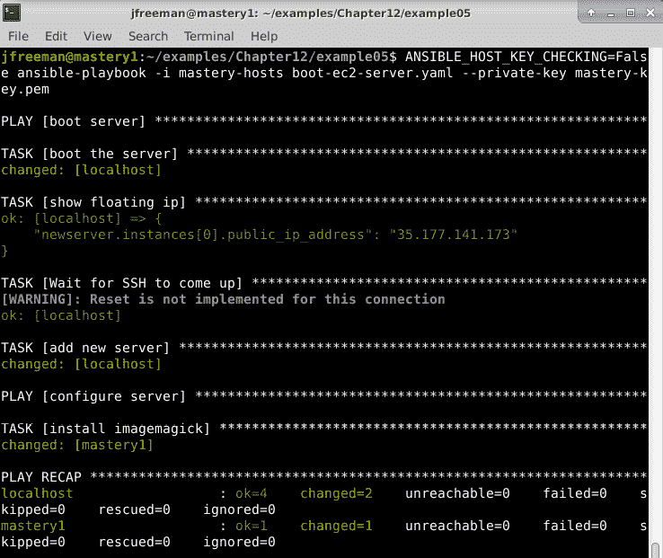

图 12.9 - 使用 Ansible 引导和设置 Amazon EC2 实例

正如我们在这里看到的，我们可以在不同的云提供商上使用略有不同的 playbook 来实现相同的结果。关键在于阅读每个模块附带的文档，并确保正确引用参数和返回值。

我们可以将这种方法应用到 Azure、Google Cloud 或 Ansible 支持的任何其他云提供商。如果我们想在 Azure 上重复这个例子，那么我们需要使用`azure.azcollection.azure_rm_virtualmachine`模块。该模块的文档说明我们需要 Python 2.7 或更新版本（这已经是我们 Ubuntu Server 20.04 演示机的一部分），以及一整套 Python 模块，这些模块的名称以及所需版本可以在一个名为`requirements-azure.txt`的文件中找到，该文件包含在集合中。期望您将使用`pip`安装这些要求，并且您可以通过在文件系统上找到上述文件，然后安装所需的模块来实现这一点。在我的演示系统上，我使用了以下命令来实现这一点：

```
locate requirements-azure.txt
sudo pip3 install -r /usr/local/lib/python3.8/dist-packages/ansible_collections/azure/azcollection/requirements-azure.txt
```

满足了这些先决条件，我们可以再次构建我们的 playbook。请注意，使用 Azure，可以使用多种身份验证方法。为了简单起见，我使用了为此演示创建的 Azure Active Directory 凭据；但是，为了启用此功能，我还必须安装官方的 Azure CLI 实用程序（按照此处提供的说明进行：[`docs.microsoft.com/en-gb/cli/azure/install-azure-cli-linux?pivots=apt`](https://docs.microsoft.com/en-gb/cli/azure/install-azure-cli-linux?pivots=apt)），并使用以下命令登录：

```
az login
```

这确保您的 Ansible 主机受到 Azure 的信任。在实践中，您可以设置一个**服务主体**，从而无需进行此操作，鼓励您自行探索这个选项。继续进行当前的简单示例，我们像以前一样设置 playbook 的头部：

```
---
- name: boot server
  hosts: localhost
  gather_facts: false
  vars:
    vm_password: Password123!
```

请注意，这一次，我们将为新 VM 存储一个密码变量；通常情况下，我们会将其存储在保险库中，但这又留给读者作为练习。从这里开始，我们使用`azure.azcollection.azure_rm_virtualmachine`模块来启动我们的新 VM。为了保持与之前示例的连贯性，我必须在 Azure 的图像市场上找到`Fedora 34`图像，这需要定义一些额外的参数，例如`plan`。为了使 Ansible 能够使用此图像，我首先必须找到它，然后接受作者的条款以启用其使用，使用以下命令使用`az`命令行实用程序：

```
az vm image list --offer fedora --all --output table
az vm image show --urn tunnelbiz:fedora:fedoraupdate:34.0.1
az vm image terms accept --urn tunnelbiz:fedora:fedoraupdate:34.0.1
```

我还必须创建 VM 将使用的资源组和网络；这些都是非常 Azure 特定的步骤，并且有很好的文档记录（如果您熟悉 Azure，则被认为是*基本操作*）。完成所有先决条件后，我就能够编写以下 playbook 代码来启动我们基于 Azure 的`Fedora 34`图像：

```
  tasks:
    - name: boot the server
      azure.azcollection.azure_rm_virtualmachine:
        ad_user: masteryadmin@example.com
        password: < insert your ad password here >
        subscription_id: xxxxxxxx-xxxxxx-xxxxxx-xxxxxxxx
        resource_group: mastery
        name: mastery1
        admin_username: fedora
        admin_password: "{{ vm_password }}"
        vm_size: Standard_B1s
        managed_disk_type: "Standard_LRS"
        image:
          offer: fedora
          publisher: tunnelbiz
          sku: fedoraupdate
          version: 34.0.1
        plan:
          name: fedoraupdate
          product: fedora
          publisher : tunnelbiz
      register: newserver
```

与之前的示例一样，我们获取图像的公共 IP 地址（注意访问此地址所需的复杂变量），确保 SSH 访问正常工作，然后使用`ansible.builtin.add_host`将新的 VM 添加到我们的运行时清单中：

```
    - name: show floating ip
      ansible.builtin.debug:
        var: newserver.ansible_facts.azure_vm.properties.networkProfile.networkInterfaces[0].properties.ipConfigurations[0].properties.publicIPAddress.properties.ipAddress
    - name: Wait for SSH to come up
      ansible.builtin.wait_for_connection:
        delay: 1
        timeout: 320
    - name: add new server
      ansible.builtin.add_host:
        name: "mastery1"
        ansible_ssh_host: "{{ newserver.ansible_facts.azure_vm.properties.networkProfile.networkInterfaces[0].properties.ipConfigurations[0].properties.publicIPAddress.properties.ipAddress }}"
        ansible_ssh_user: "fedora"
        ansible_ssh_pass: "{{ vm_password }}"
        ansible_become_pass: "{{ vm_password }}"
```

Azure 允许在 Linux VM 上使用基于密码或基于密钥的 SSH 身份验证；我们在这里使用基于密码的方式是为了简单起见。还要注意新使用的`ansible_become_pass`连接变量，因为我们使用的`Fedora 34`图像在使用`sudo`时会提示输入密码，可能会阻止执行。最后，完成这项工作后，我们像以前一样安装`ImageMagick`：

```
- name: configure server
  hosts: mastery1
  gather_facts: false
  tasks:
    - name: install python
      ansible.builtin.raw: "dnf install -y python python-dnf"
      become: "yes"
    - name: install imagemagick
      ansible.builtin.dnf:
        name: "ImageMagick"
      become: "yes"
```

代码完成后，使用以下命令运行它（根据需要设置您系统的 Python 环境）：

```
export ANSIBLE_PYTHON_INTERPRETER=$(which python3)
ANSIBLE_HOST_KEY_CHECKING=False ansible-playbook -i mastery-hosts boot-azure-server.yaml
```

让我们看看它是如何运作的：

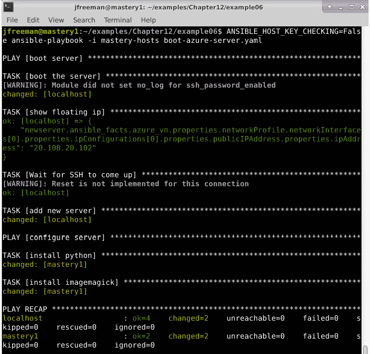

图 12.10–使用 Ansible 创建和配置 Azure 虚拟机

输出与我们的 AWS 示例非常相似，表明我们可以非常轻松地跨不同的云平台执行相同的操作，只需稍微学习每个云提供商所需模块的工作原理。本章的这一部分绝不是最终的，因为 Ansible 支持的平台和操作数量很多，但我们希望所提供的信息能够让您了解将 Ansible 与新的云平台集成所需的流程和步骤。接下来，我们将看看如何使用 Ansible 与 Docker 容器交互。

# 与 Docker 容器交互

Linux 容器技术，特别是 Docker，在近年来变得越来越受欢迎，自本书上一版出版以来这种趋势一直在持续。容器提供了一种快速的资源隔离路径，同时保持运行时环境的一致性。它们可以快速启动，并且运行效率高，因为几乎没有额外的开销。诸如 Docker 之类的实用工具为容器管理提供了许多有用的工具，例如用作文件系统的镜像注册表、构建镜像本身的工具、集群编排等。通过其易用性，Docker 已成为管理容器的最流行方式之一，尽管其他工具，如 Podman 和 LXC，也变得越来越普遍。不过，目前我们将专注于 Docker，因为它具有广泛的吸引力和广泛的安装基础。

Ansible 也可以以多种方式与 Docker 进行交互。特别是，Ansible 可以用于构建镜像，启动或停止容器，组合多个容器服务，连接到并与活动容器进行交互，甚至从容器中发现清单。Ansible 提供了一整套用于与 Docker 一起工作的工具，包括相关模块、连接插件和清单脚本。

为了演示如何使用 Docker，我们将探讨一些用例。第一个用例是构建一个新的镜像以供 Docker 使用。第二个用例是从新镜像启动一个容器并与其交互。最后一个用例是使用清单插件与活动容器进行交互。

重要提示

创建一个功能齐全的 Docker 安装非常依赖于您的基础操作系统。一个很好的资源是 Docker 网站，提供了详细的安装和使用说明，网址是[`docs.docker.com`](https://docs.docker.com)。Ansible 在 Linux 主机上与 Docker 配合效果最佳，因此我们将继续使用本书中一直使用的 Ubuntu Server 20.04 LTS 演示机。

## 构建镜像

Docker 镜像基本上是与运行时使用的参数捆绑在一起的文件系统。文件系统通常是 Linux Userland 的一小部分，包含足够的文件来启动所需的进程。Docker 提供了构建这些镜像的工具，通常基于非常小的、预先存在的基础镜像。该工具使用 Dockerfile 作为输入，Dockerfile 是一个带有指令的纯文本文件。该文件由 docker build 命令解析，我们可以通过 docker_image 模块解析它。其余的示例将来自使用 Docker CE 版本 20.10.8 的 Ubuntu Server 20.04 虚拟机，其中添加了 cowsay 和 nginx 包，以便运行容器将提供一个显示 cowsay 内容的 Web 服务器。

首先，我们需要一个 Dockerfile。如果您以前没有遇到过这个文件，它是用于构建 Docker 容器的一组指令-如果您愿意，您可以在这里了解更多信息：[`docs.docker.com/engine/reference/builder/`](https://docs.docker.com/engine/reference/builder/)。这个文件需要存在于 Ansible 可以读取的路径中，我们将把它放在与我的 playbooks 相同的目录中。Dockerfile 的内容将非常简单。我们需要定义一个基本镜像，一个运行安装必要软件的命令，一些最小的软件配置，一个要暴露的端口，以及一个使用此镜像运行容器的默认操作：

```
FROM docker.io/fedora:34 

RUN dnf install -y cowsay nginx 
RUN echo "daemon off;" >> /etc/nginx/nginx.conf 
RUN cowsay boop > /usr/share/nginx/html/index.html 

EXPOSE 80 

CMD /usr/sbin/nginx 
```

构建过程执行以下步骤：

1.  我们正在使用 Docker Hub 镜像注册表上的 fedora 存储库中的 Fedora 34 镜像。

1.  为了安装必要的 cowsay 和 nginx 包，我们使用 dnf。

1.  要直接在容器中运行 nginx，我们需要在 nginx.conf 中将 daemon 模式关闭。

1.  我们使用 cowsay 生成默认网页的内容。

1.  然后，我们指示 Docker 在容器中暴露端口 80，其中 nginx 将监听连接。

1.  最后，这个容器的默认操作将是运行 nginx。

构建和使用镜像的 playbook 可以放在同一个目录中。我们将其命名为`docker-interact.yaml`。该 playbook 将在`localhost`上运行，并有两个任务；一个是使用`community.docker.docker_image`构建镜像，另一个是使用`community.docker.docker_container`启动容器：

```
--- 
- name: build an image 
  hosts: localhost 
  gather_facts: false 

  tasks: 
    - name: build that image 
      community.docker.docker_image: 
        path: . 
        state: present 
        name: fedora-moo 

    - name: start the container 
      community.docker.docker_container: 
        name: playbook-container 
        image: fedora-moo 
        ports: 8080:80 
        state: started
        container_default_behavior: no_defaults
```

在运行我们的 playbook 之前，我们将检查可能与我们之前的 playbook 定义匹配的任何可能的容器镜像或正在运行的容器 - 这将帮助我们确信我们的代码正在产生期望的结果。如果您有从以前的测试中运行的任何其他容器，可以运行以下命令来检查与我们的规范匹配的`fedora`-based 容器：

```
docker ps -a --filter ancestor=fedora-moo
docker images --filter reference='fedora*'
```

除非您之前已运行过此代码，否则应该看到没有正在运行的容器，如*图 12.11*所示：

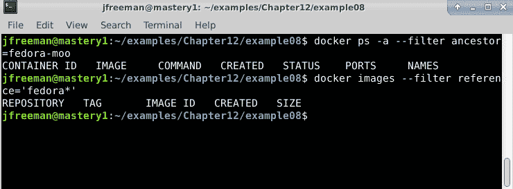

图 12.11 - 在运行我们的 playbook 之前检查容器的缺席

现在，让我们运行 playbook 来构建镜像并使用该镜像启动容器 - 请注意，与许多其他 Ansible 模块一样，您可能需要安装额外的 Python 模块才能使您的代码正常工作。在我的 Ubuntu Server 20.04 演示机器上，我不得不运行以下命令：

```
sudo apt install python3-docker
export ANSIBLE_PYTHON_INTERPRETER=$(which python3)
```

安装了 Python 支持后，您可以使用以下命令运行 playbook：

```
ansible-playbook -i mastery-hosts docker-interact.yaml
```

成功运行 playbook 应该类似于*图 12.12*：

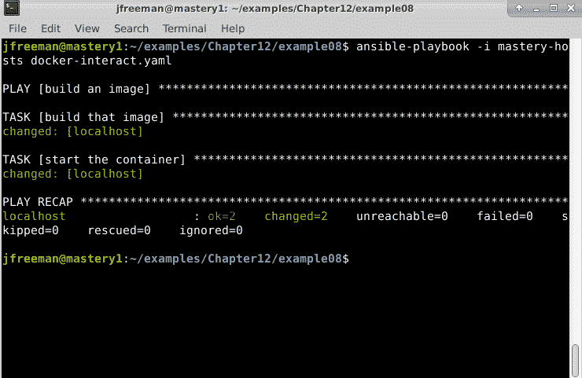

图 12.12 - 使用 Ansible 构建和运行我们的第一个 Docker 容器

为了节省屏幕空间，此 playbook 执行的冗长度已经减少。我们的输出只是显示构建镜像的任务和启动容器的任务都产生了变化。快速检查运行的容器和可用的镜像应该反映我们的工作 - 您可以使用与 playbook 运行之前相同的`docker`命令来验证这一点：

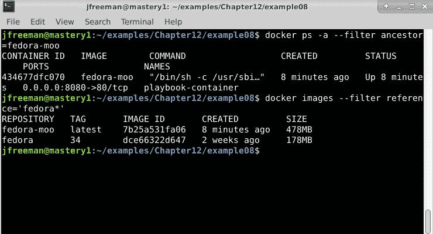

图 12.13 - 验证我们在 Docker 中运行的 Ansible playbook 的结果

我们可以使用`curl`来访问 Web 服务器来测试容器的功能，这应该会显示一头牛说`boop`，就像*图 12.14*中演示的那样：

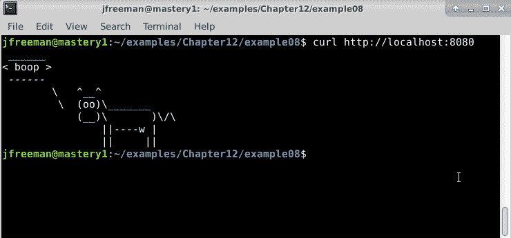

图 12.14 - 检索使用 Ansible 创建和运行的容器的结果

通过这种方式，我们已经展示了使用 Ansible 与 Docker 进行交互有多么容易。但是，这个例子仍然是基于使用本地的`Dockerfile`，随着我们在本章中的进展，我们将看到一些更高级的 Ansible 用法，这些用法不需要`Dockerfile`。

## 构建不需要 Dockerfile 的容器

Dockerfile 很有用，但 Dockerfile 内部执行的许多操作都可以用 Ansible 来完成。Ansible 可以用于使用基础镜像启动容器，然后使用`docker`连接方法（而不是 SSH）与该容器进行交互以完成配置。让我们通过重复之前的示例来演示这一点，但不需要`Dockerfile`。相反，所有的工作都将由一个名为`docker-all.yaml`的全新 playbook 处理。该 playbook 的第一部分从 Docker Hub 的`Fedora 34`的预先存在的镜像中启动一个容器，并使用`ansible.builtin.add_host`将生成的容器详细信息添加到 Ansible 的内存库存中：

```
--- 
- name: build an image 
  hosts: localhost 
  gather_facts: false 
  tasks: 
    - name: start the container 
      community.docker.docker_container: 
        name: playbook-container 
        image: docker.io/fedora:34
        ports: 8080:80 
        state: started 
        command: sleep 500 
        container_default_behavior: no_defaults

    - name: make a host 
      ansible.builtin.add_host: 
        name: playbook-container 
        ansible_connection: docker 
        ansible_ssh_user: root
```

然后，使用这个新添加的库存主机，我们定义了第二个播放，该播放在刚刚启动的容器中运行 Ansible 任务，配置我们的`cowsay`服务，就像以前一样，但不需要`Dockerfile`：

```
- name: do things 
  hosts: playbook-container 
  gather_facts: false 

  tasks: 
    - name: install things 
      ansible.builtion.raw: dnf install -y python-dnf 

    - name: install things 
      ansible.builtin.dnf: 
        name: ['nginx', 'cowsay']

    - name: configure nginx 
      ansible.builtin.lineinfile: 
        line: "daemon off;" 
        dest: /etc/nginx/nginx.conf 
    - name: boop 
      ansible.builtin.shell: cowsay boop > /usr/share/nginx/html/index.html 

    - name: run nginx 
      ansible.builtin.shell: nginx & 
```

回顾一下，播放书包括两个播放。第一个播放从基本`Fedora 34`镜像创建容器。`community.docker.docker_container`任务被赋予一个`sleep`命令，以保持容器运行一段时间，因为`docker`连接插件只能与活动容器一起工作（从 Docker Hub 获取的未配置的操作系统镜像通常在运行时立即退出，因为它们没有默认操作要执行）。第一个播放的第二个任务创建了容器的运行时清单条目。清单主机名必须与容器名称匹配。连接方法也设置为`docker`。

第二个播放目标是新创建的主机，第一个任务使用`ansible.builtin.raw`模块来放置`python-dnf`包（这将带来其余的`Python`），以便我们可以在下一个任务中使用`ansible.builtin.dnf`模块。然后，使用`ansible.builtin.dnf`模块安装所需的软件包，即`nginx`和`cowsay`。然后，使用`ansible.builtin.lineinfile`模块向`nginx`配置添加新行。一个`ansible.builtin.shell`任务使用`cowsay`来为`nginx`创建内容。最后，`nginx`本身作为后台进程启动。

在运行播放书之前，让我们通过运行以下命令删除上一个示例中的任何运行的容器：

```
docker ps -a --filter ancestor=fedora-moo
docker rm -f playbook-container
docker ps -a --filter ancestor=fedora-moo
```

您可以将其与*图 12.15*中的屏幕截图进行验证：

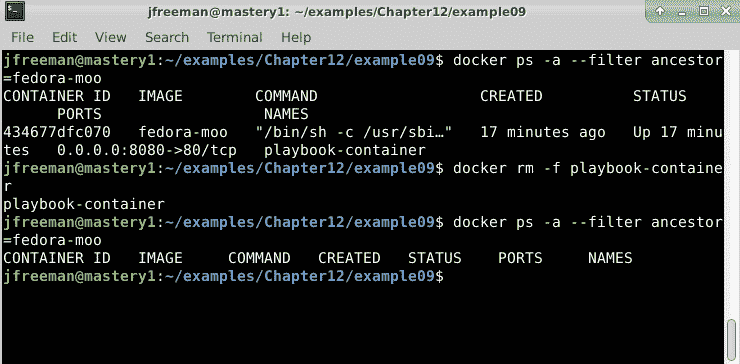

图 12.15 - 清理上一次播放书运行中的运行容器

删除运行的容器后，我们现在可以运行我们的新播放书来重新创建容器，绕过构建镜像的步骤，使用以下命令：

```
ansible-playbook -i mastery-hosts docker-all.yaml
```

成功运行的输出应该看起来像*图 12.16*中显示的那样：

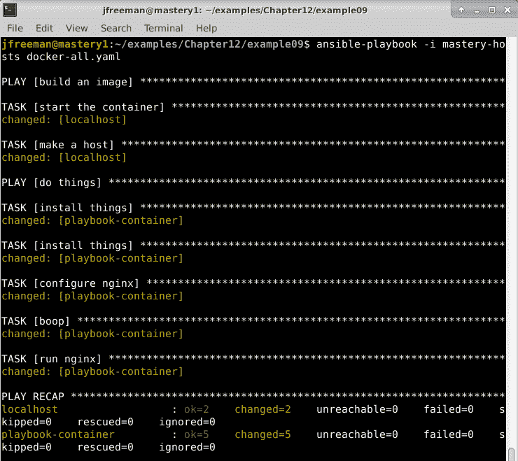

图 12.16 - 使用 Ansible 构建没有 Dockerfile 的容器

我们看到第一个播放执行任务在`localhost`上，然后第二个播放在`playbook-container`上执行。完成后，我们可以使用以下命令测试 Web 服务并列出运行的容器以验证我们的工作：

```
curl http://localhost:8080
docker ps -a --filter ancestor=fedora:34
```

注意这次不同的过滤器；我们的容器是直接从`fedora`镜像构建和运行的，而没有创建`fedora-moo`镜像的中间步骤 - 输出应该看起来像*图 12.17*中显示的那样：

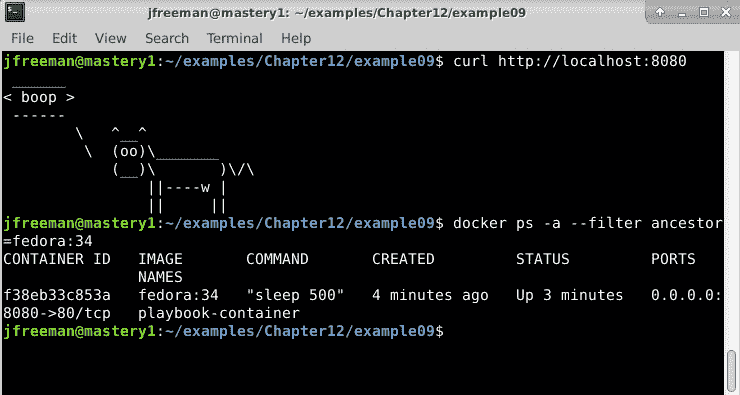

图 12.17 - 验证我们的播放书运行结果

使用 Ansible 配置运行容器的这种方法有一些优势。首先，您可以重用现有角色来设置应用程序，轻松地从云虚拟机目标切换到容器，甚至切换到裸金属资源（如果需要的话）。其次，您可以通过审查播放书内容轻松地审查所有配置进入应用程序的内容。

使用这种交互方法的另一个用例是使用 Docker 容器模拟多个主机，以验证跨多个主机执行播放书的执行。可以启动一个带有`init`系统作为运行进程的容器，允许启动其他服务，就像它们在完整的操作系统上一样。在持续集成环境中，这种用例对于快速有效地验证播放书内容的更改非常有价值。 

## Docker 清单

与本书前面详细介绍的 OpenStack 和 EC2 清单插件类似，还提供了 Docker 清单插件。如果您希望检查 Docker 清单脚本或以类似于我们在本章前面使用其他动态清单插件的方式使用它，可以找到 Docker 清单脚本，通过创建一个 YAML 清单文件来引用该插件。

让我们首先找到清单脚本本身 - 在我的演示系统上，它位于这里：

```
/usr/local/lib/python3.8/dist-packages/ansible_collections/community/general/scripts/inventory/docker.py
```

一旦你习惯了 Ansible 的安装基本路径，你会发现通过集合轻松浏览目录结构，找到你要找的东西。让我们尝试直接运行这个脚本，看看在配置它用于 playbook 清单目的时我们有哪些选项可用：

```
python3 /usr/local/lib/python3.8/dist-packages/ansible_collections/community/general/scripts/inventory/docker.py --help
```

脚本的`help`输出显示了许多可能的参数；然而，Ansible 将使用的是`--list`和`--host` - 您的输出将类似于*图 12.18*所示：

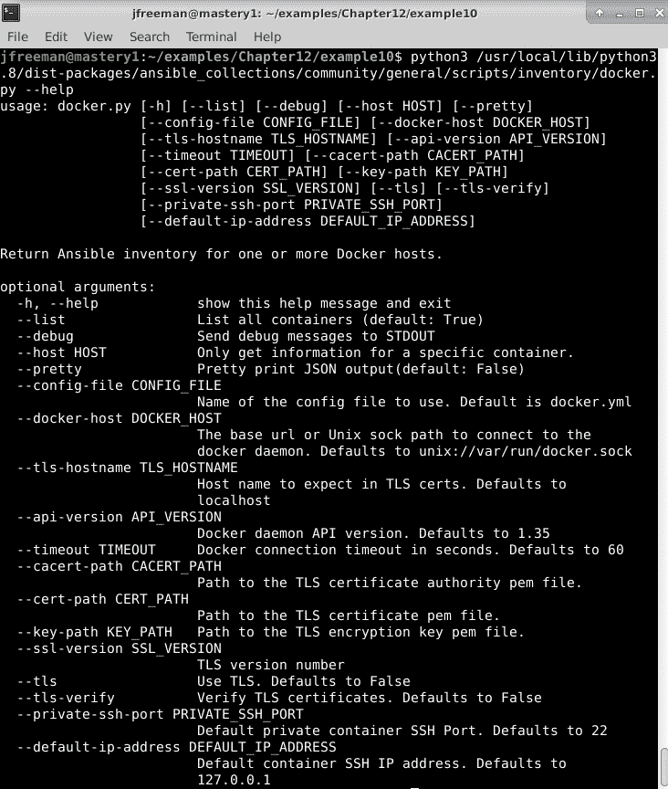

图 12.18 - 检查 Docker 动态清单脚本上可用的选项

如果之前构建的容器在执行此脚本时仍在运行，您可以使用以下命令列出主机：

```
python3 /usr/local/lib/python3.8/dist-packages/ansible_collections/community/general/scripts/inventory/docker.py --list --pretty | grep -C2 playbook-container
```

它应该出现在输出中（`grep`已经被用来在截图中更明显地显示这一点）：

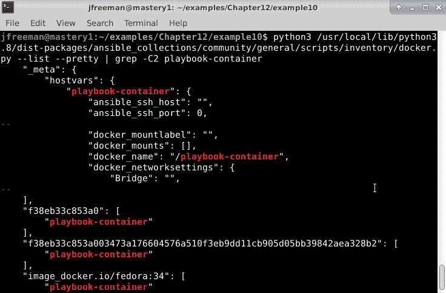

图 12.19 - 手动运行 Docker 动态清单插件以探索其行为

与之前一样，提供了许多组，这些组的成员是正在运行的容器。之前显示的两个组是短容器 ID 和长容器 ID。许多变量也作为输出的一部分进行了定义，在前面的截图中已经被大幅缩减。输出的最后一部分显示了另外一些组：

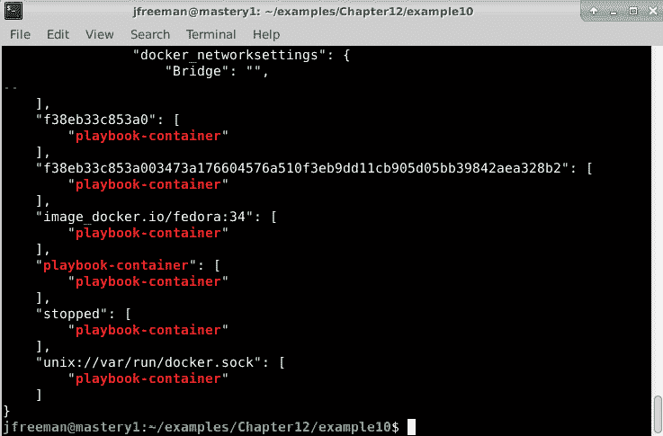

图 12.20 - 进一步探索动态清单脚本输出

附加的组如下：

+   `docker_hosts`：所有与动态清单脚本通信并查询容器的 Docker 守护程序运行的主机。

+   `image_name`：每个被发现容器使用的图像的组。

+   `container name`：与容器名称匹配的组

+   `running`：所有正在运行的容器的组。

+   `stopped`：所有已停止的容器的组 - 您可以在前面的输出中看到，我们之前启动的容器现在已经停止，因为 500 秒的休眠时间已经过期。

此清单插件及其提供的组和数据可以被 playbook 用来针对可用的各种容器进行交互，而无需手动清单管理或使用`add_host`。在 playbook 中使用插件只需简单地定义一个 YAML 清单文件，其中包含插件名称和连接详细信息 - 要查询本地 Docker 主机，我们可以定义我们的清单如下：

```
---
plugin: community.docker.docker_containers
docker_host: unix://var/run/docker.sock
```

您可以以正常方式对此清单定义使用 Ansible 运行临时命令或 playbook，并获取本地主机上运行的所有容器的详细信息。连接到远程主机并不会更加困难，插件文档（可在此处找到：[`docs.ansible.com/ansible/latest/collections/community/docker/docker_containers_inventory.html`](https://docs.ansible.com/ansible/latest/collections/community/docker/docker_containers_inventory.html)）向您展示了可用于此的选项。我们现在已经看过了几种构建和与 Docker 容器交互的方法，但如果我们想要一个更加协调的方法呢？我们将在下一节中详细讨论这个问题。

# 使用 Ansible 构建容器

正如我们在上一节开头提到的，自本书上一版出版以来，容器的世界已经取得了很大的进步。尽管 Docker 仍然是一种非常流行的容器技术，但新的和改进的技术已经成为首选，并且被纳入到 Linux 操作系统中。Canonical（Ubuntu 的发布者）正在支持**LXC**容器环境，而 Red Hat（Ansible 的所有者）正在支持**Buildah**和**Podman**。

如果你读过本书的第三版，你会知道我们介绍了一个名为**Ansible Container**的技术，它用于直接集成 Ansible 和 Docker，消除了*glue*步骤，比如将主机添加到内存中的清单，有两个单独的 play 来实例化容器，以及构建容器镜像内容。Ansible Container 现在已经被弃用，所有的开发工作都已经停止（根据他们的 GitHub 页面 - 如果你感兴趣，可以查看[`github.com/ansible/ansible-container`](https://github.com/ansible/ansible-container)）。

Ansible Container 已被一个名为**ansible-bender**的新工具取代，它具有不同容器构建环境的可插拔架构。在开发的早期阶段，它只支持**Buildah**，但希望将来会支持更多的容器技术。

Podman/Buildah 工具集可在较新版本的 Red Hat Enterprise Linux、CentOS、Fedora 和 Ubuntu Server 上使用（但不包括 20.04，除非你选择更先进的版本）。由于我们在本书中一直使用 Ubuntu Server 作为演示机器，我们将继续使用这个操作系统，但在本章的这一部分，我们将切换到 20.10 版本，虽然不是 LTS 版本，但有 Buildah 和 Podman 的本地版本可用。

要在 Ubuntu Server 20.10（以及更新版本）上安装 Buildah 和 Podman，只需运行以下命令：

```
sudo apt update
sudo apt install podman runc
```

一旦你安装了容器环境（如果你还没有安装 Ansible，请不要忘记安装 - `ansible-bender`需要它来运行！），你可以使用以下命令安装`ansible-bender`：

```
sudo pip3 install ansible-bender
```

就是这样 - 现在你已经准备好了！在我们深入示例代码之前，值得注意的是`ansible-bender`在功能上比 Ansible Container 简单得多。虽然 Ansible Container 可以管理容器的整个生命周期，但`ansible-bender`只关注容器的构建阶段 - 尽管如此，它提供了一个有用的抽象层，可以使用 Ansible 轻松构建容器镜像，一旦它支持其他容器化构建平台（如 LXC 和/或 Docker），它将成为你自动化工具中非常有价值的工具，因为你将能够使用几乎相同的 playbook 代码在各种平台上构建容器镜像。

让我们为`ansible-bender`构建我们的第一个 playbook。play 的头部现在看起来应该很熟悉 - 有一个重要的例外。注意 play 定义中的`vars:`部分 - 这部分包含了`ansible-bender`使用的重要保留变量，并定义了诸如源容器镜像（我们将再次使用`Fedora 34`）和目标容器镜像详细信息，包括容器启动时要运行的命令：

```
--- 
- name: build an image with ansible-bender
  hosts: localhost 
  gather_facts: false 
  vars:
    ansible_bender:
      base_image: fedora:34
      target_image:
        name: fedora-moo
        cmd: nginx &
```

有了这个定义，我们编写我们的 play 任务的方式与之前完全相同。请注意，我们不需要担心清单定义（无论是通过动态清单提供程序还是通过`ansible.builtin.add_host`） - `ansible-bender`会在实例化容器镜像时使用`ansible_bender`变量结构中的详细信息运行所有任务。因此，我们的代码应该是这样的 - 它与我们之前使用的第二个 play 完全相同，只是我们不运行最后的`ansible.builtin.shell`任务来启动`nginx` web 服务器，因为这是由`ansible_bender`变量中的详细信息处理的。

```
  tasks: 
    - name: install things 
      ansible.builtin.raw: dnf install -y python-dnf 

    - name: install things 
      ansible.builtin.dnf: 
        name: ['nginx', 'cowsay']

    - name: configure nginx 
      ansible.builtin.lineinfile: 
        line: "daemon off;" 
        dest: /etc/nginx/nginx.conf 

    - name: boop 
      ansible.builtin.shell: cowsay boop > /usr/share/nginx/html/index.html
```

就是这样 - 代码没有比这更复杂的了！现在，使用`ansible-bender`构建你的第一个容器就像运行以下命令一样简单：

```
sudo ansible-bender build moo-bender.yaml
```

请注意，命令必须以 root 身份运行（即通过`sudo`） - 这是与 Buildah 和 Podman 相关的特定行为。

`ansible-bender`的一个奇怪之处是，当它开始运行时，您会看到一些声明`ERROR`的行（见*图 12.21*）。这是`ansible-bender`中的一个错误，因为这些行实际上并不是错误 - 它们只是从 Buildah 工具返回的信息：

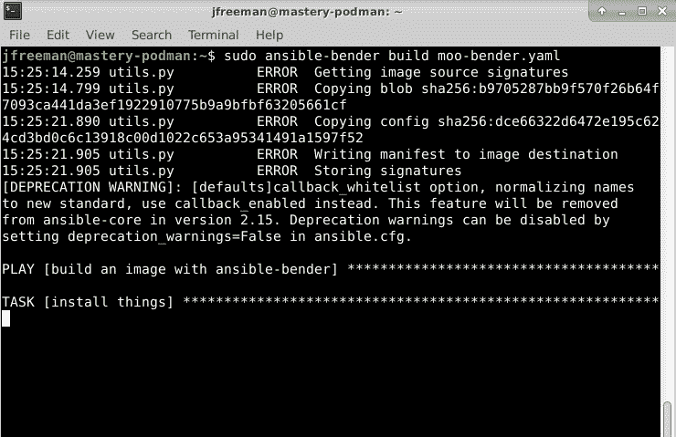

图 12.21 - 使用 ansible-bender 开始容器构建过程，以及虚假的 ERROR 消息

随着构建的继续，您应该看到 Ansible playbook 消息以您熟悉的方式返回。在过程结束时，您应该看到类似于*图 12.22*所示的成功构建的输出：

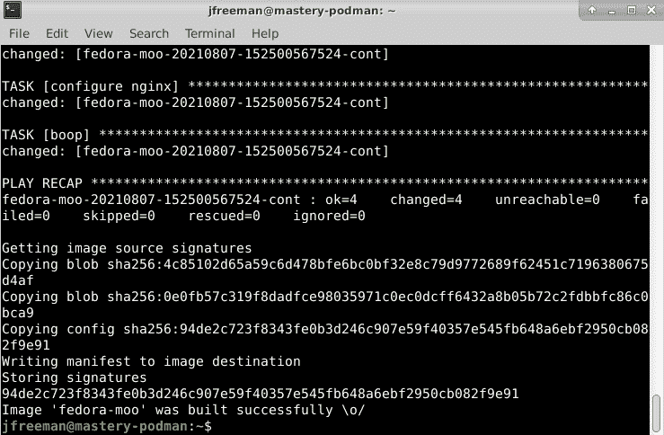

图 12.22 - 使用 ansible-bender 成功构建容器

从这里，您可以使用以下命令运行您新构建的容器：

```
sudo podman run -d fedora-moo
```

`fedora-moo`容器名称是在之前的 playbook 文件中的`ansible_bender`变量结构中设置的，而`-d`标志用于从容器中分离并在后台运行。与 Docker 类似，您可以使用以下命令查询系统上正在运行的容器：

```
sudo podman ps
```

这个过程的输出看起来有点像*图 12.23*所示：

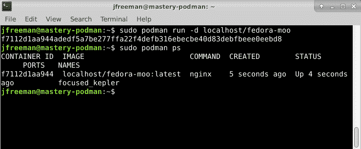

图 12.23 - 运行和查询我们新构建的 Podman 容器

最后，让我们看看我们是否可以从容器中实际检索到我们的`cowsay`网页。与我们的 Docker 示例不同，我们没有指示 Podman 将 Web 服务器端口重定向到构建机器上的端口，因此我们需要查询容器本身的 IP 地址。在获得`sudo podman ps`输出中的`CONTAINER ID`或`NAMES`后，我们可以使用以下命令查询这个（确保用您系统中的 ID 替换容器 ID）：

```
sudo podman inspect -f '{{ .NetworkSettings.IPAddress }}' f711
```

与 Docker 一样，只要您输入的字符在正在运行的容器列表中是唯一的，您就可以缩写您的容器 ID。一旦获得了 IP 地址，您就可以使用`curl`下载网页，就像我们之前做的那样 - 例如：

```
curl http://172.16.16.9
```

整个过程应该看起来像*图 12.24*所示：

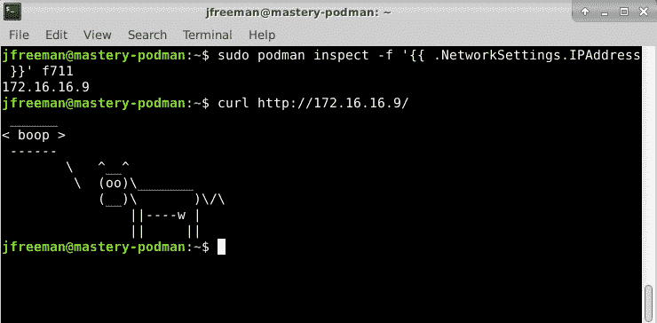

图 12.24 - 从使用 ansible-bender 构建的 Podman 容器中下载我们的 cowsay 网页

就是这样了！`ansible-bender`工具在使用一种通用语言 - 我们自己喜欢的 Ansible 来构建容器映像方面显示出了巨大的潜力！随着工具的发展，希望一些粗糙的地方（比如虚假的`ERROR`语句）将得到解决，并且对更多容器平台的支持的添加将真正使其成为一个有价值的容器映像自动化工具。这就结束了我们对使用 Ansible 进行基础架构提供的介绍 - 希望您觉得有价值。

# 总结

DevOps 已经推动了许多新方向的自动化，包括应用程序的容器化，甚至基础架构本身的创建。云计算服务使得可以自助管理用于运行服务的服务器群。Ansible 可以轻松地与这些服务进行交互，提供自动化和编排引擎。

在本章中，您学习了如何使用 Ansible 管理本地云基础架构，例如 OpenStack。然后，我们通过 AWS 和 Microsoft Azure 的公共云基础架构提供示例进行了扩展。最后，您学习了如何使用 Ansible 与 Docker 进行交互，以及如何使用 Ansible Container 整洁地打包 Docker 服务定义。

Ansible 可以启动几乎任何主机，除了正在运行的主机之外，并且在具有适当凭据的情况下，它可以创建它想要管理的基础架构，无论是一次性操作还是将应用程序的新版本部署到生产容器管理系统中。 最终结果是，一旦硬件就位并且服务提供商已配置，如果您愿意，您可以通过 Ansible 管理整个基础架构！

在本书的最后一章中，我们将研究自动化的一个新且迅速增长的领域：使用 Ansible 进行网络配置。

# 问题

1.  在 OpenStack 上创建或删除 VM 实例时，在您的播放中应该引用哪个清单主机？

a) OpenStack 主机

b) 本地主机

c) VM 浮动 IP 地址

d) 以上都不是

1.  如何在第二个播放中引用新创建的虚拟机，而无需使用动态清单脚本？

a) 使用`ansible.builtin.raw`命令。

b) 使用`ansible.builtin.shell`命令。

c) 使用`ansible.builtin.add_host`将新的 VM 添加到内存清单中。

d) 您需要使用动态清单插件。

1.  您仍然可以直接在 Ansible 4.x 及更高版本中运行动态清单脚本，就像在 Ansible 2.x 版本中一样。

a) 正确

b) 错误

1.  要使用动态清单脚本，并设置其参数，您现在可以（假设集合已安装）：

a) 使用插件名称和参数定义 YAML 清单文件。

b) 在`ansible`/`ansible-playbook`的`-i`参数中引用动态清单脚本。

c) 将插件名称放在播放定义中。

1.  第一次使用集合中的新模块（例如，与云提供商一起），您应该：

a) 始终阅读文档，检查已知问题。

b) 始终阅读文档，查看是否需要安装其他 Python 模块。

c) 始终阅读文档，查看应如何定义您的身份验证参数。

d) 以上所有

1.  如果目标主机上没有 Python 环境，Ansible 无法运行（这在最小的云操作系统映像上有时是这样）。 如果是这种情况，您仍然可以使用哪个模块从 playbook 任务中安装 Python？

a) `ansible.builtin.python`

b) `ansible.builtin.raw`

c) `ansible.builtin.command`

d) `ansible.builtin.shell`

1.  所有云提供商模块都将等待 VM 实例启动，然后才允许播放继续执行下一个任务。

a) 正确

b) 错误

1.  如果要等待确保主机在执行其他任务之前可以通过 SSH 访问，可以使用哪个模块？

a) `ansible.builtin.wait_for`

b) `ansible.builtin.ssh`

c) `ansible.builtin.test_connection`

d) `ansible.builtin.connect`

1.  Ansible 可以使用 Dockerfile 构建 Docker 容器，也可以不使用 Dockerfile。

a) 正确

b) 错误

1.  `ansible-bender`工具目前支持哪种构建环境？

a) Docker

b) LXC

c) Podman/Buildah

d) 以上所有
