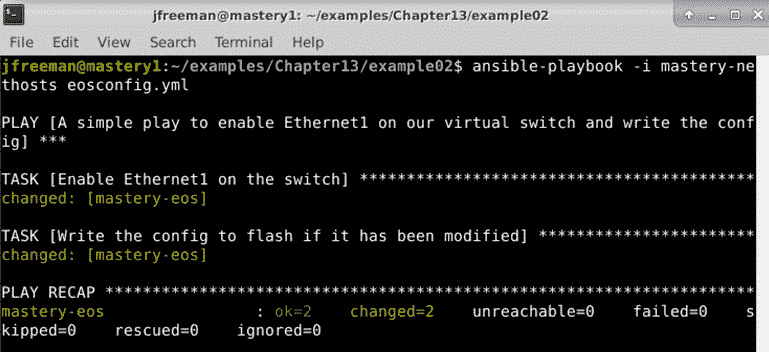
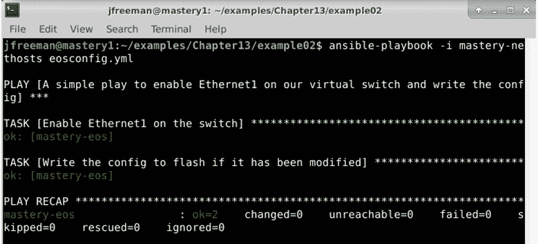
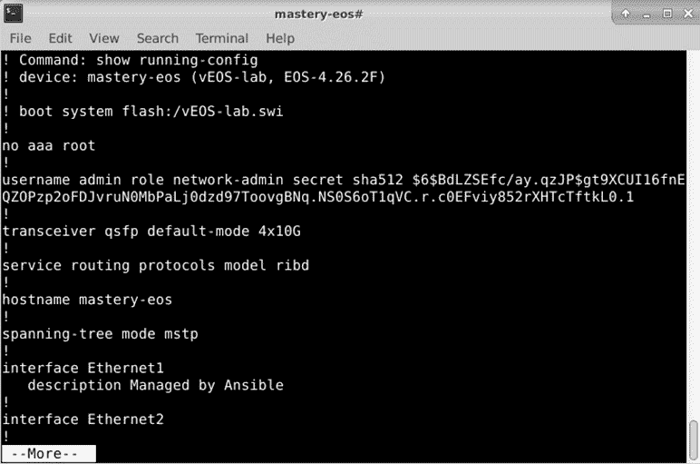
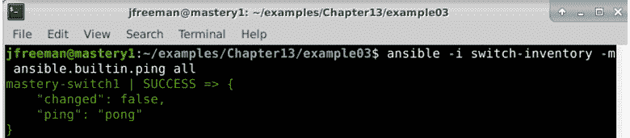
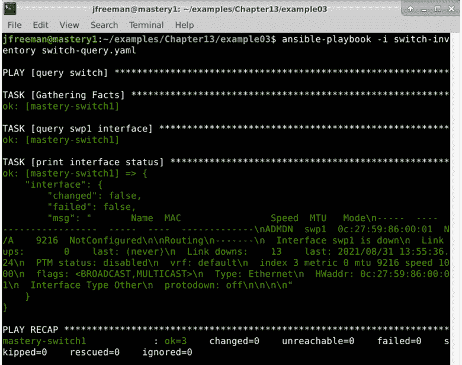
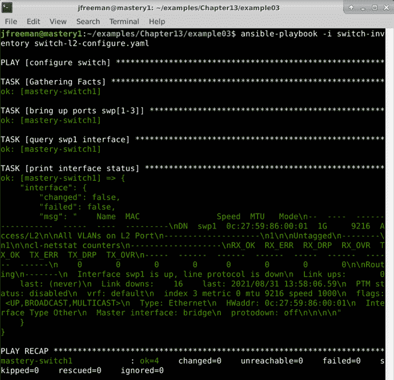
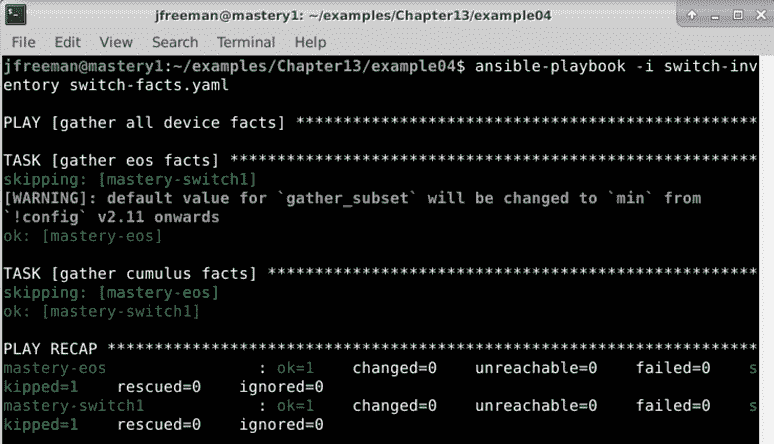
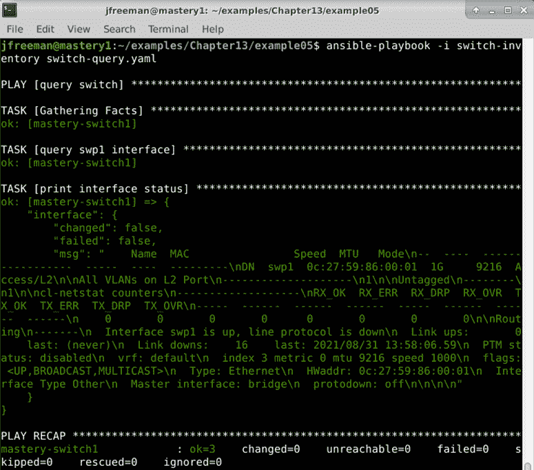

# 第十三章：*第十三章*：网络自动化

从历史上看，网络主要由硬件组成，只有少量软件参与。更改其拓扑结构涉及安装和配置新的交换机或机箱中的刀片，或者至少重新连接一些电缆。现在，情况已经改变，为了满足云托管或基于微服务的部署等多租户环境的复杂基础设施，需要一个更具敏捷性和灵活性的网络。这导致了**软件定义网络**（**SDN**）的出现，这种方法将网络配置集中化（在历史上是在每个设备上配置），并导致网络拓扑被定义为一个整体，而不是一系列组件部分。这可以说是网络本身的抽象层，因此意味着就像基础设施即服务一样，现在可以用代码来定义网络。

自本书上一版出版以来，Ansible 已经进行了大量工作，以增强和标准化项目内的网络自动化。除此之外，集合的出现使得许多网络设备的模块能够从`ansible-core`软件包中解耦出来，从而使网络供应商能够更好地拥有他们的代码，并根据需要发布它们，而不是受到 Ansible 发布节奏的驱动。在撰写本文时，只有少数 Ansible 集合（因此模块）仍由 Ansible 网络团队负责，大多数现在直接由供应商自己维护。这对所有相关方都是件好事，并确保了 Ansible 网络产品的更可靠和更快速的发展。

最终，这意味着一件事 - 您现在可以在 Ansible playbook 中定义您的网络基础设施，就像您可以描述您的计算基础设施一样，就像我们在上一章中描述的那样。

在本章中，我们将通过以下主题探讨这一迅速增长的重要领域：

+   用于网络管理的 Ansible

+   处理多种设备类型

+   使用`cli_command`模块

+   使用 Ansible 配置 Arista EOS 交换机

+   使用 Ansible 配置 Cumulus Networks 交换机

+   最佳实践

# 技术要求

要跟随本章中提出的示例，您需要一台运行**Ansible 4.3**或更新版本的 Linux 机器。几乎任何 Linux 版本都可以 - 对于那些对具体情况感兴趣的人，本章中提供的所有代码都是在**Ubuntu Server 20.04 LTS**上测试的，除非另有说明，并且在 Ansible 4.3 上进行了测试。本章附带的示例代码可以从 GitHub 的以下网址下载：[`github.com/PacktPublishing/Mastering-Ansible-Fourth-Edition/tree/main/Chapter13`](https://github.com/PacktPublishing/Mastering-Ansible-Fourth-Edition/tree/main/Chapter13)。

查看以下视频以查看代码的实际操作：[`bit.ly/3G5pNjJ`](https://bit.ly/3G5pNjJ)。

# 用于网络管理的 Ansible

核心网络设备，如交换机、路由器和防火墙，在企业环境中一直具有管理接口。**命令行界面**（**CLI**）一直在这些设备上很受欢迎，因为它们支持脚本编写，因此，正如您已经猜到的那样，它们非常适合 Ansible 自动化。

从历史上看，团队在管理这些设备时面临着一系列挑战，包括维护配置，应对设备的故障/丢失，并在出现问题时获得支持。通常，公司发现自己被锁定在单一网络供应商（或者说，最多是一小部分供应商）中，以便使用专有工具来管理网络。与任何被技术所束缚的情况一样，这既有好处也有坏处。再加上软件定义网络的复杂性正在迅速变化和发展，挑战变得更加严峻。在本节中，我们将探讨 Ansible 如何解决这些挑战。

## 跨平台支持

正如我们在本书中所看到的，Ansible 旨在使自动化代码在尽可能多的场景中可移植和可重用。在[*第十二章*]（B17462_12_Final_JC_ePub.xhtml#_idTextAnchor224）*，基础设施配置*中，我们使用了几乎相同的 playbook 来配置四个不同提供商的基础设施，并且为了支持这一点，所给出的示例相当简单。当然，如果我们愿意，我们可以通过使用角色来进一步开发这一点，以消除如此多的重复代码，但这种简单性是故意的，以演示代码的相似性，无论使用的是哪个提供商。

简而言之，Ansible 使得编写可以在多个环境中运行的 playbook 以最小的工作量实现相同的目标成为可能，一旦我们定义了第一个目标。网络也是如此。集合的出现意味着不再有中央网络模块索引，因为集合本身定义了支持哪些平台。然而，*用于网络自动化的 Ansible*页面，可在[`docs.ansible.com/ansible/latest/network/index.html`](https://docs.ansible.com/ansible/latest/network/index.html)找到，这是一个很好的起点，因为它提供了许多受支持平台的列表。然而，此页面上的平台列表并不完整-例如，在本章的后面部分，我们将看到如何配置基于 Cumulus Linux 平台的交换机，而该平台的支持并未明确列在前述页面上。

部分原因是 Cumulus Linux 和其他广泛的网络技术的支持由`Community.Network`集合支持。支持的平台和模块列表可以在这里找到：[`docs.ansible.com/ansible/latest/collections/community/network/`](https://docs.ansible.com/ansible/latest/collections/community/network/)。

由于 Ansible 文档是自动构建的，将模块分散到集合中在诸如网络等领域有些许颠覆性，并且毫无疑问会随着时间的推移而改进。与此同时，通过一点搜索，您肯定会发现对您的网络平台的支持，因为随着 Ansible 的发展，这种支持一直在扩大。

结果是，由于有如此广泛（并且不断增长）的设备支持范围，网络管理员可以轻松地从一个中心位置管理所有设备，而无需专有工具。然而，好处不仅仅是这些。

## 配置可移植性

正如我们已经讨论过的，Ansible 代码具有很高的可移植性。在网络自动化领域，这是非常有价值的。首先，这意味着您可以在开发网络（或模拟器）上推出配置更改并进行测试，然后一旦配置被认为已经成功测试，就可以对不同的清单（例如生产清单）使用相同的代码进行配置更改。 

然而，好处并不止于此。在软件升级或配置更改出现问题时，网络工程师的挑战是成功地与供应商联系寻求支持和帮助。这需要向供应商发送足够的细节，以使他们至少能够理解问题，并且很可能想要重现它（特别是在固件问题的情况下）。当网络的配置在 Ansible 中定义时，playbooks 本身可以发送给供应商，使他们能够快速准确地理解网络拓扑并诊断问题。我遇到过一些情况，网络供应商现在开始坚持要求在提出支持票时包含网络配置的 Ansible playbooks。这是因为这使他们能够比以往更快地解决问题。

有效使用**Ansible Vault**确保敏感数据不会出现在主要 playbooks 中，这意味着可以在发送给第三方之前轻松删除它（即使它被意外发送，也不会被读取，因为它在静止状态下是加密的）。

## 备份，恢复和版本控制

尽管大多数企业都有健全的变更控制程序，但并不能保证这些程序 100%遵守，人类已经知道在不准确记录所做更改的情况下调整配置。将网络配置移至 Ansible 可以消除这个问题，因为配置是由 playbooks 定义的已知状态，可以轻松地使用`check`运行与运行配置进行比较。

不仅如此，配置也可以轻松地进行备份和恢复。例如，如果交换机故障并且需要更换，如果更换的是相同类型的交换机，可以通过运行与配置其前身相同的 Ansible playbooks 快速配置并投入使用，如果适当的话，playbook 运行可能仅限于替换交换机的清单主机 - 尽管 Ansible 的幂等性意味着在整个网络上运行它应该是无害的。

这也适用于版本控制 - 网络配置 playbooks 可以推送到源代码控制存储库，从而可以跟踪配置版本，并轻松检查随时间的差异。

## 自动变更请求

通常，可能需要对网络进行微小更改以推出新项目 - 也许是新的 VLAN 或 VXLAN，或者一些以前未使用的端口已被引入服务。配置参数将由变更请求和/或网络设计明确定，可能并不是高素质网络工程师最好的选择来进行简单的配置更改。这些任务通常是例行公事，因为配置更改可以在 Ansible playbook 中进行模板化，传递给它的变量已经由变更请求定义（例如，端口号和 VLAN 成员资格详情）。

这样就可以为工程师节省更多重要工作的时间，例如设计新架构，新产品研究和测试。

结合使用 AWX 或 Ansible Tower 等软件包（正如我们在本书中早期讨论的那样），简单而经过充分测试的更改可以完全自动化，或者通过简单传递所需的参数传递给一线团队来安全执行。通过这种方式，无论执行更改的人的技能水平如何，人为错误的风险都会大大降低。

有了这些好处得到了很好的建立和理解，让我们看看如何开始编写 playbooks 来处理多设备网络。

# 处理多种设备类型

在一个我们不被锁定在单一供应商的世界中，了解如何处理基础设施中的不同网络设备是很重要的。我们在前一章中已经确定，对于不同的基础设施提供商，已经建立了与 Ansible 交互的类似流程。这在交换机上可能会有所不同，因为并非所有命令行交换机接口都是相同的。例如，在 Cumulus Networks 交换机上，可以利用直接的 SSH 连接，这意味着到目前为止我们在本书中学到的关于连接到支持 SSH 的设备的一切仍然适用。

然而，其他设备，比如 F5 BIG-IP，不使用这样的接口，因此需要从 Ansible 主机上运行模块。配置参数必须直接传递给模块，而不是使用简单的与连接相关的主机变量，比如`ansible_user`。

当然，在这个讨论中还存在一个灰色地带。一些设备，比如 Arista EOS 或基于 Cisco IOS 的设备，将由 SSH 管理，因此你可能会误以为可以像连接其他 Linux 主机一样直接使用 SSH 连接到它们。然而，事实并非如此——如果我们回顾[*第一章*]《Ansible 的系统架构和设计》，我们了解到，为了让 Ansible 能够通过 SSH 自动化命令，它会发送一小段 Python 代码到远程主机进行执行（或者在 Windows 主机的情况下是 PowerShell）。大多数交换机虽然有基于 SSH 的用户界面，但不能指望在其上有 Python 环境，因此这种操作模式是不可能的（Cumulus Linux 是个例外，因为它具有可用的 Python 环境）。因此，像 Arista EOS 和 Cisco IOS 这样的设备在历史上使用本地执行，即 Ansible 代码在控制节点上运行，然后自动化请求被转换为适当的 CLI（或 API）调用并直接传递给设备。因此，不需要远程 Python 环境。

你会发现许多历史示例使用了这种操作模式，并且它们很容易被识别，因为在 play 定义中会有以下行：

```
connection: local
```

可能还可以将其定义为清单变量：

```
ansible_connection=local 
```

无论如何，本地连接模式的操作已经被弃用，虽然大多数使用这种连接模式的传统网络 playbook 今天仍然可以运行，但预计明年将停止支持这种模式。

在可能的情况下，鼓励用户使用以下通信协议之一：

+   `ansible.netcommon.network_cli`：这种协议将 play 任务转换为通过 SSH 的 CLI 命令。

+   `ansible.netcommon.netconf`：这种协议将 play 任务转换为通过 SSH 发送到设备的 XML 数据，以便由`netconf`进行配置。

+   `ansible.netcommon.httpapi`：这种协议使用基于 HTTP 或 HTTPS 的 API 与网络设备通信。

前面三种通信协议都是持久的——也就是说，它们不需要为每个任务建立和拆除网络连接——而本地连接方法不支持这一点，因此比这些模式要低效得多。在前面的列表中，`ansible.netcommon.network_cli`是你可能会遇到的最常见的，我们将在下一节中讨论这个问题。

我们不希望你们中的许多人能够访问各种各样的网络硬件来在本章的示例中使用。稍后，我们将看两个示例，这些示例可以免费下载（在撰写本文时，取决于您是否愿意分享一些个人信息），如果您愿意，您可以尝试。不过，现在，我们将更详细地介绍首次自动化新网络设备时要采用的流程，以便您知道如何将其应用到特定情况和首选网络供应商。

## 研究您的模块

与任何网络设备一起工作时的第一个任务是了解您需要使用哪个模块与 Ansible 一起使用。这将涉及两件事：

+   您希望自动管理哪个设备？

+   您希望在设备上执行什么任务？

有了这些信息，您可以搜索 Ansible 文档站点和 Ansible Galaxy，以了解您的设备和所需任务是否受支持。比如，例如，您有一个 F5 BIG-IP 设备，并且您想在该设备上保存和加载配置。

快速扫描 Ansible Galaxy 上可用集合的建议是我们应该查看`f5networks.f5_modules`集合（[`galaxy.ansible.com/f5networks/f5_modules`](https://galaxy.ansible.com/f5networks/f5_modules)），并且从中，我们应该查看`f5networks.f5_modules.bigip_config`模块，这将满足我们的需求。因此，我们可以继续进行模块配置（请参阅下一节），然后围绕此模块编写所需的 playbook。

但是，如果您的设备没有模块会发生什么呢？在这种情况下，您有两种选择。首先，您可以编写一个新的模块，以便 Ansible 执行您需要的任务。这是您可以为社区做出贡献的事情，*第十章*，*扩展 Ansible*，包含了您开始这项任务所需的所有细节。

或者，如果您想快速启动某些东西，请记住 Ansible 可以在大多数支持的传输方法中发送原始命令。例如，在作者的实验室设置中，他们有一个 TP-Link 托管交换机。没有原生的 Ansible 模块支持这个特定的交换机 - 但是，除了基于 Web 的 GUI 之外，这个交换机还有一个 SSH 管理接口。如果我想快速启动某些东西，我可以使用 Ansible 的`ansible.builtin.raw`模块通过 SSH 发送原始命令到交换机。当然，这种解决方案缺乏优雅性，并且很难编写幂等的 playbook，但它确实使我能够快速使用 Ansible 和这个设备。

这捕捉了 Ansible 的美丽之处 - 新设备可以轻松管理，而且只需稍加巧思，就可以为社区的利益进行扩展。

## 配置您的模块

正如我们在本书的前面已经演示了`ansible.builtin.raw`模块的使用以及扩展 Ansible，我们将继续处理我们找到了一个想要使用的模块的情况。正如您可能已经在本书的一些早期章节中注意到的那样，尽管 Ansible 包含了许多模块，但并非所有模块都可以立即使用。

Ansible 是用 Python 编写的，在大多数情况下，如果有依赖关系，就会有 Python 模块。重要的是要查看文档。例如，我们在前一节中选择的`f5networks.f5_modules.bigip_config`模块。快速查看文档的*Requirements*部分显示，如果您使用的是旧于 3.5 版本的 Python，则需要（在撰写本文时）`ipaddress` Python 模块。

如果您没有运行 Python 3.5 或更高版本，则需要安装此版本以使集合的模块正常运行。有多种安装方法——一些操作系统可能内置了一个本地包，如果可用并且满足版本要求，那么使用它是完全可以的。这可能在供应商支持方面具有优势。但是，如果没有这样的软件包可用，Python 模块可以很容易地使用`pip`（或`pip3`）工具进行安装。假设这已经在您的系统上，安装就像使用以下代码一样简单：

```
sudo pip install ipaddress
```

还要确保查看文档的*Notes*部分（对于我们当前讨论的模块，请转到[`clouddocs.f5.com/products/orchestration/ansible/devel/modules/bigip_config_module.html#notes`](https://clouddocs.f5.com/products/orchestration/ansible/devel/modules/bigip_config_module.html#notes)）。继续这个例子，我们可以看到它只支持 BIG-IP 软件版本 12 及更高版本，因此，如果您使用的是早期版本，您将不得不找到另一种自动化设备的方法（或者如果这是可接受的路径，则升级软件）。

## 编写您的 playbooks

一旦您的模块已经配置好，并且满足了所有要求（无论是 Python 模块依赖项还是设备软件要求），就该开始编写您的 playbook 了。这应该是一个简单的任务，只需按照模块的文档进行。假设我们想要重置**F5 BIG-IP**设备上的配置。从文档中，我们可以看到认证参数是传递给模块本身的。此外，示例代码显示了`delegate_to`任务关键字的使用；这两个线索告诉我们，该模块并没有使用 Ansible 的本地 SSH 传输，而是使用了模块本身定义的传输。因此，重置单个设备配置的 playbook 可能如下所示：

```
---
- name: reset an F5
  hosts: localhost
  gather_facts: false
  tasks:
    - name: reset my F5
      f5networks.f5_modules.bigip_config:
        reset: yes
        save: yes
        provider:
          server: lb.mastery.example.com
          user: admin
          password: mastery
          validate_certs: no 
```

在这种情况下，我们正在使用文档中的一个经典示例来重置我们的配置。请注意，由于我们的`hosts`参数只定义了`localhost`，所以我们不需要`delegate_to`关键字，因为在这个 playbook 中，`f5networks.f5_modules.bigip_config`模块只会从`localhost`运行。

通过这种方式，我们已经自动化了一个简单的、但否则需要手动和重复执行的任务。运行 playbook 就像执行以下命令一样简单：

```
ansible-playbook -i mastery-hosts reset-f5.yaml
```

当然，要测试这个 playbook，您需要有一个 F5 BIG-IP 设备进行测试。并非每个人都有这个设备，因此，在本章的后面，我们将继续演示每个读者都可以使用的真实示例。然而，本章的这一部分旨在为您提供一个关于如何将您的网络设备与 Ansible 集成的坚实概述。因此，希望即使您有一个我们在这里没有提到的设备，您也能理解如何使其工作的基本原理。

# 使用 cli_command 模块

在我们开始实际的实例之前，我们必须看一下自从上一版书籍出版以来已经成为网络设备配置中心的模块。

正如我们在前一节中讨论的，大多数网络设备不能指望在其上有一个可用的 Python 环境，因此，Ansible 将使用本地执行——也就是说，与网络设备相关的所有任务都在 Ansible 控制节点上执行，转换为设备接收的正确格式（无论是 CLI、基于 HTTP 的 API 还是其他格式），然后通过网络发送到设备。Ansible 2.7 主要依赖于一个名为`local`的通信协议进行网络设备自动化。这样做效果很好，但也存在一些缺点，包括以下几点：

+   `local`协议不支持持久的网络连接 - 需要为执行的每个任务建立一个新连接，然后将其拆除。这是极其低效和缓慢的，与 Ansible 最初的愿景完全不符。

+   每个模块负责自己的通信协议，因此每个模块的库要求通常是不同的，代码也没有被共享。

+   在提供网络设备通信的方式上几乎没有共同点，并且必须在每个任务中提供凭据，这再次导致了低效的代码。

由于这些问题，预计`local`协议将在未来一年内从 Ansible 中删除，并鼓励您开始使用本章前面列出的三种新协议中的一种*处理多种设备类型*。其中，最常见的是`ansible.netcommon.network_cli`协议，它可以用于连接到您可能希望使用 Ansible 自动化的许多网络设备 - 您可以通过查看提供的表格来看到此模块用于网络设备配置的普遍程度[`docs.ansible.com/ansible/latest/network/user_guide/platform_index.html#settings-by-platform`](https://docs.ansible.com/ansible/latest/network/user_guide/platform_index.html#settings-by-platform)。

这种协议的美妙之处在于现在可以在清单中设置认证参数，就像对任何其他操作系统一样，简化了操作手册并消除了设置重复凭据的需要。还支持持久连接，意味着自动化运行速度更快。那么，它是如何工作的呢？

好吧，假设我们有一个要配置的基于 Cisco IOS 的网络设备。我们可以定义一个看起来像这样的简单清单文件：

```
[ios_devices]
ios-switch1.example.org
[ios_devices:vars]
ansible_connection: ansible.netcommon.network_cli
ansible_network_os: cisco.ios.ios
ansible_user: admin
ansible_password: password123
ansible_become: yes
ansible_become_method: enable
ansible_become_password: password123
```

注意这是多么容易？我们设置了与本书中的示例中已经看到的相同的`ansible_user`，`ansible_password`和`ansible_become`清单变量。但是，我们在这里添加了`ansible_connection`变量，它告诉 Ansible 使用`ansible.netcommon.network_cli`协议。当然，这只是故事的一半 - 这个协议告诉 Ansible 通过 SSH 发送 CLI 命令，但并没有告诉 Ansible 连接的另一端是什么类型的设备。由于所有的 CLI 在某种程度上都是不同的，这很重要，因此我们使用`ansible_network_os`告诉 Ansible 它正在与什么类型的设备交流，以便它可以向设备说出正确的 CLI 语言。

最后，我们需要更改`ansible_become`方法 - 在 Linux 上，这几乎肯定是`sudo`，但在 IOS 交换机上，它是`enable`。我们还需要提供权限提升的密码，就像如果您配置了需要密码的`sudo`一样。

这就是它的复杂性 - 使用这个清单及其分配的变量的简单操作手册可能如下所示：

```
---
- name: Simple IOS example playbook
  hosts: all
  gather_facts: no
  tasks:
    - name: Save the running config 
      cisco.ios.ios_config:
        save_when: always
```

注意这是多么容易 - 现在我们可以以与处理 Linux 或 Windows 主机相同的方式编写操作手册。当然，每个网络平台都有微妙的差异，并且可以在此找到支持的各种设备的特定于平台的选项：[`docs.ansible.com/ansible/latest/network/user_guide/platform_index.html`](https://docs.ansible.com/ansible/latest/network/user_guide/platform_index.html)。

使用`ansible.netcommon.network_cli`协议的另一个好处是，它支持`ansible_ssh_common_args`清单变量，就像任何其他 SSH 管理的主机（使用 OpenSSH 的 Linux 或 Windows）一样。这很重要，因为许多网络设备是在安全的隔离网络上管理的 - 如果这些访问权限落入错误的手中，可能会造成严重的损害。这意味着这些主机通常使用跳板主机（也称为跳板主机）进行访问。要通过这个跳板运行您的自动化 playbook，您可以将以下内容添加到您的清单变量中：

```
ansible_ssh_common_args: '-o ProxyCommand="ssh -W %h:%p -q jumphost.example.org"'
```

前面的示例假设您的堡垒机或跳板主机的主机名为`jumphost.example.org`，并且您已经从 Ansible 控制节点为其设置了基于密钥的无密码 SSH 访问。当然，还有其他方法可以与这个堡垒主机进行身份验证，这留给您去探索。

当然，这只是一个例子，而基于 Cisco IOS 的设备并不是每个阅读本书的人都能接触到的东西。然而，在撰写本文时，您可以轻松且免费地通过在其网站上注册免费帐户并转到[`www.arista.com/en/support/software-download`](https://www.arista.com/en/support/software-download)来下载 Arista vEOS 镜像。从这里，您可以将这些镜像加载到网络模拟工具（如 GNS3）中，并自行尝试使用 Ansible 进行网络自动化，而无需访问任何昂贵的硬件。我们将在下一节中讨论这个问题。

# 使用 Ansible 配置 Arista EOS 交换机

使用 Arista 交换机（或虚拟交换机）进行启动和运行是您的任务，但是如果您有兴趣在 GNS3 中进行此操作，GNS3 是一个流行且免费的开源工具，用于学习网络知识，这里有一些很好的指导：[`gns3.com/marketplace/appliances/arista-veos`](https://gns3.com/marketplace/appliances/arista-veos)。

您可能很幸运，手边有一台基于 Arista EOS 的设备，这也没关系 - 本节中的自动化代码在任何情况下都能很好地工作。

以下示例是针对 GNS3 中的 Arista vEOS 设备创建的，使用了上述链接中找到的说明。首次启动设备时，您需要取消 ZeroTouch 配置。要做到这一点，请使用`admin`用户名登录（默认情况下密码为空），并输入以下命令：

```
zerotouch cancel
```

虚拟设备将重新启动，当它再次启动时，使用相同的凭据登录。输入以下命令进入特权用户模式：

```
enable
```

请注意，这是我们在之前的 Cisco IOS 示例中使用的`ansible_become`方法，我们将很快再次使用相同的方法。现在，使用以下命令进入配置模式：

```
configure terminal
```

如果 vEOS 设备默认密码为空，则无法通过 SSH 管理该设备，因此我们将使用以下命令为我们的虚拟设备设置一个简单的密码：

```
username admin secret admin
```

这将把`admin`用户的密码设置为`admin`。接下来（假设您已经将 vEOS 设备的管理接口连接到虚拟网络），您需要启用此接口并为其分配一个有效的 IP 地址。确切的 IP 地址将取决于您的测试网络，但实现此目的的命令如下所示：

```
interface management 1
no shutdown
ip address 10.0.50.99/8
```

最后，退出配置模式并将配置写入交换机，以便在下次重新启动时再次启动：

```
end
write
```

就是这样 - 您的 vEOS 设备现在已准备好使用 Ansible 进行管理！

有了这个配置，现在您可以为测试交换机定义清单。我创建了我的清单如下（基于前面的配置）：

```
[eos]
mastery-eos ansible_host=10.0.50.99
[eos:vars]
ansible_connection=ansible.netcommon.network_cli
ansible_network_os=arista.eos.eos
ansible_user=admin
ansible_password=admin
ansible_become=yes
ansible_become_method=enable
```

注意这与我们在上一节中创建的基于 Cisco IOS 的示例清单有多相似？这是`ansible.netcommon.network_cli`协议的伟大之处之一 - 当使用此协议时，您的所有代码编写起来都更容易。当然，与本书中大多数示例一样，您不会将您的管理密码明文留在外面，但这有助于保持示例简单和简洁，鼓励您探索使用 Ansible Vault 来安全存储它们。

从这里，我们可以开发一个简单的 playbook 来演示针对我们的虚拟交换机的命令自动化。让我们选择一个简单的任务 - 我们将确保交换机上的`Ethernet1`接口是启用的，给它一个有意义的名称，然后将配置写入交换机，以便在重新启动后保持不变。实现这一点的 playbook 可能看起来像这样：

```
---
- name: A simple play to enable Ethernet1 on our virtual switch and write the config
  hosts: all
  gather_facts: no
  tasks:
    - name: Enable Ethernet1 on the switch
      arista.eos.eos_interfaces:
        config:
        - name: Ethernet1
          enabled: yes
          description: Managed by Ansible
        state: replaced
    - name: Write the config to flash if it has been modified
      arista.eos.eos_config:
        save_when: modified
```

您可以以您习惯的方式运行此 playbook。如果您正在运行本书附带的示例代码，那么命令将如下所示：

```
ansible-playbook -i mastery-nethosts eosconfig.yml
```

当您对交换机运行此命令时，您应该看到类似以下的 Ansible 输出：



图 13.1 - 使用 Ansible 配置 Arista vEOS 设备

现在，当然，由于我们正在使用 Ansible 进行此配置更改，我们期望更改是幂等的 - 我们应该能够再次运行相同的 playbook，而不会发生任何破坏性的事情。如果您再次运行 playbook，输出应该如下所示：



图 13.2 - 再次运行相同的 playbook 以演示幂等性

通过绿色的`ok`任务状态，可以看到这个 playbook 第二次成功运行，并且这一次没有对交换机配置进行任何更改。

如果您愿意，您可以通过直接 SSH 到交换机并执行以下命令来验证我们 playbook 运行的结果：

```
enable
show running-config
```

从这里，您应该看到类似以下的内容：



图 13.3 - 手动查询我们的 vEOS 设备的配置

在这里，我们可以看到`Ethernet1`接口具有我们在 playbook 中设置的描述，并且没有禁用它的指令，因此确保它是启用的。

就是这样 - 通过完成这个示例，您刚刚在 Ansible 中执行了您的第一个真实的网络设备自动化！希望这能向您展示，特别是现在，鉴于`ansible.netcommon.network_cli`协议的出现，实现您想要的配置非常容易和快速。大多数支持此协议的设备将类似工作，如果您对此感兴趣，鼓励您进一步探索。但是，如果我们想要使用另一台设备怎么办？好吧，Cumulus Linux（现在由 NVIDIA 拥有）是一个网络设备的开源操作系统，可以在白盒硬件上运行 - 也就是说，它不是专有于任何特定的硬件。幸运的是，您可以免费下载 Cumulus VX 的副本，这是他们交换机操作系统的虚拟版本，以进行实验。我们将在下一节中看看 Ansible 如何自动化这个网络平台。

# 使用 Ansible 配置 Cumulus Networks 交换机

Cumulus Linux（由 NVIDIA 收购的 Cumulus Networks 创建）是一种开源网络操作系统，可以在各种裸机交换机上运行，为数据中心网络提供了开源方法。这是网络设计的重大进步，也是从过去专有模型的重大转变。他们提供了一个免费版本的软件，可以在您选择的 hypervisor 上运行，用于测试和评估，称为 Cumulus VX。本节中的示例基于 Cumulus VX 版本 4.4.0。

## 定义我们的清单

快速的研究显示，Cumulus VX 将使用 Ansible 的标准 SSH 传输方法。由于它是专门设计用于在交换机硬件上运行的 Linux 发行版，因此它能够以远程执行模式运行，因此不需要`ansible.netcommon.network_cli`协议。此外，仅为使用该系统而定义了一个模块，`network.cumulus.nclu`，它是`community.network`集合的一部分（[`galaxy.ansible.com/community/network`](https://galaxy.ansible.com/community/network)）。使用此模块不需要先决条件模块，因此我们可以直接定义我们的清单。

默认情况下，Cumulus VX 启动时使用已配置为使用 DHCP 获取 IP 地址的管理接口。根据您的运行方式，您可能会发现它还有其他三个虚拟交换机端口供我们测试和配置，尽管如果您将其集成到诸如 GNS3 之类的工具中，您将发现可以轻松重新配置可用于您的虚拟交换机端口的数量。

如果您运行的 Cumulus Linux 版本旧于 3.7，您会发现镜像已经设置了默认登录凭据。因此，只要您确定了虚拟交换机的 IP 地址，您可以创建一个简单的清单，例如以下清单，它使用默认用户名和密码：

```
[cumulus]
mastery-switch1 ansible_host=10.0.50.110
[cumulus:vars]
ansible_user=cumulus
ansible_ssh_pass=CumulusLinux!
```

Cumulus Linux 的新版本，例如 4.4.0 - 在撰写本文时可用的最新版本，并用于本节示例 - 需要您在首次启动交换机时设置密码。如果您使用此版本，您需要首次启动虚拟交换机，然后使用默认用户名`cumulus`和默认密码`cumulus`登录。然后，您将被提示更改密码。

完成这些步骤后，您就可以开始自动化交换机配置。您可以使用我们之前定义的清单，并简单地将`ansible_ssh_pass`的值替换为您设置的密码。

请注意以下内容：

+   `ansible_host`中指定的 IP 地址几乎肯定与我的不同 - 请确保将其更改为 Cumulus VX 虚拟机的正确值。您可能需要登录 VM 控制台以获取 IP 地址，例如使用`ip addr show`命令。

+   再次强调，您绝对不会在清晰文本中放置密码在清单文件中 - 但是，为了简单起见并节省时间，我们将在这里指定默认密码。在实际用例中，始终使用保险库，或者设置基于密钥的 SSH 身份验证。

定义了清单后，让我们使用临时命令使用`ping`模块测试连接，如下所示：

```
ansible -i switch-inventory -m ansible.builtin.ping all
```

如果一切设置正确，您应该收到以下输出：



图 13.4 - 检查 Ansible 与我们的虚拟 Cumulus Linux 交换机的连接

正如我们在*第一章*中讨论的那样，*Ansible 的系统架构和设计*，`ansible.builtin.ping`模块执行完整的端到端连接测试，包括在传输层进行身份验证。因此，如果您收到了像之前显示的成功测试结果，我们可以有信心继续编写我们的第一个 playbook。

## 实际例子

Cumulus VX 镜像完全未配置（除了`eth0`管理端口上的 DHCP 客户端配置）。根据您下载的版本，它可能有三个标记为`swp1`、`swp2`和`swp3`的交换机端口。让我们查询其中一个接口，看看是否有任何现有配置。我们可以使用一个名为`switch-query.yaml`的简单 playbook 来查询`swp1`：

```
---
- name: query switch
  hosts: mastery-switch1
  tasks:
  - name: query swp1 interface
    community.network.nclu:
      commands:
        - show interface swp1
    register: interface
  - name: print interface status
    ansible.builtin.debug:
      var: interface
```

现在，假设我们使用以下命令运行：

```
ansible-playbook -i switch-inventory switch-query.yaml
```

我们应该看到类似以下的内容：



图 13.5 - 使用 Ansible 查询 Cumulus Linux 交换机端口的默认值

这证实了我们对 VM 镜像的初始说法 - 我们可以看到交换机端口没有配置。使用 Ansible 和`community.network.nclu`模块将这个 VM 变成一个简单的二层交换机非常容易。下面的 playbook，名为`switch-l2-configure.yaml`，就是这样做的：

```
---
- name: configure switch
  hosts: mastery-switch1
  tasks:
  - name: bring up ports swp[1-3]
    community.network.nclu:
      template: |
        
        add interface swp{{interface}}
        add bridge ports swp{{interface}}
        
      commit: true
  - name: query swp1 interface
    community.network.nclu:
      commands:
        - show interface swp1
    register: interface
  - name: print interface status
    ansible.builtin.debug:
      var: interface
```

请注意，我们正在使用一些巧妙的内联 Jinja2 模板来在三个接口上运行`for`循环，省去了创建重复和繁琐代码的需要。这些命令启动了三个交换机接口，并将它们添加到默认的二层桥接中。

这也展示了 Ansible 中可用的各种网络模块之间的差异。在前一节中，我们配置基于 EOS 的交换机时，有许多不同的模块可供使用，每个模块都有不同的目的 - 例如配置接口、配置路由和配置 VLAN。相比之下，基于 Cumulus Linux 的交换机只有一个模块：`community.network.nclu`。这并不是问题，但由于我们通过一个模块发送所有配置命令，利用 Jinja2 模板（可以支持诸如`for`循环之类的结构）对我们很有帮助。

最后，`commit: true`行立即将这些配置应用到交换机上。现在，让我们用以下命令运行它：

```
ansible-playbook -i switch-inventory switch-l2-configure.yaml
```

此时，我们将看到`swp1`的不同状态，如下所示：


图 13.6 - 使用 Ansible 成功配置我们的 Cumulus Linux 虚拟交换机

正如我们所看到的，`swp1`接口现在已经启动并加入了桥接，准备好进行交换流量。然而，如果您仔细观察前面的截图，您会发现`bring up ports swp[1-3]`任务的状态是`ok`，而不是`changed`。然而，我们可以从`switch`查询结果中看到配置已经改变。这似乎是`community.network`集合版本`3.0.0`中的一个 bug，并已经被作者提出。希望这个集合的新版本能够正确显示当 Cumulus 交换机的配置发生变化时的改变状态。

由于我们正在查询端口的状态，我们仍然可以再次运行 playbook 来测试幂等性。让我们看看如果我们在交换机上不执行任何其他步骤的情况下再次运行 playbook 会发生什么：



图 13.7 - 测试我们的 playbook 对 Cumulus Linux 虚拟交换机的幂等性

这一次，这个任务的状态仍然是`ok`，但我们可以看到接口状态查询结果是相同的，显示我们的配置已经持久化，并且没有以任何不利的方式被修改（如果不支持幂等性，可能会发生这种情况）。通过这种方式，自动化配置我们的 Cumulus Linux 交换机的 playbook 是幂等的，并且在多次运行时会产生一致的状态。这也意味着，如果交换机的配置漂移（例如由于用户干预），很容易看出发生了变化。不幸的是，`community.network.nclu`模块目前不支持`ansible-playbook`的`check`模式，但它仍然提供了一种强大的方式来配置和管理您的交换机。

使用 Ansible 自动化运行 Arista EOS 和 Cumulus Linux 等网络硬件就是这么简单-只需想象一下使用这样的组合来自动化您的网络配置！我鼓励您探索这些免费工具，以了解更多关于网络自动化的知识；我相信您很快就会看到它的价值。希望即使在这些简单的示例中，您也能看到使用 Ansible 自动化网络基础设施现在不再比自动化基础设施中的任何其他内容更困难。

# 最佳实践

使用 Ansible 自动化网络设备时，所有通常的最佳实践都适用。例如，永远不要以明文存储密码，并在适当的情况下使用`ansible-vault`。尽管如此，当涉及到 Ansible 时，网络设备是其自己特殊的设备类别，并且对它们的支持从 Ansible 2.5 版本开始蓬勃发展。因此，在使用 Ansible 进行网络自动化时，有一些特殊的最佳实践值得一提。

### 清单

在组织网络基础设施和特别关注分组时，充分利用 Ansible 支持的库存结构。这样做将使您的 playbook 开发变得更加容易。例如，假设您的网络上有两个交换机-一个是 Cumulus Linux 交换机，正如我们之前所检查的，另一个是基于 Arista EOS 的设备。您的清单可能如下所示：

```
[switches:children]
eos
cumulus
[eos]
mastery-eos ansible_host=10.0.50.99
[cumulus]
mastery-switch1 ansible_host=10.0.50.110
```

我们知道我们不能在除 Cumulus 交换机以外的任何设备上运行`community.network.nclu`模块，因此，通过谨慎使用`when`语句，我们可以在 playbooks 中构建任务，以确保我们在正确的设备上运行正确的命令。以下是一个只在我们在前面的清单中定义的`cumulus`组中的设备上运行的任务：

```
  - name: query swp1 interface
    community.network.nclu:
      commands:
        - show interface swp1
    register: interface
    when: inventory_hostname in groups['cumulus']
```

同样，良好的分组使用使我们能够根据设备设置变量。尽管您不会将密码明文放入库存中，但也许您的给定类型的交换机都使用相同的用户名（例如，在 Cumulus Linux 设备的情况下为`cumulus`）。或者，也许您的 EOS 设备需要设置特定的 Ansible 主机变量以使连接工作并实现所需的特权升级来执行配置。因此，我们可以通过添加以下代码来扩展我们之前的清单示例：

```
[cumulus:vars]
ansible_user=cumulus
ansible_password=password
[eos:vars]
ansible_connection=ansible.netcommon.network_cli
ansible_network_os=arista.eos.eos
ansible_user=admin
ansible_password=admin
ansible_become=yes
ansible_become_method=enable
```

良好的库存结构和变量定义将使您的 playbooks 开发变得更加容易，结果代码将更易于管理和操作。

### 收集事实

Ansible 包括几个专门的收集事实模块用于网络设备，这些模块可能对运行条件任务或简单地报告有关设备的数据非常有用。如果您正在使用较旧的基于`local`连接的协议，则这些特定于设备的事实模块不能在 playbook 运行开始时运行，因为在这个阶段，Ansible 不知道它正在与什么类型的设备通信。因此，我们必须告诉它根据需要收集每个设备的事实。使用本章前面描述的`ansible.netcommon.network_cli`协议解决了这个问题，因为 Ansible 从清单中知道它正在与什么类型的设备交流。

即便如此，有时手动收集设备的事实是有用的-也许是为了验证作为较大 playbook 的一部分执行的一些配置工作。无论您是这样做，还是出于传统原因，仍然依赖于`local`连接的协议，您都需要意识到对于不同的连接类型，您将使用不同的事实收集模块。让我们扩展我们的 Arista EOS 和 Cumulus Linux 示例来看看这一点。

Cumulus Linux 交换机没有专门的事实模块（尽管它们基于 Linux，仍然可以收集标准主机事实）。以我们的 Arista EOS 设备为例，我们将在基于清单中的唯一密钥运行`arista.eos.eos_facts`模块的 playbook 中。在我们在上一节中定义的示例清单中，我们的 Arista EOS 交换机在`eos`组中，并且`ansible_network_os`也设置为`arista.eos.eos`。我们可以在`when`语句中使用其中任何一个作为条件来在我们的交换机上运行`arista.eos.eos_facts`模块。因此，我们的 playbook 开头可能是这样的：

```
---
- name: "gather all device facts"
  hosts: all
  gather_facts: false
  tasks:
  - name: gather eos facts
    arista.eos.eos_facts:
    when: ansible_network_os is defined and ansible_network_os == 'arista.eos.eos'
  - name: gather cumulus facts
    ansible.builtin.setup:
    when: inventory_hostname in groups['cumulus'] 
```

请注意，在此 playbook 的开头将`gather_facts`设置为`false`。如果您使用基于`local`连接的协议，您需要像我们之前讨论的那样这样做-否则，使用`ansible.netcommon.network_cli`，您可以在 play 开始时收集事实（显然，在这个例子中是多余的！）。

您还会注意到我们在 Arista EOS 设备上使用了更复杂的条件。由于 Cumulus Linux 交换机使用与 Linux 主机相同的基于 SSH 的传输，它们不需要（或者确实没有）设置`ansible_network_os`，如果我们尝试在条件中测试这个变量，将会产生*变量未定义*的错误，因此对于没有定义变量的主机（在这种情况下是我们的 Cumulus Linux 交换机），将不会尝试任何后续任务。这显然不是我们想要的结果！因此，在将这些主机与同一 play 中的其他网络设备组合时，我们必须始终检查`ansible_network_os`变量是否定义，然后再尝试执行任何查询，就像我们在前面的示例中所做的那样。

如果您按照本章中的示例并设置了虚拟的 Arista EOS 和基于 Cumulus Linux 的设备，您可以使用以下命令运行此 playbook：

```
ansible-playbook -i switch-inventory switch-facts.yaml
```

成功运行 playbook 的输出应该是这样的：



图 13.8-使用单个 playbook 收集多种设备类型的事实

在这里，您可以看到我们的不同事实模块是如何在适当的设备类型上运行的，这要归功于我们在 playbook 中使用的条件。您可以使用本章的这一部分中概述的技术来通过推断我们一起完成的工作来构建更复杂的多设备设置。然而，没有关于网络自动化的章节会完整无缺，没有更多关于跳板主机的细节。我们将在下一节中讨论这些。

### 跳板主机

最后，关于跳板主机的一点说明。出于重要的安全原因，网络设备通常位于某种跳板或跳转主机后面。根据底层网络传输，Ansible 提供了几种机制来实现这一点。例如，SSH 连接（例如 Cumulus Linux 交换机）可以利用 SSH 的代理命令功能。有几种方法可以实现这些，但最简单的方法是将另一个组变量添加到清单中。例如，如果我们只能通过名为`bastion01.example.com`的主机访问我们的 Cumulus Linux 交换机，并且使用名为`jfreeman`的账户进行身份验证，我们的清单变量部分将如下所示：

```
[cumulus:vars]
ansible_user=cumulus
ansible_ssh_pass=CumulusLinux!
ansible_ssh_common_args='-o ProxyCommand="ssh -W %h:%p -q jfreeman@bastion01.example.com"'
```

上述代理命令假定无密码身份验证已经配置并且在`bastion01.example.com`上的`jfreeman`账户上正常工作，并且 SSH 主机密钥已经被接受。未能完成这些任务将导致错误。

像这样的 SSH 代理命令也适用于用于网络设备管理的其他`ansible_connection`模式，包括`ansible.netcommon.netconf`和`ansible.netcommon.network_cli`，支持使用跳板主机处理各种网络设备。与往常一样，确保处理特定类型的连接的最佳方法是查阅特定网络设备的文档，并遵循其中的指导。

如果我们重复之前的示例来查询 Cumulus Linux 交换机的`swp1`接口，我们会发现（在正确设置了堡垒主机的情况下），playbook 的工作方式与本章早期完全相同，并且不需要进一步的步骤或代码更改：



图 13.9 - 运行之前的示例 playbook，但这次通过预先配置的堡垒主机

这也是为什么 Ansible 变得如此受欢迎的另一个原因 - 无需设置特殊的代理应用程序或服务器来访问隔离网络。使用标准的 SSH 协议，它可以通过网络上配置了 SSH 的任何安全主机进行连接。

这标志着我们对使用 Ansible 进行网络自动化的探索的结束。您可以自动化配置的设备数量和范围仅受您的想象力限制，我希望本章能够帮助您在这一重要领域建立坚实的基础，并给您探索更多的信心。

# 总结

随着越来越多的基础设施被代码定义和管理，通过 Ansible 有效地自动化网络层变得更加重要。自上一版书籍发布以来，Ansible 在这一领域做了大量工作，特别是在发布 Ansible 2.5 之后。通过这些进步，现在可以轻松地构建 playbook 来自动化网络任务，从简单的设备更改到通过 Ansible 部署整个网络架构。所有与代码重用、可移植性等相关的 Ansible 好处都适用于管理网络设备的人员。

在本章中，您了解了 Ansible 如何实现网络管理。您学习了处理基础设施中不同设备类型的有效策略，以及如何为它们编写 playbook，然后通过一些特定的 Arista EOS 和 Cumulus Linux 示例进行了扩展。最后，您了解了在使用 Ansible 管理网络基础设施时必须应用的一些最佳实践。

这就是本书的结尾。感谢您加入我一起探索 Ansible 的旅程，希望您会觉得受益。我相信您现在应该了解了使用 Ansible 管理一切的策略和工具，从小的配置更改到整个基础设施部署，祝您在这个重要且不断发展的技术领域好运。

# 问题

回答以下问题，测试您对本章的了解：

1.  Ansible 将自动化的所有好处从基础设施管理带入到网络设备管理的世界中。

a) 正确

b) 错误

1.  第一次使用新的网络设备类型时，您应该始终做什么？

a) 对设备执行出厂重置。

b) 查阅 Ansible 文档，了解支持它的集合和模块，以及这些模块的要求。

c) 使用`ansible.netcommon.network_cli`连接协议。

d) 使用本地连接协议。

1.  Ansible 描述的执行类型是指在远程主机上直接运行其自动化代码？

a) 远程执行

b) 本地执行

1.  Ansible 描述的执行类型是指在控制节点上运行其自动化代码，然后通过预选通道（例如 SSH 或基于 HTTP 的 API）发送所需的数据？

a) 远程执行

b) 本地执行

1.  哪种连接协议（在大多数情况下）已经取代了旧的基于本地连接的网络设备协议？

a) `ansible.netcommon.netconf`

b) `ansible.netcommon.httpapi`

c) `ansible.netcommon.network_cli`

d) `本地`

1.  你能在一场比赛开始时收集关于基于 Arista EOS 设备的事实吗？

a) 是的。

b) 不。

c) 是的，但只有在使用`ansible.netcommon.network_cli`协议时。

1.  Arista EOS 上的所有网络配置都是使用单个模块执行的。

a) 正确

b) 错误

1.  Cumulus Linux 不需要`ansible.netcommon.network_cli`协议，因为哪个原因？

a) 它不是一个网络操作系统。

b) 它包含完整的 Linux 实现，包括 Python。

c) 它使用 SSH 协议进行管理。

d) 它没有 CLI。

1.  良好的库存管理在处理多种设备类型的网络时尤为重要。

a) 正确

b) 错误

1.  Ansible 可以支持跳板主机或跳转主机的使用，而无需特殊配置或软件安装。

a) 正确

b) 错误
