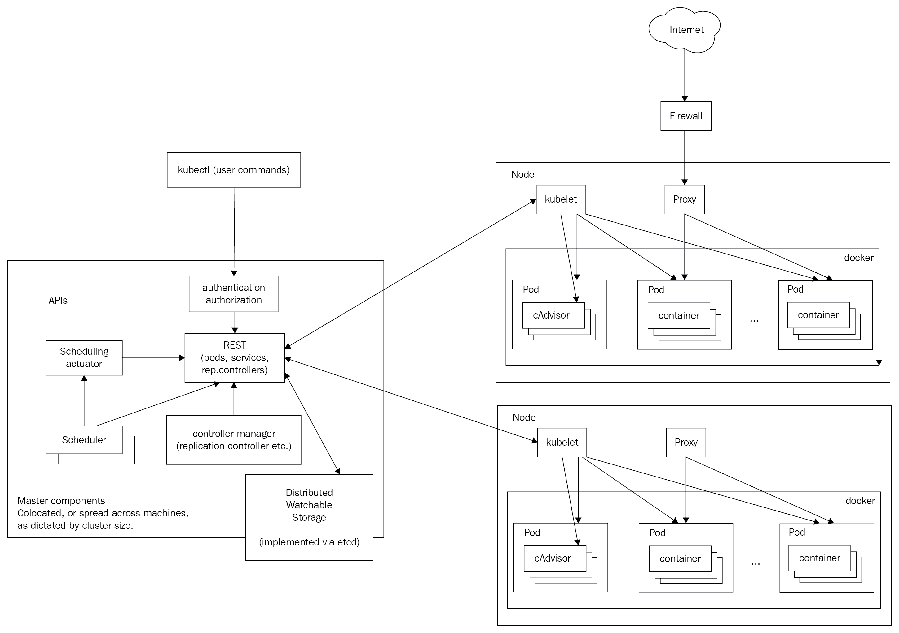
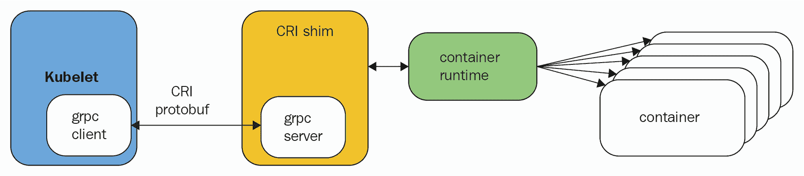
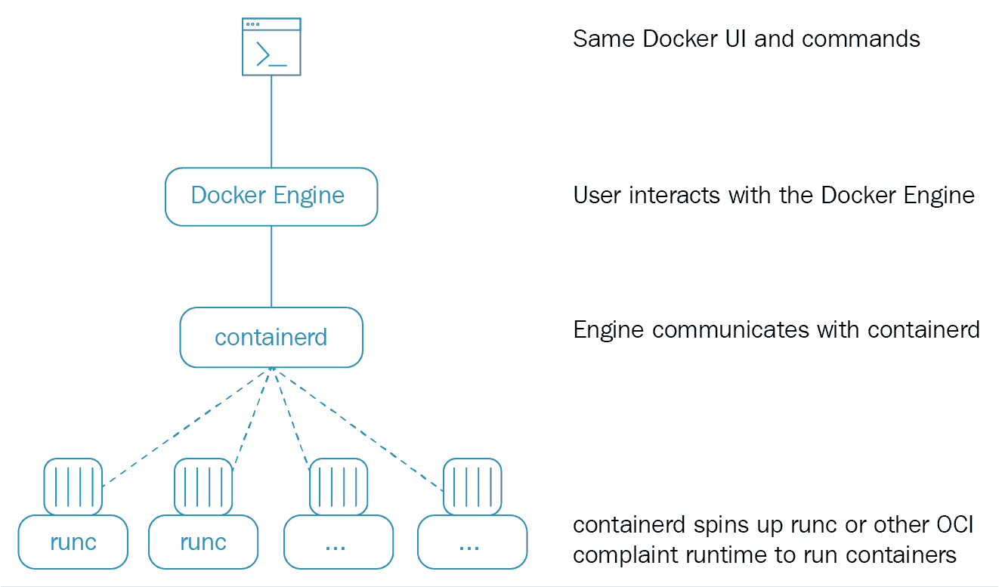
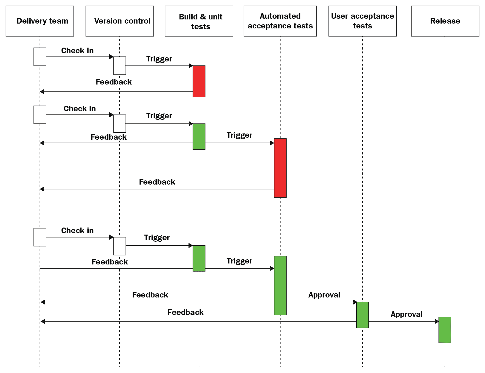

# 了解 Kubernetes 架构

Kubernetes 是一个庞大的开源项目和生态系统，拥有大量的代码和功能。Kubernetes 由谷歌开发，但加入了**Cloud Native Computing Foundation**（**CNCF**），成为容器应用领域的明确领导者。简而言之，它是一个用于编排基于容器的应用程序部署、扩展和管理的平台。您可能已经了解过 Kubernetes，甚至在一些项目中使用过它，甚至在工作中使用过它。但要理解 Kubernetes 的全部内容，如何有效使用它以及最佳实践是什么，需要更多的知识。在本章中，我们将建立必要的知识基础，以充分利用 Kubernetes 的潜力。我们将首先了解 Kubernetes 是什么，Kubernetes 不是什么，以及容器编排的确切含义。然后，我们将介绍一些重要的 Kubernetes 概念，这些概念将构成我们在整本书中将使用的词汇。之后，我们将更详细地深入了解 Kubernetes 的架构，并看看它如何为用户提供所有这些功能。然后，我们将讨论 Kubernetes 支持的各种运行时和容器引擎（Docker 只是其中一种选择），最后，我们将讨论 Kubernetes 在完整的持续集成和部署流水线中的作用。

在本章结束时，您将对容器编排有扎实的了解，了解 Kubernetes 解决了哪些问题，Kubernetes 设计和架构的基本原理，以及它支持的不同运行时。您还将熟悉开源存储库的整体结构，并准备好随时跳入并找到任何问题的答案。

# Kubernetes 是什么？

Kubernetes 是一个涵盖大量服务和功能的平台，不断增长。它的核心功能是在您的基础设施中安排容器工作负载，但它并不止步于此。以下是 Kubernetes 带来的其他一些功能：

+   挂载存储系统

+   分发密钥

+   检查应用程序健康状况

+   复制应用程序实例

+   使用水平 Pod 自动缩放

+   命名和发现

+   负载均衡

+   滚动更新

+   监控资源

+   访问和摄取日志

+   调试应用程序

+   提供身份验证和授权

# Kubernetes 不是什么

Kubernetes 不是**平台即服务**（**PaaS**）。它不规定您所需系统的许多重要方面；相反，它将它们留给您或其他构建在 Kubernetes 之上的系统，如 Deis、OpenShift 和 Eldarion。例如：

+   Kubernetes 不需要特定的应用程序类型或框架

+   Kubernetes 不需要特定的编程语言

+   Kubernetes 不提供数据库或消息队列

+   Kubernetes 不区分应用程序和服务

+   Kubernetes 没有点击即部署的服务市场

+   Kubernetes 允许用户选择自己的日志记录、监控和警报系统

# 理解容器编排

Kubernetes 的主要责任是容器编排。这意味着确保执行各种工作负载的所有容器都被安排在物理或虚拟机上运行。容器必须被有效地打包，并遵循部署环境和集群配置的约束。此外，Kubernetes 必须监视所有运行的容器，并替换死掉的、无响应的或其他不健康的容器。Kubernetes 提供了许多其他功能，您将在接下来的章节中了解到。在本节中，重点是容器及其编排。

# 物理机器、虚拟机器和容器

一切都始于硬件，也以硬件结束。为了运行您的工作负载，您需要一些真实的硬件。这包括实际的物理机器，具有一定的计算能力（CPU 或核心）、内存和一些本地持久存储（旋转磁盘或固态硬盘）。此外，您还需要一些共享的持久存储和网络，以连接所有这些机器，使它们能够找到并相互通信。在这一点上，您可以在物理机器上运行多个虚拟机，或者保持裸金属级别（没有虚拟机）。Kubernetes 可以部署在裸金属集群（真实硬件）或虚拟机集群上。反过来，Kubernetes 可以在裸金属或虚拟机上直接编排它管理的容器。理论上，Kubernetes 集群可以由裸金属和虚拟机的混合组成，但这并不常见。

# 容器的好处

容器代表了大型复杂软件系统开发和运行中的真正范式转变。以下是与传统模型相比的一些好处：

+   敏捷的应用程序创建和部署

+   持续开发、集成和部署

+   开发和运维的关注点分离

+   在开发、测试和生产环境中保持环境一致性

+   云和操作系统的可移植性

+   以应用为中心的管理

+   松散耦合、分布式、弹性、自由的微服务

+   资源隔离

+   资源利用

# 云中的容器

容器非常适合打包微服务，因为它们在为微服务提供隔离的同时非常轻量，并且在部署许多微服务时不会产生很多开销，就像使用虚拟机一样。这使得容器非常适合云部署，因为为每个微服务分配整个虚拟机的成本是禁止的。

所有主要的云服务提供商，如亚马逊 AWS、谷歌的 GCE、微软的 Azure，甚至阿里巴巴云，现在都提供容器托管服务。谷歌的 GKE 一直以来都是基于 Kubernetes。AWS ECS 基于他们自己的编排解决方案。微软 Azure 的容器服务是基于 Apache Mesos 的。Kubernetes 可以部署在所有云平台上，但直到今天它才没有与其他服务深度集成。但在 2017 年底，所有云服务提供商宣布直接支持 Kubernetes。微软推出了 AKS，AWS 发布了 EKS，阿里巴巴云开始开发一个 Kubernetes 控制器管理器，以无缝集成 Kubernetes。

# 牲畜与宠物

在过去，当系统规模较小时，每台服务器都有一个名字。开发人员和用户清楚地知道每台机器上运行的软件是什么。我记得，在我工作过的许多公司中，我们经常讨论几天来决定服务器的命名主题。例如，作曲家和希腊神话人物是受欢迎的选择。一切都非常舒适。你对待你的服务器就像珍爱的宠物一样。当一台服务器死掉时，这是一场重大危机。每个人都争先恐后地想弄清楚从哪里获取另一台服务器，死掉的服务器上到底运行了什么，以及如何在新服务器上让它工作。如果服务器存储了一些重要数据，那么希望你有最新的备份，也许你甚至能够恢复它。

显然，这种方法是不可扩展的。当你有几十台或几百台服务器时，你必须开始像对待牲畜一样对待它们。你考虑的是整体，而不是个体。你可能仍然有一些宠物，但你的 Web 服务器只是牲畜。

Kubernetes 将牲畜的方法应用到了极致，并全权负责将容器分配到特定的机器上。大部分时间你不需要与单独的机器（节点）进行交互。这对于无状态的工作负载效果最好。对于有状态的应用程序，情况有些不同，但 Kubernetes 提供了一个称为 StatefulSet 的解决方案，我们很快会讨论它。

在这一部分，我们涵盖了容器编排的概念，并讨论了主机（物理或虚拟）和容器之间的关系，以及在云中运行容器的好处，并最后讨论了牲畜与宠物的区别。在接下来的部分，我们将了解 Kubernetes 的世界，并学习它的概念和术语。

# Kubernetes 概念

在这一部分，我将简要介绍许多重要的 Kubernetes 概念，并为您提供一些背景，说明它们为什么需要以及它们如何与其他概念互动。目标是熟悉这些术语和概念。稍后，我们将看到这些概念如何被编织在一起，并组织成 API 组和资源类别，以实现令人敬畏的效果。你可以把许多这些概念看作是构建块。一些概念，比如节点和主节点，被实现为一组 Kubernetes 组件。这些组件处于不同的抽象级别，我会在专门的部分* Kubernetes 组件*中详细讨论它们。

这是著名的 Kubernetes 架构图：



# 集群

集群是 Kubernetes 用来运行组成系统的各种工作负载的计算、存储和网络资源的集合。请注意，您的整个系统可能由多个集群组成。我们将在后面详细讨论联邦的这种高级用例。

# 节点

一个节点是一个单独的主机。它可以是物理机或虚拟机。它的工作是运行 pod，我们马上会看到。每个 Kubernetes 节点都运行几个 Kubernetes 组件，比如 kubelet 和 kube 代理。节点由 Kubernetes 主节点管理。节点是 Kubernetes 的工作蜂，肩负着所有繁重的工作。过去，它们被称为**仆从**。如果你读过一些旧的文档或文章，不要感到困惑。仆从就是节点。

# 主节点

主节点是 Kubernetes 的控制平面。它由多个组件组成，如 API 服务器、调度程序和控制器管理器。主节点负责全局的集群级别的 pod 调度和事件处理。通常，所有主节点组件都设置在单个主机上。在考虑高可用性场景或非常大的集群时，您会希望有主节点冗余。我将在第四章中详细讨论高可用性集群，*高可用性和可靠性*。

# Pod

Pod 是 Kubernetes 中的工作单位。每个 pod 包含一个或多个容器。Pod 总是一起调度（即它们总是在同一台机器上运行）。Pod 中的所有容器具有相同的 IP 地址和端口空间；它们可以使用 localhost 或标准的进程间通信进行通信。此外，pod 中的所有容器都可以访问托管 pod 的节点上的共享本地存储。共享存储可以挂载在每个容器上。Pod 是 Kubernetes 的一个重要特性。通过在单个 Docker 容器中运行多个应用程序，例如通过将`supervisord`作为运行多个进程的主要 Docker 应用程序，可以实现这种做法，但出于以下原因，这种做法经常受到指责：

+   **透明度**：使得 pod 内的容器对基础设施可见，使得基础设施能够为这些容器提供服务，如进程管理和资源监控。这为用户提供了许多便利的功能。

+   **解耦软件依赖关系**：单个容器可以独立进行版本控制、重建和重新部署。Kubernetes 可能会支持单个容器的实时更新。

+   **易用性**：用户不需要运行自己的进程管理器，担心信号和退出代码的传播等问题。

+   **效率**：由于基础设施承担了更多的责任，容器可以更轻量化。

Pod 为管理彼此紧密相关且需要在同一主机上合作以完成其目的的容器组提供了一个很好的解决方案。重要的是要记住，pod 被认为是短暂的、可以随意丢弃和替换的实体。任何 pod 存储都会随着 pod 的丢弃而被销毁。每个 pod 都有一个**唯一 ID**（**UID**），因此在必要时仍然可以区分它们。

# 标签

标签是用于将一组对象（通常是 pod）分组在一起的键值对。这对于其他一些概念非常重要，比如复制控制器、副本集和操作动态对象组并需要识别组成员的服务。对象和标签之间存在 NxN 的关系。每个对象可能有多个标签，每个标签可能应用于不同的对象。标签有一些设计上的限制。对象上的每个标签必须具有唯一的键。标签键必须遵守严格的语法。它有两部分：前缀和名称。前缀是可选的。如果存在，则它与名称之间用斜杠(`/`)分隔，并且必须是有效的 DNS 子域。前缀最多可以有 253 个字符。名称是必需的，最多可以有 63 个字符。名称必须以字母数字字符（a-z，A-Z，0-9）开头和结尾，并且只能包含字母数字字符、点、破折号和下划线。值遵循与名称相同的限制。请注意，标签专用于识别对象，而不是附加任意元数据到对象。这就是注释的作用（请参见下一节）。

# 注释

注释允许您将任意元数据与 Kubernetes 对象关联起来。Kubernetes 只存储注释并提供它们的元数据。与标签不同，它们对允许的字符和大小限制没有严格的限制。

根据我的经验，对于复杂的系统，你总是需要这样的元数据，很高兴 Kubernetes 认识到了这个需求，并且提供了这个功能，这样你就不必自己想出一个单独的元数据存储并将对象映射到它们的元数据。

我们已经涵盖了大多数，如果不是全部，Kubernetes 的概念；我简要提到了一些其他概念。在下一节中，我们将继续探讨 Kubernetes 的架构，深入了解其设计动机、内部和实现，甚至研究源代码。

# 标签选择器

标签选择器用于根据它们的标签选择对象。基于相等性的选择器指定键名和值。有两个运算符，`=`（或`==`）和`!=`，表示基于值的相等性或不相等性。例如：

```
role = webserver  
```

这将选择所有具有该标签键和值的对象。

标签选择器可以有多个要求，用逗号分隔。例如：

```
role = webserver, application != foo  
```

基于集合的选择器扩展了功能，并允许基于多个值进行选择：

```
role in (webserver, backend)
```

# 复制控制器和副本集

复制控制器和副本集都管理由标签选择器标识的一组 pod，并确保某个特定数量始终处于运行状态。它们之间的主要区别在于，复制控制器通过名称相等来测试成员资格，而副本集可以使用基于集合的选择。副本集是更好的选择，因为它们是复制控制器的超集。我预计复制控制器在某个时候会被弃用。

Kubernetes 保证您始终会有与复制控制器或副本集中指定的相同数量的运行中的 pod。每当数量因托管节点或 pod 本身的问题而下降时，Kubernetes 都会启动新的实例。请注意，如果您手动启动 pod 并超出指定数量，复制控制器将会终止额外的 pod。

复制控制器曾经是许多工作流程的核心，比如滚动更新和运行一次性作业。随着 Kubernetes 的发展，它引入了对许多这些工作流程的直接支持，使用了专门的对象，比如**Deployment**、**Job**和**DaemonSet**。我们稍后会遇到它们。

# 服务

服务用于向用户或其他服务公开某种功能。它们通常包括一组 pod，通常由标签标识。您可以拥有提供对外部资源或直接在虚拟 IP 级别控制的 pod 的访问权限的服务。原生 Kubernetes 服务通过便捷的端点公开。请注意，服务在第 3 层（TCP/UDP）操作。Kubernetes 1.2 添加了`Ingress`对象，它提供对 HTTP 对象的访问——稍后会详细介绍。服务通过 DNS 或环境变量之一进行发布或发现。Kubernetes 可以对服务进行负载均衡，但开发人员可以选择在使用外部资源或需要特殊处理的服务的情况下自行管理负载均衡。

与 IP 地址、虚拟 IP 地址和端口空间相关的细节很多。我们将在未来的章节中深入讨论它们。

# 卷

Pod 上的本地存储是临时的，并随着 Pod 的消失而消失。有时这就是您所需要的，如果目标只是在节点的容器之间交换数据，但有时对数据的存活超过 Pod 或者需要在 Pod 之间共享数据是很重要的。卷的概念支持这种需求。请注意，虽然 Docker 也有卷的概念，但它相当有限（尽管它变得更加强大）。Kubernetes 使用自己独立的卷。Kubernetes 还支持其他容器类型，如 rkt，因此即使原则上也不能依赖 Docker 卷。

有许多卷类型。Kubernetes 目前直接支持许多卷类型，但通过**容器存储接口**（**CSI**）来扩展 Kubernetes 的现代方法是我稍后会详细讨论的。`emptyDir`卷类型在每个容器上挂载一个卷，该卷默认由主机上可用的内容支持。如果需要，您可以请求内存介质。当 Pod 因任何原因终止时，此存储将被删除。针对特定云环境、各种网络文件系统甚至 Git 存储库有许多卷类型。一个有趣的卷类型是`persistentDiskClaim`，它稍微抽象了一些细节，并使用环境中的默认持久存储（通常在云提供商中）。

# StatefulSet

Pod 会来来去去，如果您关心它们的数据，那么您可以使用持久存储。这都很好。但有时您可能希望 Kubernetes 管理分布式数据存储，例如 Kubernetes 或 MySQL Galera。这些集群存储将数据分布在唯一标识的节点上。您无法使用常规 Pod 和服务来建模。这就是`StatefulSet`的作用。如果您还记得，我之前讨论过将服务器视为宠物或牲畜以及牲畜是更好的方式。嗯，`StatefulSet`处于中间某个位置。`StatefulSet`确保（类似于复制集）在任何给定时间运行一定数量具有唯一标识的宠物。这些宠物具有以下属性：

+   可用于 DNS 的稳定主机名

+   序数索引

+   与序数和主机名相关联的稳定存储

`StatefulSet`可以帮助进行对等发现，以及添加或删除宠物。

# 秘密

Secrets 是包含敏感信息（如凭据和令牌）的小对象。它们存储在`etcd`中，可以被 Kubernetes API 服务器访问，并且可以被挂载为文件到需要访问它们的 pod 中（使用专用的秘密卷，这些卷依附在常规数据卷上）。同一个秘密可以被挂载到多个 pod 中。Kubernetes 本身为其组件创建秘密，您也可以创建自己的秘密。另一种方法是将秘密用作环境变量。请注意，pod 中的秘密始终存储在内存中（在挂载秘密的情况下为`tmpfs`），以提高安全性。

# 名称

Kubernetes 中的每个对象都由 UID 和名称标识。名称用于在 API 调用中引用对象。名称应该长达 253 个字符，并使用小写字母数字字符、破折号（`-`）和点（`.`）。如果删除一个对象，您可以创建另一个具有与已删除对象相同名称的对象，但 UID 必须在集群的生命周期内是唯一的。UID 是由 Kubernetes 生成的，所以您不必担心这个问题。

# 命名空间

命名空间是一个虚拟集群。您可以拥有一个包含多个由命名空间隔离的虚拟集群的单个物理集群。每个虚拟集群与其他虚拟集群完全隔离，它们只能通过公共接口进行通信。请注意，`node`对象和持久卷不属于命名空间。Kubernetes 可能会调度来自不同命名空间的 pod 在同一节点上运行。同样，来自不同命名空间的 pod 可以使用相同的持久存储。

在使用命名空间时，您必须考虑网络策略和资源配额，以确保对物理集群资源的适当访问和分配。

# 深入了解 Kubernetes 架构

Kubernetes 有非常雄心勃勃的目标。它旨在管理和简化在各种环境和云提供商中的分布式系统的编排、部署和管理。它提供了许多能力和服务，应该能够在所有这些多样性中工作，同时演变并保持足够简单，以便普通人使用。这是一个艰巨的任务。Kubernetes 通过遵循清晰的高级设计，并使用深思熟虑的架构来实现这一目标，促进可扩展性和可插拔性。Kubernetes 的许多部分仍然是硬编码或环境感知的，但趋势是将它们重构为插件，并保持核心的通用性和抽象性。在本节中，我们将像剥洋葱一样剥开 Kubernetes，从各种分布式系统设计模式开始，以及 Kubernetes 如何支持它们，然后介绍 Kubernetes 的机制，包括其一套 API，然后看一下组成 Kubernetes 的实际组件。最后，我们将快速浏览源代码树，以更好地了解 Kubernetes 本身的结构。

在本节结束时，您将对 Kubernetes 的架构和实现有扎实的了解，以及为什么会做出某些设计决策。

# 分布式系统设计模式

所有快乐（工作）的分布式系统都是相似的，借用托尔斯泰在《安娜·卡列尼娜》中的话。这意味着，为了正常运行，所有设计良好的分布式系统都必须遵循一些最佳实践和原则。Kubernetes 不只是想成为一个管理系统。它希望支持和促进这些最佳实践，并为开发人员和管理员提供高级服务。让我们来看看其中一些设计模式。

# 边车模式

边车模式是指在一个 pod 中除了主应用容器之外，还有另一个容器。应用容器对边车容器一无所知，只是按照自己的业务进行操作。一个很好的例子是中央日志代理。你的主容器可以直接记录到`stdout`，但是边车容器会将所有日志发送到一个中央日志服务，这样它们就会与整个系统的日志聚合在一起。使用边车容器与将中央日志添加到主应用容器中相比的好处是巨大的。首先，应用不再被中央日志所拖累，这可能会很麻烦。如果你想升级或更改你的中央日志策略，或者切换到一个全新的提供者，你只需要更新边车容器并部署它。你的应用容器都不会改变，所以你不会意外地破坏它们。

# 大使模式

大使模式是指将远程服务表示为本地服务，并可能强制执行某种策略。大使模式的一个很好的例子是，如果你有一个 Redis 集群，有一个主节点用于写入，还有许多副本用于读取。一个本地的大使容器可以作为代理，将 Redis 暴露给主应用容器在本地主机上。主应用容器只需连接到`localhost:6379`（Redis 的默认端口），但它连接到在同一个 pod 中运行的大使，大使会过滤请求，将写请求发送到真正的 Redis 主节点，将读请求随机发送到其中一个读取副本。就像我们在边车模式中看到的一样，主应用并不知道发生了什么。这在对真实的本地 Redis 进行测试时会有很大帮助。此外，如果 Redis 集群配置发生变化，只需要修改大使；主应用仍然毫不知情。

# 适配器模式

适配器模式是关于标准化主应用程序容器的输出。考虑一个逐步推出的服务的情况：它可能生成的报告格式与以前的版本不符。消费该输出的其他服务和应用程序尚未升级。适配器容器可以部署在与新应用程序容器相同的 pod 中，并可以修改其输出以匹配旧版本，直到所有消费者都已升级。适配器容器与主应用程序容器共享文件系统，因此它可以监视本地文件系统，每当新应用程序写入内容时，它立即进行适应。

# 多节点模式

Kubernetes 直接支持单节点模式，通过 pod。多节点模式，如领导者选举、工作队列和分散收集，不受直接支持，但通过使用标准接口组合 pod 来实现它们是一种可行的方法。

# Kubernetes API

如果你想了解一个系统的能力和提供的功能，你必须非常关注它的 API。这些 API 为用户提供了对系统可以做什么的全面视图。Kubernetes 通过 API 组向不同目的和受众暴露了几套 REST API。一些 API 主要由工具使用，一些可以直接由开发人员使用。关于 API 的一个重要事实是它们在不断发展。Kubernetes 开发人员通过尝试扩展它（通过向现有对象添加新对象和新字段）并避免重命名或删除现有对象和字段来使其可管理。此外，所有 API 端点都是有版本的，并且通常也有 alpha 或 beta 标记。例如：

```
/api/v1
/api/v2alpha1  
```

您可以通过`kubectl cli`、客户端库或直接通过 REST API 调用访问 API。我们将在后面的章节中探讨详细的身份验证和授权机制。如果您有适当的权限，您可以列出、查看、创建、更新和删除各种 Kubernetes 对象。在这一点上，让我们来一窥 API 的表面积。探索这些 API 的最佳方式是通过 API 组。一些 API 组是默认启用的。其他组可以通过标志启用/禁用。例如，要禁用批处理 V1 组并启用批处理 V2 alpha 组，您可以在运行 API 服务器时设置`--runtime-config`标志如下：

```
--runtime-config=batch/v1=false,batch/v2alpha=true 
```

默认情况下启用以下资源，除了核心资源：

+   `DaemonSets`

+   `Deployments`

+   `HorizontalPodAutoscalers`

+   ``Ingress``

+   `Jobs`

+   `ReplicaSets`

# 发现和负载平衡

默认情况下，工作负载只能在集群内访问，必须使用`LoadBalancer`或`NodePort`服务将其外部暴露。在开发过程中，可以通过使用`kubectl proxy`命令通过 API 主机访问内部可访问的工作负载：

+   `Endpoints`: 核心

+   `Ingress`: 扩展

+   `Service`: 核心

# 资源类别

除了 API 组之外，可用 API 的另一个有用的分类是功能。Kubernetes API 非常庞大，将其分成不同类别在你试图找到自己的路时非常有帮助。Kubernetes 定义了以下资源类别：

+   **工作负载**：您用来管理和运行集群上的容器的对象。

+   **发现和负载平衡**：您用来将工作负载暴露给外部可访问、负载平衡服务的对象。

+   **配置和存储**：您用来初始化和配置应用程序，并持久化容器外的数据的对象。

+   **集群**：定义集群本身配置的对象；这些通常只由集群操作员使用。

+   **元数据**：您用来配置集群内其他资源行为的对象，例如用于扩展工作负载的`HorizontalPodAutoscaler`。

在以下小节中，我将列出属于每个组的资源，以及它们所属的 API 组。我不会在这里指定版本，因为 API 从 alpha 迅速转移到 beta 到**一般可用性**（**GA**），然后从 V1 到 V2，依此类推。

# 工作负载 API

工作负载 API 包含以下资源：

+   `Container`: 核心

+   `CronJob`: 批处理

+   `DaemonSet`: 应用

+   `Deployment`: 应用

+   `Job`: 批处理

+   `Pod`: 核心

+   `ReplicaSet`: 应用

+   `ReplicationController`: 核心

+   `StatefulSet`: 应用

容器是由控制器使用 pod 创建的。Pod 运行容器并提供环境依赖项，如共享或持久存储卷，以及注入到容器中的配置或秘密数据。

以下是最常见操作之一的详细描述，它以 REST API 的形式获取所有 pod 的列表：

```
GET /api/v1/pods 
```

它接受各种查询参数（全部可选）：

+   `pretty`: 如果为 true，则输出将被漂亮地打印

+   `labelSelector`: 限制结果的选择器表达式

+   `watch`: 如果为 true，则会监视更改并返回事件流

+   `resourceVersion`: 仅返回在该版本之后发生的事件

+   `timeoutSeconds`: 列表或监视操作的超时

# 配置和存储

Kubernetes 的动态配置而无需重新部署是在您的 Kubernetes 集群上运行复杂分布式应用的基石：

+   `ConfigMap`: 核心

+   `Secret`: 核心

+   `PersistentVolumeClaim`: 核心

+   `StorageClass`: 存储

+   `VolumeAttachment`: 存储

# 元数据

元数据资源通常嵌入为它们配置的资源的子资源。例如，限制范围将成为 pod 配置的一部分。大多数情况下，您不会直接与这些对象交互。有许多元数据资源。您可以在[`kubernetes.io/docs/reference/generated/kubernetes-api/v1.10/#-strong-metadata-strong-`](https://kubernetes.io/docs/reference/generated/kubernetes-api/v1.10/#-strong-metadata-strong-)找到完整的列表。

# 集群

集群类别中的资源是为集群操作员设计的，而不是开发人员。这个类别中也有许多资源。以下是一些最重要的资源：

+   `Namespace`: 核心

+   `Node`: 核心

+   `PersistentVolume`: 核心

+   `ResourceQuota`：核心

+   `ClusterRole`: Rbac

+   `NetworkPolicy`：网络

# Kubernetes 组件

Kubernetes 集群有几个主要组件，用于控制集群，以及在每个集群节点上运行的节点组件。让我们了解所有这些组件以及它们如何一起工作。

# 主要组件

主要组件通常在一个节点上运行，但在高可用性或非常大的集群中，它们可能分布在多个节点上。

# API 服务器

Kube API 服务器公开了 Kubernetes REST API。由于它是无状态的，并且将所有数据存储在`etcd`集群中，因此可以轻松地进行水平扩展。API 服务器是 Kubernetes 控制平面的具体体现。

# Etcd

Etcd 是一个高度可靠的分布式数据存储。Kubernetes 使用它来存储整个集群状态。在一个小型的瞬态集群中，一个`etcd`的实例可以在与所有其他主要组件相同的节点上运行，但对于更大的集群，通常会有一个三节点甚至五节点的`etcd`集群，以实现冗余和高可用性。

# Kube 控制器管理器

Kube 控制器管理器是各种管理器的集合，汇总成一个二进制文件。它包含复制控制器、Pod 控制器、服务控制器、端点控制器等。所有这些管理器通过 API 监视集群的状态，它们的工作是将集群引导到期望的状态。

# 云控制器管理器

在云中运行时，Kubernetes 允许云提供商集成其平台，以管理节点、路由、服务和卷。云提供商代码与 Kubernetes 代码进行交互。它替换了 Kube 控制器管理器的一些功能。在使用云控制器管理器运行 Kubernetes 时，必须将 Kube 控制器管理器标志`--cloud-provider`设置为*external*。这将禁用云控制器管理器正在接管的控制循环。云控制器管理器是在 Kubernetes 1.6 中引入的，并且已被多个云提供商使用。

关于 Go 的一个快速说明，以帮助您解析代码：方法名首先出现，然后是方法的参数在括号中。每个参数都是一对，由名称和类型组成。最后，指定返回值。Go 允许多个返回类型。通常会返回一个`error`对象，除了实际结果。如果一切正常，`error`对象将为 nil。

这是`cloudprovider`包的主要接口：

```
package cloudprovider 

import ( 
    "errors" 
    "fmt" 
    "strings" 

    "k8s.io/api/core/v1" 
    "k8s.io/apimachinery/pkg/types" 
    "k8s.io/client-go/informers" 
    "k8s.io/kubernetes/pkg/controller" 
) 

// Interface is an abstract, pluggable interface for cloud providers. 
type Interface interface { 
    Initialize(clientBuilder controller.ControllerClientBuilder) 
    LoadBalancer() (LoadBalancer, bool) 
    Instances() (Instances, bool) 
    Zones() (Zones, bool) 
    Clusters() (Clusters, bool) 
    Routes() (Routes, bool) 
    ProviderName() string 
    HasClusterID() bool 
} 
```

大多数方法返回具有自己方法的其他接口。例如，这是`LoadBalancer`接口：

```
type LoadBalancer interface {
    GetLoadBalancer(clusterName string, 
                                 service *v1.Service) (status *v1.LoadBalancerStatus, 
                                                                   exists bool, 
                                                                   err error)
    EnsureLoadBalancer(clusterName string, 
                                       service *v1.Service, 
                                       nodes []*v1.Node) (*v1.LoadBalancerStatus, error)
    UpdateLoadBalancer(clusterName string, service *v1.Service, nodes []*v1.Node) error
    EnsureLoadBalancerDeleted(clusterName string, service *v1.Service) error
}
```

# Kube-scheduler

`kube-scheduler`负责将 Pod 调度到节点。这是一个非常复杂的任务，因为它需要考虑多个相互作用的因素，例如：

+   资源要求

+   服务要求

+   硬件/软件策略约束

+   节点亲和性和反亲和性规范

+   Pod 亲和性和反亲和性规范

+   污点和容忍

+   数据本地性

+   截止日期

如果您需要一些默认 Kube 调度程序未涵盖的特殊调度逻辑，可以用自己的自定义调度程序替换它。您还可以将自定义调度程序与默认调度程序并行运行，并且让自定义调度程序仅调度一部分 Pod。

# DNS

自 Kubernetes 1.3 以来，DNS 服务已成为标准 Kubernetes 集群的一部分。它被安排为一个常规的 pod。每个服务（除了无头服务）都会收到一个 DNS 名称。Pods 也可以收到 DNS 名称。这对于自动发现非常有用。

# 节点组件

集群中的节点需要一些组件来与集群主组件交互，并接收要执行的工作负载并更新其状态。

# 代理

Kube 代理在每个节点上进行低级别的网络维护。它在本地反映 Kubernetes 服务，并可以进行 TCP 和 UDP 转发。它通过环境变量或 DNS 找到集群 IP。

# Kubelet

kubelet 是节点上的 Kubernetes 代表。它负责与主组件通信并管理正在运行的 pod。这包括以下操作：

+   从 API 服务器下载 pod 的秘密

+   挂载卷

+   运行 pod 的容器（通过 CRI 或 rkt）

+   报告节点和每个 pod 的状态

+   运行容器的活动探测

在本节中，我们深入研究了 Kubernetes 的内部，探索了其架构（从非常高层次的角度），并支持了设计模式，通过其 API 和用于控制和管理集群的组件。在下一节中，我们将快速浏览 Kubernetes 支持的各种运行时。

# Kubernetes 运行时

Kubernetes 最初只支持 Docker 作为容器运行时引擎。但现在不再是这样。Kubernetes 现在支持几种不同的运行时：

+   `Docker`（通过 CRI shim）

+   `Rkt`（直接集成将被 rktlet 替换）

+   `Cri-o`

+   `Frakti`（在 hypervisor 上的 Kubernetes，以前是 Hypernetes）

+   `Rktlet`（rkt 的 CRI 实现）

+   `cri-containerd`

一个主要的设计政策是 Kubernetes 本身应该完全与特定的运行时解耦。**容器运行时接口**（**CRI**）使这成为可能。

在本节中，您将更仔细地了解 CRI，并了解各个运行时引擎。在本节结束时，您将能够就哪种运行时引擎适合您的用例做出明智的决定，并在何种情况下可以切换或甚至在同一系统中组合多个运行时。

# 容器运行时接口（CRI）

CRI 是一个 gRPC API，包含容器运行时与节点上的 kubelet 集成的规范/要求和库。在 Kubernetes 1.7 中，Kubernetes 中的内部 Docker 集成被 CRI-based 集成所取代。这是一件大事。它为利用容器领域的进步打开了多种实现的大门。Kubelet 不需要直接与多个运行时进行接口。相反，它可以与任何符合 CRI 的容器运行时进行通信。以下图表说明了流程：



有两个 gRPC 服务接口——`ImageService` 和 `RuntimeService`——CRI 容器运行时（或 shims）必须实现。`ImageService` 负责管理镜像。以下是 gRPC/protobuf 接口（这不是 Go）：

```
service ImageService { 
    rpc ListImages(ListImagesRequest) returns (ListImagesResponse) {} 
    rpc ImageStatus(ImageStatusRequest) returns (ImageStatusResponse) {} 
    rpc PullImage(PullImageRequest) returns (PullImageResponse) {} 
    rpc RemoveImage(RemoveImageRequest) returns (RemoveImageResponse) {} 
    rpc ImageFsInfo(ImageFsInfoRequest) returns (ImageFsInfoResponse) {} 
} 
```

`RuntimeService` 负责管理 pod 和容器。以下是 gRPC/profobug 接口：

```
service RuntimeService { 
    rpc Version(VersionRequest) returns (VersionResponse) {} 
    rpc RunPodSandbox(RunPodSandboxRequest) returns (RunPodSandboxResponse) {} 
    rpc StopPodSandbox(StopPodSandboxRequest) returns (StopPodSandboxResponse) {} 
    rpc RemovePodSandbox(RemovePodSandboxRequest) returns (RemovePodSandboxResponse) {} 
    rpc PodSandboxStatus(PodSandboxStatusRequest) returns (PodSandboxStatusResponse) {} 
    rpc ListPodSandbox(ListPodSandboxRequest) returns (ListPodSandboxResponse) {} 
    rpc CreateContainer(CreateContainerRequest) returns (CreateContainerResponse) {} 
    rpc StartContainer(StartContainerRequest) returns (StartContainerResponse) {} 
    rpc StopContainer(StopContainerRequest) returns (StopContainerResponse) {} 
    rpc RemoveContainer(RemoveContainerRequest) returns (RemoveContainerResponse) {} 
    rpc ListContainers(ListContainersRequest) returns (ListContainersResponse) {} 
    rpc ContainerStatus(ContainerStatusRequest) returns (ContainerStatusResponse) {} 
    rpc UpdateContainerResources(UpdateContainerResourcesRequest) returns (UpdateContainerResourcesResponse) {} 
    rpc ExecSync(ExecSyncRequest) returns (ExecSyncResponse) {} 
    rpc Exec(ExecRequest) returns (ExecResponse) {} 
    rpc Attach(AttachRequest) returns (AttachResponse) {} 
    rpc PortForward(PortForwardRequest) returns (PortForwardResponse) {} 
    rpc ContainerStats(ContainerStatsRequest) returns (ContainerStatsResponse) {} 
    rpc ListContainerStats(ListContainerStatsRequest) returns (ListContainerStatsResponse) {} 
    rpc UpdateRuntimeConfig(UpdateRuntimeConfigRequest) returns (UpdateRuntimeConfigResponse) {} 
    rpc Status(StatusRequest) returns (StatusResponse) {} 
} 
```

用作参数和返回类型的数据类型称为消息，并且也作为 API 的一部分进行定义。以下是其中之一：

```
message CreateContainerRequest { 
    string pod_sandbox_id = 1; 
    ContainerConfig config = 2; 
    PodSandboxConfig sandbox_config = 3; 
} 
```

正如您所看到的，消息可以嵌套在彼此之内。`CreateContainerRequest` 消息有一个字符串字段和另外两个字段，它们本身也是消息：`ContainerConfig` 和 `PodSandboxConfig`。

现在您已经在代码级别熟悉了 Kubernetes 运行时引擎，让我们简要地看一下各个运行时引擎。

# Docker

当然，Docker 是容器的大象级存在。Kubernetes 最初设计仅用于管理 Docker 容器。多运行时功能首次在 Kubernetes 1.3 中引入，而 CRI 则在 Kubernetes 1.5 中引入。在那之前，Kubernetes 只能管理 Docker 容器。

如果您正在阅读本书，我假设您非常熟悉 Docker 及其带来的功能。Docker 受到了巨大的欢迎和增长，但也受到了很多批评。批评者经常提到以下关注点：

+   安全性

+   难以设置多容器应用程序（特别是网络）

+   开发、监控和日志记录

+   Docker 容器运行一个命令的限制

+   发布不完善的功能太快

Docker 意识到了这些批评，并解决了其中一些问题。特别是，Docker 已经投资于其 Docker Swarm 产品。Docker Swarm 是一个与 Kubernetes 竞争的 Docker 本地编排解决方案。它比 Kubernetes 更容易使用，但不如 Kubernetes 强大或成熟。

自 Docker 1.12 以来，swarm 模式已经内置在 Docker 守护程序中，这让一些人感到不满，因为它的臃肿和范围扩大。这反过来使更多的人转向 CoreOS rkt 作为替代解决方案。

自 Docker 1.11 发布于 2016 年 4 月以来，Docker 已经改变了运行容器的方式。运行时现在使用`containerd`和`runC`来在容器中运行**Open Container Initiative**（OCI）图像：



# Rkt

Rkt 是来自 CoreOS 的容器管理器（CoreOS Linux 发行版、etcd、flannel 等的开发者）。Rkt 运行时以其简单性和对安全性和隔离性的强调而自豪。它没有像 Docker 引擎那样的守护程序，而是依赖于操作系统的 init 系统，比如`systemd`，来启动 rkt 可执行文件。Rkt 可以下载图像（包括**应用容器**（appc）图像和 OCI 图像），验证它们，并在容器中运行。它的架构要简单得多。

# 应用容器

CoreOS 在 2014 年 12 月启动了一个名为 appc 的标准化工作。这包括标准图像格式（ACI）、运行时、签名和发现。几个月后，Docker 开始了自己的标准化工作，推出了 OCI。目前看来，这些努力将会融合。这是一件好事，因为工具、图像和运行时将能够自由地互操作。但我们还没有达到这一点。

# Cri-O

Cri-o 是一个 Kubernetes 孵化器项目。它旨在为 Kubernetes 和符合 OCI 标准的容器运行时（如 Docker）之间提供集成路径。其想法是 Cri-O 将提供以下功能：

+   支持多种图像格式，包括现有的 Docker 图像格式

+   支持多种下载图像的方式，包括信任和图像验证

+   容器镜像管理（管理镜像层、叠加文件系统等）

+   容器进程生命周期管理

+   满足 CRI 所需的监控和日志记录

+   根据 CRI 所需的资源隔离

然后任何符合 OCI 标准的容器运行时都可以被插入，并将与 Kubernetes 集成。

# Rktnetes

Rktnetes 是 Kubernetes 加上 rkt 作为运行时引擎。Kubernetes 仍在抽象化运行时引擎的过程中。Rktnetes 实际上并不是一个单独的产品。从外部来看，只需要在每个节点上运行 Kubelet 并加上几个命令行开关。

# rkt 准备好投入生产使用了吗？

我对 rkt 没有太多的实际经验。然而，它被 Tectonic 使用——这是基于 CoreOS 的商业 Kubernetes 发行版。如果你运行不同类型的集群，我建议你等到 rkt 通过 CRI/rktlet 与 Kubernetes 集成。在使用 rkt 与 Kubernetes 相比，有一些已知的问题需要注意，例如，缺少的卷不会自动创建，Kubectl 的 attach 和 get logs 不起作用，以及`init`容器不受支持，还有其他问题。

# 超级容器

超级容器是另一个选择。超级容器具有轻量级虚拟机（自己的客户机内核），并在裸金属上运行。它不依赖于 Linux cgroups 进行隔离，而是依赖于一个虚拟化程序。与难以设置的标准裸金属集群和在重量级虚拟机上部署容器的公共云相比，这种方法呈现出有趣的混合。

# Stackube

Stackube（之前称为 Hypernetes）是一个多租户分发，它使用超级容器以及一些 OpenStack 组件进行身份验证、持久存储和网络。由于容器不共享主机内核，因此可以安全地在同一物理主机上运行不同租户的容器。当然，Stackube 使用 Frakti 作为其容器运行时。

在本节中，我们已经涵盖了 Kubernetes 支持的各种运行时引擎，以及标准化和融合的趋势。在下一节中，我们将退一步，看看整体情况，以及 Kubernetes 如何适应 CI/CD 流水线。

# 持续集成和部署

Kubernetes 是运行基于微服务的应用程序的绝佳平台。但归根结底，它只是一个实现细节。用户，甚至大多数开发人员，可能不知道系统是部署在 Kubernetes 上的。但 Kubernetes 可以改变游戏规则，使以前难以实现的事情成为可能。

在本节中，我们将探讨 CI/CD 流水线以及 Kubernetes 带来了什么。在本节结束时，您将能够设计利用 Kubernetes 属性的 CI/CD 流水线，例如易扩展性和开发-生产一致性，以提高您日常开发和部署的生产力和稳健性。

# 什么是 CI/CD 流水线？

CI/CD 流水线是由开发人员或运营人员实施的一组步骤，用于修改系统的代码、数据或配置，对其进行测试，并将其部署到生产环境。一些流水线是完全自动化的，而一些是半自动化的，需要人工检查。在大型组织中，可能会有测试和暂存环境，更改会自动部署到这些环境，但发布到生产环境需要手动干预。下图描述了一个典型的流水线。



值得一提的是，开发人员可以完全与生产基础设施隔离开来。他们的接口只是一个 Git 工作流程——Deis 工作流程（在 Kubernetes 上的 PaaS；类似于 Heroku）就是一个很好的例子。

# 为 Kubernetes 设计 CI/CD 流水线

当你的部署目标是一个 Kubernetes 集群时，你应该重新思考一些传统的做法。首先，打包是不同的。你需要为你的容器烘焙镜像。使用智能标签可以轻松且即时地回滚代码更改。这给了你很多信心，即使一个糟糕的更改通过了测试网，你也能立即回滚到上一个版本。但你要小心。模式更改和数据迁移不能自动回滚。

Kubernetes 的另一个独特能力是开发人员可以在本地运行整个集群。当你设计你的集群时，这需要一些工作，但由于构成系统的微服务在容器中运行，并且这些容器通过 API 进行交互，这是可能和实际可行的。与往常一样，如果你的系统非常依赖数据，你需要为此做出调整，并提供数据快照和合成数据供开发人员使用。

# 摘要

在本章中，我们涵盖了很多内容，你了解了 Kubernetes 的设计和架构。Kubernetes 是一个用于运行容器化微服务应用程序的编排平台。Kubernetes 集群有主节点和工作节点。容器在 pod 中运行。每个 pod 在单个物理或虚拟机上运行。Kubernetes 直接支持许多概念，如服务、标签和持久存储。您可以在 Kubernetes 上实现各种分布式系统设计模式。容器运行时只需实现 CRI。支持 Docker、rkt、Hyper 容器等等。

在第二章中，*创建 Kubernetes 集群*，我们将探讨创建 Kubernetes 集群的各种方式，讨论何时使用不同的选项，并构建一个多节点集群。
