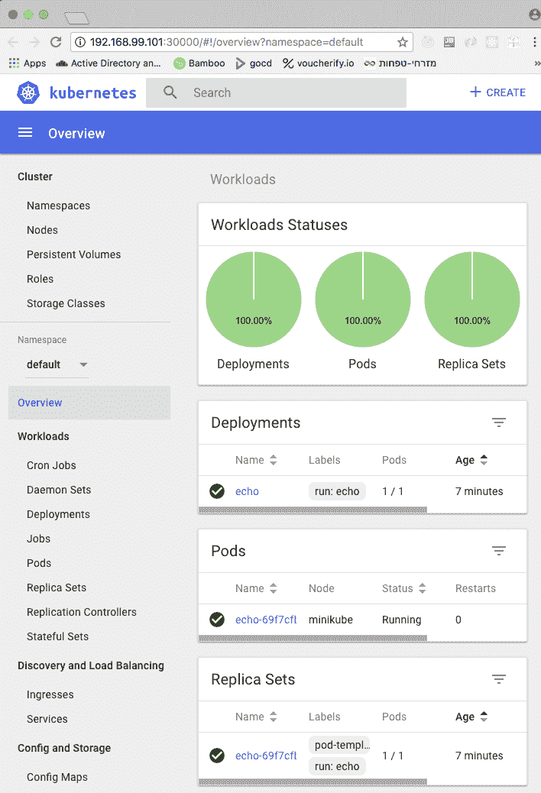

# 第二章：创建 Kubernetes 集群

在上一章中，我们了解了 Kubernetes 的全部内容，它的设计方式，支持的概念，如何使用其运行时引擎，以及它如何适用于 CI/CD 流水线。

创建 Kubernetes 集群是一项非常重要的任务。有许多选择和工具可供选择，需要考虑许多因素。在本章中，我们将动手构建一些 Kubernetes 集群。我们还将讨论和评估诸如 Minikube、kubeadm、kube-spray、bootkube 和 stackube 等工具。我们还将研究部署环境，如本地、云和裸机。我们将涵盖的主题如下：

+   使用 Minikube 创建单节点集群

+   使用 kubeadm 创建多节点集群

+   在云中创建集群

+   从头开始创建裸机集群

+   审查其他创建 Kubernetes 集群的选项

在本章结束时，您将对创建 Kubernetes 集群的各种选项有扎实的了解，并了解支持创建 Kubernetes 集群的最佳工具；您还将构建一些集群，包括单节点和多节点。

# 使用 Minikube 快速创建单节点集群

在本节中，我们将在 Windows 上创建一个单节点集群。我们之所以使用 Windows，是因为 Minikube 和单节点集群对于本地开发者机器非常有用。虽然 Kubernetes 通常在生产环境中部署在 Linux 上，但许多开发人员使用 Windows PC 或 Mac。也就是说，如果您确实想在 Linux 上安装 Minikube，也没有太多区别：


# 准备工作

在创建集群之前，有一些先决条件需要安装。这些包括 VirtualBox，用于 Kubernetes 的`kubectl`命令行界面，当然还有 Minikube 本身。以下是撰写时的最新版本列表：

+   **VirtualBox**: [`www.virtualbox.org/wiki/Downloads`](https://www.virtualbox.org/wiki/Downloads)

+   **Kubectl**: [`kubernetes.io/docs/tasks/tools/install-kubectl/`](https://kubernetes.io/docs/tasks/tools/install-kubectl/)

+   **Minikube**: [`kubernetes.io/docs/tasks/tools/install-minikube/`](https://kubernetes.io/docs/tasks/tools/install-minikube/)

# 在 Windows 上

安装 VirtualBox 并确保 kubectl 和 Minikube 在你的路径上。我个人只是把我使用的所有命令行程序都放在 `c:\windows` 中。你可能更喜欢另一种方法。我使用优秀的 ConEMU 来管理多个控制台、终端和 SSH 会话。它可以与 `cmd.exe`、PowerShell、PuTTY、Cygwin、msys 和 Git-Bash 一起使用。在 Windows 上没有比这更好的了。

在 Windows 10 Pro 中，你可以选择使用 Hyper-V hypervisor。这在技术上是比 VirtualBox 更好的解决方案，但它需要 Windows 的专业版，并且完全是 Windows 特有的。当使用 VirtualBox 时，这些说明是通用的，并且很容易适应其他版本的 Windows，或者其他操作系统。如果你已经启用了 Hyper-V，你必须禁用它，因为 VirtualBox 无法与 Hyper-V 共存。

我建议在管理员模式下使用 PowerShell。你可以将以下别名和函数添加到你的 PowerShell 配置文件中：

```
Set-Alias -Name k -Value kubectl 
function mk  
{  
minikube-windows-amd64 ` 
--show-libmachine-logs ` 
--alsologtostderr      ` 
@args 
} 
```

# 在 macOS 上

你可以在你的 `.bashrc` 文件中添加别名（类似于 Windows 上的 PowerShell 别名和函数）：

```
alias k='kubectl' 
alias mk='/usr/local/bin/minikube' 
```

现在我可以使用 `k` 和 `mk` 并且输入更少。`mk` 函数中的 Minikube 标志提供更好的日志记录方式，并将输出直接输出到控制台，以及文件中（类似于 tee）。

输入 `mk version` 来验证 Minikube 是否正确安装并运行：

```
> mk version 

minikube version: v0.26.0 
```

输入 `k version` 来验证 kubectl 是否正确安装并运行：

```
> k version
Client Version: version.Info{Major:"1", Minor:"9", GitVersion:"v1.9.0", GitCommit:"925c127ec6b946659ad0fd596fa959be43f0cc05", GitTreeState:"clean", BuildDate:"2017-12-16T03:15:38Z", GoVersion:"go1.9.2", Compiler:"gc", Platform:"darwin/amd64"}
Unable to connect to the server: dial tcp 192.168.99.100:8443: getsockopt: operation timed out
```

不要担心最后一行的错误。没有运行的集群，所以 kubectl 无法连接到任何东西。这是预期的。

你可以探索 Minikube 和 kubectl 的可用命令和标志。我不会逐个介绍每一个，只介绍我使用的命令。

# 创建集群

Minikube 工具支持多个版本的 Kubernetes。在撰写本文时，支持的版本列表如下：

```
> mk get-k8s-versions 
The following Kubernetes versions are available when using the localkube bootstrapper:  
- v1.10.0
- v1.9.4
- v1.9.0 
- v1.8.0 
- v1.7.5 
- v1.7.4 
- v1.7.3 
- v1.7.2 
- v1.7.0 
- v1.7.0-rc.1 
- v1.7.0-alpha.2 
- v1.6.4 
- v1.6.3 
- v1.6.0 
- v1.6.0-rc.1 
- v1.6.0-beta.4 
- v1.6.0-beta.3 
- v1.6.0-beta.2 
- v1.6.0-alpha.1 
- v1.6.0-alpha.0 
- v1.5.3 
- v1.5.2 
- v1.5.1 
- v1.4.5 
- v1.4.3 
- v1.4.2 
- v1.4.1 
- v1.4.0 
- v1.3.7 
- v1.3.6 
- v1.3.5 
- v1.3.4 
- v1.3.3 
- v1.3.0 
```

我将选择 1.10.0，最新的稳定版本。让我们使用 `start` 命令并指定 v1.10.0 作为版本来创建集群。

这可能需要一段时间，因为 Minikube 可能需要下载镜像，然后设置本地集群。让它运行就好了。这是预期的输出（在 Mac 上）：

```
> mk start --kubernetes-version="v1.10.0" 
Starting local Kubernetes v1.10.0 cluster... 
Starting VM... 
Getting VM IP address... 
Moving files into cluster... 
Finished Downloading kubeadm v1.10.0 **Finished Downloading kubelet v1.10.0** Setting up certs... 
Connecting to cluster... 
Setting up kubeconfig... 
Starting cluster components... 
Kubectl is now configured to use the cluster. 
Loading cached images from config file. 
```

让我们通过跟踪输出来回顾 Minikube 的操作。当从头开始创建集群时，你需要做很多这样的操作：

1.  启动 VirtualBox 虚拟机

1.  为本地机器和虚拟机创建证书

1.  下载镜像

1.  在本地机器和虚拟机之间设置网络

1.  在虚拟机上运行本地 Kubernetes 集群

1.  配置集群

1.  启动所有 Kubernetes 控制平面组件

1.  配置 kubectl 以与集群通信

# 故障排除

如果在过程中出现问题，请尝试遵循错误消息。您可以添加`--alsologtostderr`标志以从控制台获取详细的错误信息。Minikube 所做的一切都整齐地组织在`~/.minikube`下。以下是目录结构：

```
> tree ~/.minikube -L 2
/Users/gigi.sayfan/.minikube
├── addons
├── apiserver.crt
├── apiserver.key
├── ca.crt
├── ca.key
├── ca.pem
├── cache
│ ├── images
│ ├── iso
│ └── localkube
├── cert.pem
├── certs
│ ├── ca-key.pem
│ ├── ca.pem
│ ├── cert.pem
│ └── key.pem
├── client.crt
├── client.key
├── config
│ └── config.json
├── files
├── key.pem
├── last_update_check
├── logs
├── machines
│ ├── minikube
│ ├── server-key.pem
│ └── server.pem
├── profiles
│ └── minikube
├── proxy-client-ca.crt
├── proxy-client-ca.key
├── proxy-client.crt
└── proxy-client.key

13 directories, 21 files
```

# 检查集群

既然我们已经有一个运行中的集群，让我们来看看里面。

首先，让我们`ssh`进入虚拟机：

```
> mk ssh
 _ _
 _ _ ( ) ( )
 ___ ___ (_) ___ (_)| |/') _ _ | |_ __
/' _ ` _ `\| |/' _ `\| || , < ( ) ( )| '_`\ /'__`\
| ( ) ( ) || || ( ) || || |\`\ | (_) || |_) )( ___/
(_) (_) (_)(_)(_) (_)(_)(_) (_)`\___/'(_,__/'`\____)

$ uname -a

Linux minikube 4.9.64 #1 SMP Fri Mar 30 21:27:22 UTC 2018 x86_64 GNU/Linux$ 
```

太棒了！成功了。奇怪的符号是`minikube`的 ASCII 艺术。现在，让我们开始使用`kubectl`，因为它是 Kubernetes 的瑞士军刀，并且对所有集群（包括联合集群）都很有用。

我们将在我们的旅程中涵盖许多`kubectl`命令。首先，让我们使用`cluster-info`检查集群状态：

```
> k cluster-info    
```

Kubernetes 主节点正在运行在`https://192.168.99.101:8443`

KubeDNS 正在运行在`https://192.168.99.1010:8443/api/v1/namespaces/kube-system/services/kube-dns:dns/proxy`

要进一步调试和诊断集群问题，请使用`kubectl cluster-info dump`。您可以看到主节点正在正常运行。要以 JSON 类型查看集群中所有对象的更详细视图，请使用`k cluster-info dump`。输出可能有点令人生畏，因此让我们使用更具体的命令来探索集群。

让我们使用`get nodes`检查集群中的节点：

```
> k get nodes
NAME       STATUS    ROLES     AGE       VERSION

NAME       STATUS    ROLES     AGE       VERSION
minikube   Ready      master   15m       v1.10.0  
```

所以，我们有一个名为`minikube`的节点。要获取有关它的大量信息，请输入`k describe node minikube`。输出是冗长的；我会让您自己尝试。

# 做工作

我们有一个漂亮的空集群正在运行（好吧，不完全是空的，因为 DNS 服务和仪表板作为`kube-system`命名空间中的 pod 运行）。现在是时候运行一些 pod 了。让我们以`echo`服务器为例：

```
k run echo --image=gcr.io/google_containers/echoserver:1.8 --port=8080 deployment "echo" created  
```

Kubernetes 创建了一个部署，我们有一个正在运行的 pod。注意`echo`前缀：

```
> k get pods  
NAME                    READY    STATUS    RESTARTS    AGE echo-69f7cfb5bb-wqgkh    1/1     Running     0          18s  
```

要将我们的 pod 公开为服务，请输入以下内容：

```
> k expose deployment echo --type=NodePort service "echo" exposed  
```

将服务公开为`NodePort`类型意味着它对主机公开端口，但它不是我们在其上运行 pod 的`8080`端口。端口在集群中映射。要访问服务，我们需要集群 IP 和公开的端口：

```
> mk ip
192.168.99.101
> k get service echo --output='jsonpath="{.spec.ports[0].nodePort}"'
30388  
```

现在我们可以访问`echo`服务，它会返回大量信息：

```
> curl http://192.168.99.101:30388/hi  
```

恭喜！您刚刚创建了一个本地 Kubernetes 集群并部署了一个服务。

# 使用仪表板检查集群

Kubernetes 有一个非常好的 web 界面，当然是部署为一个 pod 中的服务。仪表板设计得很好，提供了对集群的高级概述，还可以深入到单个资源，查看日志，编辑资源文件等。当你想要手动检查你的集群时，它是一个完美的武器。要启动它，输入`minikube dashboard`。

Minikube 将打开一个带有仪表板 UI 的浏览器窗口。请注意，在 Windows 上，Microsoft Edge 无法显示仪表板。我不得不在不同的浏览器上运行它。

这是工作负载视图，显示部署、副本集、复制控制器和 Pod：



它还可以显示守护进程集、有状态集和作业，但在这个集群中我们没有这些。

在这一部分，我们在 Windows 上创建了一个本地的单节点 Kubernetes 集群，使用`kubectl`进行了一些探索，部署了一个服务，并尝试了 web UI。在下一部分，我们将继续创建一个多节点集群。

# 使用 kubeadm 创建一个多节点集群

在这一部分，我将向您介绍`kubeadm`，这是在所有环境中创建 Kubernetes 集群的推荐工具。它仍在积极开发中，但这是因为它是 Kubernetes 的一部分，并且始终体现最佳实践。为了使其对整个集群可访问，我们将以虚拟机为基础。这一部分是为那些想要亲自部署多节点集群的读者准备的。

# 设定期望

在踏上这段旅程之前，我想明确指出，这可能*不会*一帆风顺。`kubeadm`的任务很艰巨：它必须跟随 Kubernetes 本身的发展，而 Kubernetes 是一个不断变化的目标。因此，它并不总是稳定的。当我写第一版《精通 Kubernetes》时，我不得不深入挖掘并寻找各种解决方法来使其正常工作。猜猜？我在第二版中也不得不做同样的事情。准备好做一些调整并寻求帮助。如果你想要一个更简化的解决方案，我将在后面讨论一些非常好的选择。

# 准备工作

Kubeadm 在预配置的硬件（物理或虚拟）上运行。在创建 Kubernetes 集群之前，我们需要准备一些虚拟机并安装基本软件，如`docker`、`kubelet`、`kubeadm`和`kubectl`（仅在主节点上需要）。

# 准备一个 vagrant 虚拟机集群

以下 vagrant 文件将创建一个名为`n1`，`n2`，`n3`和`n4`的四个 VM 的集群。键入`vagrant up`以启动并运行集群。它基于 Bento/Ubuntu 版本 16.04，而不是 Ubuntu/Xenial，后者存在各种问题：

```
# -*- mode: ruby -*- 
# vi: set ft=ruby : 
hosts = { 
  "n1" => "192.168.77.10", 
  "n2" => "192.168.77.11", 
  "n3" => "192.168.77.12", 
  "n4" => "192.168.77.13" 
} 
Vagrant.configure("2") do |config| 
  # always use Vagrants insecure key 
  config.ssh.insert_key = false 
  # forward ssh agent to easily ssh into the different machines 
  config.ssh.forward_agent = true 

  check_guest_additions = false 
  functional_vboxsf     = false 

  config.vm.box = "bento/ubuntu-16.04" 
 hosts.each do |name, ip| 
    config.vm.hostname = name 
    config.vm.define name do |machine| 
      machine.vm.network :private_network, ip: ip 
      machine.vm.provider "virtualbox" do |v| 
        v.name = name 
      end 
    end 
  end 
end 

```

# 安装所需的软件

我非常喜欢 Ansible 进行配置管理。我在运行 Ubuntu 16.04 的`n4` VM 上安装了它。从现在开始，我将使用`n4`作为我的控制机器，这意味着我们正在在 Linux 环境中操作。我可以直接在我的 Mac 上使用 Ansible，但由于 Ansible 无法在 Windows 上运行，我更喜欢更通用的方法：

```
> vagrant ssh n4
Welcome to Ubuntu 16.04.3 LTS (GNU/Linux 4.4.0-87-generic x86_64)

* Documentation:  https://help.ubuntu.com
* Management:     https://landscape.canonical.com
* Support:        https://ubuntu.com/advantage

0 packages can be updated.
0 updates are security updates.
   vagrant@vagrant:~$ sudo apt-get -y --fix-missing install python-pip sshpass
vagrant@vagrant:~$ sudo pip install  ansible   
```

我使用的是 2.5.0 版本。你应该使用最新版本：

```
vagrant@vagrant:~$ ansible --version
ansible 2.5.0
 config file = None
 configured module search path = [u'/home/vagrant/.ansible/plugins/modules', u'/usr/share/ansible/plugins/modules']
 ansible python module location = /home/vagrant/.local/lib/python2.7/site-packages/ansible
 executable location = /home/vagrant/.local/bin/ansible

 python version = 2.7.12 (default, Dec 4 2017, 14:50:18) [GCC 5.4.0 20160609] 
python version = 2.7.12 (default, Dec 4 2017, 14:50:18) [GCC 5.4.0 20160609]
```

我安装的`sshpass`程序将帮助`ansible`连接到所有带有内置 vagrant 用户的 vagrant VM。这仅对本地基于 VM 的多节点集群重要。

我创建了一个名为`ansible`的目录，并在其中放置了三个文件：`hosts`，`vars.yml`和`playbook.yml`。

# 主机文件

`host`文件是清单文件，告诉`ansible`目录要在哪些主机上操作。这些主机必须可以从控制机器进行 SSH 访问。以下是将安装集群的三个 VM：

```
[all] 
192.168.77.10 ansible_user=vagrant ansible_ssh_pass=vagrant 
192.168.77.11 ansible_user=vagrant ansible_ssh_pass=vagrant 
192.168.77.12 ansible_user=vagrant ansible_ssh_pass=vagrant 
```

# vars.yml 文件

`vars.yml`文件只是保留了我想要在每个节点上安装的软件包列表。`vim`，`htop`和`tmux`是我在需要管理的每台机器上安装的喜爱软件包。其他软件包是 Kubernetes 所需的：

```
--- 
PACKAGES: 
  - vim  - htop  - tmux  - docker.io 
  - kubelet 
  - kubeadm 
  - kubectl 
  - kubernetes-cni
```

# playbook.yml 文件

`playbook.yml`文件是您在所有主机上安装软件包时运行的文件：

```
---  
- hosts: all  
  become: true  
  vars_files:  
    - vars.yml  
  strategy: free  

  tasks: 
   - name: hack to resolve Problem with MergeList Issue 
     shell: 'find /var/lib/apt/lists -maxdepth 1 -type f -exec rm -v {} \;' 
   - name: update apt cache directly (apt module not reliable) 
     shell: 'apt-get clean && apt-get update' 
   - name: Preliminary installation     
     apt:  name=apt-transport-https force=yes 
   - name: Add the Google signing key  
     apt_key: url=https://packages.cloud.google.com/apt/doc/apt-key.gpg  state=present  
   - name: Add the k8s APT repo  
     apt_repository: repo='deb http://apt.kubernetes.io/ kubernetes-xenial main' state=present  
   - name: update apt cache directly (apt module not reliable) 
     shell: 'apt-get update'      
   - name: Install packages  
     apt: name={{ item }} state=installed force=yes 
     with_items: "{{ PACKAGES }}"  
```

由于一些软件包来自 Kubernetes APT 存储库，我需要添加它，以及 Google 签名密钥：

连接到`n4`：

```
> vagrant ssh n4  
```

您可能需要对`n1`，`n2`和`n3`节点中的每一个进行一次`ssh`：

```
vagrant@vagrant:~$ ssh 192.168.77.10
vagrant@vagrant:~$ ssh 192.168.77.11
vagrant@vagrant:~$ ssh 192.168.77.12 
```

一个更持久的解决方案是添加一个名为`~/.ansible.cfg`的文件，其中包含以下内容：

```
[defaults]
host_key_checking = False      
```

从`n4`运行 playbook 如下：

```
vagrant@n4:~$ ansible-playbook -i hosts playbook.yml  
```

如果遇到连接失败，请重试。Kubernetes APT 存储库有时会响应缓慢。您只需要对每个节点执行一次此操作。

# 创建集群

现在是创建集群本身的时候了。我们将在第一个 VM 上初始化主节点，然后设置网络并将其余的 VM 添加为节点。

# 初始化主节点

让我们在`n1`（`192.168.77.10`）上初始化主节点。在基于 vagrant VM 的云环境中，使用`--apiserver-advertise-address`标志是至关重要的：

```
> vagrant ssh n1

vagrant@n1:~$ sudo kubeadm init --apiserver-advertise-address 192.168.77.10  
```

在 Kubernetes 1.10.1 中，这导致了以下错误消息：

```
[init] Using Kubernetes version: v1.10.1
[init] Using Authorization modes: [Node RBAC]
[preflight] Running pre-flight checks.
 [WARNING FileExisting-crictl]: crictl not found in system path
[preflight] Some fatal errors occurred:
 [ERROR Swap]: running with swap on is not supported. Please disable swap
[preflight] If you know what you are doing, you can make a check non-fatal with `--ignore-preflight-errors=...`
```

原因是默认情况下未安装所需的 cri-tools。我们正在处理 Kubernetes 的最前沿。我创建了一个额外的 playbook 来安装 Go 和 cri-tools，关闭了交换，并修复了 vagrant VM 的主机名：

```
---
- hosts: all
 become: true
 strategy: free
 tasks:
 - name: Add the longsleep repo for recent golang version
 apt_repository: repo='ppa:longsleep/golang-backports' state=present
 - name: update apt cache directly (apt module not reliable)
 shell: 'apt-get update'
 args:
 warn: False
 - name: Install Go
 apt: name=golang-go state=present force=yes
 - name: Install crictl
 shell: 'go get github.com/kubernetes-incubator/cri-tools/cmd/crictl'
 become_user: vagrant
 - name: Create symlink in /usr/local/bin for crictl
 file:
 src: /home/vagrant/go/bin/crictl
 dest: /usr/local/bin/crictl
 state: link
 - name: Set hostname properly
 shell: "hostname n$((1 + $(ifconfig | grep 192.168 | awk '{print $2}' | tail -c 2)))"
 - name: Turn off swap
 shell: 'swapoff -a'
 –
```

记得再次在`n4`上运行它，以更新集群中的所有节点。

以下是成功启动 Kubernetes 的一些输出：

```
vagrant@n1:~$ sudo kubeadm init --apiserver-advertise-address 192.168.77.10
[init] Using Kubernetes version: v1.10.1
[init] Using Authorization modes: [Node RBAC]
[certificates] Generated ca certificate and key.
[certificates] Generated apiserver certificate and key.
[certificates] Valid certificates and keys now exist in "/etc/kubernetes/pki"
.
.
.
[addons] Applied essential addon: kube-dns
[addons] Applied essential addon: kube-proxy
Your Kubernetes master has initialized successfully!
```

以后加入其他节点到集群时，你需要写下更多的信息。要开始使用你的集群，你需要以普通用户身份运行以下命令：

```
vagrant@n1:~$ mkdir -p $HOME/.kube
vagrant@n1:~$ sudo cp -i /etc/kubernetes/admin.conf $HOME/.kube/config
vagrant@n1:~$ sudo chown $(id -u):$(id -g) $HOME/.kube/config 
```

现在你可以通过在每个节点上以 root 身份运行一个命令来加入任意数量的机器。使用从`kubeadm init`命令返回的命令：`sudo kubeadm join --token << token>> --discovery-token-ca-cert-hash <<discvery token>> --skip-prflight-cheks`。

# 设置 Pod 网络

集群的网络是重中之重。Pod 需要能够相互通信。这需要一个 Pod 网络插件。有几种选择。由`kubeadm`生成的集群需要基于 CNI 的插件。我选择使用 Weave Net 插件，它支持网络策略资源。你可以选择任何你喜欢的。

在主 VM 上运行以下命令：

```
vagrant@n1:~$ sudo sysctl net.bridge.bridge-nf-call-iptables=1
net.bridge.bridge-nf-call-iptables = 1vagrant@n1:~$ kubectl apply -f "https://cloud.weave.works/k8s/net?k8s-version=$(kubectl version | base64 | tr -d '\n')"      
```

你应该看到以下内容：

```
serviceaccount "weave-net" created
clusterrole.rbac.authorization.k8s.io "weave-net" created
clusterrolebinding.rbac.authorization.k8s.io "weave-net" created
role.rbac.authorization.k8s.io "weave-net" created
rolebinding.rbac.authorization.k8s.io "weave-net" created
daemonset.extensions "weave-net" created  
```

要验证，请使用以下命令：

```
vagrant@n1:~$ kubectl get po --all-namespaces 
NAMESPACE NAME READY STATUS RESTARTS AGE
kube-system etcd-n1 1/1 Running 0 2m
kube-system kube-apiserver-n1 1/1 Running 0 2m
kube-system kube-controller-manager-n1 1/1 Running 0 2m
kube-system kube-dns-86f4d74b45-jqctg 3/3 Running 0 3m
kube-system kube-proxy-l54s9 1/1 Running 0 3m
kube-system kube-scheduler-n1 1/1 Running 0 2m
kube-system weave-net-fl7wn 2/2 Running 0 31s
```

最后一个 Pod 是我们的`weave-net-fl7wn`，这正是我们要找的，以及`kube-dns pod`。两者都在运行。一切都很好！

# 添加工作节点

现在我们可以使用之前获得的令牌将工作节点添加到集群中。在每个节点上，运行以下命令（不要忘记`sudo`）并使用在主节点上初始化 Kubernetes 时获得的令牌：

```
sudo kubeadm join --token <<token>>  --discovery-token-ca-cert-hash  <<discovery token>> --ignore-preflight-errors=all  
```

在撰写本书时（使用 Kubernetes 1.10），一些预检查失败，但这是一个错误的负面结果。实际上一切都很好，你可以通过添加`--ignore-preflight-errors=all`来跳过这些预检查。希望当你阅读本书时，这些问题已经解决。你应该看到以下内容：

```
[discovery] Trying to connect to API Server "192.168.77.10:6443"
[discovery] Created cluster-info discovery client, requesting info from "https://192.168.77.10:6443"
[discovery] Requesting info from "https://192.168.77.10:6443" again to validate TLS against the pinned public key
[discovery] Cluster info signature and contents are valid and TLS certificate validates against pinned roots, will use API Server "192.168.77.10:6443"
[discovery] Successfully established connection with API Server "192.168.77.10:6443"     
```

此节点已加入集群：

```
* Certificate signing request was sent to master and a response
  was received.
* The Kubelet was informed of the new secure connection details.  
```

在主节点上运行`kubectl get nodes`，查看此节点加入集群。

由于 CNI 插件初始化的问题，某些组合可能无法正常工作。

# 在云中创建集群（GCP，AWS 和 Azure）

在本地创建集群很有趣，在开发过程中以及在尝试在本地解决问题时很重要。但最终，Kubernetes 是为云原生应用程序（在云中运行的应用程序）而设计的。Kubernetes 不希望了解单个云环境，因为这不可扩展。相反，Kubernetes 具有云提供程序接口的概念。每个云提供程序都可以实现此接口，然后托管 Kubernetes。请注意，截至 1.5 版本，Kubernetes 仍在其树中维护许多云提供程序的实现，但在将来，它们将被重构。

# 云提供程序接口

云提供程序接口是一组 Go 数据类型和接口。它在一个名为`cloud.go`的文件中定义，可在[`bit.ly/2fq4NbW`](http://bit.ly/2fq4NbW)上找到。这是主要接口：

```
type Interface interface { 
    Initialize(clientBuilder controller.ControllerClientBuilder) 
    LoadBalancer() (LoadBalancer, bool) 
    Instances() (Instances, bool) 
    Zones() (Zones, bool) 
    Clusters() (Clusters, bool) 
    Routes() (Routes, bool) 
    ProviderName() string 
    HasClusterID() bool 
} 
```

这很清楚。Kubernetes 以实例，`区域`，`集群`和`路由`运行，并且需要访问负载均衡器和提供者名称。主要接口主要是一个网关。大多数方法返回其他接口。

例如，`Clusters`接口非常简单：

```
type Clusters interface { 
  ListClusters() ([]string, error) 
  Master(clusterName string) (string, error) 
} 
```

`ListClusters()`方法返回集群名称。`Master()`方法返回主节点的 IP 地址或 DNS 名称。

其他接口并不复杂。整个文件有 214 行（截至目前为止），包括很多注释。重点是，如果您的云平台使用这些基本概念，实现 Kubernetes 提供程序并不太复杂。

# 谷歌云平台（GCP）

**谷歌云平台**（**GCP**）支持 Kubernetes 开箱即用。所谓的**谷歌 Kubernetes 引擎**（**GKE**）是建立在 Kubernetes 上的容器管理解决方案。您不需要在 GCP 上安装 Kubernetes，可以使用 Google Cloud API 创建 Kubernetes 集群并进行配置。Kubernetes 作为 GCP 的内置部分意味着它将始终被很好地集成和经过充分测试，您不必担心底层平台的更改会破坏云提供程序接口。

总的来说，如果您计划基于 Kubernetes 构建系统，并且在其他云平台上没有任何现有代码，那么 GCP 是一个可靠的选择。

# 亚马逊网络服务（AWS）

**亚马逊网络服务**（**AWS**）有自己的容器管理服务叫做 ECS，但它不是基于 Kubernetes 的。你可以在 AWS 上很好地运行 Kubernetes。它是一个受支持的提供者，并且有很多关于如何设置它的文档。虽然你可以自己提供一些 VM 并使用`kubeadm`，但我建议使用**Kubernetes 运维**（**Kops**）项目。Kops 是一个在 GitHub 上可用的 Kubernetes 项目（[`bit.ly/2ft5KA5`](http://bit.ly/2ft5KA5)）。它不是 Kubernetes 本身的一部分，但是由 Kubernetes 开发人员开发和维护。

它支持以下功能：

+   云端（AWS）自动化 Kubernetes 集群 CRUD

+   高可用（HA）的 Kubernetes 集群

+   它使用状态同步模型进行干运行和自动幂等性

+   `kubectl`的自定义支持插件

+   Kops 可以生成 Terraform 配置

+   它基于一个在目录树中定义的简单元模型

+   简单的命令行语法

+   社区支持

要创建一个集群，你需要通过`route53`进行一些最小的 DNS 配置，设置一个 S3 存储桶来存储集群配置，然后运行一个命令：

```
kops create cluster --cloud=aws --zones=us-east-1c ${NAME}  
```

完整的说明可以在[`bit.ly/2f7r6EK`](http://bit.ly/2f7r6EK)找到。

在 2017 年底，AWS 加入了 CNCF，并宣布了两个关于 Kubernetes 的重大项目：自己的基于 Kubernetes 的容器编排解决方案（EKS）和一个按需的容器解决方案（Fargate）。

# 亚马逊弹性容器服务用于 Kubernetes（EKS）

**亚马逊弹性容器服务用于 Kubernetes**是一个完全托管且高可用的 Kubernetes 解决方案。它有三个主节点在三个可用区运行。EKS 还负责升级和打补丁。EKS 的好处是它运行的是原始的 Kubernetes，没有任何改动。这意味着你可以使用社区开发的所有标准插件和工具。它还为与其他云提供商和/或你自己的本地 Kubernetes 集群方便的集群联合开启了大门。

EKS 与 AWS 基础设施深度集成。IAM 认证与 Kubernetes 的**基于角色的访问控制**（**RBAC**）集成。

如果你想直接从你自己的 Amazon VPC 访问你的 Kubernetes 主节点，你也可以使用`PrivateLink`。使用`PrivateLink`，你的 Kubernetes 主节点和 Amazon EKS 服务端点将显示为弹性网络接口，具有 Amazon VPC 中的私有 IP 地址。

拼图的另一个重要部分是一个特殊的 CNI 插件，它让您的 Kubernetes 组件可以使用 AWS 网络相互通信。

# Fargate

**Fargate**让您可以直接运行容器，而不必担心硬件配置。它消除了操作复杂性的很大一部分，但代价是失去了一些控制。使用 Fargate 时，您将应用程序打包到容器中，指定 CPU 和内存要求，并定义网络和 IAM 策略，然后就可以运行了。Fargate 可以在 ECS 和 EKS 上运行。它是无服务器阵营中非常有趣的一员，尽管它与 Kubernetes 没有直接关联。

# Azure

**Azure**曾经拥有自己的容器管理服务。您可以使用基于 Mesos 的 DC/OS 或 Docker Swarm 来管理它们，当然也可以使用 Kubernetes。您也可以自己配置集群（例如，使用 Azure 的期望状态配置），然后使用`kubeadm`创建 Kubernetes 集群。推荐的方法曾经是使用另一个非核心的 Kubernetes 项目，称为`kubernetes-anywhere`（[`bit.ly/2eCS7Ps`](http://bit.ly/2eCS7Ps)）。`kubernetes-anywhere`的目标是提供一种在云环境中创建集群的跨平台方式（至少对于 GCP、AWS 和 Azure）。

这个过程非常简单。您需要安装 Docker、`make`和`kubectl`，当然还需要您的 Azure 订阅 ID。然后，您克隆`kubernetes-anywhere`存储库，运行一些`make`命令，您的集群就可以运行了。

创建 Azure 集群的完整说明请参见[`bit.ly/2d56WdA`](http://bit.ly/2d56WdA)。

然而，在 2017 年下半年，Azure 也跳上了 Kubernetes 的列车，并推出了 AKS-Azure 容器服务。它类似于 Amazon EKS，尽管在实施上稍微领先一些。

AKS 提供了一个 REST API，以及一个 CLI，用于管理您的 Kubernetes 集群，但您也可以直接使用`kubectl`和任何其他 Kubernetes 工具。

以下是使用 AKS 的一些好处：

+   自动化的 Kubernetes 版本升级和修补

+   轻松扩展集群

+   自愈托管控制平面（主控）

+   节省成本-只为运行的代理节点付费

在本节中，我们介绍了云服务提供商接口，并介绍了在各种云服务提供商上创建 Kubernetes 集群的各种推荐方法。这个领域仍然很年轻，工具在迅速发展。我相信融合很快就会发生。诸如`kubeadm`、`kops`、`Kargo`和`kubernetes-anywhere`等工具和项目最终将合并，并提供一种统一且简单的方式来引导 Kubernetes 集群。

# 阿里巴巴云

中国的**阿里巴巴**云是云平台领域的新秀。它与 AWS 非常相似，尽管其英文文档还有很大的改进空间。我在阿里云上部署了一个生产应用，但没有使用 Kubernetes 集群。似乎阿里云对 Kubernetes 有官方支持，但文档是中文的。我在一个英文论坛帖子中找到了详细介绍如何在阿里云上部署 Kubernetes 集群的信息，链接为[`www.alibabacloud.com/forum/read-830`](https://www.alibabacloud.com/forum/read-830)。

# 从头开始创建裸机集群

在上一节中，我们讨论了在云服务提供商上运行 Kubernetes。这是 Kubernetes 的主要部署方式，但在裸机上运行 Kubernetes 也有很强的用例。我在这里不关注托管与本地部署；这是另一个维度。如果您已经在本地管理了很多服务器，那么您就处于最佳决策位置。

# 裸机的用例

裸机集群是一种特殊情况，特别是如果您自己管理它们。有一些公司提供裸机 Kubernetes 集群的商业支持，比如 Platform 9，但这些产品尚不成熟。一个坚实的开源选择是 Kubespray，它可以在裸机、AWS、GCE、Azure 和 OpenStack 上部署工业强度的 Kubernetes 集群。

以下是一些情况下使用裸机集群是有意义的：

+   **预算问题**：如果您已经管理了大规模的裸机集群，那么在您的物理基础设施上运行 Kubernetes 集群可能会更便宜

+   **低网络延迟**：如果您的节点之间必须有低延迟，那么虚拟机的开销可能会太大

+   **监管要求**：如果您必须遵守法规，可能不允许使用云服务提供商

+   **您想要对硬件拥有完全控制权**：云服务提供商为您提供了许多选择，但您可能有特殊需求

# 何时应考虑创建裸机集群？

从头开始创建集群的复杂性是显著的。Kubernetes 集群并不是一个微不足道的东西。关于如何设置裸机集群的文档很多，但随着整个生态系统的不断发展，许多这些指南很快就会过时。

如果您有操作能力，可以花时间在堆栈的每个级别调试问题，那么您应该考虑走这条路。大部分问题可能与网络有关，但文件系统和存储驱动程序也可能会困扰您，还有一般的不兼容性和组件之间的版本不匹配，比如 Kubernetes 本身、Docker（或 rkt，如果您敢尝试）、Docker 镜像、您的操作系统、您的操作系统内核以及您使用的各种附加组件和工具。

# 这个过程

有很多事情要做。以下是您需要解决的一些问题的列表：

+   实现自己的云提供商接口或绕过它

+   选择网络模型以及如何实现它（使用 CNI 插件或直接编译）

+   是否使用网络策略

+   选择系统组件的镜像

+   安全模型和 SSL 证书

+   管理员凭据

+   组件的模板，如 API 服务器、复制控制器和调度器

+   集群服务，如 DNS、日志记录、监控和 GUI

我建议阅读 Kubernetes 网站上的指南（[`bit.ly/1ToR9EC`](http://bit.ly/1ToR9EC)），以更深入地了解从头开始创建集群所需的步骤。

# 使用虚拟私有云基础设施

如果您的用例属于裸机用例，但您没有必要的熟练人手或者不愿意处理裸机的基础设施挑战，您可以选择使用私有云，比如 OpenStack（例如，使用 stackube）。如果您想在抽象层次上再高一点，那么 Mirantis 提供了一个建立在 OpenStack 和 Kubernetes 之上的云平台。

在本节中，我们考虑了构建裸机集群 Kubernetes 集群的选项。我们研究了需要它的用例，并突出了挑战和困难。

# Bootkube

**Bootkube**也非常有趣。它可以启动自托管的 Kubernetes 集群。自托管意味着大多数集群组件都作为常规 pod 运行，并且可以使用与您用于容器化应用程序相同的工具和流程进行管理、监控和升级。这种方法有显著的好处，简化了 Kubernetes 集群的开发和运行。

# 总结

在这一章中，我们进行了一些实际的集群创建。我们使用 Minikube 创建了一个单节点集群，使用`kubeadm`创建了一个多节点集群。然后我们看了很多使用云提供商创建 Kubernetes 集群的选项。最后，我们触及了在裸机上创建 Kubernetes 集群的复杂性。当前的情况非常动态。基本组件在迅速变化，工具仍然很年轻，每个环境都有不同的选择。建立 Kubernetes 集群并不是完全简单的，但通过一些努力和细节的关注，你可以快速完成。

在下一章中，我们将探讨监控、日志记录和故障排除等重要主题。一旦您的集群正常运行并开始部署工作负载，您需要确保它正常运行并满足要求。这需要持续关注和对现实世界中发生的各种故障做出响应。
