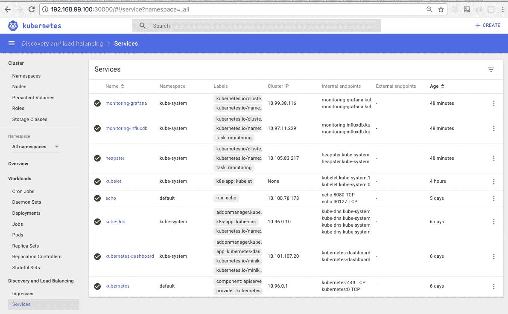
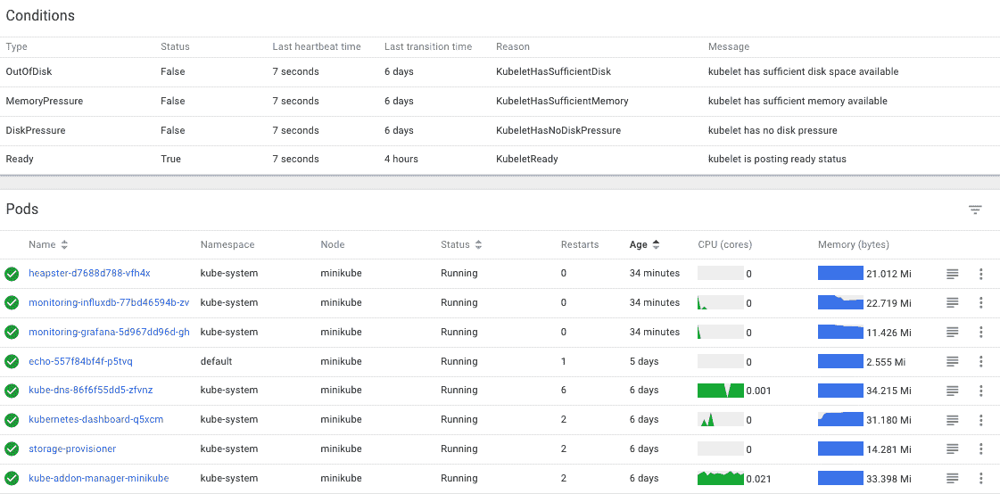

# 第三章：监控、日志记录和故障排除

在第二章中，*创建 Kubernetes 集群*，您学习了如何在不同环境中创建 Kubernetes 集群，尝试了不同的工具，并创建了一些集群。

创建 Kubernetes 集群只是故事的开始。一旦集群运行起来，您需要确保它是可操作的，所有必要的组件都齐全并正确配置，并且部署了足够的资源来满足要求。响应故障、调试和故障排除是管理任何复杂系统的重要部分，Kubernetes 也不例外。

本章将涵盖以下主题：

+   使用 Heapster 进行监控

+   使用 Kubernetes 仪表板进行性能分析

+   中央日志记录

+   在节点级别检测问题

+   故障排除场景

+   使用 Prometheus

在本章结束时，您将对监视 Kubernetes 集群的各种选项有扎实的了解，知道如何访问日志以及如何分析它们。您将能够查看健康的 Kubernetes 集群并验证一切正常。您还将能够查看不健康的 Kubernetes 集群，并系统地诊断它，定位问题并解决它们。

# 使用 Heapster 监控 Kubernetes

Heapster 是一个为 Kubernetes 集群提供强大监控解决方案的 Kubernetes 项目。它作为一个 pod（当然）运行，因此可以由 Kubernetes 本身管理。Heapster 支持 Kubernetes 和 CoreOS 集群。它具有非常模块化和灵活的设计。Heapster 从集群中的每个节点收集操作指标和事件，将它们存储在持久后端（具有明确定义的模式）中，并允许可视化和编程访问。Heapster 可以配置为使用不同的后端（或在 Heapster 术语中称为 sinks）及其相应的可视化前端。最常见的组合是 InfluxDB 作为后端，Grafana 作为前端。谷歌云平台将 Heapster 与谷歌监控服务集成。还有许多其他不太常见的后端，如下所示：

+   日志

+   谷歌云监控

+   谷歌云日志

+   Hawkular-Metrics（仅指标）

+   OpenTSDB

+   Monasca（仅指标）

+   Kafka（仅指标）

+   Riemann（仅指标）

+   Elasticsearch

您可以通过在命令行上指定 sinks 来使用多个后端：

```
--sink=log --sink=influxdb:http://monitoring-influxdb:80/  
```

# cAdvisor

cAdvisor 是 kubelet 的一部分，它在每个节点上运行。它收集有关每个容器的 CPU/核心使用情况、内存、网络和文件系统的信息。它在端口`4194`上提供基本 UI，但是对于 Heapster 来说，最重要的是它通过 Kubelet 提供了所有这些信息。Heapster 记录了由 cAdvisor 在每个节点上收集的信息，并将其存储在其后端以进行分析和可视化。

如果您想快速验证特定节点是否设置正确，例如，在 Heapster 尚未连接时创建新集群，那么 cAdvisor UI 非常有用。

这是它的样子：


# 安装 Heapster

Heapster 组件可能已安装或尚未安装在您的 Kubernetes 集群中。如果 Heapster 尚未安装，您可以使用几个简单的命令进行安装。首先，让我们克隆 Heapster 存储库：

```
> git clone https://github.com/kubernetes/heapster.git
> cd heapster 
```

在早期版本的 Kubernetes 中，Heapster 默认将服务公开为`NodePort`。现在，默认情况下，它们被公开为`ClusterIP`，这意味着它们仅在集群内可用。为了使它们在本地可用，我在`deploy/kube-config/influxdb`中的每个服务的规范中添加了 type: `NodePort`。例如，对于`deploy/kube-config/influxdb/influxdb.yaml`：

```
> git diff deploy/kube-config/influxdb/influxdb.yaml
diff --git a/deploy/kube-config/influxdb/influxdb.yaml b/deploy/kube-config/influxdb/influxdb.yaml
index 29408b81..70f52d2c 100644
--- a/deploy/kube-config/influxdb/influxdb.yaml
+++ b/deploy/kube-config/influxdb/influxdb.yaml
@@ -33,6 +33,7 @@ metadata:
 name: monitoring-influxdb
 namespace: kube-system
 spec:
+ type: NodePort
 ports:
 - port: 8086
 targetPort: 8086
```

我对`deploy/kube-config/influxdb/grafana.yaml`进行了类似的更改，其中`+ type: NodePort`这一行被注释掉了，所以我只是取消了注释。现在，我们实际上可以安装 InfluxDB 和 Grafana：

```
> kubectl create -f deploy/kube-config/influxdb  
```

您应该看到以下输出：

```
deployment "monitoring-grafana" created
service "monitoring-grafana" created
serviceaccount "heapster" created
deployment "heapster" created
service "heapster" created
deployment "monitoring-influxdb" created
service "monitoring-influxdb" created  
```

# InfluxDB 后端

InfluxDB 是一个现代而强大的分布式时间序列数据库。它非常适合用于集中式指标和日志记录，并被广泛使用。它也是首选的 Heapster 后端（在谷歌云平台之外）。唯一的问题是 InfluxDB 集群；高可用性是企业提供的一部分。

# 存储模式

InfluxDB 存储模式定义了 Heapster 在 InfluxDB 中存储的信息，并且可以在以后进行查询和绘图。指标分为多个类别，称为测量。您可以单独处理和查询每个指标，或者您可以将整个类别作为一个测量进行查询，并将单独的指标作为字段接收。命名约定是`<category>/<metrics name>`（除了正常运行时间，它只有一个指标）。如果您具有 SQL 背景，可以将测量视为表。每个指标都存储在每个容器中。每个指标都带有以下信息标签：

+   `pod_id`: 一个 pod 的唯一 ID

+   `pod_name`: pod 的用户提供的名称

+   `pod_namespace`: pod 的命名空间

+   `container_base_image`: 容器的基础镜像

+   `container_name`: 容器的用户提供的名称或系统容器的完整`cgroup`名称

+   `host_id`: 云服务提供商指定或用户指定的节点标识符

+   `hostname`: 容器运行的主机名

+   `labels`: 用户提供的标签的逗号分隔列表；格式为`key:value`

+   `namespace_id`: pod 命名空间的 UID

+   `resource_id`: 用于区分同一类型多个指标的唯一标识符，例如，文件系统/使用下的 FS 分区

以下是按类别分组的所有指标，可以看到，它非常广泛。

# CPU

CPU 指标包括：

+   `cpu/limit`: 毫核的 CPU 硬限制

+   `cpu/node_capacity`: 节点的 CPU 容量

+   `cpu/node_allocatable`: 节点的可分配 CPU

+   `cpu/node_reservation`: 节点可分配的 CPU 保留份额

+   `cpu/node_utilization`: CPU 利用率占节点可分配资源的份额

+   `cpu/request`: CPU 请求（资源的保证数量）（毫核）

+   `cpu/usage`: 所有核心的累积 CPU 使用率

+   `cpu/usage_rate`: 所有核心的 CPU 使用率（毫核）

# 文件系统

文件系统指标包括：

+   `filesystem/usage`: 文件系统上消耗的总字节数

+   `filesystem/limit`: 文件系统的总大小（字节）

+   `filesystem/available`: 文件系统中剩余的可用字节数

# 内存

内存指标包括：

+   `memory/limit`: 内存的硬限制（字节）

+   `memory/major_page_faults`: 主要页面错误的数量

+   `memory/major_page_faults_rate`: 每秒的主要页面错误数

+   `memory/node_capacity`: 节点的内存容量

+   `memory/node_allocatable`: 节点的可分配内存

+   `memory/node_reservation`: 节点可分配内存上保留的份额

+   `memory/node_utilization`: 内存利用率占内存可分配资源的份额

+   `memory/page_faults`: 页面错误的数量

+   `memory/page_faults_rate`: 每秒的页面错误数

+   `memory/request`: 内存请求（资源的保证数量）（字节）

+   `memory/usage`: 总内存使用量

+   `memory/working_set`: 总工作集使用量；工作集是内存的使用部分，不容易被内核释放

# 网络

网络指标包括：

+   `network/rx`: 累积接收的网络字节数

+   `network/rx_errors`: 接收时的累积错误数

网络

+   `network/rx_errors_rate`：在网络接收过程中每秒发生的错误次数

+   `network/rx_rate`：每秒通过网络接收的字节数

+   `network/tx`：通过网络发送的累积字节数

+   `network/tx_errors`：在网络发送过程中的累积错误次数

+   `network/tx_errors_rate`：在网络发送过程中发生的错误次数

+   `network/tx_rate`：每秒通过网络发送的字节数

# 正常运行时间

正常运行时间是容器启动以来的毫秒数。

如果您熟悉 InfluxDB，可以直接使用它。您可以使用其自己的 API 连接到它，也可以使用其 Web 界面。键入以下命令以查找其端口和端点：

```
> k describe service monitoring-influxdb --namespace=kube-system | grep NodePort
Type:               NodePort
NodePort:           <unset>  32699/TCP 
```

现在，您可以使用 HTTP 端口浏览 InfluxDB Web 界面。您需要将其配置为指向 API 端口。默认情况下，`用户名`和`密码`为`root`和`root`：


设置完成后，您可以选择要使用的数据库（请参阅右上角）。Kubernetes 数据库的名称为`k8s`。现在，您可以使用 InfluxDB 查询语言查询指标。

# Grafana 可视化

Grafana 在其自己的容器中运行，并提供一个与 InfluxDB 作为数据源配合良好的复杂仪表板。要找到端口，请键入以下命令：

```
k describe service monitoring-influxdb --namespace=kube-system | grep NodePort

Type:                NodePort
NodePort:            <unset> 30763/TCP  
```

现在，您可以在该端口上访问 Grafana Web 界面。您需要做的第一件事是设置数据源指向 InfluxDB 后端：


确保测试连接，然后去探索仪表板中的各种选项。有几个默认的仪表板，但您应该能够根据自己的喜好进行自定义。Grafana 旨在让您根据自己的需求进行调整。

# 发现和负载平衡

发现和负载平衡类别通常是您开始的地方。服务是您的 Kubernetes 集群的公共接口。严重的问题将影响您的服务，从而影响您的用户：



当您通过单击服务进行深入了解时，您将获得有关服务的一些信息（最重要的是标签选择器）和一个 Pods 视图。

# 使用仪表板进行性能分析

迄今为止，我最喜欢的工具，当我只想知道集群中发生了什么时，就是 Kubernetes 仪表板。以下是几个原因：

+   它是内置的（始终与 Kubernetes 同步和测试）

+   它很快

+   它提供了一个直观的深入界面，从集群级别一直到单个容器

+   它不需要任何定制或配置

虽然 Heapster、InfluxDB 和 Grafana 更适合定制和重型视图和查询，但 Kubernetes 仪表板的预定义视图可能能够在 80-90%的时间内回答所有你的问题。

您还可以通过上传适当的 YAML 或 JSON 文件，使用仪表板部署应用程序并创建任何 Kubernetes 资源，但我不会涉及这个，因为这对于可管理的基础设施来说是一种反模式。在玩测试集群时可能有用，但对于实际修改集群状态，我更喜欢使用命令行。您的情况可能有所不同。

让我们先找到端口：

```
k describe service kubernetes-dashboard --namespace=kube-system | grep NodePort

Type:                   NodePort
NodePort:               <unset> 30000/TCP  
```

# 顶层视图

仪表板以左侧的分层视图组织（可以通过单击汉堡菜单隐藏），右侧是动态的、基于上下文的内容。您可以深入分层视图，以深入了解相关信息。

有几个顶层类别：

+   集群

+   概述

+   工作负载

+   发现和负载平衡

+   配置和存储

您还可以通过特定命名空间过滤所有内容或选择所有命名空间。

# 集群

集群视图有五个部分：命名空间、节点、持久卷、角色和存储类。它主要是观察集群的物理资源：


一眼就可以获得大量信息：所有节点的 CPU 和内存使用情况，可用的命名空间，它们的状态和年龄。对于每个节点，您可以看到它的年龄、标签，以及它是否准备就绪。如果有持久卷和角色，您也会看到它们，然后是存储类（在这种情况下只是主机路径）。

如果我们深入节点并点击 minikube 节点本身，我们会得到有关该节点和分配资源的详细信息，以一个漂亮的饼图显示。这对处理性能问题至关重要。如果一个节点没有足够的资源，那么它可能无法满足其 pod 的需求：


如果您向下滚动，您会看到更多有趣的信息。条件窗格是最重要的地方。您可以清晰、简洁地查看每个节点的内存和磁盘压力：



还有 Pods 和 Events 窗格。我们将在下一节讨论 pod。

# 工作负载

工作负载类别是主要类别。它组织了许多类型的 Kubernetes 资源，如 CronJobs、Daemon Sets、Deployments、Jobs、Pods、Replica Sets、Replication Controllers 和 Stateful Sets。您可以沿着任何这些维度进行深入。这是默认命名空间的顶级工作负载视图，目前只部署了 echo 服务。您可以看到部署、副本集和 pod：


让我们切换到所有命名空间并深入研究 Pods 子类别。这是一个非常有用的视图。在每一行中，您可以看出 pod 是否正在运行，它重新启动了多少次，它的 IP，甚至嵌入了 CPU 和内存使用历史记录作为漂亮的小图形：


您也可以通过点击文本符号（从右边数第二个）查看任何 pod 的日志。让我们检查 InfluxDB pod 的日志。看起来一切都井井有条，Heapster 成功地向其写入：


还有一个我们尚未探讨的更详细的层次。我们可以进入容器级别。让我们点击 kubedns pod。我们得到以下屏幕，显示了各个容器及其`run`命令；我们还可以查看它们的日志：


# 添加中央日志记录

中央日志记录或集群级日志记录是任何具有多个节点、pod 或容器的集群的基本要求。首先，单独查看每个 pod 或容器的日志是不切实际的。您无法获得系统的全局图片，而且将有太多的消息需要筛选。您需要一个聚合日志消息并让您轻松地切片和切块的解决方案。第二个原因是容器是短暂的。有问题的 pod 通常会死掉，它们的复制控制器或副本集将启动一个新实例，丢失所有重要的日志信息。通过记录到中央日志记录服务，您可以保留这些关键的故障排除信息。

# 规划中央日志记录

在概念上，中央日志非常简单。在每个节点上，您运行一个专用代理，拦截节点上所有 pod 和容器的所有日志消息，并将它们连同足够的元数据发送到一个中央存储库，其中它们被安全地存储。

像往常一样，如果您在谷歌平台上运行，那么 GKE 会为您提供支持，并且有一个谷歌集中日志服务集成得很好。对于其他平台，一个流行的解决方案是 fluentd、Elasticsearch 和 Kibana。有一个官方的附加组件来为每个组件设置适当的服务。`fluentd-elasticsearch`附加组件位于[`bit.ly/2f6MF5b`](http://bit.ly/2f6MF5b)。

它被安装为 Elasticsearch 和 Kibana 的一组服务，并且在每个节点上安装了 fluentd 代理。

# Fluentd

Fluentd 是一个统一的日志记录层，位于任意数据源和任意数据接收器之间，并确保日志消息可以从 A 流向 B。Kubernetes 带有一个附加组件，其中有一个部署 fluentd 代理的 Docker 镜像，它知道如何读取与 Kubernetes 相关的各种日志，如`Docker`日志、`etcd`日志和`Kube`日志。它还为每条日志消息添加标签，以便用户以后可以轻松地按标签进行过滤。这是`fluentd-es-configmap.yaml`文件的一部分：

```
# Example:
# 2016/02/04 06:52:38 filePurge: successfully removed file 
/var/etcd/data/member/wal/00000000000006d0-00000000010a23d1.wal
<source>
 type tail
 # Not parsing this, because it doesn't have anything particularly 
useful to
 # parse out of it (like severities).
 format none
 path /var/log/etcd.log
 pos_file /var/log/es-etcd.log.pos
 tag etcd
</source>
```

# Elasticsearch

Elasticsearch 是一个很棒的文档存储和全文搜索引擎。它在企业中很受欢迎，因为它非常快速、可靠和可扩展。它作为一个 Docker 镜像在 Kubernetes 中央日志附加组件中使用，并且部署为一个服务。请注意，一个完全成熟的 Elasticsearch 生产集群（将部署在 Kubernetes 集群上）需要自己的主节点、客户端节点和数据节点。对于大规模和高可用的 Kubernetes 集群，中央日志本身将被集群化。Elasticsearch 可以使用自我发现。这是一个企业级的解决方案：[`github.com/pires/kubernetes-elasticsearch-cluster`](https://github.com/pires/kubernetes-elasticsearch-cluster)。

# Kibana

Kibana 是 Elasticsearch 的搭档。它用于可视化和与 Elasticsearch 存储和索引的数据进行交互。它也作为一个服务被附加组件安装。这是 Kibana 的 Dockerfile 模板([`bit.ly/2lwmtpc`](http://bit.ly/2lwmtpc))。

# 检测节点问题

在 Kubernetes 的概念模型中，工作单位是 pod。但是，pod 被调度到节点上。在监控和可靠性方面，节点是最需要关注的，因为 Kubernetes 本身（调度器和复制控制器）负责 pod。节点可能遭受各种问题，而 Kubernetes 并不知晓。因此，它将继续将 pod 调度到有问题的节点上，而 pod 可能无法正常运行。以下是节点可能遭受的一些问题，尽管看起来是正常的：

+   CPU 问题

+   内存问题

+   磁盘问题

+   内核死锁

+   损坏的文件系统

+   Docker 守护进程问题

kubelet 和 cAdvisor 无法检测到这些问题，需要另一个解决方案。进入节点问题检测器。

# 节点问题检测器

节点问题检测器是在每个节点上运行的一个 pod。它需要解决一个困难的问题。它需要检测不同环境、不同硬件和不同操作系统上的各种问题。它需要足够可靠，不受影响（否则，它无法报告问题），并且需要具有相对较低的开销，以避免向主节点发送大量信息。此外，它需要在每个节点上运行。Kubernetes 最近收到了一个名为 DaemonSet 的新功能，解决了最后一个问题。

源代码位于[`github.com/kubernetes/node-problem-detector`](https://github.com/kubernetes/node-problem-detector)。

# 守护进程集

DaemonSet 是每个节点的一个 pod。一旦定义了 DaemonSet，集群中添加的每个节点都会自动获得一个 pod。如果该 pod 死掉，Kubernetes 将在该节点上启动该 pod 的另一个实例。可以将其视为带有 1:1 节点- pod 亲和性的复制控制器。节点问题检测器被定义为一个 DaemonSet，这与其要求完全匹配。可以使用亲和性、反亲和性和污点来更精细地控制 DaemonSet 的调度。

# 问题守护进程

节点问题检测器的问题（双关语）在于它需要处理太多问题。试图将所有这些问题都塞进一个代码库中会导致一个复杂、臃肿且永远不稳定的代码库。节点问题检测器的设计要求将报告节点问题的核心功能与特定问题检测分离开来。报告 API 基于通用条件和事件。问题检测应该由单独的问题守护程序（每个都在自己的容器中）来完成。这样，就可以添加和演进新的问题检测器，而不会影响核心节点问题检测器。此外，控制平面可能会有一个补救控制器，可以自动解决一些节点问题，从而实现自愈。

在这个阶段（Kubernetes 1.10），问题守护程序已经嵌入到节点问题检测器二进制文件中，并且它们作为 Goroutines 执行，因此您还没有获得松耦合设计的好处。

在这一部分，我们涵盖了节点问题的重要主题，这可能会妨碍工作负载的成功调度，以及节点问题检测器如何帮助解决这些问题。在下一节中，我们将讨论各种故障场景以及如何使用 Heapster、中央日志、Kubernetes 仪表板和节点问题检测器进行故障排除。

# 故障排除场景

在一个大型的 Kubernetes 集群中，有很多事情可能会出错，而且它们确实会出错，这是可以预料的。您可以采用最佳实践并最小化其中一些问题（主要是人为错误），通过严格的流程来减少一些问题。然而，一些问题，比如硬件故障和网络问题是无法完全避免的。即使是人为错误，如果这意味着开发时间变慢，也不应该总是被最小化。在这一部分，我们将讨论各种故障类别，如何检测它们，如何评估它们的影响，并考虑适当的应对措施。

# 设计健壮的系统

当您想设计一个强大的系统时，首先需要了解可能的故障模式，每种故障的风险/概率以及每种故障的影响/成本。然后，您可以考虑各种预防和缓解措施、损失削减策略、事件管理策略和恢复程序。最后，您可以制定一个与风险相匹配的缓解方案，包括成本。全面的设计很重要，并且需要随着系统的发展而进行更新。赌注越高，您的计划就应该越彻底。这个过程必须为每个组织量身定制。错误恢复和健壮性的一个角落是检测故障并能够进行故障排除。以下小节描述了常见的故障类别，如何检测它们以及在哪里收集额外信息。

# 硬件故障

Kubernetes 中的硬件故障可以分为两组：

+   节点无响应

+   节点有响应

当节点无响应时，有时很难确定是网络问题、配置问题还是实际的硬件故障。显然，您无法使用节点本身的日志或运行诊断。你能做什么？首先，考虑节点是否曾经有响应。如果这是一个刚刚添加到集群中的节点，更有可能是配置问题。如果这是集群中的一个节点，那么您可以查看来自 Heapster 或中央日志的节点的历史数据，并查看日志中是否有任何错误或性能下降的迹象，这可能表明硬件故障。

当节点有响应时，它可能仍然遭受冗余硬件的故障，例如非操作系统磁盘或一些核心。如果节点问题检测器在节点上运行并引起一些事件或节点条件引起主节点的注意，您可以检测硬件故障。或者，您可能会注意到 Pod 不断重新启动或作业完成时间较长。所有这些都可能是硬件故障的迹象。另一个硬件故障的强烈暗示是，如果问题局限在单个节点上，并且标准维护操作（如重新启动）不能缓解症状。

如果您的集群部署在云中，替换一个您怀疑存在硬件问题的节点是微不足道的。只需手动提供一个新的 VM 并删除坏的 VM 即可。在某些情况下，您可能希望采用更自动化的流程并使用一个补救控制器，正如节点问题检测器设计所建议的那样。您的补救控制器将监听问题（或缺少的健康检查），并可以自动替换坏的节点。即使在私有托管或裸金属中，这种方法也可以运行，只要您保留一些额外的节点准备投入使用。大规模集群即使在大部分时间内容量减少也可以正常运行。您可以容忍少量节点宕机时的轻微容量减少，或者您可以略微过度配置。这样，当一个节点宕机时，您就有了一些余地。

# 配额、份额和限制

Kubernetes 是一个多租户系统。它旨在高效利用资源，但是它根据命名空间中可用配额和限制以及 pod 和容器对保证资源的请求之间的一套检查和平衡系统来调度 pod 并分配资源。我们将在本书的后面深入讨论细节。在这里，我们只考虑可能出现的问题以及如何检测它。您可能会遇到几种不良结果：

+   资源不足：如果一个 pod 需要一定数量的 CPU 或内存，而没有可用容量的节点，那么该 pod 就无法被调度。

+   资源利用不足：一个 pod 可能声明需要一定数量的 CPU 或内存，Kubernetes 会满足，但是 pod 可能只使用其请求资源的一小部分。这只是浪费。

+   节点配置不匹配：一个需要大量 CPU 但很少内存的 pod 可能被调度到一个高内存的节点上，并使用所有的 CPU 资源，从而占用了节点，因此无法调度其他 pod，但未使用的内存却被浪费了。

查看仪表板是一种通过视觉寻找可疑情况的好方法。过度订阅或资源利用不足的节点和 pod 都是配额和资源请求不匹配的候选者。


一旦您检测到一个候选项，您可以深入使用`describe`命令来查看节点或 pod 级别。在大规模集群中，您应该有自动化检查，以比较利用率与容量规划。这很重要，因为大多数大型系统都有一定程度的波动，而不会期望均匀的负载。确保您了解系统的需求，并且您的集群容量在正常范围内或可以根据需要弹性调整。

# 错误的配置

错误的配置是一个总称。您的 Kubernetes 集群状态是配置；您的容器的命令行参数是配置；Kubernetes、您的应用服务和任何第三方服务使用的所有环境变量都是配置；所有配置文件都是配置。在一些数据驱动的系统中，配置存储在各种数据存储中。配置问题非常常见，因为通常没有建立良好的实践来测试它们。它们通常具有各种回退（例如，配置文件的搜索路径）和默认值，并且生产环境配置与开发或暂存环境不同。

在 Kubernetes 集群级别，可能存在许多可能的配置问题，如下所示：

+   节点、pod 或容器的标签不正确

+   在没有复制控制器的情况下调度 pod

+   服务端口的规范不正确

+   不正确的 ConfigMap

大多数这些问题可以通过拥有适当的自动化部署流程来解决，但您必须深入了解您的集群架构以及 Kubernetes 资源如何配合。

配置问题通常发生在您更改某些内容之后。在每次部署或手动更改集群后，验证其状态至关重要。

Heapster 和仪表板在这里是很好的选择。我建议从服务开始，并验证它们是否可用、响应和功能正常。然后，您可以深入了解系统是否也在预期的性能参数范围内运行。

日志还提供了有用的提示，并可以确定特定的配置选项。

# 成本与性能

大型集群并不便宜。特别是在云中运行时。操作大规模系统的一个重要部分是跟踪开支。

# 在云上管理成本

云的最大好处之一是它可以满足弹性需求，满足系统根据需要自动扩展和收缩，通过根据需要分配和释放资源。Kubernetes 非常适合这种模型，并且可以扩展以根据需要提供更多节点。风险在于，如果不适当地限制，拒绝服务攻击（恶意的、意外的或自我造成的）可能导致昂贵资源的任意分配。这需要仔细监控，以便及早发现。命名空间的配额可以避免这种情况，但您仍然需要能够深入了解并准确定位核心问题。根本原因可能是外部的（僵尸网络攻击），配置错误，内部测试出错，或者是检测或分配资源的代码中的错误。

# 在裸金属上管理成本

在裸金属上，您通常不必担心资源分配失控，但是如果您需要额外的容量并且无法快速提供更多资源，您很容易遇到瓶颈。容量规划和监控系统性能以及及早检测需求是 OPS 的主要关注点。Heapster 可以显示历史趋势，并帮助识别高峰时段和总体需求增长。

# 管理混合集群的成本

混合集群在裸金属和云上运行（可能还在私人托管服务上）。考虑因素是相似的，但您可能需要汇总您的分析。我们将在稍后更详细地讨论混合集群。

# 使用 Prometheus

Heapster 和 Kubernetes 默认的监控和日志记录是一个很好的起点。然而，Kubernetes 社区充满了创新，有几种替代方案可供选择。其中最受欢迎的解决方案之一是 Prometheus。在本节中，我们将探索运营商的新世界，Prometheus 运营商，如何安装它以及如何使用它来监视您的集群。

# 什么是运营商？

运营商是一种新型软件，它封装了在 Kubernetes 之上开发、管理和维护应用程序所需的操作知识。这个术语是由 CoreOS 在 2016 年底引入的。运营商是一个特定于应用程序的控制器，它扩展了 Kubernetes API，以代表 Kubernetes 用户创建、配置和管理复杂有状态应用程序的实例。它建立在基本的 Kubernetes 资源和控制器概念之上，但包括领域或应用程序特定的知识，以自动化常见任务。

# Prometheus Operator

Prometheus ([`prometheus.io`](https://prometheus.io))是一个用于监控集群中应用程序的开源系统监控和警报工具包。它受 Google 的 Borgmon 启发，并设计用于 Kubernetes 模型的工作单元分配和调度。它于 2016 年加入 CNCF，并在整个行业广泛采用。InfluxDB 和 Prometheus 之间的主要区别在于，Prometheus 使用拉模型，任何人都可以访问/metrics 端点，其查询语言非常表达性强，但比 InfluxDB 的类似 SQL 的查询语言更简单。

Kubernetes 具有内置功能来支持 Prometheus 指标，而 Prometheus 对 Kuberneres 的认识不断改进。Prometheus Operator 将所有这些监控功能打包成一个易于安装和使用的捆绑包。

# 使用 kube-prometheus 安装 Prometheus

安装 Prometheus 的最简单方法是使用 kube-prometheus。它使用 Prometheus Operator 以及 Grafana 进行仪表板和`AlertManager`的管理。要开始，请克隆存储库并运行`deploy`脚本：

```
> git clone https://github.com/coreos/prometheus-operator.git 
> cd contrib/kube-prometheus
> hack/cluster-monitoring/deploy 
```

该脚本创建一个监控命名空间和大量的 Kubernetes 实体和支持组件。

+   Prometheus Operator 本身

+   Prometheus node_exporter

+   kube-state metrics

+   覆盖监控所有 Kubernetes 核心组件和导出器的 Prometheus 配置

+   集群组件健康的默认一组警报规则

+   为集群指标提供仪表板的 Grafana 实例

+   一个由三个节点组成的高可用性 Alertmanager 集群

让我们验证一切是否正常：

```
> kg po --namespace=monitoring
NAME                                READY     STATUS    RESTARTS   AGE
alertmanager-main-0                  2/2       Running   0          1h
alertmanager-main-1                  2/2       Running   0          1h
alertmanager-main-2                  0/2       Pending   0          1h
grafana-7d966ff57-rvpwk              2/2       Running   0          1h
kube-state-metrics-5dc6c89cd7-s9n4m  2/2       Running   0          1h
node-exporter-vfbhq                  1/1       Running   0          1h
prometheus-k8s-0                     2/2       Running   0          1h
prometheus-k8s-1                     2/2       Running   0          1h
prometheus-operator-66578f9cd9-5t6xw 1/1       Running   0          1h  
```

请注意，`alertmanager-main-2`处于挂起状态。我怀疑这是由于 Minikube 在两个核心上运行。在我的设置中，这实际上并没有造成任何问题。

# 使用 Prometheus 监控您的集群

一旦 Prometheus Operator 与 Grafana 和 Alertmanager 一起运行，您就可以访问它们的 UI 并与不同的组件进行交互：

+   节点端口`30900`上的 Prometheus UI

+   节点端口`30903`上的 Alertmanager UI

+   节点端口`30902`上的 Grafana

Prometheus 支持选择的指标种类繁多。以下是一个屏幕截图，显示了按容器分解的微秒级 HTTP 请求持续时间：


要将视图限制为`prometheus-k8s`服务的仅 0.99 分位数，请使用以下查询：


```
http_request_duration_microseconds{service="prometheus-k8s", quantile="0.99"}  
```


Alertmanager 是 Prometheus 监控故事的另一个重要部分。这是一个 Web UI 的截图，让您可以根据任意指标定义和配置警报。

# 总结

在本章中，我们讨论了监控、日志记录和故障排除。这是操作任何系统的关键方面，特别是像 Kubernetes 这样有许多移动部件的平台。每当我负责某件事情时，我最担心的是出现问题，而我没有系统化的方法来找出问题所在以及如何解决它。Kubernetes 内置了丰富的工具和设施，如 Heapster、日志记录、DaemonSets 和节点问题检测器。您还可以部署任何您喜欢的监控解决方案。

在第四章中，*高可用性和可靠性*，我们将看到高可用和可扩展的 Kubernetes 集群。这可以说是 Kubernetes 最重要的用例，它在与其他编排解决方案相比的时候表现出色。
