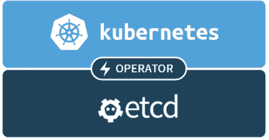

# 第四章：高可用性和可靠性

在上一章中，我们讨论了监视您的 Kubernetes 集群，在节点级别检测问题，识别和纠正性能问题以及一般故障排除。

在本章中，我们将深入探讨高度可用的集群主题。这是一个复杂的主题。Kubernetes 项目和社区尚未就实现高可用性的真正方式达成一致。高度可用的 Kubernetes 集群有许多方面，例如确保控制平面在面对故障时能够继续运行，保护`etcd`中的集群状态，保护系统的数据，并快速恢复容量和/或性能。不同的系统将有不同的可靠性和可用性要求。如何设计和实现高度可用的 Kubernetes 集群将取决于这些要求。

通过本章的学习，您将了解与高可用性相关的各种概念，并熟悉 Kubernetes 高可用性最佳实践以及何时使用它们。您将能够使用不同的策略和技术升级实时集群，并能够根据性能、成本和可用性之间的权衡选择多种可能的解决方案。

# 高可用性概念

在这一部分，我们将通过探索可靠和高可用系统的概念和构建模块来开始我们的高可用性之旅。百万（万亿？）美元的问题是，我们如何从不可靠的组件构建可靠和高可用的系统？组件会失败，你可以把它带到银行；硬件会失败；网络会失败；配置会出错；软件会有 bug；人会犯错误。接受这一点，我们需要设计一个系统，即使组件失败，也能可靠和高可用。这个想法是从冗余开始，检测组件故障，并快速替换坏组件。

# 冗余

**冗余**是可靠和高可用系统在硬件和数据级别的基础。如果关键组件失败并且您希望系统继续运行，您必须准备好另一个相同的组件。Kubernetes 本身通过复制控制器和副本集来管理无状态的 pod。然而，您的`etcd`中的集群状态和主要组件本身需要冗余以在某些组件失败时继续运行。此外，如果您的系统的重要组件没有受到冗余存储的支持（例如在云平台上），那么您需要添加冗余以防止数据丢失。

# 热插拔

**热插拔**是指在不关闭系统的情况下替换失败的组件的概念，对用户的中断最小（理想情况下为零）。如果组件是无状态的（或其状态存储在单独的冗余存储中），那么热插拔新组件来替换它就很容易，只需要将所有客户端重定向到新组件。然而，如果它存储本地状态，包括内存中的状态，那么热插拔就很重要。有以下两个主要选项：

+   放弃在飞行中的交易

+   保持热备份同步

第一个解决方案要简单得多。大多数系统都足够弹性，可以应对故障。客户端可以重试失败的请求，而热插拔的组件将为它们提供服务。

第二个解决方案更加复杂和脆弱，并且会产生性能开销，因为每次交互都必须复制到两个副本（并得到确认）。对于系统的某些部分可能是必要的。

# 领导者选举

领导者或主选举是分布式系统中常见的模式。您经常有多个相同的组件协作和共享负载，但其中一个组件被选为领导者，并且某些操作通过领导者进行序列化。您可以将具有领导者选举的分布式系统视为冗余和热插拔的组合。这些组件都是冗余的，当当前领导者失败或不可用时，将选举出一个新的领导者并进行热插拔。

# 智能负载平衡

负载平衡是指在多个组件之间分配服务传入请求的工作负载。当一些组件失败时，负载平衡器必须首先停止向失败或不可达的组件发送请求。第二步是提供新的组件来恢复容量并更新负载平衡器。Kubernetes 通过服务、端点和标签提供了支持这一点的很好的设施。

# 幂等性

许多类型的故障都可能是暂时的。这在网络问题或过于严格的超时情况下最常见。不响应健康检查的组件将被视为不可达，另一个组件将取而代之。原本计划发送到可能失败的组件的工作可能被发送到另一个组件，但原始组件可能仍在工作并完成相同的工作。最终结果是相同的工作可能会执行两次。很难避免这种情况。为了支持精确一次语义，您需要付出沉重的代价，包括开销、性能、延迟和复杂性。因此，大多数系统选择支持至少一次语义，这意味着可以多次执行相同的工作而不违反系统的数据完整性。这种属性被称为幂等性。幂等系统在多次执行操作时保持其状态。

# 自愈

当动态系统中发生组件故障时，通常希望系统能够自我修复。Kubernetes 复制控制器和副本集是自愈系统的很好例子，但故障可能远不止于 Pod。在上一章中，我们讨论了资源监控和节点问题检测。补救控制器是自愈概念的一个很好的例子。自愈始于自动检测问题，然后是自动解决。配额和限制有助于创建检查和平衡，以确保自动自愈不会因不可预测的情况（如 DDOS 攻击）而失控。

在本节中，我们考虑了创建可靠和高可用系统涉及的各种概念。在下一节中，我们将应用它们，并展示部署在 Kubernetes 集群上的系统的最佳实践。

# 高可用性最佳实践

构建可靠和高可用的分布式系统是一项重要的工作。在本节中，我们将检查一些最佳实践，使基于 Kubernetes 的系统能够可靠地运行，并在面对各种故障类别时可用。

# 创建高可用集群

要创建一个高可用的 Kubernetes 集群，主要组件必须是冗余的。这意味着`etcd`必须部署为一个集群（通常跨三个或五个节点），Kubernetes API 服务器必须是冗余的。辅助集群管理服务，如 Heapster 的存储，如果必要的话也可以部署为冗余。以下图表描述了一个典型的可靠和高可用的 Kubernetes 集群。有几个负载均衡的主节点，每个节点都包含整个主要组件以及一个`etcd`组件：

！[](Images/9a4726b1-7f50-4611-bed4-91d7663833b8.png)

这不是配置高可用集群的唯一方式。例如，您可能更喜欢部署一个独立的`etcd`集群，以优化机器的工作负载，或者如果您的`etcd`集群需要比其他主节点更多的冗余。

自托管的 Kubernetes，其中控制平面组件部署为集群中的 pod 和有状态集，是简化控制平面组件的健壮性、灾难恢复和自愈的一个很好的方法，通过将 Kubernetes 应用于 Kubernetes。

# 使您的节点可靠

节点会失败，或者一些组件会失败，但许多故障是暂时的。基本的保证是确保 Docker 守护程序（或任何 CRI 实现）和 Kubelet 在发生故障时能够自动重启。

如果您运行 CoreOS，一个现代的基于 Debian 的操作系统（包括 Ubuntu >= 16.04），或者任何其他使用`systemd`作为其`init`机制的操作系统，那么很容易将`Docker`和`kubelet`部署为自启动守护程序：

```
systemctl enable docker 
systemctl enable kublet 
```

对于其他操作系统，Kubernetes 项目选择了 monit 作为高可用示例，但您可以使用任何您喜欢的进程监视器。

# 保护您的集群状态

Kubernetes 集群状态存储在`etcd`中。`etcd`集群被设计为超级可靠，并分布在多个节点上。利用这些功能对于一个可靠和高可用的 Kubernetes 集群非常重要。

# 集群化 etcd

您的 etcd 集群中应该至少有三个节点。如果您需要更可靠和冗余性，可以增加到五个、七个或任何其他奇数节点。节点数量必须是奇数，以便在网络分裂的情况下有明确的多数。

为了创建一个集群，`etcd`节点应该能够发现彼此。有几种方法可以实现这一点。我建议使用 CoreOS 的优秀的`etcd-operator`：



操作员负责处理 etcd 操作的许多复杂方面，例如：

+   创建和销毁

+   调整大小

+   故障转移

+   滚动升级

+   备份和恢复

# 安装 etcd 操作员

安装`etcd-operator`的最简单方法是使用 Helm-Kubernetes 包管理器。如果您尚未安装 Helm，请按照[`github.com/kubernetes/helm#install`](https://github.com/kubernetes/helm#install)中给出的说明进行操作。

然后，初始化`helm`：

```
> helm init 
Creating /Users/gigi.sayfan/.helm 
Creating /Users/gigi.sayfan/.helm/repository 
Creating /Users/gigi.sayfan/.helm/repository/cache 
Creating /Users/gigi.sayfan/.helm/repository/local 
Creating /Users/gigi.sayfan/.helm/plugins 
Creating /Users/gigi.sayfan/.helm/starters 
Creating /Users/gigi.sayfan/.helm/cache/archive 
Creating /Users/gigi.sayfan/.helm/repository/repositories.yaml 
Adding stable repo with URL: https://kubernetes-charts.storage.googleapis.com 
Adding local repo with URL: http://127.0.0.1:8879/charts 
$HELM_HOME has been configured at /Users/gigi.sayfan/.helm. 

Tiller (the Helm server-side component) has been installed into your Kubernetes Cluster. 
Happy Helming! 
```

我们将在第十三章中深入探讨 Helm，*处理 Kubernetes 包管理器*。目前，我们只是用它来安装`etcd`操作员。在支持 Kubernetes 1.8 的 Minikube 0.24.1 上（尽管 Kubernetes 1.10 已经发布），默认情况下存在一些权限问题。为了克服这些问题，我们需要创建一些角色和角色绑定。以下是`rbac.yaml`文件：

```
# Wide open access to the cluster (mostly for kubelet) 
kind: ClusterRole 
apiVersion: rbac.authorization.k8s.io/v1beta1 
metadata: 
  name: cluster-writer 
rules: 
  - apiGroups: ["*"] 
    resources: ["*"] 
    verbs: ["*"] 
  - nonResourceURLs: ["*"] 
    verbs: ["*"] 

--- 

# Full read access to the api and resources 
kind: ClusterRole 
apiVersion: rbac.authorization.k8s.io/v1beta1metadata: 
  name: cluster-reader 
rules: 
  - apiGroups: ["*"] 
    resources: ["*"] 
    verbs: ["get", "list", "watch"] 
  - nonResourceURLs: ["*"] 
    verbs: ["*"] 
--- 
# Give admin, kubelet, kube-system, kube-proxy god access 
kind: ClusterRoleBinding 
apiVersion: rbac.authorization.k8s.io/v1beta1metadata: 
  name: cluster-write 
subjects: 
  - kind: User 
    name: admin 
  - kind: User 
    name: kubelet 
  - kind: ServiceAccount 
    name: default 
    namespace: kube-system 
  - kind: User 
    name: kube-proxy 
roleRef: 
  kind: ClusterRole 
  name: cluster-writer 
  apiGroup: rbac.authorization.k8s.io 
```

您可以像应用其他 Kubernetes 清单一样应用它：

```
kubectl apply -f rbac.yaml.  
```

现在，我们终于可以安装`etcd-operator`了。我使用`x`作为一个简短的发布名称，以使输出更简洁。您可能希望使用更有意义的名称：

```
> helm install stable/etcd-operator --name x 
NAME:   x 
LAST DEPLOYED: Sun Jan  7 19:29:17 2018 
NAMESPACE: default 
STATUS: DEPLOYED 

RESOURCES: 
==> v1beta1/ClusterRole 
NAME                           AGE 
x-etcd-operator-etcd-operator  1s 

==> v1beta1/ClusterRoleBinding 
NAME                                   AGE 
x-etcd-operator-etcd-backup-operator   1s 
x-etcd-operator-etcd-operator          1s 
x-etcd-operator-etcd-restore-operator  1s 

==> v1/Service 
NAME                   TYPE       CLUSTER-IP    EXTERNAL-IP  PORT(S)    AGE 
etcd-restore-operator  ClusterIP  10.96.236.40  <none>       19999/TCP  1s 

==> v1beta1/Deployment 
NAME                                   DESIRED  CURRENT  UP-TO-DATE  AVAILABLE  AGE 
x-etcd-operator-etcd-backup-operator   1        1        1         0          1s 
x-etcd-operator-etcd-operator          1        1        1         0          1s 
x-etcd-operator-etcd-restore-operator  1        1        1         0          1s 

==> v1/ServiceAccount 
NAME                                   SECRETS  AGE 
x-etcd-operator-etcd-backup-operator   1        1s 
x-etcd-operator-etcd-operator          1        1s 
x-etcd-operator-etcd-restore-operator  1        1s 

NOTES: 
1\. etcd-operator deployed. 
  If you would like to deploy an etcd-cluster set cluster.enabled to true in values.yaml 
  Check the etcd-operator logs 
    export POD=$(kubectl get pods -l app=x-etcd-operator-etcd-operator --namespace default --output name) 
    kubectl logs $POD --namespace=default 
```

# 创建 etcd 集群

将以下内容保存到`etcd-cluster.yaml`中：

```
apiVersion: "etcd.database.coreos.com/v1beta2" 
kind: "EtcdCluster" 
metadata: 
  name: "etcd-cluster" 
spec: 
  size: 3 
  version: "3.2.13" 
```

要创建集群类型：

```
> k create -f etcd-cluster.yaml
etcdcluster "etcd-cluster" created

Let's verify the cluster pods were created properly:
> k get pods | grep etcd-cluster
etcd-cluster-0000                         1/1       Running   0          4m
etcd-cluster-0001                         1/1       Running   0          4m
etcd-cluster-0002                         1/1       Running   0          4m

```

# 验证 etcd 集群

一旦`etcd`集群正常运行，您可以访问`etcdctl`工具来检查集群状态和健康状况。Kubernetes 允许您通过`exec`命令（类似于 Docker exec）直接在 pod 或容器内执行命令。

以下是如何检查集群是否健康：

```
> k exec etcd-cluster-0000 etcdctl cluster-health
member 898a228a043c6ef0 is healthy: got healthy result from http://etcd-cluster-0001.etcd-cluster.default.svc:2379
member 89e2f85069640541 is healthy: got healthy result from http://etcd-cluster-0002.etcd-cluster.default.svc:2379
member 963265fbd20597c6 is healthy: got healthy result from http://etcd-cluster-0000.etcd-cluster.default.svc:2379
cluster is healthy  
```

以下是如何设置和获取键值对：

```
> k exec etcd-cluster-0000 etcdctl set test "Yeah, it works"
Yeah, it works
> k exec etcd-cluster-0000 etcdctl get test  
```

是的，它有效！

# 保护您的数据

保护集群状态和配置非常重要，但更重要的是保护您自己的数据。如果一些方式集群状态被损坏，您可以始终从头开始重建集群（尽管在重建期间集群将不可用）。但如果您自己的数据被损坏或丢失，您将陷入深深的麻烦。相同的规则适用；冗余是王道。然而，尽管 Kubernetes 集群状态非常动态，但您的许多数据可能不太动态。例如，许多历史数据通常很重要，可以进行备份和恢复。实时数据可能会丢失，但整个系统可以恢复到较早的快照，并且只会遭受暂时的损害。

# 运行冗余的 API 服务器

API 服务器是无状态的，可以从`etcd`集群中动态获取所有必要的数据。这意味着您可以轻松地运行多个 API 服务器，而无需在它们之间进行协调。一旦有多个 API 服务器运行，您可以在它们前面放置一个负载均衡器，使客户端对此毫无察觉。

# 在 Kubernetes 中运行领导者选举

一些主要组件，如调度程序和控制器管理器，不能同时处于活动状态。这将是一片混乱，因为多个调度程序尝试将相同的 pod 调度到多个节点或多次调度到同一节点。拥有高度可扩展的 Kubernetes 集群的正确方法是使这些组件以领导者选举模式运行。这意味着多个实例正在运行，但一次只有一个实例处于活动状态，如果它失败，另一个实例将被选为领导者并接替其位置。

Kubernetes 通过`leader-elect`标志支持这种模式。调度程序和控制器管理器可以通过将它们各自的清单复制到`/etc/kubernetes/manifests`来部署为 pod。

以下是调度程序清单中显示标志使用的片段：

```
command:
- /bin/sh
- -c
- /usr/local/bin/kube-scheduler --master=127.0.0.1:8080 --v=2 --leader-elect=true 1>>/var/log/kube-scheduler.log
2>&1
```

以下是控制器管理器清单中显示标志使用的片段：

```
- command:
- /bin/sh
- -c
- /usr/local/bin/kube-controller-manager --master=127.0.0.1:8080 --cluster-name=e2e-test-bburns
--cluster-cidr=10.245.0.0/16 --allocate-node-cidrs=true --cloud-provider=gce  --service-account-private-key-file=/srv/kubernetes/server.key
--v=2 --leader-elect=true 1>>/var/log/kube-controller-manager.log 2>&1
image: gcr.io/google_containers/kube-controller-manager:fda24638d51a48baa13c35337fcd4793 
```

请注意，这些组件无法像其他 pod 一样由 Kubernetes 自动重新启动，因为它们正是负责重新启动失败的 pod 的 Kubernetes 组件，因此如果它们失败，它们无法重新启动自己。必须已经有一个准备就绪的替代品正在运行。

# 应用程序的领导者选举

领导者选举对你的应用也可能非常有用，但实现起来非常困难。幸运的是，Kubernetes 来拯救了。有一个经过记录的程序，可以通过 Google 的`leader-elector`容器来支持你的应用进行领导者选举。基本概念是使用 Kubernetes 端点结合`ResourceVersion`和`Annotations`。当你将这个容器作为你的应用 pod 的 sidecar 时，你可以以非常简化的方式获得领导者选举的能力。

让我们使用三个 pod 运行`leader-elector`容器，并进行名为 election 的选举：

```
> kubectl run leader-elector --image=gcr.io/google_containers/leader-elector:0.5 --replicas=3 -- --election=election -http=0.0.0.0:4040
```

过一段时间，你会在你的集群中看到三个名为`leader-elector-xxx`的新 pod。

```
> kubectl get pods | grep elect
leader-elector-57746fd798-7s886                1/1       Running   0          39s
leader-elector-57746fd798-d94zx                1/1       Running   0          39s
leader-elector-57746fd798-xcljl                1/1       Running   0          39s 
```

好了。但是谁是主人？让我们查询选举端点：

```
    > kubectl get endpoints election -o json
    {
        "apiVersion": "v1",
        "kind": "Endpoints",
        "metadata": {
            "annotations": {
                "control-plane.alpha.kubernetes.io/leader": "{\"holderIdentity\":\"leader-elector-57746fd798-xcljl\",\"leaseDurationSeconds\":10,\"acquireTime\":\"2018-01-08T04:16:40Z\",\"renewTime\":\"2018-01-08T04:18:26Z\",\"leaderTransitions\":0}"
            },
            "creationTimestamp": "2018-01-08T04:16:40Z",
            "name": "election",
            "namespace": "default",
            "resourceVersion": "1090942",
            "selfLink": "/api/v1/namespaces/default/endpoints/election",
            "uid": "ba42f436-f42a-11e7-abf8-080027c94384"
        },
        "subsets": null
    }  
```

如果你仔细查看，你可以在`metadata.annotations`中找到它。为了方便检测，我推荐使用神奇的`jq`程序来切割和解析 JSON（[`stedolan.github.io/jq/`](https://stedolan.github.io/jq/)）。它非常有用，可以解析 Kubernetes API 或`kubectl`的输出：

```
> kubectl get endpoints election -o json | jq -r .metadata.annotations[] | jq .holderIdentity
"leader-elector-57746fd798-xcljl"
```

为了证明领导者选举有效，让我们杀死领导者，看看是否选举出了新的领导者：

```
> kubectl delete pod leader-elector-916043122-10wjj
pod "leader-elector-57746fd798-xcljl" deleted 
```

我们有了一个新的领导者：

```
> kubectl get endpoints election -o json | jq -r .metadata.annotations[] | jq .holderIdentity
"leader-elector-57746fd798-d94zx"  
```

你也可以通过 HTTP 找到领导者，因为每个`leader-elector`容器都通过一个本地 web 服务器（运行在端口`4040`上）来暴露领导者，尽管一个代理：

```
> kubectl proxy 
In a separate console:

> curl http://localhost:8001/api/v1/proxy/namespaces/default/pods/leader-elector-57746fd798-d94zx:4040/ | jq .name
"leader-elector-57746fd798-d94zx"  
```

本地 web 服务器允许 leader-elector 容器作为同一个 pod 中主应用容器的 sidecar 容器运行。你的应用容器与`leader-elector`容器共享同一个本地网络，因此它可以访问`http://localhost:4040`并获取当前领导者的名称。只有与当选领导者共享 pod 的应用容器才会运行应用程序；其他 pod 中的应用容器将处于休眠状态。如果它们收到请求，它们将把请求转发给领导者，或者可以通过一些巧妙的负载均衡技巧自动将所有请求发送到当前的领导者。

# 使你的暂存环境高度可用

高可用性的设置很重要。如果您费心设置高可用性，这意味着存在高可用性系统的业务案例。因此，您希望在部署到生产环境之前测试可靠且高可用的集群（除非您是 Netflix，在那里您在生产环境中进行测试）。此外，理论上，对集群的任何更改都可能破坏高可用性，而不会影响其他集群功能。关键点是，就像其他任何事物一样，如果您不进行测试，就假设它不起作用。

我们已经确定您需要测试可靠性和高可用性。最好的方法是创建一个尽可能接近生产环境的分阶段环境。这可能会很昂贵。有几种方法可以管理成本：

+   **临时高可用性（HA）分阶段环境**：仅在 HA 测试期间创建一个大型 HA 集群

+   **压缩时间**：提前创建有趣的事件流和场景，输入并快速模拟情况

+   **将 HA 测试与性能和压力测试相结合**：在性能和压力测试结束时，超载系统，看可靠性和高可用性配置如何处理负载

# 测试高可用性

测试高可用性需要计划和对系统的深入了解。每项测试的目标是揭示系统设计和/或实施中的缺陷，并提供足够的覆盖范围，如果测试通过，您将对系统的行为感到满意。

在可靠性和高可用性领域，这意味着您需要找出破坏系统并观察其自我修复的方法。

这需要几个部分，如下：

+   可能故障的全面列表（包括合理的组合）

+   对于每种可能的故障，系统应该如何做出清晰的响应

+   诱发故障的方法

+   观察系统反应的方法

这些部分都不是微不足道的。根据我的经验，最好的方法是逐步进行，并尝试提出相对较少的通用故障类别和通用响应，而不是详尽且不断变化的低级故障列表。

例如，一个通用的故障类别是节点无响应；通用的响应可能是重启节点。诱发故障的方法可以是停止节点的虚拟机（如果是虚拟机），观察应该是，尽管节点宕机，系统仍然根据标准验收测试正常运行。节点最终恢复正常，系统恢复正常。您可能还想测试许多其他事情，比如问题是否已记录，相关警报是否已发送给正确的人，以及各种统计数据和报告是否已更新。

请注意，有时故障无法在单一响应中解决。例如，在我们的节点无响应案例中，如果是硬件故障，那么重启是无济于事的。在这种情况下，第二种响应方式就会发挥作用，也许会启动、配置并连接到节点的新虚拟机。在这种情况下，您不能太通用，可能需要为节点上的特定类型的 pod/角色创建测试（etcd、master、worker、数据库和监控）。

如果您有高质量的要求，那么准备花费比生产环境更多的时间来设置适当的测试环境和测试。

最后，一个重要的观点是尽量不要侵入。这意味着，理想情况下，您的生产系统不会具有允许关闭部分系统或导致其配置为以减少容量运行进行测试的测试功能。原因是这会增加系统的攻击面，并且可能会因配置错误而意外触发。理想情况下，您可以在不修改将部署在生产环境中的代码或配置的情况下控制测试环境。使用 Kubernetes，通常很容易向暂存环境中的 pod 和容器注入自定义测试功能，这些功能可以与系统组件交互，但永远不会部署在生产环境中。

在本节中，我们看了一下实际上拥有可靠和高可用的集群所需的条件，包括 etcd、API 服务器、调度器和控制器管理器。我们考虑了保护集群本身以及您的数据的最佳实践，并特别关注了启动环境和测试的问题。

# 实时集群升级

在运行 Kubernetes 集群中涉及的最复杂和风险最高的任务之一是实时升级。不同版本系统的不同部分之间的交互通常很难预测，但在许多情况下是必需的。具有许多用户的大型集群无法承担维护期间的离线状态。攻击复杂性的最佳方法是分而治之。微服务架构在这里非常有帮助。您永远不会升级整个系统。您只是不断升级几组相关的微服务，如果 API 已更改，那么也会升级它们的客户端。一个经过良好设计的升级将至少保留向后兼容性，直到所有客户端都已升级，然后在几个版本中弃用旧的 API。

在本节中，我们将讨论如何使用各种策略升级您的集群，例如滚动升级和蓝绿升级。我们还将讨论何时适合引入破坏性升级与向后兼容升级。然后，我们将进入关键的模式和数据迁移主题。

# 滚动升级

滚动升级是逐渐将组件从当前版本升级到下一个版本的升级。这意味着您的集群将同时运行当前版本和新版本的组件。这里有两种情况需要考虑：

+   新组件向后兼容

+   新组件不向后兼容

如果新组件向后兼容，那么升级应该非常容易。在 Kubernetes 的早期版本中，您必须非常小心地使用标签管理滚动升级，并逐渐改变旧版本和新版本的副本数量（尽管`kubectl`滚动更新是复制控制器的便捷快捷方式）。但是，在 Kubernetes 1.2 中引入的部署资源使其变得更加容易，并支持副本集。它具有以下内置功能：

+   运行服务器端（如果您的机器断开连接，它将继续运行）

+   版本控制

+   多个并发部署

+   更新部署

+   汇总所有 pod 的状态

+   回滚

+   金丝雀部署

+   多种升级策略（滚动升级是默认值）

这是一个部署三个 NGINX pod 的部署示例清单：

```
apiVersion: extensions/v1beta1 
kind: Deployment 
metadata: 
  name: nginx-deployment 
spec: 
  replicas: 3 
  template: 
    metadata: 
      labels: 
        app: nginx 
    spec: 
      containers: 
      - name: nginx 
        image: nginx:1.7.9 
        ports: 
        - containerPort: 80 
```

资源种类是部署，它的名称是`nginx-deployment`，您可以在以后引用此部署（例如，用于更新或回滚）。最重要的部分当然是规范，其中包含一个 pod 模板。副本确定集群中将有多少个 pod，并且模板规范包含每个容器的配置：在这种情况下，只有一个容器。

要开始滚动更新，您需要创建部署资源：

```
$ kubectl create -f nginx-deployment.yaml --record  
```

您可以稍后使用以下命令查看部署的状态：

```
$ kubectl rollout status deployment/nginx-deployment  
```

# 复杂的部署

当您只想升级一个 pod 时，部署资源非常有用，但您经常需要升级多个 pod，并且这些 pod 有时存在版本相互依赖关系。在这种情况下，有时您必须放弃滚动更新或引入临时兼容层。例如，假设服务 A 依赖于服务 B。服务 B 现在有一个破坏性的变化。服务 A 的 v1 pod 无法与服务 B 的 v2 pod 进行交互操作。从可靠性和变更管理的角度来看，让服务 B 的 v2 pod 支持旧的和新的 API 是不可取的。在这种情况下，解决方案可能是引入一个适配器服务，该服务实现了 B 服务的 v1 API。该服务将位于 A 和 B 之间，并将跨版本转换请求和响应。这增加了部署过程的复杂性，并需要多个步骤，但好处是 A 和 B 服务本身很简单。您可以在不兼容版本之间进行滚动更新，一旦所有人升级到 v2（所有 A pod 和所有 B pod），所有间接性都将消失。

# 蓝绿升级

滚动更新对可用性来说非常好，但有时管理正确的滚动更新涉及的复杂性被认为太高，或者它增加了大量工作，推迟了更重要的项目。在这些情况下，蓝绿升级提供了一个很好的替代方案。使用蓝绿发布，您准备了一个完整的生产环境的副本，其中包含新版本。现在你有两个副本，旧的（蓝色）和新的（绿色）。蓝色和绿色哪个是哪个并不重要。重要的是你有两个完全独立的生产环境。目前，蓝色是活动的并处理所有请求。您可以在绿色上运行所有测试。一旦满意，您可以切换绿色变为活动状态。如果出现问题，回滚同样容易；只需从绿色切换回蓝色。我在这里优雅地忽略了存储和内存状态。这种立即切换假设蓝色和绿色只由无状态组件组成，并共享一个公共持久层。

如果存储发生了变化或对外部客户端可访问的 API 发生了破坏性变化，则需要采取额外的步骤。例如，如果蓝色和绿色有自己的存储，那么所有传入的请求可能需要同时发送到蓝色和绿色，并且绿色可能需要从蓝色那里摄取历史数据以在切换之前同步。

# 管理数据合同变更

数据合同描述数据的组织方式。这是结构元数据的一个总称。数据库模式是最典型的例子。最常见的例子是关系数据库模式。其他例子包括网络负载、文件格式，甚至字符串参数或响应的内容。如果有配置文件，那么这个配置文件既有文件格式（JSON、YAML、TOML、XML、INI 和自定义格式），也有一些内部结构，描述了什么样的层次结构、键、值和数据类型是有效的。有时，数据合同是显式的，有时是隐式的。无论哪种方式，您都需要小心管理它，否则当读取、解析或验证数据时遇到不熟悉的结构时，就会出现运行时错误。

# 迁移数据

数据迁移是一件大事。如今，许多系统管理着以 TB、PB 或更多为单位的数据。在可预见的未来，收集和管理的数据量将继续增加。数据收集的速度超过了硬件创新的速度。关键点是，如果您有大量数据需要迁移，这可能需要一段时间。在以前的一家公司，我负责一个项目，将近 100TB 的数据从一个传统系统的 Cassandra 集群迁移到另一个 Cassandra 集群。

第二个 Cassandra 集群具有不同的架构，并且由 Kubernetes 集群全天候访问。该项目非常复杂，因此在紧急问题出现时，它一直被推迟。传统系统仍然与新一代系统并存，远远超出了最初的估计时间。

有很多机制可以将数据分割并发送到两个集群，但是我们遇到了新系统的可扩展性问题，我们必须在继续之前解决这些问题。历史数据很重要，但不必以与最近的热数据相同的服务水平访问。因此，我们着手进行了另一个项目，将历史数据发送到更便宜的存储中。当然，这意味着客户库或前端服务必须知道如何查询两个存储并合并结果。当您处理大量数据时，您不能认为任何事情都是理所当然的。您会遇到工具、基础设施、第三方依赖和流程的可扩展性问题。大规模不仅仅是数量的变化，通常也是质量的变化。不要指望一切都会顺利进行。这远不止是从 A 复制一些文件到 B。

# 弃用 API

API 的弃用有两种情况：内部和外部。内部 API 是由您和您的团队或组织完全控制的组件使用的 API。您可以确保所有 API 用户将在短时间内升级到新的 API。外部 API 是由您直接影响范围之外的用户或服务使用的。有一些灰色地带的情况，您在一个庞大的组织（比如谷歌）工作，甚至内部 API 可能需要被视为外部 API。如果您很幸运，所有外部 API 都由自更新的应用程序或通过您控制的 Web 界面使用。在这些情况下，API 实际上是隐藏的，您甚至不需要发布它。

如果您有很多用户（或者一些非常重要的用户）使用您的 API，您应该非常谨慎地考虑弃用。弃用 API 意味着您强迫用户更改其应用程序以与您合作，或者保持与早期版本的锁定。

有几种方法可以减轻痛苦：

+   不要弃用。扩展现有 API 或保持以前的 API 活动。尽管这有时很简单，但会增加测试负担。

+   为您的目标受众提供所有相关编程语言的客户端库。这总是一个很好的做法。它允许您对底层 API 进行许多更改，而不会干扰用户（只要您保持编程语言接口稳定）。

+   如果必须弃用，请解释原因，为用户提供充足的升级时间，并尽可能提供支持（例如，带有示例的升级指南）。您的用户会感激的。

# 大型集群的性能、成本和设计权衡

在前一节中，我们看了现场集群升级。我们探讨了各种技术以及 Kubernetes 如何支持它们。我们还讨论了一些困难的问题，比如破坏性变化、数据合同变化、数据迁移和 API 弃用。在本节中，我们将考虑大型集群的各种选项和配置，具有不同的可靠性和高可用性属性。当您设计您的集群时，您需要了解您的选项，并根据您组织的需求进行明智的选择。

在本节中，我们将涵盖各种可用性要求，从尽力而为一直到零停机的圣杯，对于每个可用性类别，我们将考虑从性能和成本的角度来看它意味着什么。

# 可用性要求

不同的系统对可靠性和可用性有非常不同的要求。此外，不同的子系统有非常不同的要求。例如，计费系统总是高优先级，因为如果计费系统停机，您就无法赚钱。然而，即使在计费系统内部，如果有时无法争议费用，从业务角度来看可能也可以接受。

# 快速恢复

快速恢复是高可用集群的另一个重要方面。某些时候会出现问题。您的不可用时钟开始运行。您能多快恢复正常？

有时候，这不取决于你。例如，如果你的云服务提供商出现故障（而且你没有实施联合集群，我们稍后会讨论），那么你只能坐下来等待他们解决问题。但最有可能的罪魁祸首是最近部署的问题。当然，还有与时间相关的问题，甚至与日历相关的问题。你还记得 2012 年 2 月 29 日使微软 Azure 崩溃的闰年错误吗？

快速恢复的典范当然是蓝绿部署-如果在发现问题时保持之前的版本运行。

另一方面，滚动更新意味着如果问题早期被发现，那么大多数你的 pod 仍在运行之前的版本。

数据相关的问题可能需要很长时间才能解决，即使你的备份是最新的，而且你的恢复程序实际上是有效的（一定要定期测试）。

像 Heptio Ark 这样的工具在某些情况下可以帮助，它可以创建集群的快照备份，以防出现问题并且你不确定如何解决。

# 尽力而为

尽力而为意味着，反直觉地，根本没有任何保证。如果有效，太好了！如果不起作用-哦，好吧。你打算怎么办？这种可靠性和可用性水平可能适用于经常更改的内部组件，而使它们健壮的努力不值得。这也可能适用于作为测试版发布到公众的服务。

尽力而为对开发人员来说是很好的。开发人员可以快速移动并破坏事物。他们不担心后果，也不必经历严格测试和批准的考验。尽力而为服务的性能可能比更健壮的服务更好，因为它通常可以跳过昂贵的步骤，比如验证请求、持久化中间结果和复制数据。然而，另一方面，更健壮的服务通常经过了大量优化，其支持硬件也经过了对其工作负载的精细调整。尽力而为服务的成本通常较低，因为它们不需要使用冗余，除非运营商忽视了基本的容量规划，只是不必要地过度配置。

在 Kubernetes 的背景下，一个重要问题是集群提供的所有服务是否都是尽力而为的。如果是这种情况，那么集群本身就不需要高可用性。你可能只需要一个单一的主节点和一个单一的`etcd`实例，而 Heapster 或其他监控解决方案可能不需要部署。

# 维护窗口

在有维护窗口的系统中，专门的时间用于执行各种维护活动，如应用安全补丁、升级软件、修剪日志文件和数据库清理。在维护窗口期间，系统（或子系统）将不可用。这是计划中的非工作时间，并且通常会通知用户。维护窗口的好处是你不必担心维护操作会如何与系统中的实时请求交互。这可以极大地简化操作。系统管理员和开发人员一样喜欢维护窗口和尽力而为的系统。

当然，缺点是系统在维护期间会停机。这可能只适用于用户活动受限于特定时间（美国办公时间或仅工作日）的系统。

使用 Kubernetes，你可以通过将所有传入的请求重定向到负载均衡器上的网页（或 JSON 响应）来进行维护窗口。

但在大多数情况下，Kubernetes 的灵活性应该允许你进行在线维护。在极端情况下，比如升级 Kubernetes 版本，或从 etcd v2 切换到 etcd v3，你可能需要使用维护窗口。蓝绿部署是另一种选择。但集群越大，蓝绿部署的成本就越高，因为你必须复制整个生产集群，这既昂贵又可能导致你遇到配额不足的问题。

# 零停机

最后，我们来到了零停机系统。没有所谓的零停机系统。所有系统都会失败，所有软件系统肯定会失败。有时，故障严重到足以使系统或其某些服务宕机。把零停机看作是最佳努力的分布式系统设计。你设计零停机是指你提供了大量的冗余和机制来解决预期的故障，而不会使系统宕机。一如既往，要记住，即使有零停机的商业案例，也不意味着每个组件都必须是。

零停机计划如下：

+   **每个级别都要有冗余**：这是一个必要的条件。你的设计中不能有单一的故障点，因为一旦它失败，你的系统就会宕机。

+   **自动热插拔故障组件**：冗余只有在冗余组件能够在原始组件失败后立即启动时才有效。一些组件可以共享负载（例如无状态的 Web 服务器），因此不需要明确的操作。在其他情况下，比如 Kubernetes 调度器和控制器管理器，你需要进行领导者选举，以确保集群保持运行。

+   **大量的监控和警报以及早发现问题**：即使设计再谨慎，你可能会漏掉一些东西，或者一些隐含的假设可能会使你的设计失效。通常这样微妙的问题会悄悄地出现在你身上，如果足够关注，你可能会在它变成全面系统故障之前发现它。例如，假设当磁盘空间超过 90%时有一个清理旧日志文件的机制，但出于某种原因它不起作用。如果你设置一个警报，当磁盘空间超过 95%时，那么你就能发现并防止系统故障。

+   **部署到生产环境之前的顽强测试**：全面的测试已被证明是提高质量的可靠方法。为一个运行庞大的分布式系统的大型 Kubernetes 集群做全面测试是一项艰苦的工作，但你需要这样做。你应该测试什么？一切。没错，为了实现零停机，你需要同时测试应用程序和基础设施。你的 100%通过的单元测试是一个很好的开始，但它们并不能提供足够的信心，即当你在生产 Kubernetes 集群上部署应用程序时，它仍然会按预期运行。最好的测试当然是在蓝绿部署或相同集群后的生产集群上进行。如果没有完全相同的集群，可以考虑一个尽可能与生产环境相符的暂存环境。以下是你应该运行的测试列表。每个测试都应该全面，因为如果你留下一些未经测试的东西，它可能是有问题的：

+   +   单元测试

+   验收测试

+   性能测试

+   压力测试

+   回滚测试

+   数据恢复测试

+   渗透测试

听起来疯狂吗？很好。零停机的大规模系统很难。微软、谷歌、亚马逊、Facebook 和其他大公司有数以万计的软件工程师（合计）专门负责基础设施、运营，并确保系统正常运行。

+   **保留原始数据**：对于许多系统来说，数据是最关键的资产。如果保留原始数据，可以从后续发生的任何数据损坏和处理数据丢失中恢复。这并不能真正帮助实现零停机，因为重新处理原始数据可能需要一段时间，但它可以帮助实现零数据丢失，这通常更为重要。这种方法的缺点是，与处理后的数据相比，原始数据通常要大得多。一个好的选择可能是将原始数据存储在比处理数据更便宜的存储设备中。

+   **感知到的正常运行时间作为最后的手段**：好吧，系统的某个部分出现了问题。你可能仍然能够保持一定水平的服务。在许多情况下，你可能可以访问略旧的数据版本，或者让用户访问系统的其他部分。这并不是一个很好的用户体验，但从技术上讲，系统仍然可用。

# 性能和数据一致性

当你开发或操作分布式系统时，CAP 定理应该时刻放在脑后。CAP 代表一致性（Consistency）、可用性（Availability）和分区容忍性（Partition Tolerance）。该定理表示你最多只能拥有其中的两个。由于任何分布式系统在实践中都可能遭受网络分区，你可以在 CP 和 AP 之间做出选择。CP 意味着为了保持一致性，系统在网络分区发生时将不可用。AP 意味着系统将始终可用，但可能不一致。例如，来自不同分区的读取可能返回不同的结果，因为其中一个分区没有接收到写入。在本节中，我们将专注于高可用系统，即 AP。为了实现高可用性，我们必须牺牲一致性，但这并不意味着我们的系统将具有损坏或任意数据。关键词是最终一致性。我们的系统可能会落后一点，并提供对略微陈旧数据的访问，但最终你会得到你期望的结果。当你开始考虑最终一致性时，这将为潜在的性能改进打开大门。

举例来说，如果某个重要数值频繁更新（例如，每秒一次），但你只每分钟发送一次数值，那么你已经将网络流量减少了 60 倍，平均只落后实时更新 30 秒。这非常重要，非常巨大。你刚刚让系统能够处理 60 倍的用户或请求。

# 总结

在本章中，我们看了可靠且高可用的大规模 Kubernetes 集群。这可以说是 Kubernetes 的甜蜜点。虽然能够编排运行少量容器的小集群很有用，但并非必需，但在大规模情况下，你必须有一个编排解决方案，可以信任其与系统一起扩展，并提供工具和最佳实践来实现这一点。

你现在对分布式系统中可靠性和高可用性的概念有了扎实的理解。你已经深入了解了运行可靠且高可用的 Kubernetes 集群的最佳实践。你已经探讨了活动 Kubernetes 集群升级的微妙之处，并且可以在可靠性和可用性水平以及其性能和成本方面做出明智的设计选择。

在下一章中，我们将讨论 Kubernetes 中重要的安全主题。我们还将讨论保护 Kubernetes 的挑战和涉及的风险。您将学习有关命名空间、服务账户、准入控制、身份验证、授权和加密的所有内容。
