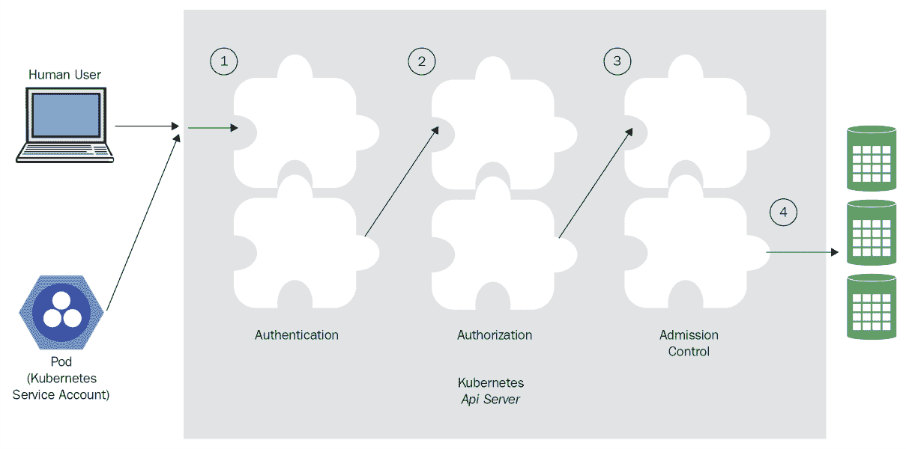

# 配置 Kubernetes 安全性、限制和账户

在第四章中，*高可用性和可靠性*，我们讨论了可靠且高可用的 Kubernetes 集群，基本概念，最佳实践，如何进行实时集群升级，以及关于性能和成本的许多设计权衡。

在本章中，我们将探讨安全这一重要主题。Kubernetes 集群是由多个层次的相互作用组件组成的复杂系统。在运行关键应用程序时，不同层的隔离和分隔非常重要。为了保护系统并确保对资源、能力和数据的适当访问，我们必须首先了解 Kubernetes 作为一个运行未知工作负载的通用编排平台所面临的独特挑战。然后，我们可以利用各种安全、隔离和访问控制机制，确保集群和运行在其上的应用程序以及数据都是安全的。我们将讨论各种最佳实践以及何时适合使用每种机制。

在本章的结尾，您将对 Kubernetes 安全挑战有很好的理解。您将获得如何加固 Kubernetes 以抵御各种潜在攻击的实际知识，建立深度防御，并且甚至能够安全地运行多租户集群，同时为不同用户提供完全隔离以及对他们在集群中的部分拥有完全控制的能力。

# 理解 Kubernetes 安全挑战

Kubernetes 是一个非常灵活的系统，以通用方式管理非常低级别的资源。Kubernetes 本身可以部署在许多操作系统和硬件或虚拟机解决方案上，可以部署在本地或云端。Kubernetes 运行由运行时实现的工作负载，通过定义良好的运行时接口与之交互，但不了解它们是如何实现的。Kubernetes 操作关键资源，如网络、DNS 和资源分配，代表或为了应用程序服务，而对这些应用程序一无所知。这意味着 Kubernetes 面临着提供良好的安全机制和能力的艰巨任务，以便应用程序管理员可以使用，同时保护自身和应用程序管理员免受常见错误的影响。

在本节中，我们将讨论 Kubernetes 集群的几个层次或组件的安全挑战：节点、网络、镜像、Pod 和容器。深度防御是一个重要的安全概念，要求系统在每个层面都保护自己，既要减轻渗透其他层的攻击，也要限制入侵的范围和损害。认识到每个层面的挑战是向深度防御迈出的第一步。

# 节点挑战

节点是运行时引擎的主机。如果攻击者能够访问节点，这是一个严重的威胁。它至少可以控制主机本身和运行在其上的所有工作负载。但情况会变得更糟。节点上运行着一个与 API 服务器通信的 kubelet。一个复杂的攻击者可以用修改过的版本替换 kubelet，并通过与 Kubernetes API 服务器正常通信来有效地逃避检测，而不是运行预定的工作负载，收集有关整个集群的信息，并通过发送恶意消息来破坏 API 服务器和集群的其余部分。节点将可以访问共享资源和秘密，这可能使其渗透得更深。节点入侵非常严重，既因为可能造成的损害，也因为事后很难检测到它。

节点也可能在物理级别上受到损害。这在裸机上更相关，您可以知道哪些硬件分配给了 Kubernetes 集群。

另一个攻击向量是资源耗尽。想象一下，您的节点成为了一个与您的 Kubernetes 集群无关的机器人网络的一部分，它只运行自己的工作负载并耗尽 CPU 和内存。这里的危险在于 Kubernetes 和您的基础设施可能会自动扩展并分配更多资源。

另一个问题是安装调试和故障排除工具，或者在自动部署之外修改配置。这些通常是未经测试的，如果被遗留并激活，它们至少会导致性能下降，但也可能引起更严重的问题。至少会增加攻击面。

在涉及安全性的地方，这是一个数字游戏。您希望了解系统的攻击面以及您的脆弱性。让我们列出所有的节点挑战：

+   攻击者控制主机

+   攻击者替换 kubelet

+   攻击者控制运行主要组件（API 服务器、调度器和控制器管理器）的节点

+   攻击者获得对节点的物理访问权限

+   攻击者耗尽与 Kubernetes 集群无关的资源

+   通过安装调试和故障排除工具或更改配置造成自我伤害

任何重要的 Kubernetes 集群至少跨越一个网络。与网络相关的挑战很多。您需要非常详细地了解系统组件是如何连接的。哪些组件应该相互通信？它们使用什么网络协议？使用什么端口？它们交换什么数据？您的集群如何与外部世界连接？

暴露端口和服务的复杂链路：

+   容器到主机

+   主机到内部网络中的主机

+   主机到世界

使用覆盖网络（将在第十章中更多讨论，*高级 Kubernetes 网络*）可以帮助进行深度防御，即使攻击者获得对 Docker 容器的访问权限，它们也会被隔离，无法逃脱到底层网络基础设施。

发现组件也是一个很大的挑战。这里有几个选项，比如 DNS、专用发现服务和负载均衡器。每种方法都有一套利弊，需要仔细规划和洞察力才能在您的情况下得到正确的解决方案。

确保两个容器能够找到彼此并交换信息非常重要。

您需要决定哪些资源和端点应该是公开访问的。然后，您需要想出一个适当的方法来对用户和服务进行身份验证，并授权它们对资源进行操作。

敏感数据必须在进入和离开集群时进行加密，有时也需要在静态状态下进行加密。这意味着密钥管理和安全密钥交换，这是安全领域中最难解决的问题之一。

如果您的集群与其他 Kubernetes 集群或非 Kubernetes 进程共享网络基础设施，那么您必须对隔离和分离非常谨慎。

这些要素包括网络策略、防火墙规则和软件定义网络（SDN）。这个方案通常是定制的。这在本地和裸机集群中尤其具有挑战性。让我们回顾一下：

+   制定连接计划

+   选择组件、协议和端口

+   找出动态发现

+   公共与私有访问

+   身份验证和授权

+   设计防火墙规则

+   决定网络策略

+   密钥管理和交换

在网络层面，容器、用户和服务之间相互找到并交流变得更加容易，与此同时，也需要限制访问并防止网络攻击或对网络本身的攻击之间保持不断的紧张关系。

这些挑战中许多并非特定于 Kubernetes。然而，Kubernetes 是一个管理关键基础设施并处理低级网络的通用平台，这使得有必要考虑动态和灵活的解决方案，可以将系统特定要求整合到 Kubernetes 中。

# 图像挑战

Kubernetes 运行符合其运行时引擎之一的容器。它不知道这些容器在做什么（除了收集指标）。您可以通过配额对容器施加一定的限制。您还可以通过网络策略限制它们对网络其他部分的访问。然而，最终，容器确实需要访问主机资源、网络中的其他主机、分布式存储和外部服务。图像决定了容器的行为。图像存在两类问题：

+   恶意图像

+   易受攻击的图像

恶意图像是包含由攻击者设计的代码或配置的图像，用于造成一些伤害或收集信息。恶意代码可以被注入到您的图像准备流水线中，包括您使用的任何图像存储库。或者，您可能安装了被攻击的第三方图像，这些图像现在可能包含恶意代码。

易受攻击的图像是您设计的图像（或您安装的第三方图像），恰好包含一些漏洞，允许攻击者控制正在运行的容器或造成其他伤害，包括以后注入他们自己的代码。

很难说哪一类更糟。在极端情况下，它们是等价的，因为它们允许完全控制容器。其他防御措施已经就位（记得深度防御吗？），并且对容器施加的限制将决定它可以造成多大的破坏。减少恶意镜像的危险非常具有挑战性。使用微服务的快速移动公司可能每天生成许多镜像。验证镜像也不是一件容易的事。例如，考虑 Docker 镜像由多层组成。包含操作系统的基础镜像可能在发现新漏洞时随时变得容易受攻击。此外，如果您依赖他人准备的基础镜像（非常常见），那么恶意代码可能会进入这些您无法控制并且绝对信任的基础镜像中。

总结镜像挑战：

+   Kubernetes 不知道镜像在做什么

+   Kubernetes 必须为指定功能提供对敏感资源的访问

+   保护镜像准备和交付管道（包括镜像仓库）是困难的

+   快速开发和部署新镜像的速度可能与仔细审查更改的冲突

+   包含操作系统的基础镜像很容易过时并变得容易受攻击

+   基础镜像通常不受您控制，更容易受到恶意代码的注入

+   集成静态镜像分析器，如 CoreOS Clair，可以帮助很多。

# 配置和部署的挑战

Kubernetes 集群是远程管理的。各种清单和策略确定了集群在每个时间点的状态。如果攻击者能够访问具有对集群的管理控制的机器，他们可以造成严重破坏，比如收集信息、注入恶意镜像、削弱安全性和篡改日志。通常情况下，错误和失误可能同样有害，影响重要的安全措施，并使集群容易受到攻击。如今，拥有对集群的管理访问权限的员工经常在家或咖啡店远程工作，并随身携带笔记本电脑，他们离打开防护门只有一个 `kubectl` 命令的距离。

让我们重申挑战：

+   Kubernetes 是远程管理的

+   具有远程管理访问权限的攻击者可以完全控制集群

+   配置和部署通常比代码更难测试

+   远程或外出办公的员工面临延长的暴露风险，使攻击者能够以管理员权限访问他们的笔记本电脑或手机

# Pod 和容器方面的挑战

在 Kubernetes 中，pod 是工作单位，包含一个或多个容器。Pod 只是一个分组和部署构造，但在实践中，部署在同一个 pod 中的容器通常通过直接机制进行交互。所有容器共享相同的本地主机网络，并经常共享来自主机的挂载卷。同一 pod 中容器之间的轻松集成可能导致主机的部分暴露给所有容器。这可能允许一个恶意或易受攻击的恶意容器打开对其他容器的升级攻击的途径，然后接管节点本身。主要附加组件通常与主要组件共同存在，并呈现出这种危险，特别是因为它们中的许多是实验性的。对于在每个节点上运行 pod 的守护程序集也是如此。

多容器 pod 的挑战包括以下内容：

+   相同的 pod 容器共享本地主机网络

+   相同的 pod 容器有时会共享主机文件系统上的挂载卷

+   恶意容器可能会影响 pod 中的其他容器

+   如果与访问关键节点资源的其他容器共同存在，恶意容器更容易攻击节点

+   实验性的附加组件与主要组件共同存在时，可能是实验性的并且安全性较低

# 组织、文化和流程方面的挑战

安全性通常与生产力相矛盾。这是一种正常的权衡，无需担心。传统上，当开发人员和运营是分开的时，这种冲突是在组织层面上管理的。开发人员推动更多的生产力，并将安全要求视为业务成本。运营控制生产环境，并负责访问和安全程序。DevOps 运动打破了开发人员和运营之间的壁垒。现在，开发速度往往占据主导地位。诸如持续部署-在没有人为干预的情况下每天部署多次-这样的概念在大多数组织中是闻所未闻的。Kubernetes 是为这种新型云原生应用程序的世界而设计的。然而，它是基于谷歌的经验开发的。谷歌有大量时间和熟练的专家来开发平衡快速部署和安全性的适当流程和工具。对于较小的组织，这种平衡可能非常具有挑战性，安全性可能会受到影响。

采用 Kubernetes 的组织面临的挑战如下：

+   控制 Kubernetes 操作的开发人员可能不太关注安全性

+   开发速度可能被认为比安全性更重要

+   持续部署可能会使难以在达到生产之前检测到某些安全问题

+   较小的组织可能没有足够的知识和专业技能来正确管理 Kubernetes 集群的安全性

在本节中，我们回顾了在尝试构建安全的 Kubernetes 集群时所面临的许多挑战。这些挑战大多数并非特定于 Kubernetes，但使用 Kubernetes 意味着系统的大部分是通用的，并且不知道系统正在做什么。在试图锁定系统时，这可能会带来问题。这些挑战分布在不同的层次上：

+   节点挑战

+   网络挑战

+   镜像挑战

+   配置和部署挑战

+   Pod 和容器挑战

+   组织和流程挑战

在下一节中，我们将看一下 Kubernetes 提供的设施，以解决其中一些挑战。许多挑战需要在更大的系统级别上找到解决方案。重要的是要意识到仅仅使用所有 Kubernetes 安全功能是不够的。

# 加固 Kubernetes

前一节列出了开发人员和管理员在部署和维护 Kubernetes 集群时面临的各种安全挑战。在本节中，我们将专注于 Kubernetes 提供的设计方面、机制和功能，以解决其中一些挑战。通过审慎使用功能，如服务账户、网络策略、身份验证、授权、准入控制、AppArmor 和秘密，您可以达到一个相当良好的安全状态。

记住，Kubernetes 集群是一个更大系统的一部分，包括其他软件系统、人员和流程。Kubernetes 不能解决所有问题。您应始终牢记一般安全原则，如深度防御、需要知道的基础和最小特权原则。此外，记录您认为在攻击事件中可能有用的所有内容，并设置警报，以便在系统偏离其状态时进行早期检测。这可能只是一个错误，也可能是一次攻击。无论哪种情况，您都希望了解并做出响应。

# 了解 Kubernetes 中的服务账户

Kubernetes 在集群外部管理常规用户，用于连接到集群的人员（例如，通过`kubectl`命令），并且它还有服务账户。

常规用户是全局的，可以访问集群中的多个命名空间。服务账户受限于一个命名空间。这很重要。它确保了命名空间的隔离，因为每当 API 服务器从一个 pod 接收到请求时，其凭据只适用于其自己的命名空间。

Kubernetes 代表 pod 管理服务账户。每当 Kubernetes 实例化一个 pod 时，它会为 pod 分配一个服务账户。当 pod 进程与 API 服务器交互时，服务账户将标识所有的 pod 进程。每个服务账户都有一组凭据挂载在一个秘密卷中。每个命名空间都有一个名为`default`的默认服务账户。当您创建一个 pod 时，它会自动分配默认服务账户，除非您指定其他服务账户。

您可以创建额外的服务账户。创建一个名为`custom-service-account.yaml`的文件，其中包含以下内容：

```
apiVersion: v1 
kind: ServiceAccount 
metadata: 
  name: custom-service-account 
Now type the following: 
kubectl create -f custom-service-account.yaml 
That will result in the following output: 
serviceaccount "custom-service-account" created 
Here is the service account listed alongside the default service account: 
> kubectl get serviceAccounts 
NAME                     SECRETS   AGE 
custom-service-account   1         3m 
default                  1         29d 
```

请注意，为您的新服务账户自动创建了一个秘密。

要获取更多详细信息，请输入以下内容：

```
> kubectl get serviceAccounts/custom-service-account -o yaml
apiVersion: v1
kind: ServiceAccount
metadata:
  creationTimestamp: 2018-01-15T18:24:40Z
  name: custom-service-account
  namespace: default
  resourceVersion: "1974321"
  selfLink: /api/v1/namespaces/default/serviceaccounts/custom-service-account
  uid: 59bc3515-fa21-11e7-beab-080027c94384
  secrets:
  - name: custom-service-account-token-w2v7v  
```

您可以通过输入以下内容查看秘密本身，其中包括一个`ca.crt`文件和一个令牌：

```
kubectl get secrets/custom-service-account-token-w2v7v -o yaml  
```

# Kubernetes 如何管理服务账户？

API 服务器有一个名为服务账户准入控制器的专用组件。它负责在 pod 创建时检查是否有自定义服务账户，如果有，则确保自定义服务账户存在。如果没有指定服务账户，则分配默认服务账户。

它还确保 pod 具有`ImagePullSecrets`，当需要从远程镜像注册表中拉取镜像时是必要的。如果 pod 规范没有任何密钥，它将使用服务账户的`ImagePullSecrets`。

最后，它添加了一个包含 API 访问令牌的卷和一个`volumeSource`挂载在`/var/run/secrets/kubernetes.io/serviceaccount`上。

API 令牌是由另一个名为**令牌控制器**的组件创建并添加到密钥中，每当创建服务账户时。令牌控制器还监视密钥，并在密钥被添加或从服务账户中删除时添加或删除令牌。

服务账户控制器确保每个命名空间都存在默认的服务账户。

# 访问 API 服务器

访问 API 需要一系列步骤，包括身份验证、授权和准入控制。在每个阶段，请求可能会被拒绝。每个阶段由多个链接在一起的插件组成。以下图表说明了这一点：



# 用户身份验证

当您首次创建集群时，会为您创建一个客户端证书和密钥。`Kubectl`使用它们在端口`443`上通过 TLS 与 API 服务器进行身份验证，反之亦然（加密的 HTTPS 连接）。您可以通过检查您的`.kube/config`文件找到您的客户端密钥和证书：

```
> cat ~/.kube/config | grep client

client-certificate: /Users/gigi.sayfan/.minikube/client.crt
client-key: /Users/gigi.sayfan/.minikube/client.key  
```

请注意，如果多个用户需要访问集群，创建者应以安全的方式向其他用户提供客户端证书和密钥。

这只是与 Kubernetes API 服务器本身建立基本的信任。您还没有进行身份验证。各种身份验证模块可能会查看请求并检查各种额外的客户端证书、密码、持有者令牌和 JWT 令牌（用于服务账户）。大多数请求需要经过身份验证的用户（常规用户或服务账户），尽管也有一些匿名请求。如果请求未能通过所有身份验证器进行身份验证，它将被拒绝，并返回 401 HTTP 状态码（未经授权，这有点名不副实）。

集群管理员通过向 API 服务器提供各种命令行参数来确定要使用的认证策略：

+   --client-ca-file=<filename>（用于文件中指定的 x509 客户端证书）

+   --token-auth-file=<filename>（用于文件中指定的持有者令牌）

+   --basic-auth-file=<filename>（用于文件中指定的用户/密码对）

+   --experimental-bootstrap-token-auth（用于`kubeadm`使用的引导令牌）

服务账户使用自动加载的认证插件。管理员可以提供两个可选标志：

+   --service-account-key-file=<filename>（用于签署持有者令牌的 PEM 编码密钥。如果未指定，将使用 API 服务器的 TLS 私钥。）

+   --service-account-lookup（如果启用，从 API 中删除的令牌将被撤销。）

还有其他几种方法，例如开放 ID 连接，Web 钩子，Keystone（OpenStack 身份服务）和认证代理。主题是认证阶段是可扩展的，并且可以支持任何认证机制。

各种认证插件将检查请求，并根据提供的凭据，将关联以下属性：

+   **用户名**（用户友好的名称）

+   **uid**（唯一标识符，比用户名更一致）

+   **组**（用户所属的一组组名）

+   **额外字段**（将字符串键映射到字符串值）

认证器完全不知道特定用户被允许做什么。他们只是将一组凭据映射到一组身份。授权者的工作是弄清楚请求对经过身份验证的用户是否有效。任何认证器接受凭据时，认证成功。认证器运行的顺序是未定义的。

# 模拟

用户可以模拟不同的用户（经过适当授权）。例如，管理员可能希望以权限较低的不同用户身份解决一些问题。这需要将模拟头传递给 API 请求。这些头是：

+   `模拟用户`：要扮演的用户名。

+   `模拟组`：这是要扮演的组名，可以多次提供以设置多个组。这是可选的，需要`模拟用户`。

+   `模拟额外-(额外名称)`：这是用于将额外字段与用户关联的动态标头。这是可选的，需要`模拟用户`。

使用`kubectl`，您可以传递`--as`和`--as-group`参数。

# 授权请求

一旦用户经过身份验证，授权就开始了。Kubernetes 具有通用的授权语义。一组授权模块接收请求，其中包括经过身份验证的用户名和请求的动词（`list`，`get`，`watch`，`create`等）。与身份验证不同，所有授权插件都将有机会处理任何请求。如果单个授权插件拒绝请求或没有插件发表意见，则将以`403` HTTP 状态码（禁止）拒绝请求。只有在至少有一个插件被接受且没有其他插件拒绝时，请求才会继续。

集群管理员通过指定`--authorization-mode`命令行标志来确定要使用哪些授权插件，这是一个逗号分隔的插件名称列表。

支持以下模式：

+   `--authorization-mode=AlwaysDeny`拒绝所有请求；在测试期间很有用。

+   `-authorization-mode=AlwaysAllow`允许所有请求；如果不需要授权，则使用。

+   `--authorization-mode=ABAC`允许使用简单的、基于本地文件的、用户配置的授权策略。**ABAC**代表**基于属性的访问控制**。

+   `--authorization-mode=RBAC`是一种基于角色的机制，授权策略存储在并由 Kubernetes API 驱动。**RBAC**代表**基于角色的访问控制**。

+   `--authorization-mode=Node`是一种特殊模式，用于授权 kubelet 发出的 API 请求。

+   `--authorization-mode=Webhook`允许授权由使用 REST 的远程服务驱动。

您可以通过实现以下简单的 Go 接口来添加自定义授权插件：

```
type Authorizer interface {
  Authorize(a Attributes) (authorized bool, reason string, err error)
    } 
```

`Attributes`输入参数也是一个接口，提供了您需要做出授权决定的所有信息：

```
type Attributes interface {
  GetUser() user.Info
  GetVerb() string
  IsReadOnly() bool
  GetNamespace() string
  GetResource() string
  GetSubresource() string
  GetName() string
  GetAPIGroup() string
  GetAPIVersion() string
  IsResourceRequest() bool
  GetPath() string
} 
```

# 使用准入控制插件

好的。请求已经经过身份验证和授权，但在执行之前还有一步。请求必须通过一系列的准入控制插件。与授权者类似，如果单个准入控制器拒绝请求，则请求将被拒绝。

准入控制器是一个很好的概念。其思想是可能存在全局集群关注点，这可能是拒绝请求的理由。没有准入控制器，所有授权者都必须意识到这些问题并拒绝请求。但是，有了准入控制器，这个逻辑可以执行一次。此外，准入控制器可以修改请求。准入控制器以验证模式或变异模式运行。通常情况下，集群管理员通过提供名为`admission-control`的命令行参数来决定运行哪些准入控制插件。该值是一个逗号分隔的有序插件列表。以下是 Kubernetes >= 1.9 的推荐插件列表（顺序很重要）：

```
--admission-control=NamespaceLifecycle,LimitRanger,ServiceAccount,PersistentVolumeLabel,DefaultStorageClass,MutatingAdmissionWebhook,ValidatingAdmissionWebhook,ResourceQuota,DefaultTolerationSeconds  
```

让我们看一些可用的插件（随时添加更多）：

+   `AlwaysAdmit`: 透传（我不确定为什么需要它）。

+   `AlwaysDeny`: 这拒绝一切（用于测试很有用）。

+   `AlwaysPullImages`: 这将新的 Pod 镜像拉取策略设置为 Always（在多租户集群中很有用，以确保没有凭据拉取私有镜像的 Pod 不使用它们）。

+   `DefaultStorageClass`: 这为未指定存储类的`PersistentVolumeClaim`创建请求添加了一个默认存储类。

+   `DefaultTollerationSeconds`: 这设置了 Pod 对污点的默认容忍时间（如果尚未设置）：`notready:NoExecute` 和 `notreachable:NoExecute`。

+   `DenyEscalatingExec`: 这拒绝对以提升的特权运行并允许主机访问的 Pod 执行和附加命令。这包括以特权运行、具有主机 IPC 命名空间访问权限和具有主机 PID 命名空间访问权限的 Pod。

+   `EventRateLimit`: 这限制了 API 服务器的事件洪水（Kubernetes 1.9 中的新功能）。

+   `ExtendedResourceToleration`: 这将节点上的污点与 GPU 和 FPGA 等特殊资源结合起来，与请求这些资源的 Pod 的容忍结合起来。最终结果是具有额外资源的节点将专门用于具有适当容忍的 Pod。

+   `ImagePolicyWebhook`: 这个复杂的插件连接到外部后端，根据镜像决定是否拒绝请求。

+   `Initializers`: 这通过修改要创建的资源的元数据来设置挂起的初始化器（基于`InitializerConfiguration`）。

+   `InitialResources`（实验性的）：如果未指定，这将根据历史使用情况分配计算资源和限制。

+   `LimitPodHardAntiAffinity`：拒绝定义了除 `kubernetes.io`/`hostname` 之外的反亲和拓扑键的任何 Pod 在 `requiredDuringSchedulingRequiredDuringExecution` 中。

+   `LimitRanger`：拒绝违反资源限制的请求。

+   `MutatingAdmissionWebhook`：按顺序调用已注册的能够修改目标对象的变异 Webhook。请注意，由于其他变异 Webhook 的潜在更改，不能保证更改会生效。

+   `NamespaceLifecycle`：拒绝在正在终止或不存在的命名空间中创建对象。

+   `ResourceQuota`：拒绝违反命名空间资源配额的请求。

+   `ServiceAccount`：这是服务账户的自动化。

+   `ValidatingAdmissionWebhook`：此准入控制器调用与请求匹配的任何验证 Webhook。匹配的 Webhook 会并行调用；如果其中任何一个拒绝请求，请求将失败。

正如您所看到的，准入控制插件具有多样的功能。它们支持命名空间范围的策略，并主要从资源管理的角度执行请求的有效性。这使授权插件可以专注于有效的操作。`ImagePolicyWebHook` 是验证镜像的入口，这是一个很大的挑战。`Initializers` 是动态准入控制的入口，您可以在其中部署自己的准入控制器，而无需将其编译到 Kubernetes 中。还有外部准入 Webhook，适用于诸如资源的语义验证（所有 Pod 是否具有标准的标签集？）等任务。

通过身份验证、授权和准入的各个阶段分别负责验证传入请求的责任划分，每个阶段都有自己的插件，使得复杂的过程变得更容易理解和使用。

# 保护 Pod

Pod 安全是一个主要关注点，因为 Kubernetes 调度 Pod 并让它们运行。为了保护 Pod 和容器，有几种独立的机制。这些机制一起支持深度防御，即使攻击者（或错误）绕过一个机制，也会被另一个机制阻止。

# 使用私有镜像仓库

这种方法让您非常有信心，您的集群只会拉取您之前审查过的镜像，并且您可以更好地管理升级。您可以在每个节点上配置`$HOME/.dockercfg`或`$HOME/.docker/config.json`。但是，在许多云提供商上，您无法这样做，因为节点是自动为您配置的。

# ImagePullSecrets

这种方法适用于云提供商上的集群。其思想是，注册表的凭据将由 pod 提供，因此无论它被安排在哪个节点上运行都无所谓。这避开了节点级别的`.dockercfg`问题。

首先，您需要为凭据创建一个`secret`对象：

```
> kubectl create secret the-registry-secret 
  --docker-server=<docker registry server> 
  --docker-username=<username> 
  --docker-password=<password> 
  --docker-email=<email>
secret "docker-registry-secret" created.  
```

如果需要，您可以为多个注册表（或同一注册表的多个用户）创建 secret。kubelet 将合并所有`ImagePullSecrets`。

然而，因为 pod 只能在其自己的命名空间中访问 secret，所以您必须在希望 pod 运行的每个命名空间中创建一个 secret。

一旦定义了 secret，您可以将其添加到 pod 规范中，并在集群上运行一些 pod。pod 将使用 secret 中的凭据从目标镜像注册表中拉取镜像：

```
apiVersion: v1 
kind: Pod 
metadata: 
  name: cool-pod 
  namespace: the-namespace 
spec: 
  containers: 
    - name: cool-container 
      image: cool/app:v1 
  imagePullSecrets: 
    - name: the-registry-secret 
```

# 指定安全上下文

安全上下文是一组操作系统级别的安全设置，例如 UID、gid、功能和 SELinux 角色。这些设置应用于容器级别作为容器安全内容。您可以指定将应用于 pod 中所有容器的 pod 安全上下文。pod 安全上下文还可以将其安全设置（特别是`fsGroup`和`seLinuxOptions`）应用于卷。

以下是一个示例 pod 安全上下文：

```
apiVersion: v1 
kind: Pod 
metadata: 
  name: hello-world 
spec: 
  containers: 
    ... 
  securityContext: 
    fsGroup: 1234 
    supplementalGroups: [5678] 
    seLinuxOptions: 
      level: "s0:c123,c456" 
```

容器安全上下文应用于每个容器，并覆盖了 pod 安全上下文。它嵌入在 pod 清单的容器部分中。容器上下文设置不能应用于卷，卷保持在 pod 级别。

以下是一个示例容器安全内容：

```
apiVersion: v1 
kind: Pod 
metadata: 
  name: hello-world 
spec: 
  containers: 
    - name: hello-world-container 
      # The container definition 
      # ... 
      securityContext: 
        privileged: true 
        seLinuxOptions: 
          level: "s0:c123,c456" 
```

# 使用 AppArmor 保护您的集群

`AppArmor`是一个 Linux 内核安全模块。使用`AppArmor`，您可以限制在容器中运行的进程对一组有限的资源的访问，例如网络访问、Linux 功能和文件权限。您可以通过配置`AppArmor`来配置配置文件。

# 要求

在 Kubernetes 1.4 中，AppArmor 支持作为 beta 版本添加。它并不适用于每个操作系统，因此您必须选择一个受支持的操作系统发行版才能利用它。Ubuntu 和 SUSE Linux 支持 AppArmor，并默认启用。其他发行版则具有可选的支持。要检查 AppArmor 是否已启用，请输入以下代码：

```
cat /sys/module/apparmor/parameters/enabled
 Y 
```

如果结果是`Y`，则已启用。

配置文件必须加载到内核中。请检查以下文件：

```
/sys/kernel/security/apparmor/profiles  
```

此时，只有 Docker 运行时支持`AppArmor`。

# 使用 AppArmor 保护 Pod

由于`AppArmor`仍处于 beta 阶段，因此您需要将元数据指定为注释，而不是`bonafide`字段；当它退出 beta 阶段时，这将发生变化。

要将配置文件应用于容器，请添加以下注释：

```
container.apparmor.security.beta.kubernetes.io/<container-name>: <profile-ref>
```

配置文件引用可以是默认配置文件，`runtime`/`default`，或者主机`localhost/<profile-name>`上的配置文件。

以下是一个防止写入文件的示例配置文件：

```
#include <tunables/global> 

profile k8s-apparmor-example-deny-write flags=(attach_disconnected) { 
  #include <abstractions/base> 

  file, 

  # Deny all file writes. 
  deny /** w, 
} 
```

AppArmor 不是 Kubernetes 资源，因此其格式不是您熟悉的 YAML 或 JSON。

要验证配置文件是否正确附加，请检查进程`1`的属性：

```
kubectl exec <pod-name> cat /proc/1/attr/current  
```

默认情况下，Pod 可以在集群中的任何节点上调度。这意味着配置文件应该加载到每个节点中。这是 DaemonSet 的一个经典用例。

# 编写 AppArmor 配置文件

手动编写`AppArmor`配置文件很重要。有一些工具可以帮助：`aa-genprof`和`aa-logprof`可以为您生成配置文件，并通过在应用程序中使用`AppArmor`的 complain 模式来帮助微调它。这些工具会跟踪应用程序的活动和`AppArmor`警告，并创建相应的配置文件。这种方法有效，但感觉有些笨拙。

我的最爱工具是 bane（[`github.com/jessfraz/bane`](https://github.com/jessfraz/bane)），它可以根据 TOML 语法生成`AppArmor`配置文件。Bane 配置文件非常易读且易于理解。以下是一个 bane 配置文件的片段：

```
    Name = "nginx-sample"
    [Filesystem]
    # read only paths for the container
    ReadOnlyPaths = [
      "/bin/**",
      "/boot/**",
      "/dev/**",
    ]

    # paths where you want to log on write
    LogOnWritePaths = [
      "/**"
    ]

    # allowed capabilities
    [Capabilities]
    Allow = [
      "chown",
      "setuid",
    ]

    [Network]
    Raw = false
    Packet = false
    Protocols = [
      "tcp",
      "udp",
      "icmp"
    ] 
```

生成的`AppArmor`配置文件相当复杂。

# Pod 安全策略

**Pod 安全策略**（**PSP**）自 Kubernetes 1.4 以来就作为 Beta 版本可用。必须启用它，并且还必须启用 PSP 准入控制来使用它们。PSP 在集群级别定义，并为 Pod 定义安全上下文。使用 PSP 和直接在 Pod 清单中指定安全内容之间有一些区别，就像我们之前所做的那样：

+   将相同的策略应用于多个 Pod 或容器

+   让管理员控制 Pod 的创建，以便用户不会创建具有不适当安全上下文的 Pod

+   通过准入控制器为 Pod 动态生成不同的安全内容

PSPs 真的扩展了安全上下文的概念。通常，与 Pod（或者说，Pod 模板）的数量相比，您将拥有相对较少的安全策略。这意味着许多 Pod 模板和容器将具有相同的安全策略。没有 PSP，您必须为每个 Pod 清单单独管理它。

这是一个允许一切的示例 PSP：

```
    {
      "kind": "PodSecurityPolicy",
      "apiVersion":"policy/v1beta1",
      "metadata": {
        "name": "permissive"
      },
      "spec": {
          "seLinux": {
              "rule": "RunAsAny"
          },
          "supplementalGroups": {
              "rule": "RunAsAny"
          },
          "runAsUser": {
              "rule": "RunAsAny"
          },
          "fsGroup": {
              "rule": "RunAsAny"
          },
          "volumes": ["*"]
      }
    }
```

# 通过 RBAC 授权 Pod 安全策略

这是启用策略使用的推荐方法。让我们创建`clusterRole`（`Role`也可以）来授予使用目标策略的访问权限。它应该是这样的：

```
kind: ClusterRole
apiVersion: rbac.authorization.k8s.io/v1
metadata:
 name: <role name>
rules:
- apiGroups: ['policy']
 resources: ['podsecuritypolicies']
 verbs: ['use']
 resourceNames:
 - <list of policies to authorize>
```

然后，我们需要将集群角色绑定到授权用户：

```
kind: ClusterRoleBinding
apiVersion: rbac.authorization.k8s.io/v1
metadata:
 name: <binding name>
roleRef:
 kind: ClusterRole
 name: <role name>
 apiGroup: rbac.authorization.k8s.io
subjects:
# Authorize specific service accounts:
- kind: ServiceAccount
 name: <authorized service account name>
 namespace: <authorized pod namespace>
# Authorize specific users (not recommended):
- kind: User
 apiGroup: rbac.authorization.k8s.io
 name: <authorized user name>
```

如果使用角色绑定而不是集群角色，则它将仅适用于与绑定相同命名空间中的 Pod。这可以与系统组配对，以授予对在命名空间中运行的所有 Pod 的访问权限：

```
# Authorize all service accounts in a namespace:
- kind: Group
 apiGroup: rbac.authorization.k8s.io
 name: system:serviceaccounts
# Or equivalently, all authenticated users in a namespace:
- kind: Group
 apiGroup: rbac.authorization.k8s.io
 name: system:authenticated
```

# 管理网络策略

节点、Pod 和容器的安全性至关重要，但这还不够。网络分割对于设计安全的 Kubernetes 集群至关重要，它允许多租户使用，并且可以最小化安全漏洞的影响。深度防御要求您对不需要相互通信的系统部分进行分隔，并允许您仔细管理流量的方向、协议和端口。

网络策略可以让您对集群的命名空间和通过标签选择的 Pod 进行细粒度控制和适当的网络分割。在其核心，网络策略是一组防火墙规则，应用于一组由标签选择的命名空间和 Pod。这非常灵活，因为标签可以定义虚拟网络段，并且可以作为 Kubernetes 资源进行管理。

# 选择支持的网络解决方案

一些网络后端不支持网络策略。例如，流行的 Flannel 无法应用于策略。

这是一个支持的网络后端列表：

+   Calico

+   WeaveNet

+   Canal

+   Cillium

+   Kube-Router

+   Romana

# 定义网络策略

您可以使用标准的 YAML 清单来定义网络策略。

这是一个示例策略：

```
apiVersion: networking.k8s.io/v1
kind: NetworkPolicy
metadata:
 name: the-network-policy
 namespace: default
spec:
 podSelector:
 matchLabels:
 role: db
 ingress:
 - from:
 - namespaceSelector:
 matchLabels:
 project: cool-project
 - podSelector:
 matchLabels:
 role: frontend
 ports:
 - protocol: tcp
 port: 6379
```

`spec`部分有两个重要部分——`podSelector`和`ingress`。`podSelector`管理此网络策略适用于哪些 pod。`ingress`管理哪些命名空间和 pod 可以访问这些 pod，以及它们可以使用哪些协议和端口。

在示例网络策略中，`pod`选择器指定了网络策略的目标，即所有标记为`role: db`的 pod。`ingress`部分有一个`from`子部分，其中包括一个`namespace`选择器和一个`pod`选择器。集群中所有标记为`project: cool-project`的命名空间，以及这些命名空间中所有标记为`role: frontend`的 pod，都可以访问标记为`role: db`的目标 pod。`ports`部分定义了一对对（协议和端口），进一步限制了允许的协议和端口。在这种情况下，协议是`tcp`，端口是`6379`（Redis 标准端口）。

请注意，网络策略是集群范围的，因此集群中多个命名空间的 pod 可以访问目标命名空间。当前命名空间始终包括在内，因此即使它没有`project: cool`标签，带有`role: frontend`的`pods`仍然可以访问。

网络策略以白名单方式运行很重要。默认情况下，所有访问都被禁止，网络策略可以打开某些协议和端口，以匹配标签的某些 pod。这意味着，如果您的网络解决方案不支持网络策略，所有访问将被拒绝。

白名单性质的另一个含义是，如果存在多个网络策略，则所有规则的并集都适用。如果一个策略允许访问端口`1234`，另一个策略允许访问端口`5678`，那么一个 pod 可能访问端口`1234`或`5678`。

# 限制对外部网络的出口

Kubernetes 1.8 添加了出口网络策略支持，因此您也可以控制出站流量。以下是一个示例，阻止访问外部 IP`1.2.3.4`。`order: 999`确保在其他策略之前应用该策略：

```
apiVersion: v1
kind: policy
metadata:
 name: default-deny-egress
spec:
 order: 999
 egress:
 - action: deny
 destination:
 net: 1.2.3.4
 source: {}
```

# 跨命名空间策略

如果将集群划分为多个命名空间，有时如果 pod 跨命名空间通信，这可能会很方便。您可以在网络策略中指定`ingress.namespaceSelector`字段，以允许从多个命名空间访问。例如，如果您有生产和暂存命名空间，并且定期使用生产数据的快照填充暂存环境。

# 使用秘密

秘密在安全系统中至关重要。它们可以是凭据，如用户名和密码、访问令牌、API 密钥或加密密钥。秘密通常很小。如果您有大量要保护的数据，您应该对其进行加密，并将加密/解密密钥保留为秘密。

# 在 Kubernetes 中存储秘密

Kubernetes 默认将秘密以明文存储在`etcd`中。这意味着对`etcd`的直接访问是有限的并且受到仔细保护。从 Kubernetes 1.7 开始，您现在可以在休息时加密您的秘密（当它们由`etcd`存储时）。

秘密是在命名空间级别管理的。Pod 可以通过秘密卷将秘密挂载为文件，也可以将其作为环境变量。从安全的角度来看，这意味着可以创建命名空间中的任何用户或服务都可以访问为该命名空间管理的任何秘密。如果要限制对秘密的访问，请将其放在一组有限用户或服务可访问的命名空间中。

当秘密挂载到一个 pod 上时，它永远不会被写入磁盘。它存储在`tmpfs`中。当 kubelet 与 API 服务器通信时，通常使用 TLS，因此秘密在传输过程中受到保护。

# 配置休息时的加密

启动 API 服务器时，您需要传递此参数：

```
--experimental-encryption-provider-config <encryption config file>   
```

以下是一个样本加密配置：

```
kind: EncryptionConfig
apiVersion: v1
resources:
 - resources:
 - secrets
 providers:
 - identity: {}
 - aesgcm:
 keys:
 - name: key1
 secret: c2VjcmV0IGlzIHNlY3VyZQ==
 - name: key2
 secret: dGhpcyBpcyBwYXNzd29yZA==
 - aescbc:
 keys:
 - name: key1
 secret: c2VjcmV0IGlzIHNlY3VyZQ==
 - name: key2
 secret: dGhpcyBpcyBwYXNzd29yZA==
 - secretbox:
 keys:
 - name: key1
 secret: YWJjZGVmZ2hpamtsbW5vcHFyc3R1dnd4eXoxMjM0NTY=
```

# 创建秘密

在尝试创建需要它们的 pod 之前，必须先创建秘密。秘密必须存在；否则，pod 创建将失败。

您可以使用以下命令创建秘密：

```
kubectl create secret. 
```

在这里，我创建了一个名为`hush-hash`的通用秘密，其中包含两个键—用户名和密码：

```
> kubectl create secret generic hush-hush --from-literal=username=tobias --from-literal=password=cutoffs 
```

生成的秘密是`Opaque`：

```
> kubectl describe secrets/hush-hush
Name:           hush-hush
Namespace:      default
Labels:         <none>
Annotations:    <none>

Type:   Opaque

Data
====
password:       7 bytes
username:       6 bytes
```

您可以使用`--from-file`而不是`--from-literal`从文件创建秘密，并且如果将秘密值编码为`base64`，还可以手动创建秘密。

秘密中的键名必须遵循 DNS 子域的规则（不包括前导点）。

# 解码秘密

要获取秘密的内容，可以使用`kubectl get secret`：

```
> kubectl get secrets/hush-hush -o yaml
apiVersion: v1
data:
 password: Y3V0b2Zmcw==
 username: dG9iaWFz
kind: Secret
metadata:
 creationTimestamp: 2018-01-15T23:43:50Z
 name: hush-hush
 namespace: default
 resourceVersion: "2030851"
 selfLink: /api/v1/namespaces/default/secrets/hush-hush
 uid: f04641ef-fa4d-11e7-beab-080027c94384
type: Opaque
The values are base64-encoded. You need to decode them yourself:
> echo "Y3V0b2Zmcw==" | base64 --decode
cutoofs
```

这些值是`base64`编码的。您需要自己解码它们：

```
> echo "Y3V0b2Zmcw==" | base64 --decode
cutoofs 
```

# 在容器中使用秘密

容器可以通过从 pod 中挂载卷来将秘密作为文件访问。另一种方法是将秘密作为环境变量访问。最后，容器（如果其服务账户具有权限）可以直接访问 Kubernetes API 或使用 kubectl get secret。

要使用作为卷挂载的秘密，pod 清单应声明卷，并且应在容器的规范中挂载：

```
{ 
 "apiVersion": "v1", 
 "kind": "Pod", 
  "metadata": { 
    "name": "pod-with-secret", 
    "namespace": "default" 
  }, 
  "spec": { 
    "containers": [{ 
      "name": "the-container", 
      "image": "redis", 
      "volumeMounts": [{ 
        "name": "secret-volume", 
        "mountPath": "/mnt/secret-volume", 
        "readOnly": true 
      }] 
    }], 
    "volumes": [{ 
      "name": "secret-volume", 
      "secret": { 
        "secretName": "hush-hush" 
      } 
    }] 
  } 
} 
```

卷名称（`secret-volume`）将 pod 卷绑定到容器中的挂载点。多个容器可以挂载相同的卷。

当此 pod 运行时，用户名和密码将作为文件出现在`/etc/secret-volume`下：

```
> kubectl exec pod-with-secret cat /mnt/secret-volume/username
tobias

> kubectl exec pod-with-secret cat /mnt/secret-volume/password
cutoffs  
```

# 运行多用户集群

在本节中，我们将简要讨论使用单个集群来托管多个用户或多个用户社区的系统的选项。这个想法是这些用户是完全隔离的，甚至可能不知道他们与其他用户共享集群。每个用户社区都将拥有自己的资源，并且它们之间不会有通信（除非通过公共端点）。Kubernetes 命名空间概念是这个想法的最终表达。

# 多用户集群的情况

为什么要为多个隔离的用户或部署运行单个集群？每个用户都有一个专用的集群不是更简单吗？主要有两个原因：成本和运营复杂性。如果您有许多相对较小的部署，并且希望为每个部署创建一个专用的集群，那么您将需要为每个部署单独的主节点，可能还需要一个三节点的`etcd`集群。这可能会增加成本。运营复杂性也非常重要。管理数十甚至数百个独立的集群并不容易。每次升级和每次补丁都需要应用到每个集群。运营可能会失败，您将不得不管理一群集群，其中一些集群的状态可能与其他集群略有不同。跨所有集群的元操作可能更加困难。您将不得不聚合并编写您的工具来执行操作并从所有集群收集数据。

让我们看一些多个隔离社区或部署的用例和要求：

+   作为`<Blank>-`服务的平台或服务提供商

+   管理单独的测试、暂存和生产环境

+   将责任委托给社区/部署管理员

+   对每个社区强制执行资源配额和限制

+   用户只能看到他们社区中的资源

# 使用命名空间进行安全的多租户管理

Kubernetes 命名空间是安全的多租户集群的完美解决方案。这并不奇怪，因为这是命名空间的设计目标之一。

您可以轻松地创建除内置 kube 系统和默认之外的命名空间。以下是一个将创建一个名为`custom-namespace`的新命名空间的 YAML 文件。它只有一个名为`name`的元数据项。没有比这更简单的了：

```
apiVersion: v1 
kind: Namespace 
metadata: 
  name: custom-namespace 
```

让我们创建命名空间：

```
> Kubectl create -f custom-namespace.yaml
namespace "custom-namespace" created

> kubectl get namesapces
NAME               STATUS    AGE
custom-namespace   Active    39s
default            Active    32d
kube-system        Active    32d
```

状态字段可以是`active`或`terminating`。当您删除一个命名空间时，它将进入 terminating 状态。当命名空间处于此状态时，您将无法在此命名空间中创建新资源。这简化了命名空间资源的清理，并确保命名空间真正被删除。如果没有它，当现有 pod 被删除时，复制控制器可能会创建新的 pod。

要使用命名空间，您需要在`kubectl`命令中添加`--namespace`参数：

```
> kubectl create -f some-pod.yaml --namespace=custom-namespace
pod "some-pod" created
```

在自定义命名空间中列出 pod 只返回我们刚刚创建的 pod：

```
> kubectl get pods --namespace=custom-namespace
NAME       READY     STATUS    RESTARTS   AGE
some-pod   1/1       Running   0          6m 
```

在不带命名空间的情况下列出 pod 会返回默认命名空间中的 pod：

```
> Kubectl get pods
NAME                           READY     STATUS    RESTARTS   AGE
echo-3580479493-n66n4          1/1       Running   16         32d
leader-elector-191609294-lt95t 1/1       Running   4          9d
leader-elector-191609294-m6fb6 1/1       Running   4          9d
leader-elector-191609294-piu8p 1/1       Running   4          9d pod-with-secret                1/1       Running   1          1h
```

# 避免命名空间陷阱

命名空间很棒，但可能会增加一些摩擦。当您只使用默认命名空间时，可以简单地省略命名空间。当使用多个命名空间时，必须使用命名空间限定所有内容。这可能是一个负担，但不会带来任何危险。但是，如果一些用户（例如，集群管理员）可以访问多个命名空间，那么您就有可能意外修改或查询错误的命名空间。避免这种情况的最佳方法是将命名空间密封起来，并要求为每个命名空间使用不同的用户和凭据。

此外，工具可以帮助清楚地显示您正在操作的命名空间（例如，如果从命令行工作，则是 shell 提示，或者在 Web 界面中突出显示命名空间）。

确保可以在专用命名空间上操作的用户不能访问默认命名空间。否则，每当他们忘记指定命名空间时，他们将在默认命名空间上悄悄操作。

# 总结

在本章中，我们介绍了开发人员和管理员在 Kubernetes 集群上构建系统和部署应用程序时面临的许多安全挑战。但我们也探讨了许多安全功能和灵活的基于插件的安全模型，提供了许多限制、控制和管理容器、pod 和节点的方法。Kubernetes 已经为大多数安全挑战提供了多功能解决方案，随着诸如 AppArmor 和各种插件从 alpha/beta 状态转移到一般可用状态，它将变得更加完善。最后，我们考虑了如何使用命名空间来支持同一 Kubernetes 集群中的多个用户社区或部署。

在下一章中，我们将深入研究许多 Kubernetes 资源和概念，以及如何有效地使用它们并将它们组合起来。Kubernetes 对象模型是建立在一小部分通用概念（如资源、清单和元数据）的坚实基础之上的。这使得一个可扩展的、但令人惊讶地一致的对象模型能够为开发人员和管理员提供非常多样化的能力集。
