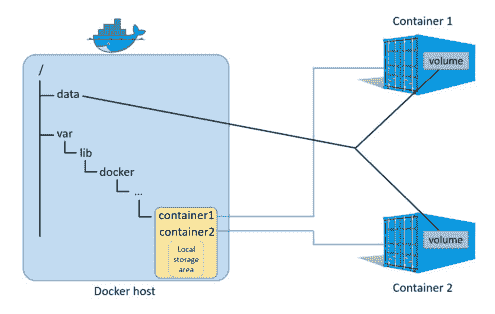
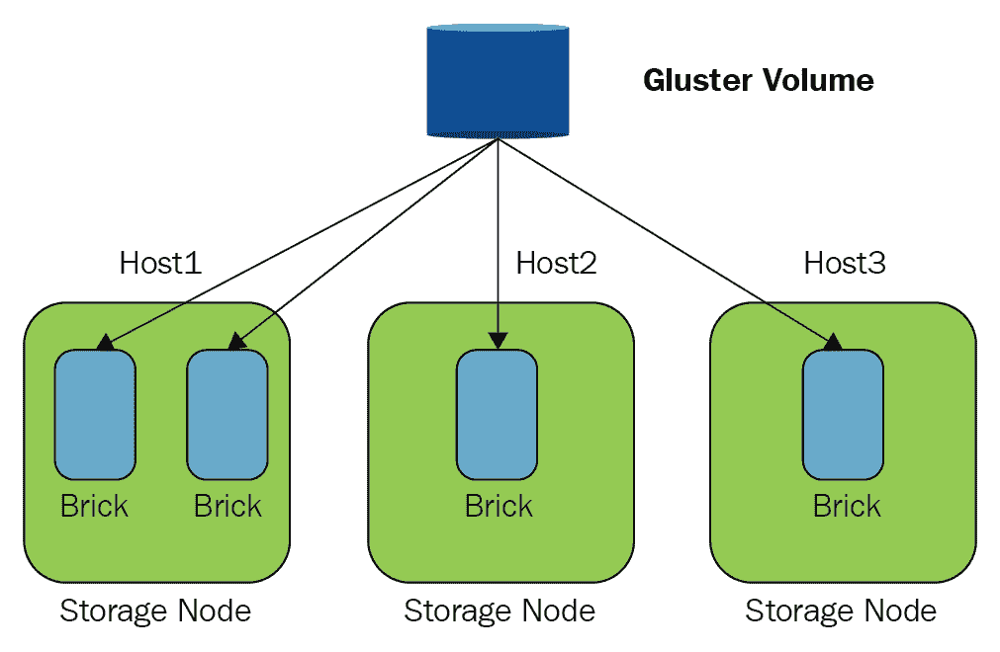
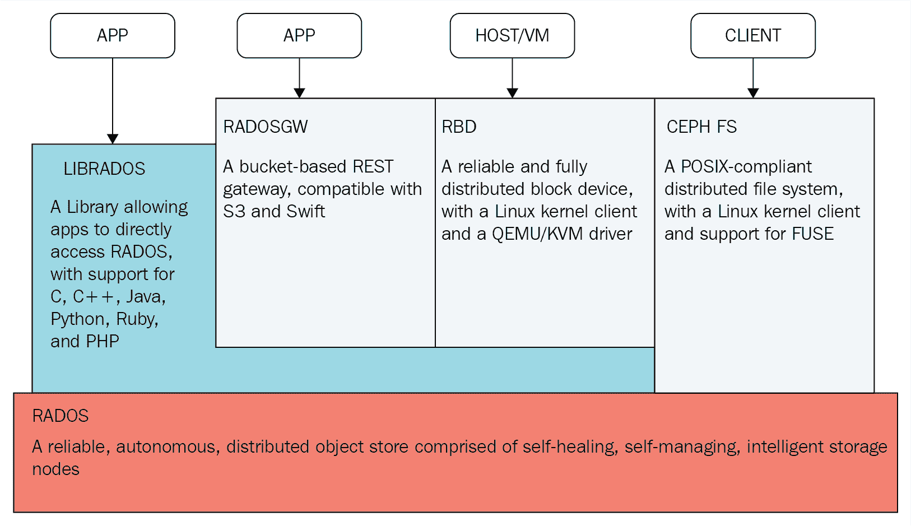
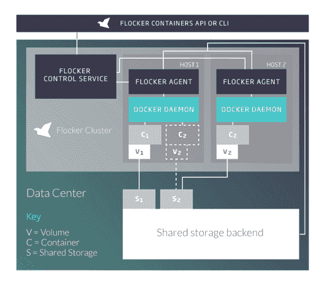
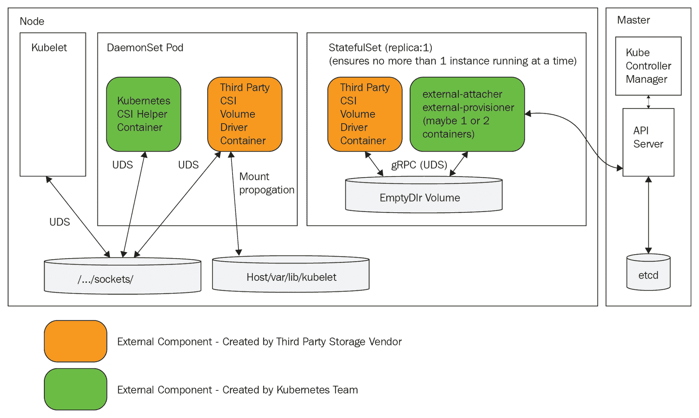

# 第七章：处理 Kubernetes 存储

在本章中，我们将看一下 Kubernetes 如何管理存储。存储与计算非常不同，但在高层次上它们都是资源。作为一个通用平台，Kubernetes 采取了在编程模型和一组存储提供者插件后面抽象存储的方法。首先，我们将详细介绍存储的概念模型以及如何将存储提供给集群中的容器。然后，我们将介绍常见的云平台存储提供者，如 AWS、GCE 和 Azure。然后我们将看一下著名的开源存储提供者（来自红帽的 GlusterFS），它提供了一个分布式文件系统。我们还将研究一种替代方案——Flocker——它将您的数据作为 Kubernetes 集群的一部分进行管理。最后，我们将看看 Kubernetes 如何支持现有企业存储解决方案的集成。

在本章结束时，您将对 Kubernetes 中存储的表示有扎实的了解，了解每个部署环境（本地测试、公共云和企业）中的各种存储选项，并了解如何为您的用例选择最佳选项。

# 持久卷演练

在这一部分，我们将看一下 Kubernetes 存储的概念模型，并了解如何将持久存储映射到容器中，以便它们可以读写。让我们先来看看存储的问题。容器和 Pod 是短暂的。当容器死亡时，容器写入自己文件系统的任何内容都会被清除。容器也可以挂载宿主节点的目录并进行读写。这样可以在容器重新启动时保留，但节点本身并不是不朽的。

还有其他问题，比如当容器死亡时，挂载的宿主目录的所有权。想象一下，一堆容器将重要数据写入它们的宿主机上的各个数据目录，然后离开，留下所有这些数据散落在节点上，没有直接的方法告诉哪个容器写入了哪些数据。您可以尝试记录这些信息，但您会在哪里记录呢？很明显，对于大规模系统，您需要从任何节点访问持久存储以可靠地管理数据。

# 卷

基本的 Kubernetes 存储抽象是卷。容器挂载绑定到其 Pod 的卷，并访问存储，无论它在哪里，都好像它在它们的本地文件系统中一样。这并不新鲜，但很棒，因为作为一个需要访问数据的应用程序开发人员，您不必担心数据存储在何处以及如何存储。

# 使用 emptyDir 进行 Pod 内通信

使用共享卷在同一 Pod 中的容器之间共享数据非常简单。容器 1 和容器 2 只需挂载相同的卷，就可以通过读写到这个共享空间进行通信。最基本的卷是`emptyDir`。`emptyDir`卷是主机上的`empty`目录。请注意，它不是持久的，因为当 Pod 从节点中移除时，内容会被擦除。如果容器崩溃，Pod 将继续存在，稍后可以访问它。另一个非常有趣的选项是使用 RAM 磁盘，通过指定介质为`Memory`。现在，您的容器通过共享内存进行通信，这样做速度更快，但当然更易失。如果节点重新启动，`emptyDir`卷的内容将丢失。

这是一个`pod`配置文件，其中有两个容器挂载名为`shared-volume`的相同卷。这些容器在不同的路径上挂载它，但当`hue-global-listener`容器将文件写入`/notifications`时，`hue-job-scheduler`将在`/incoming`下看到该文件。

```
apiVersion: v1
kind: Pod
metadata:
  name: hue-scheduler
spec:
  containers:
  - image: the_g1g1/hue-global-listener
    name: hue-global-listener
    volumeMounts:
    - mountPath: /notifications
      name: shared-volume
  - image: the_g1g1/hue-job-scheduler
    name: hue-job-scheduler
    volumeMounts:
    - mountPath: /incoming
      name: shared-volume
  volumes:
  - name: shared-volume
    emptyDir: {}
```

要使用共享内存选项，我们只需要在`emptyDir`部分添加`medium`:`Memory`：

```
volumes:
- name: shared-volume
  emptyDir:
   medium: Memory 
```

# 使用 HostPath 进行节点内通信

有时，您希望您的 Pod 可以访问一些主机信息（例如 Docker 守护程序），或者您希望同一节点上的 Pod 可以相互通信。如果 Pod 知道它们在同一主机上，这将非常有用。由于 Kubernetes 根据可用资源调度 Pod，Pod 通常不知道它们与哪些其他 Pod 共享节点。有两种情况下，Pod 可以依赖于其他 Pod 与其一起在同一节点上调度：

+   在单节点集群中，所有 Pod 显然共享同一节点

+   DaemonSet Pod 始终与与其选择器匹配的任何其他 Pod 共享节点

例如，在第六章中，*使用关键的 Kubernetes 资源*，我们讨论了一个作为聚合代理的 DaemonSet pod 到其他 pod 的。实现此行为的另一种方法是让 pod 将其数据简单地写入绑定到`host`目录的挂载卷，然后 DaemonSet pod 可以直接读取并对其进行操作。

在决定使用 HostPath 卷之前，请确保您了解限制：

+   具有相同配置的 pod 的行为可能会有所不同，如果它们是数据驱动的，并且它们主机上的文件不同

+   它可能会违反基于资源的调度（即将推出到 Kubernetes），因为 Kubernetes 无法监视 HostPath 资源

+   访问主机目录的容器必须具有`privileged`设置为`true`的安全上下文，或者在主机端，您需要更改权限以允许写入

这是一个配置文件，将`/coupons`目录挂载到`hue-coupon-hunter`容器中，该容器映射到主机的`/etc/hue/data/coupons`目录：

```
apiVersion: v1
kind: Pod
metadata:
  name: hue-coupon-hunter
spec:
  containers:
  - image: the_g1g1/hue-coupon-hunter
    name: hue-coupon-hunter
    volumeMounts:
    - mountPath: /coupons
      name: coupons-volume 
  volumes:
  - name: coupons-volume
    host-path: 
        path: /etc/hue/data/coupons
```

由于 pod 没有`privileged`安全上下文，它将无法写入`host`目录。让我们改变容器规范以通过添加安全上下文来启用它：

```
- image: the_g1g1/hue-coupon-hunter
   name: hue-coupon-hunter
   volumeMounts:
   - mountPath: /coupons
     name: coupons-volume
   securityContext:
          privileged: true
```

在下图中，您可以看到每个容器都有自己的本地存储区，其他容器或 pod 无法访问，并且主机的`/data`目录被挂载为卷到容器 1 和容器 2：



# 使用本地卷进行持久节点存储

本地卷类似于 HostPath，但它们在 pod 重新启动和节点重新启动时保持不变。在这种意义上，它们被视为持久卷。它们在 Kubernetes 1.7 中添加。截至 Kubernetes 1.10 需要启用功能门。本地卷的目的是支持 StatefulSet，其中特定的 pod 需要被调度到包含特定存储卷的节点上。本地卷具有节点亲和性注释，简化了将 pod 绑定到它们需要访问的存储的过程：

```
apiVersion: v1
kind: PersistentVolume
metadata:
  name: example-pv
  annotations:
        "volume.alpha.kubernetes.io/node-affinity": '{
            "requiredDuringSchedulingIgnoredDuringExecution": {
                "nodeSelectorTerms": [
                    { "matchExpressions": [
                        { "key": "kubernetes.io/hostname",
                          "operator": "In",
                          "values": ["example-node"]
                        }
                    ]}
                 ]}
              }'
spec:
    capacity:
      storage: 100Gi
    accessModes:
    - ReadWriteOnce
    persistentVolumeReclaimPolicy: Delete
    storageClassName: local-storage
    local:
      path: /mnt/disks/ssd1
```

# 提供持久卷

`emptyDir` 卷可以被挂载和容器使用，但它们不是持久的，也不需要任何特殊的配置，因为它们使用节点上的现有存储。`HostPath` 卷在原始节点上持久存在，但如果 pod 在不同的节点上重新启动，它无法访问先前节点上的 `HostPath` 卷。`Local` 卷在节点上持久存在，可以在 pod 重新启动、重新调度甚至节点重新启动时幸存下来。真正的持久卷使用提前由管理员配置的外部存储（不是物理连接到节点的磁盘）。在云环境中，配置可能非常简化，但仍然是必需的，作为 Kubernetes 集群管理员，您至少要确保您的存储配额是充足的，并且要认真监控使用情况与配额的对比。

请记住，持久卷是 Kubernetes 集群类似于节点使用的资源。因此，它们不受 Kubernetes API 服务器的管理。您可以静态或动态地配置资源。

+   **静态配置持久卷**：静态配置很简单。集群管理员提前创建由某些存储介质支持的持久卷，这些持久卷可以被容器声明。

+   **动态配置持久卷**：当持久卷声明与静态配置的持久卷不匹配时，动态配置可能会发生。如果声明指定了存储类，并且管理员为该类配置了动态配置，那么持久卷可能会被即时配置。当我们讨论持久卷声明和存储类时，我们将在后面看到示例。

+   **外部配置持久卷**：最近的一个趋势是将存储配置器从 Kubernetes 核心移出到卷插件（也称为 out-of-tree）。外部配置器的工作方式与 in-tree 动态配置器相同，但可以独立部署和更新。越来越多的 in-tree 存储配置器迁移到 out-of-tree。查看这个 Kubernetes 孵化器项目：[`github.com/kubernetes-incubator/external-storage`](https://github.com/kubernetes-incubator/external-storage)。

# 创建持久卷

以下是 NFS 持久卷的配置文件：

```
apiVersion: v1
kind: PersistentVolume
metadata:
  name: pv-1
  labels:
     release: stable
     capacity: 100Gi 
spec:
  capacity:
    storage: 100Gi
  volumeMode: Filesystem
  accessModes:
    - ReadWriteOnce
   - ReadOnlyMany
  persistentVolumeReclaimPolicy: Recycle
  storageClassName: normal
  nfs:
    path: /tmp
    server: 172.17.0.8
```

持久卷具有包括名称在内的规范和元数据。让我们在这里关注规范。有几个部分：容量、卷模式、访问模式、回收策略、存储类和卷类型（例如示例中的`nfs`）。

# 容量

每个卷都有指定的存储量。存储索赔可以由至少具有该存储量的持久卷满足。例如，持久卷的容量为`100` Gibibytes（2³⁰字节）。在分配静态持久卷时，了解存储请求模式非常重要。例如，如果您配置了 100 GiB 容量的 20 个持久卷，并且容器索赔了 150 GiB 的持久卷，则即使总体容量足够，该索赔也不会得到满足：

```
capacity:
    storage: 100Gi 
```

# 卷模式

可选的卷模式在 Kubernetes 1.9 中作为静态配置的 Alpha 功能添加（即使您在规范中指定它作为字段，而不是在注释中）。它允许您指定是否需要文件系统（`"Filesystem"`）或原始存储（`"Block"`）。如果不指定卷模式，则默认值是`"Filesystem"`，就像在 1.9 之前一样。

# 访问模式

有三种访问模式：

+   `ReadOnlyMany`：可以由多个节点挂载为只读

+   `ReadWriteOnce`：可以由单个节点挂载为读写

+   `ReadWriteMany`：可以由多个节点挂载为读写

存储被挂载到节点，所以即使使用`ReadWriteOnce`，同一节点上的多个容器也可以挂载该卷并对其进行写入。如果这造成问题，您需要通过其他机制来处理（例如，您可以只在您知道每个节点只有一个的 DaemonSet pods 中索赔该卷）。

不同的存储提供程序支持这些模式的一些子集。当您配置持久卷时，可以指定它将支持哪些模式。例如，NFS 支持所有模式，但在示例中，只启用了这些模式：

```
accessModes:
    - ReadWriteMany
   - ReadOnlyMany
```

# 回收策略

回收策略确定持久卷索赔被删除时会发生什么。有三种不同的策略：

+   `Retain`：需要手动回收卷

+   `Delete`：关联的存储资产，如 AWS EBS、GCE PD、Azure 磁盘或 OpenStack Cinder 卷，将被删除

+   `Recycle`：仅删除内容（`rm -rf /volume/*`）

`Retain`和`Delete`策略意味着持久卷将不再对未来索赔可用。`recycle`策略允许再次索赔该卷。

目前，只有 NFS 和 HostPath 支持回收。AWS EBS、GCE PD、Azure 磁盘和 Cinder 卷支持删除。动态配置的卷总是被删除。

# 存储类

您可以使用规范的可选`storageClassName`字段指定存储类。如果这样做，那么只有指定相同存储类的持久卷要求才能绑定到持久卷。如果不指定存储类，则只有不指定存储类的持久卷要求才能绑定到它。

# 卷类型

卷类型在规范中通过名称指定。没有`volumeType`部分。

在前面的示例中，`nfs`是卷类型：

```
nfs:
    path: /tmp
    server: 172.17.0.8 
```

每种卷类型可能有自己的一组参数。在这种情况下，它是一个`path`

和`server`。

我们将在本章后面讨论各种卷类型。

# 提出持久卷要求

当容器需要访问某些持久存储时，它们会提出要求（或者说，开发人员和集群管理员会协调必要的存储资源

要求）。以下是一个与上一节中的持久卷匹配的示例要求：

```
kind: PersistentVolumeClaim
apiVersion: v1
metadata:
  name: storage-claim
spec:
  accessModes:
    - ReadWriteOnce
  resources:
    requests:
      storage: 80Gi
  storageClassName: "normal"
  selector:
    matchLabels:
      release: "stable"
    matchExpressions:
      - {key: capacity, operator: In, values: [80Gi, 100Gi]}
```

名称`storage-claim`在将要将要求挂载到容器中时将变得重要。

规范中的访问模式为`ReadWriteOnce`，这意味着如果要求得到满足，则不能满足其他具有`ReadWriteOnce`访问模式的要求，但仍然可以满足`ReadOnlyMany`的要求。

资源部分请求 80 GiB。这可以通过我们的持久卷满足，它的容量为 100 GiB。但这有点浪费，因为 20 GiB 将不会被使用。

存储类名称为`"normal"`。如前所述，它必须与持久卷的类名匹配。但是，对于**持久卷要求**（**PVC**），空类名（`""`）和没有类名之间存在差异。前者（空类名）与没有存储类名的持久卷匹配。后者（没有类名）只有在关闭`DefaultStorageClass`准入插件或者打开并且使用默认存储类时才能绑定到持久卷。

`Selector`部分允许您进一步过滤可用的卷。例如，在这里，卷必须匹配标签`release: "stable"`，并且还必须具有标签`capacity: 80 Gi`或`capacity: 100 Gi`。假设我们还有其他几个容量为 200 Gi 和 500 Gi 的卷。当我们只需要 80 Gi 时，我们不希望索赔 500 Gi 的卷。

Kubernetes 始终尝试匹配可以满足索赔的最小卷，但如果没有 80 Gi 或 100 Gi 的卷，那么标签将阻止分配 200 Gi 或 500 Gi 的卷，并使用动态配置。

重要的是要意识到索赔不会按名称提及卷。匹配是由基于存储类、容量和标签的 Kubernetes 完成的。

最后，持久卷索赔属于命名空间。将持久卷绑定到索赔是排他的。这意味着持久卷将绑定到一个命名空间。即使访问模式是`ReadOnlyMany`或`ReadWriteMany`，所有挂载持久卷索赔的 Pod 必须来自该索赔的命名空间。

# 将索赔作为卷

好的。我们已经配置了一个卷并对其进行了索赔。现在是时候在容器中使用索赔的存储了。这其实非常简单。首先，持久卷索赔必须在 Pod 中用作卷，然后 Pod 中的容器可以像任何其他卷一样挂载它。这是一个`pod`配置文件，指定了我们之前创建的持久卷索赔（绑定到我们配置的 NFS 持久卷）。

```
kind: Pod
apiVersion: v1
metadata:
  name: the-pod
spec:
  containers:
    - name: the-container
      image: some-image
      volumeMounts:
      - mountPath: "/mnt/data"
        name: persistent-volume
  volumes:
    - name: persistent-volume
      persistentVolumeClaim:
        claimName: storage-claim
```

关键在`volumes`下的`persistentVolumeClaim`部分。索赔名称（这里是`storage-claim`）在当前命名空间内唯一标识特定索赔，并使其作为卷命名为`persistent-volume`。然后，容器可以通过名称引用它，并将其挂载到`/mnt/data`。

# 原始块卷

Kubernetes 1.9 将此功能作为 alpha 功能添加。您必须使用功能门控来启用它：`--feature-gates=BlockVolume=true`。

原始块卷提供对底层存储的直接访问，不经过文件系统抽象。这对需要高存储性能的应用程序非常有用，比如数据库，或者需要一致的 I/O 性能和低延迟。光纤通道、iSCSI 和本地 SSD 都适用于用作原始块存储。目前（Kubernetes 1.10），只有`Local Volume`和`FiberChannel`存储提供程序支持原始块卷。以下是如何定义原始块卷：

```
apiVersion: v1
kind: PersistentVolume
metadata:
  name: block-pv
spec:
  capacity:
    storage: 10Gi
  accessModes:
    - ReadWriteOnce
  volumeMode: Block
  persistentVolumeReclaimPolicy: Retain
  fc:
    targetWWNs: ["50060e801049cfd1"]
    lun: 0
    readOnly: false
```

匹配的 PVC 必须指定`volumeMode: Block`。这是它的样子：

```
apiVersion: v1
kind: PersistentVolumeClaim
metadata:
  name: block-pvc
spec:
  accessModes:
    - ReadWriteOnce
  volumeMode: Block
  resources:
    requests:
      storage: 10Gi
```

Pods 将原始块卷作为`/dev`下的设备而不是挂载的文件系统来消耗。容器可以访问这个设备并对其进行读/写。实际上，这意味着对块存储的 I/O 请求直接传递到底层块存储，而不经过文件系统驱动程序。理论上这更快，但实际上如果您的应用程序受益于文件系统缓冲，它实际上可能会降低性能。

这是一个带有容器的 Pod，它将`block-pvc`与原始块存储绑定为名为`/dev/xdva`的设备：

```
apiVersion: v1
kind: Pod
metadata:
  name: pod-with-block-volume
spec:
  containers:
    - name: fc-container
      image: fedora:26
      command: ["/bin/sh", "-c"]
      args: [ "tail -f /dev/null" ]
      volumeDevices:
        - name: data
          devicePath: /dev/xvda
  volumes:
    - name: data
      persistentVolumeClaim:
        claimName: block-pvc
```

# 存储类

存储类允许管理员使用自定义持久存储配置集群（只要有适当的插件支持）。存储类在`metadata`中有一个`name`，一个`provisioner`和`parameters`：

```
kind: StorageClass
apiVersion: storage.k8s.io/v1
metadata:
  name: standard
provisioner: kubernetes.io/aws-ebs
parameters:
  type: gp2
```

您可以为同一个提供程序创建多个存储类，每个提供程序都有自己的参数。

目前支持的卷类型如下：

+   `AwsElasticBlockStore`

+   `AzureFile`

+   `AzureDisk`

+   `CephFS`

+   `Cinder`

+   `FC`

+   `FlexVolume`

+   `Flocker`

+   `GcePersistentDisk`

+   `GlusterFS`

+   `ISCSI`

+   `PhotonPersistentDisk`

+   `Quobyte`

+   `NFS`

+   `RBD`

+   `VsphereVolume`

+   `PortworxVolume`

+   `ScaleIO`

+   `StorageOS`

+   `Local`

这个列表不包含其他卷类型，比如`gitRepo`或`secret`，这些类型不是由典型的网络存储支持的。Kubernetes 的这个领域仍然在变化中，将来它会进一步解耦，设计会更清晰，插件将不再是 Kubernetes 本身的一部分。智能地利用卷类型是架构和管理集群的重要部分。

# 默认存储类

集群管理员还可以分配一个默认的`storage`类。当分配了默认的存储类并且打开了`DefaultStorageClass`准入插件时，那么没有存储类的声明将使用默认的`storage`类进行动态配置。如果默认的`storage`类没有定义或者准入插件没有打开，那么没有存储类的声明只能匹配没有`storage`类的卷。

# 演示持久卷存储的端到端

为了说明所有的概念，让我们进行一个小型演示，创建一个 HostPath 卷，声明它，挂载它，并让容器写入它。

让我们首先创建一个`hostPath`卷。将以下内容保存在`persistent-volume.yaml`中：

```
kind: PersistentVolume
apiVersion: v1
metadata:
 name: persistent-volume-1
spec:
 StorageClassName: dir
 capacity:
 storage: 1Gi
 accessModes:
 - ReadWriteOnce
 hostPath:
 path: "/tmp/data"

> kubectl create -f persistent-volume.yaml
persistentvolume "persistent-volume-1" created
```

要查看可用的卷，可以使用`persistentvolumes`资源类型，或者简称为`pv`：

```
> kubectl get pv
NAME:             persistent-volume-1 
CAPACITY:         1Gi
ACCESS MODES:     RWO 
RECLAIM POLICY:   Retain 
STATUS:           Available 
CLAIM: 
STORAGECLASS:    dir
REASON: 
AGE:             17s 
```

我稍微编辑了一下输出，以便更容易看到。容量为 1 GiB，符合要求。回收策略是`Retain`，因为`HostPath`卷是保留的。状态为`Available`，因为卷尚未被声明。访问模式被指定为`RWX`，表示`ReadWriteMany`。所有访问模式都有一个简写版本：

+   `RWO`：`ReadWriteOnce`

+   `ROX`：`ReadOnlyMany`

+   `RWX`：`ReadWriteMany`

我们有一个持久卷。让我们创建一个声明。将以下内容保存到`persistent-volume-claim.yaml`中：

```
kind: PersistentVolumeClaim
apiVersion: v1
metadata:
 name: persistent-volume-claim
spec:
 accessModes:
 - ReadWriteOnce
 resources:
 requests:
 storage: 1Gi
```

然后，运行以下命令：

```
> kubectl create -f  persistent-volume-claim.yaml
persistentvolumeclaim "persistent-volume-claim" created  
```

让我们检查一下`claim`和`volume`：

```
> kubectl get pvc
NAME                                  STATUS  VOLUME                     CAPACITY   ACCESSMODES   AGE
persistent-volume-claim   Bound     persistent-volume-1   1Gi        RWO            dir            1m

> kubectl get pv
NAME:                 persistent-volume-1
CAPACITY:             1Gi
ACCESS MODES:         RWO 
RECLAIM POLICY:       Retain
STATUS:               Bound 
CLAIM:               default/persistent-volume-claim 
STORAGECLASS:        dir
REASON: 
AGE:                 3m  
```

如您所见，`claim`和`volume`已经绑定在一起。最后一步是创建一个`pod`并将`claim`分配为`volume`。将以下内容保存到`shell-pod.yaml`中：

```
kind: Pod
apiVersion: v1
metadata:
 name: just-a-shell
 labels:
 name: just-a-shell
spec:
 containers:
 - name: a-shell
 image: ubuntu
 command: ["/bin/bash", "-c", "while true ; do sleep 10 ; done"]
 volumeMounts:
 - mountPath: "/data"
 name: pv
 - name: another-shell
 image: ubuntu
 command: ["/bin/bash", "-c", "while true ; do sleep 10 ; done"]
 volumeMounts:
 - mountPath: "/data"
 name: pv
 volumes:
 - name: pv
 persistentVolumeClaim:
 claimName: persistent-volume-claim
```

这个 pod 有两个容器，它们使用 Ubuntu 镜像，并且都运行一个`shell`命令，只是在无限循环中睡眠。这样做的目的是让容器保持运行，这样我们以后可以连接到它们并检查它们的文件系统。该 pod 将我们的持久卷声明挂载为`pv`的卷名。两个容器都将其挂载到它们的`/data`目录中。

让我们创建`pod`并验证两个容器都在运行：

```
> kubectl create -f shell-pod.yaml
pod "just-a-shell" created

> kubectl get pods
NAME           READY     STATUS    RESTARTS   AGE
just-a-shell   2/2       Running   0           1m 
```

然后，`ssh`到节点。这是主机，其`/tmp/data`是 pod 的卷，挂载为每个正在运行的容器的`/data`：

```
> minikube ssh
$
```

在节点内部，我们可以使用 Docker 命令与容器进行通信。让我们看一下最后两个正在运行的容器：

```
$ docker ps -n 2 --format '{{.ID}}\t{{.Image}}\t{{.Command}}'
820fc954fb96     ubuntu    "/bin/bash -c 'whi..."
cf4502f14be5     ubuntu    "/bin/bash -c 'whi..."
```

然后，在主机的`/tmp/data`目录中创建一个文件。它应该通过挂载的卷对两个容器都可见：

```
$ sudo touch /tmp/data/1.txt
```

让我们在其中一个容器上执行一个`shell`，验证文件`1.txt`确实可见，并创建另一个文件`2.txt`：

```
$ docker exec -it 820fc954fb96  /bin/bash
root@just-a-shell:/# ls /data
1.txt
root@just-a-shell:/# touch /data/2.txt
root@just-a-shell:/# exit
Finally, we can run a shell on the other container and verify that both 1.txt and 2.txt are visible:
docker@minikube:~$ docker exec -it cf4502f14be5 /bin/bash
root@just-a-shell:/# ls /data
1.txt  2.txt
```

# 公共存储卷类型 - GCE，AWS 和 Azure

在本节中，我们将介绍一些主要公共云平台中可用的常见卷类型。在规模上管理存储是一项困难的任务，最终涉及物理资源，类似于节点。如果您选择在公共云平台上运行您的 Kubernetes 集群，您可以让您的云提供商处理所有这些挑战，并专注于您的系统。但重要的是要了解每种卷类型的各种选项、约束和限制。

# AWS 弹性块存储（EBS）

AWS 为 EC2 实例提供 EBS 作为持久存储。AWS Kubernetes 集群可以使用 AWS EBS 作为持久存储，但有以下限制：

+   pod 必须在 AWS EC2 实例上作为节点运行

+   Pod 只能访问其可用区中配置的 EBS 卷

+   EBS 卷可以挂载到单个 EC2 实例

这些是严重的限制。单个可用区的限制，虽然对性能有很大帮助，但消除了在规模或地理分布系统中共享存储的能力，除非进行自定义复制和同步。单个 EBS 卷限制为单个 EC2 实例意味着即使在同一可用区内，pod 也无法共享存储（甚至是读取），除非您确保它们在同一节点上运行。

在解释所有免责声明之后，让我们看看如何挂载 EBS 卷：

```
apiVersion: v1
kind: Pod
metadata:
 name: some-pod
spec:
 containers:
 - image: some-container
 name: some-container
 volumeMounts:
 - mountPath: /ebs
 name: some-volume
 volumes:
 - name: some-volume
 awsElasticBlockStore:
 volumeID: <volume-id>
 fsType: ext4
```

您必须在 AWS 中创建 EBS 卷，然后将其挂载到 pod 中。不需要声明或存储类，因为您通过 ID 直接挂载卷。`awsElasticBlockStore`卷类型为 Kubernetes 所知。

# AWS 弹性文件系统

AWS 最近推出了一项名为**弹性文件系统**（**EFS**）的新服务。这实际上是一个托管的 NFS 服务。它使用 NFS 4.1 协议，并且与 EBS 相比有许多优点：

+   多个 EC2 实例可以跨多个可用区（但在同一区域内）访问相同的文件

+   容量根据实际使用情况自动扩展和缩减

+   您只支付您使用的部分

+   您可以通过 VPN 将本地服务器连接到 EFS

+   EFS 运行在自动在可用区之间复制的 SSD 驱动器上

话虽如此，即使考虑到自动复制到多个可用区（假设您充分利用了 EBS 卷），EFS 比 EBS 更加广泛。它正在使用外部供应商，部署起来并不是微不足道的。请按照这里的说明进行操作：

[`github.com/kubernetes-incubator/external-storage/tree/master/aws/efs`](https://github.com/kubernetes-incubator/external-storage/tree/master/aws/efs)

一旦一切都设置好了，并且您已经定义了存储类，并且持久卷存在，您可以创建一个声明，并将其以`ReadWriteMany`模式挂载到尽可能多的`pod`中。这是持久声明：

```
kind: PersistentVolumeClaim
apiVersion: v1
metadata:
 name: efs
 annotations:
 volume.beta.kubernetes.io/storage-class: "aws-efs"
spec:
 accessModes:
 - ReadWriteMany
 resources:
 requests:
 storage: 1Mi
```

这是一个使用它的`pod`：

```
kind: Pod
apiVersion: v1
metadata:
 name: test-pod
spec:
 containers:
 - name: test-pod
 image: gcr.io/google_containers/busybox:1.24
 command:
 - "/bin/sh"
 args:
 - "-c"
 - "touch /mnt/SUCCESS exit 0 || exit 1"
 volumeMounts:
 - name: efs-pvc
 mountPath: "/mnt"
 restartPolicy: "Never"
 volumes:
 - name: efs-pvc
 persistentVolumeClaim:
 claimName: efs

```

# GCE 持久磁盘

`gcePersistentDisk`卷类型与`awsElasticBlockStore`非常相似。您必须提前规划磁盘。它只能被同一项目和区域中的 GCE 实例使用。但是同一卷可以在多个实例上以只读方式使用。这意味着它支持`ReadWriteOnce`和`ReadOnlyMany`。您可以使用 GCE 持久磁盘在同一区域的多个`pod`之间共享数据。

使用`ReadWriteOnce`模式中的持久磁盘的`pod`必须由复制控制器、副本集或具有`0`或`1`个副本计数的部署控制。尝试扩展到`1`之外的数量将因明显原因而失败：

```
apiVersion: v1
kind: Pod
metadata:
 name: some-pod
spec:
 containers:
 - image: some-container
 name: some-container
 volumeMounts:
 - mountPath: /pd
 name: some-volume
 volumes:
 - name: some-volume
 gcePersistentDisk:
 pdName: <persistent disk name>
 fsType: ext4 
```

# Azure 数据磁盘

Azure 数据磁盘是存储在 Azure 存储中的虚拟硬盘。它的功能类似于 AWS EBS。这是一个示例`pod`配置文件：

```
apiVersion: v1
kind: Pod
metadata:
 name: some-pod
spec:
 containers:
 - image: some-container
 name: some-container
 volumeMounts:
 - name: some-volume
 mountPath: /azure
 volumes:
 - name: some-volume
 azureDisk:
 diskName: test.vhd
 diskURI: https://someaccount.blob.microsoft.net/vhds/test.vhd 
```

除了强制的`diskName`和`diskURI`参数之外，它还有一些可选参数：

+   `cachingMode`：磁盘缓存模式。必须是`None`、`ReadOnly`或`ReadWrite`之一。默认值为`None`。

+   `fsType`：文件系统类型设置为`mount`。默认值为`ext4`。

+   `readOnly`：文件系统是否以`readOnly`模式使用。默认值为`false`。

Azure 数据磁盘的限制为 1,023 GB。每个 Azure VM 最多可以有 16 个数据磁盘。您可以将 Azure 数据磁盘附加到单个 Azure VM 上。

# Azure 文件存储

除了数据磁盘，Azure 还有一个类似于 AWS EFS 的共享文件系统。但是，Azure 文件存储使用 SMB/CIFS 协议（支持 SMB 2.1 和 SMB 3.0）。它基于 Azure 存储平台，具有与 Azure Blob、Table 或 Queue 相同的可用性、耐用性、可扩展性和地理冗余能力。

为了使用 Azure 文件存储，您需要在每个客户端 VM 上安装`cifs-utils`软件包。您还需要创建一个`secret`，这是一个必需的参数：

```
apiVersion: v1
kind: Secret
metadata:
 name: azure-file-secret
type: Opaque
data:
 azurestorageaccountname: <base64 encoded account name>
 azurestorageaccountkey: <base64 encoded account key>
```

这是一个 Azure 文件存储的配置文件：

```
apiVersion: v1
kind: Pod
metadata:
 name: some-pod
spec:
 containers:
  - image: some-container
    name: some-container
    volumeMounts:
      - name: some-volume
        mountPath: /azure
 volumes:
      - name: some-volume
        azureFile:
          secretName: azure-file-secret
         shareName: azure-share
          readOnly: false
```

Azure 文件存储支持在同一地区内共享以及连接本地客户端。以下是说明工作流程的图表：

# Kubernetes 中的 GlusterFS 和 Ceph 卷

GlusterFS 和 Ceph 是两个分布式持久存储系统。GlusterFS 在其核心是一个网络文件系统。Ceph 在核心是一个对象存储。两者都公开块、对象和文件系统接口。两者都在底层使用`xfs`文件系统来存储数据和元数据作为`xattr`属性。您可能希望在 Kubernetes 集群中使用 GlusterFS 或 Ceph 作为持久卷的几个原因：

+   您可能有很多数据和应用程序访问 GlusterFS 或 Ceph 中的数据

+   您具有管理和操作 GlusterFS 的专业知识

或 Ceph

+   您在云中运行，但云平台持久存储的限制是一个非起点。

# 使用 GlusterFS

GlusterFS 故意简单，将底层目录公开，并留给客户端（或中间件）处理高可用性、复制和分发。GlusterFS 将数据组织成逻辑卷，其中包括包含文件的多个节点（机器）的砖块。文件根据 DHT（分布式哈希表）分配给砖块。如果文件被重命名或 GlusterFS 集群被扩展或重新平衡，文件可能会在砖块之间移动。以下图表显示了 GlusterFS 的构建模块：



要将 GlusterFS 集群用作 Kubernetes 的持久存储（假设您已经运行了 GlusterFS 集群），您需要遵循几个步骤。特别是，GlusterFS 节点由插件作为 Kubernetes 服务进行管理（尽管作为应用程序开发人员，这与您无关）。

# 创建端点

这是一个端点资源的示例，您可以使用`kubectl create`创建为普通的 Kubernetes 资源：

```
{
  "kind": "Endpoints",
  "apiVersion": "v1",
  "metadata": {
    "name": "glusterfs-cluster"
  },
  "subsets": [
    {
      "addresses": [
        {
          "ip": "10.240.106.152"
        }
      ],
      "ports": [
        {
          "port": 1
        }
      ]
    },
    {
      "addresses": [
        {
          "ip": "10.240.79.157"
        }
      ],
      "ports": [
        {
          "port": 1
        }
      ]
    }
  ]
}
```

# 添加 GlusterFS Kubernetes 服务

为了使端点持久，您可以使用一个没有选择器的 Kubernetes 服务来指示端点是手动管理的：

```
{
  "kind": "Service",
  "apiVersion": "v1",
  "metadata": {
    "name": "glusterfs-cluster"
  },
  "spec": {
    "ports": [
      {"port": 1}
    ]
  }
}
```

# 创建 Pods

最后，在 pod 规范的`volumes`部分中，提供以下信息：

```
"volumes": [
            {
                "name": "glusterfsvol",
                "glusterfs": {
                    "endpoints": "glusterfs-cluster",
                    "path": "kube_vol",
                    "readOnly": true
                }
            }
        ] 
```

然后容器可以按名称挂载`glusterfsvol`。

`endpoints`告诉 GlusterFS 卷插件如何找到 GlusterFS 集群的存储节点。

# 使用 Ceph

Ceph 的对象存储可以使用多个接口访问。Kubernetes 支持**RBD**（块）和**CEPHFS**（文件系统）接口。以下图表显示了 RADOS - 底层对象存储 - 如何在多天内访问。与 GlusterFS 不同，Ceph 会自动完成大量工作。它自行进行分发、复制和自我修复：



# 使用 RBD 连接到 Ceph

Kubernetes 通过**Rados****Block****Device**（**RBD**）接口支持 Ceph。您必须在 Kubernetes 集群中的每个节点上安装`ceph-common`。一旦您的 Ceph 集群正常运行，您需要在`pod`配置文件中提供 Ceph RBD 卷插件所需的一些信息：

+   `monitors`：Ceph 监视器。

+   `pool`：RADOS 池的名称。如果未提供，则使用默认的 RBD 池。

+   `image`：RBD 创建的镜像名称。

+   `user`：RADOS 用户名。如果未提供，则使用默认的`admin`。

+   `keyring`：`keyring`文件的路径。如果未提供，则使用默认的`/etc/ceph/keyring`。

+   `*` `secretName`：认证密钥的名称。如果提供了一个，则`secretName`会覆盖`keyring`。注意：请参阅下一段关于如何创建`secret`的内容。

+   `fsType`：在其上格式化的文件系统类型（`ext4`、`xfs`等）。

设备。

+   `readOnly`：文件系统是否以`readOnly`方式使用。

如果使用了 Ceph 认证`secret`，则需要创建一个`secret`对象：

```
apiVersion: v1
kind: Secret
metadata:
  name: ceph-secret
type: "kubernetes.io/rbd" 
data:
  key: QVFCMTZWMVZvRjVtRXhBQTVrQ1FzN2JCajhWVUxSdzI2Qzg0SEE9PQ==
```

`secret`类型为`kubernetes.io/rbd`。

pod 规范的`volumes`部分看起来与此相同：

```
"volumes": [
    {
        "name": "rbdpd",
        "rbd": {
            "monitors": [
          "10.16.154.78:6789",
      "10.16.154.82:6789",
          "10.16.154.83:6789"
        ],
            "pool": "kube",
            "image": "foo",
            "user": "admin",
            "secretRef": {
      "name": "ceph-secret"
      },
            "fsType": "ext4",
            "readOnly": true
        }
    }
]
```

Ceph RBD 支持`ReadWriteOnce`和`ReadOnlyMany`访问模式。

# 使用 CephFS 连接到 Ceph

如果您的 Ceph 集群已经配置了 CephFS，则可以非常轻松地将其分配给 pod。此外，CephFS 支持`ReadWriteMany`访问模式。

配置类似于 Ceph RBD，只是没有池、镜像或文件系统类型。密钥可以是对 Kubernetes `secret`对象的引用（首选）或`secret`文件：

```
apiVersion: v1
kind: Pod
metadata:
  name: cephfs
spec:
  containers:
  - name: cephfs-rw
    image: kubernetes/pause
    volumeMounts:
    - mountPath: "/mnt/cephfs"
      name: cephfs
  volumes:
  - name: cephfs
    cephfs:
      monitors:
      - 10.16.154.78:6789
      - 10.16.154.82:6789
      - 10.16.154.83:6789
      user: admin
      secretFile: "/etc/ceph/admin.secret"
      readOnly: true
```

您还可以在`cephfs`系统中提供路径作为参数。默认为`/`。

内置的 RBD 供应程序在外部存储 Kubernetes 孵化器项目中有一个独立的副本。

# Flocker 作为集群容器数据卷管理器

到目前为止，我们已经讨论了将数据存储在 Kubernetes 集群之外的存储解决方案（除了`emptyDir`和 HostPath，它们不是持久的）。Flocker 有点不同。它是 Docker 感知的。它旨在让 Docker 数据卷在容器在节点之间移动时一起传输。如果你正在将基于 Docker 的系统从不同的编排平台（如 Docker compose 或 Mesos）迁移到 Kubernetes，并且你使用 Flocker 来编排存储，你可能想使用 Flocker 卷插件。就个人而言，我觉得 Flocker 所做的事情和 Kubernetes 为抽象存储所做的事情之间存在很多重复。

Flocker 有一个控制服务和每个节点上的代理。它的架构与 Kubernetes 非常相似，其 API 服务器和每个节点上运行的 Kubelet。Flocker 控制服务公开了一个 REST API，并管理着整个集群的状态配置。代理负责确保其节点的状态与当前配置匹配。例如，如果一个数据集需要在节点 X 上，那么节点 X 上的 Flocker 代理将创建它。

以下图表展示了 Flocker 架构：



为了在 Kubernetes 中使用 Flocker 作为持久卷，你首先必须有一个正确配置的 Flocker 集群。Flocker 可以与许多后备存储一起工作（再次，与 Kubernetes 持久卷非常相似）。

然后你需要创建 Flocker 数据集，这时你就可以将其连接为持久卷了。经过你的辛勤工作，这部分很容易，你只需要指定 Flocker 数据集的名称：

```
apiVersion: v1
kind: Pod
metadata:
  name: some-pod
spec:
  containers:
    - name: some-container
      image: kubernetes/pause
      volumeMounts:
          # name must match the volume name below
          - name: flocker-volume
            mountPath: "/flocker"
  volumes:
    - name: flocker-volume
      flocker:
        datasetName: some-flocker-dataset
```

# 将企业存储集成到 Kubernetes 中

如果你有一个通过 iSCSI 接口公开的现有**存储区域网络**（**SAN**），Kubernetes 为你提供了一个卷插件。它遵循了我们之前看到的其他共享持久存储插件的相同模型。你必须配置 iSCSI 启动器，但你不必提供任何启动器信息。你只需要提供以下内容：

+   iSCSI 目标的 IP 地址和端口（如果不是默认的`3260`）

+   目标的`iqn`（iSCSI 合格名称）—通常是反向域名

+   **LUN**—逻辑单元号

+   文件系统类型

+   `readonly`布尔标志

iSCSI 插件支持`ReadWriteOnce`和`ReadonlyMany`。请注意，目前无法对设备进行分区。以下是卷规范：

```
volumes:
  - name: iscsi-volume
    iscsi:
      targetPortal: 10.0.2.34:3260
      iqn: iqn.2001-04.com.example:storage.kube.sys1.xyz
      lun: 0
      fsType: ext4
      readOnly: true  
```

# 投影卷

可以将多个卷投影到单个目录中，使其显示为单个卷。支持的卷类型有：`secret`，`downwardAPI`和`configMap`。如果您想将多个配置源挂载到一个 pod 中，这将非常有用。您可以将它们全部捆绑到一个投影卷中，而不必为每个源创建单独的卷。这是一个例子：

```
apiVersion: v1
kind: Pod
metadata:
  name: the-pod
spec:
  containers:
  - name: the-container
    image: busybox
    volumeMounts:
    - name: all-in-one
      mountPath: "/projected-volume"
      readOnly: true
  volumes:
  - name: all-in-one
    projected:
      sources:
      - secret:
          name: the-secret
          items:
            - key: username
              path: the-group/the-user
      - downwardAPI:
          items:
            - path: "labels"
              fieldRef:
                fieldPath: metadata.labels
            - path: "cpu_limit"
              resourceFieldRef:
                containerName: the-container
                resource: limits.cpu
      - configMap:
          name: the-configmap
          items:
            - key: config
              path: the-group/the-config
```

# 使用 FlexVolume 的外部卷插件

FlexVolume 在 Kubernetes 1.8 中已经普遍可用。它允许您通过统一 API 消耗外部存储。存储提供商编写一个驱动程序，您可以在所有节点上安装。FlexVolume 插件可以动态发现现有的驱动程序。以下是使用 FlexVolume 绑定到外部 NFS 卷的示例：

```
apiVersion: v1
kind: Pod
metadata:
  name: nginx-nfs
  namespace: default
spec:
  containers:
  - name: nginx-nfs
    image: nginx
    volumeMounts:
    - name: test
      mountPath: /data
    ports:
    - containerPort: 80
  volumes:
  - name: test
    flexVolume:
      driver: "k8s/nfs"
      fsType: "nfs"
      options:
        server: "172.16.0.25"
        share: "dws_nas_scratch"
```

# 容器存储接口

**容器存储接口**（**CSI**）是标准化容器编排器和存储提供商之间交互的一个倡议。它由 Kubernetes、Docker、Mesos 和 Cloud Foundry 推动。其想法是存储提供商只需要实现一个插件，容器编排器只需要支持 CSI。这相当于存储的 CNI。与 FlexVolume 相比，有几个优点：

+   CSI 是一个行业标准

+   FlexVolume 插件需要访问节点和主节点根文件系统来部署驱动程序

+   FlexVolume 存储驱动程序通常需要许多外部依赖项

+   FlexVolume 的 EXEC 风格接口很笨拙

Kubernetes 1.9 中添加了一个 CSI 卷插件作为 alpha 功能，并在 Kubernetes 1.10 中已经升级为 beta 状态。FlexVolume 将保持向后兼容，至少一段时间。但随着 CSI 的发展和更多存储提供商实现 CSI 卷驱动程序，我确实可以看到 Kubernetes 只提供内部 CSI 卷插件，并通过 CSI 驱动程序与任何存储提供商进行通信。

这是一个演示 CSI 在 Kubernetes 中如何工作的图表：



# 总结

在本章中，我们深入研究了 Kubernetes 中的存储。我们看了基于卷、声明和存储类的通用概念模型，以及卷插件的实现。Kubernetes 最终将所有存储系统映射到容器中的挂载文件系统或原始块存储中。这种直接的模型允许管理员配置和连接任何存储系统，从本地的`host`目录到基于云的共享存储，再到企业存储系统。存储供应商从内部到外部的过渡对存储生态系统是一个好兆头。现在，您应该清楚地了解了存储在 Kubernetes 中的建模和实现，并能够在您的 Kubernetes 集群中做出明智的存储实现选择。

在第八章中，《使用 Kubernetes 运行有状态应用程序》，我们将看到 Kubernetes 如何提高抽象级别，并在存储之上，利用 StatefulSets 等概念来开发、部署和操作有状态的应用程序。
