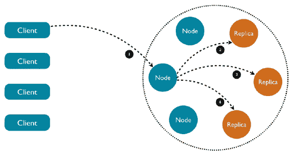

# 使用 Kubernetes 运行有状态应用

在这一章中，我们将探讨在 Kubernetes 上运行有状态应用所需的条件。Kubernetes 通过根据复杂的要求和配置（如命名空间、限制和配额）自动在集群节点上启动和重新启动 pod，从而减少了我们的工作量。但是，当 pod 运行存储感知软件（如数据库和队列）时，重新定位一个 pod 可能会导致系统崩溃。首先，我们将了解有状态 pod 的本质，以及它们在 Kubernetes 中管理起来更加复杂的原因。我们将探讨一些管理复杂性的方法，比如共享环境变量和 DNS 记录。在某些情况下，冗余的内存状态、DaemonSet 或持久存储声明可以解决问题。Kubernetes 为有状态 pod 推广的主要解决方案是 StatefulSet（以前称为 PetSet）资源，它允许我们管理具有稳定属性的索引集合的 pod。最后，我们将深入探讨在 Kubernetes 上运行 Cassandra 集群的一个完整示例。

# Kubernetes 中有状态与无状态应用

在 Kubernetes 中，无状态应用是指不在 Kubernetes 集群中管理其状态的应用。所有状态都存储在集群外，集群容器以某种方式访问它。在本节中，我们将了解为什么状态管理对于分布式系统的设计至关重要，以及在 Kubernetes 集群内管理状态的好处。

# 理解分布式数据密集型应用的性质

让我们从基础知识开始。分布式应用程序是在多台计算机上运行的一组进程，处理输入，操作数据，公开 API，并可能具有其他副作用。每个进程是其程序、运行时环境和输入输出的组合。你在学校写的程序会作为命令行参数获取输入，也许它们会读取文件或访问数据库，然后将结果写入屏幕、文件或数据库。一些程序在内存中保持状态，并可以通过网络提供请求。简单的程序在单台计算机上运行，可以将所有状态保存在内存中或从文件中读取。它们的运行时环境是它们的操作系统。如果它们崩溃，用户必须手动重新启动它们。它们与它们的计算机绑定在一起。分布式应用程序是一个不同的动物。单台计算机不足以处理所有数据或足够快地提供所有请求。单台计算机无法容纳所有数据。需要处理的数据如此之大，以至于无法以成本效益的方式下载到每个处理机器中。机器可能会出现故障，需要被替换。需要在所有处理机器上执行升级。用户可能分布在全球各地。

考虑所有这些问题后，很明显传统方法行不通。限制因素变成了数据。用户/客户端必须只接收摘要或处理过的数据。所有大规模数据处理必须在数据附近进行，因为传输数据的速度慢且昂贵。相反，大部分处理代码必须在相同的数据中心和网络环境中运行。

# 共享环境变量与 DNS 记录用于发现

Kubernetes 为集群中的全局发现提供了几种机制。如果您的存储集群不是由 Kubernetes 管理，您仍然需要告诉 Kubernetes pod 如何找到它并访问它。主要有两种方法：

+   DNS

+   环境变量

在某些情况下，您可能希望同时使用环境变量和 DNS，其中环境变量可以覆盖 DNS。

# 为什么要在 Kubernetes 中管理状态？

在 Kubernetes 中管理状态的主要原因是，与在单独的集群中管理相比，Kubernetes 已经提供了许多监视、扩展、分配、安全和操作存储集群所需的基础设施。运行并行存储集群将导致大量重复的工作。

# 为什么要在 Kubernetes 之外管理状态？

让我们不排除其他选择。在某些情况下，将状态管理在一个单独的非 Kubernetes 集群中可能更好，只要它与相同的内部网络共享（数据接近性胜过一切）。

一些有效的原因如下：

+   您已经有一个单独的存储集群，不想引起麻烦

+   您的存储集群被其他非 Kubernetes 应用程序使用

+   Kubernetes 对您的存储集群的支持还不够稳定或成熟

您可能希望逐步在 Kubernetes 中处理有状态的应用程序，首先从一个单独的存储集群开始，然后再与 Kubernetes 更紧密地集成。

# 通过 DNS 访问外部数据存储

DNS 方法简单直接。假设您的外部存储集群是负载均衡的，并且可以提供稳定的端点，那么 pod 可以直接命中该端点并连接到外部集群。

# 通过环境变量访问外部数据存储

另一种简单的方法是使用环境变量传递连接信息到外部存储集群。Kubernetes 提供`ConfigMap`资源作为一种将配置与容器镜像分开的方式。配置是一组键值对。配置信息可以作为环境变量暴露在容器内部以及卷中。您可能更喜欢使用秘密来存储敏感的连接信息。

# 创建 ConfigMap

以下配置文件将创建一个保留地址列表的配置文件：

```
apiVersion: v1 
kind: ConfigMap 
metadata: 
  name: db-config 
  namespace: default 
data: 
  db-ip-addresses: 1.2.3.4,5.6.7.8 

> kubectl create -f .\configmap.yamlconfigmap
 "db-config" created
```

`data`部分包含所有的键值对，这种情况下，只有一个键名为`db-ip-addresses`的键值对。在后面消耗`configmap`时将会很重要。您可以检查内容以确保它是正确的：

```
> kubectl get configmap db-config -o yaml
apiVersion: v1
data:
  db-ip-addresses: 1.2.3.4,5.6.7.8
kind: ConfigMap
metadata:
 creationTimestamp: 2017-01-09T03:14:07Z
 name: db-config
 namespace: default
 resourceVersion: "551258"
 selfLink: /api/v1/namespaces/default/configmaps/db-config
 uid: aebcc007-d619-11e6-91f1-3a7ae2a25c7d  
```

还有其他创建`ConfigMap`的方法。您可以直接使用`--from-value`或`--from-file`命令行参数来创建它们。

# 将 ConfigMap 作为环境变量消耗

当您创建一个 pod 时，可以指定一个`ConfigMap`并以多种方式使用其值。以下是如何将我们的配置映射为环境变量：

```
apiVersion: v1 
kind: Pod 
metadata: 
  name: some-pod 
spec: 
  containers: 
    - name: some-container 
      image: busybox 
      command: [ "/bin/sh", "-c", "env" ] 
      env: 
        - name: DB_IP_ADDRESSES 
          valueFrom: 
            configMapKeyRef: 
              name: db-config 
              key: db-ip-addresses         
  restartPolicy: Never 
```

这个 pod 运行`busybox`最小容器，并执行`env bash`命令，然后立即退出。`db-config`映射中的`db-ip-addresses`键被映射到`DB_IP_ADDRESSES`环境变量，并反映在输出中：

```
> kubectl logs some-pod
HUE_REMINDERS_SERVICE_PORT=80
HUE_REMINDERS_PORT=tcp://10.0.0.238:80
KUBERNETES_PORT=tcp://10.0.0.1:443
KUBERNETES_SERVICE_PORT=443
HOSTNAME=some-pod
SHLVL=1
HOME=/root
HUE_REMINDERS_PORT_80_TCP_ADDR=10.0.0.238
HUE_REMINDERS_PORT_80_TCP_PORT=80
HUE_REMINDERS_PORT_80_TCP_PROTO=tcp
DB_IP_ADDRESSES=1.2.3.4,5.6.7.8
HUE_REMINDERS_PORT_80_TCP=tcp://10.0.0.238:80
KUBERNETES_PORT_443_TCP_ADDR=10.0.0.1
PATH=/usr/local/sbin:/usr/local/bin:/usr/sbin:/usr/bin:/sbin:/bin
KUBERNETES_PORT_443_TCP_PORT=443
KUBERNETES_PORT_443_TCP_PROTO=tcp
KUBERNETES_SERVICE_PORT_HTTPS=443
KUBERNETES_PORT_443_TCP=tcp://10.0.0.1:443
HUE_REMINDERS_SERVICE_HOST=10.0.0.238
PWD=/
KUBERNETES_SERVICE_HOST=10.0.0.1 
```

# 使用冗余的内存状态

在某些情况下，您可能希望在内存中保留瞬态状态。分布式缓存是一个常见情况。时间敏感的信息是另一个情况。对于这些用例，不需要持久存储，通过服务访问多个 Pod 可能是正确的解决方案。我们可以使用标签等标准 Kubernetes 技术来识别属于存储冗余副本的 Pod，并通过服务公开它。如果一个 Pod 死掉，Kubernetes 将创建一个新的 Pod，并且在它赶上之前，其他 Pod 将服务于该状态。我们甚至可以使用 Pod 的反亲和性 alpha 功能来确保维护相同状态的冗余副本的 Pod 不被调度到同一节点。

# 使用 DaemonSet 进行冗余持久存储

一些有状态的应用程序，如分布式数据库或队列，会冗余地管理它们的状态并自动同步它们的节点（我们稍后将深入研究 Cassandra）。在这些情况下，重要的是将 Pod 调度到单独的节点。同样重要的是，Pod 应该被调度到具有特定硬件配置的节点，甚至专门用于有状态应用程序。DaemonSet 功能非常适合这种用例。我们可以为一组节点打上标签，并确保有状态的 Pod 被逐个地调度到所选的节点组。

# 应用持久卷索赔

如果有状态的应用程序可以有效地使用共享的持久存储，那么在每个 Pod 中使用持久卷索赔是正确的方法，就像我们在第七章中演示的那样，*处理 Kubernetes 存储*。有状态的应用程序将被呈现为一个看起来就像本地文件系统的挂载卷。

# 利用 StatefulSet

StatefulSet 控制器是 Kubernetes 的一个相对较新的添加（在 Kubernetes 1.3 中作为 PetSets 引入，然后在 Kubernetes 1.5 中更名为 StatefulSet）。它专门设计用于支持分布式有状态应用程序，其中成员的身份很重要，如果一个 Pod 被重新启动，它必须保留在集合中的身份。它提供有序的部署和扩展。与常规 Pod 不同，StatefulSet 的 Pod 与持久存储相关联。

# 何时使用 StatefulSet

StatefulSet 非常适合需要以下一项或多项功能的应用程序：

+   稳定、独特的网络标识符

+   稳定的持久存储

+   有序、优雅的部署和扩展

+   有序、优雅的删除和终止

# StatefulSet 的组件

有几个部分需要正确配置，才能使 StatefulSet 正常工作：

+   一个负责管理 StatefulSet pod 的网络标识的无头服务

+   具有多个副本的 StatefulSet 本身

+   动态或由管理员持久存储提供

这是一个名为`nginx`的服务的示例，将用于 StatefulSet：

```
apiVersion: v1 
kind: Service 
metadata: 
  name: nginx 
  labels: 
    app: nginx 
spec: 
  ports: 
  - port: 80 
    name: web 
  clusterIP: None 
  selector: 
    app: nginx 
```

现在，`StatefulSet`配置文件将引用该服务：

```
apiVersion: apps/v1 
kind: StatefulSet 
metadata: 
  name: web 
spec: 
  serviceName: "nginx" 
  replicas: 3 
  template: 
    metadata: 
      labels: 
        app: nginx 
```

接下来是包含名为`www`的挂载卷的 pod 模板：

```
spec: 
  terminationGracePeriodSeconds: 10 
  containers: 
  - name: nginx 
    image: gcr.io/google_containers/nginx-slim:0.8 
    ports: 
    - containerPort: 80 
      name: web 
      volumeMounts: 
    - name: www 
      mountPath: /usr/share/nginx/html 
```

最后，`volumeClaimTemplates`使用名为`www`的声明匹配挂载的卷。声明请求`1Gib`的`存储`，具有`ReadWriteOnce`访问权限：

```
volumeClaimTemplates: 
- metadata: 
    name: www 
  spec: 
    accessModes: [ "ReadWriteOnce" ] 
    resources: 
      requests: 
        storage: 1Gib 
```

# 在 Kubernetes 中运行 Cassandra 集群

在本节中，我们将详细探讨配置 Cassandra 集群在 Kubernetes 集群上运行的一个非常大的示例。完整的示例可以在这里访问：

[`github.com/kubernetes/kubernetes/tree/master/examples/storage/cassandra`](https://github.com/kubernetes/kubernetes/tree/master/examples/storage/cassandra)

首先，我们将学习一些关于 Cassandra 及其特殊性的知识，然后按照逐步的步骤来使其运行，使用我们在前一节中介绍的几种技术和策略。

# Cassandra 的简要介绍

Cassandra 是一个分布式列式数据存储。它从一开始就为大数据而设计。Cassandra 快速、健壮（没有单点故障）、高可用性和线性可扩展。它还支持多数据中心。它通过专注于并精心打造支持的功能，以及同样重要的是不支持的功能，来实现所有这些。在以前的公司中，我运行了一个使用 Cassandra 作为传感器数据主要数据存储的 Kubernetes 集群（约 100 TB）。Cassandra 根据**分布式哈希表**（**DHT**）算法将数据分配给一组节点（节点环）。集群节点通过八卦协议相互通信，并迅速了解集群的整体状态（哪些节点加入，哪些节点离开或不可用）。Cassandra 不断压缩数据并平衡集群。数据通常被复制多次以实现冗余、健壮性和高可用性。从开发者的角度来看，Cassandra 非常适合时间序列数据，并提供了一个灵活的模型，可以在每个查询中指定一致性级别。它还是幂等的（对于分布式数据库来说非常重要的特性），这意味着允许重复插入或更新。

这是一个图表，显示了 Cassandra 集群的组织方式，以及客户端如何访问任何节点，请求将如何自动转发到具有所请求数据的节点：



# Cassandra Docker 镜像

在 Kubernetes 上部署 Cassandra 与独立的 Cassandra 集群部署相反，需要一个特殊的 Docker 镜像。这是一个重要的步骤，因为这意味着我们可以使用 Kubernetes 来跟踪我们的 Cassandra pod。该镜像在这里可用：

[`github.com/kubernetes/kubernetes/tree/master/examples/storage/cassandra/image`](https://github.com/kubernetes/kubernetes/tree/master/examples/storage/cassandra/image)

以下是 Docker 文件的基本部分。该镜像基于 Ubuntu Slim：

```
FROM gcr.io/google_containers/ubuntu-slim:0.9  
```

添加和复制必要的文件（`Cassandra.jar`，各种配置文件，运行脚本和读取探测脚本），创建一个`data`目录供 Cassandra 存储其 SSTable，并挂载它：

```
ADD files / 

RUN set -e && echo 'debconf debconf/frontend select Noninteractive' | debconf-set-selections \
  && apt-get update && apt-get -qq -y --force-yes install --no-install-recommends \  
    openjdk-8-jre-headless \
    libjemalloc1 \ 
    localepurge  \
    wget && \
  mirror_url=$( wget -q -O - http://www.apache.org/dyn/closer.cgi/cassandra/ \
        | sed -n 's#.*href="\(http://.*/cassandra\/[^"]*\)".*#\1#p' \
        | head -n 1 \
    ) \
    && wget -q -O - ${mirror_url}/${CASSANDRA_VERSION}/apache-cassandra-${CASSANDRA_VERSION}-bin.tar.gz \
        | tar -xzf - -C /usr/local \
    && wget -q -O - https://github.com/Yelp/dumb-init/releases/download/v${DI_VERSION}/dumb-init_${DI_VERSION}_amd64 > /sbin/dumb-init \
    && echo "$DI_SHA  /sbin/dumb-init" | sha256sum -c - \
    && chmod +x /sbin/dumb-init \
    && chmod +x /ready-probe.sh \
    && mkdir -p /cassandra_data/data \
    && mkdir -p /etc/cassandra \
    && mv /logback.xml /cassandra.yaml /jvm.options /etc/cassandra/ \ 
    && mv /usr/local/apache-cassandra-${CASSANDRA_VERSION}/conf/cassandra-env.sh /etc/cassandra/ \
    && adduser --disabled-password --no-create-home --gecos '' --disabled-login cassandra \
    && chown cassandra: /ready-probe.sh \ 

VOLUME ["/$CASSANDRA_DATA"] 
```

暴露访问 Cassandra 的重要端口，并让 Cassandra 节点相互通信：

```
# 7000: intra-node communication 
# 7001: TLS intra-node communication 
# 7199: JMX 
# 9042: CQL 
# 9160: thrift service 

EXPOSE 7000 7001 7199 9042 9160 
```

最后，使用`dumb-init`命令运行`run.sh`脚本，这是一个来自 yelp 的简单容器`init`系统：

```
CMD ["/sbin/dumb-init", "/bin/bash", "/run.sh"] 
```

# 探索`run.sh`脚本

`run.sh`脚本需要一些 shell 技能，但这是值得的。由于 Docker 只允许运行一个命令，对于非平凡的应用程序来说，有一个设置环境并为实际应用程序做准备的启动脚本是非常常见的。在这种情况下，镜像支持几种部署选项（有状态集、复制控制器、DaemonSet），我们稍后会介绍，而运行脚本通过环境变量非常可配置。

首先，为`/etc/cassandra/cassandra.yaml`中的 Cassandra 配置文件设置了一些本地变量。`CASSANDRA_CFG`变量将在脚本的其余部分中使用：

```
set -e 
CASSANDRA_CONF_DIR=/etc/cassandra 
CASSANDRA_CFG=$CASSANDRA_CONF_DIR/cassandra.yaml 
```

如果没有指定`CASSANDRA_SEEDS`，那么设置`HOSTNAME`，它在 StatefulSet 解决方案中使用：

```
# we are doing StatefulSet or just setting our seeds 
if [ -z "$CASSANDRA_SEEDS" ]; then 
  HOSTNAME=$(hostname -f) 
Fi 
```

然后是一长串带有默认值的环境变量。语法`${VAR_NAME:-<default>}`使用`VAR_NAME`环境变量，如果定义了的话，或者使用默认值。

类似的语法`${VAR_NAME:=<default}`也可以做同样的事情，但同时也赋值

如果未定义环境变量，则将默认值分配给它。

这里都用到了两种变体：

```
CASSANDRA_RPC_ADDRESS="${CASSANDRA_RPC_ADDRESS:-0.0.0.0}" 
CASSANDRA_NUM_TOKENS="${CASSANDRA_NUM_TOKENS:-32}" 
CASSANDRA_CLUSTER_NAME="${CASSANDRA_CLUSTER_NAME:='Test Cluster'}" 
CASSANDRA_LISTEN_ADDRESS=${POD_IP:-$HOSTNAME} 
CASSANDRA_BROADCAST_ADDRESS=${POD_IP:-$HOSTNAME} 
CASSANDRA_BROADCAST_RPC_ADDRESS=${POD_IP:-$HOSTNAME} 
CASSANDRA_DISK_OPTIMIZATION_STRATEGY="${CASSANDRA_DISK_OPTIMIZATION_STRATEGY:-ssd}" 
CASSANDRA_MIGRATION_WAIT="${CASSANDRA_MIGRATION_WAIT:-1}" 
CASSANDRA_ENDPOINT_SNITCH="${CASSANDRA_ENDPOINT_SNITCH:-SimpleSnitch}" 
CASSANDRA_DC="${CASSANDRA_DC}" 
CASSANDRA_RACK="${CASSANDRA_RACK}" 
CASSANDRA_RING_DELAY="${CASSANDRA_RING_DELAY:-30000}" 
CASSANDRA_AUTO_BOOTSTRAP="${CASSANDRA_AUTO_BOOTSTRAP:-true}" 
CASSANDRA_SEEDS="${CASSANDRA_SEEDS:false}" 
CASSANDRA_SEED_PROVIDER="${CASSANDRA_SEED_PROVIDER:-org.apache.cassandra.locator.SimpleSeedProvider}" 
CASSANDRA_AUTO_BOOTSTRAP="${CASSANDRA_AUTO_BOOTSTRAP:false}" 

# Turn off JMX auth 
CASSANDRA_OPEN_JMX="${CASSANDRA_OPEN_JMX:-false}" 
# send GC to STDOUT 
CASSANDRA_GC_STDOUT="${CASSANDRA_GC_STDOUT:-false}" 
```

然后是一个部分，其中所有变量都打印到屏幕上。让我们跳过大部分内容：

```
echo Starting Cassandra on ${CASSANDRA_LISTEN_ADDRESS}
echo CASSANDRA_CONF_DIR ${CASSANDRA_CONF_DIR}
...
```

接下来的部分非常重要。默认情况下，Cassandra 使用简单的 snitch，不知道机架和数据中心。当集群跨多个数据中心和机架时，这并不是最佳选择。

Cassandra 是机架和数据中心感知的，可以优化冗余性和高可用性，同时适当地限制跨数据中心的通信：

```
# if DC and RACK are set, use GossipingPropertyFileSnitch 
if [[ $CASSANDRA_DC && $CASSANDRA_RACK ]]; then 
  echo "dc=$CASSANDRA_DC" > $CASSANDRA_CONF_DIR/cassandra-rackdc.properties 
  echo "rack=$CASSANDRA_RACK" >> $CASSANDRA_CONF_DIR/cassandra-rackdc.properties 
  CASSANDRA_ENDPOINT_SNITCH="GossipingPropertyFileSnitch" 
fi 
```

内存管理很重要，您可以控制最大堆大小，以确保 Cassandra 不会开始抖动并开始与磁盘交换：

```
if [ -n "$CASSANDRA_MAX_HEAP" ]; then 
  sed -ri "s/^(#)?-Xmx[0-9]+.*/-Xmx$CASSANDRA_MAX_HEAP/" "$CASSANDRA_CONF_DIR/jvm.options" 
  sed -ri "s/^(#)?-Xms[0-9]+.*/-Xms$CASSANDRA_MAX_HEAP/" "$CASSANDRA_CONF_DIR/jvm.options" 
fi 

if [ -n "$CASSANDRA_REPLACE_NODE" ]; then 
   echo "-Dcassandra.replace_address=$CASSANDRA_REPLACE_NODE/" >> "$CASSANDRA_CONF_DIR/jvm.options" 
fi 
```

机架和数据中心信息存储在一个简单的 Java `properties`文件中：

```
for rackdc in dc rack; do 
  var="CASSANDRA_${rackdc^^}" 
  val="${!var}" 
  if [ "$val" ]; then 
  sed -ri 's/^('"$rackdc"'=).*/1 '"$val"'/' "$CASSANDRA_CONF_DIR/cassandra-rackdc.properties" 
  fi 
done 
```

接下来的部分循环遍历之前定义的所有变量，在`Cassandra.yaml`配置文件中找到相应的键，并进行覆盖。这确保了每个配置文件在启动 Cassandra 本身之前都是动态定制的：

```
for yaml in \  
  broadcast_address \ 
  broadcast_rpc_address \ 
  cluster_name \ 
  disk_optimization_strategy \ 
  endpoint_snitch \ 
  listen_address \ 
  num_tokens \  
  rpc_address \ 
  start_rpc \  
  key_cache_size_in_mb \ 
  concurrent_reads \ 
  concurrent_writes \ 
  memtable_cleanup_threshold \  
  memtable_allocation_type \ 
  memtable_flush_writers \ 
  concurrent_compactors \  
  compaction_throughput_mb_per_sec \ 
  counter_cache_size_in_mb \ 
  internode_compression \ 
  endpoint_snitch \ 
  gc_warn_threshold_in_ms \  
  listen_interface  \
  rpc_interface  \
  ; do 
  var="CASSANDRA_${yaml^^}" 
  val="${!var}" 
  if [ "$val" ]; then 
    sed -ri 's/^(# )?('"$yaml"':).*/\2 '"$val"'/' "$CASSANDRA_CFG" 
  fi 
done 

echo "auto_bootstrap: ${CASSANDRA_AUTO_BOOTSTRAP}" >> $CASSANDRA_CFG 
```

接下来的部分都是关于根据部署解决方案（StatefulSet 或其他）设置种子或种子提供程序。对于第一个 pod 来说，有一个小技巧可以作为自己的种子引导：

```
# set the seed to itself.  This is only for the first pod, otherwise 
# it will be able to get seeds from the seed provider 
if [[ $CASSANDRA_SEEDS == 'false' ]]; then 
  sed -ri 's/- seeds:.*/- seeds: "'"$POD_IP"'"/' $CASSANDRA_CFG 
else # if we have seeds set them.  Probably StatefulSet 
  sed -ri 's/- seeds:.*/- seeds: "'"$CASSANDRA_SEEDS"'"/' $CASSANDRA_CFG 
fi 

sed -ri 's/- class_name: SEED_PROVIDER/- class_name: '"$CASSANDRA_SEED_PROVIDER"'/' $CASSANDRA_CFG 
```

以下部分设置了远程管理和 JMX 监控的各种选项。在复杂的分布式系统中，拥有适当的管理工具至关重要。Cassandra 对普遍的**Java 管理扩展**（**JMX**）标准有深入的支持：

```
# send gc to stdout 
if [[ $CASSANDRA_GC_STDOUT == 'true' ]]; then 
  sed -ri 's/ -Xloggc:\/var\/log\/cassandra\/gc\.log//' $CASSANDRA_CONF_DIR/cassandra-env.sh 
fi 

# enable RMI and JMX to work on one port 
echo "JVM_OPTS=\"\$JVM_OPTS -Djava.rmi.server.hostname=$POD_IP\"" >> $CASSANDRA_CONF_DIR/cassandra-env.sh 

# getting WARNING messages with Migration Service 
echo "-Dcassandra.migration_task_wait_in_seconds=${CASSANDRA_MIGRATION_WAIT}" >> $CASSANDRA_CONF_DIR/jvm.options 
echo "-Dcassandra.ring_delay_ms=${CASSANDRA_RING_DELAY}" >> $CASSANDRA_CONF_DIR/jvm.options 

if [[ $CASSANDRA_OPEN_JMX == 'true' ]]; then 
  export LOCAL_JMX=no 
  sed -ri 's/ -Dcom\.sun\.management\.jmxremote\.authenticate=true/ -Dcom\.sun\.management\.jmxremote\.authenticate=false/' $CASSANDRA_CONF_DIR/cassandra-env.sh 
  sed -ri 's/ -Dcom\.sun\.management\.jmxremote\.password\.file=\/etc\/cassandra\/jmxremote\.password//' $CASSANDRA_CONF_DIR/cassandra-env.sh 
fi 
```

最后，`CLASSPATH`设置为`Cassandra` JAR 文件，并将 Cassandra 作为 Cassandra 用户在前台（非守护进程）启动：

```
export CLASSPATH=/kubernetes-cassandra.jar

su cassandra -c "$CASSANDRA_HOME/bin/cassandra -f"  
```

# 连接 Kubernetes 和 Cassandra

连接 Kubernetes 和 Cassandra 需要一些工作，因为 Cassandra 被设计为非常自给自足，但我们希望让它在适当的时候连接 Kubernetes 以提供功能，例如自动重新启动失败的节点、监视、分配 Cassandra pods，并在其他 pods 旁边提供 Cassandra pods 的统一视图。Cassandra 是一个复杂的系统，有许多控制选项。它带有一个`Cassandra.yaml`配置文件，您可以使用环境变量覆盖所有选项。

# 深入了解 Cassandra 配置

有两个特别相关的设置：seed 提供程序和 snitch。seed 提供程序负责发布集群中节点的 IP 地址（seeds）列表。每个启动的节点都连接到 seeds（通常至少有三个），如果成功到达其中一个，它们立即交换有关集群中所有节点的信息。随着节点之间的 gossip，这些信息会不断更新每个节点。

`Cassandra.yaml`中配置的默认 seed 提供程序只是一个静态的 IP 地址列表，在这种情况下只有环回接口：

```
seed_provider: 
    - class_name: SEED_PROVIDER 
      parameters: 
          # seeds is actually a comma-delimited list of addresses. 
          # Ex: "<ip1>,<ip2>,<ip3>" 
          - seeds: "127.0.0.1"  
```

另一个重要的设置是 snitch。它有两个角色：

+   它教会 Cassandra 足够了解您的网络拓扑以有效地路由请求。

+   它允许 Cassandra 在集群中分散副本以避免相关故障。它通过将机器分组到数据中心和机架来实现这一点。Cassandra 会尽量避免在同一机架上拥有多个副本（这实际上可能不是一个物理位置）。

Cassandra 预装了几个 snitch 类，但它们都不了解 Kubernetes。默认是`SimpleSnitch`，但可以被覆盖。

```
# You can use a custom Snitch by setting this to the full class  
# name of the snitch, which will be assumed to be on your classpath. 
endpoint_snitch: SimpleSnitch 
```

# 自定义 seed 提供程序

在 Kubernetes 中将 Cassandra 节点作为 pod 运行时，Kubernetes 可能会移动 pod，包括 seeds。为了适应这一点，Cassandra seed 提供程序需要与 Kubernetes API 服务器进行交互。

这是自定义的`KubernetesSeedProvider` Java 类的一个简短片段，它实现了 Cassandra 的`SeedProvider` API：

```
public class KubernetesSeedProvider implements SeedProvider { 
   ... 
    /** 
     * Call kubernetes API to collect a list of seed providers 
     * @return list of seed providers 
     */ 
    public List<InetAddress> getSeeds() { 
        String host = getEnvOrDefault("KUBERNETES_PORT_443_TCP_ADDR", "kubernetes.default.svc.cluster.local"); 
        String port = getEnvOrDefault("KUBERNETES_PORT_443_TCP_PORT", "443"); 
        String serviceName = getEnvOrDefault("CASSANDRA_SERVICE", "cassandra"); 
        String podNamespace = getEnvOrDefault("POD_NAMESPACE", "default"); 
        String path = String.format("/api/v1/namespaces/%s/endpoints/", podNamespace); 
        String seedSizeVar = getEnvOrDefault("CASSANDRA_SERVICE_NUM_SEEDS", "8"); 
        Integer seedSize = Integer.valueOf(seedSizeVar); 
        String accountToken = getEnvOrDefault("K8S_ACCOUNT_TOKEN", "/var/run/secrets/kubernetes.io/serviceaccount/token"); 

        List<InetAddress> seeds = new ArrayList<InetAddress>(); 
        try { 
            String token = getServiceAccountToken(accountToken); 

            SSLContext ctx = SSLContext.getInstance("SSL"); 
            ctx.init(null, trustAll, new SecureRandom()); 

            String PROTO = "https://"; 
            URL url = new URL(PROTO + host + ":" + port + path + serviceName); 
            logger.info("Getting endpoints from " + url); 
            HttpsURLConnection conn = (HttpsURLConnection)url.openConnection(); 

            conn.setSSLSocketFactory(ctx.getSocketFactory()); 
            conn.addRequestProperty("Authorization", "Bearer " + token); 
            ObjectMapper mapper = new ObjectMapper(); 
            Endpoints endpoints = mapper.readValue(conn.getInputStream(), Endpoints.class);    }    
            ... 
        } 
        ... 

    return Collections.unmodifiableList(seeds);    
} 
```

# 创建一个 Cassandra 无头服务

无头服务的作用是允许 Kubernetes 集群中的客户端通过标准的 Kubernetes 服务连接到 Cassandra 集群，而不是跟踪节点的网络标识或在所有节点前面放置专用的负载均衡器。Kubernetes 通过其服务提供了所有这些功能。

这是配置文件：

```
apiVersion: v1 
kind: Service 
metadata: 
  labels: 
    app: cassandra 
  name: cassandra 
spec: 
  clusterIP: None 
  ports: 
    - port: 9042 
  selector: 
    app: Cassandra 
```

`app: Cassandra`标签将把所有参与服务的 pod 分组。Kubernetes 将创建端点记录，DNS 将返回一个用于发现的记录。`clusterIP`是`None`，这意味着服务是无头的，Kubernetes 不会进行任何负载平衡或代理。这很重要，因为 Cassandra 节点直接进行通信。

`9042`端口被 Cassandra 用于提供 CQL 请求。这些可以是查询、插入/更新（Cassandra 总是使用 upsert），或者删除。

# 使用 StatefulSet 创建 Cassandra 集群

声明 StatefulSet 并不是一件简单的事情。可以说它是最复杂的 Kubernetes 资源。它有很多组成部分：标准元数据，StatefulSet 规范，Pod 模板（通常本身就相当复杂），以及卷索赔模板。

# 解析 StatefulSet 配置文件

让我们按部就班地查看声明一个三节点 Cassandra 集群的示例 StatefulSet 配置文件。

这是基本的元数据。请注意，`apiVersion`字符串是`apps/v1`（StatefulSet 从 Kubernetes 1.9 开始普遍可用）：

```
apiVersion: "apps/v1" 
kind: StatefulSet 
metadata: 
  name: cassandra 
```

StatefulSet 的`spec`定义了无头服务的名称，StatefulSet 中有多少个 pod，以及 pod 模板（稍后解释）。`replicas`字段指定了 StatefulSet 中有多少个 pod：

```
spec: 
  serviceName: cassandra 
  replicas: 3  
  template: ... 
```

对于 pod 来说，术语`replicas`是一个不幸的选择，因为这些 pod 并不是彼此的副本。它们共享相同的 pod 模板，但它们有独特的身份，它们负责一般状态的不同子集。在 Cassandra 的情况下，这更加令人困惑，因为它使用相同的术语`replicas`来指代冗余复制一些状态的节点组（但它们并不相同，因为每个节点也可以管理额外的状态）。我向 Kubernetes 项目提出了一个 GitHub 问题，要求将术语从`replicas`更改为`members`：

[`github.com/kubernetes/kubernetes.github.io/issues/2103`](https://github.com/kubernetes/kubernetes.github.io/issues/2103)

Pod 模板包含一个基于自定义 Cassandra 镜像的单个容器。以下是带有`app: cassandra`标签的 Pod 模板：

```
template: 
  metadata: 
    labels: 
      app: cassandra 
  spec: 
    containers: ...   
```

容器规范有多个重要部分。它以`name`和我们之前查看的`image`开始：

```
containers: 
   - name: cassandra 
      image: gcr.io/google-samples/cassandra:v12 
      imagePullPolicy: Always 
```

然后，它定义了 Cassandra 节点需要的多个容器端口，用于外部和内部通信：

```
ports: 
- containerPort: 7000 
  name: intra-node 
- containerPort: 7001 
  name: tls-intra-node 
- containerPort: 7199 
  name: jmx 
- containerPort: 9042 
  name: cql 
```

资源部分指定容器所需的 CPU 和内存。这很关键，因为存储管理层不应因`cpu`或`memory`而成为性能瓶颈。

```
resources: 
  limits: 
    cpu: "500m" 
    memory: 1Gi 
  requests: 
    cpu: "500m" 
    memory: 1Gi 
```

Cassandra 需要访问`IPC`，容器通过安全内容的功能请求它：

```
securityContext: 
capabilities: 
  add: 
       - IPC_LOCK 
```

`env`部分指定容器内可用的环境变量。以下是必要变量的部分列表。`CASSANDRA_SEEDS`变量设置为无头服务，因此 Cassandra 节点可以在启动时与 seeds 通信并发现整个集群。请注意，在此配置中，我们不使用特殊的 Kubernetes 种子提供程序。`POD_IP`很有趣，因为它利用向`status.podIP`的字段引用通过 Downward API 填充其值：

```
 env: 
   - name: MAX_HEAP_SIZE 
     value: 512M 
   - name: CASSANDRA_SEEDS 
     value: "cassandra-0.cassandra.default.svc.cluster.local" 
  - name: POD_IP 
    valueFrom: 
      fieldRef: 
        fieldPath: status.podIP 
```

容器还有一个就绪探针，以确保 Cassandra 节点在完全在线之前不会收到请求：

```
readinessProbe: 
  exec: 
    command: 
    - /bin/bash 
    - -c 
    - /ready-probe.sh 
  initialDelaySeconds: 15 
  timeoutSeconds: 5 
```

当然，Cassandra 需要读写数据。`cassandra-data`卷挂载就是这样的：

```
volumeMounts: 
- name: cassandra-data 
  mountPath: /cassandra_data 
```

容器规范就是这样。最后一部分是卷索赔模板。在这种情况下，使用了动态配置。强烈建议为 Cassandra 存储使用 SSD 驱动器，特别是其日志。在这个例子中，请求的存储空间是`1 Gi`。通过实验，我发现单个 Cassandra 节点的理想存储空间是 1-2 TB。原因是 Cassandra 在后台进行大量的数据重排、压缩和数据再平衡。如果一个节点离开集群或一个新节点加入集群，你必须等到数据被正确再平衡，然后才能重新分布来自离开节点的数据或者填充新节点。请注意，Cassandra 需要大量的磁盘空间来进行所有这些操作。建议保留 50%的空闲磁盘空间。当考虑到你还需要复制（通常是 3 倍）时，所需的存储空间可能是你的数据大小的 6 倍。如果你愿意冒险，也许根据你的用例，你可以用 30%的空闲空间，甚至只使用 2 倍的复制。但是，即使是在单个节点上，也不要低于 10%的空闲磁盘空间。我以艰难的方式得知，Cassandra 会简单地卡住，无法在没有极端措施的情况下进行压缩和再平衡这样的节点。

访问模式当然是`ReadWriteOnce`：

```
volumeClaimTemplates: 
- metadata: 
  name: cassandra-data 
  annotations: 
    volume.beta.kubernetes.io/storage-class: fast 
spec: 
  accessModes: [ "ReadWriteOnce" ] 
  resources: 
    requests: 
      storage: 1Gi 
```

在部署有状态集时，Kubernetes 根据索引号按顺序创建 pod。当扩展或缩减规模时，也是按顺序进行的。对于 Cassandra 来说，这并不重要，因为它可以处理节点以任何顺序加入或离开集群。当销毁一个 Cassandra pod 时，持久卷仍然存在。如果以后创建了具有相同索引的 pod，原始的持久卷将被挂载到其中。这种稳定的连接使得 Cassandra 能够正确管理状态。

# 使用复制控制器来分发 Cassandra

StatefulSet 非常好，但是如前所述，Cassandra 已经是一个复杂的分布式数据库。它有很多机制可以自动分发、平衡和复制集群中的数据。这些机制并不是为了与网络持久存储一起工作而进行优化的。Cassandra 被设计为与直接存储在节点上的数据一起工作。当一个节点死机时，Cassandra 可以通过在其他节点上存储冗余数据来进行恢复。让我们来看看在 Kubernetes 集群上部署 Cassandra 的另一种方式，这种方式更符合 Cassandra 的语义。这种方法的另一个好处是，如果您已经有一个现有的 Kubernetes 集群，您不必将其升级到最新版本，只是为了使用一个有状态的集。

我们仍将使用无头服务，但是我们将使用常规的复制控制器，而不是有状态集。有一些重要的区别：

+   复制控制器而不是有状态集

+   节点上安排运行的 pod 的存储

+   使用了自定义的 Kubernetes 种子提供程序类

# 解剖复制控制器配置文件

元数据非常简单，只有一个名称（标签不是必需的）：

```
apiVersion: v1 
kind: ReplicationController 
metadata: 
  name: cassandra 
  # The labels will be applied automatically 
  # from the labels in the pod template, if not set 
  # labels: 
    # app: Cassandra 
```

`spec`指定了`replicas`的数量：

```
spec: 
  replicas: 3 
  # The selector will be applied automatically 
  # from the labels in the pod template, if not set. 
  # selector: 
      # app: Cassandra 
```

pod 模板的元数据是指定`app: Cassandra`标签的地方。复制控制器将跟踪并确保具有该标签的 pod 恰好有三个：

```
template: 
    metadata: 
      labels: 
        app: Cassandra 
```

pod 模板的`spec`描述了容器的列表。在这种情况下，只有一个容器。它使用相同的名为`cassandra`的 Cassandra Docker 镜像，并运行`run.sh`脚本：

```
spec: 
  containers: 
    - command: 
        - /run.sh 
      image: gcr.io/google-samples/cassandra:v11 
      name: cassandra 
```

在这个例子中，资源部分只需要`0.5`个 CPU 单位：

```
 resources: 
            limits: 
              cpu: 0.5 
```

环境部分有点不同。`CASSANDRA_SEED_PROVDIER`指定了我们之前检查过的自定义 Kubernetes 种子提供程序类。这里的另一个新添加是`POD_NAMESPACE`，它再次使用 Downward API 从元数据中获取值：

```
 env: 
    - name: MAX_HEAP_SIZE 
      value: 512M 
    - name: HEAP_NEWSIZE 
      value: 100M 
    - name: CASSANDRA_SEED_PROVIDER 
      value: "io.k8s.cassandra.KubernetesSeedProvider" 
    - name: POD_NAMESPACE 
      valueFrom: 
         fieldRef: 
           fieldPath: metadata.namespace 
    - name: POD_IP 
      valueFrom: 
         fieldRef: 
           fieldPath: status.podIP 
```

`ports`部分是相同的，暴露节点内通信端口（`7000`和`7001`），`7199` JMX 端口用于外部工具（如 Cassandra OpsCenter）与 Cassandra 集群通信，当然还有`9042` CQL 端口，通过它客户端与集群通信：

```
 ports: 
    - containerPort: 7000 
      name: intra-node 
    - containerPort: 7001 
      name: tls-intra-node 
    - containerPort: 7199 
      name: jmx 
    - containerPort: 9042 
      name: cql 
```

一次又一次，卷被挂载到`/cassandra_data`中。这很重要，因为同样配置正确的 Cassandra 镜像只期望其`data`目录位于特定路径。Cassandra 不关心后备存储（尽管作为集群管理员，你应该关心）。Cassandra 只会使用文件系统调用进行读写。

```
volumeMounts: 
  - mountPath: /cassandra_data 
    name: data 
```

卷部分是与有状态集解决方案最大的不同之处。有状态集使用持久存储索赔将特定的 pod 与特定的持久卷连接起来，以便具有稳定身份。复制控制器解决方案只是在托管节点上使用`emptyDir`。

```
volumes: 
  - name: data 
    emptyDir: {} 
```

这有许多影响。你必须为每个节点提供足够的存储空间。如果 Cassandra pod 死掉，它的存储空间也会消失。即使 pod 在同一台物理（或虚拟）机器上重新启动，磁盘上的数据也会丢失，因为`emptyDir`一旦其 pod 被删除就会被删除。请注意，容器重新启动是可以的，因为`emptyDir`可以在容器崩溃时幸存下来。那么，当 pod 死掉时会发生什么呢？复制控制器将启动一个带有空数据的新 pod。Cassandra 将检测到集群中添加了一个新节点，为其分配一些数据，并通过从其他节点移动数据来自动开始重新平衡。这就是 Cassandra 的亮点所在。它不断地压缩、重新平衡和均匀地分布数据到整个集群中。它会自动弄清楚该为你做什么。

# 为节点分配 pod

复制控制器方法的主要问题是多个 pod 可以被调度到同一 Kubernetes 节点上。如果你的复制因子是三，负责某个键空间范围的所有三个 pod 都被调度到同一个 Kubernetes 节点上会怎么样？首先，所有对该键范围的读取或写入请求都将发送到同一个节点，增加了更多的压力。但更糟糕的是，我们刚刚失去了冗余性。我们有一个**单点故障**（**SPOF**）。如果该节点死掉，复制控制器将愉快地在其他 Kubernetes 节点上启动三个新的 pod，但它们都不会有数据，而且集群中的其他 Cassandra 节点（其他 pod）也没有数据可供复制。

这可以通过使用 Kubernetes 调度概念中的反亲和性来解决。在将 pod 分配给节点时，可以对 pod 进行注释，以便调度程序不会将其调度到已经具有特定标签集的节点上。将此添加到 pod 的`spec`中，以确保最多只有一个 Cassandra pod 被分配给一个节点：

```
spec: 
  affinity: 
    podAntiAffinity: 
      requiredDuringSchedulingIgnoredDuringExecution: 
      - labelSelector: 
          matchExpressions: 
          - key: app 
            operator: In 
            values: 
            - cassandra 
          topologyKey: kubernetes.io/hostname 
```

# 使用 DaemonSet 来分发 Cassandra

解决将 Cassandra pod 分配给不同节点的问题的更好方法是使用 DaemonSet。DaemonSet 具有类似于复制控制器的 pod 模板。但是 DaemonSet 有一个节点选择器，用于确定在哪些节点上调度其 pod。它没有特定数量的副本，它只是在与其选择器匹配的每个节点上调度一个 pod。最简单的情况是在 Kubernetes 集群中的每个节点上调度一个 pod。但是节点选择器也可以使用标签的匹配表达式来部署到特定的节点子集。让我们为在 Kubernetes 集群上部署我们的 Cassandra 集群创建一个 DaemonSet：

```
apiVersion: apps/v1 
kind: DaemonSet 
metadata: 
  name: cassandra-daemonset 
```

DaemonSet 的`spec`包含一个常规的 pod 模板。`nodeSelector`部分是魔术发生的地方，它确保每个带有`app: Cassandra`标签的节点上始终会被调度一个且仅有一个 pod：

```
spec: 
  template: 
    metadata: 
      labels: 
        app: cassandra 
    spec: 
      # Filter only nodes with the label "app: cassandra": 
      nodeSelector: 
        app: cassandra 
      containers: 
```

其余部分与复制控制器相同。请注意，预计`nodeSelector`将被弃用，而亲和性将被取代。这将在何时发生，目前尚不清楚。

# 总结

在本章中，我们涵盖了有关有状态应用程序以及如何将其与 Kubernetes 集成的主题。我们发现有状态应用程序很复杂，并考虑了几种发现机制，例如 DNS 和环境变量。我们还讨论了几种状态管理解决方案，例如内存冗余存储和持久存储。本章的大部分内容围绕在 Kubernetes 集群内部部署 Cassandra 集群，使用了几种选项，例如有状态集、复制控制器和 DaemonSet。每种方法都有其优缺点。在这一点上，您应该对有状态应用程序有深入的了解，以及如何在基于 Kubernetes 的系统中应用它们。您已经掌握了多种用例的多种方法，也许甚至学到了一些关于 Cassandra 的知识。

在下一章中，我们将继续我们的旅程，探讨可扩展性的重要主题，特别是自动扩展性，以及在集群动态增长时如何部署和进行实时升级和更新。这些问题非常复杂，特别是当集群上运行有状态应用程序时。
