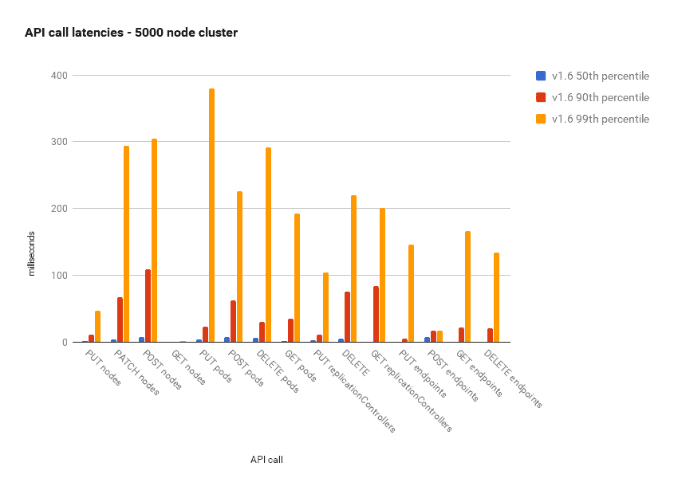

# 滚动更新、可伸缩性和配额

在本章中，我们将探讨 Kubernetes 提供的自动 Pod 可伸缩性，以及它如何影响滚动更新，以及它如何与配额交互。我们将涉及重要的供应主题，以及如何选择和管理集群的大小。最后，我们将介绍 Kubernetes 团队如何测试 5000 节点集群的极限。以下是我们将涵盖的主要内容：

+   水平 Pod 自动缩放器

+   使用自动缩放执行滚动更新

+   使用配额和限制处理稀缺资源

+   推动 Kubernetes 性能的边界

在本章结束时，您将能够规划一个大规模的集群，经济地进行供应，并就性能、成本和可用性之间的各种权衡做出明智的决策。您还将了解如何设置水平 Pod 自动缩放，并聪明地使用资源配额，让 Kubernetes 自动处理体积的间歇性波动。

# 水平 Pod 自动缩放

Kubernetes 可以监视您的 Pod，并在 CPU 利用率或其他指标超过阈值时对其进行扩展。自动缩放资源指定了细节（CPU 百分比，检查频率），相应的自动缩放控制器会调整副本的数量，如果需要的话。

以下图表说明了不同参与者及其关系：

！[](Images/d2b4b9da-15eb-42e9-b9da-71eb36db89b1.png)

正如您所看到的，水平 Pod 自动缩放器不会直接创建或销毁 Pod。相反，它依赖于复制控制器或部署资源。这非常聪明，因为您不需要处理自动缩放与复制控制器或部署尝试扩展 Pod 数量而不知道自动缩放器的努力之间的冲突。

自动缩放器会自动执行我们以前必须自己执行的操作。如果没有自动缩放器，如果我们有一个副本控制器，副本设置为`3`，但我们确定基于平均 CPU 利用率实际上需要`4`，那么我们将把副本控制器从`3`更新到`4`，并继续手动监视所有 Pod 中的 CPU 利用率。自动缩放器会为我们完成这项工作。

# 声明水平 Pod 自动缩放器

要声明水平 Pod 自动缩放器，我们需要一个复制控制器或部署，以及一个自动缩放资源。这是一个简单的复制控制器，配置为维护三个`nginx` Pod：

```
apiVersion: v1 
kind: ReplicationController 
metadata: 
   name: nginx 
spec: 
   replicas: 3 
   template: 
     metadata: 
       labels: 
         run: nginx 
     spec: 
       containers: 
       - name: nginx 
         image: nginx 
         ports: 
         - containerPort: 80 
```

`autoscaling`资源引用了`scaleTargetRef`中的 NGINX 复制控制器：

```
apiVersion: autoscaling/v1 
kind: HorizontalPodAutoscaler 
metadata: 
  name: nginx 
  namespace: default 
spec: 
  maxReplicas: 4 
  minReplicas: 2 
  targetCPUUtilizationPercentage: 90 
  scaleTargetRef: 
    apiVersion: v1 
    kind: ReplicationController 
    name: nginx 
```

`minReplicas`和`maxReplicas`指定了扩展的范围。这是为了避免因某些问题而发生的失控情况。想象一下，由于某个错误，每个 pod 立即使用 100%的 CPU，而不考虑实际负载。如果没有`maxReplicas`限制，Kubernetes 将不断创建更多的 pod，直到耗尽所有集群资源。如果我们在具有自动缩放 VM 的云环境中运行，那么我们将产生巨大的成本。这个问题的另一面是，如果没有`minReplicas`并且活动出现了停滞，那么所有的 pod 都可能被终止，当新的请求进来时，所有的 pod 都将被重新创建和调度。如果存在开关型活动模式，那么这个循环可能会重复多次。保持最小数量的副本运行可以平滑这种现象。在前面的例子中，`minReplicas`设置为`2`，`maxReplicas`设置为`4`。Kubernetes 将确保始终有`2`到`4`个 NGINX 实例在运行。

**目标 CPU**利用率百分比是一个冗长的词。让我们把它缩写为**TCUP**。您可以指定一个像 80%这样的单个数字。如果平均负载在 TCUP 周围徘徊，这可能会导致不断的抖动。Kubernetes 将频繁地在增加更多副本和删除副本之间交替。这通常不是期望的行为。为了解决这个问题，您可以为扩展或缩减指定延迟。`kube-controller-manager`有两个标志来支持这一点：

+   `--horizontal-pod-autoscaler-downscale-delay`：此选项的值是一个持续时间，指定了在当前操作完成后，自动缩放器必须等待多长时间才能执行另一个缩减操作。默认值为 5 分钟（5m0s）。

+   `--horizontal-pod-autoscaler-upscale-delay`：此选项的值是一个持续时间，指定了在当前操作完成后，自动缩放器必须等待多长时间才能执行另一个扩展操作。默认值为 3 分钟（3m0s）。

# 自定义指标

CPU 利用率是一个重要的指标，用于判断是否应该扩展受到过多请求的 Pod，或者它们是否大部分处于空闲状态并且可以缩小规模。但是 CPU 并不是唯一的，有时甚至不是最好的指标。内存可能是限制因素，还有更专业的指标，例如 Pod 内部磁盘队列的深度、请求的平均延迟或服务超时的平均次数。

水平 Pod 自定义指标在 1.2 版本中作为 alpha 扩展添加。在 1.6 版本中，它们升级为 beta 状态。现在可以根据多个自定义指标自动调整 Pod 的规模。自动缩放器将评估所有指标，并根据所需的最大副本数量进行自动缩放，因此会尊重所有指标的要求。

# 使用自定义指标

使用自定义指标的水平 Pod 自动缩放器在启动集群时需要进行一些配置。首先，您需要启用 API 聚合层。然后，您需要注册您的资源指标 API 和自定义指标 API。Heapster 提供了一个资源指标 API 的实现，您可以使用。只需使用`--api-server`标志启动 Heapster，并将其设置为`true`。您需要运行一个单独的服务器来公开自定义指标 API。一个很好的起点是这个：[`github.com/kubernetes-incubator/custom-metrics-apiserver`](https://github.com/kubernetes-incubator/custom-metrics-apiserver)。

下一步是使用以下标志启动`kube-controller-manager`：

```
--horizontal-pod-autoscaler-use-rest-clients=true
--kubeconfig <path-to-kubeconfig> OR --master <ip-address-of-apiserver>  
```

如果同时指定了`--master`标志和`--kubeconfig`标志，则`--master`标志将覆盖`--kubeconfig`标志。这些标志指定了 API 聚合层的位置，允许控制器管理器与 API 服务器通信。

在 Kubernetes 1.7 中，Kubernetes 提供的标准聚合层与`kube-apiserver`一起运行，因此可以使用以下命令找到目标 IP 地址：

```
> kubectl get pods --selector k8s-app=kube-apiserver --namespace kube-system -o jsonpath='{.items[0].status.podIP}'  
```

# 使用 kubectl 进行自动缩放

`kubectl`可以使用标准的`create`命令并接受一个配置文件来创建自动缩放资源。但是`kubectl`还有一个特殊的命令`autoscale`，可以让您轻松地在一个命令中设置自动缩放器，而无需特殊的配置文件：

1.  首先，让我们启动一个复制控制器，确保有三个简单 Pod 的副本，这些 Pod 只运行一个无限的`bash-loop`：

```
apiVersion: v1 
kind: ReplicationController 
metadata: 
   name: bash-loop-rc 
spec: 
   replicas: 3 
   template: 
     metadata: 
       labels: 
         name: bash-loop-rc 
     spec: 
       containers: 
         - name: bash-loop 
           image: ubuntu 
           command: ["/bin/bash", "-c", "while true; do sleep 10;   
                      done"] 
```

1.  让我们创建一个复制控制器：

```
     > kubectl create -f bash-loop-rc.yaml
     replicationcontroller "bash-loop-rc" created 
```

1.  以下是生成的复制控制器：

```
     > kubectl get rc
     NAME              DESIRED   CURRENT   READY     AGE
     bash-loop-rc        3          3       3         1m  
```

1.  您可以看到所需和当前计数都是三，意味着有三个 pod 正在运行。让我们确保一下：

```
     > kubectl get pods
     NAME                     READY    STATUS    RESTARTS    AGE
     bash-loop-rc-8h59t        1/1     Running    0          50s
     bash-loop-rc-lsvtd        1/1     Running    0          50s
     bash-loop-rc-z7wt5        1/1     Running    0          50s  
```

1.  现在，让我们创建一个自动缩放器。为了使其有趣，我们将将最小副本数设置为 `4`，最大副本数设置为 `6`：

```
 > kubectl autoscale rc bash-loop-rc --min=4 --max=6 --cpu- percent=50
replicationcontroller "bash-loop-rc" autoscaled
```

1.  这是生成的水平 pod 自动缩放器（您可以使用 `hpa`）。它显示了引用的复制控制器、目标和当前 CPU 百分比，以及最小/最大 pod 数。名称与引用的复制控制器匹配：

```
 > kubectl get hpa
 NAME          REFERENCE    TARGETS  MINPODS  MAXPODS  REPLICAS  AGE bash-loop-rc  bash-loop-rc  50%     4        6         4        16m
```

1.  最初，复制控制器被设置为具有三个副本，但自动缩放器的最小值为四个 pod。这对复制控制器有什么影响？没错。现在所需的副本数是四个。如果平均 CPU 利用率超过 50％，则可能会增加到五个，甚至六个：

```
     > kubectl get rc
     NAME              DESIRED  CURRENT  READY    AGE
     bash-loop-rc       4       4        4        21m
```

1.  为了确保一切正常运行，让我们再看一下 pod。请注意，由于自动缩放，创建了一个新的 pod（17 分钟前）：

```
     > kubectl get pods
     NAME                READY   STATUS    RESTARTS   AGE
     bash-loop-rc-8h59t   1/1     Running   0         21m
     bash-loop-rc-gjv4k   1/1     Running   0         17m
     bash-loop-rc-lsvtd    1/1    Running   0         21m
     bash-loop-rc-z7wt5   1/1     Running   0         21m
```

1.  当我们删除水平 pod 自动缩放器时，复制控制器会保留最后所需的副本数（在这种情况下为四个）。没有人记得复制控制器是用三个副本创建的：

```
     > kubectl  delete hpa bash-loop-rc
     horizontalpodautoscaler "bash-loop-rc" deleted 
```

1.  正如您所看到的，即使自动缩放器消失，复制控制器也没有重置，仍然保持四个 pod：

```
     > kubectl get rc
     NAME              DESIRED   CURRENT   READY      AGE
     bash-loop-rc       4           4       4         28m
```

让我们尝试其他方法。如果我们创建一个新的水平 pod 自动缩放器，范围为 `2` 到 `6`，并且相同的 CPU 目标为 `50`％，会发生什么？

```
> kubectl autoscale rc bash-loop-rc --min=2 --max=6 --cpu-percent=50
    replicationcontroller "bash-loop-rc" autoscaled  
```

好吧，复制控制器仍然保持其四个副本，这在范围内：

```
> kubectl get rc
NAME           DESIRED   CURRENT   READY     AGE
bash-loop-rc   4         4         4         29m  
```

然而，实际 CPU 利用率为零，或接近零。副本计数应该已经缩减到两个副本，但由于水平 pod 自动缩放器没有从 Heapster 接收到 CPU 指标，它不知道需要缩减复制控制器中的副本数。

# 使用自动缩放进行滚动更新

滚动更新是管理大型集群的基石。Kubernetes 支持在复制控制器级别和使用部署进行滚动更新。使用复制控制器进行滚动更新与水平 pod 自动缩放器不兼容。原因是在滚动部署期间，会创建一个新的复制控制器，而水平 pod 自动缩放器仍然绑定在旧的复制控制器上。不幸的是，直观的 `kubectl rolling-update` 命令会触发复制控制器的滚动更新。

由于滚动更新是如此重要的功能，我建议您始终将水平 Pod 自动缩放器绑定到部署对象，而不是复制控制器或副本集。当水平 Pod 自动缩放器绑定到部署时，它可以设置部署规范中的副本，并让部署负责必要的底层滚动更新和复制。

这是我们用于部署`hue-reminders`服务的部署配置文件：

```
apiVersion: extensions/v1beta1 
kind: Deployment 
metadata: 
  name: hue-reminders 
spec: 
  replicas: 2   
  template: 
    metadata: 
      name: hue-reminders 
      labels: 
        app: hue-reminders 
    spec:     
      containers: 
      - name: hue-reminders 
        image: g1g1/hue-reminders:v2.2     
        ports: 
        - containerPort: 80  
```

为了支持自动缩放并确保我们始终有`10`到`15`个实例在运行，我们可以创建一个`autoscaler`配置文件：

```
apiVersion: autoscaling/v1 
 kind: HorizontalPodAutoscaler 
 metadata: 
   name: hue-reminders 
   namespace: default 
 spec: 
   maxReplicas: 15 
   minReplicas: 10 
   targetCPUUtilizationPercentage: 90 
   scaleTargetRef: 
     apiVersion: v1 
     kind: Deployment 
     name: hue-reminders 
```

`scaleTargetRef`字段的`kind`现在是`Deployment`，而不是`ReplicationController`。这很重要，因为我们可能有一个同名的复制控制器。为了消除歧义并确保水平 Pod 自动缩放器绑定到正确的对象，`kind`和`name`必须匹配。

或者，我们可以使用`kubectl autoscale`命令：

```
> kubectl autoscale deployment hue-reminders --min=10--max=15
--cpu-percent=90  
```

# 处理稀缺资源的限制和配额

随着水平 Pod 自动缩放器动态创建 pod，我们需要考虑如何管理我们的资源。调度很容易失控，资源的低效使用是一个真正的问题。有几个因素可以以微妙的方式相互作用：

+   整个集群的容量

+   每个节点的资源粒度

+   按命名空间划分工作负载

+   DaemonSets

+   StatefulSets

+   亲和性、反亲和性、污点和容忍

首先，让我们了解核心问题。Kubernetes 调度器在调度 pod 时必须考虑所有这些因素。如果存在冲突或许多重叠的要求，那么 Kubernetes 可能会在安排新的 pod 时遇到问题。例如，一个非常极端但简单的情况是，一个守护进程集在每个节点上运行一个需要 50%可用内存的 pod。现在，Kubernetes 无法安排任何需要超过 50%内存的 pod，因为守护进程集 pod 具有优先级。即使您提供新节点，守护进程集也会立即占用一半的内存。

Stateful sets 类似于守护程序集，因为它们需要新节点来扩展。向 Stateful set 添加新成员的触发器是数据的增长，但影响是从 Kubernetes 可用于调度其他成员的池中获取资源。在多租户情况下，嘈杂的邻居问题可能会在供应或资源分配上出现。您可能会在命名空间中精确地计划不同 pod 和它们的资源需求之间的比例，但您与来自其他命名空间的邻居共享实际节点，甚至可能无法看到。

大多数这些问题可以通过谨慎使用命名空间资源配额和对跨多个资源类型（如 CPU、内存和存储）的集群容量进行仔细管理来缓解。

# 启用资源配额

大多数 Kubernetes 发行版都支持开箱即用的资源配额。API 服务器的`--admission-control`标志必须将`ResourceQuota`作为其参数之一。您还必须创建一个`ResourceQuota`对象来强制执行它。请注意，每个命名空间最多只能有一个`ResourceQuota`对象，以防止潜在的冲突。这是由 Kubernetes 强制执行的。

# 资源配额类型

我们可以管理和控制不同类型的配额。这些类别包括计算、存储和对象。

# 计算资源配额

计算资源是 CPU 和内存。对于每个资源，您可以指定限制或请求一定数量。以下是与计算相关的字段列表。请注意，`requests.cpu`可以简单地指定为`cpu`，`requests.memory`可以简单地指定为 memory：

+   `limits.cpu`: 在非终端状态的所有 pod 中，CPU 限制的总和不能超过此值

+   `limits.memory`: 在非终端状态的所有 pod 中，内存限制的总和不能超过此值

+   `requests.cpu`: 在非终端状态的所有 pod 中，CPU 请求的总和不能超过此值

+   `requests.memory`: 在非终端状态的所有 pod 中，内存请求的总和不能超过此值

# 存储资源配额

存储资源配额类型有点复杂。您可以限制每个命名空间的两个实体：存储量和持久卷索赔的数量。但是，除了全局设置总存储配额或持久卷索赔总数之外，您还可以按`storage`类别设置。`storage`类别资源配额的表示法有点冗长，但它可以完成工作：

+   `requests.storage`: 在所有持久卷索赔中，存储请求的总和不能超过此值

+   `persistentvolumeclaims`: 可以存在于命名空间中的持久卷索赔的总数

+   `<storage-class>.storageclass.storage.k8s.io/requests.storage`: 与`storage-class-name`相关联的所有持久卷索赔中，存储请求的总和不能超过此值

+   `<storage-class>.storageclass.storage.k8s.io/persistentvolumeclaims`: 与`storage-class-name`相关联的所有持久卷索赔中，可以存在于命名空间中的持久卷索赔的总数

Kubernetes 1.8 还增加了对临时存储配额的 alpha 支持：

+   `requests.ephemeral-storage`: 在命名空间中的所有 Pod 中，本地临时存储请求的总和不能超过此值

+   `limits.ephemeral-storage`: 在命名空间中的所有 Pod 中，本地临时存储限制的总和不能超过此值

# 对象计数配额

Kubernetes 还有另一类资源配额，即 API 对象。我猜想目标是保护 Kubernetes API 服务器免受管理太多对象的影响。请记住，Kubernetes 在幕后做了很多工作。它经常需要查询多个对象来进行身份验证、授权，并确保操作不违反可能存在的许多策略。一个简单的例子是基于复制控制器的 Pod 调度。想象一下，您有 10 亿个复制控制器对象。也许您只有三个 Pod，大多数复制控制器都没有副本。但是，Kubernetes 将花费大量时间来验证这 10 亿个复制控制器确实没有其 Pod 模板的副本，并且它们不需要终止任何 Pod。这是一个极端的例子，但这个概念适用。太多的 API 对象意味着 Kubernetes 需要做很多工作。

可以限制的对象的超额有点零散。例如，可以限制复制控制器的数量，但不能限制副本集的数量，副本集几乎是复制控制器的改进版本，如果有太多副本集存在，它们可能会造成完全相同的破坏。

最明显的遗漏是命名空间。对命名空间的数量没有限制。由于所有限制都是针对命名空间的，因此通过创建太多的命名空间，可以轻松地压倒 Kubernetes，因为每个命名空间只有少量的 API 对象。

以下是所有支持的对象：

+   配置映射：可以存在于命名空间中的配置映射的总数。

+   持久卷索赔：可以存在于命名空间中的持久卷索赔的总数。

+   Pods：可以存在于命名空间中的非终端状态的 Pod 的总数。如果`status.phase`在（`Failed`，`Succeeded`）中为`true`，则 Pod 处于终端状态。

+   复制控制器：可以存在于命名空间中的复制控制器的总数。

+   资源配额：可以存在于命名空间中的资源配额的总数。

+   服务：可以存在于命名空间中的服务的总数。

+   服务负载均衡器：可以存在于命名空间中的负载均衡器服务的总数。

+   服务节点端口：可以存在于命名空间中的节点端口服务的总数。

+   秘密：可以存在于命名空间中的秘密的总数。

# 配额范围

一些资源，如 Pod，可能处于不同的状态，为这些不同的状态设置不同的配额是有用的。例如，如果有许多正在终止的 Pod（这在滚动更新期间经常发生），即使总数超过配额，也可以创建更多的 Pod。这可以通过仅将`pod`对象`计数配额`应用于`非终止`的 Pod 来实现。以下是现有的范围：

+   终止：匹配`spec.activeDeadlineSeconds >= 0`的 Pod。

+   非终止：匹配`spec.activeDeadlineSeconds`为空的 Pod。

+   最佳努力：匹配具有最佳努力的服务质量的 Pod

+   非最佳努力：匹配没有最佳努力服务质量的 Pod

虽然`BestEffort`范围仅适用于 Pod，但`Terminating`，`NotTerminating`和`NotBestEffort`范围也适用于 CPU 和内存。这很有趣，因为资源配额限制可以阻止 Pod 终止。以下是支持的对象：

+   CPU

+   限制 CPU

+   限制内存

+   内存

+   `pods`

+   `requests.cpu`

+   `requests.memory`

# 请求和限制

在资源配额的背景下，请求和限制的含义是它要求容器明确指定目标属性。这样，Kubernetes 可以管理总配额，因为它确切地知道为每个容器分配了什么范围的资源。

# 使用配额

首先让我们创建一个`namespace`：

```
> kubectl create namespace ns
namespace "ns" created  
```

# 使用特定于命名空间的上下文

在与默认值不同的命名空间中工作时，我更喜欢使用`context`，这样我就不必为每个命令不断输入`--namespace=ns`：

```
> kubectl config set-context ns --cluster=minikube --user=minikube --namespace=ns
Context "ns" set.
> kubectl config use-context ns
Switched to context "ns".  
```

# 创建配额

1.  创建一个`compute quota`对象：

```
    apiVersion: v1
    kind: ResourceQuota
    metadata:
      name: compute-quota
    spec:
      hard:
        pods: "2"
        requests.cpu: "1"
        requests.memory: 20Mi
        limits.cpu: "2"
        limits.memory: 2Gi

    > kubectl create -f compute-quota.yaml
    resourcequota "compute-quota" created
```

1.  接下来，让我们添加一个`count quota`对象：

```
    apiVersion: v1
    kind: ResourceQuota
    metadata:
      name: object-counts-quota
    spec:
      hard:
        configmaps: "10"
        persistentvolumeclaims: "4"
        replicationcontrollers: "20"
        secrets: "10"
        services: "10"
        services.loadbalancers: "2"

    > kubectl create -f object-count-quota.yaml
    resourcequota "object-counts-quota" created 
```

1.  我们可以观察所有的配额：

```
    > kubectl get quota
    NAME                     AGE
    compute-resources        17m
    object-counts            15m
```

1.  我们甚至可以使用`describe`获取所有信息：

```
    > kubectl describe quota compute-quota
    Name:            compute-quota
    Namespace:       ns
    Resource         Used  Hard
    --------          ----     ----
    limits.cpu          0        2
    limits.memory       0        2Gi
    pods                0        2
    requests.cpu        0        1
    requests.memory     0        20Mi

    > kubectl describe quota object-counts-quota
    Name:                   object-counts-quota
    Namespace:              ns
    Resource                Used    Hard
    --------                ----    ----
    configmaps              0       10
    persistentvolumeclaims  0       4
    replicationcontrollers  0       20
    secrets                 1       10
    services                0       10
    services.loadbalancers  0       2
```

这个视图让我们立即了解集群中重要资源的全局资源使用情况，而无需深入研究太多单独的对象。

1.  让我们向我们的命名空间添加一个 NGINX 服务器：

```
    > kubectl run nginx --image=nginx --replicas=1 
    deployment "nginx" created
    > kubectl get pods
    No resources found.
```

1.  哦哦。没有找到资源。但是在创建`deployment`时没有错误。让我们检查一下`deployment`资源：

```
    > kubectl describe deployment nginx
    Name:                   nginx
    Namespace:              ns
    CreationTimestamp:      Sun, 11 Feb 2018 16:04:42 -0800
    Labels:                 run=nginx
    Annotations:            deployment.kubernetes.io/revision=1
    Selector:               run=nginx
    Replicas:               1 desired | 0 updated | 0 total | 0 available | 1 unavailable
    StrategyType:           RollingUpdate
    MinReadySeconds:        0
    RollingUpdateStrategy:  1 max unavailable, 1 max surge
    Pod Template:
      Labels:  run=nginx
      Containers:
       nginx:
        Image:        nginx
        Port:         <none>
        Environment:  <none>
        Mounts:       <none>
      Volumes:        <none>
    Conditions:
      Type                   Status  Reason
      ----                   ------     ------
      Available            True     MinimumReplicasAvailable
      ReplicaFailure       True     FailedCreate
    OldReplicaSets:       <none>
    NewReplicaSet:     nginx-8586cf59 (0/1 replicas created)
    Events:
      Type    Reason       Age  From                 Message
      ----        ------               ----  ----              -------
Normal  ScalingReplicaSet  16m  deployment-controller  Scaled up replica set nginx-8586cf59 to 1
```

在`conditions`部分就在那里。`ReplicaFailure`状态是`True`，原因是`FailedCreate`。您可以看到部署创建了一个名为`nginx-8586cf59`的新副本集，但它无法创建它应该创建的 pod。我们仍然不知道原因。让我们检查一下副本集：

```
    > kubectl describe replicaset nginx-8586cf59
    Name:           nginx-8586cf59
    Namespace:      ns
    Selector:       pod-template-hash=41427915,run=nginx
    Labels:         pod-template-hash=41427915
                    run=nginx
    Annotations:    deployment.kubernetes.io/desired-replicas=1
                    deployment.kubernetes.io/max-replicas=2
                    deployment.kubernetes.io/revision=1
    Controlled By:  Deployment/nginx
    Replicas:       0 current / 1 desired
    Pods Status:    0 Running / 0 Waiting / 0 Succeeded / 0 Failed
    Conditions:
      Type             Status  Reason
      ----             ------  ------
      ReplicaFailure   True    FailedCreate
    Events:
      Type     Reason        Age                From                   Message
      ----     ------        ----               ----                   -------
      Warning  FailedCreate  17m (x8 over 22m)  replicaset-controller  (combined from similar events): Error creating: pods "nginx-8586cf59-sdwxj" is forbidden: failed quota: compute-quota: must specify limits.cpu,limits.memory,requests.cpu,requests.memory  
```

输出非常宽，所以它跨越了几行，但是消息非常清晰。由于命名空间中有计算配额，因此每个容器必须指定其 CPU、内存请求和限制。配额控制器必须考虑每个容器的计算资源使用情况，以确保总命名空间配额得到尊重。

好的。我们理解了问题，但如何解决呢？一种方法是为我们想要使用的每种 pod 类型创建一个专用的`deployment`对象，并仔细设置 CPU 和内存请求和限制。但如果我们不确定呢？如果有很多 pod 类型，我们不想管理一堆`deployment`配置文件呢？

另一个解决方案是在运行`deployment`时在命令行上指定限制：

```
    > kubectl run nginx \
      --image=nginx \
      --replicas=1 \
      --requests=cpu=100m,memory=4Mi \
      --limits=cpu=200m,memory=8Mi \
      --namespace=ns
```

这样做是有效的，但是通过大量参数动态创建部署是管理集群的一种非常脆弱的方式：

```
    > kubectl get pods
    NAME                     READY     STATUS    RESTARTS   AGE
    nginx-2199160687-zkc2h   1/1       Running   0          2m 
```

# 使用默认计算配额的限制范围

1.  更好的方法是指定默认的计算限制。输入限制范围。这是一个设置一些容器默认值的配置文件：

```
    apiVersion: v1
    kind: LimitRange
    metadata:
      name: limits
    spec:
      limits:
      - default:
          cpu: 200m
          memory: 6Mi
        defaultRequest:
          cpu: 100m
          memory: 5Mi
    type: Container 

    > kubectl create -f limits.yaml
    limitrange "limits" created  
```

1.  这是当前默认的`limits`：

```
> kubectl describe limits limitsName:  limits
Namespace:  ns
Type Resource Min Max Default Request Default Limit Max Limit/Request Ratio
----          --------        ---     ---     ---------------            -------------     -----------------------
Container cpu     -   -   100m         200m       -
Container memory    -       -      5Mi      6Mi                 -
```

1.  现在，让我们再次运行 NGINX，而不指定任何 CPU 或内存请求和限制。但首先，让我们删除当前的 NGINX 部署：

```
 > kubectl delete deployment nginx
 deployment "nginx" deleted
 > kubectl run nginx --image=nginx --replicas=1
 deployment "nginx" created
```

1.  让我们看看 Pod 是否已创建。是的，它已经创建了：

```
         > kubectl get pods
         NAME                   READY     STATUS    RESTARTS  AGE
         nginx-8586cf59-p4dp4   1/1       Running    0        16m
```

# 选择和管理集群容量

通过 Kubernetes 的水平 Pod 自动缩放、守护进程集、有状态集和配额，我们可以扩展和控制我们的 Pod、存储和其他对象。然而，最终，我们受限于 Kubernetes 集群可用的物理（虚拟）资源。如果所有节点的容量都达到 100%，您需要向集群添加更多节点。没有其他办法。Kubernetes 将无法扩展。另一方面，如果您的工作负载非常动态，那么 Kubernetes 可以缩小您的 Pod，但如果您不相应地缩小节点，您仍然需要支付额外的容量费用。在云中，您可以停止和启动实例。

# 选择您的节点类型

最简单的解决方案是选择一个已知数量的 CPU、内存和本地存储的单一节点类型。但这通常不是最有效和成本效益的解决方案。这使得容量规划变得简单，因为唯一的问题是需要多少个节点。每当添加一个节点，就会向集群添加已知数量的 CPU 和内存，但大多数 Kubernetes 集群和集群内的组件处理不同的工作负载。我们可能有一个流处理管道，许多 Pod 在一个地方接收一些数据并对其进行处理。这种工作负载需要大量 CPU，可能需要大量内存，也可能不需要。其他组件，如分布式内存缓存，需要大量内存，但几乎不需要 CPU。其他组件，如 Cassandra 集群，需要每个节点连接多个 SSD 磁盘。

对于每种类型的节点，您应考虑适当的标记和确保 Kubernetes 调度设计为在该节点类型上运行的 Pod。

# 选择您的存储解决方案

存储是扩展集群的重要因素。有三种可扩展的存储解决方案：

+   自定义解决方案

+   使用您的云平台存储解决方案

+   使用集群外解决方案

当您使用自定义解决方案时，在 Kubernetes 集群中安装某种存储解决方案。优点是灵活性和完全控制，但您必须自行管理和扩展。

当您使用云平台存储解决方案时，您可以获得很多开箱即用的功能，但您失去了控制，通常需要支付更多费用，并且根据服务的不同，您可能会被锁定在该提供商那里。

当你使用集群外的解决方案时，数据传输的性能和成本可能会更大。通常情况下，如果你需要与现有系统集成，你会选择这个选项。

当然，大型集群可能会有来自所有类别的多个数据存储。这是你必须做出的最关键的决定之一，你的存储需求可能会随着时间的推移而发生变化和演变。

# 权衡成本和响应时间

如果金钱不是问题，你可以过度配置你的集群。每个节点都将拥有最佳的硬件配置，你将拥有比处理工作负载所需更多的节点，以及大量可用的存储空间。猜猜？金钱总是一个问题！

当你刚开始并且你的集群处理的流量不多时，你可能会通过过度配置来解决问题。即使大部分时间只需要两个节点，你可能只运行五个节点。将一切乘以 1,000，如果你有成千上万台空闲机器和宠字节的空闲存储，有人会来问问题。

好吧。所以，你仔细测量和优化，你得到了每个资源的 99.99999%利用率。恭喜，你刚创造了一个系统，它无法处理额外的负载或单个节点的故障，而不会丢弃请求或延迟响应。

你需要找到一个折中的方法。了解你的工作负载的典型波动，并考虑过剩容量与减少响应时间或处理能力之间的成本效益比。

有时，如果你有严格的可用性和可靠性要求，你可以通过设计在系统中构建冗余来过度配置。例如，你希望能够在没有停机和没有明显影响的情况下热插拔失败的组件。也许你甚至不能失去一笔交易。在这种情况下，你将为所有关键组件提供实时备份，这种额外的容量可以用来缓解临时波动，而无需任何特殊操作。

# 有效地使用多个节点配置

有效的容量规划需要你了解系统的使用模式以及每个组件可以处理的负载。这可能包括系统内部产生的大量数据流。当你对典型的工作负载有很好的理解时，你可以查看工作流程以及哪些组件处理负载的哪些部分。然后你可以计算 Pod 的数量和它们的资源需求。根据我的经验，有一些相对固定的工作负载，一些可以可预测变化的工作负载（比如办公时间与非办公时间），然后你有一些完全疯狂的工作负载，表现得不稳定。你必须根据每个工作负载进行规划，并且你可以设计几个节点配置系列，用于安排与特定工作负载匹配的 Pod。

# 受益于弹性云资源

大多数云提供商都可以让你自动扩展实例，这是对 Kubernetes 水平 Pod 自动缩放的完美补充。如果你使用云存储，它也会在你无需做任何事情的情况下神奇地增长。然而，有一些需要注意的地方。

# 自动缩放实例

所有大型云提供商都已经实现了实例自动缩放。虽然有一些差异，但基于 CPU 利用率的扩展和缩减始终可用，有时也可以使用自定义指标。有时也提供负载均衡。你可以看到，这里与 Kubernetes 有一些重叠。如果你的云提供商没有适当的自动缩放和适当的控制，相对容易自己实现，这样你就可以监控集群资源使用情况并调用云 API 来添加或删除实例。你可以从 Kubernetes 中提取指标。

这是一个图表，显示了基于 CPU 负载监视器添加了两个新实例的情况。


# 注意你的云配额

在与云提供商合作时，一些最让人讨厌的事情是配额。我曾与四个不同的云提供商合作过（AWS，GCP，Azure 和阿里云），总会在某个时候受到配额的限制。配额的存在是为了让云提供商进行自己的容量规划（也是为了保护您免受意外启动 100 万个无法支付的实例），但从您的角度来看，这又是一个可能让您遇到麻烦的事情。想象一下，您设置了一个像魔术一样工作的美丽的自动扩展系统，突然当您达到 100 个节点时，系统不再扩展。您很快发现自己被限制在 100 个节点，并且打开了一个支持请求来增加配额。然而，配额请求必须由人员批准，这可能需要一两天的时间。与此同时，您的系统无法处理负载。

# 谨慎管理区域

云平台按区域和可用性区域组织。某些服务和机器配置仅在某些区域可用。云配额也是在区域级别管理的。区域内数据传输的性能和成本要比跨区域低得多（通常是免费）。在规划您的集群时，您应该仔细考虑您的地理分布策略。如果您需要在多个区域运行您的集群，您可能需要做出一些关于冗余、可用性、性能和成本的艰难决定。

# 考虑 Hyper.sh（和 AWS Fargate）

`Hyper.sh`是一个容器感知的托管服务。您只需启动容器。该服务负责分配硬件。容器在几秒钟内启动。您永远不需要等待几分钟来获取新的虚拟机。Hypernetes 是在 Hyper.sh 上的 Kubernetes，它完全消除了扩展节点的需要，因为在您看来根本没有节点。只有容器（或 Pod）。

在下图中，您可以看到右侧的**Hyper 容器**直接在多租户裸金属容器云上运行：


AWS 最近发布了 Fargate，类似地将底层实例抽象化，并允许您在云中安排容器。与 EKS 结合使用，可能成为部署 Kubernetes 的最流行方式。

# 使用 Kubernetes 推动信封

在本节中，我们将看到 Kubernetes 团队如何将 Kubernetes 推向极限。这些数字相当说明问题，但一些工具和技术，如 Kubemark，是巧妙的，您甚至可以使用它们来测试您的集群。在野外，有一些拥有 3,000 个节点的 Kubernetes 集群。在 CERN，OpenStack 团队实现了每秒 2 百万次请求：

[`superuser.openstack.org/articles/scaling-magnum-and-kubernetes-2-million-requests-per-second/`](http://superuser.openstack.org/articles/scaling-magnum-and-kubernetes-2-million-requests-per-second/)。

Mirantis 在其扩展实验室进行了性能和扩展测试，部署了 5,000 个 Kubernetes 节点（在虚拟机中）在 500 台物理服务器上。

有关 Mirantis 的更多详细信息，请参阅：[`bit.ly/2oijqQY`](http://bit.ly/2oijqQY)。

OpenAI 将其机器学习 Kubernetes 集群扩展到 2,500 个节点，并学到了一些宝贵的经验教训，比如注意日志代理的查询负载，并将事件存储在单独的`etcd`集群中：

[`blog.openai.com/scaling-kubernetes-to-2500-nodes/`](https://blog.openai.com/scaling-kubernetes-to-2500-nodes/)

在本节结束时，您将欣赏到改进大规模 Kubernetes 所需的努力和创造力，您将了解单个 Kubernetes 集群的极限以及预期的性能，您将深入了解一些工具和技术，可以帮助您评估自己的 Kubernetes 集群的性能。

# 改进 Kubernetes 的性能和可扩展性

Kubernetes 团队在 Kubernetes 1.6 中大力专注于性能和可扩展性。当 Kubernetes 1.2 发布时，它支持 Kubernetes 服务水平目标内的最多 1,000 个节点的集群。Kubernetes 1.3 将该数字增加到 2,000 个节点，而 Kubernetes 1.6 将其提高到惊人的 5,000 个节点每个集群。我们稍后会详细介绍这些数字，但首先让我们来看看 Kubernetes 是如何实现这些令人印象深刻的改进的。

# 在 API 服务器中缓存读取

Kubernetes 将系统状态保存在 etcd 中，这是非常可靠的，尽管不是超级快速的（尽管 etcd3 专门提供了巨大的改进，以便实现更大的 Kubernetes 集群）。各种 Kubernetes 组件在该状态的快照上操作，并不依赖于实时更新。这一事实允许在一定程度上以一些延迟换取吞吐量。所有快照都曾由 etcd 监视更新。现在，API 服务器具有用于更新状态快照的内存读取缓存。内存读取缓存由 etcd 监视更新。这些方案显著减少了 etcd 的负载，并增加了 API 服务器的整体吞吐量。

# Pod 生命周期事件生成器

增加集群中节点的数量对于水平扩展至关重要，但 Pod 密度也至关重要。Pod 密度是 Kubelet 在一个节点上能够有效管理的 Pod 数量。如果 Pod 密度低，那么你就不能在一个节点上运行太多的 Pod。这意味着你可能无法从更强大的节点（每个节点的 CPU 和内存更多）中受益，因为 Kubelet 将无法管理更多的 Pod。另一种选择是强迫开发人员妥协他们的设计，并创建粗粒度的 Pod，每个 Pod 执行更多的工作。理想情况下，Kubernetes 在 Pod 粒度方面不应该强迫你的决定。Kubernetes 团队非常了解这一点，并投入了大量工作来改善 Pod 密度。

在 Kubernetes 1.1 中，官方（经过测试和宣传）的数量是每个节点 30 个 Pod。我实际上在 Kubernetes 1.1 上每个节点运行了 40 个 Pod，但我付出了过多的 kubelet 开销，这从工作 Pod 中窃取了 CPU。在 Kubernetes 1.2 中，这个数字跳升到每个节点 100 个 Pod。

Kubelet 以自己的 go 例程不断轮询容器运行时，以获取每个 pod 的状态。这给容器运行时带来了很大的压力，因此在性能高峰期会出现可靠性问题，特别是 CPU 利用率方面。解决方案是**Pod 生命周期事件生成器**（**PLEG**）。PLEG 的工作方式是列出所有 pod 和容器的状态，并将其与先前的状态进行比较。这只需要一次，就可以对所有的 pod 和容器进行比较。然后，通过将状态与先前的状态进行比较，PLEG 知道哪些 pod 需要再次同步，并只调用这些 pod。这一变化导致 Kubelet 和容器运行时的 CPU 使用率显著降低了四倍。它还减少了轮询周期，提高了响应性。

以下图表显示了 Kubernetes 1.1 和 Kubernetes 1.2 上**120 个 pod 的 CPU 利用率**。您可以清楚地看到 4 倍的因素：


# 使用协议缓冲区对 API 对象进行序列化

API 服务器具有 REST API。REST API 通常使用 JSON 作为其序列化格式，Kubernetes API 服务器也不例外。然而，JSON 序列化意味着将 JSON 编组和解组为本机数据结构。这是一个昂贵的操作。在大规模的 Kubernetes 集群中，许多组件需要频繁查询或更新 API 服务器。所有这些 JSON 解析和组合的成本很快就会累积起来。在 Kubernetes 1.3 中，Kubernetes 团队添加了一个高效的协议缓冲区序列化格式。JSON 格式仍然存在，但 Kubernetes 组件之间的所有内部通信都使用协议缓冲区序列化格式。

# etcd3

Kubernetes 在 Kubernetes 1.6 中从 etcd2 切换到 etcd3。这是一件大事。由于 etcd2 的限制，尤其是与 watch 实现相关的限制，将 Kubernetes 扩展到 5000 个节点是不可能的。Kubernetes 的可扩展性需求推动了 etcd3 的许多改进，因为 CoreOS 将 Kubernetes 作为一个衡量标准。一些重要的项目如下：

+   GRPC 而不是 REST-etcd2 具有 REST API，etcd3 具有 gRPC API（以及通过 gRPC 网关的 REST API）。在 gRPC 基础上的 http/2 协议可以使用单个 TCP 连接来处理多个请求和响应流。

+   租约而不是 TTL-etcd2 使用**生存时间**（**TTL**）来过期键，而 etcd3 使用带有 TTL 的租约，多个键可以共享同一个键。这显著减少了保持活动的流量。

+   etcd3 的 watch 实现利用了 GRPC 双向流，并维护单个 TCP 连接以发送多个事件，这至少减少了一个数量级的内存占用。

+   使用 etcd3，Kubernetes 开始将所有状态存储为 protobug，这消除了许多浪费的 JSON 序列化开销。

# 其他优化

Kubernetes 团队进行了许多其他优化：

+   优化调度程序（导致调度吞吐量提高了 5-10 倍）

+   将所有控制器切换到新的推荐设计，使用共享通知器，这减少了控制器管理器的资源消耗-有关详细信息，请参阅此文档[`github.com/kubernetes/community/blob/master/contributors/devel/controllers.md`](https://github.com/kubernetes/community/blob/master/contributors/devel/controllers.md)

+   优化 API 服务器中的单个操作（转换、深拷贝、补丁）

+   减少 API 服务器中的内存分配（这对 API 调用的延迟有显著影响）

# 测量 Kubernetes 的性能和可伸缩性

为了提高性能和可伸缩性，您需要清楚地知道您想要改进什么，以及如何去衡量这些改进。您还必须确保在追求性能和可伸缩性的过程中不违反基本属性和保证。我喜欢性能改进的地方在于它们通常可以免费为您带来可伸缩性的改进。例如，如果一个 pod 需要节点的 50% CPU 来完成其工作，而您改进了性能，使得该 pod 只需要 33% 的 CPU 就能完成相同的工作，那么您可以在该节点上突然运行三个 pod 而不是两个，从而将集群的可伸缩性整体提高了 50%（或者将成本降低了 33%）。

# Kubernetes 的 SLO

Kubernetes 有**服务水平目标**（**SLOs**）。在尝试改进性能和可伸缩性时，必须遵守这些保证。Kubernetes 对 API 调用有一秒的响应时间。那是 1,000 毫秒。它实际上在大多数情况下实现了一个数量级的更快响应时间。

# 测量 API 的响应速度

API 有许多不同的端点。没有简单的 API 响应性数字。每个调用都必须单独测量。此外，由于系统的复杂性和分布式特性，更不用说网络问题，结果可能会有很大的波动。一个可靠的方法是将 API 测量分成单独的端点，然后随着时间的推移进行大量测试，并查看百分位数（这是标准做法）。

使用足够的硬件来管理大量对象也很重要。Kubernetes 团队在这次测试中使用了一个 32 核心、120GB 的虚拟机作为主节点。

下图描述了 Kubernetes 1.3 各种重要 API 调用延迟的 50th、90th 和 99th 百分位数。你可以看到，90th 百分位数非常低，低于 20 毫秒。甚至对于`DELETE` pods 操作，99th 百分位数也低于 125 毫秒，对于其他所有操作也低于 100 毫秒：


另一类 API 调用是 LIST 操作。这些调用更加昂贵，因为它们需要在大型集群中收集大量信息，组成响应，并发送可能很大的响应。这就是性能改进，比如内存读取缓存和协议缓冲区序列化真正发挥作用的地方。响应时间理所当然地大于单个 API 调用，但仍远低于一秒（1000 毫秒）的 SLO。


这很好，但是看看 Kubernetes 1.6 在一个 5000 个节点的集群上的 API 调用延迟：



# 衡量端到端的 Pod 启动时间

大型动态集群最重要的性能特征之一是端到端的 Pod 启动时间。Kubernetes 一直在创建、销毁和调度 Pod。可以说，Kubernetes 的主要功能是调度 Pod。

在下图中，您可以看到 Pod 启动时间比 API 调用不太波动。这是有道理的，因为有很多工作需要做，比如启动一个不依赖于集群大小的运行时的新实例。在拥有 1,000 个节点的 Kubernetes 1.2 上，启动 Pod 的 99th 百分位端到端时间不到 3 秒。在 Kubernetes 1.3 上，启动 Pod 的 99th 百分位端到端时间略高于 2.5 秒。值得注意的是，时间非常接近，但在拥有 2,000 个节点的 Kubernetes 1.3 上，比拥有 1,000 个节点的集群稍微好一点：


Kubernetes 1.6 将其提升到了下一个级别，并在更大的集群上表现得更好：


# 在规模上测试 Kubernetes

拥有数千个节点的集群是昂贵的。即使像 Kubernetes 这样得到 Google 和其他行业巨头支持的项目，仍然需要找到合理的测试方法，而不会让自己破产。

Kubernetes 团队每次发布都会在真实集群上运行全面的测试，以收集真实世界的性能和可伸缩性数据。然而，还需要一种轻量级和更便宜的方法来尝试潜在的改进，并检测回归。这就是 Kubemark。

# 介绍 Kubemark 工具

Kubemark 是一个运行模拟节点（称为空心节点）的 Kubernetes 集群，用于针对大规模（空心）集群运行轻量级基准测试。一些在真实节点上可用的 Kubernetes 组件，如 kubelet，被替换为空心 kubelet。空心 kubelet 模拟了真实 kubelet 的许多功能。空心 kubelet 实际上不会启动任何容器，也不会挂载任何卷。但从 Kubernetes 集群的角度来看 - 存储在 etcd 中的状态 - 所有这些对象都存在，您可以查询 API 服务器。空心 kubelet 实际上是带有注入的模拟 Docker 客户端的真实 kubelet，该客户端不执行任何操作。

另一个重要的空心组件是`hollow-proxy`，它模拟了 Kubeproxy 组件。它再次使用真实的 Kubeproxy 代码，具有一个不执行任何操作并避免触及 iptables 的模拟 proxier 接口。

# 设置 Kubemark 集群

Kubemark 集群利用了 Kubernetes 的强大功能。要设置 Kubemark 集群，请执行以下步骤：

1.  创建一个常规的 Kubernetes 集群，我们可以在其中运行`N hollow-nodes`。

1.  创建一个专用的 VM 来启动 Kubemark 集群的所有主要组件。

1.  在基本 Kubernetes 集群上安排`N 个空节点` pods。这些空节点被配置为与运行在专用 VM 上的 Kubemark API 服务器进行通信。

1.  通过在基本集群上安排并配置它们与 Kubemark API 服务器进行通信来创建附加的 pods。

GCP 上提供了完整的指南，网址为[`bit.ly/2nPMkwc`](http://bit.ly/2nPMkwc)。

# 将 Kubemark 集群与真实世界集群进行比较

Kubemark 集群的性能与真实集群的性能非常相似。对于 pod 启动的端到端延迟，差异可以忽略不计。对于 API 的响应性，差异较大，尽管通常不到两倍。然而，趋势完全相同：真实集群中的改进/退化在 Kubemark 中表现为类似百分比的下降/增加。

# 总结

在本章中，我们涵盖了许多与扩展 Kubernetes 集群相关的主题。我们讨论了水平 pod 自动缩放器如何根据 CPU 利用率或其他指标自动管理运行的 pod 数量，如何在自动缩放的情况下正确安全地执行滚动更新，以及如何通过资源配额处理稀缺资源。然后，我们转向了整体容量规划和管理集群的物理或虚拟资源。最后，我们深入探讨了将单个 Kubernetes 集群扩展到处理 5,000 个节点的真实示例。

到目前为止，您已经对 Kubernetes 集群面对动态和不断增长的工作负载时涉及的所有因素有了很好的理解。您有多种工具可供选择，用于规划和设计自己的扩展策略。

在下一章中，我们将深入探讨高级 Kubernetes 网络。Kubernetes 具有基于**通用网络接口**（**CNI**）的网络模型，并支持多个提供程序。
