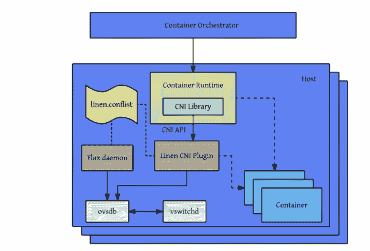

# 第十章：高级 Kubernetes 网络

在本章中，我们将研究网络这一重要主题。作为一个编排平台，Kubernetes 管理在不同机器（物理或虚拟）上运行的容器/Pod，并需要一个明确的网络模型。我们将讨论以下主题：

+   Kubernetes 网络模型

+   Kubernetes 支持的标准接口，如 EXEC、Kubenet，特别是 CNI

+   满足 Kubernetes 网络要求的各种网络解决方案

+   网络策略和负载均衡选项

+   编写自定义 CNI 插件

在本章结束时，您将了解 Kubernetes 对网络的处理方式，并熟悉标准接口、网络实现和负载均衡等方面的解决方案空间。甚至可以自己编写自己的 CNI 插件。

# 理解 Kubernetes 网络模型

Kubernetes 网络模型基于一个扁平的地址空间。集群中的所有 Pod 都可以直接相互通信。每个 Pod 都有自己的 IP 地址。无需配置任何 NAT。此外，同一 Pod 中的容器共享其 Pod 的 IP 地址，并且可以通过 localhost 相互通信。这个模型非常有见地，一旦设置好，就会极大地简化开发人员和管理员的生活。它特别容易将传统网络应用迁移到 Kubernetes。一个 Pod 代表一个传统节点，每个容器代表一个传统进程。

# Pod 内通信（容器到容器）

运行中的 Pod 始终被调度到一个（物理或虚拟）节点上。这意味着所有的容器都在同一个节点上运行，并且可以以各种方式相互通信，比如本地文件系统、任何 IPC 机制，或者使用 localhost 和众所周知的端口。不同的 Pod 之间不会发生端口冲突，因为每个 Pod 都有自己的 IP 地址，当 Pod 中的容器使用 localhost 时，它只适用于 Pod 的 IP 地址。因此，如果 Pod 1 中的容器 1 连接到 Pod 1 上的端口`1234`，而 Pod 1 上的容器 2 监听该端口，它不会与同一节点上运行的 Pod 2 中的另一个容器监听的端口`1234`发生冲突。唯一需要注意的是，如果要将端口暴露给主机，那么应该注意 Pod 到节点的亲和性。这可以通过多种机制来处理，比如 DaemonSet 和 Pod 反亲和性。

# Pod 间通信（Pod 到 Pod）

在 Kubernetes 中，Pod 被分配了一个网络可见的 IP 地址（不是私有的节点）。Pod 可以直接通信，无需网络地址转换、隧道、代理或任何其他混淆层的帮助。可以使用众所周知的端口号来进行无需配置的通信方案。Pod 的内部 IP 地址与其他 Pod 看到的外部 IP 地址相同（在集群网络内；不暴露给外部世界）。这意味着标准的命名和发现机制，如 DNS，可以直接使用。

# Pod 与服务之间的通信

Pod 可以使用它们的 IP 地址和众所周知的端口直接相互通信，但这需要 Pod 知道彼此的 IP 地址。在 Kubernetes 集群中，Pod 可能会不断被销毁和创建。服务提供了一个非常有用的间接层，因为即使实际响应请求的 Pod 集合不断变化，服务也是稳定的。此外，您会获得自动的高可用负载均衡，因为每个节点上的 Kube-proxy 负责将流量重定向到正确的 Pod：


# 外部访问

最终，一些容器需要从外部世界访问。Pod IP 地址在外部不可见。服务是正确的载体，但外部访问通常需要两次重定向。例如，云服务提供商负载均衡器是 Kubernetes 感知的，因此它不能直接将流量定向到运行可以处理请求的 Pod 的节点。相反，公共负载均衡器只是将流量定向到集群中的任何节点，该节点上的 Kube-proxy 将再次重定向到适当的 Pod，如果当前节点不运行必要的 Pod。

下图显示了右侧的外部负载均衡器所做的一切只是将流量发送到达到代理的所有节点，代理负责进一步路由，如果需要的话。


# Kubernetes 网络与 Docker 网络的对比

Docker 网络遵循不同的模型，尽管随着时间的推移，它已经趋向于 Kubernetes 模型。在 Docker 网络中，每个容器都有自己的私有 IP 地址，来自`172.xxx.xxx.xxx`地址空间，限定在自己的节点上。它可以通过它们自己的`172.xxx.xxx.xxx` IP 地址与同一节点上的其他容器进行通信。这对 Docker 来说是有意义的，因为它没有多个交互容器的 pod 的概念，所以它将每个容器建模为一个具有自己网络身份的轻量级 VM。请注意，使用 Kubernetes，运行在同一节点上的不同 pod 的容器不能通过 localhost 连接（除非暴露主机端口，这是不鼓励的）。整个想法是，一般来说，Kubernetes 可以在任何地方杀死和创建 pod，因此不同的 pod 一般不应该依赖于节点上可用的其他 pod。守护进程集是一个值得注意的例外，但 Kubernetes 网络模型旨在适用于所有用例，并且不为同一节点上不同 pod 之间的直接通信添加特殊情况。

Docker 容器如何跨节点通信？容器必须将端口发布到主机。这显然需要端口协调，因为如果两个容器尝试发布相同的主机端口，它们将互相冲突。然后容器（或其他进程）连接到被通道化到容器中的主机端口。一个很大的缺点是，容器无法自我注册到外部服务，因为它们不知道它们所在主机的 IP 地址。您可以通过在运行容器时将主机的 IP 地址作为环境变量传递来解决这个问题，但这需要外部协调并且使过程复杂化。

以下图表显示了 Docker 的网络设置。每个容器都有自己的 IP 地址；Docker 在每个节点上创建了`docker0`桥接：


# 查找和发现

为了使 pod 和容器能够相互通信，它们需要找到彼此。容器定位其他容器或宣布自己有几种方法。还有一些架构模式允许容器间间接交互。每种方法都有其优缺点。

# 自注册

我们已经多次提到自注册。让我们确切地理解它的含义。当一个容器运行时，它知道其 pod 的 IP 地址。每个希望对集群中的其他容器可访问的容器都可以连接到某个注册服务并注册其 IP 地址和端口。其他容器可以查询注册服务以获取所有已注册容器的 IP 地址和端口，并连接到它们。当一个容器被销毁（正常情况下），它将取消注册。如果一个容器非正常死亡，那么需要建立一些机制来检测。例如，注册服务可以定期 ping 所有已注册的容器，或者要求容器定期向注册服务发送保持活动的消息。

自注册的好处在于一旦通用注册服务就位（无需为不同目的定制），就无需担心跟踪容器。另一个巨大的好处是，容器可以采用复杂的策略，并决定在本地条件下暂时取消注册，比如如果一个容器很忙，不想在这一刻接收更多请求。这种智能和分散的动态负载平衡在全球范围内很难实现。缺点是注册服务是另一个非标准组件，容器需要了解它以便定位其他容器。

# 服务和端点

Kubernetes 服务可以被视为注册服务。属于服务的 pod 会根据其标签自动注册。其他 pod 可以查找端点以找到所有服务 pod，或者利用服务本身直接发送消息到服务，消息将被路由到其中一个后端 pod。尽管大多数情况下，pod 将消息直接发送到服务本身，由服务转发到其中一个后端 pod。

# 与队列松散耦合的连接

如果容器可以相互通信，而不知道它们的 IP 地址和端口，甚至不知道服务 IP 地址或网络名称呢？如果大部分通信可以是异步和解耦的呢？在许多情况下，系统可以由松散耦合的组件组成，这些组件不仅不知道其他组件的身份，甚至不知道其他组件的存在。队列有助于这种松散耦合的系统。组件（容器）监听来自队列的消息，响应消息，执行它们的工作，并在队列中发布有关进度、完成状态和错误的消息。队列有许多好处：

+   无需协调即可添加处理能力；只需添加更多监听队列的容器

+   通过队列深度轻松跟踪整体负载

+   通过对消息和/或主题进行版本控制，轻松同时运行多个组件的不同版本

+   通过使多个消费者以不同模式处理请求，轻松实现负载均衡以及冗余

队列的缺点包括：

+   需要确保队列提供适当的耐用性和高可用性，以免成为关键的单点故障。

+   容器需要使用异步队列 API（可以抽象化）

+   实现请求-响应需要在响应队列上进行有些繁琐的监听

总的来说，队列是大规模系统的一个很好的机制，可以在大型 Kubernetes 集群中使用，以简化协调工作。

# 与数据存储松散耦合的连接

另一种松散耦合的方法是使用数据存储（例如 Redis）存储消息，然后其他容器可以读取它们。虽然可能，但这不是数据存储的设计目标，结果通常是繁琐、脆弱，并且性能不佳。数据存储针对数据存储进行了优化，而不是用于通信。也就是说，数据存储可以与队列一起使用，其中一个组件将一些数据存储在数据存储中，然后发送一条消息到队列，表示数据已准备好进行处理。多个组件监听该消息，并且都开始并行处理数据。

# Kubernetes 入口

Kubernetes 提供了一个入口资源和控制器，旨在将 Kubernetes 服务暴露给外部世界。当然，您也可以自己做，但定义入口所涉及的许多任务在特定类型的入口（如 Web 应用程序、CDN 或 DDoS 保护器）的大多数应用程序中是常见的。您还可以编写自己的入口对象。

“入口”对象通常用于智能负载平衡和 TLS 终止。您可以从内置入口中受益，而不是配置和部署自己的 NGINX 服务器。如果您需要复习，请转到第六章，*使用关键的 Kubernetes 资源*，在那里我们讨论了带有示例的入口资源。

# Kubernetes 网络插件

Kubernetes 具有网络插件系统，因为网络如此多样化，不同的人希望以不同的方式实现它。Kubernetes 足够灵活，可以支持任何场景。主要的网络插件是 CNI，我们将深入讨论。但 Kubernetes 还配备了一个更简单的网络插件，称为 Kubenet。在我们详细讨论之前，让我们就 Linux 网络的基础知识达成一致（只是冰山一角）。

# 基本的 Linux 网络

默认情况下，Linux 具有单个共享网络空间。物理网络接口都可以在此命名空间中访问，但物理命名空间可以分成多个逻辑命名空间，这与容器网络非常相关。

# IP 地址和端口

网络实体通过其 IP 地址进行标识。服务器可以在多个端口上监听传入连接。客户端可以连接（TCP）或向其网络内的服务器发送数据（UDP）。

# 网络命名空间

命名空间将一堆网络设备分组在一起，以便它们可以在同一命名空间中到达其他服务器，但即使它们在物理上位于同一网络上，也不能到达其他服务器。通过桥接、交换机、网关和路由可以连接网络或网络段。

# 子网、网络掩码和 CIDR

在设计和维护网络时，网络段的细分非常有用。将网络划分为具有共同前缀的较小子网是一种常见做法。这些子网可以由表示子网大小（可以包含多少主机）的位掩码来定义。例如，`255.255.255.0`的子网掩码意味着前三个八位字节用于路由，只有 256（实际上是 254）个单独的主机可用。无类别域间路由（CIDR）表示法经常用于此目的，因为它更简洁，编码更多信息，并且还允许将来自多个传统类别（A、B、C、D、E）的主机组合在一起。例如，`172.27.15.0/24`表示前 24 位（三个八位字节）用于路由。

# 虚拟以太网设备

**虚拟以太网**（**veth**）设备代表物理网络设备。当您创建一个与物理设备连接的`veth`时，您可以将该`veth`（以及物理设备）分配到一个命名空间中，其他命名空间的设备无法直接访问它，即使它们在物理上位于同一个本地网络上。

# 桥接器

桥接器将多个网络段连接到一个聚合网络，以便所有节点可以彼此通信。桥接是在 OSI 网络模型的 L1（物理）和 L2（数据链路）层进行的。

# 路由

路由连接不同的网络，通常基于路由表，指示网络设备如何将数据包转发到其目的地。路由是通过各种网络设备进行的，如路由器、桥接器、网关、交换机和防火墙，包括常规的 Linux 框。

# 最大传输单元

**最大传输单元**（**MTU**）确定数据包的大小限制。例如，在以太网网络上，MTU 为 1500 字节。MTU 越大，有效载荷和标头之间的比率就越好，这是一件好事。缺点是最小延迟减少，因为您必须等待整个数据包到达，而且如果出现故障，您必须重新传输整个数据包。

# Pod 网络

以下是一个描述通过`veth0`在网络层面上描述 pod、主机和全局互联网之间关系的图表：


# Kubenet

回到 Kubernetes。Kubenet 是一个网络插件；它非常基础，只是创建一个名为`cbr0`的 Linux 桥接和为每个 pod 创建一个`veth`。云服务提供商通常使用它来设置节点之间的通信路由规则，或者在单节点环境中使用。`veth`对将每个 pod 连接到其主机节点，使用来自主机 IP 地址范围的 IP 地址。

# 要求

Kubenet 插件有以下要求：

+   必须为节点分配一个子网，以为其 pod 分配 IP 地址

+   版本 0.2.0 或更高版本需要标准的 CNI 桥接、`lo`和 host-local 插件

+   Kubelet 必须使用`--network-plugin=kubenet`参数运行

+   Kubelet 必须使用`--non-masquerade-cidr=<clusterCidr>`参数运行

# 设置 MTU

MTU 对于网络性能至关重要。Kubernetes 网络插件（如 Kubenet）会尽最大努力推断最佳 MTU，但有时它们需要帮助。如果现有的网络接口（例如 Docker 的`docker0`桥接）设置了较小的 MTU，则 Kubenet 将重用它。另一个例子是 IPSEC，由于 IPSEC 封装开销增加，需要降低 MTU，但 Kubenet 网络插件没有考虑到这一点。解决方案是避免依赖 MTU 的自动计算，只需通过`--network-plugin-mtu`命令行开关告诉 Kubelet 应该为网络插件使用什么 MTU，这个开关提供给所有网络插件。然而，目前只有 Kubenet 网络插件考虑了这个命令行开关。

# 容器网络接口（CNI）

CNI 既是一个规范，也是一组用于编写网络插件以配置 Linux 容器中的网络接口的库（不仅仅是 Docker）。该规范实际上是从 rkt 网络提案演变而来的。CNI 背后有很多动力，正在快速成为行业标准。一些使用 CNI 的组织有：

+   Kubernetes

+   Kurma

+   云原生

+   Nuage

+   红帽

+   Mesos

CNI 团队维护一些核心插件，但也有很多第三方插件对 CNI 的成功做出了贡献：

+   **Project Calico**：三层虚拟网络

+   **Weave**：多主机 Docker 网络

+   **Contiv 网络**：基于策略的网络

+   **Cilium**：用于容器的 BPF 和 XDP

+   **Multus**：一个多插件

+   **CNI-Genie**：通用 CNI 网络插件

+   **Flannel**：为 Kubernetes 设计的容器网络布局

+   **Infoblox**：企业级容器 IP 地址管理

# 容器运行时

CNI 为网络应用容器定义了插件规范，但插件必须插入提供一些服务的容器运行时中。在 CNI 的上下文中，应用容器是一个可寻址的网络实体（具有自己的 IP 地址）。对于 Docker，每个容器都有自己的 IP 地址。对于 Kubernetes，每个 pod 都有自己的 IP 地址，而 pod 是 CNI 容器，而不是 pod 内的容器。

同样，rkt 的应用容器类似于 Kubernetes 中的 pod，因为它们可能包含多个 Linux 容器。如果有疑问，只需记住 CNI 容器必须有自己的 IP 地址。运行时的工作是配置网络，然后执行一个或多个 CNI 插件，以 JSON 格式将网络配置传递给它们。

以下图表显示了一个容器运行时使用 CNI 插件接口与多个 CNI 插件进行通信：


# CNI 插件

CNI 插件的工作是将网络接口添加到容器网络命名空间，并通过`veth`对将容器桥接到主机。然后，它应通过 IPAM（IP 地址管理）插件分配 IP 地址并设置路由。

容器运行时（Docker，rkt 或任何其他符合 CRI 标准的运行时）将 CNI 插件作为可执行文件调用。插件需要支持以下操作：

+   将容器添加到网络

+   从网络中删除容器

+   报告版本

插件使用简单的命令行界面，标准输入/输出和环境变量。以 JSON 格式的网络配置通过标准输入传递给插件。其他参数被定义为环境变量：

+   `CNI_COMMAND`：指示所需操作的命令；`ADD`，`DEL`或`VERSION`。

+   `CNI_CONTAINERID`：容器 ID。

+   `CNI_NETNS`：网络命名空间文件的路径。

+   `*` `CNI_IFNAME`：要设置的接口名称；插件必须遵守此接口名称或返回一个`error`。

+   `*` `CNI_ARGS`：用户在调用时传入的额外参数。字母数字键值对由分号分隔，例如，`FOO=BAR;ABC=123`。

+   `CNI_PATH`：要搜索 CNI 插件可执行文件的路径列表。路径由操作系统特定的列表分隔符分隔，例如，在 Linux 上是`:`，在 Windows 上是`；`。

如果命令成功，插件将返回零退出代码，并且生成的接口（在`ADD`命令的情况下）将作为 JSON 流式传输到标准输出。这种低技术接口很聪明，因为它不需要任何特定的编程语言、组件技术或二进制 API。CNI 插件编写者也可以使用他们喜欢的编程语言。

使用`ADD`命令调用 CNI 插件的结果如下：

```
{
 "cniVersion": "0.3.0",
 "interfaces": [ (this key omitted by IPAM plugins)
 {
 "name": "<name>",
 "mac": "<MAC address>", (required if L2 addresses are meaningful)
 "sandbox": "<netns path or hypervisor identifier>" (required for container/hypervisor interfaces, empty/omitted for host interfaces)
 }
 ],
 "ip": [
 {
 "version": "<4-or-6>",
 "address": "<ip-and-prefix-in-CIDR>",
 "gateway": "<ip-address-of-the-gateway>", (optional)
 "interface": <numeric index into 'interfaces' list>
 },
 ...
 ],
 "routes": [ (optional)
 {
 "dst": "<ip-and-prefix-in-cidr>",
 "gw": "<ip-of-next-hop>" (optional)
 },
 ...
 ]
 "dns": {
 "nameservers": <list-of-nameservers> (optional)
 "domain": <name-of-local-domain> (optional)
 "search": <list-of-additional-search-domains> (optional)
 "options": <list-of-options> (optional)
 }
}
```

输入网络配置包含大量信息：`cniVersion`、名称、类型、`args`（可选）、`ipMasq`（可选）、`ipam`和`dns`。`ipam`和`dns`参数是具有自己指定键的字典。以下是网络配置的示例：

```
{
 "cniVersion": "0.3.0",
 "name": "dbnet",
 "type": "bridge",
 // type (plugin) specific
 "bridge": "cni0",
 "ipam": {
 "type": "host-local",
 // ipam specific
 "subnet": "10.1.0.0/16",
 "gateway": "10.1.0.1"
 },
 "dns": {
 "nameservers": [ "10.1.0.1" ]
 }
}  
```

请注意，可以添加额外的特定于插件的元素。在这种情况下，`bridge: cni0`元素是特定的`bridge`插件理解的自定义元素。

`CNI 规范`还支持网络配置列表，其中可以按顺序调用多个 CNI 插件。稍后，我们将深入研究一个完全成熟的 CNI 插件实现。

# Kubernetes 网络解决方案

网络是一个广阔的话题。有许多设置网络和连接设备、pod 和容器的方法。Kubernetes 对此不能有意见。对于 pod 的高级网络模型是 Kubernetes 规定的。在这个空间内，有许多有效的解决方案是可能的，具有不同环境的各种功能和策略。在本节中，我们将研究一些可用的解决方案，并了解它们如何映射到 Kubernetes 网络模型。

# 裸金属集群上的桥接

最基本的环境是一个只有 L2 物理网络的原始裸金属集群。您可以使用 Linux 桥设备将容器连接到物理网络。该过程非常复杂，需要熟悉低级 Linux 网络命令，如`brctl`、`ip addr`、`ip route`、`ip link`、`nsenter`等。如果您打算实施它，这篇指南可以作为一个很好的起点（搜索*使用 Linux 桥设备*部分）：[`blog.oddbit.com/2014/08/11/four-ways-to-connect-a-docker/`](http://blog.oddbit.com/2014/08/11/four-ways-to-connect-a-docker/)。

# Contiv

Contiv 是一个通用的容器网络插件，可以直接与 Docker、Mesos、Docker Swarm 以及当然 Kubernetes 一起使用，通过一个 CNI 插件。Contiv 专注于与 Kubernetes 自身网络策略对象有些重叠的网络策略。以下是 Contiv net 插件的一些功能：

+   支持 libnetwork 的 CNM 和 CNI 规范

+   功能丰富的策略模型，提供安全、可预测的应用部署

+   用于容器工作负载的最佳吞吐量

+   多租户、隔离和重叠子网

+   集成 IPAM 和服务发现

+   各种物理拓扑：

+   Layer2（VLAN）

+   Layer3（BGP）

+   覆盖（VXLAN）

+   思科 SDN 解决方案（ACI）

+   IPv6 支持

+   可扩展的策略和路由分发

+   与应用蓝图的集成，包括以下内容：

+   Docker-compose

+   Kubernetes 部署管理器

+   服务负载平衡内置东西向微服务负载平衡

+   用于存储、控制（例如，`etcd`/`consul`）、网络和管理流量的流量隔离

+   Contiv 具有许多功能和能力。由于其广泛的适用范围以及它适用于多个平台，我不确定它是否是 Kubernetes 的最佳选择。

# Open vSwitch

Open vSwitch 是一个成熟的基于软件的虚拟交换解决方案，得到许多大公司的认可。**Open Virtualization Network**（**OVN**）解决方案可以让您构建各种虚拟网络拓扑。它有一个专门的 Kubernetes 插件，但设置起来并不简单，正如这个指南所示：[`github.com/openvswitch/ovn-kubernetes`](https://github.com/openvswitch/ovn-kubernetes)。Linen CNI 插件可能更容易设置，尽管它不支持 OVN 的所有功能：[`github.com/John-Lin/linen-cni`](https://github.com/John-Lin/linen-cni)。这是 Linen CNI 插件的图表：



Open vSwitch 可以连接裸机服务器、虚拟机和 pod/容器，使用相同的逻辑网络。它实际上支持覆盖和底层模式。

以下是一些其关键特性：

+   标准的 802.1Q VLAN 模型，带有干线和接入端口

+   上游交换机上带或不带 LACP 的 NIC 绑定

+   NetFlow、sFlow(R)和镜像，以增加可见性

+   QoS（服务质量）配置，以及流量控制

+   Geneve、GRE、VXLAN、STT 和 LISP 隧道

+   802.1ag 连接故障管理

+   OpenFlow 1.0 加上许多扩展

+   具有 C 和 Python 绑定的事务配置数据库

+   使用 Linux 内核模块进行高性能转发

# Nuage 网络 VCS

Nuage 网络的**虚拟化云服务**（**VCS**）产品提供了一个高度可扩展的基于策略的**软件定义网络**（**SDN**）平台。这是一个建立在开源 Open vSwitch 数据平面之上的企业级产品，配备了基于开放标准构建的功能丰富的 SDN 控制器。

Nuage 平台使用覆盖层在 Kubernetes Pods 和非 Kubernetes 环境（VM 和裸金属服务器）之间提供无缝的基于策略的网络。Nuage 的策略抽象模型是针对应用程序设计的，使得声明应用程序的细粒度策略变得容易。该平台的实时分析引擎实现了对 Kubernetes 应用程序的可见性和安全监控。

此外，所有 VCS 组件都可以安装在容器中。没有特殊的硬件要求。

# Canal

Canal 是两个开源项目的混合体：Calico 和 Flannel。**Canal**这个名字是这两个项目名称的混成词。由 CoreOS 开发的 Flannel 专注于容器网络，**Calico**专注于网络策略。最初，它们是独立开发的，但用户希望将它们一起使用。目前，开源的 Canal 项目是一个部署模式，可以将这两个项目作为独立的 CNI 插件进行安装。由 Calico 创始人组建的 Tigera 现在正在引导这两个项目，并计划更紧密地集成，但自从他们发布了用于 Kubernetes 的安全应用连接解决方案后，重点似乎转向了为 Flannel 和 Calico 做出贡献，以简化配置和集成，而不是提供统一的解决方案。以下图表展示了 Canal 的当前状态以及它与 Kubernetes 和 Mesos 等容器编排器的关系：


请注意，与 Kubernetes 集成时，Canal 不再直接使用`etcd`，而是依赖于 Kubernetes API 服务器。

# 法兰绒

Flannel 是一个虚拟网络，为每个主机提供一个子网，用于容器运行时。它在每个主机上运行一个`flaneld`代理，该代理从存储在`etcd`中的保留地址空间中为节点分配子网。容器之间以及最终主机之间的数据包转发由多个后端之一完成。最常见的后端使用默认情况下通过端口`8285`进行的 TUN 设备上的 UDP 进行隧道传输（确保防火墙中已打开）。

以下图表详细描述了 Flannel 的各个组件、它创建的虚拟网络设备以及它们如何通过`docker0`桥与主机和 pod 进行交互。它还显示了数据包的 UDP 封装以及它们在主机之间的传输：


其他后端包括以下内容：

+   `vxlan`：使用内核 VXLAN 封装数据包。

+   `host-gw`：通过远程机器 IP 创建到子网的 IP 路由。请注意，这需要在运行 Flannel 的主机之间直接的二层连接。

+   `aws-vpc`：在 Amazon VPC 路由表中创建 IP 路由。

+   `gce`：在 Google 计算引擎网络中创建 IP 路由。

+   `alloc`：仅执行子网分配（不转发数据包）。

+   `ali-vpc`：在阿里云 VPC 路由表中创建 IP 路由。

# Calico 项目

Calico 是一个多功能的容器虚拟网络和网络安全解决方案。Calico 可以与所有主要的容器编排框架集成

和运行时：

+   Kubernetes（CNI 插件）

+   Mesos（CNI 插件）

+   Docker（libnework 插件）

+   OpenStack（Neutron 插件）

Calico 还可以在本地部署或在公共云上部署，具有完整的功能集。Calico 的网络策略执行可以针对每个工作负载进行专门化，并确保流量被精确控制，数据包始终从其源头到经过审查的目的地。Calico 可以自动将编排平台的网络策略概念映射到自己的网络策略。Kubernetes 网络策略的参考实现是 Calico。

# Romana

Romana 是一个现代的云原生容器网络解决方案。它在第 3 层操作，利用标准 IP 地址管理技术。整个网络可以成为隔离单元，因为 Romana 使用 Linux 主机创建网关和网络的路由。在第 3 层操作意味着不需要封装。网络策略作为分布式防火墙在所有端点和服务上执行。跨云平台和本地部署的混合部署更容易，因为无需配置虚拟覆盖网络。

新的 Romana 虚拟 IP 允许本地用户通过外部 IP 和服务规范在第 2 层 LAN 上公开服务。

Romana 声称他们的方法带来了显著的性能改进。以下图表显示了 Romana 如何消除与 VXLAN 封装相关的大量开销。


# Weave 网络

Weave 网络主要关注易用性和零配置。它在底层使用 VXLAN 封装和每个节点上的微型 DNS。作为开发人员，您在高抽象级别上操作。您为容器命名，Weave 网络让您连接并使用标准端口进行服务。这有助于您将现有应用程序迁移到容器化应用程序和微服务中。Weave 网络具有用于与 Kubernetes（和 Mesos）接口的 CNI 插件。在 Kubernetes 1.4 及更高版本上，您可以通过运行一个部署 DaemonSet 的单个命令将 Weave 网络集成到 Kubernetes 中。

```
kubectl apply -f https://git.io/weave-kube 
```

每个节点上的 Weave 网络 pod 将负责将您创建的任何新 pod 连接到 Weave 网络。Weave 网络支持网络策略 API，提供了一个完整而易于设置的解决方案。

# 有效使用网络策略

Kubernetes 网络策略是关于管理流向选定的 pod 和命名空间的网络流量。在部署和编排了数百个微服务的世界中，通常情况下是 Kubernetes，管理 pod 之间的网络和连接至关重要。重要的是要理解，它并不是主要的安全机制。如果攻击者可以访问内部网络，他们可能能够创建符合现有网络策略并与其他 pod 自由通信的自己的 pod。在前一节中，我们看了不同的 Kubernetes 网络解决方案，并侧重于容器网络接口。在本节中，重点是网络策略，尽管网络解决方案与如何在其之上实现网络策略之间存在着紧密的联系。

# 了解 Kubernetes 网络策略设计

网络策略是选择的 pod 之间以及其他网络端点之间如何通信的规范。`NetworkPolicy`资源使用标签选择 pod，并定义白名单规则，允许流量到达选定的 pod，除了给定命名空间的隔离策略允许的流量之外。

# 网络策略和 CNI 插件

网络策略和 CNI 插件之间存在复杂的关系。一些 CNI 插件同时实现了网络连接和网络策略，而其他一些只实现了其中一个方面，但它们可以与另一个实现了另一个方面的 CNI 插件合作（例如，Calico 和 Flannel）。

# 配置网络策略

网络策略是通过`NetworkPolicy`资源进行配置的。以下是一个示例网络策略：

```
apiVersion: networking.k8s.io/v1kind: NetworkPolicy 
metadata: 
 name: test-network-policy 
 namespace: default 
spec: 
 podSelector: 
  matchLabels: 
    role: db 
 ingress: 
  - from: 
     - namespaceSelector: 
        matchLabels: 
         project: awesome-project 
     - podSelector: 
        matchLabels: 
         role: frontend 
    ports: 
     - protocol: tcp 
       port: 6379 
```

# 实施网络策略

虽然网络策略 API 本身是通用的，并且是 Kubernetes API 的一部分，但实现与网络解决方案紧密耦合。这意味着在每个节点上都有一个特殊的代理或守门人，执行以下操作：

+   拦截进入节点的所有流量

+   验证其是否符合网络策略

+   转发或拒绝每个请求

Kubernetes 提供了通过 API 定义和存储网络策略的功能。执行网络策略由网络解决方案或与特定网络解决方案紧密集成的专用网络策略解决方案来完成。Calico 和 Canal 是这种方法的很好的例子。Calico 有自己的网络解决方案和网络策略解决方案，它们可以一起工作，但也可以作为 Canal 的一部分在 Flannel 之上提供网络策略执行。在这两种情况下，这两个部分之间有紧密的集成。以下图表显示了 Kubernetes 策略控制器如何管理网络策略以及节点上的代理如何执行它：


# 负载均衡选项

负载均衡是动态系统中的关键能力，比如 Kubernetes 集群。节点、虚拟机和 Pod 会不断变化，但客户端无法跟踪哪个个体可以处理他们的请求。即使他们可以，也需要管理集群的动态映射，频繁刷新它，并处理断开连接、无响应或者慢速节点的复杂操作。负载均衡是一个经过验证和深入理解的机制，它增加了一层间接性，将内部动荡隐藏在集群外部的客户端或消费者之外。外部和内部负载均衡器都有选项。您也可以混合使用两者。混合方法有其特定的优缺点，比如性能与灵活性。

# 外部负载均衡器

外部负载均衡器是在 Kubernetes 集群之外运行的负载均衡器。必须有一个外部负载均衡器提供商，Kubernetes 可以与其交互，以配置外部负载均衡器的健康检查、防火墙规则，并获取负载均衡器的外部 IP 地址。

以下图表显示了负载均衡器（在云中）、Kubernetes API 服务器和集群节点之间的连接。外部负载均衡器有关于哪些 Pod 运行在哪些节点上的最新信息，并且可以将外部服务流量引导到正确的 Pod。


# 配置外部负载均衡器

通过服务配置文件或直接通过 Kubectl 配置外部负载均衡器。我们使用`LoadBalancer`服务类型，而不是使用`ClusterIP`服务类型，后者直接将 Kubernetes 节点公开为负载均衡器。这取决于外部负载均衡器提供程序在集群中是否已正确安装和配置。Google 的 GKE 是最经过充分测试的提供程序，但其他云平台在其云负载均衡器之上提供了集成解决方案。

# 通过配置文件

以下是一个实现此目标的示例服务配置文件：

```
{ 
      "kind": "Service", 
      "apiVersion": "v1", 
      "metadata": { 
        "name": "example-service" 
      }, 
      "spec": { 
        "ports": [{ 
          "port": 8765, 
          "targetPort": 9376 
        }], 
        "selector": { 
          "app": "example" 
        }, 
        "type": "LoadBalancer" 
      } 
} 
```

# 通过 Kubectl

您还可以使用直接的`kubectl`命令来实现相同的结果：

```
> kubectl expose rc example --port=8765 --target-port=9376 \
--name=example-service --type=LoadBalancer  
```

使用`service`配置文件还是`kubectl`命令的决定通常取决于您设置其余基础设施和部署系统的方式。配置文件更具声明性，可以说更适合生产使用，因为您希望以一种有版本控制、可审计和可重复的方式来管理基础设施。

# 查找负载均衡器 IP 地址

负载均衡器将有两个感兴趣的 IP 地址。内部 IP 地址可在集群内部用于访问服务。集群外部的客户端将使用外部 IP 地址。为外部 IP 地址创建 DNS 条目是一个良好的做法。要获取这两个地址，请使用`kubectl describe`命令。`IP`将表示内部 IP 地址。`LoadBalancer ingress`将表示外部 IP 地址：

```
> kubectl describe services example-service
    Name:  example-service
    Selector:   app=example
    Type:     LoadBalancer
    IP:     10.67.252.103
    LoadBalancer Ingress: 123.45.678.9
    Port:     <unnamed> 80/TCP
    NodePort:   <unnamed> 32445/TCP
    Endpoints:    10.64.0.4:80,10.64.1.5:80,10.64.2.4:80
    Session Affinity: None
    No events.
```

# 保留客户端 IP 地址

有时，服务可能对客户端的源 IP 地址感兴趣。直到 Kubernetes 1.5 版本，这些信息是不可用的。在 Kubernetes 1.5 中，通过注释仅在 GKE 上可用的 beta 功能可以获取源 IP 地址。在 Kubernetes 1.7 中，API 添加了保留原始客户端 IP 的功能。

# 指定原始客户端 IP 地址保留

您需要配置服务规范的以下两个字段：

+   `service.spec.externalTrafficPolicy`：此字段确定服务是否应将外部流量路由到节点本地端点或集群范围的端点，这是默认设置。集群选项不会显示客户端源 IP，并可能将跳转到不同节点，但会很好地分散负载。本地选项保留客户端源 IP，并且只要服务类型为`LoadBalancer`或`NodePort`，就不会添加额外的跳转。其缺点是可能无法很好地平衡负载。

+   `service.spec.healthCheckNodePort`：此字段是可选的。如果使用，则服务健康检查将使用此端口号。默认值为分配节点端口。对于`LoadBalancer`类型的服务，如果其`externalTrafficPolicy`设置为`Local`，则会产生影响。

这是一个例子：

```
    {
      "kind": "Service",
      "apiVersion": "v1",
      "metadata": {
        "name": "example-service"
      },
      "spec": {
        "ports": [{
          "port": 8765,
          "targetPort": 9376
        }],
        "selector": {
          "app": "example"
        },
        "type": "LoadBalancer"
        "externalTrafficPolicy: "Local"
      }
    }  
```

# 即使在外部负载均衡中理解潜力

外部负载均衡器在节点级别运行；虽然它们将流量引导到特定的 pod，但负载分配是在节点级别完成的。这意味着如果您的服务有四个 pod，其中三个在节点 A 上，最后一个在节点 B 上，那么外部负载均衡器很可能会在节点 A 和节点 B 之间均匀分配负载。这将使节点 A 上的三个 pod 处理一半的负载（每个 1/6），而节点 B 上的单个 pod 将独自处理另一半的负载。未来可能会添加权重来解决这个问题。

# 服务负载均衡器

服务负载平衡旨在在 Kubernetes 集群内部传输内部流量，而不是用于外部负载平衡。这是通过使用`clusterIP`服务类型来实现的。可以通过使用`NodePort`服务类型直接公开服务负载均衡器，并将其用作外部负载均衡器，但它并不是为此用例而设计的。例如，诸如 SSL 终止和 HTTP 缓存之类的理想功能将不会很容易地可用。

以下图显示了服务负载均衡器（黄色云）如何将流量路由到其管理的后端 pod 之一（通过标签，当然）：


# 入口

Kubernetes 中的入口在其核心是一组规则，允许入站连接到达集群服务。此外，一些入口控制器支持以下功能：

+   连接算法

+   请求限制

+   URL 重写和重定向

+   TCP/UDP 负载平衡

+   SSL 终止

+   访问控制和授权

入口是使用入口资源指定的，并由入口控制器提供服务。重要的是要注意，入口仍处于测试阶段，尚未涵盖所有必要的功能。以下是一个管理流量进入两个服务的入口资源示例。规则将外部可见的`http:// foo.bar.com/foo`映射到`s1`服务，将`http://foo.bar.com/bar`映射到`s2`服务：

```
apiVersion: extensions/v1beta1 
kind: Ingress 
metadata: 
  name: test 
spec: 
  rules: 
  - host: foo.bar.com 
    http: 
      paths: 
      - path: /foo 
        backend: 
          serviceName: s1 
          servicePort: 80 
      - path: /bar 
        backend: 
          serviceName: s2 
          servicePort: 80 
```

目前有两个官方的入口控制器。其中一个是专门为 GCE 设计的 L7 入口控制器，另一个是更通用的 NGINX 入口控制器，可以通过 ConfigMap 配置 NGINX。NGNIX 入口控制器非常复杂，并且提供了许多目前通过入口资源直接不可用的功能。它使用端点 API 直接将流量转发到 pod。它支持 Minikube、GCE、AWS、Azure 和裸机集群。有关详细审查，请查看[`github.com/kubernetes/ingress-nginx`](https://github.com/kubernetes/ingress-nginx)。

# HAProxy

我们讨论了使用云提供商外部负载均衡器，使用`LoadBalancer`服务类型以及在集群内部使用`ClusterIP`的内部服务负载均衡器。如果我们想要一个自定义的外部负载均衡器，我们可以创建一个自定义的外部负载均衡器提供程序，并使用`LoadBalancer`或使用第三种服务类型`NodePort`。**高可用性**（**HA**）代理是一个成熟且经过实战考验的负载均衡解决方案。它被认为是在本地集群中实现外部负载均衡的最佳选择。这可以通过几种方式实现：

+   利用`NodePort`并仔细管理端口分配

+   实现自定义负载均衡器提供程序接口

+   在集群内部运行 HAProxy 作为集群边缘前端服务器的唯一目标（无论是否经过负载平衡）

您可以使用所有方法与 HAProxy。不过，仍建议使用入口对象。`service-loadbalancer`项目是一个社区项目，它在 HAProxy 之上实现了一个负载均衡解决方案。您可以在[`github.com/kubernetes/contrib/tree/master/service-loadbalancer`](https://github.com/kubernetes/contrib/tree/master/service-loadbalancer)找到它。

# 利用 NodePort

每个服务将从预定义范围中分配一个专用端口。通常这是一个较高的范围，例如 30,000 及以上，以避免与使用低已知端口的其他应用程序发生冲突。在这种情况下，HAProxy 将在集群外部运行，并且将为每个服务配置正确的端口。然后它可以将任何流量转发到任何节点和 Kubernetes 通过内部服务，并且负载均衡器将其路由到适当的 pod（双重负载均衡）。当然，这是次优的，因为它引入了另一个跳跃。规避它的方法是查询 Endpoints API，并动态管理每个服务的后端 pod 列表，并直接将流量转发到 pod。

# 使用 HAProxy 自定义负载均衡器提供程序

这种方法稍微复杂一些，但好处是它与 Kubernetes 更好地集成，可以更容易地在本地和云端之间进行过渡。

# 在 Kubernetes 集群内运行 HAProxy

在这种方法中，我们在集群内部使用 HAProxy 负载均衡器。可能有多个运行 HAProxy 的节点，它们将共享相同的配置来映射传入请求并在后端服务器（以下图表中的 Apache 服务器）之间进行负载均衡。


# Keepalived VIP

Keepalived **虚拟**IP（**VIP**）并不一定是一个独立的负载均衡解决方案。它可以作为 NGINX 入口控制器或基于 HAProxy 的服务`LoadBalancer`的补充。主要动机是 Kubernetes 中的 pod 会移动，包括您的负载均衡器。这对需要稳定端点的网络外客户端造成了问题。由于性能问题，DNS 通常不够好。Keepalived 提供了一个高性能的虚拟 IP 地址，可以作为 NGINX 入口控制器或 HAProxy 负载均衡器的地址。Keepalived 利用核心 Linux 网络设施，如 IPVS（IP 虚拟服务器），并通过**虚拟冗余路由协议**（**VRRP**）实现高可用性。一切都在第 4 层（TCP/UDP）运行。配置它需要一些努力和细节的关注。幸运的是，Kubernetes 有一个`contrib`项目可以帮助您入门，网址为[`github.com/kubernetes/contrib/tree/master/keepalived-vip`](https://github.com/kubernetes/contrib/tree/master/keepalived-vip)。

# Træfic

Træfic 是一个现代的 HTTP 反向代理和负载均衡器。它旨在支持微服务。它可以与许多后端一起工作，包括 Kubernetes，以自动和动态地管理其配置。与传统的负载均衡器相比，这是一个改变游戏规则的产品。它具有令人印象深刻的功能列表：

+   它很快

+   单个 Go 可执行文件

+   微型官方 Docker 镜像

+   Rest API

+   热重新加载配置；无需重新启动进程

+   断路器，重试

+   轮询，重新平衡负载均衡器

+   指标（Rest，Prometheus，Datadog，Statsd，InfluxDB）

+   干净的 AngularJS Web UI

+   Websocket，HTTP/2，GRPC 准备就绪

+   访问日志（JSON，CLF）

+   支持 Let's Encrypt（自动 HTTPS 与更新）

+   具有集群模式的高可用性

# 编写自己的 CNI 插件

在这一部分，我们将看看实际编写自己的 CNI 插件需要什么。首先，我们将看看可能的最简单的插件——环回插件。然后，我们将检查实现大部分样板与编写 CNI 插件相关的插件框架。最后，我们将回顾桥接插件的实现。在我们深入之前，这里是一个快速提醒 CNI 插件是什么：

+   CNI 插件是可执行的

+   它负责将新容器连接到网络，为 CNI 容器分配唯一的 IP 地址，并负责路由

+   容器是一个网络命名空间（在 Kubernetes 中，一个 pod 是一个 CNI 容器）

+   网络定义以 JSON 文件的形式进行管理，但通过标准输入流传输到插件（插件不会读取任何文件）

+   辅助信息可以通过环境变量提供

# 首先看看环回插件

环回插件只是添加环回接口。它非常简单，不需要任何网络配置信息。大多数 CNI 插件都是用 Golang 实现的，环回 CNI 插件也不例外。完整的源代码可在以下链接找到：

[`github.com/containernetworking/plugins/blob/master/plugins/main/loopback`](https://github.com/containernetworking/plugins/blob/master/plugins/main/loopback)

让我们先看一下导入。来自 GitHub 上的容器网络项目的多个软件包提供了实现 CNI 插件和`netlink`软件包所需的许多构建块，用于添加和删除接口，以及设置 IP 地址和路由。我们很快将看到`skel`软件包：

```
package main
import (
  "github.com/containernetworking/cni/pkg/ns"
  "github.com/containernetworking/cni/pkg/skel"
  "github.com/containernetworking/cni/pkg/types/current"
  "github.com/containernetworking/cni/pkg/version"
  "github.com/vishvananda/netlink"
)
```

然后，插件实现了两个命令，`cmdAdd`和`cmdDel`，当`container`被添加到或从网络中移除时调用。以下是`cmdAdd`命令：

```
func cmdAdd(args *skel.CmdArgs) error { 
  args.IfName = "lo" 
  err := ns.WithNetNSPath(args.Netns, func(_ ns.NetNS) error { 
    link, err := netlink.LinkByName(args.IfName) 
    if err != nil { 
      return err // not tested 
    } 

    err = netlink.LinkSetUp(link) 
    if err != nil { 
      return err // not tested 
    } 

    return nil 
  }) 
  if err != nil { 
    return err // not tested 
  } 

  result := current.Result{} 
  return result.Print() 
} 
```

该功能的核心是将接口名称设置为`lo`（用于环回），并将链接添加到容器的网络命名空间中。`del`命令则相反：

```
func cmdDel(args *skel.CmdArgs) error { 
  args.IfName = "lo" 
  err := ns.WithNetNSPath(args.Netns, func(ns.NetNS) error { 
    link, err := netlink.LinkByName(args.IfName) 
    if err != nil { 
      return err // not tested 
    } 

    err = netlink.LinkSetDown(link) 
    if err != nil { 
      return err // not tested 
    } 

    return nil 
  }) 
  if err != nil { 
    return err // not tested 
  } 

  result := current.Result{} 
  return result.Print() 

} 
```

`main`函数只是简单地调用`skel`包，传递命令函数。`skel`包将负责运行 CNI 插件可执行文件，并在适当的时候调用`addCmd`和`delCmd`函数：

```
func main() { 
  skel.PluginMain(cmdAdd, cmdDel, version.All) 
} 
```

# 构建 CNI 插件骨架

让我们探索`skel`包，并了解其在内部的工作原理。从`PluginMain()`入口点开始，它负责调用`PluginMainWithError()`，捕获错误，将其打印到标准输出并退出：

```
func PluginMain(cmdAdd, cmdDel func(_ *CmdArgs) error, versionInfo version.PluginInfo) { 
  if e := PluginMainWithError(cmdAdd, cmdDel, versionInfo); e != nil { 
    if err := e.Print(); err != nil { 
      log.Print("Error writing error JSON to stdout: ", err) 
    } 
    os.Exit(1) 
  } 
} 
```

`PluginErrorWithMain()`实例化一个分发器，设置它与所有 I/O 流和环境，并调用其`PluginMain()`方法：

```
func PluginMainWithError(cmdAdd, cmdDel func(_ *CmdArgs) error, versionInfo version.PluginInfo) *types.Error { 
  return ( dispatcher{ 
    Getenv: os.Getenv, 
    Stdin:  os.Stdin, 
    Stdout: os.Stdout, 
    Stderr: os.Stderr, 
  }).pluginMain(cmdAdd, cmdDel, versionInfo) 
} 
```

最后，这是骨架的主要逻辑。它从环境中获取`cmd`参数（其中包括来自标准输入的配置），检测调用了哪个`cmd`，并调用适当的`plugin`函数（`cmdAdd`或`cmdDel`）。它还可以返回版本信息：

```
func (t *dispatcher) pluginMain(cmdAdd, cmdDel func(_ *CmdArgs) error, versionInfo version.PluginInfo) *types.Error { 
  cmd, cmdArgs, err := t.getCmdArgsFromEnv() 
  if err != nil { 
    return createTypedError(err.Error()) 
  } 

  switch cmd { 
  case "ADD": 
    err = t.checkVersionAndCall(cmdArgs, versionInfo, cmdAdd) 
  case "DEL": 
    err = t.checkVersionAndCall(cmdArgs, versionInfo, cmdDel) 
  case "VERSION": 
    err = versionInfo.Encode(t.Stdout) 
  default: 
    return createTypedError("unknown CNI_COMMAND: %v", cmd) 
  } 

  if err != nil { 
    if e, ok := err.(*types.Error); ok { 
      // don't wrap Error in Error 
      return e 
    } 
    return createTypedError(err.Error()) 
  } 
  return nil 
} 
```

# 审查桥接插件

桥接插件更为重要。让我们看一下其实现的一些关键部分。完整的源代码可在以下链接找到：

[`github.com/containernetworking/plugins/blob/master/plugins/main/bridge`](https://github.com/containernetworking/plugins/blob/master/plugins/main/bridge)。

它定义了一个网络配置`struct`，具有以下字段：

```
type NetConf struct { 
  types.NetConf 
  BrName                string `json:"bridge"` 
  IsGW                     bool   `json:"isGateway"` 
  IsDefaultGW         bool   `json:"isDefaultGateway"` 
  ForceAddress      bool   `json:"forceAddress"` 
  IPMasq                  bool   `json:"ipMasq"` 
  MTU                       int    `json:"mtu"` 
  HairpinMode         bool   `json:"hairpinMode"` 
  PromiscMode       bool   `json:"promiscMode"` 
} 
```

由于空间限制，我们将不会涵盖每个参数的作用以及它如何与其他参数交互。目标是理解流程，并且如果您想要实现自己的 CNI 插件，这将是一个起点。配置通过`loadNetConf()`函数从 JSON 加载。它在`cmdAdd()`和`cmdDel()`函数的开头被调用：

```
n, cniVersion, err := loadNetConf(args.StdinData) 
```

这是`cmdAdd()`函数的核心。它使用来自网络配置的信息，设置了一个`veth`，与 IPAM 插件交互以添加适当的 IP 地址，并返回结果：

```
hostInterface, containerInterface, err := setupVeth(netns, br, args.IfName, n.MTU,  
                                                                          n.HairpinMode) 
  if err != nil { 
    return err 
  } 

  // run the IPAM plugin and get back the config to apply 
  r, err := ipam.ExecAdd(n.IPAM.Type, args.StdinData) 
  if err != nil { 
    return err 
  } 

  // Convert the IPAM result was into the current Result type 
  result, err := current.NewResultFromResult(r) 
  if err != nil { 
    return err 
  } 

  if len(result.IPs) == 0 { 
    return errors.New("IPAM returned missing IP config") 
  } 

  result.Interfaces = []*current.Interface{brInterface, hostInterface, containerInterface} 
```

这只是完整实现的一部分。还有路由设置和硬件 IP 分配。我鼓励您追求完整的源代码，这是相当广泛的，以获得全貌。

# 总结

在本章中，我们涵盖了很多内容。网络是一个如此广泛的主题，有如此多的硬件、软件、操作环境和用户技能的组合，要想提出一个全面的网络解决方案，既稳健、安全、性能良好又易于维护，是一项非常复杂的工作。对于 Kubernetes 集群，云提供商大多解决了这些问题。但如果您在本地运行集群或需要定制解决方案，您有很多选择。Kubernetes 是一个非常灵活的平台，设计用于扩展。特别是网络是完全可插拔的。我们讨论的主要主题是 Kubernetes 网络模型（平面地址空间，其中 pod 可以访问其他 pod，并且在 pod 内部所有容器之间共享本地主机），查找和发现的工作原理，Kubernetes 网络插件，不同抽象级别的各种网络解决方案（许多有趣的变体），有效使用网络策略来控制集群内部的流量，负载均衡解决方案的范围，最后我们看了如何通过剖析真实实现来编写 CNI 插件。

在这一点上，您可能会感到不知所措，特别是如果您不是专家。您应该对 Kubernetes 网络的内部有很好的理解，了解实现完整解决方案所需的所有相互关联的部分，并能够根据对系统有意义的权衡来制定自己的解决方案。

在第十一章中，*在多个云和集群联合上运行 Kubernetes*，我们将更进一步，看看如何在多个集群、云提供商和联合上运行 Kubernetes。这是 Kubernetes 故事中的一个重要部分，用于地理分布式部署和最终可扩展性。联合的 Kubernetes 集群可以超越本地限制，但它们也带来了一系列挑战。
