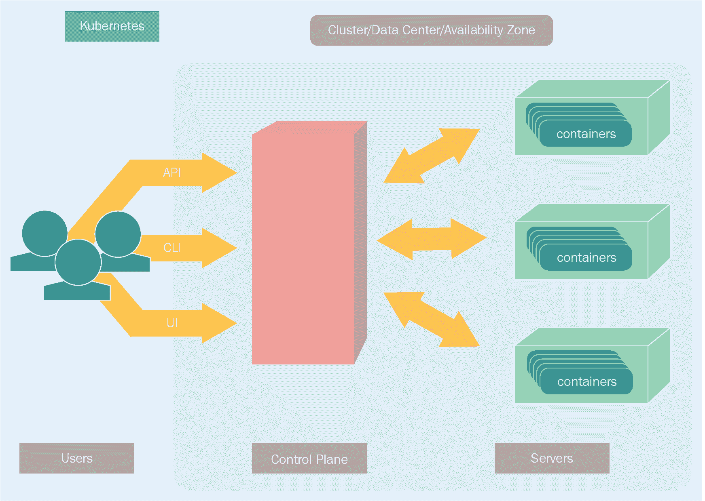
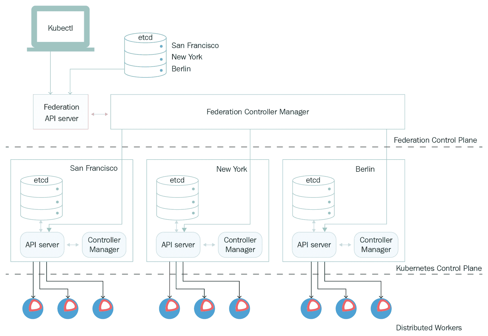
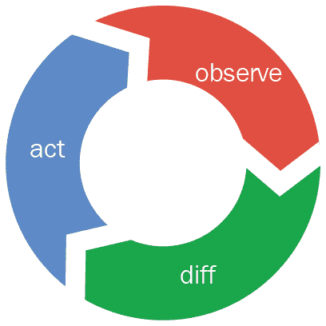
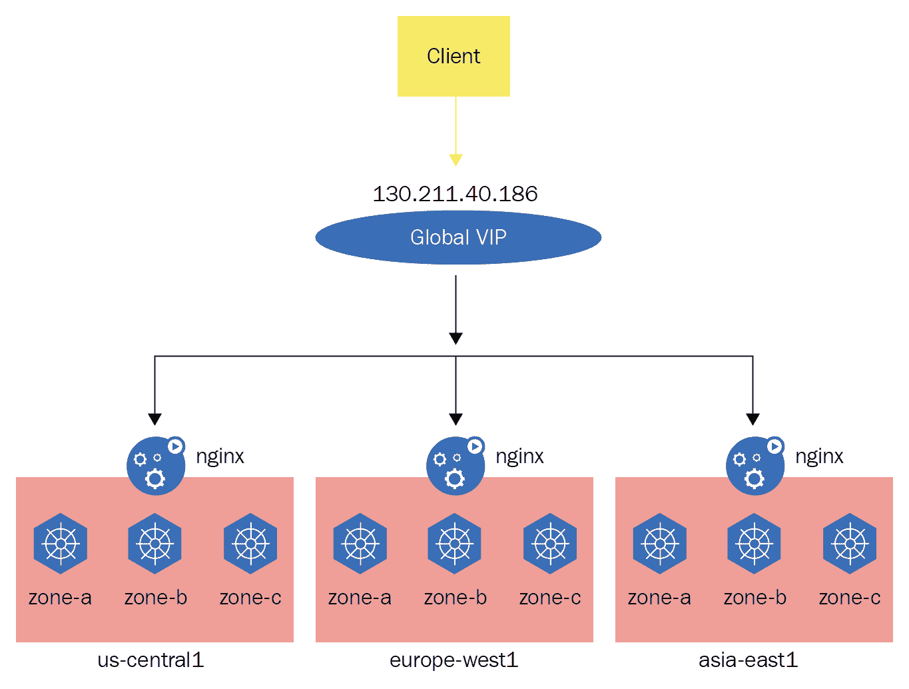
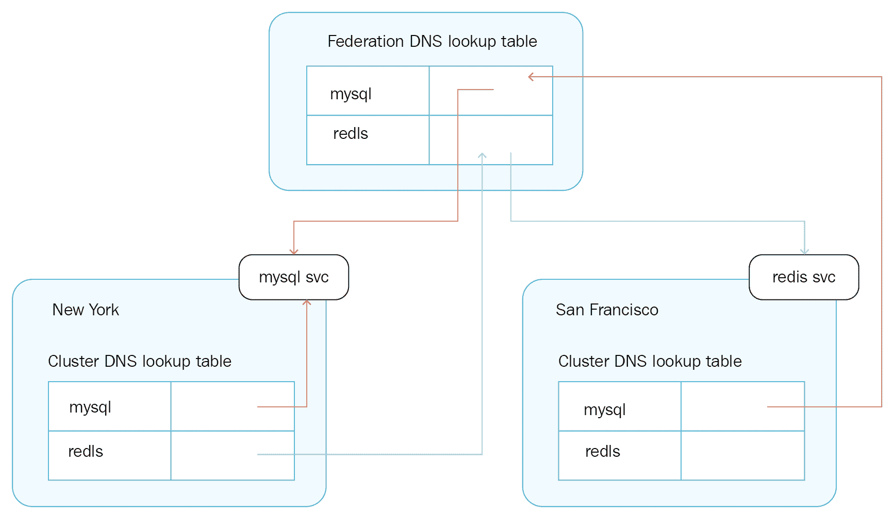

# 在多个云上运行 Kubernetes 和集群联邦

在本章中，我们将进一步探讨在多个云上运行 Kubernetes 和集群联邦。Kubernetes 集群是一个紧密结合的单元，其中所有组件都在相对接近的地方运行，并通过快速网络（物理数据中心或云提供商可用区）连接。这对许多用例来说非常好，但有一些重要的用例需要系统扩展到超出单个集群的范围。Kubernetes 联邦是一种系统化的方法，可以将多个 Kubernetes 集群组合在一起，并将它们视为单个实体进行交互。我们将涵盖的主题包括以下内容：

+   深入了解集群联邦的全部内容

+   如何准备、配置和管理集群联邦

+   如何在多个集群上运行联合工作负载

# 了解集群联邦

集群联邦在概念上很简单。您可以聚合多个 Kubernetes 集群，并将它们视为单个逻辑集群。有一个联邦控制平面，向客户端呈现系统的单一统一视图。

以下图表展示了 Kubernetes 集群联邦的整体情况：



联邦控制平面由联邦 API 服务器和联邦控制器管理器共同协作。联邦 API 服务器将请求转发到联邦中的所有集群。此外，联邦控制器管理器通过将请求路由到各个联邦集群成员的更改来执行控制器管理器的职责。实际上，集群联邦并不是微不足道的，也不能完全抽象化。跨 Pod 通信和数据传输可能会突然产生大量的延迟和成本开销。让我们首先看一下集群联邦的用例，了解联合组件和资源的工作方式，然后再来研究难点：位置亲和性、跨集群调度和联邦数据访问。

# 集群联邦的重要用例

有四类用例受益于集群联邦。

# 容量溢出

公共云平台，如 AWS、GCE 和 Azure，非常好，并提供许多好处，但它们并不便宜。许多大型组织在自己的数据中心投入了大量资金。其他组织与私人服务提供商合作，如 OVS、Rackspace 或 Digital Ocean。如果您有能力自行管理和操作基础设施，那么在自己的基础设施上运行 Kubernetes 集群比在云中运行更经济。但是，如果您的一些工作负载波动并且在相对短的时间内需要更多的容量呢？

例如，您的系统可能在周末或节假日受到特别严重的打击。传统方法是只是提供额外的容量。但在许多动态情况下，这并不容易。通过容量溢出，您可以在本地数据中心或私人服务提供商上运行 Kubernetes 集群中运行大部分工作，并在其中一个大型平台提供商上运行基于云的 Kubernetes 集群。大部分时间，基于云的集群将被关闭（停止实例），但在需要时，您可以通过启动一些停止的实例来弹性地为系统增加容量。Kubernetes 集群联合可以使这种配置相对简单。它消除了许多关于容量规划和支付大部分时间未使用的硬件的头疼。

这种方法有时被称为**云爆发**。

# 敏感工作负载

这几乎是容量溢出的相反情况。也许您已经接受了云原生的生活方式，整个系统都在云上运行，但是一些数据或工作负载涉及敏感信息。监管合规性或您组织的安全政策可能要求数据和工作负载必须在完全由您控制的环境中运行。您的敏感数据和工作负载可能会受到外部审计。确保私有 Kubernetes 集群中的信息永远不会泄漏到基于云的 Kubernetes 集群可能至关重要。但是，希望能够查看公共集群并能够从私有集群启动非敏感工作负载可能是可取的。如果工作负载的性质可以动态地从非敏感变为敏感，那么就需要通过制定适当的策略和实施来解决。例如，您可以阻止工作负载改变其性质。或者，您可以迁移突然变得敏感的工作负载，并确保它不再在基于云的集群上运行。另一个重要的例子是国家合规性，根据法律要求，某些数据必须保留在指定的地理区域（通常是一个国家）内，并且只能从该地区访问。在这种情况下，必须在该地理区域创建一个集群。

# 避免供应商锁定

大型组织通常更喜欢有选择，并不希望被绑定在单一供应商上。风险往往太大，因为供应商可能会关闭或无法提供相同级别的服务。拥有多个供应商通常也有利于谈判价格。Kubernetes 旨在成为供应商无关的。您可以在不同的云平台、私有服务提供商和本地数据中心上运行它。

然而，这并不是微不足道的。如果您想确保能够快速切换供应商或将一些工作负载从一个供应商转移到另一个供应商，您应该已经在多个供应商上运行系统。您可以自己操作，或者有一些公司提供在多个供应商上透明运行 Kubernetes 的服务。由于不同的供应商运行不同的数据中心，您自动获得了一些冗余和对供应商范围内的故障的保护。

# 地理分布的高可用性

高可用性意味着即使系统的某些部分出现故障，服务仍将对用户保持可用。在联邦 Kubernetes 集群的背景下，故障的范围是整个集群，这通常是由于托管集群的物理数据中心出现问题，或者可能是平台提供商出现更广泛的问题。高可用性的关键是冗余。地理分布式冗余意味着在不同位置运行多个集群。这可能是同一云提供商的不同可用区，同一云提供商的不同地区，甚至完全不同的云提供商（参见“避免供应商锁定”部分）。在运行具有冗余的集群联邦时，有许多问题需要解决。我们稍后将讨论其中一些问题。假设技术和组织问题已经解决，高可用性将允许将流量从失败的集群切换到另一个集群。这对用户来说应该是透明的（切换期间的延迟，以及一些正在进行的请求或任务可能会消失或失败）。系统管理员可能需要采取额外步骤来支持切换和处理原始集群的故障。

# 联邦控制平面

联邦控制平面由两个组件组成，共同使得 Kubernetes 集群的联邦可以看作和作为一个统一的 Kubernetes 集群。

# 联邦 API 服务器

联邦 API 服务器正在管理组成联邦的 Kubernetes 集群。它在`etcd`数据库中管理联邦状态（即哪些集群是联邦的一部分），与常规 Kubernetes 集群一样，但它保持的状态只是哪些集群是联邦的成员。每个集群的状态存储在该集群的`etcd`数据库中。联邦 API 服务器的主要目的是与联邦控制器管理器进行交互，并将请求路由到联邦成员集群。联邦成员不需要知道它们是联邦的一部分：它们的工作方式完全相同。

以下图表展示了联邦 API 服务器、联邦复制控制器和联邦中的 Kubernetes 集群之间的关系：



# 联邦控制器管理器

联邦控制器管理器确保联邦的期望状态与实际状态匹配。它将任何必要的更改转发到相关的集群或集群。联邦控制器管理器二进制文件包含多个控制器，用于本章后面将介绍的所有不同的联邦资源。尽管控制逻辑相似：它观察变化并在集群状态偏离时将集群状态带到期望状态。这是针对集群联邦中的每个成员进行的。

以下图表展示了这个永久控制循环：



# 联邦资源

Kubernetes 联邦仍在不断发展中。截至 Kubernetes 1.10，只有一些标准资源可以进行联邦。我们将在这里介绍它们。要创建联邦资源，您可以使用 Kubectl 的`--context=federation-cluster`命令行参数。当您使用`--context=federation-cluster`时，该命令将发送到联邦 API 服务器，该服务器负责将其发送到所有成员集群。

# 联邦 ConfigMap

联邦 ConfigMaps 非常有用，因为它们帮助集中配置可能分布在多个集群中的应用程序。

# 创建联邦 ConfigMap

以下是创建联邦 ConfigMap 的示例：

```
> kubectl --context=federation-cluster create -f configmap.yaml  
```

正如您所看到的，创建单个 Kubernetes 集群中的 ConfigMap 时唯一的区别是上下文。创建联邦 ConfigMap 时，它存储在控制平面的`etcd`数据库中，但每个成员集群中也存储了一份副本。这样，每个集群可以独立运行，不需要访问控制平面。

# 查看联邦 ConfigMap

您可以通过访问控制平面或访问成员集群来查看 ConfigMap。要访问成员集群中的 ConfigMap，请在上下文中指定联邦集群成员名称：

```
> kubectl --context=cluster-1 get configmap configmap.yaml  
```

# 更新联邦 ConfigMap

重要的是要注意，通过控制平面创建时，ConfigMap 将在所有成员集群中都是相同的。然而，由于它除了在控制平面集群中存储外，还在每个集群中单独存储，因此没有单一的“真实”来源。可以（尽管不建议）稍后独立修改每个成员集群的 ConfigMap。这会导致联邦中的配置不一致。联邦中不同集群的不同配置有有效的用例，但在这些情况下，我建议直接配置每个集群。当你创建一个联邦 ConfigMap 时，你是在表明整个集群应该共享这个配置。然而，通常情况下，你会希望通过指定 `--context=federation-cluster` 来更新联邦集群中的所有 ConfigMap。

# 删除联邦 ConfigMap

没错，你猜对了。你像往常一样删除，但指定上下文：

```
> kubectl --context=federation-cluster delete configmap      
```

只有一个小小的变化。从 Kubernetes 1.10 开始，当你删除一个联邦 ConfigMap 时，每个集群中自动创建的单独的 ConfigMap 仍然存在。你必须在每个集群中分别删除它们。也就是说，如果你的联邦中有三个集群分别叫做 `cluster-1`、`cluster-2` 和 `cluster-3`，你将不得不运行这额外的三个命令来摆脱联邦中的 ConfigMap：

```
> kubectl --context=cluster-1 delete configmap
> kubectl --context=cluster-2 delete configmap
> kubectl --context=cluster-3 delete configmap 
```

这将在将来得到纠正。

# 联邦守护进程

联邦守护进程基本上与常规的 Kubernetes 守护进程相同。你通过控制平面创建它并与之交互（通过指定 `--context=federation-cluster`），控制平面将其传播到所有成员集群。最终，你可以确保你的守护程序在联邦的每个集群的每个节点上运行。

# 联邦部署

联邦部署更加智能。当您创建一个具有 X 个副本的联邦部署，并且您有*N*个集群时，默认情况下副本将在集群之间均匀分布。如果您有 3 个集群，并且联邦部署有 15 个 pod，那么每个集群将运行 5 个副本。与其他联邦资源一样，控制平面将存储具有 15 个副本的联邦部署，然后创建 3 个部署（每个集群一个），每个部署都有 5 个副本。您可以通过添加注释`federation.kubernetes.io/deployment-preferences`来控制每个集群的副本数量。截至 Kubernetes 1.10，联邦部署仍处于 Alpha 阶段。在将来，该注释将成为联邦部署配置中的一个正确字段。

# 联邦事件

联邦事件与其他联邦资源不同。它们仅存储在控制平面中，不会传播到底层 Kubernetes 成员集群。

您可以像往常一样使用`--context=federation-cluster`查询联邦事件：

```
> kubectl --context=federation-cluster get events  
```

# 联邦水平 Pod 扩展

最近在 Kubernetes 1.9 中作为 Alpha 功能添加了联邦**水平 Pod 扩展**（**HPA**）。为了使用它，您必须在启动 API 服务器时提供以下标志：

```
--runtime-config=api/all=true  
```

这是一个重要的功能，因为集群联合的主要动机之一是在没有手动干预的情况下在多个集群之间流畅地转移工作负载。联邦 HPA 利用了集群内的 HPA 控制器。联邦 HPA 根据请求的最大和最小副本数量在成员集群之间均匀分配负载。在将来，用户将能够指定更高级的 HPA 策略。

例如，考虑一个具有 4 个集群的联邦；我们希望始终至少有 6 个 pod 和最多有 16 个 pod 在运行。以下清单将完成工作：

```
apiVersion: autoscaling/v1 
kind: HorizontalPodAutoscaler 
metadata: 
  name: cool-app 
  namespace: default 
spec: 
  scaleTargetRef: 
    apiVersion: apps/v1beta1 
    kind: Deployment 
    name: cool-app 
  minReplicas: 6 
  maxReplicas: 16 
  targetCPUUtilizationPercentage: 80 
```

使用以下命令启动联邦 HPA：

```
> kubectl --context=federation-cluster create federated-hpa.yaml  
```

现在会发生什么？联邦控制平面将在 4 个集群中的每个集群中创建标准 HPA，最多有 4 个副本和最少有 2 个副本。原因是这是最经济地满足联邦要求的设置。让我们了解一下为什么。如果每个集群最多有 4 个副本，那么我们最多会有 4 x 4 = 16 个副本，这符合我们的要求。至少 2 个副本的保证意味着我们至少会有 4 x 2 = 8 个副本。这满足了我们至少会有 6 个副本的要求。请注意，即使系统上没有负载，我们也将始终至少有 8 个副本，尽管我们指定 6 个也可以。鉴于跨集群的均匀分布的限制，没有其他办法。如果集群 HPA 的`minReplicas=1`，那么集群中的总副本数可能是 4 x 1 = 4，这少于所需的联邦最小值 6。未来，用户可能可以指定更复杂的分布方案。

可以使用集群选择器（在 Kubernetes 1.7 中引入）来将联邦对象限制为成员的子集。因此，如果我们想要至少 6 个最多 15 个，可以将其均匀分布在 3 个集群中，而不是 4 个，每个集群将至少有 2 个最多 5 个。

# 联邦入口

联邦入口不仅在每个集群中创建匹配的入口对象。联邦入口的主要特点之一是，如果整个集群崩溃，它可以将流量引导到其他集群。从 Kubernetes 1.4 开始，联邦入口在 Google Cloud Platform 上得到支持，包括 GKE 和 GCE。未来，联邦入口将增加对混合云的支持。

联邦入口执行以下任务：

+   在联邦的每个集群成员中创建 Kubernetes 入口对象

+   为所有集群入口对象提供一个一站式逻辑 L7 负载均衡器，具有单个 IP 地址

+   监视每个集群中入口对象后面的服务后端 pod 的健康和容量

+   确保在各种故障情况下将客户端连接路由到健康的服务端点，例如 pod、集群、可用区或整个区域的故障，只要联邦中有一个健康的集群

# 创建联邦入口

通过寻址联邦控制平面来创建联邦入口

```
> kubectl --context=federation-cluster create -f ingress.yaml  
```

联合控制平面将在每个集群中创建相应的入口。所有集群将共享相同的命名空间和`ingress`对象的名称：

```
> kubectl --context=cluster-1 get ingress myingress
NAME        HOSTS     ADDRESS           PORTS     AGE
ingress      *         157.231.15.33    80, 443   1m  
```

# 使用联合入口进行请求路由

联合入口控制器将请求路由到最近的集群。入口对象通过`Status.Loadbalancer.Ingress`字段公开一个或多个 IP 地址，这些 IP 地址在入口对象的生命周期内保持不变。当内部或外部客户端连接到特定集群入口对象的 IP 地址时，它将被路由到该集群中的一个 pod。然而，当客户端连接到联合入口对象的 IP 地址时，它将自动通过最短的网络路径路由到请求源最近的集群中的一个健康 pod。因此，例如，来自欧洲互联网用户的 HTTP(S)请求将直接路由到具有可用容量的欧洲最近的集群。如果欧洲没有这样的集群，请求将被路由到下一个最近的集群（通常在美国）。

# 使用联合入口处理故障

有两种广义的失败类别：

+   Pod 故障

+   集群故障

Pod 可能因多种原因而失败。在正确配置的 Kubernetes 集群（无论是集群联合成员还是不是），pod 将由服务和 ReplicaSets 管理，可以自动处理 pod 故障。这不应影响联合入口进行的跨集群路由和负载均衡。整个集群可能由于数据中心或全球连接的问题而失败。在这种情况下，联合服务和联合 ReplicaSets 将确保联合中的其他集群运行足够的 pod 来处理工作负载，并且联合入口将负责将客户端请求从失败的集群中路由出去。为了从这种自动修复功能中受益，客户端必须始终连接到联合入口对象，而不是单个集群成员。

# 联合作业

联合作业与集群内作业类似。联合控制平面在基础集群中创建作业，并根据任务的并行性均匀分配负载，并跟踪完成情况。例如，如果联合有 4 个集群，并且您创建了一个并行性为 8 和完成数为 24 的联合作业规范，那么将在每个集群中创建一个并行性为 2 和完成数为 6 的作业。

# 联合命名空间

Kubernetes 命名空间在集群内用于隔离独立区域并支持多租户部署。联合命名空间在整个集群联合中提供相同的功能。API 是相同的。当客户端访问联合控制平面时，他们只能访问他们请求的命名空间，并且被授权访问联合中所有集群的命名空间。

您可以使用相同的命令并添加`--context=federation-cluster`：

```
> kubectl --context=federation-cluster create -f namespace.yaml
> kubectl --context=cluster-1 get namespaces namespace
> kubectl --context=federation-cluster create -f namespace.yaml  
```

# 联合复制 ReplicaSet

最好使用部署和联合部署来管理集群或联合中的副本。但是，如果出于某种原因您更喜欢直接使用 ReplicaSets 进行工作，那么 Kubernetes 支持联合`ReplicaSet`。没有联合复制控制器，因为 ReplicaSets 超越了复制控制器。

当您创建联合 ReplicaSets 时，控制平面的工作是确保整个集群中的副本数量与您的联合 ReplicaSets 配置相匹配。控制平面将在每个联合成员中创建一个常规 ReplicaSet。每个集群将默认获得相等（或尽可能接近相等）数量的副本，以便总数将达到指定的副本数量。

您可以使用以下注释来控制每个集群的副本数量：`federation.kubernetes.io/replica-set-preferences`。

相应的数据结构如下：

```
type FederatedReplicaSetPreferences struct { 
  Rebalance bool 
  Clusters map[string]ClusterReplicaSetPreferences 
} 
```

如果`Rebalance`为`true`，则正在运行的副本可能会根据需要在集群之间移动。集群映射确定每个集群的 ReplicaSets 偏好。如果将`*`指定为键，则所有未指定的集群将使用该偏好集。如果没有`*`条目，则副本将仅在映射中显示的集群上运行。属于联合但没有条目的集群将不会安排 pod（对于该 pod 模板）。

每个集群的单独 ReplicaSets 偏好使用以下数据结构指定：

```
type ClusterReplicaSetPreferences struct { 
  MinReplicas int64 
  MaxReplicas *int64 
  Weight int64 
} 
```

`MinReplicas`默认为`0`。`MaxReplicas`默认情况下是无限制的。权重表示向这个 ReplicaSets 添加额外副本的偏好，默认为`0`。

# 联合秘密

联合秘密很简单。当您通过控制平面像往常一样创建联合秘密时，它会传播到整个集群。就是这样。

# 困难的部分

到目前为止，联邦似乎几乎是直截了当的。将一堆集群组合在一起，通过控制平面访问它们，一切都会被复制到所有集群。但是有一些困难因素和基本概念使这种简化的观点变得复杂。Kubernetes 的许多功能来自于其在幕后执行大量工作的能力。在一个完全部署在单个物理数据中心或可用性区域的单个集群中，所有组件都连接到快速网络，Kubernetes 本身非常有效。在 Kubernetes 集群联邦中，情况就不同了。延迟、数据传输成本以及在集群之间移动 Pods 都有不同的权衡。根据用例，使联邦工作可能需要系统设计师和运营商额外的注意、规划和维护。此外，一些联合资源不如其本地对应物成熟，这增加了更多的不确定性。

# 联邦工作单元

Kubernetes 集群中的工作单元是 Pod。在 Kubernetes 中无法打破 Pod。整个 Pod 将始终一起部署，并受到相同的生命周期处理。Pod 是否应该保持集群联邦的工作单元？也许将更大的单元（如整个 ReplicaSet、部署或服务）与特定集群关联起来会更有意义。如果集群失败，整个 ReplicaSet、部署或服务将被调度到另一个集群。那么一组紧密耦合的 ReplicaSets 呢？这些问题的答案并不总是容易的，甚至可能随着系统的演变而动态改变。

# 位置亲和性

位置亲和力是一个主要关注点。Pods 何时可以分布在集群之间？这些 Pods 之间的关系是什么？是否有亲和力要求，比如 Pods 之间或 Pods 与其他资源（如存储）之间？有几个主要类别：

+   严格耦合

+   松散耦合

+   优先耦合

+   严格解耦

+   均匀分布

在设计系统以及如何在联邦中分配和调度服务和 Pods 时，确保始终尊重位置亲和性要求非常重要。

# 严格耦合

严格耦合的要求适用于必须在同一集群中的应用程序。如果对 pod 进行分区，应用程序将失败（可能是由于实时要求无法在集群间进行网络传输），或者成本可能太高（pod 可能正在访问大量本地数据）。将这种紧密耦合的应用程序移动到另一个集群的唯一方法是在另一个集群上启动完整的副本（包括数据），然后关闭当前集群上的应用程序。如果数据量太大，该应用程序可能实际上无法移动，并对灾难性故障敏感。这是最难处理的情况，如果可能的话，您应该设计系统以避免严格耦合的要求。

# 松耦合

松耦合的应用程序在工作负载尴尬地并行时表现最佳，每个 pod 不需要了解其他 pod 或访问大量数据。在这些情况下，pod 可以根据联邦中的容量和资源利用率安排到集群中。必要时，pod 可以在不出问题的情况下从一个集群移动到另一个集群。例如，一个无状态的验证服务执行一些计算，并在请求本身中获取所有输入，不查询或写入任何联邦范围的数据。它只验证其输入并向调用者返回有效/无效的判断。

# 优先耦合

在所有 pod 都在同一集群中或 pod 和数据共同位于同一位置时，优先耦合的应用程序表现更好，但这不是硬性要求。例如，它可以与仅需要最终一致性的应用程序一起工作，其中一些联邦范围的应用程序定期在所有集群之间同步应用程序状态。在这些情况下，分配是明确地针对一个集群进行的，但在压力下留下了一个安全舱口，可以在其他集群中运行或迁移。

# 严格解耦

一些服务具有故障隔离或高可用性要求，这要求在集群之间进行分区。如果所有副本最终可能被安排到同一集群中，那么运行关键服务的三个副本就没有意义，因为该集群只成为一个临时的单点故障（SPOF）。

# 均匀分布

均匀分布是指服务、ReplicaSet 或 pod 的实例必须在每个集群上运行。这类似于 DaemonSet，但不是确保每个节点上有一个实例，而是每个集群一个实例。一个很好的例子是由一些外部持久存储支持的 Redis 缓存。每个集群中的 pod 应该有自己的集群本地 Redis 缓存，以避免访问可能更慢或成为瓶颈的中央存储。另一方面，每个集群不需要超过一个 Redis 服务（它可以分布在同一集群中的几个 pod 中）。

# 跨集群调度

跨集群调度与位置亲和力相辅相成。当创建新的 pod 或现有的 pod 失败并且需要安排替代时，它应该去哪里？当前的集群联邦不能处理我们之前提到的所有场景和位置亲和力的选项。在这一点上，集群联邦很好地处理了松散耦合（包括加权分布）和严格耦合（通过确保副本的数量与集群的数量相匹配）的类别。其他任何情况都需要您不使用集群联邦。您将不得不添加自己的自定义联邦层，以考虑更多专门的问题，并且可以适应更复杂的调度用例。

# 联邦数据访问

这是一个棘手的问题。如果您有大量数据和在多个集群中运行的 pod（可能在不同的大陆上），并且需要快速访问它，那么您有几个不愉快的选择：

+   将数据复制到每个集群（复制速度慢，传输昂贵，存储昂贵，同步和处理错误复杂）

+   远程访问数据（访问速度慢，每次访问昂贵，可能成为单点故障）

+   制定一个复杂的混合解决方案，对一些最热门的数据进行每个集群缓存（复杂/陈旧的数据，仍然需要传输大量数据）

# 联邦自动扩展

目前不支持联邦自动调用。可以利用两个维度的扩展，以及组合：

+   每个集群的扩展

+   将集群添加/移除联邦

+   混合方法

考虑一个相对简单的场景，即在三个集群上运行一个松散耦合的应用程序，每个集群有五个 pod。在某个时候，15 个 pod 无法再处理负载。我们需要增加更多的容量。我们可以增加每个集群中的 pod 数量，但如果我们在联邦级别这样做，那么每个集群将有六个 pod 在运行。我们通过三个 pod 增加了联邦的容量，而只需要一个 pod。当然，如果您有更多的集群，问题会变得更糟。另一个选择是选择一个集群并只改变其容量。这是可能的，但现在我们明确地在整个联邦中管理容量。如果我们有许多集群运行数百个具有动态变化需求的服务，情况会很快变得复杂。

添加一个全新的集群更加复杂。我们应该在哪里添加新的集群？没有额外的可用性要求可以指导决策。这只是额外的容量问题。创建一个新的集群通常需要复杂的首次设置，并且可能需要几天来批准公共云平台上的各种配额。混合方法增加了联邦中现有集群的容量，直到达到某个阈值，然后开始添加新的集群。这种方法的好处是，当您接近每个集群的容量限制时，您开始准备新的集群，以便在必要时立即启动。除此之外，它需要大量的工作，并且您需要为灵活性和可伸缩性付出增加的复杂性。

# 管理 Kubernetes 集群联邦

管理 Kubernetes 集群联邦涉及许多超出管理单个集群的活动。有两种设置联邦的方式。然后，您需要考虑级联资源删除，跨集群负载平衡，跨集群故障转移，联邦服务发现和联邦发现。让我们详细讨论每一种。

# 从头开始设置集群联邦

注意：这种方法现在已经不推荐使用`Kubefed`。我在这里描述它是为了让使用较旧版本 Kubernetes 的读者受益。

建立 Kubernetes 集群联邦，我们需要运行控制平面的组件，如下所示：

```
etcd 
federation-apiserver 
federation-controller-manager 
```

其中一个最简单的方法是使用全能的 hyperkube 镜像：

[`github.com/kubernetes/kubernetes/tree/master/cluster/images/hyperkube`](https://github.com/kubernetes/kubernetes/tree/master/cluster/images/hyperkube)

联邦 API 服务器和联邦控制器管理器可以作为现有 Kubernetes 集群中的 pod 运行，但正如前面讨论的那样，最好从容错和高可用性的角度来看，将它们运行在自己的集群中。

# 初始设置

首先，您必须运行 Docker，并获取包含我们在本指南中将使用的脚本的 Kubernetes 版本。当前版本是 1.5.3。您也可以下载最新可用版本：

```
> curl -L https://github.com/kubernetes/kubernetes/releases/download/v1.5.3/kubernetes.tar.gz | tar xvzf -
> cd kubernetes  
```

我们需要为联邦配置文件创建一个目录，并将`FEDERATION_OUTPUT_ROOT`环境变量设置为该目录。为了方便清理，最好创建一个新目录：

```
> export FEDERATION_OUTPUT_ROOT="${PWD}/output/federation"
> mkdir -p "${FEDERATION_OUTPUT_ROOT}"  
```

现在，我们可以初始化联邦：

```
> federation/deploy/deploy.sh init 
```

# 使用官方的 Hyperkube 镜像

作为每个 Kubernetes 版本的一部分，官方发布的镜像都被推送到`gcr.io/google_containers`。要使用该存储库中的镜像，您可以将配置文件中的容器镜像字段设置为`${FEDERATION_OUTPUT_ROOT}`指向`gcr.io/google_containers/hyperkube`镜像，其中包括`federation-apiserver`和`federation-controller-manager`二进制文件。

# 运行联邦控制平面

我们准备通过运行以下命令部署联邦控制平面：

```
> federation/deploy/deploy.sh deploy_federation  
```

该命令将启动控制平面组件作为 pod，并为联邦 API 服务器创建一个`LoadBalancer`类型的服务，并为`etcd`创建一个由动态持久卷支持的持久卷索赔。

要验证联邦命名空间中的所有内容是否正确创建，请输入以下内容：

```
> kubectl get deployments --namespace=federation  
```

你应该看到这个：

```
NAME                        DESIRED CURRENT UP-TO-DATE      
federation-controller-manager   1         1         1 federation-apiserver 1         1         1 
```

您还可以使用 Kubectl config view 检查`kubeconfig`文件中的新条目。请注意，动态配置目前仅适用于 AWS 和 GCE。

# 向联邦注册 Kubernetes 集群

要向联邦注册集群，我们需要一个与集群通信的秘钥。

让我们在主机 Kubernetes 集群中创建秘钥。假设目标集群的`kubeconfig`位于`|cluster-1|kubeconfig`。您可以运行以下命令

创建`secret`：

```
> kubectl create secret generic cluster-1 --namespace=federation 
--from-file=/cluster-1/kubeconfig  
```

集群的配置看起来和这个一样：

```
apiVersion: federation/v1beta1 
kind: Cluster 
metadata: 
  name: cluster1 
spec: 
  serverAddressByClientCIDRs: 
  - clientCIDR: <client-cidr> 
    serverAddress: <apiserver-address> 
  secretRef: 
    name: <secret-name> 
```

我们需要设置`<client-cidr>`，`<apiserver-address>`和`<secret-name>`。这里的`<secret-name>`是您刚刚创建的秘密的名称。`serverAddressByClientCIDRs`包含客户端可以根据其 CIDR 使用的各种服务器地址。我们可以使用`CIDR 0.0.0.0/0`设置服务器的公共 IP 地址，所有客户端都将匹配。此外，如果要内部客户端使用服务器的`clusterIP`，可以将其设置为`serverAddress`。在这种情况下，客户端 CIDR 将是仅匹配在该集群中运行的 pod 的 IP 的 CIDR。

让我们注册集群：

```
> kubectl create -f /cluster-1/cluster.yaml --context=federation-cluster  
```

让我们看看集群是否已正确注册：

```
> kubectl get clusters --context=federation-cluster
NAME       STATUS    VERSION   AGE
cluster-1   Ready               1m 
```

# 更新 KubeDNS

集群已注册到联邦。现在是时候更新`kube-dns`，以便您的集群可以路由联邦服务请求。从 Kubernetes 1.5 或更高版本开始，通过`kube-dns ConfigMap`传递`--federations`标志来完成：

```
--federations=${FEDERATION_NAME}=${DNS_DOMAIN_NAME}    
```

`ConfigMap`的外观如下：

```
apiVersion: v1 
kind: ConfigMap 
metadata: 
  name: kube-dns 
  namespace: kube-system 
data: 
  federations: <federation-name>=<federation-domain-name> 
```

将`federation-name`和`federation-domain-name`替换为正确的值。

# 关闭联邦

如果要关闭联邦，只需运行以下命令：

```
federation/deploy/deploy.sh destroy_federation 
```

# 使用 Kubefed 设置集群联合

Kubernetes 1.5 引入了一个名为`Kubefed`的新的 Alpha 命令行工具，帮助您管理联合集群。`Kubefed`的工作是使部署新的 Kubernetes 集群联合控制平面变得容易，并向现有联合控制平面添加或删除集群。自 Kubernetes 1.6 以来一直处于 beta 阶段。

# 获取 Kubefed

直到 Kubernetes 1.9，Kubefed 是 Kubernetes 客户端二进制文件的一部分。您将获得 Kubectl 和 Kubefed。以下是在 Linux 上下载和安装的说明：

```
curl -LO https://storage.googleapis.com/kubernetes-release/release/${RELEASE-VERSION}/kubernetes-client-linux-amd64.tar.gztar -xzvf kubernetes-client-linux-amd64.tar.gz
    sudo cp kubernetes/client/bin/kubefed /usr/local/bin
    sudo chmod +x /usr/local/bin/kubefed
    sudo cp kubernetes/client/bin/kubectl /usr/local/bin
    sudo chmod +x /usr/local/bin/kubectl

```

如果您使用不同的操作系统或想安装不同的版本，则需要进行必要的调整。自 Kubernetes 1.9 以来，Kubefed 已在专用联邦存储库中可用：

```
curl -LO https://storage.cloud.google.com/kubernetes-federation-release/release/${RELEASE-VERSION}/federation-client-linux-amd64.tar.gztar -xzvf federation-client-linux-amd64.tar.gz
    sudo cp federation/client/bin/kubefed /usr/local/binsudo chmod +x /usr/local/bin/kubefed
```

您可以按照此处的说明单独安装 Kubectl：

```
https://kubernetes.io/docs/tasks/tools/install-kubectl/
```

# 选择主机集群

联邦控制平面可以是其自己的专用集群，也可以与现有集群一起托管。您需要做出这个决定。主机集群托管组成联邦控制平面的组件。确保您在本地`kubeconfig`中具有与主机集群对应的`kubeconfig`条目。

要验证是否具有所需的`kubeconfig`条目，请键入以下内容：

```
> kubectl config get-contexts  
```

您应该看到类似于这样的东西：

```
CURRENT   NAME      CLUSTER   AUTHINFO  NAMESPACE
cluster-1 cluster-1  cluster-1  
```

在部署联邦控制平面时，将稍后提供上下文名称`cluster-1`。

# 部署联邦控制平面

是时候开始使用 Kubefed 了。`kubefed init`命令需要三个参数：

+   联邦名称

+   主机集群上下文

+   用于您的联邦服务的域名后缀

以下示例命令部署了一个带有联邦控制平面的

名称联邦；一个主机集群上下文，`cluster-1`；一个 coredns DNS 提供程序（`google-clouddns`和`aes-route53`也是有效的）；和域后缀，`kubernetes-ftw.com`：

```
> kubefed init federation --host-cluster-context=cluster-1 --dns-provider coredns --dns-zone-name="kubernetes-ftw.com"  
```

DNS 后缀应该是您管理的 DNS 域名。

`kubefed init`在主机集群中设置联邦控制平面，并在本地`kubeconfig`中为联邦 API 服务器添加条目。由于错误，Kubernetes 可能不会创建默认命名空间。在这种情况下，您将不得不自己执行。键入以下命令：

```
> kubectl create namespace default --context=federation  
```

不要忘记将当前上下文设置为联邦，以便 Kubectl 将目标设置为联邦控制平面：

```
> kubectl config use-context federation 
```

# 联邦服务发现

联邦服务发现与联邦负载平衡紧密耦合。一个实用的设置包括一个全局 L7 负载均衡器，将请求分发到联邦集群中的联邦入口对象。

这种方法的好处是控制权留在 Kubernetes 联邦，随着时间的推移，它将能够与更多的集群类型（目前只有 AWS 和 GCE）一起工作，并了解集群利用率和其他约束。

拥有专用的查找服务并让客户端直接连接到各个集群上的服务的替代方案会失去所有这些好处。

# 将集群添加到联邦

一旦控制平面成功部署，我们应该将一些 Kubernetes 集群添加到联邦中。Kubefed 为此目的提供了`join`命令。`kubefed join`命令需要以下参数：

+   要添加的集群名称

+   主机集群上下文

例如，要将名为`cluster-2`的新集群添加到联邦中，请键入

以下：

```
kubefed join cluster-2 --host-cluster-context=cluster-1 
```

# 命名规则和自定义

您提供给`kubefed join`的集群名称必须是有效的 RFC 1035 标签。RFC 1035 只允许字母、数字和连字符，并且标签必须以字母开头。

此外，联邦控制平面需要加入集群的凭据才能对其进行操作。这些凭据是从本地的`kubeconfig`中获取的。`Kubefed join`命令使用指定为参数的集群名称来查找本地`kubeconfig`中的集群上下文。如果它找不到匹配的上下文，它将以错误退出。

这可能会导致问题，因为联邦中每个集群的上下文名称不遵循 RFC 1035 标签命名规则。在这种情况下，您可以指定符合 RFC 1035 标签命名规则的集群名称，并使用`--cluster-context`标志指定集群上下文。例如，如果您要加入的集群的上下文是`cluster-3`（不允许使用下划线），您可以通过运行此命令加入该集群：

```
kubefed join cluster-3 --host-cluster-context=cluster-1 --cluster-context=cluster-3  
```

# 秘密名称

联邦控制平面在上一节中描述的集群凭据作为主机集群中的一个秘密存储。秘密的名称也是从集群名称派生的。

但是，在 Kubernetes 中`secret`对象的名称应符合 RFC 1123 中描述的 DNS 子域名规范。如果不是这种情况，您可以使用`--secret-name`标志将`secret name`传递给`kubefed join`。例如，如果集群名称是`cluster-4`，`secret name`是`4secret`（不允许以字母开头），您可以通过运行此命令加入该集群：

```
kubefed join cluster-4 --host-cluster-context=cluster-1 --secret-name=4secret  
```

`kubefed join`命令会自动为您创建秘密。

# 从联邦中删除一个集群

要从联邦中删除一个集群，请使用集群名称和联邦主机集群上下文运行`kubefed unjoin`命令：

```
kubefed unjoin cluster-2 --host-cluster-context=cluster-1  
```

# 关闭联邦

在 Kubefed 的 beta 版本中，联邦控制平面的适当清理尚未完全实现。但是，暂时删除联邦系统命名空间应该会删除除联邦控制平面的`etcd`动态配置的持久存储卷之外的所有资源。您可以通过运行以下命令`delete`联邦命名空间来删除联邦命名空间：

```
> kubectl delete ns federation-system  
```

# 资源的级联删除

Kubernetes 集群联邦通常在控制平面中管理联合对象，以及每个成员 Kubernetes 集群中的相应对象。级联删除联合对象意味着成员 Kubernetes 集群中的相应对象也将被删除。

这不会自动发生。默认情况下，只删除联合控制平面对象。要激活级联删除，您需要设置以下选项：

```
DeleteOptions.orphanDependents=false 
```

在 Kuberentes 1.5 中，只有以下联合对象支持级联删除：

+   部署

+   守护进程集

+   入口管理

+   命名空间

+   副本集

+   秘密

对于其他对象，您必须进入每个集群并明确删除它们。幸运的是，从 Kubernetes 1.6 开始，所有联合对象都支持级联删除。

# 跨多个集群的负载均衡

跨集群的动态负载均衡并不是微不足道的。最简单的解决方案是说这不是 Kubernetes 的责任。负载均衡将在 Kubernetes 集群联合之外执行。但考虑到 Kubernetes 的动态特性，即使外部负载均衡器也必须收集关于每个集群上正在运行的服务和后端 pod 的大量信息。另一种解决方案是联合控制平面实现一个作为整个联合的流量导向器的 L7 负载均衡器。在较简单的用例中，每个服务在一个专用集群上运行，负载均衡器只是将所有流量路由到该集群。在集群故障的情况下，服务被迁移到另一个集群，负载均衡器现在将所有流量路由到新的集群。这提供了一个粗略的故障转移和集群级别的高可用性解决方案。

最佳解决方案将能够支持联合服务，并考虑其他因素，例如以下因素：

+   客户端的地理位置

+   每个集群的资源利用率

+   资源配额和自动扩展

以下图表显示了 GCE 上的 L7 负载均衡器如何将客户端请求分发到最近的集群：



# 跨多个集群的故障转移

联合故障转移很棘手。假设联合中的一个集群失败；一个选择是让其他集群接管工作。现在的问题是，如何在其他集群之间分配负载？

+   统一吗？

+   启动一个新的集群？

+   选择一个尽可能接近的现有集群（可能在同一地区）？

这些解决方案与联合负载平衡有微妙的相互作用，

地理分布的高可用性，跨不同集群的成本管理，

和安全。

现在，失败的集群再次上线。它应该逐渐重新接管其原始工作负载吗？如果它回来了，但容量减少或网络不稳定怎么办？有许多故障模式的组合可能使恢复变得复杂。

# 联邦迁移

联邦迁移与我们讨论过的几个主题相关，例如位置亲和性、联邦调度和高可用性。在其核心，联邦迁移意味着将整个应用程序或其部分从一个集群移动到另一个集群（更一般地从 M 个集群移动到 N 个集群）。联邦迁移可能是对各种事件的响应，例如以下事件：

+   集群中的低容量事件（或集群故障）

+   调度策略的更改（我们不再使用云提供商 X）

+   资源定价的更改（云提供商 Y 降低了价格，所以让我们迁移到那里）

+   联邦中添加或删除了一个新集群（让我们重新平衡应用程序的 Pods）

严格耦合的应用程序可以轻松地一次移动一个 Pod 或整个 Pod 到一个或多个集群（在适用的策略约束条件下，例如“仅限私有云”）。

对于优先耦合的应用程序，联邦系统必须首先找到一个具有足够容量来容纳整个应用程序的单个集群，然后预留该容量，并逐步将应用程序的一个（或多个）资源在一定的时间段内移动到新集群中（可能在预定义的维护窗口内）。

严格耦合的应用程序（除了被认为完全不可移动的应用程序）需要联邦系统执行以下操作：

+   在目标集群中启动整个副本应用程序

+   将持久数据复制到新的应用程序实例（可能在之前

启动 Pods）

+   切换用户流量

+   拆除原始应用程序实例

# 发现联邦服务

Kubernetes 提供 KubeDNS 作为内置核心组件。 KubeDNS 使用

`cluster-local` DNS 服务器以及命名约定来组成合格的

（按命名空间）DNS 名称约定。例如，`the-service`解析为默认`namespace`中的`the-service`服务，而`the-service.the-namespace`解析为`the-namespace namespace`中名为`the-service`的服务，该服务与默认的`the-service`不同。Pod 可以使用 KubeDNS 轻松找到和访问内部服务。Kubernetes 集群联邦将该机制扩展到多个集群。基本概念是相同的，但增加了另一级联邦。现在服务的 DNS 名称由`<service name>.<namespace name>.<federation name>`组成。这样，仍然可以使用原始的`<service name>.<namepace name>`命名约定来访问内部服务。但是，想要访问联邦服务的客户端使用联邦名称，最终将被转发到联邦成员集群中的一个来处理请求。

这种联邦限定的命名约定还有助于防止内部集群流量错误地到达其他集群。

使用前面的 NGINX 示例服务和刚刚描述的联邦服务 DNS 名称形式，让我们考虑一个例子：位于 cluster-1 可用区的集群中的一个 pod 需要访问 NGINX 服务。它现在可以使用服务的联邦 DNS 名称，即`nginx.the-namespace.the-federation`，这将自动扩展并解析为 NGINX 服务的最近健康的分片，无论在世界的哪个地方。如果本地集群中存在健康的分片，该服务的集群本地（通常为`10.x.y.z`）IP 地址将被返回（由集群本地的 KubeDNS）。这几乎等同于非联邦服务解析（几乎因为 KubeDNS 实际上为本地联邦服务返回了 CNAME 和 A 记录，但应用程序对这种微小的技术差异是无感的）。

然而，如果服务在本地集群中不存在（或者没有健康的后端 pod），DNS 查询会自动扩展。

# 运行联邦工作负载

联合工作负载是在多个 Kubernetes 集群上同时处理的工作负载。这对于松散耦合和分布式应用程序来说相对容易。然而，如果大部分处理可以并行进行，通常在最后会有一个连接点，或者至少需要查询和更新一个中央持久存储。如果同一服务的多个 pod 需要在集群之间合作，或者一组服务（每个服务可能都是联合的）必须共同工作并同步以完成某些任务，情况就会变得更加复杂。

Kubernetes 联合支持提供了联合工作负载的良好基础的联合服务。

联合服务的一些关键点是服务发现，跨集群

负载均衡和可用性区容错。

# 创建联合服务

联合服务在联合成员集群中创建相应的服务。

例如，要创建一个联合 NGINX 服务（假设您在`nginx.yaml`中有服务配置），请输入以下内容：

```
> kubectl --context=federation-cluster create -f nginx.yaml 
```

您可以验证每个集群中是否创建了一个服务（例如，在`cluster-2`中）：

```
> kubectl --context=cluster-2 get services nginx
NAME      CLUSTER-IP     EXTERNAL-IP      PORT(S)   AGE
nginx     10.63.250.98   104.199.136.89   80/TCP    9m 
```

所有集群中创建的服务将共享相同的命名空间和服务名称，这是有道理的，因为它们是一个单一的逻辑服务。

您的联合服务的状态将自动反映基础 Kubernetes 服务的实时状态：

```
> kubectl --context=federation-cluster describe services nginx
Name:                   nginx
Namespace:              default
Labels:                 run=nginx
Selector:               run=nginx
Type:                   LoadBalancer
IP: 
LoadBalancer Ingress:   105.127.286.190, 122.251.157.43, 114.196.14.218, 114.199.176.99, ...
Port:                   http    80/TCP
Endpoints:              <none>
Session Affinity:       None
No events.  
```

# 添加后端 pod

截至 Kubernetes 1.10，我们仍然需要将后端 pod 添加到每个联合成员集群。这可以通过`kubectl run`命令完成。在将来的版本中，Kubernetes 联合 API 服务器将能够自动执行此操作。这将节省一步。请注意，当您使用`kubectl run`命令时，Kubernetes 会根据镜像名称自动向 pod 添加运行标签。在下面的示例中，该示例在五个 Kubernetes 集群上启动了一个 NGINX 后端 pod，镜像名称为`nginx`（忽略版本），因此将添加以下标签：

```
run=nginx 
```

这是因为服务使用该标签来识别其 pod。如果使用另一个标签，需要显式添加它：

```
for C in cluster-1 
    cluster-2 
    cluster-3 
    cluster-4 
              cluster-5
    do
      kubectl --context=$C run nginx --image=nginx:1.11.1-alpine --port=80
    done

```

# 验证公共 DNS 记录

一旦前面的 pod 成功启动并监听连接，Kubernetes 将把它们报告为该集群中服务的健康端点（通过自动健康检查）。Kubernetes 集群联邦将进一步考虑这些服务分片中的每一个为健康，并通过自动配置相应的公共 DNS 记录将它们放入服务中。你可以使用你配置的 DNS 提供商的首选界面来验证这一点。例如，你的联邦可能配置为使用 Google Cloud DNS 和一个托管的 DNS 域，`example.com`：

```
> gcloud dns managed-zones describe example-dot-com 
creationTime: '2017-03-08T18:18:39.229Z'
description: Example domain for Kubernetes Cluster Federation
dnsName: example.com.
id: '7228832181334259121'
kind: dns#managedZone
name: example-dot-com
nameServers:
- ns-cloud-a1.googledomains.com.
- ns-cloud-a2.googledomains.com.
- ns-cloud-a3.googledomains.com.
- ns-cloud-a4.googledomains.com.
```

跟进以下命令以查看实际的 DNS 记录：

```
> gcloud dns record-sets list --zone example-dot-com  
```

如果你的联邦配置为使用`aws route53` DNS 服务，请使用以下命令：

```
> aws route53 list-hosted-zones  
```

然后使用这个命令：

```
> aws route53 list-resource-record-sets --hosted-zone-id K9PBY0X1QTOVBX  
```

当然，你可以使用标准的 DNS 工具，比如`nslookup`或`dig`来验证 DNS 记录是否被正确更新。你可能需要等一会儿才能使你的更改传播开来。或者，你可以直接指向你的 DNS 提供商：

```
> dig @ns-cloud-e1.googledomains.com ... 
```

然而，我总是更喜欢在 DNS 更改在正确传播后观察它们的变化，这样我就可以通知用户一切都准备就绪。

# DNS 扩展

如果服务在本地集群中不存在（或者存在但没有健康的后端 pod），DNS 查询会自动扩展，以找到最接近请求者可用区域的外部 IP 地址。KubeDNS 会自动执行这个操作，并返回相应的`CNAME`。这将进一步解析为服务的一个后备 pod 的 IP 地址。

你不必依赖自动 DNS 扩展。你也可以直接提供特定集群中或特定区域中服务的`CNAME`。例如，在 GCE/GKE 上，你可以指定`nginx.the-namespace.svc.europe-west1.example.com`。这将被解析为欧洲某个集群中服务的一个后备 pod 的 IP 地址（假设那里有集群和健康的后备 pod）。

外部客户端无法使用 DNS 扩展，但如果他们想要针对联邦的某个受限子集（比如特定区域），他们可以提供服务的完全限定的`CNAME`，就像例子一样。由于这些名称往往又长又笨重，一个好的做法是添加一些静态方便的`CNAME`记录：

```
eu.nginx.example.com        CNAME nginx.the-namespace.the-federation.svc.europe-west1.example.com.
us.nginx.example.com        CNAME nginx.the-namespace.the-federation.svc.us-central1.example.com.
nginx.example.com           CNAME nginx.the-namespace.the-federation.svc.example.com.  
```

下图显示了联邦查找在多个集群中是如何工作的：



# 处理后端 pod 和整个集群的故障

Kubernetes 将在几秒内将无响应的 Pod 从服务中移除。联邦控制平面监视集群的健康状况，以及不同集群中联邦服务的所有分片后面的端点。根据需要，它将将它们加入或移出服务，例如当服务后面的所有端点、整个集群或整个可用区都宕机时。DNS 缓存的固有延迟（默认情况下联邦服务 DNS 记录为 3 分钟），可能会在发生灾难性故障时将客户端的故障转移至另一个集群。然而，考虑到每个区域服务端点可以返回的离散 IP 地址数量（例如，`us-central1`有三个备用项），许多客户端将在比这更短的时间内自动切换到其中一个备用 IP，前提是进行了适当的配置。

# 故障排除

当事情出现问题时，您需要能够找出问题所在以及如何解决。以下是一些常见问题以及如何诊断/解决它们。

# 无法连接到联邦 API 服务器

请参考以下解决方案：

+   验证联邦 API 服务器正在运行

+   验证客户端（Kubectl）是否正确配置了适当的 API 端点和凭据

# 联邦服务成功创建，但基础集群中未创建服务

+   验证集群是否已注册到联邦

+   验证联邦 API 服务器能够连接并对所有集群进行身份验证

+   检查配额是否足够

+   检查日志是否有其他问题：

```
   Kubectl logs federation-controller-manager --namespace federation
```

# 总结

在本章中，我们已经涵盖了 Kubernetes 集群联邦的重要主题。集群联邦仍处于测试阶段，有些粗糙，但已经可以使用。部署并不多，目前官方支持的目标平台是 AWS 和 GCE/GKE，但云联邦背后有很大的动力。这对于在 Kubernetes 上构建大规模可扩展系统非常重要。我们讨论了 Kubernetes 集群联邦的动机和用例，联邦控制平面组件以及联邦 Kubernetes 对象。我们还研究了联邦的一些不太受支持的方面，比如自定义调度、联邦数据访问和自动扩展。然后，我们看了如何运行多个 Kubernetes 集群，包括设置 Kubernetes 集群联邦，向联邦添加和移除集群以及负载平衡、联邦故障转移、服务发现和迁移。然后，我们深入研究了在多个集群上运行联合工作负载的情况，包括联合服务以及与此场景相关的各种挑战。

到目前为止，您应该对联邦的当前状态有清晰的了解，知道如何利用 Kubernetes 提供的现有功能，并了解您需要自己实现哪些部分来增强不完整或不成熟的功能。根据您的用例，您可能会决定现在还为时过早，或者您想要冒险尝试。致力于 Kubernetes 联邦的开发人员行动迅速，因此很可能在您需要做出决定时，它将更加成熟和经过实战检验。

在下一章中，我们将深入研究 Kubernetes 的内部结构以及如何自定义它。Kubernetes 的一个显著的架构原则是，它可以通过一个完整的 REST API 进行访问。Kubectl 命令行工具是建立在 Kubernetes API 之上的，并为 Kubernetes 的整个范围提供交互性。然而，编程 API 访问为您提供了许多灵活性，以增强和扩展 Kubernetes。许多语言中都有客户端库，允许您从外部利用 Kubernetes 并将其集成到现有系统中。

除了其 REST API 之外，Kubernetes 在设计上是一个非常模块化的平台。它的核心操作的许多方面都可以定制和/或扩展。特别是，你可以添加用户定义的资源，并将它们与 Kubernetes 对象模型集成，并从 Kubernetes 的管理服务、`etcd`中的存储、通过 API 的暴露以及对内置和自定义对象的统一访问中受益。

我们已经看到了一些非常可扩展的方面，比如通过 CNI 插件和自定义存储类进行网络和访问控制。然而，Kubernetes 甚至可以让你定制调度器本身，这个调度器控制着 pod 分配到节点上。
