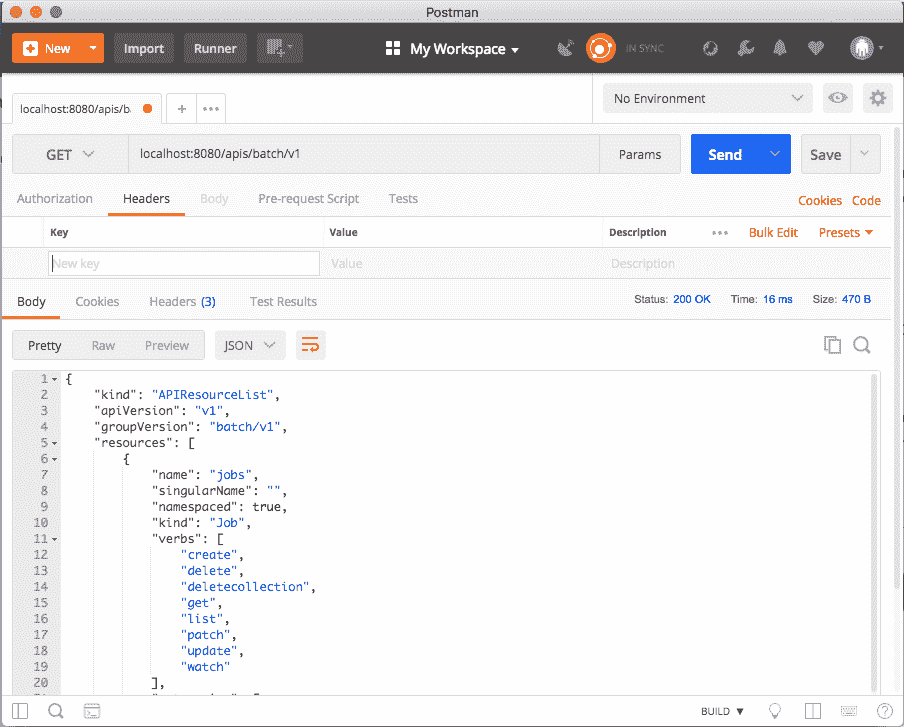

# 第十二章：自定义 Kubernetes - API 和插件

在本章中，我们将深入研究 Kubernetes 的内部。我们将从 Kubernetes API 开始，学习如何通过直接访问 API、Python 客户端来以编程方式使用 Kubernetes，然后我们将自动化 Kubectl。然后，我们将研究如何使用自定义资源扩展 Kubernetes API。最后一部分是关于 Kubernetes 支持的各种插件。Kubernetes 操作的许多方面都是模块化的，并且设计用于扩展。我们将研究几种类型的插件，如自定义调度程序、授权、准入控制、自定义指标和卷。最后，我们将研究如何扩展 Kubectl 并添加自己的命令。

我们涵盖的主题如下：

+   使用 Kubernetes API

+   扩展 Kubernetes API

+   编写 Kubernetes 和 Kubectl 插件

+   编写 webhooks

# 使用 Kubernetes API

Kubernetes API 是全面的，涵盖了 Kubernetes 的全部功能。正如您所期望的那样，它是庞大的。但它采用了最佳实践进行了良好设计，并且是一致的。如果您了解基本原则，您可以发现您需要了解的一切。

# 理解 OpenAPI

OpenAPI 允许 API 提供者定义其操作和模型，并使开发人员能够自动化其工具并生成其喜爱的语言客户端以与该 API 服务器通信。Kubernetes 已经支持 Swagger 1.2（OpenAPI 规范的旧版本）一段时间了，但规范是不完整和无效的，这使得基于它生成工具/客户端变得困难。

在 Kubernetes 1.4 中，为 OpenAPI 规范（在捐赠给 OpenAPI 倡议之前被称为 Swagger 2.0）添加了 alpha 支持，并更新了当前的模型和操作。在 Kubernetes 1.5 中，通过直接从 Kubernetes 源自动生成规范来完成了对 OpenAPI 规范的支持，这使得规范和文档与操作/模型的未来变化完全同步。

新规范使 API 文档更好，并且我们将在以后探索自动生成的 Python 客户端。

该规范是模块化的，并按组版本划分。这是未来的保证。您可以运行支持不同版本的多个 API 服务器。应用程序可以逐渐过渡到更新的版本。

规范的结构在 OpenAPI 规范定义中有详细解释。Kubernetes 团队使用操作标签来分隔每个组版本，并尽可能填写有关路径/操作和模型的信息。对于特定操作，所有参数、调用方法和响应都有文档记录。结果令人印象深刻。

# 设置代理

为了简化访问，您可以使用 Kubectl 设置代理：

```
> kubectl proxy --port 8080  
```

现在，您可以访问`http://localhost:8080`的 API 服务器，并且它将到达与 Kubectl 配置相同的 Kubernetes API 服务器。

# 直接探索 Kubernetes API

Kubernetes API 很容易找到。您只需浏览到 API 服务器的 URL`http://localhost:8080`，就可以获得一个描述路径键下所有可用操作的漂亮 JSON 文档。

由于空间限制，这里是部分列表：

```
{
 "paths": [
 "/api",
 "/api/v1",
 "/apis",
 "/apis/apps",
 "/apis/storage.k8s.io/v1",
 .
 .
 .
 "/healthz",
 "/healthz/ping",
 "/logs",
 "/metrics",
 "/swaggerapi/",
 "/ui/",
 "/version"
 ]
}
```

您可以深入了解任何一个路径。例如，这是来自`/api/v1/namespaces/default`端点的响应：

```
{
 "apiVersion": "v1",
 "kind": "Namespace",
 "metadata": {
 "creationTimestamp": "2017-12-25T10:04:26Z",
 "name": "default",
 "resourceVersion": "4",
 "selfLink": "/api/v1/namespaces/default",
 "uid": "fd497868-e95a-11e7-adce-080027c94384"
 },
 "spec": {
 "finalizers": [
 "kubernetes"
 ]
 },
 "status": {
 "phase": "Active"
 }
}
```

我首先通过访问`/api`，然后发现了`/api/v1`，告诉我有`/api/v1/namespaces`，指引我到`/api/v1/namespaces/default`。

# 使用 Postman 探索 Kubernetes API

Postman ([`www.getpostman.com`](https://www.getpostman.com))是一个非常成熟的用于处理 RESTful API 的应用程序。如果您更倾向于 GUI 界面，您可能会发现它非常有用。

以下截图显示了批处理`V1` API 组下可用的端点：



Postman 有很多选项，并且以非常令人愉悦的方式组织信息。试试看吧。

# 使用 httpie 和 jq 过滤输出

API 的输出有时可能太冗长。通常，您只对大量 JSON 响应中的一个值感兴趣。例如，如果您想获取所有运行服务的名称，可以访问`/api/v1/services`端点。然而，响应中包含许多无关的附加信息。这里是输出的一个非常部分子集：

```
$ http http://localhost:8080/api/v1/services
{
 "apiVersion": "v1",
 "items": [
 {
 "metadata": {
 "creationTimestamp": "2018-03-03T05:18:30Z",
 "labels": {
 "component": "apiserver",
 "provider": "kubernetes"
 },
 "name": "kubernetes",
 …
 },
 "spec": {
 …
 },
 "status": {
 "loadBalancer": {}
 }
 },
 …
 ],
 "kind": "ServiceList",
 "metadata": {
 "resourceVersion": "1076",
 "selfLink": "/api/v1/services"
 }
}
```

完整的输出有 121 行长！让我们看看如何使用`httpie`和`jq`来完全控制输出，并仅显示服务的名称。我更喜欢([`httpie.org/`](https://httpie.org/))而不是 CURL 来与命令行上的 REST API 进行交互。`jq` ([`stedolan.github.io/jq/`](https://stedolan.github.io/jq/))命令行 JSON 处理器非常适合切割和处理 JSON。

检查完整的输出，您会看到服务名称在 items 数组中每个项目的 metadata 部分。将选择`name`的`jq`表达式如下：

```
.items[].metadata.name
```

以下是完整的命令和输出：

```
$ http http://localhost:8080/api/v1/services | jq .items[].metadata.name
"kubernetes"
"kube-dns"
"kubernetes-dashboard"  
```

# 通过 Kubernetes API 创建一个 pod

API 也可以用于创建、更新和删除资源，只要提供`nginx-pod.json`中的 pod 清单：

```
{
 "kind": "Pod",
 "apiVersion": "v1",
 "metadata":{
 "name": "nginx",
 "namespace": "default",
 "labels": {
 "name": "nginx"
 }
 },
 "spec": {
 "containers": [{
 "name": "nginx",
 "image": "nginx",
 "ports": [{"containerPort": 80}]
 }]
 }
}
```

以下命令将通过 API 创建 pod：

```
> http POST http://localhost:8080/api/v1/namespaces/default/pods @nginx-pod.json  
```

验证它是否有效，让我们提取当前 pod 的名称和状态。端点如下：

```
/api/v1/namespaces/default/pods  
```

`jq`表达式如下：

```
items[].metadata.name,.items[].status.phase  
```

以下是完整的命令和输出：

```
> FILTER='.items[].metadata.name,.items[].status.phase'
> http http://localhost:8080/api/v1/namespaces/default/pods | jq $FILTER 
"nginx"
"Running"  
```

# 通过 Python 客户端访问 Kubernetes API

使用`httpie`和`jq`交互地探索 API 非常棒，但当您将其与其他软件消耗和集成时，API 的真正力量就会显现出来。Kubernetes 孵化器项目提供了一个功能齐全且文档非常完善的 Python`client`库。它可以在`https://github.com/kubernetes-incubator/client-python`上找到。

首先确保已安装 Python（2.7 或 3.5+）。然后安装 Kubernetes 包：

```
> pip install kubernetes
```

要开始与 Kubernetes 集群通信，您需要连接到它。启动一个交互式的 Python 会话：

```
> python
Python 3.6.4 (default, Mar  1 2018, 18:36:42)
[GCC 4.2.1 Compatible Apple LLVM 9.0.0 (clang-900.0.39.2)] on darwin
Type "help", "copyright", "credits" or "license" for more information.
>>>  
```

Python 客户端可以读取您的 Kubectl 配置：

```
>>> from kubernetes import client, config
>>> config.load_kube_config()
>>> v1 = client.CoreV1Api()  
```

或者它可以直接连接到已经运行的代理：

```
>>> from kubernetes import client, config
>>> client.Configuration().host = 'http://localhost:8080'
>>> v1 = client.CoreV1Api()  
```

请注意，客户端模块提供了访问不同组版本的方法，例如`CoreV1API`。

# 解剖 CoreV1API 组

让我们深入了解`CoreV1API`组。Python 对象有`481 个公共属性`：

```
>>> attributes = [x for x in dir(v1) if not x.startswith('__')]
>>> len(attributes)
481  
```

忽略以双下划线开头的`属性`，因为它们是与 Kubernetes 无关的特殊`class/instance`方法。

让我们随机挑选十个方法，看看它们是什么样子的：

```
>>> import random
>>> from pprint import pprint as pp
>>> pp(random.sample(attributes, 10))
['patch_namespaced_pod',
 'connect_options_node_proxy_with_path_with_http_info',
 'proxy_delete_namespaced_pod_with_path',
 'delete_namespace',
 'proxy_post_namespaced_pod_with_path_with_http_info',
 'proxy_post_namespaced_service',
 'list_namespaced_pod_with_http_info',
 'list_persistent_volume_claim_for_all_namespaces',
 'read_namespaced_pod_log_with_http_info',
 'create_node']  
```

非常有趣。`属性`以动词开头，比如 list、patch 或 read。其中许多都有`namespace`的概念，许多都有`with_http_info`后缀。为了更好地理解，让我们统计有多少动词存在，以及每个动词使用了多少`属性`（其中动词是下划线之前的第一个标记）：

```
>>> from collections import Counter
>>> verbs = [x.split('_')[0] for x in attributes]
>>> pp(dict(Counter(verbs)))
{'api': 1,
 'connect': 96,
 'create': 36,
 'delete': 56,
 'get': 2,
 'list': 56,
 'patch': 48,
 'proxy': 84,
 'read': 52,
 'replace': 50}  
```

我们可以进一步深入，查看特定`属性`的交互式帮助：

```
>>> help(v1.create_node)
Help on method create_node in module kuber-netes.client.apis.core_v1_api:

create_node(body, **kwargs) method of kuber-netes.client.apis.core_v1_api.CoreV1Api instance
 create a Node
 This method makes a synchronous HTTP request by default. To make an
 asynchronous HTTP request, please pass async=True
 >>> thread = api.create_node(body, async=True)
 >>> result = thread.get()

 :param async bool
 :param V1Node body: (required)
 :param str pretty: If 'true', then the output is pretty printed.
 :return: V1Node
 If the method is called asynchronously,
 returns the request thread.
```

您可以自己查看并了解有关 API 的更多信息。让我们看一些常见操作，如列出、创建、观察和删除对象。

# 列出对象

您可以列出不同类型的对象。方法名称以`list_`开头。以下是列出所有命名空间的示例：

```
 >>> for ns in v1.list_namespace().items:
...     print(ns.metadata.name)
...
default
kube-public
kube-system  
```

# 创建对象

要创建一个对象，您需要将一个 body 参数传递给 create 方法。body 必须是一个等同于您在 Kubectl 中使用的 YAML 配置文件的 Python 字典。最简单的方法是实际使用 YAML，然后使用 Python YAML 模块（这不是标准库的一部分，必须单独安装）来读取 YAML 文件并将其加载到字典中。例如，要创建一个带有`3`个副本的`nginx-deployment`，我们可以使用这个 YAML 配置文件：

```
apiVersion: apps/v1
kind: Deployment
metadata:
 name: nginx-deployment
spec:
 replicas: 3
 template:
 metadata:
 labels:
 app: nginx
 spec:
 containers:
 - name: nginx
 image: nginx:1.7.9
 ports:
 - containerPort: 80
```

要安装`yaml` Python 模块，请输入以下命令：

```
> pip install yaml
```

然后以下 Python 程序将创建部署：

```
from os import path
import yaml
from kubernetes import client, config

def main():
 # Configs can be set in Configuration class directly or using
 # helper utility. If no argument provided, the config will be 
 # loaded from default location.
 config.load_kube_config()

 with open(path.join(path.dirname(__file__), 
 'nginx-deployment.yaml')) as f:
 dep = yaml.load(f)
 k8s = client.AppsV1Api()
 status = k8s_beta.create_namespaced_deployment(
 body=dep, namespace="default").status
 print("Deployment created. status='{}'".format(status))

if __name__ == '__main__':
 main()
```

# 观察对象

观察对象是一种高级功能。它是使用单独的观察模块实现的。以下是一个示例，用于观察`10`个命名空间事件并将它们打印到屏幕上：

```
from kubernetes import client, config, watch

# Configs can be set in Configuration class directly or using helper utility
config.load_kube_config()
v1 = client.CoreV1Api()
count = 10
w = watch.Watch()
for event in w.stream(v1.list_namespace, _request_timeout=60):
 print(f"Event: {event['type']} {event['object'].metadata.name}") 
 count -= 1
 if count == 0:
 w.stop()

print('Done.')
```

# 以编程方式调用 Kubectl

如果您不是 Python 开发人员，也不想直接处理 REST API，那么您还有另一种选择。Kubectl 主要用作交互式命令行工具，但没有任何阻止您自动化它并通过脚本和程序调用它。使用 Kubectl 作为 Kubernetes API 客户端的一些好处包括：

+   易于找到任何用法的示例

+   在命令行上轻松实验，找到正确的命令和参数组合

+   Kubectl 支持以 JSON 或 YAML 格式输出，以便快速解析。

+   身份验证是通过 Kubectl 配置内置的

# 使用 Python 子进程运行 Kubectl

我将再次使用 Python，这样您可以比较使用官方 Python 客户端和自己编写的客户端。Python 有一个名为`subprocess`的模块，可以运行 Kubectl 等外部进程并捕获输出。以下是一个 Python 3 示例，独立运行 Kubectl 并显示用法输出的开头：

```
>>> import subprocess
>>> out = subprocess.check_output('kubectl').decode('utf-8')
>>> print(out[:276])  
```

Kubectl 控制 Kubernetes 集群管理器。在[`github.com/kubernetes/kubernetes`](https://github.com/kubernetes/kubernetes)找到更多信息。

以下是一些初学者的基本命令：

+   `create`：使用文件名或`stdin`创建资源

+   `expose`：获取复制控制器、服务、部署或 pod

`check_checkout()`函数将输出捕获为一个需要解码为`utf-8`以正确显示的字节数组。我们可以将其概括一点，并创建一个名为`k`的便利函数，它接受参数并将其传递给 Kubectl，然后解码输出并返回它：

```
from subprocess import check_output

def k(*args):
     out = check_output(['kubectl'] + list(args))
     return out.decode('utf-8')
Let's use it to list all the running pods in the default namespace:
>>> print(k('get', 'po'))

NAME                               Ready   Status  Restarts      Age 
nginx-deployment-6c54bd5869-9mp2g   1/1    Running    0          18m
nginx-deployment-6c54bd5869-lgs84   1/1    Running    0          18m
nginx-deployment-6c54bd5869-n7468   1/1    Running    0        . 18m  
```

这对于显示很好，但 Kubectl 已经做到了。当您使用带有`-o`标志的结构化输出选项时，真正的力量就会显现出来。然后结果可以自动转换为 Python 对象。这是`k()`函数的修改版本，它接受一个布尔值`use_json`关键字参数（默认为`False`）；如果为`True`，则添加`-o json`，然后将 JSON 输出解析为 Python 对象（字典）：

```
from subprocess import check_output
import json

def k(use_json=False, *args):
 cmd = ['kubectl']

 cmd += list(args)
 if use_json:
 cmd += ['-o', 'json']
 out = check_output(cmd)
 if use_json:
 out = json.loads(out)
 else:
 out = out.decode('utf-8')
 return out
```

返回一个完整的 API 对象，可以像直接访问 REST API 或使用官方 Python 客户端一样进行导航和钻取：

```
result = k('get', 'po', use_json=True)
for r in result['items']:
    print(r['metadata']['name'])

nginx-deployment-6c54bd5869-9mp2g
nginx-deployment-6c54bd5869-lgs84
nginx-deployment-6c54bd5869-n7468  
```

让我们看看如何删除`deployment`并等待所有 pod 消失。Kubectl delete 命令不接受`-o json`选项（尽管有`-o`名称），所以让我们不使用`use_json`：

```
k('delete', 'deployment', 'nginx-deployment')
while len(k('get', 'po', use_json=True)['items']) > 0:
   print('.')
print('Done.')

Done. 
```

# 扩展 Kubernetes API

Kubernetes 是一个非常灵活的平台。它允许您通过称为自定义资源的新类型资源扩展自己的 API。如果这还不够，您甚至可以提供与 Kubernetes API 服务器集成的 API 聚合机制。您可以用自定义资源做什么？很多。您可以使用它们来管理 Kubernetes 集群外部的 Kubernetes API 资源，您的 pod 与之通信。

通过将这些外部资源添加为自定义资源，您可以全面了解系统，并从许多 Kubernetes API 功能中受益，例如以下功能：

+   自定义 CRUD REST 端点

+   版本控制

+   观察

+   与通用 Kubernetes 工具的自动集成

自定义控制器和自动化程序的元数据

在 Kubernetes 1.7 中引入的自定义资源是对现在已弃用的第三方资源的重大改进。让我们深入了解一下自定义资源的全部内容。

# 理解自定义资源的结构

为了与 Kubernetes API 服务器协作，第三方资源必须符合一些基本要求。与内置 API 对象类似，它们必须具有以下字段：

+   `apiVersion`：`apiextensions.k8s.io`/`v1beta1`

+   `metadata`：标准 Kubernetes 对象元数据

+   `kind`：`CustomResourceDefinition`

+   `spec`：描述资源在 API 和工具中的外观

+   `status`：指示 CRD 的当前状态

规范具有内部结构，包括组、名称、范围、验证和版本等字段。状态包括字段`acceptedNames`和`Conditions`。在下一节中，我将为您展示一个示例，以阐明这些字段的含义。

# 开发自定义资源定义

您可以使用自定义资源定义（也称为 CRD）开发自定义资源。CRD 的目的是与 Kubernetes、其 API 和其工具平稳集成，因此您需要提供大量信息。这是一个名为`Candy`的自定义资源的示例：

```
apiVersion: apiextensions.k8s.io/v1beta1 
kind: CustomResourceDefinition 
metadata: 
  # name must match the spec fields below, and be in the form: <plural>.<group> 
  name: candies.awesome.corp.com 
spec: 
  # group name to use for REST API: /apis/<group>/<version> 
  group: awesome.corp.com 
  # version name to use for REST API: /apis/<group>/<version> 
  version: v1 
  # either Namespaced or Cluster 
  scope: Namespaced 
  names: 
    # plural name to be used in the URL: /apis/<group>/<version>/<plural> 
    plural: candies 
    # singular name to be used as an alias on the CLI and for display 
    singular: candy 
    # kind is normally the CamelCased singular type. Your resource manifests use this. 
    kind: Candy 
    # shortNames allow shorter string to match your resource on the CLI 
    shortNames: 
    - cn 
```

让我们创建它：

```
> kubectl create -f crd.yaml 
customresourcedefinition "candies.awesome.corp.com" created 
```

注意，返回的元数据名称带有复数标记。现在，让我们验证一下我们是否可以访问它：

```
> kubectl get crd
NAME                                      AGE
candies.awesome.corp.com                  17m
```

还有一个新的 API 端点用于管理这种新资源：

```
/apis/awesome.corp.com/v1/namespaces/<namespace>/candies/  
```

让我们使用我们的 Python 代码来访问它：

```
>>> config.load_kube_config()
>>> print(k('get', 'thirdpartyresources'))
NAME                                           AGE
candies.awesome.corp.com                       24m 
```

# 集成自定义资源

创建`CustomResourceDefinition`对象后，您可以特定地创建该资源类型的自定义资源，例如，在这种情况下是`Candy`（`candy`变为`CamelCase Candy`）。`Candy`对象可以包含任意字段和任意 JSON。在下面的示例中，`flavor`自定义字段设置在`Candy`对象上。`apiVersion`字段是从 CRD 规范的组和版本字段派生的：

```
apiVersion: "awesome.corp.com/v1" 
kind: Candy 
metadata: 
  name: chocolatem 
spec: 
  flavor: "sweeeeeeet" 
```

您可以向自定义资源添加任意字段。这些值可以是任何 JSON 值。请注意，这些字段未在 CRD 中定义。不同的对象可以具有不同的字段。让我们创建它：

```
> kubectl create -f candy.yaml
candy "chocolate" created 
```

此时，`kubectl`可以像操作内置对象一样操作`Candy`对象。请注意，在使用`kubectl`时，资源名称不区分大小写：

```
$ kubectl get candies
NAME        AGE
chocolate   2m  
```

我们还可以使用标准的`-o json`标志查看原始 JSON 数据。这次我会使用简称`cn`：

```
> kubectl get cn -o json
{
 "apiVersion": "v1",
 "items": [
 {
 "apiVersion": "awesome.corp.com/v1",
 "kind": "Candy",
 "metadata": {
 "clusterName": "",
 "creationTimestamp": "2018-03-07T18:18:42Z",
 "name": "chocolate",
 "namespace": "default",
 "resourceVersion": "4791773",
 "selfLink": "/apis/awesome.corp.com/v1/namespaces/default/candies/chocolate",
 "uid": "f7a6fd80-2233-11e8-b432-080027c94384"
 },
 "spec": {
 "flavor": "sweeeeeeet"
 }
 }
 ],
 "kind": "List",
 "metadata": {
 "resourceVersion": "",
 "selfLink": ""
 }
}  
```

# 完成自定义资源

自定义资源支持与标准 API 对象一样的 finalizers。finalizer 是一种机制，对象不会立即被删除，而是必须等待后台运行并监视删除请求的特殊控制器。控制器可以执行任何必要的清理操作，然后从目标对象中删除其 finalizer。对象上可能有多个 finalizer。Kubenetes 将等待直到所有 finalizer 都被删除，然后才删除对象。元数据中的 finalizer 只是它们对应的控制器可以识别的任意字符串。这里有一个示例，其中`Candy`对象有两个 finalizer，`eat-me`和`drink-me`：

```
apiVersion: "awesome.corp.com/v1" 
kind: Candy 
metadata: 
  name: chocolate 
  finalizers: 
  - eat-me 
  - drink-me 
spec: 
  flavor: "sweeeeeeet" 
```

# 验证自定义资源

您可以向 CRD 添加任何字段。这可能导致无效的定义。Kubernetes 1.9 引入了基于 OpenAPI V3 模式的 CRD 验证机制。它仍处于测试阶段，并且可以在启动 API 服务器时使用功能开关进行禁用：

```
--feature-gates=CustomResourceValidation=false    
```

在您的 CRD 中，您可以在规范中添加一个验证部分：

```
validation:
 openAPIV3Schema:
 properties:
 spec:
 properties:
 cronSpec:
 type: string
 pattern: '^(\d+|\*)(/\d+)?(\s+(\d+|\*)(/\d+)?){4}$'
 replicas:
 type: integer
 minimum: 1
 maximum: 10
```

如果您尝试创建违反规范验证的对象，您将收到错误消息。您可以在此处阅读有关 OpenAPI 模式的更多信息：`http://bit.ly/2FsBfWA`。

# 了解 API 服务器聚合

当您只需要对自己的类型进行一些 CRUD 操作时，CRDs 非常好。您可以直接在 Kubernetes API 服务器上运行，它将存储您的对象并提供 API 支持和与诸如 Kubectl 之类的工具集成。您可以运行控制器来监视您的对象，并在创建、更新或删除时执行一些操作。但 CRDs 有局限性。如果您需要更高级的功能和定制，您可以使用 API 服务器聚合并编写自己的 API 服务器，Kubernetes API 服务器将委托给它。

您的 API 服务器将使用与 Kubernetes API 服务器本身相同的 API 机制。一些高级功能如下：

+   控制对象的存储

+   多版本

+   超出 CRUD 的自定义操作（如 exec 或 scale）

+   使用协议缓冲区有效载荷

编写扩展 API 服务器是一项非常艰巨的工作。如果您决定需要所有这些功能，我建议使用 API 构建器项目：

[`github.com/kubernetes-incubator/apiserver-builder`](https://github.com/kubernetes-incubator/apiserver-builder)

这是一个年轻的项目，但它处理了许多必要的样板代码。API 构建器提供以下功能：

+   引导完整的类型定义、控制器和测试，以及文档

+   您可以在 Minikube 内部本地运行扩展控制平面，也可以在实际的远程集群上运行

+   您生成的控制器将能够监视和更新 API 对象

+   添加资源（包括子资源）

+   如果需要，您可以覆盖默认值

# 利用服务目录

Kubernetes 服务目录项目允许您平滑且无痛地集成任何支持 Open Service Broker API 规范的外部服务：

[`github.com/openservicebrokerapi/servicebroker`](https://github.com/openservicebrokerapi/servicebroker)

开放服务经纪人 API 的目的是通过支持文档和全面的测试套件，通过标准规范将外部服务暴露给任何云环境。这使提供商可以实现单一规范，并支持多个云环境。当前的环境包括 Kubernetes 和 CloudFoundry。该项目致力于广泛的行业采用。

服务目录对于集成云平台提供商的服务特别有用。以下是一些此类服务的示例：

+   Microsoft Azure Cloud Queue

+   Amazon Simple Queue Service

+   Google Cloud Pub/Sub

这种能力对于致力于云计算的组织来说是一个福音。您可以在 Kubernetes 上构建系统，但不必自己部署、管理和维护集群中的每个服务。您可以将这些工作外包给您的云提供商，享受深度集成，并专注于您的应用程序。

服务目录有可能使您的 Kubernetes 集群完全自主，因为它允许您通过服务经纪人来配置云资源。我们还没有达到那一步，但这个方向非常有前途。

这结束了我们对从外部访问和扩展 Kubernetes 的讨论。在下一节中，我们将把目光投向内部，并研究通过插件自定义 Kubernetes 内部工作的方法。

# 编写 Kubernetes 插件

在本节中，我们将深入研究 Kubernetes 的内部，并学习如何利用其著名的灵活性和可扩展性。我们将了解可以通过插件自定义的不同方面，以及如何实现这些插件并将其与 Kubernetes 集成。

# 编写自定义调度程序插件

Kubernetes 将自己定义为容器调度和管理系统。因此，调度程序是 Kubernetes 最重要的组件。Kubernetes 带有默认调度程序，但允许编写额外的调度程序。要编写自己的自定义调度程序，您需要了解调度程序的功能，它是如何打包的，如何部署您的自定义调度程序以及如何集成您的调度程序。调度程序源代码在这里可用：

[`github.com/kubernetes/kubernetes/tree/master/pkg/scheduler`](https://github.com/kubernetes/kubernetes/tree/master/pkg/scheduler)

在本节的其余部分，我们将深入研究源代码，并检查数据类型、算法和代码。

# 了解 Kubernetes 调度程序的设计

调度程序的工作是为新创建或重新启动的 pod 找到一个节点，并在 API 服务器中创建一个绑定并在那里运行它。如果调度程序找不到适合 pod 的节点，它将保持在挂起状态。

# 调度程序

调度程序的大部分工作都是相当通用的——它会找出哪些 pod 需要被调度，更新它们的状态，并在选定的节点上运行它们。定制部分是如何将 pod 映射到节点。Kubernetes 团队意识到了需要定制调度的需求，通用调度程序可以配置不同的调度算法。

主要数据类型是包含许多属性的调度程序`struct`，其中包含一个`Config struct`（这很快将被`configurator`接口替换）：

```
type Scheduler struct { 
    config *Config 
} 
```

这是`Config struct`：

```
type Config struct { 
    SchedulerCache schedulercache.Cache 
    Ecache     *core.EquivalenceCache 
    NodeLister algorithm.NodeLister 
    Algorithm  algorithm.ScheduleAlgorithm 
    GetBinder  func(pod *v1.Pod) Binder 
    PodConditionUpdater PodConditionUpdater 
    PodPreemptor PodPreemptor 
    NextPod func() *v1.Pod 
    WaitForCacheSync func() bool 
    Error func(*v1.Pod, error) 
    Recorder record.EventRecorder 
    StopEverything chan struct{} 
    VolumeBinder *volumebinder.VolumeBinder 
} 
```

其中大多数是接口，因此您可以使用自定义功能配置调度程序。特别是，如果您想要自定义 pod 调度，则调度程序算法是相关的。

# 注册算法提供程序

调度程序具有算法提供程序和算法的概念。它们一起让您使用内置调度程序的重要功能，以替换核心调度算法。

算法提供程序允许您使用工厂注册新的算法提供程序。已经注册了一个名为`ClusterAutoScalerProvider`的自定义提供程序。稍后我们将看到调度程序如何知道使用哪个算法提供程序。关键文件如下：

[`github.com/kubernetes/kubernetes/blob/master/pkg/scheduler/algorithmprovider/defaults/defaults.go`](https://github.com/kubernetes/kubernetes/blob/master/pkg/scheduler/algorithmprovider/defaults/defaults.go)

`init()`函数调用`registerAlgorithmProvider()`，您应该扩展它以包括您的算法提供程序以及默认和`autoscaler`提供程序：

```
func registerAlgorithmProvider(predSet, priSet sets.String) { 
    // Registers algorithm providers. By default we use 'DefaultProvider' 
    // but user can specify one to be used by specifying flag. 
    factory.RegisterAlgorithmProvider(factory.DefaultProvider, predSet, priSet) 
    // Cluster autoscaler friendly scheduling algorithm. 
    factory.RegisterAlgorithmProvider(ClusterAutoscalerProvider, predSet, 
        copyAndReplace(priSet, "LeastRequestedPriority", "MostRequestedPriority")) 
} 
```

除了注册提供程序，您还需要注册适合谓词和优先级函数，这些函数用于实际执行调度。

您可以使用工厂的`RegisterFitPredicate()`和`RegisterPriorityFunction2()`函数。

# 配置调度程序

调度程序算法作为配置的一部分提供。自定义调度程序可以实现`ScheduleAlgorithm`接口：

```
type ScheduleAlgorithm interface { 
    Schedule(*v1.Pod, NodeLister) (selectedMachine string, err error) 
    Preempt(*v1.Pod, NodeLister, error) (selectedNode *v1.Node,  
                                         preemptedPods []*v1.Pod,  
                                         cleanupNominatedPods []*v1.Pod,  
                                         err error) 
    Predicates() map[string]FitPredicate 
    Prioritizers() []PriorityConfig 
} 
```

当您运行调度程序时，您可以提供自定义调度程序的名称或自定义算法提供程序作为命令行参数。如果没有提供，则将使用默认的算法提供程序。调度程序的命令行参数是`--algorithm-provider`和`--scheduler-name`。

# 打包调度程序

自定义调度程序作为一个 pod 在同一个 Kubernetes 集群中运行。它需要被打包为一个容器镜像。让我们使用标准 Kubernetes 调度程序的副本进行演示。我们可以从源代码构建 Kubernetes 以获取调度程序镜像：

```
git clone https://github.com/kubernetes/kubernetes.git
cd kubernetes
make  
```

创建以下 Dockerfile：

```
FROM busybox
ADD ./_output/bin/kube-scheduler /usr/local/bin/kube-scheduler  
```

使用它来`构建`一个 Docker 镜像类型：

```
docker build -t custom-kube-scheduler:1.0 .  
```

最后，将镜像推送到容器注册表。我会在这里使用 DockerHub。您需要在 DockerHub 上创建一个帐户并登录，然后再推送您的镜像。

```
> docker login
> docker push g1g1/custom-kube-scheduler 
```

请注意，我在本地构建了调度程序，并且在 Dockerfile 中，我只是将它从主机复制到镜像中。当您在与构建相同的操作系统上部署时，这种方法是有效的。如果不是这种情况，那么最好将构建命令插入 Dockerfile 中。你需要付出的代价是需要将所有 Kubernetes 内容都拉入镜像中。

# 部署自定义调度程序

现在调度程序镜像已构建并在注册表中可用，我们需要为其创建一个 Kubernetes 部署。调度程序当然是关键的，所以我们可以使用 Kubernetes 本身来确保它始终在运行。以下 YAML 文件定义了一个部署，其中包含一个单一副本和一些其他功能，如活跃和就绪探针：

```
apiVersion: apps/v1 
kind: Deployment 
metadata: 
  labels: 
    component: scheduler 
    tier: control-plane 
  name: custom-scheduler 
  namespace: kube-system 
spec: 
  replicas: 1 
  template: 
    metadata: 
      labels:  
        component: scheduler 
        tier: control-plane 
        version: second 
    spec: 
      containers: 
      - command: 
        - /usr/local/bin/kube-scheduler 
        - --address=0.0.0.0 
        - --leader-elect=false 
        - --scheduler-name=custom-scheduler 
        image: g1g1/custom-kube-scheduler:1.0 
        livenessProbe: 
          httpGet: 
            path: /healthz 
            port: 10251 
          initialDelaySeconds: 15 
        name: kube-second-scheduler 
        readinessProbe: 
          httpGet: 
            path: /healthz 
            port: 10251 
        resources: 
          requests: 
            cpu: '0.1' 
```

调度程序的名称（这里是`custom-scheduler`）很重要，必须是唯一的。稍后将用它来将 pod 与调度程序关联起来进行调度。请注意，自定义调度程序属于`kube-system`命名空间。

# 在集群中运行另一个自定义调度程序

运行另一个自定义调度程序就像创建部署一样简单。这就是这种封装方法的美妙之处。Kubernetes 将运行第二个调度程序，这是一件大事，但 Kubernetes 并不知道发生了什么。它只是部署一个 pod，就像部署任何其他 pod 一样，只是这个 pod 碰巧是一个自定义调度程序：

```
$ kubectl create -f custom-scheduler.yaml  
```

让我们验证调度程序 pod 是否在运行：

```
$ kubectl get pods --namespace=kube-system
NAME                              READY    STATUS  RESTARTS   AGE
....
custom-scheduler-7cfc49d749-lwzxj  1/1     Running     0        2m
...  
```

我们的自定义调度程序正在运行。

# 将 pod 分配给自定义调度程序

好的。自定义调度程序正在与默认调度程序一起运行。但是当 pod 需要调度时，Kubernetes 如何选择要使用的调度程序呢？答案是 pod 决定而不是 Kubernetes。pod 规范具有一个可选的调度程序名称字段。如果缺少，将使用默认调度程序；否则，将使用指定的调度程序。这就是自定义调度程序名称必须是唯一的原因。默认调度程序的名称是`default-scheduler`，如果您想在 pod 规范中明确表示。以下是将使用默认调度程序安排的 pod 定义：

```
apiVersion: v1 
kind: Pod 
metadata: 
  name: some-pod 
  labels: 
    name: some-pod 
spec: 
  containers: 
  - name: some-container 
    image: gcr.io/google_containers/pause:2.0 
```

要让`custom-scheduler`安排此 pod，请将 pod 规范更改为以下内容：

```
apiVersion: v1 
kind: Pod 
metadata: 
  name: some-pod 
  labels: 
    name: some-pod 
spec: 
  schedulerName: custom-scheduler 
  containers: 
  - name: some-container 
    image: gcr.io/google_containers/pause:2.0 
```

# 验证使用自定义调度程序安排了 pod

有两种主要方法可以验证 pod 是否由正确的调度程序安排。首先，您可以创建需要由自定义调度程序安排的 pod，然后部署自定义调度程序。这些 pod 将保持在挂起状态。然后，部署自定义调度程序，挂起的 pod 将被安排并开始运行。

另一种方法是检查事件日志，并使用以下命令查找已安排的事件：

```
$ kubectl get events  
```

# 使用访问控制 webhooks

Kubernetes 始终为您提供自定义访问控制的方法。在 Kubernetes 中，访问控制可以表示为三 A：认证、授权和准入控制。在早期版本中，通过需要 Go 编程的插件来完成，安装到您的集群中，注册和其他侵入性程序。现在，Kubernetes 允许您自定义认证、授权和准入控制 webhooks。

# 使用认证 webhook

Kubernetes 允许您通过注入用于 bearer tokens 的 webhook 来扩展认证过程。它需要两个信息：如何访问远程认证服务以及认证决定的持续时间（默认为两分钟）。

要提供这些信息并启用认证 webhooks，请使用以下命令行参数启动 API 服务器：

+   `--runtime-config=authentication.k8s.io/v1beta1=true`

+   `--authentication-token-webhook-config-file`

+   `--authentication-token-webhook-cache-ttl`

配置文件使用`kubeconfig`文件格式。以下是一个例子：

```
clusters:
 - name: remote-authentication-service
 cluster:
 certificate-authority: /path/to/ca.pem
 server: https://example.com/authenticate

users:
 - name: k8s-api-server
 user:
 client-certificate: /path/to/cert.pem
 client-key: /path/to/key.pem

current-context: webhook
contexts:
- context:
 cluster: remote-authentication-service
 user: k8s-api-sever
 name: webhook
```

请注意，必须向 Kubernetes 提供客户端证书和密钥，以进行与远程认证服务的相互认证。

缓存 TTL 很有用，因为通常用户会对 Kubernetes 进行多次连续请求。缓存认证决策可以节省大量与远程认证服务的往返。 

当 API HTTP 请求到来时，Kubernetes 会从其标头中提取持有者令牌，并通过 Webhook 将`TokenReview` JSON 请求发送到远程认证服务：

```
{
  "apiVersion": "authentication.k8s.io/v1beta1",
  "kind": "TokenReview",
  "spec": {
    "token": "<bearer token from original request headers>"
  }
}    
```

远程认证服务将做出响应。认证状态将是 true 或 false。以下是成功认证的示例：

```
{ 
  "apiVersion": "authentication.k8s.io/v1beta1", 
  "kind": "TokenReview", 
  "status": { 
    "authenticated": true, 
    "user": { 
      "username": "gigi@gg.com", 
      "uid": "42", 
      "groups": [ 
        "developers", 
      ], 
      "extra": { 
        "extrafield1": [ 
          "extravalue1", 
          "extravalue2" 
        ] 
      } 
    } 
  } 
} 
```

拒绝的响应要简洁得多：

```
{ 
  "apiVersion": "authentication.k8s.io/v1beta1", 
  "kind": "TokenReview", 
  "status": { 
    "authenticated": false 
  } 
} 
```

# 使用授权 Webhook

授权 Webhook 与认证 Webhook 非常相似。它只需要一个与认证 Webhook 配置文件格式相同的配置文件。由于与认证不同，同一用户可能会对不同参数的不同 API 端点进行大量请求，并且授权决策可能不同，因此缓存不是一个可行的选项。

您可以通过向 API 服务器传递以下命令行参数来配置 Webhook：

+   `--runtime-config=authorization.k8s.io/v1beta1=true`

+   `--authorization-webhook-config-file=<configuration filename>`

当请求经过认证时，Kubernetes 将向远程授权服务发送`SubjectAccessReview` JSON 对象。它将包含请求用户以及请求的资源和其他请求属性：

```
{
  "apiVersion": "authorization.k8s.io/v1beta1",
  "kind": "SubjectAccessReview",
  "spec": {
    "resourceAttributes": {
      "namespace": "awesome-namespace",
      "verb": "get",
      "group": "awesome.example.org",
      "resource": "pods"
    },
    "user": "gigi@gg.com",
    "group": [
      "group1",
      "group2"
    ]
  }
}
```

请求将被允许：

```
{
  "apiVersion": "authorization.k8s.io/v1beta1",
  "kind": "SubjectAccessReview",
  "status": {
    "allowed": true
  }
} 
```

否则将被拒绝（并附带原因）：

```
{
  "apiVersion": "authorization.k8s.io/v1beta1",
  "kind": "SubjectAccessReview",
  "status": {
    "allowed": false,
    "reason": "user does not have read access to the namespace"
  }
}
```

用户可能被授权访问资源，但不能访问非资源属性，如/`api`、/`apis`、/`metrics`、/`resetMetrics`、/`logs`、/`debug`、/`healthz`、`/swagger-ui/`、`/swaggerapi/`、`/ui`和`/version`。

以下是如何请求访问日志：

```
{ 
  "apiVersion": "authorization.k8s.io/v1beta1", 
  "kind": "SubjectAccessReview", 
  "spec": { 
    "nonResourceAttributes": { 
      "path": "/logs", 
      "verb": "get" 
    }, 
    "user": "gigi@gg.com", 
    "group": [ 
      "group1", 
      "group2" 
    ] 
  } 
} 
```

# 使用准入控制 Webhook

动态准入控制也支持 Webhook。它仍处于 alpha 阶段。您需要通过向 API 服务器传递以下命令行参数来启用通用准入 Webhook：

+   `--admission-control=GenericAdmissionWebhook`

+   `--runtime-config=admissionregistration.k8s.io/v1alpha1`

# 动态配置 Webhook 准入控制器

在启动 API 服务器时，必须配置认证和授权 Webhook。可以通过创建`externaladmissionhookconfiguration`对象来动态配置准入控制 Webhook：

```
apiVersion: admissionregistration.k8s.io/v1alpha1 
kind: ExternalAdmissionHookConfiguration 
metadata: 
  name: example-config 
externalAdmissionHooks: 
- name: pod-image.k8s.io 
  rules: 
  - apiGroups: 
    - "" 
    apiVersions: 
    - v1 
    operations: 
    - CREATE 
    resources: 
    - pods 
  failurePolicy: Ignore 
  clientConfig: 
    caBundle: <pem encoded ca cert that signs the server cert used by the webhook> 
    service: 
      name: <name of the front-end service> 
      namespace: <namespace of the front-end service> 
```

# 为水平 Pod 自动缩放提供自定义指标

在 Kubernetes 1.6 之前，自定义指标是作为 Heapster 模型实现的。在 Kubernetes 1.6 中，引入了一个新的自定义指标 API，并逐渐成熟。截至 Kubernetes 1.9，它们已默认启用。自定义指标依赖于 API 聚合。推荐的路径是从这里开始使用自定义指标 API 服务器样板：

[`github.com/kubernetes-incubator/custom-metrics-apiserver`](https://github.com/kubernetes-incubator/custom-metrics-apiserver)

然后，您实现`CustomMetricsProvider`接口：

```
type CustomMetricsProvider interface { 
    GetRootScopedMetricByName(groupResource schema.GroupResource,  
                              name string,  
                              metricName string) (*custom_metrics.MetricValue, error) 
    GetRootScopedMetricBySelector(groupResource schema.GroupResource,  
                                  selector labels.Selector,  
                                  metricName string) (*custom_metrics.MetricValueList,  
                                                                  error) 
    GetNamespacedMetricByName(groupResource schema.GroupResource,  
                              namespace string,  
                              name string,  
                              metricName string) (*custom_metrics.MetricValue, error) 
    GetNamespacedMetricBySelector(groupResource schema.GroupResource,  
                                                           namespace string,  
                                                           selector labels.Selector,  
                                                           metricName string)  (*MetricValueList, error) 
    ListAllMetrics() []MetricInfo 
}  
```

# 使用自定义存储扩展 Kubernetes

卷插件是另一种类型的插件。在 Kubernetes 1.8 之前，您必须编写一个需要实现、注册到 Kubernetes 并与 Kubelet 链接的 Kublet 插件。Kubernetes 1.8 引入了 FlexVolume，这是更加灵活的。Kubernetes 1.9 通过**容器存储接口**（**CSI**）将其提升到了下一个级别。

# 利用 FlexVolume

Kubernetes 卷插件旨在支持特定类型的存储或存储提供程序。有许多卷插件，我们在第七章中介绍了这些内容，*处理 Kubernetes 存储*。现有的卷插件对于大多数用户来说已经足够了，但是如果您需要集成一个不受支持的存储解决方案，您必须实现自己的卷插件，这并不是微不足道的。如果您希望它被接受为官方的 Kubernetes 插件，那么您必须经过严格的批准流程。但是`FlexVolume`提供了另一条路径。它是一个通用插件，允许您连接不受支持的存储后端，而无需与 Kubernetes 本身进行深度集成。

`FlexVolume`允许您向规范添加任意属性，并通过调用接口与您的后端通信，该接口包括以下操作：

+   **附加**：将卷附加到 Kubernetes Kubelet 节点

+   **分离**：从 Kubernetes Kubelet 节点分离卷

+   **挂载**：挂载附加的卷

+   **卸载**：卸载附加的卷

每个操作都由后端驱动程序作为二进制实现，FlexVolume 在正确的时间调用。驱动程序必须安装在`/usr/libexec/kubernetes/kubelet-plugins/volume/exec/<vendor>~<driver>/<driver>`中。

# 受益于 CSI

FlexVolume 提供了超出树插件的能力，但仍需要 FlexVolume 插件本身和一种相当繁琐的安装和调用模型。CSI 将通过让供应商直接实现它来显著改进。最好的是，作为开发人员，你不必创建和维护这些插件。实现和维护 CSI 是存储解决方案提供商的责任，他们有兴趣尽可能地使其稳健，以便人们不选择在 Kubernetes（以及与 CSI 集成的其他平台）上直接使用的不同存储解决方案。

# 总结

在本章中，我们涵盖了三个主要主题：使用 Kubernetes API、扩展 Kubernetes API 和编写 Kubernetes 插件。Kubernetes API 支持 OpenAPI 规范，是 REST API 设计的一个很好的例子，遵循了所有当前的最佳实践。它非常一致、组织良好、文档完善，但它是一个庞大的 API，不容易理解。你可以通过 REST over HTTP 直接访问 API，使用包括官方 Python 客户端在内的客户端库，甚至通过调用 Kubectl。

扩展 Kubernetes API 涉及定义自己的自定义资源，并通过 API 聚合可选地扩展 API 服务器本身。当你外部查询和更新它们时，自定义资源在与额外的自定义插件或控制器相结合时最有效。

插件和 webhooks 是 Kubernetes 设计的基础。Kubernetes 始终旨在由用户扩展以适应任何需求。我们看了一些你可以编写的插件和 webhooks，以及如何注册和无缝集成它们到 Kubernetes 中。

我们还研究了自定义指标，甚至如何通过自定义存储选项扩展 Kubernetes。

在这一点上，你应该很清楚通过 API 访问、自定义资源和自定义插件来扩展、定制和控制 Kubernetes 的所有主要机制。你处于一个很好的位置，可以利用这些能力来增强 Kubernetes 的现有功能，并使其适应你的需求和系统。

在下一章中，我们将看一下 Helm，Kubernetes 包管理器，以及它的图表。正如你可能已经意识到的那样，在 Kubernetes 上部署和配置复杂系统远非简单。Helm 允许将一堆清单组合成一个图表，可以作为单个单元安装。
