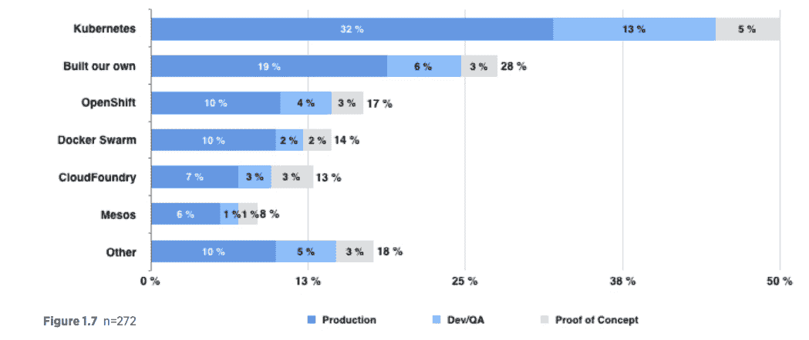

# Kubernetes 的未来

在这一章中，我们将从多个角度探讨 Kubernetes 的未来。我们将从路线图和即将推出的产品功能开始，包括深入探讨 Kubernetes 的设计过程。然后，我们将涵盖 Kubernetes 自诞生以来的动力，包括社区、生态系统和知名度等方面。Kubernetes 未来的一个重要部分将取决于它在竞争中的表现。教育也将发挥重要作用，因为容器编排是一个新的、快速发展的、并且不是一个被充分理解的领域。然后，我们将讨论我心中最希望的一个功能——动态插件。

涵盖的主题如下：

+   前方的道路

+   竞争

+   Kubernetes 的动力

+   教育和培训

+   模块化和树外插件

+   服务网格和无服务器框架

# 前方的道路

Kubernetes 是一个庞大的开源项目。让我们来看看一些计划中的功能和即将推出的版本，以及专注于特定领域的各种特别兴趣小组。

# Kubernetes 发布和里程碑

Kubernetes 有相当规律的发布。截至 2018 年 4 月，当前版本是 1.10。下一个版本 1.11 目前已经完成 33%。以下是 1.11 版本的一些问题，让你了解正在进行的工作：

+   更新到 Go 1.10.1 并将默认的`etcd`服务器更新到 3.2

+   支持树外认证提供者

+   将 kublet 标志迁移到`kublet.config.k8s.io`

+   添加对 Azure 标准负载均衡器和公共 IP 的支持

+   添加 kubectl `api-resources`命令

+   次要版本每 3 个月发布一次，补丁版本填补漏洞和问题，直到下一个次要版本。以下是最近三个版本的发布日期：

+   10.0 版本于 2018 年 3 月 26 日发布，1.9.6 版本于 2018 年 3 月 21 日发布

+   9.0 版本于 2017 年 12 月 15 日发布，1.8.5 版本于 2017 年 12 月 7 日发布

+   8.0 和 1.7.7 版本于 2017 年 9 月 28 日发布（我的生日！）

了解即将推出的内容的另一个好方法是查看 alpha 和 beta 版本的工作。您可以在这里查看更改日志：[`github.com/kubernetes/kubernetes/blob/master/CHANGELOG.md`](https://github.com/kubernetes/kubernetes/blob/master/CHANGELOG.md)。

以下是 1.10 版本的一些主要主题：

+   节点

+   网络

+   存储

+   Windows

+   OpenStack

+   API 机械

+   认证

+   Azure

+   CLI

# Kubernetes 特别兴趣和工作组

作为一个大型的开源社区项目，Kubernetes 的大部分开发工作都是在多个工作组中进行的。完整的列表在这里：

[`github.com/kubernetes/community/blob/master/sig-list.md`](https://github.com/kubernetes/community/blob/master/sig-list.md)

未来版本的规划主要在这些 SIG 和工作组内进行，因为 Kubernetes 太大了，无法集中处理。SIG 定期会面并讨论。

# 竞争

《精通 Kubernetes》的第一版于 2017 年 5 月出版。当时，Kubernetes 的竞争格局完全不同。以下是我当时写的内容：

"Kubernetes 在容器编排技术领域是最热门的之一。Kubernetes 的未来必须作为整个市场的一部分来考虑。正如你将看到的，一些可能的竞争对手也可能是促进他们自己的产品以及 Kubernetes 的合作伙伴（或至少 Kubernetes 可以在他们的平台上运行）"。

不到一年的时间，情况发生了巨大变化。简而言之，Kubernetes 获胜了。所有云提供商都提供托管的 Kubernetes 服务。IBM 为裸机集群上的 Kubernetes 提供支持。开发容器编排软件和附加组件的公司都专注于 Kubernetes，而不是创建支持多种编排解决方案的产品。

# 捆绑的价值

容器编排平台如 Kubernetes 直接和间接地与更大和更小的范围竞争。例如，Kubernetes 可能在特定的云平台上可用，比如 AWS，但可能不是默认/首选解决方案。另一方面，Kubernetes 是 Google 云平台上 GKE 的核心。选择更高级抽象级别的开发人员，比如云平台或甚至 PaaS，往往会选择默认解决方案。但一些开发人员或组织担心供应商锁定或需要在多个云平台或混合公共/私有上运行。Kubernetes 在这里有很大的优势。捆绑曾经是 Kubernetes 采用的一个潜在严重威胁，但势头太大了，现在每个主要参与者都直接在他们的平台或解决方案上提供 Kubernetes。

# Docker Swarm

Docker 目前是容器的事实标准（尽管 CoreOS rkt 正在崭露头角），人们经常在说容器时指的是 Docker。Docker 希望在编排领域分一杯羹，并发布了 Docker Swarm 产品。Docker Swarm 的主要优点是它作为 Docker 安装的一部分，并使用标准的 Docker API。因此，学习曲线不会那么陡峭，更容易上手。然而，Docker Swarm 在功能和成熟度方面远远落后于 Kubernetes。此外，当涉及到高质量工程和安全性时，Docker 的声誉并不好。关心系统稳定性的组织和开发人员可能会远离 Docker Swarm。Docker 意识到了这个问题，并正在采取措施加以解决。它发布了企业版，并通过 Moby 项目重塑了 Docker 的内部作为一组独立的组件。但是，最近 Docker 承认了 Kubernetes 作为容器编排平台的重要地位。Docker 现在直接支持 Kubernetes 和 Docker Swarm 并存。我猜想 Docker Swarm 会逐渐消失，只会用于非常小的原型。

# Mesos/Mesosphere

Mesosphere 是开源 Apache Mesos 背后的公司，DC/OS 产品是在云中运行容器和大数据的现有产品。该技术已经成熟，Mesosphere 在不断发展，但他们没有 Kubernetes 拥有的资源和动力。我相信 Mesosphere 会做得很好，因为这是一个大市场，但它不会威胁 Kubernetes 作为头号容器编排解决方案。此外，Mesosphere 也意识到他们无法击败 Kubernetes，并选择加入它。在 DC/OS 1.11 中，您可以获得 Kubernetes 即服务。DC/OS 提供的是一个高可用、易于设置和默认安全的 Kubernetes 部署，经过了在 Google、AWS 和 Azure 上的测试。

# 云平台

许多组织和开发人员涌向公共云平台，以避免基础设施的低级管理带来的麻烦。这些公司的主要动机通常是快速前进，专注于他们的核心竞争力。因此，他们通常会选择云提供商提供的默认部署解决方案，因为集成是最无缝和流畅的。

# AWS

通过官方的 Kubernetes Kops 项目，Kubernetes 在 AWS 上运行得非常好：[`github.com/kubernetes/kops`](https://github.com/kubernetes/kops)。

Kops 的一些特性如下：

+   自动化在 AWS 中部署 Kubernetes 集群

+   部署高可用的 Kubernetes 主节点

+   生成 Terraform 配置的能力

然而，Kops 不是官方的 AWS 解决方案。如果您通过 AWS 控制台和 API 管理基础设施，最简单的方法过去是 AWS **弹性容器服务**（**ECS**）——这是一个不基于 Kubernetes 的内置容器编排解决方案。

现在，AWS 完全致力于 Kubernetes，并正在发布**弹性 Kubernetes 服务**（**EKS**），这是一个完全托管且高可用的上游 Kubernetes 集群，没有修改，但通过附加组件和插件与 AWS 服务紧密集成。

我在第一版中推测 AWS 会坚守立场，支持 ECS，但我错了。即使强大的 AWS 也向 Kubernetes 让步；ECS 会继续存在，因为许多组织已经投资其中，可能不想迁移到 Kubernetes。然而，我预测随着时间的推移，ECS 将被降级为传统服务状态，维护以支持那些没有足够动力迁移到 Kubernetes 的组织。

# Azure

Azure 提供了 Azure 容器服务，他们不偏袒。您可以选择是否要使用 Kubernetes、Docker Swarm 或 DC/OS。这很有趣，因为最初，Azure 是基于 Mesosphere DC/OS 的，后来他们添加了 Kubernetes 和 Docker Swarm 作为编排选项。随着 Kubernetes 在功能、成熟度和知名度上的提升，我相信它也将成为 Azure 上的头号编排选项。

在 2017 年下半年，Azure 正式发布了**Azure Kubernetes 服务**（**AKS**），微软完全支持 Kubernetes 作为容器编排解决方案。它在 Kubernetes 社区非常活跃，收购了 Deis（Helm 的开发者），并贡献了许多工具、代码修复和集成。对 Kubernetes 的 Windows 支持也在不断改进，与 Azure 的集成也在不断加强。

# 阿里巴巴云

阿里云在很多方面都是中国的 AWS。他们的 API 故意设计得非常像 AWS 的 API。阿里云曾经提供基于 Docker Swarm 的容器管理服务。我在阿里云上部署了一些小规模的应用，他们似乎能够跟上领域的变化并迅速跟随大公司。在过去的一年里，阿里云加入了 Kubernetes 支持者的行列。在阿里云上部署和管理 Kubernetes 集群的资源有几个，包括云提供商接口的 GitHub 实现。

# Kubernetes 势头

Kubernetes 背后有巨大的势头；社区非常强大。随着 Kubernetes 的知名度增加，用户纷纷涌向 Kubernetes，技术媒体承认其领导地位，生态系统火热，许多大公司（除了谷歌）积极支持它，还有许多公司在评估并在生产中运行它。

# 社区

Kubernetes 社区是其最大的资产之一。Kubernetes 最近成为第一个从云原生计算基金会（CNCF）毕业的项目。

# GitHub

Kubernetes 在 GitHub 上开发，是 GitHub 上排名靠前的项目之一。它在星星数量上排在前 0.01%，在活跃度上排名第一。请注意，过去一年，Kubernetes 变得更加模块化，现在许多部分都是分开开发的。

更多专业人士在他们的 LinkedIn 档案中列出 Kubernetes，比其他类似产品多得多。

一年前，Kubernetes 有大约 1,100 名贡献者和大约 34,000 次提交。现在，这个数字激增到了超过 1,600 名贡献者和超过 63,000 次提交。

# 会议和聚会

Kubernetes 势头的另一个指标是会议、聚会和参与者的数量。KubeCon 迅速增长，新的 Kubernetes 聚会每天都在开展。

# 思维份额

Kubernetes 受到了很多关注和部署。进入容器/DevOps/微服务领域的大大小小公司都采用 Kubernetes，趋势是明显的。一个有趣的指标是随着时间推移，Stack Overflow 上的问题数量。社区积极回答问题并促进合作。其增长超过了竞争对手，趋势非常明显：

# 生态系统

Kubernetes 生态系统非常令人印象深刻，从云提供商到 PaaS 平台和提供简化环境的初创公司。

# 公共云提供商

所有主要的云提供商都直接支持 Kubernetes。显然，谷歌在 GKE 方面处于领先地位，这是谷歌云平台上的本地容器引擎。前面提到的 Kops 项目是 AWS 上一个得到良好支持、维护和记录的解决方案，EKS 即将推出。Azure 提供 AKS。IBM 的容器云服务由 Kubernetes 提供支持。Oracle 密切关注 Kubernetes，并基于上游 Kubernetes 和 Kubeadm 提供 Oracle 容器服务。

# OpenShift

OpenShift 是 RedHat 的容器应用产品，构建在开源的 OpenShift origin 之上，后者基于 Kubernetes。OpenShift 在 Kubernetes 之上增加了应用程序生命周期管理和 DevOps 工具，并为 Kubernetes 做出了很多贡献（如自动扩展）。这种互动非常健康和鼓舞人心。RedHat 最近收购了 CoreOS，CoreOS Tectonic 与 OpenShift 的合并可能会产生很大的协同效应。

# OpenStack

OpenStack 是开源的私有云平台，最近决定将 Kubernetes 作为底层编排平台进行标准化。这是一件大事，因为希望在公有云和私有云混合部署的大型企业将会更好地与 Kubernetes 云联邦和以 Kubernetes 为私有云平台的 OpenStack 进行集成。

2017 年 11 月的最新 OpenStack 调查显示，Kubernetes 是迄今为止最受欢迎的容器编排解决方案：

# 其他参与者

还有许多其他公司将 Kubernetes 作为基础，比如 Rancher 和 Apprenda。大量初创公司开发了运行在 Kubernetes 集群内部的附加组件和服务。未来是光明的。

# 教育和培训

教育将至关重要。随着 Kubernetes 的早期采用者向大多数人过渡，为组织和开发人员提供正确的资源快速掌握 Kubernetes 并提高生产力非常重要。已经有一些非常好的资源，未来我预计数量和质量将会增加。当然，你现在正在阅读的这本书也是这一努力的一部分。

官方的 Kubernetes 文档越来越好。在线教程非常适合入门：

+   CNCF 提供免费的入门级 Kubernetes 课程（以及更高级的付费课程），网址为[`www.cncf.io/certification/training/`](https://www.cncf.io/certification/training/)。

+   谷歌在 Kubernetes 上创建了一些 Udacity 课程。您可以在[`www.udacity.com/course/scalable-microservices-with-kubernetes--ud615`](https://www.udacity.com/course/scalable-microservices-with-kubernetes--ud615)上查看它们。

+   另一个很好的资源是 KataCoda，它提供了一个完全免费的 Kubernetes 游乐场，您可以在几秒钟内获得一个私有集群，以及关于高级主题的多个实践教程，网址为[`www.katacoda.com/courses/kubernetes`](https://www.katacoda.com/courses/kubernetes)。

此外，还有许多付费的 Kubernetes 培训选项。随着 Kubernetes 的流行程度进一步增长，将会有越来越多的选择。

# 模块化和外部插件

自第一版以来，Kubernetes 在模块化方面取得了巨大进步。Kubernetes 一直是灵活和可扩展的典范。然而，最初您必须将代码构建并链接到 Kubernetes API 服务器或 Kublet（除了 CNI 插件）。您还必须获得代码的审查并将其集成到主要的 Kubernetes 代码库中，以使其对其他开发人员可用。当时，我对 Go 1.8 动态插件以及它们如何以更加灵活的方式扩展 Kubernetes 感到非常兴奋。Kubernetes 的开发人员和社区选择了不同的路径，并决定使 Kubernetes 成为一个通用和多功能的引擎，几乎可以通过标准接口从外部定制或扩展每个方面。您在第十二章中看到了许多示例，*自定义 Kubernetes - API 和插件*。外部插件的方法意味着您将插件或扩展集成到 GitHub 上 Kubernetes 代码树之外的 Kubernetes 中。有几种正在使用的机制：

+   CNI 插件使用标准输入和输出通过单独的可执行文件

+   CSI 插件使用 Pods gRPC

+   Kubectl 插件使用 YAML 描述符和二进制命令

+   API 聚合器使用自定义 API 服务器

+   Webhooks 使用远程 HTTP 接口

+   各种其他插件可以部署为 Pod

+   外部凭证提供者

# 服务网格和无服务器框架

Kubernetes 在容器编排和成本降低方面帮助了很多繁重的工作。但是，在云原生世界中有两个趋势正在蓬勃发展。服务网格与 Kubernetes 完美契合，运行无服务器框架也发挥了 Kubernetes 的优势。

# 服务网格

服务网格在容器编排的层次上操作。服务网格管理服务。服务网格在运行具有数百或数千个不同服务的系统时提供了各种必要的能力。

+   动态路由

+   感知延迟的东西向负载平衡（集群内部）

+   自动重试幂等请求

+   运营指标

过去，应用程序必须在核心功能之上解决这些责任。现在，服务网格减轻了负担，并提供了一个基础架构层，使应用程序可以专注于它们的主要目标。

最著名的服务网格是 Buoyant 的 Linkered。Linkered 支持 Kubernetes 以及其他编排器。但是，鉴于 Kubernetes 的势头。

Buoyant 决定开发一个名为 Conduit（用 Rust 编写）的新的仅限于 Kubernetes 的服务网格。这是对 Kubernetes 受欢迎程度的又一个证明，所有的创新都在这里发生。另一个 Kubernetes 服务网格是 Istio。Istio 由来自 Google、IBM 和 Lyft 的团队创建。它是建立在 Lyft 的 Envoy 之上，并且发展迅速。

# 无服务器框架

无服务器计算是云原生领域的一个令人兴奋的新趋势。AWS Lambda 函数是最受欢迎的，但现在所有云平台都提供它们。其思想是你不必预留硬件、实例和存储。相反，你只需编写你的代码，打包它（通常在一个容器中），并在需要时调用它。云平台在调用时负责分配资源来运行你的代码，并在代码运行结束时释放资源。这可以节省大量成本（你只支付你使用的资源）并消除了预留和管理基础设施的需求。然而，云提供商提供的无服务器能力通常带有附加条件（运行时和内存限制），或者它们不够灵活（无法控制你的代码将在哪种硬件上运行）。一旦你的集群被预留，Kubernetes 也可以提供无服务器能力。有多个不同成熟度水平的框架可用，如下所示：

+   Fast-netes

+   Nuclio.io

+   Apache OpenWhisk

+   Platform9 Fission

+   Kubless.io

对于在裸金属上运行 Kubernetes 或需要比云平台提供的更灵活性的人来说，这是个好消息。

# 总结

在本章中，我们展望了 Kubernetes 的未来，前景看好！技术基础、社区、广泛支持和势头都非常令人印象深刻。Kubernetes 仍然年轻，但创新和稳定化的速度非常令人鼓舞。Kubernetes 的模块化和可扩展性原则使其成为现代云原生应用程序的通用基础。

到目前为止，您应该清楚地了解 Kubernetes 目前的状况以及未来的发展方向。您应该相信 Kubernetes 不仅会留下来，而且将成为未来许多年的主要容器编排平台，并将与更大的产品和环境集成。

现在，轮到您利用所学知识，用 Kubernetes 构建令人惊奇的东西了！
