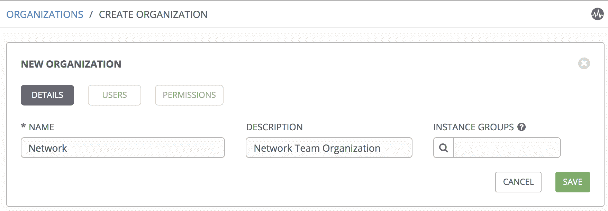
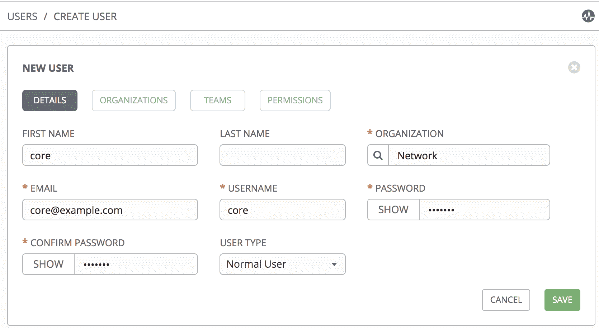
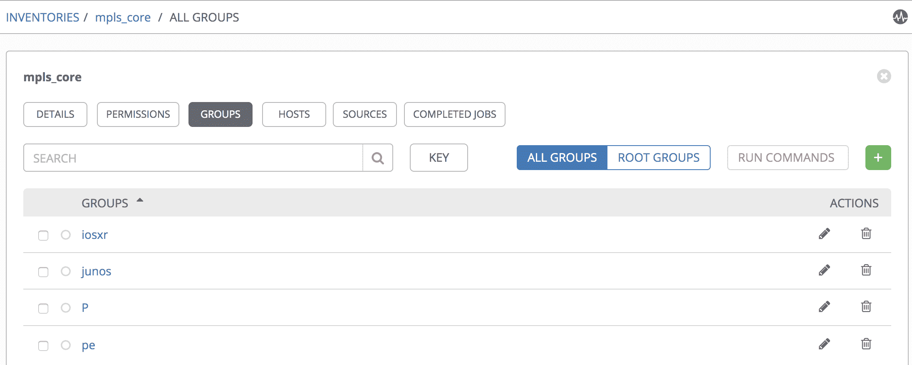
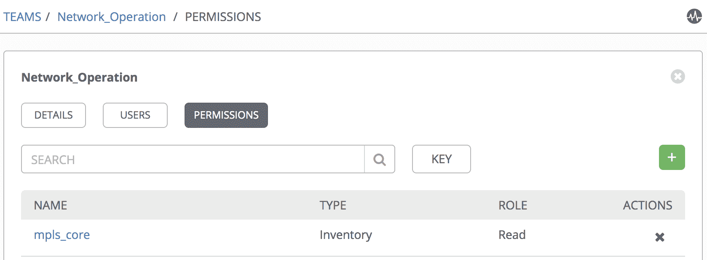
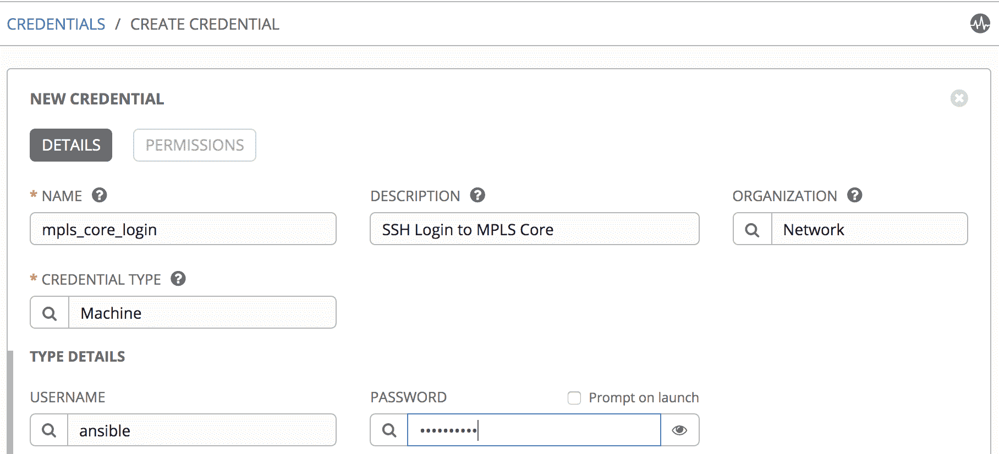
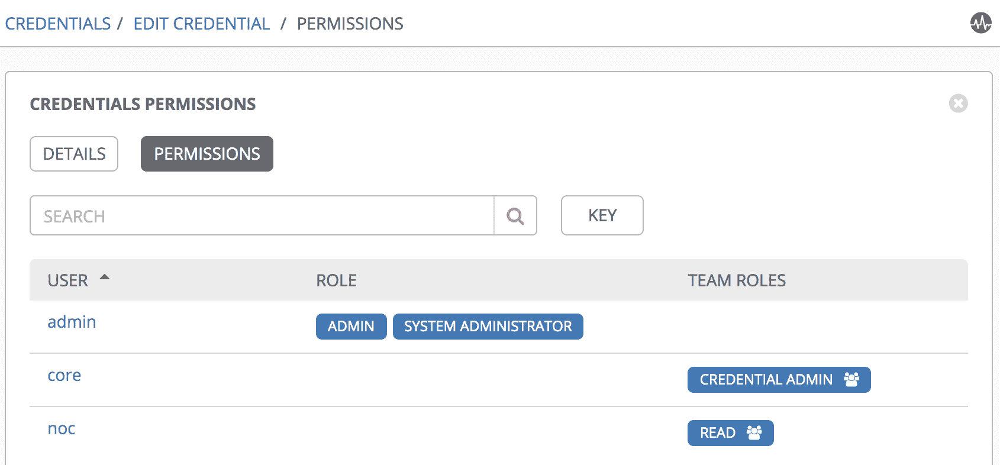
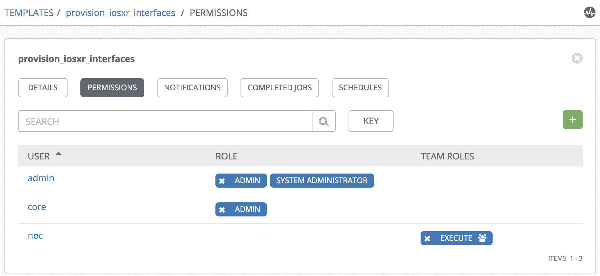
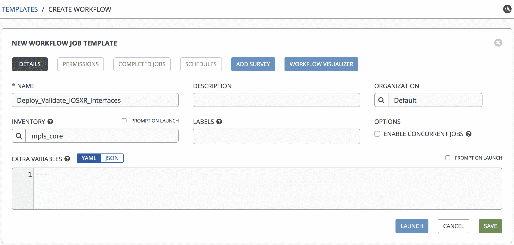

# 十二、利用 AWX 和 Ansible 简化自动化

在本书前面的所有章节中，我们一直在使用 Ansible，更具体地说是 Ansible Engine，我们使用 Ansible 提供的**命令行界面** ( **CLI** )选项执行了不同的自动化任务。然而，在一个跨多个团队的信息技术企业中，在这种方法中大规模使用 Ansible 可能具有挑战性。这就是为什么我们将介绍**可执行网页** ( **AWX** )框架。AWX 是一个开源项目，是红帽 Ansible Tower 衍生的上游项目。

AWX 是 Ansible Engine 的包装器，它提供了额外的功能，以简化 Ansible 在企业中跨不同团队的大规模运行。它提供了多个附加功能，如下所示:

*   **基于图形用户界面的界面**

AWX 提供了一个可视化的仪表板来执行 Ansible 行动手册并监控它们的状态，以及提供关于 AWX 内不同对象的不同统计数据。

*   **基于角色的访问控制(RBAC)**

AWX 为 RBAC 提供了 AWX 界面中的所有对象，如 Ansible 剧本、Ansible 目录和机器凭证。这个 RBAC 提供了关于谁可以在 AWX 创建/编辑/删除不同组件的细粒度控制。这为将简单的自动化任务委托给操作团队提供了一个非常强大的框架，设计团队可以专注于开发行动手册和工作流。AWX 能够定义不同的用户，并根据他们的工作角色为他们分配权限。

*   **库存管理**

AWX 提供了一个图形用户界面，可以将库存定义为静态或动态的，并且能够定义主机和组，类似于 Ansible 遵循的结构。

*   **证件管理**

AWX 对用于访问组织中不同系统(如服务器和网络设备)的凭证(如密码和**安全外壳** ( **SSH** )密钥)进行集中管理。所有凭据一旦创建，就会被加密，并且不能以明文格式检索。这为这些敏感信息提供了更多的安全控制。

*   **集中测井**

AWX 为在 AWX 节点上运行的所有自动化任务收集日志，因此可以完成审核，以了解谁在哪些节点上运行哪些行动手册，以及这些行动手册的状态。

*   **表征状态转移(RESTful)应用编程接口(API)**

AWX 提供了丰富的 API，允许我们从 API 执行自动化任务；这简化了 Ansible 与其他编排和票务系统的集成，这些系统已经在典型的企业环境中就位。此外，您可以使用该应用编程接口来检索可从图形用户界面访问的所有信息，例如清单。

AWX 项目由捆绑在一起的多个开源软件项目组成，以提供前面列出的所有特性，并构建 AWX 自动化框架。下图概述了 AWX 框架中的不同组件:


可以使用不同的部署工具来部署 AWX，例如 Docker Compose、Docker Swarm 或 Kubernetes。它可以作为独立的应用部署，也可以在集群中部署(使用 Kubernetes 或 Docker Swarm)。使用集群更复杂；但是，它为整个 AWX 部署提供了额外的弹性。

这是本章介绍的主要配方:

*   安装 AWX
*   管理 AWX 的用户和团队
*   创建 AWX 的网络清单
*   管理 AWX 的网络凭据
*   在 AWX 创建项目
*   在 AWX 创建模板
*   在 AWX 创建工作流模板
*   使用 AWX 应用编程接口运行自动化任务

# 技术要求

本章介绍的所有代码都可以在以下网址找到:

[https://github . com/PacktPublishing/Network-Automation-cook book/tree/master/ch12 _ awx](https://github.com/PacktPublishing/Network-Automation-Cookbook/tree/master/ch12_awx)

本章基于以下软件版本:

*   运行 Ubuntu 16.04 的 Ansible/AWX 机器
*   Ansible 2.9
*   AWX 9.0.0

有关 AWX 项目的更多信息，请查看以下链接:

*   [https://www.ansible.com/products/awx-project](https://www.ansible.com/products/awx-project)
*   [https://www.ansible.com/products/awx-project/faq](https://www.ansible.com/products/awx-project/faq)
*   [https://www . red hat . com/en/resources/awx-and-ansi ble-tower-数据表](https://www.redhat.com/en/resources/awx-and-ansible-tower-datasheet)

# 安装 AWX

AWX 可以以多种不同的方式部署；然而，最方便的方法是使用容器来部署它。在这个食谱中，我们将概述如何使用 Docker 容器安装 AWS，以便开始与 AWX 接口交互。

# 准备好

准备一台全新的 Ubuntu 16.04 机器，我们将在上面部署 AWX——它必须具备互联网连接。

# 怎么做…

1.  确保 Ubuntu Linux 机器上安装了 Python 3，并且 pip 已安装并升级到最新版本:

```
$ python –version
Python 3.5.2

$ sudo apt-get install python3-pip

$ sudo pip3 install --upgrade pip

$ pip3 --version
pip 19.3.1 from /usr/local/lib/python3.5/dist-packages/pip (python 3.5)
```

2.  在 Linux 机器上安装 Ansible，如下面的代码片段所示:

```
$ sudo pip3 install ansible==2.9
```

3.  在 Ubuntu Linux 机器上安装 Docker，使用以下网址:[https://docs.docker.com/install/linux/docker-ce/ubuntu/](https://docs.docker.com/install/linux/docker-ce/ubuntu/)。

4.  使用以下网址在 Ubuntu 机器上安装 Docker Compose:[https://docs.docker.com/compose/install/](https://docs.docker.com/compose/install/)。

5.  安装`docker`和`docker-compose` Python 模块，如下代码片段所示:

```
$ sudo pip3 install docker docker-compose
```

6.  按照以下网址在 Ubuntu Linux 机器上安装 Node.js 10.x 和**节点包管理器** ( **npm** ) 6.x，使用**个人包存档** ( **PPA** *)* 方法获取准确更新版本:[https://www . digitalocean . com/community/tutories/how-install-Node-js-on-Ubuntu-16-04【T11](https://www.digitalocean.com/community/tutorials/how-to-install-node-js-on-ubuntu-16-04)

7.  创建一个名为`ch12_awx`的新目录，并将 AWX 项目 GitHub 资源库克隆到一个名为`awx_src`的新目录中:

```
$ mkdir ch12_awx

$ cd ch12_awx

$ git clone [https://github.com/ansible/awx](https://github.com/ansible/awx) awx_src
```

8.  转到安装目录并运行安装行动手册:

```
$ cd awx_src/installer

$ ansible-playbook -i inventory install.yml
```

# 它是如何工作的…

正如导言中所概述的，AWX 由多个粘合在一起的组件组成，以提供一个完整的框架。这意味着可以通过安装和配置每个组件来部署 AWX，然后集成所有这些不同的产品来创建 AWX 框架。另一种选择是使用基于容器的部署，为每个组件创建一个容器，并在微服务架构中将它们粘合在一起。基于容器的方法是推荐的方法，这是我们用来部署 AWX 的方法。

因为我们将使用容器，所以我们需要在这些不同的组件之间进行协调；因此，我们需要一个容器编排工具。AWX 支持通过 Kubernetes、OpenShift 和`docker-compose`进行部署，其中最简单的就是`docker-compose`。出于这个原因，这是本食谱中概述的方法。

AWX 安装程序要求 Ansible 出现在部署节点上，因为安装程序基于 Ansible 行动手册。这些行动手册为 AWX 的不同组件(PostgreSQL、NGINX 等)构建/下载容器，创建`docker-compose`声明文件，并启动容器。因此，我们的第一步是安装 Ansible。然后，我们需要安装`docker`和`docker-compose`，以及安装和正确操作 AWX 集装箱所需的其他依赖项。

一旦我们安装了所有这些先决条件，我们就可以安装 AWX 了。我们克隆了 AWX 项目 GitHub repo，在这个 repo 中，有`installer`目录，它包含了部署容器的所有 Ansible 角色和行动手册。`installer`目录有`inventory`文件，它定义了我们将部署 AWX 框架的主机；在这种情况下，它是本地主机。`inventory`文件还列出了其他变量，如管理员密码，以及 PostgreSQL 和 RabbitMQ 数据库的密码。由于这是一个演示部署，我们不会更改这些变量，我们将使用这些默认参数进行部署。

安装完成后，我们可以验证所有 Docker 容器都已启动并运行，如下所示:

```
$ sudo docker ps
```

这为我们提供了以下输出:

| **集装箱识别状态** | **映像端口** | **命令** | **创建的名称** |
| `225b95337b6d`
上升 2 小时 | `ansible/awx_task:7.0.0`
`8052/tcp` | “`/tini -- /bin/sh -c…`” | 30 小时前
`awx_task` |
| `2ca06bd1cd87`
上升 2 小时 | `ansible/awx_web:7.0.0`
`0.0.0.0:80->8052/tcp` | “`/tini -- /bin/sh -c…`” | 30 小时前
`awx_web` |
| `66f560c62a9c`
上升 2 小时 | `memcached:alpine`
`11211/tcp` | “`docker-entrypoint.s…`” | 30 小时前
`awx_memcached` |
| `fe4ccccdb511`
上升 2 小时 | `postgres:10`
`5432/tcp` | “`docker-entrypoint.s…`” | 30 小时前
`awx_postgres` |
| `24c997d5991c`
上升 2 小时 | `ansible/awx_rabbitmq:3.7.4`
`4369/tcp, 5671-5672/tcp, 15671-15672/tcp, 25672/tcp` | “`docker-entrypoint.s…`” | 30 小时前
`awx_rabbitmq` |

我们可以打开网络浏览器，使用以下凭证连接机器**互联网协议** ( **IP** )地址，登录 AWX 图形用户界面:

*   用户名:`admin`
*   密码:`password`

这可以在下面的截图中看到:


登录 AWX 后，我们将看到主控制面板，以及左侧面板上可供配置的所有选项(组织、团队、项目等):


# 还有更多...

为了简化 AWX 所有先决条件的部署，我包含了一个名为`deploy_awx.yml`的 Ansible 剧本，以及用于编排所有 AWX 组件部署的多个角色。我们可以使用此行动手册部署 AWX 组件，如下所示:

1.  在机器上安装 Ansible，如本配方所述。
2.  克隆本章的 GitHub repo。
3.  切换到`ch12_awx`文件夹，如下所示:

```
$ cd ch12_awx
```

4.  从该目录中，运行行动手册:

```
$ ansible-playbook -i awx_inventory deploy_awx.yml
```

# 请参见...

有关 AWX 安装的更多信息，请查看以下链接:

https://github . com/anxible/awx/blob/devel/install . MD

# 管理 AWX 的用户和团队

在这个食谱中，我们将概述如何在 AWX 创建用户和团队。这是实施 RBAC 并为组织内不同团队实施特权的方式，以便对可在 AWX 平台上执行的不同活动提供更多控制。

# 准备好

AWX 应该按照前面的配方进行部署，并且必须使用`admin`用户帐户执行以下所有任务。

# 怎么做…

1.  通过从左侧面板中选择组织并按“保存”按钮，为所有网络团队创建一个新组织，如下图所示:



2.  通过从左侧面板中选择团队，在网络组织中为设计团队创建一个新团队:


3.  在网络组织内为操作团队创建另一个团队，如下图所示:


4.  通过选择用户按钮，在网络组织内创建`core`用户，如下图所示:



5.  将该新用户分配到`Network_Design`团队，点击左侧面板的 TEAMS 选项卡，然后选择`Network_Design`团队。点击用户，然后将`core`用户添加到该团队，如下图所示:


6.  重复上述步骤创建一个`noc`用户，并将其分配给`Network_Operation`团队。

7.  对于`Network_Design`团队，为组织分配项目管理员、凭证管理员和库存管理员权限，如下图所示:


# 它是如何工作的…

AWX 的主要特色之一是它的 RBAC，这是通过 AWX 境内的不同物体实现的。这些对象主要是组织、用户和团队。由于 AWX 应该是企业规模的自动化框架，组织内的不同团队需要在 AWX 共存。每个团队都管理自己的设备，维护自己的行动手册，以管理自己的托管基础架构。在 AWX，**组织**是我们在企业内部区分这些不同组织的方法。在我们的示例中，我们创建了一个网络组织，对负责网络基础架构的所有团队和用户进行分组。

在本组织内，我们有不同的用户，他们有不同的角色，他们应该能够以不同的级别访问我们的中央自动化 AWX 框架。为了简化为每个用户分配正确的角色，我们使用**团队**的概念，以便将具有相似权限/角色的用户分组。因此，在我们的案例中，我们创建了两个**团队**:团队`Network_Design`和`Network_Operation`。这两个团队的角色和权限描述如下:

*   `Network_Design`团队负责创建行动手册和网络清单，以及访问这些设备的正确凭证。
*   `Network_Operation`团队有权查看这些清单并执行设计团队制定的行动手册。

利用 AWX 框架，这些不同的构造共同为每个用户构建一个细粒度的 RBAC。

由于我们已经为`Network_Design`团队分配了项目管理员、库存管理员和凭据管理员角色，因此该团队中的所有用户都只能在网络组织中创建/编辑/删除和使用所有这些对象。

# 请参见...

有关 RBAC 以及如何使用用户和**团队**的更多信息，请查看 Ansible Tower 的以下链接:

*   [https://docs . ansi ble . com/ansi ble-tower/latest/html/user guide/organizations . html](https://docs.ansible.com/ansible-tower/latest/html/userguide/organizations.html)
*   [https://docs . ansi ble . com/ansi ble-tower/latest/html/user guide/users . html](https://docs.ansible.com/ansible-tower/latest/html/userguide/users.html)
*   [https://docs . ansi ble . com/ansi ble-tower/latest/html/user guide/teams . html](https://docs.ansible.com/ansible-tower/latest/html/userguide/teams.html)

# 创建 AWX 的网络清单

在这个食谱中，我们将概述如何在 AWX 创建一个网络库存。库存是基础，因为它们描述了我们的网络基础设施，并为我们提供了高效分组网络设备的能力。

# 准备好

AWX 必须安装并可访问，并且必须部署用户帐户，如前面的方法中所述。

# 怎么做…

1.  通过导航到左侧导航栏的“库存”选项卡，创建一个名为`mpls_core`的新库存，如下图所示:


2.  新建一个名为`junos`的群组，如下图截图所示:


3.  使用类似的方法创建`iosxr`、`pe`和`P `组。mpls_core 清单下的最终组结构应该类似于下面截图中显示的结构:



4.  在 HOSTS 选项卡下创建`mxpe01`主机设备，在 VARIABLES 部分下创建`ansible_host`变量，如下图截图所示:


5.  重复相同的过程来创建剩余的主机。
6.  转到我们已经创建的`junos`组，添加相应的主机，如下图截图所示:


7.  对其余所有组重复此操作。
8.  创建`mpls_core`库存后，我们将授予该库存的`Network_Operation`组读取权限，如下图所示:



# 它是如何工作的…

在这个食谱中，我们正在为我们的网络建立库存。这是定义清单文件的确切步骤，我们将在所有 Ansible 行动手册中使用该文件。下面的代码块显示了我们在使用 Ansible 时通常定义的静态库存文件，并概述了如何使用 AWX 的库存定义相同的结构:

```
[pe]
mxpe01    ansible_host=172.20.1.3
mxpe02    ansible_host=172.20.1.4
xrpe03    ansible_host=172.20.1.5

[p]
mxp01     ansible_host=172.20.1.2
mxp02     ansible_host=172.20.1.6
[junos]
mxpe01
mxpe02
mxp01
mxp02

[iosxr]
xrpe03
```

我们可以在组或主机级别为库存定义变量。在我们的例子中，我们为每台主机定义了`ansible_host`变量，以便告诉 AWX 如何到达我们库存中的每台主机。

我们更新了清单上的权限，以便操作团队可以读取它，从而查看它的组件。由于设计团队拥有库存管理权限，因此设计团队对网络组织内创建的所有库存拥有完全的管理权限。可以查看我们库存的权限，如下图所示:


# 管理 AWX 的网络凭据

为了让 AWX 开始与我们的基础架构交互并运行所需的行动手册，我们需要定义正确的网络凭据来登录我们的网络基础架构。在本菜谱中，我们概述了如何创建所需的网络凭据，以便 AWX 登录网络设备并开始在我们的托管网络清单上执行行动手册。我们还将概述如何在 AWX 使用 RBAC，以便在组织内的不同团队之间轻松共享这些敏感数据。

# 准备好

AWX 必须安装并可访问，并且必须部署用户帐户，如前面的方法所述。

# 怎么做…

1.  从左侧导航栏中的凭据选项卡，创建访问网络设备所需的登录凭据。我们将使用机器凭证类型，因为我们将使用新的连接模块访问设备，如`network_cli`、`NETCONF`或`httpapi`。指定用于登录设备的用户名和密码:



2.  更新我们创建的凭据的权限，以便`Network_Design`团队是凭据管理员，`Network_Operation`团队具有只读访问权限。以下是凭据权限的应用方式:



# 它是如何工作的…

在本食谱中，我们创建了访问网络设备所需的网络凭据，并在 AWX 图形用户界面上指定了登录设备所需的用户名和密码。当我们在 AWX 界面输入密码时，它被加密，然后以加密格式存储在 PostgreSQL 数据库中，我们无法以明文形式查看。这在 AWX 框架内的密码处理方面提供了额外的安全性，并且还提供了在组织内共享和利用敏感信息的简单过程，因此`Admin`或授权用户可以创建和编辑凭据，并且可以将用户对这些凭据的权限授予所需的用户/团队。这些用户仅使用凭据，但他们没有查看或更改凭据的任何管理员权限。与使用 Ansible 和`ansible-vault`相比，这大大简化了密码管理。

AWX 提供不同的凭证类型来访问不同的资源，如物理基础设施、云供应商和**版本控制系统** ( **VCS** )。在我们的例子中，我们使用机器凭证类型，因为我们使用带有用户名和密码的 SSH 连接到我们的网络基础设施。

# 请参见...

有关 AWX 凭据的更多信息，请查看以下网址:

[https://docs . ansi ble . com/ansi ble-tower/latest/html/user guide/credentials . html](https://docs.ansible.com/ansible-tower/latest/html/userguide/credentials.html)

# 在 AWX 创建项目

在这个食谱中，我们将概述如何在 AWX 创建项目。AWX 的一个项目是一个代表 Ansible 行动手册(或多个行动手册)的对象，其中包含执行该行动手册所需的所有相关文件和文件夹。

# 准备好

AWX 必须安装并可访问，并且必须部署用户帐户，如前面的方法所述。

# 怎么做…

1.  创建一个新的目录，`awx_sample_project`，保存我们 AWX 项目的所有文件和文件夹。

2.  创建包含以下内容的`group_vars/all.yml`行动手册:

```
p2p_ip:
 xrpe03:
 - {port: GigabitEthernet0/0/0/0, ip: 10.1.1.7/31 , peer: mxp01, pport: ge-0/0/2, peer_ip: 10.1.1.6/31}
 - {port: GigabitEthernet0/0/0/1, ip: 10.1.1.13/31 , peer: mxp02, pport: ge-0/0/2, peer_ip: 10.1.1.12/31}
```

3.  创建包含以下内容的`group_vars/iosxr.yml`行动手册:

```
ansible_network_os: iosxr
ansible_connection: network_cli
```

4.  创建包含以下内容的`group_vars/junos.yml`行动手册:

```
ansible_network_os: junos
ansible_connection: netconf
```

5.  创建包含以下内容的`pb_deploy_interfaces.yml`行动手册:

```
---
- name: get facts
 hosts: all
 gather_facts: no
 tasks:
 - name: Enable Interface
 iosxr_interface:
 name: "{{ item.port }}"
 enabled: yes
 loop: "{{ p2p_ip[inventory_hostname] }}"
 - name: Configure IP address
 iosxr_config:
 lines:
 - ipv4 address {{ item.ip | ipaddr('address') }} {{item.ip | ipaddr('netmask') }}
 parents: interface {{ item.port }}
 loop: "{{ p2p_ip[inventory_hostname] }}"
```

6.  创建包含以下内容的`pb_validate_interfaces.yml`行动手册:

```
---
- name: Get IOS-XR Facts
 hosts: iosxr
 gather_facts: no
 tasks:
 - iosxr_facts:
 tags: collect_facts
 - name: Validate all Interfaces are Operational
 assert:
 that:
 - ansible_net_interfaces[item.port].operstatus == 'up'
 loop: "{{ p2p_ip[inventory_hostname] }}"
 - name: Validate all Interfaces with Correct IP
 assert:
 that:
 - ansible_net_interfaces[item.port].ipv4.address == item.ip.split('/')[0]
 loop: "{{ p2p_ip[inventory_hostname] }}"
```

7.  我们的新文件夹将具有以下目录结构:

```
.
├── group_vars
│   ├── all.yml
│   ├── iosxr.yml
│   └── junos.yml
├── pb_deploy_interfaces.yml
└── pb_validate_interface.yml
```

8.  在您的 GitHub 帐户上，创建一个名为`awx_sample_project`的新公共存储库:


9.  在我们的`awx_sample_repo`项目文件夹中，初始化一个 Git 存储库，并将其链接到我们在上一步中创建的 GitHub 存储库，如以下代码块所示:

```
git init
git commit -m “Initial commit”
git add remote origin git@github.com:kokasha/awx_sample_project.git
git push origin master
```

10.  在 AWX 界面上，创建一个基于 Git 的新项目，如下图所示:


# 它是如何工作的…

AWX 的主要目标之一是简化如何与 Ansible 行动手册协作，以及简化如何运行和执行 Ansible 行动手册。为了实现这些目标，在 AWX 使用 Ansible 行动手册的最佳和最常见的方法是使用 Git 版本控制中存储和跟踪的 AWX 项目。这种方法允许我们为我们的 Ansible 行动手册(使用 Git 存储和版本化)和行动手册执行(将由 AWX 处理)分离代码开发。

我们遵循同样的逻辑，通过创建一个文件夹来保存作为项目一部分的所有文件夹和文件，用 Ansible 开发一个项目。这包括`group_vars`和`host_vars`文件夹来指定我们的变量，我们还定义了我们项目所需的不同行动手册。我们将所有这些文件和文件夹保存在一个 Git 存储库中，并将它们托管在 Git VCS 上，如 GitHub 或 GitLab。

为了让 AWX 开始使用我们开发的剧本，我们在 AWX 创建了一个新项目，我们选择它基于 Git，我们提供了包含这个项目的 Git 存储库的 URL。我们还提供所需的任何附加信息，例如使用哪个分支；如果这是一个私有的 Git 存储库，我们会提供访问它所需的凭据。

一旦我们完成了这一步，AWX 接口将获取这个 Git 存储库的所有内容，并将其下载到这个位置——默认情况下，`/var/lib/awx/projects`。在此阶段，我们将该存储库的所有内容本地存储在 AWX 节点上，以开始针对我们的网络节点运行我们的行动手册。

# 请参见...

有关 AWX 项目的更多信息，请查看以下网址:

*   [https://docs . ansi ble . com/ansi ble-tower/latest/html/user guide/project . html](https://docs.ansible.com/ansible-tower/latest/html/userguide/projects.html)

# 在 AWX 创建模板

在本食谱中，我们将概述如何组合库存、凭证和项目，以便在 AWX 创建模板。AWX 的模板允许我们为我们的 Ansible 行动手册创建一个标准的运行环境，不同的用户可以根据他们的角色来执行。

# 准备好

必须安装 AWX 接口，并且必须创建凭证、清单和项目，如前面的方法中所述。

# 怎么做…

1.  在 AWX 创建一个名为`provision_interfaces`的新模板，并将我们创建的库存和凭证分配给它。我们将使用`awx_sample_project`目录，如下图所示:


2.  我们更新此模板的权限，使`Network_Design`团队为`ADMIN`，`Network_Operation`团队具有 EXECUTE 角色，如下图截图所示:



3.  再次使用相同的步骤，使用`pb_validate_interfaces.yml`剧本创建一个名为`interface_validation`的模板。

# 它是如何工作的…

在本食谱中，我们概述了如何将之前配置的所有不同部分结合起来，以便在 AWX 执行我们的行动手册。AWX 使用模板来创建这个标准的执行环境，我们可以使用它来运行我们来自 AWX 的 Ansible 行动手册。

我们用给定的名称创建了模板，并指定了不同的参数，以便创建这个环境来执行我们的行动手册，如下所示:

*   我们提供了执行行动手册所需的清单。
*   我们提供了执行行动手册所需的所有凭据(可以是一个或多个凭据)。
*   我们提供了项目，我们将从中选择运行的剧本。
*   我们从这个项目中挑选了剧本。

我们可以在模板中指定其他可选参数，例如:

*   执行本行动手册时，是运行本行动手册还是使用检查模式。
*   我们是否希望为我们的库存提供一个限制，以便针对它的一个子集。
*   我们想要指定的任何 Ansible 标记。

最后，我们可以为组织内的所有用户定制该模板的权限，在我们的例子中，我们为`Network_Design`团队提供 ADMIN 角色，为`Network_Operation`团队提供 EXECUTE 角色。在这种情况下，`Network_Operation`团队可以执行该剧本，而`Network_Design`团队可以编辑和更改该模板的不同参数。

保存此模板后，我们可以从其中启动一个作业，并从导航栏左侧的“作业”选项卡中监控其结果:


我们还可以通过单击相应的作业来查看本行动手册运行的详细信息，如以下屏幕截图所示:


# 请参见...

有关 AWX 模板和可用于自定义模板的不同选项的更多信息，请查看以下网址:

[https://docs . ansi ble . com/ansi ble-tower/latest/html/user guide/job _ templates . html](https://docs.ansible.com/ansible-tower/latest/html/userguide/job_templates.html)

# 在 AWX 创建工作流模板

在本食谱中，我们将概述如何使用工作流模板在 AWX 创建更复杂的模板，以便运行多个行动手册来实现一个共同的目标。这是一个高级功能，我们可以在 AWX 组合多个模板来完成任务。

# 准备好

AWX 模板的配置如前一章所述。

# 怎么做…

1.  从模板选项卡中，创建一个新的工作流作业模板，如下图所示:



2.  使用 WORKFLOW VISIGNER，创建下面屏幕截图中概述的工作流:


3.  为工作流模板分配正确的权限，如下图所示:


# 它是如何工作的…

如果我们的自动化任务需要运行多个行动手册来实现我们的目标，我们可以使用 AWX 的工作流模板功能在多个模板之间进行协调，以实现这一目标。这些模板可以根据工作流模板中包含的任务的成功和失败的不同标准组合在一起。

在我们的例子中，我们使用工作流模板来提供 IOS-XR 节点上的接口；然后，我们验证所有配置是否正确应用，以及当前网络状态是否符合我们的要求。为了实现这一点，我们结合了`provision_interface`模板和`validate_interfaces`模板。我们从提供接口开始，在任务成功后，我们运行验证行动手册。

我们可以在 JOBS 选项卡中检查组合工作流的状态，如下图所示:


此外，我们可以通过单击“作业”选项卡中的工作流名称并查看该工作流中每个任务的详细信息来进入该工作流的详细信息:


# 请参见...

有关 AWX 工作流模板的更多信息，请查看以下网址:

*   [https://docs . ansi ble . com/ansi ble-tower/latest/html/user guide/workflow _ templates . html](https://docs.ansible.com/ansible-tower/latest/html/userguide/workflow_templates.html)

# 使用 AWX 应用编程接口运行自动化任务

在本食谱中，我们将概述如何使用 AWX 应用编程接口在 AWX 启动作业。AWX 的主要特点之一是它提供了一个强大的应用编程接口，以便与 AWX 系统交互，查询 AWX 的所有对象，并从 AWX 框架执行自动化任务，如模板和工作流模板。我们还可以使用 API 列出所有用户/团队，以及 AWX 界面上可用和配置的所有不同资源。

# 准备好

AWX 接口必须已安装且可访问，模板和工作流模板必须按照前面章节所述进行配置。

为了执行与 AWX 应用编程接口交互的命令，我们将使用`curl`命令向 AWX 端点发起 HTTP 请求。这要求在机器上安装 cURL。

# 怎么做…

1.  从探索 AWX API 开始，列出该 API 提供的所有资源，如下面的代码片段所示:

```
curl -X GET  http://172.20.100.110/api/v2/
```

2.  使用以下 REST API 调用收集在 AWX 接口上配置的所有作业模板，并获取每个作业模板的 ID:

```
curl -X GET --user admin:password  http://172.20.100.110/api/v2/job_templates/ -s | jq
```

3.  使用以下 REST API 调用启动在 AWX 接口上配置的作业模板。在这个例子中，我们用 ID = `7`启动`job_Templates`:

```
curl -X POST --user admin:password http://172.20.100.110/api/v2/job_templates/7/launch/ -s | jq
```

4.  使用下面的调用获取从前面的 API 调用启动的作业的状态。`ID=35`是从启动作业模板的前一个 API 调用中检索到的:

```
curl -X GET --user admin:password http://172.20.100.110/api/v2/jobs/35/ | jq
```

5.  使用以下应用编程接口调用收集在 AWX 接口上配置的所有工作流模板，并记录每个模板的标识:

```
curl -X GET --user admin:password http://172.20.100.110/api/v2/workflow_job_templates/ -s | jq
```

6.  使用从以前的应用编程接口调用中检索到的标识启动工作流作业模板:

```
curl -X POST --user admin:password http://172.20.100.110/api/v2/workflow_job_templates/14/launch/ -s | jq
```

# 它是如何工作的…

AWX 提供了一个简单而强大的 REST API 来检索和检查 AWX 系统的所有对象和组件。使用这个应用编程接口，我们可以与 AWX 接口交互来启动自动化任务，以及检索这些任务的执行状态。在这个食谱中，我们概述了如何使用 cURL 命令行工具与 AWX 应用编程接口进行交互；我们如何使用邮递员等其他工具与 API 进行交互；此外，我们如何使用任何编程语言，如 Python 或 Go，来构建更复杂的脚本和应用，以便使用 AWX 应用编程接口。在我们所有的例子中，我们都在使用`jq` Linux 实用程序，以便以良好的格式输出从每个 API 调用返回的 JSON 数据。

我们首先通过检查这个`http://<AWX Node IP>/api/v2/` **统一资源标识符** ( **URI** )来探索通过 AWX API 发布的所有端点，该标识符返回通过这个 API 可用的所有端点。以下是此输出的片段:

```
$ curl -X GET http://172.20.100.110/api/v2/ -s | jq
{
 "ping": "/api/v2/ping/",
 "users": "/api/v2/users/",
 "projects": "/api/v2/projects/",
 "project_updates": "/api/v2/project_updates/",
 "teams": "/api/v2/teams/",
 "credentials": "/api/v2/credentials/",
 "inventory": "/api/v2/inventories/",
 "groups": "/api/v2/groups/",
 "hosts": "/api/v2/hosts/",
 "job_templates": "/api/v2/job_templates/",
 "jobs": "/api/v2/jobs/",
}
```

然后，我们通过点击相应的 API 端点，列出在 AWX 接口上配置的所有作业模板。这个 API 调用使用的是`GET`方法，必须经过身份验证；这就是为什么我们使用`--user`选项为用户传入用户名和密码。下面的代码片段概述了这个调用的一些返回值:

```
$ curl -X GET --user admin:password  http://172.20.100.110/api/v2/job_templates/ -s | jq
 {
 "id": 9,
 "type": "job_template",
 "url": "/api/v2/job_templates/9/",
 "created": "2019-12-18T22:07:15.830364Z",
 "modified": "2019-12-18T22:08:12.887390Z",
 "name": "provision_interfaces",
 "description": "",
 "job_type": "run",
< --- Output Omitted  -- >
}
```

此 API 调用返回在 AWX 接口上配置的所有作业模板的列表；然而，我们关心的最重要的项目是每个工作模板的`id`字段。这是 AWX 数据库中每个作业模板的唯一主键，用于标识每个作业模板；使用这个`id`字段，我们可以开始与每个职务模板交互，在这个 receipe 中概述的示例中，我们通过对这个特定的职务模板使用`POST`请求来启动一个职务模板。

一旦我们启动作业模板，这将在 AWX 节点上触发一个作业，并且作为我们已经触发的`POST`请求的结果，我们将获得相应的作业标识。使用该作业标识，我们可以通过向作业应用编程接口端点发送`GET`请求并提供相应的作业标识来检查已执行作业的状态。我们使用类似的方法来启动工作流模板，只是对工作流使用不同的 URI 端点。

# 还有更多…

为了列出并启动特定的作业模板或工作流模板，我们可以在 API 调用中使用模板的名称，而不是使用`id`字段。例如，下面的代码片段显示了我们示例中启动`provision_interfaces`作业模板的 API 调用:

```
$ curl -X POST --user admin:password  http://172.20.100.110/api/v2/job_templates/provision_interfaces/launch/ -s | jq
{
 "job": 3,
 "ignored_fields": {},
 "id": 3,
 "type": "job",
< --- Output Omitted  -- >
 "launch_type": "manual",
 "status": "pending",
< --- Output Omitted  -- >
}
```

使用工作流模板的名称作为参数，可以遵循相同的过程来调用该模板。

# 请参见...

有关 AWX 原料药的更多信息，请查看以下网址:

*   [https://docs . ansi ble . com/ansi ble-tower/latest/html/tower rapi/index . html](https://docs.ansible.com/ansible-tower/latest/html/towerapi/index.html)