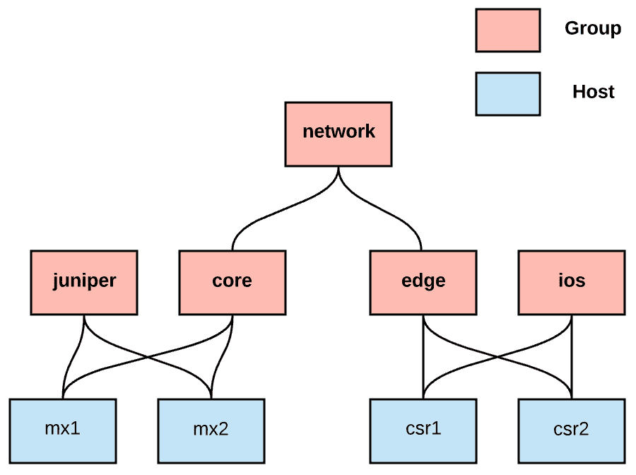
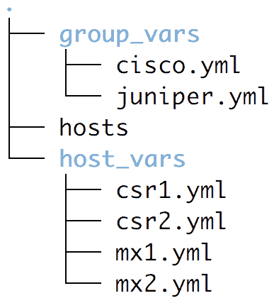
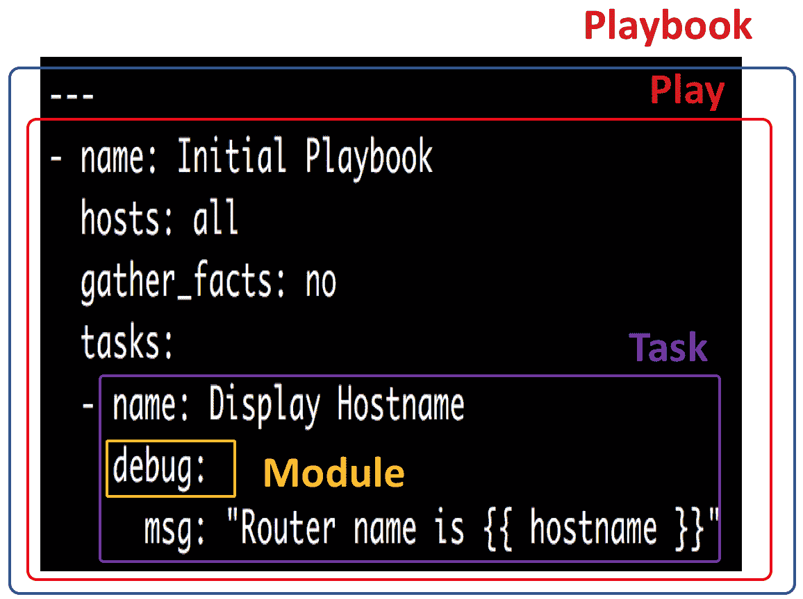
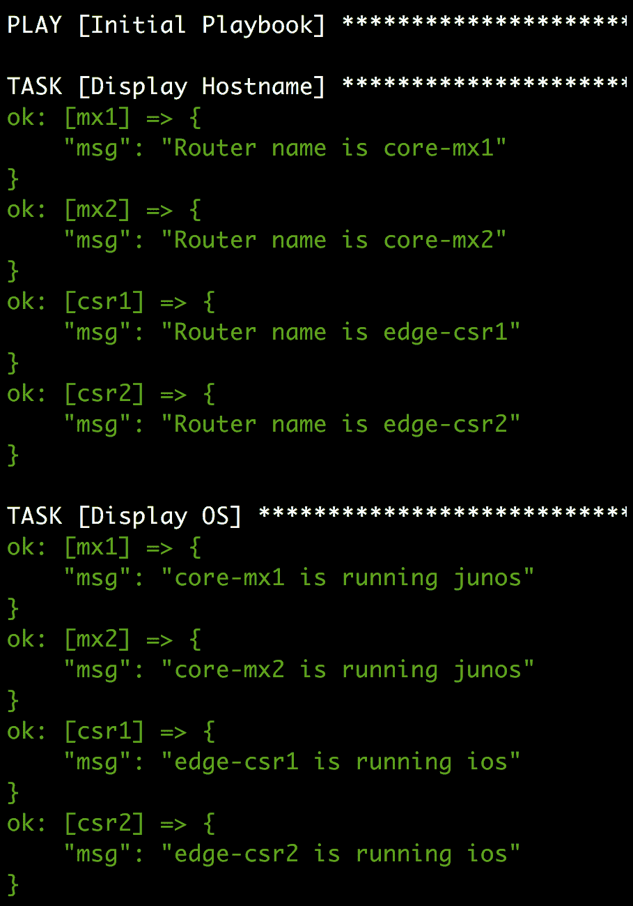
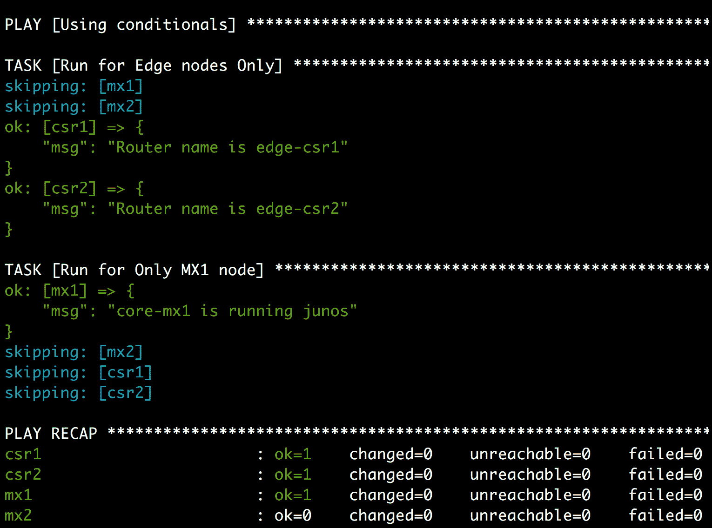
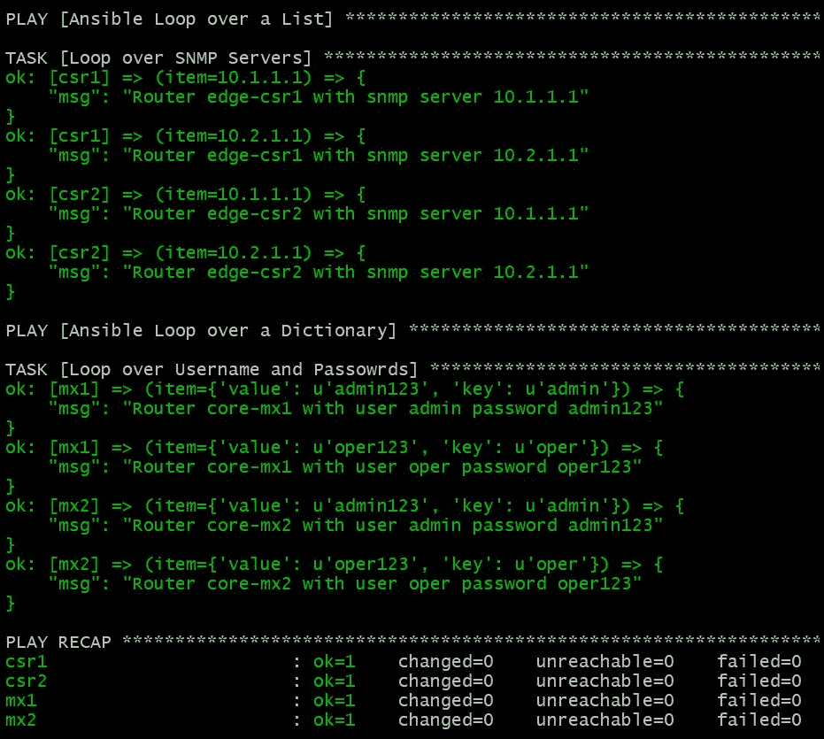
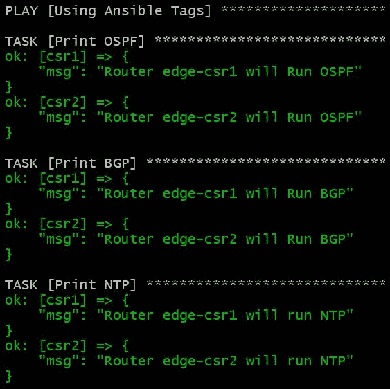
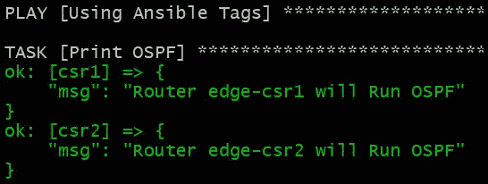
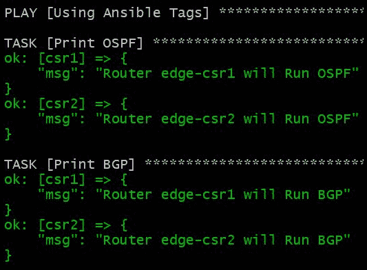

# 第一章：Ansible 的构建块

Ansible 是一个非常受欢迎的自动化框架，长期以来一直被用于自动化 IT 运营。它简化了不同基础设施节点的管理，并将业务逻辑转化为明确定义的程序，以实现这些业务逻辑。Ansible 是用 Python 编写的，主要依赖 SSH 与基础设施节点通信以执行指令。它从 Ansible 1.9 开始支持网络设备，并且随着 Ansible 2.9 的到来，它对网络设备的支持已经得到了大幅增强。它可以使用 SSH 或者如果网络供应商在其设备上支持 API 的话，还可以通过 API 与网络设备进行交互。它还提供了多个优势，包括以下内容：

+   **易学习曲线：**编写 Ansible Playbooks 需要了解 YAML 和 Jinja2 模板，这些都很容易学习，其描述性语言易于理解。

+   **无需代理：**无需在远程管理设备上安装代理即可控制该设备。

+   **可扩展：**Ansible 配备了多个模块，可在受控节点上执行各种任务。它还支持编写自定义模块和插件，以扩展 Ansible 的核心功能。

+   **幂等性：**除非需要改变设置以达到期望的状态，否则 Ansible 不会改变设备的状态。一旦设备处于期望的状态，运行 Ansible Playbooks 不会改变其配置。

在本章中，我们将介绍 Ansible 的主要组件，并概述 Ansible 支持的不同功能和选项。以下是将涵盖的主要内容：

+   安装 Ansible

+   构建 Ansible 的清单

+   使用 Ansible 的变量

+   构建 Ansible 的 Playbook

+   使用 Ansible 的条件语句

+   使用 Ansible 的循环

+   使用 Ansible Vault 保护秘密

+   使用 Jinja2 与 Ansible

+   使用 Ansible 的过滤器

+   使用 Ansible 标签

+   定制 Ansible 的设置

+   使用 Ansible 角色

本章的目的是基本了解我们将在本书中利用的不同 Ansible 组件，以便与网络设备进行交互。因此，本章中的所有示例都不是专注于管理网络设备。相反，我们将专注于理解 Ansible 中的不同组件，以便在下一章中有效地使用它们。

# 技术要求

以下是安装 Ansible 和运行所有 Ansible Playbooks 的要求：

+   具有以下发行版之一的 Linux **虚拟机**（**VM**）：

+   Ubuntu 18.04 或更高版本

+   CentOS 7.0 或更高版本

+   虚拟机的互联网连接

设置 Linux 机器超出了本教程的范围。然而，使用*Vagrant*创建和设置 Ansible 虚拟机是设置具有任何操作系统版本的 Linux 虚拟机的最简单方法。

# 安装 Ansible

安装 Ansible 的机器（称为 Ansible 控制机）应该运行在任何 Linux 发行版上。在本教程中，我们将概述如何在 Ubuntu Linux 机器或 CentOS 机器上安装 Ansible。

# 准备工作

要安装 Ansible，我们需要使用 Ubuntu 18.04+或 CentOS 7+操作系统的 Linux 虚拟机。此外，这台机器需要有互联网访问权限才能安装 Ansible。

# 如何做...

Ansible 是用 Python 编写的，所有模块都需要在 Ansible 控制机上安装 Python。我们的第一个任务是确保 Python 已安装在 Ansible 控制机上，如下所述。

1.  大多数 Linux 发行版默认安装了 Python。但是，如果 Python 未安装，以下是在 Linux 上安装它的步骤：

+   +   在 Ubuntu 操作系统上，执行以下命令：

```
# Install python3
$sudo apt-get install python3

# validate python is installed 
$python3 --version
Python 3.6.9
```

+   +   在 CentOS 操作系统上，执行以下命令：

```
# Install python
$sudo yum install pytho3

# validate python is installed 
$python3 --version
Python 3.6.8
```

1.  在验证了 Python 已安装后，我们可以开始安装 Ansible：

+   +   在 Ubuntu 操作系统上，执行以下命令：

```
# We need to use ansible repository to install the latest version of Ansible
$ sudo apt-add-repository ppa:ansible/ansible

# Update the repo cache to use the new repo added
$ sudo apt-get update

# We install Ansible
$ sudo apt-get install ansible
```

+   +   在 CentOS 操作系统上，执行以下命令：

```
# We need to use latest epel repository to get the latest ansible 
$ sudo yum install epel-release

# We install Ansible
$ sudo yum install ansible
```

# 它是如何工作的...

安装 Ansible 的最简单方法是使用特定于我们的 Linux 发行版的软件包管理器。我们只需要确保已启用所需的存储库以安装最新版本的 Ansible。在 Ubuntu 和 CentOS 中，我们需要启用提供最新版本 Ansible 的额外存储库。在 CentOS 中，我们需要安装和启用**企业 Linux 额外软件包**（**EPEL**）存储库，该存储库提供额外的软件包，并为 CentOS 提供最新的 Ansible 软件包。

使用此方法，我们将安装 Ansible 和运行 Ansible 模块所需的所有必需系统软件包。在 Ubuntu 和 CentOS 中，此方法还将安装 Python 2 并使用 Python 2 运行 Ansible。我们可以通过运行以下命令验证 Ansible 已安装并使用的版本：

```
$ ansible --version
ansible 2.9
 config file = /etc/ansible/ansible.cfg
 configured module search path = [u'/home/vagrant/.ansible/plugins/modules', u'/usr/share/ansible/plugins/modules']
 ansible python module location = /usr/lib/python2.7/site-packages/ansible
 executable location = /usr/bin/ansible
 python version = 2.7.5 (default, Aug 7 2019, 00:51:29) [GCC 4.8.5 20150623 (Red Hat 4.8.5-39)]
```

此外，我们可以通过尝试使用`ping`模块连接到本地机器来检查 Ansible 是否按预期工作，如下所示：

```
$ ansible -m ping localhost

localhost | SUCCESS => {
 "changed": false,
 "ping": "pong"
}
```

使用此方法，我们可以看到它存在以下问题：

+   它使用 Python 2 作为执行环境，但我们想使用 Python 3。

+   它更新了系统上安装的 Python 软件包，这可能是不可取的。

+   它不提供我们所需的细粒度，以便选择要使用的 Ansible 版本。使用此方法，我们将始终安装最新版本的 Ansible，这可能不是我们所需要的。

# 它是如何工作的...

为了在 Python 3 环境中安装 Ansible 并对部署的 Ansible 版本进行更多控制，我们将使用 pip Python 程序来安装 Ansible，如下所示：

+   如果尚未安装 Python 3，请按以下方式安装：

```
# Ubuntu
$ sudo apt-get install python3

# CentOS
sudo yum install python3
```

+   安装`python3-pip`软件包：

```
# Ubuntu
$ sudo apt-get install python3-pip

# CentOS
$ sudo yum install python3-pip
```

+   安装 Ansible：

```
# Ubuntu and CentOS
# This will install ansible for the current user ONLY
$ pip3 install ansible==2.9 --user

# We Can install ansible on the System Level
$ sudo pip3 install ansible==2.9
```

+   我们可以验证 Ansible 已成功安装，如下所示：

```
$$ ansible --version
ansible 2.9
 config file = None
 configured module search path = ['/home/vagrant/.ansible/plugins/modules', '/usr/share/ansible/plugins/modules']
 ansible python module location = /home/vagrant/.local/lib/python3.6/site-packages/ansible
 executable location = /home/vagrant/.local/bin/ansible
 python version = 3.6.8 (default, Aug 7 2019, 17:28:10) [GCC 4.8.5 20150623 (Red Hat 4.8.5-39)]
```

使用此方法安装 Ansible 可确保我们使用 Python 3 作为执行环境，并允许我们控制要安装的 Ansible 版本，如所示的示例。

我们将使用此方法作为我们的 Ansible 安装方法，并且所有后续章节将基于此安装过程。

在第十三章中，*Ansible 的高级技术和最佳实践*，我们将概述使用 Python 虚拟环境安装 Ansible 的另一种方法。

# 另请参阅...

有关安装 Ansible 的更多信息，请查看以下网址：

[`docs.ansible.com/ansible/latest/installation_guide/intro_installation.html`](https://docs.ansible.com/ansible/latest/installation_guide/intro_installation.html)

# 构建 Ansible 的清单

安装完 Ansible 后，我们需要定义 Ansible 的清单，这是一个定义 Ansible 将管理的节点的文本文件。在本教程中，我们将概述如何创建和构造 Ansible 的清单文件。

# 准备工作

我们需要创建一个包含本章中将概述的所有代码的文件夹。我们创建一个名为`ch1_ansible`的文件夹，如下所示：

```
$ mkdir ch1_ansible
$ cd ch1_ansible
```

# 如何做...

执行以下步骤创建清单文件：

1.  创建名为`hosts`的文件：

```
$ touch hosts
```

1.  使用任何文本编辑器打开文件并添加以下内容：

```
$ cat hosts

[cisco]
csr1 ansible_host=172.10.1.2
csr2 ansible_host=172.10.1.3

[juniper]
mx1 ansible_host=172.20.1.2
mx2 ansible_host=172.20.1.3

[core]
mx1
mx2

[edge]
csr[1:2]

[network:children]
core
edge
```

Ansible 清单文件可以有任何名称。但是，作为最佳实践，我们将使用名称`hosts`来描述清单中的设备。

# 它是如何工作的...

Ansible 清单文件定义了将由 Ansible 管理的主机（在上面的示例中，这是`csr1-2`和`mx1-2`），以及如何根据不同标准将这些设备分组到自定义定义的组中。组用`[]`定义。这种分组有助于我们定义变量并简化设备之间的分隔以及 Ansible 与它们的交互。我们如何分组设备是基于我们的用例的，因此我们可以根据供应商（Juniper 和 IOS）或功能（核心和边缘）对它们进行分组。

我们还可以使用在清单文件中概述的 children 为组构建层次结构。以下图显示了主机是如何分组的以及组层次结构是如何构建的：



# 使用 Ansible 的变量

Ansible 使用 Ansible 变量存储其管理的节点的信息。Ansible 变量可以在多个位置声明。然而，为了遵循 Ansible 的最佳实践，我们将概述 Ansible 寻找用于在清单文件中声明的节点的变量的两个主要部分。

# 准备工作

为了按照这个步骤进行，必须已经按照之前的步骤定义了 Ansible 清单文件。

# 操作步骤

在清单文件中，我们定义主机并将主机分组。现在我们定义了 Ansible 搜索组变量和主机变量的两个目录：

1.  创建两个文件夹，`group_vars`和`host_vars`：

```
$ cd ch1_ansible $ mkdir group_vars host_vars
```

1.  在`group_vars`内创建`ios.yml`和`junos.yml`文件：

```
$ touch group_vars/cisco.yml group_vars/juniper.yml
```

1.  在`host_vars`内创建`mx1.yml`和`csr1.yml`：

```
$ touch host_vars/csr1.yml host_vars/mx1.yml
```

1.  填充所有文件中的变量，如下所示：

```
$echo 'hostname: core-mx1' >> host_vars/mx1.yml
$echo 'hostname: core-mx2' >> host_vars/mx2.yml
$echo 'hostname: edge-csr1' >> host_vars/csr1.yml
$echo 'hostname: edge-csr2' >> host_vars/csr2.yml
$echo 'os: ios' >> group_vars/cisco.yml
$echo 'os: junos' >> group_vars/juniper.yml
```

# 工作原理

我们创建了以下目录和文件结构来存储我们的变量，如下图所示：



`group_vars`目录内的所有文件包含我们在清单中定义的组的组变量，并且适用于该组内的所有主机。至于`host_vars`内的文件，它们包含每个主机的变量。使用这种结构，我们可以将多个主机的变量分组到一个特定的组文件中，并且特定于主机的变量将被放在一个特定于该主机的单独文件中。

# 还有更多...

除了`host_vars`和`group_vars`，Ansible 还支持使用其他技术定义变量，包括以下内容：

+   在 play 中使用`vars`关键字指定多个变量

+   使用`vars_files`在文件中定义变量，并在运行 playbook 时让 Ansible 从该文件中读取这些变量

+   使用`--e`选项在命令行指定变量

除了我们可以指定的用户定义变量之外，Ansible 还有一些默认变量，它会动态构建用于清单的变量。以下表格捕获了一些最常用的变量：

| `inventory_hostname` | 主机在清单中定义的名称（例如，`csr1`和`mx1`） |
| --- | --- |
| `play_hosts` | play 中包含的所有主机的列表 |
| `group_names` | 特定主机所属的所有组的列表（例如，对于`csr1`，这将是[edge，Cisco，network]） |

# 构建 Ansible 的 playbook

Ansible playbook 是 Ansible 中声明我们想要在我们管理的主机上执行的操作的基本元素。Ansible playbook 是一个以 YAML 格式编写的文件，定义了将在我们管理的设备上执行的任务列表。在这个步骤中，我们将概述如何编写一个 Ansible playbook 以及如何定义将被此 playbook 定位的主机。

# 准备工作

为了按照这个步骤进行，必须已经定义了 Ansible 清单文件，并根据之前的步骤创建了所有组和主机特定的变量文件。

# 操作步骤

1.  在`ch1_ansible`文件夹内创建一个名为`playbook.yml`的新文件，并在此文件中加入以下行：

```
$  cat playbook.yml

---
 - name: Initial Playbook
 hosts: all
 gather_facts: no
 tasks:
 - name: Display Hostname
 debug:
 msg: "Router name is {{ hostname }}"
 - name: Display OS
 debug:
 msg: "{{ hostname }} is running {{ os }}"
```

1.  按照以下步骤运行 playbook：

```
$ ansible-playbook -i hosts playbook.yml
```

# 工作原理

Ansible playbook 是一系列 play 的列表，每个 play 针对清单文件中定义的特定主机组。每个 play 可以有一个或多个任务针对此 play 中的主机执行。每个任务运行一个特定的 Ansible 模块，该模块有一些参数。playbook 的一般结构如下截图所示：



在上述 playbook 中，我们在`{{ }}`括号中引用了我们在前面步骤中定义的变量。Ansible 从`group_vars`或`host_vars`中读取这些变量，我们在这个 playbook 中使用的模块是`debug`模块，它将在终端输出中显示为`msg`参数中指定的自定义消息。playbook 运行如下所示：



我们在`ansible-playbook`命令中使用`-i`选项来指向 Ansible 清单文件，这将作为我们构建清单的源。

在这个 playbook 中，我使用了`all`关键字来指定清单中的所有主机。这是 Ansible 为清单中的所有主机动态构建的一个众所周知的组名。

# 使用 Ansible 的条件语句

Ansible 的核心功能之一是条件任务执行。这为我们提供了根据我们指定的条件/测试来控制在给定主机上运行哪些任务的能力。在这个步骤中，我们将概述如何配置条件任务执行。

# 准备工作

为了按照这个步骤进行操作，必须存在一个已配置的 Ansible 清单文件，如前面的步骤所述。此外，所有主机的 Ansible 变量应该按照前面的步骤所述进行定义。

# 如何做...

1.  在`ch1_ansible`文件夹中创建一个名为`ansible_cond.yml`的新 playbook。

1.  按照这里所示在新的 playbook 中加入以下内容：

```
---
 - name: Using conditionals
 hosts: all
 gather_facts: no
 tasks:
 - name: Run for Edge nodes Only
 debug:
 msg: "Router name is {{ hostname }}"
 when: "'edge' in group_names"

 - name: Run for Only MX1 node
 debug:
 msg: "{{ hostname }} is running {{ os }}"
 when:
 - inventory_hostname == 'mx1'
```

1.  按照这里所示运行 playbook：

```
$ ansible-playbook -i hosts ansible_cond.yml
```

# 它是如何工作的...

Ansible 使用`when`语句为任务提供条件执行。`when`语句应用于任务级别，如果`when`语句中的条件评估为`true`，则任务将针对给定的主机执行。如果为`false`，则该任务将跳过该主机。运行上述 playbook 的输出如下所示：



`when`语句可以像第一个任务中那样接受一个条件，也可以像第二个任务中那样接受一个条件列表。如果`when`是一个条件列表，所有条件都需要为真才能执行任务。

在第一个任务中，`when`语句用*""*括起来，因为语句以字符串开头**。然而，在第二个语句中，我们使用了一个普通的`when`语句，没有*""*，因为`when`语句以变量名开头。

# 另请参阅...

有关 Ansible 条件语句的更多信息，请查看以下网址：

[`docs.ansible.com/ansible/latest/user_guide/playbooks_conditionals.html`](https://docs.ansible.com/ansible/latest/user_guide/playbooks_conditionals.html)

# 使用 Ansible 的循环

在某些情况下，我们需要在 Ansible playbook 中运行一个任务来循环处理一些数据。Ansible 的循环允许我们多次循环遍历一个变量（字典或列表）以实现这种行为。在这个步骤中，我们将概述如何使用 Ansible 的循环。

# 准备工作

为了按照这个步骤进行操作，必须存在一个已配置的 Ansible 清单文件，如前面的步骤所述。

# 如何做...

1.  在`ch1_ansible`文件夹中创建一个名为`ansible_loops.yml`的新 playbook。

1.  在`group_vars/cisco.yml`文件中，加入以下内容：

```
snmp_servers:
 - 10.1.1.1
 - 10.2.1.1
```

1.  在`group_vars/juniper.yml`文件中，加入以下内容：

```
users:
 admin: admin123
 oper: oper123
```

1.  在`ansible_loops.yml`文件中，加入以下内容：

```
---
 - name: Ansible Loop over a List
 hosts: cisco
 gather_facts: no
 tasks:
 - name: Loop over SNMP Servers
 debug:
 msg: "Router {{ hostname }} with snmp server {{ item }}"
 loop: "{{ snmp_servers}}"

 - name: Ansible Loop over a Dictionary
 hosts: juniper
 gather_facts: no
 tasks:
 - name: Loop over Username and Passowrds
 debug:
 msg: "Router {{ hostname }} with user {{ item.key }} password {{ item.value }}"
 with_dict: "{{ users}}"
```

1.  按照这里所示运行 playbook：

```
$ ansible-playbook ansible_loops.yml -i hosts
```

# 它是如何工作的..

Ansible 支持对两种主要的可迭代数据结构进行循环：列表和字典。当我们需要对列表进行迭代时（`snmp_servers`是一个列表数据结构），我们使用`loops`关键字，当我们循环遍历字典时（`users`是一个字典数据结构，其中用户名是键，密码是值），我们使用`with_dicts`。在这两种情况下，我们使用`item`关键字来指定当前迭代中的值。在`with_dicts`的情况下，我们使用`item.key`来获取键，使用`item.value`来获取值。

以下是前面剧本运行的输出：



# 另请参阅...

有关不同的 Ansible*循环结构*的更多信息，请参考以下网址：

[`docs.ansible.com/ansible/latest/user_guide/playbooks_loops.html`](https://docs.ansible.com/ansible/latest/user_guide/playbooks_loops.html)

# 使用 Ansible Vault 保护秘密

当我们处理需要在 Ansible 剧本中引用的敏感材料时，比如密码，我们不应该将这些数据保存为纯文本。Ansible Vault 提供了一种加密这些数据并在运行剧本时安全解密和访问的方法。在这个示例中，我们将概述如何使用 Ansible Vault 来保护 Ansible 中的敏感信息。

# 如何做...

1.  创建一个名为`decrypt_passwd`的新文件，如下所示：

```
$ echo 'strong_password' > decrypt_passwd
```

1.  使用`ansible-vault`创建一个名为`secrets`的新文件，如下所示：

```
$ ansible-vault create --vault-id=decrypt_passwd secrets
```

1.  将以下变量添加到这个新的`secrets`文件中：

```
ospf_password: ospf_P@ssw0rD
bgp_password: BGP_p@ssw0rd
```

1.  创建一个名为`ansible_vault.yml`的新剧本，如下所示：

```
---
 - name: Using Ansible vault
 hosts: all
 gather_facts: no
 vars_files:
 - secrets
 tasks:
 - name: Output OSPF passowrd
 debug:
 msg: "Router {{ hostname }} ospf Password {{ ospf_password }}"
 when: inventory_hostname == 'csr1'

 - name: Output BGP passowrd
 debug:
 msg: "Router {{ hostname }} BGP Password {{ bgp_password }}"
 when: inventory_hostname == 'mx1'
```

1.  按照这里所示的方式运行剧本：

```
$ ansible-playbook --vault-id=decrypt_passwd ansible_vault.yml -i hosts
```

# 它是如何工作的..

我们使用`ansible-vault`命令创建一个使用`--vault-id`指定的密钥加密的新文件。我们将这个密钥/密码放在另一个文件中（在我们的示例中称为`decrypt_passwd`），并将此文件作为`vault-id`的参数传递。在这个文件中，我们可以放置尽可能多的变量。最后，我们使用`vars_files`将这个文件作为变量文件包含在剧本中。如果我们尝试在没有解密的情况下读取秘密文件，其内容如下：

```
$ cat secrets
$ANSIBLE_VAULT;1.1;AES256
61383264326363373336383839643834386661343630393965656135666336383763343938313963
3538376230613534323833356237663532666363626462640a663839396230646634353839626461
31336461386361616261336534663137326265363261626536663564623764663861623735633865
3033356536393631320a643561623635363830653236633833383531366166326566623139633838
32633335616663623761313630613134636635663865363563366564313365376431333461623232
34633838333836363865313238363966303466373065356561353638363731616135386164373263
666530653334643133383239633237653034
```

为了让 Ansible 解密这个文件，我们必须通过`--vault-id`选项提供解密密码（在这个示例中存储在`decrypt_passwd`文件中）。当我们运行`ansible-playbook`时，必须提供这个解密密码，否则`ansible-playbook`会失败，如下所示：

```
### Running the Ansible playbook without --vault-id 
$ansible-playbook ansible_vault.yml -i hosts
ERROR! Attempting to decrypt but no vault secrets found
```

# 还有更多...

如果我们不想在文本文件中指定加密/解密密码，我们可以在运行剧本时使用`--ask-vault-pass`和`ansible-playbook`命令一起输入密码，如下所示：

```
### Running the Ansible playbook with --ask-vault-pass
$ansible-playbook ansible_vault.yml -i hosts --ask-vault-pass
Vault password:
```

# 使用 Jinja2 与 Ansible

Jinja2 是 Python 的一个强大的模板引擎，受到 Ansible 的支持。它还用于生成任何基于文本的文件，如 HTML、CSV 或 YAML。我们可以利用 Ansible 变量来使用 Jinja2 生成网络设备的自定义配置文件。在这个示例中，我们将概述如何在 Ansible 中使用 Jinja2 模板。

# 准备工作

为了按照这个示例进行操作，必须存在并按照前面的示例配置好 Ansible 清单文件。

# 如何做...

1.  在`group_vars`目录中创建一个名为`network.yml`的新文件：

```
$ cat group_vars/network.yml

---
ntp_servers:
 - 172.20.1.1
 - 172.20.2.1
```

1.  创建一个新的`templates`目录，并创建一个名为`ios_basic.j2`的新文件，内容如下：

```
$ cat templates/ios_basic.j2
hostname {{ hostname }}
!

ntp {{ server }}

!
```

1.  在`templates`目录中创建一个名为`junos_basic.j2`的新文件，内容如下：

```
$ cat templates/junos_basic.j2
set system host-name {{ hostname }}

set system ntp server {{ server }}

```

1.  创建一个名为`ansible_jinja2.yml`的新剧本，内容如下：

```
---
 - name: Generate Cisco config from Jinja2
 hosts: localhost
 gather_facts: no
 tasks:
 - name: Create Configs Directory
 file: path=configs state=directory

 - name: Generate Cisco config from Jinja2
 hosts: cisco
 gather_facts: no
 tasks:
 - name: Generate Cisco Basic Config
 template:
 src: "templates/ios_basic.j2"
 dest: "configs/{{inventory_hostname}}.cfg"
 delegate_to: localhost

 - name: Generate Juniper config from Jinja2
 hosts: juniper
 gather_facts: no
 tasks:
 - name: Generate Juniper Basic Config
 template:
 src: "templates/junos_basic.j2"
 dest: "configs/{{inventory_hostname}}.cfg"
 delegate_to: localhost
```

1.  按照这里所示的方式运行 Ansible 剧本：

```
$ ansible-playbook -i hosts ansible_jinja2.yml
```

# 它是如何工作的...

我们创建了`network.yml`文件，以便将适用于该组下所有设备的所有变量进行分组。之后，我们创建了两个 Jinja2 文件，一个用于 Cisco IOS 设备，另一个用于 Juniper 设备。在每个 Jinja2 模板中，我们使用`{{}}`引用 Ansible 变量。我们还使用 Jinja2 模板引擎支持的`for`循环构造``，以循环遍历`ntp_servers`变量（这是一个列表），以访问此列表中的每个项目。

Ansible 提供了`template`模块，它有两个参数：

+   `src`：这引用了 Jinja2 模板文件。

+   `dest`：这指定将生成的输出文件。

在我们的情况下，我们使用`{{inventory_hostname}}`变量，以使输出配置文件对我们清单中的每个路由器都是唯一的。

默认情况下，`template`模块在远程管理节点上创建输出文件。但是，在我们的情况下，由于受管设备是网络节点，这是不可能的。因此，我们使用`delegate_to: localhost`选项，以便在 Ansible 控制机上本地运行此任务。

playbook 中的第一个 play 创建`configs`目录，用于存储网络设备的配置文件。第二个 play 在 Cisco 设备上运行模板模块，第三个 play 在 Juniper 设备上运行`template`任务。

以下是 Cisco 设备的配置文件：

```
$ cat configs/csr1.cfg
hostname edge-csr1
!
ntp 172.20.1.1
ntp 172.20.2.1
!
```

这是 Juniper 设备的配置文件：

```
$ cat configs/mx1.cfg
set system host-name core-mx1
set system ntp server 172.20.1.1
set system ntp server 172.20.2.1
```

# 另请参阅...

有关 Ansible 模板模块的更多信息，请参考以下网址：

[`docs.ansible.com/ansible/latest/modules/template_module.html`](https://docs.ansible.com/ansible/latest/modules/template_module.html)

# 使用 Ansible 的过滤器

Ansible 的过滤器主要源自 Jinja2 过滤器，所有 Ansible 过滤器都用于转换和操作数据（Ansible 的变量）。除了 Jinja2 过滤器外，Ansible 还实现了自己的过滤器来增强 Jinja2 过滤器，同时还允许用户定义自己的自定义过滤器。在本教程中，我们将概述如何配置和使用 Ansible 过滤器来操作我们的输入数据。

# 如何做...

1.  安装`python3-pip`和 Python 的`netaddr`库，因为我们将使用需要 Python 的`netaddr`库的 Ansible IP 过滤器：

```
# On ubuntu
$ sudo apt-get install python3-pip

# On CentOS
$ sudo yum install python3-pip

$ pip3 install netaddr
```

1.  创建一个名为`ansible_filters.yml`的新 Ansible playbook，如下所示：

```
---
 - name: Ansible Filters
 hosts: csr1
 vars:
 interfaces:
 - { port: FastEthernet0/0, prefix: 10.1.1.0/24 }
 - { port: FastEthernet1/0, prefix: 10.1.2.0/24 }
 tasks:
 - name: Generate Interface Config
 blockinfile:
 block: |
 hostname {{ hostname | upper }}
 
 !
 interface {{ intf.port }}
 ip address {{intf.prefix | ipv4(1) | ipv4('address') }} {{intf.prefix | ipv4('netmask') }}
 !
 
 dest: "configs/csr1_interfaces.cfg"
 create: yes
 delegate_to: localhost
```

# 工作原理...

首先，我们使用`blockinfile`模块在 Ansible 控制机上创建一个新的配置文件。此模块与`template`模块非常相似。但是，我们可以直接在`block`选项中编写 Jinja2 表达式。我们在 playbook 中使用`vars`参数定义了一个名为`interfaces`的新变量。此变量是一个列表数据结构，其中列表中的每个项目都是一个字典数据结构。此嵌套数据结构指定了每个接口上使用的 IP 前缀。

在 Jinja2 表达式中，我们可以看到我们使用了一些过滤器，如下所示：

+   `{{ hostname | upper}}`：`upper`是一个 Jinja2 过滤器，将输入字符串的所有字母转换为大写。通过这种方式，我们将主机名变量的值传递给此过滤器，输出将是此值的大写版本。

+   `{{intf.prefix | ipv4(1) | ipv4('address') }}`：在这里，我们两次使用了 Ansible IP 地址过滤器。`ipv4(1)`接受输入 IP 前缀并输出此前缀中的第一个 IP 地址。然后，我们使用另一个 IP 地址过滤器`ipv4('address')`，以便仅获取 IP 前缀的 IP 地址部分。因此，在我们的情况下，我们取`10.1.1.0/24`，我们输出第一个接口的`10.1.1.1`。

+   `{{intf.prefix | ipv4('netmask') }}`：在这里，我们使用 Ansible IP 地址过滤器来获取 IP 地址前缀的子网掩码，因此在我们的情况下，我们得到`/24`子网并将其转换为`255.255.255.0`。

此 playbook 运行后，`csr1`路由器的输出文件如下所示：

```
$ cat configs/csr1_interfaces.cfg
# BEGIN ANSIBLE MANAGED BLOCK
hostname EDGE-CSR1
!
interface FastEthernet0/0
 ip address 10.1.1.1 255.255.255.0
!
!
interface FastEthernet1/0
 ip address 10.1.2.1 255.255.255.0
!
# END ANSIBLE MANAGED BLOCK
```

# 使用 Ansible 标签

Ansible 标签是一个强大的工具，允许我们在大型 Ansible playbook 中为特定任务打标签，并灵活选择基于我们指定的标签在给定 playbook 中运行哪些任务。在这个示例中，我们将概述如何配置和使用 Ansible 标签。

# 操作步骤...

1.  创建一个名为`ansible_tags.yml`的新的 Ansible playbook，如下所示：

```
---
 - name: Using Ansible Tags
 hosts: cisco
 gather_facts: no
 tasks:
 - name: Print OSPF
 debug:
 msg: "Router {{ hostname }} will Run OSPF"
 tags: [ospf, routing]

 - name: Print BGP
 debug:
 msg: "Router {{ hostname }} will Run BGP"
 tags:
 - bgp
 - routing

 - name: Print NTP
 debug:
 msg: "Router {{ hostname }} will run NTP"
 tags: ntp
```

1.  按照以下示例运行 playbook：

```
$ ansible-playbook ansible_tags.yml -i hosts --tags routing
```

1.  再次运行 playbook，这次使用标签，如下所示：

```
$ ansible-playbook ansible_tags.yml -i hosts --tags ospf

$ ansible-playbook ansible_tags.yml -i hosts --tags routing
```

# 工作原理...

我们可以使用标签来标记具有特定标签的任务和 play，以控制执行哪些任务或 play。这在开发 playbook 时给予我们更多的控制，允许我们运行相同的 playbook，但每次运行时都可以控制我们部署的内容。在这个示例中的 playbook 中，我们已经将任务标记为 OSPF、BGP 或 NTP，并将`routing`标签应用到了 OSPF 和 BGP 任务。这允许我们有选择性地运行 playbook 中的任务，如下所示：

+   如果没有指定标签，这将运行 playbook 中的所有任务，行为不会改变，如下截图所示：



+   使用`ospf`标签，我们将只运行标记有这个标签的任何任务，如下所示：



+   使用`routing`标签，我们将运行所有标记有这个标签的任务，如下所示：



# 另请参阅...

有关 Ansible 标签的更多信息，请参考以下 URL：

[`docs.ansible.com/ansible/latest/user_guide/playbooks_tags.html`](https://docs.ansible.com/ansible/latest/user_guide/playbooks_tags.html)

# 自定义 Ansible 的设置

Ansible 有许多设置可以通过一个名为`ansible.cfg`的配置文件进行调整和控制。这个文件有多个选项，控制着 Ansible 的许多方面，包括 Ansible 的外观和它如何连接到受控设备。在这个示例中，我们将概述如何调整一些默认设置。

# 操作步骤...

1.  创建一个名为`ansible.cfg`的新文件，如下所示：

```
[defaults]
inventory=hosts
vault_password_file=decryption_password
gathering=explicit
```

# 工作原理...

默认情况下，Ansible 的设置由位于`/etc/ansible`目录中的`ansible.cfg`文件控制。这是 Ansible 的默认配置文件，控制着 Ansible 与受控节点的交互方式。我们可以直接编辑这个文件。但是，这将影响到我们在 Ansible 控制机上使用的任何 playbook，以及这台机器上的任何用户。一个更灵活和定制的选项是在项目目录中包含一个名为`ansible.cfg`的文件，其中包含了需要从默认参数中修改的所有选项。在上面的示例中，我们只概述了其中的一小部分选项。

+   `inventory`***:*** 这个选项修改了 Ansible 搜索的默认清单文件，以便找到它的清单（默认情况下，这是`/etc/ansible/hosts`）。我们调整这个选项，让 Ansible 使用我们的清单文件，并在每次运行 playbook 时停止使用`-i`操作符来指定我们的清单。

+   `vault_password_file`：这个选项设置了用于加密和解密`ansible-vault`密码的秘密密码文件。这个选项消除了在使用`ansible-vault`加密变量时需要使用`--vault-id`操作符运行 Ansible playbook 的需要。

+   `gathering = explicit`：默认情况下，Ansible 在运行 playbook 时运行一个设置模块来收集有关受控节点的事实。由于这个设置模块需要受控节点上的 Python 解释器，因此这个设置模块与网络节点不兼容。通过将事实收集设置为`explicit`，我们禁用了这个默认行为。

# 另请参阅...

有关 Ansible 配置设置的更多信息，请参考以下 URL：

[`docs.ansible.com/ansible/latest/reference_appendices/config.html#ansible-configuration-settings`](https://docs.ansible.com/ansible/latest/reference_appendices/config.html#ansible-configuration-settings)

# 使用 Ansible 角色

Ansible 角色促进了代码的可重用性，并提供了一种简单的方法来打包 Ansible 代码，以便可以共享和使用。Ansible 角色是所有所需的 Ansible 任务、处理程序和 Jinja2 模板的集合，它们以特定的结构打包在一起。角色应设计为提供特定的功能/任务。在这个示例中，我们将概述如何创建一个 Ansible 角色以及如何在我们的 playbooks 中使用它。

# 操作步骤...

1.  在`ch1_ansible`文件夹中，创建一个名为`roles`的新文件夹，并创建一个名为`basic_config`的新角色，如下所示：

```
$ mkdir roles
$ cd roles
$ ansible-galaxy init basic_config
```

1.  使用以下变量更新`basic_config/vars/main.yml`文件：

```
$ cat roles/basic_config/vars/main.yml

---
config_dir: basic_config
```

1.  使用以下任务更新`basic_config/tasks/main.yml`文件：

```
$ cat roles/basic_config/tasks/main.yml

---
 - name: Create Configs Directory
 file:
 path: "{{ config_dir }}"
 state: directory
 run_once: yes

 - name: Generate Cisco Basic Config
 template:
 src: "{{os}}.j2"
 dest: "{{config_dir}}/{{inventory_hostname}}.cfg"
```

1.  在`basic_config/templates`文件夹内，创建以下结构：

```
$ tree roles/basic_config/templates/

roles/basic_config/templates/
├── ios.j2
└── junos.j2

$ cat roles/basic_config/templates/ios.j2
hostname {{ hostname }}
!

ntp {{ server }}

```

1.  创建一个新的 playbook，`pb_ansible_role.yml`，内容如下以使用我们的角色：

```
$ cat pb_ansible_role.yml
---
 - name: Build Basic Config Using Roles
 hosts: all
 connection: local
 roles:
 - basic_config
```

# 工作原理...

在这个示例中，我们首先在主文件夹中创建`roles`目录。默认情况下，使用角色时，Ansible 会按照以下顺序在以下位置查找角色：

+   当前工作目录中的`roles`文件夹

+   `/etc/ansible/roles`

因此，我们在当前工作目录（`ch1_ansible`）中创建`roles`文件夹，以承载我们将在此文件夹中创建的所有角色。我们使用`ansible-galaxy`命令和`init`选项以及角色名称（`basic_config`）创建角色，这将在`roles`文件夹内创建以下角色结构：

```
$ tree roles/
roles/
└── basic_config
 ├── defaults
 │   └── main.yml
 ├── files
 ├── handlers
 │   └── main.yml
 ├── meta
 │   └── main.yml
 ├── README.md
 ├── tasks
 │   └── main.yml
 ├── templates
 ├── tests
 │   ├── inventory
 │   └── test.yml
 └── vars
 └── main.yml
```

从前面的输出可以看出，使用`ansible-galaxy`命令创建了这个文件夹结构，这个命令根据最佳实践角色布局构建了角色。并非所有这些文件夹都需要具有我们可以使用的功能角色，以下列表概述了通常使用的主要文件夹：

+   `tasks`文件夹：这包含了`main.yml`文件，列出了在使用此角色时应执行的所有任务。

+   `templates`文件夹：这包含我们将作为此角色一部分使用的所有 Jinja2 模板。

+   `vars`文件夹：这包含了我们想要定义并在角色中使用的所有变量。`vars`文件夹中的变量在运行 playbook 时评估变量时具有非常高的优先级。

+   `handlers`文件夹：这包含了`main.yml`文件，其中包含了作为此角色一部分应运行的所有处理程序。

我们创建的角色只有一个目的，那就是为我们的设备构建基本配置。为了完成这个任务，我们需要定义一些 Ansible 任务，并使用一些 Jinja2 模板来生成设备的基本配置。我们在`tasks/main.yml`文件中列出了所有需要运行的任务，并在`templates`文件夹中包含了所有必要的 Jinja2 模板。我们在`vars`文件夹中定义了我们将在角色中使用的任何必需变量。

我们创建一个新的 playbook，将使用我们的新角色来生成设备的配置。我们在`roles`参数中调用我们想要运行的所有角色作为 playbook 的一部分。在我们的情况下，我们只想要运行一个角色，即`basic_config`角色。

运行我们的 playbook 后，我们可以看到一个名为`basic_config`的新目录被创建，其中包含以下内容：

```
$ tree basic_config/
basic_config/
├── csr1.cfg
├── csr2.cfg
├── mx1.cfg
└── mx2.cfg    
```

# 另请参阅

有关 Ansible 角色的更多信息，请参阅以下网址：

[`docs.ansible.com/ansible/latest/user_guide/playbooks_reuse_roles.html`](https://docs.ansible.com/ansible/latest/user_guide/playbooks_reuse_roles.html)
