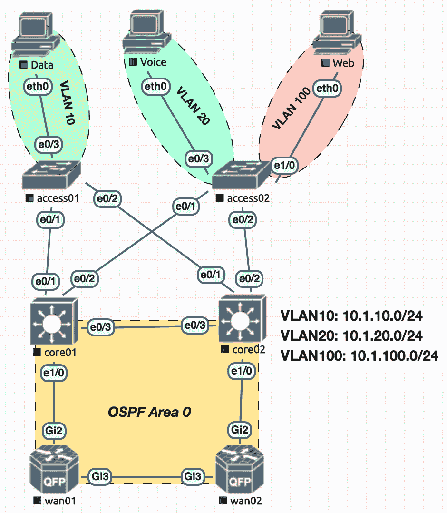

# 使用 Ansible 管理 Cisco IOS 设备

在本章中，我们将概述如何使用 Ansible 自动化 Cisco 基于 IOS 的设备。我们将探索 Ansible 中可用的不同模块，以自动化配置并从 Cisco IOS 设备收集网络信息。本章将基于以下示例网络图，并将介绍如何使用 Ansible 实现此网络设计：



以下表格概述了 Cisco 节点上的管理 IP 地址，Ansible 将使用这些地址连接到设备：

| **设备** | **角色** | **供应商** | **管理端口** | **管理 IP** |
| --- | --- | --- | --- | --- |
| `access01` | 访问交换机 | Cisco IOS 15.1 | `Ethernet0/0` | `172.20.1.18` |
| `access02` | 访问交换机 | Cisco IOS 15.1 | `Ethernet0/0` | `172.20.1.19` |
| `core01` | 核心交换机 | Cisco IOS 15.1 | `Ethernet0/0` | `172.20.1.20` |
| `core02` | 核心交换机 | Cisco IOS 15.1 | `Ethernet0/0` | `172.20.1.21` |
| `wan01` | WAN 路由器 | Cisco IOS-XE 16.6.1 | `GigabitEthernet1` | `172.20.1.22` |
| `wan02` | WAN 路由器 | Cisco IOS-XE 16.6.1 | `GigabitEthernet1` | `172.20.1.23` |

本章涵盖的主要配方如下：

+   构建 Ansible 网络清单

+   连接到 Cisco IOS 设备

+   配置基本系统信息

+   在 IOS 设备上配置接口

+   在 IOS 设备上配置 L2 VLAN

+   配置干线和访问接口

+   配置接口 IP 地址

+   在 IOS 设备上配置 OSPF

+   收集 IOS 设备信息

+   在 IOS 设备上验证网络可达性

+   从 IOS 设备检索操作数据

+   使用 pyATS 和 Ansible 验证网络状态

# 技术要求

本章的代码文件可以在这里找到：

[`github.com/PacktPublishing/Network-Automation-Cookbook/tree/master/ch2_ios`](https://github.com/PacktPublishing/Network-Automation-Cookbook/tree/master/ch2_ios)

本章基于的软件版本如下：

+   Cisco IOS 15.1

+   Cisco IOS-XE 16.6.1

+   Ansible 2.9

+   Python 3.6.8

查看以下视频以查看代码的实际操作：

[`bit.ly/34F8xPW`](https://bit.ly/34F8xPW)

# 构建 Ansible 网络清单

在这个配方中，我们将概述如何构建和组织 Ansible 清单，以描述前一节中概述的网络设置。

# 准备工作

确保 Ansible 已经安装在控制机上。

# 操作步骤...

1.  创建一个名为`ch2_ios`的新目录。

1.  在这个新文件夹里，创建`hosts`文件，内容如下：

```
$ cat hosts
 [access]
 access01 Ansible_host=172.20.1.18
 access02 Ansible_host=172.20.1.19

[core]
 core01 Ansible_host=172.20.1.20
 core02 Ansible_host=172.20.1.21

[wan]
 wan01 Ansible_host=172.20.1.22
 wan02 Ansible_host=172.20.1.23

[lan:children]
 access
 core

[network:children]
 lan
 wan
```

1.  创建`Ansible.cfg`文件，内容如下：

```
$ cat Ansible.cfg

[defaults]
 inventory=hosts
 retry_files_enabled=False
 gathering=explicit
```

# 它是如何工作的...

我们使用`hosts`文件构建了 Ansible 清单，并以以下方式定义了多个组，以便对我们拓扑中的不同设备进行分组：

+   我们创建了`access`组，其中包括我们拓扑中的访问交换机（`access01`和`access02`）。

+   我们创建了`core`组，将所有作为访问交换机上所有 VLAN 的 L3 终止的核心交换机分组在一起。

+   我们创建了`wan`组，将所有我们的 Cisco IOS-XE 路由器分组在一起，它们将作为我们的 wan 路由器。

+   我们创建了另一个名为`lan`的组，将访问组和核心组分组在一起。

+   我们创建了`network`组，将`lan`和`wan`组分组在一起。

最后，我们创建了`Ansible.cfg`文件，并配置它指向我们的`hosts`文件，以用作 Ansible 清单文件。我们禁用了设置模块，在针对网络节点运行 Ansible 时不需要它。

# 连接到 Cisco IOS 设备

在这个配方中，我们将概述如何通过 SSH 从 Ansible 连接到 Cisco IOS 设备，以便从 Ansible 开始管理设备。

# 准备工作

为了按照这个配方进行操作，应该按照前面的配方构建一个 Ansible 清单文件。必须配置 Ansible 控制机与网络中所有设备之间的 IP 可达性。

# 操作步骤...

1.  在`ch2_ios`目录中，创建`groups_vars`文件夹。

1.  在`group_vars`文件夹中，创建以下内容的`network.yml`文件：

```
$cat network.yml
Ansible_network_os: ios
Ansible_connection: network_cli
Ansible_user: lab
Ansible_password: lab123
Ansible_become: yes
Ansible_become_password: admin123
Ansible_become_method: enable
```

1.  在所有 IOS 设备上，确保配置以下内容以设置 SSH 访问：

```
!
 hostname <device_hostname>
 !
 ip domain name <domain_name>
 !
 username lab secret 5 <password_for_lab_user>.
 !
 enable secret 5 <enable_password>.
 !
 line vty 0 4
 login local
 transport input SSH
 !
```

1.  从配置模式在 Cisco IOS 设备上生成 SSH 密钥，如下面的代码片段所示：

```
(config)#crypto key generate rsa
 Choose the size of the key modulus in the range of 360 to 4096 for your
 General Purpose Keys. Choosing a key modulus greater than 512 may take
 a few minutes.
How many bits in the modulus [512]: 2048
 % Generating 2048 bit RSA keys, keys will be non-exportable...
 [OK] (elapsed time was 0 seconds)
```

1.  使用以下突出显示的参数更新`Ansible.cfg`文件：

```
$ cat Ansible.cfg
[defaults]
 host_key_checking=False
```

# 工作原理...

在我们的示例网络中，我们将使用 SSH 来建立 Ansible 与我们的 Cisco 设备之间的连接。在这个设置中，Ansible 将使用 SSH 来建立与我们的 Cisco 设备的连接，以开始对其进行管理。我们将使用用户名/密码身份验证来验证我们的 Ansible 控制节点与我们的 Cisco 设备。

在 Cisco 设备上，我们必须确保存在 SSH 密钥，以便在 Cisco 设备上有一个功能性的 SSH 服务器。以下代码片段概述了在生成 SSH 密钥之前 Cisco 设备上的 SSH 服务器的状态：

```
wan01#show ip SSH
SSH Disabled - version 2.0
%Please create RSA keys to enable SSH (and of atleast 768 bits for SSH v2).
Authentication methods:publickey,keyboard-interactive,password
Authentication Publickey Algorithms:x509v3-SSH-rsa,SSH-rsa
Hostkey Algorithms:x509v3-SSH-rsa,SSH-rsa
Encryption Algorithms:aes128-ctr,aes192-ctr,aes256-ctr
MAC Algorithms:hmac-sha2-256,hmac-sha2-512,hmac-sha1,hmac-sha1-96
KEX Algorithms:diffie-hellman-group-exchange-sha1,diffie-hellman-group14-sha1
Authentication timeout: 120 secs; Authentication retries: 3
Minimum expected Diffie Hellman key size : 2048 bits
IOS Keys in SECSH format(SSH-rsa, base64 encoded): NONE
```

一旦我们创建了 SSH 密钥，Cisco 设备上的 SSH 服务器就可以运行，并准备好接受来自 Ansible 控制节点的 SSH 连接。

在 Ansible 机器上，我们在`network.yml`文件中包含了与受管设备建立 SSH 连接所需的所有变量。根据我们的清单文件，网络组包括拓扑中的所有设备，因此我们在此文件中配置的所有属性将应用于清单中的所有设备。以下是我们在文件中包含的属性的详细信息：

+   `Ansible_connection`: 这确定了 Ansible 如何连接到设备。在这种情况下，我们将其设置为`network_cli`，以指示我们将使用 SSH 连接到网络设备。

+   `Ansible_network_os`: 当使用`network_cli`作为连接插件连接到网络设备时，我们必须指示 Ansible 将连接到哪个网络 OS，以便使用正确的 SSH 参数与设备连接。在这种情况下，我们将其设置为`ios`，因为我们拓扑中的所有设备都是基于 IOS 的设备。

+   `Ansible_user`: 此参数指定 Ansible 将用于与网络设备建立 SSH 会话的用户名。

+   `Ansible_password`: 此参数指定 Ansible 将用于与网络设备建立 SSH 会话的密码。

+   `Ansible_become`: 这指示 Ansible 在配置或执行受管设备上的`show`命令时，使用`enable`命令进入特权模式。在我们的情况下，我们将其设置为`yes`，因为我们需要特权模式来配置设备。

+   `Ansible_become_password`: 这指定了用于在受管 IOS 设备上进入特权模式的`enable`密码。

+   `Ansible_become_method`: 此选项指定进入特权模式时要使用的方法。在我们的情况下，这是 IOS 设备上的`enable`命令。

在这个示例中，我已经以明文形式定义了 SSH 密码和`enable`密码，仅仅是为了简单起见；然而，这是极不鼓励的。我们应该使用`Ansible-vault`来保护密码，就像在上一章的*Ansible Vault*示例中所概述的那样。

在 Cisco 设备上，我们设置了所需的用户名和密码，以便 Ansible 可以打开 SSH 连接到受管的 Cisco IOS 设备。我们还配置了一个`enable`密码，以便能够进入特权模式，并进行配置更改。一旦我们将所有这些配置应用到设备上，我们就准备好设置 Ansible 了。

在任何 SSH 连接中，当 SSH 客户端（在我们的情况下是 Ansible 控制节点）连接到 SSH 服务器（在我们的情况下是 Cisco 设备）时，服务器会在客户端登录之前向客户端发送其公钥的副本。这用于在客户端和服务器之间建立安全通道，并向客户端验证服务器，以防止任何中间人攻击。因此，在涉及新设备的新 SSH 会话开始时，我们会看到以下提示：

```
$SSH lab@172.20.1.18
The authenticity of host '172.20.1.18 (172.20.1.18)' can't be established.
RSA key fingerprint is SHA256:KnWOalnENZfPokYYdIG3Ogm9HDnXIwjh/it3cqdiRRQ.
RSA key fingerprint is MD5:af:18:4b:4e:84:19:a6:8d:82:17:51:d5:ee:eb:16:8d.
Are you sure you want to continue connecting (yes/no)?
```

当 SSH 客户端启动 SSH 连接到客户端时，SSH 服务器会向客户端发送其公钥，以便向客户端进行身份验证。客户端在其本地已知的`hosts`文件（在`~/.SSH/known_hosts`或`/etc/SSH/SSH_known_hosts`文件中）中搜索公钥。如果在其本地已知的`hosts`文件中找不到此计算机的公钥，它将提示用户将此新密钥添加到其本地数据库中，这就是我们在启动 SSH 连接时看到的提示。

为了简化 Ansible 控制节点与其远程管理的`hosts`之间的 SSH 连接设置，我们可以禁用此主机检查。我们可以通过在`Ansible.cfg`配置文件中将`host_key_checking`设置为`False`来告诉 Ansible 忽略主机密钥并不将其添加到已知的`hosts`文件中。

禁用主机密钥检查不是最佳实践，我们只是将其显示为实验室设置。在下一节中，我们将概述在 Ansible 和其远程管理设备之间建立 SSH 连接的另一种方法。

# 还有更多...

如果我们需要验证我们将连接到的 SSH`hosts`的身份，并因此启用`host_key_checking`，我们可以使用 Ansible 自动将远程管理的`hosts`的 SSH 公钥添加到`~/.SSH/known_hosts`文件中。我们创建一个新的 Ansible playbook，将在 Ansible 控制机器上使用`ssk-keyscan`命令连接到远程设备。然后收集远程机器的 SSH 公钥并将其添加到`~/.SSH/known_hosts`文件中。该方法在此处概述：

1.  创建一个新的`playbook pb_gather_SSH_keys.yml`文件，并添加以下 play：

```
- name: "Play2: Record Keys in Known Hosts file"
 hosts: localhost
 vars:
 - hosts_file: "~/.SSH/known_hosts"
tasks:
 - name: create know hosts file
 file:
 path: "{{ hosts_file }}"
 state: file
 changed_when: false
```

1.  更新 playbook 并在同一 playbook 中添加另一个 play 以保存和存储远程管理节点的 SSH 公钥：

```
- name: "Play2: Record Keys in Known Hosts file"
 hosts: localhost
 vars:
 - hosts_file: "~/.SSH/known_hosts"
 tasks:
 - name: create know hosts file
 file:
 path: "{{ hosts_file }}"
 state: file
 changed_when: false
 - name: Populate the known_hosts file
 blockinfile:
 block: |
 
 {{ hostvars[host].SSH_keys.stdout}}
 
 path: "{{ hosts_file }}"
 create: yes
```

在我们的新 playbook 中，我们通过将`hosts`参数设置为`all`来针对所有受管设备进行 play。在此 play 中，我们有一个单独的任务，我们在 Ansible 控制节点上运行（使用`delegate_to` localhost）以发出`SSH-keyscan`命令，该命令返回远程设备的 SSH 公钥，如下所示：

```
$ SSH-keyscan 172.20.1.22

# 172.20.1.22:22 SSH-2.0-Cisco-1.25
 172.20.1.22 SSH-rsa AAAAB3NzaC1yc2EAAAADAQABAAABAQDTwrH4phzRnW/RsC8eXMh/accIErRfkgffDWBGSdEX0r9EwAa6p2uFMWj8dq6kvrREuhqpgFyMoWmpgdx5Cr+10kEonr8So5yHhOhqG1SJO9RyzAb93H0P0ro5DXFK8A/Ww+m++avyZ9dShuWGxKj9CDM6dxFLg9ZU/9vlzkwtyKF/+mdWNGoSiCbcBg7LrOgZ7Id7oxnhEhkrVIa+IxxGa5Pwc73eR45Uf7QyYZXPC0RTOm6aH2f9+8oj+vQMsAzXmeudpRgAu151qUH3nEG9HIgUxwhvmi4MaTC+psmsGg2x26PKTOeX9eLs4RHquVS3nySwv4arqVzDqWf6aruJ
```

在此任务中，我们使用`delegate_to`等于`localhost`，因为 Ansible 将尝试连接到远程设备并默认在远程设备上发出命令。在我们的情况下，这不是我们需要的；我们需要从 Ansible 控制节点发出此命令。因此，我们使用`delegate_to`等于`localhost`来强制执行此行为。

我们通过将`hosts`设置为“localhost”在 Ansible 控制主机上运行第二个 play，并执行任务以创建已知的主机文件（如果尚未存在），并使用`SSH_keys`变量在此文件中填充我们在第一个 play 中捕获的数据。我们在 Ansible 控制机器上运行此 playbook，以在运行任何 playbook 之前存储来自远程管理节点的 SSH 密钥。

# 配置基本系统信息

在这个示例中，我们将概述如何在 Cisco IOS 设备上配置基本系统参数，例如设置主机名、DNS 服务器和 NTP 服务器。根据我们在本章开头概述的网络设置，我们将在所有 Cisco IOS 设备上配置以下信息：

+   DNS 服务器 172.20.1.250 和 172.20.1.251

+   NTP 服务器 172.20.1.17

# 准备就绪

必须存在一个 Ansible 清单文件，以及通过 SSH 连接到 Cisco IOS 设备的 Ansible 配置。

# 如何操作...

1.  在`group_vars/network.yml`文件中，添加以下系统参数：

```
$ cat group_vars/network.yml
<-- Output Trimmed for brevity ------>
name_servers:
 - 172.20.1.250
 - 172.20.1.251
ntp_server: 172.20.1.17
```

1.  创建一个名为`pb_build_network.yml`的新播放文件，包含以下信息：

```
$ cat pb_build_network.yml
 ---
- name: "PLAY 1: Configure All Lan Switches"
 hosts: lan
 tags: lan
 tasks:
 - name: "Configure Hostname and Domain Name"
 ios_system:
 hostname: "{{ inventory_hostname }}"
 domain_name: "{{ domain_name }}"
 lookup_enabled: no
 name_servers: "{{ name_servers }}"
 - name: "Configure NTP"
 ios_ntp:
 server: "{{ ntp_server }}"
 logging: true
 state: present
```

# 它是如何工作的...

在`network.yml`文件中，我们将`name_servers`变量定义为 DNS 服务器列表，并定义`ntp_servers`变量，它定义了我们要在 IOS 设备上配置的 NTP 服务器。在`network.yml`文件中定义这些参数将这些变量应用于网络组中的所有设备。

我们创建了一个播放文件，第一个播放目标是`lan`组中的所有`hosts`（包括访问设备和核心设备），在这个播放中，我们引用了两个任务：

+   `ios_system`：这在设备上设置主机名和 DNS 服务器。

+   `ios_ntp`：这在 IOS 设备上配置 NTP 并启用 NTP 事件的日志记录。

这两个模块都是声明性的 Ansible 模块，我们只需确定与我们基础设施相关的状态。Ansible 将此声明转换为必要的 IOS 命令。这些模块检索设备的配置，并将当前状态与我们的预期状态进行比较（在它们上配置了 DNS 和 NTP），然后，如果当前状态与这些模块定义的预期状态不符，Ansible 将对设备应用所需的配置。

当我们在所有 LAN 设备上运行这些任务时，以下配置将被推送到设备上：

```
!
 ip name-server 172.20.1.250 172.20.1.251
 no ip domain lookup
 ip domain name lab.net
 !
 ntp logging
 ntp server 172.20.1.17
 !
```

# 另请参阅...

有关`ios_system`和`ios_ntp`模块以及这些模块支持的不同参数的更多信息，请参考以下网址：

+   [`docs.Ansible.com/Ansible/latest/modules/ios_system_module.html`](https://docs.Ansible.com/Ansible/latest/modules/ios_system_module.html)

+   [`docs.Ansible.com/Ansible/latest/modules/ios_ntp_module.html`](https://docs.Ansible.com/Ansible/latest/modules/ios_ntp_module.html)

# 在 IOS 设备上配置接口

在这个示例中，我们将概述如何在基于 Cisco IOS 的设备上配置基本接口属性，例如设置接口描述、接口最大传输单元（MTU）和启用`interfaces`。我们将配置拓扑中的所有链路的链路 MTU 为 1,500，并且设置为全双工。

# 准备工作

要按照这个示例进行操作，假设已经设置了 Ansible 清单，并且 Ansible 控制节点与已经放置的 Cisco 设备之间具有 IP 可达性。

# 如何操作...

1.  在`group_vars/network.yml`文件中，添加以下内容来定义通用接口参数：

```
$ cat group_vars/network.yml
<-- Output Trimmed for brevity ------>
intf_duplex: full
intf_mtu: 1500
```

1.  在`group_vars`文件夹下创建一个新文件`lan.yml`，包含以下数据来定义我们的 Cisco 设备上的`interfaces`：

```
$ cat group_vars/lan.yaml

interfaces:
 core01:
 - name: Ethernet0/1
 description: access01_e0/1
 mode: trunk
 - name: Ethernet0/2
 description: access02_e0/1
 mode: trunk
 - name: Ethernet0/3
 description: core01_e0/3
 mode: trunk
 <--   Output Trimmed for brevity ------>
 access01:
 - name: Ethernet0/1
 description: core01_e0/1
 mode: trunk
 - name: Ethernet0/2
 description: core02_e0/1
 mode: trunk
 - name: Ethernet0/3
 description: Data_vlan
 mode: access
 vlan: 10
```

1.  更新`pb_build_network.yml`播放文件，增加以下任务来设置`interfaces`：

```
 - name: "P1T3: Configure Interfaces"
 ios_interface:
 name: "{{ item.name }}"
 description: "{{ item.description }}"
 duplex: "{{ intf_duplex }}"
 mtu: "{{ intf_mtu }}"
 state: up
 loop: "{{ interfaces[inventory_hostname] }}"
 register: ios_intf
```

# 它是如何工作的...

在这个示例中，我们概述了如何在 IOS 设备上配置物理接口。我们首先声明适用于所有接口的通用参数（接口双工和 MTU）。这些参数在`network.yml`文件下定义。接下来，我们在`lan.yml`文件下定义了所有我们的 LAN 设备的特定接口参数，以应用于所有设备。所有这些参数都在`interfaces`字典数据结构中声明。

我们更新我们的手册，增加了一个新任务，用于配置网络中所有 LAN 设备的物理参数。我们使用`ios_interface`模块来配置所有`interface`参数，并使用`interfaces`数据结构在每个节点上循环所有`interfaces`。我们将状态设置为`up`，以指示`interface`应该存在并且可操作。

# 另请参阅...

有关`ios_interface`模块以及这些模块支持的不同参数的更多信息，请参考以下网址：[`docs.Ansible.com/Ansible/latest/modules/ios_interface_module.html`](https://docs.Ansible.com/Ansible/latest/modules/ios_interface_module.html)

# 在 IOS 设备上配置 L2 VLAN

在本配方中，我们将概述如何根据本章介绍中讨论的网络拓扑在 Cisco IOS 设备上配置 L2 VLAN。我们将概述如何将 VLAN 声明为 Ansible 变量，以及如何使用适当的 Ansible 模块在网络上提供这些 VLAN。

# 准备工作

我们将在本章讨论的先前配方的基础上继续构建，以继续配置样本拓扑中所有 LAN 设备上的 L2 VLAN。

# 如何做...

1.  使用以下代码更新`group_vars/lan.yml`文件中的 VLAN 定义：

```
$ cat group_vars/lan.yaml

vlans:
 - name: Data
 vlan_id: 10
 - name: Voice
 vlan_id: 20
 - name: Web
 vlan_id: 100
```

1.  使用以下任务更新`pb_build.yml` playbook 以提供 VLAN：

```
 - name: "P1T4: Create L2 VLANs"
 ios_vlan:
 vlan_id: "{{ item.vlan_id }}"
 name: "{{ item.name  }}"
 loop: "{{ vlans }}"
 tags: vlan
```

# 它是如何工作的...

在`group_vars/lan.yml`文件中，我们定义了一个`vlans`列表数据结构，其中包含我们需要应用于所有核心和接入交换机的 VLAN 定义。此变量将对所有核心和接入交换机可用，并且 Ansible 将使用此变量来在远程设备上提供所需的 VLAN。

我们使用另一个声明性模块`ios_vlan`，它接受 VLAN 定义（名称和 VLAN ID）并在远程托管设备上配置这些 VLAN。它从设备中提取现有配置，并将其与需要存在的设备列表进行比较，仅推送增量。

我们使用`loop`结构遍历`vlans`列表中的所有项目，并在所有设备上配置所有相应的 VLAN。

在设备上运行此任务后，以下是一个接入交换机的输出：

```
access01#sh vlan
VLAN Name                             Status    Ports
---- -------------------------------- --------- -------------------------------
1    default                          active    Et1/0, Et1/1, Et1/2, Et1/3
10   Data                             active    Et0/3
20   Voice                            active
100  Web                              active
```

# 配置干道和接入接口

在这个配方中，我们将展示如何在基于 Cisco IOS 的设备上配置接入和干道接口，以及如何将接口映射到接入 VLAN，以及如何在干道上允许特定的 VLAN。

# 准备工作

根据我们的样本拓扑，我们将配置设备上的接口。如表所示，我们只显示`access01`和`core01`的 VLAN - 其他设备是完全相同的副本：

| **设备** | **接口** | **模式** | **VLANs** |
| --- | --- | --- | --- |
| Core01 | Ethernet0/1 | 干道 | 10,20,100 |
| Core01 | Ethernet0/2 | 干道 | 10,20,100 |
| Core01 | Ethernet0/3 | 干道 | 10,20,100,200 |
| Access01 | Ethernet0/1 | 干道 | 10,20,100 |
| Access01 | Ethernet0/2 | 干道 | 10,20,100 |
| Access01 | Ethernet0/3 | 接入 | 10 |

# 如何做...

1.  在`group_vars`下创建一个新的`core.yml`文件，并包括以下`core_vlans`定义：

```
core_vlans:
 - name: l3_core_vlan
 vlan_id: 200
 interface: Ethernet0/3
```

1.  使用以下任务更新`pb_build_network.yml` playbook 以配置所有干道端口：

```
 - name: "Configure L2 Trunks"
 ios_l2_interface:
 name: "{{ item.name }}"
 mode: "{{ item.mode }}"
 trunk_allowed_vlans: "{{ vlans | map(attribute='vlan_id') | join(',') }}"
 state: present
 loop: "{{ interfaces[inventory_hostname] |
selectattr('mode','equalto','trunk') | list }}"
 - name: "Enable dot1q Trunks"
 ios_config:
 lines:
 - switchport trunk encapsulation dot1q
 parents: interface {{item.name}}
 loop: "{{ interfaces[inventory_hostname] |
selectattr('mode','equalto','trunk') | list }}"
 tags: dot1q
```

1.  使用以下任务更新 playbook 以配置所有接入端口：

```
 - name: "Configure Access Ports"
 ios_l2_interface:
 name: "{{ item.name }}"
 mode: "{{ item.mode}}"
 access_vlan: "{{ item.vlan }}"
 state: present
 loop: "{{ interfaces[inventory_hostname] |
selectattr('mode','equalto','access') | list }}"
```

# 它是如何工作的...

我们在`lan.yml`文件中使用相同的数据结构，该数据结构定义了 LAN 网络中的所有接口并描述其类型（接入/干道）。对于接入端口，我们定义了哪个接入接口属于哪个 VLAN。我们将引用此列表数据结构来配置`lan`组中所有设备上的接入和干道端口。

我们的`layer2`网络中的接口有以下两个选项之一：

**接入**：

+   我们使用`ios_l2_interface`和`access_vlan`参数在接口上配置正确的接入 VLAN。

+   我们使用`selectattr jinja2`过滤器仅选择每个设备的接入接口，并且仅匹配模式等于`access`的一个接口，并且我们循环遍历每个设备的此列表。

**干道**：

+   我们使用`ios_l2_interface`和`trunk_allowed_vlans`参数将所有 VLAN 添加到干道端口上，包括接入和核心交换机。

+   我们使用 Jinja2 的`map`和`join`过滤器创建允许的 VLAN 列表，并将此过滤器应用于`vlans`列表数据结构。这将输出类似于以下内容的字符串：`10,20,100`。

+   我们使用`selectattr` Jinja2 过滤器从每个节点的接口数据结构中仅选择 trunk 端口。

+   我们需要将这些 trunk 端口配置为`dot1q`端口；但是，`ios_l2_interface`上仍未启用此属性。因此，我们使用另一个模块`ios_config`发送所需的 Cisco IOS 命令来设置`dot1q` trunk。

以下输出概述了作为示例应用于`access01`设备的配置，用于访问和 trunk 端口：

```
!
interface Ethernet0/3   >> Access Port
 description Data_vlan
 switchport access vlan 10
 switchport mode access

 !
interface Ethernet0/1    >> Trunk Port
 description core01_e0/1
 switchport trunk encapsulation dot1q
 switchport trunk allowed vlan 10,20,100
 switchport mode trunk
```

# 另请参阅...

有关`ios_l2_interface`和这些模块支持的不同参数的更多信息，请参阅以下网址：

[`docs.Ansible.com/Ansible/latest/modules/ios_l2_interface_module.html`](https://docs.Ansible.com/Ansible/latest/modules/ios_l2_interface_module.html)

# 配置接口 IP 地址

在本教程中，我们将探讨如何在 Cisco IOS 设备上配置接口 IP 地址。我们将使用示例拓扑在两个核心交换机上配置 VLAN 接口。我们将概述如何在核心交换机之间为所有 VLAN 接口配置 VRRP。我们将配置以下 IP 地址：

| **接口** | **前缀** | **VRRP IP 地址** |
| --- | --- | --- |
| VLAN10 | `10.1.10.0/24` | `10.1.10.254` |
| VLAN20 | `10.1.20.0/24` | `10.1.20.254` |
| VLAN100 | `10.1.100.0/24` | `10.1.100.254` |

# 准备工作

本教程假定接口和 VLAN 已根据本章中的先前教程进行了配置。

# 如何做...

1.  更新`group_vars/core.yml`文件，使用以下数据定义 SVI 接口：

```
$ cat group_vars/core.yml
<-- Output Trimmed for brevity ------>
svi_interfaces:
 - name: Vlan10
 ipv4: 10.1.10.0/24
 vrrp: yes
 ospf: passive
 -  name: Vlan20
 ipv4: 10.1.20.0/24
 vrrp: yes
 ospf: passive
 -  name: Vlan100
 ipv4: 10.1.100.0/24
 vrrp: yes
 ospf: passive
```

1.  在`host_vars`文件夹下创建`core01.yml`和`core02.yml`文件，并添加以下内容：

```
$ cat host_vars/core01.yml
 hst_svi_id: 1
 hst_vrrp_priority: 100
$ cat host_vars/core02.yml
 hst_svi_id: 2
 hst_vrrp_priority: 50
```

1.  更新`pb_build_network.yml` playbook，添加以下任务以创建和启用 L3 SVI 接口：

```
- name: "PLAY 2: Configure Core Switches"
 hosts: core
 tags: l3_core
 tasks:
<-- Output Trimmed for brevity ------>
 - name: "Create L3 VLAN Interfaces"
 ios_l3_interface:
 name: "{{item.name }}"
 ipv4: "{{item.ipv4 | ipv4(hst_svi_id)}}"
 loop: "{{svi_interfaces}}"
 tags: l3_svi
 - name: "Enable the VLAN Interfaces"
 ios_interface:
 name: "{{ item.name }}"
 state: up
 loop: "{{ svi_interfaces }}"
```

1.  更新 playbook，添加以下任务以在 SVI 接口上设置 VRRP 配置：

```
 - name: "Create VRRP Configs"
 ios_config:
 parents: interface {{ item.name }}
 lines:
 - vrrp {{item.name.split('Vlan')[1]}} priority {{ hst_vrrp_priority }}
 - vrrp {{item.name.split('Vlan')[1]}} ip {{item.ipv4 | ipv4(254)|ipaddr('address')}}
 loop: "{{svi_interfaces | selectattr('vrrp','equalto',true) | list }}"
```

# 它是如何工作的...

在本节中，我们正在为核心交换机上的 L3 VLAN 接口配置 IP 地址，并在所有 L3 VLAN 接口上配置 VRRP 以提供 L3 冗余。

我们正在使用一个名为`svi_interfaces`的新列表数据结构，它描述了所有带有 L3 IP 地址的 SVI 接口，以及一些额外的参数来控制这些接口上配置的 VRRP 和 OSPF。我们还在每个核心路由器上设置了两个新变量，`hst_svi_id`和`hst_vrrp_priority`，我们将在 playbook 中使用它们来控制每个核心交换机上的 IP 地址，以及 VRPP 优先级。

我们使用`ios_l3_interface` Ansible 模块在 VLAN 接口上设置 IPv4 地址。在每个核心交换机上，我们循环遍历`svi_interfaces`数据结构，对于每个 VLAN，我们在相应的 VLAN 接口上配置 IPv4 地址。我们使用 Ansible 的`ipaddr`过滤器确定每个路由器上配置的 IP 地址，以及`hst_svi_id`参数`{{item.ipv4 | ipv4(hst_svi_id)}}`。例如，对于 VLAN10，我们将为`core01`分配`10.1.10.1/24`，为`core02`分配`10.1.10.2/24`。

在首次创建 Cisco IOS 设备上的 VLAN 接口时，它们处于关闭状态，因此我们需要启用它们。我们使用`ios_interface`模块启用接口。

对于 VRRP 部分，我们将再次使用`ios_config`模块在所有 VLAN 接口上设置 VRRP 配置，并使用`hst_vrrp_priority`正确设置`core01`作为所有 VLAN 的主 VRRP。

在运行 playbook 后，以下是推送到设备上的配置示例：

```
Core01
 ========
 !
 interface Vlan10
 ip address 10.1.10.1 255.255.255.0
 vrrp 10 ip 10.1.10.254
 !
Core02
 =======
 !
 interface Vlan10
 ip address 10.1.10.2 255.255.255.0
 vrrp 10 ip 10.1.10.254
 vrrp 10 priority 50
```

# 另请参阅...

有关`ios_l3_interface`和这些模块支持的不同参数的更多信息，请参阅以下网址：

[`docs.Ansible.com/Ansible/latest/modules/ios_l3_interface_module.html`](https://docs.Ansible.com/Ansible/latest/modules/ios_l3_interface_module.html)

# 在 IOS 设备上配置 OSPF

在本教程中，我们将概述如何使用 Ansible 在 Cisco IOS 设备上配置 OSPF。使用我们的示例网络拓扑，我们将在核心交换机和 WAN 路由器之间设置 OSPF，并通过 OSPF 广告 SVI 接口。

# 准备工作

本教程假设所有接口已经配置了正确的 IP 地址，并且遵循了前面教程中概述的相同流程。

# 操作步骤

1.  使用以下数据更新`group_vars/core.yml`文件，定义核心交换机和 WAN 路由器之间的核心链路：

```
core_l3_links:
 core01:
 - name: Ethernet1/0
 description: wan01_Gi2
 ipv4: 10.3.1.0/30
 ospf: yes
 ospf_metric: 100
 peer: wan01
 core02:
 - name: Ethernet1/0
 description: wan02_Gi2
 ipv4: 10.3.1.4/30
 ospf: yes
 ospf_metric: 200
 peer: wan02
```

1.  更新`pb_build_network.yml`playbook，添加以下任务来设置 OSPF：

```
- name: "PLAY 2: Configure Core Switches"
 hosts: core
 tags: l3_core
 tasks:
< -------- Snippet -------- >
 - name: "P2T9: Configure OSPF On Interfaces"
 ios_config:
 parents: interface {{ item.name }}
 lines:
 - ip ospf {{ ospf_process }} area {{ ospf_area }}
 - ip ospf network point-to-point
 - ip ospf cost {{item.ospf_metric | default(ospf_metric)}}
 loop: "{{ (svi_interfaces + core_l3_links[inventory_hostname]) | selectattr('ospf') | list }}"
 - name: "P2T10: Configure OSPF Passive Interfaces"
 ios_config:
 parents: router ospf {{ ospf_process }}
 lines: passive-interface {{item.name}}
 loop: "{{ (svi_interfaces + core_l3_links[inventory_hostname]) | selectattr('ospf','equalto','passive') | list }}"
```

# 工作原理

我们在`core.yml`文件中创建了另一个字典数据结构，描述了核心交换机和 WAN 路由器之间的 L3 链路。我们指定它们是否会运行 OSPF 以及这些链路上的 OSPF 度量。

目前，Ansible 没有提供用于管理基于 IOS 设备的 OSPF 配置的声明性模块。因此，我们需要使用`ios_config`模块推送所需的配置。我们使用`ios_config`创建了两个单独的任务，以便在每个设备上推送与 OSPF 相关的配置。在第一个任务中，我们在每个接口下配置了接口相关的参数，并循环遍历了`svi_interface`和`core_l3_interfaces`数据结构，以在所有 OSPF 启用的接口上启用 OSPF。我们使用 Jinja2 的`selectattr`过滤器来选择所有具有设置为`yes`/`true`的 OSPF 属性的接口。

在最后一个任务中，我们将被动接口配置应用到所有已启用被动标志的接口上。我们使用 Jinja2 的`selectattr`过滤器来仅选择那些被动参数设置为`yes`/`true`的接口。

# 收集 IOS 设备信息

在本教程中，我们将概述如何使用 Ansible 从 Cisco 设备中收集设备信息。这些信息包括序列号、IOS 版本以及设备上的所有接口。Ansible 在托管的 IOS 设备上执行多个命令以收集这些信息。

# 准备工作

Ansible 控制器必须与托管网络设备具有 IP 连接，并且 IOS 设备上必须启用 SSH。

# 操作步骤

1.  在与以下信息相同的`ch2_ios`文件夹中创建一个名为`pb_collect_facts.yml`的新 playbook：

```
---
- name: "PLAY 1: Collect Device Facts"
 hosts: core,wan
 tasks:
 - name: "P1T1: Gather Device Facts"
 ios_facts:
 register: device_facts
 - debug: var=device_facts
```

# 工作原理

我们对`core`和`wan`组中的所有节点运行这个新的 playbook，并使用`ios_facts`模块从托管的 IOS 设备中收集信息。在本教程中，我们使用 debug 模块打印从`ios_facts`模块收集的信息。以下是从`ios_facts`模块中发现的信息的一个子集：

```
ok: [core01 -> localhost] => {
 "Ansible_facts": {
 "net_all_ipv4_addresses": [
 "172.20.1.20",
< ---------- Snippet ------------ >
 "10.1.100.1"
 ],
 "net_hostname": "core01",
 "net_interfaces": {
 < ---------- Snippet ------------ >
 "Vlan10": {
 "bandwidth": 1000000,
 "description": null,
 "duplex": null,
 "ipv4": [
 {
 "address": "10.1.10.1",
 "subnet": "24"
 }
 ],
 "lineprotocol": "up",
 "macaddress": "aabb.cc80.e000",
 "mediatype": null,
 "mtu": 1500,
 "operstatus": "up",
 "type": "Ethernet SVI"
 },

 },
 "net_iostype": "IOS",
 "net_serialnum": "67109088",
 "net_system": "ios",
 "net_version": "15.1",
 }
 < ------------ Snippet ------------ >
 }
```

从前面的输出中，我们可以看到`ios_facts`模块从设备中捕获的一些主要信息，包括以下内容：

+   `net_all_ipv4_addresses`：这个列表数据结构包含了在 IOS 设备上所有`接口`上配置的所有 IPv4 地址。

+   `net_interfaces`：这个字典数据结构捕获了该设备上所有`接口`的状态和操作状态，以及其他重要信息，比如描述和操作状态。

+   `net_serialnum`：这捕获了设备的序列号。

+   `net_version`：这捕获了设备上运行的 IOS 版本。

# 还有更多...

使用从`ios_facts`模块收集的信息，我们可以为网络的当前状态生成结构化报告，并在进一步的任务中使用这些报告。在本节中，我们将概述如何修改我们的 playbook 来构建这个报告。

在`pb_collect_facts.yml`playbook 中添加一个新任务，如下所示：

```
- name: "P1T2: Write Device Facts"
 blockinfile:
 path: ./facts.yml
 create: yes
 block: |
 device_facts:
 
 
 {{ node.Ansible_net_hostname }}:
 serial_number: {{ node.Ansible_net_serialnum }}
 ios_version: {{ node.Ansible_net_version }}
 
 all_loopbacks:
 
 
 
 
 - {{ node.Ansible_net_interfaces.Loopback0.ipv4[0].address }}
 
 
 
 run_once: yes
 delegate_to: localhost
```

我们使用`blockinfile`模块构建一个名为`facts.yml`的 YAML 文件。我们在`blockinfile`模块中使用 Jinja2 表达式来自定义和选择我们想要从`ios_facts`任务捕获的 Ansible 事实中捕获的信息。当我们运行`pb_collect_facts.yml` playbook 时，我们生成了`facts.yml`文件，其中包含以下数据：

```
device_facts:
 wan01:
 serial_number: 90L4XVVPL7V
 ios_version: 16.06.01
 wan02:
 serial_number: 9UOFOO7FH19
 ios_version: 16.06.01
 core01:
 serial_number: 67109088
 ios_version: 15.1
 core02:
 serial_number: 67109104
 ios_version: 15.1
all_loopbacks:
 - 10.100.1.3
 - 10.100.1.4
 - 10.100.1.1
 - 10.100.1.2
```

# 另请参阅...

有关`ios_facts`和这些模块支持的不同参数的更多信息，请参考以下 URL：

[`docs.Ansible.com/Ansible/latest/modules/ios_facts_module.html`](https://docs.Ansible.com/Ansible/latest/modules/ios_facts_module.html)

# 验证 IOS 设备的网络可达性

在这个示例中，我们将概述如何使用 Ansible 通过`ping`来验证网络可达性。 ICMP 允许我们验证网络上的正确转发。使用 Ansible 执行此任务为我们提供了一个强大的工具来验证正确的流量转发，因为我们可以同时从每个节点执行此任务并收集所有结果以供进一步检查。

# 准备工作

这个示例是基于章节介绍中概述的网络设置构建的，我假设网络已经根据本章中的所有先前示例构建好了。

# 如何做...

1.  创建一个名为`pb_net_validate.yml`的新 playbook，并添加以下任务以存储所有 SVI IP 地址：

```
---
 - name: "PLay 1: Validate Network Reachability"
 hosts: core,wan
 vars:
 host_id: 10
 packet_count: 10
 tasks:
 - name: "Get all SVI Prefixes"
 set_fact:
 all_svi_prefixes: "{{ svi_interfaces | selectattr('vrrp') |
 map(attribute='ipv4') | list }}"
 run_once: yes
 delegate_to: localhost
 tags: svi
```

1.  更新`pb_net_validate.yml` playbook，以 ping 所有 SVI `interfaces`的以下任务：

```
 - name: "Ping Hosts in all VLANs"
 ios_ping:
 dest: "{{ item | ipaddr(10) | ipaddr('address') }}"
 loop: "{{ all_svi_prefixes }}"
 ignore_errors: yes
 tags: svi
```

# 它是如何工作的...

在这个 playbook 中，我们使用`ios_ping`模块，该模块登录到 Ansible 清单中定义的每个节点，并 ping`dest`属性指定的目的地。在这个示例 playbook 中，我们想要验证对数据、语音和 Web VLAN 中的单个主机的网络可达性，并选择这些 VLAN 中的第十个主机（只是一个例子）。为了构建我们在第一个任务中设置的所有 VLAN 前缀，我们添加一个名为`all_svi_prefixes`的新变量，并使用多个`jinja2`过滤器仅收集运行 VRRP 的那些前缀（以删除任何核心 VLAN）。我们仅获取这些 SVI `interfaces`的 IPv4 属性。在运行第一个任务后，以下是此新变量的内容：

```
ok: [core01 -> localhost] => {
 "all_svi_prefixes": [
 "10.1.10.0/24",
 "10.1.20.0/24",
 "10.1.100.0/24"
 ]
}
```

我们将这个新的列表数据结构提供给`ios_ping`模块，并指定我们需要在每个子网中 ping 第十个主机。只要 ping 成功，任务就会成功。但是，如果从路由器/交换机到此主机存在连接问题，任务将失败。我们使用`ignore_errors`参数来忽略可能由于主机不可达/关闭而发生的任何失败，并运行任何后续任务。以下代码片段概述了成功运行：

```
TASK [P1T2: Ping Hosts in all VLANs] *****************************
 ok: [core01] => (item=10.1.10.0/24)
 ok: [core02] => (item=10.1.10.0/24)
 ok: [wan01] => (item=10.1.10.0/24)
 ok: [wan02] => (item=10.1.10.0/24)
 ok: [core01] => (item=10.1.20.0/24)
 ok: [core02] => (item=10.1.20.0/24)
 ok: [core01] => (item=10.1.100.0/24)
 ok: [wan01] => (item=10.1.20.0/24)
 ok: [wan02] => (item=10.1.20.0/24)
 ok: [core02] => (item=10.1.100.0/24)
 ok: [wan01] => (item=10.1.100.0/24)
 ok: [wan02] => (item=10.1.100.0/24)
```

# 从 IOS 设备检索操作数据

在这个示例中，我们将概述如何在 IOS 设备上执行操作命令，并将这些输出存储到文本文件中以供进一步处理。这允许我们在执行任何部署后的预验证或后验证期间捕获来自 IOS 设备的任何操作命令，以便我们可以比较结果。

# 准备工作

为了按照这个示例进行操作，应该有一个 Ansible 清单文件，并且网络应该已经按照先前的示例设置好了。

# 如何做...

1.  创建一个名为`pb_op_cmds.yml`的新 playbook，并填充以下任务以创建保存设备输出的目录结构：

```
---
 - name: "Play 1: Execute Operational Commands"
 hosts: network
 vars:
 config_folder: "configs"
 op_folder: "op_data"
 op_cmds:
 - show ip ospf neighbor
 - show ip route
 tasks:
 - name: "P1T1: Build Directories to Store Data"
 block:
 - name: "Create folder to store Device config"
 file:
 path: "{{ config_folder }}"
 state: directory
 - name: "Create Folder to store operational commands"
 file:
 path: "{{ op_folder }}"
 state: directory
 run_once: yes
 delegate_to: localhost
```

1.  更新`pb_op_cmds.yml` playbook，并填充以下任务以从设备中检索运行配置：

```
 - name: "P1T2: Get Running configs from Devices"
 ios_command:
 commands: show running-config
 register: show_run
 - name: "P1T3: Save Running Config per Device"
 copy:
 content: "{{ show_run.stdout[0] }}"
 dest: "{{ config_folder }}/{{ inventory_hostname }}.cfg"
```

1.  更新 playbook 并填充以下任务以从设备中检索操作命令并保存它：

```
 - name: "P1T4: Create Folder per Device"
 file:
 path: "{{ op_folder}}/{{ inventory_hostname }}"
 state: directory
 delegate_to: localhost
 - name: "P1T5: Get Operational Data from Devices"
 ios_command:
 commands: "{{ item }}"
 register: op_output
 loop: "{{ op_cmds }}"
 - name: "P1T6: Save output per each node"
 copy:
 content: "{{ item.stdout[0] }}"
 dest: "{{ op_folder}}/{{ inventory_hostname }}/{{item.item | replace(' ', '_')}}.txt"
 loop: "{{ op_output.results }}"
```

# 它是如何工作的...

在这个示例中，我们使用`ios_command`模块来在 IOS 设备上执行操作命令，并将它们保存到文本文件中。为了实现这个目标，我们执行以下步骤：

+   我们创建将存储输出的文件夹，并创建一个名为`configs`的文件夹来存储所有设备的运行配置。我们还创建一个`op_data`文件来存储我们将从设备获取的操作命令的输出。

+   然后我们在清单中的所有 IOS 设备上执行`show running`命令，并将输出注册到一个名为`show_run`的新变量中。

+   我们使用复制模块将上一个任务的输出保存到每个设备的文件中。命令运行的输出保存在`stdout`变量中。由于我们执行了单个命令，`stdout`变量只有一个项目（`stdout[0]`）。

一旦我们执行了这个任务，我们可以看到`configs`文件夹如下所示：

```
$ tree configs/
 configs/
 ├── access01.cfg
 ├── access02.cfg
 ├── core01.cfg
 ├── core02.cfg
 ├── isp01.cfg
 ├── wan01.cfg
 └── wan02.cfg
```

接下来，我们为每个节点创建一个文件夹，以存储我们将在 IOS 设备上执行的多个`show`命令的输出。

我们使用`ios_command`模块在设备上执行`show`命令，并将所有输出保存在一个名为`op_output`的新变量中。我们使用复制执行命令`show ip route`，并创建一个名为`show_ip_route.txt`的文件来保存此命令的输出。

运行此任务后，我们可以看到`op_data`文件夹的当前结构如下：

```
$ tree op_data/
 op_data/
 ├── access01
 │ ├── show_ip_ospf_neighbor.txt
 │ └── show_ip_route.txt
 ├── access02
 │ ├── show_ip_ospf_neighbor.txt
 │ └── show_ip_route.txt
 ├── core01
 │ ├── show_ip_ospf_neighbor.txt
 │ └── show_ip_route.txt
 ├── core02
 │ ├── show_ip_ospf_neighbor.txt
 │ └── show_ip_route.txt
 ├── isp01
 │ ├── show_ip_ospf_neighbor.txt
 │ └── show_ip_route.txt
 ├── wan01
 │ ├── show_ip_ospf_neighbor.txt
 │ └── show_ip_route.txt
 └── wan02
 ├── show_ip_ospf_neighbor.txt
 └── show_ip_route.txt
```

我们可以检查其中一个文件的内容，以确认所有数据都已存储：

```
$ head op_data/core01/show_ip_ospf_neighbor.txt

Neighbor ID     Pri   State           Dead Time   Address         Interface
10.100.1.3        0   FULL/  -        00:00:37    10.3.1.2        Ethernet1/0
10.100.1.2        0   FULL/  -        00:00:36    10.1.200.2      Vlan200
```

# 使用 pyATS 和 Ansible 验证网络状态

在这个示例中，我们将概述如何使用 Ansible 和 Cisco pyATS Python 库在 Cisco 设备上执行和解析操作命令。使用这些解析的命令，我们可以验证网络的各个方面。

# 准备工作

这个示例假设网络已经按照之前的所有示例中概述的方式构建和配置。

# 如何做...

1.  安装 pyATS 所需的 Python 库：

```
$ sudo pip3 install pyats genie
```

1.  创建`roles`目录，然后创建带有以下数据的`requirements.yml`文件：

```

 $ cat roles/requirements.yml
- src: https://github.com/CiscoDevNet/Ansible-pyats
 scm: git
 name: Ansible-pyats
```

1.  按照以下代码安装`Ansible-pyats`角色：

```
 $ Ansible-galaxy install -r requirements.yml
```

1.  创建一个名为`pb_validate_pyats.yml`的新 playbook，并填充以下任务以收集`wan`设备的`ospf neighbor`。

```
---
 - name: Network Validation with pyATS
 hosts: wan
 roles:
 - Ansible-pyats
 vars:
 Ansible_connection: local
 tasks:
 - pyats_parse_command:
 command: show ip ospf neighbor
 register: ospf_output
 vars:
 Ansible_connection: network_cli
```

1.  使用以下任务更新 playbook 以提取 OSPF 对等体信息的数据：

```
 - name: "FACT >> Pyats OSPF Info"
 set_fact:
 pyats_ospf_data: "{{ ospf_output.structured.interfaces }}"

 - name: " FACT >> Set OSPF peers"
 set_fact:
 OSPF_PEERS: "{{ wan_l3_links[inventory_hostname] | selectattr('ospf','equalto',true) | list }}"
```

1.  使用以下任务更新 playbook 以验证 OSPF 对等体和 OSPF 对等状态：

```
 - name: Validate Number of OSPF Peers
 assert:
 that:
 - pyats_ospf_data | length == OSPF_PEERS | length
 loop: "{{ OSPF_PEERS }}"

 - name: Validate All Peers are in Full State
 assert:
 that:
 - pyats_ospf_data[item.name] | json_query('neighbors.*.state') | first == 'FULL/ -'
 loop: "{{ OSPF_PEERS }}"
```

# 工作原理...

在这个示例中，我们将探讨如何使用`pyATS`框架进行网络验证。`pyATS`是由思科开发的用于网络测试的测试框架的开源 Python 库。`Genie`是另一个 Python 库，提供了将基于 CLI 的输出转换为我们可以在自动化脚本中使用的 Python 数据结构的解析能力。思科发布了一个使用 pyATS 和 Genie 库的 Ansible 角色。在这个角色中，有多个模块可以用来构建更健壮的 Ansible 验证 playbook，以验证网络状态。为了开始使用这个角色，我们需要执行以下步骤：

1.  使用`python-pip`安装`pyats`和`enie` Python 包。

1.  使用 Ansible-galaxy 安装`Ansible-pyats`角色。

在这个示例中，我们使用了`Ansible-pyats`角色中的一个模块，即`pyats_parse_command`。该模块在远程管理设备上执行操作命令，并返回该命令的 CLI 输出和解析的结构化输出。以下代码片段概述了此模块在`wan01`设备上的`ip ospf neigbor`命令返回的结构化数据：

```
"structured": {
 "interfaces": {
 "GigabitEthernet2": {
 "neighbors": {
 "10.100.1.1": {
 "address": "10.3.1.1",
 "dead_time": "00:00:37",
 "priority": 0,
 "state": "FULL/ -"
 }
 }
 }
 }
}
```

我们将此模块返回的数据保存到`ospf_output`变量中，并使用`set_fact`模块来捕获此模块返回的结构化数据，然后将其保存到一个新变量`pyats_ospf_data`中。然后，我们使用`set_fact`模块来过滤在`wan_l3_interfaces`中定义的链接，只保留为 OSPF 启用的端口。

使用`pyats_parse_command`返回的结构化数据，我们可以验证这些数据，并使用`assert`模块将其与我们的 OSPF 对等体定义进行比较，以验证正确的 OSPF 对等体数量及其状态。

为了提取 OSPF 对等体状态，我们使用`json_query`过滤器来过滤返回的数据，并仅提供每个邻居的 OSPF 状态。

我们在 play 级别将`Ansible_connection`设置为`local`，并在`pyats_parse_command`任务级别将其设置为`network_cli`，因为我们只需要在此任务中连接到设备。所有其他任务可以在 Ansible 机器上本地运行。

# 另请参阅...

有关 PyATS 和 Genie 库以及如何将它们用于网络测试的更多信息，请参考以下网址：

[`developer.cisco.com/docs/pyats/#!introduction/pyats-genie`](https://developer.cisco.com/docs/pyats/#!introduction/pyats-genie)

有关`json_query`及其语法的更多信息，请参考以下网址：

[`docs.Ansible.com/Ansible/latest/user_guide/playbooks_filters.html#json-query-filter`](https://docs.Ansible.com/Ansible/latest/user_guide/playbooks_filters.html#json-query-filter)

[`jmespath.org/tutorial.html`](http://jmespath.org/tutorial.html)
