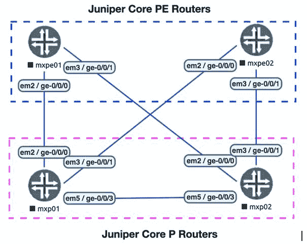
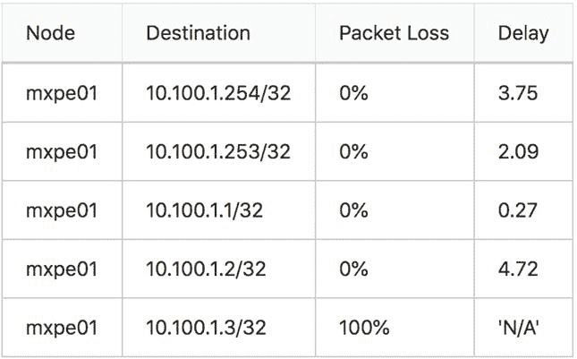

# 第三章：使用 Ansible 自动化 Juniper 设备的服务提供商

在本章中，我们将概述如何在典型的**服务提供商**（**SP**）环境中自动化运行 Junos OS 软件的 Juniper 设备。我们将探讨如何使用 Ansible 与 Juniper 设备交互，以及如何使用各种 Ansible 模块在 Juniper 设备上配置不同的服务和协议。我们将以以下示例网络图为基础进行说明，该示例网络图显示了基本 SP 网络的拓扑：



以下表格概述了我们示例拓扑中的设备及其各自的管理**Internet Protocols**（**IPs**）：

| **设备** | **角色** | **供应商** | **管理（MGMT）端口** | **MGMT IP** |
| --- | --- | --- | --- | --- |
| `mxp01` | P 路由器 | Juniper vMX 14.1 | `fxp0` | `172.20.1.2` |
| `mxp02` | P 路由器 | Juniper vMX 14.1 | `fxp0` | `172.20.1.3` |
| `mxpe01` | PE 路由器 | Juniper vMX 14.1 | `fxp0` | `172.20.1.4` |
| `mxpe02` | PE 路由器 | Juniper vMX 17.1 | `fxp0` | `172.20.1.5` |

本章涵盖的主要操作如下：

+   构建网络清单

+   连接并对 Juniper 设备进行身份验证

+   在 Junos OS 设备上启用**网络配置协议**（**NETCONF**）

+   在 Juniper 设备上配置通用系统选项

+   在 Juniper 设备上配置接口

+   在 Juniper 设备上配置**开放最短路径优先**（**OSPF**）

+   在 Juniper 设备上配置**多协议标签交换**（**MPLS**）

+   在 Juniper 设备上配置**边界网关协议**（**BGP**）

+   在 Juniper 设备上部署配置

+   在 Juniper 设备上配置**第 3 层虚拟专用网络**（**L3VPN**）服务

+   使用 Ansible 收集 Juniper 设备信息

+   验证 Juniper 设备的网络可达性

+   从 Juniper 设备检索操作数据

+   使用 PyEZ 操作表验证网络状态

# 技术要求

本章的代码文件可以在此处找到：[`github.com/PacktPublishing/Network-Automation-Cookbook/tree/master/ch3_junos`](https://github.com/PacktPublishing/Network-Automation-Cookbook/tree/master/ch3_junos)。

本章基于以下软件版本：

+   运行 CentOS 7 的 Ansible 机器

+   Ansible 2.9

+   Juniper **Virtual MX** (**vMX**)运行 Junos OS 14.1R8 和 Junos OS 17.1R1 版本

查看以下视频以查看代码的实际操作：

[`bit.ly/3ajF4Mp`](https://bit.ly/3ajF4Mp)

# 构建网络清单

在本操作中，我们将概述如何构建和组织 Ansible 清单，以描述先前概述的示例 SP 网络设置。Ansible 清单是 Ansible 的关键部分，因为它定义并分组应由 Ansible 管理的设备。

# 准备工作

我们创建一个新文件夹，用于存放本章中创建的所有文件。新文件夹名为`ch3_junos`。

# 操作步骤...

1.  在新文件夹`ch3_junos`中，我们创建一个`hosts`文件，内容如下：

```
$ cat hosts

[pe]
mxpe01 Ansible_host=172.20.1.3
mxpe02 Ansible_host=172.20.1.4

[p]
mxp01 Ansible_host=172.20.1.2
mxp02 Ansible_host=172.20.1.6

[junos]
mxpe[01:02]
mxp[01:02]

[core:children]
pe
p
```

1.  创建一个`Ansible.cfg`文件，如下所示：

```
$ cat Ansible.cfg

 [defaults]
 inventory=hosts
 retry_files_enabled=False
 gathering=explicit
 host_key_checking=False
```

# 工作原理...

我们使用`hosts`文件构建 Ansible 清单，并定义多个组，以便对网络基础设施中的不同设备进行分组。

+   我们创建`PE`组，引用拓扑中所有 MPLS **Provider Edge** (**PE**)节点。

+   我们创建`P`组，引用拓扑中所有 MPLS **Provider** (**P**)节点。

+   我们创建`junos`组，引用所有运行 Junos OS 的设备。

+   我们创建`core parent`组，引用`PE`和`P`组。

最后，我们创建`Ansible.cfg`文件并配置它指向我们的`hosts`文件，用作 Ansible 清单文件。我们将`gathering`设置为`explicit`，以禁用默认运行的 setup 模块，该模块用于发现受管主机的事实。禁用 setup 模块是强制性的，因为针对网络设备运行 setup 模块时会失败。

我们可以通过输入以下命令来验证我们的 Ansible 清单是否结构良好并正确编写：

```
$ Ansible-inventory --list

 "all": {
 "children": [
 "core",
 "junos",
 "ungrouped"
 ]
 },
 "core": {
 "children": [
 "p",
 "pe"
 ]
 },
 "junos": {
 "hosts": [
 "mxp01",
 "mxp02",
 "mxpe01",
 "mxpe02"
 ]
 },
 "p": {
 "hosts": [
 "mxp01",
 "mxp02"
 ]
 },
 "pe": {
 "hosts": [
 "mxpe01",
 "mxpe02"
 ]
 }
```

# 连接和身份验证 Juniper 设备

在这个示例中，我们将概述如何通过**Secure Shell**（**SSH**）从 Ansible 连接和身份验证 Juniper 设备，以开始管理 Juniper 设备。我们将概述如何使用 SSH 密钥作为身份验证方法来建立 Ansible 和 Juniper 设备之间的通信。

# 准备工作

为了按照这个示例操作，应该按照上一个示例构建一个 Ansible 清单文件。Ansible 控制机器和网络中所有设备之间的 IP 可达性必须配置好。

# 如何操作...

1.  在 Ansible 机器上，在我们的`ch3_junos`工作目录中创建私钥和公钥，如下所示：

```
$ SSH-keygen -t rsa -b 2048 -f Ansible_SSH_key

Generating public/private rsa key pair.
Enter passphrase (empty for no passphrase):
Enter same passphrase again:
Your identification has been saved in Ansible_SSH_key.
Your public key has been saved in Ansible_SSH_key.pub.
The key fingerprint is:
SHA256:aCqgMYKAWIkv3nVz/q9cYp+2n3doD9jpgw/jeWWcVWI Ansible@centos7.localdomain
```

1.  捕获在上一步创建的公钥，如下所示：

```
$ cat Ansible_SSH_key.pub
 SSH-rsa SSH-rsa AAAAB3NzaC1yc2EAAAADAQABAAABAQC0/wvdC5ycAanRorlfMYDMAv5OTcYAALlE2bdboajsQPQNEw1Li3N0J50OJBWXX+FFQuF7JKpM32vNQjQN7BgyaBWQGxv+Nj0ViVP+8X8Wuif0m6bFxBYSaPbIbGogDjPu4qU90Iv48NGOZpcPLqZthtuN7yZKPshX/0YJtXd2quUsVhzVpJnncXZMb4DZQeOin7+JVRRrDz6KP6meIylf35mhG3CV5VqpoMjYTzkDiHwIrFWVMydd4C77RQu27N2HozUtZgJy9KD8qIJYVdP6skzvp49IdInwhjOA+CugFQuhYhHSoQxRxpws5RZlvrN7/0h0Ahc3OwHaUWD+P7lz Ansible@centos7.localdomain
```

1.  在 Juniper 设备上，添加一个名为`admin`的新用户，并指定我们将使用 SSH 密钥对对该用户进行身份验证。将在 Ansible 机器上创建的公钥复制到设备上，如下所示：

```
[edit system login]
Ansible@mxpe01# show
user admin {
 uid 2001;
 class super-user;
 authentication {
 SSH-rsa " SSH-rsa AAAAB3NzaC1yc2EAAAADAQABAAABAQC0/wvdC5ycAanRorlfMYDMAv5OTcYAALlE2bdboajsQPQNEw1Li3N0J50OJBWXX+FFQuF7JKpM32vNQjQN7BgyaBWQGxv+Nj0ViVP+8X8Wuif0m6bFxBYSaPbIbGogDjPu4qU90Iv48NGOZpcPLqZthtuN7yZKPshX/0YJtXd2quUsVhzVpJnncXZMb4DZQeOin7+JVRRrDz6KP6meIylf35mhG3CV5VqpoMjYTzkDiHwIrFWVMydd4C77RQu27N2HozUtZgJy9KD8qIJYVdP6skzvp49IdInwhjOA+CugFQuhYhHSoQxRxpws5RZlvrN7/0h0Ahc3OwHaUWD+P7lz Ansible@centos7.localdomain"; ## SECRET-DATA
 }
}
```

# 它是如何工作的...

我们首先在 Ansible 控制机器上使用`SSH-keygen`命令创建公钥和私钥，并指定以下选项：

+   我们使用`-t`选项指定加密算法，并将其设置为`rsa`。

+   我们使用`-b`选项指定加密密钥的大小，并将大小设置为`2048`位。

+   我们使用`-f`选项指定保存私钥和公钥的位置，并指定将生成的公钥和私钥的名称，即`Ansible_SSH_key`。

一旦我们运行命令，我们将看到生成了以下两个文件（私钥和公钥），如下所示：

```
$ ls -la | grep Ansible_SSH_key
 -rw------- 1 Ansible Ansible 1679 Dec 31 23:41 Ansible_SSH_key
 -rw-r--r-- 1 Ansible Ansible 409 Dec 31 23:41 Ansible_SSH_key.pub
```

在我们的清单中的所有 Juniper 设备上，我们创建`admin`用户，并指定我们将使用 SSH 密钥进行身份验证。我们将在这个新用户的`authentication`部分下粘贴在 Ansible 控制机器上创建的公钥的内容。通过这个配置，任何拥有相应私钥的主机都可以作为`admin`用户进行身份验证并登录到 Juniper 设备。

为了测试和验证我们是否成功从计算节点登录到 Junos OS 设备，我们可以使用下面代码中显示的 Ansible 命令进行测试：

```
$ Ansible all -m ping -u admin --private-key Ansible_SSH_key -c network_cli

mxp02 | SUCCESS => {
 "changed": false,
 "ping": "pong"
}
mxpe02 | SUCCESS => {
 "changed": false,
 "ping": "pong"
}
mxpe01 | SUCCESS => {
 "changed": false,
 "ping": "pong"
}
mxp01 | SUCCESS => {
 "changed": false,
 "ping": "pong"
}
```

我们使用`-u`选项指定连接设备的用户名，并使用`–private-key`选项指定私钥。最后，我们使用`-c`选项来指定用于连接到受管设备的连接插件，这种情况下，我们使用`network_cli`连接插件来与受管 Juniper 设备建立 SSH 会话。

# 还有更多...

为了在我们的 playbooks 中使用生成的 SSH 密钥，我们可以在 Ansible 中的主机或组变量中指定用户名和 SSH 私钥文件，以便对 Juniper 设备进行身份验证。在我们的情况下，我们将这些变量设置为`junos`组的组变量。我们创建`group_vars`目录，并创建`junos.yml`文件，并按照下面的代码指定变量：

```
$ cat group_vars/junos.yml

Ansible_user: admin
 Ansible_SSH_private_key_file: Ansible_SSH_key
```

我们再次使用`Ansible`命令测试 Ansible 与我们的设备之间的连接；但是这次不指定任何参数，如下所示：

```
$ Ansible all -m ping -c network_cli

mxp02 | SUCCESS => {
 "changed": false,
 "ping": "pong"
}
mxpe02 | SUCCESS => {
 "changed": false,
 "ping": "pong"
}
mxpe01 | SUCCESS => {
 "changed": false,
 "ping": "pong"
}
mxp01 | SUCCESS => {
 "changed": false,
 "ping": "pong"
} 
```

# 在 Junos OS 设备上启用 NETCONF

在这个示例中，我们将概述如何在 Junos OS 设备上启用 NETCONF 协议。这个任务非常关键，因为我们将在以后的所有示例中使用 NETCONF API 来管理 Juniper 设备。与传统的 SSH 访问方法相比，NETCONF API 提供了几个优势，这就是为什么我们将在与 Junos OS 设备的所有交互中使用它的原因。

# 准备工作

作为这个配方的先决条件，必须存在一个 Ansible 清单文件，并且必须部署和工作 SSH 认证，就像之前的配方一样。

# 如何做...

1.  创建一个名为`pb_jnpr_net_build.yml`的新 playbook，如下面的代码所示：

```
$ cat pb_jnpr_net_build.yml

- name: Build Juniper SP Network
 hosts: junos
 tasks:
 - name: "Enable NETCONF"
 junos_netconf:
 netconf_port: 830
 state: present
 vars:
 Ansible_connection: network_cli
 tags: netconf
```

1.  使用以下代码更新`group_vars/junos.yml`文件中的连接详情：

```
$ cat group_vars/junos.yml

Ansible_network_os: junos
Ansible_connection: netconf
```

# 它是如何工作的...

为了开始通过 NETCONF 与 Junos OS 设备进行交互，我们首先需要启用它，因此我们需要最初通过 SSH 连接到设备并启用 NETCONF。这就是为什么我们使用`network_cli` Ansible 连接来通过传统 SSH 连接到 Junos OS 设备。为了使用`network_cli`连接插件，我们需要将`Ansible_network_os`设置为`junos`。

由于我们将在所有接下来的配方中使用 NETCONF API 与 Juniper 设备进行所有交互，因此我们只为此 playbook 中的`junos_netconf`任务启用了`network_cli`插件，通过`vars`属性。然而，对于我们将在此 playbook 中添加的所有未来任务，我们将使用`group_vars/junos.yml`文件中`Ansible_connection`属性中指定的`netconf`连接。

我们创建一个名为`pb_jnpr_net_build.yml`的新 playbook，在第一个任务中，我们使用`junos_netconf`模块在远程 Junos OS 设备上启用 NETCONF 协议。我们指定将使用的 NETCONF 端口（默认情况下为`830`），并且我们概述了这个配置必须通过`state: present`指令存在于远程设备上。

一旦我们运行 playbook，我们将看到所有的 Junos OS 设备都配置了 NETCONF，如下面的代码所示：

```
admin@mxpe01# show system services
SSH;
netconf {
 SSH {
 port 830;
 }
}
```

# 在 Juniper 设备上配置通用系统选项

在这个配方中，我们将概述如何在 Juniper 设备上配置一些通用的系统选项，比如主机名和**域名系统**（**DNS**）服务器，并为用户进行配置。

# 准备工作

为了遵循这个配方，假设已经设置了一个 Ansible 清单，并且根据之前的配方，在所有 Juniper 设备上都启用了 NETCONF。

# 如何做...

1.  使用以下参数更新`group_vars/all.yml`文件，以定义各种系统级参数，如`dns`和系统用户，如下面的代码所示：

```
$ cat group_vars/all.yml
tmp_dir: ./tmp
config_dir: ./configs
global:
 dns:
 - 172.20.1.1
 - 172.20.1.15
 root_pwd: $1$ciI4raxU$XfCVzABJKdALim0aWVMql0
 users:
 -   role: super-user
 SSH_key: Ansible_SSH_key.pub
 username: admin
 -   hash: $1$mR940Z9C$ipX9sLKTRDeljQXvWFfJm1
 passwd: 14161C180506262E757A60
 role: super-user
 username: Ansible
```

1.  创建一个名为`pb_jnpr_basic_config.yml`的新 playbook，其中包含以下任务，用于在 Juniper 设备上设置`dns`、`hostname`和系统用户：

```
$ cat pb_jnpr_basic_config.yml
---
- name: Configure Juniper Devices
 hosts: junos
 tasks:
 - name: "Conifgure Basic System config"
 junos_system:
 hostname: "{{ inventory_hostname }}"
 name_servers: "{{ global.dns }}"
 state: present
 - name: "Configure Users"
 junos_user:
 name: "{{ item.username }}"
 role: "{{ item.role }}"
 SSHkey: "{{ lookup ('file', item.SSH_key) }}"
 state: present
 with_items: "{{ global.users | selectattr('SSH_key','defined') | list }}"
```

# 它是如何工作的...

Ansible 提供了声明性模块来配置 Juniper 设备上的各种系统级参数。`junos_system` Ansible 模块使我们能够设置 Juniper 设备上的主机名和 DNS 服务器。`junos_user`模块为我们提供了在 Juniper 设备上设置系统用户的基本参数的能力。在这个例子中，我们设置了所有使用 SSH 密钥作为他们的认证方法的用户，并且我们循环遍历`users`数据结构，并且只选择定义了`SSH_key`选项的用户。

一旦我们运行这个 playbook，我们可以看到设备上的配置已经更新，如下面的代码块所示：

```
$ Ansible@mxpe01# show system
host-name mxpe01;
}
name-server {
 172.20.1.1;
 172.20.1.15;
}
login {
 user admin {
 uid 2001;
 class super-user;
 authentication {
 SSH-rsa "SSH-rsa AAAAB3NzaC1yc2EAAAADAQABAAABAQC0/wvdC5ycAanRorlfMYDMAv5OTcYAALlE2bdboajsQPQNEw1Li3N0J50OJBWXX+FFQuF7JKpM32vNQjQN7BgyaBWQGxv+Nj0ViVP+8X8Wuif0m6bFxBYSaPbIbGogDjPu4qU90Iv48NGOZpcPLqZthtuN7yZKPshX/0YJtXd2quUsVhzVpJnncXZMb4DZQeOin7+JVRRrDz6KP6meIylf35mhG3CV5VqpoMjYTzkDiHwIrFWVMydd4C77RQu27N2HozUtZgJy9KD8qIJYVdP6skzvp49IdInwhjOA+CugFQuhYhHSoQxRxpws5RZlvrN7/0h0Ahc3OwHaUWD+P7lz Ansible@centos7.localdomain"; ## SECRET-DATA
 }
 }
```

# 还有更多...

我们在本节中概述的声明性 Ansible 模块提供了一种简单的方法来配置 Juniper 设备的基本系统级参数。然而，它们可能不涵盖我们需要在 Juniper 设备上设置的所有参数。为了更好地控制和灵活地配置 Juniper 设备的系统级参数，我们可以使用 Jinja2 模板以及 Ansible 的`template`模块来生成我们部署所需的特定系统级配置。在本节中，我们将概述这种方法以实现这个目标，并且这是我们将在后续的配方中使用的方法来为其他设备生成配置。

我们将重用这种方法为 Juniper 设备的不同部分（如系统、接口、OSPF 和 MPLS）生成配置。我们将创建一个 Ansible 角色，以包含生成最终配置所需的所有 Jinja2 模板和任务。以下步骤概述了创建角色以及使用该角色生成配置所需的步骤：

1.  创建一个新的`roles`目录，并添加一个名为`build_router_config`的新角色，目录结构如下：

```
$ tree roles/
 roles/
 └── build_router_config
 ├── tasks
 └── templates
```

1.  在`tasks`文件夹下，创建一个名为`build_config_dir.yml`的 YAML 文件，以创建存储将生成的配置的所需文件夹，如下所示：

```
$ cat roles/build_router_config/tasks/build_config_dir.yml

---
- name: Create Config Directory
 file: path={{config_dir}} state=directory
 run_once: yes

- name: Create Temp Directory per Node
 file: path={{tmp_dir}}/{{inventory_hostname}} state=directory

- name: SET FACT >> Build Directory
 set_fact:
 build_dir: "{{tmp_dir}}/{{inventory_hostname}}"
```

1.  在`templates`文件夹下，创建一个名为`junos`的新文件夹，在该文件夹中创建一个名为`mgmt.j2`的新 Jinja2 模板，内容如下：

```
$ cat roles/build_router_config/templates/junos/mgmt.j2

system {
 host-name {{inventory_hostname}};
 no-redirects;

 name-server {

 {{dns_server}};

 }

 root-authentication {
 encrypted-password "{{ global.root_pwd}}"; ## SECRET-DATA
 }
 login {

 user {{ user.username }} {
 class super-user;
 authentication {
 encrypted-password "{{user.hash}}"; ## SECRET-DATA
 }
 }


 user {{ user.username }} {
 class {{ user.role }};
 authentication {
 SSH-rsa "{{lookup('file',user.SSH_key)}}"; ## SECRET-DATA
 }
 }

 }
}
```

1.  在`tasks`文件夹下，创建一个名为`build_device_config.yml`的新的 YAML 文件，其中包含以下任务来创建系统配置：

```
$ cat roles/build_router_config/tasks/build_device_config.yml

---
- name: "System Configuration"
 template:
 src: "{{Ansible_network_os}}/mgmt.j2"
 dest: "{{build_dir}}/00_mgmt.cfg"
 tags: mgmt
```

1.  在`tasks`文件夹下创建一个名为`main.yml`的文件，其中包含以下任务：

```
$ cat roles/build_router_config/tasks/main.yml

---
- name: Build Required Directories
 import_tasks: build_config_dir.yml

- name: Build Device Configuration
 import_tasks: build_device_config.yml

- name: "Remove Old Assembled Config"
 file:
 path: "{{config_dir}}/{{ inventory_hostname }}.cfg"
 state: absent

- name: Build Final Device Configuration
 assemble:
 src: "{{ build_dir }}"
 dest: "{{config_dir}}/{{ inventory_hostname }}.cfg"

- name: Remove Build Directory
 file: path={{ tmp_dir }} state=absent
 run_once: yes
```

1.  使用以下任务更新`pb_jnpr_net_build.yml`播放手册，以为我们清单中的所有 Juniper 设备生成配置：

```
$ cat pb_jnpr_net_build.yml

- name: Build Device Configuration
 import_role:
 name: build_router_config
 vars:
 Ansible_connection: local
 tags: build
```

在这种方法中，我们创建一个名为`build_router_config`的角色，并创建一个名为`mgmt.j2`的新 Jinja2 模板，其中包含 Junos OS 系统级配置的模板。我们使用 Ansible `template`模块来使用`group_vars/all.yml`文件中定义的 Ansible 变量渲染 Jinja2 模板。为了保存每个设备的配置，我们创建`configs`文件夹目录，其中存储每个设备的最终配置。

由于我们将使用这种方法为每个部分（MGMT、OSPF、MPLS 等）生成配置，我们将每个部分分割为单独的 Jinja2 模板，并将每个部分生成为单独的文件。我们使用`assemble`模块将所有这些不同部分组合成单个配置文件，并将其存储在`configs`目录中。这是每个设备的`final`和`assembled`配置文件。我们将每个部分的临时配置片段存储在每个设备的临时文件夹中，并在播放手册运行结束时删除此临时文件夹。这是因为我们已经为设备组装了最终配置，不再需要这些配置片段。

在这个手册中，我们将`Ansible_connection`设置为`local`，因为我们不需要连接到设备来运行角色中的任何任务。我们只在 Ansible 控制机上生成配置，因此所有任务都需要在 Ansible 控制机上本地运行。因此，无需连接到远程管理节点。

运行播放手册后，我们可以看到`configs`目录中创建了以下配置文件：

```
$ tree configs/
 configs/
 ├── mxp01.cfg
 ├── mxp02.cfg
 ├── mxpe01.cfg
 └── mxpe02.cfg
```

我们可以看到为`mxpe01`设备生成的配置，如下所示：

```
$ cat configs/mxpe01.cfg
system {
 host-name mxpe01;
 no-redirects;
 name-server {
 172.20.1.1;
 172.20.1.15;
 }
 root-authentication {
 encrypted-password "$1$ciI4raxU$XfCVzABJKdALim0aWVMql0"; ## SECRET-DATA
 }
 login {
 user Ansible {
 class super-user;
 authentication {
 encrypted-password "$1$mR940Z9C$ipX9sLKTRDeljQXvWFfJm1"; ##
SECRET-DATA
 }
 }
 user admin {
 class super-user;
 authentication {
 SSH-rsa "SSH-rsa AAAAB3NzaC1yc2EAAAADAQABAAABAQC0/wvdC5ycAanRorlfMYDMAv5OTcYAALlE2bdboajsQPQNEw1Li3N0J50OJBWXX+FFQuF7JKpM32vNQjQN7BgyaBWQGxv+Nj0ViVP+8X8Wuif0m6bFxBYSaPbIbGogDjPu4qU90Iv48NGOZpcPLqZthtuN7yZKPshX/0YJtXd2quUsVhzVpJnncXZMb4DZQeOin7+JVRRrDz6KP6meIylf35mhG3CV5VqpoMjYTzkDiHwIrFWVMydd4C77RQu27N2HozUtZgJy9KD8qIJYVdP6skzvp49IdInwhjOA+CugFQuhYhHSoQxRxpws5RZlvrN7/0h0Ahc3OwHaUWD+P7lz Ansible@centos7.localdomain"; ## SECRET-DATA
 }
 }
 }
}
```

在随后的步骤中，我们将概述如何使用另一个 Ansible 模块将生成的配置推送到 Juniper 设备。

# 另请参阅...

有关 Ansible `template`模块和该模块支持的不同参数的更多信息，请参考以下网址：[`docs.ansible.com/ansible/latest/modules/template_module.html`](https://docs.ansible.com/ansible/latest/modules/template_module.html)。

有关 Ansible `assemble`模块和该模块支持的不同参数的更多信息，请参考以下网址：[`docs.ansible.com/ansible/latest/modules/assemble_module.html`](https://docs.ansible.com/ansible/latest/modules/assemble_module.html)。

# 配置 Juniper 设备上的接口

在这个步骤中，我们将概述如何管理 Juniper 设备上的接口。这使我们能够为我们的接口设置不同的参数，如**最大传输单元**（**MTU**）和 Juniper 设备上的 IP 地址。

# 准备工作

为了按照这个步骤进行操作，假设已经设置了 Ansible 清单，并且在所有 Juniper 设备上启用了 NETCONF，就像之前的步骤一样。

# 如何做…

1.  更新`group_vars/all.yml` YAML 文件，包括我们示例网络拓扑中所有**点对点**（**P2P**）和环回接口的以下数据：

```
p2p_ip:
 mxp01:
 - {port: ge-0/0/0, ip: 10.1.1.2 , peer: mxpe01, pport: ge-0/0/0, peer_ip: 10.1.1.3}
 - {port: ge-0/0/1, ip: 10.1.1.4 , peer: mxpe02, pport: ge-0/0/0, peer_ip: 10.1.1.5}
 - {port: ge-0/0/3, ip: 10.1.1.0 , peer: mxp02, pport: ge-0/0/3, peer_ip: 10.1.1.1}
 mxp02:
 <-- Output Trimmed for brevity ------>
 mxpe01:
 <-- Output Trimmed for brevity ------>
 mxpe02:
 <-- Output Trimmed for brevity ------>
 xrpe03:
 <-- Output Trimmed for brevity ------>
lo_ip:
 mxp01: 10.100.1.254/32
 mxp02: 10.100.1.253/32
 mxpe01: 10.100.1.1/32
 mxpe02: 10.100.1.2/32
 xrpe03: 10.100.1.3/32
```

1.  在`pb_jnpr_basic_config.yml` playbook 中更新以下任务，以在我们的 Juniper 设备上设置接口：

```
- name: "Configure the Physical Interfaces"
 junos_interface:
 name: "{{ item.port }}"
 enabled: true
 description: "peer:{{item.peer}} remote_port:{{item.pport }}"
 mtu: "{{ global.mtu | default(1500) }}"
 with_items: "{{p2p_ip[inventory_hostname]}}"
 tags: intf

- name: "Configure IP Addresses"
 junos_l3_interface:
 name: "{{ item.port }}"
 ipv4: "{{ item.ip }}/{{ global.p2p_prefix }}"
 state: present
 with_items: "{{ p2p_ip[inventory_hostname] }}"
 tags: intf
```

# 它是如何工作的…

我们在`group_vars/all.yml`文件中的两个主要数据结构中定义了示例网络拓扑中所有接口的所有数据。我们使用`p2p_ip`字典来模拟示例网络中所有 P2P IP 地址，并使用`lo_ip`字典来指定节点的环回 IP 地址。

我们使用`junos_interface` Ansible 模块来启用接口并为接口设置基本参数，如 MTU 和描述。我们循环遍历每个设备的`p2p_ip`数据结构，并为网络清单中的所有设备上的每个接口设置正确的参数。我们使用`junos_l3_interface` Ansible 模块在示例网络拓扑中的所有设备上设置正确的 IPv4 地址。

一旦我们运行了 playbook，我们可以看到接口已经按照要求配置，就像在`mxpe01`设备上显示的那样：

```
Ansible@mxpe01# show interfaces
ge-0/0/0 {
 description "peer:mxp01 remote_port:ge-0/0/0";
 mtu 1500;
 unit 0 {
 family inet {
 address 10.1.1.3/31;
 }
 }
}
ge-0/0/1 {
 description "peer:mxp02 remote_port:ge-0/0/0";
 mtu 1500;
 unit 0 {
 family inet {
 address 10.1.1.9/31;
 }
 }
}
```

# 还有更多…

如果我们需要对接口配置有更多的控制，并设置声明式 Ansible 模块中未涵盖的参数，我们可以使用 Jinja2 模板来实现这个目标。使用与我们在上一步骤中概述的完全相同的方法，我们可以为我们的 Juniper 设备生成所需的接口配置。

使用我们在上一步骤中创建的相同的 Ansible 角色，我们可以扩展它以为我们的 Juniper 设备生成接口配置。我们使用以下步骤来完成这个任务：

1.  在`templates`文件夹中创建一个名为`intf.j2`的新的 Jinja2 模板文件，包含以下数据：

```
$ cat roles/build_router_config/templates/junos/intf.j2

interfaces {

 {{ intf.port.split('.')[0] }} {
 description "peer:{{intf.peer}} -- peer_port: {{intf.pport}}"
 unit 0 {
 family inet {
 address {{intf.ip}}/{{global.p2p_prefix}};
 }
 family mpls;
 }
 }
 
 
 lo0 {
 unit 0 {
 family inet {
 address {{lo_ip[inventory_hostname]}};
 }
 }
 }
```

1.  在`tasks`目录下更新`build_device_config.yml`文件，添加新任务以生成接口配置，如下所示：

```
$ cat roles/build_router_config/tasks/build_device_config.yml

<-- Output Trimmed for brevity ------>

- name: "Interface Configuration"
 template:
 src: "{{Ansible_network_os}}/intf.j2"
 dest: "{{build_dir}}/01_intf.cfg"
 tags: intf
```

这是在运行 playbook 后为`mxp02`设备生成的接口配置：

```
interfaces {
 ge-0/0/0 {
 description "peer:mxpe01 -- peer_port: ge-0/0/1"
 unit 0 {
 family inet {
 address 10.1.1.8/31;
 }
 family mpls;
 }
 }
 ge-0/0/1 {
 description "peer:mxpe02 -- peer_port: ge-0/0/1"
 unit 0 {
 family inet {
 address 10.1.1.10/31;
 }
 family mpls;
 }
 }
<--   Output Trimmed for brevity ------>

 lo0 {
 unit 0 {
 family inet {
 address 10.100.1.253/32;
 }
 }
 }
```

# 在 Juniper 设备上配置 OSPF

在这个步骤中，我们将概述如何在 Juniper 设备上配置 OSPF 作为我们示例网络拓扑中的**内部网关协议**（**IGP**），以及不同的 OSPF 参数，如 OSPF 链路类型和 OSPF 接口成本。

# 如何做…

1.  在`templates/junos`目录中创建一个名为`ospf.j2`的新的 Jinja2 文件，包含以下数据：

```
$ cat roles/build_router_config/templates/junos/ospf.j2

 protocols {
 ospf {
 area {{global.ospf_area}} {

 interface {{ intf.port }} {
 interface-type p2p;
 metric {{intf.cost | default(100)}};
 }

 interface lo0.0 {
 passive;
 }
 }
 }
}
```

1.  在`tasks`文件夹中的`junos_build_config.yml`文件中，添加以下任务：

```
$ cat roles/build_router_config/tasks/build_device_config.yml

<-- Output Trimmed for brevity ------>

- name: "OSPF Configuration"
 template:
 src: "{{Ansible_network_os}}/ospf.j2"
 dest: "{{config_dir}}/{{ inventory_hostname }}/02_ospf.cfg"
```

# 它是如何工作的…

我们使用在`all.yml`文件中声明的`p2p_ip`数据结构中声明的相同接口数据，以便在我们的示例网络中的网络设备上配置 OSPF。我们使用在`templates/junos`目录下定义的新的 Jinja2 模板来捕获需要在 Juniper 设备上实现的 OSPF 配置参数（OSPF 成本、OSPF 接口类型等）。

在`tasks/Juniper_build_config.yml`文件中，添加一个使用`ospf.j2` Jinja2 模板来渲染 Jinja2 模板，并输出我们 Ansible 清单中每个设备的 OSPF 配置部分的新任务。

在运行带有新任务的 playbook 后，以下片段概述了为`mxpe01`设备生成的 OSPF 配置：

```
$ cat configs/mxpe01.cfg

 <--   Output Trimmed for brevity ------>

protocols {
 ospf {
 area 0 {
 interface ge-0/0/0 {
 interface-type p2p;
 metric 100;
 }
 interface ge-0/0/1 {
 interface-type p2p;
 metric 100;
 }
 interface lo0.0 {
 passive;
 }
 }
 }
}
```

# 在 Juniper 设备上配置 MPLS

在这个方法中，我们将概述如何在 Juniper 设备上配置 MPLS 和一些相关协议，如**标签分发协议**（**LDP**）和**资源预留协议**（**RSVP**）。我们将概述如何使用 Ansible 和 Jinja2 模板生成所需的 MPLS 配置。

# 如何做...

1.  在`templates/junos`目录下创建一个名为`mpls.j2`的新的 Jinja2 文件，包含以下数据：

```
$ cat roles/build_router_config/templates/junos/mpls.j2

 protocols {
 ldp {

 interface {{intf.port}}.{{intf.vlan|default('0')}};

 interface lo0.0;
 }
 rsvp {

 interface {{intf.port}}.{{intf.vlan|default('0')}};

 }
 mpls {

 interface {{intf.port}}.{{intf.vlan|default('0')}};

 }
}
```

1.  在`tasks`文件夹中的`build_device_config.yml`文件中，添加以下任务：

```
$ cat roles/build_router_config/tasks/build_device_config.yml

<-- Output Trimmed for brevity ------>

- name: "MPLS Configuration"
 template:
 src: "{{Ansible_network_os}}/mpls.j2"
 dest: "{{config_dir}}/{{ inventory_hostname }}/03_mpls.cfg"
```

# 它是如何工作的...

我们使用与配置接口和 OSPF 相同的方法，通过使用 Jinja2 模板为我们库存中的 Juniper 设备生成所需的 MPLS 配置，以下是`mxpe02`路由器的 MPLS 配置示例：

```
protocols {
    ldp {
        interface ge-0/0/0.0;
        interface ge-0/0/1.0;
        interface lo0.0;
    }
    rsvp {
        interface ge-0/0/0.0;
        interface ge-0/0/1.0;
    }
    mpls {
        interface ge-0/0/0.0;
        interface ge-0/0/1.0;
    }
}
```

# 在 Juniper 设备上配置 BGP

在这个方法中，我们将概述如何在 Juniper 设备上配置 BGP。我们将概述如何设置 BGP 和 BGP**路由反射器**（**RR**）作为我们示例拓扑的一部分，以及支持**虚拟专用网络**（**VPN**）服务所需的所有 BGP 地址族。

# 如何做...

1.  更新`group_vars/all.yml`文件，包含以下 BGP 信息：

```
bgp_topo:
  rr: mxp01
  af:
  - inet
  - inet-vpn
```

1.  对于 Ansible 库存中的每个节点，我们在`host_vars`目录下创建一个名为`bgp.yml`的文件。该文件保存每个节点的 BGP 信息和 BGP 对等方。这是`mxpe01`设备的示例：

```
$ cat host_vars/mxpe01/bgp.yml

bgp_asn: 65400

bgp_peers:
 - local_as: 65400
 peer: 10.100.1.254
 remote_as: 65400
```

1.  在`templates/junos`目录下创建一个名为`bgp.j2`的新的 Jinja2 文件，包含以下数据：

```
$ cat roles/build_router_config/templates/junos/bgp.j2

 protocols {

 bgp {
 group Core {
 type internal;
 local-address {{ lo_ip[inventory_hostname] | ipaddr('address')}};

 cluster {{ lo_ip[inventory_hostname].split('/')[0] }};



 family inet {
 unicast;
 }


 family inet-vpn {
 unicast;
 }

<--   Output Trimmed for brevity ------>


 neighbor {{ p.peer}};

 }
 }

}
```

1.  在`tasks`文件夹中的`build_device_config.yml`文件中，添加以下突出显示的任务：

```
$ cat roles/build_router_config/tasks/build_device_config.yml

<-- Output Trimmed for brevity ------>

- name: "BGP Configuration"
 template:
 src: "{{Ansible_network_os}}/bgp.j2"
 dest: "{{config_dir}}/{{ inventory_hostname }}/04_bgp.cfg"
```

# 它是如何工作的...

与之前的方法类似，我们使用 Jinja2 模板为 Juniper 设备生成 BGP 配置。然而，在本节中，我们在两个不同的位置声明 BGP 参数，即`group_vars`和`host_vars`目录。在`group_vars/all.yml`文件中，我们声明了 BGP 拓扑的整体参数，例如我们将使用的 RR 以及我们将配置哪些地址族。对于库存中的每个节点，我们在`host_vars`目录中创建一个目录，并在该目录中创建一个`bgp.yml`文件。这个新的 YAML 文件保存了我们库存中每个节点的 BGP 对等方。我们使用这两个位置定义的数据来为每个设备渲染 BGP 配置。

这是`mxp01`路由器的 BGP 配置示例，它是我们拓扑中的 RR：

```
protocols {
 bgp {
 group Core {
 type internal;
 local-address 10.100.1.254;
 cluster 10.100.1.254;
 family inet {
 unicast;
 }
 family inet-vpn {
 unicast;
 }
 neighbor 10.100.1.1;
 neighbor 10.100.1.2;
 neighbor 10.100.1.3;
 }
 }
}
```

# 在 Juniper 设备上部署配置

在这个方法中，我们将概述如何使用 Ansible 在 Juniper 设备上推送我们通过 Jinja2 模板在所有先前部分生成的配置。这使我们能够将我们创建的任何自定义配置推送到 Juniper 设备。

# 准备工作

此方法要求 Juniper 设备上启用 NETCONF。

# 如何做...

1.  在`pb_junos_push_con`文件中，添加以下任务：

```
$ cat pb_jnpr_net_build.yml

<-- Output Trimmed for brevity ------>

- name: "Deploy Configuration"
 junos_config:
 src: "{{config_dir}}/{{ inventory_hostname }}.cfg"
```

# 它是如何工作的...

在先前的方法中，我们使用`assemble`模块来将 Juniper 设备的不同部分的配置（如接口、OSPF、MPLS 和 BGP）分组到单个配置文件中。该文件存储在每个设备的`configs`文件夹中。

我们使用`junos_config`模块来将我们生成的配置文件推送到网络库存中的每个设备。我们可以使用`update`参数来控制我们要推送的配置如何与设备上的现有配置合并。它支持以下选项：

+   `合并`：这会导致我们文件中的配置与设备上的配置（候选配置）合并。这是默认选项。

+   `覆盖/更新`：这会导致我们文件中的配置覆盖受管设备上的完整配置。

我们可以使用`check`模式以干运行模式运行我们的 playbook。在这种情况下，我们将推送配置到设备，而不提交配置。这使我们能够检查将推送到设备的更改。可以按以下方式完成：

```
$ Ansible-playbook pb_jnpr_net_build.yml -l mxpe01 --check –diff
```

我们使用`-check`选项以检查模式（干运行）运行 playbook，并使用`-diff`选项以输出将推送到我们设备的更改。

# 还有更多...

`junos_config`模块还支持 Junos OS 支持的回滚功能，因此我们可以添加另一个任务来回滚配置并控制其运行，如下所示：

```
$ cat pb_jnpr_net_build.yml

<-- Output Trimmed for brevity ------>

- name: "Rollback config"
 junos_config:
 rollback: "{{ rollback | default('1') | int }}"
 tags: rollback, never
```

在前面的 playbook 中，我们回滚到配置的上一个版本。但是，通过更改`rollback`属性中的数字，我们可以控制要回滚到的配置版本。此外，我们使用标签来仅在 playbook 运行期间指定`rollback`标签时执行此任务，如下面的代码片段所示：

```
$ Ansible-playbook pb_jnpr_net_build.yml --tags rollback -l mxpe01
```

我们可以指定另一个回滚点，如下所示：

```
$ Ansible-playbook pb_jnpr_net_build.yml --tags rollback -l mxpe01 –e rollback=2
```

# 另请参阅...

有关`junos_config`模块和此模块支持的不同参数的更多信息，请参阅以下网址：[`docs.ansible.com/ansible/latest/modules/junos_config_module.html`](https://docs.ansible.com/ansible/latest/modules/junos_config_module.html)[.](https://docs.ansible.com/ansible/latest/modules/junos_config_module.html)

# 在 Juniper 设备上配置 L3VPN 服务

在本教程中，我们将概述如何使用各种 Ansible 模块在 Juniper 设备上建模和配置 L3VPN。这使我们能够使用**基础设施即代码**（**IaC**）实践来建模我们的服务，并利用 Ansible 来部署和推送所需的配置，以在 Juniper 设备上部署 L3VPN。

# 准备工作

Juniper 设备上必须启用 NETCONF 才能在本教程中使用 Ansible 模块。

# 如何做...

1.  创建一个名为`l3vpn.yml`的新文件，内容如下：

```
---
l3vpns:
 vpna:
 state: present
 rt: "target:{{bgp_asn}}:10"
 rd: "1:10"
 sites:
 - node: mxpe01
 port: ge-0/0/3.10
 ip: 172.10.1.1/24
 - node: mxpe02
 port: ge-0/0/3.10
 ip: 172.10.2.1/24
 vpnb:
 state: present
 rt: "target:{{bgp_asn}}:20"
 rd: "1:20"
 sites:
 - node: mxpe01
 port: ge-0/0/3.20
 ip: 172.20.1.1/24
 - node: mxpe02
 port: ge-0/0/3.20
 ip: 172.20.2.1/24
```

1.  创建一个名为`pb_junos_l3vpn.yml`的新 playbook，其中包含以下任务，以配置 PE-**客户边缘**（**CE**）链路：

```
---
- name: "Deploy L3VPNs on Juniper Devices"
 hosts: pe
 vars_files:
 - "l3vpn.yml"
 tasks:
 - name: "Set VPN Interfaces"
 set_fact:
 l3vpn_intfs: "{{ l3vpn_intfs|default([]) +
 l3vpns[item.key].sites |
 selectattr('node','equalto',inventory_hostname) | list}}"
 with_dict: "{{l3vpns}}"
 delegate_to: localhost

 - name: "Configure Interfaces for L3VPN Sites"
 junos_config:
 lines:
 - set interfaces {{ item.port.split('.')[0]}} vlan-tagging
 - set interfaces {{ item.port}} vlan-id {{ item.port.split('.')[1] }}
 loop: "{{ l3vpn_intfs }}"
```

1.  在`pb_junos_l3vpn.yml`中添加以下任务以设置 PE-CE 链路上的 P2P IP 地址：

```
- name: "Configure IP address for L3VPN Interfaces"
 junos_l3_interface:
 name: "{{ item.port.split('.')[0]}}"
 ipv4: "{{ item.ip }}"
 unit: "{{ item.port.split('.')[1] }}"
 loop: "{{l3vpn_intfs}}"
 tags: intf_ip
```

1.  在`pb_junos_l3vpn.yml`中添加以下任务以在 PE 节点上配置**虚拟路由和转发**（**VRFs**）：

```
- name: "Configure L3VPNs"
 junos_vrf:
 name: "{{ item.key }}"
 rd: "{{item.value.rd}}"
 target: "{{ item.value.rt }}"
 interfaces: "{{ l3vpns[item.key].sites |
 map(attribute='port') | list }}"
 state: "{{ item.value.state }}"
 with_dict: "{{l3vpns}}"
 when: inventory_hostname in (l3vpns[item.key].sites | map(attribute='node') | list)
 tags: l3vpn
```

# 工作原理...

我们创建一个名为`l3vpn.yml`的新的 YAML 文件，描述和建模我们想要在拓扑上的所有 Juniper 设备上实现的 L3VPN 拓扑和数据。我们在新的 playbook 中包含这个文件，以便在我们的网络设备上配置 L3VPN。

在`pb_junos_l3vpn.yml` playbook 中，我们使用`l3vpn.yml`文件中的数据来捕获所需的数据以配置 L3VPN。

在我们的 playbook 中的第一个任务中，我们创建一个名为`l3vpn_intfs`的新变量，该变量捕获我们在`l3vpn.yml`文件中定义的所有 VPN 的每个 PE 设备上的所有 L3VPN 接口。我们在此文件中循环遍历所有 L3VPN，并为属于特定节点的所有接口创建一个新的列表数据结构。以下代码片段概述了`mxpe01`的`l3vpn_intfs`的新数据结构：

```
ok: [mxpe01 -> localhost] => {
 "l3vpn_intfs": [
 {
 "ip": "172.10.1.1/24",
 "node": "mxpe01",
 "port": "ge-0/0/3.10"
 },
 {
 "ip": "172.20.1.1/24",
 "node": "mxpe01",
 "port": "ge-0/0/3.20"
 }
 ]
}
```

接下来，在我们的 playbook 中，我们将我们的 L3VPN 服务的配置分为多个任务：

+   我们使用`junos_config`模块配置所有属于 L3VPN 的接口，以便在这些接口上配置**虚拟局域网**（**VLANs**）。

+   我们使用`junos_l3_interface`模块在所有属于我们的 L3VPN 模型的接口上应用 IPv4 地址。

+   我们使用`junos_vrf`模块根据我们的 L3VPN 数据模型在节点上配置正确的路由实例。

在运行此 playbook 后，以下概述了应用在`mxpe01`上的 L3VPN 配置：

```

Ansible@mxpe01> show configuration routing-instances
vpna {
 instance-type vrf;
 interface ge-0/0/3.10;
 route-distinguisher 1:10;
 vrf-target target:65400:10;
 vrf-table-label;
}
vpnb {
 instance-type vrf;
 interface ge-0/0/3.20;
 route-distinguisher 1:20;
 vrf-target target:65400:20;
 vrf-table-label;
}
```

# 另请参阅...

有关`junos_vrf`模块和该模块支持的不同参数以在 Juniper 设备上配置 L3VPN 的更多信息，请参考以下网址：[`docs.ansible.com/ansible/latest/modules/junos_vrf_module.html#junos-vrf-module`](https://docs.ansible.com/ansible/latest/modules/junos_vrf_module.html#junos-vrf-module)[. ](https://docs.ansible.com/ansible/latest/modules/junos_vrf_module.html#junos-vrf-module)

# 使用 Ansible 收集 Juniper 设备信息

在这个配方中，我们将检索 Ansible 为 Juniper 设备收集的基本系统信息。这些基本系统信息为我们提供了有关 Juniper 设备的基本健康检查，我们可以用来验证其操作状态。

# 准备工作

Juniper 设备上必须启用 NETCONF 才能在此配方中使用 Ansible 模块。

# 如何做...

1.  创建一个新的 playbook，`pb_jnpr_facts.yml`，使用以下任务来收集信息：

```
$ cat pb_jnpr_facts.yml

---
- name: Collect and Validate Juniper Facts
 hosts: junos
 tasks:
 - name: Collect Juniper Facts
 junos_facts:
```

1.  使用以下任务更新`pb_jnpr_facts.yml` playbook，为清单中的每个节点创建一个信息报告：

```
 - name: Create Facts Folder
 file: path=device_facts state=directory
 run_once: yes

 - name: Create Basic Device Facts Report
 blockinfile:
 path: "device_facts/{{ inventory_hostname }}.txt"
 block: |
 device_name: {{ Ansible_net_hostname }}
 model: {{ Ansible_net_system }} {{ Ansible_net_model }}
 os_version: {{ Ansible_net_version }}
 serial_number: {{ Ansible_net_serialnum }}
 create: yes
```

1.  使用以下任务更新 playbook 以验证核心接口的操作状态：

```
 - name: Validate all Core Interface are Operational
 assert:
 that:
 - Ansible_net_interfaces[item.port]['oper-status'] == 'up'
 fail_msg: "Interface {{item.port}} is not Operational "
 loop: "{{ p2p_ip[inventory_hostname] }}"
```

# 工作原理...

Ansible 提供了一个信息收集模块，用于收集 Juniper 设备的基本系统属性，并以一致和结构化的数据结构返回这些信息。我们可以使用该模块收集的信息来验证设备的基本属性和操作状态，并可以使用这些数据生成捕获设备状态的简单报告。

在这个配方中，我们使用`junos_facts`模块来收集所有 Juniper 设备的设备信息。该模块返回 Ansible 为每个设备收集的基本信息，并存储在多个变量中，如下所示：

```
"Ansible_net_serialnum": "VM5D112EFB39",
"Ansible_net_system": "junos",
"Ansible_net_version": "17.1R1.8",
"Ansible_network_os": "junos",
```

我们使用这些数据来使用`blockinfile`模块为每个设备构建信息报告，并使用这些数据来验证每个设备的核心接口的操作状态。

一旦我们运行了 playbook，我们就可以看到为每个设备生成了一个信息报告，如下所示：

```
$ tree device_facts/

device_facts/
 ├── mxp01.txt
 ├── mxp02.txt
 ├── mxpe01.txt
 └── mxpe02.txt

 $ cat device_facts/mxp01.txt

device_name: mxp01
 model: junos vmx
 os_version: 14.1R4.8
 serial_number: VM5701F131C6
```

在最后一个任务中，我们使用`assert`模块来验证所有 Juniper 设备上的所有核心接口是否都处于操作状态。Ansible 将设备的所有接口的操作状态存储在`Ansible_net_interfaces`下。我们使用这个数据结构中的数据来验证操作状态是否正常。如果所有核心接口都处于操作状态，任务将成功，否则任务将失败。

# 另请参阅...

有关`junos_facts`模块和该模块支持的不同参数的更多信息，请参考以下网址：[`docs.ansible.com/ansible/latest/modules/junos_facts_module.html`](https://docs.ansible.com/ansible/latest/modules/junos_facts_module.html)[.](https://docs.ansible.com/ansible/latest/modules/junos_facts_module.html)

# 验证 Juniper 设备的网络可达性

在这个配方中，我们将概述如何使用 Ansible 在 Juniper 设备上验证通过`ping`进行网络可达性。这将使我们能够验证样本网络拓扑中的网络可达性和流量转发。

# 准备工作

这个配方假设网络已经建立和配置，就像在所有先前的配方中所概述的那样。

# 如何做...

1.  创建一个名为`pb_junos_ping.yml`的新 playbook，使用以下任务来 ping 样本网络中的所有核心 loopback：

```
---
- name: "Validate Core Reachability"
 hosts: junos
 tasks:
 - name: "Ping Across All Loopback Interfaces"
 junos_ping:
 dest: "{{ item.value.split('/')[0] }}"
 interface: lo0.0
 size: 512
 with_dict: "{{lo_ip}}"
 vars:
 Ansible_connection: network_cli
 register: ping_rst
 ignore_errors: yes
```

1.  使用以下任务更新`pb_junos_ping.yml` playbook，创建一个自定义报告来捕获 ping 的结果：

```
 - name: Create Ping Report
 blockinfile:
 block: |
 Node | Destination | Packet Loss | Delay |
 -----| ------------| ------------| ------|
 
 
 
 {{ node }} | {{ result.item.value }} | {{ result.packet_loss }} | {{ result.rtt.avg }}
 
 {{ node }} | {{ result.item.value }} | {{ result.packet_loss }} | 'N/A'
 
 
 
 path: ./ping_report.md
 create: yes
 run_once: yes
```

# 工作原理...

我们使用`junos_ping`模块从网络清单中的所有节点向`group_vars/all.yml`文件中定义的`lo_ip`数据结构中定义的所有环回接口执行 ping。此模块连接到每个设备并对所有目的地执行 ping，并验证 ping 数据包是否到达其预期目的地。此模块需要使用`network_cli`连接插件，因此我们将此参数作为任务变量提供，以覆盖组级别在组级别定义的 NETCONF 连接插件。

我们注册模块的输出，以便使用这些数据生成 ping 报告。最后，我们将`ignore_errors`设置为`yes`，以忽略可能遇到的任何 ping 任务失败，并确保我们将运行后续任务以创建报告。

我们使用`blockinfile`模块创建 Markdown 中的自定义报告。我们使用表格布局来捕获 ping 结果并显示捕获这些 ping 结果的表格。以下片段捕获了为`mxpe01` ping 测试报告生成的表格：

```
$ cat ping_report.md

# BEGIN ANSIBLE MANAGED BLOCK
 Node | Destination | Packet Loss | Delay |
 -----| ------------| ------------| ------|
 mxpe01 | 10.100.1.254/32 | 0% | 3.75
 mxpe01 | 10.100.1.253/32 | 0% | 2.09
 mxpe01 | 10.100.1.1/32 | 0% | 0.27
 mxpe01 | 10.100.1.2/32 | 0% | 4.72
 mxpe01 | 10.100.1.3/32 | 100% | 'N/A'
 # END ANSIBLE MANAGED BLOCK
```

以下是 ping 结果的渲染 Markdown 表格：



# 另请参阅...

有关`junos_ping`模块和此模块支持的不同参数的更多信息，请参阅以下网址：[`docs.ansible.com/ansible/latest/modules/junos_ping_module.html`](https://docs.ansible.com/ansible/latest/modules/junos_ping_module.html)[.](https://docs.ansible.com/ansible/latest/modules/junos_ping_module.html)

# 从 Juniper 设备检索操作数据

在此步骤中，我们将概述如何在 Juniper 设备上执行操作命令并将这些输出存储为文本文件以进行进一步处理。

# 准备工作

NETCONF 必须在 Juniper 设备上启用，以便按照此步骤进行操作。

# 如何做...

1.  安装`jxmlease` Python 包，如下所示：

```
$ pip3 install jxmlease
```

1.  创建一个名为`pb_get_ospf_peers.yml`的新剧本，并填充以下任务以提取 OSPF 对等信息：

```
---
- name: "Get OSPF Status"
 hosts: junos
 tasks:
 - name: "Get OSPF Neighbours Data"
 junos_command:
 commands: show ospf neighbor
 display: xml
 register: ospf_output

 - name: "Extract OSPF Neighbour Data"
 set_fact:
 ospf_peers: "{{ ospf_output.output[0]['rpc-reply']\
 ['ospf-neighbor-information']['ospf-neighbor'] }}"
```

1.  更新`pb_get_ospf_peers.yml`剧本，使用以下任务验证所有节点上的所有 OSPF 对等关系是否处于`Full`状态：

```
 - name: "Validate All OSPF Peers are in Full State"
 assert:
 that: item['ospf-neighbor-state'] == 'Full'
 fail_msg: "Peer on Interface {{item['interface-name']}} is Down"
 success_msg: "Peer on Interface {{item['interface-name']}} is UP"
 loop: "{{ospf_peers}}"
```

# 工作原理...

使用 NETCONF API 与 Juniper 设备交互的一个优势是，我们可以获取我们在 Juniper 设备上执行的所有操作命令的结构化输出。设备通过 NETCONF 会话返回给我们的输出是 XML 格式的，Ansible 使用名为`jxmlease`的 Python 库来解码此 XML 并将其转换为 JSON 以进行更好的表示。这就是为什么我们的第一个任务是安装`jxmlease` Python 包。

我们使用`junos_command`模块向 Juniper 设备发送操作命令，并指定我们需要 XML 作为从节点返回的输出格式。Ansible 使用`jxmlease`包将此 XML 数据结构转换为 JSON。我们使用`register`关键字将此数据保存到名为`ospf_output`的新变量中。以下是从此命令返回的 JSON 数据的示例：

```
 "msg": [
 {
 "rpc-reply": {
 "ospf-neighbor-information": {
 "ospf-neighbor": [
 {
 "activity-timer": "34",
 "interface-name": "ge-0/0/0.0",
 "neighbor-address": "10.1.1.2",
 "neighbor-id": "10.100.1.254",
 "neighbor-priority": "128",
 "ospf-neighbor-state": "Full"
 },
 {
 "activity-timer": "37",
 "interface-name": "ge-0/0/1.0",
 "neighbor-address": "10.1.1.8",
 "neighbor-id": "10.100.1.253",
 "neighbor-priority": "128",
 "ospf-neighbor-state": "Full"
 }
 ]
 }
 }
 }
 ]
```

所有这些数据结构都包含在`ospf_output.output[0]`变量中，我们使用`set_fact`模块来捕获`ospf-neigbour`数据。之后，我们使用`assert`模块循环遍历此数据结构中的所有 OSPF 对等关系，并验证 OSPF 邻居状态是否等于`Full`。如果所有 OSPF 对等关系都处于`Full`状态，则任务将成功。但是，如果 OSPF 状态处于任何其他状态，则任务将失败。

# 还有更多...

如果我们需要以文本格式从 Juniper 设备获取操作数据以进行日志收集，我们可以使用`junos_command`模块，而不使用`xml`显示选项，如下所示在此新剧本中：

```
$ cat pb_collect_output.yml

---
- name: Collect Network Logs
 hosts: junos
 vars:
 log_folder: "logs"
 op_cmds:
 - show ospf neighbor
 tasks:
 - name: "P1T1: Build Directories to Store Data"
 block:
 - name: "Create folder to store Device config"
 file:
 path: "{{ log_folder }}"
 state: directory
 run_once: yes
 delegate_to: localhost

 - name: "P1T2: Get Running configs from Devices"
 junos_command:
 commands: "{{ item }}"
 loop: "{{ op_cmds }}"
 register: logs_output

 - name: "P1T3: Save Running Config per Device"
 copy:
 content: "{{ item.stdout[0] }}"
 dest: "{{ log_folder }}/{{inventory_hostname}}_{{ item.item | regex_replace(' ','_') }}.txt"
 loop: "{{ logs_output.results }}"
 delegate_to: localhost
```

这个 playbook 将从所有设备收集`show ospf neigbor`命令，并将它们存储在一个名为`logs`的新文件夹中。运行 playbook 后，这是`logs`文件夹的内容：

```
$ tree logs
 logs
 ├── mxp01_show_ospf_neighbor.txt
 ├── mxp02_show_ospf_neighbor.txt
 ├── mxpe01_show_ospf_neighbor.txt
 └── mxpe02_show_ospf_neighbor.txt
```

我们可以检查其中一个文件的内容，以确认已捕获所需的输出：

```

 $ cat logs/mxpe01_show_ospf_neighbor.txt

Address Interface State ID Pri Dead
 10.1.1.2 ge-0/0/0.0 Full 10.100.1.254 128 35
 10.1.1.8 ge-0/0/1.0 Full 10.100.1.253 128 37
```

# 使用 PyEZ 操作表验证网络状态

在这个配方中，我们将概述如何使用 Juniper 自定义 Ansible 模块来验证网络状态。我们将使用 Juniper PyEZ Python 库和 PyEZ 操作表和视图来验证 Junos OS 设备的操作状态。

# 准备工作

在遵循本配方时，Juniper 设备上必须启用 NETCONF。

# 如何操作...

1.  安装`junos-eznc` Python 包，如下所示：

```
$ pip3 install junos-eznc
```

1.  使用`Ansible-galaxy`安装`Juniper.junos` Ansible 角色，如下所示：

```
$ Ansible-galaxy install Juniper.junos
```

1.  创建一个名为`pb_jnpr_pyez_table.yml`的新 playbook，并填充以下任务以使用 PyEZ 表提取 BGP 对等信息：

```
$ cat pb_jnpr_pyez_table.yml

---
- name: Validate BGP State using PyEZ Tables
 hosts: junos
 roles:
 - Juniper.junos
 tasks:
 - name: Retrieve BGP Neighbor Information Using PyEZ Table
 Juniper_junos_table:
 file: "bgp.yml"
 register: jnpr_pyez_bgp
```

1.  使用以下任务更新 playbook 以验证所有节点上的所有 BGP 对等体是否正常运行：

```
 - name: Validate all BGP Peers are operational
 assert:
 that:
 - item.peer in jnpr_pyez_bgp.resource | map(attribute='peer_id') | list
 fail_msg: " BGP Peer {{ item.peer }} is Not Operational"
 loop: "{{ bgp_peers }}"
```

# 工作原理...

除了我们在所有先前的配方中概述的预安装在 Ansible 中的内置 Juniper 模块之外，Juniper 还维护并不是 Ansible 发布的一部分的其他 Ansible 模块。这些模块打包在 Ansible Galaxy 中维护的 Ansible 角色中，所有这些模块都基于 Juniper PyEZ Python 库，该库也由 Juniper 开发和维护。

Juniper PyEZ Python 库提供了一个简单而强大的 API，以便与 Juniper 设备进行交互，并简化了使用 Python 管理 Juniper 设备的方法。由 Juniper 维护的 Ansible 模块都依赖于 PyEZ Python 库，因此我们需要执行的第一个任务是确保 PyEZ（`junos-eznc`）已安装在我们的 Ansible 控制机上。

由 Juniper 维护和开发的 Ansible 模块打包为 Ansible 角色，并且它们提供了多个具有额外功能的模块，与作为 Ansible 发布的一部分的内置 Juniper 模块相比。我们使用 Ansible Galaxy 安装此角色，以开始利用这些额外的模块。以下片段概述了此角色的额外模块：

```
$ tree ~/.Ansible/roles/Juniper.junos/library/

/home/Ansible/.Ansible/roles/Juniper.junos/library/
 ├── Juniper_junos_command.py
 ├── Juniper_junos_config.py
 ├── Juniper_junos_facts.py
 ├── Juniper_junos_jsnapy.py
 ├── Juniper_junos_ping.py
 ├── Juniper_junos_pmtud.py
 ├── Juniper_junos_rpc.py
 ├── Juniper_junos_software.py
 ├── Juniper_junos_srx_cluster.py
 ├── Juniper_junos_system.py
 └── Juniper_junos_table.py
```

在这个配方中，我们概述了如何使用`Juniper_junos_table` Ansible 模块，该模块使用 PyEZ 表和视图来执行 Juniper 设备上的操作命令，并从 Juniper 设备中提取特定信息。它还将这些信息解析为一致的数据结构，我们可以在自动化脚本中利用。在我们的 playbook 中，我们的第一个任务是使用`Juniper_junos_table`模块，使用`bgp.yml`表定义（作为`junos-eznc`安装的一部分）来获取设备上的 BGP 对等体，并以一致的数据结构返回相关信息。以下片段概述了`Juniper_junos_table`返回的 BGP 数据，用于`mxpe01`上的 BGP 信息：

```
ok: [mxpe01] => {
 "jnpr_pyez_bgp": {
 "changed": false,
 "failed": false,
 "msg": "Successfully retrieved 1 items from bgpTable.",
 "resource": [
 {
 "local_address": "10.100.1.1+179",
 "local_as": "65400",
 "local_id": "10.100.1.1",
 "peer_as": "65400",
 "peer_id": "10.100.1.254",
 "route_received": [
 "0",
 "2",
 "1",
 "1"
 ]
 }
 ],
 }
}
```

我们 playbook 中的最后一个任务是使用`assert`模块来验证我们所有的 BGP 对等体（在`host_vars`目录下定义）是否存在于 BGP 表中返回的数据结构中，这表明所有的 BGP 对等体都是正常运行的。

# 另请参阅...

有关由 Juniper 维护的 Juniper Ansible 模块的更多信息，请参阅以下网址：[`www.juniper.net/documentation/en_US/junos-ansible/topics/reference/general/junos-ansible-modules-overview.html`](https://www.juniper.net/documentation/en_US/junos-ansible/topics/reference/general/junos-ansible-modules-overview.html)[.](https://www.juniper.net/documentation/en_US/junos-ansible/topics/reference/general/junos-ansible-modules-overview.html)

有关 PyEZ 表和视图的更多信息，请参考以下网址：[`www.Juniper.net/documentation/en_US/junos-pyez/topics/concept/junos-pyez-tables-and-views-overview.html`](https://www.Juniper.net/documentation/en_US/junos-pyez/topics/concept/junos-pyez-tables-and-views-overview.html)。
