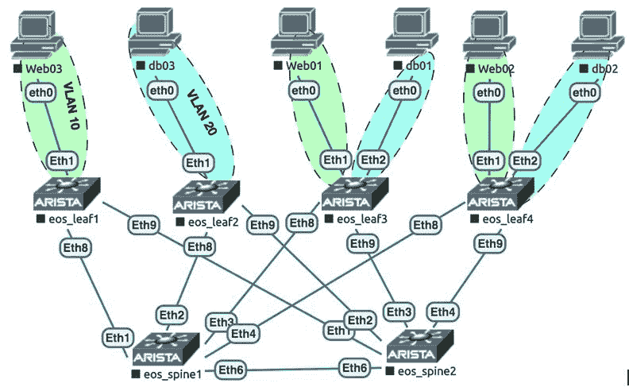

# 使用 Arista 和 Ansible 构建数据中心网络

在本章中，我们将概述如何在典型的数据中心环境中自动化 Arista 交换机，采用叶脊架构。我们将探讨如何使用 Ansible 与 Arista 设备进行交互，以及如何使用各种 Ansible 模块在 Arista 交换机上部署**虚拟局域网**（**VLANs**）和**虚拟可扩展局域网**（**VXLANs**），并在 Arista 交换机上使用**边界网关协议/以太网虚拟专用网络**（**BGP/EVPN**）设置。我们将以以下示例网络图为基础，说明基本叶脊**数据中心网络**（**DCN**）的示例网络图：



以下表格概述了我们示例拓扑中的设备及其各自的管理**互联网协议**（**IP**）：

| **设备** | **角色** | **供应商** | **管理（MGMT）端口** | **MGMT IP** |
| --- | --- | --- | --- | --- |
| Spine01 | 脊柱交换机 | Arista vEOS 4.20 | Management1 | `172.20.1.35` |
| Spine02 | 脊柱交换机 | Arista vEOS 4.20 | Management1 | `172.20.1.36` |
| Leaf01 | 叶子交换机 | Arista vEOS 4.20 | Management1 | `172.20.1.41` |
| Leaf02 | 叶子交换机 | Arista vEOS 4.20 | Management1 | `172.20.1.42` |
| Leaf03 | 叶子交换机 | Arista vEOS 4.20 | Management1 | `172.20.1.43` |
| Leaf04 | 叶子交换机 | Arista vEOS 4.20 | Management1 | `172.20.1.44` |

本章涵盖的主要配方如下：

+   构建 Ansible 网络清单

+   连接到并使用 Ansible 对 Arista 设备进行身份验证

+   在 Arista 设备上启用**可扩展操作系统**（**EOS**）**API**（**eAPI**）

+   在 Arista 设备上配置通用系统选项

+   在 Arista 设备上配置接口

+   在 Arista 设备上配置底层 BGP

+   在 Arista 设备上配置覆盖 BGP/EVPN

+   在 Arista 设备上部署配置

+   在 Arista 设备上配置 VLAN

+   在 Arista 设备上配置 VXLAN 隧道

+   收集 Arista 设备信息

+   从 Arista 设备检索操作数据

# 技术要求

本章中所有配方的代码可以在以下 GitHub 存储库中找到：

[`github.com/PacktPublishing/Network-Automation-Cookbook/tree/master/ch4_arista`](https://github.com/PacktPublishing/Network-Automation-Cookbook/tree/master/ch4_arista).

本章基于以下软件版本：

+   运行 CentOS 7 的 Ansible 机器

+   Ansible 2.9

+   Arista **虚拟化 EOS**（**vEOS**）运行 EOS 4.20.1F

观看以下视频以查看代码的实际操作：

[`bit.ly/3coydTp`](https://bit.ly/3coydTp)

# 构建 Ansible 网络清单

在本配方中，我们将概述如何构建和组织 Ansible 清单，以描述我们示例的叶脊**直流**（**DC**）网络。Ansible 清单是 Ansible 的重要组成部分，它描述并分组应由 Ansible 管理的设备。

# 准备工作

我们需要创建一个新的文件夹，用于存放本章中将创建的所有文件。新文件夹的名称应为`ch4_arista`。

# 如何做...

1.  在新文件夹（`ch4_arista`）中，我们创建一个带有以下内容的`hosts`文件：

```
$ cat hosts

[leaf]
 leaf01 ansible_host=172.20.1.41
 leaf02 ansible_host=172.20.1.42
 leaf03 ansible_host=172.20.1.43
 leaf04 ansible_host=172.20.1.44

[spine]
 spine01 ansible_host=172.20.1.35
 spine02 ansible_host=172.20.1.36

[arista:children]
 leaf
 spine
```

1.  创建一个`ansible.cfg`文件，如下面的代码块所示：

```
$ cat ansible.cfg

[defaults]
 inventory=hosts
 retry_files_enabled=False
 gathering=explicit
 host_key_checking=False
```

# 它是如何工作的...

定义 Ansible 清单是强制性的，以便描述和分类应由 Ansible 管理的网络中的设备。在 Ansible 清单中，我们还通过`ansible_host`参数指定 Ansible 将与这些受管设备通信的 IP 地址。

我们使用`hosts`文件构建了 Ansible 清单，并定义了多个组，以便对我们拓扑中的不同设备进行分组。这些组如下：

+   我们创建了`leaf`组，它引用了我们拓扑中的所有`leaf`交换机。

+   我们创建了`spine`组，它引用了我们拓扑中的所有`spine`交换机。

+   我们创建了`arista`组，它引用了`leaf`和`spine`两个组。

最后，我们创建了`ansible.cfg`文件，并配置它指向我们的`hosts`文件，用作 Ansible 清单文件。此外，我们禁用了`setup`模块（通过将`gathering`设置为`explicit`），这在针对网络节点运行 Ansible 时是不需要的。

# 从 Ansible 连接和认证 Arista 设备

在这个示例中，我们将概述如何通过**安全外壳**（**SSH**）从 Ansible 连接到 Arista 设备，以便从 Ansible 开始管理这些设备。我们将使用用户名和密码来对我们拓扑中的 Arista 设备进行认证。

# 准备工作

为了按照这个示例进行操作，应该按照之前的示例构建一个 Ansible 清单文件。Ansible 控制机与网络中所有设备之间的 IP 可达性也必须得到实现。

# 操作步骤...

1.  在`ch4_arista`文件夹中创建一个`group_vars`文件夹。

1.  在`group_vars`文件夹中，创建一个名为`arista.yml`的文件，包含以下内容：

```
ansible_network_os: eos
ansible_connection: network_cli
ansible_user: ansible
ansible_ssh_pass: ansible123
```

1.  在 Arista 交换机上，我们配置了用户名和密码，并启用了 SSH，如下所示：

```
!
username Ansible privilege 15 role network-admin secret sha512
$6$mfU4Ei0AORd6rage$5YObhOI1g0wNBK5onaKDpYJhLZ9138maJKgcOznzFdpM25Tf3rb0PWSojUSM
RQY0Y7.cexCFj5aFLY17tuNU1
!

 !
management ssh
 idle-timeout 300
 authentication mode password
 login timeout 300
!
```

1.  在 Arista 交换机上，使用正确的 IP 地址配置管理接口，并将它们放置在所需的管理**虚拟路由和转发**（**VRF**）中，如下所示：

```
vrf definition MGMT
!
 ip routing vrf MGMT
 !
interface Management1
 vrf forwarding MGMT
 ip address *$Ansible_host$
*   no lldp transmit
 no lldp receive
!
```

# 工作原理...

我们在`group_vars`目录下的`arista.yml`文件中指定了我们将在所有 Arista 交换机上配置的用户名和密码。这将应用这些参数到我们清单中的所有 Arista 交换机。在 Arista 交换机上，我们设置了用户名和密码并启用了 SSH，并在管理接口上设置了正确的 IP 地址（在我们的清单中使用的`ansible_host`参数中使用的 IP 地址）。我们配置了管理 VRF，并将管理接口与此 VRF 关联起来。

我们在 Ansible 变量中以明文指定了 SSH 密码。这只适用于实验室设置；然而，在生产环境中，我们应该使用 Ansible vault 来保护任何敏感信息，就像在前面的章节中概述的那样。

在这个阶段，我们使用`network_cli`连接方法来使用 SSH 连接到 Arista 交换机。我们可以使用以下命令验证 Ansible 控制器是否能够到达并正确登录到设备：

```
$ ansible arista -m ping

 leaf03 | SUCCESS => {
 "changed": false,
 "ping": "pong"
}
leaf04 | SUCCESS => {
 "changed": false,
 "ping": "pong"
}
 <-- Output Omitted for brevity -->
```

# 在 Arista 设备上启用 eAPI

在这个示例中，我们将概述如何在 Arista 设备上启用 eAPI。eAPI 是 Arista 设备上的**表述状态传输**（**REST**ful）API，它简化了这些设备的管理，并提供了一个一致且强大的 API 来管理它们。这个任务非常关键，因为我们将在以后的示例中使用 eAPI 来管理 Arista 设备。

# 准备工作

作为这个示例的先决条件，必须存在一个 Ansible 清单文件。SSH 认证也应该已经部署并且正常工作，就像之前的示例一样。

# 操作步骤...

1.  在`group_vars`文件夹中创建一个名为`all.yml`的文件，其中包含以下管理 VRF 数据：

```
$ cat  group_vars/all.yml

global:
 mgmt_vrf: MGMT
```

1.  创建一个名为`pb_eos_enable_eapi.yml`的新 playbook，如下所示：

```
 $ cat pb_eos_eanble_eapi.yml
 ---
- name: "Enable eAPI on Arista Switches"
 hosts: arista
 vars:
 ansible_connection: network_cli
 tasks:
 - name: "Enable eAPI"
 eos_eapi:
 https_port: 443
 https: yes
 state: started
```

1.  使用以下任务更新`pb_eos_enable_eapi.yml` playbook，以在管理 VRF 下启用 eAPI：

```
 - name: "Enable eAPI under VRF"
 eos_eapi:
 state: started
 vrf: "{{global.mgmt_vrf}}"
```

1.  在`group_vars`文件夹中更新`arista.yml`文件，设置连接设置以使用 eAPI 作为连接插件：

```
$ cat group_vars/arista.yml

ansible_network_os: eos
ansible_connection: httpapi
ansible_httpapi_use_ssl: yes
ansible_httpapi_validate_certs: no
```

# 工作原理...

为了开始通过 eAPI 与 Arista 设备进行交互，我们首先需要启用它；因此，我们需要首先通过 SSH 登录到设备并启用 eAPI。这就是为什么在这个示例中，我们使用`network_cli` Ansible 连接来通过传统的 SSH 连接到 Arista 设备。由于我们将在所有未来的示例中使用 eAPI 与 Arista 设备进行交互，我们只在 playbook 级别的`vars`参数下启用了`network_cli`，以覆盖`ansible_connection`设置的任何组或主机级别的设置。

我们创建了一个名为`pb_eos_enable_eapi.yml`的新 playbook，在第一个任务中，我们使用了`eos_eapi`模块来在远程 Arista 设备上启用 eAPI 协议。我们指定将使用**超文本传输安全协议**（**HTTPS**）和标准的 HTTPS 端口`443`。在第二个任务中，我们使用了`eos_eapi`模块，以在特定的 VRF 下仅启用 eAPI，这是我们用来管理设备的管理 VRF。

最后，为了开始使用 eAPI 管理 Arista 设备，我们修改了 Ansible 连接设置，这些设置我们在`group_vars/arista.yml`文件中定义，并包括以下设置：

+   `ansible_connection`设置为`httpapi`。

+   `ansible_httpapi_use_ssl`设置为`yes`，以强制使用 HTTPS 而不是 HTTP。

+   `ansible_httpapi_validate_certs`设置为`no`，以禁用证书验证（因为我们使用的是 Arista 设备上的默认证书，该证书未经受信任的**证书颁发机构**（**CA**）签名）。

一旦我们运行了 playbook，我们将看到所有 Arista 设备都配置了 eAPI，如下面的代码块所示：

```
!
management api http-commands
 no shutdown
 !
 vrf MGMT
 no shutdown
!
```

我们可以通过以下命令验证我们是否使用了正确的连接设置，并且 Ansible 能够使用 eAPI 与 Arista 设备进行通信：

```
$ ansible all -m ping -l leaf01 -vvvv 

<172.20.1.41> attempting to start connection
<172.20.1.41> using connection plugin httpapi
<172.20.1.41> loaded API plugin for network_os eos
**<172.20.1.41> ESTABLISH HTTP(S) CONNECTFOR USER: ansible TO** https://172.20.1.41:443
```

# 另请参阅...

有关`eos_eapi`模块以及该模块支持的不同参数的更多信息，请参考以下网址：[`docs.ansible.com/ansible/latest/modules/eos_eapi_module.html`](https://docs.ansible.com/ansible/latest/modules/eos_eapi_module.html)。

# 在 Arista 设备上配置通用系统选项

在这个示例中，我们将概述如何配置一些基本的系统选项，比如主机名和**域名系统**（**DNS**）服务器，并在 Arista 设备上配置用户。我们将了解如何使用各种 Ansible 模块设置所有这些系统级参数，并概述管理这些参数的不同方法。

# 准备工作

要按照这个示例进行操作，假定已经设置了 Ansible 清单，并且根据之前的示例在所有 Arista 设备上启用了 eAPI。

# 如何做...

1.  更新`group_vars/all.yml`文件，使用通用系统参数，如下面的代码块所示：

```
$ cat  group_vars/all.yml

 <-- Output Omitted for brevity -->

 global:
 dns:
 - 172.20.1.1
 - 172.20.1.15
 site: DC1
 users:
 -   password: ansible123
 privilege: 15
 role: network-admin
 username: ansible
```

1.  创建一个新的 playbook，`pb_arista_basic_config.yml`，并添加以下任务来设置 DNS 和主机名：

```
$ cat pb_arista_basic_config.yml --- - name: "Configure Basic Configuration on Arista Fabric"
 hosts: arista tasks: - name: "Conifgure Basic System config" eos_system: hostname: " {{global.site|lower}}-{{inventory_hostname}}" name_servers: "{{ global.dns }}" state: present
```

1.  更新`pb_arista_basic_config.yml` playbook，添加以下任务以在 Arista 设备上创建用户：

```
 - name: "Configure Users"
 eos_user:
 name: "{{ item.username }}"
 role: "{{ item.role | default('network-admin') }}"
 privilege: "{{ item.privilege | default(15)}}"
 configured_password: "{{ item.password }}"
 state: present
 loop: "{{ global.users }}"
```

# 工作原理...

Ansible 提供了不同的声明性模块，以管理 Arista 交换机上的不同资源。在这个示例中，我们概述了如何使用`eos_system`和`eos_user` Ansible 模块来配置 Arista 设备上的基本系统属性。我们首先在`group_vars/all.yml`文件中定义了要使用的数据，并包括我们想要配置的 DNS 和用户。我们创建了`pb_arista_basic_config.yml` playbook，其中包括了设置 Arista 交换机上基本设置所需的所有任务。

playbook 中的第一个任务使用了`eos_system` Ansible 模块，在所有 Arista 设备上设置了 DNS 和主机名。第二个任务使用了`eos_user` Ansible 模块，在 Arista 交换机上设置了系统用户。在最后一个任务中，我们循环遍历了在`group_vars/all.yml`文件中定义的`users`数据结构，以在这个`list`数据结构中为每个用户进行配置。

一旦我们运行了 playbook，我们可以看到 Arista 交换机的配置已更新，如下面的代码块所示：

```
!
hostname dc1-leaf01
ip name-server vrf default 172.20.1.1
ip name-server vrf default 172.20.1.15
!
```

# 还有更多...

在本节中，我们概述了声明性的 Ansible 模块，它们提供了一种简单的方法来配置 Arista 设备的基本系统级参数；但是，它们可能无法涵盖我们需要在 Arista 交换机上设置的所有参数。为了更多地控制和灵活地配置系统级参数，我们可以使用 Jinja2 模板以及`template` Ansible 模块来生成我们部署所需的特定系统级配置。在本节中，我们将概述这种方法以实现这一目标。这将是我们在后续的配方中使用的方法，用于生成其他配置部分的配置，这些部分没有内置的 Ansible 模块可以满足我们的所有要求。

我们将重用这种方法为 Arista 设备生成不同部分的配置，例如系统、接口和 BGP。我们将创建一个 Ansible 角色，以包含生成我们将推送到设备的最终配置所需的所有 Jinja2 模板和任务。以下过程概述了创建角色所需的步骤以及生成配置所需的 playbook：

我们将使用与第三章中使用的相同的角色结构和任务，*使用 Ansible 自动化服务提供商中的 Juniper 设备*，来生成 Juniper 设备的配置。唯一的区别在于我们将使用 Jinja2 模板来生成 Arista 设备的特定配置。

1.  创建一个新的`roles`目录，并添加一个名为`dc_fabirc_config`的新角色，具有以下目录结构：

```
$ tree roles/
roles/
└── dc_fabric_config
 ├── tasks
 └── templates
```

1.  在`tasks`文件夹中，创建一个`build_config_dir.yml`文件，以创建所需的文件夹来存储将生成的配置，如下所示：

```
$ cat roles/dc_fabric_config/tasks/build_config_dir.yml

---
- name: Create Config Directory
 file: path={{config_dir}}   state=directory
 run_once: yes
- name: Create Temp Directory per Node
 file: path={{tmp_dir}}/{{inventory_hostname}}  state=directory
- name: SET FACT >> Build Directory
 set_fact:
 build_dir: "{{tmp_dir}}/{{inventory_hostname}}"
```

1.  在`templates`文件夹中，创建一个名为`eos`的新文件夹，在该文件夹中创建一个名为`mgmt.j2`的新的 Jinja2 模板，如下面的代码块所示：

```
 $ cat roles/dc_fabric_config/templates/eos/mgmt.j2

!
hostname {{global.site|lower}}-{{inventory_hostname}}
!
!
spanning-tree mode none
!
aaa authorization exec default local
!

username {{user.name}} privilege {{user.privilege}} role
{{user.role|default('network-admin')}} secret {{user.password}}

!

ip name-server vrf default {{ dns_server }}

!
```

1.  在`tasks`文件夹中，创建一个名为`build_device_config.yml`的新的 YAML 文件，以创建系统配置，如下面的代码块所示：

```
$ cat roles/dc_fabric_config/tasks/build_device_config.yml

---
- name: "System Configuration"
 template:
 src: "{{ansible_network_os}}/mgmt.j2"
 dest: "{{build_dir}}/00_mgmt.cfg"
 tags: mgmt
```

1.  在`tasks`文件夹中创建一个`main.yml`文件，其中包含以下任务：

```
$ cat roles/build_router_config/tasks/main.yml

---
- name: Build Required Directories
 import_tasks: build_config_dir.yml
- name: Build Device Configuration
 import_tasks: build_device_config.yml

 - name: "Remove Old Assembled Config"
 file:
 path: "{{config_dir}}/{{ inventory_hostname }}.cfg"
 state: absent
- name: Build Final Device Configuration
 assemble:
 src: "{{ build_dir }}"
 dest: "{{config_dir}}/{{ inventory_hostname }}.cfg"
- name: Remove Build Directory
 file: path={{ tmp_dir }}  state=absent
 run_once: yes
```

1.  创建一个名为`pb_arista_dc_fabric.yml`的新 playbook，以生成清单中所有`arista`设备的配置：

```
$ cat pb_arista_dc_fabric.yml

---
- name: "Build Arista DC Fabric"
 hosts: arista
 tasks:
 - name: Generate DC Fabric Configuration
 import_role:
 name: dc_fabric_config
 delegate_to: localhost
```

使用这种方法，我们创建了一个名为`dc_fabric_config`的角色，并创建了一个名为`mgmt.j2`的新的 Jinja2 模板，其中包含`arista`系统级配置的模板。我们使用`template` Ansible 模块来使用在`group_vars/all.yml`文件中定义的 Ansible 变量渲染 Jinja2 模板。为了保存每个设备的配置，我们创建了`configs`文件夹目录，用于存储每个设备的最终配置。

由于我们正在利用 Jinja2 方法来为每个部分（MGMT、接口、BGP 等）生成配置，我们将每个部分分成单独的 Jinja2 模板，并将每个部分生成到单独的文件中。我们使用`assemble`模块来将所有这些不同的部分组合成单个配置文件，我们将其存储在`configs`目录中，这是每个设备的最终和组装的配置文件。我们将每个设备的临时组装部分存储在临时文件夹中，并在 playbook 运行结束时删除此临时文件夹。

在此 playbook 中，我们在`import_role`任务中使用`delegate_to` localhost。由于在此角色中的所有任务中我们不需要连接到远程设备，因此所有这些任务应在 Ansible 控制机上运行，以便将文件存储在 Ansible 机器上。因此，我们使用`delegate_to` localhost 来在 Ansible 控制机上运行所有任务。

一旦我们运行`pb_junos_net_build.yml` playbook，我们可以看到在`configs`目录中创建了以下配置文件，目前只有配置的管理部分：

```
$ tree configs/
configs/
├── leaf01.cfg
├── leaf02.cfg
├── leaf03.cfg
├── leaf04.cfg
├── spine01.cfg
└── spine02.cfg
```

我们可以查看为其中一个设备（例如`leaf01`）生成的配置，如下面的代码块所示：

```
!
hostname dc1-leaf01
!
snmp-server enable traps
!
spanning-tree mode none
!
aaa authorization exec default local
!
username ansible privilege 15 role network-admin secret ansible123
!
ip name-server vrf default 172.20.1.1
ip name-server vrf default 172.20.1.15
!
```

在这个阶段，我们已经为清单中的所有`arista`交换机生成了系统配置；然而，我们仍然没有将这个配置推送到设备上。在后续的配方中，我们将概述如何将配置推送到`arista`设备。

# 在 Arista 设备上配置接口

在这个配方中，我们将概述如何在 Arista 设备上配置不同的接口参数，比如接口描述和 IP 地址信息。我们将概述如何使用各种 Ansible 模块与 Arista 设备上的接口进行交互，以及如何在样本网络拓扑中的所有 Arista 设备上设置接口。

# 准备工作

我们假设网络清单已经就位，并且在 Arista 交换机上已经启用了 eAPI，就像之前的配方一样。

# 操作步骤...

1.  在`group_vars/all.yml`文件中添加以下内容，描述样本 DC 网络中的接口：

```
p2p_ip:
 leaf01:
 - {port: Ethernet8, ip: 172.31.1.1 , peer: spine01, pport: Ethernet1, peer_ip: 172.31.1.0}
 - {port: Ethernet9, ip: 172.31.1.11 , peer: spine02, pport: Ethernet1, peer_ip: 172.31.1.10}
 leaf02:
 < -- Output Omitted for brevity -->
 leaf03:
 < -- Output Omitted for brevity -->
 leaf04:
 < -- Output Omitted for brevity -->
 spine01:
 < -- Output Omitted for brevity -->
 spine02:
 < -- Output Omitted for brevity -->

lo_ip:
 leaf01: 10.100.1.1/32
 leaf02: 10.100.1.2/32
 leaf03: 10.100.1.3/32
 leaf04: 10.100.1.4/32
 spine01: 10.100.1.254/32
 spine02: 10.100.1.253/32
```

1.  更新`pb_arista_basic_config.yml` playbook，添加以下任务以启用接口并在所有布线接口上设置描述：

```
- name: "Configure the Physical Interfaces"
 eos_interface:
 name: "{{ item.port }}"
 enabled: true
 description: "{{global.site}} | Rpeer:{{item.peer}} | Rport:{{item.pport}}"
 with_items: "{{p2p_ip[inventory_hostname]}}"
```

1.  更新`pb_arista_basic_config.yml` playbook，添加以下任务以在所有**点对点**（**P2P**）布线链路上设置 IPv4 地址：

```
- name: "Configure IP Addresses"
 eos_l3_interface:
 name: "{{ item.port }}"
 ipv4: "{{ item.ip }}/{{ global.p2p_prefix }}"
 state: present
 with_items: "{{ p2p_ip[inventory_hostname] }}"
```

# 工作原理...

我们在`group_vars/all.yml`文件中的两个主要数据结构中定义了样本网络拓扑中所有接口的所有数据。我们使用`p2p_ip`字典来模拟样本网络中所有 P2P IP 地址，并使用`lo_ip`字典来指定节点的环回 IP 地址。

我们使用`eos_interface` Ansible 模块来启用接口并设置接口的基本参数，比如接口描述。我们遍历了每个设备的`p2p_ip`数据结构，并为网络清单中的所有设备上的每个接口设置了正确的参数。我们使用`eos_l3_interface` Ansible 模块在样本网络拓扑中的所有设备上设置了正确的 IPv4 地址。

# 更多信息...

如果我们需要更多地控制接口配置，并设置声明性 Ansible 模块中未涵盖的参数，我们可以使用 Jinja2 模板来实现这个目标。使用与前一节中系统配置相同的方法，我们可以为 Juniper 设备生成所需的接口配置。

使用前一节中创建的相同 Ansible 角色，我们可以扩展它以生成 Arista 设备的接口配置。我们使用以下步骤来完成这项任务：

1.  在`templates`文件夹中创建一个名为`intf.js`的新 Jinja2 模板文件，内容如下：

```
$ cat roles/dc_fabric_config/templates/eos/intf.j2



!
interface {{p.port}}
 description "{{global.site}} | Rpeer: {{p.peer}} | Rport: {{p.pport}}"
 no switchport
 ip address {{p.ip}}/{{global.p2p_prefix}}

!
!
interface Loopback0
 ip address {{lo_ip[inventory_hostname]}}
!
```

1.  在`tasks`目录中更新`build_device_config.yml`文件，添加新任务以生成接口配置：

```
$ cat roles/dc_fabric_config/tasks/build_device_config.yml

<-- Output Trimmed for brevity ------>

- name: "Interface Configuration"
 template:
 src: "{{ansible_network_os}}/intf.j2"
 dest: "{{build_dir}}/01_intf.cfg"
 tags: intf
```

1.  一旦我们运行`pb_arista_dc_fabric.yml` playbook，我们将为我们的设备生成配置，例如为`leaf01`更新了`interface`部分：

```
$ cat configs/leaf01.cfg

< -- Output Omitted for brevity -->

!
interface Ethernet8
 description "DC1 | Rpeer: spine01 | Rport: Ethernet1"
 no switchport
 ip address 172.31.1.1/31
!
interface Ethernet9
 description "DC1 | Rpeer: spine02 | Rport: Ethernet1"
 no switchport
 ip address 172.31.1.11/31
!
!
interface Loopback0
 ip address 10.100.1.1/32
!
```

# 另请参阅...

有关`eos_interface`模块以及该模块支持的不同参数的更多信息，请参考以下网址：[`docs.ansible.com/ansible/latest/modules/eos_interface_module.html`](https://docs.ansible.com/ansible/latest/modules/eos_interface_module.html)。

有关`eos_l3_interface`模块以及此模块支持的不同参数的更多信息，请参阅以下网址：[`docs.ansible.com/ansible/latest/modules/eos_l3_interface_module.html`](https://docs.ansible.com/ansible/latest/modules/eos_l3_interface_module.html)。

# 在 Arista 设备上配置底层 BGP

在这个教程中，我们将概述如何为我们样例叶/脊柱 DC 结构配置 eBGP 作为底层路由协议。我们将建立 eBGP 对等设置，使用叶交换机和脊柱交换机之间的 P2P IP 地址。BGP 自治系统号（ASN）分配如下表所示：

| **节点**  **BGP ASN** |
| --- |
| Spine01  65100  |
| Spine02  65100 |
| Leaf01  65001  |
| Leaf02  65002  |
| Leaf03  65003  |
| Leaf04  65004  |

# 准备工作

在这个教程中，我们假设接口和 IP 地址信息已根据以前的教程进行了配置。

# 操作步骤...

1.  创建一个`host_vars`目录，并为清单中的每个设备创建一个文件夹。在每个文件夹中，创建一个名为`underlay_bgp.yml`的新的 YAML 文件，其中包含 BGP 对等详细信息。以下是我们清单中`leaf01`设备的一个示例：

```
## Leaf01 BGP Data ###
bgp_asn: 65001
bgp_peers:
 - peer: spine01
 peer_ip: 172.31.1.0
 remote_as: 65100
 - peer: spine02
 peer_ip: 172.31.1.10
 remote_as: 65100
```

1.  在`templates/eos`目录中创建一个名为`underlay_bgp.j2`的新的 Jinja2 文件，其中包含以下数据。这个模板是我们将用来控制 DC 结构中 BGP 广播的`prefix-list`：

```
$ cat roles/dc_fabric_config/templates/eos/underlay_bgp.j2 
!
route-map loopback permit 10
 match ip address prefix-list loopback
!

!
ip prefix-list loopback


 seq {{loop.index + 10 }} permit {{ip}}


!

!
ip prefix-list loopback
 seq 10 permit {{lo_ip[inventory_hostname]}}
!

```

1.  在`templates/eos`目录中更新`underlay_bgp.j2` Jinja2 文件，其中包含以下代码块中显示的 BGP 模板：

```
$ cat roles/dc_fabric_config/templates/eos/underlay_bgp.j2

!
router bgp {{bgp_asn}}
 router-id {{lo_ip[inventory_hostname].split('/')[0]}}
 maximum-paths 2
 bgp bestpath tie-break router-id
 neighbor {{ bgp_grp }} peer-group
 neighbor {{ bgp_grp }} description "Peer Group for All {{bgp_grp}} Nodes"
 neighbor {{ bgp_grp }} graceful-restart-helper
 neighbor {{ bgp_grp }} send-community standard extended
 neighbor {{ bgp_grp }} maximum-routes 100000 warning-only

 neighbor {{ p.peer_ip}} peer-group {{ bgp_grp }}
 neighbor {{ p.peer_ip}} remote-as {{p.remote_as}}

 redistribute connected route-map loopback
 !
 address-family ipv4
 neighbor {{ bgp_grp }} activate
 neighbor {{ bgp_grp }} route-map loopback out
!
```

1.  在`tasks`文件夹中的`build_config.yml`文件中，添加以下任务以呈现底层 BGP 配置：

```
$ cat roles/dc_fabric_config/tasks/build_device_config.yml

< -- Output Omitted for brevity -->

- name: "Underlay BGP Configuration"
 template:
 src: "{{ansible_network_os}}/underlay_bgp.j2"
 dest: "{{config_dir}}/{{ inventory_hostname }}/03_bgp.cfg"
```

# 工作原理...

根据我们的设计，我们将在叶和脊柱节点之间运行 eBGP，并且我们拓扑中的每个叶交换机都将有自己的 BGP ASN。描述这种设置的最佳方法是使用`host_vars`文件夹在每个主机基础上包含所有这些数据。我们为每个节点创建了一个文件夹，以在此文件夹下包含所有相关的主机数据。我们创建了一个 YAML 文件来保存每个设备的 BGP 信息，因此如果需要为另一个协议添加更多主机特定数据，我们可以轻松地添加一个新文件：

```
$ tree host_vars
 host_vars
 ├── leaf01
 │ └── underlay_bgp.yml
 ├── leaf02
 │ └── underlay_bgp.yml
 ├── leaf03
 │ └── underlay_bgp.yml
 ├── leaf04
 │ └── underlay_bgp.yml
 ├── spine01
 │ └── underlay_bgp.yml
 └── spine02
 └── underlay_bgp.yml
```

在`tasks/build_device_config.yml`文件中，我们添加了一个新任务，该任务使用`underlay_bgp.j2` Jinja2 模板来呈现 Jinja2 模板，并输出我们 Ansible 清单中每个设备的底层 BGP 配置部分。

对于每个设备，我们生成了一个`prefix-list`来匹配将广播到其 eBGP 对等体的所有前缀，具体标准如下：

+   对于脊柱交换机，我们会广播所有叶回环 IP 地址以及脊柱回环接口。

+   对于叶交换机，我们只会广播回环 IP 地址。

在运行新任务的 playbook 后，以下片段概述了`leaf01`设备生成的 BGP 配置：

```
$ cat configs/leaf01/04_bgp.cfg

!
route-map loopback permit 10
 match ip address prefix-list loopback
!
ip prefix-list loopback
 seq 10 permit 10.100.1.1/32
!
router bgp 65001
 router-id 10.100.1.1
 maximum-paths 2
 bgp bestpath tie-break router-id
 neighbor SPINE peer-group
 neighbor SPINE description "Peer Group for All SPINE Nodes"
 neighbor SPINE graceful-restart-helper
 neighbor SPINE send-community standard extended
 neighbor SPINE maximum-routes 100000 warning-only
 neighbor 172.31.1.0 peer-group SPINE
 neighbor 172.31.1.0 remote-as 65100
 neighbor 172.31.1.10 peer-group SPINE
 neighbor 172.31.1.10 remote-as 65100
 redistribute connected route-map loopback
 !
 address-family ipv4
 neighbor SPINE activate
 neighbor SPINE route-map loopback out
! 
```

# 在 Arista 设备上配置覆盖 BGP EVPN

在这个教程中，我们将概述如何使用 Ansible 在我们的样例拓扑中为 VXLAN 隧道的叶脊柱 DC 结构配置覆盖 BGP EVPN 作为控制平面。 

# 准备工作

这个教程假设 P2P IP 地址和回环接口已根据以前的教程进行了配置。此外，底层 BGP 配置应该已经根据以前的教程生成。

# 操作步骤...

1.  在`templates/eos`目录中创建一个名为`overlay_bgp.j2`的新的 Jinja2 文件，其中包含以下数据：

```
$ cat roles/dc_fabric_config/templates/eos/overlay_bgp.j2



service routing protocols model multi-agent
!
router bgp {{bgp_asn}}

 neighbor {{ bgp_evpn_grp }} peer-group
 neighbor {{ bgp_evpn_grp }} description "Peer Group for All {{bgp_evpn_grp}} EVPN Nodes"
 neighbor {{ bgp_evpn_grp }} graceful-restart-helper
 neighbor {{ bgp_evpn_grp }} send-community extended
 neighbor {{ bgp_evpn_grp }} maximum-routes 100000 warning-only
 neighbor {{ bgp_evpn_grp }} ebgp-multihop 2
 neighbor {{ bgp_evpn_grp }} update-source Loopback0

 neighbor {{ lo_ip[p.peer].split('/')[0]}} peer-group {{ bgp_evpn_grp }}
 neighbor {{ lo_ip[p.peer].split('/')[0]}} remote-as {{p.remote_as}}

 !
 address-family evpn
 neighbor {{ bgp_evpn_grp }} activate
 !
 address-family ipv4
 no neighbor {{ bgp_evpn_grp }} activate
!
```

1.  在`tasks`文件夹中的`build_config.yml`文件中，添加以下突出显示的任务：

```
$ cat tasks/build_config.yml

< -- Output Omitted for brevity -->

- name: "Overlay BGP EVPN Configuration"
 template:
 src: "{{ansible_network_os}}/overlay_bgp.j2"
 dest: "{{config_dir}}/{{ inventory_hostname }}/04_evpn.cfg"
```

# 工作原理...

在这个教程中，我们使用了类似的方法来配置底层 eBGP 的方法。我们构建了一个 Jinja2 模板，用于为清单中的 Arista 设备生成所需的 BGP EVPN 配置。以下代码块显示了`leaf01`交换机的 BGP EVPN 配置示例：

```
service routing protocols model multi-agent
!
router bgp 65001

 neighbor SPINE_EVPN peer-group
 neighbor SPINE_EVPN description "Peer Group for All SPINE_EVPN EVPN Nodes"
 neighbor SPINE_EVPN graceful-restart-helper
 neighbor SPINE_EVPN send-community extended
 neighbor SPINE_EVPN maximum-routes 100000 warning-only
 neighbor SPINE_EVPN ebgp-multihop 2
 neighbor SPINE_EVPN update-source Loopback0
 neighbor 10.100.1.254 peer-group SPINE_EVPN
 neighbor 10.100.1.254 remote-as 65100
 neighbor 10.100.1.253 peer-group SPINE_EVPN
 neighbor 10.100.1.253 remote-as 65100
 !
 address-family evpn
 neighbor SPINE_EVPN activate
 !
 address-family ipv4
 no neighbor SPINE_EVPN activate
! 
```

# 在 Arista 设备上部署配置

在这个教程中，我们将概述如何将配置推送到 Arista 设备。我们将使用在之前的教程中生成的配置来为我们的拓扑中的设备进行配置。我们将学习如何使用适当的 Ansible 模块与 Arista 配置进行交互，以便根据预期的网络设计正确配置设备。

# 准备工作

这个教程要求在 Arista 设备上启用 eAPI。

# 如何做...

在`pb_arista_dc_fabric.yml`文件中，添加以下任务来将配置部署到 Arista 交换机：

```
- name: "Deploy Configuration"
 eos_config:
 src: "{{config_dir}}/{{ inventory_hostname }}.cfg"
 replace: config
 save_when: changed
 tags: deploy
```

# 工作原理...

在之前的教程中，我们生成了 Arista 交换机配置的不同部分，比如接口和底层/覆盖 BGP。我们使用`assemble` Ansible 模块将配置的不同部分组合成一个包含所有设备配置的单个配置文件。在这个教程中，我们使用了`eos_config`模块来将配置文件推送到 Arista 交换机。

在`eos_config`模块中，我们使用了`src`参数来指定我们想要加载到设备中的配置文件的位置。我们使用了`replace`指令和`config`选项来替换目标设备上的所有配置，使用`src`选项中指定的新配置。因此，设备上的配置完全由 Ansible 管理和控制。这也意味着，如果有任何在 Ansible playbook 之外实施的配置，一旦我们运行 playbook 并将新配置推送到设备上，该配置将被删除。

最后，我们使用`save_when`参数并将其设置为`changed`，以便将运行配置复制到`startup-config`并保存配置。只有在任务改变了设备上的配置时，我们才执行此操作。

# 另请参阅...

有关`eos_config`模块和该模块支持的不同参数的更多信息，请参考以下网址：[`docs.ansible.com/ansible/latest/modules/eos_config_module.html`](https://docs.ansible.com/ansible/latest/modules/eos_config_module.html)。

# 在 Arista 设备上配置 VLAN

在这个教程中，我们将概述如何在 Arista 交换机上配置 VLAN。我们将在数据中心网络中构建的 VLAN 如下表所示：

| **节点** | **接口** | **接口类型** | **VLAN** |
| --- | --- | --- | --- |
| Leaf01 | 以太网 1 | 接入 | 10 |
| Leaf02 | 以太网 1 | 接入 | 20 |
| Leaf03 | 以太网 1 | 接入 | 10 |
| Leaf03 | 以太网 2 | 接入 | 20 |
| Leaf04 | 以太网 1 | 接入 | 10 |
| Leaf04 | 以太网 2 | 接入 | 20 |

# 准备工作

这个教程假设底层和覆盖 BGP 配置已经按照之前的教程生成。

# 如何做...

1.  创建一个名为`vlan_design.yml`的新的 YAML 文件，用于保存我们数据中心网络设备的 VLAN 设计，如下所示的代码块：

```
$ cat vlan_design.yml
vlan_data:
 leaf01:
 - id: 10
 description: DB
 ports:
 - Ethernet1
 leaf02:
 - id: 20
 description: web
 ports:
 - Ethernet1
 < -- Output Omitted for brevity -->
```

1.  在`roles`文件夹中创建一个新的角色`provision_vlans`，结构如下：

```
$ tree roles/provision_vlans/
 roles/provision_vlans/
 ├── tasks
 │ └── main.yml
 ├── templates
 └── vars
 └── main.yml
```

1.  在`tasks/main.yml`文件中，包括以下任务来配置我们数据中心网络中的 VLAN：

```
$ cat roles/provision_vlans/tasks/main.yml

---
- name: Deploy VLANs on DC Fabric
 eos_vlan:
 name: "VLAN_{{vlan.id}}_{{ vlan.description }}"
 vlan_id: "{{ vlan.id }}"
 state: present
 interfaces: "{{ vlan.ports }}"
 loop: "{{ vlan_data[inventory_hostname] }}"
 loop_control:
 loop_var: vlan
 tags: vlans
```

1.  创建一个新的 playbook，`pb_deploy_vlans.yml`，使用该角色来为我们的数据中心网络中的 VLAN 进行配置，如下所示的代码块：

```

 $ cat pb_deploy_vlans.yml

---
- name: Provision VLANs on DC Fabric
 hosts: arista
 vars_files: vlan_design.yml
 tasks:
 - name: Deploy Vlans on DC Fabric
 import_role:
 name: provision_vlans
 when: inventory_hostname in vlan_data.keys()
```

# 工作原理...

为了在我们的数据中心网络中为 VLAN 进行配置，我们在一个名为`vlan_design.yml`的 YAML 文件中对我们的 VLAN 成员资格进行了建模和定义。该文件对我们网络中所有交换机上的所有 VLAN 进行了建模，存储在`vlan_data`字典中。该字典中的每个键都是设备，值是一个字典列表，每个字典对应一个单独的 VLAN 定义。

我们创建了一个特定的角色`provision_vlans`，用于在我们的网络中为 VLAN 进行配置，该角色中的初始任务使用了`eos_vlan` Ansible 模块来配置 VLAN。我们循环遍历每个节点特定的`vlan_data`并为这些 VLAN 进行配置。

我们创建了一个`pb_deploy_vlans.yml` playbook，使用这个角色来部署 VLAN。我们使用`vars_files`参数读取`vlan_design.yml`文件，并使用`import_roles`导入`provision_vlans`角色。我们使用`when`指令，只在我们 VLAN `design`文件中定义的设备上调用这个角色。

一旦我们运行我们的 playbook，我们可以看到 VLAN 已经部署到我们的 fabric 中，例如在`leaf03`中：

```
dc1-leaf03#sh vlan
 VLAN Name Status Ports
 ----- -------------------------------- --------- -------------------------
 1 default active Et3, Et4, Et5, Et6, Et7
 10 VLAN_10_DB active Et1
 20 VLAN_20_web active Et2

```

# 另请参阅...

有关`eos_vlan`模块以及此模块支持的不同参数的更多信息，请参阅以下网址：[`docs.ansible.com/ansible/latest/modules/eos_vlan_module.html`](https://docs.ansible.com/ansible/latest/modules/eos_vlan_module.html)。

# 在 Arista 设备上配置 VXLAN 隧道

在这个配方中，我们将概述如何使用 BGP EVPN 配置 VXLAN 隧道，跨我们的叶脉冲 fabric。在类似我们示例拓扑的 IP fabric 中，我们需要有 VXLAN 隧道来传输 L2 VLANs。以下表格概述了我们将在整个 fabric 中使用的 VLAN 到**虚拟网络标识符**（VNI）映射：

| **VLAN** | **VNI** |
| --- | --- |
| 10 | 1010 |
| 20 | 1020 |

# 准备工作

这个配方假设 BGP EVPN 已经部署在我们的 fabric 中，并且所有 VLAN 已经配置。

# 如何做...

1.  在`provision_vlans`角色的`vars/main.yml`文件中更新以下变量。这将定义存储 VXLAN 配置的目录：

```
$ cat roles/provision_vlans/vars/main.yml
 ---
 config_dir: ./vxlan_configs
```

1.  在我们的`provision_vlans`角色中，创建一个`templates`文件夹。然后，在其中创建一个`eos`文件夹。之后，创建一个 Jinja2 `vxlan.j2`文件，内容如下：

```
$ cat roles/provision_vlans/templates/eos/vxlan.j2



!
interface Vxlan1
 vxlan source-interface Loopback0

 vxlan vlan {{ vlan }} vni 10{{vlan}}

!
router bgp {{bgp_asn}}
!

 vlan {{ vlan }}
 rd {{lo_ip[inventory_hostname].split('/')[0]}}:10{{vlan}}
 route-target both 10{{vlan}}:10{{vlan}}
 redistribute learned

 !
```

1.  在`provision_vlans`角色的`tasks/main.yml`文件中更新以下任务，以生成 VXLAN 配置：

```
- name: Create VXLAN Configs Folder
 file: path={{config_dir}} state=directory
 run_once: yes
 delegate_to: localhost
 tags: vxlan

- name: "Create VXLAN Configuration"
 template:
 src: "{{ansible_network_os}}/vxlan.j2"
 dest: "{{config_dir}}/{{ inventory_hostname }}.cfg"
 delegate_to: localhost
 tags: vxlan
```

1.  使用以下任务更新`tasks/main.yml`文件，以在我们的 DC fabric 交换机上部署 VXLAN 配置：

```
- name: "Deploy Configuration"
 eos_config:
 src: "{{config_dir}}/{{ inventory_hostname }}.cfg"
 save_when: changed
 tags: vxlan
```

# 工作原理...

在上一个配方中，我们概述了如何在 DC fabric 中部署 VLAN。然而，在 IP fabric 中，我们需要有隧道来传输 L2 VLANs。在这个配方中，我们概述了如何使用 BGP EVPN 建立 VXLAN 隧道，以传输 L2 VLANs 并完成 DC fabric 中的 VLAN 配置任务。

由于 VXLAN 隧道与相应的 VLAN 紧密耦合，我们在`provision_vlans`角色中包括了 VXLAN 隧道的设置。我们使用 Jinja2 模板和`template` Ansible 模块来生成每个交换机上所需的 VXLAN 和 BGP 配置。我们创建了一个新的文件夹来存放我们将为每个交换机生成的 VXLAN 配置。我们利用`template` Ansible 模块，使用 Jinja2 模板渲染我们在`vlan_design.yml`文件中定义的 VLAN 数据，以生成每个交换机的 VXLAN 配置。

一旦我们运行更新后的 playbook，我们可以看到新的文件夹被创建，并且为所有交换机生成了配置：

```
$ tree vxlan_configs/
vxlan_configs/
├── leaf01.cfg
├── leaf02.cfg
├── leaf03.cfg
└── leaf04.cfg
```

以下代码块显示了为`leaf01`交换机生成的 VXLAN 配置的示例配置：

```
$ cat vxlan_configs/leaf01.cfg

interface Vxlan1
 vxlan source-interface Loopback0
 vxlan udp-port 4789
 vxlan vlan 10 vni 1010
!
router bgp 65001
!
 vlan 10
 rd 10.100.1.1:1010
 route-target both 1010:1010
 redistribute learned
 !
```

# 收集 Arista 设备事实

在这个配方中，我们将概述如何检索由 Ansible 收集的 Arista 设备的基本系统事实，运行 Arista EOS 软件。这些基本系统事实为我们提供了关于 Arista 设备的基本健康检查，我们可以用来验证其操作状态。

# 准备工作

在 Arista 设备上必须启用 eAPI，以便在这个配方中使用 Ansible 模块。

# 如何做...

1.  创建一个新的 playbook，`pb_arista_facts.yml`，包含以下任务来收集事实：

```
$ cat pb_jnpr_facts.yml

---
- name: Collect and Validate Arista DC Fabric Facts
 hosts: arista
 tasks:
 - name: Collect Arista Device Facts
 eos_facts:
```

1.  使用以下任务更新`pb_arista_facts.yml` playbook，以验证所有 fabric 接口的操作状态：

```
 - name: Validate all DC Fabric Interface are Operational
 assert:
 that:
 - ansible_net_interfaces[item.port].lineprotocol == 'up'
 fail_msg: "Interface {{item.port}} is not Operational "
 loop: "{{ p2p_ip[inventory_hostname] }}"
```

1.  更新 playbook，添加以下任务来验证所有布线接口的正确 IP 地址分配：

```
- name: Validate all DC Fabric Interface are has Correct IP
 assert:
 that:
 - ansible_net_interfaces[item.port].ipv4.address == item.ip
 fail_msg: "Interface {{item.port}} has Wrong IP Address"
 loop: "{{ p2p_ip[inventory_hostname] }}"
```

# 工作原理...

Ansible 提供了一个收集 Arista 设备基本系统属性的事实收集模块，并以一致和结构化的数据结构返回这些事实。我们可以使用这个模块收集的事实来验证设备的基本属性和操作状态。

在这个示例中，我们使用`eos_facts`模块来收集所有 Arista 设备的设备信息。这个模块返回了 Ansible 为每个设备收集的基本信息，并存储在多个变量中。我们感兴趣的主要变量是`ansible_net_interfaces`变量，它保存了设备上所有接口的操作状态。以下片段概述了存储在这个变量中的数据的样本：

```
"ansible_net_interfaces": {
 "Ethernet8": {
 "bandwidth": 0,
 "description": "DC1 | Rpeer: spine01 | Rport: Ethernet1",
 "duplex": "duplexFull",
 "ipv4": {
 "address": "172.31.1.1",
 "masklen": 31
 },
 "lineprotocol": "up",
 "macaddress": "50:00:00:03:37:66",
 "mtu": 1500,
 "operstatus": "connected",
 "type": "routed"
 }
}
```

我们使用 Ansible 检索的数据，并存储在`ansible_net_interfaces`变量中，以验证所有布线接口是否操作，并且它们是否按照我们的设计分配了正确的 IP 地址。我们使用`assert`模块来执行此验证，并循环遍历每个设备的`p2p_ip`数据结构，以验证只有我们的布线接口的状态。

# 参见...

有关`eos_facts`模块和该模块支持的不同参数的更多信息，请参阅以下网址：[`docs.ansible.com/ansible/latest/modules/eos_facts_module.html`](https://docs.ansible.com/ansible/latest/modules/eos_facts_module.html)。

# 从 Arista 设备中检索操作数据

在这个示例中，我们将概述如何在 Arista 设备上执行操作命令，并使用输出来验证设备的状态。

# 准备工作

为了按照这个示例进行操作，Arista 设备上必须启用 eAPI。

# 操作步骤...

1.  创建一个名为`pb_get_vlans.yml`的新 playbook，并填充它以在所有叶子交换机上执行`show vlan`命令，并将输出存储在一个变量中：

```
---
- name: " Play 1: Retrieve All VLANs from Arista Switches"
 hosts: leaf
 vars_files: vlan_design.yml
 tasks:
 - name: "Get All VLANs"
 eos_command:
 commands: show vlan | json
 register: show_vlan
```

1.  更新`pb_get_vlans.yml` playbook，并填充以下任务来比较和验证设备上配置的正确 VLAN：

```
 - name: "Validate VLANs are Present"
 assert:
 that: (item.vlan | string) in show_vlan.stdout[0].vlans.keys()
 fail_msg: "VLAN:{{ item.vlan }} is NOT configured "
 success_msg: "VLAN:{{ item.vlan }} is configured "
 loop: "{{ access_interfaces[inventory_hostname] }}"
 delegate_to: localhost
```

# 工作原理...

我们使用`eos_command` Ansible 模块在 Arista 交换机上执行操作命令，并为了返回结构化输出，我们在命令中使用`json`关键字来返回操作命令的 JSON 输出（如果支持）。在这个例子中，我们发送了`show vlan`命令来获取设备上配置的 VLAN 列表，并将输出收集在`show_vlan`变量中。以下片段概述了我们从设备中获得的输出，这些输出存储在这个变量中：

```
ok: [leaf01] => {
 "show_vlan": {
 < -- Output Omitted for brevity -->
 "stdout": [
 {
 "vlans": {
 "1": {
 "dynamic": false,
 "interfaces": {
 < -- Output Omitted for brevity -->
 },
 "name": "default",
 "status": "active"
 },
 "10": {
 "dynamic": false,
 "interfaces": {
 "Ethernet1": {
 "privatePromoted": false
 },
 "Vxlan1": {
 "privatePromoted": false
 }
 },
 "name": "VLAN_10",
 "status": "active"
 }
 }
 }
 ] 
```

我们使用`assert`模块来验证我们设计中定义的 VLAN（在`vlans_design.yml`文件中）是否都配置并且对每个交换机都是操作状态。我们将在这个文件中定义的 VLAN 与我们使用`eos_command`模块从设备中检索的输出（存储在`show_vlan`变量中）进行比较，以确保每个 VLAN 在交换机上都是活动的。

我们在`assert`语句中使用`string` Jinja2 过滤器，因为我们的`vlan_design.yml`文件中定义的 VLAN 是整数。然而，存储在`show_vlan`变量中的 VLAN 是字符串。因此，为了使`assert`语句成功，我们需要确保类型是相似的。

# 参见...

有关`eos_command`模块和该模块支持的不同参数的更多信息，请参阅以下网址：[`docs.ansible.com/ansible/latest/modules/eos_command_module.html`](https://docs.ansible.com/ansible/latest/modules/eos_command_module.html)。
