# 第五章：使用 F5 LTM 和 Ansible 自动化应用交付

在本章中，我们将概述如何自动化运行作为**负载均衡器**（**LBs**）或**本地流量管理器**（**LTM**）设备的 F5 BIG-IP 平台。我们将探讨如何使用 Ansible 与 F5 LTM 节点交互，以及如何通过各种 Ansible 模块对这些设备进行加速应用部署。我们将以以下样本网络图为基础进行说明。该图显示了连接到**直流**（**DC**）交换机的单个 F5 LTM 节点：

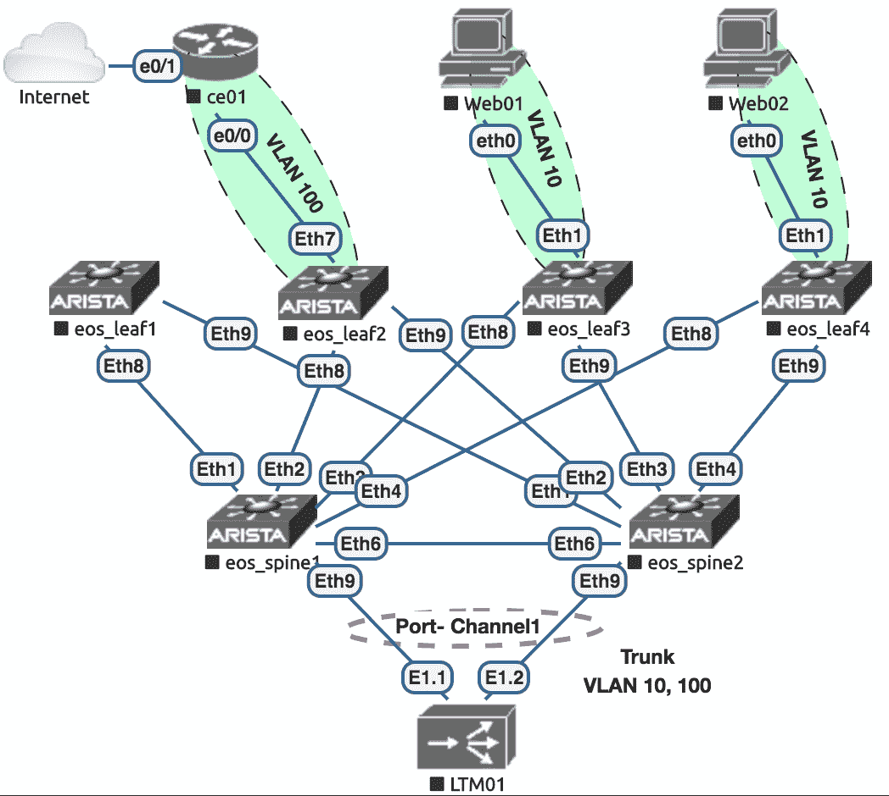

本章主要涵盖的配方如下：

+   构建 Ansible 网络清单

+   连接和认证到 BIG-IP 设备

+   在 BIG-IP 设备上配置通用系统选项

+   在 BIG-IP 设备上配置接口和干线

+   在 BIG-IP 设备上配置**虚拟局域网**（**VLANs**）和**自身互联网协议**（**self-IPs**）

+   在 BIG-IP 设备上配置静态路由

+   在 BIG-IP 设备上部署节点

+   在 BIG-IP 设备上配置负载均衡池

+   在 BIG-IP 设备上配置虚拟服务器

+   从 BIG-IP 节点检索操作数据

# 技术要求

本章中使用的所有代码都可以在以下 GitHub 存储库中找到：[`github.com/PacktPublishing/Network-Automation-Cookbook/tree/master/ch5_f5`](https://github.com/PacktPublishing/Network-Automation-Cookbook/tree/master/ch5_f5)。

本章基于以下软件版本：

+   运行 CentOS 7 的 Ansible 机器

+   Ansible 2.9

+   运行 BIG-IP 13.1.1，Build 0.0.4 final 的 F5 BIG-IP 设备

查看以下视频以查看代码的实际操作：

[`bit.ly/2RE5tOL`](https://bit.ly/2RE5tOL)

# 构建 Ansible 网络清单

在这个示例中，我们将概述如何构建和组织我们的 Ansible 清单，以描述我们的样本 F5 BIG-IP 节点。构建 Ansible 清单是告诉 Ansible 如何连接到受管设备的强制步骤。

# 做好准备

我们将创建一个新的文件夹，用于存放本章中创建的所有文件。新文件夹名为`ch5_f5`。

# 如何操作...

1.  在新文件夹`ch5_f5`中，我们创建一个`hosts`文件，其中包含以下内容：

```
$ cat hosts
[ltm]
ltm01 Ansible_host=172.20.1.34
```

1.  创建一个`Ansible.cfg`文件，如下所示：

```
$ cat Ansible.cfg
[defaults]
inventory=hosts
retry_files_enabled=False
gathering=explicit
host_key_checking=False
```

# 工作原理...

由于我们的网络拓扑中只有一个 LTM 节点，这简化了我们的 Ansible 清单文件。在我们的`hosts`文件中，我们创建一个单一组（称为`ltm`），并在其中指定一个单一节点，名为`ltm01`。我们使用`Ansible_host`参数指定节点的管理 IP 地址。

BIG-IP 设备的管理端口必须配置此 IP 地址，并且 Ansible 控制机与 BIG-IP 节点之间的 IP 连接必须通过此管理端口建立。

最后，我们创建`Ansible.cfg`文件并配置它指向我们的`hosts`文件，以用作 Ansible 清单文件。我们禁用了 setup 模块，在针对网络节点运行 Ansible 时不需要它。

# 连接和认证到 BIG-IP 设备

在这个示例中，我们将概述如何通过 BIG-IP 设备暴露的**表述状态转移**（**REST**）API 从 Ansible 连接到 BIG-IP 节点，以便从 Ansible 开始管理这些设备。我们将使用用户名和密码来对我们拓扑中的 BIG-IP 节点进行身份验证。

# 做好准备

为了按照这个示例进行操作，应该按照前面的示例构建一个 Ansible 清单文件。Ansible 控制机和网络中所有设备之间必须建立 IP 可达性。

# 如何操作...

1.  在`ch5_f5`文件夹中，创建一个`group_vars`文件夹。

1.  创建一个新的`group_vars/all.yml`文件，其中包含以下连接参数设置：

```
conn_parameters:
 user: admin
 password: admin
 server: "{{ Ansible_host }}"
 server_port: 443
 validate_certs: no
admin_passwd: NewP@sswd
users:
 - name: Ansible
 passwd: Ansible123
 role: all:admin
 state: present
```

1.  创建一个名为`pb_f5_onboard.yml`的新的 playbook，其中包含以下任务来创建新的系统用户：

```
- name: Onboarding a New LTM
 hosts: ltm01
 connection: local
 tasks:
 - name: "P1T1: Create new Users"
 bigip_user:
 username_credential: "{{ item.name }}"
 password_credential: "{{ item.passwd }}"
 partition_access: "{{ item.role }}"
 state: "{{ item.state | default('present')}}"
 provider: "{{ conn_parameters }}"
 loop: "{{ users }}"
```

1.  使用以下任务更新`pb_f5_onboard.yml` playbook 以更新管理员用户帐户：

```
 - name: "P1T1: Update admin Password"
 bigip_user:
 username_credential: admin
 password_credential: "{{ admin_passwd }}"
 state: present
 provider: "{{ conn_parameters }}"
```

# 它是如何工作的...

Ansible 使用 F5 LTM 节点上的 REST API 来管理 BIG-IP 节点。Ansible 建立一个 HTTPS 连接到 BIG-IP 节点，并将其用作调用 BIG-IP 节点上的 REST API 的传输机制。为了与 BIG-IP 系统建立 HTTPS 连接，我们需要提供一些参数，以便 Ansible 启动并与 BIG-IP 节点建立连接。这些参数包括以下内容：

+   用于认证 BIG-IP REST API 的用户名/密码

+   IP 地址和端口，通过这些我们可以访问 BIG-IP 节点上的 REST API 端点

+   我们验证通过 HTTPS 会话协商的 BIG-IP 节点的证书

我们将所有这些参数包含在一个名为`conn_parameters`的字典中，并将其包含在`group_vars/all.yml`文件中，以便应用于任何 BIG-IP 节点。

默认情况下，新的 LTM 设备使用`admin/admin`默认用户名和密码用于**图形用户界面**（**GUI**）和 REST API 访问。我们将这些凭据作为`conn_parameters`字典中的用户和密码变量，并将`Ansible_host`变量指定为可以通过端口`443`建立 REST API 的 IP 地址。最后，我们禁用证书验证，因为 BIG-IP 节点上的证书是自签名的。

我们创建一个名为`users`的新变量，其中包含我们要在 LTM 上配置的所有新用户，以及他们的角色/权限。在这种情况下，我们希望为 Ansible 用户在 LTM 节点上的所有分区提供管理权限。

我们为新的 LTM 节点创建一个新的 playbook。在第一个任务中，我们使用`bigip_user`模块创建新用户，并使用`provider`属性提供参数以建立 HTTPS 连接。我们循环遍历`users`变量中的所有用户以进行配置。

第二个任务还使用`bigip_user`模块来更新 LTM 上的默认`admin`配置，并将此默认密码更改为`admin_passwd`变量中指定的新密码。

在 playbook 级别上，我们将连接设置为`local`。这是因为我们将从 Ansible 控制机建立 HTTPS 连接，并且我们希望阻止 Ansible 使用**Secure Shell**（**SSH**）连接到 LTM 节点。

以下截图显示了在 BIG-IP 节点上创建的新的 Ansible 用户：

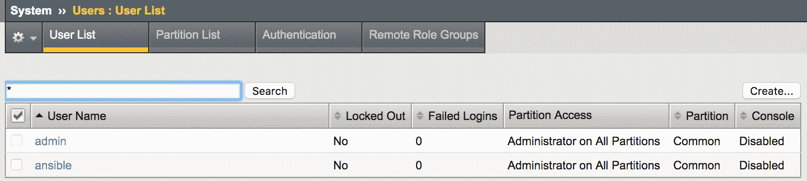

以下截图显示了使用 playbook 创建的 Ansible 用户的详细信息：

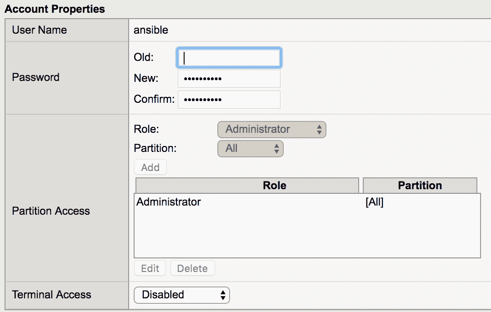

出于简单起见，我们使用明文密码；但是，永远不应该使用明文密码。应该使用 Ansible Vault 来保护密码。

# 还有更多...

在添加新的 Ansible 用户后，我们使用新创建的用户更新`conn_parameters`字典。我们可以使用这个用户开始管理 LTM 节点，如下所示：

```
$ cat group_vars/all.yml
conn_parameters:
 user: Ansible
 password: Ansible123
 server: "{{ Ansible_host }}"
 server_port: 443
 validate_certs: no
< -- Output Omitted for brevity --> 
```

# 在 BIG-IP 设备上配置通用系统选项

在这个步骤中，我们将概述如何在 BIG-IP 节点上配置一些基本的系统选项，如主机名、**域名系统**（**DNS**）和**网络时间协议**（**NTP**）。我们将了解如何使用各种可用的 Ansible 模块设置所有这些系统级参数。

# 准备工作

为了按照这个步骤进行操作，假定已经设置了 Ansible 清单。Ansible 和 BIG-IP 节点之间已经建立了 IP 连接，并且具有正确的用户凭据。

# 如何做...

1.  使用以下系统级参数更新`group_vars/all.yml`文件：

```
$ cat group_vars/all.yml
< -- Output Omitted for brevity -->
domain: lab.net
nms_servers:
 - 172.20.1.250
```

1.  创建一个名为`tasks`的新文件夹，并创建一个名为`f5_system.yml`的文件，其中包含以下内容：

```
$ cat tasks/f5_system.yml
---
- name: "Setup BIG-IP Hostname"
 bigip_hostname:
 hostname: "{{ inventory_hostname }}.{{ domain }}"
 provider: "{{ conn_parameters }}"
- name: "Setup BIG-IP DNS Servers"
 bigip_device_dns:
 ip_version: '4'
 name_servers: "{{ nms_servers }}"
 provider: "{{ conn_parameters }}"
- name: "Setup BIG-IP NTP Servers"
 bigip_device_ntp:
 ntp_servers: "{{ nms_servers }}"
 provider: "{{ conn_parameters }}"
```

1.  在`pb_f5_onboard.yml`文件中，添加以下突出显示的任务：

```
$ cat pb_f5_onboard.yml
< -- Output Omitted for brevity -->
- name: "P1T3: Configure System Parameters"
 import_tasks: "tasks/f5_system.yml"
 tags: system
```

# 它是如何工作的...

为了在 BIG-IP 节点上配置各种系统参数，我们为每个任务使用单独的模块。我们将所有这些任务分组在一个名为`f5_system.yml`的文件夹下，并在此文件夹中使用三个单独的任务/模块，如下所示：

+   `bigip_hostname`来设置主机名

+   `bigip_device_dns`来设置 BIG-IP 节点将使用的 DNS 服务器

+   `bigip_device_ntp`来设置 BIG-IP 节点上的 NTP 服务器

所有这些模块都使用`conn_parameters`字典来正确设置如何与 BIG-IP 节点的 REST API 进行通信。在我们的示例拓扑中，我们使用单个服务器作为 DNS 和 NTP。我们在`group_vars/all.yml`文件中使用`nms_servers`变量来描述它，以应用于我们 Ansible 清单中的所有节点。

为了配置主机名，我们需要为设备提供一个**完全合格的域名**（**FQDN**）。因此，我们在`group_vars/all.yml`文件中再次配置我们的域，并与设备名称一起使用以设置其主机名。

运行此 playbook 后，我们可以看到配置已应用到 BIG-IP 节点。以下截图显示主机名已正确配置：

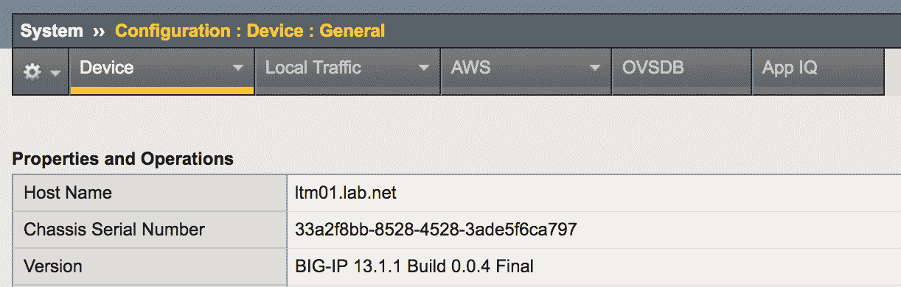

NTP 配置已正确部署，如下截图所示：

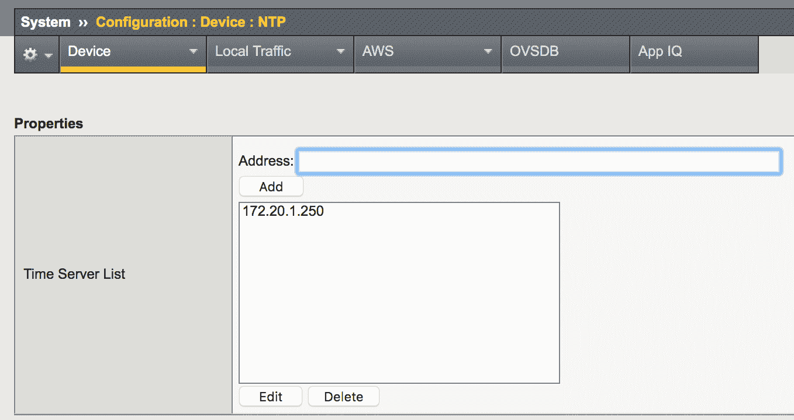

DNS 已正确配置，如下截图所示：

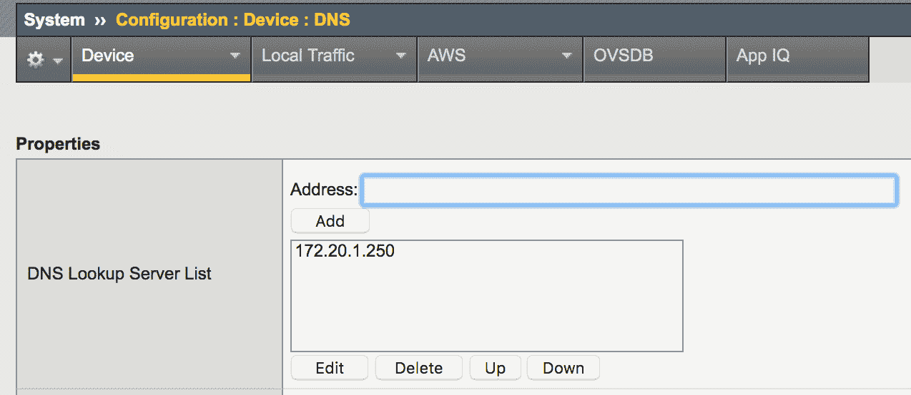

# 在 BIG-IP 设备上配置接口和干线

在这个步骤中，我们将概述如何在 BIG-IP 设备上设置干线。BIG-IP 节点上的干线端口用于通过将多个接口组合成单个逻辑接口来为设备提供增加的冗余性。这与传统网络供应商中的端口通道非常相似。

# 准备工作

为了按照这个步骤进行，假定已经设置了 Ansible 清单。Ansible 和 BIG-IP 节点之间已经建立了 IP 连接，并且具有正确的用户凭据。

# 如何做...

1.  创建一个`host_vars`文件夹，并创建一个名为`ltm01.yml`的文件，其中包含以下内容：

```
$ cat host_vars/ltm01.yml
----
phy_interfaces:
 - 1.1
 - 1.2
trunks:
 - name: po1
 members: "{{ phy_interfaces }}"
```

1.  在`tasks`文件夹下，添加一个名为`f5_interfaces.yml`的新文件，其中包含以下内容：

```
$ cat tasks/f5_interfaces.yml
---
- name: Create a Port channel on BIG-IP
 bigip_trunk:
 name: "{{ item.name}}"
 interfaces: "{{ item.members }}"
 link_selection_policy: maximum-bandwidth
 frame_distribution_hash: destination-mac
 lacp_enabled: no
 provider: "{{ conn_parameters }}"
 state: present
 loop: "{{ trunks }}"
```

1.  使用以下新任务更新`pb_f5_onboard.yml` playbook：

```
$ cat pb_f5_onboard.yml
< -- Output omitted for brevity -->
- name: "P1T4: Configure Interfaces"
 import_tasks: "tasks/f5_interfaces.yml"
 tags: intfs
```

# 它是如何工作的...

我们在`host_vars`文件夹下的一个名为`ltm01.yml`的文件中为 LTM 设备定义特定于主机的数据。在这个文件中，我们在`phy_interfaces`变量下定义了 LTM 节点上的物理接口。我们定义了另一个名为`trunks`的变量，以定义设备上可用的干线。在`trunks`变量中，我们引用`phy_interfaces`变量，以限制数据重复。

在`f5_interfaces.yml`任务文件中，我们添加了一个新任务，使用`bigip_trunk`模块在 BIG-IP 节点上配置所需的干线。我们循环遍历`trunks`数据结构，以配置所有所需的干线端口。在这个任务中，我们提供了不同的参数来调整干线属性（例如禁用**链路聚合控制协议**（**LACP**））并设置正确的方法来在干线端口之间分发帧。

运行 playbook 后，我们可以看到所需的干线接口已经配置，如下截图所示：

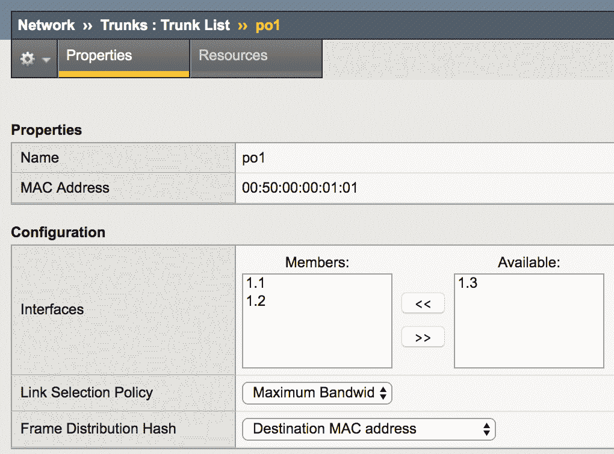

# 另请参阅...

有关`bigip_trunk` Ansible 模块的更多信息，以及如何在 BIG-IP 节点上部署干线端口的不同选项，请参阅以下网址：[`docs.Ansible.com/Ansible/latest/modules/bigip_trunk_module.html`](https://docs.ansible.com/ansible/latest/modules/bigip_trunk_module.html)。

# 在 BIG-IP 设备上配置 VLAN 和自 IP

在本教程中，我们将概述如何在 BIG-IP 节点上配置 VLAN。 BIG-IP 节点上的 VLAN 对于通过 BIG-IP LTM 节点托管的不同应用程序的流量分离至关重要。它们对于指定外部（面向互联网）和内部（面向服务器）域至关重要。我们还将概述如何在我们配置的 VLAN 接口上分配 IP 地址。

# 准备就绪

为了按照本教程进行操作，假定已经设置了 Ansible 清单。 Ansible 与 BIG-IP 节点之间已经建立了 IP 连接，并且具有正确的用户凭据。由于此设置中的所有 VLAN 都将部署在干线端口上，因此我们需要根据先前的教程已经配置好干线端口。

# 操作步骤...

1.  在`host_vars`文件夹下的`host_vars/ltm01.yml`文件中使用以下 VLAN 数据进行更新：

```
$ cat host_vars/ltm01.yml
< -- Output Omitted for brevity -->
vlans:
 - vlan: 100
 description: Extrnal VLAN (Internet)
 ip: 10.1.100.254/24
 tagged_intf: po1
 - vlan: 10
 description: Server VLAN10 (Internal)
 ip: 10.1.10.254/24
 tagged_intf: po1
```

1.  在`tasks`文件夹下的`f5_interfaces.yml`文件中更新任务，以配置 VLAN，如下所示：

```
$ cat tasks/f5_interfaces.yml
< -- Output Omitted for brevity -->
- name: Create VLANs on BIG-IP
 bigip_vlan:
 tagged_interfaces: "{{ item.tagged_intf }}"
 name: "VL{{item.vlan}}"
 description: "{{ item.description }}"
 tag: "{{item.vlan}}"
 provider: "{{ conn_parameters }}"
 state: present
 loop: "{{ vlans }}"
```

1.  在`tasks`文件夹下的`f5_interfaces.yml`文件中更新任务，以在相应的 VLAN 上配置 IP 地址，如下所示：

```
$ cat tasks/f5_interfaces.yml
< -- Output Omitted for brevity -->
- name: Provision IP addresses on BIG-IP
 bigip_selfip:
 address: "{{ item.ip | ipv4('address') }}"
 name: "VL{{ item.vlan }}_IP"
 netmask: "{{ item.ip | ipv4('netmask') }}"
 vlan: "VL{{ item.vlan }}"
 provider: "{{ conn_parameters }}"
 state: present
 loop: "{{ vlans }}"
```

# 工作原理...

我们在`host_vars/ltm01.yml`中添加`vlans`数据结构，以声明我们需要在 LTM 节点上配置的所有 VLAN，以及与该 VLAN 相关联的 IP 地址。

我们使用`bigip_vlan`模块更新`f5_interfaces.yml`文件，以在 BIG-IP 节点上配置 VLAN，并循环遍历`vlans`数据结构以提取设置所需 VLAN 的所有必要参数。接下来，我们使用`bigip_selfip` Ansible 模块添加另一个任务，以在 VLAN 上部署 IP 地址。

再次运行 playbook 后，我们可以看到 BIG-IP 节点上的 VLAN 和自身 IP，如下截图所示：

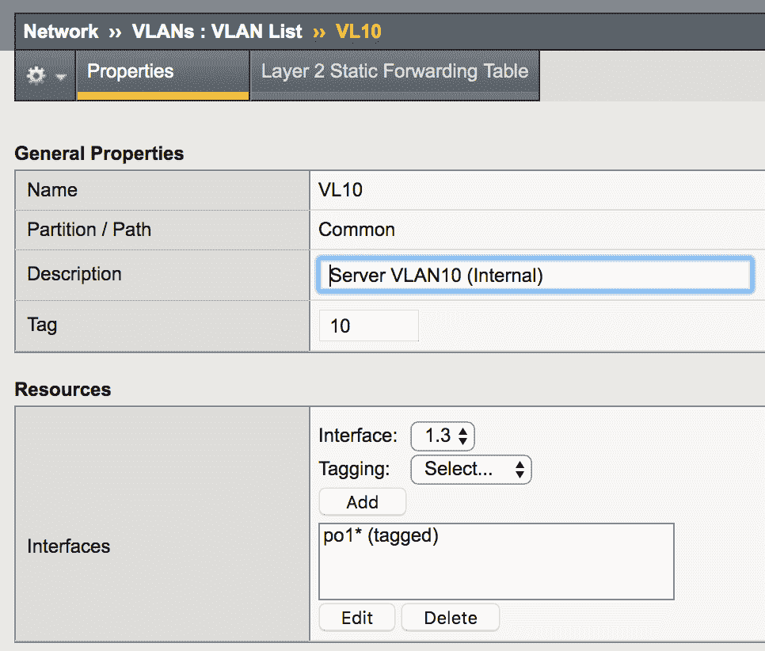

正确的 IP 地址已根据以下截图正确配置在 VLAN 接口上：

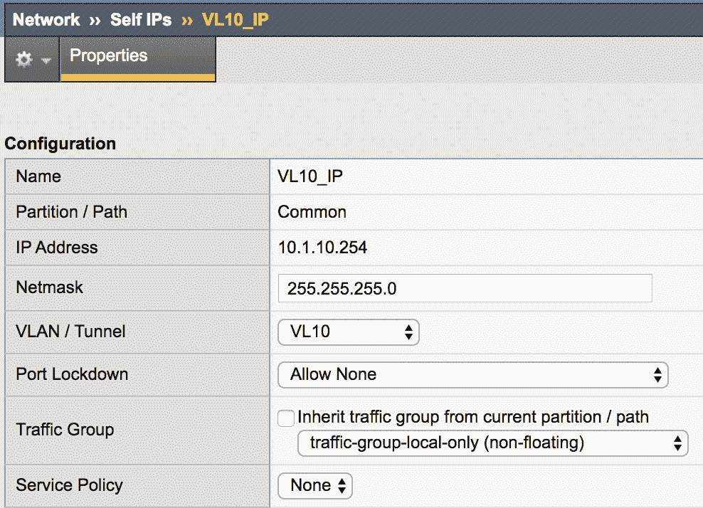

# 另请参阅...

有关如何在 BIG-IP 节点上部署 VLAN 和自身 IP 的更多选项，请参考以下网址：

`bigip-vlan`

[`docs.ansible.com/ansible/latest/modules/bigip_vlan_module.html`](https://docs.ansible.com/ansible/latest/modules/bigip_vlan_module.html)

`bigip-selfip`

[`docs.Ansible.com/Ansible/latest/modules/bigip_selfip_module.html#bigip-selfip-module`](https://docs.ansible.com/ansible/latest/modules/bigip_selfip_module.html#bigip-selfip-module)

# 在 BIG-IP 设备上配置静态路由

在在 BIG-IP 设备上部署 VLAN 和 IP 地址后，我们需要配置 BIG-IP 节点上的路由，以便到达外部目的地。我们在我们的拓扑中使用静态路由，以在 LTM 节点上配置所需的路由。在本教程中，我们将概述如何在 BIG-IP 设备上配置静态路由。

# 准备就绪

为了按照本教程进行操作，假定已经设置了 Ansible 清单，并且 Ansible 与 BIG-IP 节点之间已经建立了 IP 连接，并且具有正确的用户凭据。此外，我们需要根据先前的教程在 BIG-IP 节点上部署 VLAN 和 IP 地址。

# 操作步骤...

1.  使用以下路由数据更新`host_vars/ltm01.yml`文件：

```
$ cat host_vars/ltm01.yml
< -- Output Omitted for brevity -->
routes:
 - dst: 0.0.0.0/0
 gw: 10.1.100.1
 name: default_route
```

1.  使用以下任务更新`pb_f5_onboard.yml`文件：

```
$ cat pb_f5_onboard.yml
< -- Output Omitted for brevity -->
- name: "P1T5: Setup External Routing"
 bigip_static_route:
 destination: "{{ item.dst.split('/')[0] }}"
 netmask: "{{item.dst | ipv4('prefix')}}"
 gateway_address: "{{ item.gw }}"
 name: "{{ item.name }}"
 provider: "{{ conn_parameters }}"
 loop: "{{ routes }}"
 tags: routing
```

# 工作原理...

我们在`host_vars/ltm01.yml`文件下添加`routes`数据结构，以声明需要在 LTM 节点上配置的所有静态路由。

我们使用`bigip_static_route`模块更新`pb_f5_onboard.yml` playbook，以配置静态路由，并循环遍历`routes`数据结构，以在设备上配置所有所需的路由。

再次运行 playbook 后，我们可以看到正确的静态路由，如下截图所示：

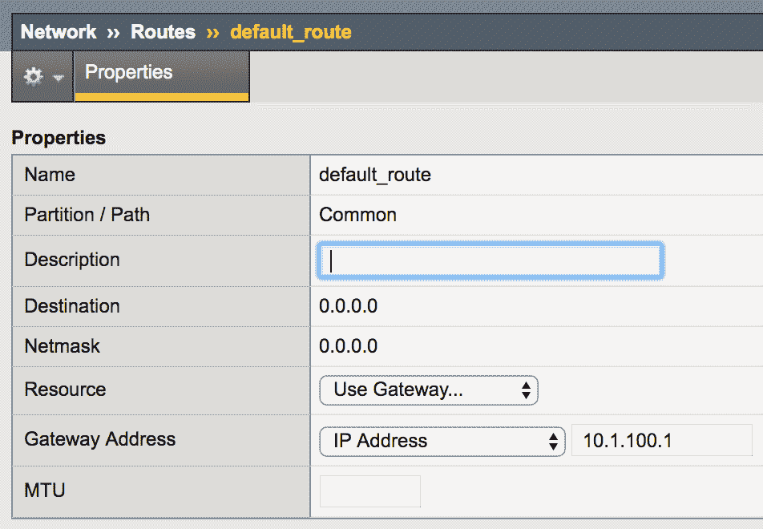

# 在 BIG-IP 设备上部署节点

使用 BIG-IP LTM 部署应用程序需要跨多个服务器对应用程序流量进行负载均衡。这要求我们定义托管应用程序的服务器/实例。在 BIG-IP 中，这些实例称为节点，并且它们使用唯一的 IP 地址标识每个服务器。在这个教程中，我们将开始在 BIG-IP 设备上部署一个新的应用程序（Web 服务器），并使用 Ansible 来配置承载此服务的节点。

# 准备工作

BIG-IP 的基本设置应该已经按照之前的教程完成，必须部署正确的 VLAN 以到达这些节点（物理服务器）。

# 如何操作...

1.  创建一个名为`web_app.yml`的新的 YAML 文件，内容如下：

```
---
vip: 10.1.100.100
vip_port: 443
endpoint: dev.internet.net
pool_name: dev_web_app
pool_members:
 - ip: 10.1.10.10
 name: "dev01.internal.net"
 port: 443
 - ip: 10.1.10.11
 name: "dev01\. internal.net"
 port: 443
```

1.  创建一个名为`pb_f5_deploy_app.yml`的新的 Ansible playbook，内容如下：

```
---
- name: Deploying a New App on BIG-IP
 hosts: ltm01
 connection: local
 vars_file: web_app.yml
 tasks:
 - name: "Create Nodes on BIG-IP"
 bigip_node:
 address: "{{ item.ip }}"
 name: "{{ item.name }}"
 provider: "{{ conn_parameters }}"
 state: present
 loop: "{{ pool_members }}"
```

# 工作原理...

我们在名为`web_app.yaml`的 YAML 文件中定义了新的 Web 应用程序的所有参数，该应用程序应该托管在 BIG-IP LTM 设备上。在这个文件中，我们包括了一个`pool_members`参数，用来概述将承载应用程序的 Web 服务器。我们使用这个参数在 BIG-IP LTM 上创建节点。

我们为应用程序部署创建一个新的 playbook，名为`pb_f5_deploy_app.yml`。我们包括`web_app.yml`文件，以便访问为此应用程序定义的所有参数。我们使用`bigip_node`模块创建一个新的节点，并循环遍历从`web_app.yml`文件中派生的`pool_members`参数，以在 BIG-IP 设备上创建所有必需的节点。为了连接到 BIG-IP 节点，我们使用与之前相同的提供者属性，并使用`group_vars/all.yml`文件中定义的`conn_parameters`参数来建立与 BIG-IP 的连接。

运行这个 playbook，我们创建了所有必需的节点，如下截图所示：

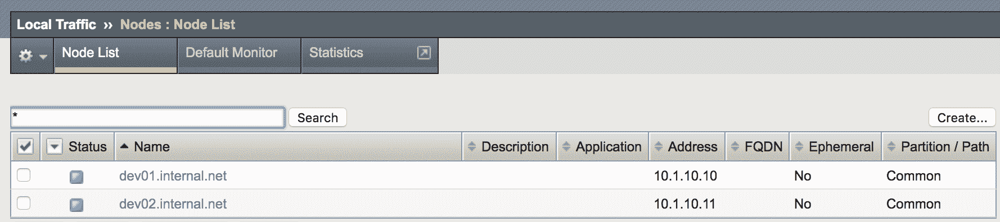

# 在 BIG-IP 设备上配置负载均衡池

在 BIG-IP 上创建节点后，我们需要为我们部署的应用程序创建一个负载均衡池，并将我们创建的节点中的池成员分配到这个池中。在这个教程中，我们将概述如何在 BIG-IP 节点上配置负载均衡池，以及如何将成员分配到负载均衡池中。

# 准备工作

这个教程假设之前的所有教程都已经实施，并且 BIG-IP 上的节点已经按照之前的教程进行了配置。

# 如何操作...

1.  更新`pb_f5_deploy_app.yml` playbook，添加以下任务以创建一个新的池：

```
- name: Create New LB Pool
 bigip_pool:
 name: "POOL_{{ website }}_{{ vip_port }}"
 lb_method: round-robin
 state: present
 provider: "{{ conn_parameters }}"
```

1.  更新`pb_f5_deploy_app.yml` playbook，添加以下任务以将池成员分配给新创建的池：

```
- name: Add Members to the Pool
 bigip_pool_member:
 pool: "POOL_{{ website }}_{{ vip_port }}"
 host: "{{ item.ip }}"
 name: "{{ item.name }}"
 port: "{{ item.port }}"
 description: "Web Server for {{ website }}"
 provider: "{{ conn_parameters }}"
 loop: "{{ pool_members }}"
```

# 工作原理...

在这个教程中，我们使用`bigip_pool`模块在 BIG-IP 系统上创建一个负载均衡池，并指定应该在此池上使用的负载均衡技术。在这个例子中，我们使用`round-robin`技术。我们使用从`web_app.yml`文件中提取的不同参数（主要是网站和`vip_port`）来创建池名称。

接下来，我们使用`bigip_pool_member`模块将池成员分配给这个新创建的池，并循环遍历`web_app.yml`文件中定义的所有`pool_members`。

我们可以看到，所有这些过程都创建了一种一致的方法来定义池名称，并将所需的池成员分配给正确的池成员。所有信息都是从一个单一的定义文件中检索出来，该文件描述并概述了服务的部署方式。

运行这两个任务，我们将看到池已经正确创建，并且具有正确的池成员，如下截图所示：

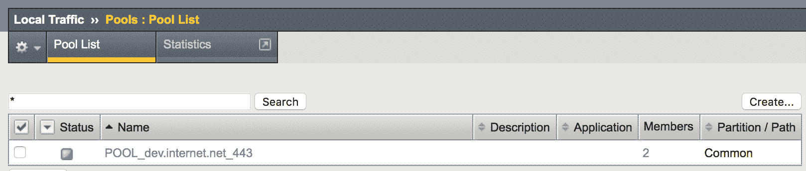

以下截图显示了当前的成员：

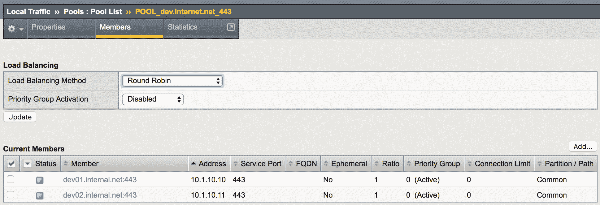

# 另请参阅...

在这个食谱中，我们概述了使用 Ansible 模块在 BIG-IP 节点上提供负载均衡池的基本用法。然而，这些模块还有更多的选项，例如为每个成员指定负载均衡比率，以及为整个池附加监视器。请参考以下链接以获取更多选项：

+   `bigip_pool`: [`docs.Ansible.com/Ansible/latest/modules/bigip_pool_module.htmlb`](https://docs.ansible.com/ansible/latest/modules/bigip_pool_module.html)

+   `bigip_pool_member`: [`docs.Ansible.com/Ansible/latest/modules/bigip_pool_member_module.html`](https://docs.ansible.com/ansible/latest/modules/bigip_pool_member_module.html#bigip-pool-member-module)

# 在 BIG-IP 设备上配置虚拟服务器

在 BIG-IP LTM 上部署应用程序的最后一部分是在 BIG-IP LTM 节点上配置虚拟服务器，并为该虚拟服务器在 BIG-IP 节点上创建**虚拟 IP**（VIP）。在这个食谱中，我们概述了如何使用 Ansible 部署虚拟服务器。

# 准备工作

这个食谱假设所有先前的食谱都已完成，并且负载均衡池和池成员已经配置好。

# 如何操作...

1.  使用以下任务更新`pb_f5_deploy_app.yml` playbook：

```
- name: Create Virtual Server
 bigip_virtual_server:
 name: "{{ website }}_{{ vip_port }}_VS"
 destination: "{{ vip }}"
 port: "{{ vip_port}}"
 pool: "POOL_{{ website }}_{{ vip_port }}"
 description: "VIP for {{ website }}"
 profiles:
 - http
 - name: clientssl
 context: client-side
 - name: serverssl
 context: server-side
 state: present
 provider: "{{ conn_parameters }}"
```

# 工作原理...

我们使用`bigip_virtual_server`模块在 BIG-IP 设备上提供所需的虚拟服务器，通过指定`web_app.yml`文件中定义的参数。我们还定义并提供需要应用于新创建的虚拟服务器的配置文件。这些配置文件是 HTTP 和 SSL 配置文件。这些配置文件已经默认在 BIG-IP 节点上创建，在需要创建自定义配置文件的情况下，我们需要使用适当的 Ansible 模块在单独的任务中创建这些配置文件。

运行最后一个任务，我们可以看到虚拟服务器已创建，如下面的截图所示：

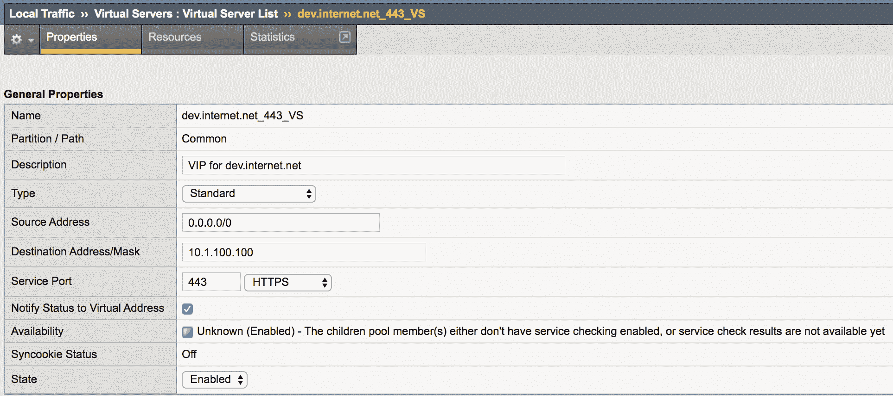

在最后一个任务中，我们在 LTM 节点上创建了一个功能性的服务 VIP，以便开始处理我们新网站的 HTTP 请求，并将流量在负载均衡组中的所有实例之间进行负载均衡。

# 另请参阅...

在这个食谱中，我们讨论了使用 Ansible 模块在 BIG-IP 节点上提供虚拟服务器的基本用法。然而，还有更多的选项可用于调整需要部署的虚拟服务器的配置。

还有更多的 Ansible 模块可以让您创建可以附加到虚拟服务器的配置文件，以下是一些这些模块的链接：

+   `bigip_virtual_server`: [`docs.Ansible.com/Ansible/latest/modules/bigip_virtual_server_module.html`](https://docs.ansible.com/ansible/latest/modules/bigip_virtual_server_module.html#bigip-virtual-server-module)

+   `bigip_profile_http`: [`docs.Ansible.com/Ansible/latest/modules/bigip_profile_http_module.html`](https://docs.ansible.com/ansible/latest/modules/bigip_profile_http_module.html#bigip-profile-http-module)

+   `bigip_profile_client_ssl`: [`docs.Ansible.com/Ansible/latest/modules/bigip_profile_client_ssl_module.html`](https://docs.ansible.com/ansible/latest/modules/bigip_profile_client_ssl_module.html#bigip-profile-client-ssl-module)

+   `bigip_profile_server_ssl`: [`docs.Ansible.com/Ansible/latest/modules/bigip_profile_server_ssl_module.html`](https://docs.ansible.com/ansible/latest/modules/bigip_profile_server_ssl_module.html#bigip-profile-server-ssl-module)

# 从 BIG-IP 节点检索操作数据

在这个食谱中，我们概述了如何检索 BIG-IP 设备上不同组件的操作数据，例如 BIG-IP 节点的网络状态，如接口和 VLAN，以及与应用程序交付相关的组件的数据，如虚拟服务器和池。

# 准备工作

为了按照这个步骤进行操作，假设已经设置了 Ansible 清单，并且 Ansible 与 BIG-IP 节点之间已经建立了 IP 连接，并且具有正确的用户凭据。

# 如何做...

1.  创建一个新的 Ansible playbook，`pb_f5_validate.yml`，内容如下：

```
---
- name: Validating BIG-IP Health
 hosts: ltm01
 connection: local
 tasks:
 - name: Collect Device Facts from BIG-IP
 bigip_device_facts:
 gather_subset:
 - interfaces
 provider: "{{ conn_parameters }}"
 register: bigip_facts
```

1.  使用以下内容更新 playbook，以过滤接口事实的新任务：

```
 - name: Set Device Links
 set_fact:
 net_intfs: "{{ net_intfs | default([]) +
 bigip_facts.interfaces | selectattr('name','equalto',item|string) | list }}"
 loop: "{{ phy_interfaces }}"
```

1.  使用以下内容更新`pb_f5_validate.yml` playbook，以验证接口状态的新任务：

```
 - name: Validate All Interface are operational
 assert:
 that:
 - item.enabled == 'yes'
 fail_msg: " Interface {{ item.name }} is Down"
 loop: "{{net_intfs}}"
```

# 它是如何工作的...

在 BIG-IP 节点上支持的 REST API 使用不同的方法从设备中检索操作数据，并以 JSON 格式输出所有这些数据。以下代码段概述了使用`bigip_device_facts`模块从 BIG-IP 节点收集的接口状态：

```
"bigip_facts": {
< -- Output Omitted for brevity -->
 "interfaces": [
 {
 "active_media_type": "10000T-FD",
 "bundle": "not-supported",
 "bundle_speed": "not-supported",
 "enabled": "yes",
 "flow_control": "tx-rx",
 "full_path": "1.1",
 "if_index": 48,
 "lldp_admin": "txonly",
 "mac_address": "00:50:00:00:01:01",
 "media_sfp": "auto",
 "mtu": 1500,
 "name": "1.1",
 < -- Output Omitted for brevity -->
 }
```

我们使用`bigip_device_facts`从 BIG-IP 节点检索操作事实，并且仅使用`gather_subset`限制从节点检索的数据。我们只包括`interfaces`选项来获取接口数据。我们将所有检索到的输出保存到`bigip_facts`变量中。

我们为设备创建了一个名为`net_intfs`的新事实。这个新事实的唯一用途是过滤从上一个任务中检索到的接口事实，以匹配我们在`phy_interfaces`参数（在`host_vars`文件夹下定义）中为我们的设备定义的接口。这个新参数将只包括我们在设计中声明的接口的接口事实。

我们使用`assert`模块来验证我们为应用程序定义的所有接口是否从检索到的数据中启用和运行，并且我们循环遍历`net_intfs`变量（它是一个列表）来确认它们都已启用。

# 还有更多...

如果我们需要获取部署在 LTM 节点上的应用程序的操作数据，我们创建一个新的 playbook 来验证应用程序部署，如下所示，使用`bigip_device_facts`模块。我们将检索到的数据限制为只有虚拟服务器。我们使用`assert`语句来验证数据，就像我们在之前的 playbook 中所做的那样。以下代码显示了用于应用程序部署验证的 playbook 内容。

1.  我们创建一个新的 playbook，`pb_f5_app_validate.yml`，其中包含收集`virtual-servers`事实的以下任务：

```
---
- name: Validating BIG-IP App Health
 hosts: ltm01
 connection: local
 vars_files: web_app.yml
 tasks:
 - name: Collect Virtual-Servers Facts from BIG-IP
 bigip_device_facts:
 gather_subset:
 - virtual-servers
 provider: "{{ conn_parameters }}"
 register: bigip_app_facts
```

1.  我们使用以下任务更新 playbook，以过滤`virtual-servers`事实：

```
    - name: Create Virtual Server Name Fact
 set_fact:
 vs_name: "{{ website }}_{{ vip_port }}_VS" - name: Create App Virtual Servers
 set_fact:
 app_vs: "{{ app_vs | default([]) +
 bigip_app_facts.virtual_servers | selectattr('name','equalto',vs_name) | list }}"
```

1.  我们使用以下任务更新 playbook 来验证我们应用程序的虚拟服务器的状态：

```
    - name: Validate Virtual Address Status
 assert:
 that:
 - item.enabled == 'yes'
 - item.destination_address == vip
 - item.destination_port == vip_port
 fail_msg: " {{ item.name }} is No Setup Correctly"
 loop: "{{app_vs}}"
```

这些验证 playbook 可以扩展到验证虚拟服务器上的多个参数。此外，我们还可以验证其他组件，如 LTM 负载均衡池，以构建更全面的应用程序部署验证。

# 另请参阅...

有关 Ansible `bigip_device_facts`模块以及我们可以从 BIG-IP 节点检索的所有信息的更多信息，请访问以下网站：[`docs.Ansible.com/Ansible/latest/modules/bigip_device_facts_module.html`](https://docs.ansible.com/ansible/latest/modules/bigip_device_facts_module.html#bigip-device-facts-module)。
