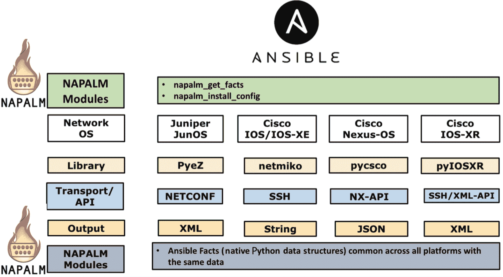
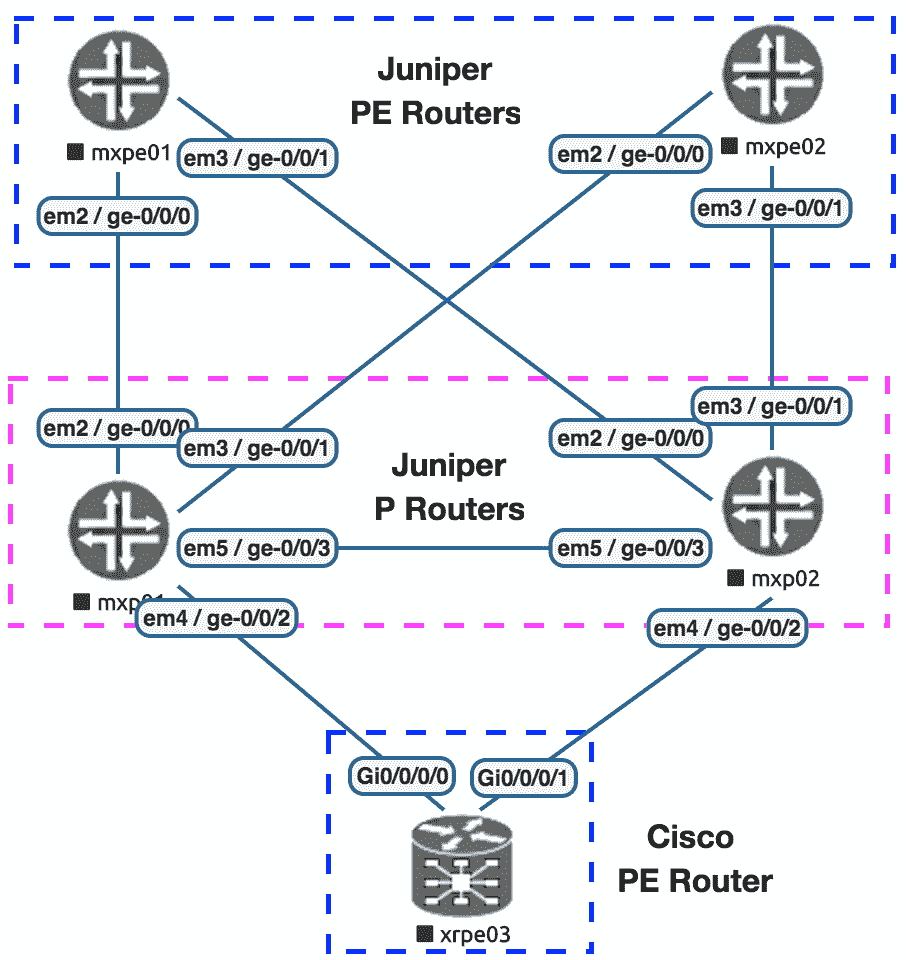

# 使用 NAPALM 和 Ansible 管理多供应商网络

**Network Automation and Programmability Abstraction Layer with Multivendor support** (**NAPALM**)，顾名思义，是一个旨在与不同供应商设备交互的多供应商 Python 库，并且它提供了一种一致的方法来与所有这些设备进行交互，无论使用的是哪种供应商设备。

在之前的章节中，我们已经看到如何使用 Ansible 与不同的网络设备进行交互。然而，对于每个供应商操作系统，我们都必须使用不同的 Ansible 模块来支持特定的操作系统。此外，我们看到从每个供应商操作系统返回的数据完全不同。虽然编写多供应商设备的 playbook 仍然是可能的，但它需要使用多个不同的模块，并且我们需要处理这些设备返回的不同数据结构。这是 NAPALM 试图解决的主要问题。NAPALM 试图提供一个抽象和一致的 API 来与多个供应商操作系统进行交互，而 NAPALM 从这些不同的供应商操作系统返回的数据是规范化和一致的。

NAPALM 根据此节点支持的最常见 API 与每个设备进行交互，并且这个 API 被社区广泛采用。以下图表概述了 NAPALM 如何与最常见的网络设备进行交互，以及 NAPALM 用于与这些设备上的 API 进行交互的库：



由于 NAPALM 试图提供一种与网络设备交互的一致方法，它支持特定一组供应商设备。NAPALM 还支持在这些设备上执行的最常见任务，例如设备配置，检索接口的操作状态，**Border Gate Protocol** (**BGP**)和**Link Layer Discovery Protocol** (**LLDP**)等。有关支持的设备以及与这些设备交互时支持的方法的更多信息，请查看以下链接：[`napalm.readthedocs.io/en/latest/support/index.html`](https://napalm.readthedocs.io/en/latest/support/index.html)。

在本章中，我们将概述如何使用 NAPALM 和 Ansible 自动化多供应商网络。我们将概述如何管理这些不同供应商操作系统的配置，以及如何从这些设备中检索操作状态。我们将以基本服务提供商网络的以下示例网络图为基础进行说明：



以下表格概述了我们示例拓扑中的设备及其各自的管理**Internet Protocols** (**IPs**)：

| **设备** | **角色** | **供应商** | **管理（MGMT）端口** | **MGMT IP** |
| --- | --- | --- | --- | --- |
| `mxp01` | P 路由器 | Juniper vMX 14.1 | `fxp0` | `172.20.1.2` |
| `mxp02` | P 路由器 | Juniper vMX 14.1 | `fxp0` | `172.20.1.3` |
| `mxpe01` | PE 路由器 | Juniper vMX 14.1 | `fxp0` | `172.20.1.4` |
| `mxpe01` | PE 路由器 | Juniper vMX 17.1 | `fxp0` | `172.20.1.5` |
| `xrpe03` | PE 路由器 | Cisco XRv 6.1.2 | `Mgmt0/0/CPU0/0` | `172.20.1.6` |

本章涵盖的主要内容如下：

+   安装 NAPALM 并与 Ansible 集成

+   构建 Ansible 网络清单

+   使用 Ansible 连接和认证网络设备

+   构建设备配置

+   使用 NAPALM 在网络设备上部署配置

+   使用 NAPALM 收集设备信息

+   使用 NAPALM 验证网络可达性

+   使用 NAPALM 验证和审计网络

# 技术要求

本章的代码文件可以在此处找到：[`github.com/PacktPublishing/Network-Automation-Cookbook/tree/master/ch6_napalm`](https://github.com/PacktPublishing/Network-Automation-Cookbook/tree/master/ch6_napalm)。

本章中将需要以下软件：

+   运行 CentOS 7 的 Ansible 机器

+   Ansible 2.9

+   Juniper **Virtual MX** (**vMX**) 路由器运行 Junos OS 14.1R8 和 Junos OS 17.1R1 版本

+   运行 IOS XR 6.1.2 的 Cisco XRv 路由器

查看以下视频以查看代码的实际操作：

[`bit.ly/2Veox8j`](https://bit.ly/2Veox8j)

# 安装 NAPALM 并与 Ansible 集成

在这个示例中，我们概述了如何安装 NAPALM 并将其集成到与 Ansible 一起工作。这个任务是强制性的，因为 NAPALM Ansible 模块不是默认随 Ansible 一起提供的核心模块的一部分。因此，为了开始使用这些模块，我们需要安装 NAPALM 及其所有 Ansible 模块。然后，我们需要告诉 Ansible 在哪里找到它，并开始使用 NAPALM 团队为 Ansible 开发的特定模块。

# 准备工作

Ansible 和 Python 3 需要安装在机器上，还需要安装`python3-pip`包，我们将用它来安装 NAPALM。

# 如何做…

1.  安装`napalm-ansible` Python 包，如下面的代码片段所示：

```
$ pip3 install napalm-ansible
```

1.  运行`napalm-ansible`命令，如下面的代码块所示：

```
$ napalm-ansible
```

1.  为了确保 Ansible 可以使用 NAPALM 模块，您必须将以下配置添加到您的 Ansible 配置文件（`ansible.cfg`）中：

```
[defaults]
 library = /usr/local/lib/python3.6/site-packages/napalm_ansible/modules
 action_plugins = /usr/local/lib/python3.6/site-packages/napalm_ansible/plugins/action
```

有关 Ansible 配置文件的更多详细信息，请访问[`docs.ansible.com/ansible/latest/intro_configuration.html`](https://docs.ansible.com/ansible/latest/intro_configuration.html)。

1.  创建一个名为`ch6_napalm`的新文件夹，并创建`ansible.cfg`文件，更新如下代码块所示：

```
$ cat ansible.cfg
[defaults]
inventory=hosts
retry_files_enabled=False
gathering=explicit
host_key_checking=False
library = /usr/local/lib/python3.6/site-packages/napalm_ansible/modules
action_plugins = /usr/local/lib/python3.6/site-packages/napalm_ansible/plugins/action
```

# 它是如何工作的…

由于 NAPALM 包和相应的 NAPALM Ansible 模块不是默认随 Ansible 一起提供和安装的核心模块的一部分，我们需要在系统上安装它，以便开始使用 NAPALM Ansible 模块。NAPALM 团队已经发布了一个特定的 Python 包来安装 NAPALM 以及所有 Ansible 模块和所有依赖项，以便从 Ansible 内部开始使用 NAPALM。这个包是`napalm-ansible`。由于我们使用 Python 3，我们将使用`pip3`程序来安装这个包。

为了告诉 Ansible 模块安装在哪里，我们需要将这些模块的路径输入到 Ansible 中。NAPALM 团队还提供了如何找到 NAPALM 模块安装路径以及如何通过`napalm-ansible`程序将其集成到 Ansible 的简单说明。我们执行`napalm-ansible`命令，它输出了我们需要包含在`ansible.cfg`文件中的所需配置，以便 Ansible 可以找到我们将要使用的 NAPALM 模块。

我们使用从`napalm-ansible`命令获得的输出更新`ansible.cfg`文件。然后，我们更新库和动作插件选项，告诉 Ansible 在搜索模块或动作插件时将这些文件夹包括在其路径中。在`ansible.cfg`文件中，我们包括了我们在前几章中使用的正常配置。

# 构建 Ansible 网络清单

在这个示例中，我们将概述如何构建和组织我们的 Ansible 清单，以描述本章中概述的样本服务提供商网络设置。构建 Ansible 清单是一个强制性步骤，为了告诉 Ansible 如何连接到受管设备。在 NAPALM 的情况下，我们需要将网络中的不同节点分类到 NAPALM 支持的正确供应商类型中。

# 如何做…

1.  在新文件夹（`ch6_napalm`）中，我们创建一个包含以下内容的`hosts`文件：

```
$ cat hosts
[pe]
 mxpe01 ansible_host=172.20.1.3
 mxpe02 ansible_host=172.20.1.4
 xrpe03 ansible_host=172.20.1.5

[p]
 mxp01 ansible_host=172.20.1.2
 mxp02 ansible_host=172.20.1.6

[junos]
 mxpe01
 mxpe02
 mxp01
 mxp02

[iosxr]
 xrpe03
 [sp_core:children]
 pe
 p
```

# 它是如何工作的…

我们使用`hosts`文件构建了 Ansible 清单，并定义了多个组，以便对基础设施进行分段，如下所示：

+   我们创建了`PE`组，它引用了我们拓扑中的所有**多协议标签交换**（**MPLS**）**提供者边缘**（**PE**）节点。

+   我们创建了`P`组，它引用了我们拓扑中的所有 MPLS **提供者**（**P**）节点。

+   我们创建了`junos`组，以引用我们拓扑中的所有 Juniper 设备。

+   我们创建了`iosxr`组来引用所有运行 IOS-XR 的节点。

在使用 NAPALM 时，根据供应商或操作系统对组进行分割和定义是一种最佳实践，因为我们使用这些组来指定 NAPALM 识别远程管理节点的供应商所需的参数，并建立与该远程节点的网络连接的方式。在下一个教程中，我们将概述我们将如何使用这些组（`junos`和`iosxr`），以及我们将包括哪些参数以便 NAPALM 能够与远程管理节点建立连接。

# 使用 Ansible 连接和认证网络设备

在这个教程中，我们将概述如何使用 Ansible 连接到 Juniper 和 IOS-XR 节点，以便开始与设备进行交互。

# 准备工作

为了按照这个教程进行操作，应该按照之前的教程构建一个 Ansible 清单文件。此外，必须配置 Ansible 控制机与网络中所有设备之间的 IP 可达性。

# 如何做…

1.  在 Juniper 设备上，配置用户名和密码，如下所示：

```
system {
 login {
 user ansible {
 class super-user;
 authentication {
 encrypted-password "$1$mR940Z9C$ipX9sLKTRDeljQXvWFfJm1"; ## ansible123
 }
 }
 }
}
```

1.  在 Cisco IOS-XR 设备上，配置用户名和密码，如下所示：

```
!
 username ansible
 group root-system
 password 7 14161C180506262E757A60 # ansible123
!
```

1.  在 Juniper 设备上启用**网络配置协议**（**NETCONF**），如下所示：

```
system {
 services {
 netconf {
 ssh {
 port 830;
 }
 }
 }
}
```

1.  在 IOS-XR 设备上，我们需要启用**安全外壳**（**SSH**），以及启用`xml-agent`，如下所示：

```
!
xml agent tty
iteration off
!
xml agent
!
ssh server v2
ssh server vrf default
```

1.  在 Ansible 机器上，在`ch6_napalm`文件夹中创建`group_vars`目录，并创建`junos.yml`和`iosxr.yml`文件，如下所示：

```
$ cat group_vars/iosxr.yml
---
 ansible_network_os: junos
 ansible_connection: netconf

 $ cat group_vars/junos.yml
---
 ansible_network_os: iosxr
 ansible_connection: network_cli
```

1.  在`group_vars`文件夹下，创建带有以下登录详细信息的`all.yml`文件：

```
$ cat group_vars/all.yml
ansible_user: ansible
 ansible_ssh_pass: ansible123
```

# 工作原理…

NAPALM 为 NAPALM 支持的每个供应商设备使用特定的传输 API。它使用这个 API 来连接设备，所以在我们的示例拓扑中，我们需要在 Juniper 设备上启用 NETCONF。对于 Cisco IOS-XR 设备，我们需要启用 SSH，并在 IOS-XR 设备上启用 XML agent。

在远程节点上配置用于在 Ansible 控制机上进行身份验证的用户名/密码。我们在设备上执行所有这些步骤，以使它们准备好与 NAPALM 进行通信。

在生产中使用 IOS-XR 设备上的传统`xml agent`不被推荐，并且需要根据 Cisco 文档进行评估。有关更多详细信息，请参阅[`www.cisco.com/c/en/us/td/docs/routers/asr9000/software/asr9k_r5-3/sysman/command/reference/b-sysman-cr53xasr/b-sysman-cr53xasr_chapter_01010.html`](https://www.cisco.com/c/en/us/td/docs/routers/asr9000/software/asr9k_r5-3/sysman/command/reference/b-sysman-cr53xasr/b-sysman-cr53xasr_chapter_01010.html)。

在 Ansible 机器上，我们根据每个供应商设置`ansible_connection`参数（`juniper`使用`netconf`，`iosxr`使用`network_cli`），并指定`ansible_network_os`参数来指定供应商操作系统。所有这些参数都在`junos.yml`和`iosxr.yml`的`group_vars`层次结构下定义，对应于我们在清单中定义的用于根据供应商操作系统对设备进行分组的组。最后，我们在`all.yml`文件中通过`ansible_user`和`ansible_ssh_pass`指定用户名和密码，因为我们使用相同的用户来对 Juniper 和 Cisco 设备进行身份验证。

为了测试和验证，我们可以使用 Ansible 的`ping`模块从 Ansible 控制机与设备进行通信，如下所示：

```
$ ansible all -m ping
mxpe01 | SUCCESS => {
  "changed": false,
  "ping": "pong"
}
mxpe02 | SUCCESS => {
  "changed": false,
  "ping": "pong"
}
mxp02 | SUCCESS => {
  "changed": false,
  "ping": "pong"
}
mxp01 | SUCCESS => {
  "changed": false,
  "ping": "pong"
}
xrpe03 | SUCCESS => {
  "changed": false,
  "ping": "pong"
} 
```

# 构建设备配置

NAPALM 不提供声明性模块来配置受管设备上的各种系统参数，比如接口的 BGP，**服务质量**（**QoS**）等。但是，它提供了一个通用的 API 来将基于文本的配置推送到所有设备，因此需要以文本格式存在设备的配置，以便推送所需的配置。在这个配方中，我们将为所有设备创建配置。这是我们将在下一个配方中使用 NAPALM 推送到设备的配置。

# 准备工作

作为这个配方的先决条件，必须存在一个 Ansible 清单文件。

# 如何做…

1.  创建一个`roles`文件夹，并在此文件夹内创建一个名为`build_router_config`的新角色，如下所示：

```
$ mkdir roles && mkdir roles/build_router_config
```

1.  使用与我们在第三章《使用 Ansible 自动化 Juniper 设备的服务提供商》中为 Juniper 设备开发的`build_router_config`角色完全相同的内容（Jinja2 模板和任务）来为设备生成配置。目录布局应如下代码块所示：

```
$ tree roles/build_router_config/

roles/build_router_config/
 ├── tasks
 │ ├── build_config_dir.yml
 │ ├── build_device_config.yml
 │ └── main.yml
 └── templates
 └── junos
 ├── bgp.j2
 ├── intf.j2
 ├── mgmt.j2
 ├── mpls.j2
 └── ospf.j2
```

1.  在`templates`文件夹下创建一个名为`iosxr`的新文件夹，并使用 Jinja2 模板填充它，以用于不同的 IOS-XR 配置部分，如下代码块所示：

```
$ tree roles/build_router_config/templates/iosxr/
 roles/build_router_config/templates/iosxr/
 ├── bgp.j2
 ├── intf.j2
 ├── mgmt.j2
 ├── mpls.j2
 └── ospf.j2
```

1.  更新`group_vars/all.yml`文件，填入描述我们网络拓扑所需的数据，如下代码块所示：

```
$ cat group_vars/all.yml
tmp_dir: ./tmp
config_dir: ./configs
p2p_ip:
< -- Output Omitted for brevity -->
  xrpe03:
    - {port: GigabitEthernet0/0/0/0, ip: 10.1.1.7 , peer: mxp01, pport: ge-0/0/2, peer_ip: 10.1.1.6}
    - {port: GigabitEthernet0/0/0/1, ip: 10.1.1.13 , peer: mxp02, pport: ge-0/0/2, peer_ip: 10.1.1.12}

lo_ip:
  mxp01: 10.100.1.254/32
  mxp02: 10.100.1.253/32
  mxpe01: 10.100.1.1/32
  mxpe02: 10.100.1.2/32
  xrpe03: 10.100.1.3/32
```

1.  在`host_vars`目录中为每个主机创建一个特定的目录，并在每个目录中创建带有以下 BGP 对等内容的`bgp.yml`文件：

```
$ cat host_vars/xrpe03/bgp.yml
bgp_asn: 65400
bgp_peers:
  - local_as: 65400
    peer: 10.100.1.254
    remote_as: 65400
```

1.  创建一个名为`pb_napalm_net_build.yml`的新 playbook，该 playbook 利用`build_router_config`角色来生成设备配置，如下代码块所示：

```
$ cat pb_napalm_net_build.yml
---
- name: " Generate and Deploy Configuration on All Devices"
 hosts: sp_core
 tasks:
 - name: Build Device Configuration
 import_role:
 name: build_router_config
 delegate_to: localhost
 tags: build
```

# 工作原理…

在这个配方中，我们的主要目标是创建设备配置，我们将在示例拓扑中的设备上部署。我们使用了与我们在第三章《使用 Ansible 自动化 Juniper 设备的服务提供商》中用于生成 Juniper 设备配置的相同的 Ansible 角色。这个角色的唯一补充是我们为 IOS XR 添加了所需的 Jinja2 模板。

以下是步骤的快速解释，作为快速回顾：

+   通过 Ansible 变量对网络进行建模

我们在`group_vars/all.yml`文件中描述了网络拓扑的不同方面，比如**点对点**（**P2P**）接口，环回接口和**开放最短路径优先**（**OSPF**）参数，这些都是在不同的数据结构下。对于任何特定主机的数据，我们使用`host_vars`目录来填充所有特定于特定节点的变量/参数，而在我们的情况下，我们使用这种方法来为每个节点的 BGP 数据概述`bgp_peers`变量。这为我们提供了填充 Jinja2 模板所需的所有必要数据，以生成我们示例网络中每个设备的最终配置。

+   构建 Jinja2 模板

我们将所有的 Jinja2 模板放在我们的角色内的`templates`文件夹中，并且我们根据供应商 OS 对我们的 Jinja2 模板进行分段，每个都放在一个单独的文件夹中。接下来，我们为配置的每个部分创建一个 Jinja2 模板。以下代码片段概述了模板文件夹的目录结构：

```
templates/
 ├── iosxr
 │ ├── bgp.j2
 │ ├── intf.j2
 │ ├── mgmt.j2
 │ ├── mpls.j2
 │ └── ospf.j2
 └── junos
 ├── bgp.j2
 ├── intf.j2
 ├── ospf.j2
 ├── mgmt.j2
 └── mpls.j2
```

有关此配方中使用的不同 Jinja2 模板的详细解释以及它们如何使用定义的 Ansible 变量来生成最终配置，请参阅本书的第三章《使用 Ansible 自动化 Juniper 设备的服务提供商》，因为我们对 JunOS 和 IOS-XR 设备使用了完全相同的网络拓扑和相同的数据结构。

运行此 playbook 将在`configs`文件夹中为我们 Ansible 清单中的所有设备生成配置，如下代码块所示：

```
$ tree configs/
configs/
 ├── mxp01.cfg
 ├── mxp02.cfg
 ├── mxpe01.cfg
 ├── mxpe02.cfg
 └── xrpe03.cfg 
```

# 使用 NAPALM 在网络设备上部署配置

在这个配方中，我们将概述如何使用 Ansible 和 NAPALM 在不同的供应商设备上推送配置。NAPALM 提供了一个用于配置管理的单个 Ansible 模块，该模块允许我们使用单一的通用方法在 NAPALM 支持的任何供应商设备上推送任何配置，大大简化了 Ansible playbooks。

# 准备工作

要按照本配方进行操作，您需要已经设置好一个 Ansible 清单，并且在 Ansible 控制器和网络设备之间建立了网络可达性。我们将要推送到设备的配置是我们在上一个配方中生成的配置。

# 如何做...

1.  更新`pb_napalm_net_build.yml` playbook 文件，并添加以下代码块中显示的任务：

```
$ cat pb_napalm_net_build.yml

---
- name: " Play 1: Deploy Config on All JunOS Devices"
  hosts: sp_core
  tasks:

< -- Output Omitted for brevity -->

    - name: "P1T5: Deploy Configuration"
      napalm_install_config:
        hostname: "{{ ansible_host }}"
        username: "{{ ansible_user }}"
        password: "{{ ansible_ssh_pass }}"
        dev_os: "{{ ansible_network_os }}"
        config_file: "{{config_dir}}/{{ inventory_hostname }}.cfg"
        commit_changes: "{{commit | default('no')}}"
        replace_config: yes
      tags: deploy, never
```

# 工作原理...

正如前面所述，NAPALM 提供了一个单一的 Ansible 模块，用于将配置推送到网络设备。它要求配置存在于一个文本文件中。当它连接到网络设备时，它会将配置推送到相应的设备上。

由于我们使用了一个可以在 NAPALM 支持的所有供应商 OS 设备上使用的单个配置模块，并且 NAPALM 使用不同的连接 API 来管理设备，因此我们需要告诉模块设备的供应商 OS。我们还需要提供其他参数，例如用户名/密码，以便登录并与设备进行身份验证。

`napalm_install_config`模块需要以下强制参数，以便正确登录到受管设备并将配置推送到设备上：

+   `hostname`：这是我们可以通过其到达设备的 IP 地址。我们为此参数提供`ansible_host`的值。

+   `username/password`：这是连接到设备的用户名和密码。我们需要提供`ansible_user`和`ansible_ssh_pass`属性。

+   `dev_os`：此参数提供了 NAPALM 需要的供应商 OS 名称，以便选择与设备通信的正确 API 和正确库。对于此选项，我们提供`ansible_network_os`参数。

+   `napalm_install_config`模块使用以下参数来管理远程设备上的配置：

+   `config_file`：这提供了包含需要推送到受管设备的设备配置的配置文件的路径。

+   `commit_changes`：这告诉设备是否提交配置。NAPALM 提供了一种一致的配置提交方法，即使对于默认不支持的设备（例如 Cisco IOS 设备）也是如此。

+   `replace_config`：此参数控制如何在设备上的现有配置和`config_file`参数中的配置之间进行合并。在我们的情况下，由于我们生成了整个设备配置，并且所有配置部分都在 Ansible 下进行管理，我们用我们生成的配置替换整个配置。这将导致设备上任何不在我们配置文件中的配置被删除。

根据本配方中概述的配置，当我们使用`deploy`标签运行 playbook 时，NAPALM 将连接到设备并推送配置。但是，它不会在远程设备上提交配置，因为我们已经将`commit_changes`的默认值指定为`no`。如果我们需要在远程设备上推送和提交配置，可以在运行 playbook 时将`commit`参数的值设置为`yes`，如下面的代码片段所示：

```
$ ansible-playbook pb_napalm_net_build.yml --tags deploy --e commit=yes
```

# 还有更多...

`napalm_install_config`模块提供了额外的选项来控制如何管理远程设备上的配置，例如配置差异。通过此选项，我们可以收集设备上运行配置与我们将通过 NAPALM 推送的配置之间的差异。可以通过以下方式启用此选项：

+   创建一个名为`config_diff`的文件夹，用于存储 NAPALM 捕获的配置差异，如下面的代码块所示：

```
$ cat group_vars/all.yml

< -- Output Omitted for brevity -->
config_diff_dir: ./config_diff

$ cat tasks/build_config_dir.yml

- name: "Create Config Diff Directory"
 file: path={{config_diff_dir}} state=directory
 run_once: yes
```

+   更新`pb_napalm_net_build.yml` playbook，如下面的代码块所示：

```
$ cat pb_napalm_net_build.yml

---
- name: "Generate and Deploy Configuration on All Devices"
 hosts: sp_core
 tasks:

< -- Output Omitted for brevity -->

 - name: "Deploy Configuration"
 napalm_install_config:
 hostname: "{{ ansible_host }}"
 username: "{{ ansible_user }}"
 password: "{{ ansible_ssh_pass }}"
 dev_os: "{{ ansible_network_os }}"
 config_file: "{{config_dir}}/{{ inventory_hostname }}.cfg"
 diff_file: "{{ config_diff_dir}}/{{ inventory_hostname }}_diff.txt"
 commit_changes: "{{commit | default('no')}}"
 replace_config: yes
 tags: deploy, never
```

接下来，我们创建一个新的文件夹，用于存放我们为每个设备生成的所有配置差异文件，并将`diff_file`参数添加到`napalm_install_config`模块。这将为每个设备收集配置差异，并将其保存到每个设备的`config_diff`目录中。

当我们在设备上运行具有修改配置的 playbook 时，我们可以看到为每个设备生成的`config_diff`文件，如下面的代码块所示：

```
$ tree config_diff/
config_diff/
 ├── mxp01_diff.txt
 ├── mxpe01_diff.txt
 ├── mxpe02_diff.txt
 └── xrpe03_diff.txt
```

# 使用 NAPALM 收集设备事实

在这个配方中，我们将概述如何使用 NAPALM fact-gathering Ansible 模块从网络设备中收集操作状态。这可以用来验证跨多供应商设备的网络状态，因为 NAPALM Ansible 的事实收集模块在 NAPALM 支持的所有供应商操作系统中返回一致的数据结构。

# 准备工作

为了跟随这个配方，假设 Ansible 清单已经就位，并且 Ansible 控制器与网络之间的网络可达性已经建立。最后，网络已根据以前的配方进行了配置。

# 如何做…

1.  创建一个名为`pb_napalm_get_facts.yml`的 Ansible playbook，内容如下：

```
$ cat cat pb_napalm_get_facts.yml

---
- name: " Collect Network Facts using NAPALM"
 hosts: sp_core
 tasks:
 - name: "P1T1: Collect NAPALM Facts"
 napalm_get_facts:
 hostname: "{{ ansible_host }}"
 username: "{{ ansible_user }}"
 password: "{{ ansible_ssh_pass }}"
 dev_os: "{{ ansible_network_os }}"
 filter:
 - bgp_neighbors
```

1.  使用以下任务更新 playbook 以验证 NAPALM 事实模块返回的数据：

```
$ cat pb_napalm_get_facts.yml

< -- Output Omitted for brevity -->

- name: Validate All BGP Routers ID is correct
 assert:
 that: napalm_bgp_neighbors.global.router_id == lo_ip[inventory_hostname].split('/')[0]
 when: napalm_bgp_neighbors

- name: Validate Correct Number of BGP Peers
 assert:
 that: bgp_peers | length == napalm_bgp_neighbors.global.peers.keys() | length
 when: bgp_peers is defined

- name: Validate All BGP Sessions Are UP
 assert:
 that: napalm_bgp_neighbors.global.peers[item.peer].is_up == true
 loop: "{{ bgp_peers }}"
 when: bgp_peers is defined
```

# 工作原理…

我们使用`napalm_get_facts` Ansible 模块从网络设备中检索操作状态。我们提供与`napalm_install_config`使用的相同参数（`主机名`、`用户名/密码`和`dev_os`），以便能够连接到设备并从这些设备收集所需的操作状态。

为了控制我们使用 NAPALM 检索的信息，我们使用`filter`参数并提供我们需要检索的必要信息。在这个例子中，我们将检索的数据限制为`bgp_neighbors`。

`napalm_get_facts`模块返回从节点检索的数据作为 Ansible 事实。这些数据可以从`napalm_bgp_neighbors`变量中检索，该变量存储从设备检索到的所有 NAPALM BGP 事实。

以下片段概述了从 Junos OS 设备检索到的`napalm_bgp_neighbors`的输出：

```
ok: [mxpe02] => {
  "napalm_bgp_neighbors": {
    "global": {
      "peers": {
        "10.100.1.254": {
          "address_family": {
            "ipv4": {
              "accepted_prefixes": 0,
              "received_prefixes": 0,
              "sent_prefixes": 0
            },
 < -- Output Omitted for brevity -->
          },
          "description": "",
          "is_enabled": true,
          "is_up": true,
          "local_as": 65400,
          "remote_as": 65400,
          "remote_id": "10.100.1.254",
          "uptime": 247307
        }
      },
      "router_id": "10.100.1.2"
    }
  }
}
```

以下片段概述了从 IOS-XR 设备检索到的`napalm_bgp_neighbors`的输出：

```
ok: [xrpe03] => {
  "napalm_bgp_neighbors": {
    "global": {
      "peers": {
        "10.100.1.254": {
          "address_family": {

< -- Output Omitted for brevity -->
          },
          "description": "",
          "is_enabled": false,
          "is_up": true,
          "local_as": 65400,
          "remote_as": 65400,
          "remote_id": "10.100.1.254",
          "uptime": 247330
        }
      },
      "router_id": "10.100.1.3"
    }
  }
}
```

正如我们所看到的，不同网络供应商的 NAPALM 返回的 BGP 信息数据在不同网络供应商之间是一致的。这简化了解析这些数据，并允许我们运行更简单的 playbook 来验证网络状态。

我们使用 NAPALM 返回的数据来比较和验证网络的操作状态与我们使用 Ansible 变量（如`bgp_peers`）定义的网络设计。我们使用`assert`模块来验证多个 BGP 信息，例如以下内容：

+   正确的 BGP 对数

+   BGP 路由器 ID

+   所有 BGP 会话都是可操作的

在不同的`assert`模块中使用`when`语句的情况下，我们的拓扑中有一个不运行 BGP 的路由器（`mxp02`是一个例子）。因此，我们跳过这些节点上的这些检查。

# 另请参阅…

`napalm_get_fact`模块可以根据供应商设备支持的设备和供应商支持的事实级别检索网络设备的大量信息。例如，它支持几乎所有已知网络供应商的接口、IP 地址和 LLDP 对等体的检索。

有关`napalm_get_facts`模块的完整文档，请查看以下 URL：

[`napalm.readthedocs.io/en/latest/integrations/ansible/modules/napalm_get_facts/index.html`](https://napalm.readthedocs.io/en/latest/integrations/ansible/modules/napalm_get_facts/index.html)。

有关 NAPALM 支持的完整 facts/getters 及其针对供应商设备的支持矩阵，请参考以下 URL：

[`napalm.readthedocs.io/en/latest/support/`](https://napalm.readthedocs.io/en/latest/support/).[ ](https://napalm.readthedocs.io/en/latest/support/)

# 使用 NAPALM 验证网络可达性

在这个步骤中，我们将概述如何利用 NAPALM 及其 Ansible 模块来验证网络在整个网络中的可达性。这个验证执行从受管设备到我们指定的目的地的 ping，以确保网络中的转发路径按预期工作。

# 准备工作

要按照这个步骤进行，假设已经有一个 Ansible 清单，并且 Ansible 控制器与网络之间已建立网络可达性。在这个步骤中，假设网络已根据相关的先前步骤进行了配置。

# 如何做…

1.  创建一个名为`pb_napalm_ping.yml`的新 playbook，内容如下：

```
$ cat pb_napalm_ping.yml

---
- name: " Validation Traffic Forwarding with NAPALM"
 hosts: junos:&pe
 vars:
 rr: 10.100.1.254
 max_delay: 5 # This is 5 msec
 tasks:
 - name: "P1T1: Ping Remote Destination using NAPALM"
 napalm_ping:
 hostname: "{{ ansible_host }}"
 username: "{{ ansible_user }}"
 password: "{{ ansible_ssh_pass }}"
 dev_os: "{{ ansible_network_os }}"
 destination: "{{ rr }}"
 count: 2
 register: rr_ping
```

1.  更新 playbook，添加如下代码块中所示的验证任务：

```
$ cat pb_napalm_ping.yml

< -- Output Omitted for brevity -->
- name: Validate Packet Loss is Zero and No Delay
 assert:
 that:
 - rr_ping.ping_results.keys() | list | first == 'success'
 - rr_ping.ping_results['success'].packet_loss == 0
 - rr_ping.ping_results['success'].rtt_avg < max_delay
```

# 工作原理…

NAPALM 提供了另一个 Ansible 模块`napalm_ping`，它连接到远程受管设备，并从远程受管设备向我们指定的目的地执行 ping。使用这个模块，我们能够验证受管设备与指定目的地之间的转发路径。

这个`napalm_ping`模块目前不支持 Cisco IOS-XR 设备，这就是为什么我们只选择 Junos OS 组中的所有 PE 设备。在我们的 playbook 中，我们使用`junos:&pe`模式来做到这一点。

在我们的示例中，我们创建了一个新的 playbook，并在 playbook 本身中使用`vars`参数指定我们要 ping 的目的地以及我们 ping 数据包的最大延迟。然后，我们使用`napalm_ping`模块连接到我们拓扑中的 MPLS PE 设备（只有 Junos OS 设备），从所有这些 PE 节点向我们指定的目的地（在我们的情况下，这是我们的**路由反射器**（**RR**）路由器的环回）执行`ping`。我们将所有这些数据存储在一个名为`rr_ping`的变量中。

以下代码片段显示了从`napalm_ping`返回的输出：

```
"ping_results": {
 "success": {
 "packet_loss": 0,
 "probes_sent": 2,
 "results": [
 {
 "ip_address": "10.100.1.254",
 "rtt": 2.808
 },
 {
 "ip_address": "10.100.1.254",
 "rtt": 1.91
 }
 ],
 "rtt_avg": 2.359,
 "rtt_max": 2.808,
 "rtt_min": 1.91,
 "rtt_stddev": 0.449
 }
}
```

最后，我们使用`assert`模块来验证并比较 NAPALM 返回的结果与我们的要求（ping 成功，没有丢包，延迟小于`max_delay`）。

# 使用 NAPALM 验证和审计网络

在这个步骤中，我们将概述如何通过定义网络的预期状态并让 NAPALM 验证网络的实际/操作状态是否与我们的预期状态匹配来验证网络的操作状态。这对于网络审计和网络基础设施的合规性报告非常有用。

# 准备工作

要按照这个步骤进行，假设已经有一个 Ansible 清单，并且 Ansible 控制器与网络之间已建立网络可达性。最后，网络已根据先前概述的步骤进行了配置。

# 如何做…

1.  创建一个名为`napalm_validate`的新文件夹，并为每个设备创建一个 YAML 文件。我们将验证其状态，如下面的代码块所示：

```
$ cat napalm_validate/mxpe01.yml

---
- get_interfaces_ip:
 ge-0/0/0.0:
 ipv4:
 10.1.1.3:
 prefix_length: 31
- get_bgp_neighbors:
 global:
 router_id: 10.100.1.1
```

1.  创建一个名为`pb_napalm_validation.yml`的新 playbook，内容如下：

```
$ cat pb_napalm_validation.yml

---
- name: " Validating Network State via NAPALM"
 hosts: pe
 tasks:
 - name: "P1T1: Validation with NAPALM"
 napalm_validate:
 hostname: "{{ ansible_host }}"
 username: "{{ ansible_user }}"
 password: "{{ ansible_ssh_pass }}"
 dev_os: "{{ ansible_network_os }}"
 validation_file: "napalm_validate/{{ inventory_hostname}}.yml"
 ignore_errors: true
 register: net_validate
```

1.  更新 playbook，创建一个文件夹，用于存储每个设备的合规性报告，内容如下代码块所示：

```
$ cat pb_napalm_validation.yml

< -- Output Omitted for brevity -->

- name: Create Compliance Report Folder
  file: path=compliance_folder state=directory

- name: Clean Last Compliance Report
  file: path=compliance_folder/{{inventory_hostname}}.txt state=absent

- name: Create Compliance Report
  copy:
    content: "{{ net_validate.compliance_report | to_nice_yaml }}"
    dest: "compliance_folder/{{ inventory_hostname }}.txt"
```

# 工作原理…

NAPALM 提供了另一个用于网络验证的模块，即`napalm_validate`模块。该模块主要用于执行审计并为网络基础设施生成合规性报告。主要思想是声明网络的预期状态，并在 YAML 文档中定义它。这个 YAML 文件有一个特定的格式，遵循不同 NAPALM 事实生成的相同结构。在这个 YAML 文件中，我们指定了我们想要从网络中检索的 NAPALM 事实，以及网络的预期输出。

我们将这些验证文件提供给`napalm_validate`模块，NAPALM 将连接到设备，检索这些验证文件中指定的事实，并将从网络中检索的输出与这些验证文件中声明的网络状态进行比较。

接下来，NAPALM 生成一个`compliance_report`对象，其中包含比较的结果以及网络是否符合这些验证文件。我们还设置了`ignore_errors`参数，以便在设备不符合时继续执行此 playbook 中的其他任务，这样我们就可以在生成的合规性报告中捕获这个合规性问题。

最后，我们将输出保存在一个名为`compliance_folder`的单独文件夹中，为每个节点复制`compliance_report`参数的内容，并使用`to_nice_yaml`过滤器进行格式化。

以下是为`mxpe01`设备生成的正确合规性报告的代码片段：

```
complies: true
get_bgp_neighbors:
 complies: true
 extra: []
 missing: []
 present:
 global:
 complies: true
 nested: true
get_interfaces_ip:
 complies: true
 extra: []
 missing: []
 present:
 ge-0/0/0.0:
 complies: true
 nested: true
skipped: []
```

# 另请参阅...

有关验证部署和`napalm_validate`的其他选项的更多信息，请查看以下网址：

+   [`napalm.readthedocs.io/en/latest/integrations/ansible/modules/napalm_validate/index.html`](https://napalm.readthedocs.io/en/latest/integrations/ansible/modules/napalm_validate/index.html)

+   [`napalm.readthedocs.io/en/latest/validate/index.html`](https://napalm.readthedocs.io/en/latest/validate/index.html)
