# 第七章：使用 Ansible 部署和操作 AWS 网络资源

云是改变多个行业的一项技术。它对 IT 的整体基础设施、应用程序的部署方式以及为云采用而进行架构设计都产生了重大影响。

AWS 是主要的云提供商之一。它提供了多个网络资源和服务，以构建可扩展和高可用的网络设计，以在 AWS 云上托管应用程序。

云采用的主要支柱之一是自动化以及我们能够多快地部署工作负载。每个云提供商都有自己的自动化能力。在 AWS 的情况下，这是一个名为 CloudFormation 的服务，它使我们能够使用**基础设施即代码（IaC）**描述 AWS 基础设施，并在 AWS 云上部署基础设施。然而，与 CloudFormation 相比，Ansible 的优势在于其能够描述/部署所有云提供商（包括 AWS）的资源。这使我们能够在多云环境中使用一致的工具来部署我们的工作负载。

Ansible 提供了多个模块来与 AWS 云进行交互，以提供和控制不同的资源。

在本章中，我们将专注于部署 AWS 提供的基本网络服务，这些服务允许我们在 AWS 中构建可扩展的网络设计。我们将在我们的示例中使用以下样本 AWS 网络设计，并概述如何使用 Ansible 构建这个网络：

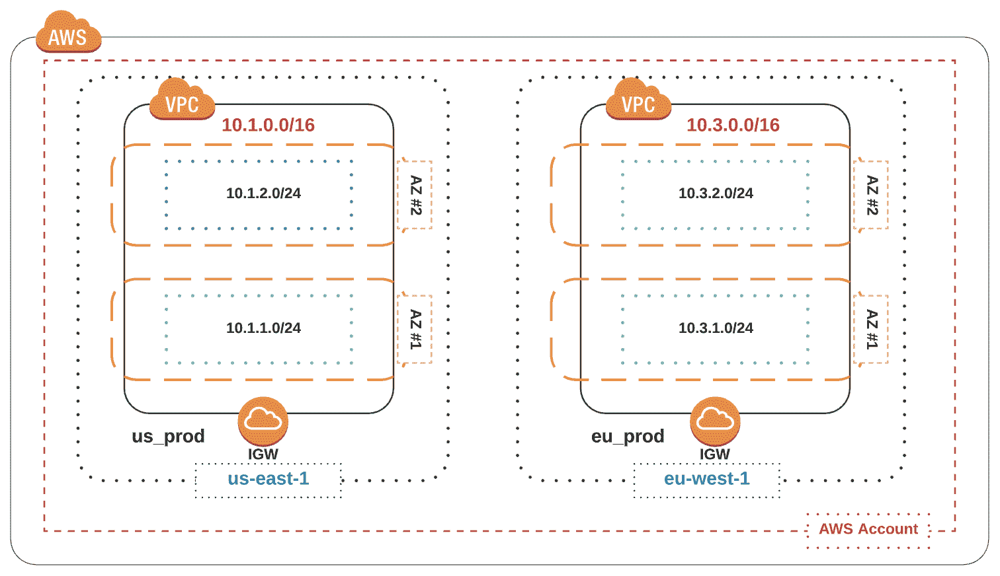

本章涵盖的主要教程如下：

+   安装 AWS SDK

+   构建 Ansible 清单

+   认证到您的 AWS 账户

+   使用 Ansible 部署 VPC

+   使用 Ansible 部署子网

+   使用 Ansible 部署 IGWs

+   使用 Ansible 控制 VPC 内的路由

+   使用 Ansible 部署网络 ACL

+   使用 Ansible 进行部署验证

+   使用 Ansible 取消部署 AWS 资源

# 技术要求

本章中使用的 GitHub 代码可以在这里找到：

[`github.com/PacktPublishing/Network-Automation-Cookbook/tree/master/ch7_aws`](https://github.com/PacktPublishing/Network-Automation-Cookbook/tree/master/ch7_aws)

本章基于以下软件版本：

+   运行 CentOS 7 的 Ansible 机器

+   Ansible 2.9

+   Python 3.6.8

查看以下视频，了解代码的实际操作：

[`bit.ly/3ckoAFe`](https://bit.ly/3ckoAFe)

# 安装 AWS SDK

在这个教程中，我们将概述如何安装 Ansible 所需的 Python 库，以开始与 AWS 编排系统进行交互。这一步是强制性的，因为这些 Python 库必须安装在 Ansible 控制机器上，以便所有的 Ansible AWS 模块都能正常工作。

# 准备工作

您需要在机器上拥有 sudo 访问权限，以安装所需的 Python 库。此外，您需要安装`python-pip`包，因为我们将使用**pip**来安装所需的 Python 库。

# 如何操作...

1.  我们可以测试任何 Ansible AWS 模块，以检查所需的 Python 库是否已安装：

```
$ ansible localhost -m aws_az_facts

localhost | FAILED! => {
 "changed": false,
 "msg": "boto3 required for this module"
 }
```

1.  安装`boto`和`boto3`包，如下所示：

```
$ sudo pip3 install boto3 boto
```

# 工作原理...

与 AWS 编排系统 API 交互的 Python SDK 库是`boto`和`boto3`。这些 Python 包必须存在于 Ansible 控制机器上，因为在 Ansible 中，所有的 AWS 模块都依赖于这些 Python 包中的一个来操作。我们可以通过使用上述第一步来运行任何 AWS 模块（例如`aws_az_facts`）使用`ansible`命令来检查系统上是否已安装了这个包。如果`boto3`库不存在，我们将收到一条错误消息，告知我们`boto3`未安装。

我们可以使用 Python pip 程序使用`pip3`命令安装`boto`和`boto3`包，这将安装所有需要安装和运行包的依赖项。在这个阶段，我们已经拥有了运行所有 Ansible AWS 模块所需的一切。

# 构建 Ansible 清单

在这个示例中，我们将概述如何构建一个 Ansible 清单，以描述我们将在 AWS 公共云中构建的基础设施网络设置。这是为了定义我们将部署基础设施的所有地区中的所有 VPC 而必须的步骤。

# 如何做到...

1.  创建一个新的`ch7_aws`文件夹，并在其中创建一个`hosts`文件，如下所示：

```
$ cat hosts

[us]
 us_prod_vpc

[eu]
 eu_prod_vpc

[prod_vpcs]
 us_prod_vpc
 eu_prod_vpc
```

1.  在`ch7_aws`内创建`ansible.cfg`文件，内容如下所示：

```
$ cat ansible.cfg

[defaults]
 inventory=hosts
 vault_password_file=~/.ansible_vault_passwd
 gathering=explicit
 transport=local
 retry_files_enabled=False
 action_warnings=False
```

# 它是如何工作的...

我们创建了主机的 Ansible 清单文件，现在我们需要在清单中声明我们的 VPC 作为节点，类似于我们如何定义网络节点。唯一的例外是 VPC 没有管理 IP 地址，因此我们不为这些 VPC 指定`ansible_host`参数。

我们需要在我们的清单文件中创建以下组：

+   一个 US 组，将所有美国的 VPC 分组在一起

+   一个 EU 组，将所有欧洲的 VPC 分组在一起

+   `prod_vpcs`，将所有我们的生产 VPC 分组在一起

我们还需要定义`ansible.cfg`文件，其中包含我们在所有先前示例中使用的所有配置选项。我们需要指定包含我们将用于加密所有敏感信息的加密密码的 vault 密码文件。

# 身份验证到您的 AWS 账户

在这个示例中，我们将概述如何创建所需的凭据，以便以编程方式对我们的 AWS 账户进行身份验证，并且如何使用 Ansible Vault 来保护这些凭据。这是为了能够在所有后续示例中运行任何 Ansible 模块而必须的步骤。

# 准备工作

Ansible 控制器必须具有互联网访问权限，并且 Ansible 清单必须按照上一个示例中的说明进行设置。此外，执行这些步骤的用户必须具有在 AWS 账户上创建新用户所需的访问权限。

# 如何做到...

1.  使用**IAM**创建一个新用户，具有编程访问权限，如下所示：

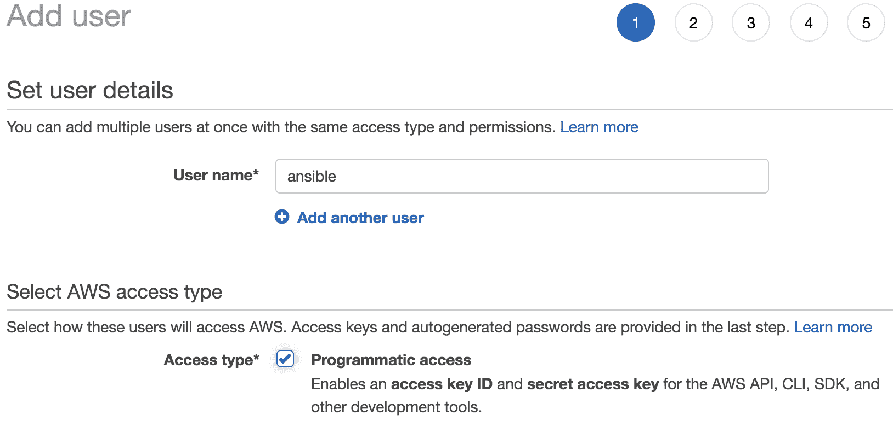

1.  为这个新用户分配正确的 IAM 策略，允许他们创建应该管理的所有网络资源（或者为简单起见，使用完全访问策略）：

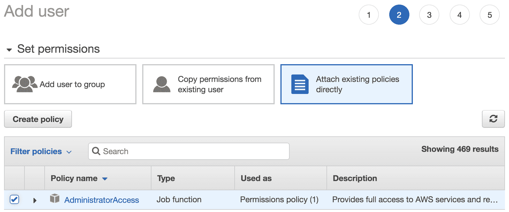

1.  完成用户创建，在最后一页，添加用户向导将显示访问密钥 ID 和秘密访问密钥的`.csv`文件以供下载。这些参数将用于对该账户的 AWS API 进行身份验证：

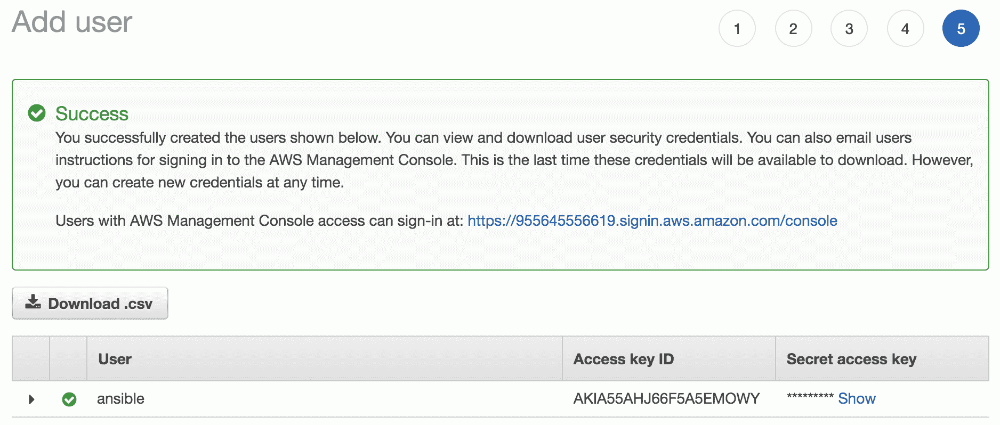

1.  使用 Ansible Vault 加密访问密钥 ID 和秘密访问密钥，如下所示：

```
$ ansible-vault encrypt_string <ACCESS_KEY_ID> --name aws_access_key

$ ansible-vault encrypt_string <SECRET_ACCESS_KEY> --name aws_secret_key_id

```

1.  在`ch7_aws`内创建`group_vars`，并在`group_vars`内创建`all.yml`文件。使用在上一步中使用`ansible-vault`加密的密码填充`all.yml`文件：

```
ansible_connection: local

aws_access_key: !vault |
 $ANSIBLE_VAULT;1.1;AES256
 37623631653336633662666138353639653365323637323665353731386661343164393664333434
 3430306562623532366137663835636138613633633835660a656235363130303035383965663464
 39326130613433643861653933623032393735376466333861326537646563643736356632303435
 6631326531666461310a353461396431303765393830636432363430323438373635383132336462
 37356163643662623633643965386465656563613533613938666232343063396261

aws_secret_key_id: !vault |
 $ANSIBLE_VAULT;1.1;AES256
 38353165666437393262303035646531666139623963643066623066346633393964633438626539
 6266623937343036376266373463623266316462613139660a336664353564623531393332613433
 34336363393962666633363630393631376135656666623862373966643935386665363733376133
 6236326462326566320a653364336464363963623136363362666632396133613863376166343135
 37373839316430643337353564373062333232656136393564613132333065316638383739326238
 3530386534303033636463626664346234653136353534633265
```

# 它是如何工作的...

第一步是确保用户帐户通过 API 对 AWS 控制台具有编程访问权限。为了使用户能够对 AWS API 进行身份验证，用户必须被分配两个密码，这些密码在用户创建或用户请求更改密码时由 AWS 生成。这两个密码是访问密钥 ID 和秘密访问密钥。这两个密码仅在创建时可见，并且 AWS 会在 CSV 文件中提供它们供您下载。此外，我们需要确保此用户具有正确的 IAM 权限来创建必要的资源（VPC、子网、路由表等）。因此，在我们的示例中，为这个新用户分配了管理员策略，这使他们可以完全访问 AWS 账户以创建任何资源（如 EC2 实例、VPC、子网等）。我们概述了创建新用户的步骤，如果用户已经具有编程访问权限和所需的 IAM 权限，则这些步骤是可选的；我们只是为了完整性而演示了这一点。

由于我们在 CSV 文件中以明文形式生成了 AWS 为该账户生成的密码，我们可以使用 Ansible Vault 加密这些密码，并将它们存储在`group_vars/all.yml`文件中，以便在创建 VPC 的所有资源时使用这些凭据。我们将这些密码加密后存储到`aws_access_key`和`aws_secret_key_id`参数中，使用`ansible-vault encrypt_string`命令进行加密。Ansible Vault 使用我们在`ansible.cfg`文件中声明的 Vault 密码文件，该文件具有我们将用于加密所有这些密码的加密密码。

在下一个教程中，我们将概述如何使用我们创建的这些加密变量来在创建 VPC 时进行 AWS 控制台身份验证。

# 使用 Ansible 部署 VPC

在这个教程中，我们将概述如何使用 Ansible 部署 AWS VPC。AWS VPC 是 AWS 中的基础网络构造，可以被视为管理员在其 AWS 账户中创建的云中的虚拟数据中心。为了开始构建 AWS 中的任何其他基础设施相关服务，必须首先创建一个 VPC。我们将概述如何描述所有必需的 VPC 以及如何使用 Ansible 自动化它们的创建。

# 准备就绪

要连接到 AWS API，AWS 控制机器必须连接到互联网。AWS 账户也必须按照前面的教程准备好，具有所需的 AWS 凭据。

# 如何做...

1.  在`group_vars`目录下创建`us.yml`和`eu.yml`文件，并填写这些文件与 AWS 区域名称定义，如下所示：

```
$ cat group_vars/eu.yml
 aws_region: eu-west-1

$ cat group_vars/eu.yml
 aws_region: us-east-1
```

1.  在`host_vars`目录下创建`eu_prod_vpc.yml`和`us_prod_vpc.yml`文件，并填写 VPC 参数，如下所示：

```
$ cat host_vars/eu_prod_vpc.yml

vpc_name: EU_Prod_Public_VPC
vpc_cidr: 10.3.0.0/16
vpc_tags:
 role: prod
 region: eu EU $ cat host_vars/us_prod_vpc.yml
vpc_name: US_Prod_Public_VPC
vpc_cidr: 10.1.0.0/16
vpc_tags:
 role: prod
 region: US
```

1.  创建一个新的 playbook，`pb_aws_net_build.yml`，并填写如下：

```
$ cat pb_aws_net_build.yml

- name: Create all AWS Networks
 hosts: prod_vpcs
 environment:
 AWS_ACCESS_KEY: "{{ aws_access_key }}"
 AWS_SECRET_KEY: "{{ aws_secret_key_id }}"
 tasks:
 - name: Create New VPC
 ec2_vpc_net:
 cidr_block: "{{ vpc_cidr }}"
 region: "{{ aws_region }}"
 name: "{{ vpc_name }}"
 state: "{{ vpc_state | default('present') }}"
 tags: "{{ vpc_tags }}"
 register: create_vpc
```

# 它是如何工作的...

AWS 具有全球存在，并将其基础设施的每个部分分隔到世界的每个部分中的区域。AWS 区域是世界某个地区的 AWS 设施集合，AWS 中的每个区域被认为是一个具有自己的编排和管理系统的隔离故障域。因此，当我们创建 VPC 时，我们需要指定将在哪个区域部署此 VPC，因此我们需要在我们的 Ansible 变量中描述这些信息。在我们的情况下，我们将所有 VPC 的 AWS 区域指定为`us-east-1`和所有 VPC 的 AWS 区域指定为`eu-west-1`。这是通过在`eu.yml`和`us.yml`文件以及`group_vars`目录下定义`aws_region`变量来实现的。

AWS 区域的这种逻辑对于大多数 AWS 中特定于区域的服务至关重要，我们将构建的所有网络构造都是特定于区域的。对于几乎所有的 AWS Ansible 模块，我们需要指定 AWS 区域，以便发起正确的 API 调用到指定区域的正确 API 端点。这是因为每个区域的 API 端点具有不同的 FQDN。有关 AWS 在所有区域中所有服务的 API 端点的更多信息，请使用以下链接：

[`docs.aws.amazon.com/general/latest/gr/rande.html`](https://docs.aws.amazon.com/general/latest/gr/rande.html)

我们需要在`host_vars`目录下为每个 VPC 声明变量，并为每个 VPC 创建一个 YAML 文件。我们需要指定 VPC 名称、前缀和应分配给 VPC 的标记。最后，我们需要创建 Ansible 剧本来构建我们的基础设施，并在剧本中使用一个新选项，即环境。此选项在剧本执行期间创建临时环境变量（`AWS_ACCESS_KEY`和`AWS_SECRET_KEY`）。这些环境变量的值设置为`group_vars/all.yml`文件中定义的`aws_access_key`和`aws_secret_key_id`变量的相同值。这样，在剧本执行期间，这些环境变量中包含的值可以用于验证每个任务中的 AWS 模块的所有 API 调用。

我们可以使用`ec2_vpc_net` Ansible 模块在 AWS 云上创建 VPC，并可以使用`region`属性指定将部署此 VPC 的 AWS 区域。我们需要定义其 IP 前缀、名称和任何相关标记。所有这些信息都来自我们为此 VPC 在`host_vars`文件中定义的变量。

当模块创建 VPC 时，它会返回创建的 VPC 的所有信息，我们可以将这些信息保存在一个名为`create_vpc`的新变量中。

以下是 VPC 创建任务返回的数据片段：

```
"create_vpc": {
 "vpc": {
 "cidr_block": "10.1.0.0/16",

< -- Output Omitted for brevity -->

 "dhcp_options_id": "dopt-b983c8c2",
 "id": "vpc-0d179be0eb66847f3",
 "instance_tenancy": "default",
 "is_default": false,
 "owner_id": "955645556619",
 "state": "available",
 "tags": {
 "Name": "US_Prod_Public_VPC",
 "region": "US",
 "role": "prod"
 }
 }
}
```

以下屏幕截图概述了从控制台在 AWS 上创建的 VPC：

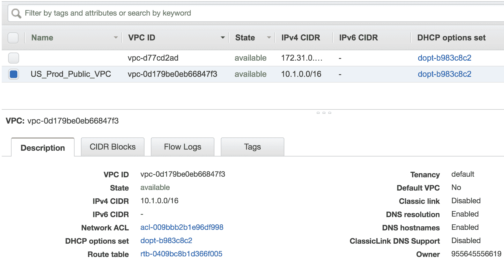

# 另请参阅

有关`ec2_vpc_net`模块和此模块中可用的其他参数的更多信息，请使用以下 URL：

[`docs.ansible.com/ansible/latest/modules/ec2_vpc_net_module.html`](https://docs.ansible.com/ansible/latest/modules/ec2_vpc_net_module.html)

# 使用 Ansible 部署子网

在这个配方中，我们将概述如何使用 Ansible 在 AWS VPC 中部署子网。子网是 AWS 中的基本网络构造，以便为部署在 AWS 云上的应用程序提供更弹性。通过将子网映射到不同的可用区，可以实现额外的弹性。使用这种逻辑，我们可以通过将资源分布到不同的可用区来为我们的部署提供高可用性。

# 准备工作

Ansible 控制机必须具有互联网可达性，并且 VPC 必须根据之前的配方进行预配。

# 如何做...

1.  使用如下所示的子网数据更新`host_vars/eu_prod_vpc.yml`文件。对于`host_vars/us_prod_vpc.yml`也是一样，包括所有子网的数据：

```
$ cat host_vars/eu_prod_vpc.yml

< -- Output Omitted for brevity -->

vpc_subnets:
 eu-prod-public-a:
 cidr: 10.3.1.0/24
 az: "{{ aws_region }}a"
 tags: "{{ vpc_tags }}"
 public: true

 eu-prod-public-b:
 cidr: 10.3.2.0/24
 az: "{{ aws_region}}b"
 tags: "{{ vpc_tags }}"
 public: true
```

1.  更新`pb_aws_net_build.yml`剧本，并填充新任务以构建子网：

```

- name: "set fact: VPC ID"
 set_fact:
 vpc_id: "{{ create_vpc.vpc.id }}"

- name: create VPC subnets
 ec2_vpc_subnet:
 region: "{{ aws_region }}"
 vpc_id: "{{ vpc_id }}"
 cidr: "{{ item.value.cidr }}"
 az: "{{ item.value.az }}"
 tags: "{{item.value.tags | combine({ 'Name': item.key })}}"
 with_dict: "{{ vpc_subnets }}"
 register: create_vpc_subnets
```

# 工作原理...

可用区是在 AWS 区域内为物理基础设施提供弹性的构造。为了有效使用可用区，我们需要将 VPC 内的基础设施分配到区域内的不同可用区。这是通过使用 AWS 子网来实现的。

在我们的示例部署中，我们使用了两个子网，分布在两个可用区，以提供我们的网络设置高可用性。我们使用`vpc_subnets`变量声明我们将在每个 VPC 中部署的子网。这些变量包括我们将在每个子网中使用的 CIDR（必须是 VPC CIDR 的子集），我们希望将此子网附加到的可用区，最后，我们希望分配给此子网的标签。我们使用 AWS 区域加上后缀（`a`，`b`，`c`等）构建可用区的名称。这是 AWS 用于命名区域内可用区的命名约定。

为了在 AWS 中创建子网，我们需要将子网与其父 VPC 关联。为了做到这一点，我们需要在创建子网的 API 调用期间指定`vpc-id`参数。这个`vpc-id`是 AWS 在创建 VPC 时分配给 VPC 的唯一标识符。我们从创建 VPC 的任务中获取这个值，并将此任务的输出保存到`vpc_create`变量中。我们可以使用这个变量来检索 VPC 的 ID，并使用`set_fact`模块将其分配给`vpc-id`变量。

最后，我们可以使用`ec2_vpc_subnet`模块构建子网，以在每个 VPC 中创建必要的子网，并循环遍历`vpc_subnets`数据结构，以构建所有所需的子网。

以下截图显示了在我们的`US_Prod` VPC 中在 AWS 云上正确规定的子网：

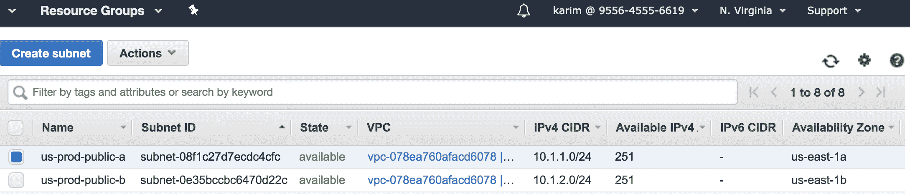

以下是分配给此子网的标签：

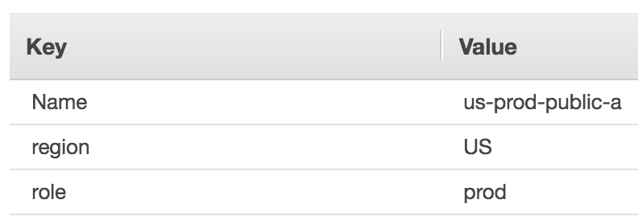

# 另请参阅

有关`ec2_vpc_subnet`模块和此模块中可用的其他参数的更多信息，请使用以下 URL：

[`docs.ansible.com/ansible/latest/modules/ec2_vpc_subnet_module.html#ec2-vpc-subnet-module`](https://docs.ansible.com/ansible/latest/modules/ec2_vpc_subnet_module.html#ec2-vpc-subnet-module)

# 使用 Ansible 部署 IGWs

在这个配方中，我们将概述如何使用 Ansible 部署**Internet Gateways**（**IGWs**）到我们的 AWS VPC。IGWs 是我们从 VPC 到互联网的出口点，以便到达公共外部目的地。由于我们正在构建一个面向公众的服务，我们需要从我们的 VPC 到互联网的可达性。这是通过 AWS 云中的 IGW 构造实现的。

# 准备工作

Ansible 控制机必须具有互联网可达性，并且 VPC 必须根据先前的配方进行了规定。

# 如何操作...

1.  更新`eu_prod_vpc.yml`文件与 IGW 数据，如下所示，并对`us_prod_vpc.yml`执行相同操作：

```
$ cat host_vars/eu_prod_vpc.yml

< -- Output Omitted for brevity -->

igw_name: eu_prod_igw

$ cat host_vars/eu_prod_vpc.yml

< -- Output Omitted for brevity -->

igw_name: us_prod_igw
```

1.  更新`pb_aws_net_build.yml` playbook，并填充新任务以构建 IGW 节点：

```

- name: Create IGW
 ec2_vpc_igw:
 region: "{{ aws_region }}"
 vpc_id: "{{ vpc_id }}"
 state: present
 tags: "{{ vpc_tags | combine({'Name': igw_name}) }}"
 register: vpc_igw_create

- name: Extract VPC IGW ID
 set_fact:
 igw_id: "{{ vpc_igw_create.gateway_id }}"
```

# 工作原理...

IGW 网络构造是我们从 VPC 到互联网公共目的地的出口点。IGW 附加到 VPC，并为位于 VPC 内的任何资源（如 EC2 或 RDS 实例）提供互联网连接。为了创建 IGW，我们需要指定要将此 IGW 附加到的 VPC。因此，我们需要 VPC 的 ID。

正如我们在前面的配方中讨论的，当我们创建 VPC 时，我们会得到 VPC ID，并且我们可以使用一个单独的任务保存这个变量。我们可以在 IGW 的创建过程中使用这个变量的值。我们可以使用`ec2_vpc_igw`模块创建 IGW，并指定我们希望将此 IGW 部署到的区域。我们还可以指定 IGW 将附加到的 VPC ID。最后，我们可以指定要分配给 IGW 节点的标签。IGW 标签是可选的，但在使用自动部署时非常重要，因为它们允许我们引用我们创建的对象。我们将在后续的配方中概述在部署验证和事实收集时使用标签。

当我们部署新的 IGW 时，`ec2_vpc_igw`模块返回在 AWS 内部配置的 IGW 参数。一个特别重要的参数是`igw-id`。此参数唯一标识了配置的 IGW 节点，我们在引用此 IGW 节点相关的任何操作时必须使用它。

以下是由`ec2_vpc_igw`返回的 IGW 参数片段，我们在`us_prod_vpc`中的 IGW 节点中捕获了这些参数，并将其存储在`vpc_igw_create`变量中：

```
ok: [us_prod_vpc] => {
 "vpc_igw_create": {
 "changed": true,
 "failed": false,
 "gateway_id": "igw-05d3e4c664486790b",
 "tags": {
 "Name": "us_prod_igw",
 "region": "US",
 "role": "prod"
 },
 "vpc_id": "vpc-0abc32281330c9bc6"
 }
}
```

在上一个任务中，我们捕获了`ec2_vpc_igw`返回的`gateway-id`变量，并将其存储在一个新变量`igw_id`中，我们将在后续任务中引用 IGW 节点时使用它。

以下截图概述了在 VPC 中配置和附加的 IGW 节点：

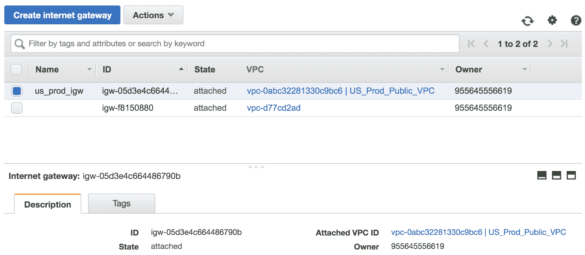

# 另请参阅

有关`ec2_igw_vpc`模块和此模块中可用的其他参数的更多信息，请使用以下 URL：

[`docs.ansible.com/ansible/latest/modules/ec2_vpc_igw_module.html#ec2-vpc-igw-module`](https://docs.ansible.com/ansible/latest/modules/ec2_vpc_igw_module.html#ec2-vpc-igw-module)

# 使用 Ansible 控制 VPC 内的路由

在这个示例中，我们将概述如何调整 AWS VPC 内的路由，以控制 VPC 内子网中的流量转发。通过控制 VPC 内的路由，我们可以自定义 VPC 设计以及 VPC 内的流量转发方式，以及如何将流量发送到外部目的地。

# 准备工作

Ansible 控制机必须具有互联网可达性，并且 VPC 必须按照上一个示例进行配置。

# 操作步骤

1.  更新`eu_prod_vpc.yml`文件，其中包含路由表数据，如下所示，并对`us_prod_vpc.yml`执行相同操作：

```
$ cat host_vars/eu_prod_vpc.yml

< -- Output Omitted for brevity -->

route_table:
 tags:
 Name: eu_public_rt
 igw:
 - dest: 0.0.0.0/0
 gateway_id: "{{ igw_id }}"
 public:
 - eu-prod-public-a
 - eu-prod-public-b
```

1.  更新`pb_aws_net_build.yml` playbook，并填充以下任务以将路由表附加到我们创建的 VPC：

```
- name: Get Default VPC Route Table
 ec2_vpc_route_table_facts:
 region: "{{ aws_region }}"
 filters:
 vpc-id: "{{ vpc_id }}"
 register: vpc_route_table_facts
 tags: rt

- name: Extract Route Table IDs
 set_fact:
 rt_id: "{{vpc_route_table_facts.route_tables[0].id }}"
 tags: rt
```

1.  更新 playbook 并填充以下任务以更新所需路由的路由表：

```
- name: Update Default VPC Route Table
 ec2_vpc_route_table :
 region: "{{ aws_region }}"
 vpc_id: "{{ vpc_id }}"
 route_table_id: "{{ rt_id }}"
 routes: "{{ route_table.igw }}"
 subnets: "{{ route_table.public }}"
 lookup: id
 state: present
 tags: "{{ vpc_tags | combine(route_table.tags) }}"
```

# 工作原理

到目前为止，我们已经设置了 VPC、子网和 IGW。但是，尽管 IGW 节点已连接到互联网并附加到 VPC，但 VPC 相关联的路由表仍未更新，也没有路由指向 IGW，因此 VPC 内的流量都不会使用 IGW 节点。

以下是在更改路由表之前`us_prod_vpc`的默认路由表的片段：

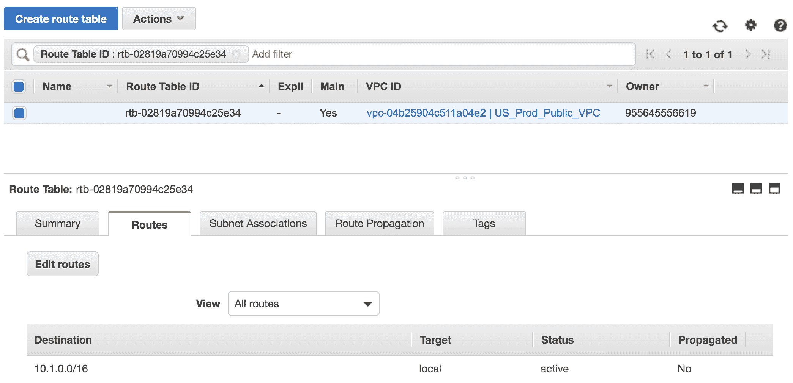

AWS VPC 具有默认路由表，该路由表分配给 VPC 和所有未分配特定路由表的子网。因此，默认情况下，VPC 中的所有子网都与 VPC 的默认路由表相关联。

以下是一个截图，显示了在`us_prod_vpc`中创建的子网与默认路由表相关联的情况：

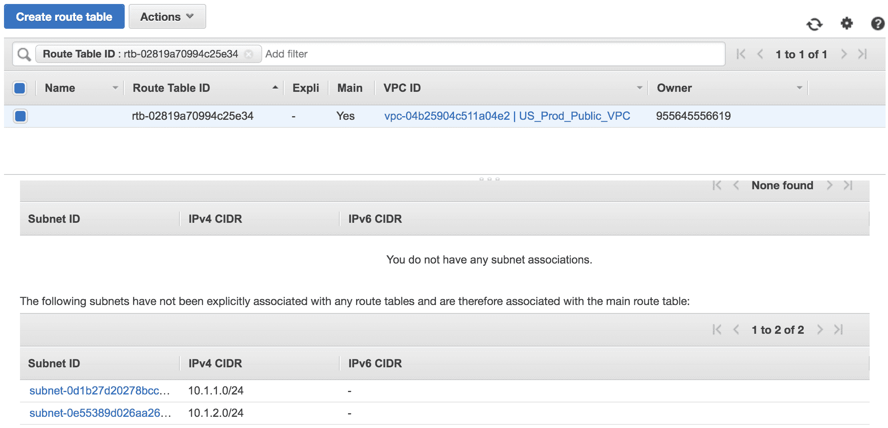

在我们为每个 VPC 声明的 VPC 定义中，我们包含了一个名为`route_table`的新数据结构，其中包含我们需要调整 VPC 的路由表并将所有子网与其关联的所有信息。

在这个示例中，我们将执行的第一个任务是获取与我们创建的 VPC 相关联的默认路由表的 ID。我们将使用`ec2_vpc_route_table_facts`模块来获取路由表的信息，并提供 VPC ID 来唯一标识 VPC。我们可以将默认路由表的 ID 存储在新变量`rt_id`中。

以下是我们从`ec2_vpnc_facts`模块中检索到的路由表信息的片段：

```
ok: [us_prod_vpc] => {
 "vpc_route_table_facts": {
 "route_tables": [
 {
 < -- Output Omitted for brevity --> ],
 "id": "rtb-0b6669ba5fd9eb9c8",
 "routes": [
 {
 "destination_cidr_block": "10.1.0.0/16",
 "gateway_id": "local",

< -- Output Omitted for brevity -->

 }
 ],
 "tags": {},
 "vpc_id": "vpc-005b1dcb981791d86"
 }
 ]
 }
} 
```

一旦我们有了与 VPC 关联的路由表的 ID，我们可以使用`ec2_vpc_route_table`模块来调整与 VPC 关联的默认路由表的路由表。我们必须提供 VPC 和路由表 ID 以唯一标识我们要修改的确切路由表。我们可以指定要在路由表中注入的路由和要与此路由表关联的子网。我们可以注入默认路由并将其指向我们在上一个配方中使用`igw-id`创建的 IGW。

在调整路由后，以下截图概述了我们 VPC 的路由表：

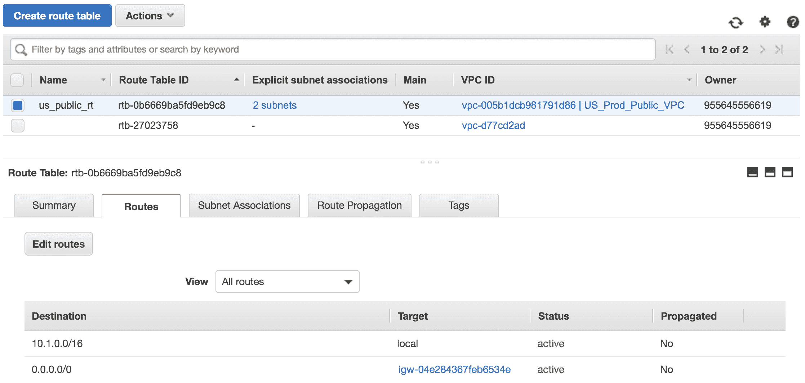

以下截图概述了我们在 VPC 中有的两个子网现在与此默认路由表关联：

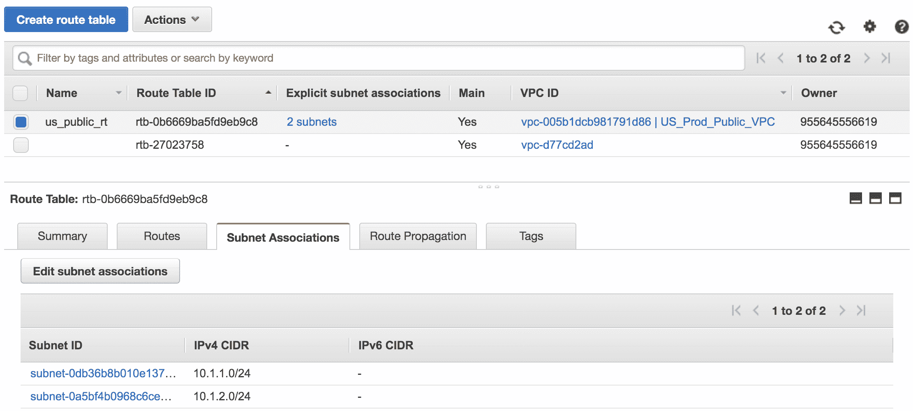

# 另请参阅

有关与 AWS VPC 路由表交互的多个模块以及相关模块的更多信息，请使用以下链接：

+   [`docs.ansible.com/ansible/latest/modules/ec2_vpc_route_table_module.html#ec2-vpc-route-table-module`](https://docs.ansible.com/ansible/latest/modules/ec2_vpc_route_table_module.html#ec2-vpc-route-table-module)

+   [`docs.ansible.com/ansible/latest/modules/ec2_vpc_route_table_facts_module.html#ec2-vpc-route-table-facts-module `](https://docs.ansible.com/ansible/latest/modules/ec2_vpc_route_table_facts_module.html#ec2-vpc-route-table-facts-module)

# 使用 Ansible 部署网络 ACL

在本配方中，我们将概述如何在 AWS 上部署**网络 ACLs**（**NACLs**）。NACLs 是 AWS 中可用的安全解决方案之一，用于保护在 AWS 云中部署的计算资源。在本配方中，我们将概述如何描述和自动化在 AWS 中部署 NACLs 的过程。

# 准备工作

Ansible 控制机必须具有互联网可达性，以便到达 AWS API 端点，并且 VPC 和子网必须根据先前的配方进行预配。

# 如何操作...

1.  使用 NACL 定义数据更新`eu_prod_vpc.yml`文件，如下所示，并对`us_prod_vpc.yml`执行相同操作：

```
$ cat host_vars/eu_prod_vpc.yml

< -- Output Omitted for brevity -->

network_acls:
 - name: EU_Prod_ACLs
 subnets: "{{ vpc_subnets.keys() | list }}"
 ingress_rules:
 - [100,'tcp','allow','0.0.0.0/0',null,null,80,80]
 - [200,'tcp','allow','0.0.0.0/0',null,null,443,443]
```

1.  更新`pb_aws_net_build.yml` playbook，并填充以下任务以创建 NACLs：

```
- name: Create Network ACLs
 ec2_vpc_nacl:
 region: "{{ aws_region }}"
 vpc_id: "{{ vpc_id }}"
 name: "{{ item.name }}"
 subnets: "{{ item.subnets }}"
 ingress: "{{ item.ingress_rules }}"
 tags: "{{ vpc_tags | combine({'Name':item.name}) }}"
 loop: "{{ network_acls }}"
```

# 工作原理...

AWS NACL 是有能力基于 L3 和 L4 IP 地址信息允许或拒绝 IP 流量的无状态 ACL。它们在子网级别执行，并与子网关联以保护在子网上预配的所有资源。它们可以阻止入口（进入子网的流量）或出口（离开子网的流量）方向的流量。NACL 中的规则是根据规则编号进行处理的，因此第一个匹配的规则将应用于流量流向。

所有子网都附加了默认 NACL，并且 AWS 为默认 NACL 设置了以下规则：

+   在入口处，允许所有流量。以下截图概述了应用于默认 NACL 的规则：

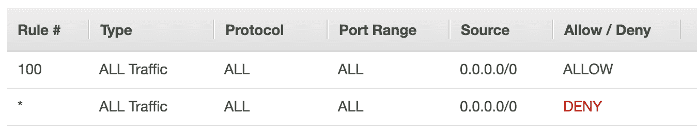

+   在出口处，允许所有流量。以下截图概述了应用于默认 NACL 的规则：

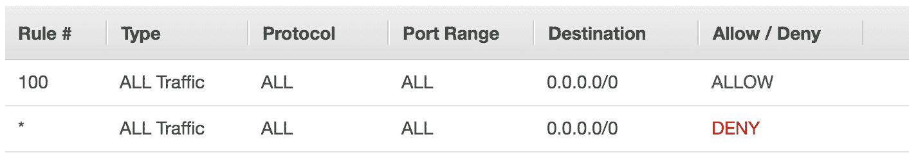

在我们的示例设置中，我们将在所有子网上应用 NACL，强制执行以下安全策略：

+   必须允许所有 TCP 流量到端口`80`和`443`。

+   任何其他流量应该被丢弃。

默认情况下，任何 NACL 的末尾都有一个`DENY`规则，会丢弃所有流量。

我们定义了`network_acls`数据结构，其中包含 NACL 定义和设置所有所需字段以在我们的 EU 和 US 地区的所有子网上设置所需的 NACLs。在此数据结构中，我们需要定义以下参数：

+   `Name`：这是 NACL 的名称，它作为标识符。

+   `Subnets`：这定义了应与此 NACL 关联的子网。我们使用我们的`vpc_subnets`定义中的数据来构建此列表。

+   `Ingress_rules`：这定义了应作为此 NACL 的一部分应用的所有规则，方向为入站。

+   `Engress_rules`：这定义了应作为此 NACL 的一部分应用的所有规则，方向为出站。

我们可以在 playbook 中创建一个新任务，使用`ec2_net_nacl`来配置 NACL 并将其附加到我们所有的子网。

以下截图概述了在`EU_prod` VPC 中部署的新 NACL：

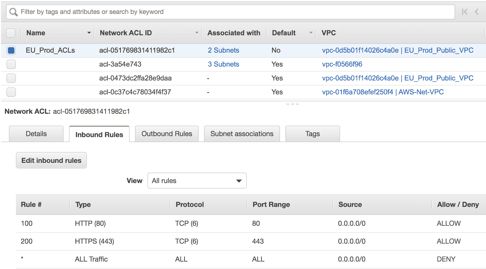

以下截图概述了与我们在`EU_prod` VPC 中的 NACL 相关联的子网：

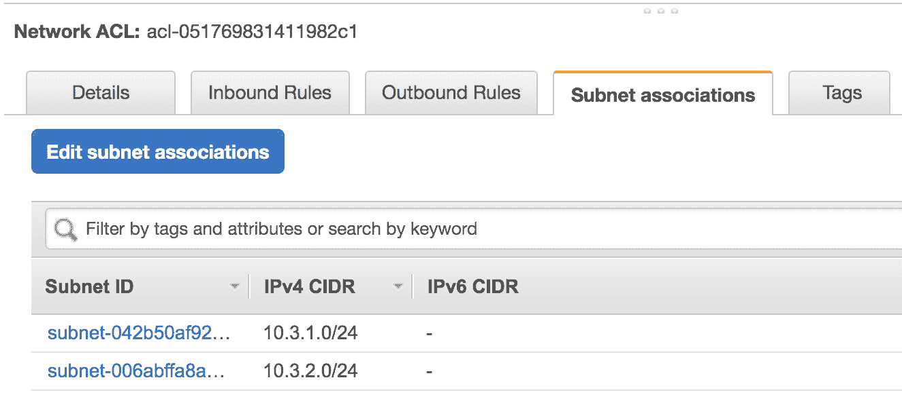

# 另请参阅

有关`ec2_net_nacl` Ansible 模块以及此模块支持的不同参数的更多信息，请参阅以下 URL：

[`docs.ansible.com/ansible/latest/modules/ec2_vpc_nacl_module.html`](https://docs.ansible.com/ansible/latest/modules/ec2_vpc_nacl_module.html)

# 使用 Ansible 进行部署验证

在这个配方中，我们将概述如何收集 AWS 中不同网络组件的操作状态，例如 VPC 和子网，并检查我们的部署是否按照我们的设计实施。

# 准备工作

Ansible 控制机必须具有互联网可达性，并且我们在先前的配方中概述的所有网络组件都应该就位。

# 如何做...

1.  创建一个新的`pb_vpc_validate.yml` playbook，并填充它以验证 VPC 的构建任务：

```
$ cat pb_vpc_validate.yml

- name: Validate VPC Build
 hosts: all
 gather_facts: no
 environment:
 AWS_ACCESS_KEY: "{{ aws_access_key }}"
 AWS_SECRET_KEY: "{{ aws_secret_key_id }}"
 AWS_REGION: "{{ aws_region }}"
 tasks:
 - name: Get VPC facts
 ec2_vpc_net_facts:
 filters:
 "tag:Name": "{{ vpc_name }}"
 register: vpc_facts

    - name: Validate VPC Info
 assert:
 that:
 - vpc_facts.vpcs[0].cidr_block == vpc_cidr
 - vpc_facts.vpcs[0].tags.Name == vpc_name
 when: vpc_facts.vpcs != []
```

1.  使用以下任务更新 playbook 以收集 AWS 子网的信息：

```
 - name: Extract VPC ID
 set_fact:
 vpc_id: "{{ vpc_facts.vpcs[0].id }}"

 - name: Get Subnet facts
 ec2_vpc_subnet_facts:
 filters:
 vpc-id: "{{ vpc_id }}"
 register: vpc_subnet_facts
 tags: subnet
```

1.  使用以下任务更新 playbook 以验证 AWS 子网的状态：

```
 - name: Validate VPC Subnets Info
 assert:
 that:
 - vpc_subnet_facts.subnets |
 selectattr('tags.Name','equalto',item.key) |
 map(attribute='cidr_block') |
 list | first == item.value.cidr

 - vpc_subnet_facts.subnets |
 selectattr('tags.Name','equalto',item.key) |
 map(attribute='availability_zone') |
 list | first == item.value.az

 with_dict: "{{ vpc_subnets }}"
```

# 工作原理...

我们可以创建一个新的 playbook，使用`ec2_vpc_net_facts`和`ec2_vpc_subnet_facts` Ansible 模块来收集 VPC 和子网的信息。我们可以收集这些模块返回的数据，并使用`assert`模块来验证状态，如下所示：

1.  VPCs：

+   检查为 VPC 分配的名称是否按照我们的设计进行了配置。

+   检查为 VPC 分配的 CIDR 块是否按照我们的设计部署。

1.  子网：

+   检查为子网分配的 CIDR 是否正确配置。

+   检查子网是否在正确的可用区中进行了配置。

我们可以通过将事实模块返回的操作状态与我们在`group_vars`或`host_vars`变量中为每个 VPC 定义的元数据进行比较，执行所有前述验证。

在`ec2_vpc_net_facts`任务中，我们使用`filters`参数仅基于其`Name`标签选择我们的 VPC。默认情况下，此模块将返回此区域内所有 VPC 的信息。

在`ec2_vpc_subnet_facts`任务中，我们使用`filters`参数仅检索我们的 VPC 的子网数据，因为默认情况下，此模块将返回此区域内所有 VPC 的所有子网信息。

# 另请参阅

有关 AWS 中不同网络资源的事实收集模块的更多信息，请使用以下链接：

+   [`docs.ansible.com/ansible/latest/modules/ec2_vpc_net_facts_module.html#ec2-vpc-net-facts-module`](https://docs.ansible.com/ansible/latest/modules/ec2_vpc_net_facts_module.html#ec2-vpc-net-facts-module)

+   [`docs.ansible.com/ansible/latest/modules/ec2_vpc_subnet_facts_module.html#ec2-vpc-subnet-facts-module`](https://docs.ansible.com/ansible/latest/modules/ec2_vpc_subnet_facts_module.html#ec2-vpc-subnet-facts-module)

+   [`docs.ansible.com/ansible/latest/modules/ec2_vpc_igw_facts_module.html#ec2-vpc-igw-facts-module`](https://docs.ansible.com/ansible/latest/modules/ec2_vpc_igw_facts_module.html#ec2-vpc-igw-facts-module)

# 使用 Ansible 在 AWS 上解除资源

在这个配方中，我们将概述如何在 AWS 中解除完整的网络及其所有相关网络资源。这概述了我们如何可以使用 Ansible 轻松构建和拆除云上的资源，只需执行一个简单的 playbook。

# 准备工作

Ansible 控制机必须具有互联网可达性，并且我们在前面的配方中概述的所有网络组件都应该就位。

# 如何做...

1.  创建一个新的`pb_delete_vpc.yml` playbook，包括以下任务来收集 VPC 的事实：

```
$ cat pb_delete_vpc.yml

- name: Delete all VPC resources
 hosts: all
 gather_facts: no
 environment:
 AWS_ACCESS_KEY: "{{ aws_access_key }}"
 AWS_SECRET_KEY: "{{ aws_secret_key_id }}"
 AWS_REGION: "{{ aws_region }}"
 tasks:
 - name: Get VPC facts
 ec2_vpc_net_facts:
 filters:
 "tag:Name": "{{ vpc_name }}"
 register: vpc_facts

 - name: Extract VPC ID
 set_fact:
 vpc_id: "{{ vpc_facts.vpcs[0].id }}"
```

1.  更新 playbook，添加以下任务以删除 VPC 内的所有子网和 IGW 节点：

```
 - name: Start Delete VPC Resources
 block:
 - name: Delete Subnets
 ec2_vpc_subnet:
 cidr: "{{ item.value.cidr }}"
 vpc_id: "{{ vpc_id }}"
 state: absent
 with_dict: "{{ vpc_subnets }}" - name: Delete IGW
 ec2_vpc_igw:
 vpc_id: "{{ vpc_id }}"
 state: absent
```

1.  更新 playbook，添加以下任务以删除所有 NACLs：

```
 - name: Delete NACLs
 ec2_vpc_nacl:
 name: "{{ item.name }}"
 vpc_id: "{{ vpc_id }}"
 state: absent
 loop: "{{ network_acls }}"
```

1.  更新 playbook，添加最终任务以删除所有 VPCs：

```
 - name: Delete VPC
 ec2_vpc_net:
 cidr_block: "{{ vpc_cidr }}"
 name: "{{ vpc_name }}"
 state: absent
 when: vpc_id is defined
```

# 工作原理...

我们可以从收集 VPC 事实开始我们的新 playbook，以获取部署的 VPC 的 VPC ID。一旦我们获得了这些信息，我们就可以开始删除资源。然而，删除资源的顺序很重要。我们需要先删除任何依赖资源，因此我们必须先删除子网，然后才能删除 VPC。例如，如果有 EC2 实例连接到子网，我们必须先删除这些 EC2 实例，然后才能删除子网。因此，在我们的情况下，我们需要先删除子网，然后是 IGW 节点，最后才是删除 VPC。

在所有这些任务中，我们使用的是前面配方中概述的完全相同的模块。唯一的变化是我们将状态设置为不存在，并且我们提供所需的 VPC ID 来唯一标识我们需要从中删除所需资源的 VPC。

最后，当我们开始删除 VPC 内的资源时，我们首先验证是否存在 VPC ID。如果资源已经被删除并且我们再次运行 playbook，删除步骤将被跳过，因为`facts`任务不会检索到 VPC ID。
