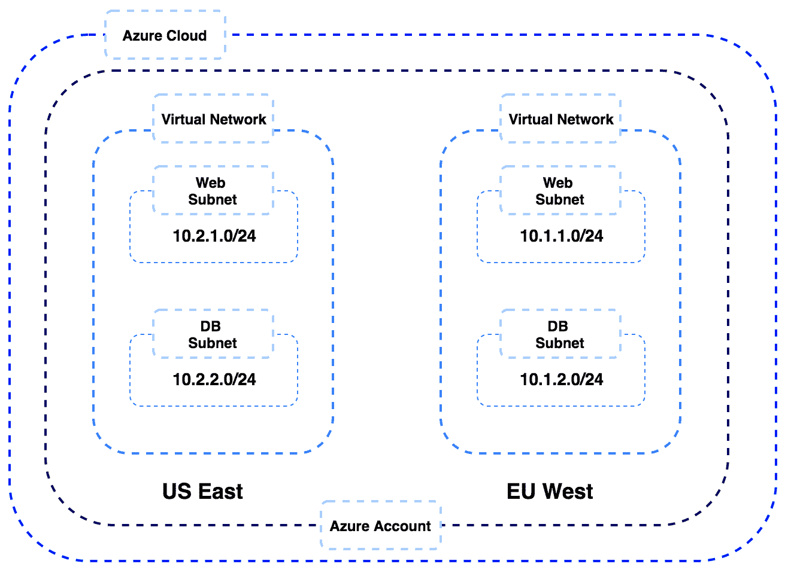
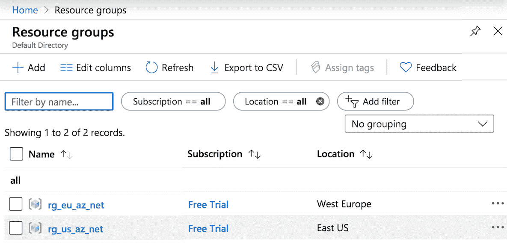
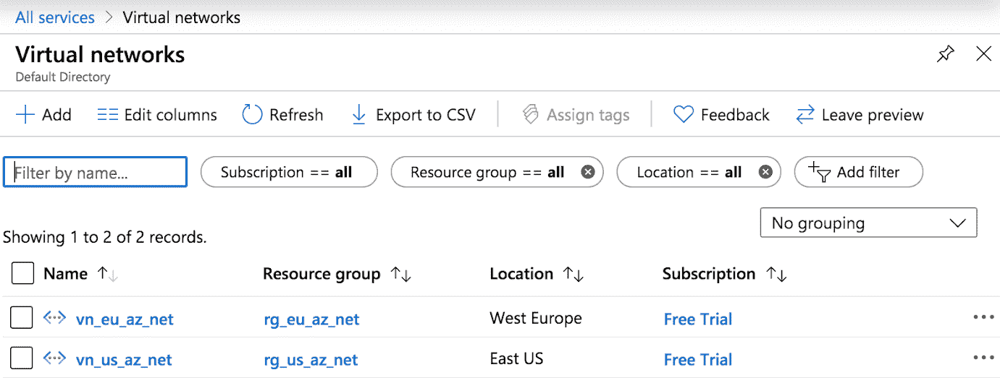
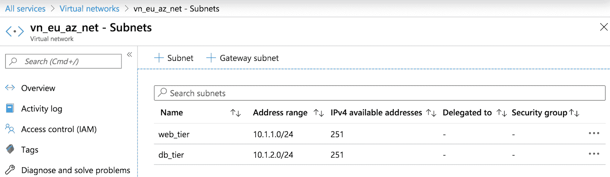
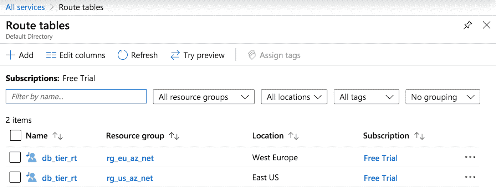
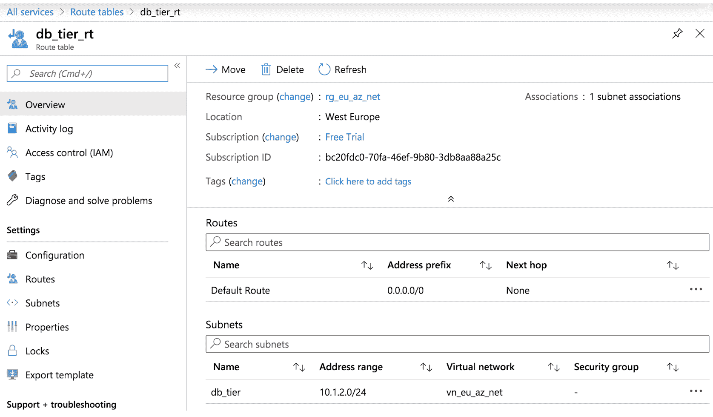
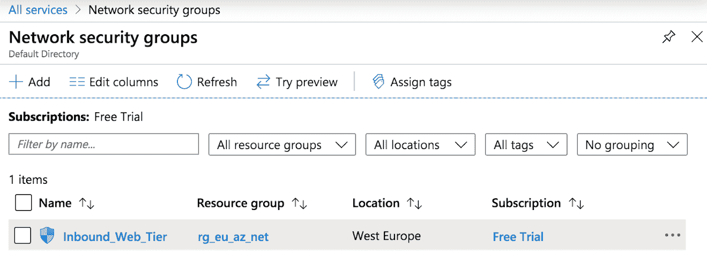
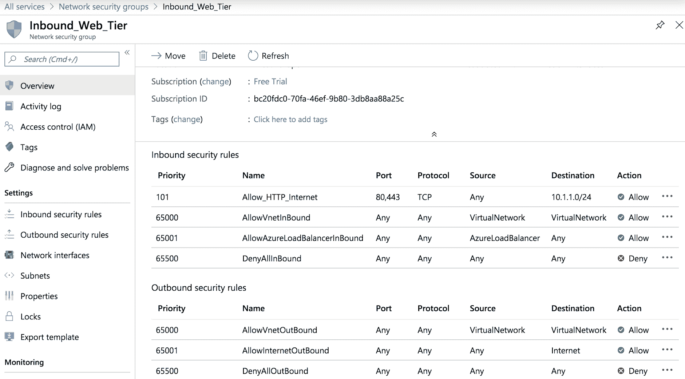
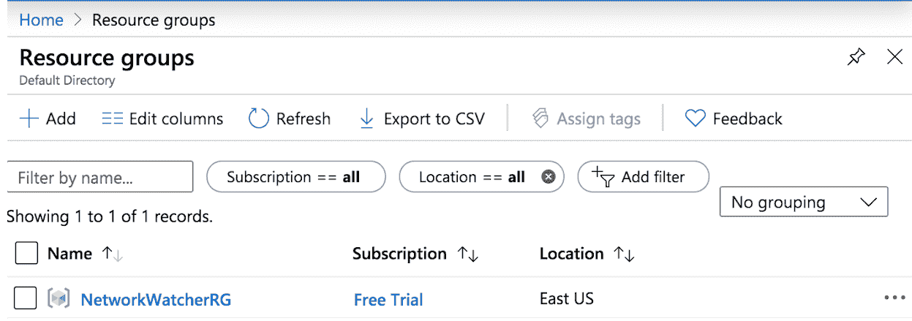
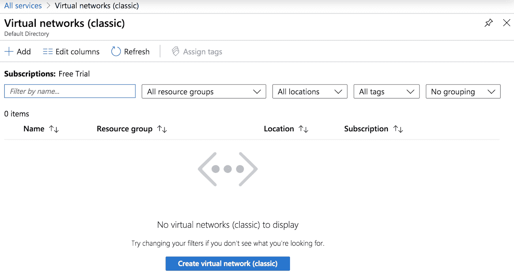

# 使用 Ansible 部署和操作 Azure 网络资源

在上一章中，我们探讨了如何在 AWS 云上提供网络资源以及如何使用 Ansible 作为编排引擎在 AWS 上部署这些资源。在本章中，我们将看看另一个主要的云提供商，微软及其 Azure 云服务。

Azure 在 Azure 云上提供多个网络服务，以便在 Azure 云上部署高度可扩展的云解决方案。Ansible 提供多个模块，用于与 Azure 云中的多个服务进行交互，并且是在 Azure 云上自动化部署的优秀工具。我们将探讨 Azure 中可用的基本网络构造，并概述如何使用 Ansible 中的多个模块来构建和验证 Azure 云中以下基本网络设置：



本章涵盖的主要配方如下：

+   安装 Azure SDK

+   构建 Ansible 清单

+   验证您的 Azure 帐户

+   创建资源组

+   创建虚拟网络

+   创建子网

+   构建用户定义的路由

+   部署网络安全组

+   使用 Ansible 进行部署验证

+   使用 Ansible 停用 Azure 资源

# 技术要求

要开始使用 Azure，您需要创建一个帐户。您可以在[`Azure.microsoft.com/en-au/free/.`](https://azure.microsoft.com/en-au/free/)上设置一个免费帐户。

以下链接是本章中使用的 GitHub 代码：

[`github.com/PacktPublishing/Network-Automation-Cookbook/tree/master/ch8_azure`](https://github.com/PacktPublishing/Network-Automation-Cookbook/tree/master/ch8_azure)

本章基于的软件版本如下：

+   运行 CentOS 7 的 Ansible 机器

+   Ansible 2.9

+   Python 3.6.8

查看以下视频，了解代码的实际操作：

[`bit.ly/3esy3fS`](https://bit.ly/3esy3fS)

# 安装 Azure SDK

在这个配方中，我们将概述如何安装所需的 Python 库，以开始使用 Ansible 与 Azure 编排系统进行交互。这一步是强制性的，因为这些 Python 库必须安装在 Ansible 控制机器上，以便所有 Ansible Azure 模块正常工作。

# 准备工作

您需要在机器上拥有 sudo 访问权限，以安装 Azure Python 库。您还需要安装 Python，并使用 Python PIP 软件包来安装 Azure 软件包。

# 操作步骤…

1.  安装`boto3`软件包，如下所示：

```
$ sudo pip3 install 'Ansible[Azure]'
```

1.  创建一个名为`ch8_Azure`的新文件夹，以托管本章的所有代码：

```
$ mkdir ch8_Azure
```

# 工作原理…

Ansible 的默认安装不包括运行 Ansible Azure 模块所需的所有 Python 模块。这就是为什么我们的第一步是安装所需的 Python 库。我们使用 Python pip 程序安装所有这些软件包。我们可以使用以下代码验证所有 Azure 模块是否已安装：

```
$ pip3 list | grep Azure

Azure-cli-core                 2.0.35

Azure-cli-nspkg                3.0.2

Azure-common                   1.1.11

Azure-graphrbac                0.40.0

Azure-keyvault                 1.0.0a1

 <<  ---  Output Omitted for brevity  -- >>
```

如前所述，需要安装多个 Python 软件包才能开始使用 Ansible 与 Azure API 进行交互。完成这一步后，我们现在已经准备好在 Azure 中构建我们的 playbooks 和基础设施了。

# 另请参阅…

有关如何开始使用 Ansible 与 Azure 云进行交互的更多信息，请参阅以下链接：

[`docs.Ansible.com/Ansible/latest/scenario_guides/guide_Azure.html`](https://docs.ansible.com/ansible/latest/scenario_guides/guide_azure.html)

# 构建 Ansible 清单

在这个配方中，我们将概述如何构建一个 Ansible 清单，以描述我们将在 Azure 公共云中构建的网络基础设施设置。这是一个必要的步骤，因为我们将定义我们将在其中部署基础设施的所有地区的所有虚拟网络。

# 操作步骤…

1.  在`ch8_Azure`目录中创建`hosts`文件，并填入以下数据：

```
$ cat hosts

[az_net]

eu_az_net

us_az_net

[eu]

eu_az_net

[us]

us_az_net
```

1.  创建包含以下内容的`Ansible.cfg`文件：

```
$ cat Ansible.cfg

[defaults]

inventory=hosts

retry_files_enabled=False

gathering=explicit

host_key_checking=False

action_warnings=False
```

1.  创建`group_var`文件夹和`eu.yml`和`us.yml`文件，其中包含以下代码：

```
$ cat group_var/eu.yml

---

region: westeurope

$ cat group_var/us.yml

---

region: eastus 
```

# 工作原理…

我们创建了主机的 Ansible 清单文件，并声明了我们将在 Azure 云中提供的不同虚拟网络。我们还创建了两个描述每个虚拟网络位置的组。

简而言之，我们创建了以下组来定义和分组我们的虚拟网络：

+   `az_net`：这将对我们在 Azure 云中的所有虚拟网络进行分组。

+   `eu`：列出欧盟地区的所有虚拟网络（将映射到 Azure 云中的特定区域，我们稍后将概述）。

+   `us`：列出美国地区的所有虚拟网络（将映射到 Azure 云中的特定区域，我们稍后将概述）。

我们可以使用此区域分组来指定在 Azure 云中使用此虚拟网络的确切区域。我们可以在`eu.yml`和`us.yml`文件的`group_vars`目录下定义名为`region`的变量来声明确切的区域。

我们将在随后的教程中使用此变量，以在相应的 Azure 区域部署我们的资源。

# 身份验证到您的 Azure 帐户

在本教程中，我们将概述如何创建所需的凭据，以便从 Ansible 对我们的 Azure 帐户进行编程身份验证。我们还将学习如何使用 Ansible Vault 来保护这些凭据。为了能够在以下教程中运行任何 Ansible 模块，这一步是必需的。

# 准备工作

Ansible 控制器必须具有互联网访问权限，并且必须按照上一个教程中的说明设置 Ansible 清单。执行这些步骤的用户必须具有 Azure 门户的管理访问权限，以便能够创建所需的资源，从而实现与 Azure API 的程序交互。

# 如何操作…

1.  使用具有管理权限的帐户登录 Azure 门户：

[`portal.Azure.com/`](https://portal.azure.com/)

1.  在主页上，选择 Azure 活动目录：

！[](assets/c1badbd7-1ce5-467a-bd1b-6c4f7642adb8.png)

1.  从左侧面板中选择应用程序注册：

！[](assets/c170b963-f66c-489a-8e60-00f2f6b24b8f.png)

1.  单击“新注册”选项，并提供以下信息以创建新应用程序。蓝色突出显示的选项是此处的活动选项：

！[](assets/ad335022-b818-4a36-9c61-d844339e2b85.png)

1.  单击注册按钮后，将创建新应用程序并显示其信息，如下截图所示（我们需要 client_id 和 tenant_id 数据）：

！[](assets/41b1408c-e543-46ba-b97c-cf0698aa2ec9.png)

1.  在左侧面板中选择证书和密码：

！[](assets/0691a69e-4921-4440-bd37-376fcdfb8454.png)

1.  单击“新客户端密码”：

！[](assets/ee85938d-158c-4415-951b-32679a0f8a66.png)

1.  为此应用程序指定密码名称，并选择其到期日期：

！[](assets/92169a62-0318-447f-9714-2f9c332ba69d.png)

1.  创建后，记下显示的秘密字符串（这是我们能够以纯文本形式看到此密码的唯一时间）：

！[](assets/e2bc9436-b6fd-45b2-82b6-7faed34ee304.png)

1.  转到所有服务并选择订阅：

！[](assets/9ce45c61-e9c8-4e5f-ae29-d1883ee7c876.png)

1.  单击订阅名称（在我这里是免费试用）：

！[](assets/01a9ccb9-59c6-49b9-805d-59d1e41f1cc2.png)

1.  记录订阅 ID 字符串（因为我们需要它进行身份验证），然后在左侧单击访问控制（IAM）选项卡：

！[](assets/36ec156d-31dd-413f-a403-08eb06435b04.png)

1.  单击“添加角色分配”，并将“参与者”角色分配给我们创建的 Ansible 应用程序：

！[](assets/06ef5c6a-577d-42b5-b699-fe9efbc65ea4.png)

1.  在 Ansible 控制节点上，创建一个新文件，用于保存我们的 Ansible Vault 密码：

```
$ echo ‘AzureV@uLT2019’ > .vault_pass
```

1.  使用 Ansible Vault 创建一个名为`Azure_secret.yml`的新文件，如下所示：

```
$ Ansible-vault create Azure_secret.yml --vault-password-file=.vault_pass
```

1.  填充`Azure_secret.yml`文件，使用我们从 Azure 门户获取的`client_id`、`tenant_id`和`subscription_id`的数据，以及我们为应用程序创建的密钥：

```
---

tenant_id: XXX-XXXXXXXX

client_id: XXX-XXXX

subscription_id: XXX-XXXXX

secret: XXX-XXXX
```

# 工作原理…

为了能够以编程方式访问 Azure API（这是 Ansible 与 Azure 云通信以提供资源的方式），我们需要在 Azure 帐户中创建一个称为*服务主体*的构造。这个服务主体类似于用户，但只能访问 Azure 帐户的 API。我们可以创建这个服务主体并将其称为 Ansible。然后我们可以在访问管理中为其分配贡献者角色，以便能够在我们的帐户中创建资源。为了使用这个服务主体对 Azure API 进行身份验证，我们需要提供以下四个组件：

+   `Client_id`

+   `Tenant_id`

+   `Subscription_id`

+   服务主体密码

我们可以使用本步骤中概述的步骤在 Azure 门户中找到所有这些信息。我们可以创建一个名为`Azure_secrets.yml`的新文件，使用 Ansible Vault 进行加密，并将所有前述变量放入该文件中。

我们将在所有后续步骤中使用这些参数来对我们的 Azure 帐户进行身份验证并创建所需的基础设施。

# 另请参阅…

有关如何创建新服务主体的更多信息，请使用以下 URL：

[`docs.microsoft.com/en-au/Azure/active-directory/develop/howto-create-service-principal-portal`](https://docs.microsoft.com/en-au/azure/active-directory/develop/howto-create-service-principal-portal)

有关可以分配给用户/应用程序的 Azure 内置角色的更多信息，请使用以下 URL：

[`docs.microsoft.com/en-au/Azure/role-based-access-control/built-in-roles`](https://docs.microsoft.com/en-au/azure/role-based-access-control/built-in-roles)

# 创建资源组

在这个步骤中，我们将概述如何在 Azure 中部署资源组。资源组是 Azure 资源管理器部署模型的一部分，这是在 Azure 云中部署资源的首选方法。这是因为它允许我们将相似的资源（如 VM、VM NIC 和 VM IP 地址）在一个单一容器中进行分组，这个容器就是资源组。我们将使用资源组来部署所有相关资源。

# 准备工作

Ansible 控制机必须连接到互联网，并能够访问 Azure 公共 API 端点。Azure 帐户应按照前面的步骤进行配置。

# 操作步骤…

1.  更新`group_vars`下的`eu.yml`和`us.yml`文件，使用以下数据定义资源组的名称：

```
$ cat group_vars/eu.yml

rg_name: "rg_{{ inventory_hostname }}"

$ cat group_vars/eu.yml

rg_name: "rg_{{ inventory_hostname }}"
```

1.  创建一个名为`pb_build_Azure_net.yml`的新 playbook，内容如下：

```
---
- name: Build Azure Network Infrastructure
 hosts: all
 connection: local
 vars_files:
 - Azure_secret.yml
 tasks:
 - name: Create Resource group
 Azure_rm_resourcegroup:
 tenant: "{{ tenant_id }}"
 client_id: "{{ client_id }}"
 secret: "{{ secret }}"
 location: "{{ region }}"
 subscription_id: "{{ subscription_id }}"
 name: "{{ rg_name }}"
 state: "{{ state | default('present') }}"
```

# 工作原理…

我们在描述每个区域的 YAML 文件中声明我们将在每个区域部署的资源组的名称。我们使用`rg_name`参数来保存资源组的名称。我们使用`Azure_rm_resourcegroup` Ansible 模块来在 Azure 上创建资源组。它需要以下参数来对 Azure API 进行身份验证并部署资源组：

+   `location`参数，描述我们将部署此资源组的区域

+   `tenant`、`secret`、`client_id`和`subscription_id`参数，用于对我们的 Azure 帐户进行身份验证

+   `name`参数，即我们的资源组的名称

在我们的 playbook 中，我们使用`vars_files`参数读取`Azure_secrets.yml`文件，以捕获该文件中存储的所有参数。我们将连接设置为`local`，以指示 Ansible 在 Ansible 控制机上本地运行 playbook，并且不尝试 SSH 到清单中定义的主机。这是强制性的，因为所有 Azure 模块都需要从 Ansible 控制机运行，以调用 Azure 编排系统的 REST API 调用。

运行 playbook 后，我们可以在 Azure 门户上看到资源组已经配置好，如下截图所示：



# 另请参阅...

有关 Ansible 中 Azure 资源模块的更多信息，以及此模块支持的所有其他参数，请使用以下 URL：

[`docs.Ansible.com/Ansible/latest/modules/Azure_rm_resourcegroup_module.html`](https://docs.ansible.com/ansible/latest/modules/azure_rm_resourcegroup_module.html)

# 创建虚拟网络

Azure 云中的虚拟网络是我们的虚拟数据中心，类似于物理数据中心，它将我们的所有基础设施分组在一起。我们可以在相同区域和不同区域中拥有多个虚拟网络，并且我们可以在这些虚拟网络中部署我们的基础设施。在这个配方中，我们将概述如何在 Azure 中定义和配置虚拟网络。

# 准备工作

Ansible 控制机必须连接到互联网，能够访问 Azure 公共 API 端点，并且 Azure 账户应该按照前面的配方进行配置。资源组也应该按照前面的配方进行配置。

# 如何做...

1.  使用`group_vars`下的`eu.yml`和`us.yml`文件更新虚拟网络的名称和 CIDR 地址：

```
$ cat group_vars/eu.yml
vnet_name: "vn_{{ inventory_hostname }}"
vnet_cidr: 10.1.0.0/16
$ cat group_vars/us.yml
vnet_name: "vn_{{ inventory_hostname }}"
vnet_cidr: 10.2.0.0/16
```

1.  使用任务更新`pb_build_Azure_net.yml` playbook 来创建虚拟网络：

```
    - name: Create Virtual Networks
 Azure_rm_virtualnetwork:
 tenant: "{{ tenant_id }}"
 client_id: "{{ client_id }}"
 secret: "{{ secret }}"
 location: "{{ region }}"
 subscription_id: "{{ subscription_id }}"
 resource_group: "{{ rg_name}}"
 name: "{{ vnet_name }}"
 address_prefixes_cidr: "{{ vnet_cidr }}"
 state: "{{ state | default('present') }}"
```

# 工作原理...

为了创建虚拟网络，我们需要提供其名称，以及此虚拟网络将占用的 CIDR IP 范围。我们在区域的 YAML 文件中定义这两个参数为`vnet_name`和`vnet_cidr`。我们使用`Azure_rm_virtualnetwork` Ansible 模块来创建所有必需的虚拟网络，并提供以下参数：

+   `resource_group`中的资源组名称。

+   `location`参数描述了我们将部署此资源组的区域。

+   `name`参数中的每个子网的名称，以及`address_prefixes_cidr`参数中的 CIDR IP 范围。

+   “租户”、“密钥”、“客户端 ID”和“订阅 ID”参数都用于对我们的 Azure 账户进行身份验证。

运行 playbook 后，我们可以看到虚拟网络已经创建，如下截图所示：



# 另请参阅...

有关 Ansible 中 Azure 虚拟网络模块的更多信息，以及此模块支持的所有其他参数，请使用以下 URL：

[`docs.Ansible.com/Ansible/latest/modules/Azure_rm_virtualnetwork_module.html`](https://docs.ansible.com/ansible/latest/modules/azure_rm_virtualnetwork_module.html)

# 创建子网

子网是 Azure 云中用于对虚拟网络进行分段的网络构造。它用于为我们提供工具，将我们的虚拟网络分隔成不同的路由和安全域，以便我们可以控制每个子网内的不同路由和安全行为。在这个配方中，我们将概述如何在 Azure 云中定义和配置子网。

# 准备工作

Ansible 控制机必须连接到互联网，能够访问 Azure 公共 API 端点。Azure 账户应该按照前面的配方进行配置。资源组和虚拟网络也应该按照前面的配方进行配置。

# 如何做...

1.  使用子网信息更新`group_vars`下的`eu.yml`和`us.yml`文件：

```
$ cat group_vars/eu.yml
subnets:
 - name: web_tier
 cidr: 10.1.1.0/24
 - name: db_tier
 cidr: 10.1.2.0/24

$ cat group_vars/us.yml
subnets:
 - name: web_tier
 cidr: 10.2.1.0/24
 - name: db_tier
 cidr: 10.2.2.0/24    
```

1.  使用任务更新`pb_build_Azure_net.yml` playbook 来创建子网：

```
 - name: Create Subnets
 Azure_rm_subnet:
 tenant: "{{ tenant_id }}"
 client_id: "{{ client_id }}"
 secret: "{{ secret }}"
 subscription_id: "{{ subscription_id }}"
 resource_group: "{{ rg_name}}"
 name: "{{ item.name}}"
 virtual_network_name:  "{{ vnet_name }}"
 address_prefix_cidr: "{{ item.cidr }}"
 state: "{{ state | default('present') }}"
 loop: "{{ subnets }}"
 loop_control:
 label: "{{ item.name }}"
```

# 工作原理...

为了在虚拟网络中创建子网，我们需要提供虚拟网络和子网的 CIDR 前缀，该前缀必须在虚拟网络的 CIDR 内。我们在子网的数据结构中定义这些内容，其中包括我们想要配置的每个子网的名称和 CIDR。我们可以使用`Azure_rm_subnet` Ansible 模块来创建所有必需的子网，并且可以循环遍历子网的数据结构以提供必需的参数。

运行 playbook 后，我们可以看到在每个虚拟网络中创建的子网，如下截图所示：



# 另请参阅...

有关 Ansible 中 Azure 子网模块的更多信息，以及此模块支持的所有其他参数，请使用以下 URL：

[`docs.Ansible.com/Ansible/latest/modules/Azure_rm_subnet_module.html`](https://docs.ansible.com/ansible/latest/modules/azure_rm_subnet_module.html)

# 构建用户定义的路由

在这个配方中，我们将概述如何使用用户定义的路由器控制子网内的路由。这个用户定义的路由对象可以与特定的子网关联。我们可以定义自定义路由来调整 Azure 云中子网内的转发行为。

# 准备工作

Ansible 控制机必须连接到互联网，并能够访问 Azure 公共 API 端点。Azure 帐户应按照前面的配方进行配置。资源组、虚拟网络和子网也应按照前面的配方进行配置。

# 如何做...

1.  在`group_vars`下的`eu.yml`和`us.yml`文件中更新`route_tables`数据，如下所示：

```
$ cat group_vars/eu.yml  group_vars/us.yml
route_tables:
 - name: db_tier_rt
 subnet: db_tier
 routes:
 - name: Default Route
 prefix: 0.0.0.0/0
 nh: none
```

1.  使用以下任务更新`pb_build_Azure_net.yml` playbook 以创建自定义路由表：

```
 - name: Create Custom Route Table
 Azure_rm_routetable:
 tenant: "{{ tenant_id }}"
 client_id: "{{ client_id }}"
 secret: "{{ secret }}"
 subscription_id: "{{ subscription_id }}"
 resource_group: "{{ rg_name}}"
 name: "{{ item.name}}"
 state: "{{ state | default('present') }}"
 loop: "{{ route_tables }}"
 tags: routing
```

1.  使用以下任务更新 playbook 以在自定义路由表中配置路由：

```
 - name: Provision Routes
 Azure_rm_route:
 tenant: "{{ tenant_id }}"
 client_id: "{{ client_id }}"
 secret: "{{ secret }}"
 subscription_id: "{{ subscription_id }}"
 resource_group: "{{ rg_name}}"
 route_table_name: "{{ item.0.name }}"
 name: "{{ item.1.name}}"
 address_prefix: "{{ item.1.prefix }}"
 next_hop_type: "{{ item.1.nh }}"
 state: "{{ state | default('present') }}"
 with_subelements:
 - "{{ route_tables }}"
 - routes
 tags: routing
```

1.  使用以下任务更新 playbook 以将自定义路由与子网关联：

```
 - name: Attach Route Table to Subnet
 Azure_rm_subnet:
 tenant: "{{ tenant_id }}"
 client_id: "{{ client_id }}"
 secret: "{{ secret }}"
 subscription_id: "{{ subscription_id }}"
 resource_group: "{{ rg_name}}"
 name: "{{ item.subnet}}"
 virtual_network_name:  "{{ vnet_name }}"
 route_table: "{{ item.name }}"
 state: "{{ state | default('present') }}"
 loop: "{{ route_tables }}"
 loop_control:
 label: "{{ item.name }}"
 tags: routing
```

# 工作原理...

在我们的设置中，我们有两个子网（`web`和`DB`），我们需要为`DB`子网提供不同的路由处理，以便它不具有公共互联网访问权限。我们可以通过创建新的自定义路由表并安装`next-hop`设置为`none`的默认路由来实现这一点，以丢弃所有面向互联网的流量。

我们需要在`route_tables`变量中定义我们的自定义路由表，并将其包含在每个区域定义中。然后，我们可以使用`Azure_rm_routetable` Ansible 模块在特定资源组中创建路由表，并使用`Azure_rm_route`模块在每个路由表中创建所需的路由。最后，我们可以使用`Azure_rm_subnet`模块将路由表附加到特定子网，以修改此子网的默认路由行为。

以下截图概述了创建的新路由表：



以下截图概述了一个路由表的确切细节，自定义路由以及此自定义路由所附加的子网：



# 另请参阅...

有关 Ansible 中 Azure 路由表模块的更多信息，以及此模块支持的所有其他参数，请使用以下 URL：

+   [`docs.Ansible.com/Ansible/latest/modules/Azure_rm_routetable_module.html#Azure-rm-routetable-module`](https://docs.ansible.com/ansible/latest/modules/azure_rm_routetable_module.html#azure-rm-routetable-module)

+   [`docs.Ansible.com/Ansible/latest/modules/Azure_rm_route_module.html#Azure-rm-route-module`](https://docs.ansible.com/ansible/latest/modules/azure_rm_route_module.html#azure-rm-route-module)

# 部署网络安全组

云环境中的安全性至关重要，Azure 云提供了不同的工具和服务来帮助构建应用程序的安全云环境。在这个示例中，我们将看一下其中一个服务：**网络安全组**（**NSG**）。NSG 是一个有状态的防火墙，可以附加到虚拟机或子网，以限制通过虚拟机或子网流动的流量。在这个示例中，我们将概述如何在 Azure 云上定义和配置 NSG。

# 准备工作

Ansible 控制机必须连接到互联网，并能够到达 Azure 公共 API 端点。Azure 帐户应按照前面的示例进行配置。资源组、虚拟网络和子网也应按照前面的示例进行配置。

# 操作步骤...

1.  使用 ACL 数据更新`group_vars`下的`eu.yml`和`us.yml`文件，如下所示：

```
$ cat group_vars/eu.yml  group_vars/us.yml
acls:
 - name: Inbound_Web_Tier
 subnet: web_tier
 rules:
 - name: Allow_HTTP_Internet
 destination_address_prefix: 10.1.1.0/24
 direction: Inbound
 access: Allow
 protocol: Tcp
 destination_port_range:
 - 80
 - 443
 priority: 101
```

1.  使用以下任务更新`pb_build_Azure_net.yml` playbook，创建安全组并填充其所有规则：

```
 - name: Create new Security Group
 Azure_rm_securitygroup:
 tenant: "{{ tenant_id }}"
 client_id: "{{ client_id }}"
 secret: "{{ secret }}"
 subscription_id: "{{ subscription_id }}"
 resource_group: "{{ rg_name}}"
 name: "{{ item.name }}"
 purge_rules: yes
 rules: "{{ item.rules }}"
 loop: "{{ acls }}"
 Tags: security
```

1.  使用以下任务更新 playbook，将安全组与相应的子网关联起来：

```
 - name: Attach Security Group to Subnet
 Azure_rm_subnet:
 tenant: "{{ tenant_id }}"
 client_id: "{{ client_id }}"
 secret: "{{ secret }}"
 subscription_id: "{{ subscription_id }}"
 resource_group: "{{ rg_name}}"
 name: "{{ item.subnet}}"
 virtual_network_name:  "{{ vnet_name }}"
 security_group: "{{ item.name }}"
 state: "{{ state | default('present') }}"
 loop: "{{ acls }}"
 tags: security
```

# 工作原理...

Azure 提供了附加到子网的默认 NSG。这些为部署在这些子网中的计算资源提供基本安全控制。入站流量的默认策略包括以下默认规则：

+   允许虚拟网络 CIDR 范围之间的入站流量（子网间通信）。

+   允许来自 Azure 负载均衡器的入站流量。

+   拒绝其他任何流量。

在出站方向，默认规则如下：

+   允许虚拟网络 CIDR 之间的出站流量（子网间通信）。

+   允许出站流量到互联网。

+   拒绝其他任何流量。

Azure NSG 提供了一种机制，通过定义一个自定义 NSG 来增强 Azure 应用的默认 NSG，该自定义 NSG 附加到默认 NSG 上。结果 NSG 根据每个规则的优先级值进行评估（具有较低值的规则首先进行评估），一旦匹配规则，规则就适用于通过子网传输的流量。

由于我们在`Web_tier`子网中部署了一个 Web 应用程序，我们需要允许入站 HTTP 和 HTTPs 流量到该子网。因此，我们可以创建一个 ACL 定义来创建一个自定义 NSG，并在入站方向上定义所需的参数，以允许这些流量。

我们可以使用`Azure_rm_securitygroup` Ansible 模块循环遍历所有自定义 ACL，并创建 NSG 和相应的规则。我们可以使用`Azure_rm_subnet`将安全组附加到子网。

以下截图显示了定义的新 NSG：



以下截图显示了定义的结果 NSG 规则（包括自定义和默认）的入站和出站方向：



# 另请参阅...

有关 Ansible 中 Azure NSG 模块的更多信息，以及此模块支持的所有其他参数，请使用以下 URL：

[`docs.Ansible.com/Ansible/latest/modules/Azure_rm_securitygroup_module.html`](https://docs.ansible.com/ansible/latest/modules/azure_rm_securitygroup_module.html#azure-rm-securitygroup-module)

# 使用 Ansible 进行部署验证

Ansible 提供了多个模块来收集在 Azure 中部署的不同资源的操作状态。我们可以使用这些模块来验证 Azure 云中我们网络的当前状态。这提供了一种编程方法来验证部署，而无需通过 GUI 登录到门户网站来检查基础设施中不同组件的状态。在这个示例中，我们将概述如何使用多个模块来验证我们已部署的资源组和虚拟网络。

# 准备工作

Ansible 控制机必须连接到互联网，并能够访问 Azure 公共 API 端点。Azure 帐户还应按照前面的示例进行配置。

# 如何操作...

1.  创建一个新文件`~/.Azure/credentials`，用于存储所有连接到 Azure 的凭据，如下所示：

```
$ cat ~/.Azure/credentials
[default]
subscription_id=XXX-XXXX-XXXX
client_id=XXX-XXXX-XXXX
secret=XXX-XXXX-XXXX
tenant=XXX-XXXX-XXXX
```

1.  创建一个新的 playbook`pb_validate_Azure_net.yml`，以验证我们的部署，并包括以下任务来收集资源组事实并验证它：

```
$ cat pb_validate_Azure_net.yml
- name: Build Azure Network Infrastructure
 hosts: all
 connection: local
 tasks:
 - name: Get Resource Facts
 Azure_rm_resourcegroup_facts:
 name: "{{ rg_name }}"
 register: rg_facts
 tags: rg_facts
 - name: Validate Resource Group is Deployed
 assert:
 that:
 - rg.name == rg_name
 - rg.properties.provisioningState == 'Succeeded'
 - rg.location == region
 loop: "{{ Azure_resourcegroups }}"
 loop_control:
 loop_var: rg
 tags: rg_facts
```

1.  更新`pb_validate_Azure_net.yml` playbook，包括收集虚拟网络事实并验证其状态的任务：

```
    - name: Validate Virtual Network is Deployed
      Azure_rm_virtualnetwork_facts:
        resource_group: "{{ rg_name }}"
      register: vnet_facts
      tags: vnet_facts
    - name: Validate Virtual Networks are Deployed
      assert:
        that:
          - vnet.name == vnet_name
          - vnet.properties.provisioningState == 'Succeeded'
          - vnet.properties.addressSpace.addressPrefixes | length == 1
          - vnet.properties.addressSpace.addressPrefixes[0] == vnet_cidr
      loop: "{{ Azure_virtualnetworks }}"
      loop_control:
      loop_var: vnet
      tags: vnet_facts
```

# 工作原理...

在这个示例中，我们概述了一种连接到 Azure 云的替代方法。我们创建了`~/.Azure/credentials`文件，并将需要连接到 Azure API（`tenant_id`，`client_id`等）的相同信息放入其中。由于我们在文件中有这些信息，我们不需要在我们的 Ansible 模块中包含这些参数。

为了验证我们的部署，Ansible 提供了多个事实模块，用于收集 Azure 云中多个对象的操作状态。在这个示例中，我们概述了两个用于收集资源组和虚拟网络事实的模块。我们可以使用`Azure_rm_resourcegroup_facts`模块收集资源组事实，使用`Azure_rm_virtualnetwork_facts`收集虚拟网络事实。所有 Azure 事实模块都将这些模块检索的数据注册为 Ansible 事实，这就是为什么我们不需要在自定义定义的变量中注册模块返回的数据。

`Azure_rm_resourcegroup_facts`模块将输出保存在`Azure_resourcegroups` Ansible 事实中，我们使用`assert`模块循环遍历此变量中的所有资源组。然后，我们可以确认它是否使用正确的参数创建。

以下是来自`Azure_resourcegroups`的片段：

```
ok: [eu_az_net] => {
 "Azure_resourcegroups": [
 {
 "id": "/subscriptions/bc20fdc0-70fa-46ef-9b80-3db8aa88a25c/resourceGroups/rg_eu_az_net",
 "location": "westeurope",
 "name": "rg_eu_az_net",
 "properties": {
 "provisioningState": "Succeeded"
 }
 }
 ]
}
```

我们可以使用完全相同的技术来收集使用`Azure_rm_virtualnetwork_facts`部署的虚拟网络的事实，并使用`assert`模块验证其状态。

# 另请参阅...

有关 Azure 中不同网络资源的多个模块的事实收集的更多信息，请使用以下链接：

+   资源组事实：[`docs.Ansible.com/Ansible/latest/modules/Azure_rm_resourcegroup_info_module.html#Azure-rm-resourcegroup-info-module`](https://docs.ansible.com/ansible/latest/modules/azure_rm_resourcegroup_info_module.html#azure-rm-resourcegroup-info-module)

+   虚拟网络事实：[`docs.Ansible.com/Ansible/latest/modules/Azure_rm_virtualnetwork_info_module.html#Azure-rm-virtualnetwork-info-module`](https://docs.ansible.com/ansible/latest/modules/azure_rm_virtualnetwork_info_module.html#azure-rm-virtualnetwork-info-module)

+   子网事实：[`docs.Ansible.com/Ansible/latest/modules/Azure_rm_subnet_info_module.html#Azure-rm-subnet-info-module`](https://docs.ansible.com/ansible/latest/modules/azure_rm_subnet_info_module.html#azure-rm-subnet-info-module)

+   路由表事实：[`docs.Ansible.com/Ansible/latest/modules/Azure_rm_routetable_info_module.html#Azure-rm-routetable-info-module`](https://docs.ansible.com/ansible/latest/modules/azure_rm_routetable_info_module.html#azure-rm-routetable-info-module)

+   安全组事实：[`docs.Ansible.com/Ansible/latest/modules/Azure_rm_securitygroup_info_module.html#Azure-rm-securitygroup-info-module`](https://docs.ansible.com/ansible/latest/modules/azure_rm_securitygroup_info_module.html#azure-rm-securitygroup-info-module)

# 使用 Ansible 取消 Azure 资源

与我们可以使用自动化大规模创建资源类似，一旦我们决定不再需要这些资源，我们也可以销毁这些资源。使用 Ansible 和 Azure 实施的资源组，这变得更加简化-通过一次正确参数的单个 API 调用，我们可以废弃我们定义的资源组中的所有资源。在本配方中，我们将概述如何执行此操作，以销毁到目前为止我们已经提供的所有资源。

# 准备工作

Ansible 控制机必须连接到互联网，并能够访问 Azure 公共 API 端点。Azure 帐户还应按照前面的配方进行配置。

# 如何操作...

1.  创建一个新的`pb_destroy_Azure_net.yml` playbook，并添加以下任务以删除所有资源组：

```
$ cat pb_destroy_Azure_net.yml
---- name: Decomission Azure Infrastructure
 hosts: all
 connection: local
 vars:
 state: absent
 vars_files:
 - Azure_secret.yml
 tasks:
 - name: Delete Resource group
 Azure_rm_resourcegroup:
 tenant: "{{ tenant_id }}"
 client_id: "{{ client_id }}"
 secret: "{{ secret }}"
 location: "{{ region }}"
 subscription_id: "{{ subscription_id }}"
 name: "{{ rg_name }}"
 force_delete_nonempty: yes
 state: "{{ state | default('present') }}"
```

# 工作原理...

我们可以使用`Azure_rm_resourcegroup` Ansible 模块来销毁资源组中的所有资源，以及删除资源组本身。我们可以向模块提供两个重要的参数，以执行`delete`功能：

+   将`state`设置为`absent`。

+   包括`force_delete_nonempty`参数，并将其设置为`yes`。

设置了这些参数后，资源组中的所有资源（虚拟网络、子网等）将被删除，资源组本身也将被删除。

以下输出显示我们的两个资源组不再存在：



以下输出还确认了运行 playbook 后所有虚拟网络都已被删除：



上述截图显示所有虚拟网络已被删除。
