# 第九章：使用 Ansible 部署和操作 GCP 网络资源

Google Cloud 是公共云中的重要参与者之一，它在其**Google Cloud Platform**（**GCP**）云上提供了一套全面的服务和功能。在本章中，我们将探讨如何使用 Ansible 自动化在 GCP 云上提供资源，并如何使用各种 Ansible 模块来编排在 GCP 云上构建虚拟网络。

在本章中，我们将使用一个简单的网络设置来说明在 GCP 上使用不同 Ansible 模块构建示例网络的方法。以下图表概述了我们将构建的示例网络：

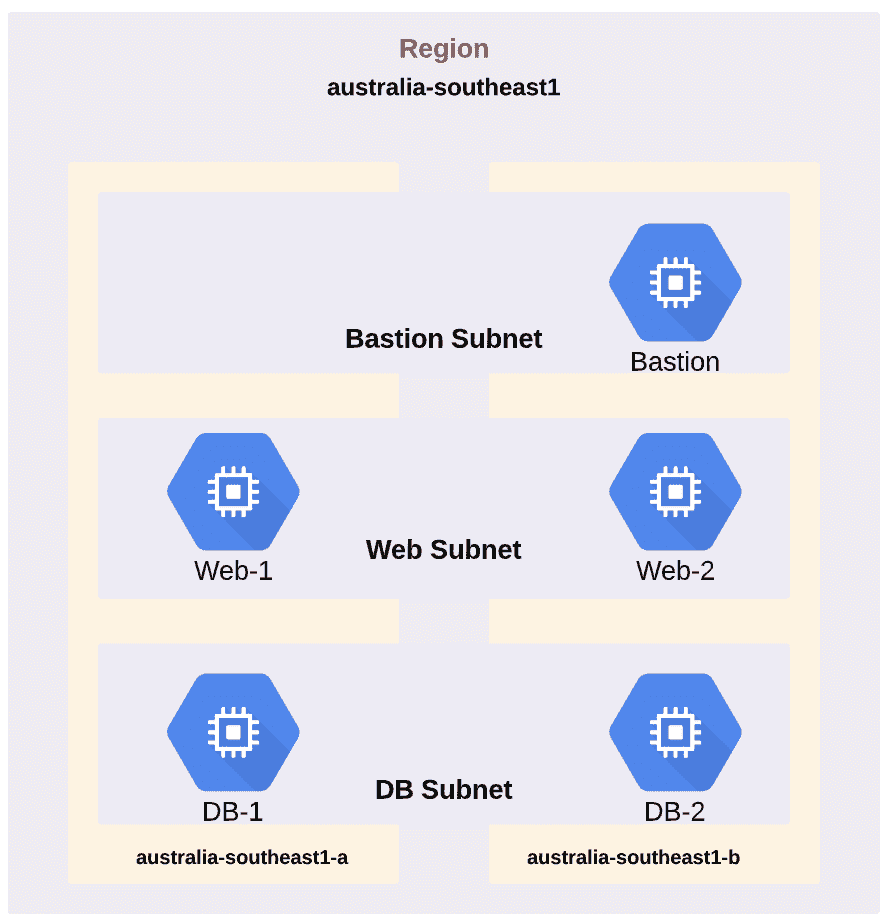

本章将涵盖以下内容：

+   安装 GCP SDK

+   构建 Ansible 清单

+   验证您的 GCP 账户

+   创建 GCP VPC 网络

+   创建子网

+   在 GCP 中部署防火墙规则

+   在 GCP 中部署虚拟机

+   调整 VPC 内的路由

+   使用 Ansible 验证 GCP 部署

+   使用 Ansible 取消部署 GCP 资源

# 技术要求

为了开始使用 GCP，我们需要创建一个账户。您可以在[`cloud.google.com/free/`](https://cloud.google.com/free/)上设置一个免费的 GCP 账户。

本章中使用的 GitHub 代码可以在[`github.com/PacktPublishing/Network-Automation-Cookbook/tree/master/ch9_gcp`](https://github.com/PacktPublishing/Network-Automation-Cookbook/tree/master/ch9_gcp)找到。

本章基于以下软件版本：

+   CentOS 7

+   Ansible 2.9

+   Python 3.6.8

查看以下视频以查看代码的实际操作：

[`bit.ly/3erVlSN`](https://bit.ly/3erVlSN)

# 安装 GCP SDK

在本教程中，我们将概述如何安装所需的 Python 库，以便开始使用 Ansible 与 GCP 编排系统进行交互。这一步是强制性的，因为必须在 Ansible 控制机器上安装所需的 Python 库，以便所有 Ansible GCP 模块正常工作。

# 准备工作

您需要在机器上拥有`sudo`访问权限才能安装 GCP Python 库。您还需要安装 Python 和 Python pip 包，我们将使用它来安装 GCP 包。

# 操作步骤...

1.  按照以下代码安装`requests`包：

```
$ sudo pip3 install requests
```

1.  按照以下代码安装 Google 认证包：

```
$ sudo pip3 install google-auth
```

1.  创建一个名为`ch9_gcp`的新文件夹，用于存放本章的所有代码：

```
$ mkdir ch9_gcp
```

# 工作原理...

默认安装的 Ansible 不包括执行 GCP 云模块所需的所有必需的 Python 模块。在本教程中，我们安装了所有 GCP 模块所需的两个 Python 包。第一个包是`requests`包，主要用于调用 Google 编排系统的 REST API 调用，另一个包是`google-auth`包，用于对 API 进行身份验证。

# 另请参阅...

有关如何使用 Ansible 开始与 GCP 进行交互的更多信息，请参阅[`docs.ansible.com/ansible/latest/scenario_guides/guide_gce.html`](https://docs.ansible.com/ansible/latest/scenario_guides/guide_gce.html)。

# 构建 Ansible 清单

在本教程中，我们将概述如何构建一个 Ansible 清单，以描述我们将在 GCP 公共云中构建的网络基础架构。这是一个强制性的步骤，我们需要采取这一步骤来定义我们在其中部署基础架构的所有地区的所有 VPC 网络。

# 操作步骤...

1.  在`ch9_gcp`目录中创建`hosts`文件，并填入以下数据：

```
$ cat hosts

[gcp_vpc]
demo_gcp_vpc
```

1.  创建`ansible.cfg`文件，并填入以下内容：

```
$ cat ansible.cfg

[defaults]
inventory=hosts
retry_files_enabled=False
gathering=explicit
host_key_checking=False
action_warnings=False
```

1.  创建`group_vars`文件夹和`gcp_vpc.yml`，其中将包含定义我们在此 VPC 中的基础架构的所有变量：

```
$ mkdir -p group_var/gcp_vpc.yml
```

1.  在我们的主文件夹（`ch9_gcp`）中创建`roles`目录。该文件夹将包括我们用来创建 GCP 基础架构的所有角色：

```
$ mkdir -p roles
```

# 工作原理...

我们创建了`hosts` Ansible 清单文件，并声明了我们将在 GCP 云中配置的所有 VPC。在我们的示例设置中，我们有一个单独的 VPC，所以我们创建了一个名为`gcp_vpc`的单一组，其中包括我们的 VPC（`demo_gcp_vpc`）。

我们创建了`group_vars/gcp_vpc.yml`文件，其中将包含我们在此 VPC 中定义基础架构的所有变量。

此时，我们的目录布局如下：

```
$ tree ch9_gcp
 .
 ├── ansible.cfg
 ├── group_vars
 │ └── gcp_vpc.yml
 ├── hosts
 └── roles
```

# 对 GCP 帐户进行身份验证

在本教程中，我们将概述如何创建所需的凭据，以便从 Ansible 对我们的 GCP 帐户进行编程身份验证。这是您需要采取的强制步骤，以便能够在以下教程中运行任何 Ansible 模块。

# 准备工作

Ansible 控制器必须具有互联网访问权限。此外，执行这些步骤的用户必须具有 GCP 控制台的管理员访问权限，以便创建所需的资源以启用与 GCP API 的编程交互。

# 如何做...

1.  使用管理员帐户登录到 GCP 控制台。

1.  从主控制台中，选择 IAM & admin | Manage Resources。在 GCP 中创建一个新项目，该项目将容纳我们在 GCP 中构建的所有基础设施：

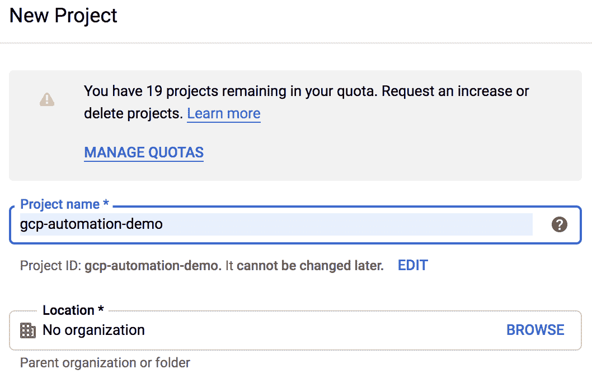

1.  从主控制台转到 IAM & admin | Service accounts：

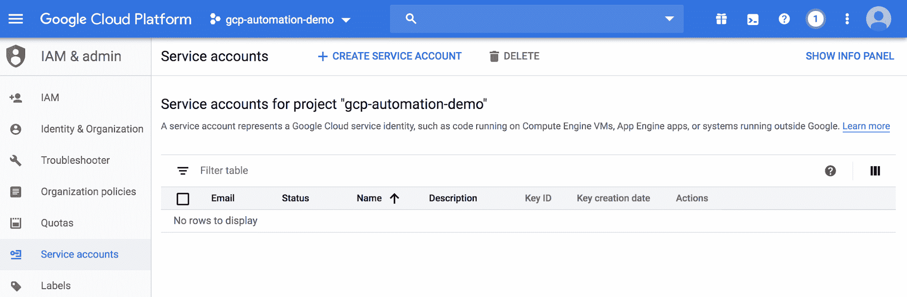

1.  为新的 Ansible 用户创建一个新的服务帐户：

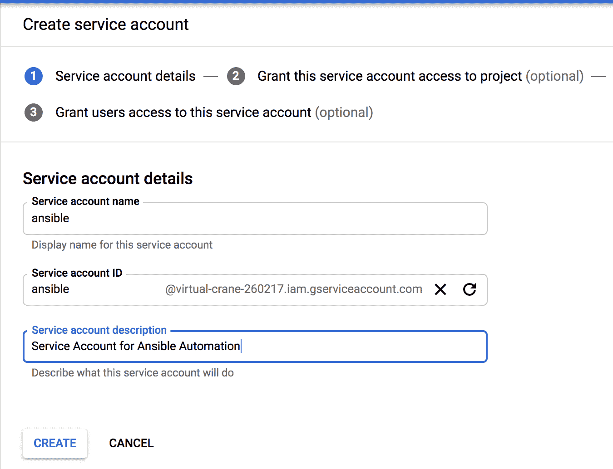

1.  为这个新的服务帐户分配适当的角色，以便您可以在此 GCP 项目中创建/编辑/删除资源：

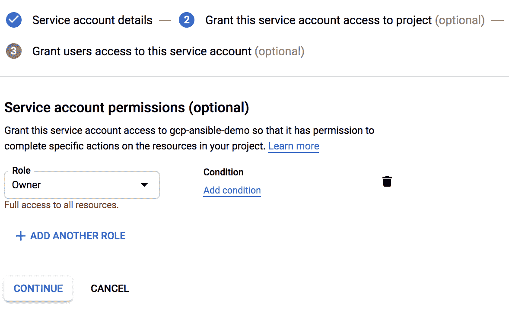

1.  创建并下载将用于对此用户进行身份验证的私钥：

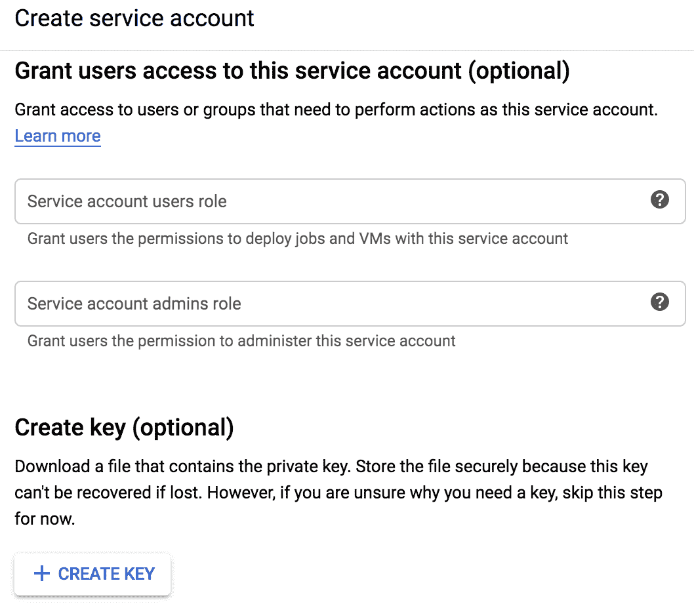

1.  将下载的 JSON 密钥文件复制到项目目录`ch9_gcp`并将其重命名为`gcp_ansible_secret.json`。

1.  在 GCP 控制台上，选择 API & Services 并为当前项目启用 Google Compute Engine API：

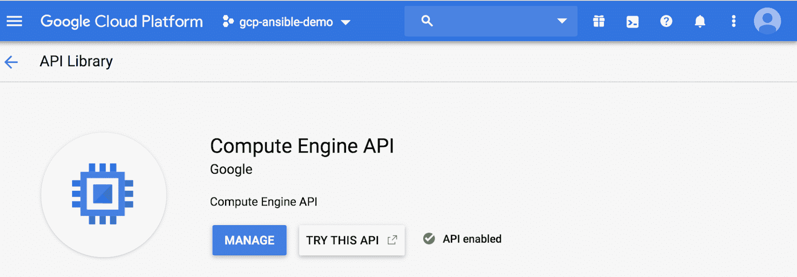

# 它是如何工作的...

为了能够以编程方式访问 GCP API（这是 Ansible 与 GCP 云通信以配置资源的方式），我们需要在我们的 GCP 项目中创建一个称为服务帐户的特殊帐户。此服务帐户类似于用户，但只能访问 GCP 项目的 API。我们创建了此服务帐户并将其称为 Ansible，并为其分配了项目所有者角色，以便在 GCP 项目中具有创建资源的全部权限（在生产环境中，应为此服务帐户分配更严格的角色）。

为了使用此服务帐户对 GCP API 进行身份验证，GCP 为我们提供了一个 JSON 文件，其中包含此帐户的身份信息。此 JSON 文件中包含的主要参数如下：

+   此服务帐户的私钥

+   此帐户的类型

+   `Project_id`

+   `Client_id`

+   `client_email`

我们保存这个 JSON 文件并将其复制到我们的目录中，因为我们将在所有的 playbooks 中引用它，以便在 GCP 云上配置资源。最后一步是在我们的 GCP 项目中启用 API；我们需要启用 GCP 计算引擎 API，以便开始与此 API 进行交互，因为默认情况下，在 GCP 项目中 API 访问是被禁用的。

# 还有更多...

保存所有身份验证信息以对 GCP API 进行身份验证的 JSON 文件是一个关键文件，应该进行安全保护，因此我们将使用 Ansible vault 来保护此文件。

我们创建了一个名为`vault_pass`的新文件，其中包含我们的 Ansible vault 密码，并更新我们的`ansible.cfg`文件以指向它，如下面的代码所示：

```
$ cat ansible.cfg

[defaults]
 vault_password_file=vault_pass
```

我们使用 Ansible vault 加密 JSON 文件，如下面的代码所示：

```
$ ansible-vault encrypt gcp-ansible-secret.json
```

在这个阶段，我们的 JSON 文件是安全的，所有内容都使用`vault_pass`文件中声明的密码进行加密。

# 另请参阅...

有关如何在 GCP 中创建新服务账号的更多信息，请访问[`cloud.google.com/iam/docs/creating-managing-service-accounts`](https://cloud.google.com/iam/docs/creating-managing-service-accounts)。

# 创建 GCP VPC 网络

在 GCP 中，VPC 是用于对所有资源进行分组的主要网络构造。我们可以将它们视为云中的虚拟数据中心。我们需要定义我们的 VPC，以准备好我们的云环境来托管我们的应用程序。在这个示例中，我们将概述如何在 GCP 中定义和配置 VPC。

# 准备工作

Ansible 控制机必须连接到具有对 GCP 公共 API 端点的可达性的互联网，并且 GCP 帐户应按照前面的示例进行配置。

# 操作步骤...

1.  创建一个名为`gcp_account_info.yml`的新的 YAML 文件，并包含我们的 GCP 登录参数的以下数据：

```
$ cat gcp_account_info.yml
 ---
 service_account_file: gcp_credentials.json
 project: "gcp-ansible-demo"
 auth_kind: serviceaccount
```

1.  创建一个名为`gcp_net_build`的新 Ansible 角色，如下所示：

```
$ cd roles
$ ansible-galaxy init gcp_net_build
```

1.  更新`gcp_net_build/tasks/main.yml`文件，添加以下任务以创建我们的 VPC：

```
- name: Create a New GCP VPC
 gcp_compute_network:
 name: "{{ vpc_name | regex_replace('_','-') }}"
 routing_config:
 routing_mode: "REGIONAL"
 auto_create_subnetworks: no
 state: present
 auth_kind: "{{ auth_kind }}"
 project: "{{ project }}"
 service_account_file: "{{ service_account_file }}"
 register: gcp_vpc
 tags: gcp_vpc
```

1.  创建`group_vars`文件夹，并为 VPC 创建`gcp_vpc.yml`文件，包括以下数据：

```
$ cat group_vars/gcp_vpc.yml
 ---
 vpc_name: ansible-demo-vpc
```

1.  创建`pb_gcp_env_build.yml`剧本，包括以下任务以读取保险库加密的 JSON 文件：

```
---
- name: Build GCP Environment
 hosts: all
 connection: local
 gather_facts: no
 force_handlers: true
 vars_files:
 - gcp_account_info.yml
 tasks:
 - name: Read the Vault Encrypted JSON File
 copy:
 content: "{{ lookup('file','gcp-ansible-secret.json') }}"
 dest: "{{ service_account_file }}"
 notify: Clean tmp Decrypted Files
 tags: always
```

1.  使用以下任务更新`pb_gcp_env_build.yml`剧本以创建所需的 VPC：

```
 - name: Build GCP Network
 import_role:
 name: gcp_net_build
 tags: gcp_net_build
```

1.  更新剧本，包括以下处理程序以删除临时 JSON 凭据文件，如下所示：

```
 handlers:
 - name: Clean tmp Decrypted Files
 file:
 path: "{{ service_account_file }}"
 state: absent
```

# 工作原理...

在这个示例中，我们在之前创建的项目中创建并部署了 GCP VPC。我们使用了 Ansible 角色来构建 GCP 网络的所有组件，第一个任务是使用 Ansible 模块`gcp_compute_network`创建 VPC。

为了使用任何 Ansible GCP 模块，我们需要对每个模块触发的每个 API 调用进行身份验证，并且我们需要提供以下信息以验证 API 调用：

+   `Auth_kind`：身份验证类型—在我们的情况下是`serviceaccount`。

+   `Project`：这是我们创建的当前项目的项目名称。

+   `Service_account_file`：这是我们创建服务账号时下载的 JSON 文件。

由于我们使用 Ansible vault 来加密保存所有身份验证信息的 JSON 文件的所有内容，因此我们需要在剧本执行期间解密此文件以使用该文件中的数据。此外，由于我们不直接读取此 JSON 文件的内容，而是使用所有 GCP Ansible 模块中的`serivce_account_file`参数指向它，我们创建了一个任务来使用`lookup`模块读取此 JSON 文件的内容，并将这些数据存储在临时文件中。通过这种方法，我们可以读取此 JSON 文件中的加密数据，并创建一个新的临时 JSON 文件，其中包含明文数据。我们还可以使用此临时 JSON 文件作为`service_account_file`的输入。我们使用了一个处理程序任务来在播放结束时删除此临时文件。在播放级别上，我们使用了`force_handlers`来确保运行处理程序部分内的所有任务，即使我们播放中的任何任务失败。这意味着我们确保保存我们的凭据的明文 JSON 文件始终被删除。

我们将所有前述参数分组并放入`gcp_account_info.yml`文件中，并将此文件包含在我们的剧本中。我们使用`gcp_compute_network`模块创建了 VPC，并提供了以下信息以部署 VPC：

+   `Name`：我们新 VPC 的名称。

+   `Auto_create_subnetwork`：将其设置为`no`，因为我们想要创建自定义 VPC 网络，而不是自动模式 VPC 网络。

+   `Routing_config`：将其设置为`Regional`，以阻止不同区域子网之间的路由传播。

我们需要强调的一个明显的点是，GCP 中的 VPC 具有全局范围，这意味着它们不绑定到特定区域，而是跨越 GCP 云中的所有区域。另一方面，子网是特定于区域的；然而，由于我们创建了自定义 VPC，在任何区域默认情况下都不会创建子网，我们完全控制在哪里定义我们的子网。在 VPC 范围方面，这种逻辑与 AWS 和 GCP 的 VPC 范围有所不同。

使用`gcp_compute_network`模块创建 VPC 时，我们必须提供 VPC 名称。在这个任务中，我们使用了`regex_replace` Ansible 过滤器，以确保 VPC 名称不包含下划线字符(`_`)，因为这不是 VPC 名称中的有效字符。我们使用这个过滤器来替换下划线的任何出现，用破折号(`-`)来确保 VPC 名称符合 GCP VPC 命名标准。

一旦我们运行我们的 playbook，我们可以看到 VPC 已经创建，在 GCP 控制台上可以看到：

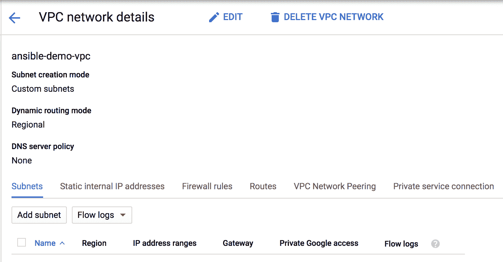

以下片段概述了 Ansible 模块在创建 VPC 后返回的参数：

```
ok: [demo_gcp_vpc] => {
 "gcp_vpc": {
 "autoCreateSubnetworks": false,
 "changed": true,
 "creationTimestamp": "2019-11-26T12:49:51.130-08:00",
 "failed": false,
 "id": "8661055357091590400",
 "kind": "compute#network",
 "name": "demo-gcp-vpc",
 "routingConfig": {
 "routingMode": "REGIONAL"
 },
 "selfLink": "https://www.googleapis.com/compute/v1/projects/gcp-ansible-demo/global/networks/demo-gcp-vpc"
 }
} 
```

这些信息很重要，我们将在后续的教程中使用它来创建子网，以便我们可以注册此任务的输出到`gcp_vpc`变量中，以便在以后的任务中引用它。

# 还有更多...

默认情况下，当我们在 GCP 中创建一个新项目时，会为该项目创建一个名为`default`的自动模式 VPC。建议我们删除这个默认网络，因为我们将依赖我们的自定义 VPC 来容纳所有的计算工作负载。

我们可以在我们的项目中看到这个默认 VPC 是存在的，并且它在 GCP 云中的每个区域都有子网，如下面的截图所示：

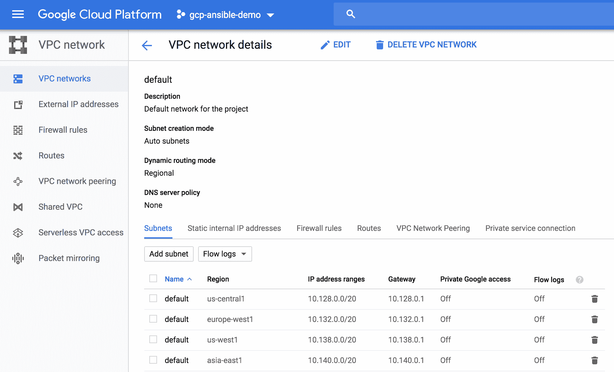

我创建了一个名为`pb_gcp_delete_default_vpc.yml`的 playbook 来删除默认 VPC 以及附加到它的所有默认防火墙规则。

# 另请参阅...

有关 Ansible 中 GCP 虚拟私有云模块以及此模块支持的所有其他参数的更多信息，请访问[`docs.ansible.com/ansible/latest/modules/gcp_compute_network_module.html#gcp-compute-network-module`](https://docs.ansible.com/ansible/latest/modules/gcp_compute_network_module.html#gcp-compute-network-module)。

# 创建子网

我们使用子网来分隔我们的 GCP VPC，这是一个工具，允许我们将计算工作负载放入特定区域。此外，子网为我们提供了工具，将我们的虚拟网络分隔成不同的路由和安全域，我们可以控制以提供不同的路由和安全行为在每个子网内。在这个教程中，我们将概述如何在 GCP 云中定义和配置子网。

# 准备工作

Ansible 控制机必须连接到互联网，可以访问 GCP 公共 API 端点，并且 GCP 帐户应该按照前面的教程进行配置。此外，GCP VPC 需要按照前面的教程进行创建。

# 如何做...

1.  使用以下代码更新`group_vars/gcp_vpc.yml`文件中的子网数据：

```
$ cat group_vars/gcp_vpc.yml

subnets:
 - name: anz-web
 cidr: 10.1.1.0/24
 region: australia-southeast1

 - name: anz-db
 cidr: 10.1.2.0/24
 region: australia-southeast1

 - name: anz-bastion
 cidr: 10.1.3.0/24
 region: australia-southeast1
```

1.  使用以下任务更新`gcp_net_build/tasks/main.yml`文件来创建我们的子网：

```
- name: Create Subnets
 gcp_compute_subnetwork:
 name: "{{ subnet.name }}"
 ip_cidr_range: "{{ subnet.cidr }}"
 network: "{{ gcp_vpc}}"
 region: "{{ subnet.region }}"
 state: present
 auth_kind: "{{ auth_kind }}"
 project: "{{ project }}"
 service_account_file: "{{ service_account_file }}"
 loop: "{{ subnets }}"
 loop_control:
 loop_var: subnet
 register: gcp_subnets
```

# 工作原理...

在这个教程中，我们创建了我们将在部署中使用的子网。在我们的子网定义中需要注意的第一件事是，我们为每个子网定义了一个区域。这是强制性的，因为正如我们讨论的那样，在 GCP 中，子网具有区域范围，而 VPC 具有全局范围。我们为每个子网定义了一个 CIDR 范围，以及它的名称。

我们使用`gcp_compute_subnet`模块来创建所有子网。我们使用了之前讨论过的相同参数进行身份验证。为了创建子网，我们指定了以下参数：

+   `名称`：我们的子网名称。

+   `区域`：此子网将部署的区域。

+   `Ip_cidr_range`：此子网的 CIDR 块。

+   `网络`：我们希望此子网成为其中一部分的 VPC 的引用。我们从创建 VPC 的输出中获取此参数。我们提供`gcp_vpc`变量，这是来自我们 VPC 创建任务的注册变量。

运行 playbook 后，我们可以看到所有子网都已创建，如下截图所示：

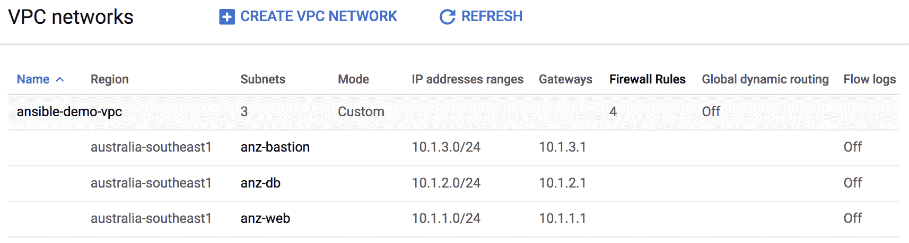

# 另请参阅...

有关 Ansible 中 GCP 子网模块以及此模块支持的所有其他参数的更多信息，请访问[`docs.ansible.com/ansible/latest/modules/gcp_compute_subnetwork_module.html`](https://docs.ansible.com/ansible/latest/modules/gcp_compute_subnetwork_module.html)。

# 在 GCP 中部署防火墙规则

GCP 提供了许多工具，以强制执行 GCP 云客户环境中的安全性。防火墙规则是 GCP 中支持的最基本的安全工具之一，以实施 VPC 中所有工作负载的第一级防御。在本配方中，我们将概述如何在 GCP 云中定义和配置防火墙规则。

# 准备工作

Ansible 控制机必须连接到互联网，并能够访问 GCP 公共 API 端点，GCP 帐户应按照前面的配方进行配置。此外，VPC 和子网应按照前面的配方进行配置。

# 如何做...

1.  使用以下防火墙规则更新`group_vars/gcp_vpc.yml`，以保护 Web 和 DB 层之间的流量。

```
$ cat group_vars/gcp_vpc.yml

fw_rules:
 - name: allow_sql_from_anz-web_to_anz-db
 type: allow
 direction: ingress
 priority: 10
 apply_to: anz-db
 src_tag: anz-web
 dest_tag:
 protocol: tcp
 port: 3389
 state: present
```

1.  使用以下防火墙规则更新`group_vars/gcp_vpc.yml`，以保护流量到 Web 层：

```
 - name: allow_internet_to-anz-web
 type: allow
 direction: ingress
 priority: 10
 src: 0.0.0.0/0
 apply_to: anz-web
 protocol: tcp
 port: 80,443
 state: present
```

1.  使用以下防火墙规则更新`group_vars/gcp_vpc.yml`，以允许`ssh`仅限于堡垒主机：

```
 - name: allow_ssh_to_anz-bastion
 type: allow
 direction: ingress
 priority: 10
 src: 0.0.0.0/0
 apply_to: anz-bastion
 protocol: tcp
 port: 22
 state: present

 - name: allow_ssh_from_bastion_only
 type: allow
 direction: ingress
 priority: 10
 src_tag: anz-bastion
 apply_to: anz-web,anz-db
 protocol: tcp
 port: 22
 state: present
```

1.  使用以下任务更新`roles/gcp_net_build/tasks.main.yml`文件以创建所有必需的防火墙规则：

```
- name: Create Allow Firewall Rules
 gcp_compute_firewall:
 name: "{{ rule.name | regex_replace('_','-') }}"
 network: {selfLink: "{{ gcp_vpc.selfLink }}"}
 priority: "{{ rule.priority | default(omit) }}"
 direction: "{{ rule.direction | upper | mandatory }}"
 allowed:
 - ip_protocol: "{{ rule.protocol }}"
 ports: "{{ (rule.port|string).split(',') }}"
 source_ranges: "{{ rule.src | default(omit) }}"
 source_tags: "{{ omit if rule.src_tag is not defined else rule.src_tag.split(',') }}"
 destination_ranges: "{{ rule.dest | default(omit) }}"
 target_tags: "{{ omit if rule.apply_to is not defined else rule.apply_to.split(',') }}"
 auth_kind: "{{ auth_kind }}"
 project: "{{ project }}"
 service_account_file: "{{ service_account_file }}"
 loop: "{{ fw_rules | selectattr('type','equalto','allow') | list }}"
 loop_control:
 loop_var: rule
 tags: gcp_fw_rules
```

# 工作原理...

GCP 中的防火墙规则是应用于 VPC 中的主机的有状态防火墙规则。GCP 中的防火墙规则可以应用于入站或出站方向，并且有一些默认防火墙规则被定义并应用于 VPC 中的所有主机，如下所示：

+   在入站方向上，对于任何目标到新自定义 VPC 中的任何主机的所有流量，默认情况下会有一个`拒绝所有`。

+   在出站方向上，对于新自定义 VPC 中的任何主机发出的所有流量，默认情况下会有一个`允许所有`。

有了上述默认规则，并且由于所有防火墙规则都是有状态的，VPC 中的任何主机发起的任何通信都将被允许；但是，来自 VPC 外部的任何发起的流量将被拒绝。

GCP 防火墙规则可以根据以下标准匹配流量：

+   源/目标 IPv4 范围

+   IP 协议号

+   TCP/UDP 端口号

+   网络标记

除了网络标记之外，所有前述标准都是相当明显的。网络标记是特殊的元数据，可应用于 VPC 中的任何主机，以标识和分组这些主机。我们可以使用这些网络标记来作为防火墙规则中的匹配标准，并且仅将防火墙规则应用于 VPC 中的一部分主机。

有了所有这些信息，我们希望在示例网络中的主机上实施以下安全策略：

+   所有 HTTP/HTTPs 流量应仅允许到我们所有的 Web 服务器。

+   外部的 SSH 访问应该仅限于我们的堡垒主机。

+   对我们的 Web 和 DB 服务器的 SSH 访问仅限于堡垒主机。

+   仅允许来自 Web 到 DB 服务器的 SQL 流量。

我们在一个新的数据结构`fw_rules`中定义了我们的防火墙规则，这是我们需要应用于我们的 VPC 的所有规则的列表。我们在所有策略中使用网络标记，以便将正确的防火墙规则应用于应强制执行此规则的主机。

我们使用 Ansible 模块`gcp_compute_firewall`来迭代所有防火墙策略并应用它们。在此模块中，我们可以定义匹配条件，可以基于源/目标 IPv4 地址范围，也可以基于源和目标网络标记。我们定义了我们的任务，以便如果在我们的防火墙规则中未定义参数（例如，源 IPv4 范围），我们应该从提供给模块的参数列表中删除此参数。我们使用`omit`过滤器来实现此逻辑。

GCP 中的所有防火墙规则都有优先级字段，该字段定义了规则相对于其他规则的优先级以及在处理方面的优先级。没有特定优先级的规则将获得优先级值 1,000。GCP 应用于 VPC 的默认防火墙规则具有优先级值`65535`，因此我们定义的任何规则都将优先于它们。在所有规则中，我们指定优先级值为`10`。

运行以下任务后，我们可以看到以下规则应用于我们的 VPC，如下截图所示：

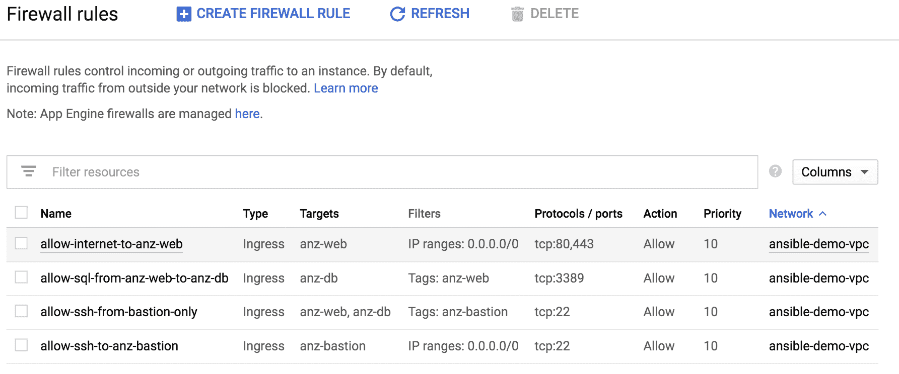

# 另请参阅...

有关 Ansible 中 GCP 防火墙模块以及此模块支持的所有其他参数的更多信息，请访问[`docs.ansible.com/ansible/latest/modules/gcp_compute_firewall_module.html`](https://docs.ansible.com/ansible/latest/modules/gcp_compute_firewall_module.html)。

# 在 GCP 中部署 VMs

在本教程中，我们将概述如何在 GCP 中的 VPC 中使用我们部署的正确子网部署虚拟机（使用 Google Compute Engine）。我们还将分配正确的网络标记，以强制执行这些机器上的正确安全策略。

# 准备工作

Ansible 控制机必须连接到具有对 GCP 公共 API 端点的可达性的互联网，并且 VPC、子网和防火墙规则需要按照前几章中概述的方式部署。

# 操作步骤...

1.  更新`group_vars/gcp_vpc.yml`文件，包括描述我们将在所有 VM 上使用的 flavor 和 OS 的所需信息：

```
$ cat group_vars/gcp_vpc.yml

compute_node_flavor: f1-micro
compute_node_images: projects/centos-cloud/global/images/family/centos-7
compute_node_image_size: 10
```

1.  更新`group_vars/gcp_vpc.yml`文件，包括描述我们计算节点所需信息：

```
$ cat group_vars/gcp_vpc.yml
compute_nodes:
 - name: web-server-1
 network: anz-web
 has_internet: yes
 zone: australia-southeast1-a

< -- Output Omitted for Brevity -- >

 - name: db-server-1
 network: anz-db
 has_internet: no
 zone: australia-southeast1-a

< -- Output Omitted for Brevity -- >

 - name: bastion-host
 network: anz-bastion
 ip: 10.1.3.253
 has_internet: yes
 ip_forwarding: yes
 zone: australia-southeast1-a
```

1.  创建一个新的 Ansible 角色（`gcp_vm_build`）来在 GCP 上部署 VM 工作负载：

```
$ cd roles
$ ansible-galaxy init gcp_vm_build
```

1.  使用以下任务更新`gcp_vm_build/tasks/main.yml`文件以创建 VM 的磁盘：

```
- name: create a disk for {{ node.name }}
 gcp_compute_disk:
 name: "{{ node.name | regex_replace('_','-') }}-disk"
 size_gb: "{{compute_node_image_size }}"
 source_image: "{{ compute_node_images }}"
 zone: "{{ node.zone }}"
 auth_kind: "{{ auth_kind }}"
 project: "{{ project }}"
 service_account_file: "{{ service_account_file }}"
 state: present
 register: gcp_vm_disk

```

1.  使用以下任务更新`gcp_vm_build/tasks/main.yml`文件以创建没有公共 IP 地址的 VM：

```
- name: create a {{ node.name }} instance with no Internet
 gcp_compute_instance:
 name: "{{ node.name | regex_replace('_','-') }}"
 machine_type: "{{ compute_node_flavor }}"
 disks:
 - source: "{{ gcp_vm_disk }}"
 boot: 'true'
 network_interfaces:
 - network: "{{ gcp_vpc }}"
 subnetwork: "{{ gcp_subnets.results |
 selectattr('name','equalto',node.network) |
 list | first }}"
 metadata:
 tier: "{{ node.name.split('-')[0] }}"
 tags:
 items: "{{ node.network }}"
 zone: "{{ node.zone }}"
 auth_kind: "{{ auth_kind }}"
 project: "{{ project }}"
 service_account_file: "{{ service_account_file }}"
 state: present
 when: not node.has_internet
```

1.  使用以下任务更新`gcp_vm_build/tasks/main.yml`文件以创建具有公共 IP 地址的 VM：

```
- name: create an {{ node.name }} instance with Internet
 gcp_compute_instance:
 name: "{{ node.name | regex_replace('_','-') }}"
 machine_type: f1-micro
 can_ip_forward: "{{ node.ip_forwarding if node.ip_forwarding is defined else 'no' }}"
 disks:
 - source: "{{ gcp_vm_disk }}"
 boot: 'true'
 network_interfaces:
 - network: "{{ gcp_vpc }}"
 network_ip: "{{ node.ip if node.ip is defined else omit }}"
 subnetwork: "{{ gcp_subnets.results |
 selectattr('name','equalto',node.network) |
 list | first }}"
 access_configs:
 - name: External NAT
 type: ONE_TO_ONE_NAT
 metadata:
 tier: "{{ node.name.split('-')[0] }}"
 zone: "{{ node.zone }}"
 tags:
 items: "{{ node.network }}"
 auth_kind: "{{ auth_kind }}"
 project: "{{ project }}"
 service_account_file: "{{ service_account_file }}"
 state: present
 register: vm_data
 when: node.has_internet
```

1.  使用以下任务更新`pb_gcp_env_build.yml`剧本以创建我们定义的所有所需 VM：

```
 - name: Build VM Instances
 include_role:
 name: gcp_vm_build
 loop: "{{ compute_nodes }}"
 loop_control:
 loop_var: node
```

# 工作原理...

根据我们示例网络的设计，我们将在两个不同的可用性区域中部署两个 Web 服务器和两个数据库服务器。然后，我们将在单个 AZ 中构建一个堡垒主机，因为它仅用于管理。我们在`compute_nodes`变量中定义了所有所需的机器，并且对于每台机器，我们指定了以下我们在规划期间将使用的参数：

+   `名称`：机器的名称

+   `网络`：指定我们将部署此计算机的子网，并强制执行正确的网络标记

+   `区域`：指定我们要部署此计算机的区域

+   `has_internet`：表示此计算机是否应获取公共 IP 地址

我们创建了一个新的角色来部署我们的计算工作负载，并定义了以下主要部分：

+   **为 VM 创建磁盘**：初始任务是创建将容纳这些机器的操作系统的磁盘。我们使用`gcp_compute_disk` Ansible 模块来定义这些磁盘，并指定了以下参数：

+   `名称`：这是此磁盘的名称。

+   `Image_source`：指定机器将运行的操作系统-在我们的示例中，所有机器都将运行 CentOS。

+   `区域`：指定将创建此磁盘的可用性区域。

+   `Size_gb`：指定将要部署的磁盘大小。

+   **创建 VMs**：在创建磁盘之后，我们使用`gcp_compute_instance`模块创建了 VMs，该模块使用以下参数来部署 VM：

+   `Name`：这个 VM 的名称。

+   `Machine_type`：指定我们用于这些机器的实例类型。

+   `Disks`：一个字典，指定我们将与这台机器一起使用的磁盘。我们提供`gcp_vm_disk`变量，这是我们在前一个任务中部署磁盘时获得的。

+   `Network_interfaces`：一个字典，指定我们需要在哪个子网和 VPC 上部署这个实例。对于 VPC，我们提供`gcp_vpc`变量，这是我们在部署 VPC 时获得的值。

+   `Zone`：指定我们将在哪个可用区部署我们的 VM。

+   `标签`：指定我们将分配给这些 VM 的网络标签。这些标签与我们在防火墙规则中使用的标签相同，以便引用我们的计算节点。

除了前面的参数，我们还有`access_configs`参数（它是一个字典），用于指定计算节点是否会获得公共 IP 地址。如果 VM 获得公共 IP 地址，我们将`access_configs`中的 name 参数设置为 external NAT，type 参数设置为`ONE_TO_ONE_NAT`。如果机器不需要公共 IP 地址，我们将省略`access_configs`字典。

在我们的设置中，所有的 Web 服务器和堡垒主机都应该获得一个公共 IP 地址；然而，我们的数据库服务器不应该直接连接互联网，因此不应该为它们分配公共 IP 地址。我们使用`has_internet`参数来区分这一点，在计算节点定义中使用这个参数来选择在 VM 配置期间使用的正确任务。

一旦我们使用新角色运行剧本来创建 VMs，我们将看到每个 VM 的所有磁盘都已创建，如下截图所示：

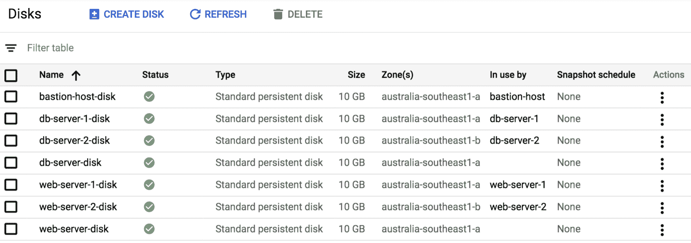

此外，所有的 VM 都是在正确的子网中创建的，如下截图所示：

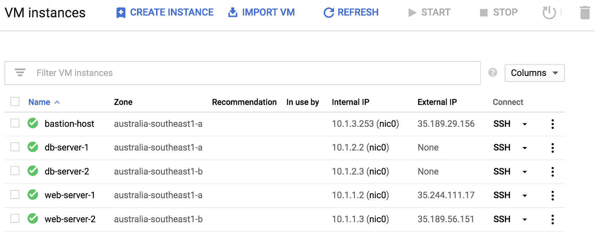

一旦我们的 VM 使用了正确的网络标签创建，我们可以验证我们的防火墙规则只应用于基于这些网络标签的 VM。以下代码段概述了防火墙规则`allow-internet-to-anz-web`以及它是如何仅应用于 Web 服务器的：

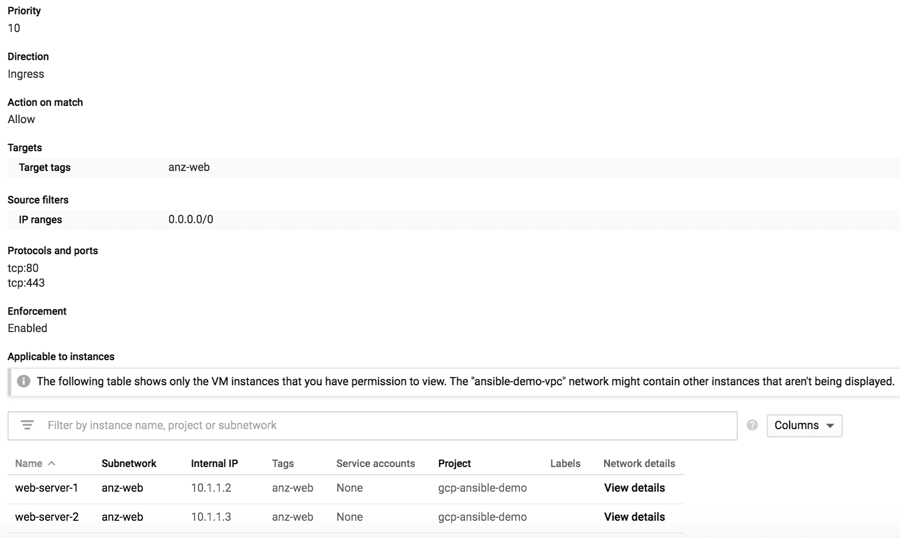

# 另请参阅...

有关 Ansible 中 GCP 实例和磁盘模块以及这些模块支持的所有其他参数的更多信息，请访问以下链接：

+   [`docs.ansible.com/ansible/2.8/modules/gcp_compute_instance_module.html#gcp-compute-instance-module`](https://docs.ansible.com/ansible/2.8/modules/gcp_compute_instance_module.html#gcp-compute-instance-module)

+   [`docs.ansible.com/ansible/latest/modules/gcp_compute_disk_module.html#gcp-compute-disk-module`](https://docs.ansible.com/ansible/latest/modules/gcp_compute_disk_module.html#gcp-compute-disk-module)

# 调整 VPC 内的路由

在这个配方中，我们将概述如何控制 GCP VPC 内的路由，以强制执行主机的自定义路由决策。这使我们能够完全控制 VPC 内主机的路由。

# 准备工作

Ansible 控制机必须连接到互联网，能够访问 GCP 公共 API 端点，并且 GCP 帐户应该按照前面的配方进行配置。此外，资源组、虚拟网络和子网应该按照前面的配方进行部署。

# 操作步骤...

1.  更新`group_vars/gcp_vpc.yml`文件，包括所需的路由数据，如下所示：

```
$ cat group_vars/gcp_vpc.yml
route_tables:
 - name: db_tier_rt
 subnet: db_tier
 routes:
 - name: Default Route
 prefix: 0.0.0.0/0
 nh: none
```

1.  更新`pb_gcp_env_build.yml`剧本，添加以下任务以在 GCP 中创建路由：

```
- name: Create the Route
 gcp_compute_route:
 name: "{{ route.name }}"
 dest_range: "{{ route.dest}}"
 network: {selfLink: "{{ gcp_vpc.selfLink }}"}
 next_hop_ip: "{{ route.nh }}"
 tags: "{{ route.apply_to.split(',') | default(omit) }}"
 state: present
 auth_kind: "{{ auth_kind }}"
 project: "{{ project }}"
 service_account_file: "{{ service_account_file }}"
 loop: "{{ cutom_routes }}"
 loop_control:
 loop_var: route
 tags: gcp_route
```

# 工作原理..

在我们的示例设置中，根据当前的路由和防火墙规则，我们的数据库服务器无法连接到互联网；但是，我们需要能够从这些服务器访问互联网，以安装软件或执行补丁。为了实现这个目标，我们将使用我们的堡垒主机作为 NAT 实例，为我们的数据库服务器提供互联网访问。为了实现这一目标，我们需要调整 VPC 中所有数据库服务器的路由。

在 GCP 中，我们有一个默认路由，指向 VPC 中的互联网网关。这个默认路由存在于 VPC 中，并应用于 VPC 内的所有主机。以下是我们 VPC 的路由表：

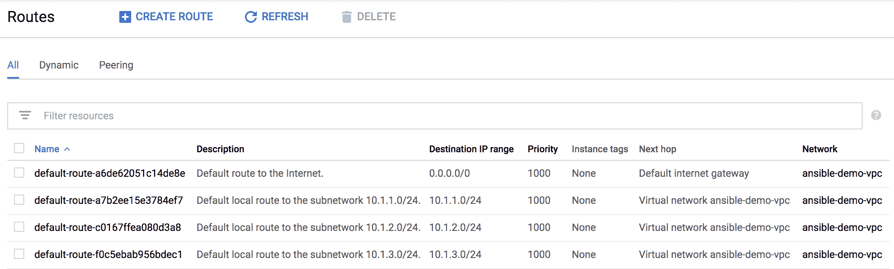

然而，由于现有的防火墙规则以及所有数据库服务器都没有外部公共 IP 地址，数据库服务器将无法访问互联网。我们需要调整数据库服务器的路由，指向执行 NAT 的堡垒主机。我们还需要保留原始的默认路由，因为这是我们的 Web 和堡垒主机用来访问互联网的主要路径。

我们使用`custom_routes`列表数据结构定义需要应用的自定义路由，并使用`gcp_compute_route` Ansible 模块循环遍历这个数据结构，创建所有需要的路由。我们使用在 DB 主机上应用的网络标记，以强制仅在具有此网络标记的主机上应用此路由。运行这个新任务后，VPC 的更新路由表如下截图所示：


我们可以将路由的下一跳设置为 IP 地址或实例标识；但是，为了简单起见，我们使用了 IP 地址，并在 VM 定义中选择了堡垒主机的静态 IP 地址，以便在我们的路由设置中轻松引用这个 IP 地址。

我们在主要 playbook 中创建了这个路由任务，因为我们需要有堡垒 VM 才能设置下一跳 IP 地址的路由。如果在 VM 被部署之前创建路由，路由将被创建；但是，任务将失败，并显示警告，指出我们的路由的下一跳 IP 地址不存在。

# 另请参阅...

有关 Ansible 中 GCP 路由模块和此模块支持的所有其他参数的更多信息，请转到[`docs.ansible.com/ansible/latest/modules/gcp_compute_route_module.html#gcp-compute-route-module`](https://docs.ansible.com/ansible/latest/modules/gcp_compute_route_module.html#gcp-compute-route-module)。

# 使用 Ansible 验证 GCP 部署

Ansible 提供了多个模块来收集我们在 GCP 中创建的不同资源的操作状态，我们可以使用这些模块来验证 GCP 云中我们网络资源的当前状态。这提供了一种编程方法来验证部署，而无需登录到**图形用户界面**（**GUI**）通过门户网站检查 GCP 中部署的不同组件的状态。在本示例中，我们将概述如何使用一些 Ansible 模块来验证我们部署的网络子网。

# 准备工作

Ansible 控制机必须连接到互联网，并能够到达 GCP 公共 API 端点，GCP 帐户应按照前面的示例进行配置。

# 如何做...

1.  创建一个新的`pb_gcp_net_validate.yml` playbook，并添加以下任务以收集 VPC 子网信息：

```
$ cat pb_gcp_net_validate.yml

---
- name: Build GCP Environment
 hosts: all
 connection: local
 gather_facts: no
 force_handlers: True
 vars_files:
 - gcp_account_info.yml
 tasks:
 - name: Get Subnet Facts
 gcp_compute_subnetwork_facts:
 region: "{{ subnets | map(attribute='region') | list | first }}"
 auth_kind: "{{ auth_kind }}"
 project: "{{ project }}"
 service_account_file: "{{ service_account_file }}"
 register: gcp_vpc_subnets
```

1.  使用以下任务更新 playbook 以验证部署的所有子网上的 IP 前缀：

```
 - name: Validate all Subnets are Deployed
 assert:
 that:
 - gcp_vpc_subnets['items'] | selectattr('name','equalto',item.name) |
 map(attribute='ipCidrRange') | list | first
 == item.cidr
 loop: "{{ subnets }}"
```

# 它是如何工作的...

我们创建了一个新的 playbook，用于验证我们在 GCP 项目中部署的所有子网。Ansible 提供多个模块来收集 GCP 中不同资源（子网、VPC、虚拟机等）的操作状态或事实。在本例中，我们使用`gcp_compute_subnetwork_facts`模块来收集我们部署的子网事实。我们将此模块返回的所有数据注册到一个新变量`gcp_vpc_subnets`中。最后，我们使用`assert`模块循环遍历所有子网定义，验证所有这些子网上分配的 IP 前缀是否正确并与我们的设计一致。

我们可以使用其他收集事实的模块来验证部署的其他方面，并使用多个`assert`语句来确保所有部署的资源与我们的设计一致。

# 另请参阅...

有关其他 GCP 收集事实的模块的更多信息，请访问以下链接：

+   [`docs.ansible.com/ansible/2.8/modules/gcp_compute_network_facts_module.html`](https://docs.ansible.com/ansible/2.8/modules/gcp_compute_network_facts_module.html)

+   [`docs.ansible.com/ansible/2.8/modules/gcp_compute_subnetwork_facts_module.html`](https://docs.ansible.com/ansible/2.8/modules/gcp_compute_subnetwork_facts_module.html)

# 使用 Ansible 销毁 GCP 资源

与使用自动化规模创建资源类似，一旦决定不再需要这些资源，我们可以销毁这些资源。我们使用与在 GCP 中创建资源相同的 Ansible 模块来销毁这些资源。

# 准备工作

Ansible 控制机必须连接到互联网，并能够访问 GCP 公共 API 端点，GCP 帐户应按照前面的示例进行配置。

# 如何操作...

1.  创建一个新的`pb_gcp_env_destroy.yml` playbook，并添加以下任务以读取保险柜加密的 JSON 文件：

```
$ cat pb_gcp_env_destroy.yml

---
- name: Decommission GCP Resources
 hosts: all
 connection: local
 force_handlers: True
 environment:
 GCP_SERVICE_ACCOUNT_FILE: "{{ service_account_file }}"
 GCP_AUTH_KIND: 'serviceaccount'
 vars_files:
 - gcp_account_info.yml
 tasks:
 - name: Read the Vault Encrypted JSON File
 copy:
 content: "{{ lookup('file','gcp-ansible-secret.json') }}"
 dest: "{{ service_account_file }}"
 notify: Clean tmp Decrypted Files
 tags: always
```

1.  更新`pb_gcp_env_destroy.yml` playbook，并添加以下任务以收集 VPC 信息：

```
 - name: Get VPC Facts
 gcp_compute_network_facts:
 project: "{{ project }}"
 register: gcp_vpc
```

1.  使用以下任务更新 playbook 以删除所有 VM：

```
 - name: Delete Instance {{ node.name }}
 gcp_compute_instance:
 name: "{{ node.name | regex_replace('_','-') }}"
 zone: "{{ node.zone }}"
 project: "{{ project }}"
 state: absent
 loop: "{{ compute_nodes }}"
 loop_control:
 loop_var: node
```

1.  使用以下任务更新 playbook 以删除我们在 VPC 中为所有 VM 创建的所有磁盘：

```
 - name: Delete disks for {{ node.name }}
 gcp_compute_disk:
 name: "{{ node.name | regex_replace('_','-') }}-disk"
 zone: "{{ node.zone }}"
 project: "{{ project }}"
 state: absent
 loop: "{{ compute_nodes }}"
 loop_control:
 loop_var: node
```

1.  使用以下任务更新 playbook 以删除 VPC 中的所有防火墙规则：

```
 - name: Delete All Firewall Rules
 gcp_compute_firewall:
 name: "{{ rule.name | regex_replace('_','-') }}"
 network: "{{ gcp_vpc }}"
 project: "{{ project }}"
 state: absent
 loop: "{{ fw_rules }}"
 loop_control:
 loop_var: rule
 tags: gcp_fw_rules
```

1.  使用以下任务更新 playbook 以删除 VPC 中的所有自定义路由：

```
- name: Delete all Routes
 gcp_compute_route:
 name: "{{ route.name }}"
 dest_range: "{{ route.dest}}"
 network: "{{ gcp_vpc }}"
 project: "{{ project }}"
 state: absent
 loop: "{{ custom_routes }}"
 loop_control:
 loop_var: route
 when:
 - custom_routes is defined
```

1.  使用以下任务更新 playbook 以删除 VPC 中的所有子网：

```
 - name: Delete GCP Subnets
 gcp_compute_subnetwork:
 name: "{{ subnet.name }}"
 ip_cidr_range: "{{ subnet.cidr }}"
 network: "{{ gcp_vpc }}"
 region: "{{ subnet.region }}"
 project: "{{ project }}"
 state: absent
 loop: "{{ subnets }}"
 loop_control:
 loop_var: subnet
```

1.  使用以下任务更新 playbook 以删除所有 VPC：

```
 - name: Delete GCP VPC
 gcp_compute_network:
 name: "{{ vpc_name | regex_replace('_','-') }}"
 project: "{{ project }}"
 state: absent
```

# 工作原理...

我们创建了一个新的 playbook，用于销毁我们样本网络设计中的所有资源。我们使用了与在 GCP 云中部署资源相同的模块；但是，我们使用了`state: absent`来删除所有这些资源。

在销毁资源时唯一需要注意的是删除这些资源的顺序。如果仍有依赖于要删除的资源的活动依赖资源，我们就不能删除任何资源。例如，我们不能在没有先删除使用此磁盘的 VM 的情况下删除磁盘。

运行 playbook 后，我们可以看到所有 VM 都已删除，如下面的截图所示：

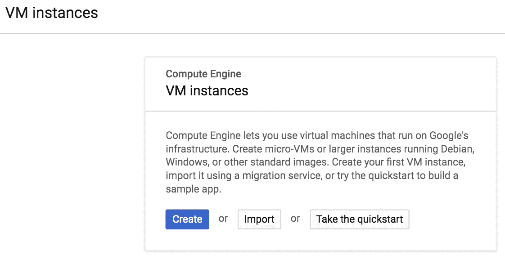

此外，所有我们的 VPC 和子网也已删除，如下面的截图所示：

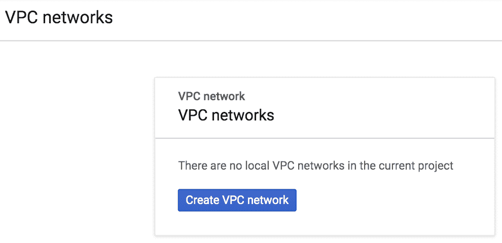

上述截图显示当前项目中没有本地 VPC 网络。
