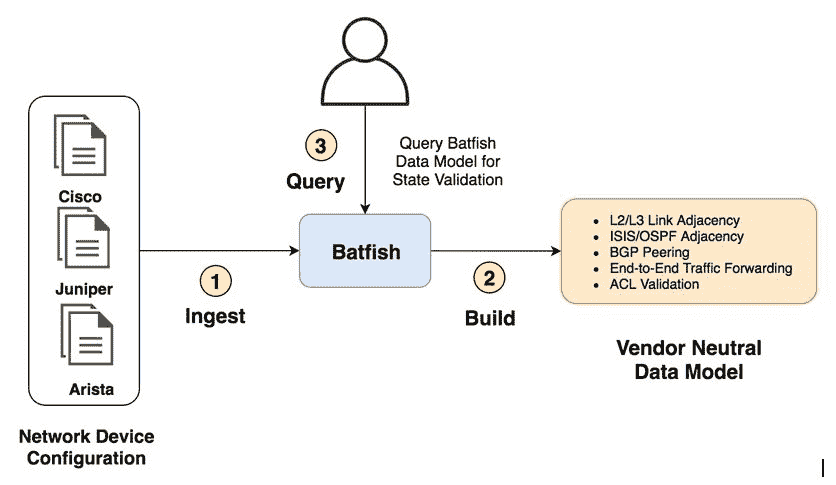
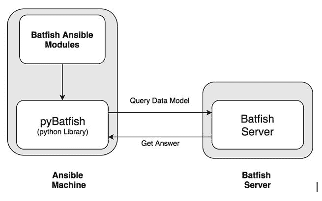

# 第十章：使用 Batfish 和 Ansible 进行网络验证

在本书的所有先前章节中，我们使用了多个示例来概述如何使用 Ansible 执行网络验证——我们通过利用 Ansible 中可用的不同模块来实现这一点。在所有这些情况下，我们在将配置推送到网络设备后执行了网络验证。然后，我们收集了网络状态并验证其是否与我们预期的状态一致。然而，我们可能希望在将配置推送到设备之前验证网络状态。此外，可能需要验证预期的网络状态是否符合要求，甚至在不触及网络的情况下进行验证。但是我们该如何做到呢？

Batfish 是一个针对这种用例的开源项目。它的主要目标是提供一个离线网络验证工具，以验证网络配置的多个方面。Batfish 可以为网络提供安全性、合规性和流量转发的验证和正确性保证。它使用我们网络设备的设备配置来构建我们网络的中立数据模型和转发树，然后我们可以使用它来验证网络状态和验证网络内的正确流量转发。以下图表概述了 Batfish 的高级架构以及其工作原理：



Batfish 使用客户端/服务器模型。通过这种模型，我们运行一个 Batfish 服务器实例（用 Java 编写），并使用一个名为 Pybatfish 的客户端软件开发工具包（用 Python 编写）与服务器进行通信。然后，我们使用网络配置文件初始化我们网络的快照，并且基于这个网络快照，Batfish 服务器为我们的网络计算了一个数据模型。使用客户端，我们可以开始使用这个供应商中立的数据模型来验证我们的网络。

Batfish 团队开发了多个 Ansible 模块，这些模块包装了 Pybatfish 客户端库，以检索 Batfish 服务器生成的数据模型。这些模块允许我们针对网络模型执行不同的查询，以验证我们的网络状态。接下来的图表概述了 Ansible、Pybatfish 和 Batfish 服务器之间的交互。

在本章中，我们将概述如何安装 Batfish 以及如何将其与 Ansible 集成，以便开始使用它来验证网络状态，而不是将配置推送到我们的设备。这种组合非常强大，并且可以轻松扩展到构建用于网络配置更改的完整持续集成/持续部署（CI/CD）流水线。Batfish 可以成为在将配置推送到生产网络设备之前提供预验证的重要组成部分。

我们将使用以下网络拓扑，该拓扑在*第四章中使用，构建数据中心网络与 Arista 和 Ansible，*来概述如何使用 Ansible 和 Batfish 验证样本叶脊网络拓扑：

****

本章涵盖的主要内容有：

+   安装 Batfish

+   将 Batfish 与 Ansible 集成

+   生成网络配置

+   为 Batfish 创建网络快照

+   使用 Ansible 初始化网络快照

+   从 Batfish 收集网络信息

+   使用 Batfish 验证流量转发

+   使用 Batfish 验证访问控制列表（ACLs）

# 技术要求

本章中描述的所有代码都可以在以下网址找到：[`github.com/PacktPublishing/Network-Automation-Cookbook/tree/master/ch10_batfish`](https://github.com/PacktPublishing/Network-Automation-Cookbook/tree/master/ch10_batfish)。

本章基于以下软件版本：

+   运行 CentOS 7.7 的 Ansible 机器

+   托管 Batfish 容器的 CentOS 7.7 机器

+   Python 3.6.8

+   Ansible 2.9

+   Arista **虚拟化可扩展操作系统**（**vEOS**）运行 EOS 4.20.1F

查看以下视频以查看代码的实际操作：

[`bit.ly/3bhke1A`](https://bit.ly/3bhke1A)

# 安装 Batfish

在这个步骤中，我们将概述如何安装 Batfish 容器（Batfish 架构中的服务器组件）并启动它，以便从 Ansible 开始与其进行交互。这是一个必要的基础步骤，以便开始使用 Batfish 验证我们的网络。

# 准备工作

如本章介绍所述，我们将在单独的 Linux 机器上安装 Batfish。这台机器需要具有互联网连接，以便能够安装 Docker 并下载 Batfish 容器。

# 如何做…

1.  在 CentOS Linux 机器上安装 Docker，如下面的网址所示：

[`docs.docker.com/install/linux/docker-ce/centos/`](https://docs.docker.com/install/linux/docker-ce/centos/)

1.  一旦 Docker 安装并运行，下载 Docker 容器，如下面的代码片段所示：

```
$ sudo docker pull batfish/batfish
```

1.  启动 Batfish 容器，如下面的代码片段所示：

```
$ sudo docker run -d -p 9997:9997 -p 9996:9996 batfish/batfish
```

# 它是如何工作的…

Batfish 提供了多种安装和运行 Batfish 服务器的选项。然而，最简单和最推荐的方法是运行一个包含 Batfish 服务器的 Docker 容器。为了运行这个 Docker 容器，我们首先需要在 CentOS Linux 机器上安装 Docker。在我们的情况下，Docker 可以安装在不同的 Linux 发行版上，也可以安装在 macOS 和 Windows 上。

一旦安装了 Docker，我们使用 `docker pull` 命令将 Batfish 容器下载到我们的 Linux 机器上，并使用 `docker run` 命令启动 Docker 容器。我们必须从容器中暴露 **传输控制协议**（**TCP**）端口 `9996` 和 `9997`，并将它们映射到 Linux 机器上，使用 `-p` 指令。我们将这些端口映射到 Linux 机器上的相同端口。这些端口用于从远程客户端（安装在 Ansible 控制机器上的 *Pybatfish* 客户端库）与 Batfish 服务器进行交互。

Batfish 提供两个 Docker 容器：`batfish/batfish` 和 `batfish/allinone`。`batfish/allinone` 容器包含 Batfish 服务器和 Pybatfish 客户端库。它还安装了 Jupyter Notebook Python 库以及一些示例笔记本，以开始与 Batfish 服务器进行交互。但是，我们不会使用这种方法。相反，我们将使用 `batfish/batfish` 容器，它只包含 Batfish 服务器。

# 另请参阅…

有关 Batfish 及其安装方法的更多信息，请访问以下网址：

+   [`github.com/batfish/docker`](https://github.com/batfish/docker)

+   [`github.com/batfish/batfish/blob/master/README.md`](https://github.com/batfish/batfish/blob/master/README.md)

# 将 Batfish 与 Ansible 集成

为了将 Batfish 与 Ansible 集成，我们需要安装所需的 Python 包。这样做将允许 Ansible 与 Batfish 服务器进行通信。在这个步骤中，我们将概述如何安装这些 Python 包，以及如何安装运行所需的 Batfish Ansible 模块所需的 Ansible 角色。

# 准备工作

为了按照这个步骤进行操作，Ansible 控制器必须具有互联网连接。这将允许我们安装 Batfish 所需的依赖项。

# 如何做…

1.  在 Ansible 控制器上安装 Batfish 客户端 python3 包，如下面的代码片段所示：

```
$ sudo python3 -m pip install --upgrade git+https://github.com/batfish/pybatfish.git
```

1.  下载 `batfish` Ansible 角色到 `roles` 文件夹中，如下面的代码片段所示：

```
$ ansible-galaxy install batfish.base
```

# 它是如何工作的…

在这个步骤中，我们正在设置 Ansible 和 Batfish 之间的集成。这通过两个步骤完成：

1.  在 Ansible 控制器上，我们需要安装`pybatfish` Python 库，这是与 Batfish 服务器交互的 Batfish 客户端 SDK。这个包是 Ansible 模块所需的。这些将被用于在我们的 playbooks 中与 Batfish 服务器交互。

1.  其次，我们安装了 Batfish 团队开发的`batfish`角色，以便与 Batfish 服务器交互并验证网络设备配置。这个 Ansible 角色包含了运行 Batfish 自定义 Ansible 模块所需的所有 Python 脚本。为了将此角色安装到 Ansible 控制机上，我们使用`ansible-galaxy`。

我们可以验证`pybatfish`是否正确安装，如下所示：

```
$ pip3 freeze | grep batfish
pybatfish==0.36.0
```

现在我们可以探索由`ansible-galaxy`下载的已安装角色：

```
$ ansible-galaxy list batfish.base
# /home/ansible/.ansible/roles
```

以下是此角色的 Python 源代码列表，该列表位于此角色的`library`文件夹中：

```
$tree ~/.ansible/roles/batfish.base/library/
/home/ansible/.ansible/roles/batfish.base/library/
├── bf_assert.py
├── bf_extract_facts.py
├── bf_init_snapshot.py
├── bf_session.py
├── bf_set_snapshot.py
├── bf_upload_diagnostics.py
└── bf_validate_facts.py
```

通过完成这两个步骤，Ansible 控制器已经准备好开始与我们在上一个示例中部署的 Batfish 服务器进行交互。

由于我们没有在`ansible-galaxy install`命令上指定任何额外的参数，这些角色将默认安装在`~/.ansible/roles`路径上。

# 另请参阅...

有关 Pybatfish 和 Batfish 开发的 Ansible 角色以及与 Ansible 一起使用的更多信息，请查看此页面：[`github.com/batfish/batfish/blob/master/README.md`](https://github.com/batfish/batfish/blob/master/README.md)。

# 生成网络配置

要开始使用 Batfish 进行分析和验证，我们需要向 Batfish 服务器提供我们网络设备的配置。在这个示例中，我们将概述如何使用 Ansible 生成这个配置。Batfish 是一种离线网络验证工具，拥有完整的网络配置是实现正确的网络验证的必要步骤之一。

# 准备工作

这里没有特定的要求，除了在 Ansible 控制机上安装了 Ansible。

# 如何做...

1.  创建一个名为`ch10_batfish`的新文件夹，其中将包含所有我们的变量和 playbooks。

1.  填充所有变量以描述我们的网络在`group_vars/all.yml`文件和`host_vars`文件夹中。在这里，我们使用的是*第四章*中概述的完全相同的变量，*使用 Arista 和 Ansible 构建数据中心网络*。

1.  在`ch10_batfish`文件夹内创建一个`roles`文件夹，以容纳我们将创建的所有角色。

1.  创建一个名为`generate_fabric_config`的新角色，如下所示：

```
$ cd ch10_batfish
$ ansible-galaxy init --init-path roles generate_fabric_config
```

1.  构建`templates`文件夹中的所有 Jinja2 模板，以创建接口、管理和**边界网关协议**（**BGP**）配置。

1.  在`tasks/main.yml`文件中包含构建配置所需的所有任务。同样，我们使用的是*第四章*中已经讨论过的完全相同的步骤和模块，*使用 Arista 和 Ansible 构建数据中心网络*，以构建此示例网络的配置。

1.  创建`ansible_host`清单，如下面的代码块所示：

```
$ cat hosts [leaf] leaf01   ansible_host=172.20.1.41 leaf02    ansible_host=172.20.1.42 leaf03    ansible_host=172.20.1.43 leaf04    ansible_host=172.20.1.44 [spine] spine01     ansible_host=172.20.1.35 spine02     ansible_host=172.20.1.36
[arista:children] leaf spine
```

1.  现在，创建一个名为`pb_build_fabric_config.yml`的新 playbook，如下所示：

```
$ cat pb_build_fabric_config.yml
---
- name: Build DC Fabric Config
 hosts: all
 connection: local
 gather_facts: no
 vars:
 tmp_dir: tmp
 config_dir: configs
 roles:
 - generate_fabric_config
```

# 工作原理...

在这个示例中，我们使用 Ansible 来生成我们示例拓扑中网络设备的配置。我们还使用了我们在第四章中讨论过的完全相同的数据和变量结构，*使用 Arista 和 Ansible 构建数据中心网络*。我们使用 YAML 文件将所有基础设施定义分组在`group_vars`和`host_vars`文件夹中。我们还使用了在第四章中使用的完全相同的 Jinja2 模板，*使用 Arista 和 Ansible 构建数据中心网络*，以生成接口、BGP 和设备管理配置的配置片段。

我们使用`ansible-galaxy init`命令构建角色骨架，并使用`--init-path`指令指定在哪里创建这个新角色。

以下输出概述了我们用于生成设备配置的新角色的结构：

```
$ tree roles/generate_fabric_config
roles/generate_fabric_config
├── meta
│   └── main.yml
├── tasks
│   └── main.yml
└── templates
 ├── intf.j2
 ├── mgmt.j2
 ├── overlay_bgp.j2
 └── underlay_bgp.j2
```

在这一点上，我们创建一个新的 playbook 来生成设备配置，并使用`connection`本地参数，因为我们需要在 Ansible 控制器节点上捕获网络设备的配置。运行完 playbook 后，我们将得到所有设备的配置在`configs`文件夹中，如下面的代码块所示：

```
$ tree ch10_batfish/configs
configs
├── leaf01.cfg
├── leaf02.cfg
├── leaf03.cfg
├── leaf04.cfg
├── spine01.cfg
└── spine02.cfg
```

# 为 Batfish 创建网络快照

为了让 Batfish 能够使用设备的配置文件来分析网络，这些文件需要按特定顺序结构。这样 Batfish 服务器就可以轻松地摄取这些数据。

在这个教程中，我们将概述如何正确地结构和准备我们的网络配置文件，以便 Batfish 服务消费。

# 准备工作

设备配置应该已经生成，就像在上一个教程中演示的那样。

# 操作步骤...

1.  创建一个名为`pb_batfish_analyis.yml`的新 playbook，并添加以下任务以创建一个新文件夹。这个文件夹将存放`batfish`分析所需的网络配置：

```
$ cat pb_batfish_analyis.yml
---
- name: Extract network device facts using Batfish and Ansible
 hosts: all
 gather_facts: no
 roles:
 - batfish.base
 vars:
 ansible_connection: local
 batfish_host: 172.20.100.101
 config_dir: configs
 batfish_network_folder: batfish_net_snapshot
 batfish_analysis_folder: batfish_analysis
 tasks:

 - name: Create a Batfish Config Directory
 file:
 path: "{{ batfish_network_folder }}"
 state: directory    run_once: yes
```

1.  更新名为`pb_batfish_analyis.yml`的 playbook，添加以下任务以将所有配置文件复制到新文件夹中：

```
- name: copy All configs to Batfish Directory
 copy:
 src: "{{ config_dir }}"
 dest: "{{ batfish_network_folder }}"
 run_once: yes
```

# 工作原理…

为了开始对我们的网络进行分析，我们创建一个新的 playbook，用于执行所有必需的任务，并使用 Batfish 验证网络配置。在这个 playbook 中，我们使用以下参数：

+   我们在网络中的所有节点上运行 playbook。这是因为我们需要在随后的任务中引用每个节点的参数（如环回**互联网协议**（**IP**））。

+   我们将`ansible_connection`参数设置为`local`，因为我们不需要连接到设备，所有任务将在 Ansible 机器上本地运行。

+   我们指定 Batfish 服务器机器的 IP 地址，该服务器托管`batfish`容器。这将在随后的所有任务中用于与 Batfish 服务器通信。

为了让 Batfish 开始分析设备的配置，设备的配置文件需要按特定顺序结构在一个目录中。这一步通常被称为为 Batfish 分析准备网络快照。

在这里，我们为 Batfish 分析创建一个新的 playbook。在第一个任务中，我们创建`configs`文件夹，这将是 Batfish 用来检索网络设备配置的基础。

在第二个任务中，我们使用`copy`模块将网络设备的配置文件复制到`configs`文件夹中。一旦我们运行了包含指定任务的 playbook，我们将得到 Batfish 分析所需的以下目录结构：

```
 $ tree ch10_batfish/batfish_net_snapshot/

 batfish_net_snapshot
└── configs
 ├── leaf01.cfg
 ├── leaf02.cfg
 ├── leaf03.cfg
 ├── leaf04.cfg
 ├── spine01.cfg
 └── spine02.cfg
```

在所有任务中，我们都使用`run_once`参数，因为我们只想创建文件夹并复制文件一次。如果我们省略此选项，将会对清单中的每个节点运行这些任务，这在这种情况下并不理想。

# 另请参阅...

有关 Batfish 网络快照所需的目录结构的更多信息，请访问此链接：[`pybatfish.readthedocs.io/en/latest/notebooks/interacting.html#Uploading-configurations`](https://pybatfish.readthedocs.io/en/latest/notebooks/interacting.html#Uploading-configurations)。

# 使用 Ansible 初始化网络快照

在这个教程中，我们将概述如何在 Ansible 和 Batfish 服务器之间建立会话。除此之外，我们还将看看如何初始化我们在上一步准备的网络快照，并将其发送到 Batfish 服务器。

# 准备工作

如前一篇文章所述，设备配置是在此时生成的，并且网络快照已经打包好了。此外，现在还在 TCP 端口 9996 和 9997 上提供了 Ansible 控制器与 Batfish 服务器之间的 IP 可达性。

# 如何做...

1.  使用以下任务更新`pb_batfish_analyis.yml`剧本，以与 Batfish 服务器开始会话：

```
 - name: Setup connection to Batfish service
 bf_session:
 host: "{{ batfish_host }}"
 name: local_batfish
 register: bf_session
 run_once: yes
```

1.  更新`pb_batfish_analyis.yml`剧本以在 Batfish 服务器上初始化网络快照：

```
 - name: Initialize the Network Snapshot
 bf_init_snapshot:
 network: arista_dc_fabric
 snapshot: arista_dc_fabric_config
 snapshot_data: "{{ batfish_network_folder }}"
 overwrite: true
 run_once: yes
 register: bf_snapshot
```

# 工作原理...

在剧本中，我们使用了从`ansible-galaxy`下载的`batfish.base` Ansible 角色与 Batfish 服务器进行交互。该角色提供了多个模块，我们使用这些模块来启动 Ansible 控制机和 Batfish 服务器之间的集成。

第一个模块是`bf_session`。该模块在 Batfish 客户端（在本例中为 Ansible）和 Batfish 服务器之间打开会话，以便开始在两者之间交换数据。第二个模块`br_init_snapshot`初始化了我们在 Ansible 控制器上创建的网络快照（设备配置文件）。然后将它们发送到 Batfish 服务器，以便在 Batfish 服务器上开始分析，并且 Batfish 服务器根据这些配置文件为我们的网络构建中立的数据模型。

`bf_init_session`模块返回了 Batfish 解析配置的状态，以及在解码配置时是否出现任何问题。我们将这个返回值捕获在`bf_snapshot`变量中。以下代码段概述了 Batfish 在提供的网络快照上执行的解析状态：

```
ok: [localhost] => {
 "bf_snapshot": {
 "ansible_facts": {

 "bf_network": "arista_dc_fabric",
 "bf_snapshot": "arista_dc_fabric_config"
 },
 "result": {
 "network": "arista_dc_fabric",
 "snapshot": "arista_dc_fabric_config"
 },
 "summary": "Snapshot 'arista_dc_fabric_config' created in network
'arista_dc_fabric'",
 "warnings": [ 
 "Your snapshot was successfully initialized but Batfish failed to fully recognize some lines in one or more input files. Some unrecognized configuration lines are not uncommon for new networks, and it is often fine to proceed with further analysis.
 ]
 }
}
```

我们可以忽略我们收到的警告，因为它不会影响我们的分析。

# 从 Batfish 收集网络事实

Batfish 可以生成一个代表从提供给 Batfish 的配置文件中发现的关键事实的供应商中立的数据模型。在本篇文章中，我们将概述如何收集 Batfish 发现的这些事实，并如何使用这些信息来验证设备的网络配置是否符合预期状态。

# 准备工作

网络配置已经生成，并且网络快照已经与 Batfish 服务器同步。

# 如何做...

1.  使用以下任务更新`pb_batfish_analyis.yml`剧本，以收集 Batfish 生成的事实：

```
 - name: Retrieve Batfish Facts
 bf_extract_facts:
 output_directory: "{{ batfish_analysis_folder }}/bf_facts"
 run_once: yes
 register: bf_facts
```

1.  使用以下任务更新`pb_batfish_analysis.yml`剧本，以验证生成的接口配置：

```
 - name: Validate all Interfaces are Operational and Have correct IP
 assert:
 that:
 - bf_facts.result.nodes[inventory_hostname].Interfaces[item.port].Active
== true
 - bf_facts.result.nodes[inventory_hostname].Interfaces[item.port].Primary_Address ==
 item.ip + '/' + global.p2p_prefix | string
 loop: "{{ p2p_ip[inventory_hostname] }}"
```

# 工作原理...

Batfish 处理网络快照（设备配置）并为配置的不同部分生成供应商中立的数据模型。这些被认为是 Batfish 从输入配置文件生成并收集的事实。我们使用`bf_extract_facts` Ansible 模块来提取这些事实，然后可以将其保存到一个目录以供进一步分析。

在我们的情况下，我们将 Batfish 分析保存在`bf_facts`文件夹中，并且该模块生成了一个唯一的 YAML 文件，其中包含了每个设备的这个中立数据模型。以下代码段概述了我们样本拓扑中一个设备（`leaf01`）的接口数据模型：

```
nodes:
 leaf01:
 Interfaces:
 Ethernet8:
 Active: true
 All_Prefixes:
 - 172.31.1.1/31
 < --- Output Omitted for brevity --->
 Declared_Names:
 - Ethernet8
 Description: '"DC1 | Rpeer: spine01 | Rport: Ethernet1"'
 < --- Output Omitted for brevity --->
 MTU: 1500
 < --- Output Omitted for brevity --->
 Primary_Address: 172.31.1.1/31
 Primary_Network: 172.31.1.0/31
 < --- Output Omitted for brevity --->
 Speed: 1000000000.0
```

该模块返回相同的数据结构，我们将这个结果保存在一个名为`bf_facts`的新变量中。我们使用这个变量中的数据来验证我们生成的配置的设备的预期网络状态。我们还使用`assert`模块来循环遍历我们数据模型中声明的每个节点的所有接口。然后，我们比较 Batfish 生成的数据模型中这些参数的值，以确保我们所有的接口都是可操作的，并且所有的 IP 地址都配置正确。

# 还有更多...

Batfish 还提供了不同的内置`assert`测试，以对其生成的数据模型执行验证。这使其能够对可能影响网络的关键问题提供更简单和更健壮的验证。以下是使用 Batfish 已有的内置`assert`的任务：

```
- name: Validate BGP Sessions and Undefined References
 bf_assert:
 assertions:
 - type: assert_no_undefined_references
        name: Confirm we have no undefined references
 - type: assert_no_incompatible_bgp_sessions
 name: Confirm we have no incompatible BGP sessions
 run_once: yes
```

我们可以在上述代码块中看到两个断言：

+   `assert_no_undefined_references`：这个断言验证所有配置块是否存在且有效。例如，所有前缀列表都存在，没有未定义引用到缺失的前缀列表。这确保生成的配置是合理的，不包括对未声明对象的未定义引用。

+   `Assert_no_incompatible_bgp_sessions`：这个断言验证所有 BGP 会话是否正确配置，并且 BGP 对等体的配置之间没有不匹配。这也确保生成的配置是有效的，生成的 BGP 会话将是可操作的。

如果我们需要验证这些测试是否会捕捉到配置中的错误，我们可以通过关闭主配置文件中叶子和脊柱交换机之间的链路来进行验证，如下面的代码块所示：

```
$ cat configs/leaf01.cfg

!
interface Ethernet8
 description "DC1 | Rpeer: spine01 | Rport: Ethernet1"
 no switchport
 *shutdown*   ip address 172.31.1.1/31
!
```

此配置更改应该使`leaf01`和`spine01`节点之间的底层 BGP 会话中断。

当我们再次运行我们的剧本时，将会看到以下错误消息：

```
TASK [Validate BGP Sessions and Undefined References] ****************************************************************************************************        "result": [

 {
 "details": "Assertion passed",
 "name": "Confirm we have no undefined references",
 "status": "Pass",
 "type": "assert_no_undefined_references"
 },
 {
 "details": "Found incompatible BGP session(s), when none were expected\n[{'Node': 'leaf01', 'VRF': 'default', 'Local_AS': 65001, 'Local_Interface': None, 'Local_IP': '172.31.1.1', 'Remote_AS': '65100', 'Remote_Node': None, 'Remote_Interface': None, 'Remote_IP': '172.31.1.0', 'Session_Type': 'EBGP_SINGLEHOP', 'Configured_Status': 'INVALID_LOCAL_IP'}]",
 "name": "Confirm we have no incompatible BGP sessions",
 "status": "Fail",
 "type": "assert_no_incompatible_bgp_sessions"
 }
 ],
 "summary": "1 of 2 assertions failed"
 }
```

从输出中，我们可以看到第一个断言成功了，这意味着我们的配置中没有未定义的引用。然而，第二个断言失败了，因为现在有一个 BGP 会话失败了。

# 另请参阅...

有关 Batfish Ansible 模块支持的所有可用断言的更多信息，请查看以下链接：

+   [`github.com/batfish/ansible/blob/master/docs/bf_assert.rst`](https://github.com/batfish/ansible/blob/master/docs/bf_assert.rst)

+   [`github.com/batfish/ansible/blob/master/docs/assertions.rst`](https://github.com/batfish/ansible/blob/master/docs/assertions.rst)

# 使用 Batfish 验证流量转发

在本教程中，我们将概述如何验证网络中的流量转发。这是通过 Batfish 使用从设备配置生成的转发表来实现的。在进行任何更改之前，验证网络内的正确流量转发非常有用。

# 准备工作

网络配置已经生成，并且网络快照已经与 Batfish 服务器同步。

# 如何做...

1.  使用以下任务更新`pb_batfish_analyis.yml`剧本，以验证我们拓扑中的流量转发：

```
- name: Validate Traffic Forwarding in the Fabric
 bf_assert:
 assertions:
 - type: assert_all_flows_succeed
 name: confirm host is reachable for traffic received
 parameters:
 startLocation: "{{ item.0 }}"
 headers:
 dstIps: "{{ item.1.value.ip }}"
 srcIps: "{{ lo_ip[item.0].ip }}"
 with_nested:
 - "{{ play_hosts }}"
 - "{{ lo_ip | dict2items }}"
 run_once: yes
```

# 工作原理...

Batfish 提供了一种内置的验证方法，用于验证网络拓扑内端点之间的正确流量转发。这是通过使用`assert_all_flows_succeed`方法实现的。该方法验证给定端点之间的所有流量是否成功。为了使 Batfish 验证任何给定流的流量流动，我们需要提供以下信息：

+   开始节点位置

+   流的源 IP

+   流的目标 IP 地址

Batfish 将使用其生成的数据模型为网络拓扑中的所有节点构建转发表，并验证我们正在测试的流量是否在网络中转发。

在我们的示例拓扑中，我们希望验证所有节点的回环 IP 地址的所有流量是否可以到达所有远程节点的目标回环 IP 地址。我们使用`with_nested`循环结构来循环遍历我们清单中的所有节点，并在`lo_ip`数据结构中循环遍历所有回环 IP 地址。这将测试我们清单中的所有节点是否可以到达其他所有节点的远程回环。

当我们运行这个测试时，我们会发现除了从`spine01`到`spine02`的流量和从`spine02`到`spine01`的反向流量之外，所有流量都正常工作，如下面的代码块所示：

```
*### Traffic from Spine01 to Spine02 Failing

*                "msg": "1 of 1 assertions failed",
 "result": [
 {
 "details": "Found a flow that failed, when expected to succeed\n[{'Flow': Flow(dscp=0, dstIp='10.100.1.253', dstPort=0, ecn=0, fragmentOffset=0, icmpCode=0, icmpVar=8, ingressInterface=None, ingressNode='spine01', ingressVrf='default', ipProtocol='ICMP', packetLength=0, srcIp='10.100.1.254', srcPort=0, state='NEW', tag='BASE', tcpFlagsAck=0, tcpFlagsCwr=0, tcpFlagsEce=0, tcpFlagsFin=0, tcpFlagsPsh=0, tcpFlagsRst=0, tcpFlagsSyn=0, tcpFlagsUrg=0), 'Traces': ListWrapper([((ORIGINATED(default), NO_ROUTE))]), 'TraceCount': 1}]",
 "name": "confirm host is reachable for traffic received",
 "status": "Fail",
 "type": "assert_all_flows_succeed"
 }
 ],
 "summary": "1 of 1 assertions failed"
 }
```

在实时网络中，我们可以检查实时节点上的路由，以验证我们从 Batfish 得出的发现：

```
dc1-spine01#sh ip route 10.100.1.253

VRF: default
Codes: C - connected, S - static, K - kernel,
 O - OSPF, IA - OSPF inter area, E1 - OSPF external type 1,
 E2 - OSPF external type 2, N1 - OSPF NSSA external type 1,
 N2 - OSPF NSSA external type2, B I - iBGP, B E - eBGP,
 R - RIP, I L1 - IS-IS level 1, I L2 - IS-IS level 2,
 O3 - OSPFv3, A B - BGP Aggregate, A O - OSPF Summary,
 NG - Nexthop Group Static Route, V - VXLAN Control Service,
 DH - Dhcp client installed default route

Gateway of last resort is not set
```

在检查我们的网络配置后，我们可以看到前面的输出是正确的。这是可能的，因为我们在所有`leaf`交换机上使用路由映射，只广播本地环回 IP 地址，并且我们不会重新广播来自`leaf`节点的任何其他 IP 地址。

此外，`spine`节点之间没有 BGP 会话，因此它们之间没有流量路径。因此，为了完成我们的测试并使其成功，我们将仅测试所有源自`leaf`节点到所有目的地的流量。

我们不会测试源自`spine`节点的流量。在这里，您可以看到修改后的任务：

```
- bf_assert:

    assertions:
      - type: assert_all_flows_succeed
        name: confirm host is reachable for traffic received
        parameters:
          startLocation: "{{ item.0 }}"
          headers:
            dstIps: "{{ item.1.value.ip }}"
            srcIps: "{{ lo_ip[item.0].ip }}"
    with_nested:
      - "{{ play_hosts }}"
      - "{{ lo_ip | dict2items }}"
    when: '"spine" not in item.0'
    run_once: yes
```

再次运行测试后，所有流量都通过了，任务成功。

# 使用 Batfish 验证 ACL

在本教程中，我们将概述如何使用 Batfish 验证 ACL 条目，并验证这些 ACL 定义的正确流量处理。这使我们能够将 Batfish 和 Ansible 作为审计工具，强制执行基础设施的正确安全合规性。

# 准备工作

设备配置已生成，并且网络快照已打包，如前面的教程所述。

# 操作步骤…

1.  使用以下 ACL 条目更新`leaf03`和`leaf04`上的网络配置以保护 Web **虚拟局域网**（**VLAN**）：

```
!
ip access-list WEB_VLAN_IN
 10 deny ip host 172.20.10.10 any
 20 permit tcp 172.20.10.0/24 any eq https

!
ip access-list WEB_VLAN_OUT
 10 permit tcp any 172.20.10.0/24 eq https
!
```

1.  使用以下任务更新`pb_batfish_analyis.yml` playbook，以验证我们 Web VLAN 的正确出口 ACL 行为：

```
- name: Validate Internet to Web Servers
 bf_assert:
 assertions:
 - type: assert_filter_permits
 name: Confirm Internet Access to Web Servers
 parameters:
 filters: "{{ web_acl }}"
 headers:
 dstIps: "{{ web_server_subnet}}"
 srcIps: "0.0.0.0/0"
 dstPorts: '443'
 ipProtocols: 'TCP'
 vars:
 web_acl: WEB_VLAN_OUT
 web_server_subnet: 172.20.10.0/24
 run_once: yes
```

1.  使用以下任务更新`pb_batfish_analyis.yml` playbook，以验证我们 VLAN 的正确入口 ACL 行为：

```
- name: Validate Server {{ web_server }} is Denied
 bf_assert:
 assertions:
 - type: assert_filter_denies
 name: Confirm Traffic is Denied
 parameters:
 filters: "{{ web_acl_in }}"
 headers:
 dstIps: "0.0.0.0/0"
 srcIps: "{{ web_server}}"
 vars:
 web_acl_in: WEB_VLAN_IN
 web_server: 172.20.10.10
 run_once: yes
```

# 工作原理…

Batfish 是另一个用于验证 ACL 处理流量的强大工具。这使我们能够验证特定 ACL 是否允许或拒绝特定流量。Batfish 还提供了一个强大的工具，用于验证涉及 ACL 的网络更改。此外，它可以用作防范实施可能影响网络上的实时流量或导致违反安全策略的恶意 ACL 更改的保障。

我们再次使用`bf_assert` Batfish 模块，但是在这种情况下，用于验证 ACL。我们使用了该模块中实现的另外两个`assert`方法，如下所示：

+   `assert_filter_permits`方法测试并验证 ACL 正确允许特定流量。

+   `assert_filter_denies`方法测试并验证 ACL 拒绝特定流量。

在我们的 playbook 中，我们创建了两个单独的任务。第一个任务使用`assert_filter_permits`方法验证从互联网到我们的 Web 服务器子网的所有流量是否被允许。我们使用`headers`参数来指定要验证的所有流量的 IP 头信息。

然后，我们创建第二个任务，使用`assert_filter_denies`方法，测试特定 Web 服务器是否被阻止与任何目的地通信。

当我们再次运行我们的 playbook 时，我们可以看到所有任务都成功完成，这表明我们示例网络中 ACL 的行为符合预期。

为了验证我们的过滤器是否工作正常，我们将通过允许**超文本传输安全协议**（**HTTPS**）流量到被拒绝的 Web 服务器（`172.20.10.10`）来引入 ACL 过滤器的问题，如下面的代码片段所示：

```
!
ip access-list WEB_VLAN_IN
 05 permit tcp host 172.20.10.10 any eq ssh
 10 deny ip host 172.20.10.10 any
 20 permit tcp 172.20.10.0/24 any eq https
!
```

当我们再次运行我们的 playbook 时，我们可以看到最后一个任务出现错误。这个错误显示特定流量流被允许，而预期应该被 ACL 拒绝，如下面的代码块所示：

```
 "result": [
 {
 "details": "Found a flow that was permitted, when expected to be denied\n[{'Node': 'leaf03', 'Filter_Name': 'WEB_VLAN_IN', 'Flow': Flow(dscp=0, dstIp='0.0.0.0', dstPort=22, ecn=0, fragmentOffset=0, icmpCode=0, icmpVar=0, ingressInterface=None, ingressNode='leaf03', ingressVrf='default', ipProtocol='TCP', packetLength=0, srcIp='172.20.10.10', srcPort=0, state='NEW', tag='BASE', tcpFlagsAck=0, tcpFlagsCwr=0, tcpFlagsEce=0, tcpFlagsFin=0, tcpFlagsPsh=0, tcpFlagsRst=0, tcpFlagsSyn=0, tcpFlagsUrg=0), 'Action': 'PERMIT', 'Line_Content': '05 permit tcp host 172.20.10.10 any eq ssh', 'Trace': AclTrace(events=[AclTraceEvent(class_name='org.batfish.datamodel.acl.PermittedByIpAccessListLine', description='Flow permitted by extended ipv4 access-list named WEB_VLAN_IN, index 0: 05 permit tcp host 172.20.10.10 any eq ssh', lineDescription='05 permit tcp host 172.20.10.10 any eq ssh')])}]",
 "name": "Confirm Traffic is Denied",
 "status": "Fail",
 "type": "assert_filter_denies"
 }
 ]
```

这个简单的例子表明，我们可以创建更复杂的断言规则，以强制执行网络内的正确安全策略。此外，我们可以利用 Batfish 来验证网络范围内该策略的正确执行。
