# 使用 Ansible 和 NetBox 构建网络库存

在本书的前几章中，我们使用存储在 YAML 文件中的 Ansible 变量描述了网络基础设施。虽然这种方法完全可接受，但对于在整个组织中采用自动化来说并非最佳解决方案。我们需要将我们的网络库存、IP 地址和 VLAN 放在一个中央系统中，这将作为我们网络的真相来源。该系统应具有强大而强大的 API，其他自动化和 OSS/BSS 系统可以查询该 API 以检索和更新网络库存。

NetBox 是一个用于网络基础设施的开源库存系统，最初由 DigitalOcean 的网络工程团队开发，用于记录他们的数据中心基础设施。它是一个简单但功能强大且高度可扩展的库存系统，可以作为关于我们网络的真相来源。它允许我们记录和描述任何网络基础设施上的以下功能：

+   **IP 地址管理（IPAM）**：IP 网络和地址、VRF 和 VLAN

+   **设备机架**：按组和站点组织

+   **设备**：设备类型和安装位置

+   **连接**：设备之间的网络、控制台和电源连接

+   **虚拟化**：虚拟机和集群

+   **数据电路**：长途通信电路和供应商

+   **秘密**：敏感凭据的加密存储

NetBox 是一个基于 Django 的 Python 应用程序，使用 PostgreSQL 作为后端数据存储和 NGINX 作为前端 Web 服务器，以及其他可选组件一起运行以提供 NetBox 系统。它有一个强大的 REST API，可以用于检索或更新 NetBox 数据库中存储的数据。

在本章中，我们将概述 Ansible 和 NetBox 之间集成的以下三个主要用例：

+   Ansible 可用于在 NetBox 中填充各种类型的网络信息，例如站点、设备和 IP 地址。以下图表概述了在这种用例中 Ansible 和 NetBox 之间的高级集成：

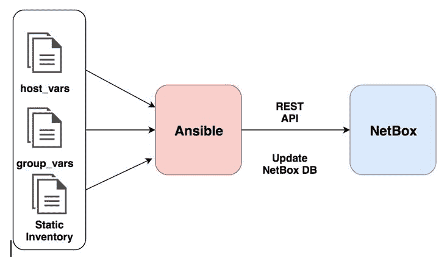

+   NetBox 可以作为 Ansible 的动态清单来源，用于检索和构建 Ansible 清单。以下图表概述了这种集成：

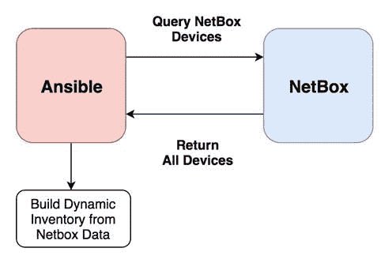

+   NetBox 可以作为 Ansible 所需的数据信息的来源，用于配置和配置网络设备。以下图表概述了这种用例：

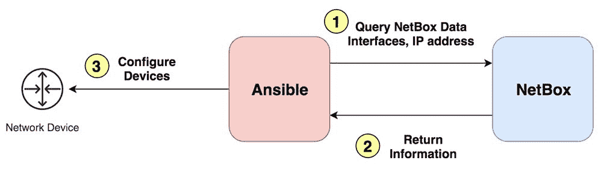

我们将使用由两个数据中心站点组成的示例网络，每个站点都有脊柱或叶子结构。我们将对所有信息进行建模并填充到 NetBox 中。以下表格捕捉了这个示例网络基础设施：

| **站点** | **设备** | **角色** |
| --- | --- | --- |
| DC1 | dc1-spine01 | 脊柱交换机 |
| DC1 | dc1-spine02 | 脊柱交换机 |
| DC1 | dc1-leaf01 | 叶子交换机 |
| DC1 | dc1-leaf02 | 叶子交换机 |
| DC2 | dc2-spine01 | 脊柱交换机 |
| DC2 | dc2-spine02 | 脊柱交换机 |
| DC2 | dc2-leaf01 | 叶子交换机 |
| DC2 | dc2-leaf02 | 叶子交换机 |

本章涵盖的主要内容如下：

+   安装 NetBox

+   将 NetBox 与 Ansible 集成

+   在 NetBox 中填充站点

+   在 NetBox 中填充设备

+   在 NetBox 中填充接口

+   在 NetBox 中填充 IP 地址

+   在 NetBox 中填充 IP 前缀

+   使用 NetBox 作为 Ansible 的动态清单来源

+   使用 NetBox 数据生成配置

# 技术要求

本章中使用的所有代码都可以在以下 GitHub 存储库中找到：

[`github.com/PacktPublishing/Network-Automation-Cookbook/tree/master/ch11_netbox`](https://github.com/PacktPublishing/Network-Automation-Cookbook/tree/master/ch11_netbox)

本章基于以下软件版本发布：

+   运行 CentOS 7 的 Ansible 机器

+   Ansible 2.9

+   Python 3.6.8

+   Arista vEOS 运行 EOS 4.20.1F

+   NetBox v2.6.5 在 CentOS 7 Linux 机器上运行

# 安装 NetBox

在这个配方中，我们将概述如何使用 Docker 容器安装 NetBox，以及如何启动所有必需的容器，以使 NetBox 服务器正常运行。使用 Docker 容器安装 NetBox 是最简单的入门方式。

# 准备工作

为了在 Linux 机器上开始安装 NetBox，机器需要具有互联网连接，以从 Docker Hub 拉取 NetBox 操作所需的 Docker 镜像。

# 如何操作…

1.  使用以下 URL 在您的 CentOS Linux 机器上安装 Docker：

[`docs.docker.com/install/linux/docker-ce/centos/`](https://docs.docker.com/install/linux/docker-ce/centos/)

1.  使用以下 URL 安装 Docker Compose：

[`docs.docker.com/compose/install/`](https://docs.docker.com/compose/install/)

1.  将 NetBox 存储库克隆到一个新目录（`netbox_src`）中，如下所示：

```
$ git clone [`github.com/netbox-community/netbox-docker.git`](https://github.com/netbox-community/netbox-docker.git) netbox_src
```

1.  切换到`netbox_src`目录，并使用`docker-compose`拉取所有必需的 Docker 镜像，如下所示：

```
$ cd netbox_src
$ /usr/local/bin/docker-compose pull
```

1.  更新`docker-compose.yml`文件，设置 NGINX Web 服务器的正确端口：

```
$ cat docker-compose.yml
 ß--- Output Omitted for brevity -->
 nginx:
 command: nginx -c /etc/netbox-nginx/nginx.conf
 image: nginx:1.17-alpine
 depends_on:
 - netbox
 ports:
 - 80:8080  >>  # This will make NGINX listen on port 80 on the host machine
```

1.  启动所有 Docker 容器，如下所示：

```
$ /usr/local/bin/docker-compose up -d 
```

# 工作原理…

如本章介绍的，NetBox 由多个服务组成，这些服务集成在一起以提供所需的 NetBox 应用程序。使用 Docker 容器的最简单安装方法是使用 Docker 容器。我们使用一个`docker-compose`定义文件来描述不同 Docker 容器之间的交互，以提供 NetBox 应用程序。以下图表概述了 NetBox 的高级架构，以及每个服务如何在自己的容器中运行：

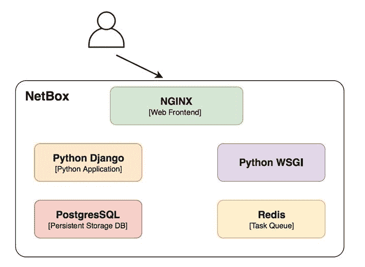

在这个配方中，我们描述了使用 Docker 和`docker-compose`安装 NetBox 所需的步骤，这大大简化了导致 NetBox 服务器正常运行的安装步骤。NetBox 背后的开发人员创建了运行 NetBox 所需的 Docker 镜像，并使用`docker-compose`文件描述了不同 NetBox 组件之间的整体交互，以建立 NetBox 服务器。所有 NetBox 设置说明，以及使用 Docker 容器构建和部署 NetBox 的 Docker 文件和`docker-compose`文件，都可以在[`github.com/netbox-community/netbox-docker`](https://github.com/netbox-community/netbox-docker)找到。

在我们的 Linux 机器上安装了 Docker 和`docker-compose`后，我们克隆了 GitHub 存储库，并编辑了`docker-compose.yml`文件，以设置 NGINX Web 服务器在主机上监听的端口。最后，我们运行了`docker-compose pull`命令，下载了`docker-compose.yml`文件中定义的所有 Docker 容器，并运行了`docker-compose`来启动所有 Docker 容器。

一旦所有 Docker 容器都被下载并启动，我们可以在`https://<netbox-server-ip>/`访问 NetBox。

这将带我们到以下页面：

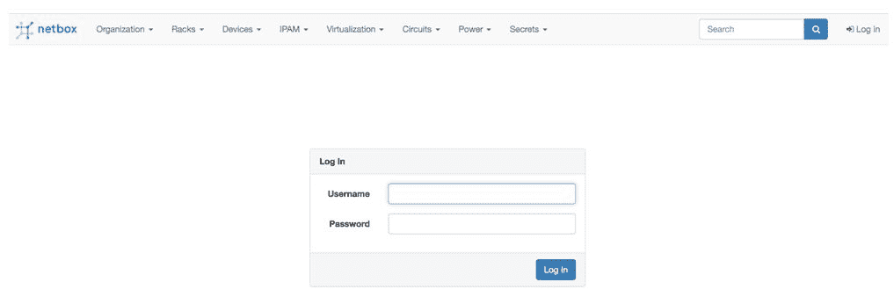

默认用户名是`admin`，密码是`admin`。

# 有更多

为了简化 NetBox 的安装，我在本章的代码中创建了一个 Ansible 角色来部署 NetBox。要使用这个角色，我们需要执行以下步骤：

1.  在 Ansible 控制机上，克隆以下章节代码：

```
git clone git@github.com:PacktPublishing/Network-Automation-Cookbook.git
```

1.  使用正确的 IP 地址更新`hosts`文件，用于您的 NetBox 服务器：

```
$ cat hosts
< --- Output omitted for bevitry --- > 
[netbox]
netbox  ansible_host=172.20.100.111
```

1.  运行`pb_deploy_netbox.yml` Ansible playbook：

```
$ ansible-playbook pb_deploy_netbox.yml
```

# 另请参阅…

有关如何使用 Docker 容器安装 NetBox 的更多信息，请访问**[`github.com/netbox-community/netbox-docker`](https://github.com/netbox-community/netbox-docker)**。

# 将 NetBox 与 Ansible 集成

在这个步骤中，我们将概述如何通过 NetBox API 集成 Ansible 和 NetBox。这种集成是强制性的，因为它将允许我们通过 Ansible playbook 填充 NetBox 数据库，并且在后续的步骤中使用 NetBox 作为我们的动态清单源来创建 Ansible 清单。

# 准备工作

NetBox 应按照上一个步骤中的说明进行安装，并且 IP 需要在 Ansible 控制机和 NetBox 服务器之间进行延伸。Ansible 将通过端口 80 与 NetBox 通信，因此 NetBox 服务器上需要打开此端口。

# 如何做...

1.  在 Ansible 控制机上安装`pynetbox`Python 包：

```
$ sudo pip3 install pynetbox
```

1.  使用管理员用户详细信息登录到 NetBox 服务器，然后单击“管理”选项卡创建一个新用户，如下所示：

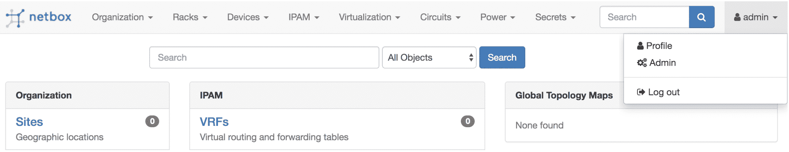

1.  创建一个新用户并设置其用户名和密码：

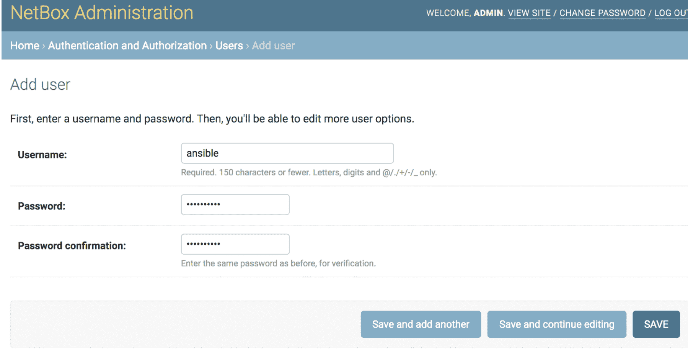

1.  为这个新用户分配超级用户权限，以便您可以写入 NetBox 数据库：

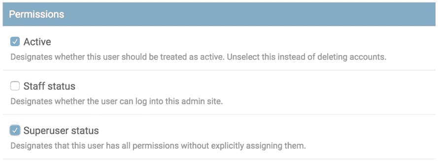

1.  为这个新用户创建一个新的令牌：

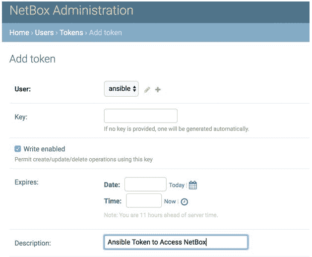

1.  转到令牌屏幕，找到我们为 Ansible 用户创建的新令牌：

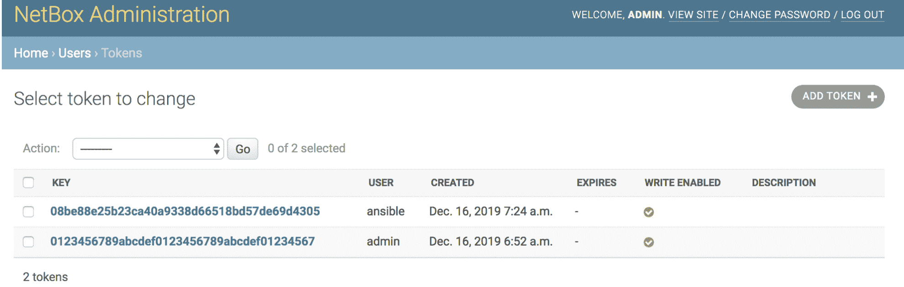

1.  在`ch11_netbox`项目目录中，创建我们的`hosts`Ansible 清单文件，如下所示：

```
$ cat hosts
[dc1]
dc1-spine01     ansible_host=172.20.1.41
dc1-spine02     ansible_host=172.20.1.42dc1-leaf01      ansible_host=172.20.1.35
dc1-leaf02      ansible_host=172.20.1.3

[dc2]
dc2-spine01     ansible_host=172.20.2.41dc2-spine02     ansible_host=172.20.2.42dc2-leaf01      ansible_host=172.20.2.35
dc2-leaf02      ansible
host=172.20.2.36

[leaf]
dc[1:2]-leaf0[1:2]

[spine]
dc[1:2]-spine0[1:2]
```

1.  创建`group_vars`文件夹和`all.yml`文件，并填充文件，如下所示：

```
---
netbox_url: http://172.20.100.111
netbox_token: 08be88e25b23ca40a9338d66518bd57de69d4305
```

# 如何工作...

在这个步骤中，我们正在设置 Ansible 和 NetBox 之间的集成。为了开始使用 Ansible 模块填充 NetBox 数据库，我们安装了`pynetbox`Python 模块。这个模块对于我们在本章中将要使用的所有 NetBox Ansible 模块是必需的。

在 NetBox 网站上，我们首先创建了一个具有完整管理员权限的新用户。这授予了用户在 NetBox 数据库中创建、编辑或删除任何对象的全部权限。然后，我们创建了一个令牌，该令牌将用于验证来自 Ansible 到 NetBox 的所有 API 请求。

最后，我们创建了我们的 Ansible 清单，并在 Ansible 变量中声明了两个参数，`netbox_url`和`netbox_token`，用于保存 API 端点和 NetBox 上 Ansible 用户的令牌。

# 另请参阅...

有关与 NetBox 交互的`pynetbox`Python 库的更多信息，请访问[`pynetbox.readthedocs.io/en/latest/`](https://pynetbox.readthedocs.io/en/latest/)。

# 在 NetBox 中填充站点

在这个步骤中，我们将概述如何在 NetBox 中创建站点。站点是 NetBox 中的逻辑构造，允许我们根据它们的物理位置对基础设施进行分组。在我们开始声明设备并将它们放置在这些站点之前，我们需要定义我们的站点。

# 准备工作

确保按照上一个步骤中的说明，建立 Ansible 和 NetBox 之间的集成。

# 如何做...

1.  更新`group_vars/all.yml`文件，包含关于我们物理站点的以下数据：

```
sites:
 - name: DC1
 description: "Main Data Center in Sydney"
 location: Sydney
 - name: DC2
 description: "Main Data Center in KSA"
 location: Riyadh
```

1.  在`ch11_netbox`下创建一个新的`roles`目录。

1.  创建一个名为`build_netbox_db`的新的 Ansible 角色，并填充`tasks/main.yml`文件，如下所示：

```
$ cat roles/build_netbox_db/tasks/main.yml
---
- name: Create NetBox Sites
 netbox_site:
 netbox_token: "{{ netbox_token }}"
 netbox_url: "{{ netbox_url }}"
 data:
 name: "{{ item.name | lower }}"
 description: "{{ item.description | default(omit) }}"
 physical_address: "{{ item.location | default(omit) }}"
 state: "{{ netbox_state }}"
 loop: "{{ sites }}"
 run_once: yes
 tags: netbox_sites
```

1.  更新`defaults/main.yml`文件，添加以下数据：

```
$ cat roles/build_netbox_db/defaults/main.yml
---
netbox_state: present
```

1.  创建一个名为`pb_build_netbox_db.yml`的新 playbook，并添加以下内容：

```
$ cat pb_build_netbox_db.yml
---
- name: Populate NetBox DataBase
 hosts: all
 gather_facts: no
 vars:
 ansible_connection: local
 tasks:
 - import_role:
 name: build_netbox_db
```

# 它是如何工作的...

在这个步骤中，我们首先填充了样本网络中的站点，并在`group_vars`下的`all.yml`文件中定义了`sites`数据结构，描述了我们数据中心的物理位置。我们创建了一个 Ansible 角色，以便填充 NetBox 数据库，并且我们在这个角色中执行的第一个任务是使用`netbox_site`模块在我们的网络中创建所有站点。我们循环遍历了`sites`数据结构中定义的所有站点，并使用`netbox_site`模块将数据推送到 NetBox。

我们创建了一个新的 playbook，这将是我们的主 playbook，用来将我们的网络库存内容填充到 NetBox 中，并引用了我们创建的角色，以便开始执行该角色内的所有任务。

一旦我们运行这个 playbook，站点就会在 NetBox 中填充，如下所示：

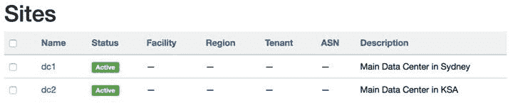

# 另请参阅…

有关`netbox_site`模块的更多信息，请访问[`docs.ansible.com/ansible/latest/modules/netbox_site_module.html`](https://docs.ansible.com/ansible/latest/modules/netbox_site_module.html)。

# 在 NetBox 中填充设备

在这个配方中，我们将概述如何在 NetBox 中创建和填充网络设备。这将包括声明设备型号和制造商，以及它们在我们网络中的角色。这将帮助我们建立我们网络基础设施的准确清单，我们可以在本章的最后一个配方中使用 NetBox 构建 Ansible 的动态清单。

# 准备工作

Ansible 和 NetBox 的集成应该已经就位，并且站点应该在 NetBox 中定义和填充，如前一篇中所述。这是至关重要的，因为当我们开始在 NetBox 中填充设备时，我们需要将它们与现有站点联系起来。

# 如何做…

1.  更新`group_vars/all.yml`文件，包括`devices`信息，如下所示：

```
$ cat group_vars/all.yml

 < --- Output Omitted for brevity --- >

 devices:
 - role: Leaf_Switch
 type: 7020SR
 vendor: Arista
 color: 'f44336'  # red
 - role: Spine_Switch
 type: 7050CX3
 ru: 2
 vendor: Arista
 color: '2196f3'  # blue
```

1.  创建`group_vars/leaf.yml`和`group_vars/spine.yml`文件，然后用以下信息更新它们：

```
$ cat group_vars/leaf.yml

---
device_model: 7020SR
device_role: Leaf_Switch
vendor: Arista
$ cat group_vars/spine.yml
---
device_model: 7050CX3
device_role: Spine_Switch
vendor: Arista
```

1.  创建一个新任务，为我们库存中的所有设备创建制造商，放在`tasks/create_device_vendors.yml`文件中，如下所示：

```
$ cat roles/build_netbox_db/tasks/create_device_vendors.yml

- name: NetBox Device  // Get Existing Vendors
 uri: url: "{{ netbox_url }}/api/dcim/manufacturers/?name={{ device }}" method: GET headers: Authorization: "Token {{ netbox_token }}" Accept: 'application/json' return_content: yes body_format: json status_code: [200, 201] register: netbox_vendors run_once: yes tags: device_vendors - name: NetBox Device  // Create Device Vendors
 uri: url: "{{ netbox_url }}/api/dcim/manufacturers/" method: POST headers: Authorization: "Token {{ netbox_token }}" Accept: 'application/json' return_content: yes body_format: json body: name: "{{ device }}" slug: "{{ device | lower }}" status_code: [200, 201] when: - netbox_vendors.json.count == 0 - netbox_state == 'present' run_once: yes tags: device_vendors
```

1.  更新`tasks/main.yml`文件，包括`create_device_vendors.yml`文件，如下所示：

```
$ cat roles/build_netbox_db/tasks/main.yml < --- Output Omitted for brevity --- > - name: Create NetBox Device Vendors
 include_tasks: create_device_vendors.yml loop: "{{ devices | map(attribute='vendor') | list | unique}}" loop_control: loop_var: device run_once: yes tags: device_vendors
```

1.  创建一个新任务，为我们库存中的所有网络设备创建所有设备型号，放在`tasks/create_device_types.yml`文件中，如下所示：

```
$ cat roles/build_netbox_db/tasks/create_device_types.yml - name: NetBox Device  // Get Existing Device Types
 uri: url: "{{ netbox_url }}/api/dcim/device-types/?model={{ device.type }}" method: GET headers: Authorization: "Token {{ netbox_token }}" Accept: 'application/json' return_content: yes body_format: json status_code: [200, 201] register: netbox_device_types run_once: yes tags: device_types - name: NetBox Device  // Create New Device Types
 uri: url: "{{ netbox_url }}/api/dcim/device-types/" method: POST headers: Authorization: "Token {{ netbox_token }}" Accept: 'application/json' return_content: yes body_format: json body: model: "{{ device.type }}" manufacturer: { name: "{{ device.vendor }}"} slug: "{{ device.type | regex_replace('-','_') | lower  }}" u_height: "{{ device.ru | default(1) }}" status_code: [200, 201] when: - netbox_device_types.json.count == 0 - netbox_state != 'absent' register: netbox_device_types run_once: yes tags: device_types
```

1.  更新`tasks/main.yml`文件，包括`create_device_types.yml`文件，如下所示：

```
$ cat roles/build_netbox_db/tasks/main.yml
< --- Output Omitted for brevity --- >
- name: Create NetBox Device Types
 include_tasks: create_device_types.yml
 loop: "{{ devices }}"
 loop_control:
 loop_var: device
 run_once: yes
 tags: device_types
```

1.  创建一个新任务，为我们库存中的所有网络设备创建所有设备角色，放在`tasks/create_device_roles.yml`文件中，如下所示：

```
$ cat roles/build_netbox_db/tasks/create_device_roles.yml - name: NetBox Device  // Get Existing Device Roles
 uri: url: "{{ netbox_url }}/api/dcim/device-roles/?name={{ device.role}}" method: GET headers: Authorization: "Token {{ netbox_token }}" Accept: 'application/json' return_content: yes body_format: json status_code: [200, 201] register: netbox_device_role tags: device_roles - name: NetBox Device  // Create New Device Roles
 uri: url: "{{ netbox_url }}/api/dcim/device-roles/" method: POST headers: Authorization: "Token {{ netbox_token }}" Accept: 'application/json' return_content: yes body_format: json body: name: "{{ device.role }}" slug: "{{ device.role | lower }}" color: "{{ device.color }}" status_code: [200, 201] when: - netbox_device_role.json.count == 0 - netbox_state != 'absent' register: netbox_device_role tags: device_roles
```

1.  更新`tasks/main.yml`文件，包括`create_device_roles.yml`文件，如下所示：

```
$ cat roles/build_netbox_db/tasks/main.yml < --- Output Omitted for brevity --- > - name: Create NetBox Device Roles
 include_tasks: create_device_roles.yml loop: "{{ devices }}" loop_control: loop_var: device run_once: yes tags: device_roles
```

1.  创建一个新任务，将我们库存中的所有设备填充到`tasks/create_device.yml`文件中，如下所示：

```
---
- name: Provision NetBox Devices
 netbox_device:
 data:
 name: "{{ inventory_hostname }}"
 device_role: "{{ device_role }}"
 device_type: "{{ device_model }}"
 status: Active
 site: "{{ inventory_hostname.split('-')[0] }}"
 netbox_token: "{{ netbox_token }}"
 netbox_url: "{{ netbox_url }}"
 state: "{{ netbox_state }}"
 register: netbox_device
 tags: netbox_devices
```

1.  更新`tasks/main.yml`文件，包括`create_device.yml`文件，如下所示：

```
$ cat roles/build_netbox_db/tasks/main.yml < --- Output Omitted for brevity --- > - name: Create NetBox Device
 include_tasks: create_device.yml tags: netbox_devices
```

# 它是如何工作的…

为了在 NetBox 中填充我们的网络设备，我们首先需要填充与 NetBox 中设备相关的以下参数：

+   我们所有网络设备的所有制造商

+   我们的网络设备的所有设备型号

+   将分配给每个网络设备的所有设备角色

Ansible 中没有预先构建的模块可以填充所有这些信息并在 NetBox 中构建这些对象。因此，为了在 NetBox 中填充这些信息，我们需要使用`URI`模块，它允许我们触发 REST API 调用到每个对象的正确 API 端点。要执行所有这些任务，请按照以下步骤进行：

1.  首先，使用`GET`方法查询 API 端点，以在 NetBox DB 中获取匹配的对象。

1.  如果对象不存在，我们可以使用`POST REST`调用并提供必要的数据来创建一个。

1.  如果对象已经存在，我们可以跳过前面的步骤。

使用先前的方法，我们正在模拟 Ansible 模块的幂等性特性。当我们运行我们的 playbook 时，我们可以看到所有的设备类型都已经填充到了 NetBox 中：

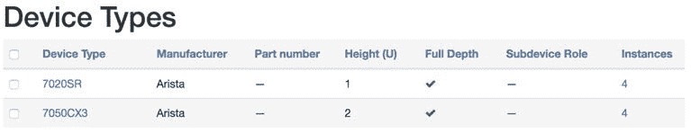

此外，我们设备的所有设备角色都已经填充，如下所示：

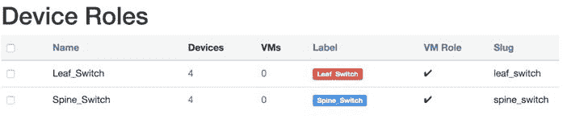

一旦我们已经构建了在 NetBox 中定义设备所需的所有对象（如设备角色和设备类型），我们可以使用`netbox_device` Ansible 内置模块在我们的 Ansible 库存中创建所有设备。以下截图概述了在 NetBox 数据库中正确填充的所有设备：

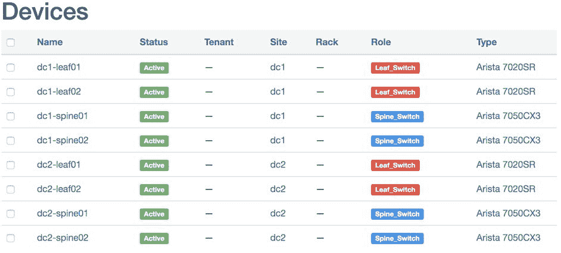

在这个教程中，我们使用`URI`模块触发 API 调用到 NetBox API，以便在其数据库中创建对象。为了更多了解可用的 API 以及每个 API 调用需要传递哪些参数，我们需要查看 NetBox 的 API 文档。API 的文档包含在 NetBox 安装中，可以通过`http:///api/docs/`访问。

# 另请参阅...

+   有关 NetBox API 的更多信息，请访问[`netbox.readthedocs.io/en/stable/api/overview/`](https://netbox.readthedocs.io/en/stable/api/overview/)。

+   有关在 NetBox 上创建设备的 Ansible 模块的更多信息，请访问[`docs.ansible.com/ansible/latest/modules/netbox_device_module.html`](https://docs.ansible.com/ansible/latest/modules/netbox_device_module.html)。

# 在 NetBox 中填充接口

在这个教程中，我们将概述如何在 NetBox 中填充网络设备的接口。这为我们提供了设备的完整清单，并将允许我们为网络设备上的每个接口分配 IP 地址，以及对我们的网络中的网络链接进行建模。

# 准备工作

为了创建网络接口，设备需要已经在之前的教程中创建好。

# 如何做…

1.  更新`group_vars/all.yml`文件，包括每个数据中心网络布局中的点对点链接，如下所示：

```
p2p_ip:
  dc1-leaf01:
    - {port: Ethernet8, ip: 172.10.1.1/31, peer: dc1-spine01, pport: Ethernet1,
peer_ip: 172.10.1.0/31}
    - {port: Ethernet9, ip: 172.10.1.5/31, peer: dc1-spine02, pport: Ethernet1,
peer_ip: 172.10.1.4/31}
< --- Output Omitted for brevity --- >
  dc2-leaf01:
    - {port: Ethernet8, ip: 172.11.1.1/31, peer: dc2-spine01, pport: Ethernet1, peer_ip: 172.11.1.0/31}
    - {port: Ethernet9, ip: 172.11.1.5/31, peer: dc2-spine02, pport: Ethernet1, peer_ip: 172.11.1.4/31}
```

1.  创建一个新任务来为我们库存中所有网络设备创建所有接口，在`tasks/create_device_intf.yml`文件中进行，如下所示：

```
$ cat roles/build_netbox_db/tasks/create_device_intf.yml --- - name: Create Fabric Interfaces on Devices
 netbox_interface: netbox_token: "{{ netbox_token }}" netbox_url: "{{ netbox_url }}" data: device: "{{ inventory_hostname }}" name: "{{ item.port }}" description: "{{ item.type | default('CORE') }} | {{ item.peer }}| {{
item.pport }}" enabled: true mode: Access state: "{{ netbox_state }}" loop: "{{ p2p_ip[inventory_hostname] }}" when: p2p_ip is defined tags: netbox_intfs
```

1.  更新`tasks/main.yml`文件，包括`create_device_intfs.yml`文件，如下所示：

```
$ cat roles/build_netbox_db/tasks/main.yml
< --- Output Omitted for brevity --- >
- name: Create NetBox Device Interfaces  include_tasks: create_device_intf.yml
 tags: netbox_intfs
```

# 它是如何工作的...

为了填充我们数据中心布局中的所有点对点接口，我们首先创建了`p2p_ip`数据结构，其中包含建模这些点对点链接所需的所有参数。然后我们使用`netbox_interface`模块在 NetBox 中创建了所有这些链接。使用相同的模块并遵循完全相同的流程，我们可以在网络设备上建模管理（带外管理）和环回接口。

以下截图显示了 NetBox 中一个设备的接口以及接口的填充情况：

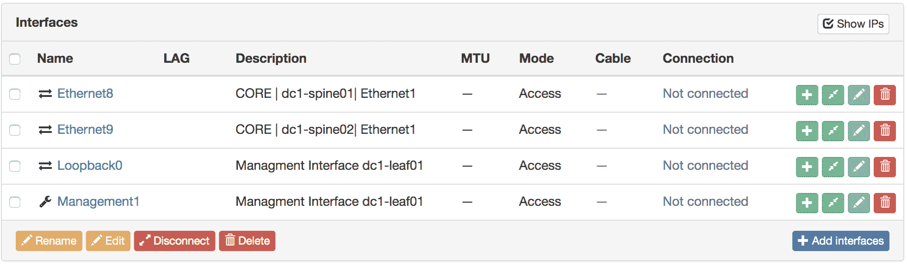

# 另请参阅...

有关用于在 NetBox 上创建接口的 Ansible 模块的更多信息，请访问[`docs.ansible.com/ansible/latest/modules/netbox_interface_module.html#netbox-interface-module`](https://docs.ansible.com/ansible/latest/modules/netbox_interface_module.html#netbox-interface-module)。

# 在 NetBox 中填充 IP 地址

在这个教程中，我们将概述如何在 NetBox 中创建 IP 地址，以及如何将这些地址绑定到每个网络设备的接口上。

# 准备工作

我们库存中每个设备上的网络接口需要在 NetBox 中定义和填充，如前一篇文章所述。

# 如何做…

1.  创建一个新任务来创建所有连接到网络接口的 IP 地址。这是针对我们库存中所有网络设备在`tasks/create_device_intf_ip.yml`文件中进行的，如下所示：

```
$ cat roles/build_netbox_db/tasks/create_device_intf.yml
---
- name: Create Fabric IPs
 netbox_ip_address:
 netbox_token: "{{ netbox_token }}"
 netbox_url: "{{ netbox_url }}"
 data:
 address: "{{ item.ip }}"
 interface:
 name: "{{ item.port }}"
 device: "{{ inventory_hostname }}"
 state: "{{ netbox_state }}"
 loop: "{{ p2p_ip[inventory_hostname] }}"
 tags: netbox_ip
```

1.  更新`tasks/main.yml`文件，包括`create_device_intf_ip.yml`文件，如下所示：

```
$ cat roles/build_netbox_db/tasks/main.yml < --- Output Omitted for brevity --- - name: Create NetBox Device Interfaces IP Address
 include_tasks: create_device_intf_ip.yml tags: netbox_ip
```

# 它是如何工作的...

为了填充数据中心布线中使用的所有点对点 IP 地址，我们在`p2p_ip`数据结构中捕获了这些信息，该数据结构包含了我们数据中心布线中每个接口上分配的所有 IP 地址。我们使用`netbox_ip_address`模块循环遍历这个数据结构，并填充数据中心布线中每个设备上每个接口分配的所有 IP 地址。管理和环回接口也是同样的过程。

以下屏幕截图显示了我们的设备（dc1-leaf01）中接口分配的 IP 地址：

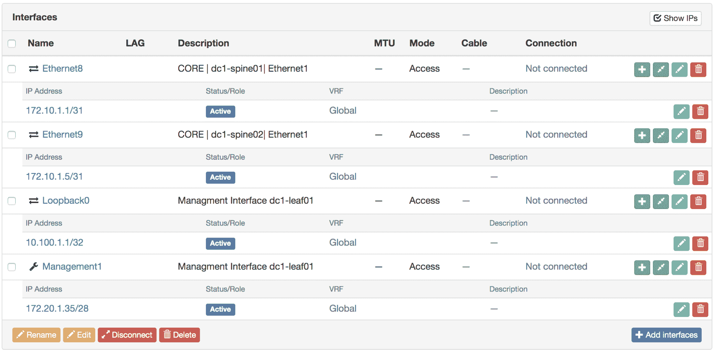

# 另请参阅...

有关用于在 NetBox 上创建 IP 地址的 Ansible 模块的更多信息，请访问[`docs.ansible.com/ansible/latest/modules/netbox_ip_address_module.html#netbox-ip-address-module`](https://docs.ansible.com/ansible/latest/modules/netbox_ip_address_module.html#netbox-ip-address-module)。

# 在 NetBox 中填充 IP 前缀

在这个示例中，我们将看看如何在 NetBox 中创建 IP 前缀。这使我们能够利用 NetBox 作为我们的 IPAM 解决方案，管理网络中的 IP 地址分配。

# 准备工作

在填充 IP 子网或前缀到 NetBox 时，不需要特定的要求，只要我们不将这些前缀绑定到特定站点。如果我们将一些子网绑定到特定站点，那么这些站点需要在分配之前在 NetBox 中定义。

# 如何做...

1.  更新`group_vars/all.yml`文件，包括 IP 前缀信息，如下：

```
$ cat group_vars/all.yml

 < --- Output Omitted for brevity --- >
 subnets:
 -   prefix: 172.10.1.0/24
 role: p2p_subnet
 site: dc1
 -   prefix: 172.11.1.0/24
 role: p2p_subnet
 site: dc2
 -   prefix: 10.100.1.0/24
 role: loopback_subnet
 site: dc1
 -   prefix: 10.100.2.0/24
 role: loopback_subnet
 site: dc2
 -   prefix: 172.20.1.0/24
 role: oob_mgmt_subnet
 site: dc1
 -   prefix: 172.20.2.0/24
 role: oob_mgmt_subnet
 site: dc2
```

1.  更新我们角色定义中的`tasks/main.yml`文件，包括以下任务：

```
$ cat roles/build_netbox_db/tasks/main.yml < --- Output Omitted for brevity --- > - name: Create IP Prefixes
 netbox_prefix: netbox_token: "{{ netbox_token }}" netbox_url: "{{ netbox_url }}" data: prefix: "{{ item.prefix }}" site: "{{ item.site | default(omit) }}" status: Active state: "{{ netbox_state }}" loop: "{{ subnets }}" loop_control: label: "{{ item.prefix }}" run_once: yes tags: netbox_prefix
```

# 工作原理...

我们在`group_vars/all.yml`文件中定义了我们的子网，位于`subnets`数据结构下，然后使用`netbox_prefix`模块循环遍历这个数据结构，并在 NetBox 中填充前缀。

以下屏幕截图显示了 NetBox 中填充的前缀及其各自的利用率：

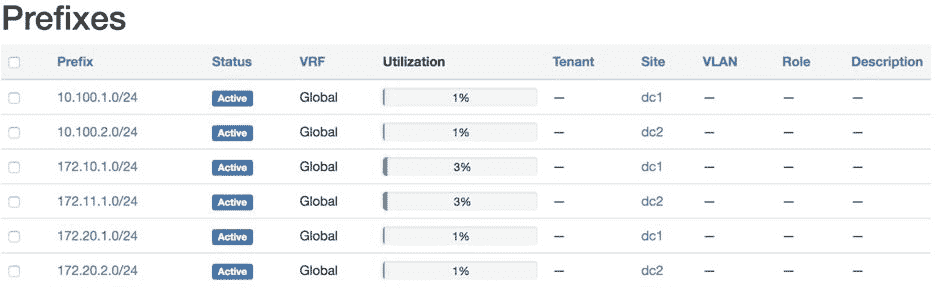

# 另请参阅...

有关用于在 NetBox 上创建 IP 前缀的 Ansible 模块的更多信息，请访问[`docs.ansible.com/ansible/latest/modules/netbox_prefix_module.html#netbox-prefix-module`](https://docs.ansible.com/ansible/latest/modules/netbox_prefix_module.html#netbox-prefix-module)。

# 将 NetBox 用作 Ansible 的动态清单来源

在这个示例中，我们将概述如何将 NetBox 用作动态清单来源。通过这种方法，NetBox 将拥有我们网络基础设施的清单，我们将使用可用的不同分组（如站点、设备角色等）来为 Ansible 构建一个动态清单，并根据 NetBox 对它们进行分组。

# 准备工作

NetBox 和 Ansible 之间的集成需要按照前面的示例中所述的方式进行。

# 如何做...

1.  在您的主目录中，创建一个名为`netbox_dynamic_inventory`的新文件夹。

1.  在这个新目录中，创建一个名为`netbox_inventory_source.yml`的新的 YAML 文件，内容如下：

```
$ cat netbox_dynamic_inventory/netbox_inventory_source.yml --- plugin: netbox api_endpoint: http://172.20.100.111 token: 08be88e25b23ca40a9338d66518bd57de69d4305 group_by:
 - device_roles - sites
```

1.  创建一个名为`pb_create_report.yml`的新 playbook，内容如下：

```
$ cat netbox_dynamic_inventory/pb_create_report.yml

--- - name: Create Report from Netbox Data
 hosts: all gather_facts: no connection: local tasks: - name: Build Report blockinfile: block: | netbox_data:  - { node: {{ node }} , type: {{ hostvars[node].device_types[0] }} , mgmt_ip: {{ hostvars[node].ansible_host }} }  path: ./netbox_report.yaml create: yes delegate_to: localhost run_once: yes
```

# 工作原理...

到目前为止，在本书中我们所概述的所有示例和示例中，我们都使用了一个静态清单文件（在大多数情况下是`hosts`），在那里我们定义了我们的清单，Ansible 在执行我们的 playbook 之前会解析它。在这个示例中，我们将使用不同的清单来源：动态清单。在这种情况下，我们没有一个保存我们清单的静态文件，但是我们将在执行时动态构建我们的清单。在这个示例中，我们的所有清单都在 NetBox 中维护，我们已经将 NetBox 用作我们的清单来源。

对于 Ansible 来说，要使用动态清单源，必须有一个插件来与清单源通信，以检索我们的清单和与之相关的任何变量。从版本 2.9 开始，Ansible 引入了 NetBox 作为可以用作清单源的插件。为了使用这个插件，我们需要定义一个 YAML 文件，概述 Ansible 与 NetBox API 通信所需的不同参数。强制性参数如下：

+   **插件**名称：在我们的情况下，是`NetBox`

+   `**Api_endpoint**`：我们的 NetBox 服务器的 API 端点

+   **令牌**：我们创建的用于在 Ansible 和我们的 NetBox 服务器之间建立通信的身份验证令牌

在 YAML 声明文件中，我们可以指定如何对来自 NetBox 的清单进行分组。我们可以使用`group_by`属性来概述我们将用于分组基础设施的参数。在我们的情况下，我们使用`device_roles`和`sites`来分组我们的基础设施。

# 还有更多

我们可以通过执行以下命令来测试我们的动态清单，以查看 Ansible 如何生成清单：

```
$ ansible-inventory --list -i netbox_inventory_source.yml
```

以下是前述命令的输出片段。它概述了从 NetBox 检索的单个设备的主机变量：

```
{
 "_meta": { "hostvars": { "dc1-leaf01": { "ansible_host": "172.20.1.35", "device_roles": [ "Leaf_Switch" ], "device_types": [ "7020SR" ], "manufacturers": [ "Arista" ], "primary_ip4": "172.20.1.35", "sites": [ "dc1" ] },
```

以下代码片段显示了 Ansible 基于 NetBox 的分组构建的组：

```
    "all": {
        "children": [
            "device_roles_Leaf_Switch",
            "device_roles_Spine_Switch",
            "sites_dc1",
            "sites_dc2",
            "ungrouped"
        ]
    },
    "device_roles_Leaf_Switch": {
        "hosts": [
            "dc1-leaf01",
            "dc1-leaf02",
            "dc2-leaf01",
            "dc2-leaf02"
        ]
    },
```

我们已经创建了一个新的剧本来测试 Ansible 和 NetBox 之间的集成，并确保我们可以使用从 NetBox 检索的数据作为动态清单源。使用我们的新剧本，我们可以为 NetBox 动态清单中的每个设备创建一个简单的报告，以及从 NetBox 发送的一些参数。

当我们运行剧本时，我们会得到以下报告：

```
$ ansible-playbook pb_create_report.yml -i netbox_inventory_source.yml
$ cat netbox_report.yml
# BEGIN ANSIBLE MANAGED BLOCK
netbox_data:
 - { node: dc1-leaf01 , type: 7020SR , mgmt_ip: 172.20.1.35 }
 - { node: dc1-leaf02 , type: 7020SR , mgmt_ip: 172.20.1.36 }
 - { node: dc2-leaf01 , type: 7020SR , mgmt_ip: 172.20.2.35 }
 - { node: dc2-leaf02 , type: 7020SR , mgmt_ip: 172.20.2.36 }
 - { node: dc1-spine01 , type: 7050CX3 , mgmt_ip: 172.20.1.41 }
 - { node: dc1-spine02 , type: 7050CX3 , mgmt_ip: 172.20.1.42 }
 - { node: dc2-spine01 , type: 7050CX3 , mgmt_ip: 172.20.2.41 }
 - { node: dc2-spine02 , type: 7050CX3 , mgmt_ip: 172.20.2.42 }
# END ANSIBLE MANAGED BLOCK
```

# 另请参阅…

有关 NetBox 插件的更多信息，请访问[`docs.ansible.com/ansible/latest/plugins/inventory/netbox.html`](https://docs.ansible.com/ansible/latest/plugins/inventory/netbox.html)。

要了解有关 Ansible 动态清单的更多信息，请访问[`docs.ansible.com/ansible/latest/user_guide/intro_dynamic_inventory.html`](https://docs.ansible.com/ansible/latest/user_guide/intro_dynamic_inventory.html)。

# 使用 NetBox 生成配置

在这个示例中，我们将概述如何使用从 NetBox 检索的数据生成配置并将配置推送到网络设备。

# 准备工作

在这个示例中，我们将继续使用 NetBox 作为我们的动态清单源，因此需要实现前一个示例中概述的所有配置。

# 如何做…

1.  在`netbox_dynamic_inventory`目录下，创建`netbox_data.yml`文件，内容如下：

```
$ cat netbox_data.yml
---
netbox_url: http://172.20.100.111
netbox_token: 08be88e25b23ca40a9338d66518bd57de69d4305
```

1.  创建`pb_build_config.yml`剧本，其中包含一个初始任务，用于读取`netbox_data.yml`文件，如下所示：

```
$ cat pb_build_config.yml --- - name: Create Report from Netbox Data
 hosts: all gather_facts: no connection: local tasks: - name: Read netbox Data include_vars: netbox_data.yml run_once: yes
```

1.  更新`pb_build_config.yml`剧本，包括一个任务，查询 NetBox 当前设备的数据库中的所有接口：

```
 - name: Get Data from Netbox
 uri:
 url: "{{ netbox_url }}/api/dcim/interfaces/?device={{ inventory_hostname
}}"
 method: GET
 headers:
 Authorization: "Token {{ netbox_token }}"
 Accept: 'application/json'
 return_content: yes
 body_format: json
 status_code: [200, 201]
 register: netbox_interfaces
 delegate_to: localhost
 run_once: yes
```

1.  使用以下任务更新剧本，将配置推送到设备：

```
 - name: Push Config
 eos_config:
 lines:
 - description {{ port.description }}
 parent: interface {{ port.name }}
 loop: "{{ netbox_interfaces.json.results }}"
 loop_control:
 loop_var: port
 vars:
 ansible_connection: network_cli
 ansible_network_os: eos
```

# 工作原理…

为了运行我们的剧本，我们需要使用 NetBox 动态清单脚本作为我们的清单源，并执行剧本，如下所示：

```
$ ansible-playbook pb_build_config.yml -i netbox_inventory_source.yml
```

在这个示例中，我们将使用 NetBox 作为我们的真相来源，用于构建我们的清单以及检索给定设备上的接口。我们将使用`GET API`调用 NetBox 上的接口端点，并通过指定仅针对此特定设备的接口来过滤此 API 调用。实现这一点的 API 调用是`api/dcim/interfaces/?device=<deivce-name>/`。

以下代码片段显示了我们从 NetBox 获取的响应：

```
ok: [dc1-spine01] => {
 "netbox_interfaces": {
 "api_version": "2.6",
 "changed": false,
 "connection": "close",
 "json": {
 "results": [
 {
 "description": "CORE | dc1-leaf01| Ethernet8",
 "device": {
 "display_name": "dc1-spine01",
 "id": 44,
 "name": "dc1-spine01",
 "url": "http://172.20.100.111/api/dcim/devices/44/"
 },
 "enabled": true,
 <-- Output Omitted for Brevity -->     
                    "name": "Ethernet1",
<-- Output Omitted for Brevity -->     
                },
```

我们将使用从 API 检索到的数据来配置网络中所有设备的所有端口的描述，根据 NetBox 数据库中的数据。在这种情况下，我们将使用`eos_config`将这些数据推送到我们的 Arista EOS 设备上。我们可以循环遍历从 NetBox 返回的数据，这些数据存储在`netbox_interfaces.json.results`中，并从中提取接口名称和描述。我们还可以使用`eos_config`模块推送这些信息，以在网络中的所有设备上设置正确的描述。
