# 使用 AWX 和 Ansible 简化自动化

在本书的所有先前章节中，我们一直在使用 Ansible，更具体地说是 Ansible Engine，并且使用 Ansible 提供的**命令行界面**（**CLI**）选项执行不同的自动化任务。然而，在跨多个团队的 IT 企业中大规模使用 Ansible 可能具有挑战性。这就是为什么我们将介绍**Ansible Web eXecutable**（**AWX**）框架。AWX 是一个开源项目，是 Red Hat Ansible Tower 的上游项目。

AWX 是 Ansible Engine 的包装器，并提供了额外的功能，以简化在企业中跨不同团队规模运行 Ansible。它提供了多个附加功能，如下：

+   **基于图形用户界面（GUI）的界面**

AWX 提供了一个可视化仪表板来执行 Ansible playbook 并监视其状态，以及提供有关 AWX 中不同对象的不同统计信息。

+   **基于角色的访问控制（RBAC）**

AWX 在 AWX 界面中的所有对象上提供 RBAC，例如 Ansible playbook、Ansible 清单和机器凭据。这种 RBAC 提供了对谁可以创建/编辑/删除 AWX 中不同组件的细粒度控制。这为将简单的自动化任务委托给运维团队提供了一个非常强大的框架，设计团队可以专注于开发 playbook 和工作流程。AWX 提供了定义不同用户并根据其工作角色分配特权的能力。

+   **清单管理**

AWX 提供了一个 GUI 来定义清单，可以将其定义为静态或动态，并且具有定义主机和组的能力，类似于 Ansible 遵循的结构。

+   **凭据管理**

AWX 为凭据提供了集中管理，例如用于访问组织中不同系统（如服务器和网络设备）的密码和**安全外壳**（**SSH**）密钥。一旦创建了所有凭据，它们就会被加密，无法以纯文本格式检索。这提供了对这些敏感信息更多的安全控制。

+   **集中式日志记录**

AWX 在 AWX 节点上收集所有自动化任务的日志，因此可以进行审计以了解谁在哪些节点上运行了哪些 playbook，以及这些 playbook 的状态如何。

+   **表述状态转移（RESTful）应用程序编程接口（API）**

AWX 提供了丰富的 API，允许我们从 API 执行自动化任务；这简化了将 Ansible 与已经存在于典型企业环境中的其他编排和工单系统集成。此外，您可以使用 API 检索从 GUI 访问的所有信息，例如清单。

AWX 项目由多个开源软件项目捆绑在一起，以提供先前列出的所有功能，并构建 AWX 自动化框架。以下图表概述了 AWX 框架内的不同组件：

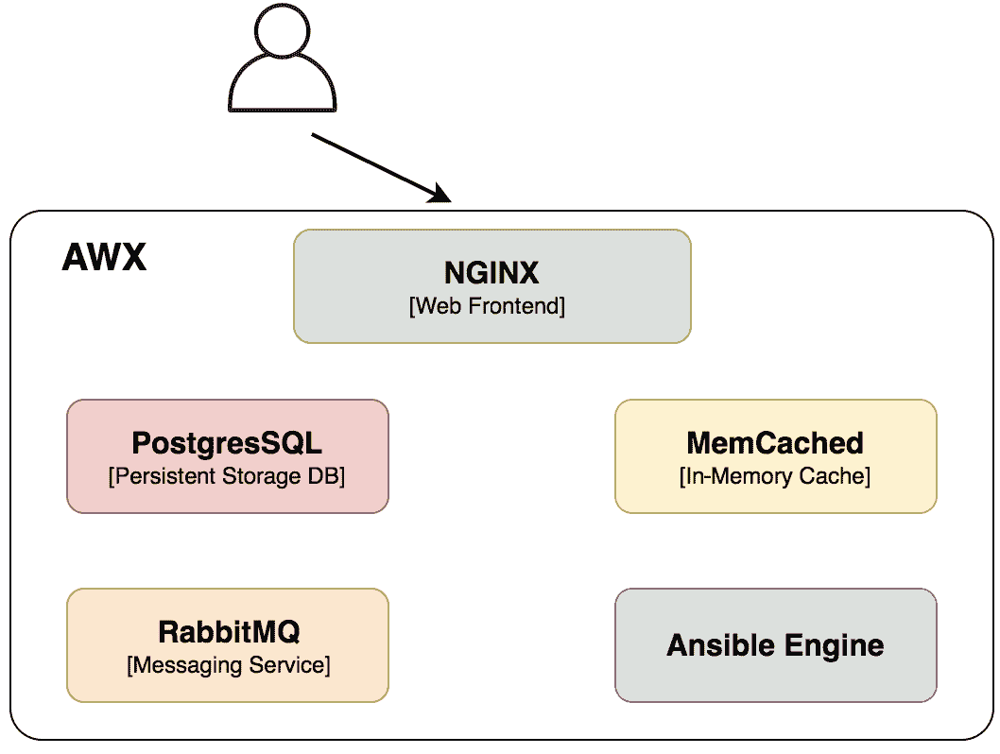

AWX 可以使用不同的部署工具部署，例如 Docker Compose、Docker Swarm 或 Kubernetes。它可以作为独立应用程序部署，也可以作为集群部署（使用 Kubernetes 或 Docker Swarm）。使用集群更复杂；然而，它可以为整个 AWX 部署提供额外的弹性。

这些是本章涵盖的主要内容：

+   安装 AWX

+   在 AWX 上管理用户和团队

+   在 AWX 上创建网络清单

+   在 AWX 上管理网络凭据

+   在 AWX 上创建项目

+   在 AWX 上创建模板

+   在 AWX 上创建工作流模板

+   使用 AWX API 运行自动化任务

# 技术要求

本章中提供的所有代码都可以在以下网址找到：

[`github.com/PacktPublishing/Network-Automation-Cookbook/tree/master/ch12_awx`](https://github.com/PacktPublishing/Network-Automation-Cookbook/tree/master/ch12_awx)

本章基于以下软件版本：

+   运行 Ubuntu 16.04 的 Ansible/AWX 机器

+   Ansible 2.9

+   AWX 9.0.0

有关 AWX 项目的更多信息，请查看以下链接：

+   [`www.ansible.com/products/awx-project`](https://www.ansible.com/products/awx-project)

+   [`www.ansible.com/products/awx-project/faq`](https://www.ansible.com/products/awx-project/faq)

+   [`www.redhat.com/en/resources/awx-and-ansible-tower-datasheet`](https://www.redhat.com/en/resources/awx-and-ansible-tower-datasheet)

# 安装 AWX

AWX 可以以多种不同的方式部署；然而，最方便的方式是使用容器部署。在本文中，我们将概述如何使用 Docker 容器安装 AWS，以便开始与 AWX 界面进行交互。

# 准备工作

准备一个新的 Ubuntu 16.04 机器，我们将在其上部署 AWX-它必须具有互联网连接。

# 如何做…

1.  确保 Python 3 已安装在 Ubuntu Linux 机器上，并且 pip 已安装并升级到最新版本：

```
$ python –version
Python 3.5.2

$ sudo apt-get install python3-pip

$ sudo pip3 install --upgrade pip

$ pip3 --version
pip 19.3.1 from /usr/local/lib/python3.5/dist-packages/pip (python 3.5)
```

1.  在 Linux 机器上安装 Ansible，如下面的代码片段所示：

```
$ sudo pip3 install ansible==2.9
```

1.  在 Ubuntu Linux 机器上安装 Docker，使用以下 URL：[`docs.docker.com/install/linux/docker-ce/ubuntu/`](https://docs.docker.com/install/linux/docker-ce/ubuntu/)。

1.  在 Ubuntu 机器上安装 Docker Compose，使用以下 URL：[`docs.docker.com/compose/install/`](https://docs.docker.com/compose/install/)。

1.  安装`docker`和`docker-compose` Python 模块，如下面的代码片段所示：

```
$ sudo pip3 install docker docker-compose
```

1.  按照以下 URL 在 Ubuntu Linux 机器上安装 Node.js 10.x 和**Node Package Manager**（**npm**）6.x，使用**Personal Package Archive**（**PPA**）方法获取确切和更新的版本：[`www.digitalocean.com/community/tutorials/how-to-install-node-js-on-ubuntu-16-04`](https://www.digitalocean.com/community/tutorials/how-to-install-node-js-on-ubuntu-16-04)。

1.  创建一个名为`ch12_awx`的新目录，并将 AWX 项目 GitHub 存储库克隆到一个名为`awx_src`的新目录中：

```
$ mkdir ch12_awx

$ cd ch12_awx

$ git clone [`github.com/ansible/awx`](https://github.com/ansible/awx) awx_src
```

1.  切换到安装目录并运行安装 playbook：

```
$ cd awx_src/installer

$ ansible-playbook -i inventory install.yml
```

# 工作原理…

正如介绍中所概述的，AWX 由多个组件组合在一起以提供完整的框架。这意味着可以通过安装每个组件并对其进行配置来部署 AWX，然后集成所有这些不同的产品以创建 AWX 框架。另一种选择是使用基于容器的部署，在微服务架构中为每个组件创建一个容器，并将它们组合在一起。基于容器的方法是推荐的方法，这也是我们用来部署 AWX 的方法。

由于我们将使用容器，因此需要在这些不同的组件之间进行编排；因此，我们需要一个容器编排工具。AWX 支持在 Kubernetes、OpenShift 和`docker-compose`上部署，其中最简单的是`docker-compose`。因此，本文档中概述的方法就是这种方法。

AWX 安装程序要求在部署节点上存在 Ansible，因为安装程序是基于 Ansible playbooks 的。这些 playbooks 构建/下载 AWX 不同组件的容器（PostgreSQL、NGINX 等），创建`docker-compose`声明文件，并启动容器。因此，我们的第一步是安装 Ansible。然后，我们需要安装`docker`和`docker-compose`，以及安装和正确运行 AWX 容器所需的其他依赖项。

一旦我们安装了所有这些先决条件，我们就准备安装 AWX。我们克隆 AWX 项目的 GitHub 存储库，在这个存储库中，有一个`installer`目录，其中包含了部署容器的所有 Ansible 角色和 playbook。`installer`目录有一个`inventory`文件，定义了我们将部署 AWX 框架的主机；在这种情况下，它是本地主机。`inventory`文件还列出了其他变量，如管理员密码，以及 PostgreSQL 和 RabbitMQ 数据库的密码。由于这是一个演示部署，我们不会更改这些变量，而是使用这些默认参数进行部署。

安装完成后，我们可以验证所有 Docker 容器是否正常运行，如下所示：

```
$ sudo docker ps
```

这给我们以下输出：

| **容器 ID 状态** | **镜像 端口** | **命令** | **创建时间 名称** |
| --- | --- | --- | --- |
| `225b95337b6d` Up 2 hours | `ansible/awx_task:7.0.0` `8052/tcp` | "`/tini -- /bin/sh -c…`" | 30 hours ago `awx_task` |
| `2ca06bd1cd87` Up 2 hours | `ansible/awx_web:7.0.0` `0.0.0.0:80->8052/tcp` | "`/tini -- /bin/sh -c…`" | 30 hours ago `awx_web` |
| `66f560c62a9c` Up 2 hours | `memcached:alpine` `11211/tcp` | "`docker-entrypoint.s…`" | 30 hours ago `awx_memcached` |
| `fe4ccccdb511` Up 2 hours | `postgres:10` `5432/tcp` | "`docker-entrypoint.s…`" | 30 hours ago `awx_postgres` |
| `24c997d5991c` Up 2 hours | `ansible/awx_rabbitmq:3.7.4` `4369/tcp, 5671-5672/tcp, 15671-15672/tcp, 25672/tcp` | "`docker-entrypoint.s…`" | 30 hours ago `awx_rabbitmq` |

我们可以通过打开 Web 浏览器并使用以下凭据连接到机器的**IP**地址来登录 AWX GUI：

+   用户名：`admin`

+   密码：`password`

可以在下图中看到：

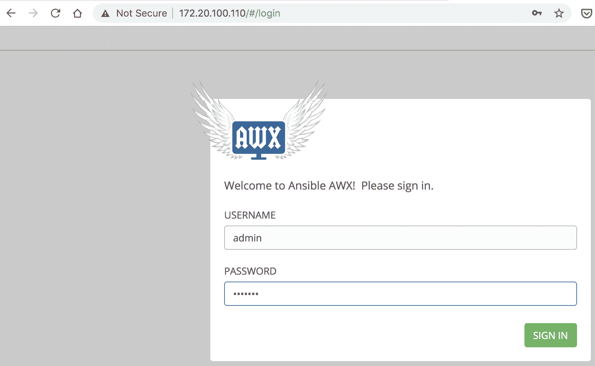

一旦我们登录 AWX，我们将看到主要的仪表板，以及左侧面板上可用于配置的所有选项（组织、团队、项目等）：

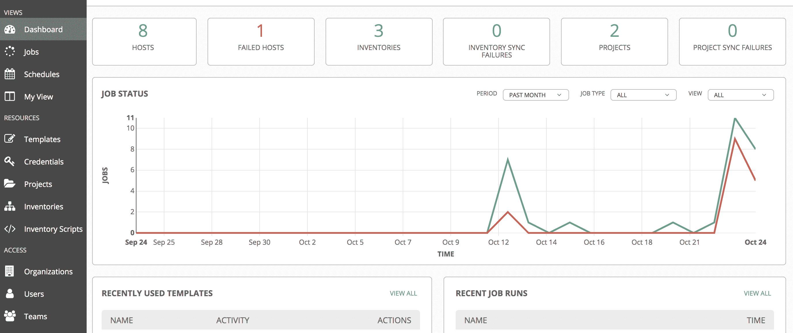

# 还有更多...

为了简化 AWX 的所有先决条件的部署，我包含了一个名为`deploy_awx.yml`的 Ansible playbook，以及用于编排所有 AWX 组件部署的多个角色。我们可以使用这个 playbook 来部署 AWX 组件，如下所示：

1.  按照本教程在机器上安装 Ansible。

1.  克隆本章的 GitHub 存储库。

1.  切换到`ch12_awx`文件夹，如下所示：

```
$ cd ch12_awx
```

1.  从这个目录里面，运行 playbook：

```
$ ansible-playbook -i awx_inventory deploy_awx.yml
```

# 另请参阅...

有关 AWX 安装的更多信息，请查看以下链接：

[`github.com/ansible/awx/blob/devel/INSTALL.md`](https://github.com/ansible/awx/blob/devel/INSTALL.md)

# 在 AWX 上管理用户和团队

在本教程中，我们将概述如何在 AWX 中创建用户和团队。这是实施 RBAC 并强制执行组织内不同团队的特权的方法，以便更好地控制可以在 AWX 平台上执行的不同活动。

# 准备工作

AWX 应按照前面的教程进行部署，并且所有以下任务必须使用`admin`用户帐户执行。

# 如何做…

1.  为所有网络团队创建一个新的组织，如下图所示，通过从左侧面板选择组织并按下保存按钮：

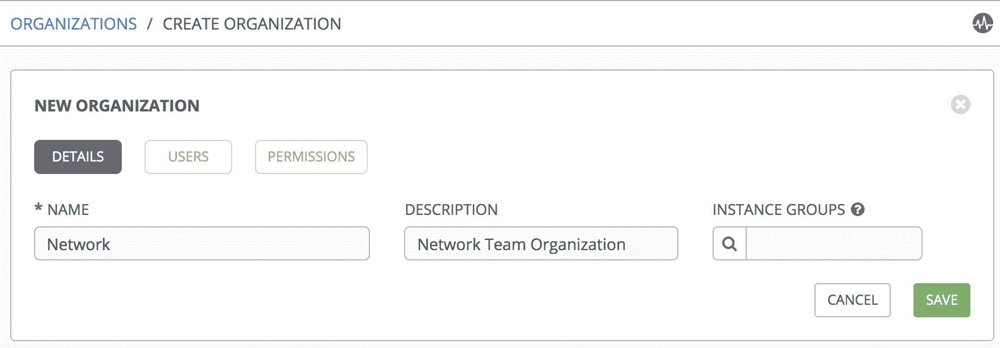

1.  通过从左侧面板选择团队，在网络组织中为设计团队创建一个新团队：

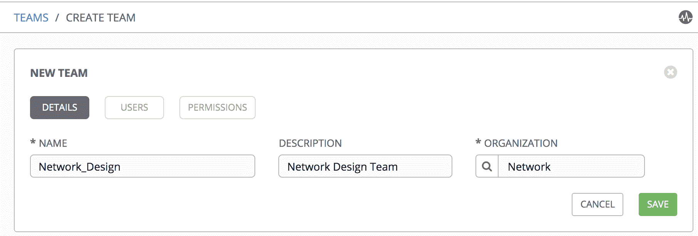

1.  在网络组织中为运维团队创建另一个团队，如下图所示：

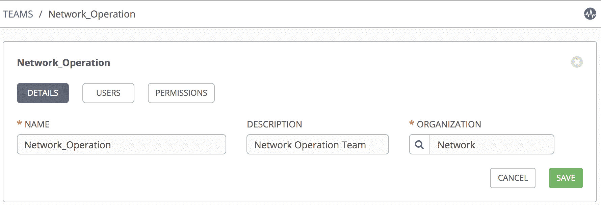

1.  通过选择用户按钮，在网络组织中创建一个`core`用户，如下图所示：

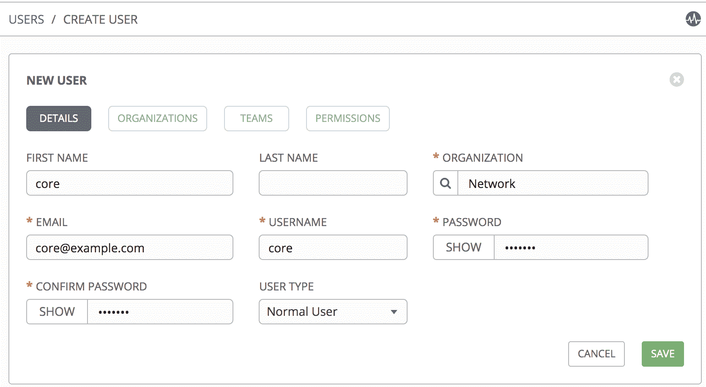

1.  将这个新用户分配给`Network_Design`团队，从左侧面板点击 TEAMS 标签，然后选择`Network_Design`团队。点击 USERS，然后将`core`用户添加到这个团队，如下截图所示：

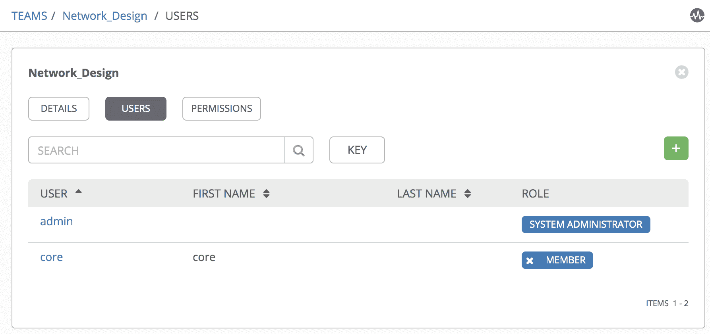

1.  重复上述步骤，创建一个`noc`用户，并将其分配给`Network_Operation`团队。

1.  对于`Network_Design`团队，将项目管理员、凭证管理员和库存管理员权限分配给组织，如下截图所示：

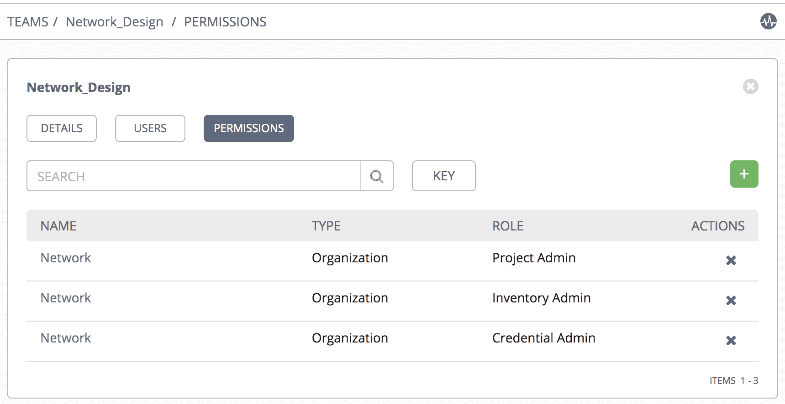

# 工作原理…

AWX 的主要特性之一是其 RBAC，这是通过 AWX 内的不同对象实现的。这些对象主要是组织、用户和团队。由于 AWX 应该是企业规模的自动化框架，组织内的不同团队需要在 AWX 中共存。这些团队中的每一个都管理着自己的设备，并维护着自己的 playbooks，以管理其受管基础设施。在 AWX 中，**组织**是我们区分企业内不同组织的方法。在我们的示例中，我们创建了一个网络组织，将负责网络基础设施的所有团队和用户分组在一起。

在组织内，我们有不同角色的不同用户，他们应该对我们的中央自动化 AWX 框架具有不同级别的访问权限。为了简化为每个用户分配正确角色的过程，我们使用**团队**的概念来将具有相似特权/角色的用户分组。因此，在我们的情况下，我们创建了两个**团队**：`Network_Design`和`Network_Operation`团队。这两个团队的角色和权限描述如下：

+   `Network_Design`团队负责创建 playbooks 和创建网络清单，以及访问这些设备的正确凭据。

+   `Network_Operation`团队有权查看这些清单，并执行由设计团队开发的 playbook。

这些不同的构造共同工作，为每个用户构建了精细的 RBAC，利用了 AWX 框架。

由于我们已经将项目管理员、库存管理员和凭证管理员角色分配给`Network_Design`团队，因此该团队内的所有用户都能够仅在 Network 组织内创建/编辑/删除和使用所有这些对象。

# 另请参阅...

有关 RBAC 和如何使用用户和**团队**的更多信息，请查看以下链接以了解 Ansible Tower：

+   [`docs.ansible.com/ansible-tower/latest/html/userguide/organizations.html`](https://docs.ansible.com/ansible-tower/latest/html/userguide/organizations.html)

+   [`docs.ansible.com/ansible-tower/latest/html/userguide/users.html`](https://docs.ansible.com/ansible-tower/latest/html/userguide/users.html)

+   [`docs.ansible.com/ansible-tower/latest/html/userguide/teams.html`](https://docs.ansible.com/ansible-tower/latest/html/userguide/teams.html)

# 在 AWX 上创建网络清单

在本教程中，我们将概述如何在 AWX 中创建网络清单。清单是基础，因为它们描述了我们的网络基础设施，并为我们提供了有效地对我们的网络设备进行分组的能力。

# 准备工作

AWX 必须已安装并可访问，并且用户帐户必须按照前面的教程部署。

# 如何操作…

1.  通过转到左侧导航栏上的 INVENTORIES 标签，创建一个名为`mpls_core`的新清单，如下截图所示：

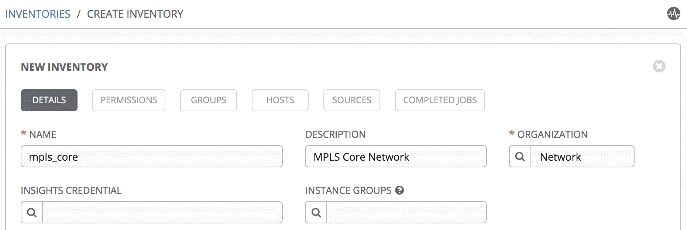

1.  创建一个名为`junos`的新组，如下截图所示：

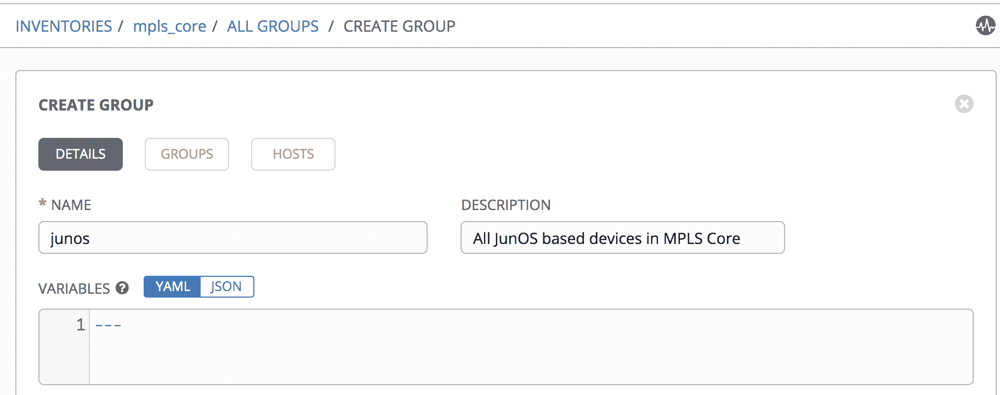

1.  使用类似的方法创建`iosxr`、`pe`和`P`组。在 mpls_core 清单下的最终组结构应该类似于下面截图中显示的结构：

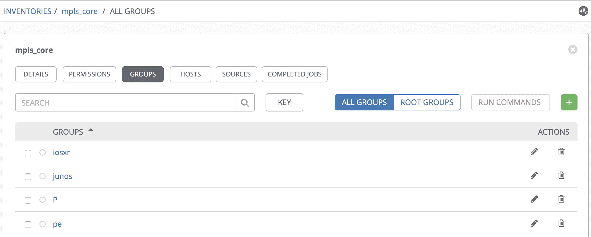

1.  在 HOSTS 选项卡下创建`mxpe01`主机设备，并在 VARIABLES 部分创建`ansible_host`变量，如下截图所示：

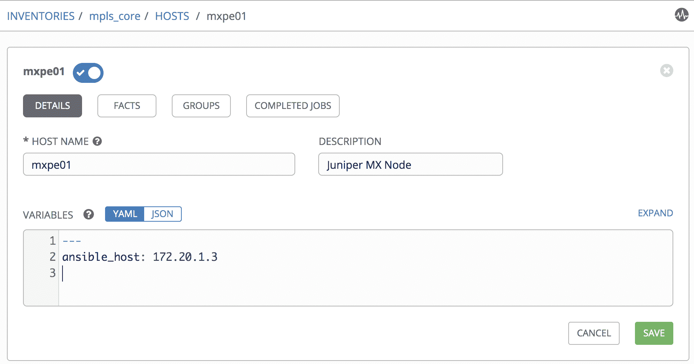

1.  重复相同的过程来创建剩余的主机。

1.  进入我们创建的`junos`组，并添加相应的主机，如下截图所示：

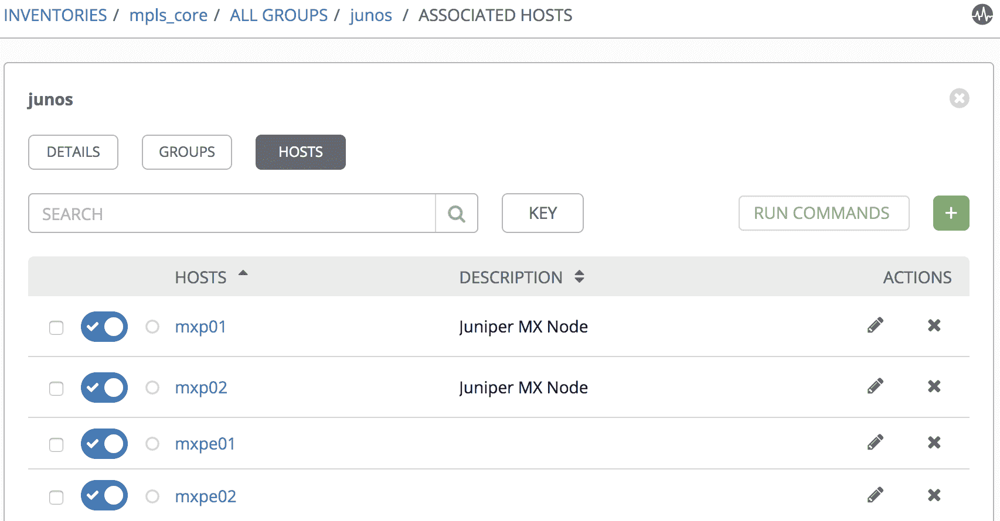

1.  对所有剩余的组重复这个步骤。

1.  创建`mpls_core`清单后，我们将为`Network_Operation`组授予对该清单的读取权限，如下截图所示：

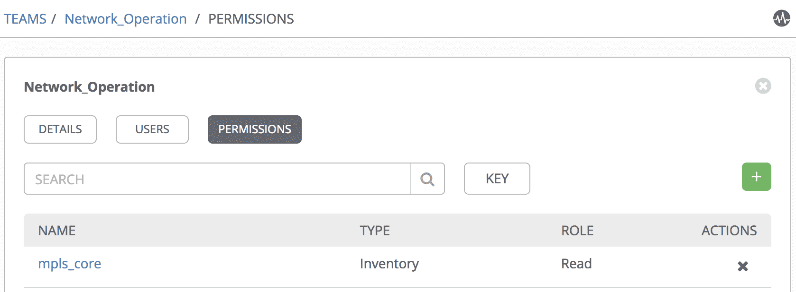

# 工作原理…

在这个配方中，我们正在为我们的网络建立清单。这是定义我们所有 Ansible playbooks 中使用的清单文件的确切步骤。下面的代码块显示了我们通常在使用 Ansible 时定义的静态清单文件，以及我们如何使用 AWX 中的清单定义相同的结构：

```
[pe]
mxpe01    ansible_host=172.20.1.3
mxpe02    ansible_host=172.20.1.4
xrpe03    ansible_host=172.20.1.5

[p]
mxp01     ansible_host=172.20.1.2
mxp02     ansible_host=172.20.1.6
[junos]
mxpe01
mxpe02
mxp01
mxp02

[iosxr]
xrpe03
```

我们可以在组或主机级别为我们的清单定义变量。在我们的情况下，我们为每个主机定义了`ansible_host`变量，以便告诉 AWX 如何访问清单中的每个主机。

我们更新清单的权限，以便运维团队可以对其进行读取，以查看其组件。由于设计团队拥有清单管理员权限，设计团队对网络组织中创建的所有清单都拥有完全的管理权限。我们可以查看清单的权限，如下截图所示：

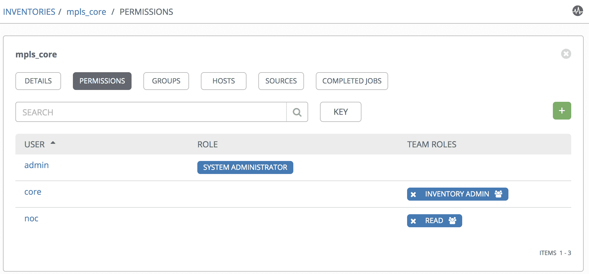

# 在 AWX 上管理网络凭据

为了让 AWX 开始与我们的基础设施进行交互并运行所需的 playbook，我们需要定义正确的网络凭据来登录到我们的网络基础设施。在这个配方中，我们概述了如何创建所需的网络凭据，以便 AWX 登录到网络设备并开始在我们管理的网络清单上执行 playbook。我们还将概述如何在 AWX 中使用 RBAC，以便在组织内不同团队之间轻松共享这些敏感数据。

# 准备工作…

AWX 必须被安装并且可达，用户账户必须被部署，就像在之前的配方中所概述的那样。

# 如何做…

1.  在左侧导航栏的 CREDENTIALS 选项卡中，创建访问网络设备所需的登录凭据。我们将使用 Machine 凭据类型，因为我们将使用新的连接模块，如`network_cli`、`NETCONF`或`httpapi`来访问设备。指定用于登录设备的用户名和密码：

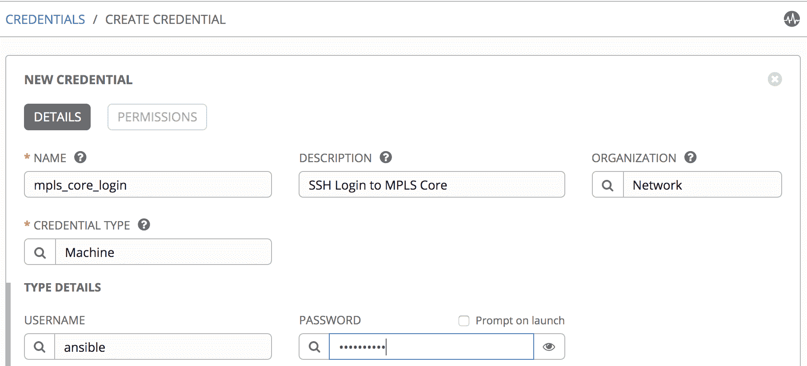

1.  更新我们创建的凭据的权限，以便`Network_Design`团队是凭据管理员，`Network_Operation`团队具有只读权限。以下是凭据权限的应用方式：

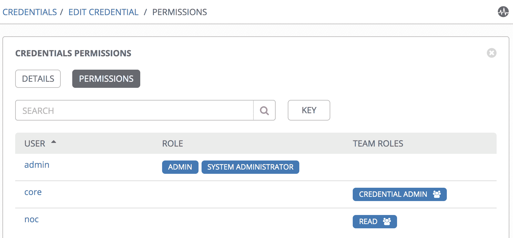

# 工作原理…

在这个配方中，我们创建了访问网络设备所需的网络凭据，并在 AWX GUI 界面上指定了登录到设备所需的用户名和密码。当我们在 AWX 界面上输入密码时，它会被加密，然后以加密格式存储在 PostgreSQL 数据库中，我们无法以明文查看。这在 AWX 框架内提供了额外的密码处理安全性，并提供了一个简单的程序来在组织内共享和利用敏感信息，因此`Admin`或授权用户可以创建和编辑凭据，并可以向所需的用户/团队授予对这些凭据的用户权限。这些用户只使用凭据，但他们没有任何管理权限来查看或更改它们。与使用 Ansible 和`ansible-vault`相比，这大大简化了密码管理。

AWX 提供不同的凭据类型来访问不同的资源，如物理基础设施、云提供商和版本控制系统（VCS）。在我们的情况下，我们使用机器凭据类型，因为我们使用 SSH 连接到我们的网络基础设施，需要用户名和密码。

# 另请参阅...

有关 AWX 凭据的更多信息，请查看以下 URL：

[`docs.ansible.com/ansible-tower/latest/html/userguide/credentials.html`](https://docs.ansible.com/ansible-tower/latest/html/userguide/credentials.html)

# 在 AWX 上创建项目

在本教程中，我们将概述如何在 AWX 上创建项目。在 AWX 中，项目是一个表示 Ansible 剧本（或剧本）的对象，其中包括执行此剧本所需的所有相关文件和文件夹。

# 准备工作

AWX 必须已安装并可访问，并且必须部署用户帐户，如前一教程中所述。

# 如何做…

1.  创建一个新目录`awx_sample_project`，用于保存我们的 AWX 项目的所有文件和文件夹。

1.  创建一个`group_vars/all.yml`剧本，内容如下：

```
p2p_ip:
 xrpe03:
 - {port: GigabitEthernet0/0/0/0, ip: 10.1.1.7/31 , peer: mxp01, pport: ge-0/0/2, peer_ip: 10.1.1.6/31}
 - {port: GigabitEthernet0/0/0/1, ip: 10.1.1.13/31 , peer: mxp02, pport: ge-0/0/2, peer_ip: 10.1.1.12/31}
```

1.  创建一个`group_vars/iosxr.yml`剧本，内容如下：

```
ansible_network_os: iosxr
ansible_connection: network_cli
```

1.  创建一个`group_vars/junos.yml`剧本，内容如下：

```
ansible_network_os: junos
ansible_connection: netconf
```

1.  创建一个`pb_deploy_interfaces.yml`剧本，内容如下：

```
---
- name: get facts
 hosts: all
 gather_facts: no
 tasks:
 - name: Enable Interface
 iosxr_interface:
 name: "{{ item.port }}"
 enabled: yes
 loop: "{{ p2p_ip[inventory_hostname] }}"
 - name: Configure IP address
 iosxr_config:
 lines:
 - ipv4 address {{ item.ip | ipaddr('address') }} {{item.ip | ipaddr('netmask') }}
 parents: interface {{ item.port }}
 loop: "{{ p2p_ip[inventory_hostname] }}"
```

1.  创建一个`pb_validate_interfaces.yml`剧本，内容如下：

```
---
- name: Get IOS-XR Facts
 hosts: iosxr
 gather_facts: no
 tasks:
 - iosxr_facts:
 tags: collect_facts
 - name: Validate all Interfaces are Operational
 assert:
 that:
 - ansible_net_interfaces[item.port].operstatus == 'up'
 loop: "{{ p2p_ip[inventory_hostname] }}"
 - name: Validate all Interfaces with Correct IP
 assert:
 that:
 - ansible_net_interfaces[item.port].ipv4.address == item.ip.split('/')[0]
 loop: "{{ p2p_ip[inventory_hostname] }}"
```

1.  我们的新文件夹将具有以下目录结构：

```
.
├── group_vars
│   ├── all.yml
│   ├── iosxr.yml
│   └── junos.yml
├── pb_deploy_interfaces.yml
└── pb_validate_interface.yml
```

1.  在您的 GitHub 帐户上，创建一个名为`awx_sample_project`的新公共仓库：

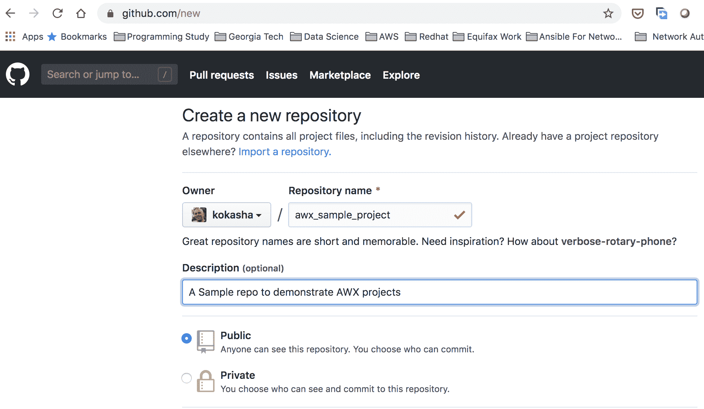

1.  在我们的`awx_sample_repo`项目文件夹中，初始化一个 Git 仓库并将其链接到我们在上一步创建的 GitHub 仓库，如下代码块所示：

```
git init
git commit -m “Initial commit”
git add remote origin git@github.com:kokasha/awx_sample_project.git
git push origin master
```

1.  在 AWX 界面上，根据 Git 创建一个新项目，如下截图所示：

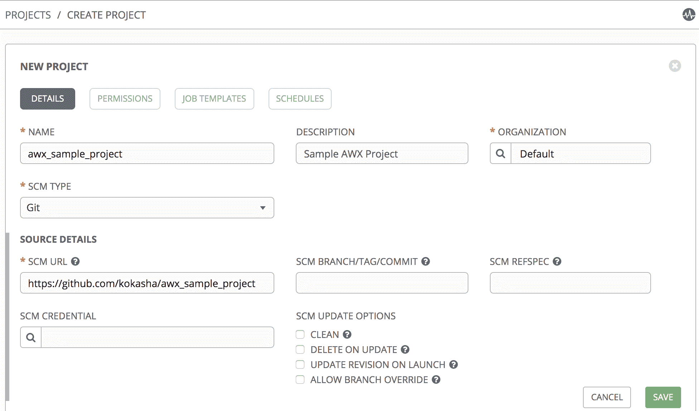

# 它是如何工作的…

AWX 的主要目标之一是简化与 Ansible 剧本的协作，以及简化运行和执行 Ansible 剧本的方式。为了实现这些目标，与 AWX 一起使用 Ansible 剧本的最佳和最常见方法是使用存储和跟踪在 Git 版本控制中的 AWX 项目。这种方法允许我们将用于我们的 Ansible 剧本的代码开发（存储和版本控制使用 Git）与剧本执行（将由 AWX 处理）分开。

我们遵循与使用 Ansible 开发项目相同的逻辑，通过创建一个文件夹来保存我们项目的所有文件和文件夹。这包括`group_vars`和`host_vars`文件夹，用于指定我们的变量，我们还定义了项目所需的不同剧本。我们将所有这些文件和文件夹保存在一个 Git 仓库中，并将它们托管在 GitHub 或 GitLab 等 Git VCS 上。

为了让 AWX 开始使用我们开发的剧本，我们在 AWX 中创建一个新项目，并选择基于 Git，然后提供包含此项目的 Git 仓库的 URL。我们还提供所需的任何其他信息，例如要使用哪个分支；如果这是一个私有 Git 仓库，我们提供访问它所需的凭据。

完成此步骤后，AWX 界面将获取此 Git 仓库的所有内容并将其下载到此位置，默认情况下为`/var/lib/awx/projects`。在此阶段，我们在 AWX 节点上本地存储了此仓库的所有内容，以便开始运行我们的剧本来针对我们的网络节点。

# 另请参阅...

有关 AWX 项目的更多信息，请查看以下 URL：

+   [`docs.ansible.com/ansible-tower/latest/html/userguide/projects.html`](https://docs.ansible.com/ansible-tower/latest/html/userguide/projects.html)

# 在 AWX 上创建模板

在这个配方中，我们将概述如何在 AWX 中组合清单、凭据和项目，以创建模板。AWX 中的模板允许我们为 Ansible playbooks 创建标准的运行环境，可以根据用户的角色执行不同的用户。

# 准备工作

AWX 界面必须安装，并且必须创建凭据、清单和项目，如前面的配方中所述。

# 如何做到…

1.  在 AWX 中创建一个名为`provision_interfaces`的新模板，并为其分配我们创建的清单和凭据。我们将使用`awx_sample_project`目录，如下截图所示：

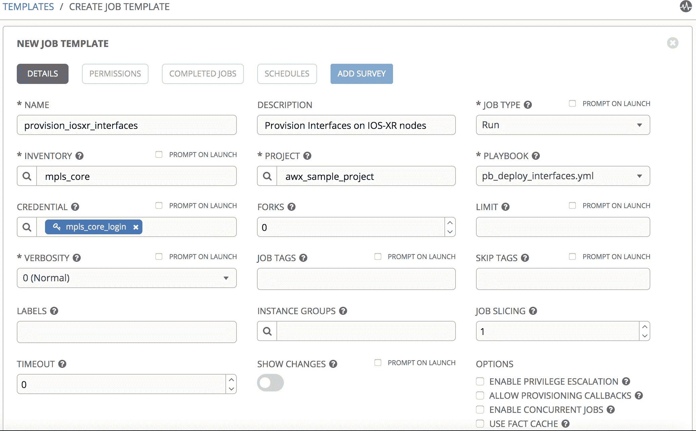

1.  我们更新了此模板的权限，以便`Network_Design`团队是`ADMIN`，`Network_Operation`团队具有 EXECUTE 角色，如下截图所示：

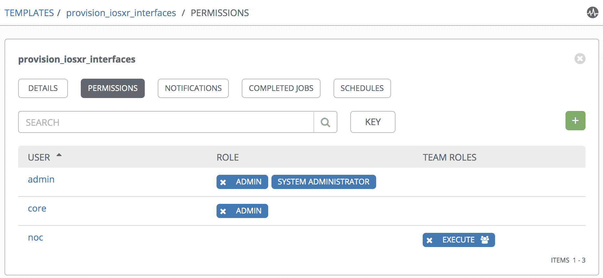

1.  使用相同的步骤再次创建一个名为`interface_validation`的模板，使用`pb_validate_interfaces.yml` playbook。

# 它是如何工作的…

在这个配方中，我们概述了如何组合我们之前配置的所有不同部分，以便在 AWX 上执行我们的 playbooks。AWX 使用模板来创建这种标准的执行环境，我们可以使用它来从 AWX 运行我们的 Ansible playbooks。

我们使用给定名称创建了模板，并指定了不同的参数，以创建此环境以执行我们的 playbook，如下所示：

+   我们提供了我们要执行 playbook 的清单。

+   我们提供了执行 playbook 所需的所有必要凭据（可以是一个或多个凭据）。

+   我们提供了我们将选择要运行的 playbook 的项目。

+   我们从这个项目中选择了 playbook。

我们可以在我们的模板中指定其他可选参数，例如以下内容：

+   在执行此 playbook 时，是否运行此 playbook 或使用检查模式。

+   我们是否要在清单上设置限制，以便针对其的子集进行目标定位。

+   我们想要指定的任何 Ansible 标记。

最后，我们可以为组织中的所有用户定制此模板的权限，在我们的情况下，我们为`Network_Design`团队提供 ADMIN 角色，为`Network_Operation`团队提供 EXECUTE 角色。在这种情况下，`Network_Operation`团队可以执行此 playbook，而`Network_Design`团队可以编辑和更改此模板的不同参数。

一旦我们保存了这个模板，我们可以从中启动一个作业，并从导航栏左侧的 JOBS 选项卡监视其结果：

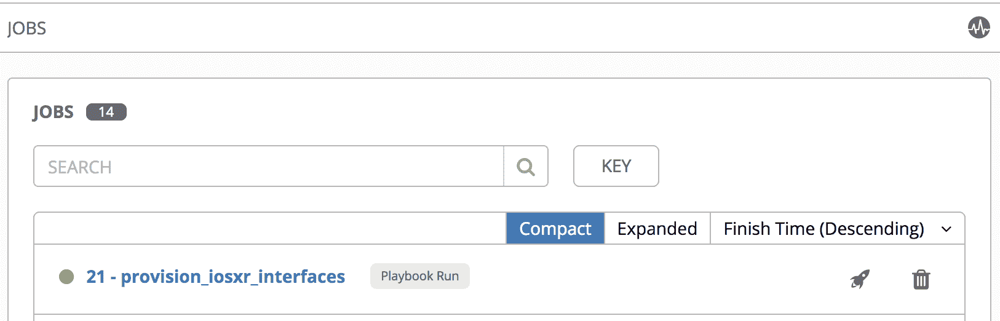

我们还可以像在 Ansible 中一样，通过单击相应的作业来查看此 playbook 运行的详细信息，如下截图所示：

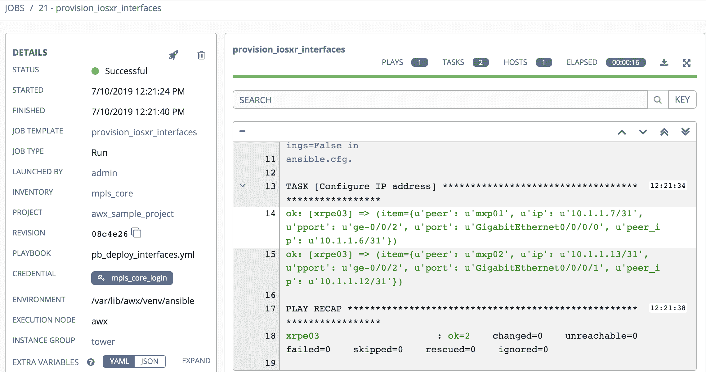

# 另请参阅…

有关 AWX 模板以及可用于自定义模板的不同选项的更多信息，请查看以下 URL：

[`docs.ansible.com/ansible-tower/latest/html/userguide/job_templates.html`](https://docs.ansible.com/ansible-tower/latest/html/userguide/job_templates.html)

# 在 AWX 上创建工作流模板

在这个配方中，我们将概述如何使用工作流模板在 AWX 上创建更复杂的模板，以运行多个 playbook 以实现共同的目标。这是一个高级功能，我们在 AWX 中组合多个模板以完成任务。

# 准备工作

AWX 模板按照前一章中的配置进行配置。

# 如何做到…

1.  从 TEMPLATES 选项卡中，创建一个 NEW WORKFLOW JOB TEMPLATE，如下截图所示：

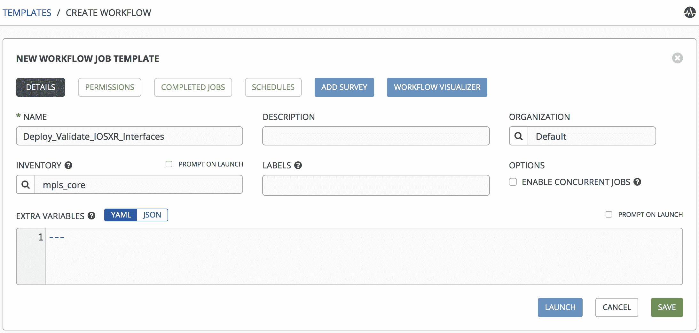

1.  使用工作流可视化器，创建如下截图中概述的工作流：

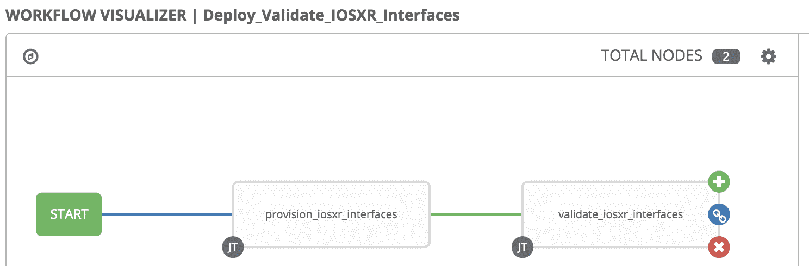

1.  根据以下截图在工作流模板上分配正确的权限：

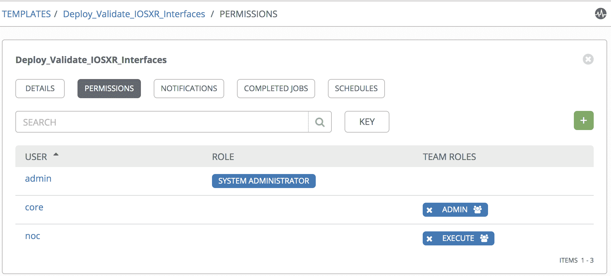

# 工作原理…

如果我们的自动化任务需要运行多个 playbook 以实现我们的目标，我们可以使用 AWX 中的工作流模板功能来协调多个模板以实现此目标。模板可以根据工作流模板中包含的任务的成功和失败的不同标准进行组合。

在我们的示例中，我们使用工作流模板来在 IOS-XR 节点上配置接口；然后，我们验证所有配置是否正确应用，并且当前的网络状态是否符合我们的要求。我们将`provision_interface`模板和`validate_interfaces`模板组合在一起以实现这一目标。我们首先配置接口，在此任务成功后，我们运行验证 playbook。

我们可以在“作业”选项卡中检查组合工作流的状态，如下截图所示：

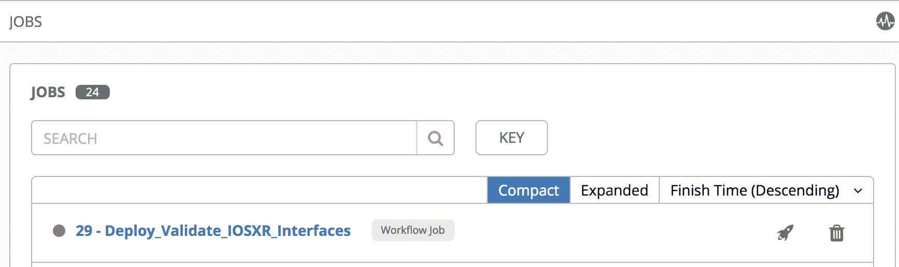

此外，我们可以通过在“作业”选项卡中点击工作流名称并查看该工作流中每个任务的详细信息来深入了解此工作流的详细信息：

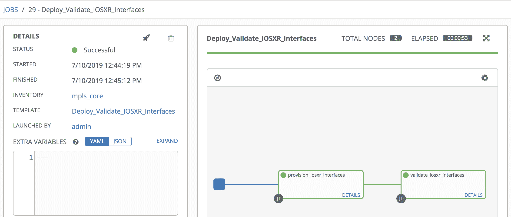

# 另请参阅…

有关 AWX 工作流模板的更多信息，请查看以下 URL：

+   [`docs.ansible.com/ansible-tower/latest/html/userguide/workflow_templates.html`](https://docs.ansible.com/ansible-tower/latest/html/userguide/workflow_templates.html)

# 使用 AWX API 运行自动化任务

在本教程中，我们将概述如何使用 AWX API 在 AWX 上启动作业。AWX 的主要功能之一是提供强大的 API，以便与 AWX 系统交互，查询 AWX 中的所有对象，并从 AWX 框架执行自动化任务，如模板和工作流模板。我们还可以使用 API 列出所有用户/团队以及在 AWX 界面上可用和配置的所有不同资源。

# 准备就绪

AWX 界面必须已安装并可访问，并且必须根据前几章的概述配置模板和工作流模板。

为了执行与 AWX API 交互的命令，我们将使用`curl`命令来启动 HTTP 请求到 AWX 端点。这需要在机器上安装 cURL。

# 操作步骤…

1.  通过列出通过此 API 可用的所有资源来开始探索 AWX API，如下面的代码片段所示：

```
curl -X GET  http://172.20.100.110/api/v2/
```

1.  使用以下 REST API 调用收集在 AWX 界面上配置的所有作业模板，并获取每个作业模板的 ID：

```
curl -X GET --user admin:password  http://172.20.100.110/api/v2/job_templates/ -s | jq
```

1.  使用以下 REST API 调用在 AWX 界面上配置的作业模板中启动作业模板。在此示例中，我们正在启动 ID=`7`的`job_Templates`：

```
curl -X POST --user admin:password http://172.20.100.110/api/v2/job_templates/7/launch/ -s | jq
```

1.  使用以下调用获取从前面的 API 调用启动的作业的状态。`ID=35`是从前面的 API 调用中检索到的，用于启动作业模板：

```
curl -X GET --user admin:password http://172.20.100.110/api/v2/jobs/35/ | jq
```

1.  使用以下 API 调用收集在 AWX 界面上配置的所有工作流模板，并记录每个模板的 ID：

```
curl -X GET --user admin:password http://172.20.100.110/api/v2/workflow_job_templates/ -s | jq
```

1.  使用从前面的 API 调用中检索到的 ID 启动工作流作业模板：

```
curl -X POST --user admin:password http://172.20.100.110/api/v2/workflow_job_templates/14/launch/ -s | jq
```

# 工作原理…

AWX 提供了一个简单而强大的 REST API，用于检索和检查 AWX 系统的所有对象和组件。使用此 API，我们可以与 AWX 界面交互，以启动自动化任务，并检索这些任务的执行状态。在本教程中，我们概述了如何使用 cURL 命令行工具与 AWX API 进行交互；如何使用其他工具如 Postman 与 API 进行交互；以及如何使用任何编程语言，如 Python 或 Go，构建更复杂的脚本和应用程序，以消耗 AWX API。在我们的所有示例中，我们都使用`jq` Linux 实用程序，以便以良好的格式输出每个 API 调用返回的 JSON 数据。

我们首先通过检查`http://<AWX Node IP>/api/v2/`的**统一资源标识符**（**URI**）来探索通过 AWX API 发布的所有端点，这将返回通过此 API 可用的所有端点。以下是这个输出的一部分：

```
$ curl -X GET http://172.20.100.110/api/v2/ -s | jq
{
 "ping": "/api/v2/ping/",
 "users": "/api/v2/users/",
 "projects": "/api/v2/projects/",
 "project_updates": "/api/v2/project_updates/",
 "teams": "/api/v2/teams/",
 "credentials": "/api/v2/credentials/",
 "inventory": "/api/v2/inventories/",
 "groups": "/api/v2/groups/",
 "hosts": "/api/v2/hosts/",
 "job_templates": "/api/v2/job_templates/",
 "jobs": "/api/v2/jobs/",
}
```

然后，我们通过访问相应的 API 端点列出在 AWX 界面上配置的所有作业模板。这个 API 调用使用`GET`方法，并且必须经过身份验证；这就是为什么我们使用`--user`选项来传递用户的用户名和密码。以下代码片段概述了这个调用返回的一些值：

```
$ curl -X GET --user admin:password  http://172.20.100.110/api/v2/job_templates/ -s | jq
 {
 "id": 9,
 "type": "job_template",
 "url": "/api/v2/job_templates/9/",
 "created": "2019-12-18T22:07:15.830364Z",
 "modified": "2019-12-18T22:08:12.887390Z",
 "name": "provision_interfaces",
 "description": "",
 "job_type": "run",
< --- Output Omitted  -- >
}
```

这个 API 调用返回了在 AWX 界面上配置的所有作业模板的列表；然而，我们关心的最重要的项目是每个作业模板的`id`字段。这是 AWX 数据库中每个作业模板的唯一主键，用于标识每个作业模板；使用这个`id`字段，我们可以开始与每个作业模板进行交互，在本文中概述的示例中，我们通过向特定的作业模板发出`POST`请求来启动作业模板。

一旦我们启动作业模板，这将在 AWX 节点上触发一个作业，并且我们将获得相应的作业 ID 作为我们触发的`POST`请求的结果。使用这个作业 ID，我们可以通过向作业 API 端点发出`GET`请求并提供相应的作业 ID 来检查执行的作业的状态。我们使用类似的方法来启动工作流模板，只是使用不同的 URI 端点来处理工作流。

# 还有更多...

为了列出和启动特定的作业模板或工作流模板，我们可以在 API 调用中使用模板的名称，而不是使用`id`字段。例如，我们示例中启动`provision_interfaces`作业模板的 API 调用如下所示：

```
$ curl -X POST --user admin:password  http://172.20.100.110/api/v2/job_templates/provision_interfaces/launch/ -s | jq
{
 "job": 3,
 "ignored_fields": {},
 "id": 3,
 "type": "job",
< --- Output Omitted  -- >
 "launch_type": "manual",
 "status": "pending",
< --- Output Omitted  -- >
}
```

可以按照相同的过程来调用工作流模板，使用它的名称作为参数。

# 另请参阅...

有关 AWX API 的更多信息，请查看以下网址：

+   [`docs.ansible.com/ansible-tower/latest/html/towerapi/index.html`](https://docs.ansible.com/ansible-tower/latest/html/towerapi/index.html)
