# Ansible 的高级技术和最佳实践

在本章中，我们将探讨一些高级功能和技术，以及一些最佳实践，以便为网络自动化构建更清晰和更健壮的 Ansible playbooks。所有这些技术都可以与前几章的所有代码一起使用。

本章涵盖的教程如下：

+   在虚拟环境中安装 Ansible

+   验证 YAML 和 Ansible playbooks

+   计算 Ansible playbooks 的执行时间

+   使用 Ansible 验证用户输入

+   以`check`模式运行 Ansible

+   控制 Ansible 中的并行性和滚动更新

+   配置 Ansible 中的事实缓存

+   为 Ansible 创建自定义 Python 过滤器

# 技术要求

本章中描述的所有代码都可以通过以下 URL 找到：[`github.com/PacktPublishing/Network-Automation-Cookbook/tree/master/ch13_ansible_best_practice`](https://github.com/PacktPublishing/Network-Automation-Cookbook/tree/master/ch13_ansible_best_practice)。

本章需要以下内容：

+   运行 CentOS 7 的 Ansible 机器

+   Ansible 2.9

+   Python 3.6.8

# 在虚拟环境中安装 Ansible

在本教程中，我们将概述如何在 Python 虚拟环境中安装 Ansible，以便为开发和运行我们的 playbooks 提供一个隔离和封闭的环境。

# 准备工作

Python 3 必须已经安装在您的 Linux 机器上。

# 操作步骤如下：

1.  创建一个名为`dev`的新 Python 虚拟环境，并激活它如下：

```
$ python3 -m venv dev
$ source dev/bin/activate
```

1.  在这个新的虚拟环境中安装 Ansible，操作如下：

```
$ (dev) $ pip3 install ansible==2.9
```

# 工作原理...

如本书第一章所述，我们可以使用以下两种方法之一安装 Ansible：

+   在我们的 Linux 机器上使用软件包管理器

+   使用 Python PIP 软件包管理器

在这两种选项中，我们都是使用系统级 Python 运行 Ansible。这意味着当我们安装任何其他包或脚本（例如**亚马逊网络服务**（**AWS**）或 Azure 包）时，我们是在系统级别安装/升级这些包。在某些情况下，我们可能安装与系统上现有包冲突的包，这可能会影响其他脚本。Python 虚拟环境主要是为这种情况构建的。虚拟环境提供了一个隔离的运行时环境，我们可以在其中完全独立于系统级别包安装我们的 Python 包。因此，我们可以以完全隔离和独立的方式运行同一包的不同版本（例如 Ansible）。

在本教程中，我们概述了如何使用`venv` Python 模块创建一个新的 Python 虚拟环境。我们使用`python`命令和`-m`选项来调用`venv`模块，这允许我们创建一个新的虚拟环境。我们使用`venv` Python 模块创建一个名为`dev`的新虚拟环境，它将创建`dev`文件夹来容纳我们的新虚拟环境。

为了开始使用这个新的虚拟环境，我们需要激活它。我们使用`source`命令来运行位于`dev`文件夹（`~/dev/bin/activate`）中的激活脚本。这个脚本将激活虚拟环境，并将我们放在这个新创建的环境中。我们可以验证我们当前的 Python 可执行文件位于这个新环境中，而不是与系统级 Python 相关联，如下面的代码片段所示：

```
(dev)$ which python
~/dev/bin/python
 (dev)$ python --version
Python 3.6.8
```

一旦我们进入虚拟环境，我们使用`python-pip`命令来在虚拟环境中安装 Ansible。我们可以验证 Ansible 已安装并且正在使用我们的新虚拟环境，如下面的代码块所示：

```
(dev)$ ansible --version
ansible 2.9
 config file = None
 configured module search path = ['/home/vagrant/.ansible/plugins/modules', '/usr/share/ansible/plugins/modules']
 ansible python module location = /home/vagrant/dev/lib64/python3.6/site-packages/ansible
 *executable location = /home/vagrant/dev/bin/ansible*  python version = 3.6.8 (default, Aug  7 2019, 17:28:10) [GCC 4.8.5 20150623 (Red Hat 4.8.5-39)]
```

在这个阶段，我们已经在这个虚拟环境中安装了 Ansible。但是，默认情况下，当运行 Ansible 时，它将尝试使用位于`/usr/bin/python`的系统级 Python。为了覆盖这种行为并强制 Ansible 使用我们的新虚拟环境，我们需要为所有主机设置一个变量以使用这个新虚拟环境，我们可以在清单文件中进行设置，如下面的代码片段所示：

```
$ cat hosts
[all:vars]
ansible_python_interpreter=~/dev/bin/python 
```

# 验证 YAML 和 Ansible playbooks

在这个示例中，我们将概述如何使用`Yamllint`和`ansible-lint`工具来验证 YAML 文件和 Ansible playbooks，以确保我们的 YAML 文档具有正确的语法，并验证我们的 Ansible playbooks。

# 准备就绪

Python 和 PIP 软件包管理器必须已经安装在您的 Linux 机器上，并且还必须安装 Ansible。

# 如何做...

1.  安装`yamllint`，如下面的代码片段所示：

```
$ sudo pip3 install yamllint
```

1.  安装`ansible-lint`，如下面的代码片段所示：

```
$ sudo pip3 install ansible-lint
```

1.  切换到您的 Ansible 项目目录，如下所示：

```
$ cd ch13_ansible_best_practice
```

1.  运行`yamllint`，如下面的代码片段所示：

```
# run yamllint on all files in this folder
$ yamllint
```

1.  运行`ansible-lint`，如下面的代码片段所示：

```
# run ansible-lint on this specific ansible-playbook
$ ansible-lint pb_build_datamodel.yml
```

# 工作原理...

我们使用 YAML 文档来声明我们的网络拓扑和我们运行 playbooks 或生成设备配置所需的不同参数。由于我们将定期编辑这些文件以更新我们的网络拓扑并添加新服务，我们需要确保这些文件的所有更改都经过验证，并且这些文件的语法在我们在 playbooks 中导入/使用这些文件之前是正确的。验证 YAML 文件最常用的工具之一是`Yamllint`程序，它读取 YAML 文档并分析其语法错误和最佳实践格式，输出分析结果。我们使用 PIP 软件包管理器安装这个工具。

在我们的示例中，我们有一个典型的 Ansible 项目，目录结构如下截图所示：

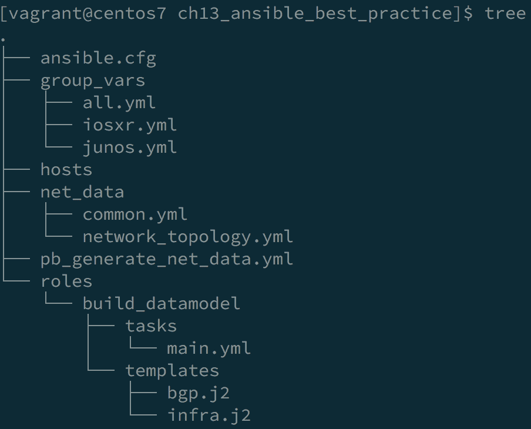

我们通过运行`Yamllint`来分析此文件夹中的所有 YAML 文档，如前一节所述。下面的截图概述了`Yamllint`命令在 Ansible 项目文件夹上的输出：

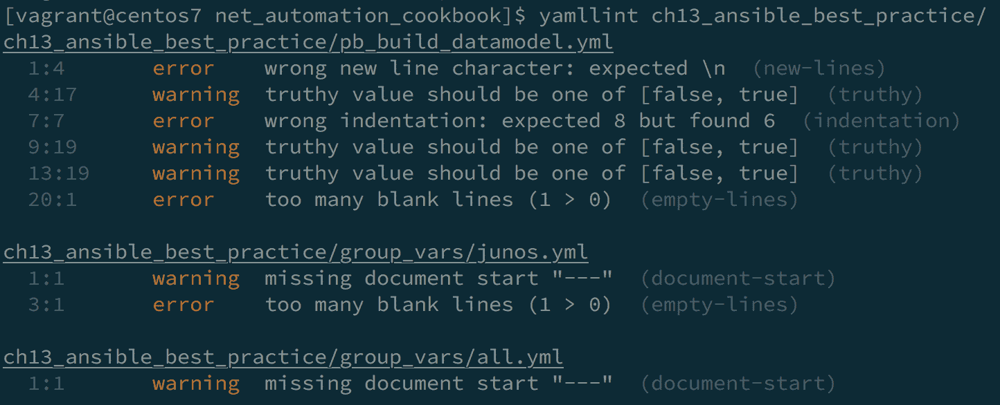

上述输出概述了`Yamllint`命令在此文件夹中所有 YAML 文件中发现的问题，并提供了关于每个文件中识别的问题的非常清晰的输出。这些问题可以被标识为错误或警告，这会影响`Yamllint`命令的返回代码。

因此，在所有文件中的问题都被标识为`warning`的情况下，返回代码是`0`，这意味着 YAML 文档是有效的。但是，它们有一些小问题需要修复：

```
# no errors or only warning
$ echo $?
0
```

如果问题被标识为`error`，返回代码不是`0`，这意味着 YAML 文档有一个需要修复的重大问题：

```
# errors are present
$ echo $?
1
```

返回代码至关重要，因为它表示`Yamllint`命令是否成功，这在构建**持续集成/持续部署**（**CI/CD**）流水线以自动化基础设施的配置非常重要。流水线中的一个步骤将是对所有 YAML 文件进行 lint 以确保文件正确，如果`Yamllint`命令成功，它将返回代码`0`。

`Yamllint`命令捕获了 YAML 文档中的所有语法错误。然而，`ansible-lint`提供了对`ansible-playbook`代码的更全面检查，特别是验证 playbook 是否遵循良好的编码实践。运行它非常有用，因为它可以用来验证 playbooks 和 Ansible 角色的正确样式，并会提示 playbooks 中的任何问题。

当我们为我们的 playbook 运行`ansible-lint`命令时，我们可以看到它捕获了以下错误：

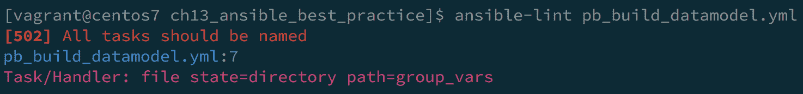

输出非常详细，因为它概述了 playbook 中第`7`行的任务没有名称，这不符合 Ansible 最佳实践。命令的返回代码为`2`，这表明命令失败了。一旦我们纠正了这个问题，就不会显示任何错误，并且返回代码将为`0`。

# 还有更多...

`Yamllint`程序可以通过在项目目录结构中包含一个`yamllint`文件来进行自定义，该文件包括需要修改的规则。因此，在我们的示例中，当我们运行`yamllint`命令时，我们可以看到其中一个问题是行长度超过了`> 80`个字符，这是一个错误，因为这是`yamllint`遵循的默认规则：

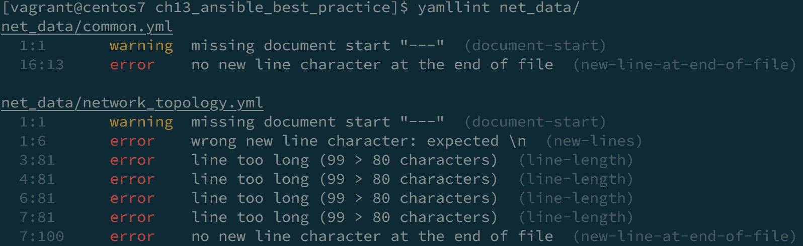

我们可以修改我们的文件并尝试更改`yamllint`抱怨的行的长度，或者我们可以指定这不应该是一个问题，只应该触发一个`warning`。我们使用后一种方法，并在我们的目录中创建`.yamllint`文件并添加以下规则：

```
---
extends: default
rules:
 line-length:
 level: warning
```

因此，当我们再次在我们的文件夹上运行`yamllint`命令时，我们可以看到所有先前的行长度消息已更改为警告：

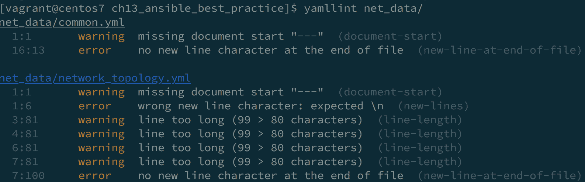

对于`ansible-lint`，我们可以使用以下命令检查`ansible-lint`用于验证给定 playbook 或角色的所有当前规则：

```
$ ansible-lint -L
$ ansible-lint -T
```

`-L`选项将输出所有规则和每个规则的简短描述。

`-T`选项将输出`ansible-lint`使用的所有规则/标签。

我们可以运行我们的`ansible-lint`命令来忽略特定的规则/标签，如下面的代码片段所示：

```
$ ansible-lint -x task pb_build_datamodel.yml
```

这将导致`ansible-lint`忽略所有带有`task`标签的规则；这样，我们可以影响`ansible-lint`应用于验证我们的 playbook 的规则。

# 另请参阅...

+   有关`yamllint`的更多信息，请使用以下网址：[`yamllint.readthedocs.io/en/stable/`](https://yamllint.readthedocs.io/en/stable/)。

+   有关`yamllint`使用的配置文件以及如何自定义它的更多信息，请使用以下网址：[`yamllint.readthedocs.io/en/stable/configuration.html`](https://yamllint.readthedocs.io/en/stable/configuration.html)。

+   有关`ansible-lint`的更多信息，请使用以下网址：[`docs.ansible.com/ansible-lint/`](https://docs.ansible.com/ansible-lint/)。

# 计算 Ansible playbook 的执行时间

在这个配方中，我们将概述如何获取 Ansible playbook 中各种任务执行所需的时间。这可以帮助我们了解 playbook 运行期间哪个特定任务或角色占用了最多的时间，并帮助我们优化我们的 playbook。

# 如何做到...

1.  更新`ansible.cfg`文件以包括以下行：

```
[defaults]
 < --- Output Omitted for brevity ---->
callback_whitelist=timer, profile_tasks, profile_roles
```

1.  列出`ansible-playbook`代码中的所有任务以供参考：

```
$ ansible-playbook pb_generate_config.yml --list-tasks
```

1.  运行 Ansible playbook：

```
$ ansible-playbook pb_generate_config.yml
```

# 它是如何工作的...

Ansible 提供了多个回调插件，我们可以使用这些插件来在响应事件时向 Ansible 添加新的行为。其中最有用的回调插件之一是`timer`插件；它提供了测量 Ansible playbook 中任务和角色的执行时间的功能。我们可以通过在`ansible.cfg`文件中将这些插件列入白名单来启用此功能：

+   `Timer`：此插件提供 playbook 的执行时间摘要。

+   `Profile_tasks`：这为我们提供了 playbook 中每个任务的执行时间摘要。

+   `Profile_roles`：这为我们提供了 playbook 中每个角色所花费的时间的摘要。

我们使用`--list-tasks`选项列出 playbook 中的所有任务，以验证将在我们的 playbook 中执行的所有任务。以下是我们示例 playbook 中的任务片段：

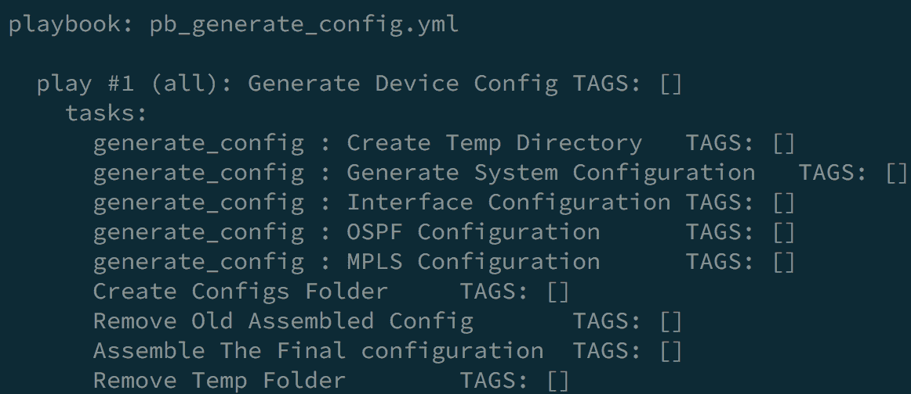

然后运行 playbook 并检查新添加的详细执行摘要，如下面的屏幕截图所示：

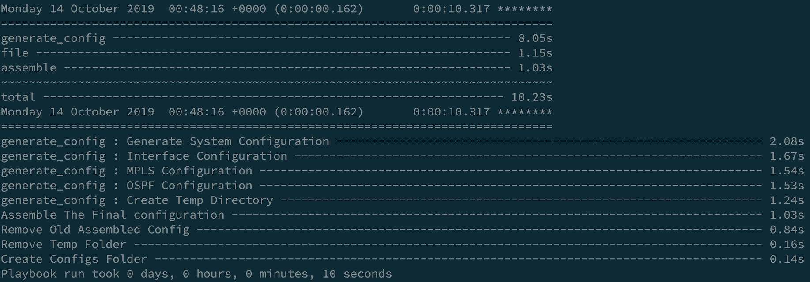

摘要的第一部分概述了角色（`generate_config`）的执行时间，以及使用`post_task`部分的不同模块（我们在`post_task`部分仅使用`file`和`assemble`模块）。摘要的下一部分概述了 playbook 中每个任务的执行时间（包括角色内的任务的细分）。最后，我们得到了整个 playbook 的总体执行时间的摘要，以一行显示。

# 另请参阅...

有关回调插件、`profile_tasks`和`profile_roles`插件以及`timer`的更多信息，请参考以下网址：

+   [`docs.ansible.com/ansible/latest/plugins/callback/timer.html`](https://docs.ansible.com/ansible/latest/plugins/callback/timer.html)

+   [`docs.ansible.com/ansible/latest/plugins/callback/profile_tasks.html`](https://docs.ansible.com/ansible/latest/plugins/callback/profile_tasks.html)

+   [`docs.ansible.com/ansible/latest/plugins/callback/profile_roles.html`](https://docs.ansible.com/ansible/latest/plugins/callback/profile_roles.html)

# 使用 Ansible 验证用户输入

在这个示例中，我们将概述如何使用 Ansible 验证输入数据。我们在 Ansible 中非常依赖于从网络中检索或在`host`或`group`变量中声明的信息，以便执行不同的任务，比如生成配置或配置设备。在我们开始使用这些信息之前，我们需要能够在进一步处理 playbook 之前验证这些数据的结构和有效性。

# 如何做到...

1.  在`ACLs.yml`中创建一个`ACLs`定义，如下面的代码块所示：

```
---
ACLs:
 INFRA_ACL:
 - src: 10.1.1.0/24
 dst: any
 dport: ssh
 state: present
 - src: 10.2.1.0/24
 dst: any
 app: udp
 dport: snmp
 state: present
```

1.  在`validate_acl.yml`文件中创建一个新的验证任务，如下面的代码块所示：

```
---
- include_vars: ACLs.yml
- name: Validate ACL is Defined
 assert:
 that:
 - ACLs is defined
 - "'INFRA_ACL' in ACLs.keys()"
 - ACLs.INFRA_ACL|length > 0
- name: Validate Rules are Valid
 assert:
 that:
 - item.src is defined
 - item.dst is defined
 - item.src | ipaddr
 loop: "{{ ACLs.INFRA_ACL }}"
```

1.  创建一个新的 playbook 来创建**访问控制列表**（**ACLs**）并推送到网络设备，如下面的代码块所示：

```
---
- name: Configure ACL on IOS-XR
 hosts: all
 tasks:
 - name: Validate Input Data
 import_tasks: validate_acls.yml
 run_once: yes
 delegate_to: localhost
 tags: validate
 - name: Create ACL Config
 template:
 src: acl.j2
 dest: acl_conf.cfg
 delegate_to: localhost
 run_once: yes
 - name: Provision ACLs
 iosxr_config:
 src: acl_conf.cfg
 match: line
```

# 它是如何工作的...

在这个示例 playbook 中，我们想要将 ACL 配置推送到我们的基础设施。我们使用`template`模块生成配置，并使用`iosxr_config`模块推送配置。我们所有的 ACL 定义都在`ACLs.yml`文件中声明。我们希望验证`ACLs.yml`文件中包含的输入数据，因为这是我们依赖的数据，以便生成我们的配置。

我们创建一个`validate_acl.yml`的`tasks`文件，其中包含多个任务来验证我们将用于生成配置的数据的结构和内容。我们首先使用`include_vars`参数导入我们的数据，然后定义两个主要任务来验证我们的数据：

+   第一个任务是验证所需的数据结构是否存在，并且数据结构是否符合我们期望的正确格式。

+   第二个任务是验证每个防火墙规则的内容。

在所有这些验证任务中，我们使用`assert`模块来测试和验证我们的条件语句，并且我们可以定义更全面的检查输入数据结构，以涵盖数据的所有可能性。

使用这种方法，我们可以验证输入数据的有效性，并确保我们的数据是健全的，以便由 playbook 中的后续任务进行处理。

# 在检查模式下运行 Ansible

在这个示例中，我们将概述如何在 Ansible 中以干运行模式运行我们的 playbook。这种模式也称为`check`模式，在这种模式下，Ansible 不会对远程管理的节点进行任何更改。我们可以将其视为对我们的 playbook 进行模拟运行，以便了解 Ansible 将进行哪些更改，如果我们以`check`模式执行 playbook。

# 如何做到...

1.  在`ACLs.yml`文件中更新我们的 ACL 声明，如下面的代码片段所示：

```
---
ACLs:
 INFRA_ACL:
< --- Output Omitted for brevity -- >
 - src: 10.3.2.0/24
 dst: 10.2.2.0/24
 dport: dns
 state: present
```

1.  使用`check`模式运行`pb_push_acl.yml`配置 playbook，如下面的代码片段所示：

```
$ ansible-playbook pb_push_acl.yml -l den-core01  --check
```

# 工作原理...

当我们使用`check`模式运行 playbook 时，远程系统不会进行任何更改，我们可以看到 playbook 运行的输出，如下面的截图所示：

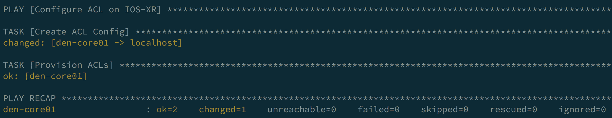

此输出概述了我们为 ACL 生成的配置文件将发生更改（将添加新规则）；但是，provision ACLs 任务没有报告任何更改。这是因为配置文件没有更改，因为我们是在`check`模式下运行 playbook，所以在这种情况下，此任务仍在使用未修改的配置文件，因此不会实施任何更改。

我们还可以在运行 playbook 时使用`--diff`标志来检查将发生的更改，如下面的代码片段所示：

```
$ ansible-playbook pb_push_acl.yml -l den-core01  --check --diff
```

当我们使用`--diff`标志时，我们会得到以下输出，并且它概述了将在我们的配置文件上发生的更改：

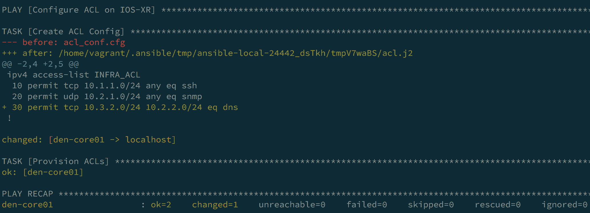

# 还有更多...

我们可以使用`check`模式作为开关来运行或跳过任务。因此，在某些情况下，当我们以`check`模式运行时，我们不希望连接到设备并在设备上推送任何配置，因为不会有任何更改。使用`check`模式，我们可以构建我们的 playbook 以跳过这些任务，如下面的代码块所示：

```
- name: Configure ACL on IOS-XR
 hosts: all
 serial: 1
 tags: deploy
 tasks:
 - name: Backup Config
 iosxr_config:
 backup:
 *when: not ansible_check_mode*    - name: Deploy ACLs
 iosxr_config:
 src: acl_conf.cfg
 match: line
 *when: not ansible_check_mode*
```

在我们的`tasks`中，我们添加了`when`指令，并且我们正在检查`ansible_check_mode`参数的值。当我们在`check`模式下运行 playbook 时，此参数设置为`true`。因此，在每个任务中，我们都在检查`check`模式是否设置，如果是，我们将在 playbook 运行期间跳过这些任务。如果 playbook 以正常模式运行（不使用`check`模式），这些任务将正常执行。

# 另请参阅...

有关在`check`模式下运行我们的 playbook 的更多信息，请参阅以下网址：[`docs.ansible.com/ansible/latest/user_guide/playbooks_checkmode.html`](https://docs.ansible.com/ansible/latest/user_guide/playbooks_checkmode.html)。

# 在 Ansible 中控制并行性和滚动更新

默认情况下，Ansible 会并行运行任务。在本教程中，我们将概述如何控制 Ansible 的并行执行以及如何修改此默认行为。我们还将探讨滚动更新的概念以及如何在 Ansible 中利用它们。

# 如何做...

1.  更新`ansible.cfg`文件以控制并行执行，如下面的代码片段所示：

```
[defaults]
forks=2
```

1.  更新`pb_push_acl.yml`文件以设置网络设备上配置推送的滚动更新，如下面的代码块所示：

```
- name: Configure ACL on IOS-XR
 hosts: all
 serial: 1
  tags: deploy
 tasks:
 - name: Backup Config
 iosxr_config:
 backup:
 - name: Deploy ACLs
 iosxr_config:
 src: acl_conf.cfg
 match: line
```

# 工作原理...

默认情况下，Ansible 通过并行在所有在 playbook 中标识的设备上执行每个任务来工作。默认情况下，对于每个任务，Ansible 将分叉五个并行线程（称为 forks）并在清单中的五个节点上并行执行这些线程。一旦这些任务完成，它将以五个节点的批次目标剩余的设备清单。它在 playbook 中执行的每个任务上执行此操作。使用`ansible.cfg`文件中的`forks`关键字，我们可以修改 Ansible 正在使用的默认`fork`值并控制 Ansible 在每个任务执行期间目标的并行节点数。这可以加快我们的 playbook 执行速度；但是，它需要更多的资源，包括内存和 CPU 功率在 Ansible 控制节点上。

当使用大量的 forks 时，请注意任何`local_action`步骤可能会在本地机器上分叉 Python 解释器，因此您可能希望限制`local_action`或`delegated`步骤的数量或在单独的 plays 中。有关更多信息，请参阅[`www.ansible.com/blog/ansible-performance-tuning`](https://www.ansible.com/blog/ansible-performance-tuning)。

我们可以修改的另一个选项来控制 playbook 执行是，默认情况下，Ansible 在 playbook 中标识的所有节点上运行每个任务，并且只有在所有节点完成前一个任务后才会从一个任务转到另一个任务。我们可能希望在多种情况下修改这种行为，比如将配置推送到网络设备或升级网络设备。我们可能希望以串行方式在每个节点上执行 playbook - 这意味着 Ansible 会选择每个节点（或节点组），并在其上执行 playbook；一旦这一批完成，就会选择另一批，并再次运行 playbook。这种方法允许我们以滚动方式部署更改，如果我们的某个节点失败，我们可以停止 playbook 执行。这个配置是使用 playbook 中的`serial`关键字来控制的。它指示 Ansible 使用`serial`选项标识的主机数量开始执行 play，然后在这一批上执行所有任务，然后转到另一批，并在该批上执行完整的 playbook，依此类推。

# 另请参阅...

有关 Ansible forks 和滚动更新的更多信息，请参考以下网址：[`docs.ansible.com/ansible/latest/user_guide/playbooks_delegation.html`](https://docs.ansible.com/ansible/latest/user_guide/playbooks_delegation.html)。

# 在 Ansible 中配置事实缓存

在这个示例中，我们将概述如何在 Ansible 中设置和配置事实缓存。这是一个重要的功能，可以帮助我们在需要从基础架构收集事实时优化和加快 playbook 的执行时间。

# 操作步骤...

1.  更新`ansible.cfg`文件以启用事实缓存，并设置所需的文件夹来存储缓存：

```
[defaults]
< --- Output Omitted for brevity -->
fact_caching=yaml
fact_caching_connection=./fact_cache
```

1.  创建一个新的`pb_get_facts.yml` playbook，使用不同的方法从网络收集事实：

```
---
- name: Collect Network Facts
 hosts: all
 tasks:
 - name: Collect Facts Using Built-in Fact Modules
 iosxr_facts:
 gather_subset:
 - interfaces
 - name: Collect Using NAPALM Facts
 napalm_get_facts:
 hostname: "{{ ansible_host }}"
 username: "{{ ansible_user }}"
 password: "{{ ansible_ssh_pass }}"
 dev_os: "{{ ansible_network_os }}"
 filter:
 - interfaces
 - name: Set and Cache Custom Fact
 set_fact:
 site: Egypt
 cacheable: yes
```

1.  在清单中的单个节点上运行新的 Ansible playbook：

```
$ ansible-playbook pb_validate_from_cache.yml -l den-core01
```

# 工作原理...

Ansible 是一个强大的工具，可以收集有关基础架构操作状态的信息，并且我们可以使用这些信息来生成配置、构建报告，以及验证基础架构的状态。在基础架构状态非常稳定的情况下，我们可能不需要在每次 playbook 运行期间从设备收集网络事实。在这些情况下，我们可能选择使用事实缓存来加快 playbook 的执行。我们从 Ansible 控制节点上存储的位置读取设备的事实（网络状态），而不是连接到设备并从实时网络中收集信息。

在`ansible.cfg`文件中启用事实缓存，并在该文件中设置我们将用于存储事实数据的后端类型。有多种选项，从 YAML 或 JSON 文件到将这些数据存储到`redis`或`Memcached`数据库。在我们的示例中，为了简单起见，我们将使用 YAML 文件来存储从设备收集的事实。我们还指定了存储此信息的文件夹位置。

完成这些步骤后，我们可以运行我们的 playbook 来收集网络事实。在这个示例 playbook 中，我们使用不同的模块（方法），如下：

+   `iosxr_facts`：这是 Ansible 网络模块中的内置模块，用于从 IOS-XR 设备收集事实（对于大多数受 Ansible 支持的供应商的网络设备，都有一个针对每个供应商的事实收集模块）。

+   `napalm_get_facts`：这是来自**网络自动化和可编程性抽象层与多供应商支持**（**NAPALM**）的自定义模块，需要安装以收集事实；但它不是核心 Ansible 模块的一部分。

+   `set_fact`：我们使用`set_fact`模块在 playbook 运行期间设置自定义事实，并使用`cacheable`选项指示模块将这个新的缓存变量写入我们的缓存。

一旦我们运行 playbook，我们可以检查新文件夹是否创建，并且我们清单中的每个节点都在这个位置存储了一个新的 YAML 文件。这些模块收集的所有事实都保存在这些 YAML 文件中，如下面的截图所示：

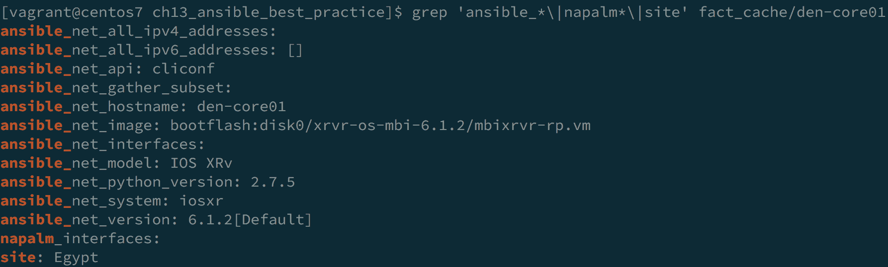

# 还有更多...

一旦我们配置了事实缓存，我们就可以开始在任何其他 playbook 中使用我们缓存中声明的 Ansible 变量，如下面的代码示例所示：

```
---
- name: Validate Cache Data
 vars:
 ansible_connection: local
 hosts: all
 tasks:
 - name: Validate all Interfaces
 assert:
 that:
 - item.value.operstatus == 'up'
 with_dict: "{{ ansible_net_interfaces }}"
 - name: Validate Custom Fact
 assert:
 that:
 - site == 'Egypt'
```

在上面的 playbook 中，我们正在利用从缓存中收集的变量（在本例中为`ansible_net_interfaces`）并对清单中的设备运行任务。我们需要考虑，默认情况下，缓存中的条目仅在特定时间内有效，由我们的缓存的超时值控制，以确保我们的缓存中的任何过时状态不会被考虑。这个值由`fact_caching_timeout`选项控制，可以在`ansible.cfg`文件中设置。

# 另请参阅...

有关 Ansible 事实缓存的更多信息，请参考以下网址：

+   [`docs.ansible.com/ansible/latest/plugins/cache.html`](https://docs.ansible.com/ansible/latest/plugins/cache.html)

+   [`docs.ansible.com/ansible/latest/plugins/cache/yaml.html`](https://docs.ansible.com/ansible/latest/plugins/cache/yaml.html)

# 为 Ansible 创建自定义 Python 过滤器

Ansible 提供了丰富的 Jinja2 过滤器以及一些额外的内置过滤器来操作数据；然而，在某些情况下，您可能会发现没有可用的过滤器来满足您的需求。在这个示例中，我们将概述如何在 Python 中构建自定义过滤器，以扩展 Ansible 功能来操作数据。

# 如何做...

1.  在项目目录（`ch13_ansible_best_practice`）中，创建一个名为`filter_plugins`的新文件夹。

1.  在`filter_plugins`文件夹下创建一个名为`filter.py`的新的 Python 脚本，内容如下：

```
class FilterModule(object):
 def filters(self):
 return {
 'acl_state': self.acl_state
 }
 def acl_state(self,acl_def):
 for acl_name, acl_rules in acl_def.items():
 for rule in acl_rules:
 rule['state'] = rule['state'].upper()
 return acl_def
```

1.  创建一个新的 Ansible playbook，`pb_test_custom_filter.yml`，内容如下：

```
---
 - name: Test Custom Filter
 hosts: all
 vars:
 ansible_connection: local
 tasks:
 - name: Read ACL data
 include_vars: ACLs.yml
 run_once: yes
 - name: Apply Our Custom Filter
 set_fact:
 standard_acl: "{{ ACLs | acl_state }}"
 run_once: yes
 - name: Display Output After Filter
 debug: var=standard_acl
```

# 它是如何工作的...

我们可以扩展 Ansible 提供的`filter`库，并使用 Python 创建自定义过滤器。为了实现我们的自定义过滤器，我们在项目目录下创建一个名为`filter_plugins`的文件夹，并创建一个 Python 脚本，可以使用任何名称（在我们的示例中使用了`filter.py`）。

为了让 Ansible 捕捉并处理这些过滤器，自定义的 Python 过滤器必须放置在名为`filter_plugins`的文件夹中。

在这个 Python 脚本中，我们创建了一个名为`FilterModule`的 Python 类。在这个类中，我们声明了一个名为`filters`的函数，它返回我们定义的所有自定义过滤器的字典。然后，我们开始创建我们的过滤器，声明一个名为`acl_state`的函数，它接受我们在 playbook 中传递的`acl_def`变量（这是我们 ACL 的定义）。在这个示例中，我们只是获取我们 ACL 状态的定义并将其更改为大写。然后我们返回新修改的 ACL 定义。

我们像往常一样创建一个 Ansible playbook，并从`ACLs.yml`文件中读取我们的 ACL 定义。然后，我们创建一个新任务，使用`set_fact`模块设置一个自定义事实，并将我们的 ACL 数据结构传递给我们创建的自定义过滤器（`acl_state`）。我们将自定义过滤器的返回值保存到一个名为`standard_acl`的新变量中，并在下一个任务中使用`debug`模块输出这个新变量的值。

以下片段概述了我们 ACL 的新值以及 ACL 定义中的状态参数如何更改为大写：

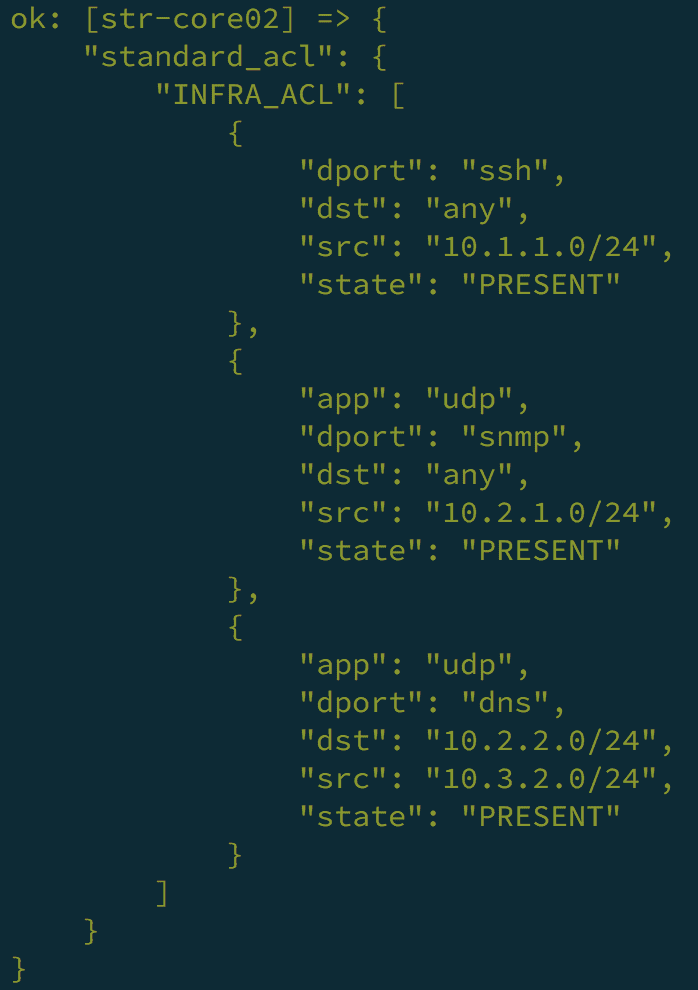

# 还有更多...

我们在上一个示例中概述了如何将变量定义传递给我们的自定义过滤器；然而，我们也可以传递多个字段给我们的自定义过滤器，以便更好地控制过滤器的返回值。为了概述这一点，我们将创建另一个自定义过滤器，它将获取 ACL 定义以及一个字段变量，并根据这个字段，将 ACL 定义中的这个字段的值更改为大写。以下是修改后的`filter.py` Python 脚本：

```
class FilterModule(object):

< -- Output Omitted for brevity -- >
    def custom_acl(self,acl_def,field=None):
 for acl_name, acl_rules in acl_def.items():
 for rule in acl_rules:
 if field and field in rule.keys():
 rule[field] = rule[field].upper()
 return acl_def
 def filters(self):
 return {
 'acl_state': self.acl_state,
 'custom_acl': self.custom_acl
 }
```

以下是剧本中修改后任务的输出，使用我们的新自定义过滤器：

```
 - name: Apply Our Custom Filter
 set_fact:
 standard_acl: "{{ ACLs | acl_state }}"
 final_acl: "{{ ACLs | custom_acl('dports') }}"
 run_once: yes
 - name: Display Output After Filter
 debug: var=final_acl
```

以下是应用新自定义过滤器后`final_acl`文件的输出：

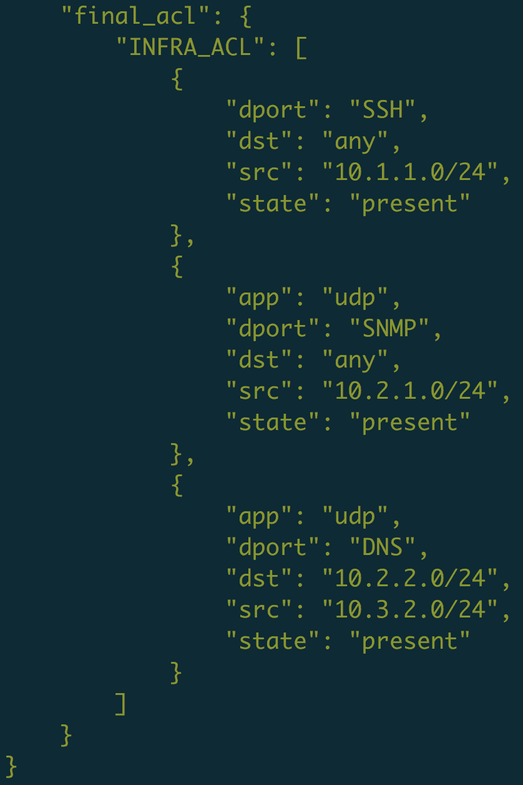

前面的截图显示了应用新自定义过滤器后的输出。
