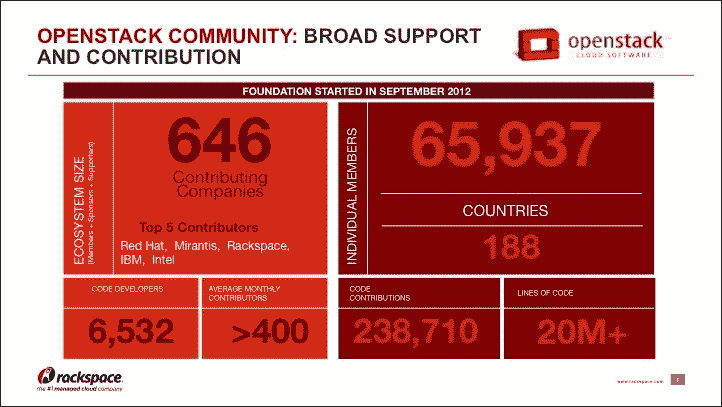
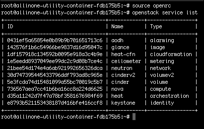

# 第一章。介绍 OpenStack

这一章将作为 OpenStack 和构成这个云平台的项目的高层概述。建立关于 OpenStack 的清晰基础非常重要，以便描述 OpenStack 组件、概念和术语。一旦概述完成，我们将过渡到讨论 OpenStack 的核心特性和优势。最后，本章将以两个工作示例结束，介绍如何通过**应用程序接口**（**API**）和**命令行界面**（**CLI**）使用 OpenStack 服务。

+   OpenStack 概述

+   审查 OpenStack 服务

+   OpenStack 支持组件

+   特性和优势

+   工作示例：列出服务

# OpenStack 概述

简单来说，OpenStack 可以被描述为一个开源的云操作平台，可以用来控制数据中心中的大型计算、存储和网络资源池，所有这些都通过一个由 API、CLI 和/或 Web **图形用户界面**（**GUI**）仪表板控制的单一界面进行管理。OpenStack 提供给管理员的能力是控制所有这些资源，同时还赋予云消费者通过其他自助服务模型来提供这些资源的能力。OpenStack 是以模块化方式构建的；该平台由许多组件组成。其中一些组件被认为是核心服务，是构建云所必需的，而其他服务是可选的，只有在符合个人用例时才需要。

## OpenStack 基金会

早在 2010 年初，Rackspace 只是一个专注于通过名为**Fanatical Support**的服务和支持提供技术托管的公司。该公司决定创建一个开源云平台。

OpenStack 基金会由自愿成员组成，受委任的董事会和基于项目的技术委员会管理。合作发生在一个六个月的、基于时间的主要代码发布周期内。发布名称按字母顺序排列，并参考 OpenStack 设计峰会将举行的地区。每个发布都包含一个称为**OpenStack 设计峰会**的东西，旨在建立 OpenStack 运营商/消费者之间的合作，让项目开发人员进行实时工作会话，并就发布项目达成一致。

作为 OpenStack 基金会的成员，您可以积极参与帮助开发任何 OpenStack 项目。没有其他云平台允许这样的参与。

要了解更多关于 OpenStack 基金会的信息，您可以访问网站[www.openstack.org](http://www.openstack.org)。



# 审查 OpenStack 服务

深入了解 OpenStack 作为一个项目的核心内容，就是审查构成这个云生态系统的服务。需要记住的一件事是，关于 OpenStack 服务，每个服务都会有一个官方名称和与之相关的代码名称。代码名称的使用在社区中变得非常流行，大多数文档都会以这种方式引用服务。熟悉代码名称对于简化采用过程很重要。

另一件需要记住的事是，每个服务都是作为 API 驱动的 REST 网络服务开发的。所有操作都是通过 API 执行的，从而实现了最大的消费灵活性。即使在使用 CLI 或基于 Web 的 GUI 时，幕后也会执行和解释 API 调用。

从 Newton 发布版开始，OpenStack 项目包括六个所谓的**核心服务**和十三个**可选服务**。这些服务将按发布顺序进行审查，以展示整体服务时间表。该时间表将展示 OpenStack 项目整体的自然进展，同时也显示了它现在肯定已经准备好用于企业。

OpenStack 社区最近提供的一个重要补充是**项目导航器**的创建。**项目导航器**旨在成为 OpenStack 项目的消费者的实时指南，旨在分享每个服务的社区采用情况、成熟度和年龄。就个人而言，这个资源被发现非常有用和信息丰富。导航器可以在 OpenStack 基金会网站上找到，[www.openstack.org/software/project-navigator](http://www.openstack.org/software/project-navigator)。

## OpenStack 计算（代号 Nova）

*集成在发布版：Austin*

**核心服务**

这是 OpenStack 平台的第一个，也是最重要的服务部分。Nova 是提供与用于管理计算资源的底层 hypervisor 的桥梁。

### 注意

一个常见的误解是 Nova 本身是一个 hypervisor，这简直是不正确的。Nova 是一种 hypervisor 管理器，能够支持许多不同类型的 hypervisor。

Nova 将负责调度实例的创建、实例的大小选项、管理实例位置，以及如前所述，跟踪云环境中可用的 hypervisor。它还处理将您的云分隔成名为**cells**、**regions**和**可用区域**的隔离组的功能。

## OpenStack 对象存储（代号 Swift）

*集成在发布版：Austin*

**核心服务**

这项服务也是 OpenStack 平台的第一个服务之一。Swift 是 OpenStack 云提供**对象存储服务**的组件，能够存储宠字节的数据，从而提供高可用性、分布式和最终一致的对象/块存储。对象存储旨在成为静态数据的廉价、成本效益的存储解决方案，例如图像、备份、存档和静态内容。然后，这些对象可以通过标准的 Web 协议（HTTP/S）从对象服务器流式传输到发起 Web 请求的最终用户，或者从最终用户流式传输到对象服务器。Swift 的另一个关键特性是所有数据都会自动复制到集群中，从而实现高可用性。存储集群可以通过简单地添加新服务器来实现水平扩展。

## OpenStack 镜像服务（代号 Glance）

*集成在发布版：Bextar*

**核心服务**

这项服务是在第二个 OpenStack 发布版中引入的，它负责管理/注册/维护 OpenStack 云的服务器镜像。它包括上传或导出 OpenStack 兼容的镜像的能力，并存储实例快照以供以后用作模板/备份。Glance 可以将这些镜像存储在各种位置，例如本地和/或分布式存储，例如对象存储。大多数 Linux 内核发行版已经提供了可用于下载的 OpenStack 兼容镜像。您还可以从现有服务器创建自己的服务器镜像。支持多种图像格式，包括 Raw、VHD、qcow2、VMDK、OVF 和 VDI。

## OpenStack Identity（代号 Keystone）

*集成在发布版：Essex*

**核心服务**

这项服务是在第五个 OpenStack 发布中引入的。Keystone 是内置在您的 OpenStack 云中的身份验证和授权组件。它的关键作用是处理用户、租户和所有其他 OpenStack 服务的创建、注册和管理。在搭建 OpenStack 云时，Keystone 将是第一个要安装的组件。它有能力连接到 LDAP 等外部目录服务。Keystone 的另一个关键特性是它是基于**基于角色的访问控制**（**RBAC**）构建的。这使得云运营商能够为云消费者提供对各个服务功能的不同基于角色的访问。

## OpenStack 仪表板（代号 Horizon）

*集成版本：Essex*

这项服务是第五个 OpenStack 发布中引入的第二项服务。Horizon 为云运营商和消费者提供了一个基于 Web 的 GUI，用于控制他们的计算、存储和网络资源。OpenStack 仪表板运行在**Apache**和**Django** REST 框架之上。这使得它非常容易集成和扩展，以满足您的个人用例。在后端，Horizon 还使用本机 OpenStack API。Horizon 的基础是为了能够为云运营商提供对其云状态的快速整体视图，以及为云消费者提供一个自助服务的云资源配置门户。

### 提示

请记住，Horizon 可以处理大约 70%的可用 OpenStack 功能。要利用 100%的 OpenStack 功能，您需要直接使用 API 和/或为每项服务使用 CLI。

## OpenStack 网络（代号 Neutron）

*集成版本：Folsom*

**核心服务**

这项服务可能是您的 OpenStack 云中除 Nova 之外第二强大的组件。

> *OpenStack Networking 旨在提供可插拔、可扩展和 API 驱动的系统，用于管理网络和 IP 地址。*

这个引用直接摘自 OpenStack Networking 文档，最好地反映了 Neutron 背后的目的。Neutron 负责在 OpenStack 云中创建您的虚拟网络。这将涉及创建虚拟网络、路由器、子网、防火墙、负载均衡器和类似的网络功能。Neutron 是使用扩展框架开发的，允许集成额外的网络组件（物理网络设备控制）和模型（平面、第 2 层和/或第 3 层网络）。已经创建了各种特定于供应商的插件和适配器，以与 Neutron 配合使用。这项服务增加了 OpenStack 的自助服务功能，消除了网络方面成为使用云的障碍。

作为 OpenStack 中最先进和强大的组件之一，Neutron 有一整本书专门介绍它。

## OpenStack 块存储（代号 Cinder）

*集成版本：Folsom*

**核心服务**

Cinder 是为您的 OpenStack 云提供**块存储服务**的组件，利用本地磁盘或附加存储设备。这意味着您的实例可以使用持久的块级存储卷。Cinder 负责管理和维护创建的块卷，附加/分离这些卷，以及备份创建。Cinder 的一个显着特点是其能够同时连接到多种类型的后端共享存储平台。这种能力范围还可以延伸到利用简单的 Linux 服务器存储。作为额外的奖励，**服务质量**（**QoS**）角色可以应用于不同类型的后端。扩展了使用块存储设备以满足各种应用需求的能力。

## OpenStack 编排（代号 Heat）

*集成版本：Havana*

这是第八个 OpenStack 版本中引入的两项服务之一。Heat 提供了对您的 OpenStack 云资源的编排能力。它被描述为 OpenStack 编排计划的主要项目。这意味着 OpenStack 还将有额外的自动化功能。

内置编排引擎用于自动化应用和其组件的提供，称为堆栈。一个堆栈可能包括实例、网络、子网、路由器、端口、路由器接口、安全组、安全组规则、自动扩展规则等等。Heat 利用模板来定义一个堆栈，并以标准标记格式 YAML 编写。您将听到这些模板被称为**HOT**（**Heat Orchestration Template**）模板。

## OpenStack 遥测（代号 Ceilometer）

*集成在版本中：哈瓦那*

这是第八个 OpenStack 版本中引入的两项服务之一。Ceilometer 将云使用和性能统计数据集中存储到一个集中的数据存储中。这种能力成为云运营商的关键组成部分，因为它提供了对整个云的清晰度量标准，可以用来做出扩展决策。

### 提示

您可以选择将数据存储后端设置为 Ceilometer。这些选项包括 MongoDB、MySQL、PostgreSQL、HBase 和 DB2。

## OpenStack 数据库（代号 Trove）

*集成在版本中：冰雪屋*

Trove 是为您的 OpenStack 云提供**数据库服务**的组件。这种能力包括提供可伸缩和可靠的关系型和非关系型数据库引擎。这项服务的目标是消除需要理解数据库安装和管理的负担。有了 Trove，云消费者可以通过利用服务 API 来提供数据库实例。Trove 支持在 Nova 实例中的多个单租户数据库。

### 提示

目前支持的数据存储类型包括 MySQL、MongoDB、Cassandra、Redis 和 CouchDB。

## OpenStack 数据处理（代号 Sahara）

*集成在版本中：朱诺*

Sahara 是为您的 OpenStack 云提供**数据处理服务**的组件。这种能力包括能够提供一个专门处理大量分析数据的应用集群。可用的数据存储选项包括**Hadoop**和/或**Spark**。这项服务还将帮助云消费者抽象出安装和维护这种类型集群的复杂性。

## OpenStack 裸金属提供（代号 Ironic）

*集成在版本中：基洛*

这项服务一直是 OpenStack 项目中最受期待的组件之一。Ironic 提供了在 OpenStack 云中从物理裸金属服务器进行提供的能力。它通常被称为裸金属虚拟化 API，并利用一组插件来实现与裸金属服务器的交互。这是最新引入 OpenStack 家族的服务，仍在开发中。

## 其他可选服务

还有一些处于早期成熟阶段的其他服务，稍后会列出。一些服务的范围和深度仍在确定中，因此最好不要在这里可能误传它们。更重要的是，当这些新服务准备就绪时，它们将为您的 OpenStack 云增加的能力的深度。

| **代号** | **服务** |
| --- | --- |
| Zaqar | 消息服务 |
| 马尼拉 | 共享文件系统 |
| 指定 | DNS 服务 |
| 巴比肯 | 密钥管理 |
| 马格南 | 容器 |
| 穆拉诺 | 应用目录 |
| 国会 | 治理 |

# OpenStack 支持的组件

与任何传统应用程序非常相似，有一些关键的核心组件对其功能至关重要，但不一定是应用程序本身。在基本的 OpenStack 架构中，有两个核心组件被认为是云的核心或骨干。OpenStack 功能需要访问基于 SQL 的后端数据库服务和**AMQP**（高级消息队列协议）软件平台。就像任何其他技术一样，OpenStack 也有基本支持的参考架构供我们遵循。从数据库的角度来看，常见的选择将是 MySQL，而默认的 AMQP 软件包是**RabbitMQ**。在开始 OpenStack 部署之前，这两个依赖关系必须安装、配置和正常运行。

还有其他可选的软件包，也可以用来提供更稳定的云设计。关于这些管理软件和更多 OpenStack 架构细节的信息可以在以下链接找到[`docs.openstack.org/arch-design/generalpurpose-architecture.html`](http://docs.openstack.org/arch-design/generalpurpose-architecture.html)。

# 特点和优势

OpenStack 的强大已经得到了许多企业级组织的验证，因此吸引了许多领先的 IT 公司的关注。随着这种采用的增加，我们肯定会看到消费量的增加和额外的改进功能。现在，让我们回顾一些 OpenStack 的特点和优势。

## 完全分布式架构

OpenStack 平台内的每个服务都可以分组和/或分离，以满足您的个人用例。正如前面提到的，只有核心服务（Keystone、Nova 和 Glance）需要具有功能的云。所有其他组件都可以是可选的。这种灵活性是每个管理员对于**基础设施即服务**（**IaaS**）平台都在寻求的。

## 使用商品硬件

OpenStack 被设计成可以适应几乎任何类型的硬件。底层操作系统是 OpenStack 的唯一依赖。只要 OpenStack 支持底层操作系统，并且该操作系统在特定硬件上受支持，您就可以开始了！没有购买 OEM 硬件或具有特定规格的硬件的要求。这为管理员提供了另一种部署灵活性。一个很好的例子是让你的旧硬件在数据中心中得到新的生命，成为 OpenStack 云中的一部分。

## 水平或垂直扩展

轻松扩展您的云是 OpenStack 的另一个关键特性。添加额外的计算节点就像在新服务器上安装必要的 OpenStack 服务一样简单。扩展 OpenStack 服务控制平面也使用相同的过程。与其他平台一样，您也可以向任何节点添加更多的计算资源作为另一种扩展的方法。

## 满足高可用性要求

如果按照文档中的最佳实践实施，OpenStack 能够证明满足其自身基础设施服务的高可用性（99.9%）要求。

## 计算隔离和多数据中心支持

OpenStack 的另一个关键特性是支持处理计算虚拟化隔离和支持跨数据中心的多个 OpenStack 区域的能力。计算隔离包括分离由虚拟化程序类型、硬件相似性和/或 vCPU 比率区分的多个虚拟化程序池的能力。

支持多个 OpenStack 区域的能力，这是在数据中心之间安装具有共享服务（如 Keystone 和 Horizon）的完整 OpenStack 云的关键功能，有助于维护高度可用的基础设施。这种模式简化了整体云管理，允许单一视图管理多个云。

## 强大的基于角色的访问控制

所有 OpenStack 服务都允许在向云消费者分配授权时使用 RBAC。这使得云操作员能够决定云消费者允许的特定功能。例如，可以授予云用户创建实例的权限，但拒绝上传新的服务器镜像或调整实例大小选项的权限。

# 工作示例-列出服务

因此，我们已经介绍了 OpenStack 是什么，构成 OpenStack 的服务以及 OpenStack 的一些关键特性。展示 OpenStack 功能和可用于管理/管理 OpenStack 云的方法的工作示例是非常合适的。

再次强调，OpenStack 管理、管理和消费服务可以通过 API、CLI 和/或 Web 仪表板来完成。在考虑一定程度的自动化时，通常不涉及 Web 仪表板的最后选项。因此，在本书的其余部分，我们将专注于使用 OpenStack API 和 CLI。

## 列出 OpenStack 服务

现在，让我们看看如何使用 OpenStack API 或 CLI 来检查云中可用的服务。

### 通过 API

使用 OpenStack 服务的第一步是对 Keystone 进行身份验证。您必须始终首先进行身份验证（告诉 API 您是谁），然后根据您的用户被允许执行的预定义任务来接收授权（API 接受您的用户名并确定您可以执行的任务）。该完整过程最终会提供给您一个认证令牌。

### 提示

Keystone 可以提供四种不同类型的令牌格式：UUID、fernet、PKI 和 PKIZ。典型的 UUID 令牌如下所示`53f7f6ef0cc344b5be706bcc8b1479e1`。大多数人不使用 PKI 令牌，因为它是一个更长的字符串，更难处理。使用 fernet 令牌而不是 UUID 有很大的性能优势，因为不需要持久性。建议在云中设置 Keystone 以提供 fernet 令牌。

以下是一个请求安全令牌的认证请求示例。使用 cURL 进行 API 请求是与 RESTful API 交互的最简单方法。使用 cURL 和各种选项，您可以模拟类似于使用 OpenStack CLI 或 Horizon 仪表板的操作：

```
**$ curl -d @credentials.json -X POST -H "Content-Type: application/json" 
  http://127.0.0.1:5000/v3/auth/tokens | python -mjson.tool**

```

### 提示

由于凭证字符串相当长且容易错误操作，建议使用 cURL 的`-d @<filename>`功能部分。这允许您将凭证字符串插入文件中，然后通过引用文件将其传递到 API 请求中。这个练习与创建客户端环境脚本（也称为 OpenRC 文件）非常相似。在 API 请求的末尾添加`| python -mjson.tool`可以使 JSON 输出更容易阅读。

凭证字符串的示例如下所示：

```
{ 
  "auth": { 
    "identity": { 
      "methods": [ 
        "password" 
      ], 
      "password": { 
        "user": { 
          "name": "admin", 
          "domain": { 
            "id": "default" 
          }, 
          "password": "passwd" 
        } 
      } 
    } 
  } 
} 

```

### 提示

**下载示例代码**

下载代码包的详细步骤在本书的前言中提到。

该书的代码包也托管在 GitHub 上：[`github.com/PacktPublishing/OpenStack-Administration-with-Ansible-2`](https://github.com/PacktPublishing/OpenStack-Administration-with-Ansible-2)。我们还有其他代码包，可以在[`github.com/PacktPublishing/`](https://github.com/PacktPublishing/)找到。请查看！

当示例针对 Keystone API 执行时，它将返回一个认证令牌。该令牌实际上是在响应的 HTTP 标头中返回的。该令牌应该用于所有后续的 API 请求。请记住，令牌会过期，但传统上，令牌被配置为从创建时间戳开始的最后 24 小时。

如前所述，令牌可以在 API 响应消息的 HTTP 标头中找到。HTTP 标头属性名称为`X-Subject-Token`：

```
HTTP/1.1 201 Created 
Date: Tue, 20 Sep 2016 21:20:02 GMT 
Server: Apache 
**X-Subject-Token: gAAAAABX4agC32nymQSbku39x1QPooKDpU2T9oPYapF6ZeY4QSA9EOqQZ8PcKqMT2j5m9uvOtC9c8d9szObciFr06stGo19tNueHDfvHbgRLFmjTg2k8Scu1Q4esvjbwth8aQ-qMSe4NRTWmD642i6pDfk_AIIQCNA** 
Vary: X-Auth-Token 
x-openstack-request-id: req-8de6fa59-8256-4a07-b040-c21c4aee6064 
Content-Length: 283 
Content-Type: application/json 

```

一旦您获得了身份验证令牌，您就可以开始制作后续的 API 请求，以请求有关您的云的信息和/或执行任务。现在我们将请求您的云中可用的服务列表：

```
**$ curl -X GET http://127.0.0.1:35357/v3/services -H 
  "Accept: application/json" -H "X-Auth-
  Token: 907ca229af164a09918a661ffa224747" | python -mjson.tool**

```

通过这个 API 请求的输出将是在您的云中注册的所有服务的完整列表，按照`名称`、`描述`、`类型`、`ID`以及是否活跃的方式。输出的摘要看起来类似于以下代码：

```
{ 
  "links": { 
    "next": null, 
    "previous": null, 
    "self": "http://example.com/identity/v3/services" 
  }, 
  "services": [ 
    { 
      "description": "Nova Compute Service", 
      "enabled": true, 
      "id": "1999c3a858c7408fb586817620695098", 
      "links": { 
        "... 
      }, 
      "name": "nova", 
      "type": "compute" 
    }, 
    { 
      "description": "Cinder Volume Service V2", 
      "enabled": true, 
      "id": "39216610e75547f1883037e11976fc0f", 
      "links": { 
        "... 
      }, 
      "name": "cinderv2", 
      "type": "volumev2" 
    }, 
... 

```

### 通过 CLI

之前使用 API 时应用的所有基本原则也适用于使用 CLI。主要区别在于使用 CLI 时，您只需要创建一个带有您的凭据的 OpenRC 文件，并执行定义的命令。CLI 在后台处理 API 调用的格式，获取令牌以进行后续请求，并格式化输出。

与之前一样，首先您需要对 Keystone 进行身份验证，以获得安全令牌。首先通过源化您的 OpenRC 文件，然后执行`service-list`命令来完成此操作。下一个示例将更详细地演示。现在 Keystone 服务有两个活跃版本，版本 2.0 和 3.0，您可以选择希望激活的版本来处理身份验证/授权。

这是一个名为`openrc`的 OpenRC 文件 v2.0 的示例：

```
# To use an OpenStack cloud you need to authenticate against keystone. 
export OS_ENDPOINT_TYPE=internalURL 
export OS_USERNAME=admin 
export OS_TENANT_NAME=admin 
export OS_AUTH_URL=http://127.0.0.1:5000/v2.0 

# With Keystone you pass the keystone password. 
echo "Please enter your OpenStack Password: " 
read -sr OS_PASSWORD_INPUT 
export OS_PASSWORD=$OS_PASSWORD_INPUT 

```

OpenRC 文件 v3.0 将类似于这样：

```
# *NOTE*: Using the 3 *Identity API* does not necessarily mean any other 
# OpenStack API is version 3\. For example, your cloud provider may implement 
# Image API v1.1, Block Storage API v2, and Compute API v2.0\. OS_AUTH_URL is 
# only for the Identity API served through keystone. 
export OS_AUTH_URL=http://172.29.238.2:5000/v3 

# With the addition of Keystone we have standardized on the term **project** 
# as the entity that owns the resources. 
export OS_PROJECT_ID=5408dd3366e943b694cae90a04d71c88 
export OS_PROJECT_NAME="admin" 
export OS_USER_DOMAIN_NAME="Default" 
if [ -z "$OS_USER_DOMAIN_NAME" ]; then unset OS_USER_DOMAIN_NAME; fi 

# unset v2.0 items in case set 
unset OS_TENANT_ID 
unset OS_TENANT_NAME 

# In addition to the owning entity (tenant), OpenStack stores the entity 
# performing the action as the **user**. 
export OS_USERNAME="admin" 

# With Keystone you pass the keystone password. 
echo "Please enter your OpenStack Password: " 
read -sr OS_PASSWORD_INPUT 
export OS_PASSWORD=$OS_PASSWORD_INPUT 

# If your configuration has multiple regions, we set that information here. 
# OS_REGION_NAME is optional and only valid in certain environments. 
export OS_REGION_NAME="RegionOne" 
# Don't leave a blank variable, unset it if it was empty 
if [ -z "$OS_REGION_NAME" ]; then unset OS_REGION_NAME; fi 

```

一旦创建并源化 OpenRC 文件，您就可以开始使用 CLI 执行诸如请求服务列表之类的命令。看下面的工作示例：

```
**$ source openrc**
**$ openstack service list**

```

输出将类似于这样：



# 摘要

自本书第一版以来，OpenStack 在企业中的采用已经开始蓬勃发展。许多大公司，如沃尔玛、宝马、大众、AT&T 和康卡斯特，都已经分享了他们的成功故事，并继续支持 OpenStack。我希望本章可能已经解答了您对 OpenStack 的任何疑问，甚至可能打消了您听到的任何谣言。

现在我们将过渡到学习有关 Ansible 以及为什么将其与 OpenStack 结合使用是一个很好的组合。
