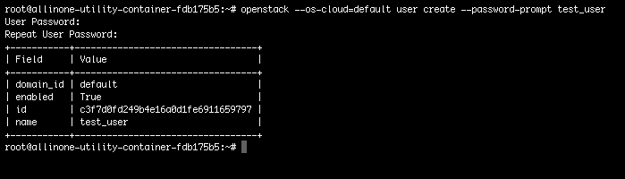
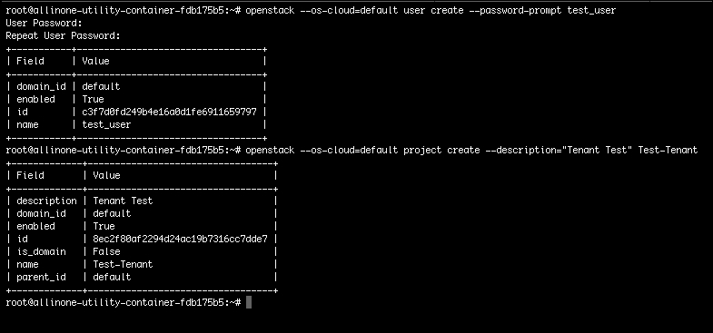
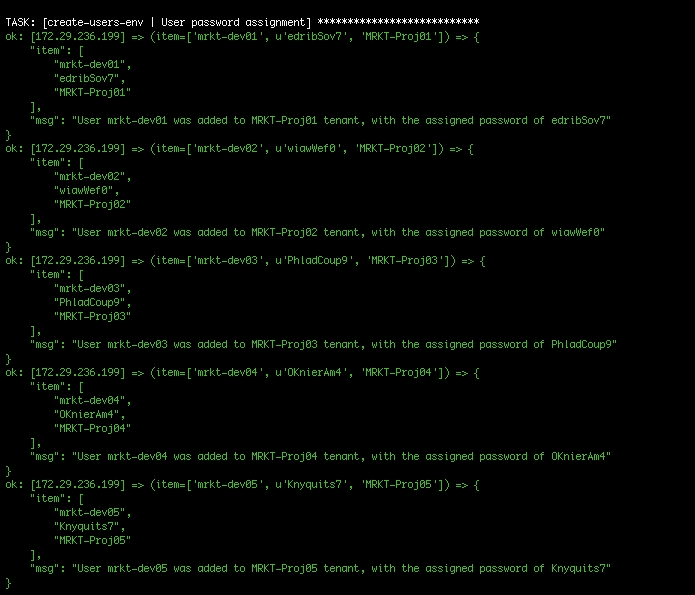
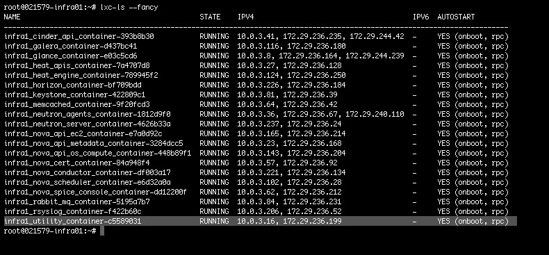

# 第三章。创建多个用户/项目

我们终于到达了本书的部分，我们将动手创建我们的第一个 OpenStack 管理 playbook。为您的 OpenStack 云创建用户和项目实际上是设置云供用户使用的第一步。因此，从这里开始是很好的。我们将首先逐步介绍如何手动执行此操作，然后过渡到创建具有角色的 playbook 以完全自动化。在创建 playbook/role 时，我将尝试强调可能的问题以及您可以使用 Ansible 实现它的灵活方式。本章将涵盖以下主题：

+   创建用户和项目

+   自动化考虑

+   编写 playbook 和 roles

+   Playbook 和角色审查

# 创建用户和项目

尽管作为云操作员/管理员创建新用户和项目似乎是一个微不足道的任务，但如果要求创建 10、20 或 50 个用户和 5、10 或 20 个项目，它确实会成为一个负担。首先创建用户（具有相应的复杂安全密码），然后为用户创建项目，最后将用户链接到该项目并为该用户分配适当的角色。

想象一遍又一遍地这样做。无聊！作为任何管理员，您学到的第一件事是：找出您的日常任务是什么，然后确定如何尽快/轻松地完成它们。这正是我们要在这里做的事情。

## 手动创建用户和项目

进一步演示前面概述的步骤，我们将演示用于创建用户和项目的命令。

### 注意

出于简单起见，我们将仅使用 OpenStack CLI 演示手动命令。

### 创建用户

在 OpenStack 中创建用户涉及向身份服务（Keystone）发送请求。Keystone 请求可以通过首先使用 OpenRC 文件或通过在命令中传递`--os-cloud`认证参数来执行（稍后的第二个示例中显示）。接下来，您需要负责提供命令所需的参数值，例如用户名和密码。请参阅以下示例：

```
**$ source openrc**
**$ openstack user create --password-prompt <username>**

```

或者我们也可以使用这个：

```
**$ openstack --os-cloud=<cloud name> user create --password-prompt 
  <username>**

```

输出将类似于这样：



### 创建项目

如前所述，项目（以前称为租户）是云中的一个隔离区域，您可以在其中分配用户。该用户可以仅限于该项目，也可以允许访问多个项目。创建项目的过程类似于前面提到的创建用户的过程。一旦您使用 OpenRC 文件或在每个命令中传递认证参数，就可以继续执行 CLI 命令。假设 OpenRC 文件已经被加载，请参阅以下示例：

```
**$ openstack --os-cloud=<cloud name> project create 
  --description="<project description>" <project name>** 

```

输出将类似于这样：



### 为用户分配角色和项目访问权限

仍然使用 Keystone 服务，您将为刚刚创建的用户指定一个特定的角色（用户权限）到指定的项目。基本 OpenStack 云带有默认角色：`admin`和`_member_`。您还可以创建自定义角色。您需要角色和要分配给用户的项目的名称。如果 OpenRC 文件仍然被加载，请参阅以下示例。对于此命令，屏幕上不会打印任何输出：

```
**$ openstack role add --user=<username> --project=<project name> <role name>**

```

到目前为止，您已经手动创建了一个用户和一个项目，并将该用户分配给了该项目的一个角色。让我们继续审查围绕自动化前面提到的所有步骤的一些考虑。

# 自动化考虑

将手动任务转化为自动化脚本的想法，无论使用哪种自动化工具，都需要做出一些基本框架决策。这是为了保持代码的一致性，并允许其他人轻松采用您的代码。您是否曾经尝试使用其他人创建的脚本，而他们没有代码标准？这很令人困惑，您会浪费时间试图理解他们的方法。

在我们的情况下，我们将提前做出一些框架决定并保持一致性。在我们开始审查考虑因素以设置我们的框架决策之前，我最大的免责声明是：

### 注意

有许多方法可以使用 Ansible 自动化 OpenStack 的任务；本书中展示的方法只是我个人发现成功的一种方式，当然不是唯一的方式。playbooks/roles 旨在成为您可以用作或调整/改进个人用例的工作示例。

既然这样说了，让我们继续吧。

## 全局定义变量还是每个角色

这个话题可能看起来不够重要，但实际上，使用 Ansible 时，您有比通常更多的选择。考虑到这一点，您将不得不决定如何在角色中定义变量。

Ansible 遵循变量定义层次结构。您可以选择在全局范围内定义放置在 playbook/role 中的变量的值，将其分配给一组主机或仅在特定角色中本地定义。在全局范围内定义值意味着所有 playbooks/roles 都可以使用该值并将其应用于一组主机。相反，如果您将值设置为本地角色，角色将首先从这里获取变量。

全局定义的变量值将在 playbook 的`group_vars/`目录中的文件中定义。文件名必须与`hosts`文件中设置的组名匹配。请参考第二章中的定义变量值部分，回顾这个过程，*Ansible 简介*。这种方法的优点是您可以一次设置变量值，并使您的 playbooks/roles 重复使用该值。这简化了整体定义变量和根据需要更新值的任务。这种方法的负面影响是，如果您希望重用变量名称并希望为每个角色提供不同的值。这就是另一种选择的作用。

在角色中本地定义变量值允许重用变量名称并能够为该变量定义不同的值。通过我的实验，我发现在角色中本地定义变量似乎是最佳选择。我创建角色的整体方法是尽可能简单地创建角色并完成单个管理任务。尽量不要将多个管理任务合并到一个角色中。保持角色简单可以使角色可重用，并符合 Ansible 的最佳实践。

因此，我们在这里做出的第一个框架决定是在角色中本地定义变量值。现在我们可以继续下一个考虑/决策点，即是否使用 OpenStack API 或 CLI 来执行管理命令。

## OpenStack API 还是 CLI？

再次，这个决定在高层面上可能看起来不重要。决定使用 OpenStack API 还是 CLI 可能会极大地改变创建 playbooks/roles 的整体结构和方法。在第一章中，*OpenStack 简介*，我们介绍了 OpenStack API 和 CLI 之间的区别。

一个应该引起注意的事情是，CLI 在使用 Ansible 时更容易使用和编码。请记住，CLI 仍然在幕后执行 API 命令，处理所有令牌和 JSON 解释工作。这允许功能上零损失。

我们宣布的第二个框架决定是在调用 OpenStack 云时使用 Ansible 提供的本机 OpenStack 模块。唯一偏离这一决定的情况是，如果没有可用的模块来处理我们需要编码的任务，我们将使用 CLI 命令。通过这个决定，我们还选择使用第二章中提到的`clouds.yaml`文件来存储我们的凭据。

现在最后一个考虑是决定从哪里执行 playbooks。

## 在哪里运行 Ansible

我的下一个声明可能有点显而易见，但 playbooks 需要在安装了 Ansible 的工作站/服务器上执行。既然我们已经解决了这个问题，让我们探索一下我们的选择：

+   我的第一个建议是不要直接从任何 OpenStack 控制器节点运行 playbooks。控制器节点已经有很多工作要做，只需保持 OpenStack 运行，无需增加额外负担。

+   另一个选择是在您的环境中从某种集中式的 Ansible 服务器执行 playbooks。虽然这是一个完全可行的选择，但我有一个更好的选择给你。

由于我是**openstack-ansible**（**OSA**）部署 OpenStack 的忠实粉丝和倡导者，开箱即用的 playbooks/roles 将使用 OSA 提供的一些出色功能。我的最后一句话可能看起来有点离题，但很快就会更有意义。

运行 OSA 的最大特点之一是内置的动态清单脚本。这个功能消除了您在`hosts`文件中保持 OpenStack 服务位置清单的负担。为了从这个功能中受益，您需要从 OSA 部署服务器执行 playbooks/roles。从大局上来看，将所有 Ansible playbooks/roles（部署和管理脚本）放在一起是有意义的。

这是最佳选择的另一个令人信服的原因是，OSA 部署服务器已经设置好，可以与 LXC 容器通信，OpenStack 服务就位于其中。当您想要使用 Ansible 进行 OpenStack 服务配置更改时，这一点变得非常重要。

我想要强调 OSA 的最后一个特性是，它带有一个专门用于管理您的 OpenStack 云的容器，称为**utility**容器。该容器已安装并准备好使用每个 OpenStack 服务 CLI 包。是的，这是您需要担心的一件小事。这是我喜欢 OSA 的主要原因之一。

现在我们有了最后的框架决定，即从 OSA 部署服务器执行 playbooks，以充分利用 OSA 为我们提供的所有功能（这感觉就对了）。现在我们都掌握了大量的好信息和编码框架，我们唯一剩下的就是创建我们的第一个 playbook 和 roles。

# 编写 playbooks 和 roles

在开始之前，我们应该先回顾本章的开头。我们概述了在 OpenStack 云中创建用户和项目的步骤。这里，它们再次出现，供快速参考：

+   创建用户（附带复杂安全密码）

+   为用户创建项目

+   将用户链接到项目，并为该用户分配适当的角色

解决的第一步是处理流程中的用户创建部分。在 OpenStack 中创建用户是一个简单的任务，那么为什么不添加一些管理风格呢。创建用户的过程中的一部分是为该用户分配一个适当的密码。我们将把这作为创建用户的角色的一部分，并将该用户分配给项目。

创建 playbook 时，我通常从创建角色开始，以处理所需的管理任务。该角色将包含针对 OpenStack 云的所有可执行代码。Playbook 将包含要针对的主机（在本例中，将是实用容器）、要执行的角色以及其他执行设置。处理此管理任务的角色将被命名为`create-users-env`。

我们 playbook 的目录结构将开始看起来像这样：

```
base.yml             # master playbook for user creation 
group_vars/ 
  util_container     # assign variable values for this host group 
hosts                # static host inventory file 
roles/ 
  create-users-env   # user/project creation role 
   tasks/ 
     main.yml        # tasks file for this role 
   vars/ 
     main.yml        # variables associated with this role 

```

由于我们将从角色任务文件组装开始，让我们在`create-users-env/tasks`目录中创建`main.yml`文件。该文件的初始内容如下：

```
--- 

- name: Install random password generator package 
 apt: name={{item}} state=present 
 with_items: 
  - apg 

- name: Random generate passwords 
 command: apg -n {{ pass_cnt }} -M NCL -q 
 register: passwdss 

- name: Create users 
 os_user: 
  cloud: "{{CLOUD_NAME}}" 
  state: present 
  name: "{{ item.0 }}" 
  password: "{{ item.1 }}" 
  domain: default 
 with_together: 
  - "{{userid}}" 
  - "{{passwdss.stdout_lines}}" 

```

现在我们可以更详细地讨论刚刚添加到角色中的前三个任务。第一个任务为使用`apg`包设置了使用`apg`包的基础，该包生成几个随机密码：

```
- name: Install random password generator package 
 apt: name={{item}} state=present 
 with_items: 
  - apg 

```

由于在第二个任务中，我们将使用`apg`包为我们生成密码，因此我们必须确保它已安装在执行 playbook/角色的主机上。Ansible 的`apt`模块是管理 Debian/Ubuntu 软件包的非常有用的工具。使用`{{item}}`参数值定义模块，允许我们循环遍历稍后在`with_items`语句中列出的多个软件包。在这种特殊情况下，这并不需要，因为我们只安装一个软件包，但同时也不会对我们造成伤害。接下来是第二个任务：

```
- name: Random generate passwords 
 command: apg -n {{ pass_cnt }} -M NCL -q 
 register: passwdss 

```

现在第二个任务将使用 Ansible 的命令模块执行`apg`包。

### 提示

命令模块将是在使用 Ansible 时最常用的模块之一。它基本上可以处理执行任何命令/包，但不能处理使用 shell 变量和特定于 shell 的操作的命令，例如：`<`、`>`、`|`和`&`。

使用命令模块，我们传递了带有特定参数`-n {{ pass_cnt }} -M NCL -q`的`apg`命令。大多数参数都是`apg`的标准选项，除了定义的变量`{{ pass_cnt }}`。设置此参数允许我们从为该角色设置的变量文件（位于`create-users-env/vars`目录中）中调整生成的密码数量。我们将很快查看变量文件。此任务的最后一步是将`apg`命令的输出注册到名为`passwdss`的变量中。稍后将在此角色中使用此变量。

添加到角色的第三个任务现在将在您的 OpenStack 云中创建用户。再次看到，使用`os_user`模块，我们将执行 Keystone 命令以创建具有认证参数的用户：

```
- name: Create users 
 os_user: 
  cloud: "{{CLOUD_NAME}}" 
  state: present 
  name: "{{ item.0 }}" 
  password: "{{ item.1 }}" 
  domain: default 
 with_together: 
  - "{{userid}}" 
  - "{{passwdss.stdout_lines}}" 

```

在任务中，我们还将定义一些要使用的变量：

```
{{ item.0 }}  # variable placeholder used to set the usernames from the list  
                defined in the userid variable 

{{ item.1 }}  # variable placeholder used to read in the output from the apg 
                command found within the passwdss variable registered earlier 

```

### 提示

将变量放在命令中，可以让您创建具有核心代码的角色，而无需每次使用时都更新。只需更新变量文件比不断修改角色任务要简单得多。

此任务的另一个特殊部分是使用`with_together` Ansible 循环命令。此命令允许我们循环遍历分别设置的变量值，并按照定义的顺序将它们配对在一起。由于密码是随机的，我们不在乎哪个用户得到哪个密码。

现在我们在角色中有了用户创建代码，下一步是创建用户的项目。下面显示了接下来的两个任务：

```
- name: Create user environments 
 os_project: 
  cloud: "{{CLOUD_NAME}}" 
  state: present 
  name: "{{ item }}" 
  description: "{{ item }}" 
  domain_id: default 
  enabled: True 
 with_items: "{{tenantid}}" 

- name: Assign user to specified role in designated environment 
 os_user_role: 
  cloud: "{{CLOUD_NAME}}" 
  user: "{{ item.0 }}" 
  role: "{{ urole }}" 
  project: "{{ item.1 }}" 
 with_together:  
  - "{{userid}}" 
  - "{{tenantid}}" 

```

这个第一个任务将使用`os-project`模块创建项目。项目名称和描述将来自`tenantid`变量。接下来的任务将使用`urole`变量设置的角色值，将我们之前创建的用户分配给这个新创建的项目。

您会注意到这些任务与之前用于创建用户的任务非常相似，并且使用类似的 Ansible 参数。正如您所看到的，它将开始形成一个重复的模式。这确实有助于简化代码的创建。

角色的最后一个任务部分将简单地提供已创建用户及其对应密码的输出。这一步将为您（作为云操作员）提供一个非常简单的输出，其中包含您需要保存和/或传递给云消费者的所有信息。虽然这一步不是完成整体管理任务所必需的，但它很好。请参阅以下任务：

```
- name: User password assignment 
 debug: msg="User {{ item.0 }} was added to {{ item.2 }} project, with the assigned password of {{ item.1 }}" 
 with_together: 
  - userid 
  - passwdss.stdout_lines 
  - tenantid 

```

在这个任务中，我们将使用`debug`模块来显示我们手动设置或使用`register`Ansible 命令动态设置的变量的输出。输出将看起来像这样：



信不信由你，你刚刚创建了你的第一个 OpenStack 管理角色。为了支持这个角色，我们现在需要创建与之配套的变量文件。位于`create-users-env/vars`目录中的变量文件名为`main.yml`，在结构上与任务文件非常相似。

### 提示

请记住，变量文件中定义的值是为了在每次执行正常的日常使用之前进行更改的。

以下示例中显示的值只是工作示例。让我们来看一下：

```
--- 
pass_cnt: 10 
userid: [ 'mrkt-dev01', 'mrkt-dev02', 'mrkt-dev03', 'mrkt-dev04', 'mrkt-dev05', 'mrkt-dev06', 'mrkt-dev07', 'mrkt-dev08', 'mrkt-dev09', 'mrkt-dev10' ] 
tenantid: [ 'MRKT-Proj01', 'MRKT-Proj02', 'MRKT-Proj03', 'MRKT-Proj04', 'MRKT-Proj05', 'MRKT-Proj06', 'MRKT-Proj07', 'MRKT-Proj08', 'MRKT-Proj09', 'MRKT-Proj10' ] 
urole: _member_ 

```

让我们花点时间来分解每个变量。摘要如下：

```
pass_cnt  # with the value of 10, we would be creating 10 random passwords 
            with apg 

userid    # the value is a comma delimited list of users to loop through 
            when executing the user-create Keystone command 

tenanted  # the value is a comma delimited list of tenant names to loop 
            through when executing the tenant-create Keystone command 

urole     # with the value of _member_, the user would be assigned the 
            member role to the tenant created 

```

这基本上总结了创建变量文件所涉及的内容。现在我们可以继续进行这个 playbook 的基础，并创建名为`base.yml`的主 playbook 文件，它位于 playbook 目录的 root 目录中。`base.yml`文件的内容将是：

```
--- 
# This playbook used to demo OpenStack Juno user, role and project features.  

- hosts: util_container 
 remote_user: root 
 become: true 
 roles: 
create-users-env 

```

该文件的摘要如下：

```
hosts       # the host or host group to execute the playbook against 

remote_user # the user to use when executing the playbook on the 
              remote host(s) 
become      # will tell Ansible to become the above user on the 
              remote host(s) 
 roles      # provide a list of roles to execute as part of 
              this playbook 

```

在完成 playbook 并使其准备好执行之前，还有最后两个需要注意的地方，即创建主机清单文件和全局变量文件。在这种情况下，我们使用静态主机清单文件来保持简单，但在未来的章节中，我们将使用 OSA 动态清单文件。因为我们使用静态清单文件，所以我们必须发现实用容器的名称和/或 IP 地址。

这可以通过在任何控制节点上运行以下命令来完成：

```
**$ lxc-ls -fancy**

```

然后，在输出中查找类似于突出显示的项目：



然后，将实用容器的 IP 地址添加到 hosts 文件中，如下所示：

```
[localhost] 
localhost ansible_connection=local 

[util_container] 
172.29.236.199 

```

最后但并非最不重要的是，然后您将在`group_vars/`目录中创建全局变量文件。请记住，该文件的名称必须与主 playbook 中定义的主机或主机组的名称相匹配。由于我们称主机组为`util_container`，因此必须将变量文件命名为完全相同的名称。`util_container`全局变量文件的内容将是：

```
# Here are variables related globally to the util_container host group 

CLOUD_NAME: default 

```

### 提示

**专业提示**

在远程执行系统命令时，始终创建/使用自动化服务帐户。永远不要使用内置的管理员和/或您个人的帐户来执行该系统的命令。使用服务帐户可以简化故障排除和系统审核。

猜猜...你成功了！我们刚刚完成了我们的第一个 OpenStack 管理 playbook 和 role。让我们通过快速回顾刚刚创建的 playbook 和 role 来完成本章。

# 审查 playbooks 和 roles

直奔主题，我们可以从我们创建的名为`create-users-env`的角色开始。位于`create-users-env/tasks`目录中的完成角色和名为`main.yml`的文件如下所示：

```
--- 

- name: Install random password generator package 
 apt: name={{item}} state=present 
 with_items: 
  - apg 

- name: Random generate passwords 
 command: apg -n {{ pass_cnt }} -M NCL -q 
 register: passwdss 

- name: Create users 
 os_user: 
  cloud: "{{CLOUD_NAME}}" 
  state: present 
  name: "{{ item.0 }}" 
  password: "{{ item.1 }}" 
  domain: default 
 with_together: 
  - "{{userid}}" 
  - "{{passwdss.stdout_lines}}" 

- name: Create user environments 
 os_project: 
  cloud: "{{CLOUD_NAME}}" 
  state: present 
  name: "{{ item }}" 
  description: "{{ item }}" 
  domain_id: default 
  enabled: True 
 with_items: "{{tenantid}}" 

- name: Assign user to specified role in designated environment 
 os_user_role: 
  cloud: "{{CLOUD_NAME}}" 
  user: "{{ item.0 }}" 
  role: "{{ urole }}" 
  project: "{{ item.1 }}" 
 with_together:  
  - "{{userid}}" 
  - "{{tenantid}}" 

- name: User password assignment 
 debug: msg="User {{ item.0 }} was added to {{ item.2 }} tenant, with the assigned password of {{ item.1 }}" 
 with_together: 
  - userid 
  - passwdss.stdout_lines 
  - tenantid 

```

该角色的对应变量文件名为`main.yml`，位于`create-users-env/vars`目录中，如下所示：

```
--- 
pass_cnt: 10 
userid: [ 'mrkt-dev01', 'mrkt-dev02', 'mrkt-dev03', 'mrkt-dev04', 'mrkt-dev05', 'mrkt-dev06', 'mrkt-dev07', 'mrkt-dev08', 'mrkt-dev09', 'mrkt-dev10' ] 
tenantid: [ 'MRKT-Proj01', 'MRKT-Proj02', 'MRKT-Proj03', 'MRKT-Proj04', 'MRKT-Proj05', 'MRKT-Proj06', 'MRKT-Proj07', 'MRKT-Proj08', 'MRKT-Proj09', 'MRKT-Proj10' ] 
urole: _member_ 

```

接下来，位于 playbook 目录的 root 目录中的名为`base.yml`的主 playbook 文件将如下所示：

```
--- 
# This playbook used to demo OpenStack Juno user, role and project features.  

- hosts: util_container 
 remote_user: root 
 become: true 
 roles: 
create-users-env 

```

接下来，我们创建了`hosts`文件，它也位于`playbook`目录的`root`目录中。

```
[localhost] 
localhost ansible_connection=local 

[util_container] 
172.29.236.199 

```

最后，我们通过创建名为`util_container`的全局变量文件，将其保存到`playbook`目录的`group_vars/`目录中，将这个 playbook 全部完成：

```
# Here are variables related globally to the util_container host group 

CLOUD_NAME: default 

```

正如之前承诺的，我觉得为您提供完全可用的 Ansible playbook 和 role 非常重要。您可以直接使用它们，或者作为创建新/改进的 Ansible 代码的跳板。代码可以在 GitHub 存储库中找到，[`github.com/os-admin-with-ansible/os-admin-with-ansible-v2`](https://github.com/os-admin-with-ansible/os-admin-with-ansible-v2)。

现在当然，我们必须测试我们的工作。假设您已经克隆了之前提到的 GitHub 存储库，从部署节点测试 playbook 的命令如下：

```
**$ cd os-admin-with-ansible-v2**
**$ ansible-playbook -i hosts base.yml**

```

# 摘要

现在看，这并不那么糟糕，对吧？Ansible 确实在简化自动化 OpenStack 管理任务所需的工作方面做得很好。您现在可以一次又一次地重复使用该角色，将创建用户和项目的时间缩短到几分钟。这种时间投资是非常值得的。

在本章中，我们通过 API 和 CLI 在 OpenStack 中创建了用户和项目。我们了解了基本的自动化考虑。我们还开发了 Ansible playbook 和 role 来自动化用户和项目的创建。

有了这个良好的基础，我们准备继续进行下一个管理任务，即定制您的云配额。下一章将包括对配额的一般理解以及它们在您的 OpenStack 云中的使用方式。然后我们将过渡到手动创建配额的练习，最后讲解如何使用 Ansible 自动化这项任务。我们在第四章中见！
