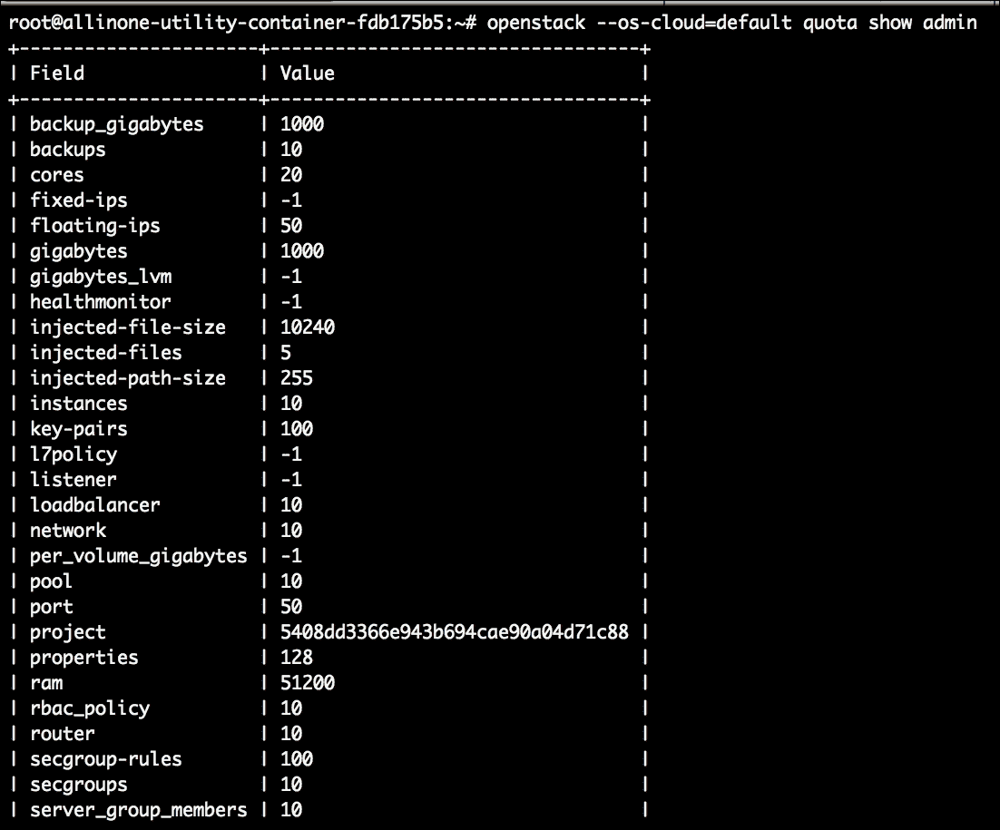

# 第四章：定制您的云配额

现在我们已经解决了创建我们的第一个 OpenStack 管理 Playbook，是时候进入下一个任务了。我们将要涵盖的下一个任务是如何定制云中的项目配额。这通常是为云消费者设置新项目/租户的过程中的下一步。我们将首先逐步介绍如何手动执行此操作，然后过渡到创建具有角色的 Playbook，以完全自动化它：

+   定义和创建配额

+   自动化考虑

+   编写 Playbook 和角色

+   Playbook 和角色审查

# 定义和创建配额

什么是配额？在 OpenStack 中，您可以在租户/项目或用户级别上设置配额，以限制允许的资源消耗。计算服务（Nova）管理配额值并强制执行它们。作为云操作员，这是 OpenStack 提供的另一个重要功能。配额允许您控制云的整体系统容量。您可能会问，为什么不只设置一个默认配额，让每个项目都使用它？我们将根据特定用例逐步介绍这种方法可能有效或无效的原因。还值得一提的是，块存储服务（Cinder）也具有设置配额的能力。

由于我们现在知道您可以设置配额，让我们回顾一下可以受限制的资源以及默认值是什么。以下表格描述了可以设置的配额类型：

| **配额名称** | **定义的数量** |
| --- | --- |
| 实例 | 每个项目中允许的实例 |
| 内核 | 每个项目中允许的实例内核 |
| RAM（MB） | 每个实例中允许的 RAM 兆字节 |
| 浮动 IP | 每个项目中允许的浮动 IP |
| 固定 IP | 每个项目中允许的固定 IP |
| 元数据项 | 每个实例中允许的元数据项 |
| 注入文件 | 每个项目中允许的注入文件 |
| 注入文件内容字节 | 每个注入文件中允许的内容字节 |
| 密钥对 | 每个项目中允许的密钥对 |
| 安全组 | 每个项目中允许的安全组 |
| 安全组规则 | 每个安全组中允许的规则 |
| 服务器组 | 每个项目中允许的服务器组 |
| 服务器组成员 | 每个项目中允许的服务器组成员 |

正如您所见，有很多选项可以应用限制。作为云操作员，您希望充分利用这些选项，以便在每个项目的基础上进行调整。采用这种方法可以优化您的云使用，从本质上延伸您的资源，同时只提供所需的资源。作为管理员，我讨厌看到浪费的资源挂在那里，如果有更好的控制措施，它们可以用于其他用途。配额作为相反的方法，也是保持云消费者不会耗尽所有云资源的概念。

是的，调整配额的过程确实需要努力（也就是额外的工作）。因此，设置全局默认配额值的概念变得流行起来。要查看默认配额值，您将执行以下命令：

```
**$ openstack --os-cloud=<cloud name> quota show <project name>**

```

输出将如下所示：



### 提示

每当您希望将配额值设置为无限制时，请将该值设置为`-1`。这告诉 Nova 允许该资源在该项目或全局范围内不受限制。

现在，让我们专注于如何使用 CLI 手动调整配额值。出于简单起见，我们将仅使用 OpenStack CLI 演示手动命令。

## 手动创建配额

准确地说，您只能更新全局配额或特定租户/项目的配额设置的值。您无法创建新的配额；只能更新值。列出、更新和重置配额涉及向计算服务（Nova）发送请求。

就像每个 OpenStack 服务一样，你必须首先通过在第一章中讨论的 OpenRC 文件进行认证，*OpenStack 简介*。然后，你需要为你希望更新的配额提供值（参考前面提到的表格以获取你的选项）。现在，让我们看下面的例子：

```
**$ source openrc** 
**$ openstack quota set <project name> --instances=<value> 
  --cores=<value>**

```

一旦执行了命令，屏幕上不会有任何输出。然后你可以执行`quota show`命令来确认更新。

一个真实的工作示例可能是这样的：

```
**$ openstack quota show admin**

```

请记住，前面的示例只显示了更新项目的`实例`和`核心`配额。还有其他可以更新的配额值。

## 设置默认配额

如果你只想设置所有租户/项目和用户都将被分配的默认配额，那么这个过程会有点不同。Nova 也管理默认的配额分配。设置默认配额在你希望快速创建一个带有自动内置控制的租户/项目或用户时非常有用。

最糟糕的情况莫过于错误地创建了一个没有资源限制的项目，然后在你意识到之前，该项目的消费者已经耗尽了你的云。云旨在给消费者一种无限的印象。实际上，我们都知道这是不可能的；一切都在某种程度上有限制。根据我的经验，如果你给一个用户 20 个 vCPU，如果允许的话，他们会全部使用完。设置云资源限制对于云操作者来说非常重要。

稍后会给出更新云的默认配额的命令。这个命令可以在认证后执行，就像前面的例子一样。配额选项与更新项目或特定用户的配额相同。请再次参考前面提到的表格以获取你的选项。以下是一个例子：

```
**$ openstack quota set <quota class name> --ram=<value> 
  --security-groups=<value>** 

```

与前面的命令的主要区别之一是，你必须提供 Nova 所谓的“配额”类。`配额`类是 Nova 区分默认`配额`和你可能设置的自定义`配额`的方式。假设未来的 Nova 版本将包括创建额外的`配额`类的功能。目前，你只能更新唯一可用的`配额`类，即名为`default`的`配额`类。

命令的工作示例可能是这样的：

```
**$ openstack quota set default --ram=-1 --security-groups=30**

```

请记住，无论你将默认的`配额`值设置为多少，每个项目或用户最初都会配置为这个值。

## 重置配额值

可能会有一天，你可能希望重新开始并重置为项目或用户设置的配额。幸运的是，在 OpenStack 中这是一个简单的过程。你可以使用 Nova 的`quota-delete`命令。这将删除自定义配额并将其重置为默认配额。参见以下示例：

```
**$ nova quota-delete --tenant=<tenant-id> [--user=<user-id>]**

```

使用前面的命令，你可以提供要将配额恢复为默认值的租户 ID 或用户 ID。

# 自动化考虑

在创建这个角色时，除了我们在前一章中讨论的内容之外，我只需要做出一个自动化决定。所有其他考虑都延续了下来。

因为 Nova `配额`命令允许传递多个选项而没有相互依赖，我们必须想出一种方法，既不限制角色的灵活性，又不需要直接对角色进行不断的更新。Ansible 通过允许将变量作为`哈希`传递来做出这样的决定。在变量文件中，你可以为每个项目或用户定义选项，并让任务循环遍历每个项目/用户以使用这些选项。

我保证这是我最后一次做出这样的声明，但我觉得强调这一点很重要：

### 注意

有许多方法可以使用 Ansible 自动化 OpenStack 的任务，本书中展示的方法只是我个人发现成功的一种方式，当然不是唯一的方式。这些剧本/角色旨在成为您可以直接使用或调整/改进以适应个人用例的工作示例。

就像上次一样，既然已经说了，让我们继续创建这个角色。

# 编写剧本和角色

我们现在将创建一个角色，允许我们一次更新单个和/或多个项目的配额。更新配额是一个相对简单的两步过程。第一步是记录您希望更新配额的租户 ID 或用户 ID。然后，第二步是实际更新配额。

由于在本示例中我们只是创建一个角色，我们可以从角色目录中的`main.yml`文件开始，该目录名为`adjust-quotas/tasks`。该文件开头的内容将如下所示：

```
--- 

- name: Adjust tenant quotas 
 command: openstack --os-cloud="{{ CLOUD_NAME }}" 
      quota set "{{ item.1 }}" "{{ item.0 }}" 
 with_together: 
  - "{{qoptions}}" 
  - "{{tenantname}}" 

```

就像我们在本章前面审查的手动命令一样，您必须从稍后我们将审查的变量文件中提供您希望调整的配额选项和租户名称。同样，我们使用`with_together`命令循环遍历两个变量，将值配对在一起。

以下是任务中定义的变量的进一步细分：

```
{{ item.0 }}  # variable placeholder used to set the quota options to update 

{{ item.1 }}  # variable placeholder used to set the project name 

```

当执行角色时，在这种特定情况下不会生成任何输出。如果您想要提供输出以确认任务成功执行，可以将`quota show`命令作为角色中的附加任务添加。这将如下所示：

```
- name: Confirm tenant quota update 
 command: openstack --os-cloud="{{ CLOUD_NAME }}" 
      quota show "{{ item.0 }}" 
 with_items: "{{tenantname}}" 

```

您现在已经完成了第二个 OpenStack 管理角色。为了支持这个角色，我们现在需要创建与之配套的变量文件。变量文件名为`main.yml`，将位于`adjust-quotas/vars`目录中。

### 提示

请记住，变量文件中定义的值是打算在每次执行前进行更改以进行正常的日常使用。

以下示例中显示的值只是工作示例。让我们来看一下：

```
--- 
qoptions: [ '--cores 30', '--instances 20', '--cores 20', '--instances 20', '--cores 20' ] 
tenantname: [ 'MRKT-Proj01', 'MRKT-Proj02', 'MRKT-Proj02', 'MRKT-Proj03', 'MRKT-Proj03' ] 

```

让我们花点时间来分解每个变量。总结如下：

```
qoptions  # this is where you declare the quota options you wish to update, each 
            set of options and values are encapsulated within single quotes   
            comma delimited; there is no limit on the number of options that can  
            be added 
 tenantname # the value is a comma delimited list of tenant names you wish 
              to update quotas for 

```

现在我们的变量文件已经创建，我们可以继续创建主剧本文件。就像在上一章中一样，文件将被命名为`quota-update.yml`并保存到剧本目录的根目录中。`quota-update.yml`文件的内容将是：

```
--- 
# This playbook used to demo OpenStack Juno quota updates. 

- hosts: util_container 
 remote_user: root 
 become: true 
 roles: 
adjust-quotas 

```

该文件的摘要如下：

```
hosts       # the host or host group to execute the playbook against 

remote_user # the user to use when executing the playbook on the remote host(s) 

become      # will tell Ansible to become the above user on the remote host(s) 

roles       # provide a list of roles to execute as part of this playbook 

```

现在只剩下填充我们的主机清单文件和全局变量文件。由于我们在上一章中已经创建了这些文件，所以没有必要重复这个过程。之前定义的值将保持不变。以下是这些文件的配置快速回顾。

剧本目录根目录中的主机文件是：

```
[localhost] 
localhost ansible_connection=local 

[util_container] 
172.29.236.199 

```

`group_vars/`目录中的全局变量文件是：

```
# Here are variables related globally to the util_container host group 

CLOUD_NAME: default 

```

好的，现在我们完成了两个管理剧本和角色。和往常一样，我们将以快速审查刚刚创建的剧本和角色结束本章。

# 审查剧本和角色

要开始，我们可以从我们创建的名为`create-users-env`的角色开始。完成的角色和文件，名为`main.yml`，位于`adjust-quotas/tasks`目录中，看起来像这样：

```
--- 

- name: Adjust tenant quotas 
 command: openstack --os-cloud="{{ CLOUD_NAME }}" 
      quota set "{{ item.1 }}" "{{ item.0 }}" 
 with_together: 
  - "{{qoptions}}" 
  - "{{tenantname}}" 

```

该角色对应的变量文件，名为`main.yml`，位于`adjust-quota/vars`目录中，将如下所示：

```
--- 
qoptions: [ '--cores 30', '--instances 20', '--cores 20', '--instances 20', '--cores 20' ] 
tenantname: [ 'MRKT-Proj01', 'MRKT-Proj02', 'MRKT-Proj02', 'MRKT-Proj03', 'MRKT-Proj03' ] 

```

接下来，位于`playbook`目录的`root`中的主剧本文件，名为`quota-update.yml`，将如下所示：

```
--- 
# This playbook used to demo OpenStack Juno quota updates. 

- hosts: util_container 
 remote_user: root 
 become: true 
 roles: 
adjust-quotas 

```

接下来，我们创建了主机文件，也位于`playbook`目录的`root`目录中：

```
[localhost] 
localhost ansible_connection=local 

[util_container] 
172.29.236.199 

```

最后，我们通过创建名为`util_container`的全局变量文件来包装这个剧本，将其保存到剧本的`group_vars/`目录中：

```
# Here are variables related globally to the util_container host group 

CLOUD_NAME: default 

```

### 注意

完整的代码集可以在以下 GitHub 存储库中再次找到：[`github.com/os-admin-with-ansible/os-admin-with-ansible-v2`](https://github.com/os-admin-with-ansible/os-admin-with-ansible-v2)。

现在当然，我们必须测试我们的工作。假设您已经克隆了前面提到的 GitHub 存储库，从部署节点测试 playbook 的命令如下：

```
**$ cd os-admin-with-ansible-v2**
**$ ansible-playbook -i hosts quota-update.yml**

```

# 摘要

作为 OpenStack 操作员，配额将是您关注的重点，因此，能够简化该流程的任何努力都将是有益的。Ansible 是简化重复任务的关键。就像在上一章中一样，您可以将此角色与其他角色结合使用多次。这就是为什么您希望尽可能将角色设计为基本通用任务的原因。

本章涵盖的一些内容包括定义 OpenStack 中配额的概念。然后，我们利用这些知识学习了如何使用 OpenStack CLI 更新项目/用户的配额。我们应用了一些关于为什么要使用默认云配额以及如何适当地更新它们的基本原则。接下来，我们回顾了如何重置任何自定义配额。最后，我们开发了我们自己的 Ansible playbook 和角色，以自动更新自定义项目/用户配额。

现在让我们继续进行下一章，我们将承担云快照的管理任务。如果您想将实例用作金标本和/或保留实例的备份，那么拍摄实例快照的功能是一个强大的工具。了解如何在云操作员级别处理这种任务非常有益。下一章将介绍如何手动创建快照，介绍一次性快照项目中所有实例的功能，然后当然还包括如何使用 Ansible 自动化该任务。我们继续到第五章 *快照您的云*。
