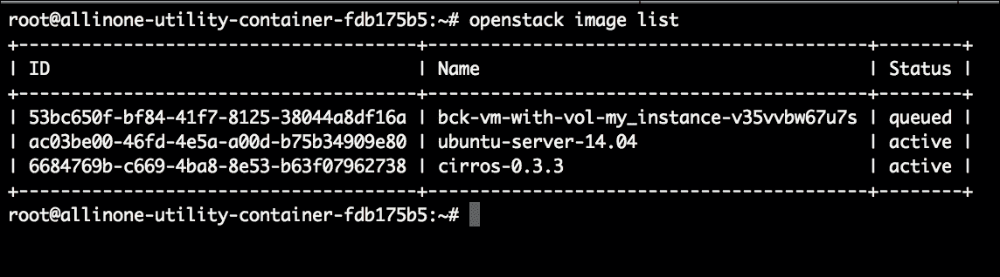
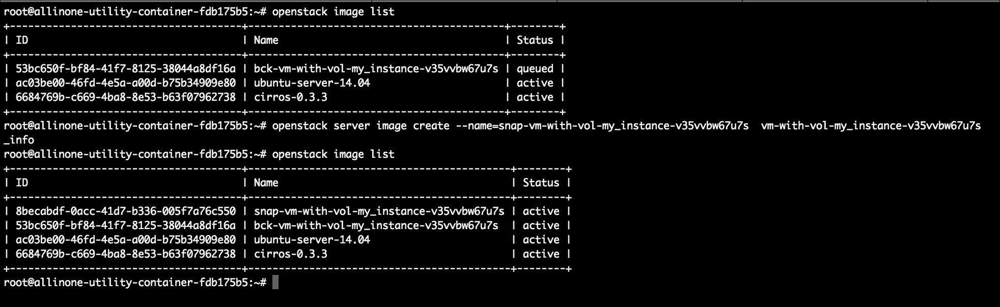
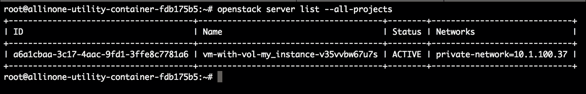
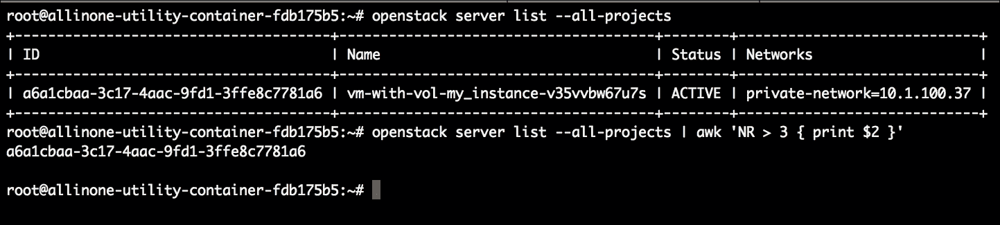

# 第五章：快照您的云

在本章中，我们将涵盖使用内置于计算服务（Nova）的 OpenStack 能力创建实例备份和/或快照的任务。当采用真正的云方法，即水平扩展和一次性资源的方法时，您会发现在利用快照与传统备份相比时有很大的用处。尽管这很好，但最佳实践是了解每种能力和适当用例。我们将首先逐步介绍如何手动创建备份或快照，然后过渡到创建具有角色的 playbook，以完全自动化租户级别的操作。本章将涵盖以下主题：

+   定义备份和快照

+   手动创建备份和快照

+   恢复实例备份

+   自动化考虑

+   编写 playbook 和角色

+   Playbook 和角色的审查

# 定义备份和快照

从 OpenStack 的角度来看，备份和实例快照之间存在明显的区别。这些差异可能影响每个功能的使用。请记住，与真正的云行为保持一致，所有云资源都应该是可丢弃的。您可能会问这句话真正意味着什么。它只是意味着为了支持应用功能而创建的任何实例或卷（资源）都应该能够以某种自动化方式重新创建。灌输*宠物与牛*的类比。不再是试图让生病的虚拟机复活的日子。

销毁实例，重新创建，然后再次开始。这些原则消除了对实例备份的需求。话虽如此，仍会有一些情况下您可能希望备份实例。因此，让我们首先检查获取实例备份的能力。

OpenStack 计算服务（Nova）备份实例的功能就像任何传统备份过程一样。备份实例的目的是为了保留实例的当前状态，以便以后可能恢复。与任何其他后备过程一样；您可以确定备份类型和轮换计划。一些可能的`备份`类型参数可以是**每日**或**每周**。轮换计划将表示要保留的备份数。通过 Nova CLI 执行实例`备份`命令的工作示例如下：

```
**$ nova backup <instance><backup name><backup-type><rotation>**
**$ nova backup testinst bck-testinst weekly 5**

```

### 注意

完全透明地说，截至本书编写时，Nova`备份`功能尚未完全运行。此时的`备份`命令只是 Nova 中设置的一个挂钩，用于未来专门关注数据保护的 OpenStack 服务。OpenStack 数据保护服务，代号**Raksha**，将负责帮助自动化数据保护任务，如备份。Raksha 仍在开发中，并将出现在即将推出的 OpenStack 版本中。您可以在[`wiki.openstack.org/wiki/Raksha`](https://wiki.openstack.org/wiki/Raksha)上阅读更多关于 Raksha 的信息。

现在我们可以继续讨论快照。Nova 获取实例快照的功能类似于备份，但是不是为了恢复目的而保留备份，而是由镜像服务（Glance）存储为图像模板。然后可以使用该图像模板创建与原始快照所在实例相同的其他实例。这就像制作实例的橡皮图章副本。

### 注意

请记住，对实例进行传统快照会暂时暂停实例，直到过程完成。如果您希望在不暂停实例的情况下进行快照，请查看[`docs.openstack.org/openstack-ops/content/snapshots.html`](http://docs.openstack.org/openstack-ops/content/snapshots.html)上找到的*实时快照*功能详细信息。

我经常喜欢将快照过程比作制作服务器的黄金镜像，该镜像将用于构建其他服务器。所采取的步骤将完全相同。创建具有所需操作系统的实例，安装必要的软件包，进行建议的操作系统和应用程序安全调整，验证应用程序功能，然后创建快照。在不需要任何第三方软件的情况下即可随时使用快照功能，这确实是 OpenStack 提供的又一个强大工具。

通过 OpenStackClient CLI 执行实例快照命令的实际工作示例如下：

```
**$ openstack server image create 
  --name=<snapshot name> <instance>**
**$ openstack server image create 
  --name=snp-testinst testinst** 

```

希望这有助于清晰地定义实例备份和快照之间的区别。现在让我们来看看使用 CLI 手动创建它们所需的步骤。

### 注意

为了简单起见，我们将仅使用 OpenStack CLI 演示手动命令。

## 手动创建备份和快照

如前所述，计算服务（Nova）负责创建实例备份和快照的任务。与每个 OpenStack 服务一样，您必须首先进行身份验证，可以通过获取第一章中讨论的 OpenRC 文件，*OpenStack 简介*或通过在命令中传递内联身份验证参数来进行身份验证。这两个任务分别需要提供不同的参数值才能成功执行命令。请参见后面给出的示例。

以下是使用 OpenRC 文件的实例“备份”：

```
**$ source openrc** 
**$ nova backup <instance> <backup name> 
  <backup-type><rotation>**

```

以下是一个使用内联身份验证参数的实例“备份”：

```
**$ nova --os-username=<OS_USERNAME> --os-password=
  <OS_PASSWORD> --os-tenant-
  name=<OS_TENANT_NAME> --os-auth-url=<OS_AUTH_URL> 
  backup <instance><backup name>
  <backup-type><rotation>**

```

执行命令后，不会将任何输出写回屏幕。然后您可以执行`openstack image show`命令来确认更新。

使用 OpenRC 文件的真实工作示例可能如下所示：

```
**$ source openrc**
**$ openstack server list**
**$ nova backup vm-with-vol-my_instance-v35vvbw67u7s 
  bck-vm-with-vol-my_instance-v35vvbw67u7s weekly 3**

```

然后`openstack image list`命令的输出将是：



使用前面提到的命令，您可以提供实例 ID 或名称。刚刚显示的示例使用了实例名称。在获取 OpenRC 文件后，执行`openstack server list`命令以记录您希望备份的实例 ID 或名称。一旦您获得了这些信息，就可以执行`nova backup`命令。

### 注意

镜像服务，代号 Glance，负责保留由云操作员手动上传的备份、快照和任何镜像的清单。要查看可用的清单，您将需要发出 Glance CLI 命令和/或通过**Horizon**仪表板下的**Images**选项卡查看它们。

以下是使用 OpenRC 文件的实例快照：

```
**$ source openrc**
**$ openstack server image create 
  --name=<snapshot name> <instance>**

```

以下是使用内联身份验证参数的实例快照：

```
**$ openstack --os-cloud=default server image create 
  --name=<snapshot name> <instance>**

```

执行命令后，不会将任何输出写回屏幕。然后您可以执行`openstack image list`命令来确认更新。

使用 OpenRC 文件的真实工作示例可能如下所示：

```
**$ source openrc**
**$ openstack server list**
**$ openstack server image create --name=snap-vm-
  with-vol-my_instance-v35vvbw67u7s 
  vm-with-vol-my_instance-v35vvbw67u7s**

```

然后`openstack image list`命令的输出将是：



既然我们已经介绍了如何创建实例备份和快照，那么演示如何使用它们就显得很重要。特别是，我想专注于使用实例备份，因为我注意到在这个功能周围缺乏严重的文档。

## 恢复实例备份

尽管实例“备份”功能在计划任务/自动化方面并非 100%活跃，但您仍然可以使用实例备份将实例恢复到特定时间点。为了做到这一点，您将使用 Nova CLI 中的`nova rebuild`命令。该命令将指示实例关闭，使用引用的“备份”文件重新映像实例，然后重新启动实例。

通过 Nova CLI 执行`nova rebuild`命令的实际工作示例如下：

```
**$ nova rebuild <instance> <image name>**
**$ nova rebuild vm-with-vol-my_instance-v35vvbw67u7s 
  snap-vm-with-vol-my_instance-v35vvbw67u7s**

```

`nova rebuild`命令还有一些可选参数可以与命令一起传递。这些可选参数可以执行诸如重置管理员密码或更改实例名称等操作。我建议查看 OpenStack CLI 文档，该文档可以在[`docs.openstack.org/cli-reference/content/novaclient_commands.html#novaclient_subcommand_rebuild`](http://docs.openstack.org/cli-reference/content/novaclient_commands.html#novaclient_subcommand_rebuild)找到。

# 自动化考虑

自动化这个任务非常简单，不需要任何新的框架决策。我们之前审查的所有其他自动化决策都已经被采纳。

有一个值得强调的领域，当您使用 CLI 自动化 OpenStack 任务时，您可能也会面临。 CLI 的默认输出是**漂亮打印**（使用 Python **prettytable**模块），有时当您想要整理输出时并不那么漂亮。一些 CLI 命令允许特定格式，但如果命令不允许，您还有其他选择。这就是`awk`命令再次成为您非常亲密的盟友的地方。在下一节中，您将注意到`awk`命令的具体用法，以过滤我们在角色中需要的下一个任务的值。

感觉我们现在准备好继续创建下一个 playbook 和 role 了。

# 编写 playbooks 和 roles

我们现在将创建的 playbook 和 role 将允许您一次对单个租户内的所有实例进行快照。选择这个独特的任务是为了保持角色简单，不要使任务过于复杂。您也可以创建一个角色来对所有租户中的所有实例进行快照或备份，只需删除一个参数。很棒，对吧？好吧，感谢 Ansible。

在本章的开头，我们审查了如何进行实例备份和快照的过程。这是一个简单的两步过程。为了自动化这个任务，我们必须向过程添加一个额外的步骤。这一步将是获取我们计划从中获取快照的租户的租户 ID。因此，在大局中，将有三个步骤。*步骤 1*是记录您希望为其获取实例快照的租户 ID。*步骤 2*是现在列出来自租户的所有实例 ID。最后，*步骤 3*是实际获取实例快照。

由于在此示例中我们只创建了一个 role，因此我们可以从名为`create-snapshot/tasks`的 role 目录中的`main.yml`文件开始。该文件的初始内容如下：

```
--- 

- name: Retrieve tenantID 
 shell: openstack --os-cloud="{{ CLOUD_NAME }}" 
     project list | awk '/ "{{tenantname}}" / { print $2 }' 
 register: tenantid 

```

使用`awk`命令和管道（`|`）符号提取租户 ID 的第一步非常简单。这种方法是您将在许多 OpenStack 文档中看到的。它允许您获取一个命令的输出并过滤出您想要保留的部分。首先，我们将执行项目列表命令，然后将使用过滤器，该过滤器将搜索通过名为`tenantname`的变量提供的租户名称，并最终输出原始`project list`命令的第二列值。然后，将使用名为`tenantid`的变量注册该最终输出。`tenantname`变量的定义方式与上一章相同。

请记住，这里使用`shell`模块，因为我们正在执行需要特定于 shell 的操作的命令。

下一个任务现在将列出来自租户的所有实例 ID。完成此操作的代码如下：

```
- name: Retrieve instance id from tenant 
 shell: openstack --os-cloud="{{ CLOUD_NAME }}" 
     server list --all-projects --project "{{ tenantid.stdout }}" | awk 'NR > 3 { print $2 }' 
 register: instid 

```

这个任务与第一个任务非常相似，只是我们使用 OpenStackClient CLI 而不是列出实例并过滤掉所有前导或尾随字符的 ID。我发现当使用 Ansible 时，`openstack server list`命令对实例 ID/名称的提供方式非常具体。为了实现这一点，我决定使用`awk`命令的一个内置变量，名为`NR`。

`awk`中的`NR`变量（记录数）旨在为您提供被过滤内容的记录数或行号。反过来，`NR`变量可以用于集中研究某些行。在这里，我们使用该变量跳过 CLI 输出的前三行。此示例显示了正常输出：



然后，当添加`awk`命令`awk 'NR > 3 { print $2 }'`时，输出如下：



最后，现在我们有了实例列表，我们可以完成最后一个任务，即拍摄快照。执行此操作的代码如下：

```
- name: Create instance snapshot 
 command: openstack --os-cloud="{{ CLOUD_NAME }}"  
      server image create --name="{{ tenantname }}"-snap-"{{ item }}" "{{ item }}"  
 with_items: "{{instid.stdout_lines}}" 
 register: command_result 
 failed_when: "'_info' not in command_result.stderr" 

```

就像在上一章中一样，使用模块定义`{{item}}`参数值允许我们循环遍历`with_items`语句中列出的多个软件包。还要记住，在 Ansible 中将值注册到变量后，需要查询 JSON 数据结构的`stdout`或`stdout_lines`部分。然后，我们重新利用了租户名称和实例 ID 来命名快照，以便将来轻松引用。快照名称本身可以是任何您想要的，我只是觉得这种命名约定最有意义。

在上述代码的最后两行中，必须添加`register`和`failed_when`，这是由于`openstack server image create`命令的输出。如果您想要提供输出以确认任务的成功执行，可以将`openstack image list`命令作为角色的附加任务，并将任务输出打印到屏幕上或保存在文件中。将输出打印到屏幕的示例如下：

```
- name: Confirm instance snapshot(s) 
 shell: openstack --os-cloud="{{ CLOUD_NAME }}" 
     image list --format value --column Name 
 register: snapchk 

- name: Image list output 
 debug: msg="{{ item }}" 
 with_items: "{{snapchk.stdout_lines}}" 

```

您现在已经完成了第三个 OpenStack 管理角色。为了支持此角色，我们现在需要创建与之配套的变量文件。名为`main.yml`的变量文件将位于`create-snapshot/vars`目录中。

### 提示

请记住，变量文件中定义的值是为了在正常的日常使用中在每次执行之前进行更改的。

对于此角色，只需要一个变量：

```
--- 
tenantname: MRKT-Proj01 

```

此变量旨在成为需要拍摄实例快照的租户名称之一的单个值。

现在我们已经创建了变量文件，可以继续创建主要的 playbook 文件。该文件将命名为`snapshot-tenant.yml`，并保存在`playbook`目录的`root`目录中。

### 注意

playbook 和角色的名称可以是任何您选择的。这里提供了具体的名称，以便您可以轻松地跟踪并引用 GitHub 存储库中找到的完整代码。唯一的警告是，无论您决定如何命名角色，都必须在 playbook 中引用时保持统一。

`snapshot-tenant.yml`文件的内容将是：

```
--- 
# This playbook used to demo OpenStack Newton user, role, image and volume features.  

- hosts: util_container 
 remote_user: root 
 become: true 
 roles: 
  - create-snapshot 

```

该文件的摘要如下：

```
hosts       # the host or host group to execute the playbook against 

remote_user # the user to use when executing the playbook on the remote host(s) 

become      # will tell Ansible to become the above user on the remote host(s) 

roles       # provide a list of roles to execute as part of this playbook 

```

现在只剩下填写我们的主机`inventory`文件和全局`variable`文件。由于我们已经在上一章中创建了这些文件，所以无需重复此过程。之前定义的值将保持不变。以下是这些文件配置的快速回顾。

`playbook`目录中`root`目录中的`hosts`文件是：

```
[localhost] 
localhost ansible_connection=local 

[util_container] 
172.29.236.199 

```

`group_vars/`目录中的全局变量文件是：

```
# Here are variables related globally to the util_container host group 

CLOUD_NAME: default 

```

完成了第三个管理 playbook 和 role 的出色工作！和往常一样，我们将以快速审查刚刚创建的 playbook 和 role 来结束本章。

# 审查 playbooks 和 roles

让我们立即开始检查我们创建的名为`create-snapshot`的 role。完成的 role 和文件名为`main.yml`，位于`create-snapshot/tasks`目录中，如下所示：

```
--- 

- name: Retrieve tenantID 
 shell: openstack --os-cloud="{{ CLOUD_NAME }}" 
     project list | awk '/ "{{tenantname}}" / { print $2 }' 
 register: tenantid 

- name: Retrieve instance id from tenant 
 shell: openstack --os-cloud="{{ CLOUD_NAME }}" 
     server list --all-projects --project "{{ tenantid.stdout }}" | awk 'NR > 3 { print $2 }' 
 register: instid 

- name: Create instance snapshot 
 command: openstack --os-cloud="{{ CLOUD_NAME }}"  
      server image create --name="{{ tenantname }}"-snap-"{{ item }}" "{{ item }}"  
 with_items: "{{instid.stdout_lines}}" 
 register: command_result 
 failed_when: "'_info' not in command_result.stderr" 

```

对应的变量文件名为`main.yml`，位于`create-snapshot/vars`目录中，该角色的文件如下：

```
--- 
tenantname: MRKT-Proj01 

```

接下来，位于 playbook 目录的`root`目录中的主 playbook 文件名为`snapshot-tenant.yml`，如下所示：

```
--- 
# This playbook used to demo OpenStack Newton user, role, image and volume features.  

- hosts: util_container 
 remote_user: root 
 become: true 
 roles: 
  - create-snapshot 

```

接下来，我们创建了`hosts`文件，也位于`playbook`目录的`root`目录中：

```
[localhost] 
localhost ansible_connection=local 

[util_container] 
172.29.236.199 

```

最后，创建全局变量文件名为`util_container`，并将其保存到 playbook 的`group_vars/`目录中，将完成 playbook：

```
# Here are variables related globally to the util_container host group 

CLOUD_NAME: default 

```

完整的代码集可以在 GitHub 存储库中再次找到[`github.com/os-admin-with-ansible/os-admin-with-ansible-v2`](https://github.com/os-admin-with-ansible/os-admin-with-ansible-v2)。

在没有先测试我们的工作之前，我们无法结束本章。假设您已经克隆了前面的 GitHub 存储库，从部署节点测试 playbook 的命令如下：

```
**$ cd os-admin-with-ansible-v2**
**$ ansible-playbook -i hosts snapshot-tenant.yml**

```

# 总结

一旦开始使用 Ansible 创建 playbooks 和 roles，您会发现可以为许多不同的目的重复使用大量代码。在本章中，我们能够创建另一个与上一章非常相似的 role，但很快且轻松地包含一个完全不同的任务。始终记住尽可能将您的角色设计为尽可能基本的通用任务。我真诚地无法强调这一点。这可能是自动化某事所需的时间差异。

在本章中，我们定义并描述了实例备份和快照之间的区别。我们解释了使用 OpenStack CLI 手动创建备份和快照的过程。我们还回顾了如何使用实例`backup`的示例。然后，我们最终开发了用于自动创建指定租户内所有实例的快照的 Ansible playbook 和 role。我非常期待进入下一章，我们将在其中研究在计算节点之间迁移实例的过程。这肯定是您在管理 OpenStack 云时会遇到的管理任务。这也是一个颇具争议的话题，因为许多人要么不知道 OpenStack 中存在这个功能，要么不相信这个功能运行良好。在下一章中，我们将尝试通过演示如何手动迁移实例，然后进一步自动化来消除不必要的困惑。对于我们这些云操作员来说，下一章将是金子般的价值。您不想跳过下一章；它肯定是值得的。第六章，*迁移实例*，我们来了！
