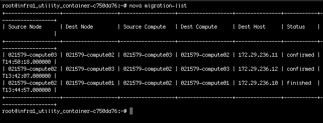
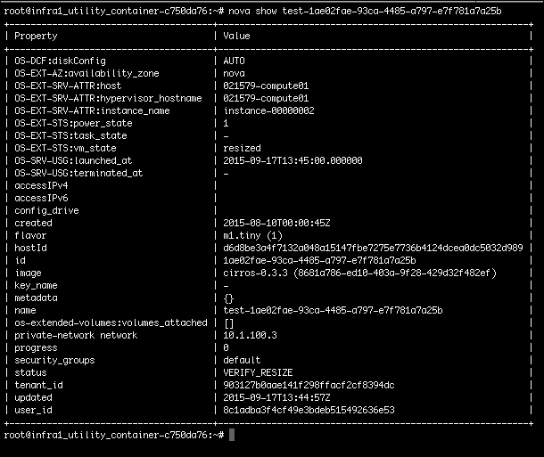
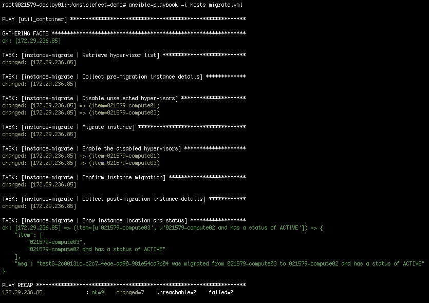

# 第六章。迁移实例

在本章中，我们将介绍使用内置在计算服务（Nova）中的 OpenStack 本机功能迁移实例的任务。如前所述，许多人并不知道这种功能的存在。在本章中，我们将通过演示如何手动迁移实例来证明这种功能。此外，我们将审查自动化此任务所需的步骤，并最终创建一个包含角色的 playbook，以完全自动化实例迁移到指定的计算节点。

本章将涵盖以下主题：

+   实例迁移

+   自动化考虑

+   编写 playbook 和角色

+   Playbook 和角色审查

# 实例迁移

每当提到实例迁移的话题时，通常会因为各种原因而引发一场激烈的讨论。因此，作为一个负责任的成年人，我将继续记录并说实例迁移并不完美。

它有其缺陷，可能有些古怪。无论是实时迁移还是非实时迁移，都对您的 OpenStack 云具有实际用途。在 OpenStack 中，您可以将实例从一个计算节点迁移到另一个计算节点。您可能这样做的原因之一是为了维护目的和/或在云中重新平衡资源利用率。此外，请记住，有多种方法可以清除计算节点以进行维护，我们将在第八章中更详细地介绍这一点，*设置主动-主动区域*。

### 注意

如前所述，OpenStack 计算服务（Nova）具有传统方法迁移实例和实例迁移的功能。

我们将首先检查传统迁移方法及其属性。

传统迁移方法将通过关闭该实例，将实例镜像/文件复制到下一个可用的计算节点，启动新节点上的实例，最后从原始节点中删除实例来移动实例。在这种方法中需要关注的区域是：

+   实例已关闭

+   实例镜像/文件将需要一些时间复制到新的计算节点

+   新的计算节点选择由 Nova Scheduler 完成；您不能在没有额外步骤的情况下分配一个

+   一旦复制完成，实例就会重新上线

正如您所注意到的，这种方法可能被一些人认为是侵入性的。关闭实例以移动它的想法通常不是虚拟化时代中的理想情景。请记住，我们处于一个新时代，*云和可丢弃资源的时代*。

由于资源是随时可用的，并且您有控制权来确定如何使用这些资源，应该没有问题将实例下线。对吗？是的，我知道要摆脱那种*宠物*心态可能需要一段时间，但您会做到的。如果情况允许，通常意味着您在分布在您的 hypervisors 上运行应用程序的实例方面做得很好，您可以非常容易地使用这种方法来迁移实例。

通过 OpenStackClient CLI 进行传统实例迁移命令的工作示例如下：

```
**$ openstack server migrate <instance>**
**$ openstack server migrate testinst**

```

另一种迁移方法是执行实时实例迁移。这种方法将消除之前描述的传统迁移过程中关闭实例的要求。而不是关闭实例，它被挂起（仍处于运行状态），同时实例被重新分配到新的计算节点。自**Mitaka**发布以来，已经取得了很大进展，以改进此功能。这些新增功能包括跟踪迁移进度的能力，暂停或取消正在进行的迁移以及排除某些附加卷的可能性。

为了利用实时迁移功能，还需要满足其他系统要求。这些要求如下：

+   您的计算节点之间必须存在某种共享或外部存储能力

+   使用实时迁移，您可以选择新的计算节点，但必须确保新节点具有新实例所需的资源

+   旧的和新的计算节点必须具有相同的 CPU；如果不是这种情况，Kilo 之前的 OpenStack 版本可能会遇到问题

列表中的第一个要求是最重要的，它值得进一步解释。附加存储要求可以通过以下三种不同方式进行满足：

+   满足需求的第一种方法是配置您的 hypervisor 以存储并访问共享存储以进行实例放置。这意味着实例存储在共享存储设备上，而不是在临时存储上。这可能涉及在计算节点上挂载 NFS 共享以用于存储实例，或通过光纤通道在计算节点之间共享 LUN，例如。

+   满足共享/外部存储要求的第二种方法可能是利用直接块存储，其中您的实例由基于镜像的根磁盘支持。

+   第三种和最后一种方法可能是来自卷存储功能的引导。这是您从 Cinder 基于卷引导实例的地方。当然，您需要在 OpenStack 云中启用和配置块存储服务（Cinder）。

### 注意

在 Nova 中使用实时迁移功能时的一个关键消息是，您的实例必须存在于某种共享/外部存储上，并且不能使用计算节点本地的临时存储。有关所需配置的更多详细信息，请访问[`docs.openstack.org/admin-guide/compute-configuring-migrations.html`](http://docs.openstack.org/admin-guide/compute-configuring-migrations.html)。

通过 Nova CLI 执行实例`server migrate`命令的工作示例如下：

```
**$ openstack server migrate --live=<new compute node> <instance>**
**$ openstack server migrate --live=compute01 testinst**

```

如前所述，实例迁移的整个概念可以从非常简单到极其复杂。希望您现在可以清楚地了解所需的内容以及实例迁移过程。现在让我们来检查使用 CLI 手动迁移实例的过程。

### 注意

出于简单起见，我们将仅使用 OpenStack CLI 演示手动命令。

## 手动迁移实例

计算服务（Nova）负责管理实例迁移过程。 Nova 在幕后将执行重新分配实例到新节点以及实例镜像/文件移动所需的所有步骤。与每个 OpenStack 服务一样，您必须首先进行身份验证，要么通过在第一章中讨论的 OpenRC 文件中进行源化，要么通过在命令中使用内联传递身份验证参数。这两个任务分别需要提供不同的参数值，以便成功执行命令。这里提到了示例。

使用 OpenRC 文件进行实例迁移：

```
**$ source openrc** 
**$ openstack server migrate <instance>**

```

通过内联传递身份验证参数进行实例迁移：

```
**$ openstack --os-cloud=<cloud name> server migrate <instance>**

```

发出`openstack server migrate`命令后，我通常会跟上`openstack server show`命令，以报告实例迁移过程。这是我通常不会经常使用的东西，当自动化 OpenStack 任务时，这是显而易见的原因。由于迁移过程可能需要一些时间，而我们正在手动执行任务，因此有助于跟踪其进展。

另一种检查迁移的方法是使用传统的 Nova CLI 和`nova migration-list`命令。

使用 OpenRC 文件的实际工作示例可能如下所示：

```
**$ source openrc**
**$ openstack server list**
**$ openstack server migrate test-1ae02fae-93ca-4485-a797-e7f781a7a25b**
**$ nova migration-list**

```

`nova migration-list`命令的输出将类似于这样：



在之前的命令中提供的完整输出将根据之前执行的任何迁移而有所不同。要关注的关键信息是您刚刚尝试迁移的实例的迁移`Status`。状态将报告为`migrating`或`finished`。一旦状态更新为`finished`，您就可以确认实例的迁移。

迁移后，实例将默认处于`VERIFY_RESIZE`状态，无论您是否实际上调整了它的大小。



然后，您需要执行`openstack server resize`命令将实例恢复到`ACTIVE`状态。以下示例演示了这个任务：

```
**$ openstack server resize 
  --confirm test-1ae02fae-93ca-4485-a797-e7f781a7a25b**

```

到此为止，您可以开始了！您的实例已经迁移到一个新的计算节点，并且现在处于`ACTIVE`状态。对于我们中的一些人来说，已经习惯了接受传统的迁移过程，下一个问题通常是，为什么我不能使用 nova migrate 命令将实例迁移到特定的计算节点？我们将在下一节讨论这个问题。

## 将实例迁移到特定的计算节点

对于之前提到的问题，诚实而直接的答案是我不知道为什么没有包括这个功能。好消息是，就像 OpenStack 内的大多数事物一样，总是有办法让它按照您的意愿去做。

### 注意

请注意，下面概述的步骤是 100%的解决方法（中等脏的解决方法），在未经多层测试以确保预期功能的情况下，不应在生产环境中使用。

如前面的章节所述，您无法使用传统的迁移方法将实例迁移到特定的计算节点。这个选项实际上是不存在的（希望很快会改变）。但是，您可以通过禁用其他计算节点来欺骗 Nova 调度程序，将实例放置在选定的计算节点上。Nova 调度程序将别无选择，迁移实例到您选择的计算节点上。是的，在您的脑海中，您刚刚称呼我为白痴。不要担心，这在纸上听起来并不像是那么具有侵入性。

OpenStack 控制平面服务旨在报告分布式组件（如计算节点和/或 Cinder 节点）的状态。然后，接收到的报告存储在 OpenStack 数据库中，控制平面服务就知道特定节点是上线还是下线。同样，控制平面服务也可以强制报告节点的状态。

计算服务（Nova）是一个可以强制报告计算节点状态的示例服务。这只会在数据库中标记计算节点的上线或下线状态，实际上并不会对计算节点做任何物理操作。所有运行在这些计算节点上的实例将继续运行，节点的整体功能将保持不变。然而，在数据库中禁用节点的时间内，将阻止在该节点上创建新实例。如果您的 OpenStack 云非常繁忙且不使用分离的计算节点集，这种解决方法可能不是一个明智的选择。

由于其侵入性，这感觉像是一个完美的管理任务，可以尝试自动化。对于这样的任务，时间和准确性非常关键。浪费一分钟的时间可能导致无法在 OpenStack 云内部创建任意数量的新实例。对于这种性质的任务，自动化是王道。在接下来的几节中，我们将回顾自动化这个任务所需的步骤。

# 自动化考虑

这个任务也不需要做出任何新的框架决定。我们之前审查过的所有其他自动化决策都被延续了。

在我们开始之前，值得注意的是，当自动化像这样的任务（迁移实例并禁用计算节点）时，最好在迁移前后收集有关它们的详细信息。拥有这些详细信息将简化您需要时撤销更改的过程。是的，这将为您的角色增加额外的任务，使其稍微复杂一些，但仍然非常值得。

有了这些说法，我们现在准备继续创建我们的下一个剧本和角色。

# 编写剧本和角色

在本节中，我们将创建允许您使用传统的`openstack server migrate`命令将实例迁移到特定计算节点的剧本和角色。与迄今为止创建的其他任务不同，处理此任务实际上只有一种方法。我们将采取前两节中概述的步骤，自动化它们，以便您只需要提供一些变量值，然后执行一个命令。

本章开始讨论了实例迁移以及在 Nova 中处理此问题的两种选项：传统迁移和在线迁移。传统迁移过程实际上是一个一步过程，但为了正确自动化此任务，我们需要向该过程添加一些步骤。我们将不得不创建的任务的简要概述如下：

1.  列出计算节点。

1.  收集预迁移实例详细信息。

1.  禁用除了我们希望实例迁移到的计算节点之外的所有计算节点。

1.  迁移实例。

1.  启用所有计算节点。

1.  确认实例迁移。

1.  收集迁移后实例的详细信息。

## 角色详细信息

由于在此示例中我们只创建一个角色，因此可以从角色目录中的`instance-migrate/tasks`中的`main.yml`文件开始。此文件的初始内容将如下所示：

```
--- 

- name: Retrieve hypervisor list 
 shell: openstack --os-cloud="{{ CLOUD_NAME }}" 
     hypervisor list | awk 'NR > 3' | awk '$4 != "{{ desthype }}" 
     { print $4 }' 
 register: hypelist 

```

检索 OpenStack 云中所有计算节点的完整列表的第一步非常容易，只需使用`openstack hypervisor list`命令。一旦获得这些结果，最好将输出精简为您所需的信息。同样，我们将使用`awk`命令和管道（`|`）符号来做到这一点。您会注意到这与我们在上一章中所做的方式类似。请记住，这里使用 shell 模块是因为我们正在执行需要特定于 shell 的操作的命令。

对于这个特定的任务，我们必须使用`awk`命令进行一些魔术操作：

```
**awk 'NR > 3' | awk '$4 != "{{ desthype }}" { print $4 }'**

```

它不仅会提取标准 CLI 输出的前三行，还会检查第四列并打印所有输出，除了与`{{ desthype }}`变量匹配的内容。然后将整理后的输出注册到名为`hypelist`的变量中。

下一个任务现在将收集预迁移实例详细信息，这些信息将在角色内稍后使用。完成此操作的代码如下：

```
- name: Collect pre-migration instance details 
 shell: openstack --os-cloud="{{ CLOUD_NAME }}"  
     server list --name "{{ instance }}" --long | awk 'NR > 3' | awk '{ print $16 }' 
 register: preinststat 

```

对于这个任务，我们再次使用 OpenStackClient CLI 使用`openstack server list`命令提供实例详细信息。您也可以使用`openstack server show`命令列出实例详细信息。这两个命令之间的明显区别在于`openstack server list`命令可以选择在输出上显示附加字段。要执行此操作，请添加`--long`的可选参数。

在我们的特定情况下，我们想知道特定实例当前正在运行的计算节点。因此，我们需要确保`openstack server list`命令如下所示：

```
**openstack server list --name {{ instance }} --long**

```

第三个任务将是禁用您不希望实例迁移到的计算节点。请记住，我们只是在 Nova 中禁用计算节点，而不是物理上改变计算节点的状态。执行此操作的代码将如下所示：

```
- name: Disable unselected hypervisors 
 command: nova "{{ AUTH_S }}"  
      service-disable "{{ item }}" nova-compute --reason '{{ migreason }}' 
 with_items: "{{hypelist.stdout_lines}}" 

```

通过使用`nova service-disable`命令，您可以告诉 Nova 在远程主机上禁用任何特定的与 Nova 相关的服务。为了让 Nova Scheduler 忽略/跳过计算节点，您需要禁用 nova-compute 服务。该命令还需要提供一个原因，如果需要的话，将存储在 Nova 数据库中以供以后参考。在这个任务中，我们将使用之前收集到的`hypelist`变量中存储的计算节点列表。

### 注意

请注意，我们不会禁用我们希望将实例迁移到的计算节点，因为我们已经将其从列表中过滤出来。

进入第四个任务，我们现在将执行实例迁移。在这一点上，只有您选择接收迁移实例的计算节点是启用的，关于`openstack server migrate`不需要做任何特殊的事情。支持代码请参见这里：

```
- name: Migrate instance 
 command: openstack --os-cloud="{{ CLOUD_NAME }}"  
      server migrate "{{ instance }}" 

```

迁移完成后，我们需要立即重新启用被禁用的计算节点。我欣赏 OpenStack 的一点是，如果您被给予禁用某些东西的命令，通常也会给您一个重新启用它的命令。因此，我们只需执行`nova service-enable`命令。同样，我们将使用`hypelist`变量来提供要执行的计算节点列表。使用的代码如下：

```
- name: Enable the disabled hypervisors 
 command: nova "{{ AUTH_S }}" 
      service-enable "{{ item }}" nova-compute 
 with_items: "{{hypelist.stdout_lines}}" 

```

现在迁移已经完成，并且计算节点都已启用，我们可以专注于完成实例迁移过程。实例迁移的最后一步是通知 Nova，您确认实例已经移动。乍一看，我可以不做这一步，但事后来看，某种确认确实是有意义的。此任务的代码可以在这里找到：

```
- name: Confirm instance migration 
 command: openstack --os-cloud="{{ CLOUD_NAME }}"  
      server resize --confirm "{{ instance }}" 

```

最后两个任务将用于向运行 playbook 的个人提供对所做工作的可视确认。考虑这更多是一个自动化的故障安全，而不是一个要求。对于这样一个复杂的管理任务，总是一个很好的常规做法是输出一些关于系统上发生了什么变化的细节：

```
- name: Collect post-migration instance details 
 shell: openstack --os-cloud="{{ CLOUD_NAME }}"  
     server list --name "{{ instance }}" --long | awk 'NR > 3' | awk '{ print $16 " and has a status of " $10 }' | awk 'NR == 1' 
 register: postinststat 

- name: Show instance location and status 
 debug: msg="{{ instance }} was migrated from {{ item.0 }} to {{ item.1 }}" 
 with_together: 
  - "{{preinststat.stdout_lines}}" 
  - "{{postinststat.stdout_lines}}" 

```

这两个任务将首先收集迁移后实例的详细信息，然后使用从`preinststat`和`postinststat`变量收集到的信息在屏幕上输出变更的摘要。使用的摘要模板将是：

<实例已迁移>已从<计算节点>迁移到<计算节点>，状态为<实例当前状态>

### 提示

随意进入并进行更改以适应您的需求。这只是我的意见方法。保持简单，同时提供处理迁移时关心的相关细节，这样做感觉是正确的。在回顾 playbook 时，如果出现问题和/或实施不正确，您应该能够快速定位需要纠正的步骤。

## 变量细节

再次恭喜，您已经完成了第四个 OpenStack 管理角色。为了支持这个角色，我们现在需要创建与之配套的变量文件。变量文件名为`main.yml`，将位于`instance-migrate/vars`目录中。

### 提示

请记住，变量文件中定义的值是为了在正常的日常使用中在每次执行之前进行更改的。

对于这个角色，我们在变量方面保持了相当简单，只需要定义三个变量：

```
--- 
desthype: 021579-compute02 
instance: testG-2c00131c-c2c7-4eae-aa90-981e54ca7b04 
migreason: "Migrating instance to new compute node" 

```

让我们花点时间来分解每个变量。总结如下：

```
desthype   # this value would be the name of the compute node you wish 
             to migrate the instance to 

instance   # the name of the instance to be migrated 

migreason: # a string encapsulated in quotes to explain the reason 
             for migrating the instance (keep the string brief) 

```

## Playbook 细节

完成变量文件后，我们可以继续创建主 playbook 文件。文件名为`migrate.yml`，保存在`playbook`目录的`root`目录中。

### 注意

playbook 和角色的名称可以是您选择的任何内容。这里提供了具体的名称，以便您可以轻松地跟踪并参考 GitHub 存储库中找到的完成代码。唯一的警告是，无论您决定如何命名角色，都必须在 playbook 中引用时保持统一。

`migrate.yml`文件的内容将是：

```
--- 
# This playbook used to migrate instance to specific compute node.  

- hosts: util_container 
 remote_user: root 
 become: true 
 roles: 
  - instance-migrate 

```

该文件的摘要如下：

```
hosts       # the host or host group to execute the playbook against 

remote_user # the user to use when executing the playbook on the remote host(s) 

become      # will tell Ansible to become the above user on the remote host(s) 

roles       # provide a list of roles to execute as part of this playbook 

```

我们已经在两章前向主机清单文件和全局变量文件添加了内容，所以我们已经完成了这部分。之前定义的值将保持不变。以下是这些文件配置的快速回顾。

`hosts`文件位于 playbook 目录的 root 目录中：

```
[localhost] 
localhost ansible_connection=local 

[util_container] 
172.29.236.199 

```

`group_vars/`目录中的全局变量文件是：

```
# Here are variables related globally to the util_container host group 

CLOUD_NAME: default 

AUTH_S: --os-username {{ OS_USERNAME }} --os-password {{ OS_PASSWORD }} --os-project-name {{ OS_TENANT_NAME }} --os-domain-name {{ OS_DOMAIN_NAME }} --os-auth-url {{ OS_AUTH_URL }} 

OS_USERNAME: admin 
OS_PASSWORD: passwd 
OS_TENANT_NAME: admin 
OS_DOMAIN_NAME: default 
OS_AUTH_URL: http://172.29.238.2:5000/v3 

```

### 注意

**警告**

由于该文件的内容，它应该作为安全文件存储在您可能用来存储 Ansible playbooks/roles 的任何代码存储库中。获取这些信息可能会危及您的 OpenStack 云安全。

我们现在进展非常顺利，微笑，您做到了！希望到目前为止一切都变得更加清晰。保持我们的传统，我们将以快速回顾刚刚创建的 playbook 和 role 结束本章。

# 审查 playbook 和 role

让我们直接开始检查我们创建的 role，名为`instance-migrate`。位于`instance-migrate/tasks`目录中的已完成 role 和文件，名为`main.yml`，看起来是这样的：

```
--- 

- name: Retrieve hypervisor list 
 shell: openstack --os-cloud="{{ CLOUD_NAME }}" 
     hypervisor list | awk 'NR > 3' | awk '$4 != "{{ desthype }}" { print $4 }' 
 register: hypelist 

- name: Collect pre-migration instance details 
 shell: openstack --os-cloud="{{ CLOUD_NAME }}"  
     server list --name "{{ instance }}" --long | awk 'NR > 3' | awk '{ print $16 }' 
 register: preinststat 

- name: Disable unselected hypervisors 
 command: nova "{{ AUTH_S }}"  
      service-disable "{{ item }}" nova-compute --reason '{{ migreason }}' 
 with_items: "{{hypelist.stdout_lines}}" 

- name: Migrate instance 
 command: openstack --os-cloud="{{ CLOUD_NAME }}"  
      server migrate "{{ instance }}" 

- name: Enable the disabled hypervisors 
 command: nova "{{ AUTH_S }}" 
      service-enable "{{ item }}" nova-compute 
 with_items: "{{hypelist.stdout_lines}}" 

- name: Confirm instance migration 
 command: openstack --os-cloud="{{ CLOUD_NAME }}"  
      server resize --confirm "{{ instance }}" 

- name: Collect post-migration instance details 
 shell: openstack --os-cloud="{{ CLOUD_NAME }}"  
     server list --name "{{ instance }}" --long | awk 'NR > 3' | awk '{ print $16 " and has a status of " $10 }' | awk 'NR == 1' 
 register: postinststat 

- name: Show instance location and status 
 debug: msg="{{ instance }} was migrated from {{ item.0 }} to {{ item.1 }}" 
 with_together: 
  - "{{preinststat.stdout_lines}}" 
  - "{{postinststat.stdout_lines}}" 

```

该角色的对应变量文件，名为`main.yml`，位于`instance-migrate/vars`目录中，将如下所示：

```
--- 
desthype: 021579-compute02 
instance: testG-2c00131c-c2c7-4eae-aa90-981e54ca7b04 
migreason: "Migrating instance to new compute node" 

```

接下来，位于`playbook`目录的`root`目录中的主 playbook 文件，名为`migrate.yml`，将如下所示：

```
--- 
# This playbook used to migrate instance to specific compute node.  

- hosts: util_container 
 remote_user: root 
 become: true 
 roles: 
  - instance-migrate 

```

接下来，我们创建了`hosts`文件，它也位于`playbook`目录的`root`目录中：

```
[localhost] 
localhost ansible_connection=local 

[util_container] 
172.29.236.199 

```

最后，创建名为`util_container`的全局变量文件，并将其保存到 playbook 的`group_vars/`目录中将完成 playbook：

```
# Here are variables related globally to the util_container host group 

CLOUD_NAME: default 

AUTH_S: --os-username {{ OS_USERNAME }} --os-password {{ OS_PASSWORD }} --os-project-name {{ OS_TENANT_NAME }} --os-domain-name {{ OS_DOMAIN_NAME }} --os-auth-url {{ OS_AUTH_URL }} 

OS_USERNAME: admin 
OS_PASSWORD: passwd 
OS_TENANT_NAME: admin 
OS_DOMAIN_NAME: default 
OS_AUTH_URL: http://172.29.238.2:5000/v3 

```

### 注意

完整的代码集可以在 GitHub 存储库中找到，[`github.com/os-admin-with-ansible/os-admin-with-ansible-v2`](https://github.com/os-admin-with-ansible/os-admin-with-ansible-v2)。

我们终于来到了我最喜欢的部分，即测试我们的出色工作。幸运的是，我已经解决了所有的错误（眨眼）。假设您已经克隆了前面的 GitHub 存储库，从部署节点测试 playbook 的命令将如下所示：

```
**$ cd os-admin-with-ansible-v2**
**$ ansible-playbook -i hosts migrate.yml**

```

可以在此处查看 playbook 执行输出的示例：



# 摘要

很高兴完成了另一个涵盖现实生活中 OpenStack 管理职责的章节。您创建的 playbooks 和 roles 越多，您就能够通过简单地重用先前为其他目的创建的代码来更快地创建新代码。在本书结束之前，您将拥有一个不错的 playbooks/roles 集合，以供将来的 Ansible 自动化参考。

回顾本章时，您会回想起我们讨论了实例迁移是什么，以及为什么您会想要使用这个功能。我们回顾了两种可能的迁移方法：传统迁移和在线迁移。您学会了如何手动迁移实例，以及如何使用传统迁移将实例迁移到特定计算节点的解决方法。最后，我们创建了 Ansible playbook 和 role 来自动化这种解决方法。总体而言，实例的维护和在计算节点之间的移动不断改进。在某个时候，您将不需要使用本章提到的一些解决方法。敬请期待一些很棒的改进！

下一章是一个热门话题，因为我们许多人都在探索容器技术。特别是，我们关注如何在利用 OpenStack 云的同时消耗和使用容器。现在有几种方法可用，但关键是自动化这个过程，使其成为可重复使用的功能。在下一章中，我们将介绍每种方法，并展示如何成功地完成这一过程的构建模块。再拿一杯咖啡，做个快速伸展，让我们开始《第七章》*在您的云上管理容器*！
