# 第七章：在您的云上管理容器

在本章中，我们将介绍当前最受讨论的技术方法之一，即容器。围绕容器的流行度不断增加，这是理所当然的，谁不希望有一种更容易部署应用程序和一种整合的方法来使用计算资源？我喜欢使用的最佳类比之一是，在谈论容器时，除了显而易见的船上的集装箱类比之外，想象把所有的代码放进一辆汽车或 SUV 中。然后一辆车辆载体出现在你家门口来接你的车辆。你的车辆的维护将几乎没有，因为车辆载体正在做所有的工作。你只需要担心确保车辆载体正常工作。这就是容器背后的原理，我们将深入探讨容器概念，还将学习如何利用 OpenStack 和/或 Ansible 来构建和部署它们。与我们通常的做法一样，当我们逐个部分进行时，我们将创建一些 Ansible 示例，以展示您可能如何管理各种不同的容器格式。本章将涵盖以下主题：

+   解释容器概念

+   构建和部署容器

+   使用 Ansible Container 构建容器

+   在 OpenStack 上部署 Kubernetes

+   使用 Ansible 管理 CoreOS 和 Docker

+   在 OpenStack 上部署 Nova LXD

+   审查 playbooks 和 roles

# 解释容器概念

我必须相信大多数对技术感兴趣的人已经知道容器化（又称容器）是什么，但在我假设错误的怪异机会中，开始解释它究竟是什么感觉是一个好主意。我会尽力不只是给出维基百科的定义，而是尽力为为什么容器模型是资源虚拟化的一个非常有用的补充提供一些实质性的意义。

随着传统虚拟化的开始，人们意识到我可以将我的服务器切成可消耗的块。不再需要将整个服务器专用于成为网络或应用程序服务器。随之而来的是云的采用，因为许多人开始意识到他们没有正确使用这些虚拟化资源。虚拟机闲置或拥有不需要的过多资源。云的一个主要卖点是你可以只使用你需要的资源，并且这些资源是可丢弃的，即使用后就丢弃。尽管这些技术使消耗计算资源变得更容易，但它们都没有真正帮助改善应用程序的部署方式。

记住你为什么需要那些虚拟机和实例，那就是为了运行应用程序。如果获取资源的速度更快，但部署新应用程序仍然需要几天，那有什么意义呢？在我看来，这就是容器化方法被设计的基础。开发人员和系统管理员（主要是系统管理员）希望有一种更有效的部署应用程序的方法。我个人还记得部署新应用程序或 API 的极其痛苦的过程。它包括尝试按照开发人员编写的部署文档进行部署，而这些开发人员很可能以前从未登录过服务器或管理过网络/应用程序服务器软件。让我们只说它充满了遗漏的步骤、错误的命令，并且永远无法考虑到可能需要的任何环境修改（例如依赖软件版本）。

快进到现在，你现在有更多的选择。现在有很多不同的容器技术，允许开发人员将应用程序打包到容器中，然后将其直接*部署*到你选择的容器平台。不再需要部署文档，不再需要凌晨 2 点的部署派对，最重要的是不再有部署错误。由于容器包含了应用程序的完整运行时环境，你只需要管理容器技术本身和它运行的操作系统。容器也很容易在环境之间或系统之间移动，因为唯一的依赖是运行相同容器技术的服务器。

现在你已经了解了一些关于容器的知识，你必须选择最适合你需求的平台。一些最流行的容器技术包括 Docker ([`www.docker.com`](https://www.docker.com))，Kubernetes ([`kubernetes.io`](http://kubernetes.io))，CoreOS ([`coreos.com`](https://coreos.com))和 LXC/LXD ([`linuxcontainers.org`](https://linuxcontainers.org))。

所以在你问之前，你可能会想，由于容器相对较新，它是否可以被信任，容器化概念是否已被证明有效？答案是肯定的，因为容器并不是一个新概念。容器或容器化的概念已经存在了 10 年。第一个容器技术是 LXC，它已经成为 Linux 内核的一部分多年了。因此，我可以肯定地说它已经经过了测试，并且绝对是一个值得加入你的组织组合中的技术。

我们现在可以开始探索容器并制定如何在你的 OpenStack 云上自动构建和部署它们的旅程。我们旅程中需要走的第一步是构建我们的第一个容器。

# 构建和部署容器

在这一部分，我们将学习如何设计、构建和部署各种容器技术的容器。我们将在这里涵盖的主题包括：

+   使用 Ansible Container 构建容器

+   在 OpenStack 上部署 Kubernetes

+   使用 Ansible 管理 CoreOS 和 Docker

+   在 OpenStack 上部署 Nova LXD

如前所述，我们将首先学习如何使用我认为是最简单的容器工具 Ansible Container 构建我们的第一个容器。希望你也很兴奋，因为我肯定是，让我们开始吧！

## 使用 Ansible Container 构建容器

什么是 Ansible Container？

> *Ansible 将 Ansible Container 描述为"容器开发、测试和部署的终极工作流" - ([`docs.ansible.com/ansible-container`](https://docs.ansible.com/ansible-container))*

把它看作是一个工作流工具，它不仅可以帮助你构建 Docker 镜像，还可以使用 Ansible playbooks 编排它们和应用程序的部署。我会给你一点时间来整理一下自己。是的，我们的朋友 Ansible 又一次做到了，并提供了另一个很棒的工具放入我们的工具箱中。不再只依赖 Dockerfile。Ansible 带来的所有功能现在可以直接与构建、运行、部署，甚至将容器镜像推送到选择的注册表相结合。关于 Ansible Container 的所有信息都可以在这里找到：[`docs.ansible.com/ansible-container`](http://docs.ansible.com/ansible-container)。

就像对待每个其他工具一样，Ansible 使得以 Ansible Container 为中心的焦点变得简单易用。就我个人而言，我能够在短短几个小时内安装它并部署我的第一个容器。Ansible Container 的关键功能之一是能够利用来自 Ansible Galaxy（[`galaxy.ansible.com/intro`](https://galaxy.ansible.com/intro)）的共享容器构建，以便快速设计您的容器映像。请记住，开源就是与社区分享。

### 自动化考虑

第一步是安装它，由于 Ansible 文档与众不同，我无需重新发明轮子。安装选项和详细信息可以在以下位置找到：[`docs.ansible.com/ansible-container/installation.html`](http://docs.ansible.com/ansible-container/installation.html)。在您运行它之后，我建议的下一步是查看此处的入门指南：[`docs.ansible.com/ansible-container/getting_started.html`](http://docs.ansible.com/ansible-container/getting_started.html)。

现在，我们将逐步介绍我创建的一个示例 Ansible Container 项目以供开始使用。对我来说，这是学习新技术的最佳方式。花些时间，动手尝试一下，然后变得更有见识。

#### 步骤 1

使用 Ansible Container 项目开始就像创建一个新目录一样简单。创建新目录后，您需要进入该目录并执行 Ansible Container 初始化命令。这些命令的工作示例如下：

```
**$ mkdir elk-containers**
**$ cd elk-containers**
**$ ansible-container init**

```

命令的输出将类似于这样：

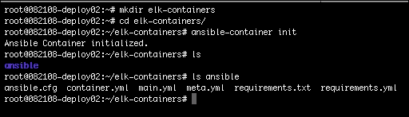

在所示的示例中，我们的项目将被命名为`elk-containers`，并将在同名的目录中初始化。现在您已经初始化了您的项目，您会发现 Ansible Container 文件被创建在一个名为`ansible`的目录中。您的项目的目录结构将如下所示：

```
ansible/ 
  container.yml 
  main.yml 
  meta.yml 
  requirements.txt 
  requirements.yml 
  ansible.cfg 

```

在这里创建的文件是提供一个起点的骨架文件。如果您检查两个最重要的文件`container.yml`和`main.yml`，它们将看起来像这样：

**container.yml**

```
version: "1" 
services: 
 # Add your containers here, specifying the base image you want to build from 
 # For example: 
 # 
 # web: 
 #    image: ubuntu:trusty 
   #  ports: 
   #     - "80:80" 
   #  command: ['/usr/bin/dumb-init', '/usr/sbin/apache2ctl', '-D', 'FOREGROUND'] 
 #    dev_overrides: 
 #   environment: 
 #    - "DEBUG=1" 
 # 
registries: {} 
 # Add optional registries used for deployment. For example: 
 # google: 
 #  url: https://gcr.io 
 #  namespace: my-cool-project-xxxxxx  

```

**main.yml**

```
# This should be your Ansible playbooks to provision your containers. 
# An inventory will be automatically created using the names of the services 
# from your container.yml file. 
# Add any roles or other modules you'll need to this directory too. 
# For many examples of roles, check out Ansible Galaxy: https://galaxy.ansible.com/ 
# 
--- 
- hosts: all 
 gather_facts: false 

```

#### 步骤 2

现在，我们可以手动配置我们的容器和/或利用 Ansible Galaxy 上托管的许多预打包的 Ansible Container 配置。在这里的示例中，我们将从 Ansible Galaxy 拉取并使用三种不同的配置。我们的示例项目将部署三个容器，这些容器将共同运行 ELK 堆栈（Elasticsearch，Logstash 和 Kibana）。

### 注意

在执行以下命令之前，请确保您已安装了 Ansible Container 和所有先决软件。有关详细信息，请参阅 Ansible Container 安装说明：[`docs.ansible.com/ansible-container/installation.html`](https://docs.ansible.com/ansible-container/installation.html)。

处理此的命令在此处提到；确保在执行时您在项目目录的`root`目录中：

```
**$ cd elk-containers**
**$ ansible-container install chouseknecht.kibana-container**
**$ ansible-container install chouseknecht.elasticsearch-container**
**$ ansible-container install chouseknecht.logstash-container**

```

命令的输出将类似于这样：

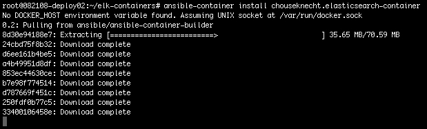

下载基础镜像后，Ansible Container 将其加载到一个虚拟容器中，其中包含所有可能的镜像依赖项，以准备构建它。

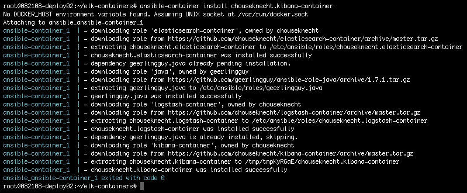

#### 步骤 3

接下来，我们将回顾之前的`ansible-container`安装命令对我们的项目做了什么。如果我们现在查看我们的`container.yml`和`main.yml`文件，我们会注意到部署 ELK 堆栈到容器所需的所有自动化代码都在那里。让我们看看这些文件的变化：

**container.yml**

```
version: '1' 
services: 
 kibana: 
    image: centos:7 
    ports: 
    - 5601:5601 
    user: kibana 
    links: 
    - elasticsearch 
    working_dir: /opt/kibana/bin 
    command: [./kibana] 
 elasticsearch: 
    image: centos:7 
    ports: 
    - 9200:9200 
    expose: 
    - 9300 
    restart: always 
    user: elasticsearch 
    working_dir: /usr/share/elasticsearch/bin 
    command: [./elasticsearch] 
 logstash: 
 image: centos:7 
    ports: 
    - 5044:5044 
    links: 
    - elasticsearch 
    restart: always 
    working_dir: /opt/logstash/bin 
    command: [./logstash, agent, -f, /etc/logstash/conf.d] 
    environment: 
    - JAVACMD=/usr/bin/java 

 # volumes: 
   # - your_configuration_volume:/etc/logstash/conf.d 
 # Add your containers here, specifying the base image you want to build from 
 # For example: 
 # 
 # web: 
 #    image: ubuntu:trusty 
 #    ports: 
 #       - "80:80" 
   #  command: ['/usr/bin/dumb-init', '/usr/sbin/apache2ctl', '-D', 'FOREGROUND'] 
 #    dev_overrides: 
   #     environment: 
   #        - "DEBUG=1" 
 # 
registries: {} 
 # Add optional registries used for deployment. For example: 
   # google: 
 #      url: https://gcr.io 
   #    namespace: my-cool-project-xxxxxx 

```

**main.yml**

```
- hosts: all 
 gather_facts: false 
- hosts: kibana 
 roles: 
 - role: chouseknecht.kibana-container 
    kibana_host: 0.0.0.0 
    kibana_port: 5601 
    kibana_elasticsearch_url: http://elasticsearch:9200 
    kibana_index: .kibana 
    kibana_log_dest: stdout 
    kibana_logging_silent: false 
    kibana_logging_quiet: false 
    kibana_logging_verbose: true 
- hosts: elasticsearch 
 roles: 
 - role: chouseknecht.elasticsearch-container 
    elasticsearch_network_host: 0.0.0.0 
    elasticsearch_http_port: 9200 
    elasticsearch_script_inline: true 
    elasticsearch_script_indexed: true 
    elasticsearch_data: /usr/share/elasticsearch/data 
    elasticsearch_logs: /usr/share/elasticsearch/logs 
    elasticsearch_config: /usr/share/elasticsearch/config 
    java_home: '' 
- hosts: logstash 
 roles: 
 - role: chouseknecht.logstash-container 
    logstash_elasticsearch_hosts: 
    - http://elasticsearch:9200 

    logstash_listen_port_beats: 5044 

    logstash_local_syslog_path: /var/log/syslog 
    logstash_monitor_local_syslog: true 

    logstash_ssl_dir: /etc/pki/logstash 
  logstash_ssl_certificate_file: '' 
  logstash_ssl_key_file: '' 

  logstash_enabled_on_boot: yes 

  logstash_install_plugins: 
  - logstash-input-beats 

```

现在我们需要检查的另一个文件是`requirements.yml`文件。由于我们使用预打包的配置，这些配置的链接将被添加到此文件中：

**requirements.yml**

```
- src: chouseknecht.kibana-container 
- src: chouseknecht.elasticsearch-container 
- src: geerlingguy.java 
- src: chouseknecht.logstash-container 

```

在这一点上，如果您需要调整变量、特定应用程序更改或添加额外的编排步骤，您可以选择对文件进行更改。最好的是，您也可以选择不进行任何更改。您可以构建和运行这个容器项目就像它是的那样。

#### 步骤 4

在我们的最后一步中，我们将采用我们设计的内容，执行 Ansible Container 构建过程，并最终在本地部署这些容器。同样，对于我们的示例，我们不需要对容器设计文件进行任何更改。

构建过程非常强大，因为所有容器依赖关系和编排将被实现以创建容器映像。当您希望部署容器时，将使用这些映像。以下是用于构建我们的容器的命令：

```
**$ ansible-container build**

```

命令的输出片段将类似于这样：

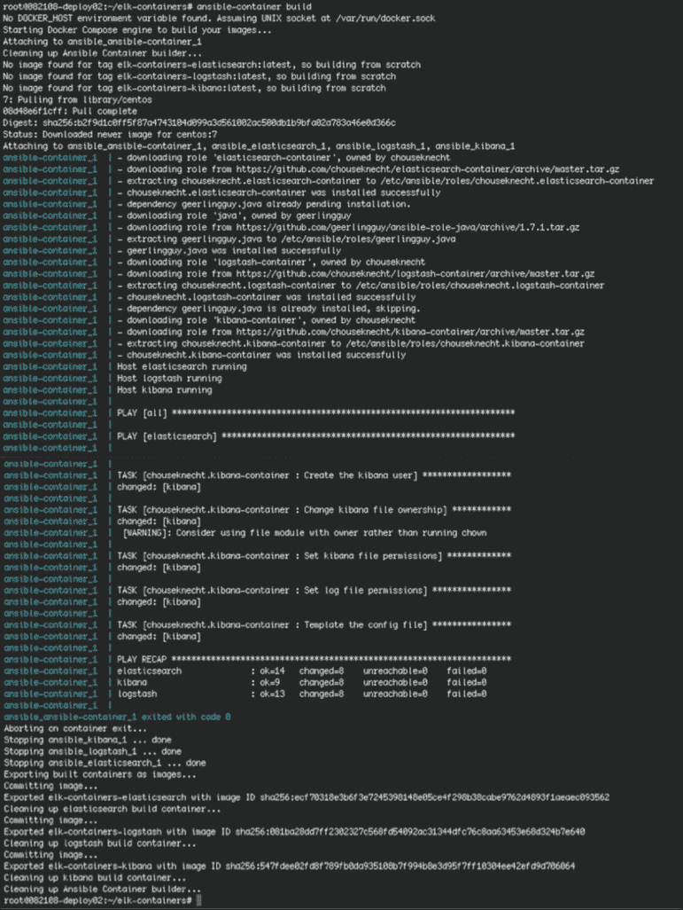

最后，我们准备测试我们全新的容器。正如容器化世界所说，“只需发布它！”。使用 Ansible Container 在本地部署容器映像以测试它们是另一个非常合理的功能。您将使用`ansible-container run`命令将容器部署到您本地配置的 Docker Engine 安装中：

```
**$ ansible-container run -d**

```

运行后，命令的输出将类似于这样，我们可以通过执行`docker ps`命令来确认我们的容器部署：

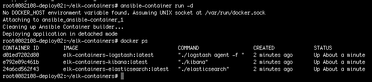

正如你所看到的，我们在本地运行了三个容器，做得很好。我们成功了！我们的第一个容器已经设计、配置、构建和部署（在不到一个小时的时间内）。在我们继续之前，我们应该暂停或移除我们的容器。请使用以下命令来停止或移除您的容器：

```
**$ docker stop <container ID>**
**$ docker rm <container ID>**

```

## 在 OpenStack 上部署 Kubernetes

在撰写本文时，Kubernetes 已成为容器编排的市场选择，成为顶级 GitHub 项目之一，并成为管理容器的领先企业选择。Kubernetes 的一些高级功能包括能够执行滚动升级、零停机部署、管理大规模复杂工作负载以及开箱即用的高可用/容错。如果您希望在生产环境中管理容器集群，您绝对应该尝试一下 Kubernetes。

在这种情况下，经常出现的问题是，为什么我要在 OpenStack 等平台上运行 Kubernetes？许多人经常忘记 OpenStack 是一个虚拟化管理器，而不是虚拟化本身。OpenStack 使操作员能够管理许多不同类型的虚拟化管理器，容器编排软件只是另一种虚拟化管理器。在 OpenStack 中，您可以选择几种方式来管理和部署 Kubernetes 集群。可以通过 Magnum 来完成，这是 OpenStack 中的容器管理项目。另一种方法是使用 Heat 模板来将 Kubernetes 集群作为堆栈进行管理。最后，您可以使用一个名为 kargo 的 GitHub 项目，它允许您在许多不同的系统和云平台上使用 Ansible 部署 Kubernetes。

对于我们的示例，我们将涵盖最后一个选项，并使用 kargo 在我们的 OpenStack 云上部署 Kubernetes。尝试通过创建我们自己的 Ansible playbooks/roles 来部署 Kubernetes 似乎不是一个很好的时间利用。kargo 项目可以在以下网址找到：[`github.com/kubernetes-incubator/kargo`](https://github.com/kubernetes-incubator/kargo)。存储库中有说明，将指导您如何设置以运行设置 playbook。

### 注意

请记住，kargo 是一个开源项目，就像其他开源项目一样，它可能会发生变化。变化可能包括重新组织存储库布局、更改部署说明甚至废弃。在撰写本文时，该项目仍在运行。

OpenStack 特定的说明可以在这里找到：[`github.com/kubernetes-incubator/kargo/blob/master/docs/openstack.md`](https://github.com/kubernetes-incubator/kargo/blob/master/docs/openstack.md)。要开始，您需要将 kargo 存储库克隆到 OpenStack 云上的 Utility 容器中：

```
**$ git clone https://github.com/kubernetes-incubator/kargo.git**
**$ cd kargo**

```

### 自动化考虑

在大多数情况下，安装将顺利进行。我确实不得不调整两个小细节，以确保 playbooks 成功完成。第一个调整是在我的 OpenRC 文件中。正如您在说明中所注意到的，第二步是在运行设置 playbook 之前源化您的 OpenRC 文件。我的文件缺少 playbook 检查的两个参数；它是`OS_TENANT_ID`和`OS_REGION_NAME`参数。我的 OpenRC 文件的工作示例如下：

```
# Ansible managed: /etc/ansible/roles/openstack_openrc/templates/openrc.j2 
export LC_ALL=C 

# COMMON CINDER ENVS 
export CINDER_ENDPOINT_TYPE=publicURL 

# COMMON NOVA ENVS 
export NOVA_ENDPOINT_TYPE=publicURL 

# COMMON OPENSTACK ENVS 
export OS_ENDPOINT_TYPE=publicURL 
export OS_USERNAME=admin 
export OS_PASSWORD=passwd 
export OS_PROJECT_NAME=admin 
export OS_TENANT_NAME=admin 
**export OS_TENANT_ID=bcf04d870b4c469cb1728e71ef9a6422** 
export OS_AUTH_URL=https://192.168.0.249:5000/v3 
export OS_NO_CACHE=1 
export OS_USER_DOMAIN_NAME=Default 
export OS_PROJECT_DOMAIN_NAME=Default 
export OS_INTERFACE=publicURL 
**export OS_REGION_NAME=RegionOne** 

# For openstackclient 
export OS_IDENTITY_API_VERSION=3 
export OS_AUTH_VERSION=3 

```

我不得不做的另一个调整是调整如何拉取特定的 Kubernetes 依赖软件容器。容器存储库标签已更改，而 kargo 项目尚未更新。在项目中对`roles/download/defaults/main.yml`文件执行更新。原始文件的片段如下：

```
... 
exechealthz_version: 1.1 
exechealthz_image_repo: "gcr.io/google_containers/exechealthz-amd64" 
exechealthz_image_tag: "{{ exechealthz_version }}" 
hyperkube_image_repo: "quay.io/coreos/hyperkube" 
**hyperkube_image_tag: "{{ kube_version }}_coreos.0"**

```

需要更改的文件如下所示：

```
... 
exechealthz_version: 1.1 
exechealthz_image_repo: "gcr.io/google_containers/exechealthz-amd64" 
exechealthz_image_tag: "{{ exechealthz_version }}" 
hyperkube_image_repo: "quay.io/coreos/hyperkube" 
**hyperkube_image_tag: "v{{ kube_version }}_coreos.0"**

```

有了这两个更改，您所需要做的就是启动实例，作为 Kubernetes 主节点、etcd 和节点。实例可以是您希望的任何基于 Linux 的操作系统。您布置 Kubernetes 集群的方式取决于环境类型和最终用例。稳定的 Kubernetes 集群的参考架构是将两个实例作为主节点，三个实例作为 etcd，并利用 Ironic 来部署至少三个裸金属服务器作为节点。当然，出于测试目的，您可以将整个集群部署为 OpenStack 云上的实例。

下一步是配置您的清单文件，以包括您启动的实例，以充当您的 Kubernetes 集群。我的清单文件名为`os-inventory`。清单文件的工作示例如下：

```
[kube-master] 
kubes-1 
kubes-2 
[etcd] 
kubes-3 
kubes-4 

[kube-node] 
kubes-5 
kubes-6 
kubes-7 

[k8s-cluster:children] 
kube-node 
kube-master 
etcd 

```

信不信由你，您现在已经准备好运行设置 playbook 来部署您的 Kubernetes 集群了。要这样做的命令如下，请确保您在 kargo 存储库的`root`目录中：

```
**$ ansible-playbook -i inventory/os-inventory -b cluster.yml**

```

安装将运行一段时间，但最终您将拥有一个可用的 Kubernetes 集群进行实验。现在我们将转向另一种容器编排技术，并尝试如何使用 Ansible 来管理容器，同时利用 OpenStack。

## 使用 Ansible 管理 CoreOS 和 Docker

CoreOS 似乎是另一个很好的选择，可以在 OpenStack 上运行，因为它是：

> *一种专为集群部署设计的轻量级 Linux 操作系统，为您最关键的应用程序提供自动化、安全性和可伸缩性                                                                          –  ([`coreos.com/why/#cluster`](https://coreos.com/why/#cluster))*

CoreOS 的重点是提供一个默认情况下具有集群意识的操作系统，使其非常适合容器技术等平台。Docker 也是一个明显的选择，用于实验容器，因为它是使容器再次流行的原因。此外，Docker 有各种各样的镜像可以随时拉取和部署。在我们的示例中，我们将审查一个非常简单的 playbook，它将在 CoreOS 上的容器中部署 ELK 堆栈。

### 自动化考虑

这个过程的第一步是启动至少三个具有至少 2GB 内存和稳定 CoreOS 镜像的 flavor 的实例。由于我喜欢使用 Heat 来做这样的事情，我使用了一个 Heat 模板来启动我的实例。我创建的模板可以在这里找到：[`github.com/wbentley15/openstack-heat-templates/tree/master/coreos`](https://github.com/wbentley15/openstack-heat-templates/tree/master/coreos)。然后使用 Heat 部署堆栈的命令如下：

```
**$ heat stack-create coreos --template-file=heat-coreos-prod.yaml -- 
  parameters="key-name=my-key;user-data=cloud-config-prod.yaml;
  network=24b9b982-b847-4d0e-9088-61acbf92a37f"**

```

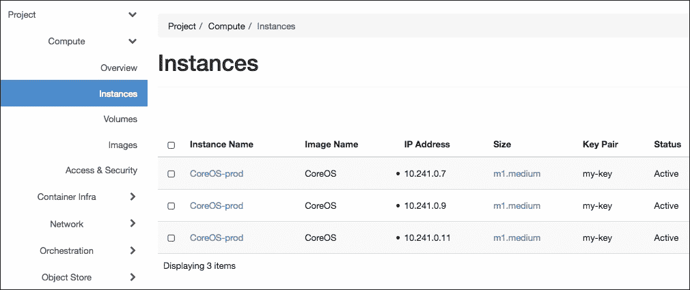

### 编写 playbooks 和角色

一旦您的 CoreOS 堆栈在线，您可以执行我们将要创建的 playbook。在本例中，所有任务将在名为`base.yml`的 playbook 中，该文件位于`playbook`目录的`root`目录中。该文件的初始内容将如下所示：

```
--- 
# This playbook deploys the ELK stack on CoreOS 

- name: Bootstrap CoreOS 
 hosts: coreos 
 gather_facts: False 
 roles: 
 - defunctzombie.coreos-bootstrap 

```

playbook 中的第一个任务对于运行诸如 Ansible 之类的软件包对目标 CoreOS 实例至关重要。由于 CoreOS 是一个最小的操作系统，它没有安装任何版本的 Python。我们知道，运行 Ansible 对主机的一个主要先决条件是安装 Python。为了规避这个限制，我们将使用一个名为`defunctzombie.coreos-bootstrap`的角色，在我们的 CoreOS 实例上安装`pypy`。我们将在稍后学习如何告诉 Ansible 在这些节点上找到我们的 Python 解释器。

您可以通过执行以下命令从 Galaxy 上拉取此角色：

```
**$ ansible-galaxy install defunctzombie.coreos-bootstrap**

```

接下来的两个任务将在 CoreOS 实例上设置环境，以便将 Docker 镜像作为容器运行。请注意，我们将固定`docker-py`和`docker-compose`软件包的版本；这是由于`docker_image`和`docker_container`模块的已知错误。一旦错误得到解决，这种依赖关系可以被移除，或者随着时间的推移，这些版本可能需要进行调整：

```
- name: Deploy ELK Stack 
 hosts: coreos 
 remote_user: core 
 become: false 
 tasks: 
    - name: Start etcd 
       service: name=etcd.service state=started 
       become: true 

    - name: Install docker-py 
       shell: /home/core/bin/pip install docker-py==1.9.0 docker-compose==1.8.0 

```

最后剩下的任务将处理拉取 ELK 堆栈的 Docker 镜像，然后在您的 CoreOS 集群上启动这些容器：

```
 - name: Pull Elasticsearch container 
       docker_image: name=elasticsearch 

    - name: Pull Kibana container 
       docker_image: name=kibana 

    - name: Pull Logstash container 
     docker_image: name=logstash 

  - name: Launch Elasticsearch container 
   docker_container: 
    name: elasticsearch-cont 
          image: elasticsearch 
          state: started 

    - name: Launch Kibana container 
       docker_container: 
          name: kibana-cont 
          image: kibana 
          state: started 

    - name: Launch Logstash container 
     docker_container: 
    name: logstash-cont 
    image: logstash 
    state: started 

```

Docker 镜像是从[`hub.docker.com`](https://hub.docker.com)上的存储库中拉取下来，然后部署在托管 Docker 的 CoreOS 实例上。

我们这个例子的`hosts`文件又有点独特，因为我们不得不为 CoreOS 安装自定义的 Python 解释器。我们需要配置 Ansible 来使用这个替代的 Python 解释器。在下面的工作示例中，您会发现我们配置了 Ansible 来使用位于`/home/core/bin/python`的 Python 解释器和位于`/home/core/bin/pip`的 pip 软件包：

```
[coreos] 
162.209.96.54 

[coreos:vars] 
ansible_ssh_user=core 
ansible_python_interpreter=/home/core/bin/python 
ansible_pip_interpreter=/home/core/bin/pip 

```

在本章的后面，我们将通过再次审查这些 playbooks 和角色来结束，然后进行测试，以查看最终的结果。

## 部署 Nova LXD 在 OpenStack

最后，但肯定不是最不重要的，我们将以真正开始一切的容器选项 LXC 或者它的新的大哥 LXD 来结束本章。LXD 被描述为：

> *LXC 的容器“hypervisor”和一个新的用户体验*                                                                      –   ([`www.ubuntu.com/cloud/lxd`](https://www.ubuntu.com/cloud/lxd))

LXD 的三个主要组件是其系统范围的守护程序（**lxd**）、命令行客户端（**lxc**）和 OpenStack Nova 插件。正是这个插件使我们能够在 OpenStack 控制下将 LXD 作为 hypervisor 运行，并使用传统的 OpenStack 命令来启动容器。有了这样的东西，您可以在相同的控制平面下在单独的计算节点上运行实例和容器。LXD 进一步被描述为安全设计、可扩展、直观、基于镜像和具有执行实时迁移的能力。

幸运的是，Ansible 之神已经听到并回答了我们的祈祷。在**openstack-ansible 项目**（**OSA**）的 Newton 版本（以及以后），您现在可以将 LXD 作为 KVM 的替代 hypervisor 部署。现在只需在部署 OSA 云之前编辑两个配置文件即可。我们将概述这些更改，并演示如何使用 OpenStack 启动您的第一个 LXD 容器。

在开始之前，您应该知道在 OSA 上启用 LXD 的详细说明可以在这里找到：[`docs.openstack.org/developer/openstack-ansible-os_nova/`](http://docs.openstack.org/developer/openstack-ansible-os_nova/)。

### 自动化考虑

OSA 部署围绕部署节点上`/etc/openstack_deploy`目录中的三个主要配置文件展开。您需要编辑`user_variables.yml`和`user_secrets.yml`文件。从`user_variables.yml`文件开始，您需要将`nova_virt_type`变量设置为使用 LXD。一个工作示例如下：

```
# This defaults to KVM, if you are deploying on a host that is not KVM capable 
# change this to your hypervisor type: IE "qemu", "lxc". 
**nova_virt_type: lxd**

```

需要编辑的第二个文件是`user_secrets.yml`文件。您只需要为 LXD 信任提供密码。需要编辑的行的示例如下：

```
# LXD Options for nova compute 
lxd_trust_password: 

```

### 提示

如果您计划设置混合计算节点农场并希望拥有 KVM 和 LXD 主机。您需要编辑`openstack_user_config.yml`文件，并为每个主机设置`nova_virt_type`。如何配置的工作示例可以在前面的文档链接中找到。

现在您可以开始安装 OSA，知道您将能够启动 LXD 容器以及在 KVM 上运行的实例。安装完成后，您还需要完成最后一步。我们现在必须创建一个 LXD 兼容的镜像，该镜像将在您启动容器时使用。LXD 需要使用原始镜像，因此我们将下载符合这些要求的镜像。在 OSA 云的实用程序容器中，执行以下命令：

```
**$ wget http://cloud-images.ubuntu.com/trusty/current/
  trusty-server-cloudimg-amd64-root.tar.gz**
**$ glance image-create --name=trusty-LXD --visibility=public --container-
  format=bare --disk-format=raw 
  --file=trusty-server-cloudimg-amd64-root.tar.gz**

```

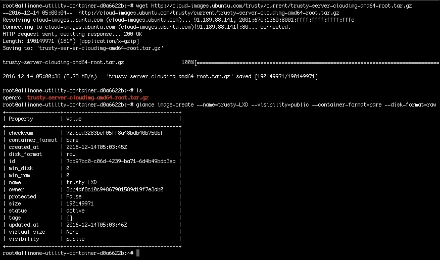

有了您的新镜像，现在您已经准备好启动您的第一个 LXD 容器了。LXD 容器的管理方式与在 KVM 上运行的实例类似。您可以通过 Horizon 仪表板或通过 OpenStack Client CLI 创建容器。在本例中，我们将使用 OpenStack Client 来创建容器。以下命令将创建您的容器：

```
**$ nova boot --image=<image name> --flavor=<flavor> --nic net-id=<network ID> --security-group=<security group> --min-count <number of containers> <container name>**
**$ nova boot --image=trusty-LXD --flavor=m1.small --nic net-id=eb283939-2c65-4ecb-9d9f-cbbea9bf252c --security-group default --min-count 3 first-lxd-container**

```

如果您的输出看起来与此类似，您可以将其视为成功：

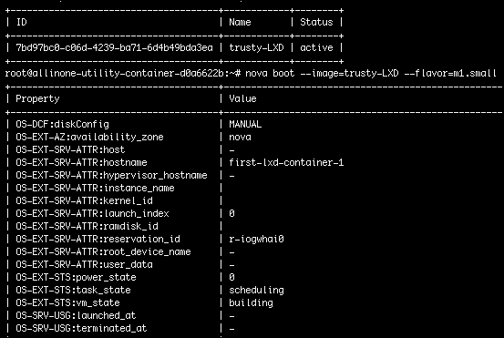

然后，您可以执行`openstack server list`命令来验证您的新容器是否正在运行。

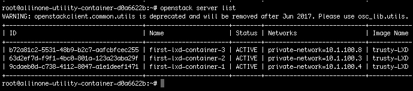

非常棒，我的朋友，你又做得很好！我知道我们涵盖了很多内容，但是你现在已经是一个老手了，所以不用担心。保持我们的传统，我们将以快速回顾我们所涵盖的内容以及下一章的预期结束本章。

# 审查 playbooks 和 roles

让我们直接开始检查我们之前创建的主 playbook，以部署名为**ansible-coreos**的 CoreOS 上的 Docker 容器。位于`ansible-coreos`目录的根目录中的已完成的 playbook 和文件名为`base.yml`，看起来是这样的：

```
--- 
# This playbook deploys the ELK stack on CoreOS 

- name: Bootstrap CoreOS 
 hosts: coreos 
 gather_facts: False 
 roles: 
    - defunctzombie.coreos-bootstrap 

- name: Deploy ELK Stack 
 hosts: coreos 
 remote_user: core 
 become: false 
 tasks: 
    - name: Start etcd 
       service: name=etcd.service state=started 
       become: true 

    - name: Install docker-py 
       shell: /home/core/bin/pip install docker-py==1.9.0 docker-compose==1.8.0 

    - name: Pull Elasticsearch container 
       docker_image: name=elasticsearch 

    - name: Pull Kibana container 
       docker_image: name=kibana 

    - name: Pull Logstash container 
       docker_image: name=logstash 

    - name: Launch Elasticsearch container 
       docker_container: 
          name: elasticsearch-cont 
          image: elasticsearch 
          state: started 

  - name: Launch Kibana container 
   docker_container: 
          name: kibana-cont 
          image: kibana 
          state: started 

    - name: Launch Logstash container 
       docker_container: 
          name: logstash-cont 
        image: logstash 
    state: started 

```

我们从 Galaxy 中拉下来的相应角色位于`ansible-coreos/roles/defunctzombie.coreos-bootstrap/tasks`目录中，看起来是这样的：

```
- name: Check if bootstrap is needed 
 raw: stat $HOME/.bootstrapped 
 register: need_bootstrap 
 ignore_errors: True 

- name: Run bootstrap.sh 
 script: bootstrap.sh 
 when: need_bootstrap | failed 

- name: Check if we need to install pip 
 shell: "{{ansible_python_interpreter}} -m pip --version" 
 register: need_pip 
 ignore_errors: True 
 changed_when: false 
 when: need_bootstrap | failed 

- name: Copy get-pip.py 
 copy: src=get-pip.py dest=~/get-pip.py 
 when: need_pip | failed 

- name: Install pip 
 shell: "{{ansible_python_interpreter}} ~/get-pip.py" 
 when: need_pip | failed 

- name: Remove get-pip.py 
 file: path=~/get-pip.py state=absent 
 when: need_pip | failed 

- name: Install pip launcher 
 copy: src=runner dest=~/bin/pip mode=0755 
 when: need_pip | failed 

```

最后，我们创建了`hosts`文件，也位于`playbook`目录的`root`目录中：

```
[coreos] 
162.209.96.54 

[coreos:vars] 
ansible_ssh_user=core 
ansible_python_interpreter=/home/core/bin/python 
ansible_pip_interpreter=/home/core/bin/pip 

```

### 注意

完整的代码集可以再次在以下 GitHub 存储库中找到：[`github.com/os-admin-with-ansible/os-admin-with-ansible-v2`](https://github.com/os-admin-with-ansible/os-admin-with-ansible-v2)。

我们终于准备好尝试这个 playbook 了。假设您已经克隆了之前的 GitHub 存储库，则从部署节点测试 playbook 的命令如下：

```
**$ cd os-admin-with-ansible-v2**
**$ cd ansible-coreos**
**$ ansible-playbook -i hosts base.yml**

```

假设一切顺利，输出应该类似于以下截图中的片段：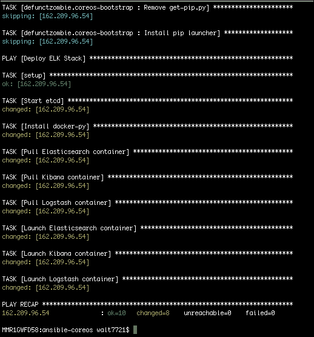

通常，我还喜欢采取额外的步骤，通过在 CoreOS 实例上执行`docker ps`命令来验证容器是否正在运行。

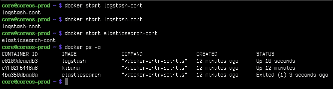

# 摘要

穿过终点线确实感觉不错。我希望容器的原始力量能激励您开始在 OpenStack 云上部署它们。在传统虚拟机和实例之外拥有选择总是让人感觉良好。

在结束本章之前，让我们花一点时间回顾本章。我们从探索容器化的概念以及为什么它变得如此流行开始本章。您学会了如何使用 Ansible Container 来创建我们的第一个容器镜像和构建。我们审查了 kargo 项目，该项目使您能够使用 Ansible 在多个云平台上部署 Kubernetes，包括 OpenStack。接下来，我们演示了如何使用 Ansible 来管理在 OpenStack 上运行 Docker 集群的 CoreOS。最后，我们审查了部署 LXD 所需的配置更改与**openstack-ansible**项目。

下一章也将是非常有趣的一章，因为作为云运营商，您最终将不得不考虑扩展/缩小您的云足迹。OpenStack 具有有用的内置功能，使得扩展的过程相当容易和简单。在下一章中，我们将介绍设置活跃-活跃云区域的概念，然后通过自动化这项任务来减轻在需要时进行扩展的压力。如果您准备好迎接一些未知的领域，请前往第八章*设置活跃-活跃区域*！
