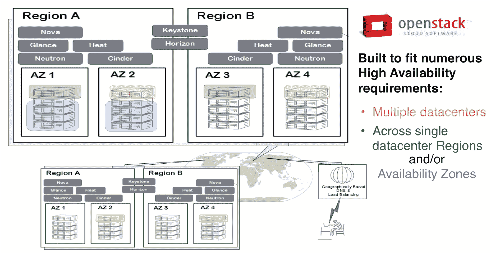
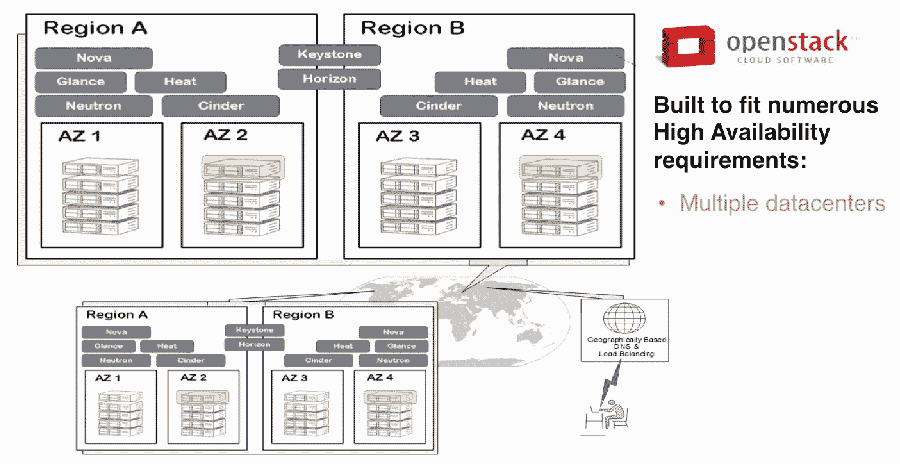
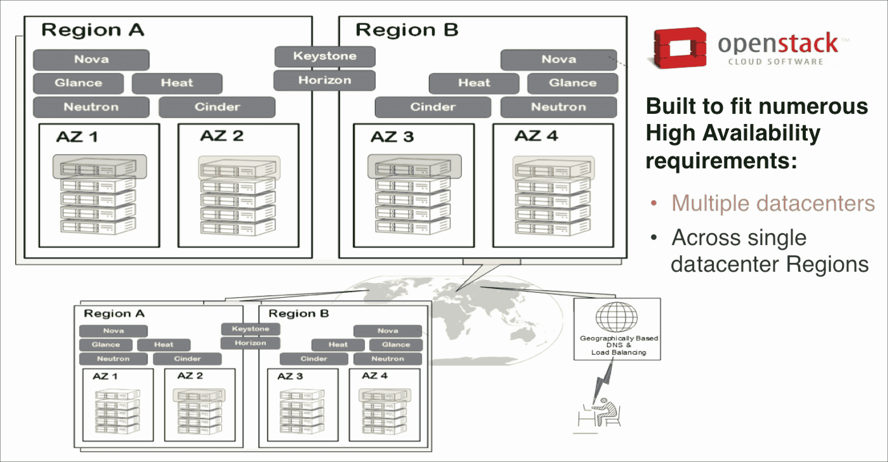
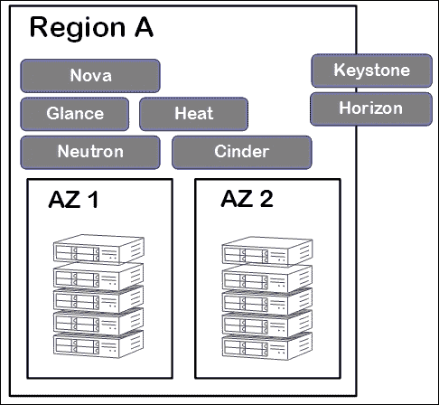
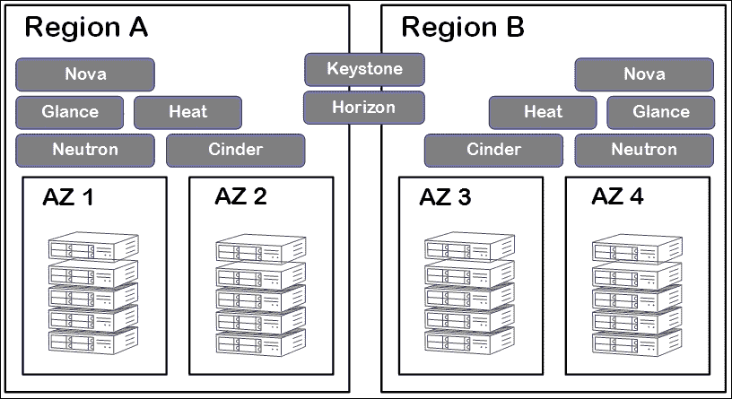
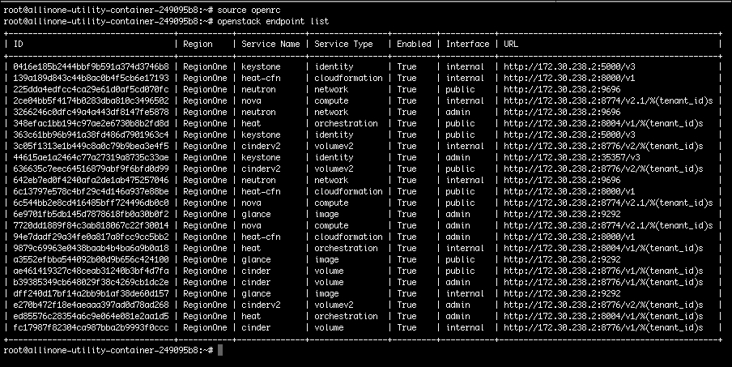
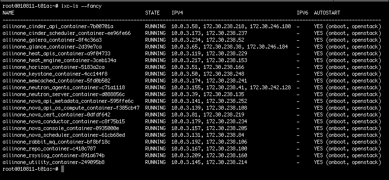
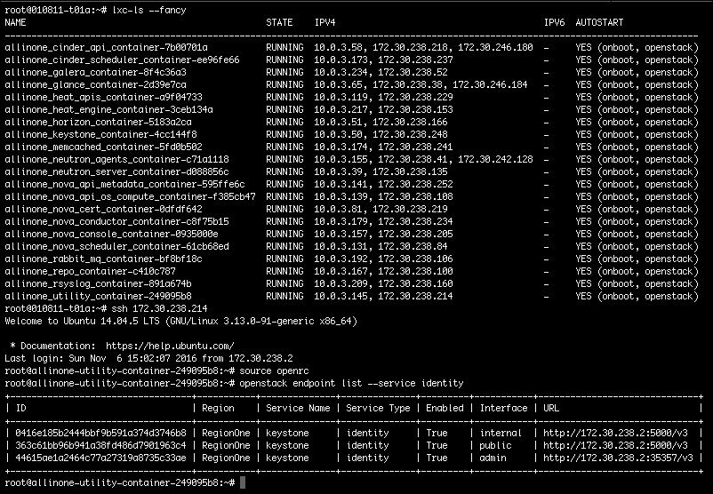
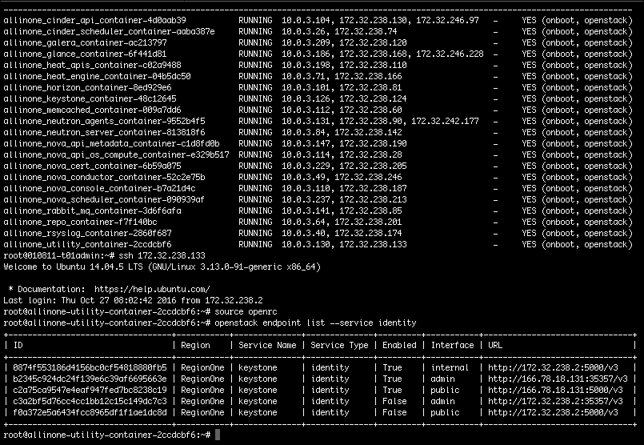
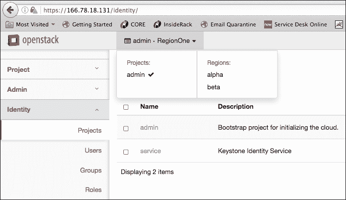

# 第八章：设置 Active-Active 区域

在本章中，我们将重点介绍 OpenStack 的一个非常有用的内置功能。这将是能够集中管理多个可能在不同地理位置运行的 OpenStack 区域的能力。OpenStack 中的区域概念并不新鲜，但请问你是否曾经真正见过它的实现。在许多场合，我发现自己对完成这些步骤感到不清楚。今天是你将对这个问题有一个积极回答的日子。

稳定性和可用性目前是 OpenStack 社区中热门话题，我认为分享一个可行的用例来实现云高可用性是很好的。这将是云操作员可以设置的许多方式之一。正如我们可能已经知道的，OpenStack 可以满足许多高可用性要求。我们将简要回顾这些场景，然后转向为什么要使用这个功能。与之前的所有章节一样，我们将通过演示如何使用 Ansible 自动设置 Active-Active 云区域来完成本章。本章将涵盖以下主题：

+   回顾 OpenStack 高可用性场景

+   为什么要使用 Active-Active 云区域？

+   设置 Active-Active 云区域

+   创建和设置管理员区域

+   配置活动区域的身份验证

+   编写 playbooks 和 roles

+   回顾 playbook 和 roles

# 回顾 OpenStack 高可用性场景

这个话题恰好是我总是喜欢讨论的话题之一。**高可用性**（**HA**）和灾难恢复总是因为明显的原因在 IT 人员中引起非常情绪化的对话。可以说，你的命运掌握在手中，确保你的组织系统在灾难/故障发生时保持在线。在过去，本地系统、HA 和冷（未使用）灾难恢复站点已经足够了。云的当前灵活性现在为系统稳定性提供了新的更好的选择。不要满足于旧的解决方案。你有选择！

如前所述，有多种方法可以实现 OpenStack 的 HA。我们将概述三种可能成功的场景，并满足大多数组织的 HA 要求。以下是三种可能的场景，附加了图表以提供更多上下文：

+   **多个数据中心**：多个 OpenStack 区域跨越多个地理位置的数据中心

+   **单数据中心**：一个数据中心内有多个 OpenStack 区域

+   **可用区**：在一个数据中心内的单个 OpenStack 区域中使用成对的可用区



## 多个数据中心

我们将从三种情景中最复杂的情景开始。这种情景包括在多个数据中心部署多组 OpenStack 区域，并使它们作为一个云系统运行的概念。虽然这听起来复杂，但实际上并不像听起来那么困难。当将它们全部绑定在一起时，以及当您去支持/管理它们时，复杂性就会出现。这种模式不仅为您提供了跨数据中心的 HA（多个 Active-Active 区域），而且还在每个数据中心内提供了 HA（独立的 Active-Active 区域）。您必须经历多层故障才能使您的云下线。



## 单数据中心

与前面的情景类似，主要区别在于，它只限于单个数据中心。在这种情况下，您可以部署一组仅限于一个数据中心的 OpenStack Active-Active 区域。这种模型只会在运行区域的数据中心内提供高可用性。如果该数据中心发生火灾，您的云将**彻底倒霉**（**SOL**）。

如果没有其他选择，这种模型仍然可以避免完全的云故障。



## 可用区域

这种情景可能是最简单的选择，但肯定可以在提供客户级别的高可用性方面发挥作用。是的，如果您希望获得真正的灾难恢复设计，这种模型就不够了。通过利用多个 AZ，您可以使用反亲和性过滤器将实例分布在不同的计算节点上，从而提供客户级别的高可用性。

现在，让我们专注于我们之前描述的多数据中心模型的简化版本。我们将回顾为什么您可能有兴趣使用 Active-Active 区域方法。



# 为什么要使用 Active-Active 云区域？

除了能够积极使用多个 OpenStack 区域的纯粹令人敬畏之外，Active-Active 云区域方法还能最大限度地利用您的整体云投资。不再需要因为第二个站点不经常使用而进行灾难恢复测试。此外，您还获得了集中管理区域的额外好处。处处都是*双赢*的局面。

因此，让我们深入了解架构，以提供一个 OpenStack Active-Active 区域。以下图表以最简单的形式解释了架构：



上述架构的组件是：

+   两个独立的 OpenStack 云部署，也就是两个区域。在这个例子中，我们有**A 区**和**B 区**。这些区域运行核心 OpenStack 服务，除了 Keystone 和 Horizon。每个区域可以有任意数量的互补 AZ。

+   创建另一个专门用于托管 Keystone 和 Horizon 服务的 OpenStack 区域。这个区域可以被归类为 Admin 区域。

+   然后，A 区和 B 区将利用 Admin 区域来处理身份验证和 GUI Web 界面，通过集中用户、租户和项目管理/创建，并提供一个单一的 Web 仪表板来管理所有活动区域。

# 设置 Active-Active 云区域

实施这一过程相对简单，但确实需要特别注意细节。提前概述步骤非常有用，可以避免遗漏步骤。我还了解到，手动执行更改通常也不会有好结果。编辑服务配置文件的过程会导致错误修改，导致服务无法启动。不好！！！更不用说这会使实施过程时间变长三倍。首先，我们将手动回顾步骤，然后在接下来的部分，我们将学习如何尽可能自动化设置过程。我只能说感谢 Ansible！

在这一部分，我们将回顾设置 Active-Active OpenStack 云区域的手动步骤。以下是步骤的简要概述：

1.  记录每个区域的端点并注意 URL。

1.  在 Admin 区域创建服务用户帐户。

1.  在 Admin 区域创建服务。

1.  将每个区域的端点注册到 Admin 区域。

1.  调整 Admin 区域的身份端点。

1.  配置每个区域的服务，以便对 Admin 区域的身份验证服务进行身份验证，而不是本地区域的身份验证服务。

现在，让我们逐步通过这里显示的每个配置步骤，演示工作配置示例。

## 区域端点清单

这一步将是简单地查询您想要包括在主-主设置中的每个区域的端点。由于我们使用**openstack-ansible**（**OSA**）来部署我们的 OpenStack 云，您需要连接到每个区域的实用程序容器，以便使用 OpenStack CLI。一旦连接并源化 OpenRC 文件，命令将是：

```
**$ openstack endpoint list**

```

这个命令的输出应该类似于这样：



请记住，我们这里的重点是要注意可用的公共端点。

由于 openstack-ansible 将 OpenStack 服务安装到 LXC 容器中，您需要知道如何连接到每个容器以使用 CLI 并配置/维护服务。列出在控制平面服务器上运行的所有容器的 LXC 命令是`lxc-ls -fancy`，输出将类似于以下内容：



## 管理区域配置

接下来的步骤将涉及定制管理区域的安装和配置。这将是您的集中管理区域，只为身份验证请求提供服务。管理区域可以存在于与其他区域相同的数据中心，也可以存在于与其他区域完全不同的区域。显然，数据中心之间需要网络连接。请按照稍后给出的说明进行操作。

### 在管理区域创建服务用户帐户

在这一点上，您应该有一个仅运行身份服务（Keystone）和 Web 仪表板（Horizon）的运行中的管理区域。只有这两个服务应该存在并处于活动状态。由于我们希望使用管理区域来管理其他区域，您必须让它了解其他区域的服务和端点。这个过程从在管理区域上创建服务用户帐户开始：

1.  对于这一步，我们将使用以下命令使用 CLI 创建服务用户帐户：

```
 **$ openstack user create 
        --project <project reserved for services> 
        --password <user password> <user name>**

```

这个命令的一个工作示例看起来像这样：

```
**$ openstack user create --project service 
         --password passwd glance**

```

1.  现在我们必须为刚刚创建的新用户分配一个具有适当权限的角色。完成此操作的 CLI 命令在这里：

```
**$ openstack role add --user <user name> 
         --project <project reserved for services> <role>**

```

这个命令的一个工作示例看起来像这样：

```
**openstack role add --user glance 
       --project service admin**

```

现在我们已经创建了服务用户帐户，我们可以过渡到在管理区域上注册新服务的下一步。

### 在管理区域创建服务

在这一步中，我们只是在管理区域为活动区域上运行的服务创建占位符。请记住，活动区域上运行其他核心服务，管理区域将为它们处理身份验证。然后管理区域必须知道这些服务。

使用以下命令在管理区域上注册服务：

```
**$ openstack service create --name <service name> 
  --description "<service description>" <service type>**

```

这个命令的一个工作示例看起来像这样：

```
**openstack service create --name glance 
--description "Glance Image Service" image**

```

下一步将是在管理区域注册活动区域的端点。这一步需要一定的精度，因为端点 URL 是管理区域用来进行功能调用的。如果 URL 不正确或输入错误，服务将被管理区域视为已关闭。

### 将每个区域的端点注册到管理区域

注册活动区域端点的过程涉及使用我们之前开始的端点清单。这里的关键点是，您必须使用每个区域公共端点的 IP 地址。分配给公共端点的 IP 地址需要是公共 IP 地址（可通过互联网访问）或在每个数据中心之间可访问的内部 IP 地址。再次强调，管理区域将使用此 URL 进行服务调用，因此端点必须是可访问的。

您需要注册两种类型的端点：**公共**和**内部**。我在设置过程中发现了这个关键组件。一些 OpenStack 服务仅利用内部端点，而其他服务将使用公共端点。为了避免任何问题，我们将注册两者。从技术上讲，注册两者没有任何风险，这是一个好的做法。

注册服务的命令示例如下：

```
**$ openstack endpoint create --region <region name> 
  <service name> <service type> <endpoint url>**

```

一组命令的工作示例如下：

```
**$ openstack endpoint create --region alpha glance 
  internal 
  http://127.0.0.1:9292**
**$ openstack endpoint create --region alpha glance 
  public 
  http://127.0.0.1:9292**

```

前面的步骤需要为您希望加入 Admin 区域的每个活动区域重复执行。如前面的示例所示，我们将为**Region A**和**Region B**执行此步骤。

### 调整 Admin 区域的身份端点

设置 Admin 区域的最后一步是确保活动区域可以成功连接到那里运行的身份服务。之前分享的关于必须公开服务公共端点的原则在这里同样适用于 Keystone。每个云设置可能略有不同，因此并非所有云都需要此步骤。

为了评估是否需要进行此调整，请执行以下命令，并确定公共和管理员端点是否为 URL 配置了本地 IP 地址：

```
**$ openstack endpoint list --service identity**

```

如果输出看起来类似于这样，您必须在创建新的公共 IP 或数据中心之间可访问的 IP 地址后禁用公共和管理员端点。有关如何处理此问题的更多详细信息将在此处分享：



为了创建新的公共和管理员端点，然后禁用当前的端点，您将执行以下命令：

```
**# Add public Keystone endpoint**
**$ openstack endpoint create --region <region name> 
  keystone public <endpoint url>**
**# Add an additional admin Keystone endpoint**
**$ openstack endpoint create --region <region name> 
  keystone admin <endpoint url>**
**# Disable the original public Keystone endpoint 
  with the local IP address 
  configured (URL will have a non-routable address)**
**$ openstack endpoint set --disable <endpoint-id>**
**# Disable the original admin Keystone endpoint with 
  the local IP address configured 
  (URL will have a non-routable address)**
**$ openstack endpoint set --disable <endpoint-id>**

```

完成后，执行`openstack endpoint list --service identity`命令，输出应该类似于这样：



## 活动区域配置

本节将包括设置活动区域的步骤，这些区域将成为您的 Active-Active 云设计的一部分。这些区域运行核心 OpenStack 服务。在这一点上，我们已经设置了 Admin 区域，以便与这些活动区域进行通信。现在，我们必须配置核心服务，通过 Admin 区域进行身份验证，而不是使用本地身份服务（Keystone）。

在部署本地身份服务之前，您无法部署 OpenStack 云。身份服务必须是第一个安装的服务，因此将存在于活动区域。要使服务不使用本地身份服务，您必须重新配置每个服务。仅仅禁用本地身份服务是不够的。重新配置每个核心服务的过程包括编辑配置文件。如前所述，编辑服务配置文件会留下错误编辑的可能性，这可能导致该服务无法启动。

这就是您必须更聪明而不是更努力的地方。问问自己：有没有工具可以帮助完成这样的任务？是的，答案再次是 Ansible！Ansible 可以帮助大大减少打字错误，从而进行许多服务配置更改。在第二章中，*介绍 Ansible*，我们简要讨论了 Ansible 的临时命令。临时命令允许直接运行模块命令，而无需将任务包装成 playbook 或 role。

临时命令的基本示例如下：

```
**$ ansible <host> -m <module> -a <module arguments>**

```

在我们的情况下，我们需要连接到运行在控制平面上的特定容器，并更改该服务的配置文件。这需要针对在该活动区域上运行的每个核心服务重复进行。好消息是，我们可以利用 openstack-ansible 部署的动态清单部分来简化整个过程。让我们使用以下示例作为示例，展示如何完成这个过程。

在这个例子中，我们将尝试对 Alpha 区域的镜像服务（Glance）进行所需的更改。所以，我们知道的是：

+   您必须连接到 Glance 容器

+   使用`sed`命令，我们需要利用 shell Ansible 模块

+   我们准备了一个`sed`命令，将更改`glance-api.conf`文件中的`auth_url`值

现在，命令参数的进一步细分将是：

```
host = glance_container  
module = shell  
adhoc command = sed -i 's+^auth_url = <current IP>:35357+auth_url = http://<alpha region IP>:35357+' /etc/glance/glance-api.conf 

```

### 注意

为了利用*openstack-ansible 安装*的动态清单功能，您必须从部署节点（用于部署该区域的节点）执行这些命令。此外，您必须在`/opt/openstack-ansible/playbooks`目录中执行这些命令。

命令的一个工作示例将如下所示：

```
**$ ansible glance_container -m shell -a "sed -i 
's+^auth_url = http://172.30.238.2:35357+auth_url =  
 http://166.78.18.131:35357+' /etc/glance/glance-api.conf"**

```

您可以使用前面的原则对活动区域上的所有服务进行所需的更改。确保记住在更改配置文件后重新启动服务。

```
**$ ansible nova_scheduler_container -m service -a 
   "name=nova-scheduler state=restarted" **

```

# 编写 playbooks 和 roles

在本节中，我们将创建 playbooks 和 roles 来设置管理区域。我们还将概述设置 Active-Active 云所需的 Ansible 临时命令的其他步骤。在为这类事情创建 Ansible 自动化代码时，我通常喜欢创建多个任务，分解成单独的角色。这种格式允许您能够重用与其他 playbooks 创建的角色。最终，我们将得到两个 playbooks 和两个角色，以自动化设置管理区域的步骤。最后，我们将总结使用这些角色的 playbooks。

在本节的另一半中，我们还将概述设置 Active-Active 云所需的 Ansible 临时命令。您可以收集命令以创建 playbooks 和 roles。我觉得这将是几百行不必要的代码，所以我选择了起草命令并使用搜索和替换。

## 设置管理区域

我们将创建的第一个角色将包括配置管理区域所需的任务。文件的名称将是`main.yml`，位于名为`config-admin-region/tasks`的角色目录中。该文件的内容将如下所示：

```
--- 

- name: Create users 
 os_user: 
  cloud: "{{CLOUD_NAME}}" 
  state: present 
  name: "{{ item.0 }}" 
  password: "{{ item.1 }}" 
  default_project: "{{ servicesproject }}" 
  domain: default 
 with_together: 
  - "{{userid}}" 
  - "{{passwdss}}" 

- name: Assign user to specified role in designated environment 
 os_user_role: 
  cloud: "{{CLOUD_NAME}}" 
  user: "{{ item.0 }}" 
  role: "{{ urole }}" 
  project: "{{ servicesproject }}" 
 with_together:  
  - "{{userid}}" 

- name: Register the new services on the Admin region 
 shell: openstack --os-cloud="{{ CLOUD_NAME }}" 
     service create --name "{{ item.0 }}" --description "{{ item.1 }}" "{{ servicetype }}" 
 with_together: 
  - "{{userid}}" 
  - "{{descrip}}" 

```

第一个任务将在管理区域创建服务用户帐户。然后，第二个任务将分配管理员角色给刚刚创建的用户。最后一个任务将在活动区域创建服务的占位符。

接下来要创建的角色将处理在管理区域内注册每个区域端点的任务。与前一个角色一样，文件的名称将是`main.yml`，位于名为`register-endpoints/tasks`的角色目录中。该文件的内容将如下所示：

```
--- 

- name: Register the region service endpoints on the Admin region 
 shell: openstack --os-cloud="{{ CLOUD_NAME }}" 
     service endpoint create --region "{{ item.1 }}" "{{ item.0 }}" "{{ item.2 }}" "{{ item.3 }}" 
 with_together: 
  - "{{endpointname}}" 
  - "{{regionname}}" 
  - "{{endpointtype}}" 
  - "{{endpointurl}}" 

```

该角色只有一个任务，即使用服务端点`create to register`的 CLI 命令来注册端点。在这种情况下，我们使用了`with_together`参数，以便可以循环遍历四个变量定义的参数。这样，您可以只需调整变量值就可以重新运行 playbook。在我们的情况下，我们需要运行这个 playbook 两次，一次用于内部端点，一次用于公共端点。

为了支持这些角色，我们现在需要创建与之配套的变量文件。对于这两个角色，我们将使用角色定义的变量文件来简化一些事情。变量文件将存储在`role`目录中，另一个名为`vars`的目录中。该目录中的文件将命名为`main.yml`。

与名为`config-admin-region`的角色对应的变量文件的内容如下：

```
--- 
userid: [ 'glance', 'nova', 'neutron', 'heat' ] 
passwdss: [ 'passwd', 'passwd', 'passwd', 'passwd' ] 
descrip: [ 'Glance Image Service', 'Nova Compute Service', 'Neutron Network Service', 'Heat Orchestration Service' ] 
servicetype: [ 'image', 'compute', 'network', 'orchestration' ] 

servicesproject: service 
urole: admin 

```

与名为`register-endpoints`的角色对应的第二个变量文件的内容如下：

```
--- 
endpointname: [ 'glance', 'nova', 'neutron', 'heat' ]  
regionname: alpha 
endpointtype: internal 
endpointurl: [ 'http://<alpha region IP>:9292', 'http://<alpha region IP>:8774/v2.1/%\(tenant_id\)s', 'http://<alpha region IP>:9696', 'http://<alpha region IP>:8004/v1/%\(tenant_id\)s' ] 

```

请记住，变量文件中定义的值旨在在每次执行正常日常使用之前更改。

让我们花点时间来分解变量及其预期用途。总结如下：

```
userid          # name of the user to create 

passwdss        # passwords for the users being created 

descript        # description for the service being registered 

servicetype     # type of service being registered 

servicesproject # name of the project where the services user accounts are associated 

urole           # name of the role to associate with the user 

endpointname    # service name of the endpoint being registered 

regionname      # name of the region 

endpointtype    # the type of endpoint being registered 

endpointurl     # the url of the endpoint 

```

变量文件完成后，我们可以继续创建主剧本文件。为了演示，我决定将剧本文件分成两个单独的文件。这完全是我的选择，可以合并成一个文件而不会出现问题。我觉得有两个单独的主剧本会更容易在需要注册多组端点时重新运行。以下是剧本文件的列表：

```
config-admin.yml 
  config-admin-region 

register-endpoints.yml 
  register-endpoints 

```

剧本和角色的名称可以是您选择的任何内容。这里提供了具体的名称，以便您可以轻松跟踪并引用 GitHub 存储库中找到的完成代码。唯一的警告是，无论您决定如何命名角色，在剧本中引用时必须保持统一。

## 设置活动区域

这是我们将使用 Ansible 临时命令完成配置的地方。如前所述，我们将利用 openstack-ansible 部署模型的动态清单功能来实现这一目标。这些命令将重新配置 OpenStack 服务以使用 Admin 区域进行身份验证。以下是您需要执行的命令片段，以重新配置每个区域上的核心服务，成为 Active-Active 区域设置的一部分。完整的命令列表可以在**os-admin-with-ansible/os-admin-with-ansible-v2** Github 存储库中的`root`目录中的名为`configure-region-authentication.txt`的文件中找到。

```
## Glance 
ansible glance_container -m shell -a "sed -i 's+^auth_url = http://172.30.238.2:35357+auth_url = http://<admin region IP>:35357+' /etc/glance/glance-api.conf" 
ansible glance_container -m shell -a "sed -i 's+^auth_url = http://172.30.238.2:35357+auth_url = http://<admin region IP>:35357+' /etc/glance/glance-registry.conf" 
ansible glance_container -m shell -a "sed -i 's+^auth_url = http://172.30.238.2:5000/v3+auth_url = http://<admin region IP>:5000/v3+' /etc/glance/glance-cache.conf" 

ansible glance_container -m shell -a "sed -i 's+^auth_uri = http://172.30.238.2:5000+auth_uri = http://<admin region IP>:5000+' /etc/glance/glance-api.conf" 
ansible glance_container -m shell -a "sed -i 's+^auth_uri = http://172.30.238.2:5000+auth_uri = http://<admin region IP>:5000+' /etc/glance/glance-registry.conf" 

ansible glance_container -m shell -a "service glance-api restart" 
ansible glance_container -m shell -a "service glance-registry restart"  

```

我发现最好和最有效的方法是搜索占位符`<admin region IP>`并将其替换为与 Admin 区域关联的公共 IP 或内部 IP。您可以使用任何文本编辑器进行操作，并且可以设置为针对任何区域执行的命令。

大家做得很好！您刚刚配置了具有多个活动区域的 OpenStack 云。与往常一样，为了保持我们的传统，我们将以快速回顾刚刚创建的剧本和角色结束本章。

# 审查剧本和角色

让我们立即开始检查我们创建的角色。

完成的角色和文件名为`main.yml`，位于`config-admin-region/tasks`目录中，如下所示：

```
--- 

- name: Create users 
 os_user: 
  cloud: "{{CLOUD_NAME}}" 
  state: present 
  name: "{{ item.0 }}" 
  password: "{{ item.1 }}" 
  default_project: "{{ servicesproject }}" 
  domain: default 
 with_together: 
  - "{{userid}}" 
  - "{{passwdss}}" 

- name: Assign user to specified role in designated environment 
 os_user_role: 
  cloud: "{{CLOUD_NAME}}" 
  user: "{{ item.0 }}" 
  role: "{{ urole }}" 
  project: "{{ servicesproject }}" 
 with_together:  
  - "{{userid}}" 

- name: Register the new services on the Admin region 
 shell: openstack --os-cloud="{{ CLOUD_NAME }}" 
     service create --name "{{ item.0 }}" --description "{{ item.1 }}" "{{ servicetype }}" 
 with_together: 
  - "{{userid}}" 
  - "{{descrip}}" 

```

完成的角色和文件名为`main.yml`，位于`register-endpoints/tasks`目录中，如下所示：

```
--- 

- name: Register the region service endpoints on the Admin region 
 shell: openstack --os-cloud="{{ CLOUD_NAME }}" 
     service endpoint create --region "{{ item.1 }}" "{{ item.0 }}" "{{ item.2 }}" "{{ item.3 }}" 
 with_together: 
  - "{{endpointname}}" 
  - "{{regionname}}" 
  - "{{endpointtype}}" 
  - "{{endpointurl}}" 

```

相应的角色本地变量文件都命名为`main.yml`，并保存在角色的`vars`目录中：

```
# variables for config-admin-region 

--- 
userid: [ 'glance', 'nova', 'neutron', 'heat' ] 
passwdss: [ 'passwd', 'passwd', 'passwd', 'passwd' ] 
descrip: [ 'Glance Image Service', 'Nova Compute Service', 'Neutron Network Service', 'Heat Orchestration Service' ] 
servicetype: [ 'image', 'compute', 'network', 'orchestration' ] 

servicesproject: service 
urole: admin 

# variables for register-endpoints 

--- 
endpointname: [ 'glance', 'nova', 'neutron', 'heat' ]  
regionname: alpha 
endpointtype: internal 
endpointurl: [ 'http://<alpha region IP>:9292', 'http://<alpha region IP>:8774/v2.1/%\(tenant_id\)s', 'http://<alpha region IP>:9696', 'http://<alpha region IP>:8004/v1/%\(tenant_id\)s' ] 

```

接下来，我们创建了以下主剧本文件；所有文件都位于`playbook`目录的`root`目录中：

+   `config-admin.yml`：

```
       --- 
       # This playbook used to demo OpenStack Juno user, role and project 
       features.  

      - hosts: util_container 
      remote_user: root 
      become: true 
      roles: 
         - config-admin-region 

```

+   `register-endpoints.yml`：

```
       --- 
       # This playbook used to demo OpenStack Juno user, role and project 
       features.  

       - hosts: util_container 
        remote_user: root 
        become: true 
        roles: 
         - register-endpoints 

```

最后，我们创建了`hosts`文件，它也位于`playbook`目录的`root`目录中：

```
[localhost] 
localhost ansible_connection=local 

[util_container] 
172.29.236.224 

```

### 注意

完整的代码集可以再次在 GitHub 存储库中找到[`github.com/os-admin-with-ansible/os-admin-with-ansible-v2`](https://github.com/os-admin-with-ansible/os-admin-with-ansible-v2)。

现在是有趣的部分，是时候测试我们的新 playbooks 和角色了。您还需要执行之前描述的额外的临时命令，以完全测试此功能。假设您已经克隆了之前提到的 GitHub 存储库，从部署节点测试 playbook 的命令将如下所示：

```
**$ ansible-playbook -i hosts config-admin.yml**
**$ ansible-playbook -i hosts register-endpoints.yml** 

```

接下来，您将执行`configure-region-authentication.txt`文件中的命令，该文件位于`playbook`目录的`root`目录中。如果一切顺利，您将能够登录到管理区域的 Web 仪表板，并在页面顶部标题中单击项目名称时看到以下内容：



# 摘要

是的！您刚刚在 Active-Active 设计中设置了您的 OpenStack 云。您刚刚获得的灵活性和可靠性解决了大多数主流 HA 要求。在区域之间跳转并在一两次点击内分离应用程序资源会很有趣。在结束本章之前，让我们花点时间回顾一下本章。我们讨论了 OpenStack 提供的开箱即用的处理高可用性要求的好处。然后，我们过渡到您可能想要使用 Active-Active 云区域的一些可能原因。接下来，我们将介绍如何设置 Active-Active 云区域的步骤。最后，我们开发了 Ansible playbooks 和角色来自动设置管理区域。

下一章恰好也是一个相当大的 OpenStack 云作为客户需求而提出的。没有任何云运营商不想知道或拥有他们的云的完整清单。跟踪资源、审计用户和总结网络利用率只是我们日常/每周例行工作的一部分。想象一下，您可以通过一个命令创建完整的报告。这可能吗？好吧，我不告诉你。您将不得不继续阅读第九章，“清点您的云”，以找出答案。
