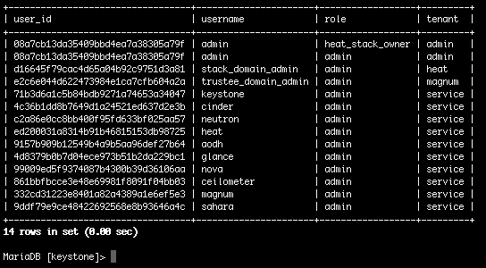
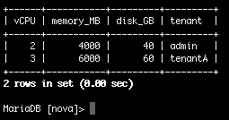
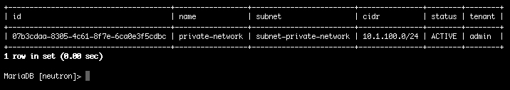
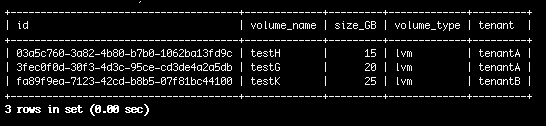
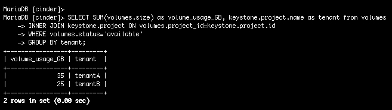
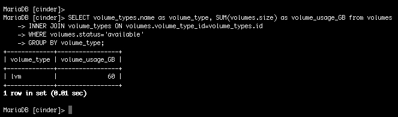
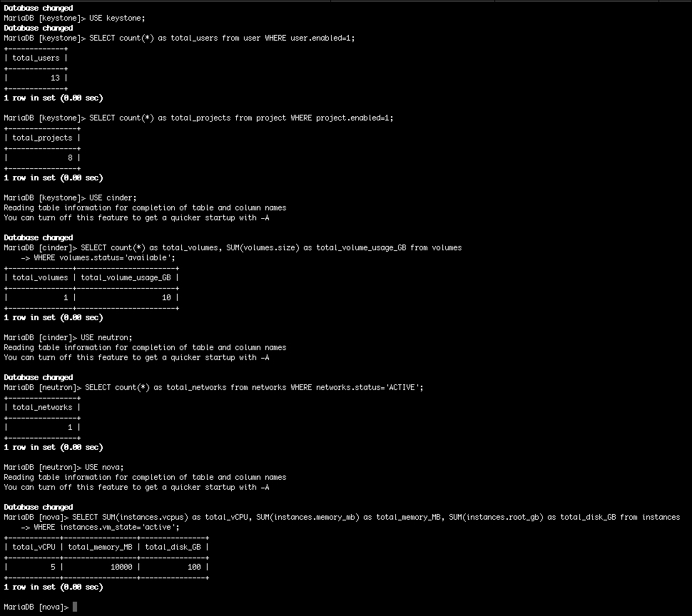
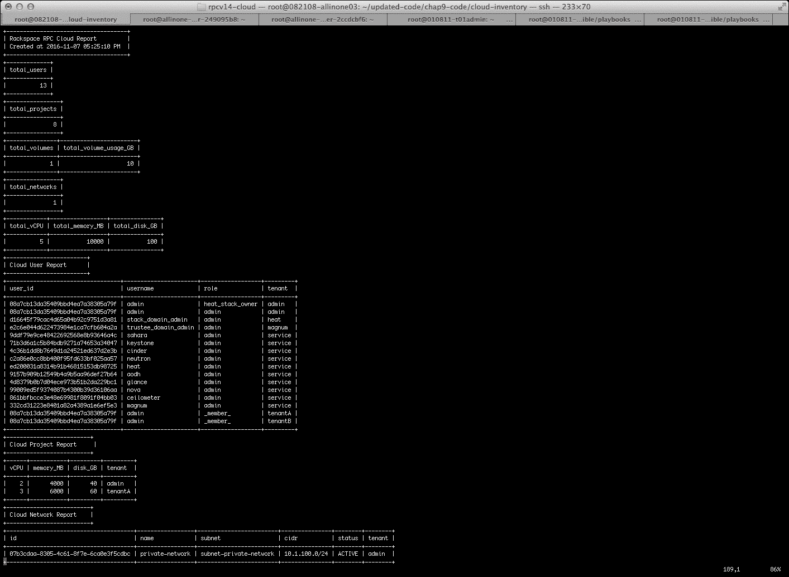
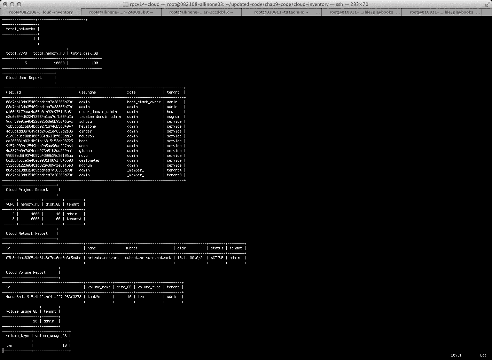

# 第九章：清单您的云

我非常兴奋地进入这一章，因为我们将专注于在管理 OpenStack 云时被认为具有挑战性的一个主题。收集有关正在使用的系统的指标是日常优先事项清单上的一个非常重要的项目。坏消息是，OpenStack 并不一定使这成为一项容易的任务。为了辩护 OpenStack，我会说最近的版本已经做了很多工作来改进这一点。新的 OpenStackClient（OSC）做得更好，允许云操作员汇总有关云的各种不同指标。

与此同时，有办法以临时方式收集这些指标，然后制作一个非常简单的报告。与 OpenStack 相关的大多数事情一样，有几种方法可以解决。在尝试使用多种方法进行此操作后，我发现通过对 OpenStack 数据库执行查询很容易实现。我知道，我知道……没有人想要触碰数据库。在过去的生活中，我曾经是一名数据库管理员，从那段经历中我学到的一件事是，简单明了的查询对任何数据库都是无害的。结合这个理论，并使用诸如 Ansible 之类的工具将收集到的所有信息汇总在一起是一个成功的组合。在本章中，我们将回顾如何动态地对 OpenStack 云资源的各个部分进行清单。我们将学习哪些指标具有价值，以及如何将这些信息存储以供以后参考。作为云操作员，拥有这样一个极其强大的工具是非常有用的。

+   收集云指标

+   用户报告

+   项目报告

+   网络报告

+   卷度报告

+   一目了然的云报告

+   编写操作手册和角色

+   审查操作手册和角色

# 收集云指标

这个过程的第一步是确定对您来说哪些指标是重要的。请记住，这里概述的方法只是我个人处理这个问题的方式。作为云操作员，您可能有不同的处理方式。将其作为一个起点来帮助您开始。

根据我的经验，最好汇总用户、项目、网络和卷度指标。然后，将所有数据合并在一起，输出总的云利用率指标。这与 Horizon 仪表板的功能非常相似。虽然登录 Horizon 并进行快速审查很容易，但如果您想向领导提供全面的报告呢？或者您可能想要拍摄一个时间点的快照，以比较一段时间内的云利用情况。将来可能需要对您的云进行审计。在不使用第三方工具的情况下，没有真正简单的方法以报告格式来做到这一点。下面的方法可以满足所有这些情况。

让我们从收集用户指标开始。

## 用户报告

捕获有关云中定义的用户的信息可能是记录的最简单的指标。当有一天您必须因合规性和安全原因对您的云进行审计时，您会注意到您列出了用户，甚至列出了分配给用户的角色，但没有将两者结合在一起。同样，您可以列出项目中的用户，但没有将分配给该用户的项目的角色一起列出。您可以看出我要说的是什么。将用户的完整列表与他们的 ID、分配给他们的角色以及他们可以访问的项目一起列在一份报告中是很有意义的。使用以下简单的数据库查询，您可以非常容易地获得这些信息：

```
USE keystone; 
SELECT local_user.user_id, local_user.name as username, role.name as role, project.name as tenant from local_user  
INNER JOIN assignment ON  
local_user.user_id=assignment.actor_id INNER JOIN  
role ON assignment.role_id=role.id INNER JOIN 
project ON assignment.target_id=project.id 
ORDER BY tenant; 

```

这个查询将结合数据库中名为 keystone 的四个不同表的数据。keystone 数据库是所有与用户相关的数据的所有者。数据库中的每个表至少有一个可以用来将数据联系在一起的主键。以下是这里使用的表及其功能的快速概述：

```
User       # contains the raw user information such as ID, name, 
             password and etc. 
Assignment # contains the role assignment for all users 
Role       # is the list of roles created/available 
Project    # contains the list of projects/tenants created/available 

```

在这个例子中，我们将专注于从四个表中只拉回必要的列。为了让事情变得更容易阅读，我们还重新命名了一些列标签。最后，我们将按项目名称按升序对数据进行排序，以便得到清晰和简单的输出。我保证不会在这个 SQL 查询中深入探讨太多。这是一本关于 OpenStack 和 Ansible 的书，不是 SQL 命令，对吧？

### 提示

始终尝试使用表的 ID 列来在可能的情况下链接其他表中的数据。ID 列将始终是一个唯一值，每次都会提供可靠的数据关联。如果使用包含项目名称值的列，最终可能会导致冲突，如果表中存在具有重复值的行。即使整个 OpenStack 也使用这种方法，您会注意到在 OpenStack 中创建的任何内容都有一个与之关联的 ID。

执行此查询后，输出将类似于以下内容：



## 项目报告

在整个云生命周期中，清晰地了解云中存在的项目和正在使用的资源可以非常有价值。最近，部门或部门费用分摊似乎是一种非常流行的方法。将这些指标作为时间点资源审查可以清楚地了解每个项目正在使用多少资源。为了成功完成这一点，必须为每个项目收集 vCPU、内存和磁盘指标。使用以下简单的数据库查询，您可以非常容易地获得这些信息：

```
USE nova; 
SELECT SUM(instances.vcpus) as vCPU, SUM(instances.memory_mb) as memory_MB, SUM(instances.root_gb) as disk_GB, keystone.project.name as tenant from instances 
INNER JOIN keystone.project ON 
instances.project_id=keystone.project.id  
WHERE instances.vm_state='active' GROUP BY tenant; 

```

此查询将合并来自两个不同数据库（`nova`和`keystone`）中的数据。`nova`数据库拥有所有与实例相关的数据。`keystone`数据库在前面的部分中已经审查过。就像之前的例子一样，每个表至少有一个主键。以下是这里使用的表及其功能的快速概述：

```
nova 
Instances # contains the raw information about instances created 

keystone 
Project   # contains the list of projects/tenants created/available 

```

为了获得这些数据，我们必须有点巧妙，并直接从包含原始实例信息的表中提取资源指标。如果我们安装了 Ceilometer，将会有一个特定的数据库，记录这些指标在更微观的水平上。由于我们目前没有这个功能，这种方法是目前可用的最好方法。在此查询中，我们将再次只返回必要的列并重新命名列标签。最后，我们将缩小输出范围，只包括活动实例，并按项目名称按升序对数据进行排序。因此，通过获取每个实例的资源信息并将其与实例所属的每个项目相关联，我们能够创建类似于这样的简单输出：



## 网络报告

在您的云上创建的 Neutron 网络的快照可能看起来对管理整个 OpenStack 云并不重要。相信我，在大局中是重要的。不必要或配置不正确的网络可能会给整个云功能增加延迟。直接导致这种情况的并不是网络本身，而是与每个项目相关的安全组的存在。这些信息主要可以帮助解决项目报告的问题。它提供了一个快速参考，了解每个项目中存在哪些网络以及与之关联的网络**无类域间路由选择（CIDR）**，即网络地址空间。在本地，网络服务（Neutron）在一个命令中并不提供这样的报告。就像之前一样，我们将直接从数据库中提取这些信息。使用以下简单的数据库查询，我们将收集网络 ID、名称、子网、分配的 CIDR、状态和关联的项目：

```
USE neutron; 
SELECT networks.id, networks.name, subnets.name as subnet, subnets.cidr, networks.status, keystone.project.name as tenant from networks 
INNER JOIN keystone.project ON networks.project_id COLLATE utf8_unicode_ci = keystone.project.id  
INNER JOIN subnets ON networks.id=subnets.network_id 
ORDER BY tenant; 

```

对于这个查询，我们将合并来自两个不同数据库`neutron`和`keystone`中的三个不同表的数据。`neutron`数据库拥有所有与网络相关的数据。以下是这里使用的表及其功能的快速概述：

```
neutron 
Networks # contains the raw information about networks created 
Subnets  # contains the subnet details associated with the networks 

keystone 
Project  # contains the list of projects/tenants created/available 

```

收集这些指标相当简单，因为大部分数据都存在于网络表中。我们所要做的就是从子网表中提取匹配的 CIDR，然后引入与该网络相关联的项目名称。在组合这个查询的过程中，我注意到`keystone`和`neutron`数据库表之间存在连接问题。显然，`neutron`数据库对 ID 列的模式定义不同，因此必须在内部连接语句中添加以下值：`COLLATE utf8_unicode_ci`。最终，输出将按项目名称按升序排序。输出的示例将类似于：



## 卷报告

在云中对整体卷消耗进行详细报告的能力似乎是 OpenStack 目前的一个较大的空白。块存储服务（Cinder）负责在云中维护和跟踪卷。为了获得准确的指标，我们需要直接查询 Cinder。能够有一份报告来分解每个项目创建的卷的数量将是很好的。然后，能够有一个快速的汇总报告来显示每个项目使用了多少卷存储。现在由于 Cinder 支持多个存储后端，最好跟踪卷类型的消耗情况。随着 Cinder 的成熟，我相信这将成为一个更容易的任务，但目前，我们可以再次直接查询数据库以提取我们正在寻找的指标。以下是用于收集这些指标的数据库查询的示例：

```
USE cinder; 
SELECT volumes.id, volumes.display_name as volume_name, volumes.size as size_GB, volume_types.name as volume_type, keystone.project.name as tenant from volumes 
INNER JOIN keystone.project ON volumes.project_id=keystone.project.id  
INNER JOIN volume_types ON volumes.volume_type_id=volume_types.id 
WHERE volumes.status='available' 
ORDER BY tenant; 

SELECT SUM(volumes.size) as volume_usage_GB, keystone.project.name as tenant from volumes 
INNER JOIN keystone.project ON volumes.project_id=keystone.project.id 
WHERE volumes.status='available' 
GROUP BY tenant; 

SELECT volume_types.name as volume_type, SUM(volumes.size) as volume_usage_GB from volumes 
INNER JOIN volume_types ON volumes.volume_type_id=volume_types.id 
WHERE volumes.status='available' 
GROUP BY volume_type; 

```

对于这个查询，至少涉及两个数据库`cinder`和`keystone`中的三个不同表。如您所见，收集这些信息相当复杂。我们需要发出三个单独的`SELECT`语句。第一个`SELECT`语句将从卷表中关联原始卷信息和来自 keystone 表的项目数据。此外，在同一个语句中，我们将包括卷类型的名称。由于卷表包含活动和非活动卷，必须应用额外的过滤器来仅返回活动卷。完整的输出将按项目名称按升序排序。第一个查询的输出将类似于这样：



下一个`SELECT`语句将查询数据库，收集每个项目的总卷消耗指标。它与前一个语句非常相似，但这里的主要区别是我们将为每个项目添加`volume_usage_GB`列，以计算总消耗量。第二个查询的输出将类似于这样：



最终的`SELECT`语句专注于报告卷类型的消耗情况。由于卷表仅记录卷类型 ID，我们必须内部连接`volume_types`表，以引入创建时定义的实际卷名称。这也是之前提到的其他语句所做的事情。第三个查询的输出将类似于：



## 一览云报告

这份报告旨在快速概述云的整体消耗情况。它返回云中存在的用户、项目、卷和网络的总数。以及当前使用的 vCPU、内存和临时磁盘的总数。以下是用于收集这些数据的数据库查询：

```
USE keystone; 
SELECT count(*) as total_users from user WHERE user.enabled=1; 
SELECT count(*) as total_projects from project WHERE project.enabled=1; 
USE cinder; 
SELECT count(*) as total_volumes, SUM(volumes.size) as total_volume_usage_GB from volumes 
WHERE volumes.status='available'; 
USE neutron; 
SELECT count(*) as total_networks from networks WHERE networks.status='ACTIVE'; 
USE nova; 
SELECT SUM(instances.vcpus) as total_vCPU, SUM(instances.memory_mb) as total_memory_MB, SUM(instances.root_gb) as total_disk_GB from instances 
WHERE instances.vm_state='active'; 

```

基本上使用的`SELECT`语句是将被调用的表中的列相加。然后将列名重命名为更具描述性的标签，最后进行过滤，忽略任何不处于活动状态的行。一旦执行，前面查询的输出将类似于这样：



现在我们知道如何收集报告的指标，让我们去学习如何完全自动化这个任务。

# 编写 playbooks 和 roles

在本节中，我们将创建 playbook 和 roles 来生成全面的*云报告*。一旦执行 playbook，输出和最终结果将是两份报告，包括我们在上一节中学习如何收集的信息。这两份报告将保存在您确定的目录中以便检索。在那时，您可以直接将其发送给领导和/或同行进行审查。在下一章中，我们将学习如何进一步进行，并直接通过电子邮件发送报告作为额外的奖励。

与上一章非常相似，我们将将多个任务分解为单独的角色，以保持组织。接下来，我们将审查用于自动创建我们的云报告的六个角色。

## 云清单

我们将创建的第一个角色将包括设置云报告基础所需的任务。文件名将是`main.yml`，位于名为`cloud-inventory/tasks`的角色目录中。该文件的内容将如下所示：

```
--- 
 name: Create working directory 
 file: path="{{ REPORT_DIR }}" state=directory 
 ignore_errors: yes 

 name: Copy the cloud_report script 
 copy: src=cloud_report.sql dest=/usr/share mode=0755 

 name: Add report header 
 shell: ( echo "+------------------------------------+"; echo "| {{ COMPANY }} Cloud Report     |"; echo "| Created at {{ lookup('pipe', 'date +%Y-%m-%d%t%X') }} |"; echo "+------------------------------------+"; ) >> {{ REPORT_DIR }}/os_report_{{ lookup('pipe', 'date +%Y%m%d') }}.log  

 name: Execute cloud report 
 shell: chdir=/usr/bin mysql -u root --password={{ MYSQLPASS }} --table < /usr/share/cloud_report.sql >> {{ REPORT_DIR }}/os_report_{{ lookup('pipe', 'date +%Y%m%d') }}.log 

```

前三个任务只是处理创建报告所需的先决步骤。这将包括创建报告保存的目录，处理要执行的 SQL 脚本，并向报告添加标题。总体思路是创建一个视觉上吸引人、准确且灵活的报告。这是通过动态添加报告运行时间/日期并相应命名报告来实现的。最后一个任务将直接针对云中 Galera 容器中找到的 MySQL 数据库执行`cloud_report.sql`文件。

`cloud_report.sql`文件包含前面**一览云报告**部分中描述的 SQL 查询。该文件可以在此角色的`cloud-inventory/files`目录中找到。

## 云使用

接下来的角色将创建第二份报告，概述当前云利用率按项目分解。该文件将命名为`main.yml`，位于名为`cloud-usage/tasks`的角色目录中。该文件的内容将如下所示：

```
--- 
 name: Create working directory 
 file: path="{{ REPORT_DIR }}" state=directory 
 ignore_errors: yes 

 name: Retrieve projectIDs 
 shell: openstack --os-cloud="{{ CLOUD_NAME }}" 
     project list | awk 'NR > 3 { print $2 }' 
register: tenantid 

 name: Add report header 
 shell: ( echo "+------------------------------------+"; echo "| Project Usage Report        |"; echo "| Created at {{ lookup('pipe', 'date +%Y-%m-%d%t%X') }} |"; echo "+------------------------------------+"; echo " "; ) >> {{ REPORT_DIR }}/os_usage_report_{{ lookup('pipe', 'date +%Y%m%d') }}.log  

 name: Record project usage 
 shell: ( echo "Project - {{ item }}" && openstack --os-cloud="{{ CLOUD_NAME }}" 
     usage show --start {{ RPTSTART }} --end {{ RPTEND }} --project {{ item }} && echo " " ) >> {{ REPORT_DIR }}/os_usage_report_{{ lookup('pipe', 'date +%Y%m%d') }}.log 
 with_items: "{{ tenantid.stdout_lines }}" 

 name: Retrieve project usage report file 
 fetch: src={{ REPORT_DIR }}/os_usage_report_{{ lookup('pipe', 'date +%Y%m%d') }}.log dest={{ REPORT_DEST }} flat=yes 

```

所有报告的预设置工作都在前面显示的第一和第三个任务中处理（创建报告目录和标题）。为了收集我们需要的报告指标，我们可以使用本机 OpenStack CLI 命令。使用的两个命令是：`openstack project list`和`usage show`。这些命令作为上面显示的第二和第四个任务的一部分执行。此角色中的最后一个任务将从远程位置检索报告并将其移动到 playbook/roles 执行的本地位置。

## 用户清单

该角色将负责执行前面部分描述的**用户报告**。文件将命名为`main.yml`，位于名为`user-inventory/tasks`的角色目录中。在这里，您将找到该文件的内容：

```
--- 
 name: Create working directory 
 file: path={{ REPORT_DIR }} state=directory 
 ignore_errors: yes 

 name: Copy the user_report script 
 copy: src=user_report.sql dest=/usr/share mode=0755 

 name: Add report header 
 shell: ( echo "+------------------------+"; echo "| Cloud User Report   |"; echo "+------------------------+"; ) >> {{ REPORT_DIR }}/os_report_{{ lookup('pipe', 'date +%Y%m%d') }}.log  

 name: Execute user report 
 shell: chdir=/usr/bin mysql -u root --password={{ MYSQLPASS }} --table < /usr/share/user_report.sql >> {{ REPORT_DIR }}/os_report_{{ lookup('pipe', 'date +%Y%m%d') }}.log 

```

为了使报告模块化且不相互依赖，我让每个角色创建一个报告工作目录并插入特定于报告的标题。这样，您可以包含或排除您希望的任何角色/报告。

用于创建此角色的基本原则将重复用于其余角色。它包括以下步骤：

+   创建报告工作目录；如果目录已经存在，它将继续报告无错误

+   将 SQL 脚本复制到远程位置

+   向报告添加自定义标题信息

+   执行 SQL 脚本以生成特定子报告

`user_report.sql`文件包含了前面部分描述的**用户报告**中的 SQL 查询。现在我们已经定义了框架，我们可以快速地完成剩下的角色。

## project-inventory

这个角色的目的是执行我们在前面部分审查过的**项目报告**。文件将被命名为`main.yml`，存放在名为`project-inventory/tasks`的角色目录中。在这里，你会找到这个文件的内容：

```
--- 
 name: Create working directory 
 file: path={{ REPORT_DIR }} state=directory 
 ignore_errors: yes 

 name: Copy the tenant_report script 
 copy: src=project_report.sql dest=/usr/share mode=0755 

 name: Add report header 
 shell: ( echo "+-------------------------+"; echo "| Cloud Project Report   |"; echo "+-------------------------+"; ) >> {{ REPORT_DIR }}/os_report_{{ lookup('pipe', 'date +%Y%m%d') }}.log  

 name: Execute tenant report 
 shell: chdir=/usr/bin mysql -u root --password={{ MYSQLPASS }} --table < /usr/share/project_report.sql >> {{ REPORT_DIR }}/os_report_{{ lookup('pipe', 'date +%Y%m%d') }}.log 

```

由于这个角色将遵循为用户清单角色概述的相同步骤，我们将注意力集中在执行的独特功能上。对于这个角色，`project_report.sql`文件将包含前面**项目报告**部分中描述的 SQL 查询。

## network-inventory

这个角色的目的是执行我们在前面部分审查过的**网络报告**。文件将被命名为`main.yml`，存放在名为`network-inventory/tasks`的角色目录中。在这里，你会找到这个文件的内容：

```
--- 
 name: Create working directory 
 file: path={{ REPORT_DIR }} state=directory 
 ignore_errors: yes 

 name: Copy the network_report script 
 copy: src=network_report.sql dest=/usr/share mode=0755 

 name: Add report header 
 shell: ( echo "+-------------------------+"; echo "| Cloud Network Report  |"; echo "+-------------------------+"; ) >> {{ REPORT_DIR }}/os_report_{{ lookup('pipe', 'date +%Y%m%d') }}.log  

 name: Execute network report 
 shell: chdir=/usr/bin mysql -u root --password={{ MYSQLPASS }} --table < /usr/share/network_report.sql >> {{ REPORT_DIR }}/os_report_{{ lookup('pipe', 'date +%Y%m%d') }}.log 

```

## volume-inventory

这个最后的角色将执行我们之前涵盖的**卷报告**的最终子报告。文件将被命名为`main.yml`，存放在名为`volume-inventory/tasks`的角色目录中。在这里，你会找到这个文件的内容：

```
--- 
 name: Create working directory 
 file: path={{ REPORT_DIR }} state=directory 
 ignore_errors: yes 

 name: Copy the volume_report script 
 copy: src=volume_report.sql dest=/usr/share mode=0755 

 name: Add report header 
 shell: ( echo "+--------------------------+"; echo "| Cloud Volume Report   |"; echo "+--------------------------+"; ) >> {{ REPORT_DIR }}/os_report_{{ lookup('pipe', 'date +%Y%m%d') }}.log  

 name: Execute volume report 
 shell: chdir=/usr/bin mysql -u root --password={{ MYSQLPASS }} --table < /usr/share/volume_report.sql >> {{ REPORT_DIR }}/os_report_{{ lookup('pipe', 'date +%Y%m%d') }}.log 

 name: Retrieve completed cloud report file 
 fetch: src={{ REPORT_DIR }}/os_report_{{ lookup('pipe', 'date +%Y%m%d') }}.log dest={{ REPORT_DEST }} flat=yes 

```

值得注意的一件特别的事情是，这个角色的最后一个任务使用`fetch` Ansible 模块从远程位置检索创建的报告。这与云使用角色中使用的行为相同。就个人而言，我觉得这个模块非常方便，让我们不必处理一系列的安全复制命令。这对任何人来说都不是一个好时机。

为了支持这些角色，我们现在需要创建与之配套的变量文件。由于我们将使用两个单独的主机来执行一系列角色，所以需要两个全局变量文件。文件名分别是`util_container`和`galera_container`，它们将被保存到 playbook 的`group_vars/`目录中。

### 提示

请记住，变量文件中定义的值是为了在正常的日常使用中在每次执行前进行更改的。

你应该注意到为新角色定义的一些新变量。除了用于认证进入你的 OpenStack 云的标准变量之外，我们还添加了一些与报告创建和位置相关的新变量：

```
util_container 

# Here are variables related globally to the util_container host group 

CLOUD_NAME: default 

REPORT_DIR: /usr/share/os-report 
REPORT_DEST: /usr/share/ 
RPTSTART: 2016-10-01 
RPTEND: 2016-11-01 

galera_container 

# Here are variables related globally to the galera_container host group 

MYSQLPASS: passwd 
COMPANY: Rackspace RPC 
REPORT_DIR: /usr/share/os-report 
REPORT_DEST: /usr/share/ 

```

### 注意

**注意：**

由于这个文件的内容，它应该被存储为一个安全文件，无论你使用什么代码库来存储你的 Ansible playbooks/roles。获取这些信息可能会危及你的 OpenStack 云安全。

让我们花点时间来分解新的变量。总结如下：

```
REPORT_DIR  # the directory where the report is 
              stored temporarily remotely 
REPORT_DEST # the directory where the report is saved locally 

RPTSTART    # the start date when collecting cloud usage 

RPTEND      # the end date when collecting cloud usage 

MYSQLPASS   # the password for the root database user 

COMPANY     # the company name to show up in the report header 

```

### 注意

由于有两个共享相同变量名的全局变量文件，请确保如果你希望两个报告存在于同一个目录中，保持变量值同步。这不是一个要求，因为每个报告（云报告和云使用）都可以独立存在。只是觉得值得一提，以免引起混淆。

变量文件完成后，我们可以继续创建主要的 playbook 文件。由于我们的目标是创建一个关于云资源的报告（记住我们将云使用报告作为奖励添加了进来），我们将从一个 playbook 中调用所有的角色。playbook 文件的完整内容最终看起来会类似于这样：

```
--- 
# This playbook used to run a cloud resource inventory report.  

 hosts: galera_container 
 remote_user: root 
 become: true 
 roles: 
  - cloud-inventory 

 hosts: util_container 
 remote_user: root 
 become: true 
 roles: 
  - cloud-usage 

 hosts: galera_container 
 remote_user: root 
 become: true 
 roles: 
  - user-inventory 
  - project-inventory 
  - network-inventory 
  - volume-inventory 

```

正如提到的，我们创建的所有用于清点云的角色将按照 playbook 中显示的顺序执行。所有的角色都使用相同的主机，除了云使用角色。背后的原因是我们在那个角色中使用了 OpenStack CLI 命令，这就需要使用`util_container`。

### 注意

playbook 和 role 的名称可以是您选择的任何内容。这里提供了具体的名称，以便您可以轻松地跟踪并引用 GitHub 存储库中找到的已完成代码。唯一的警告是，无论您决定如何命名角色，当在 playbook 中引用时，它必须保持统一。

因此，由于我们现在在此 playbook 中涉及了一个额外的主机，我们必须将此主机添加到名为`hosts`的清单文件中。通过添加新主机占位符，主机文件现在将如下所示：

```
[localhost] 
localhost ansible_connection=local 

[util_container] 
172.29.236.85 

[galera_container] 
172.29.236.72 

```

我非常兴奋地确认我们现在已经准备好开始运行一些云报告了。按照我们的传统，我们将以快速回顾刚刚创建的 playbook 和 role 来结束本章。

# 审查 playbooks 和 roles

让我们立即开始审查我们创建的 roles。

位于`cloud-inventory/tasks`目录中的已完成的 role 和名为`main.yml`的文件如下所示：

```
--- 
 name: Create working directory 
 file: path="{{ REPORT_DIR }}" state=directory 
 ignore_errors: yes 

 name: Copy the cloud_report script 
 copy: src=cloud_report.sql dest=/usr/share mode=0755 

 name: Add report header 
 shell: ( echo "+------------------------------------+"; echo "| {{ COMPANY }} Cloud Report     |"; echo "| Created at {{ lookup('pipe', 'date +%Y-%m-%d%t%X') }} |"; echo "+------------------------------------+"; ) >> {{ REPORT_DIR }}/os_report_{{ lookup('pipe', 'date +%Y%m%d') }}.log  

 name: Execute cloud report 
 shell: chdir=/usr/bin mysql -u root --password={{ MYSQLPASS }} --table < /usr/share/cloud_report.sql >> {{ REPORT_DIR }}/os_report_{{ lookup('pipe', 'date +%Y%m%d') }}.log 

```

位于`cloud-usage/tasks`目录中的已完成的 role 和名为`main.yml`的文件如下所示：

```
--- 
 name: Create working directory 
 file: path="{{ REPORT_DIR }}" state=directory 
 ignore_errors: yes 

 name: Retrieve projectIDs 
 shell: openstack --os-cloud="{{ CLOUD_NAME }}" 
     project list | awk 'NR > 3 { print $2 }' 
 register: tenantid 

 name: Add report header 
 shell: ( echo "+------------------------------------+"; echo "| Project Usage Report        |"; echo "| Created at {{ lookup('pipe', 'date +%Y-%m-%d%t%X') }} |"; echo "+------------------------------------+"; echo " "; ) >> {{ REPORT_DIR }}/os_usage_report_{{ lookup('pipe', 'date +%Y%m%d') }}.log  

 name: Record project usage 
 shell: ( echo "Project - {{ item }}" && openstack --os-cloud="{{ CLOUD_NAME }}" 
     usage show --start {{ RPTSTART }} --end {{ RPTEND }} --project {{ item }} && echo " " ) >> {{ REPORT_DIR }}/os_usage_report_{{ lookup('pipe', 'date +%Y%m%d') }}.log 
 with_items: "{{ tenantid.stdout_lines }}" 

 name: Retrieve project usage report file 
 fetch: src={{ REPORT_DIR }}/os_usage_report_{{ lookup('pipe', 'date +%Y%m%d') }}.log dest={{ REPORT_DEST }} flat=yes 

```

位于`user-inventory/tasks`目录中的已完成的 role 和名为`main.yml`的文件如下所示：

```
--- 
 name: Create working directory 
 file: path={{ REPORT_DIR }} state=directory 
 ignore_errors: yes 

 name: Copy the user_report script 
 copy: src=user_report.sql dest=/usr/share mode=0755 

 name: Add report header 
 shell: ( echo "+------------------------+"; echo "| Cloud User Report   |"; echo "+------------------------+"; ) >> {{ REPORT_DIR }}/os_report_{{ lookup('pipe', 'date +%Y%m%d') }}.log  

 name: Execute user report 
 shell: chdir=/usr/bin mysql -u root --password={{ MYSQLPASS }} --table < /usr/share/user_report.sql >> {{ REPORT_DIR }}/os_report_{{ lookup('pipe', 'date +%Y%m%d') }}.log 

```

位于`project-inventory/tasks`目录中的已完成的 role 和名为`main.yml`的文件如下所示：

```
--- 
 name: Create working directory 
 file: path={{ REPORT_DIR }} state=directory 
 ignore_errors: yes 

 name: Copy the tenant_report script 
 copy: src=project_report.sql dest=/usr/share mode=0755 

 name: Add report header 
 shell: ( echo "+-------------------------+"; echo "| Cloud Project Report   |"; echo "+-------------------------+"; ) >> {{ REPORT_DIR }}/os_report_{{ lookup('pipe', 'date +%Y%m%d') }}.log  

 name: Execute tenant report 
 shell: chdir=/usr/bin mysql -u root --password={{ MYSQLPASS }} --table < /usr/share/project_report.sql >> {{ REPORT_DIR }}/os_report_{{ lookup('pipe', 'date +%Y%m%d') }}.log 

```

位于`network-inventory/tasks`目录中的已完成的 role 和名为`main.yml`的文件如下所示：

```
--- 
 name: Create working directory 
 file: path={{ REPORT_DIR }} state=directory 
 ignore_errors: yes 

 name: Copy the network_report script 
 copy: src=network_report.sql dest=/usr/share mode=0755 

 name: Add report header 
 shell: ( echo "+-------------------------+"; echo "| Cloud Network Report  |"; echo "+-------------------------+"; ) >> {{ REPORT_DIR }}/os_report_{{ lookup('pipe', 'date +%Y%m%d') }}.log  

 name: Execute network report 
 shell: chdir=/usr/bin mysql -u root --password={{ MYSQLPASS }} --table < /usr/share/network_report.sql >> {{ REPORT_DIR }}/os_report_{{ lookup('pipe', 'date +%Y%m%d') }}.log 

```

位于`volume-inventory/tasks`目录中的已完成的 role 和名为`main.yml`的文件如下所示：

```
--- 
 name: Create working directory 
 file: path={{ REPORT_DIR }} state=directory 
 ignore_errors: yes 
 name: Copy the volume_report script 
 copy: src=volume_report.sql dest=/usr/share mode=0755 

 name: Add report header 
 shell: ( echo "+--------------------------+"; echo "| Cloud Volume Report   |"; echo "+--------------------------+"; ) >> {{ REPORT_DIR }}/os_report_{{ lookup('pipe', 'date +%Y%m%d') }}.log  

 name: Execute volume report 
 shell: chdir=/usr/bin mysql -u root --password={{ MYSQLPASS }} --table < /usr/share/volume_report.sql >> {{ REPORT_DIR }}/os_report_{{ lookup('pipe', 'date +%Y%m%d') }}.log 

 name: Retrieve completed cloud report file 
 fetch: src={{ REPORT_DIR }}/os_report_{{ lookup('pipe', 'date +%Y%m%d') }}.log dest={{ REPORT_DEST }} flat=yes 

```

相应的全局变量文件名为`util_container`，保存在完整 playbook 的`group_vars/`目录中：

```
# Here are variables related globally to the util_container host group 

CLOUD_NAME: default 

REPORT_DIR: /usr/share/os-report 
REPORT_DEST: /usr/share/ 
RPTSTART: 2016-10-01 
RPTEND: 2016-11-01 

```

相应的全局变量文件名为`galera_container`，保存在完整 playbook 的`group_vars/`目录中：

```
# Here are variables related globally to the galera_container host group 

MYSQLPASS: passwd 
COMPANY: Rackspace RPC 
REPORT_DIR: /usr/share/os-report 
REPORT_DEST: /usr/share/ 

```

现在主 playbook 文件已经创建，并将位于`playbook`目录的`root`目录中：

**inventory.yml**

```
--- 
# This playbook used to run a cloud resource inventory report.  

 hosts: galera_container 
 remote_user: root 
 become: true 
 roles: 
  - cloud-inventory 

 hosts: util_container 
 remote_user: root 
 become: true 
 roles: 
  - cloud-usage 

 hosts: galera_container 
 remote_user: root 
 become: true 
 roles: 
  - user-inventory 
  - project-inventory 
  - network-inventory 
  - volume-inventory 

```

最后，我们创建了`hosts`文件，也位于`playbook`目录的`root`目录中：

```
[localhost] 
localhost ansible_connection=local 

[util_container] 
172.29.236.85 

[galera_container] 
172.29.236.72 

```

### 注

完整的代码集可以在以下 GitHub 存储库中找到：[`github.com/os-admin-with-ansible/os-admin-with-ansible-v2/tree/master/cloud-inventory`](https://github.com/os-admin-with-ansible/os-admin-with-ansible-v2/tree/master/cloud-inventory)。

在我们结束这个话题之前，当然需要测试我们的工作。在运行此 playbook 和 roles 结束时，您将有两份报告需要审查。假设您之前已经克隆了 GitHub 存储库，从部署节点测试 playbook 的命令如下：

```
**$ cd os-admin-with-ansible-v2/cloud-inventory**
**$ ansible-playbook -i hosts inventory.yml**

```

假设 playbook 成功运行并且没有错误，您将在全局变量文件中指定的目录中找到创建的两个报告。报告应该类似于这样：



...



再次干得好！希望这些云报告能够真正帮助简化您日常的 OpenStack 管理任务！

# 总结

我们的 OpenStack 管理工具箱在本书中已经开始看起来相当丰富。强调拥有云状态的快照有多么重要是无法言喻的。这些报告可能是拥有快照的一个很好的起点。在结束本章之前，让我们花一点时间回顾本章。我们一起审查了 OpenStack 关于云库存报告的一些空白以及您如何克服它们。然后提供了如何通过查询数据库来获取我们需要的指标和统计信息的详细信息。接下来，我们详细研究了用于从数据库中提取数据的自定义 SQL 查询。最后，我们开发了 Ansible playbook 和 role 来自动生成云报告。

很遗憾地说，下一章是我们的最后一章。话虽如此，它肯定是最重要的章节之一。了解您的云的健康状况对于拥有一个正常运行的 OpenStack 生态系统至关重要。由于 OpenStack 的模块化性质，您将有许多服务需要跟踪。让它们都正常工作是在 OpenStack 内部创造了良好的和谐。虽然您当然可以手动完成，但我相信您会同意自动化这样的任务更理想。请继续阅读下一章，了解如何可以自动监控您的云的健康状况，甚至将健康报告直接发送到您的收件箱。
