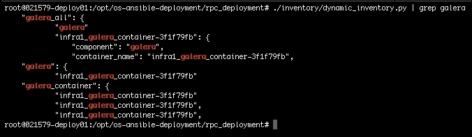
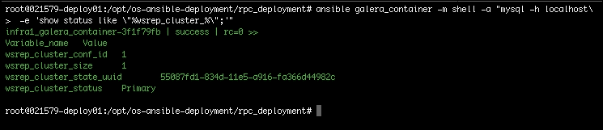
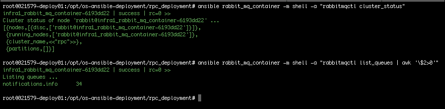
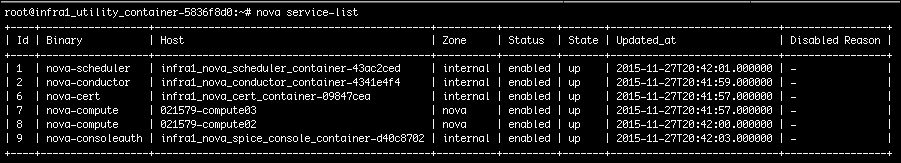
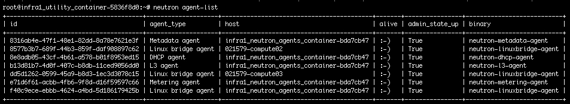

# 第十章：使用 Nagios 检查云的健康状况

监控恰好是我非常关心的一个话题。我花了很多年时间*观察*许多组织的网站和应用，以确保它们的可用性尽可能接近 99.99%的正常运行时间。这项任务在任何领域都不是软弱的人可以做的。支撑我度过这一切的是有一种坚实的监控方法，不需要我每天都亲自盯着它。在本章中，我们将介绍一些常见的方法来手动检查您的 OpenStack 云的健康状况，然后利用 Ansible 来设置我最喜欢的开源监控工具 Nagios。

由于我们在整本书中一直在使用**openstack-ansible**（**OSA**）部署方法进行实验，让我们继续利用 OSA 的内置 Ansible 功能来执行各种系统检查。请记住，我们在这里所做的事情不应该取代任何第三方监控工具，这些工具很可能会更好地保持被监控任务的可靠轮换。我们将使用 OpenStack 和 Linux 的本机功能来快速查看您的云的健康状况。同时，我们还将介绍其他监控技巧和窍门：

+   监控云

+   基础设施服务

+   核心 OpenStack 服务

+   设置 Nagios 并导入检查

+   通过 SNMP 收集指标

+   编写操作手册和角色

+   审查操作手册和角色

# 监控云

如果允许的话，我想在开始之前先介绍一些监控基础知识。希望我将在这里分享的三个原则对你来说并不新鲜。在评估监控某些内容时，有三个基本原则需要牢记：

+   保持简单

+   将您的监控保持在基础设施附近

+   创建良好的监控器

第一个要点很容易理解，因为它相当不言自明。你能做的最糟糕的事情就是过于复杂化如监控这样重要的事情。这个原则不仅适用于你的整体方法，也适用于你选择用来进行监控的工具。如果你不得不创建一个你的监控平台的**Visio**图，那就太复杂了。

将监控保持在基础设施附近的下一个要点是，用于监控的工具应该物理上靠近基础设施/应用程序。监控平台不应该需要穿越 VPN 或多个防火墙才能轮询设备/应用程序。将监控平台集中放置，这样您就可以以最小的路径轮询尽可能多的系统。您应该能够在防火墙中打开一两个端口以启用监控，并且这应该成为启动新设备/应用程序的标准化流程的一部分。

最后一点是另一个相当不言自明的概念。创建良好的监控器至关重要，它将避免错误的监控警报。随着时间的推移，如果大部分警报都被证明是虚假警报，个人将开始忽略监控警报。确保每个监控检查都按预期工作，并调整以尽量避免虚假警报。在各种工作负载和一天中的不同时间测试之后，再启动新的警报监控。此外，毋庸置疑，确保监控器增加价值并且不是多余的。

现在我们已经了解了基础知识，我们现在可以专注于监控 OpenStack。这通常涵盖以下四个领域：

+   监控物理硬件（基础资源消耗）

+   监控 OpenStack API 端点

+   监控 OpenStack 服务进程

+   通过基础设施节点监控计算节点

由于前两个领域实际上更适合由监控工具处理，我们在本书中不会重点关注这些工具。因此，我们的重点将主要放在检查基础设施服务（即 Galera、RabbitMQ 等）、核心 OpenStack 服务进程和计算节点的健康状况上。

### 提示

**专业提示**

在监控 OpenStack API 端点时，确保包括端点响应时间作为记录的指标。这样可以帮助您识别和跟踪任何与服务相关的减速，最终可能导致服务故障。捕获这些信息可以让您随着时间查看性能趋势，这可以让您在故障发生之前主动解决服务相关问题。修复可能是简单的事情，比如增加运行特定服务的容器，调整服务参数和/或数据库调优。

## OpenStack 服务进程

在转到下一部分之前，我觉得包括一些关于 OpenStack 服务进程的细节会很有帮助。这里有一张表格，列出了 OpenStack 服务和相关的进程名称。与 OpenStack 相关的任何内容，进程名称都可能因每个版本的发布而发生变化。我希望这至少是一个很好的起点。

| **服务名称** | **代码名称** | **进程名称** |
| --- | --- | --- |
| 计算 | Nova | nova-api-metadata, nova-api-os-compute, nova-cert, nova-compute, nova-consoleauth, nova-spicehtml5proxy, nova-api-ec2, nova-api, nova-conductor, nova-scheduler |
| 对象存储 | Swift | swift-proxy-server, swift-account-server, swift-account-auditor, swift-account-replicator, swift-account-reaper, swift-container-server, swift-container-auditor, swift-container-replicator, swift-container-updater, swift-object-server, swift-object-auditor, swift-object-replicator, swift-object-updater |
| 镜像 | Glance | glance-api, glance-registry |
| 身份 | Keystone | keystone-all, apache2 |
| 仪表板 | Horizon | apache2 |
| 网络 | Neutron | neutron-dhcp-agent, neutron-l3-agent, neutron-linuxbridge-agent, neutron-metadata-agent, neutron-metering-agent, neutron-server |
| 块存储 | Cinder | cinder-api, cinder-volume, cinder-scheduler |
| 编排 | Heat | heat-api, heat-api-cfn, heat-api-cloudwatch, heat-engine |
| 遥测 | Ceilometer | ceilometer-agent-compute, ceilometer-agent-central, ceilometer-agent-notification, ceilometer-collector, ceilometer-alarm-evaluator, ceilometer-alarm-notifier, ceilometer-api |
| 数据库 | Trove | trove-api, trove-taskmanager, trove-conductor |

## 基础设施服务

所有 OpenStack 服务的基础称为基础设施服务。这些是 OpenStack 在任何级别上工作所需的服务/组件。这些组件是 SQL 数据库服务器软件、数据库集群软件和消息服务器软件。在我们的特定情况下，这些组件按照相同的顺序将是 MariaDB、Galera 和 RabbitMQ。确保所有这些组件都健康并按预期工作是首要任务。每个软件包都有本机命令来报告它们的健康状况，所以我们在这方面已经有所准备。因此，挑战将是针对各种规模的云查询此信息的最佳方式是什么。想象一下，您有一个 20 节点的控制平面。您可以执行 20 次健康检查命令，或者只需使用 Ansible 执行一个命令即可获取状态。

### MariaDB 和 Galera

从前两个组件开始，有一种方法可以执行一个命令来同时进行 MySQL 检查以及检查数据库集群的健康状况。如果您还记得第二章中的内容，*Ansible 简介*，我们讨论了动态清单的主题，以及 OSA 提供了预构建的动态清单脚本，可以用来简化云管理。我们将利用这种能力来简化检查这些基础设施服务的流程。

有一个快速提醒，介绍如何使用 OSA 动态清单脚本与 Ansible。从根 OSA 部署（`/opt/openstack-ansible/playbooks`）目录中，您可以使用定义的组名来调用任何 OpenStack 服务所在的容器。每个 OpenStack 服务和基础设施组件在动态清单中都有一个定义的组。与我们目前正在处理的特定任务相关，有一个名为`galera_container`的组。

该组包含安装了云端 MySQL 和 Galera 的所有容器。然后，您可以将此组名替换为您通常在 playbook 的`hosts`文件中提供的任何主机名。尝试针对您的 OSA 云执行以下命令，以显示 Galera 容器的详细信息：

```
**$./inventory/dynamic_inventory.py | grep galera**

```

输出将类似于这样：



### 注意

请记住，前面的示例是针对 OpenStack 的 AIO（All-In-One）部署收集的。通常情况下，您应该在`galera_container`组下找到三个或更多不同的容器。

与 Ansible 相关的我们尚未涉及的领域是使用仅使用 Ansible 运行时包来发出更基本的临时命令的能力。在安装了 Ansible 的命令提示符中执行以下命令，以查看如何使用基本的 Ansible 程序的详细信息：

```
**$ ansible -h**

```

您会注意到参数与`ansible-playbook`程序非常相似，主要区别在于`ansible`程序不打算执行 playbooks。相反，它旨在能够直接在命令行上执行临时任务，使用与 playbook 通常使用的相同模块。我们将使用基本的 Ansible 程序来演示如何检索这些基础设施服务的状态。

现在，如果我们把这些都放在一起，报告 MySQL 和 Galera 的健康状况的工作示例将如下所示：

```
**$ ansible galera_container -m shell -a "mysql -h localhost\-e 
  'show status like "%wsrep_cluster_%";'"**

```

前面的命令告诉 Ansible 使用`galera_container`组作为要运行`shell`命令的主机。`shell`命令将调用 MySQL 并执行`show status`查询。命令的输出将类似于这样：



再次说明，由于使用 AIO 部署，您会注意到示例显示的集群大小只有一个。通常，集群大小应该显示为三个或更多，并且状态将显示在每个容器上（输出将对每个容器重复）。需要注意的关键领域是：每个容器报告成功，集群大小正确，并且集群 ID 在所有集群中都相同。

### RabbitMQ

我们将使用与之前对 MariaDB/Galera 进行状态和健康检查时相同的原则来检查 RabbitMQ 集群的状态和健康状况。RabbitMQ 容器的组名是`rabbit_mq_container`，我们可以在 OSA 根部署目录中执行以下命令来查看组的详细信息：

```
**$./inventory/dynamic_inventory.py | greprabbit_mq**

```

现在我们可以继续测试一些命令，报告 RabbitMQ 集群的健康状况。这里的第一个命令将直接报告集群状态，第二个命令将列出包含消息的所有队列（换句话说，非空队列）：

```
**$ ansible rabbit_mq_container -m shell -a "rabbitmqctlcluster_status"**
**$ ansible rabbit_mq_container -m shell -a 
  "rabbitmqctllist_queues | awk '\$2>0'"**

```

命令的输出将类似于这样：



让每个容器回报“成功”，确保运行节点列表完全匹配，并且每个节点显示相同的集群名称是最重要的。如果发现队列中仍然存在消息，请不要太担心。关键是这些消息应该在合理的时间内清除。使用这个指标来寻找消息在队列中被卡住的趋势。

# 核心 OpenStack 服务

在涵盖了所有基础设施服务之后，我们可以转向核心 OpenStack 服务。在本节中，我们将介绍一些可以用于任何 OpenStack 服务的原则。这种方法允许您根据个人需求交换任何基本方法中的任何服务。

我通常会检查的前三个服务是 Keystone、Nova 和 Neutron。这些服务可能会对云中的许多其他服务产生不利影响，需要正常运行才能在技术上拥有一个正常运行的云。虽然没有明确的 OpenStack 命令可以用来检查 Keystone 服务，但如果 Keystone 服务不可用，任何/所有 OpenStack CLI 命令都将失败，这将变得非常明显。我个人发现测试 Keystone 的最简单方法是要么登录到 Horizon 仪表板，要么发出以下 OpenStack CLI 命令：

```
**$ openstack service list**

```

如果您使用 Keystone 返回服务列表，您刚刚测试了向 Keystone 传递用户凭据进行身份验证，并且 Keystone 返回了适当的授权令牌。我们负责测试 Keystone，下一步可以是发出两个 OpenStack CLI 命令，快速报告 Nova 和 Neutron 的状态：

```
**$ nova service-list**
**$ neutron agent-list**

```

`nova service-list`命令将轮询所有与 Nova 相关的容器和计算节点，以确定它们的区域、状态、状态和状态更改的时间。此命令的输出将类似于此：



接下来，`neutron agent-list`命令将执行与上述相同的操作，只是针对与 Neutron 相关的组件。您将注意到在即将介绍的示例中，使用了笑脸图形来确定 neutron 代理的状态。代理的状态也将与此命令一起报告：



在这一点上，您将不得不依靠直接检查实际运行在容器中的 OpenStack 服务进程的状态来进行更详细的监控。这将类似于 OpenStack 网站上发布的一些方法，http://docs.openstack.org/ops-guide/operations.html。主要区别在于我们将使用 Ansible 根据需要在所有容器或节点上执行命令。使用基本的 Ansible 程序和之前提到的 OpenStack 服务进程表，您将能够检查在您的云中运行的 OpenStack 进程的状态。以下是一些可以实现这一目标的示例。建议获取云的动态清单的完整输出，这样您将了解所有定义的组。使用以下命令获取完整的清单输出（此命令假定您在 root OSA 部署目录中）：

```
**$ cd playbooks/inventory**
**$ ./dynamic_inventory.py**

```

将 JSON 输出保存在将来可以引用的地方。

## 服务和进程检查示例

以下示例显示了如何使用 Ansible 执行服务和进程监视检查：

```
**# check if a process is running**
**$ ansible neutron_server_container -m shell -a 
  "ps -ef | grep neutron-server"**
**# check status of a service**
**$ ansible compute_hosts -m shell -a "service nova-compute status"**
**# stop/start/restart a service (process)**
**$ ansible glance_container -m shell -a "service glance-registry stop"**
**$ ansible glance_container -m shell -a "service glance-registry start"**
**$ ansible glance_container -m shell -a "service glance-registry restart"**
**# parseservice logs**
**$ ansible nova_scheduler_container -m shell -a 
  "grep 35f83ac8 /var/log/nova/nova-scheduler.log"**

```

您可以使用这些示例中的任何一个来确定任何大小的云上 OpenStack 服务的健康状况，无论是大还是小。想象一下，能够在一个命令中查询跨 200 个节点的云中的`nova-compute`服务状态的能力。很棒，对吧？当然，我们必须尝试将其提升到下一个级别，通过将更多先进的监控工具整合到一起，以创建更强大的解决方案。

# 设置 Nagios 并导入检查

回顾之前提到的关于监控的第一个原则，保持简单。感觉我们无法比选择一种领先的开源监控平台 Nagios Core 更简单了。如果您对 Nagios 不熟悉，请花点时间阅读一下[`www.nagios.com/products`](http://www.nagios.com/products)。

是的，虽然它在视觉上可能不是最引人注目的仪表板，但它是我使用过的最强大和轻量级的监控应用之一。使用 Nagios，您可以对监控生态系统的许多方面进行最终控制。它可以从能够创建自定义插件一直到明确定义执行窗口为主机。管理可以直接从平面文件中处理，或者您可以使用许多第三方工具，例如**NConf**在[`exchange.nagios.org/directory/Addons/Configuration/NConf/details`](http://exchange.nagios.org/directory/Addons/Configuration/NConf/details)。随着新版本 XI 的推出，越来越多的仅在第三方工具中找到的功能已经内置。一些突出的新功能包括高级图表、集成到事件管理工具以及更清晰的 SLA 报告。

## 通过 SNMP 收集您的指标

当然，伴随着强大的功能有时会带来巨大的开销。通常，我发现将监控保持在基础设施附近可以避免由于防火墙限制等原因而限制监控的内容。强烈建议使用 SNMP（UDP 端口`161`），而不是 NRPE 代理，无需安装代理。此外，我通常坚持使用 Perl 编写的插件来简化故障排除。创建良好的监视器对于最小化错误警报至关重要，而这些错误警报最终会变成被忽略的警报。如果发现某个服务检查持续发送错误警报，请修复它！不要让它持续几天。

由于 OpenStack 通过 API 公开了所有功能，因此监控变得很容易。可以创建自定义插件脚本来监视整个 OpenStack 堆栈，并交叉参考任何瓶颈到物理基础设施问题。这种积极的监控可以导致防止停机导致的故障。

由于我对 OSA 有着深厚的热爱，因此将一系列 Ansible playbooks 组合起来处理大部分 Nagios 和 NConf 的设置似乎是再合适不过的了。此外，因为我喜欢回馈，还包括了 OSA 定制的 Nagios 配置（`checkcommands`、服务和一堆全局 Nagios 配置），可以在几分钟内用来监视您的 OpenStack 云。

# 编写 playbooks 和 roles

在本节中，我们将利用所有这些 Ansible 魔法来创建一系列 playbooks 和 roles，以设置 Nagios 来监视您的 OpenStack 云。完成后，您将拥有一个完全运行的 Nagios 安装，该安装将被定制为使用我们在上一节中审查的一些监控检查来监视 OpenStack。这一次，我们将任务分解为八个角色，以保持简单。让我们在后面审查每个角色。

## snmp-config

我们将创建的第一个角色将包括设置收集监控数据的基础所需的任务。该文件的名称将是`main.yml`，位于名为`snmp-config/tasks`的`role`目录中。该文件的内容将如下所示：

```
--- 

 name: Install additional packages 
 apt: name="{{ item }}" state=present 
 with_items: 
 - snmpd 

 name: Move standard config 
 command: mv /etc/snmp/snmpd.conf /etc/snmp/snmpd.conf.org 

 name: Place new config file 
 template: src=snmpd.conf dest=/etc/snmp/snmpd.conf 

 name: Update SNMP options 
 shell: chdir=/bin sed -i 's+^SNMPDOPTS.*+SNMPDOPTS="-Lsd -Lf /dev/null -u snmp -I -smux -p /var/run/snmpd.pid -c /etc/snmp/snmpd.conf"+' /etc/default/snmpd 

 name: Stop SNMP service 
 command: service snmpd stop 

 name: Start SNMP service 
 command: service snmpd start 

 name: Set SNMP service to start automatically 
 command: update-rc.d snmpd defaults 

```

前四个任务只是处理安装和配置每个要监视的主机上所需的步骤。这将包括安装`snmp`软件包，复制自定义配置文件到指定位置，并编辑 SNMP 选项。

处理自定义`snmp.conf`的任务将使用存储在此角色的`snmp-config/templates`目录中的`template`文件。这样做的原因是为了利用已在您的 playbook 中定义的变量，而不是硬编码参数。文件的内容将如下所示：

```
rocommunity {{ SNMP_COMMUNITY }} 
syslocation {{ SYS_LOCATION }} 
syscontact {{ SYS_CONTACT }} 

```

## install-nagios

下一个角色将专注于安装 Nagios 及其先决条件。该文件将被命名为`main.yml`，位于名为`install-nagios/tasks`的`role`目录中。该文件的内容将如下所示：

```
--- 

 name: Install additional packages 
 apt: name={{item}} state=present 
 with_items: 
 - vim 
  - nagios3 
  - unzip 

 name: Backup Nagios config files 
 command: cp -r /etc/nagios3 /etc/nagios3.backup 

 name: Check Nagios service 
 shell: ps -ef |grep nagios3 

 name: Create user .ssh directory  
 file: path=/var/lib/nagios/.ssh state=directory 
 ignore_errors: yes 

 name: Copy SSH private keys 
 copy: src=id_dsa dest=/var/lib/nagios/.ssh mode=0600 

 name: Copy SSH public keys 
 copy: src=id_dsa.pub dest=/var/lib/nagios/.ssh mode=0644 

 name: Copy nagios Ubuntu logo archive 
 copy: src=nagios-ubuntu-logo.tar dest=/usr/share 

 name: Decompress nagios Ubuntu logo archive 
 command: chdir=/usr/share tar xvf nagios-ubuntu-logo.tar -C 
/usr/share/nagios/htdocs/images/logos/base 

```

这个角色在执行 Nagios 的清洁安装所需的任务时非常直接。由于我们将监控 Ubuntu 系统，因此在这个角色中的最后两个任务是为了将 Ubuntu 标志安装到 Nagios 中。

## nagios-plugins

这个角色将负责安装我们自定义的 Nagios 插件，我们将使用它来监视我们的云。文件将被命名为`main.yml`，位于名为`nagios-plugins/tasks`的`role`目录中。在这里，你会找到这些内容：

```
--- 

 name: Copy nagios plugins tar file 
 copy: src=nagios-plugins.tar dest=/usr/share 

 name: Decompress nagios plugins archive 
 command: chdir=/usr/share tar xvf nagios-plugins.tar -C /usr/lib/nagios/plugins 

 name: Confirm plugin file permissions  
 file: path=/usr/lib/nagios/plugins/* mode=0774  

 name: Confirm plugin file ownership  
 file: path=/usr/lib/nagios/plugins owner=nagios owner=nagios recurse=yes 

 name: Copy nagios configs zip file 
 copy: src=NagiosConfig.zip dest=/usr/share 

- name: Create rpc-nagios-configs directory  
 file: path=/etc/nagios3/rpc-nagios-configs state=directory 

 name: Decompress nagios configs archive 
 command: chdir=/usr/share unzip NagiosConfig.zip -d /etc/nagios3/rpc-nagios-configs 

```

前面的角色在 Nagios 服务器上复制并设置了两个非常重要的文件（`nagios-plugins.tar`和`NagiosConfig.zip`）。如果没有这些插件和配置，你将只有一个普通的 Nagios 安装。通过运行这个角色，你基本上得到了一个预配置的 Nagios 设置，可以监控使用 OSA 部署的 OpenStack 云。在这个模型中，你也可以自定义附加到 Nagios 服务器的插件或特定配置。如果你感到好奇，可以打开这些存档文件查看一下。

## install-nconf

这个角色在技术上可以被认为是可选的，因为你不需要 NConf 来运行 Nagios 服务器。我个人发现 NConf 在配置服务检查和主机方面是 Nagios 的一个很好的补充。文件将被命名为`main.yml`，位于名为`install-nconf/tasks`的`role`目录中。以下是该文件的内容：

```
--- 

 name: Install additional packages 
 apt: name={{item}} state=present 
 with_items: 
  - mysql-server 
  - mysql-client 
  - php5 
  - libapache2-mod-php5 
  - php5-mysql 
  - php5-cli 
  - php5-common 
  - libtext-csv-xs-perl 

 name: Download NConf binaries 
 command: wget http://sourceforge.net/projects/nconf/files/nconf/1.3.0-0/nconf-1.3.0-0.tgz/download -O /usr/share/nconf-1.3.0-0.tgz 

 name: Unpack NConf binaries 
 command: chdir=/usr/share tar xzvf nconf-1.3.0-0.tgz -C /var/www/html 

 name: Set proper NConf directory permissions 
 command: chdir=/var/www/html/nconf chmod 644 config output static_cfg temp 

 name: Copy NConf DB script 
 template: src=create-nconf-db.sql dest=/usr/share 

 name: Create NConf DB 
 shell: chdir=/usr/bin mysql -u "{{ DB_USER }}" --password= < /usr/share/create-nconf-db.sql 

- name: Set NConf directory ownership 
 file: path=/var/www/html/nconf owner=www-data group=www-data recurse=yes 

- name: Set NConf directory permissions 
 file: path=/var/www/html/nconf mode=0777 

- name: Stop apache 
 command: service apache2 stop 

- name: Start apache 
 command: service apache2 start 

```

### 注意

与处理安装 Nagios 的角色非常相似，它涵盖了安装和配置 NConf 所需的步骤。有关如何安装 NConf 的更多详细信息，请访问[`www.nconf.org/dokuwiki/doku.php?id=nconf:help:documentation:start:installation`](http://www.nconf.org/dokuwiki/doku.php?id=nconf:help:documentation:start:installation)。

## nconf-post-install

将这个角色视为前一个角色的后续，因为它处理了 NConf 安装的后续步骤。它将在安装完成后处理特定文件的清理工作。文件将被命名为`main.yml`，位于名为`nconf-post-install/tasks`的`role`目录中。以下是该文件的内容：

```
--- 

 name: Remove installation directories and files 
 command: rm -r /var/www/html/nconf/INSTALL 

 name: Remove installation directories and files 
 command: rm /var/www/html/nconf/INSTALL.php 

 name: Remove installation directories and files 
 command: rm -r /var/www/html/nconf/UPDATE 

 name: Remove installation directories and files 
 command: rm /var/www/html/nconf/UPDATE.php 

```

接下来的两个角色旨在准备控制节点监视本地容器上运行的 OpenStack 进程和 API。你必须能够通过 SSH 远程运行服务检查。好消息是，已经存在 Nagios 插件来做到这一点（`check_by_ssh`）。

## create-nagios-user

这个角色的名称基本上解释了它将处理的任务。它将创建一个名为 Nagios 的用户，这个用户将作为 Nagios 插件的服务账户。文件将被命名为`main.yml`，位于名为`create-nagios-user/tasks`的`role`目录中。以下是该文件的内容：

```
--- 

 name: Create Nagios user 
 user: name="{{ USER }}" comment="{{ USER }} User"  
 ignore_errors: yes 

 name: Create user .ssh directory  
 file: path=/home/"{{ USER }}"/.ssh state=directory 

 name: Copy authorized keys 
 copy: src=nagios-key dest=/home/"{{ USER }}"/.ssh/authorized_keys mode=0644 

 name: Set home directory permissions  
 file: path=/home/"{{ USER }}" owner="{{ USER }}" group="{{ USER }}" recurse=yes 

```

## infra-plugin-config

这个角色将安装额外的 SNMP 软件包前提条件，并直接在控制节点上安装本地 Nagios 插件。通过 SSH，Nagios 将执行这些本地插件，并将状态报告回 Nagios 进行记录。这就是你必须说你只是喜欢技术的地方。文件将被命名为`main.yml`，位于名为`infra-plugin-config/tasks`的`role`目录中。以下是该文件的内容：

```
--- 

 name: Install additional packages 
 apt: name={{item}} state=present 
 with_items: 
  - libnet-snmp-perl 

 name: Create bin directory  
 file: path=/home/"{{ USER }}"/bin state=directory 
 ignore_errors: yes 

 name: Fix libcrypto link  
 command: chdir=/lib/x86_64-linux-gnu ln -s libcrypto.so.1.0.0 libcrypto.so.6 
 ignore_errors: yes 

 name: Fix libssl link  
 command: chdir=/lib/x86_64-linux-gnu ln -s libssl.so.1.0.0 libssl.so.6 
 ignore_errors: yes 

 name: Copy nagios plugins 
 copy: src=check_http dest=/home/"{{ USER }}"/bin 

 name: Copy nagios plugins 
 copy: src=check_port.pl dest=/home/"{{ USER }}"/bin 

 name: Copy nagios plugins 
 copy: src=check_snmp_process.pl dest=/home/"{{ USER }}"/bin 

 name: Copy nagios plugins 
 copy: src=show_users dest=/home/"{{ USER }}"/bin 

 name: Copy perl utils 
 copy: src=utils.pm dest=/etc/perl 

 name: Copy perl utils 
 copy: src=utils.sh dest=/etc/perl 

 name: Confirm plugin file permissions  
 file: path=/home/nagios/bin/check* mode=0777 

 name: Confirm plug file ownership  
 file: path=/home/nagios/bin owner=nagios group=nagios recurse=yes 

```

## nagios-post-install

最后但肯定不是最不重要的是组成这个系列的最后一个角色。最后一个角色将完成 Nagios 配置，并设置 NConf 与你的 Nagios 安装一起工作。文件将被命名为`main.yml`，位于名为`nagios-post-install/tasks`的`role`目录中。以下是该文件的内容：

```
--- 

 name: Copy NConf config file 
 copy: src=nconf.php dest=/var/www/html/nconf/config mode=0644 

 name: Change default Nagios config to use NConf 
 shell: chdir=/bin sed -i 's/^cfg_dir.*/#/g' /etc/nagios3/nagios.cfg 

 name: Change default Nagios config to use NConf 
 shell: chdir=/bin sed -i 's/^cfg_file.*/#/g' /etc/nagios3/nagios.cfg 

 name: Make import directory 
 file: path=/etc/nagios3/import state=directory 

 name: Copy Nagios config snippet 
 copy: src=nagios.txt dest=/usr/share 

 name: Change default Nagios config to use NConf 
 shell: chdir=/usr/share cat /usr/share/nagios.txt >> /etc/nagios3/nagios.cfg 

 name: Copy updated NConf deployment script 
 copy: src=deploy_local.sh dest=/var/www/html/nconf/ADD-ONS mode=0777 

```

为了支持这些角色，我们现在需要创建与之配套的变量文件。由于我们将使用三个单独的主机来执行一系列角色，因此需要三个全局变量文件。文件名分别为`hosts`、`all_containers`和`nagios-server`；它们将保存在 playbook 的`group_vars/`目录中。

### 提示

请记住，变量文件中定义的值是为了在正常的日常使用中在每次执行前进行更改的。

在本章中添加了许多新变量。让我们花点时间来审查每个变量文件的内容：

```
all_containers 

# Here are variables related to the install 

USER: nagios 
SNMP_COMMUNITY: osad 
SYS_LOCATION: SAT 
SYS_CONTACT: support@rackspace.com 

hosts 

# Here are variables related to the install 

USER: nagios 
SNMP_COMMUNITY: osad 
SYS_LOCATION: SAT 
SYS_CONTACT: support@rackspace.com 

nagios-server 

# Here are variables related to the install 

DB_NAME: NCONF_DB 
DB_USER: root 
DB_PASS: passwd 

```

让我们花点时间来分解新的变量。总结如下：

```
USER           # user to be created on the OSA nodes to match up 
                 against the default Nagios user created, 
                 the default user is 'nagios' 
SNMP_COMMUNITY # the SNMP community string used for 
                 the OSA nodes and containers  
SYS_LOCATION   # additional SNMP information (optional) 

SYS_CONTACT    # additional SNMP information (optional) 

DB_NAME        # name of the NConf database to be created 

DB_USER        # root user for the local mysql server 

DB_PASS        # root user password for the local mysql server 

```

### 注意

由于有两个共享相同变量名称的全局变量文件，请确保如果您希望两个报告在同一个目录中，则保持变量值同步。

完成变量文件后，我们可以继续创建主 playbook 文件。由于在运行 playbook 之间需要进行手动配置，主 playbook 被分成了多个 playbook。第一个名为`base.yml`的 playbook 的内容如下：

```
--- 
# This playbook deploys components needed for Infrastructure hosts and containers.  

 hosts: all_containers 
 remote_user: root 
 become: true 
 roles: 
  - snmp-config 

 hosts: hosts 
 remote_user: root 
 become: true 
 roles: 
  - snmp-config 

```

下一个 playbook 的名称为`base-nagios.yml`，内容如下：

```
--- 
# This playbook deploys components needed for Nagios.  

 hosts: nagios-server 
 remote_user: root 
 become: true 
 roles: 
  - install-nagios 
  - nagios-plugins 

```

以下 playbook 的名称为`base-nconf.yml`，内容如下：

```
--- 
# This playbook deploys components needed for NConf.  

 hosts: nagios-server 
 remote_user: root 
 become: true 
 roles: 
  - install-nconf 

```

下一个 playbook 的名称为`post-nconf-install.yml`，内容如下：

```
--- 
# This playbook deploys components needed for NConf.  

 hosts: nagios-server 
 remote_user: root 
 become: true 
 roles: 
  - nconf-post-install 

```

下一个 playbook 的名称为`base-infra.yml`，内容如下：

```
--- 
# This playbook deploys components needed for the Infrastructure hosts.  
 hosts: hosts 
 remote_user: root 
 become: true 
 roles: 
  - create-nagios-user 
  - infra-plugin-config 

```

下一个 playbook 的名称为`post-nagios-install.yml`，内容如下：

```
--- 
# This playbook deploys components needed for NConf.  

 hosts: nagios-server 
 remote_user: root 
 become: true 
 roles: 
  - nagios-post-install 

```

### 注意

playbook 和 role 的名称可以是您选择的任何内容。这里提供了具体的名称，以便您可以轻松地跟踪并引用 GitHub 存储库中找到的完成代码。唯一的警告是，无论您决定如何命名角色，都必须在 playbook 中引用时保持统一。

我们的 playbooks 和 roles 的清单文件非常简单。在清单文件中，我们只需要定义 Nagios 服务器的地址。示例如下：

```
[nagios-server] 
021579-nagios01 

```

希望您对所有的工作都感到满意。按照我们的传统，我们将以快速审查刚刚创建的 playbooks 和 roles 结束本章，并包含一些额外的指示。

# 审查 playbook 和 role

让我们立即开始检查我们创建的角色。

位于`snmp-config/tasks`目录中的完成角色和文件名为`main.yml`的文件如下：

```
--- 

 name: Install additional packages 
 apt: name="{{ item }}" state=present 
 with_items: 
  - snmpd 

 name: Move standard config 
 command: mv /etc/snmp/snmpd.conf /etc/snmp/snmpd.conf.org 

 name: Place new config file 
 template: src=snmpd.conf dest=/etc/snmp/snmpd.conf 

 name: Update SNMP options 
 shell: chdir=/bin sed -i 's+^SNMPDOPTS.*+SNMPDOPTS="-Lsd -Lf /dev/null -u snmp -I -smux -p /var/run/snmpd.pid -c /etc/snmp/snmpd.conf"+' /etc/default/snmpd 

 name: Stop SNMP service 
 command: service snmpd stop 

 name: Start SNMP service 
 command: service snmpd start 

 name: Set SNMP service to start automatically 
 command: update-rc.d snmpd defaults 

```

位于`install-nagios/tasks`目录中的完成角色和文件名为`main.yml`的文件如下：

```
--- 

 name: Install additional packages 
 apt: name={{item}} state=present 
 with_items: 
  - vim 
  - nagios3 
  - unzip 

 name: Backup Nagios config files 
 command: cp -r /etc/nagios3 /etc/nagios3.backup 

 name: Check Nagios service 
 shell: ps -ef |grep nagios3 

 name: Create user .ssh directory  
 file: path=/var/lib/nagios/.ssh state=directory 
 ignore_errors: yes 

 name: Copy SSH private keys 
 copy: src=id_dsa dest=/var/lib/nagios/.ssh mode=0600 

 name: Copy SSH public keys 
 copy: src=id_dsa.pub dest=/var/lib/nagios/.ssh mode=0644 

 name: Copy nagios Ubuntu logo archive 
 copy: src=nagios-ubuntu-logo.tar dest=/usr/share 

 name: Decompress nagios Ubuntu logo archive 
 command: chdir=/usr/share tar xvf nagios-ubuntu-logo.tar -C /usr/share/nagios/htdocs/images/logos/base 

```

位于`nagios-plugins/tasks`目录中的完成角色和文件名为`main.yml`的文件如下：

```
--- 

 name: Copy nagios plugins tar file 
 copy: src=nagios-plugins.tar dest=/usr/share 

 name: Decompress nagios plugins archive 
 command: chdir=/usr/share tar xvf nagios-plugins.tar -C /usr/lib/nagios/plugins 

 name: Confirm plugin file permissions  
 file: path=/usr/lib/nagios/plugins/* mode=0774  

 name: Confirm plugin file ownership  
 file: path=/usr/lib/nagios/plugins owner=nagios owner=nagios recurse=yes 

 name: Copy nagios configs zip file 
 copy: src=NagiosConfig.zip dest=/usr/share 

 name: Create rpc-nagios-configs directory  
 file: path=/etc/nagios3/rpc-nagios-configs state=directory 

 name: Decompress nagios configs archive 
 command: chdir=/usr/share unzip NagiosConfig.zip -d /etc/nagios3/rpc-nagios-configs 

```

位于`install-nconf/tasks`目录中的完成角色和文件名为`main.yml`的文件如下：

```
--- 

 name: Install additional packages 
 apt: name={{item}} state=present 
 with_items: 
  - mysql-server 
  - mysql-client 
  - php5 
  - libapache2-mod-php5 
  - php5-mysql 
  - php5-cli 
  - php5-common 
  - libtext-csv-xs-perl 

- name: Download NConf binaries 
 command: wget http://sourceforge.net/projects/nconf/files/nconf/1.3.0-0/nconf-1.3.0-0.tgz/download -O /usr/share/nconf-1.3.0-0.tgz 

 name: Unpack NConf binaries 
 command: chdir=/usr/share tar xzvf nconf-1.3.0-0.tgz -C /var/www/html 

 name: Set proper NConf directory permissions 
 command: chdir=/var/www/html/nconf chmod 644 config output static_cfg temp 

- name: Copy NConf DB script 
 template: src=create-nconf-db.sql dest=/usr/share 

 name: Create NConf DB 
 shell: chdir=/usr/bin mysql -u "{{ DB_USER }}" --password= < /usr/share/create-nconf-db.sql 

- name: Set NConf directory ownership 
 file: path=/var/www/html/nconf owner=www-data group=www-data recurse=yes 

 name: Set NConf directory permissions 
 file: path=/var/www/html/nconf mode=0777 

 name: Stop apache 
 command: service apache2 stop 

 name: Start apache 
 command: service apache2 start 

```

位于`nconf-post-install/tasks`目录中的完成角色和文件名为`main.yml`的文件如下：

```
--- 
 name: Remove installation directories and files 
 command: rm -r /var/www/html/nconf/INSTALL 

 name: Remove installation directories and files 
 command: rm /var/www/html/nconf/INSTALL.php 

 name: Remove installation directories and files 
 command: rm -r /var/www/html/nconf/UPDATE 

 name: Remove installation directories and files 
 command: rm /var/www/html/nconf/UPDATE.php 

```

位于`create-nagios-user/tasks`目录中的完成角色和文件名为`main.yml`的文件如下：

```
--- 

 name: Create Nagios user 
 user: name="{{ USER }}" comment="{{ USER }} User"  
 ignore_errors: yes 

 name: Create user .ssh directory  
 file: path=/home/"{{ USER }}"/.ssh state=directory 

 name: Copy authorized keys 
 copy: src=nagios-key dest=/home/"{{ USER }}"/.ssh/authorized_keys mode=0644 

 name: Set home directory permissions  
 file: path=/home/"{{ USER }}" owner="{{ USER }}" group="{{ USER }}" recurse=yes 

```

位于`infra-plugin-config/tasks`目录中的完成角色和文件名为`main.yml`的文件如下：

```
--- 

 name: Install additional packages 
 apt: name={{item}} state=present 
 with_items: 
  - libnet-snmp-perl 

 name: Create bin directory  
 file: path=/home/"{{ USER }}"/bin state=directory 
 ignore_errors: yes 

 name: Fix libcrypto link  
 command: chdir=/lib/x86_64-linux-gnu ln -s libcrypto.so.1.0.0 libcrypto.so.6 
 ignore_errors: yes 

 name: Fix libcrypto link  
 command: chdir=/lib/x86_64-linux-gnu ln -s libssl.so.1.0.0 libssl.so.6 
 ignore_errors: yes 

 name: Copy nagios plugins 
 copy: src=check_http dest=/home/"{{ USER }}"/bin 

 name: Copy nagios plugins 
 copy: src=check_port.pl dest=/home/"{{ USER }}"/bin 

 name: Copy nagios plugins 
 copy: src=check_snmp_process.pl dest=/home/"{{ USER }}"/bin 

 name: Copy nagios plugins 
 copy: src=show_users dest=/home/"{{ USER }}"/bin 

 name: Copy perl utils 
 copy: src=utils.pm dest=/etc/perl 

 name: Copy perl utils 
 copy: src=utils.sh dest=/etc/perl 

 name: Confirm plugin file permissions  
 file: path=/home/nagios/bin/check* mode=0777 

 name: Confirm plug file ownership  
 file: path=/home/nagios/bin owner=nagios group=nagios recurse=yes 

```

位于`nagios-post-install/tasks`目录中的完成角色和文件名为`main.yml`的文件如下：

```
--- 

 name: Copy NConf config file 
 copy: src=nconf.php dest=/var/www/html/nconf/config mode=0644 

 name: Change default Nagios config to use NConf 
 shell: chdir=/bin sed -i 's/^cfg_dir.*/#/g' /etc/nagios3/nagios.cfg 

 name: Change default Nagios config to use NConf 
 shell: chdir=/bin sed -i 's/^cfg_file.*/#/g' /etc/nagios3/nagios.cfg 

 name: Make import directory 
 file: path=/etc/nagios3/import state=directory 

 name: Copy Nagios config snippet 
 copy: src=nagios.txt dest=/usr/share 

 name: Change default Nagios config to use NConf 
 shell: chdir=/usr/share cat /usr/share/nagios.txt >> /etc/nagios3/nagios.cfg 

 name: Copy updated NConf deployment script 
 copy: src=deploy_local.sh dest=/var/www/html/nconf/ADD-ONS mode=0777 

```

对应的全局变量文件名为`all_containers`，保存在完整 playbook 的`group_vars/`目录中：

```
# Here are variables related to the install 

USER: nagios 
SNMP_COMMUNITY: osad 
SYS_LOCATION: SAT 
SYS_CONTACT: support@rackspace.com 

```

对应的全局变量文件名为`hosts`，保存在完整 playbook 的`group_vars/`目录中：

```
# Here are variables related to the install 

USER: nagios 
SNMP_COMMUNITY: osad 
SYS_LOCATION: SAT 
SYS_CONTACT: support@rackspace.com 

```

对应的全局变量文件名为`nagios-server`，保存在完整 playbook 的`group_vars/`目录中：

```
# Here are variables related to the install 

DB_NAME: NCONF_DB 
DB_USER: root 
DB_PASS: passwd 

```

现在主 playbook 文件已经创建，并位于`playbook`目录的`root`目录中：

+   `base.yml`

```
       --- 
       # This playbook deploys components needed for Infrastructure hosts and  
       containers.  

        hosts: all_containers 
        remote_user: root 
        become: true 
        roles: 
         - snmp-config 

        hosts: hosts 
        remote_user: root 
        become: true 
        roles: 
         - snmp-config 

```

+   `base-nagios.yml`

```
       --- 
       # This playbook deploys components needed for Nagios.  

        hosts: nagios-server 
        remote_user: root 
        become: true 
        roles: 
         - install-nagios 
         - nagios-plugins 

```

+   `base-nconf.yml`

```
       --- 
       # This playbook deploys components needed for NConf.  

        hosts: nagios-server 
        remote_user: root 
        become: true 
        roles: 
         - install-nconf 

```

+   `post-nconf-install.yml`

```
       --- 
       # This playbook deploys components needed for NConf.  

        hosts: nagios-server 
        remote_user: root 
        become: true 
        roles: 
         - nconf-post-install 

```

+   `base-infra.yml`

```
       --- 
       # This playbook deploys components needed for the Infrastructure hosts.  

        hosts: hosts 
        remote_user: root 
        become: true 
        roles: 
         - create-nagios-user 
         - infra-plugin-config 

```

+   `post-nagios-install.yml`

```
       --- 
       # This playbook deploys components needed for NConf.  

        hosts: nagios-server 
        remote_user: root 
        become: true 
        roles: 
         - nagios-post-install 

```

最后，我们创建了`hosts`文件，也位于`playbook`目录的`root`目录中：

```
[nagios-server] 
021579-nagios01 

```

### 注意

完整的代码集可以在以下 GitHub 存储库中再次找到：`https://github.com/os-admin-with-ansible/os-admin-with-ansible-v2/tree/master/nagios-openstack`。

在完成本主题之前，我们当然需要测试我们的工作，并添加一些额外的说明来完成 Nagios 设置。在运行这些 playbooks 和 roles 之后，您将拥有一个功能强大的监视机器，用于监视您的 OpenStack 云和其他应用程序。假设您之前已经克隆了 GitHub 存储库，从部署节点测试 playbook 的命令如下：

1.  将 playbooks 和 roles 移动到 OSA 部署目录中。

为了利用 OSA 提供的动态清单功能，playbooks 和 roles 需要在部署目录中。相信我，你会喜欢这个！

```
**$ cd os-admin-with-ansible-v2/nagios-openstack**
**$ mkdir /opt/openstack-ansible/playbooks/groups_vars**
**$ cp ~/nagios-openstack/group_vars/* /opt/openstack-
       ansible/playbooks/group_vars**
**$ cp -r ~/nagios-openstack/roles/* /opt/openstack-ansible/roles**
**$ cp ~/nagios-openstack/base* /opt/openstack-ansible/playbooks**
**$ cp ~/nagios-openstack/hosts /opt/openstack-ansible/playbooks**

```

1.  执行以下 playbook 来安装和配置 OSA 云上的 SNMP：

```
**$ cd /opt/openstack-ansible/** 
**$ openstack-ansible -i inventory/dynamic_inventory.py 
     playbooks/base.yml**

```

### 提示

如果 SNMP 服务第一次启动失败，请执行以下命令：

```
**$ ansible all_containers -m shell -a "service snmpd start"**
**$ ansible hosts -m shell -a "service snmpd start"**

```

1.  执行以下 playbook 来在监视服务器上安装和配置 Nagios：

```
**$ cd playbooks**
**$ openstack-ansible -i hosts base-nagios.yml**

```

然后通过 SSH 连接到监视服务器，执行以下命令来设置*nagiosadmin*用户密码（用于登录 Nagios Web 仪表板）并重新启动 Nagios：

```
**$ cd /etc/nagios3**
**$ sudo htpasswd -c /etc/nagios3/htpasswd.users nagiosadmin**
**$ service nagios3 restart**

```

1.  执行以下 playbook 来在监视服务器上安装和配置 NConf：

```
**$ openstack-ansible -i hosts base-nconf.yml**

```

1.  **NConf 初始配置**：我尝试自动化这部分工作并不成功，所以您必须使用 NConf Web 控制台完成 NConf 配置。浏览`http://<monitoring server IP>/nconf`并按照提示完成初始配置。以下是建议的输入，并保留其他默认设置：

```
            DBNAME: same as what you inputed in the variables file above 
            DBUSER: same as what you inputed in the variables file above 
            DBPASS: same as what you inputed in the variables file above 
            NCONFDIR: /var/www/html/nconf 
            NAGIOS_BIN: /usr/sbin/nagios3 

```

1.  **执行后 NConf playbook**：

```
**$ openstack-ansible -i hosts post-nconf-install.yml**

```

1.  执行以下 playbook 来配置 OSA 节点以允许通过 SSH 进行监视：

为了监视运行在本地容器上的 OpenStack 进程和 API，您必须通过 SSH 远程运行服务检查。好消息是，Nagios 插件已经存在（`check_by_ssh`）：

```
**$ cd ..**
**$ openstack-ansible -i 
        inventory/dynamic_inventory.py 
        playbooks/base-infra.yml**

```

+   确认 Nagios 和 NConf 的安装：在浏览器中，转到以下 URL：

+   `http://<monitoring server IP>/nagios3`

+   `http://<monitoring server IP>/nconf`

1.  是时候为监视 OSA 配置 Nagios 了。

不幸的是，这部分需要手动配置，因为每个安装的差异太大，无法自动化。从宏观上看，这只会帮助您提高 Nagios 技能。不用担心；Nagios 目录的副本已经被保存。这一步需要一些时间，不应该被匆忙完成。

第一步是自定义位于监视服务器上`/etc/nagios3/rpc-nagios-configs`目录中的 Nagios 配置文件。所有配置文件都很重要，但最关键的是`advanced_services.cfg`和`hosts.cfg`文件。

在`advanced_services.cfg`文件中，您需要更新每个服务检查的 IP 地址，以便与 OSA 安装中的容器的 IP 地址匹配。获取信息的最快方法是执行以下命令，并在每个基础设施节点上捕获输出：`lxc-ls --fancy`。这是一个例子：

```
       define service { 
        service_description     infra1_check_ssh_process_glance-api 
        check_command           check_by_ssh_process!<glance container
                                IP>!glance-api 
        check_period            24x7 
        notification_period     24x7 
        host_name              <OSAD node name> 
        contact_groups         +admins,rpc-openstack-support 
        use                    rpc-service 
       } 

```

`hosts.cfg`文件也是一样；请更新 OSA 节点的名称和 IP 地址：

```
       define host { 
          host_name           <OSAD node name> 
          address            <OSAD node IP> 
          icon_image_alt        Ubuntu 14.04 
          icon_image          base/ubuntu.gif 
          statusmap_image        base/ubuntu.gd2 
          check_command         check-host-alive 
          check_period         24x7 
          notification_period      24x7 
          contact_groups        +admins,rpc-openstack-support 
          use              rpc-node 
      } 

```

还需要将以下内容添加到 Nagios 目录根目录（`/etc/nagios3`）中的`resources.cfg`文件的底部：

```
**$USER10$=<random SNMP community string of your choice, keep it
       simple>**

```

如果您在使用编辑器进行配置更新时遇到问题，请不要感到紧张，因为下一步将使这个过程变得更容易。

1.  将 Nagios 配置导入 NConf

然后将`/etc/nagios3/rpc-nagios-configs`目录中配置文件的内容附加到当前 Nagios 配置文件的底部。每个主机、主机组、检查、服务和联系组都有唯一的名称，以避免与当前 Nagios 设置冲突。然后，我们将按照 NConf 网站上的说明进行操作，[`www.nconf.org/dokuwiki/doku.php?id=nconf:help:how_tos:import:import_nagios`](http://www.nconf.org/dokuwiki/doku.php?id=nconf:help:how_tos:import:import_nagios)。

正如 NConf 教程建议的那样，首先使用`-s`参数运行命令来模拟导入过程。在能够无错误运行后，删除`-s`参数进行最终导入。通过 SSH 连接到监控服务器后，运行以下命令：

```
**$ cd /var/www/html/nconf**
**$ bin/add_items_from_nagios.pl -c 
         timeperiod -f /path/to/timeperiods.cfg -s**
**$ bin/add_items_from_nagios.pl -c 
         misccommand -f /path/to/misccommands.cfg -s**
**$ bin/add_items_from_nagios.pl -c 
         checkcommand -f  
         /path/to/checkcommands.cfg -s**
**$ bin/add_items_from_nagios.pl -c contact -f 
         /path/to/contacts.cfg -s**
**$ bin/add_items_from_nagios.pl -c 
         contactgroup -f 
       /path/to/contactgroups.cfg -s**
**$ bin/add_items_from_nagios.pl -c 
         host-template -f 
       /path/to/host_templates.cfg -s**
**$ bin/add_items_from_nagios.pl -c 
         service-template -f  
         /path/to/service_templates.cfg -s**
**$ bin/add_items_from_nagios.pl -c hostgroup -f 
         /path/to/hostgroups.cfg -s**
**$ bin/add_items_from_nagios.pl -c host -f 
         /path/to/hosts.cfg -s**
**$ bin/add_items_from_nagios.pl -c advanced-
         service -f /path/to/advanced-services.cfg -s**

```

现在您可以在 NConf Web 控制台中编辑所有 Nagios 配置。

1.  执行后续的 Nagios playbook：

```
**$ cd playbooks**
**$ openstack-ansible -i hosts post-nagios-
       install.yml**

```

1.  生成你的第一个 Nagios 配置

一旦您对所有自定义的 Nagios 配置感到满意（相信我，您会做几次这样的事情），请点击 NConf Web 控制台侧边栏上的**生成 Nagios 配置**链接。它会提示是否遇到任何错误。有时，您会看到警告，它们只是警告，没有什么紧急的。

最后但同样重要的是，从监控服务器执行以下命令将 Nagios 配置部署到 Nagios（可能需要使用`sudo`）：

```
**$ cd /var/www/html/nconf/ADD-ONS**
**$ ./deploy_local.sh**

```

# 总结

拥有一个坚如磐石的监控平台是云成功的关键（实际上是任何生产系统的成功）。请记住，这只是一个起点。我期待您根据自己的特定需求进行改进/定制。我期待在未来看到您的出色工作。请确保分享您所做的任何更改，记住开源就是分享。在结束这最后一章之前，让我们花点时间回顾一下我们讨论过的内容。首先，我们介绍了一些监控技巧和诀窍。然后，我们研究了值得监控的 OpenStack 组件。接下来，我们学习了如何使用 Ansible 的临时命令。然后，我们转入如何设置 Nagios 并导入用于服务检查的自定义插件。最后，我们开发了 Ansible playbook 和 role 来自动化 Nagios 和 NConf 的基本安装，并对其进行定制，以完全监控 OpenStack 云。

女士们先生们，这真的很有趣，也很荣幸能够第二次与您分享这些自动化示例。请继续保持良好的工作，并密切关注未来的修订，因为 OpenStack 和 Ansible 都在不断成熟。我真的很期待听到您的反馈，并看到您如何将这些示例提升到下一个水平。
