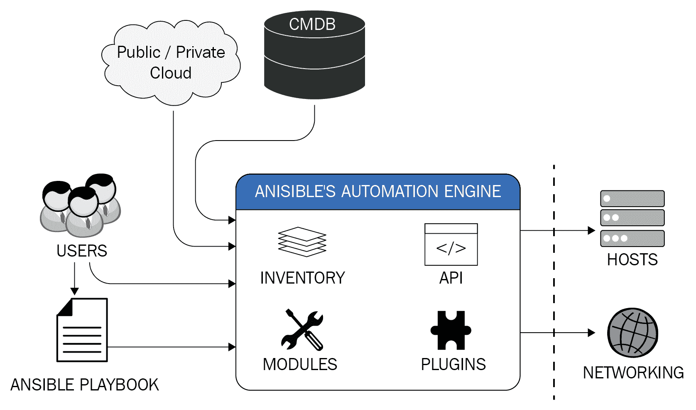

# 第二章：理解 Ansible 的基础知识

在其核心，Ansible 是一个简单的框架，它将一个称为**Ansible 模块**的小程序推送到目标节点。模块是 Ansible 的核心，负责执行所有自动化的繁重工作。然而，Ansible 框架不仅限于此，还包括插件和动态清单管理，以及使用 playbooks 将所有这些内容与一起自动化基础设施的配置管理、应用部署、网络自动化等联系起来，如下所示：



Ansible 只需要安装在管理节点上；从那里，它通过网络传输层（通常是 SSH 或 WinRM）分发所需的模块来执行任务，并在任务完成后删除它们。通过这种方式，Ansible 保持了无代理的架构，并且不会用可能需要进行一次性自动化任务的代码来混淆目标节点。

在本章中，您将更多地了解 Ansible 框架的组成及其各个组件，以及如何在使用 YAML 语法编写的 playbooks 中将它们结合在一起。因此，您将学习如何为 IT 操作任务创建自动化代码，并学习如何使用临时任务和更复杂的 playbooks 应用它们。最后，您将学习 Jinja2 模板如何允许您使用变量和动态表达式重复构建动态配置文件。

在本章中，我们将涵盖以下主题：

+   熟悉 Ansible 框架

+   探索配置文件

+   命令行参数

+   定义变量

+   理解 Jinja2 过滤器

# 技术要求

本章假设您已成功将最新版本的 Ansible（在撰写本文时为 2.9）安装到 Linux 节点上，如第一章中所讨论的*开始使用 Ansible*。它还假设您至少有另一台 Linux 主机用于测试自动化代码；您拥有的主机越多，您就能够开发本章中的示例并了解 Ansible 的内容就越多。假定 Linux 主机之间存在 SSH 通信，并且对它们有一定的了解。

本章的代码包可在[`github.com/PacktPublishing/Ansible-2-Cookbook/tree/master/Chapter%202`](https://github.com/PacktPublishing/Ansible-2-Cookbook/tree/master/Chapter%202)获取。

# 熟悉 Ansible 框架

在本节中，您将了解 Ansible 框架如何适用于 IT 操作自动化。我们将解释如何首次启动 Ansible。一旦您了解了这个框架，您就准备好开始学习更高级的概念，比如创建和运行自己清单的 playbooks。

为了通过 SSH 连接从 Ansible 控制机器运行 Ansible 的临时命令到多个远程主机，您需要确保控制主机上安装了最新的 Ansible 版本。使用以下命令确认最新的 Ansible 版本：

```
$ ansible --version
ansible 2.9.6
 config file = /etc/ansible/ansible.cfg
 configured module search path = [u'/home/jamesf_local/.ansible/plugins/modules', u'/usr/share/ansible/plugins/modules']
 ansible python module location = /usr/lib/python2.7/dist-packages/ansible
 executable location = /usr/bin/ansible
 python version = 2.7.17 (default, Nov 7 2019, 10:07:09) [GCC 9.2.1 20191008]
```

您还需要确保与清单中定义的每个远程主机建立 SSH 连接。您可以在每个远程主机上使用简单的手动 SSH 连接来测试连接性，因为在所有远程基于 Linux 的自动化任务中，Ansible 将使用 SSH：

```
$ ssh <username>@frontend.example.com
The authenticity of host 'frontend.example.com (192.168.1.52)' can't be established.
ED25519 key fingerprint is SHA256:hU+saFERGFDERW453tasdFPAkpVws.
Are you sure you want to continue connecting (yes/no)? yes password:<Input_Your_Password>
```

在本节中，我们将带您了解 Ansible 的工作原理，从一些简单的连接测试开始。您可以通过以下简单步骤了解 Ansible 框架如何访问多个主机来执行您的任务：

1.  创建或编辑您的默认清单文件`/etc/ansible/hosts`（您也可以通过传递选项，如`--inventory=/path/inventory_file`来指定自己的清单文件的路径）。在清单中添加一些示例主机——这些必须是 Ansible 要测试的真实机器的 IP 地址或主机名。以下是我网络中的示例，但您需要用自己的设备替换这些。每行添加一个主机名（或 IP 地址）：

```
frontend.example.com
backend1.example.com
backend2.example.com 
```

所有主机都应该使用可解析的地址来指定——即**完全合格的域名**（**FQDN**）——如果您的主机有 DNS 条目（或者在您的 Ansible 控制节点上的`/etc/hosts`中）。如果您没有设置 DNS 或主机条目，这可以是 IP 地址。无论您选择哪种格式作为清单地址，您都应该能够成功地对每个主机进行 ping。以下输出是一个例子：

```
$ ping frontend.example.com
PING frontend.example.com (192.168.1.52): 56 data bytes
64 bytes from 192.168.1.52: icmp_seq=0 ttl=64 time=0.040 ms
64 bytes from 192.168.1.52: icmp_seq=1 ttl=64 time=0.115 ms
64 bytes from 192.168.1.52: icmp_seq=2 ttl=64 time=0.097 ms
64 bytes from 192.168.1.52: icmp_seq=3 ttl=64 time=0.130 ms 
```

1.  为了使自动化过程更加无缝，我们将生成一个 SSH 认证密钥对，这样我们就不必每次运行 playbook 时都输入密码。如果您还没有 SSH 密钥对，可以使用以下命令生成一个：

```
$ ssh-keygen 
```

当您运行`ssh-keygen`工具时，您将看到类似以下的输出。请注意，当提示时，您应该将`passphrase`变量留空；否则，您每次想运行 Ansible 任务时都需要输入一个密码，这将取消使用 SSH 密钥进行认证的便利性：

```
$ ssh-keygen 
Generating public/private rsa key pair.
Enter file in which to save the key (/Users/doh/.ssh/id_rsa): <Enter>
Enter passphrase (empty for no passphrase): <Press Enter>
Enter same passphrase again: <Press Enter>
Your identification has been saved in /Users/doh/.ssh/id_rsa.
Your public key has been saved in /Users/doh/.ssh/id_rsa.pub.
The key fingerprint is:
SHA256:1IF0KMMTVAMEQF62kTwcG59okGZLiMmi4Ae/BGBT+24 doh@danieloh.com
The key's randomart image is:
+---[RSA 2048]----+
|=*=*BB==+oo |
|B=*+*B=.o+ . |
|=+=o=.o+. . |
|...=. . |
| o .. S |
| .. |
| E |
| . |
| |
+----[SHA256]-----+
```

1.  虽然有条件可以自动选择您的 SSH 密钥，但建议您使用`ssh-agent`，因为这样可以加载多个密钥来对抗各种目标进行认证。即使现在用不上，将来这对您也会非常有用。启动`ssh-agent`并添加您的新认证密钥，如下（请注意，您需要为每个打开的 shell 执行此操作）：

```
$ ssh-agent bash
$ ssh-add ~/.ssh/id_rsa 
```

4. 在您可以对目标主机执行基于密钥的认证之前，您需要将刚刚生成的密钥对的公钥应用到每个主机上。您可以使用以下命令依次将密钥复制到每个主机：

```
$  ssh-copy-id -i ~/.ssh/id_rsa.pub frontend.example.com
/usr/bin/ssh-copy-id: INFO: Source of key(s) to be installed: "~/.ssh/id_rsa.pub"
/usr/bin/ssh-copy-id: INFO: attempting to log in with the new key(s), to filter out any that are already installed
/usr/bin/ssh-copy-id: INFO: 1 key(s) remain to be installed -- if you are prompted now it is to install the new keys
doh@frontend.example.com's password:

Number of key(s) added: 1

Now try logging into the machine, with: "ssh 'frontend.example.com'"
and check to make sure that only the key(s) you wanted were added.
```

5. 完成后，您现在应该能够对清单文件中放入的主机执行 Ansible 的`ping`命令。您会发现在任何时候都不需要输入密码，因为对清单中所有主机的 SSH 连接都使用您的 SSH 密钥对进行了认证。因此，您应该会看到类似以下的输出：

```
$ ansible all -i hosts -m ping
frontend.example.com | SUCCESS => {
 "changed": false, 
 "ping": "pong"
}
backend1.example.com | SUCCESS => {
 "changed": false, 
 "ping": "pong"
}
backend2.example.com | SUCCESS => {
 "changed": false, 
 "ping": "pong"
}
```

此示例输出是使用 Ansible 的默认详细级别生成的。如果在此过程中遇到问题，您可以通过在运行时向`ansible`命令传递一个或多个`-v`开关来增加 Ansible 的详细级别。对于大多数问题，建议您使用`-vvvv`，这会为您提供丰富的调试信息，包括原始 SSH 命令和来自它们的输出。例如，假设某个主机（例如`backend2.example.com`）无法连接，并且您收到类似以下的错误：

```
backend2.example.com | FAILED => SSH encountered an unknown error during the connection. We recommend you re-run the command using -vvvv, which will enable SSH debugging output to help diagnose the issue 
```

请注意，即使 Ansible 也建议使用`-vvvv`开关进行调试。这可能会产生大量输出，但会包括许多有用的细节，例如用于生成与清单中目标主机的连接的原始 SSH 命令，以及可能由此调用产生的任何错误消息。在调试连接或代码问题时，这可能非常有用，尽管一开始输出可能有点压倒性。但是，通过一些实践，您将很快学会如何解释它。

到目前为止，您应该已经对 Ansible 如何通过 SSH 与其客户端进行通信有了一个很好的了解。让我们继续进行下一部分，我们将更详细地了解组成 Ansible 的各个组件，因为这将帮助我们更好地理解如何使用它。

# 分解 Ansible 组件

Ansible 允许您在 playbooks 中定义策略、配置、任务序列和编排步骤，限制只在于您的想象力。可以同步或异步地在远程机器上执行 playbook 来管理任务，尽管大多数示例都是同步的。在本节中，您将了解 Ansible 的主要组件，并了解 Ansible 如何利用这些组件与远程主机通信。

为了了解各个组件，我们首先需要一个清单来进行工作。让我们创建一个示例清单，最好其中包含多个主机，这可能与您在上一节中创建的相同。如上一节所述，您应该使用主机名或 IP 地址填充清单，这些主机可以从控制主机本身访问到：

```
remote1.example.com
remote2.example.com
remote3.example.com
```

要真正了解 Ansible 以及其各个组件的工作原理，我们首先需要创建一个 Ansible playbook。尽管迄今为止我们尝试过的临时命令只是单个任务，但 playbooks 是组织良好的任务组，通常按顺序运行。可以应用条件逻辑，在任何其他编程语言中，它们都将被视为您的代码。在 playbook 的开头，您应该指定 play 的名称，尽管这不是强制性的，但将所有 play 和任务命名是一个良好的做法，没有这一点，其他人很难解释 playbook 的作用，即使您在一段时间后回来也是如此。让我们开始构建我们的第一个示例 playbook：

1.  在 playbook 的顶部指定 play 名称和清单主机以运行您的任务。还要注意使用`---`，它表示一个 YAML 文件的开始（用 YAML 编写的 Ansible playbook）：

```
---
- name: My first Ansible playbook
  hosts: all
```

1.  之后，我们将告诉 Ansible，我们希望将此 playbook 中的所有任务都作为超级用户（通常为`root`）执行。我们使用以下语句来实现这一点（为了帮助您记忆，将`become`视为`become superuser`的缩写）：

```
  become: yes
```

1.  在此标题之后，我们将指定一个任务块，其中将包含一个或多个要按顺序运行的任务。现在，我们将简单地创建一个任务，使用`yum`模块更新 Apache 的版本（因此，此 playbook 仅适用于针对基于 RHEL、CentOS 或 Fedora 的主机运行）。我们还将指定 play 的一个特殊元素，称为处理程序。处理程序将在第四章《Playbooks and Roles》中详细介绍，所以现在不要太担心它们。简而言之，处理程序是一种特殊类型的任务，仅在某些内容更改时才会调用。因此，在此示例中，它会重新启动 Web 服务器，但仅在更改时才会重新启动，如果多次运行 playbook 并且没有 Apache 的更新，则可以防止不必要的重新启动。以下代码完全执行了这些功能，并应成为您的第一个 playbook 的基础：

```
  tasks:
  - name: Update the latest of an Apache Web Server
    yum:
      name: httpd
      state: latest
    notify:
      - Restart an Apache Web Server

 handlers:
 - name: Restart an Apache Web Server
   service:
     name: httpd
     state: restarted
```

恭喜，您现在拥有了您的第一个 Ansible playbook！如果您现在运行此 playbook，您应该会看到它在清单中的所有主机上进行迭代，以及在 Apache 软件包的每次更新时，然后重新启动服务。您的输出应该如下所示：

```
$ PLAY [My first Ansible playbook] ***********************************************

TASK [Gathering Facts] *********************************************************
ok: [remote2.example.com]
ok: [remote1.example.com]
ok: [remote3.example.com]

TASK [Update the latest of an Apache Web Server] *******************************
changed: [remote2.example.com]
changed: [remote3.example.com]
changed: [remote1.example.com]

RUNNING HANDLER [Restart an Apache Web Server] *********************************
changed: [remote3.example.com]
changed: [remote1.example.com]
changed: [remote2.example.com]

PLAY RECAP *********************************************************************
remote1.example.com : ok=3 changed=2 unreachable=0 failed=0 skipped=0 rescued=0 ignored=0
remote2.example.com : ok=3 changed=2 unreachable=0 failed=0 skipped=0 rescued=0 ignored=0
remote3.example.com : ok=3 changed=2 unreachable=0 failed=0 skipped=0 rescued=0 ignored=0
```

如果您检查 playbook 的输出，您会发现不仅 play 的名称很重要，每个执行的任务也很重要，因为这使得解释运行的输出变得非常简单。您还会看到运行任务有多种可能的结果；在前面的示例中，我们可以看到两种结果——`ok`和`changed`。这些结果大多都很容易理解，`ok`表示任务成功运行，并且由于运行的结果没有发生任何变化。在前面的 playbook 中，`Gathering Facts`阶段就是一个只读任务，用于收集有关目标主机的信息。因此，它只能返回`ok`或失败的状态，比如如果主机宕机，则返回`unreachable`。它不应该返回`changed`。

然而，您可以在前面的输出中看到，所有三个主机都需要升级其 Apache 软件包，因此，“更新 Apache Web 服务器的最新版本”任务的结果对所有主机都是“更改”。这个“更改”结果意味着我们的“处理程序”变量被通知，Web 服务器服务被重新启动。

如果我们第二次运行 playbook，我们知道 Apache 软件包很可能不需要再次升级。请注意这次 playbook 输出的不同之处：

```
PLAY [My first Ansible playbook] ***********************************************

TASK [Gathering Facts] *********************************************************
ok: [remote1.example.com]
ok: [remote2.example.com]
ok: [remote3.example.com]

TASK [Update the latest of an Apache Web Server] *******************************
ok: [remote2.example.com]
ok: [remote3.example.com]
ok: [remote1.example.com]

PLAY RECAP *********************************************************************
remote1.example.com : ok=2 changed=0 unreachable=0 failed=0 skipped=0 rescued=0 ignored=0
remote2.example.com : ok=2 changed=0 unreachable=0 failed=0 skipped=0 rescued=0 ignored=0
remote3.example.com : ok=2 changed=0 unreachable=0 failed=0 skipped=0 rescued=0 ignored=0
```

您可以看到，这次“更新 Apache Web 服务器的最新版本”任务的输出对所有三个主机都是`ok`，这意味着没有应用任何更改（软件包未更新）。因此，我们的处理程序没有收到通知，也没有运行——您可以看到它甚至没有出现在前面的 playbook 输出中。这种区别很重要——Ansible playbook（以及支持 Ansible 的模块）的目标应该是只在需要时才进行更改。如果一切都是最新的，那么目标主机就不应该被更改。应该避免不必要地重新启动服务，也应该避免对文件进行不必要的更改。简而言之，Ansible playbook 被设计为高效实现目标机器状态。

这实际上是一个关于编写您的第一个 playbook 的速成课程，但希望它能让您对 Ansible 从单个临时命令到更复杂的 playbook 时可以做些什么有所了解。在我们进一步探索 Ansible 语言和组件之前，让我们更深入地了解一下 playbook 所写的 YAML 语言。

# 学习 YAML 语法

在本节中，您将学习如何以正确的语法编写 YAML 文件，并了解在多个远程机器上运行 playbook 的最佳实践和技巧。Ansible 使用 YAML 是因为它比其他常见的数据格式（如 XML 或 JSON）更容易阅读和编写。不需要担心逗号、花括号或标签，代码中强制的缩进确保了代码的整洁和易读。此外，大多数编程语言都有可用于处理 YAML 的库。

这反映了 Ansible 的核心目标之一——产生易于阅读（和编写）的代码，描述给定主机的目标状态。Ansible playbook（理想情况下）应该是自我记录的，因为在繁忙的技术环境中，文档通常是一个事后想法——那么，有什么比通过负责部署代码的自动化系统更好的记录方式呢？

在我们深入了解 YAML 结构之前，先说一下文件本身。以 YAML 编写的文件可以选择性地以`---`开头（如前一节中示例 playbook 中所见）并以`...`结尾。这适用于 YAML 中的所有文件，无论是由 Ansible 还是其他系统使用，都表示文件是使用 YAML 语言编写的。您会发现，大多数 Ansible playbook 的示例（以及角色和其他相关的 YAML 文件）都以`---`开头，但不以`...`结尾——标题足以清楚地表示文件使用 YAML 格式。

让我们通过前面部分创建的示例 playbook 来探索 YAML 语言：

1.  列表是 YAML 语言中的一个重要构造——实际上，尽管可能不太明显，playbook 的`tasks:`块实际上是一个 YAML 列表。YAML 中的列表将所有项目列在相同的缩进级别上，每行以`-`开头。例如，我们使用以下代码更新了前面 playbook 中的`httpd`软件包：

```
  - name: Update the latest of an Apache Web Server
    yum:
      name: httpd
      state: latest
```

然而，我们可以指定要升级的软件包列表如下：

```
  - name: Update the latest of an Apache Web Server
    yum:
      name:
        - httpd
        - mod_ssl
      state: latest
```

现在，我们不再将单个值传递给`name:`键，而是传递一个包含要更新的两个软件包名称的 YAML 格式列表。

1.  字典是 YAML 中的另一个重要概念——它们由`key: value`格式表示，正如我们已经广泛看到的那样，但字典中的所有项目都缩进了一个更高的级别。这最容易通过一个例子来解释，因此考虑我们示例 playbook 中的以下代码：

```
    service:
      name: httpd
      state: restarted
```

在这个例子中（来自`handler`），`service`定义实际上是一个字典，`name`和`state`键的缩进比`service`键多两个空格。这种更高级别的缩进意味着`name`和`state`键与`service`键相关联，因此，在这种情况下，告诉`service`模块要操作哪个服务（`httpd`）以及对其执行什么操作（重新启动）。

已经在这两个例子中观察到，通过混合列表和字典，您可以制作相当复杂的数据结构。

1.  随着您在 playbook 设计方面变得更加高级（我们将在本书的后面看到这方面的例子），您可能会开始制作相当复杂的变量结构，并将它们放入自己的单独文件中，以保持 playbook 代码的可读性。以下是一个提供公司两名员工详细信息的`variables`文件示例：

```
---
employees:
  - name: daniel
    fullname: Daniel Oh
    role: DevOps Evangelist
    level: Expert
    skills:
      - Kubernetes
      - Microservices
      - Ansible
      - Linux Container
  - name: michael
    fullname: Michael Smiths
    role: Enterprise Architect
    level: Advanced
    skills:
      - Cloud
      - Middleware
      - Windows
      - Storage
```

在这个例子中，您可以看到我们有一个包含每个员工详细信息的字典。员工本身是列表项（您可以通过行首的`-`来识别），同样，员工技能也被表示为列表项。您会注意到`fullname`、`role`、`level`和`skills`键与`name`处于相同的缩进级别，但它们之前没有`-`。这告诉您它们与列表项本身在同一个字典中，因此它们代表员工的详细信息。

1.  YAML 在解析语言时非常字面，每个新行始终代表着新的代码行。如果您确实需要添加一块文本（例如，到一个变量）怎么办？在这种情况下，您可以使用一个文字块标量`|`来写多行，YAML 将忠实地保留新行、回车和每行后面的所有空格（但请注意，每行开头的缩进是 YAML 语法的一部分）：

```
Specialty: |
  Agile methodology
  Cloud-native app development practices
  Advanced enterprise DevOps practices
```

因此，如果我们让 Ansible 将前面的内容打印到屏幕上，它将显示如下（请注意，前面的两个空格已经消失——它们被正确解释为 YAML 语言的一部分，而没有被打印出来）：

```
Agile methodology
Cloud-native app development practices
Advanced enterprise DevOps practices
```

与前面类似的是折叠块标量`>`，它与文字块标量相同，但不保留行结束。这对于您想要在单行上打印的非常长的字符串很有用，但又想要为了可读性的目的将其跨多行包装在代码中。考虑我们示例的以下变化：

```
Specialty: >
  Agile methodology
  Cloud-native app development practices
  Advanced enterprise DevOps practices
```

现在，如果我们要打印这个，我们会看到以下内容：

```
Agile methodologyCloud-native app development practicesAdvanced enterprise DevOps practices
```

我们可以在前面的示例中添加尾随空格，以防止单词之间相互重叠，但我在这里没有这样做，因为我想为您提供一个易于解释的例子。

当您审查 playbooks、变量文件等时，您会看到这些结构一次又一次地被使用。尽管定义简单，但它们非常重要——缩进级别的遗漏或列表项开头缺少`-`实例都会导致整个 playbook 无法运行。正如我们发现的，您可以将所有这些不同的结构组合在一起。以下代码块中提供了一个`variables`文件的额外示例供您考虑，其中显示了我们已经涵盖的各种示例：

```
---
servers:
  - frontend
  - backend
  - database
  - cache
employees:
  - name: daniel
    fullname: Daniel Oh
    role: DevOps Evangelist
    level: Expert
    skills:
      - Kubernetes
      - Microservices
      - Ansible
      - Linux Container
  - name: michael
    fullname: Michael Smiths
    role: Enterprise Architect
    level: Advanced
    skills:
      - Cloud
      - Middleware
      - Windows
      - Storage
    Speciality: |
      Agile methodology
      Cloud-native app development practices
      Advanced enterprise DevOps practices
```

您还可以用缩写形式表示字典和列表，称为**流集合**。以下示例显示了与我们原始的`employees`变量文件完全相同的数据结构：

```
--- employees: [{"fullname": "Daniel Oh","level": "Expert","name": "daniel","role": "DevOps Evangelist","skills": ["Kubernetes","Microservices","Ansible","Linux Container"]},{"fullname": "Michael Smiths","level": "Advanced","name": "michael","role": "Enterprise Architect","skills":["Cloud","Middleware","Windows","Storage"]}]
```

尽管这显示了完全相同的数据结构，但您可以看到肉眼很难阅读。在 YAML 中并不广泛使用流集合，我不建议您自己使用它们，但了解它们是很重要的。您还会注意到，尽管我们已经开始讨论 YAML 中的变量，但我们并没有表达任何变量类型。YAML 尝试根据它们包含的数据对变量类型进行假设，因此如果您想将`1.0`赋给一个变量，YAML 会假设它是一个浮点数。如果您需要将其表示为字符串（也许是因为它是一个版本号），您需要在其周围加上引号，这会导致 YAML 解析器将其解释为字符串，例如以下示例：

```
version: "2.0"
```

这完成了我们对 YAML 语言语法的介绍。现在完成了，在下一节中，让我们看看如何组织您的自动化代码以使其易于管理和整洁。

# 组织您的自动化代码

可以想象，如果您将所有所需的 Ansible 任务都写在一个庞大的 playbook 中，它将很快变得难以管理——也就是说，它将难以阅读，难以让其他人理解，并且——最重要的是——当出现问题时难以调试。Ansible 提供了许多将代码分割成可管理块的方法；其中最重要的可能是使用角色。角色（简单类比）就像传统高级编程语言中的库。我们将在第四章 *Playbooks and Roles*中更详细地讨论角色。

然而，Ansible 支持将代码分割成可管理的块的其他方法，我们将在本节简要探讨，作为本书后面更深入探讨角色的先导。

让我们举一个实际的例子。首先，我们知道我们需要为 Ansible 运行创建清单。在这种情况下，我们将创建四个虚构的服务器组，每个组包含两台服务器。我们的假设示例将包含一个前端服务器和位于两个不同地理位置的虚构应用程序的应用程序服务器。我们的清单文件将被称为`production-inventory`，示例内容如下：

```
[frontends_na_zone] 
frontend1-na.example.com 
frontend2-na.example.com [frontends_emea_zone]
frontend1-emea.example.com
frontend2-emea.example.com

[appservers_na_zone]
appserver1-na.example.com
appserver2-na.example.com

[appservers_emea_zone]
appserver1-emea.example.com
appserver2-emea.example.com
```

显然，我们可以编写一个庞大的 playbook 来处理这些不同主机上所需的任务，但正如我们已经讨论过的那样，这将是繁琐和低效的。让我们将自动化这些不同主机的任务分解成更小的 playbook：

1.  创建一个 playbook 来对特定主机组（例如`frontends_na_zone`）运行连接测试。将以下内容放入 playbook 中：

```
---
- hosts: frontends_na_zone
  remote_user: danieloh
  tasks:
    - name: simple connection test
      ping: 
```

1.  现在，尝试运行此 playbook 以针对主机（请注意，我们已配置它连接到名为`danieloh`的清单系统上的远程用户，因此您需要创建此用户并设置适当的 SSH 密钥，或者更改 playbook 中`remote_user`行中的用户）。在设置身份验证后运行 playbook 时，您应该会看到类似以下的输出：

```
$ ansible-playbook -i production-inventory frontends-na.yml

PLAY [frontends_na_zone] *******************************************************

TASK [Gathering Facts] *********************************************************
ok: [frontend1-na.example.com]
ok: [frontend2-na.example.com]

TASK [simple connection test] **************************************************
ok: [frontend1-na.example.com]
ok: [frontend2-na.example.com]

PLAY RECAP *********************************************************************
frontend1-na.example.com : ok=2 changed=0 unreachable=0 failed=0 skipped=0 rescued=0 ignored=0
frontend2-na.example.com : ok=2 changed=0 unreachable=0 failed=0 skipped=0 rescued=0 ignored=0 
```

1.  现在，让我们通过创建一个只在应用服务器上运行的 playbook 来扩展我们的简单示例。同样，我们将使用 Ansible 的`ping`模块来执行连接测试，但在实际情况下，您可能会执行更复杂的任务，比如安装软件包或修改文件。指定此 playbook 针对`appservers_emea_zone`清单中的主机组运行。将以下内容添加到 playbook 中：

```
---
- hosts: appservers_emea_zone
  remote_user: danieloh
  tasks:
    - name: simple connection test
      ping: 
```

与以前一样，您需要确保可以访问这些服务器，因此要么创建`danieloh`用户并设置对该帐户的身份验证，要么更改示例 playbook 中的`remote_user`行。完成这些操作后，您应该能够运行 playbook，并且会看到类似以下的输出：

```
$ ansible-playbook -i production-inventory appservers-emea.yml

PLAY [appservers_emea_zone] ****************************************************

TASK [Gathering Facts] *********************************************************
ok: [appserver2-emea.example.com]
ok: [appserver1-emea.example.com]

TASK [simple connection test] **************************************************
ok: [appserver2-emea.example.com]
ok: [appserver1-emea.example.com]

PLAY RECAP *********************************************************************
appserver1-emea.example.com : ok=2 changed=0 unreachable=0 failed=0 skipped=0 rescued=0 ignored=0
appserver2-emea.example.com : ok=2 changed=0 unreachable=0 failed=0 skipped=0 rescued=0 ignored=0
```

1.  到目前为止，一切都很好。然而，现在我们有两个需要手动运行的 playbook，只涉及到我们清单中的两个主机组。如果我们想要处理所有四个组，我们需要创建总共四个 playbook，所有这些都需要手动运行。这几乎不符合最佳的自动化实践。如果有一种方法可以将这些单独的 playbook 合并在一个顶级 playbook 中一起运行呢？这将使我们能够分割我们的代码以保持可管理性，但在运行 playbook 时也可以防止大量的手动工作。幸运的是，我们可以通过利用`import_playbook`指令在一个名为`site.yml`的顶级 playbook 中实现这一点：

```
---
- import_playbook: frontend-na.yml
- import_playbook: appserver-emea.yml
```

现在，当您使用（现在已经熟悉的）`ansible-playbook`命令运行这个单个 playbook 时，您会发现效果与我们实际上连续运行两个 playbook 的效果相同。这样，即使在我们探索角色的概念之前，您也可以看到 Ansible 支持将您的代码分割成可管理的块，而无需手动运行每个块：

```
$ ansible-playbook -i production-inventory site.yml

PLAY [frontends_na_zone] *******************************************************

TASK [Gathering Facts] *********************************************************
ok: [frontend2-na.example.com]
ok: [frontend1-na.example.com]

TASK [simple connection test] **************************************************
ok: [frontend1-na.example.com]
ok: [frontend2-na.example.com]

PLAY [appservers_emea_zone] ****************************************************

TASK [Gathering Facts] *********************************************************
ok: [appserver2-emea.example.com]
ok: [appserver1-emea.example.com]

TASK [simple connection test] **************************************************
ok: [appserver2-emea.example.com]
ok: [appserver1-emea.example.com]

PLAY RECAP *********************************************************************
appserver1-emea.example.com : ok=2 changed=0 unreachable=0 failed=0 skipped=0 rescued=0 ignored=0
appserver2-emea.example.com : ok=2 changed=0 unreachable=0 failed=0 skipped=0 rescued=0 ignored=0
frontend1-na.example.com : ok=2 changed=0 unreachable=0 failed=0 skipped=0 rescued=0 ignored=0
frontend2-na.example.com : ok=2 changed=0 unreachable=0 failed=0 skipped=0 rescued=0 ignored=0
```

在地理多样化的环境中，您可以做的远不止我们这里的简单示例，因为我们甚至还没有涉及将变量放入清单中的事情（例如，将不同的参数与不同的环境关联）。我们将在第三章中更详细地探讨这个问题，*定义您的清单*。

然而，希望这已经为您提供了足够的知识，以便您可以开始对如何组织 playbooks 的代码做出明智的选择。随着您完成本书的进一步章节，您将能够确定您是否希望利用角色或`import_playbook`指令（或者甚至两者都使用）作为 playbook 组织的一部分。

让我们在下一节继续进行 Ansible 的速成课程，看看配置文件和一些您可能发现有价值的关键指令。

# 探索配置文件

Ansible 的行为在一定程度上由其配置文件定义。中央配置文件（影响系统上所有用户的 Ansible 行为）可以在`/etc/ansible/ansible.cfg`找到。然而，这并不是 Ansible 寻找其配置的唯一位置；事实上，它将从顶部到底部查找以下位置。

文件的第一个实例是它将使用的配置；所有其他实例都将被忽略，即使它们存在：

1.  `ANSIBLE_CONFIG`：由此环境变量的值指定的文件位置，如果设置

1.  `ansible.cfg`：在当前工作目录

1.  `~/.ansible.cfg`：在用户的主目录中

1.  `/etc/ansible/ansible.cfg`：我们之前提到的中央配置

如果您通过`yum`或`apt`等软件包管理器安装了 Ansible，您几乎总是会在`/etc/ansible`中找到名为`ansible.cfg`的默认配置文件。但是，如果您从源代码构建了 Ansible 或通过`pip`安装了它，则中央配置文件将不存在，您需要自己创建。一个很好的起点是参考包含在源代码中的示例 Ansible 配置文件，可以在 GitHub 上找到其副本，网址为[`raw.githubusercontent.com/ansible/ansible/devel/examples/ansible.cfg`](https://raw.githubusercontent.com/ansible/ansible/devel/examples/ansible.cfg)。

在本节中，我们将详细介绍如何定位 Ansible 的运行配置以及如何操作它。大多数通过软件包安装 Ansible 的人发现，在修改默认配置之前，他们可以在很多情况下使用 Ansible，因为它经过精心设计，可以在许多场景中工作。然而，重要的是要了解一些关于配置 Ansible 的知识，以防您在环境中遇到只能通过修改配置来更改的问题。

显然，如果您没有安装 Ansible，探索其配置就没有意义，因此让我们通过发出以下命令来检查您是否已安装并运行 Ansible（所示的输出是在撰写时安装在 macOS 上的最新版本的 Ansible 的输出）：

```
$ ansible 2.9.6
  config file = None
  configured module search path = ['/Users/james/.ansible/plugins/modules', '/usr/share/ansible/plugins/modules']
  ansible python module location = /usr/local/Cellar/ansible/2.9.6_1/libexec/lib/python3.8/site-packages/ansible
  executable location = /usr/local/bin/ansible
  python version = 3.8.2 (default, Mar 11 2020, 00:28:52) [Clang 11.0.0 (clang-1100.0.33.17)]
```

让我们开始探索 Ansible 提供的默认配置：

1.  以下代码块中的命令列出了 Ansible 支持的当前配置参数。这非常有用，因为它告诉您可以用来更改设置的环境变量（请参阅`env`字段），以及可以使用的配置文件参数和部分（请参阅`ini`字段）。其他有价值的信息，包括默认配置值和配置的描述，也会给出（请参阅`default`和`description`字段）。所有信息均来自`lib/constants.py`。运行以下命令来探索输出：

```
$ ansible-config list 
```

以下是您将看到的输出的示例。当然，它有很多页面，但这里只是一个片段示例：

```
$ ansible-config list
ACTION_WARNINGS:
  default: true
  description:
  - By default Ansible will issue a warning when received from a task action (module
    or action plugin)
  - These warnings can be silenced by adjusting this setting to False.
  env:
  - name: ANSIBLE_ACTION_WARNINGS
  ini:
  - key: action_warnings
    section: defaults
  name: Toggle action warnings
  type: boolean
  version_added: '2.5'
AGNOSTIC_BECOME_PROMPT:
  default: true
  description: Display an agnostic become prompt instead of displaying a prompt containing
    the command line supplied become method
  env:
  - name: ANSIBLE_AGNOSTIC_BECOME_PROMPT
  ini:
  - key: agnostic_become_prompt
    section: privilege_escalation
  name: Display an agnostic become prompt
  type: boolean
  version_added: '2.5'
  yaml:
    key: privilege_escalation.agnostic_become_prompt
.....
```

1.  如果您想看到所有可能的配置参数以及它们的当前值的简单显示（无论它们是从环境变量还是配置文件中的一个配置的），您可以运行以下命令：

```
$ ansible-config dump 
```

输出显示了所有配置参数（以环境变量格式），以及当前的设置。如果参数配置为其默认值，则会告诉您（请参阅每个参数名称后的`(default)`元素）：

```
$ ansible-config dump
ACTION_WARNINGS(default) = True
AGNOSTIC_BECOME_PROMPT(default) = True
ALLOW_WORLD_READABLE_TMPFILES(default) = False
ANSIBLE_CONNECTION_PATH(default) = None
ANSIBLE_COW_PATH(default) = None
ANSIBLE_COW_SELECTION(default) = default
ANSIBLE_COW_WHITELIST(default) = ['bud-frogs', 'bunny', 'cheese', 'daemon', 'default', 'dragon', 'elephant-in-snake', 'elephant', 'eyes', 'hellokitty', 'kitty', 'luke-koala', 'meow', 'milk', 'moofasa', 'moose', 'ren', 'sheep', 'small', 'stegosaurus', 'stimpy', 'supermilker', 'three-eyes', 'turkey', 'turtle', 'tux', 'udder', 'vader-koala', 'vader', 'www']
ANSIBLE_FORCE_COLOR(default) = False
ANSIBLE_NOCOLOR(default) = False
ANSIBLE_NOCOWS(default) = False
ANSIBLE_PIPELINING(default) = False
ANSIBLE_SSH_ARGS(default) = -C -o ControlMaster=auto -o ControlPersist=60s
ANSIBLE_SSH_CONTROL_PATH(default) = None
ANSIBLE_SSH_CONTROL_PATH_DIR(default) = ~/.ansible/cp
....
```

1.  通过编辑其中一个配置参数，让我们看看这个输出的影响。通过设置环境变量来实现这一点，如下所示（此命令已在`bash` shell 中进行了测试，但对于其他 shell 可能有所不同）：

```
$ export ANSIBLE_FORCE_COLOR=True 
```

现在，让我们重新运行`ansible-config`命令，但这次让它告诉我们只有从默认值更改的参数：

```
$ ansible-config dump --only-change
ANSIBLE_FORCE_COLOR(env: ANSIBLE_FORCE_COLOR) = True
```

在这里，您可以看到`ansible-config`告诉我们，我们只更改了`ANSIBLE_FORCE_COLOR`的默认值，它设置为`True`，并且我们通过`env`变量设置了它。这非常有价值，特别是如果您必须调试配置问题。

在处理 Ansible 配置文件本身时，您会注意到它是 INI 格式，意味着它有`[defaults]`等部分，格式为`key = value`的参数，以及以`#`或`;`开头的注释。您只需要在配置文件中放置您希望从默认值更改的参数，因此，如果您想要创建一个简单的配置来更改默认清单文件的位置，它可能如下所示：

```
# Set my configuration variables
[defaults]
inventory = /Users/danieloh/ansible/hosts ; Here is the path of the inventory file
```

正如前面讨论的那样，`ansible.cfg`配置文件的可能有效位置之一是您当前的工作目录。很可能这是在您的主目录中，因此在多用户系统上，我们强烈建议您将对 Ansible 配置文件的访问权限限制为仅限于您的用户帐户。在多用户系统上保护重要配置文件时，您应该采取所有通常的预防措施，特别是因为 Ansible 通常用于配置多个远程系统，因此如果配置文件被意外损坏，可能会造成很大的损害！

当然，Ansible 的行为不仅由配置文件和开关控制，您传递给各种 Ansible 可执行文件的命令行参数也非常重要。实际上，我们已经在先前的示例中使用了其中一个——在前面的示例中，我们向您展示了如何使用`ansible.cfg`中的`inventory`参数更改 Ansible 查找清单文件的位置。然而，在本书先前介绍的许多示例中，我们使用`-i`开关覆盖了这一点。因此，让我们继续下一节，看看在运行 Ansible 时使用命令行参数的用法。

# 命令行参数

在本节中，您将学习有关使用命令行参数执行 playbook 以及如何将一些常用的参数应用到您的优势中。我们已经非常熟悉其中一个参数，即`--version`开关，我们用它来确认 Ansible 是否已安装（以及安装的版本）：

```
$ ansible 2.9.6
  config file = None
  configured module search path = ['/Users/james/.ansible/plugins/modules', '/usr/share/ansible/plugins/modules']
  ansible python module location = /usr/local/Cellar/ansible/2.9.6_1/libexec/lib/python3.8/site-packages/ansible
  executable location = /usr/local/bin/ansible
  python version = 3.8.2 (default, Mar 11 2020, 00:28:52) [Clang 11.0.0 (clang-1100.0.33.17)]
```

就像我们能够直接通过 Ansible 了解各种配置参数一样，我们也可以了解命令行参数。几乎所有的 Ansible 可执行文件都有一个`--help`选项，您可以运行它来显示有效的命令行参数。现在让我们试一试：

1.  当您执行`ansible`命令行时，您可以查看所有选项和参数。使用以下命令：

```
$ ansible --help 
```

运行上述命令时，您将看到大量有用的输出；以下代码块显示了一个示例（您可能希望将其导入到分页器中，例如`less`，以便您可以轻松阅读所有内容）：

```
$ ansible --help
usage: ansible [-h] [--version] [-v] [-b] [--become-method BECOME_METHOD] [--become-user BECOME_USER] [-K] [-i INVENTORY] [--list-hosts] [-l SUBSET] [-P POLL_INTERVAL] [-B SECONDS] [-o] [-t TREE] [-k]
               [--private-key PRIVATE_KEY_FILE] [-u REMOTE_USER] [-c CONNECTION] [-T TIMEOUT] [--ssh-common-args SSH_COMMON_ARGS] [--sftp-extra-args SFTP_EXTRA_ARGS] [--scp-extra-args SCP_EXTRA_ARGS]
               [--ssh-extra-args SSH_EXTRA_ARGS] [-C] [--syntax-check] [-D] [-e EXTRA_VARS] [--vault-id VAULT_IDS] [--ask-vault-pass | --vault-password-file VAULT_PASSWORD_FILES] [-f FORKS]
               [-M MODULE_PATH] [--playbook-dir BASEDIR] [-a MODULE_ARGS] [-m MODULE_NAME]
               pattern

Define and run a single task 'playbook' against a set of hosts

positional arguments:
  pattern host pattern

optional arguments:
  --ask-vault-pass ask for vault password
  --list-hosts outputs a list of matching hosts; does not execute anything else
  --playbook-dir BASEDIR
                        Since this tool does not use playbooks, use this as a substitute playbook directory.This sets the relative path for many features including roles/ group_vars/ etc.
  --syntax-check perform a syntax check on the playbook, but do not execute it
  --vault-id VAULT_IDS the vault identity to use
  --vault-password-file VAULT_PASSWORD_FILES
                        vault password file
  --version show program's version number, config file location, configured module search path, module location, executable location and exit
  -B SECONDS, --background SECONDS
                        run asynchronously, failing after X seconds (default=N/A)
  -C, --check don't make any changes; instead, try to predict some of the changes that may occur
  -D, --diff when changing (small) files and templates, show the differences in those files; works great with --check
  -M MODULE_PATH, --module-path MODULE_PATH
                        prepend colon-separated path(s) to module library (default=~/.ansible/plugins/modules:/usr/share/ansible/plugins/modules)
  -P POLL_INTERVAL, --poll POLL_INTERVAL
                        set the poll interval if using -B (default=15)
  -a MODULE_ARGS, --args MODULE_ARGS
                        module arguments
  -e EXTRA_VARS, --extra-vars EXTRA_VARS
                        set additional variables as key=value or YAML/JSON, if filename prepend with @
```

1.  我们可以从前面的代码中选取一个示例来扩展我们之前对`ansible`的使用；到目前为止，我们几乎完全使用它来使用`-m`和`-a`参数运行临时任务。但是，`ansible`还可以执行有用的任务，例如告诉我们清单中组的主机。我们可以使用本章前面使用的`production-inventory`文件来探索这一点：

```
$ ansible -i production-inventory --list-host appservers_emea_zone 
```

运行此命令时，您应该会看到列出`appservers_emea_zone`清单组的成员。尽管这个例子可能有点牵强，但当您开始使用动态清单文件并且不能再简单地将清单文件传输到终端以查看内容时，这个例子是非常有价值的：

```
$ ansible -i production-inventory --list-host appservers_emea_zone
  hosts (2):
    appserver1-emea.example.com
    appserver2-emea.example.com
```

`ansible-playbook`可执行文件也是如此。我们已经在本书的先前示例中看到了其中一些，并且还有更多可以做的。例如，前面我们讨论了使用`ssh-agent`来管理多个 SSH 身份验证密钥。虽然这使运行 playbook 变得简单（因为您不必向 Ansible 传递任何身份验证参数），但这并不是唯一的方法。您可以使用`ansible-playbook`的命令行参数之一来指定私有 SSH 密钥文件，如下所示：

```
$ ansible-playbook -i production-inventory site.yml --private-key ~/keys/id_rsa
```

同样，在前一节中，我们在 playbook 中指定了`remote_user`变量以便 Ansible 连接。然而，命令行参数也可以为 playbook 设置此参数；因此，我们可以完全删除`remote_user`行，并改用以下命令行字符串运行它：

```
$ ansible-playbook -i production-inventory site.yml --user danieloh
```

Ansible 的最终目标是使您的生活更简单，并从您的清单中删除单调的日常任务。因此，没有正确或错误的方法来做到这一点——您可以使用命令行参数指定您的私有 SSH 密钥，也可以使用`ssh-agent`使其可用。同样，您可以在 playbook 中放置`remote_user`行，也可以在命令行上使用`--user`参数。最终，选择权在您手中，但重要的是要考虑，如果您将 playbook 分发给多个用户，并且他们都必须记住在命令行上指定远程用户，他们是否会真的记得这样做？如果他们不这样做会有什么后果？如果`remote_user`行存在于 playbook 中，是否会使他们的生活更轻松，并且更不容易出错，因为用户帐户已在 playbook 中设置？

与 Ansible 的配置一样，您将经常使用一小部分命令行参数，而您可能永远不会接触到许多命令行参数。重要的是您知道它们的存在以及如何了解它们，并且您可以对何时使用它们做出明智的决定。让我们继续到下一节，在那里我们将更详细地查看使用 Ansible 的临时命令。

# 理解临时命令

到目前为止，我们已经在本书中看到了一些临时命令，但是为了回顾，它们是您可以使用 Ansible 运行的单个命令，利用 Ansible 模块而无需创建或保存 playbook。它们非常有用，可以在许多远程机器上执行快速的一次性任务，也可以用于测试和了解您打算在 playbook 中使用的 Ansible 模块的行为。它们既是一个很好的学习工具，也是一个快速而肮脏（因为您从不使用 playbook 记录您的工作！）的自动化解决方案。

与每个 Ansible 示例一样，我们需要一个清单来运行。让我们重用之前的`production-inventory`文件：

```
[frontends_na_zone]
frontend1-na.example.com
frontend2-na.example.com

[frontends_emea_zone]
frontend1-emea.example.com
frontend2-emea.example.com

[appservers_na_zone]
appserver1-na.example.com
appserver2-na.example.com

[appservers_emea_zone]
appserver1-emea.example.com
appserver2-emea.example.com
```

现在，让我们从可能是最快最肮脏的临时命令开始——在一组远程机器上运行原始 shell 命令。假设您想要检查 EMEA 地区所有前端服务器的日期和时间是否同步——您可以使用监控工具或手动依次登录到每台服务器并检查日期和时间来执行此操作。但是，您也可以使用 Ansible 的临时命令：

1.  运行以下临时命令，从所有`frontends_emea_zone`服务器检索当前日期和时间：

```
$ ansible -i production-inventory frontends_emea_zone -a /usr/bin/date 
```

您将看到 Ansible 忠实地依次登录到每台机器并运行`date`命令，返回当前日期和时间。您的输出将如下所示：

```
$ ansible -i production-inventory frontends_emea_zone -a /usr/bin/date
frontend1-emea.example.com | CHANGED | rc=0 >>
Sun 5 Apr 18:55:30 BST 2020
frontend2-emea.example.com | CHANGED | rc=0 >>
Sun 5 Apr 18:55:30 BST 2020
```

1.  该命令是在您登录时运行的用户帐户中运行的。您可以使用命令行参数（在前一节中讨论）作为不同的用户运行：

```
$ ansible -i production-inventory frontends_emea_zone -a /usr/sbin/pvs -u danieloh

frontend2-emea.example.com | FAILED | rc=5 >>
  WARNING: Running as a non-root user. Functionality may be unavailable.
  /run/lvm/lvmetad.socket: access failed: Permission denied
  WARNING: Failed to connect to lvmetad. Falling back to device scanning.
  /run/lock/lvm/P_global:aux: open failed: Permission denied
  Unable to obtain global lock.non-zero return code
frontend1-emea.example.com | FAILED | rc=5 >>
  WARNING: Running as a non-root user. Functionality may be unavailable.
  /run/lvm/lvmetad.socket: access failed: Permission denied
  WARNING: Failed to connect to lvmetad. Falling back to device scanning.
  /run/lock/lvm/P_global:aux: open failed: Permission denied
  Unable to obtain global lock.non-zero return code
```

1.  在这里，我们可以看到`danieloh`用户帐户没有成功运行`pvs`命令所需的权限。但是，我们可以通过添加`--become`命令行参数来解决这个问题，该参数告诉 Ansible 在远程系统上成为`root`：

```
$ ansible -i production-inventory frontends_emea_zone -a /usr/sbin/pvs -u danieloh --become

frontend2-emea.example.com | FAILED | rc=-1 >>
Missing sudo password
frontend1-emea.example.com | FAILED | rc=-1 >>
Missing sudo password
```

1.  我们可以看到，该命令仍然失败，因为虽然`danieloh`在`/etc/sudoers`中，但是不允许以`root`身份运行命令而不输入`sudo`密码。幸运的是，有一个开关可以让 Ansible 在运行时提示我们，这意味着我们不需要编辑我们的`/etc/sudoers`文件：

```
$ ansible -i production-inventory frontends_emea_zone -a /usr/sbin/pvs -u danieloh --become --ask-become-pass
BECOME password:

frontend1-emea.example.com | CHANGED | rc=0 >>
 PV VG Fmt Attr PSize PFree
 /dev/sda2 centos lvm2 a-- <19.00g 0
frontend2-emea.example.com | CHANGED | rc=0 >>
 PV VG Fmt Attr PSize PFree
 /dev/sda2 centos lvm2 a-- <19.00g 0
```

1.  默认情况下，如果您不使用`-m`命令行参数指定模块，Ansible 会假定您想要使用`command`模块（参见[`docs.ansible.com/ansible/latest/modules/command_module.html`](https://docs.ansible.com/ansible/latest/modules/command_module.html)）。如果您希望使用特定模块，可以在命令行参数中添加`-m`开关，然后在`-a`开关下指定模块参数，如下例所示：

```
$ ansible -i production-inventory frontends_emea_zone -m copy -a "src=/etc/yum.conf dest=/tmp/yum.conf"
frontend1-emea.example.com | CHANGED => {
    "ansible_facts": {
        "discovered_interpreter_python": "/usr/bin/python"
    },
    "changed": true,
    "checksum": "e0637e631f4ab0aaebef1a6b8822a36f031f332e",
    "dest": "/tmp/yum.conf",
    "gid": 0,
    "group": "root",
    "md5sum": "a7dc0d7b8902e9c8c096c93eb431d19e",
    "mode": "0644",
    "owner": "root",
    "size": 970,
    "src": "/root/.ansible/tmp/ansible-tmp-1586110004.75-208447517347027/source",
    "state": "file",
    "uid": 0
}
frontend2-emea.example.com | CHANGED => {
    "ansible_facts": {
        "discovered_interpreter_python": "/usr/bin/python"
    },
    "changed": true,
    "checksum": "e0637e631f4ab0aaebef1a6b8822a36f031f332e",
    "dest": "/tmp/yum.conf",
    "gid": 0,
    "group": "root",
    "md5sum": "a7dc0d7b8902e9c8c096c93eb431d19e",
    "mode": "0644",
    "owner": "root",
    "size": 970,
    "src": "/root/.ansible/tmp/ansible-tmp-1586110004.75-208447517347027/source",
    "state": "file",
    "uid": 0
} 
```

前面的输出不仅显示了成功将复制到两个主机的操作，还显示了`copy`模块的所有输出值。这在以后开发 playbook 时非常有帮助，因为它使您能够准确了解模块的工作原理以及在需要进一步处理输出的情况下产生的输出。然而，这是一个更高级的话题，超出了本章的范围。

您还会注意到，传递给模块的所有参数都必须用引号括起来（`"`）。所有参数都被指定为`key=value`对，`key`和`value`之间不应添加空格（例如，`key = value`是不可接受的）。如果您需要在一个参数值周围放置引号，可以使用反斜杠字符进行转义（例如，`-a "src=/etc/yum.conf dest=\"/tmp/yum file.conf\""`）

到目前为止，我们执行的所有示例都非常快速，但这并不总是计算任务的情况。当您需要长时间运行操作时，比如超过两个小时，您应该考虑将其作为后台进程运行。在这种情况下，您可以异步运行命令，并稍后确认执行的结果。

例如，要在后台异步执行`sleep 2h`，并设置超时为 7,200 秒（`-B`），并且不进行轮询（`-P`），请使用以下命令：

```
$ ansible -i production-inventory frontends_emea_zone -B 7200 -P 0 -a "sleep 2h"
frontend1-emea.example.com | CHANGED => {
    "ansible_facts": {
        "discovered_interpreter_python": "/usr/bin/python"
    },
    "ansible_job_id": "537978889103.8857",
    "changed": true,
    "finished": 0,
    "results_file": "/root/.ansible_async/537978889103.8857",
    "started": 1
}
frontend2-emea.example.com | CHANGED => {
    "ansible_facts": {
        "discovered_interpreter_python": "/usr/bin/python"
    },
    "ansible_job_id": "651461662130.8858",
    "changed": true,
    "finished": 0,
    "results_file": "/root/.ansible_async/651461662130.8858",
    "started": 1
}
```

请注意，此命令的输出为每个主机上的每个任务提供了唯一的作业 ID。现在假设我们想要查看第二个前端服务器上的任务进展。只需从您的 Ansible 控制机发出以下命令：

```
$ ansible -i production-inventory frontend2-emea.example.com -m async_status -a "jid=651461662130.8858"
frontend2-emea.example.com | SUCCESS => {
    "ansible_facts": {
        "discovered_interpreter_python": "/usr/bin/python"
    },
    "ansible_job_id": "651461662130.8858",
    "changed": false,
    "finished": 0,
    "started": 1
} 
```

在这里，我们可以看到作业已经开始但尚未完成。如果我们现在终止我们发出的`sleep`命令并再次检查状态，我们可以看到以下内容：

```
$ ansible -i production-inventory frontend2-emea.example.com -m async_status -a "jid=651461662130.8858"
frontend2-emea.example.com | FAILED! => {
 "ansible_facts": {
 "discovered_interpreter_python": "/usr/bin/python"
 },
 "ansible_job_id": "651461662130.8858",
 "changed": true,
 "cmd": [
 "sleep",
 "2h"
 ],
 "delta": "0:03:16.534212",
 "end": "2020-04-05 19:18:08.431258",
 "finished": 1,
 "msg": "non-zero return code",
 "rc": -15,
 "start": "2020-04-05 19:14:51.897046",
 "stderr": "",
 "stderr_lines": [],
 "stdout": "",
 "stdout_lines": []
}
```

在这里，我们看到了一个`FAILED`状态的结果，因为`sleep`命令被终止；它没有干净地退出，并返回了一个`-15`的代码（请参阅`rc`参数）。当它被终止时，没有输出被发送到`stdout`或`stderr`，但如果有的话，Ansible 会捕获它并在前面的代码中显示它，这将有助于您调试失败。还包括了许多其他有用的信息，包括任务实际运行的时间、结束时间等。同样，当任务干净地退出时，也会返回有用的输出。

这就结束了我们对 Ansible 中的临时命令的介绍。到目前为止，您应该对 Ansible 的基本原理有了相当扎实的掌握，但还有一件重要的事情我们还没有看到，即使我们简要提到过——变量以及如何定义它们。我们将在下一节继续讨论这个问题。

# 定义变量

在本节中，我们将介绍变量的主题以及如何在 Ansible 中定义它们。您将逐步学习变量应该如何定义，并了解如何在 Ansible 中使用它们。

尽管自动化消除了以前手动任务中的大部分重复，但并非每个系统都是相同的。如果两个系统在某些细微的方式上不同，您可以编写两个独特的 playbook——一个用于每个系统。然而，这将是低效和浪费的，随着时间的推移也很难管理（例如，如果一个 playbook 中的代码发生了变化，您如何确保它在第二个变体中得到更新？）。

同样，您可能需要在一个系统中使用另一个系统的值——也许您需要获取数据库服务器的主机名并使其可用于另一个系统。所有这些问题都可以通过变量来解决，因为它们允许相同的自动化代码以参数变化的方式运行，以及将值从一个系统传递到另一个系统（尽管这必须小心处理）。

让我们开始实际看一下在 Ansible 中定义变量。

Ansible 中的变量应具有格式良好的名称，符合以下规则：

+   变量的名称只能包含字母、下划线和数字，不允许包含空格。

+   变量的名称只能以字母开头，可以包含数字，但不能以数字开头。

例如，以下是良好的变量名称：

+   `external_svc_port`

+   `internal_hostname_ap1`

然而，以下示例都是无效的，不能使用：

+   `appserver-zone-na`

+   `cache server ip`

+   `dbms.server.port`

+   `01appserver`

如在*学习 YAML 语法*部分中讨论的，变量可以以字典结构定义，例如以下方式。所有值都以键值对的形式声明：

```
region:
  east: app
  west: frontend
  central: cache
```

为了从前面的字典结构中检索特定字段，您可以使用以下任一表示法：

```
# bracket notation
region['east']

# dot notation
region.east
```

有一些例外情况；例如，如果变量名以两个下划线开头和结尾（例如`__variable__`），或包含已知的公共属性，您应该使用`括号表示法`：

+   `as_integer_ratio`

+   `symmetric_difference`

您可以在[`docs.ansible.com/ansible/latest/user_guide/playbooks_variables.html#creating-valid-variable-names`](https://docs.ansible.com/ansible/latest/user_guide/playbooks_variables.html#creating-valid-variable-names)找到更多信息。

当定义主机变量时，这种字典结构是有价值的；尽管在本章的早些时候，我们使用了一个定义为 Ansible `variables`文件的虚构员工记录集，但您可以使用它来指定一些`redis`服务器参数等内容：

```
---
redis:
  - server: cacheserver01.example.com
    port: 6379
    slaveof: cacheserver02.example.com

```

然后，这些可以通过您的 playbook 应用，并且一个通用的 playbook 可以用于所有`redis`服务器，而不管它们的配置如何，因为可变的参数，如`port`和`master`服务器都包含在变量中。

您还可以直接在 playbook 中传递设置变量，并将它们传递给您调用的角色。例如，以下 playbook 代码调用了四个假设的角色，并且每个角色为`username`变量分配了不同的值。这些角色可以用于在服务器上设置各种管理角色（或多个服务器），每个角色都传递一个不断变化的用户名列表，因为公司的人员来来去去：

```
roles:
  - role: dbms_admin
    vars:
      username: James
  - role: system_admin
    vars:
      username: John
  - role: security_amdin
    vars:
      username: Rock
  - role: app_admin
    vars:
      username: Daniel
```

要从 playbook 中访问变量，只需将变量名放在引号括号中。考虑以下示例 playbook（基于我们之前的`redis`示例）：

```
---
- name: Display redis variables
  hosts: all

  vars:
    redis:
      server: cacheserver01.example.com
      port: 6379
      slaveof: cacheserver02.example.com

  tasks:
    - name: Display the redis port
      debug:
        msg: "The redis port for {{ redis.server }} is {{ redis.port }}"
```

在这里，我们在 playbook 中定义了一个名为`redis`的变量。这个变量是一个字典，包含了一些对我们的服务器可能很重要的参数。为了访问这些变量的内容，我们使用花括号对它们进行配对（如前面所述），并且整个字符串被引号括起来，这意味着我们不必单独引用这些变量。如果您在本地机器上运行 playbook，您应该会看到以下输出：

```
$ ansible-playbook -i localhost, redis-playbook.yml

PLAY [Display redis variables] *************************************************

TASK [Gathering Facts] *********************************************************
ok: [localhost]

TASK [Display the redis port] **************************************************
ok: [localhost] => {
 "msg": "The redis port for cacheserver01.example.com is 6379"
}

PLAY RECAP *********************************************************************
localhost : ok=2 changed=0 unreachable=0 failed=0 skipped=0 rescued=0 ignored=0
```

尽管我们在这里访问这些变量以在调试消息中打印它们，但您可以使用相同的花括号表示法将它们分配给模块参数，或者用于 playbook 需要它们的任何其他目的。

与许多语言一样，Ansible 也有特殊保留的变量，在 playbooks 中具有特定含义。在 Ansible 中，这些被称为魔术变量，您可以在[`docs.ansible.com/ansible/latest/reference_appendices/special_variables.html`](https://docs.ansible.com/ansible/latest/reference_appendices/special_variables.html)找到完整的列表。不用说，您不应该尝试使用任何魔术变量名称作为您自己的变量。您可能会遇到的一些常见的魔术变量如下：

+   `inventory_hostname`：在播放中迭代的当前主机的主机名

+   `groups`：清单中主机组的字典，以及每个组的主机成员资格

+   `group_names`：当前主机（由`inventory_hostname`指定）所属的组的列表

+   `hostvars`：清单中所有主机和分配给它们的变量的字典

例如，可以在播放中的任何时候使用`hostvars`访问所有主机的主机变量，即使您只对一个特定主机进行操作。在 playbook 中，魔术变量非常有用，您将迅速开始发现自己在使用它们，因此了解它们的存在非常重要。

您还应该注意，您可以在多个位置指定 Ansible 变量。 Ansible 具有严格的变量优先级顺序，您可以利用这一点，在优先级较低的位置设置变量的默认值，然后在播放中稍后覆盖它们。这对于各种原因都很有用，特别是当未定义的变量可能在运行 playbook 时造成混乱（甚至当 playbook 由于此原因失败时）。我们尚未讨论变量可以存储的所有位置，因此此处未给出变量优先级顺序的完整列表。

此外，它可能会在 Ansible 版本之间发生变化，因此在处理和理解变量优先级时，重要的是参考文档——请访问[`docs.ansible.com/ansible/latest/user_guide/playbooks_variables.html#variable-precedence-where-should-i-put-a-variable`](https://docs.ansible.com/ansible/latest/user_guide/playbooks_variables.html#variable-precedence-where-should-i-put-a-variable)获取更多信息。

这就结束了我们对 Ansible 中变量的简要概述，尽管我们将在本书的后续示例中再次看到它们的使用。现在让我们通过查看 Jinja2 过滤器来结束本章，它为您的变量定义增添了无限的力量。

# 理解 Jinja2 过滤器

由于 Ansible 是用 Python 编写的，它继承了一个非常有用和强大的模板引擎，称为 Jinja2。我们将在本书的后面看到模板化的概念，因此现在我们将专注于 Jinja2 的一个特定方面，即过滤器。 Jinja2 过滤器提供了一个非常强大的框架，您可以使用它来操作和转换数据。也许您有一个需要转换为小写的字符串，例如-您可以应用 Jinja2 过滤器来实现这一点。您还可以使用它来执行模式匹配、搜索和替换操作等等。有数百种过滤器供您使用，在本节中，我们希望为您提供对 Jinja2 过滤器的基本理解以及如何应用它们的实际知识，并向您展示如何获取更多关于它们的信息，如果您希望进一步探索这个主题。

值得注意的是，Jinja2 操作是在 Ansible 控制主机上执行的，只有过滤器操作的结果被发送到远程主机。这是出于设计考虑，既为了一致性，也为了尽可能减少各个节点的工作量。

让我们通过一个实际的例子来探讨这个。假设我们有一个包含一些我们想要解析的数据的 YAML 文件。我们可以很容易地从机器文件系统中读取文件，并使用`register`关键字来捕获结果（`register`捕获任务的结果并将其存储在一个变量中——在运行`shell`模块的情况下，它会捕获命令的所有输出）。

我们的 YAML 数据文件可能如下所示：

```
tags:
  - key: job
    value: developer
  - key: language
    value: java
```

现在，我们可以创建一个 playbook 来读取这个文件并注册结果，但是我们如何将其实际转换为 Ansible 可以理解和使用的变量结构呢？让我们考虑下面的 playbook：

```
---
- name: Jinja2 filtering demo 1
  hosts: localhost

  tasks:
    - copy:
        src: multiple-document-strings.yaml
        dest: /tmp/multiple-document-strings.yaml
    - shell: cat /tmp/multiple-document-strings.yaml
      register: result
    - debug:
        msg: '{{ item }}'
      loop: '{{ result.stdout | from_yaml_all | list }}'
```

`shell`模块不一定是从 playbook 所在的目录运行的，所以我们不能保证它会找到我们的`multiple-document-strings.yaml`文件。然而，`copy`模块会从当前目录中获取文件，所以可以使用它将文件复制到一个已知的位置（比如`/tmp`），以便`shell`模块从中读取文件。然后在`loop`模块中运行`debug`模块。`loop`模块用于遍历`shell`命令的所有`stdout`行，因为我们使用了两个 Jinja2 过滤器——`from_yaml_all`和`list`。

`from_yaml_all`过滤器解析源文档行为 YAML，然后`list`过滤器将解析后的数据转换为有效的 Ansible 列表。如果我们运行 playbook，我们应该能够看到 Ansible 对原始文件中的数据结构的表示。

```
$ ansible-playbook -i localhost, jinja-filtering1.yml

PLAY [Jinja2 filtering demo 1] *************************************************

TASK [Gathering Facts] *********************************************************
ok: [localhost]

TASK [copy] ********************************************************************
ok: [localhost]

TASK [shell] *******************************************************************
changed: [localhost]

TASK [debug] *******************************************************************
ok: [localhost] => (item={'tags': [{'value': u'developer', 'key': u'job'}, {'value': u'java', 'key': u'language'}]}) => {
 "msg": {
 "tags": [
 {
 "key": "job",
 "value": "developer"
 },
 {
 "key": "language",
 "value": "java"
 }
 ]
 }
}

PLAY RECAP *********************************************************************
localhost : ok=4 changed=1 unreachable=0 failed=0 skipped=0 rescued=0 ignored=0
```

正如你所看到的，我们生成了一个包含`key-value`对的字典列表。

如果这个数据结构已经存储在我们的 playbook 中，我们可以再进一步使用`items2dict`过滤器将列表转换为真正的`key: value`对，从数据结构中移除`key`和`value`项。例如，考虑下面的第二个 playbook：

```
---
- name: Jinja2 filtering demo 2
  hosts: localhost
  vars:
    tags:
      - key: job
        value: developer
      - key: language
        value: java

  tasks:
    - debug:
        msg: '{{ tags | items2dict }}'
```

现在，如果我们运行这个，我们可以看到我们的数据被转换成了一组漂亮整洁的`key: value`对。

```
$ ansible-playbook -i localhost, jinja2-filtering2.yml
[WARNING]: Found variable using reserved name: tags

PLAY [Jinja2 filtering demo 2] *************************************************

TASK [Gathering Facts] *********************************************************
ok: [localhost]

TASK [debug] *******************************************************************
ok: [localhost] => {
 "msg": {
 "job": "developer",
---
 "language": "java"
 }
}

PLAY RECAP *********************************************************************
localhost : ok=2 changed=0 unreachable=0 failed=0 skipped=0 rescued=0 ignored=0
```

观察一下 playbook 顶部的警告。如果你尝试使用保留名称作为变量，Ansible 会显示警告，就像我们在这里做的一样。通常情况下，你不应该使用保留名称创建变量，但是这个例子展示了过滤器的工作原理，以及如果你做一些可能会引起问题的事情，Ansible 会尝试警告你。

在本节的早些时候，我们使用了`shell`模块来读取文件，并使用`register`将结果存储在一个变量中。这是完全可以的，虽然有点不够优雅。Jinja2 包含一系列`lookup`过滤器，其中包括读取给定文件内容的功能。让我们来看看下面的 playbook 的行为：

```
---
- name: Jinja2 filtering demo 3
  hosts: localhost
  vars:
    ping_value: "{{ lookup('file', '/etc/hosts') }}"
```

```
  tasks:
    - debug:
        msg: "ping value is {{ ping_value }}"
```

当我们运行这个时，我们可以看到 Ansible 已经为我们捕获了`/etc/hosts`文件的内容，而不需要我们像之前那样使用`copy`和`shell`模块。

```
$ ansible-playbook -i localhost, jinja2-filtering3.yml

PLAY [Jinja2 filtering demo 3] *************************************************

TASK [Gathering Facts] *********************************************************
ok: [localhost]

TASK [debug] *******************************************************************
ok: [localhost] => {
 "msg": "ping value is 127.0.0.1 localhost localhost.localdomain localhost4 localhost4.localdomain4\n::1 localhost localhost.localdomain localhost6 localhost6.localdomain6\n\n"
}

PLAY RECAP *********************************************************************
localhost : ok=2 changed=0 unreachable=0 failed=0 skipped=0 rescued=0 ignored=0
```

有许多其他过滤器可能会让你感兴趣，完整列表可以在官方的 Jinja2 文档中找到（[`jinja.palletsprojects.com/en/2.11.x/`](https://jinja.palletsprojects.com/en/2.11.x/)）。以下是一些其他示例，可以让你了解 Jinja2 过滤器可以为你实现的功能，从引用字符串到连接列表，再到获取文件的有用路径信息：

```
# Add some quotation in the shell - shell: echo {{ string_value | quote }} # Concatenate a list into a specific string
{{ list | join("$") }}

# Have the last name of a specific file path
{{  path  |  basename  }}

# Have the directory from a specific path
{{  path  |  dirname  }} # Have the directory from a specific windows path
{{  path  |  win_dirname  }} 
```

这就结束了我们对 Jinja2 过滤器的介绍。这是一个庞大的主题，值得有一本专门的书来讲解，但是，我希望这个实用指南能给你一些开始和寻找信息的指引。

# 总结

Ansible 是一个非常强大和多功能的自动化引擎，可用于各种任务。在解决 playbook 创建和大规模自动化的更复杂挑战之前，了解如何使用它的基础知识至关重要。Ansible 依赖一种称为 YAML 的语言，这是一种简单易读（和写）的语法，支持快速开发易于阅读和易于维护的代码，并从其编写的 Python 语言中继承了许多有价值的特性，包括 Jinja2 过滤器。

在本章中，您学习了使用各种 Ansible 程序的基础知识。然后，您了解了 YAML 语法以及将代码分解为可管理的块的方法，以便更容易阅读和维护。我们探讨了在 Ansible 中使用临时命令、变量定义和结构，以及如何利用 Jinja2 过滤器来操作 playbooks 中的数据。

在下一章中，我们将更深入地了解 Ansible 清单，并探索一些更高级的概念，这些概念在处理它们时可能会对您有用。

# 问题

1.  Ansible 的哪个组件允许您定义一个块以执行任务组作为 play？

A) `handler`

B) `service`

C) `hosts`

D) `tasks`

E) `name`

1.  您使用 YAML 格式的哪种基本语法来开始一个文件？

A) `###`

B) `---`

C) `%%%`

D) `===`

E) `***`

1.  真或假 - 为了解释和转换 Ansible 中的输出数据，您需要使用 Jinja2 模板。

A) True

B) False

# 进一步阅读

+   要了解更多配置变量，请转到[`docs.ansible.com/ansible/latest/reference_appendices/config.html#ansible-configuration-settings`](https://docs.ansible.com/ansible/latest/reference_appendices/config.html#ansible-configuration-settings)。
