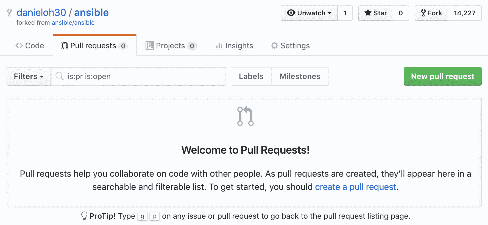

# 使用和创建模块

在整本书中，我们几乎不断地提到并使用 Ansible 模块。我们把这些模块视为“黑匣子”——也就是说，我们只是接受它们的存在，并且它们将以某种记录的方式工作。然而，关于 Ansible 的许多伟大之处之一是它是一个开源产品，因此，您不仅可以查看和修改其源代码，还可以编写自己的补充。迄今为止，已经有成千上万的模块可用于 Ansible，处理从简单的命令，如复制文件和安装软件包，到配置高度复杂和定制的网络设备。这一大量的模块已经源于使用 Ansible 解决问题的真正需求，每次发布 Ansible 时，包含的模块数量都在增加。

迟早，您会遇到一个特定的功能，它在当前的 Ansible 模块中不存在。当然，您可以尝试填补这个功能上的空白，要么编写自己的模块，要么为现有模块的增强功能做出贡献，以便其他人也能从 Ansible 项目中受益。在本章中，您将学习创建自己模块的基础知识，以及如果愿意，如何将您的代码贡献回上游的 Ansible 项目。

具体来说，在本章中，您将涵盖以下主题：

+   使用命令行执行多个模块

+   审查模块索引

+   从命令行访问模块文档

+   模块返回值

+   开发自定义模块

让我们开始吧！

# 技术要求

本章假定您已经按照第一章 *开始使用 Ansible*中详细介绍的方式设置了您的控制主机，并且正在使用最新版本——本章的示例是使用 Ansible 2.9 进行测试的。本章还假定您至少有一个额外的主机进行测试。理想情况下，这应该是基于 Linux 的。尽管本章中将给出主机名的具体示例，但您可以自由地用您自己的主机名和/或 IP 地址替换它们。如何做到这一点的详细信息将在适当的地方提供。

本章涵盖的模块开发工作假定您的计算机上存在 Python 2 或 Python 3 开发环境，并且您正在运行 Linux、FreeBSD 或 macOS。需要额外的 Python 模块时，它们的安装将被记录。构建模块文档的任务在 Python 3.5 或更高版本周围有一些非常具体的要求，因此如果您希望尝试这个任务，您将需要安装一个合适的 Python 环境。

本章的代码包在这里可用：[`github.com/PacktPublishing/Ansible-2-Cookbook/tree/master/Chapter%205`](https://github.com/PacktPublishing/Ansible-2-Cookbook/tree/master/Chapter%205)。

# 使用命令行执行多个模块

由于本章主要讨论模块以及如何创建它们，让我们回顾一下如何使用模块。我们在整本书中都做过这个，但我们并没有特别关注它们工作的一些具体细节。我们没有讨论的关键事情之一是 Ansible 引擎如何与其模块进行通信，反之亦然，所以让我们现在来探讨一下。

与以往一样，当使用 Ansible 命令时，我们需要一个清单来运行我们的命令。在本章中，由于我们的重点是模块本身，我们将使用一个非常简单和小的清单，如下所示：

```
[frontends]
frt01.example.com

[appservers]
app01.example.com
```

现在，让我们回顾的第一部分，您可以通过一个临时命令轻松运行一个模块，并使用`-m`开关告诉 Ansible 您想要运行哪个模块。因此，您可以运行的最简单的命令之一是 Ansible 的`ping`命令，如下所示：

```
$ ansible -i hosts appservers -m ping 
```

现在，我们之前没有看过的一件事是 Ansible 和它的模块之间的通信；然而，让我们来检查一下前面命令的输出：

```
$ ansible -i hosts appservers -m ping
app01.example.com | SUCCESS => {
 "ansible_facts": {
 "discovered_interpreter_python": "/usr/bin/python"
 },
 "changed": false,
 "ping": "pong"
}
```

你注意到输出的结构了吗 - 大括号、冒号和逗号？是的，Ansible 使用 JSON 格式的数据与它的模块进行通信，模块也将它们的数据以 JSON 格式返回给 Ansible。前面的输出实际上是`ping`模块通过 JSON 格式的数据结构向 Ansible 引擎返回的一个子集。

当然，我们在使用模块时不必担心这一点，可以在命令行上使用`key=value`对或在 playbooks 和 roles 中使用 YAML。因此，JSON 对我们来说是屏蔽的，但这是一个重要的事实，当我们在本章后面进入模块开发的世界时要牢记在心。

Ansible 模块就像高级编程语言中的函数一样，它们接受一组明确定义的参数作为输入，执行它们的功能，然后提供一组输出数据，这些数据也是明确定义和有文档记录的。我们稍后会更详细地看一下这一点。当然，前面的命令没有包括任何参数，所以这是通过 Ansible 最简单的模块调用。

现在，让我们运行另一个带有参数的命令，并将数据传递给模块：

```
$ ansible -i hosts appservers -m command -a "/bin/echo 'hello modules'"
```

在这种情况下，我们向命令模块提供了一个字符串作为参数，然后 Ansible 将其转换为 JSON 并传递给命令模块。当你运行这个临时命令时，你会看到类似以下的输出：

```
$  ansible -i hosts appservers -m command -a "/bin/echo 'hello modules'"
app01.example.com | CHANGED | rc=0 >>
hello modules
```

在这种情况下，输出数据似乎不是 JSON 格式的；然而，当你运行一个模块时，Ansible 打印到终端的内容只是每个模块返回的数据的一个子集 - 例如，我们命令的`CHANGED`状态和`rc=0`退出代码都以 JSON 格式的数据结构传递回 Ansible - 这只是对我们隐藏了。

这一点不需要过多强调，但设置一个上下文是很重要的。正是这个上下文将贯穿本章的始终，所以只需记住这些关键点：

+   Ansible 和它的模块之间的通信是通过 JSON 格式的数据结构完成的。

+   模块接受控制它们功能的输入数据（参数）。

+   模块总是返回数据 - 至少是模块执行的状态（例如`changed`、`ok`或`failed`）。

当然，在开始编写自己的模块之前，检查是否已经存在可以执行所有（或部分）所需功能的模块是有意义的。我们将在下一节中探讨这一点。

# 审查模块索引

正如前面的部分所讨论的，Ansible 提供了成千上万的模块，使得快速轻松地开发 playbooks 并在多个主机上运行它们。然而，当有这么多模块时，你该如何找到合适的模块呢？幸运的是，Ansible 文档提供了一个组织良好、分类清晰的模块列表，你可以查阅以找到你需要的模块 - 可以在这里找到：[`docs.ansible.com/ansible/latest/modules/modules_by_category.html`](https://docs.ansible.com/ansible/latest/modules/modules_by_category.html)。

假设你想要查看是否有一个原生的 Ansible 模块可以帮助你配置和管理你的亚马逊网络服务 S3 存储桶。这是一个相当明确、明确定义的需求，所以让我们以一种逻辑的方式来处理：

1.  首先，像之前讨论的那样，在你的网络浏览器中打开分类的模块索引：

```
https://docs.ansible.com/ansible/latest/modules/modules_by_category.html
```

1.  现在，我们知道亚马逊网络服务几乎肯定会出现在`Cloud`模块类别中，所以让我们在浏览器中打开它。

1.  在这个页面上仍然列出了数百，甚至数千个模块！所以，让我们在浏览器中使用查找功能（*Ctrl* + *F*）来查看`s3`关键字是否出现在任何地方：


我们很幸运-确实如此，并且页面下方还有几个更多的列表：


现在我们有了一个要使用的模块的简短列表-当然，有几个，所以我们仍然需要弄清楚我们的 playbook 需要哪一个（或哪些）。正如前面的简短描述所示，这将取决于您的预期任务是什么。

1.  简短的描述应该足以给您一些关于模块是否适合您的需求的线索。一旦您有了想法，您可以单击适当的文档链接查看有关模块以及如何使用它的更多详细信息：


正如您所看到的，每个模块的文档页面都提供了大量的信息，包括更长的描述。如果您向下滚动页面，您将看到可以向模块提供的可能参数列表，一些如何使用它们的实际示例，以及有关模块输出的一些详细信息。还要注意前面截图中的要求部分-一些模块，特别是与云相关的模块，在运行之前需要在 Python 2.6 或更高版本上安装额外的 Python 模块，如果您尝试在没有在 Python 2.6 或更高版本上安装`boto`，`boto3`和`botocore`模块的情况下从 playbook 运行`aws_s3`模块，您将只会收到一个错误。

所有模块必须在被接受为 Ansible 项目的一部分之前创建这样的文档，因此，如果您打算提交自己的模块，您必须牢记这一点。这也是 Ansible 流行的原因之一-具有易于维护和有良好文档的标准，它是自动化的完美社区平台。官方的 Ansible 网站并不是您可以获取文档的唯一地方，因为它甚至可以在命令行上使用。我们将在下一节中看看如何通过这种方式检索文档。

# 从命令行访问模块文档

正如前一节所讨论的，Ansible 项目以其文档为傲，并且使这些文档易于访问是项目本身的重要部分。现在，假设您正在进行 Ansible 任务（在 playbook、角色或甚至是临时命令中），并且您在只能访问您正在工作的机器的 shell 的数据中心环境中。您将如何访问 Ansible 文档？

幸运的是，我们还没有讨论的 Ansible 安装的一部分是`ansible-doc`工具，它与熟悉的`ansible`和`ansible-playbook`可执行文件一起作为标准安装。`ansible-doc`命令包括一个完整（基于文本的）文档库，其中包含您安装的 Ansible 版本附带的所有模块的文档。这意味着您需要的模块信息就在您的指尖，即使您在数据中心中并且没有工作的互联网连接！

以下是一些示例，向您展示如何与`ansible-doc`工具进行交互：

+   您可以通过简单地发出以下命令在您的 Ansible 控制机上列出所有有文档的模块：

```
**$ ansible-doc -l** 
```

您应该看到一个类似以下的输出：

```
fortios_router_community_list          Configure community lists in Fortinet's FortiOS ...
azure_rm_devtestlab_info               Get Azure DevTest Lab facts
ecs_taskdefinition                     register a task definition in ecs
avi_alertscriptconfig                  Module for setup of AlertScriptConfig Avi RESTfu...
tower_receive                          Receive assets from Ansible Tower
netapp_e_iscsi_target                  NetApp E-Series manage iSCSI target configuratio...
azure_rm_acs                           Manage an Azure Container Service(ACS) instance
fortios_log_syslogd2_filter            Filters for remote system server in Fortinet's F...
junos_rpc                              Runs an arbitrary RPC over NetConf on an Juniper...
na_elementsw_vlan                      NetApp Element Software Manage VLAN
pn_ospf                                CLI command to add/remove ospf protocol to a vRo...
pn_snmp_vacm                           CLI command to create/modify/delete snmp-vacm
cp_mgmt_service_sctp                   Manages service-sctp objects on Check Point over...
onyx_ospf                              Manage OSPF protocol on Mellanox ONYX network de.
```

有许多页面的输出，这只是向您展示有多少模块！实际上，您可以计数它们：

```
$ ansible-doc -l | wc -l
3387
```

没错- Ansible 2.9.6 附带了 3,387 个模块！

+   与以前一样，您可以使用您喜欢的 shell 工具来处理索引来搜索特定的模块；例如，您可以使用`grep`来查找所有与 S3 相关的模块，就像我们在上一节的 Web 浏览器中交互式地做的那样：

```
$ ansible-doc -l | grep s3
s3_bucket_notification                    Creates, upda...
purefb_s3user                             Create or del...
purefb_s3acc                              Create or del...
aws_s3_cors                               Manage CORS f...
s3_sync                                   Efficiently u...
s3_logging                                Manage loggin...
s3_website                                Configure an ...
s3_bucket                                 Manage S3 buc...
s3_lifecycle                              Manage s3 buc...
aws_s3_bucket_info                        Lists S3 buck...
aws_s3                                    manage object...

```

+   现在，我们可以轻松查找我们感兴趣的模块的具体文档。假设我们想了解更多关于`aws_s3`模块的信息-就像我们在网站上所做的那样，只需运行以下命令：

```
$ ansible-doc aws_s3
```

这应该产生一个类似以下的输出：

```
$ ansible-doc aws_s3 > AWS_S3 (/usr/lib/python2.7/site-packages/ansible/modules/cloud/amazon/aws_s

 This module allows the user to manage S3 buckets and the
 objects within them. Includes support for creating and
 deleting both objects and buckets, retrieving objects as files
 or strings and generating download links. This module has a
 dependency on boto3 and botocore.

 * This module is maintained by The Ansible Core Team
 * note: This module has a corresponding action plugin.

OPTIONS (= is mandatory):

- aws_access_key
 AWS access key id. If not set then the value of the
 AWS_ACCESS_KEY environment variable is used.
 (Aliases: ec2_access_key, access_key)[Default: (null)]
 type: str
....
```

虽然格式有些不同，`ansible-doc`告诉我们关于该模块的信息，提供了我们可以传递的所有参数（`OPTIONS`）的列表，当我们向下滚动时，甚至给出了一些工作示例和可能的返回值。我们将在下一节中探讨返回值的主题，因为它们对于理解非常重要，特别是当我们接近开发自己的模块的主题时。

# 模块返回值

正如我们在本章前面讨论的那样，Ansible 模块将它们的结果作为结构化数据返回，以 JSON 格式在后台格式化。在前面的例子中，你遇到了这些返回数据，既以退出代码的形式，也在我们使用`register`关键字来捕获任务结果的 Ansible 变量中。在本节中，我们将探讨如何发现 Ansible 模块的返回值，以便我们以后在 playbook 中使用它们，例如，进行条件处理（见第四章，*Playbooks and Roles*）。

由于空间有限，当涉及到返回值时，我们将选择可能是最简单的 Ansible 模块之一——`ping`模块。

话不多说，让我们使用我们在上一节学到的`ansible-doc`工具，看看它对于这个模块的返回值有什么说：

```
$ ansible-doc ping
```

如果你滚动到前面命令的输出底部，你应该会看到类似这样的内容：

```
$ ansible-doc ping
...

RETURN VALUES:

ping:
 description: value provided with the data parameter
 returned: success
 type: str
 sample: pong
```

因此，我们可以看到`ping`模块只会返回一个值，那就是`ping`。`description`告诉我们我们应该期望这个特定的返回值包含什么，而`returned`字段告诉我们它只会在`success`时返回（如果它会在其他条件下返回，这些将在这里列出）。`type`返回值是一个字符串（用`str`表示），虽然你可以通过提供给`ping`模块的参数来改变值，但默认返回值（因此`sample`）是`pong`。

现在，让我们看看实际情况。例如，这些返回值中没有任何内容告诉我们模块是否成功运行以及是否有任何更改；然而，我们知道这些是关于每个模块运行的基本信息。

让我们把一个非常简单的 playbook 放在一起。我们将使用`ping`模块而不带任何参数运行，使用`register`关键字捕获返回值，然后使用`debug`模块将返回值转储到终端上：

```
---
- name: Simple play to demonstrate a return value
  hosts: localhost

  tasks:
    - name: Perform a simple module based task
      ping:
      register: pingresult

    - name: Display the result
      debug:
        var: pingresult
```

现在，让我们看看当我们运行这个 playbook 时会发生什么：

```
$ ansible-playbook retval.yml
[WARNING]: provided hosts list is empty, only localhost is available. Note that
the implicit localhost does not match 'all'

PLAY [Simple play to demonstrate a return value] *******************************

TASK [Gathering Facts] *********************************************************
ok: [localhost]

TASK [Perform a simple module based task] **************************************
ok: [localhost]

TASK [Display the result] ******************************************************
ok: [localhost] => {
 "pingresult": {
 "changed": false,
 "failed": false,
 "ping": "pong"
 }
}

PLAY RECAP *********************************************************************
localhost : ok=3 changed=0 unreachable=0 failed=0 skipped=0 rescued=0 ignored=0
```

注意，`ping`模块确实返回一个名为`ping`的值，其中包含`pong`字符串（因为 ping 成功了）。然而，你可以看到实际上有两个额外的返回值，这些在 Ansible 文档中没有列出。这些伴随着每个任务运行，因此是隐式的 - 也就是说，你可以假设它们将是从每个模块返回的数据中的一部分。如果模块运行导致目标主机上的更改，`changed`返回值将被设置为`true`，而如果模块运行因某种原因失败，`failed`返回值将被设置为`true`。

使用`debug`模块打印模块运行的输出是一个非常有用的技巧，如果你想收集关于模块、它的工作方式以及返回的数据类型的更多信息。在这一点上，我们已经涵盖了几乎所有关于模块工作的基础知识，所以下一节，我们将开始开发我们自己的（简单）模块。

# 开发自定义模块

现在我们熟悉了模块，如何调用它们，如何解释它们的结果以及如何找到它们的文档，我们可以开始编写我们自己的简单模块。虽然这不包括许多与 Ansible 一起提供的模块的深入和复杂的功能，但希望这将为您提供足够的信息，以便在构建您自己的更复杂的模块时能够自信地继续。

一个重要的要点是，Ansible 是用 Python 编写的，因此它的模块也是用 Python 编写的。因此，您需要用 Python 编写您的模块，并且要开始开发自己的模块，您需要确保已安装 Python 和一些必要的工具。如果您已经在开发机器上运行 Ansible，您可能已经安装了所需的软件包，但如果您从头开始，您需要安装 Python、Python 软件包管理器（`pip`）和可能一些其他开发软件包。确切的过程会因操作系统而异，但以下是一些示例，供您开始：

+   在 Fedora 上，您将运行以下命令来安装所需的软件包：

```
$ sudo dnf install python python-devel
```

+   同样，在 CentOS 上，您将运行以下命令来安装所需的软件包：

```
$ sudo yum install python python-devel
```

+   在 Ubuntu 上，您将运行以下命令来安装所需的软件包：

```
$ sudo apt-get update
$ sudo apt-get install python-pip python-dev build-essential 
```

+   如果您正在 macOS 上使用 Homebrew 包管理系统，以下命令将安装您需要的软件包：

```
$ sudo brew install python
```

安装所需的软件包后，您需要将 Ansible Git 存储库克隆到本地机器，因为其中有一些有价值的脚本，我们在模块开发过程中将需要。使用以下命令将 Ansible 存储库克隆到开发机器上的当前目录：

```
$ git clone https://github.com/ansible/ansible.git
```

最后（尽管是可选的），在虚拟环境（`venv`）中开发您的 Ansible 模块是一个很好的做法，因为这意味着您需要安装的任何 Python 软件包都在这里，而不是与全局系统 Python 模块一起。以不受控制的方式为整个系统安装模块有时可能会导致兼容性问题，甚至破坏本地工具，因此虽然这不是必需的步骤，但强烈建议这样做。

为您的 Python 模块开发工作创建虚拟环境的确切命令将取决于您正在运行的操作系统以及您使用的 Python 版本。您应该参考您的 Linux 发行版的文档以获取更多信息；但是，以下命令在默认 Python 2.7.5 的 CentOS 7.7 上进行了测试，以在您刚刚从 GitHub 克隆的 Ansible 源代码目录中创建一个名为`moduledev`的虚拟环境：

```
$ cd ansible
$  python -m virtualenv moduledev
New python executable in /home/james/ansible/moduledev/bin/python
Installing setuptools, pip, wheel...done.
```

有了我们的开发环境设置好了，让我们开始编写我们的第一个模块。这个模块将非常简单，因为本书的范围超出了如何编写大量 Python 代码的深入讨论。但是，我们将编写一些可以使用 Python 库中的函数在目标机器上本地复制文件的代码。

显然，这与现有模块功能有很大的重叠，但它将作为一个很好的简洁示例，演示如何编写一个简单的 Python 程序，以便 Ansible 可以使用它作为模块。现在，让我们开始编写我们的第一个模块：

1.  在您喜欢的编辑器中，创建一个名为（例如）`remote_filecopy.py`的新文件：

```
$ vi remote_filecopy.py
```

1.  从一个 shebang 开始，表示这个模块应该用 Python 执行：

```
#!/usr/bin/python
```

1.  虽然不是强制性的，但在新模块的头部添加版权信息以及您的详细信息是一个好习惯。通过这样做，任何使用它的人都会了解他们可以使用、修改或重新分发的条款。这里给出的文本仅仅是一个例子；您应该自行调查各种适当的许可证，并确定哪种对您的模块最合适：

```
# Copyright: (c) 2018, Jesse Keating <jesse.keating@example.org>
# GNU General Public License v3.0+ (see COPYING or https://www.gnu.org/licenses/gpl-3.0.txt)
```

1.  在版权部分之后立即添加包含`metadata_version`、`status`和`supported_by`信息的 Ansible 元数据部分也是一个好习惯。请注意，`metadata_version`字段代表 Ansible 元数据版本（在撰写本文时应为`1.1`），与您的模块版本或您使用的 Ansible 版本无关。以下代码中建议的值对于刚开始使用是可以的，但如果您的模块被接受到官方的 Ansible 源代码中，它们可能会改变：

```
ANSIBLE_METADATA = {'metadata_version': '1.1',
                    'status': ['preview'],
                    'supported_by': 'community'}
```

1.  记住`ansible-doc`和 Ansible 文档网站上提供的优秀文档？所有这些都会自动生成，从你添加到这个文件的特殊部分。让我们开始通过向我们的模块添加以下代码来添加：

```
DOCUMENTATION = '''
---
module: remote_filecopy
version_added: "2.9"
short_description: Copy a file on the remote host
description:
  - The remote_copy module copies a file on the remote host from a given source to a provided destination.
options:
  source:
    description:
      - Path to a file on the source file on the remote host
    required: True
  dest:
    description:
      - Path to the destination on the remote host for the copy
    required: True
author:
- Jesse Keating (@omgjlk)
'''
```

特别注意`author`字典 - 为了通过官方 Ansible 代码库的语法检查，作者的名字应该在括号中附上他们的 GitHub ID。如果不这样做，你的模块仍然可以工作，但它将无法通过我们稍后进行的测试。

注意文档是用 YAML 格式编写的，用三个单引号括起来？列出的字段应该适用于几乎所有模块，但自然地，如果你的模块接受不同的选项，你应该指定这些选项以使其与你的模块匹配。

1.  文档中的示例也是从这个文件生成的 - 它们在`DOCUMENTATION`后面有自己特殊的文档部分，并应该提供如何使用你的模块创建任务的实际示例，如下例所示：

```
EXAMPLES = '''
   # Example from Ansible Playbooks
   - name: backup a config file
     remote_copy:
       source: /etc/herp/derp.conf
       dest: /root/herp-derp.conf.bak
'''
```

1.  你的模块返回给 Ansible 的数据也应该在自己的部分中进行文档化。我们的示例模块将返回以下值：

```
RETURN = '''
source:
  description: source file used for the copy
  returned: success
  type: str
  sample: "/path/to/file.name"
dest:
  description: destination of the copy
  returned: success
  type: str
  sample: "/path/to/destination.file"
gid:
  description: group ID of destination target
  returned: success
  type: int
  sample: 502
group:
  description: group name of destination target
  returned: success
  type: str
  sample: "users"
uid:
  description: owner ID of destination target
  returned: success
  type: int
  sample: 502
owner:
  description: owner name of destination target
  returned: success
  type: str
  sample: "fred"
mode:
  description: permissions of the destination target
  returned: success
  type: int
  sample: 0644
size:
  description: size of destination target
  returned: success
  type: int
  sample: 20
state:
  description: state of destination target
  returned: success
  type: str
  sample: "file"
'''
```

1.  我们完成文档部分后，应立即导入我们要使用的任何 Python 模块。在这里，我们将包括`shutil`模块，该模块将用于执行文件复制：

```
import shutil
```

1.  现在我们已经建立了模块头和文档，我们可以开始编写代码了。现在，你可以看到为每个单独的 Ansible 模块编写文档需要付出多少努力！我们的模块应该从定义一个`main`函数开始，在这个函数中，我们将创建一个`AnsibleModule`类型的对象，并使用一个`argument_spec`字典来获取模块调用时的选项：

```
 def main():
       module = AnsibleModule(
           argument_spec = dict(
               source=dict(required=True, type='str'),
               dest=dict(required=True, type='str')
           ) 
       )
```

1.  在这个阶段，我们已经拥有了编写模块功能代码所需的一切 - 甚至包括它被调用时的选项。因此，我们可以使用 Python 的`shutil`模块来执行本地文件复制，基于提供的参数：

```
       shutil.copy(module.params['source'],
                   module.params['dest'])
```

1.  在这一点上，我们已经执行了我们的模块旨在完成的任务。然而，可以说我们还没有完成 - 我们需要清理地退出模块，并向 Ansible 提供我们的返回值。通常，在这一点上，你会编写一些条件逻辑来检测模块是否成功以及它是否实际上对目标主机进行了更改。然而，为简单起见，我们将简单地每次以`changed`状态退出 - 扩展这个逻辑并使返回状态更有意义留给你作为练习：

```
      module.exit_json(changed=True)
```

`module.exit_json`方法来自我们之前创建的`AnsibleModule` - 记住，我们说过重要的是知道数据是如何使用 JSON 来回传递的！

1.  在我们接近模块代码的结尾时，我们现在必须告诉 Python 它可以从哪里导入`AnsibleModule`对象。可以通过以下代码行来完成：

```
   from ansible.module_utils.basic import *
```

1.  现在是模块的最后两行代码 - 这是我们告诉模块在启动时应该运行`main`函数的地方：

```
   if __name__ == '__main__':
       main()
```

就是这样 - 通过一系列良好记录的步骤，你可以用 Python 编写自己的 Ansible 模块。下一步当然是测试它，在我们实际在 Ansible 中测试之前，让我们看看是否可以在 shell 中手动运行它。当然，为了让模块认为它是在 Ansible 中运行，我们必须以 JSON 格式生成一些参数。创建一个文件，包含以下内容以提供参数：

```
{
 "ANSIBLE_MODULE_ARGS": {
 "source": "/tmp/foo",
        "dest": "/tmp/bar"
    }
} 
```

有了这个小小的 JSON 片段，你可以直接用 Python 执行你的模块。如果你还没有这样做，你需要按照以下方式设置你的 Ansible 开发环境。请注意，我们还手动创建了源文件`/tmp/foo`，这样我们的模块就可以真正执行文件复制了：

```
$ touch /tmp/foo
$ . moduledev/bin/activate
(moduledev) $ . hacking/env-setup
running egg_info
creating lib/ansible_base.egg-info
writing requirements to lib/ansible_base.egg-info/requires.txt
writing lib/ansible_base.egg-info/PKG-INFO
writing top-level names to lib/ansible_base.egg-info/top_level.txt
writing dependency_links to lib/ansible_base.egg-info/dependency_links.txt
writing manifest file 'lib/ansible_base.egg-info/SOURCES.txt'
reading manifest file 'lib/ansible_base.egg-info/SOURCES.txt'
reading manifest template 'MANIFEST.in'
warning: no files found matching 'SYMLINK_CACHE.json'
warning: no previously-included files found matching 'docs/docsite/rst_warnings'
warning: no previously-included files matching '*' found under directory 'docs/docsite/_build'
warning: no previously-included files matching '*.pyc' found under directory 'docs/docsite/_extensions'
warning: no previously-included files matching '*.pyo' found under directory 'docs/docsite/_extensions'
warning: no files found matching '*.ps1' under directory 'lib/ansible/modules/windows'
warning: no files found matching '*.psm1' under directory 'test/support'
writing manifest file 'lib/ansible_base.egg-info/SOURCES.txt'

Setting up Ansible to run out of checkout...

PATH=/home/james/ansible/bin:/home/james/ansible/moduledev/bin:/usr/local/sbin:/usr/local/bin:/usr/sbin:/usr/bin:/home/james/bin
PYTHONPATH=/home/james/ansible/lib
MANPATH=/home/james/ansible/docs/man:/usr/local/share/man:/usr/share/man

Remember, you may wish to specify your host file with -i

Done!
```

现在，你终于可以第一次运行你的模块了。你可以按照以下步骤进行：

```
(moduledev) $ python remote_filecopy.py args.json
{"invocation": {"module_args": {"dest": "/tmp/bar", "source": "/tmp/foo"}}, "changed": true}

(moduledev) $ ls -l /tmp/bar
-rw-r--r-- 1 root root 0 Apr 16 16:24 /tmp/bar
```

成功！你的模块有效 - 它既接收又生成 JSON 数据，正如我们在本章前面讨论的那样。当然，你还有很多东西要添加到你的模块 - 我们还没有处理模块的`failed`或`ok`返回，也不支持检查模式。然而，我们已经有了一个良好的开端，如果你想了解更多关于 Ansible 模块和丰富功能的内容，你可以在这里找到更多详细信息：[`docs.ansible.com/ansible/latest/dev_guide/developing_modules_general.html`](https://docs.ansible.com/ansible/latest/dev_guide/developing_modules_general.html)。

当涉及测试你的模块时，创建一个 JSON 文件中的参数并不直观，尽管，正如我们所见，它确实运行良好。幸运的是，我们可以很容易地在 playbook 中运行我们的 Ansible 模块！默认情况下，Ansible 将检查 playbook 目录是否有一个名为`library/`的子目录，并将从这里运行引用的模块。因此，我们可以创建以下内容：

```
$ cd ~
$ mkdir testplaybook
$ cd testplaybook
$ mkdir library
$ cp ~/ansible/moduledev/remote_filecopy.py library/
```

现在，在这个 playbook 目录中创建一个简单的清单文件，就像我们之前做的那样，并添加一个带有以下内容的 playbook：

```
---
- name: Playbook to test custom module
  hosts: all

  tasks:
    - name: Test the custom module
      remote_filecopy:
        source: /tmp/foo
        dest: /tmp/bar
      register: testresult

    - name: Print the test result data
      debug:
        var: testresult
```

为了清晰起见，你的最终目录结构应该如下所示：

```
testplaybook
├── hosts
├── library
│   └── remote_filecopy.py
└── testplaybook.yml
```

现在，尝试以通常的方式运行 playbook，看看会发生什么：

```
$ ansible-playbook -i hosts testplaybook.yml

PLAY [Playbook to test custom module] ******************************************

TASK [Gathering Facts] *********************************************************
ok: [frt01.example.com]
ok: [app01.example.com]

TASK [Test the custom module] **************************************************
changed: [app01.example.com]
changed: [frt01.example.com]

TASK [Print the test result data] **********************************************
ok: [app01.example.com] => {
 "testresult": {
 "changed": true,
 "failed": false
 }
}
ok: [frt01.example.com] => {
 "testresult": {
 "changed": true,
 "failed": false
 }
}

PLAY RECAP *********************************************************************
app01.example.com : ok=3 changed=1 unreachable=0 failed=0 skipped=0 rescued=0 ignored=0
frt01.example.com : ok=3 changed=1 unreachable=0 failed=0 skipped=0 rescued=0 ignored=0
```

成功！你不仅在本地测试了你的 Python 代码，而且还成功地在 Ansible playbook 中的两台远程服务器上运行了它。这真的很容易，这证明了扩展你的 Ansible 模块以满足你自己的定制需求是多么简单。

尽管成功运行了这段代码，但我们还没有检查文档，也没有从 Ansible 中测试它的操作。在我们更详细地解决这些问题之前，在下一节中，我们将看看模块开发的一些常见陷阱以及如何避免它们。

# 避免常见陷阱

你的模块必须经过深思熟虑，并且要优雅地处理错误条件 - 有一天人们将依赖于你的模块来自动化可能在成千上万台服务器上执行的任务，所以他们最不想做的就是花费大量时间调试错误，尤其是那些本来可以被捕获或优雅处理的琐碎错误。在本节中，我们将具体看看错误处理和如何做到这一点，以便 playbook 仍然可以正常运行并优雅退出。

在我们开始之前，一个总体的指导是，就像文档在 Ansible 中受到高度关注一样，你的错误消息也应该如此。它们应该是有意义的，易于解释，你应该避免无意义的字符串，比如`Error!`。

所以，现在，如果我们删除我们试图复制的源文件，然后用相同的参数重新运行我们的模块，我认为你会同意输出既不漂亮也不有意义，除非你碰巧是一个经验丰富的 Python 开发者：

```
(moduledev) $ rm -f /tmp/foo
(moduledev) $ python remote_filecopy.py args.json
Traceback (most recent call last):
 File "remote_filecopy.py", line 99, in <module>
 main()
 File "remote_filecopy.py", line 93, in main
 module.params['dest'])
 File "/usr/lib64/python2.7/shutil.py", line 119, in copy
 copyfile(src, dst)
 File "/usr/lib64/python2.7/shutil.py", line 82, in copyfile
 with open(src, 'rb') as fsrc:
IOError: [Errno 2] No such file or directory: '/tmp/foo'
```

我们毫无疑问可以做得更好。让我们复制一份我们的模块，并向其中添加一些代码。首先，用以下代码替换`shutil.copy`行：

```
    try:
       shutil.copy(module.params['source'], module.params['dest'])
    except:
       module.fail_json(msg="Failed to copy file")
```

这是 Python 中一些非常基本的异常处理，但它允许代码尝试`shutil.copy`任务。但是，如果这失败并引发了异常，我们不会使用回溯退出，而是使用`module.fail_json`调用干净地退出。这将告诉 Ansible 模块失败，并干净地发送 JSON 格式的错误消息回去。当然，我们可以做很多事情来改进错误消息；例如，我们可以从`shutil`模块获取确切的错误消息并将其传递回 Ansible，但是这又留给您来完成。

现在，当我们尝试使用不存在的源文件运行模块时，我们将看到以下清晰格式的 JSON 输出：

```
(moduledev) $ rm -f /tmp/foo
(moduledev) $ python better_remote_filecopy.py args.json

{"msg": "Failed to copy file", "failed": true, "invocation": {"module_args": {"dest": "/tmp/bar", "source": "/tmp/foo"}}}
```

然而，如果复制成功，模块仍然以与以前相同的方式工作：

```
(moduledev) $ touch /tmp/foo
(moduledev) $ python better_remote_filecopy.py args.json

{"invocation": {"module_args": {"dest": "/tmp/bar", "source": "/tmp/foo"}}, "changed": true}
```

通过对我们的代码进行这个简单的更改，我们现在可以干净而优雅地处理文件复制操作的失败，并向用户报告一些更有意义的内容，而不是使用回溯。在您的模块中进行异常处理和处理的一些建议如下：

+   快速失败-在出现错误后不要尝试继续处理。

+   使用各种模块 JSON 返回函数返回最有意义的可能错误消息。

+   如果有任何方法可以避免返回回溯，请不要返回回溯。

+   尝试使错误在模块和其功能的上下文中更有意义（例如，对于我们的模块，`文件复制错误`比`文件错误`更有意义-我认为您很容易想出更好的错误消息）。

+   不要用错误轰炸用户；相反，尝试专注于报告最有意义的错误，特别是当您的模块代码很复杂时。

这完成了我们对 Ansible 模块中错误处理的简要而实用的介绍。在下一节中，我们将回到我们在模块中包含的文档，包括如何将其构建为 HTML 文档，以便它可以放在 Ansible 网站上（如果您的模块被接受为 Ansible 源代码的一部分，这正是 Web 文档将如何生成）。

# 测试和记录您的模块

我们已经在本章前面讨论过，已经为我们的模块做了大量的文档工作。但是，我们如何查看它，以及如何检查它是否正确编译为 HTML，如果它被接受为 Ansible 源代码的一部分，它将放在 Ansible 网站上？

在我们实际查看文档之前，我们应该使用一个名为`ansible-test`的工具，这个工具是在 2.9 版本中新增的。这个工具可以对我们的模块代码进行健全性检查，以确保我们的文档符合 Ansible 项目团队所需的所有标准，并且代码结构正确（例如，Python 的`import`语句应该始终放在文档块之后）。让我们开始吧：

1.  要运行健全性测试，假设您已经克隆了官方存储库，请切换到此目录并设置您的环境。请注意，如果您的标准 Python 二进制文件不是 Python 3，`ansible-test`工具将无法运行，因此您应确保已安装 Python 3，并在必要时设置虚拟环境以确保您正在使用 Python 3。可以按照以下步骤完成：

```
$ cd ansible$ python 3 -m venv venv
$ . venv/bin/activate
(venv) $ source hacking/env-setup
running egg_info
creating lib/ansible.egg-info
writing lib/ansible.egg-info/PKG-INFO
writing dependency_links to lib/ansible.egg-info/dependency_links.txt
writing requirements to lib/ansible.egg-info/requires.txt
writing top-level names to lib/ansible.egg-info/top_level.txt
writing manifest file 'lib/ansible.egg-info/SOURCES.txt'
reading manifest file 'lib/ansible.egg-info/SOURCES.txt'
reading manifest template 'MANIFEST.in'
warning: no files found matching 'SYMLINK_CACHE.json'
writing manifest file 'lib/ansible.egg-info/SOURCES.txt'

Setting up Ansible to run out of checkout...

PATH=/home/james/ansible/bin:/home/james/ansible/venv/bin:/usr/local/sbin:/usr/local/bin:/usr/sbin:/usr/bin:/home/james/bin
PYTHONPATH=/home/james/ansible/lib
MANPATH=/home/james/ansible/docs/man:/usr/local/share/man:/usr/share/man

Remember, you may wish to specify your host file with -i

Done!
```

1.  接下来，使用`pip`安装 Python 要求，以便您可以运行`ansible-test`工具：

```
(venv) $ pip install -r test/runner/requirements/sanity.txt
```

1.  现在，只要您已将模块代码复制到源树中的适当位置（此处显示了一个示例复制命令），您可以按以下方式运行健全性测试：

```
(venv) $ cp ~/moduledev/remote_filecopy.py ./lib/ansible/modules/files/
(venv) $ ansible-test sanity --test validate-modules remote_filecopy
Sanity check using validate-modules
WARNING: Cannot perform module comparison against the base branch. Base branch not detected when running locally.
WARNING: Reviewing previous 1 warning(s):
WARNING: Cannot perform module comparison against the base branch. Base branch not detected when running locally.
```

从前面的输出中，您可以看到除了一个警告与我们没有基本分支进行比较之外，我们在本章前面开发的模块代码已经通过了所有测试。如果您对文档有问题（例如，作者名称格式不正确），这将被视为错误。

现在我们已经通过了`ansible-test`的检查，让我们看看使用`ansible-doc`命令文档是否正确。这很容易做到。首先，退出你的虚拟环境，如果你还在其中，然后切换到你之前从 GitHub 克隆的 Ansible 源代码目录。现在，你可以手动告诉`ansible-doc`在哪里查找模块，而不是默认路径。这意味着你可以运行以下命令：

```
$ cd ~/ansible
$ ansible-doc -M moduledev/ remote_filecopy
```

你应该看到我们之前创建的文档的文本呈现 - 这里显示了第一页的示例，以便让你了解它应该是什么样子：

```
> REMOTE_FILECOPY (/home/james/ansible/moduledev/remote_filecopy.py)

 The remote_copy module copies a file on the remote host from a
 given source to a provided destination.

 * This module is maintained by The Ansible Community
OPTIONS (= is mandatory):

= dest
 Path to the destination on the remote host for the copy

= source
 Path to a file on the source file on the remote host

```

太好了！所以，我们已经可以使用`ansible-doc`访问我们的模块文档，并确保它在文本模式下呈现正确。但是，我们如何构建 HTML 版本呢？幸运的是，这方面有一个明确定义的过程，我们将在这里概述：

1.  在`lib/ansible/modules/`下，你会发现一系列分类的目录，模块被放置在其中 - 我们的最适合放在`files`类别下，所以将其复制到这个位置，为即将到来的构建过程做准备：

```
$ cp moduledev/remote_filecopy.py lib/ansible/modules/files/
```

1.  作为文档创建过程的下一步，切换到`docs/docsite/`目录：

```
$ cd docs/docsite/
```

1.  构建一个基于文档的 Python 文件。使用以下命令来完成：

```
$ MODULES=hello_module make webdocs
```

现在，理论上，制作 Ansible 文档应该是这么简单的；然而，不幸的是，在写作时，Ansible v2.9.6 的源代码拒绝构建`webdocs`。随着时间的推移，这无疑会得到修复，因为在写作时，文档构建脚本正在迁移到 Python 3。为了让`make webdocs`命令运行，我不得不将 Ansible v2.8.10 的源代码克隆为起点。

即使在这个环境中，在 CentOS 7 上，`make webdocs`命令也会失败，除非你有一些非常特定的 Python 3 要求。这些要求没有很好地记录，但从测试中，我可以告诉你，Sphinx v2.4.4 可以工作。CentOS 7 提供的版本太旧并且失败，而 Python 模块仓库提供的最新版本（写作时为 v3.0.1）与构建过程不兼容并且失败。

一旦我从 Ansible v2.8.10 源代码树开始工作，我必须确保我已经从我的 Python 3 环境中删除了任何现有的`sphinx`模块（你需要 Python 3.5 或更高版本才能在本地构建文档 - 如果你的节点上没有安装这个，请在继续之前安装）然后运行以下命令：

```
$ pip3 uninstall sphinx
$ pip3 install sphinx==2.4.4
$ pip3 install sphinx-notfound-page
```

有了这个，你就可以成功地运行`make webdocs`来构建你的文档。你会看到很多输出。一个成功的运行应该以类似于这里显示的输出结束：

```
generating indices... genindex py-modindexdone
writing additional pages... search/home/james/ansible/docs/docsite/_themes/sphinx_rtd_theme/search.html:21: RemovedInSphinx30Warning: To modify script_files in the theme is deprecated. Please insert a <script> tag directly in your theme instead.
 
 opensearchdone
copying images... [100%] dev_guide/style_guide/images/thenvsthan.jpg
copying downloadable files... [ 50%] network/getting_started/sample_files/first_copying downloadable files... [100%] network/getting_started/sample_files/first_playbook_ext.yml
copying static files... ... done
copying extra files... done
dumping search index in English (code: en)... done
dumping object inventory... done
build succeeded, 35 warnings.

The HTML pages are in _build/html.
make[1]: Leaving directory `/home/james/ansible/docs/docsite'
```

现在，请注意，在这个过程结束时，`make`命令告诉我们在哪里查找编译好的文档。如果你在这里查找，你会找到以下内容：

```
$ find /home/james/ansible/docs/docsite -name remote_filecopy*
/home/james/ansible/docs/docsite/rst/modules/remote_filecopy_module.rst
/home/james/ansible/docs/docsite/_build/html/modules/remote_filecopy_module.html
/home/james/ansible/docs/docsite/_build/doctrees/modules/remote_filecopy_module.doctree
```

尝试在你的网页浏览器中打开 HTML 文件 - 你应该看到页面的呈现就像官方 Ansible 项目文档中的一个页面！这使你能够检查你的文档是否构建正确，并且在将要查看的上下文中看起来和读起来都很好。这也让你有信心，当你提交你的代码到 Ansible 项目时（如果你这样做的话），你提交的是符合 Ansible 文档质量标准的东西。

有关在本地构建文档的更多信息，请参阅这里：[`docs.ansible.com/ansible/latest/community/documentation_contributions.html#building-the-documentation-locally`](https://docs.ansible.com/ansible/latest/community/documentation_contributions.html#building-the-documentation-locally)。虽然这是一个很好的文档，但它目前并没有反映出围绕 Sphinx 的兼容性问题，也没有反映出关于 Ansible 2.9 的构建问题。然而，希望它会给你所有其他你需要开始你的文档的指针。

目前构建文档的过程在支持的环境方面有些麻烦；但是，希望这是一些将来会解决的问题。与此同时，本节中概述的过程已经为您提供了一个经过测试和可行的起点。

# 模块清单

除了我们迄今为止涵盖的指针和良好的实践之外，在您的模块代码中还有一些事项，您应该遵循，以便产生一个被认为是符合 Ansible 潜在包含标准的东西。以下清单并不详尽，但会给您一个关于您作为模块开发人员应该遵循的实践的良好想法：

+   尽可能多地测试您的模块，无论是在成功的情况下还是在导致错误的情况下。您可以使用 JSON 数据进行测试，就像我们在本章中所做的那样，或者在测试 playbook 中使用它们。

+   尽量将您的 Python 要求保持在最低限度。有时，可能无法避免需要额外的 Python 依赖（例如 AWS 特定模块的`boto`要求），但一般来说，您使用的越少越好。

+   不要为您的模块缓存数据 - Ansible 在不同主机上的执行策略意味着您不太可能从中获得良好的结果。期望在每次运行时收集您需要的所有数据。

+   模块应该是一个单独的 Python 文件 - 它们不应该分布在多个文件中。

+   确保在提交模块代码时调查并运行 Ansible 集成测试。有关这些测试的更多信息，请参阅：[`docs.ansible.com/ansible/latest/dev_guide/testing_integration.html`](https://docs.ansible.com/ansible/latest/dev_guide/testing_integration.html)。

+   确保在模块代码的适当位置包含异常处理，就像我们在本章中所做的那样，以防止出现问题。

+   在 Windows 模块中不要使用`PSCustomObjects`，除非您绝对无法避免它。

凭借您从本章中获得的信息，您应该有开始创建自己的模块所需的一切。您可能决定不将它们提交到 Ansible 项目，并且确实没有这样的要求。但是，即使您不这样做，遵循本章中概述的实践将确保您构建一个高质量的模块，无论其预期的受众是谁。最后，基于您确实希望将源代码提交到 Ansible 项目的前提，在接下来的部分中，我们将看看如何通过向 Ansible 项目提交拉取请求来实现这一点。

# 向上游贡献 - 提交 GitHub 拉取请求

当您努力工作在您的模块上并彻底测试和记录它之后，您可能会觉得是时候将其提交到 Ansible 项目以供包含了。这意味着在官方的 Ansible 存储库上创建一个拉取请求。虽然在 GitHub 上的操作细节超出了本书的范围，但我们将为您提供一个基本程序的实际焦点概述。

遵循此处概述的过程将在 GitHub 上为 Ansible 项目生成一个真实的请求，以便您提交的代码可以与他们的代码合并。*除非*您真的有一个准备提交到 Ansible 代码库的新模块，否则*不要*遵循此过程。

要将您的模块作为 Ansible 存储库的拉取请求提交，您需要 fork 官方 Ansible 存储库的`devel`分支。要做到这一点，请从您的 Web 浏览器登录到您的 GitHub 帐户（或者如果您还没有帐户，则创建一个帐户），然后导航到以下截图中显示的 URL。点击右上角的 Fork。作为提醒，官方 Ansible 源代码存储库的 URL 是[`github.com/ansible/ansible.git`](https://github.com/ansible/ansible.git)：


现在您已经将存储库分叉到您自己的账户，我们将演示您需要运行的命令，以将您的模块代码添加到其中。然后，我们将向您展示如何创建所需的**拉取请求**（也称为**PRs**），以便您可以将您的新模块与上游的 Ansible 项目合并：

1.  克隆您刚刚分叉到本地机器的`devel`分支。使用类似以下的命令，但确保用与您自己 GitHub 账户匹配的 URL 替换它：

```
$ git clone https://github.com/danieloh30/ansible.git
```

1.  将您的模块代码复制到适当的模块目录中-以下代码中给出的`copy`命令只是一个示例，让您知道该怎么做，但实际上，您应该选择适当的类别子目录来放置您的模块，因为它不一定适合`files`类别。添加完 Python 文件后，执行`git add`使 Git 知道新文件，然后用有意义的提交消息提交它。一些示例命令如下：

```
$ cd ansible
$ cp ~/ansible-development/moduledev/remote_filecopy.py ./lib/ansible/modules/files/
$ git add lib/ansible/modules/files/remote_filecopy.py
$ git commit -m 'Added tested version of remote_filecopy.py for pull request creation'
```

1.  现在，确保使用以下命令将代码推送到您分叉的存储库：

```
$ git push
```

1.  返回到 GitHub 网页浏览器，并导航到拉取请求页面，如下所示。点击“New pull request”按钮：



按照 GitHub 网站的指导，跟随拉取请求创建过程。一旦您成功提交了拉取请求，您应该能够导航到官方 Ansible 源代码存储库的拉取请求列表，并在那里找到您的拉取请求。拉取请求列表的示例如下：


当截图被拍摄时，几乎有 31,000 个关闭的拉取请求和将近 1,700 个待审核的！当您阅读本书时，肯定会有更多，这表明 Ansible 在持续发展和增长中非常依赖开源社区。想一想-你也可以成为其中的一部分！如果您的拉取请求被审查需要很长时间，不要惊慌-这只是因为有很多拉取请求需要审查和处理。您可以像我们之前演示的那样，将模块代码添加到本地的`library/`目录中，以便您的拉取请求被处理的速度不会妨碍您使用 Ansible 的工作。有关在本地工作时放置插件代码的更多详细信息可以在这里找到：[`docs.ansible.com/ansible/latest/dev_guide/developing_locally.html`](https://docs.ansible.com/ansible/latest/dev_guide/developing_locally.html)。

除了为自定义模块创建拉取请求之外，还有许多其他贡献到 Ansible 项目的方式。以下是一些其他贡献项目的示例：

+   审查 Ansible 文档并报告您发现的任何错误（在第四章的创建中已经提交了一个）

+   创建一个本地的 Ansible MeetUp 来传播关于 Ansible 的知识。如果你的地区已经有了这样的聚会，考虑定期参加。

+   通过社交媒体传播关于 Ansible 的知识和意识，使用适当的账户引用和标签；例如，`@ansible`，`#ansible`等。

这完成了我们学习如何创建模块的旅程，从最初研究模块操作的理论步骤，一直到将您的新模块代码贡献给 GitHub 上官方的 Ansible 项目。我们希望您发现这段旅程有益和有价值，并且增强了您使用 Ansible 并在需要时扩展其功能的能力。

# 总结

模块是 Ansible 的生命线——没有它们，Ansible 无法在各种系统上执行如此复杂和多样的任务。由于是开源项目，通过一点 Python 知识，您可以轻松扩展 Ansible 的功能。在本章中，我们探讨了如何从头开始编写自定义模块。截至目前，Ansible 非常丰富多功能，但这种易于定制和扩展的特性使得 Ansible 在潜力方面几乎没有限制，尤其是考虑到 Python 作为一种编程语言的强大和流行。

在本章中，我们从回顾如何使用命令行执行多个模块开始。然后，我们探讨了询问当前模块索引的过程，以及如何获取模块文档来评估其是否适合我们的需求，无论我们是否有活动的互联网连接。然后，我们探讨了模块数据及其 JSON 格式，最后通过一个简单的自定义模块的编码过程，带您进行了一次旅程。这为您提供了在未来创建自己的模块的基础，如果您愿意的话。

在下一章中，我们将探讨使用和创建另一个核心的 Ansible 功能，即插件的过程。

# 发现插件类型

Ansible 的代码一直被设计为模块化的——这是它的核心优势之一。无论是通过使用模块执行任务还是通过插件（我们将很快看到），Ansible 的模块化设计使其能够像本书中展示的那样多才多艺和强大。与模块一样，Ansible 插件都是用 Python 编写的，并且期望以一定的格式摄取和返回数据（稍后会详细介绍）。Ansible 的插件在功能上通常是不可见的，因为您在命令或 playbook 中很少直接调用它们，但它们负责提供 Ansible 提供的一些最重要的功能，包括 SSH 连接、解析清单文件（INI 格式、YAML 或其他格式）以及在数据上运行`jinja2`过滤器的能力。

像往常一样，在继续之前，让我们验证一下您的测试机上是否安装了合适的 Ansible 版本：

```
$  ansible-doc --version
ansible-doc 2.9.6
 config file = /etc/ansible/ansible.cfg
 configured module search path = [u'/root/.ansible/plugins/modules', u'/usr/share/ansible/plugins/modules']
 ansible python module location = /usr/lib/python2.7/site-packages/ansible
 executable location = /usr/bin/ansible-doc
 python version = 2.7.5 (default, Aug 7 2019, 00:51:29) [GCC 4.8.5 20150623 (Red Hat 4.8.5-39)]
```

插件的文档工作与模块的文档工作一样多，您会很高兴地知道，有一个插件索引可在[`docs.ansible.com/ansible/latest/plugins/plugins.html`](https://docs.ansible.com/ansible/latest/plugins/plugins.html)上找到。

您也可以像之前一样使用`ansible-doc`命令，只是您需要添加`-t`开关。插件总是放在适当的类别中，因为它们在类别之间的功能差异很大。如果您没有使用`-t`开关，您最终会指定`ansible-doc -t`模块，它会返回可用模块的列表。

截至目前，Ansible 中可以找到以下插件类别：

+   `become`: 负责使 Ansible 能够获得超级用户访问权限（例如，通过`sudo`）

+   `cache`: 负责缓存从后端系统检索的事实，以提高自动化性能

+   `callback`: 允许您在响应事件时添加新的行为，例如更改 Ansible playbook 运行输出中数据的格式

+   `cliconf`: 提供了对各种网络设备命令行界面的抽象，为 Ansible 提供了一个标准的操作接口

+   `connection`: 提供了从 Ansible 到远程系统的连接（例如，通过 SSH、WinRM、Docker 等）

+   `httpapi`: 告诉 Ansible 如何与远程系统的 API 交互（例如，用于 Fortinet 防火墙）

+   `inventory`: 提供了解析各种静态和动态清单格式的能力

+   `lookup`：允许 Ansible 从外部来源查找数据（例如，通过读取一个平面文本文件）

+   `netconf`：为 Ansible 提供抽象，使其能够与启用 NETCONF 的网络设备一起工作

+   `shell`：提供 Ansible 在不同系统上使用各种 shell 的能力（例如，在 Windows 上使用`powershell`，在 Linux 上使用`sh`）

+   `strategy`：为 Ansible 提供不同的执行策略插件（例如，我们在第四章中看到的调试策略，*Playbooks and Roles*）

+   `vars`：提供 Ansible 从某些来源获取变量的能力，例如我们在第三章中探讨的`host_vars`和`group_vars`目录，*定义您的清单*）

我们将把在 Ansible 网站上探索插件文档作为您完成的练习留给您。但是，如果您想使用`ansible-doc`工具来探索各种插件，您需要运行以下命令：

1.  要使用`ansible-doc`命令列出给定类别中可用的所有插件，可以运行以下命令：

```
$ ansible-doc -t connection -l
```

这将返回连接插件的文本索引，类似于我们在查看模块文档时看到的内容。索引输出的前几行如下所示：

```
kubectl           Execute tasks in pods running on Kubernetes
napalm            Provides persistent connection using NAPALM
qubes             Interact with an existing QubesOS AppVM
libvirt_lxc       Run tasks in lxc containers via libvirt
funcd             Use funcd to connect to target
chroot            Interact with local chroot
psrp              Run tasks over Microsoft PowerShell Remoting Protocol
zone              Run tasks in a zone instance
winrm             Run tasks over Microsoft's WinRM
paramiko_ssh      Run tasks via python ssh (paramiko)
```

1.  然后，您可以探索给定插件的文档。例如，如果我们想了解`paramiko_ssh`插件，我们可以发出以下命令：

```
**$ ansible-doc -t connection paramiko_ssh**
```

您会发现插件文档采用非常熟悉的格式，与我们在第五章中看到的模块的格式类似。

```
> PARAMIKO (/usr/lib/python2.7/site-packages/ansible/plugins/connection/param

 Use the python ssh implementation (Paramiko) to connect to
 targets The paramiko transport is provided because many
 distributions, in particular EL6 and before do not support
 ControlPersist in their SSH implementations. This is needed on
 the Ansible control machine to be reasonably efficient with
 connections. Thus paramiko is faster for most users on these
 platforms. Users with ControlPersist capability can consider
 using -c ssh or configuring the transport in the configuration
 file. This plugin also borrows a lot of settings from the ssh
 plugin as they both cover the same protocol.

 * This module is maintained by The Ansible Community
OPTIONS (= is mandatory):

- host_key_auto_add
 TODO: write it
 [Default: (null)]
 set_via:
 env:
 - name: ANSIBLE_PARAMIKO_HOST_KEY_AUTO_ADD
 ini:
 - key: host_key_auto_add
```

由于 Ansible 各个领域的所有工作和努力，您可以轻松地了解包含在 Ansible 中的插件以及如何使用它们。到目前为止，我们已经看到，插件的文档与模块的文档一样完整。在本章的下一节中，我们将更深入地了解如何找到与您的 Ansible 发行版配套的插件代码。

# 问题

1.  哪个命令行可以作为参数传递给模块？

A) `ansible dbservers -m command "/bin/echo 'hello modules'"`

B) `ansible dbservers -m command -d "/bin/echo 'hello modules'"`

C) `ansible dbservers -z command -a "/bin/echo 'hello modules'"`

D) `ansible dbservers -m command -a "/bin/echo 'hello modules'"`

E) `ansible dbservers -a "/bin/echo 'hello modules'"`

1.  在创建自定义模块并处理异常时，以下哪种做法是不推荐的？

A) 设计一个简单的自定义模块，如果可以避免的话，不要向用户提供回溯。

B) 快速失败您的模块代码，并验证您是否提供了有用和可理解的异常消息。

C) 仅显示与最相关的异常相关的错误消息，而不是所有可能的错误。

D) 确保您的模块文档是相关的并且易于理解。

E) 删除导致错误的 playbook，然后从头开始重新创建它们。

1.  正确或错误：要为 Ansible 上游项目做出贡献，您需要将代码提交到`devel`分支。

A) True

B) False

# 进一步阅读

+   有关 Ansible 模块的常见返回值的文档可以在这里找到：[`docs.ansible.com/ansible/latest/reference_appendices/common_return_values.html#common`](https://docs.ansible.com/ansible/latest/reference_appendices/common_return_values.html#common)。

+   查看以下文档，了解您可以在 Windows 机器上使用的所有现有模块：[`docs.ansible.com/ansible/latest/modules/list_of_windows_modules.html#windows-modules`](https://docs.ansible.com/ansible/latest/modules/list_of_windows_modules.html#windows-modules)。

+   一些主要的模块索引以及它们的分类可以在以下链接找到：

+   云模块: [`docs.ansible.com/ansible/latest/modules/list_of_cloud_modules.html`](https://docs.ansible.com/ansible/latest/modules/list_of_cloud_modules.html)

+   集群模块: [`docs.ansible.com/ansible/latest/modules/list_of_clustering_modules.html`](https://docs.ansible.com/ansible/latest/modules/list_of_clustering_modules.html)

+   命令模块: [`docs.ansible.com/ansible/latest/modules/list_of_commands_modules.html`](https://docs.ansible.com/ansible/latest/modules/list_of_commands_modules.html)

+   加密模块: [`docs.ansible.com/ansible/latest/modules/list_of_crypto_modules.html`](https://docs.ansible.com/ansible/latest/modules/list_of_crypto_modules.html)

+   数据库模块: [`docs.ansible.com/ansible/latest/modules/list_of_database_modules.html`](https://docs.ansible.com/ansible/latest/modules/list_of_database_modules.html)

+   身份模块: [`docs.ansible.com/ansible/latest/modules/list_of_identity_modules.html`](https://docs.ansible.com/ansible/latest/modules/list_of_identity_modules.html)

+   所有模块: [`docs.ansible.com/ansible/latest/modules/list_of_all_modules.html`](https://docs.ansible.com/ansible/latest/modules/list_of_all_modules.html)
